# Building Your Own Programming Language: A Complete Guide
### From Zero to a Fully Functional Compiled Language — The Astra Programming Language

> **"Any sufficiently advanced technology is indistinguishable from magic. This guide will remove the magic — and replace it with understanding."**

---

## What You Are Building

By the end of this guide, you will have built **Astra** — a real, fully compiled programming language that:

- **Compiles to native machine code** — not interpreted, not a VM (well, until we use LLVM)
- **Has a proper type system** — catch bugs at compile time, not at 3 AM in production
- **Has a standard library** — `string`, `math`, `json`, `file`, `http`, `time`
- **Can build HTTP web servers** — yes, a real web server, in a language you wrote
- **Has a package manager** — `astra install` just like `npm install` or `go get`
- **Has a real CLI compiler** — `astrac build main.as` → `./main`

### What Astra Looks Like

```astra
// hello.as — your first Astra program
fn main() {
    print("Hello from Astra!")

    let name = "World"
    let age = 25

    if age >= 18 {
        print("Hello, " + name + "! You are an adult.")
    }

    for i in 0..5 {
        print("Count: " + i.to_string())
    }
}
```

```bash
astrac build hello.as
./hello
# Hello from Astra!
# Hello, World! You are an adult.
# Count: 0
# Count: 1
# Count: 2
# Count: 3
# Count: 4
```

### The Final Web Server (Chapter 69)

```astra
// server.as — a real HTTP server written in Astra
import http
import json

struct User {
    id:   int
    name: string
    age:  int
}

fn main() {
    let server = http.Server.new()

    server.get("/", fn(req: http.Request, res: http.Response) {
        res.json({ "message": "Welcome to Astra!", "version": "1.0.0" })
    })

    server.get("/users/:id", fn(req: http.Request, res: http.Response) {
        let id   = req.param("id").parse_int()
        let user = User { id: id, name: "Aditya", age: 25 }
        res.status(200).json(user)
    })

    server.post("/users", fn(req: http.Request, res: http.Response) {
        let body = req.json()
        // ... save to database ...
        res.status(201).json({ "created": true })
    })

    print("Server listening on http://localhost:8080")
    server.listen(8080)
}
```

```bash
astrac build server.as -o server
./server
# Server listening on http://localhost:8080

curl http://localhost:8080/
# {"message":"Welcome to Astra!","version":"1.0.0"}
```

---

## Who Is This Guide For?

**Complete beginners.** Zero programming experience needed.

This guide starts from the very first principles:
- What is a computer? What does a CPU do?
- What is a variable? What is memory?
- What even IS a programming language?

And builds all the way to:
- Theory of computation (the math behind compilers)
- Compiler design (lexers, parsers, ASTs, code generation)
- A complete compiled language with a standard library

**If you can read, you can follow this guide.**

---

## How to Use This Guide

### The Two Threads

Every chapter teaches **two things simultaneously**:

1. **Concepts** — The idea being explained (data structures, algorithms, theory)
2. **Astra Build** — How that concept applies to building the Astra compiler

Watch for the **🔨 Astra Build Milestone** sections — these are where theory becomes code.

### The Language We Write In

We write the **Astra compiler** in **Go** (golang.org). Why Go?

| Reason | Explanation |
|--------|-------------|
| Simple syntax | Easier to learn than C++ |
| Fast compilation | Instant feedback |
| Excellent tooling | `go fmt`, `go test`, built-in profiling |
| Used in production compilers | Many real compilers use Go |
| No garbage-collection complexity | For our purposes, it just works |
| Cross-platform | Write once, run on macOS, Linux, Windows |

You do not need to know Go before starting. **Chapter 04 teaches you everything you need.**

### Progression Map

```mermaid
flowchart LR
    A["Chapters 01-10<br/>Computer Science Foundations<br/>(computers, binary, Go basics,<br/>variables, functions, pointers)"]
    B["Chapters 11-20<br/>Data Structures<br/>(arrays, lists, stacks, trees,<br/>graphs, hash maps)<br/>Astra gains: AST nodes, symbol tables"]
    C["Chapters 21-28<br/>Algorithms<br/>(Big O, sorting, searching,<br/>recursion, dynamic programming)<br/>Astra gains: parser algorithms"]
    D["Chapters 29-33<br/>Computer Architecture<br/>(CPU, registers, assembly,<br/>call stacks, virtual machines)<br/>Astra gains: code generation targets"]
    E["Chapters 34-37<br/>Operating Systems<br/>(processes, memory, file I/O,<br/>system calls)<br/>Astra gains: runtime design"]
    F["Chapters 38-44<br/>Theory of Computation<br/>(DFA, NFA, regex,<br/>context-free grammars)<br/>Astra gains: lexer and parser theory"]
    G["Chapters 45-52<br/>Compiler Design<br/>(lexer, parser, AST, type systems,<br/>IR, code generation)<br/>Astra gains: full compiler blueprint"]
    H["Chapters 53-62<br/>Building the Astra Compiler<br/>(complete astrac compiler in Go)"]
    I["Chapters 63-69<br/>Runtime and Standard Library<br/>(runtime, stdlib: string, math,<br/>json, http, file, web server)"]
    J["Chapters 70-75<br/>Advanced Topics<br/>(LLVM, optimization,<br/>package manager, tooling)"]

    A --> B --> C --> D --> E --> F --> G --> H --> I --> J
```



---

## Table of Contents

### Volume 1 — Computer Science Foundations

| Chapter | Title | Key Topics | Astra Milestone |
|---------|-------|-----------|-----------------|
| [01](01-what-is-a-programming-language.md) | What Is a Programming Language? | Languages, translators, compilers vs interpreters, history of programming languages | Design: Astra's first Hello World |
| [02](02-how-computers-work.md) | How Computers Work | CPU, RAM, storage, input/output, fetch-decode-execute cycle, clock speed | Design: What machine code Astra will produce |
| [03](03-binary-and-number-systems.md) | Binary and Number Systems | Binary, hex, octal, ASCII, Unicode, two's complement, floating point (IEEE 754) | Design: Astra's integer and float types |
| [04](04-introduction-to-go.md) | Introduction to Go | Go setup, packages, fmt, variables, functions, structs, interfaces, goroutines intro | Setup: `astrac` project skeleton |
| [05](05-variables-data-types-memory.md) | Variables, Data Types, and Memory | How variables work in memory, stack vs heap, value vs reference, Go type system | Design: Astra's type system foundations |
| [06](06-operators-and-expressions.md) | Operators and Expressions | Arithmetic, comparison, logical, bitwise operators, operator precedence, expression trees | Design: Astra expression grammar |
| [07](07-control-flow.md) | Control Flow | if/else, switch, early return, guard clauses, decision trees | Design: Astra control flow syntax |
| [08](08-loops.md) | Loops | for loop, while, do-while, range loops, break/continue, loop invariants | Design: Astra loop syntax |
| [09](09-functions.md) | Functions | Function anatomy, parameters, return values, scope, closures, first-class functions, recursion | Design: Astra function syntax and calling convention |
| [10](10-pointers-and-memory.md) | Pointers and Memory | Memory addresses, pointers in Go, heap allocation, nil pointers, memory safety | Design: Astra memory model |

---

### Volume 2 — Data Structures

| Chapter | Title | Key Topics | Astra Milestone |
|---------|-------|-----------|-----------------|
| [11](11-arrays-and-dynamic-arrays.md) | Arrays and Dynamic Arrays | Fixed arrays, slices in Go, dynamic resizing, memory layout, cache locality | Astra runtime: dynamic array type |
| [12](12-strings-and-character-encoding.md) | Strings and Character Encoding | ASCII, UTF-8, Unicode, string internals, runes in Go, string immutability | Astra stdlib: string package foundation |
| [13](13-linked-lists.md) | Linked Lists | Singly/doubly linked, insertion/deletion, memory overhead, when to use lists | Compiler: token list structure |
| [14](14-stacks.md) | Stacks | LIFO, push/pop, stack applications, call stack, expression evaluation | Compiler: parser stack, runtime call stack |
| [15](15-queues.md) | Queues | FIFO, circular buffer, deque, BFS foundation, producer/consumer | Compiler: token queue, error queue |
| [16](16-hash-maps.md) | Hash Maps | Hash functions, collision handling (chaining/open addressing), load factor, amortized O(1) | Compiler: symbol table implementation |
| [17](17-trees-and-binary-search-trees.md) | Trees and Binary Search Trees | Tree terminology, BST invariant, insertion/search/delete, balanced trees, tree traversals | Compiler: AST node types, traversal |
| [18](18-heaps-and-priority-queues.md) | Heaps and Priority Queues | Max/min heap, heapify, heap sort, priority queue applications | Compiler: error priority, optimization pass ordering |
| [19](19-tries.md) | Tries — Prefix Trees | Trie structure, insert/search, prefix matching, autocomplete, memory optimization | Compiler: keyword table, identifier lookup |
| [20](20-graphs.md) | Graphs | Directed/undirected, adjacency list/matrix, weighted graphs, representations | Compiler: control flow graph (CFG) design |

---

### Volume 3 — Algorithms

| Chapter | Title | Key Topics | Astra Milestone |
|---------|-------|-----------|-----------------|
| [21](21-big-o-notation.md) | Big O Notation | Time/space complexity, O(1)/O(log n)/O(n)/O(n²), amortized analysis, practical performance | Analyze: compiler pass complexities |
| [22](22-sorting-algorithms.md) | Sorting Algorithms | Bubble, selection, insertion, merge sort, quicksort, counting sort, timsort | Compiler: sorting tokens, type ordering |
| [23](23-searching-algorithms.md) | Searching Algorithms | Linear search, binary search, interpolation search, search in sorted structures | Compiler: symbol lookup, type inference |
| [24](24-recursion.md) | Recursion | Base case/recursive case, call stack frames, tail recursion, mutual recursion | Compiler: recursive descent parsing |
| [25](25-backtracking.md) | Backtracking | State space search, pruning, N-queens, sudoku solver | Compiler: error recovery, type inference backtracking |
| [26](26-dynamic-programming.md) | Dynamic Programming | Memoization, tabulation, optimal substructure, overlapping subproblems | Compiler: register allocation, optimization |
| [27](27-graph-algorithms.md) | Graph Algorithms | BFS, DFS, topological sort, shortest path (Dijkstra, Bellman-Ford), MST | Compiler: dependency resolution, dead code elimination |
| [28](28-algorithm-design-patterns.md) | Algorithm Design Patterns | Divide and conquer, greedy, two pointers, sliding window, pattern matching | Compiler: putting it all together |

---

### Volume 4 — Computer Architecture

| Chapter | Title | Key Topics | Astra Milestone |
|---------|-------|-----------|-----------------|
| [29](29-computer-architecture.md) | Computer Architecture | Von Neumann model, CPU components, ALU, control unit, instruction pipeline, caches | Design: what machine code Astra targets |
| [30](30-assembly-language.md) | Assembly Language | x86-64 assembly, instructions, addressing modes, reading compiler output | Code gen: Astra's assembly output format |
| [31](31-registers-and-call-stack.md) | Registers and the Call Stack | General/special registers, System V ABI, function call convention, stack frames, local variables | Code gen: function call code generation |
| [32](32-instruction-sets-and-abi.md) | Instruction Sets and ABI | RISC vs CISC, x86-64 ISA, calling conventions, object file format (ELF/Mach-O) | Code gen: object file generation |
| [33](33-building-a-tiny-vm.md) | Building a Tiny Virtual Machine | Stack-based vs register-based VM, opcodes, bytecode, interpreter loop | Build: Astra bytecode VM (learning target) |

---

### Volume 5 — Operating Systems

| Chapter | Title | Key Topics | Astra Milestone |
|---------|-------|-----------|-----------------|
| [34](34-introduction-to-operating-systems.md) | Introduction to Operating Systems | OS role, kernel space/user space, system calls, libc, POSIX | Design: Astra's runtime OS interface |
| [35](35-processes-threads-scheduling.md) | Processes, Threads, and Scheduling | Process vs thread, context switching, scheduling algorithms, concurrency | Design: Astra's concurrency model |
| [36](36-memory-management.md) | Memory Management and Virtual Memory | Virtual memory, paging, TLB, malloc/free, memory-mapped files, stack vs heap | Build: Astra runtime memory allocator |
| [37](37-file-systems-and-io.md) | File Systems, I/O, and System Calls | VFS, file descriptors, read/write, buffered I/O, epoll/kqueue | Build: Astra file standard library |

---

### Volume 6 — Theory of Computation

> *"This is the subject you were trying to remember — it's called Formal Language Theory, Theory of Automata, or Theory of Computation. It is the mathematical foundation of every compiler ever built."*

| Chapter | Title | Key Topics | Astra Milestone |
|---------|-------|-----------|-----------------|
| [38](38-theory-of-computation.md) | Introduction to Theory of Computation | Formal languages, alphabets, strings, languages, grammars — the mathematical vocabulary | Design: Astra as a formal language |
| [39](39-finite-automata.md) | Finite Automata — DFA and NFA | Deterministic FA, nondeterministic FA, Thompson's construction, subset construction, minimization | Build: Astra lexer theory |
| [40](40-regular-expressions-and-languages.md) | Regular Expressions and Languages | Regular languages, regex operators, pumping lemma, limitations of regex | Build: Astra token patterns |
| [41](41-context-free-grammars.md) | Context-Free Grammars | CFG definition, derivations, parse trees, ambiguity, LL/LR grammars, FIRST/FOLLOW sets | Build: Astra's formal grammar |
| [42](42-pushdown-automata.md) | Pushdown Automata | PDA definition, relationship to CFGs, nondeterminism, deterministic PDAs | Theory: why Astra needs a stack-based parser |
| [43](43-turing-machines.md) | Turing Machines and Computability | TM definition, Church-Turing thesis, halting problem, undecidability | Theory: what Astra can and cannot compute |
| [44](44-complexity-theory.md) | Complexity Theory | P vs NP, NP-completeness, complexity classes, practical implications | Theory: compiler complexity, polynomial parsing |

---

### Volume 7 — Compiler Design

| Chapter | Title | Key Topics | Astra Milestone |
|---------|-------|-----------|-----------------|
| [45](45-introduction-to-compilers.md) | Introduction to Compilers | Compiler vs interpreter, compiler phases, front-end/back-end, single-pass vs multi-pass | Design: Astra compiler architecture |
| [46](46-lexical-analysis.md) | Lexical Analysis — Tokenizing Source Code | Scanner/lexer, tokens, lexemes, patterns, DFA-based lexer, error handling | Build: generic lexer framework |
| [47](47-syntax-analysis.md) | Syntax Analysis — Parsing | Top-down vs bottom-up parsing, recursive descent, LL(1), LR(0)/SLR/LALR/LR(1) | Build: recursive descent parser framework |
| [48](48-abstract-syntax-trees.md) | Abstract Syntax Trees | Parse tree vs AST, AST node design, visitor pattern, tree walking | Build: AST node library |
| [49](49-semantic-analysis.md) | Semantic Analysis | Scope analysis, name resolution, symbol tables, type checking overview | Build: scope checker |
| [50](50-type-systems.md) | Type Systems | Type theory, static vs dynamic typing, type inference (Hindley-Milner), subtyping | Build: Astra type checker |
| [51](51-intermediate-representation.md) | Intermediate Representation | Three-address code, SSA form, CFG, IR design goals, optimization opportunities | Build: Astra IR |
| [52](52-code-generation.md) | Code Generation | Instruction selection, register allocation (graph coloring), code emission | Build: x86-64 code generator |

---

### Volume 8 — Building the Astra Compiler

| Chapter | Title | Key Topics | Astra Milestone |
|---------|-------|-----------|-----------------|
| [53](53-designing-the-astra-language.md) | Designing the Astra Language | Language design philosophy, complete Astra specification, grammar in BNF/EBNF | **Complete: Astra language spec v1.0** |
| [54](54-astra-lexer.md) | Building the Astra Lexer | Token types, lexer implementation in Go, string/number/identifier scanning, error recovery | **Complete: Astra Lexer** |
| [55](55-astra-parser.md) | Building the Astra Parser | Recursive descent parser, operator precedence (Pratt parsing), statement parsing | **Complete: Astra Parser** |
| [56](56-astra-ast.md) | Building the Astra AST | AST node definitions, visitor pattern, pretty printer, AST serialization | **Complete: Astra AST** |
| [57](57-astra-semantic-analyzer.md) | Astra Semantic Analyzer | Symbol table scoping, variable resolution, function signatures, import resolution | **Complete: Astra Semantic Analyzer** |
| [58](58-astra-type-checker.md) | Astra Type Checker | Type inference, type checking expressions, function type checking, generics basics | **Complete: Astra Type Checker** |
| [59](59-astra-ir-generation.md) | Astra IR Generation | Lowering AST to three-address IR, temporary variables, control flow flattening | **Complete: Astra IR Generator** |
| [60](60-astra-code-generator.md) | Astra x86-64 Code Generator | Instruction selection, register allocation, function prologues/epilogues, assembly output | **Complete: Astra Code Generator** |
| [61](61-astra-linker-and-executable.md) | Linking and Executable Generation | Object files, symbol resolution, ELF/Mach-O format, linking with libc, embedding runtime | **Complete: astrac build pipeline** |
| [62](62-testing-the-astra-compiler.md) | Testing the Astra Compiler | Compiler test harness, golden file tests, fuzzing, error message quality | **Complete: Test suite for astrac** |

---

### Volume 9 — Runtime and Standard Library

| Chapter | Title | Key Topics | Astra Milestone |
|---------|-------|-----------|-----------------|
| [63](63-astra-runtime.md) | The Astra Runtime | Runtime responsibilities, startup/teardown, panic handling, stack unwinding | **Complete: Astra runtime** |
| [64](64-memory-management-in-astra.md) | Memory Management in Astra | Arena allocator, reference counting, garbage collection strategies, Astra's memory model | **Complete: Astra memory manager** |
| [65](65-standard-library-core.md) | Standard Library — Core | `string`, `math`, `time` packages — design, implementation, testing | **Complete: Astra core stdlib** |
| [66](66-standard-library-file-io.md) | Standard Library — File I/O | `file` package — read, write, append, directories, paths, error handling | **Complete: Astra file stdlib** |
| [67](67-standard-library-json.md) | Standard Library — JSON | `json` package — marshal/unmarshal, streaming, schema validation | **Complete: Astra JSON stdlib** |
| [68](68-standard-library-http.md) | Standard Library — HTTP | `http` package — TCP sockets, HTTP/1.1 protocol, server, client, routing | **Complete: Astra HTTP stdlib** |
| [69](69-building-web-server-in-astra.md) | Building a Web Server in Astra | REST API design, middleware, JSON responses, URL parameters, serving static files | **Complete: Full web server in Astra** |

---

### Volume 10 — Advanced Topics and the Complete Ecosystem

| Chapter | Title | Key Topics | Astra Milestone |
|---------|-------|-----------|-----------------|
| [70](70-compiler-optimization.md) | Compiler Optimization Techniques | Constant folding, dead code elimination, inlining, loop unrolling, peephole optimization | **Add: Astra optimizer pass** |
| [71](71-llvm-integration.md) | LLVM — The Professional Approach | LLVM IR, clang internals, emitting LLVM IR from Astra, using opt and llc | **Add: LLVM backend option** |
| [72](72-package-manager.md) | The Astra Package Manager | Dependency resolution, semantic versioning, registry design, `astra.toml` | **Complete: `astra install`** |
| [73](73-astra-tooling-and-ide.md) | Astra Tooling and IDE Support | `astrafmt` formatter, `astradoc` documentation, LSP basics, syntax highlighting | **Complete: Developer tooling** |
| [74](74-advanced-language-features.md) | Advanced Language Features | Generics full implementation, closures, interfaces, pattern matching extensions | **Add: Advanced Astra features** |
| [75](75-complete-astra-ecosystem.md) | The Complete Astra Ecosystem | Full language review, what to do next, contributing to Astra, language design lessons | **Complete: Astra Language v1.0** |

---

## Astra Build Timeline

```
Chapter 04  ─── Set up Go project structure for astrac
Chapter 10  ─── Design Astra's memory model on paper
Chapter 14  ─── Define all Token types (Token.go)
Chapter 16  ─── Implement symbol table structure
Chapter 19  ─── Design all AST node types (ast.go)
Chapter 28  ─── Design algorithm passes in compiler pipeline
Chapter 33  ─── Build Astra bytecode VM (proof of concept)
Chapter 39  ─── Formalize Astra token grammar with DFAs
Chapter 41  ─── Write Astra's complete context-free grammar (BNF)
Chapter 46  ─── Build generic lexer framework
Chapter 47  ─── Build generic parser framework
Chapter 53  ─── Write complete Astra v1.0 language specification
Chapter 54  ─── BUILD: Astra Lexer (produces Token stream)
Chapter 55  ─── BUILD: Astra Parser (produces CST)
Chapter 56  ─── BUILD: Astra AST (produces typed AST)
Chapter 57  ─── BUILD: Semantic Analyzer (name resolution)
Chapter 58  ─── BUILD: Type Checker (type inference)
Chapter 59  ─── BUILD: IR Generator (Three-address code)
Chapter 60  ─── BUILD: Code Generator (x86-64 assembly)
Chapter 61  ─── BUILD: Linker integration → native executable
Chapter 62  ─── TEST: Full compiler test suite
Chapter 63  ─── BUILD: Astra runtime (startup, panic, GC)
Chapter 64  ─── BUILD: Memory allocator
Chapter 65  ─── BUILD: string + math + time stdlib
Chapter 66  ─── BUILD: file stdlib
Chapter 67  ─── BUILD: json stdlib
Chapter 68  ─── BUILD: http stdlib
Chapter 69  ─── DEMO: Web server written in Astra
Chapter 70  ─── ADD: Optimization passes
Chapter 71  ─── ADD: LLVM backend
Chapter 72  ─── BUILD: Package manager
Chapter 75  ─── COMPLETE: Astra v1.0 ✓
```

---

## The Astra Project Structure

After you finish this guide, the Astra compiler project looks like this:

```
astra/                          ← the root repository
├── astrac/                     ← the compiler (written in Go)
│   ├── main.go                 ← entry point: `astrac build main.as`
│   ├── lexer/
│   │   ├── lexer.go            ← tokenizer
│   │   ├── token.go            ← token type definitions
│   │   └── lexer_test.go
│   ├── parser/
│   │   ├── parser.go           ← recursive descent parser
│   │   ├── pratt.go            ← Pratt expression parser
│   │   └── parser_test.go
│   ├── ast/
│   │   ├── ast.go              ← AST node definitions
│   │   ├── visitor.go          ← visitor pattern
│   │   └── printer.go          ← AST pretty printer
│   ├── sema/
│   │   ├── resolver.go         ← name resolution
│   │   ├── typechecker.go      ← type checker
│   │   └── sema_test.go
│   ├── ir/
│   │   ├── ir.go               ← three-address code IR
│   │   ├── builder.go          ← IR construction
│   │   └── optimizer.go        ← optimization passes
│   ├── codegen/
│   │   ├── x86_64.go           ← x86-64 assembly emitter
│   │   ├── abi.go              ← System V ABI implementation
│   │   └── regalloc.go         ← register allocator
│   ├── runtime/
│   │   ├── runtime.c           ← Astra runtime (in C)
│   │   ├── alloc.c             ← memory allocator
│   │   └── gc.c                ← garbage collector
│   └── stdlib/
│       ├── string/
│       ├── math/
│       ├── time/
│       ├── file/
│       ├── json/
│       └── http/
├── astra/                      ← the package manager CLI
│   ├── main.go
│   ├── resolver.go
│   └── registry.go
├── examples/
│   ├── hello/
│   │   └── main.as
│   ├── fibonacci/
│   │   └── main.as
│   ├── web_server/
│   │   └── main.as
│   └── json_api/
│       └── main.as
├── tests/
│   ├── lexer/
│   ├── parser/
│   ├── typechecker/
│   ├── codegen/
│   └── integration/
├── docs/
│   ├── spec.md                 ← Astra language specification
│   └── stdlib.md               ← Standard library docs
├── go.mod
└── README.md
```

---

## Prerequisites

**None.** Truly.

If you have never written a single line of code in your life — start at Chapter 01. Everything is explained.

If you know some programming already — you can skim Chapters 01-10 and start from Chapter 11. But reading the chapters even at speed is worth it to understand the Astra-specific design decisions.

---

## Setup

You only need two things installed:

1. **Go** — download from [go.dev](https://go.dev) (free, takes 2 minutes)
2. **A text editor** — VS Code (recommended), or any editor

That's it. Every other tool is either part of Go's standard library or will be built by you.

---

## A Note on This Journey

Building a programming language sounds impossibly hard. It isn't.

It is genuinely complex — there is a reason compiler engineers are respected. But complexity is not the same as impossibility. Every concept in this guide is explained from first principles. No concept is introduced without being built up from what came before.

The subject you were trying to remember — the one with "nodes" and automata and grammars — is called **Theory of Computation** (also called **Formal Language Theory** or **Automata Theory**). It is covered in full in Chapters 38–44. It is the mathematical backbone that makes compilers possible. And by the time you reach it, you will have all the prerequisites to understand it deeply.

By Chapter 75, you will have:
- Written tens of thousands of lines of Go
- Built a lexer, a parser, a type checker, a code generator
- Designed an entire programming language from scratch
- Shipped a working web server written in your own language

Let's begin.

---

---

### Volume 11 — Concurrency, Parallelism, and Performance

| Chapter | Title | Key Topics | Astra Milestone |
|---------|-------|-----------|-----------------|
| [76](76-astra-concurrency.md) | Astra Concurrency — Fibers and Channels | Green threads (fibers), M:N scheduling, channels for communication, select, mutex, atomic operations | **Add: `spawn`, `chan`, `select` to Astra** |
| [77](77-astra-parallelism.md) | Astra Parallelism — True Multi-Core Execution | Work-stealing scheduler, parallel-for, SIMD hints, data parallelism, race detection | **Add: `parallel for`, `@simd` annotation** |
| [78](78-astra-performance.md) | Astra Performance — Memory Efficiency and Speed | Escape analysis, arena allocators, stack allocation hints, cache-friendly data layouts, zero-cost abstractions, inline assembly | **Add: `@inline`, `@cold`, `@noescape`, arena allocator** |

---

*Total: 78 chapters across 11 volumes. Estimated reading + coding time: 6–12 months at your own pace.*
