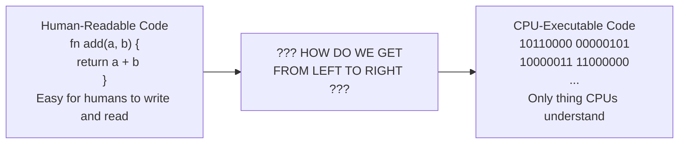
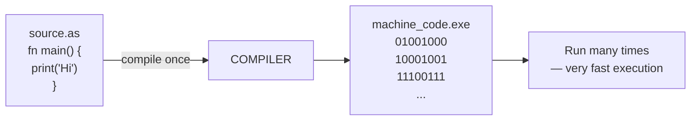
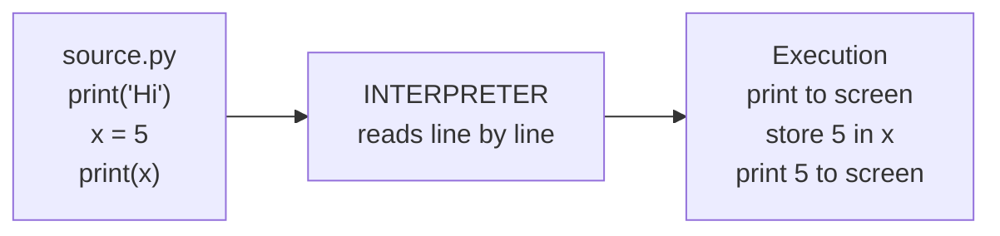
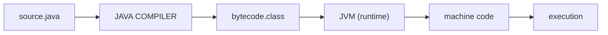
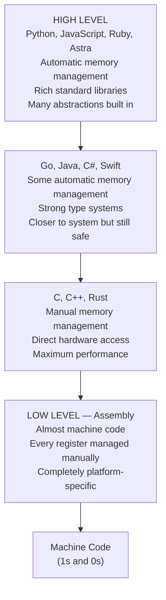
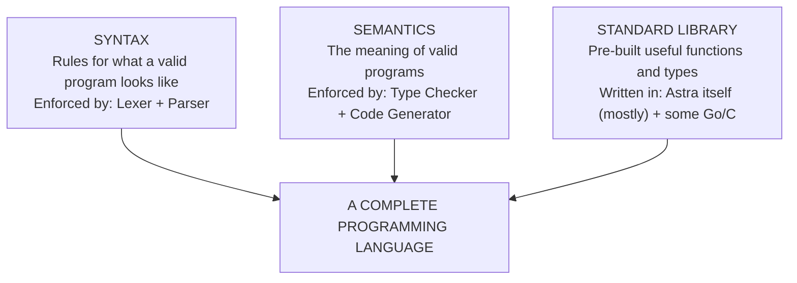
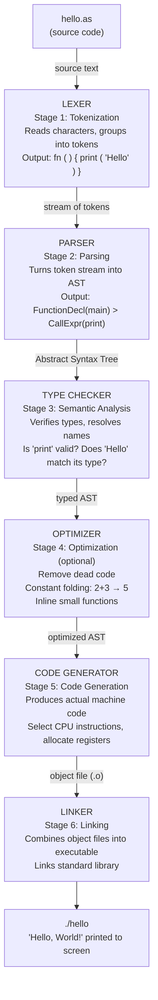

# Chapter 01: What Is a Programming Language?

> "A programming language is a formal language comprising a set of instructions that produce various kinds of output. Programming languages are used in computer programming to implement algorithms."
> — Every textbook ever. We can do better than that.

Let's try again: a programming language is how humans tell computers what to do — in a way both sides can understand.

This chapter is your foundation. Before we write a single line of Go code or a single line of Astra code, we need to understand what a programming language actually *is*, where they came from, and why building one from scratch is one of the most rewarding things a programmer can do. By the end of this chapter, you'll have written your first complete Astra program (even if we can't run it yet) and you'll understand exactly what needs to happen before that program can execute.

Don't worry if you have never written a program before. This chapter assumes nothing. We start from zero.

---

## Table of Contents

1. What Is a Computer Program?
2. A Brief History: From Switches to Python
3. The Translation Problem
4. Compilers vs Interpreters vs Hybrid Approaches
5. High-Level vs Low-Level Languages
6. Why Do We Need So Many Languages?
7. Introducing Astra
8. The Anatomy of a Programming Language
9. Your First Complete Astra Program
10. What a Compiler Does: A Preview of the Journey
11. Exercises

---

## 1. What Is a Computer Program?

Imagine you are teaching someone to make a sandwich. You write down instructions:

```
1. Take two slices of bread
2. Spread butter on one slice
3. Place cheese on the buttered slice
4. Put the other slice on top
5. Cut diagonally
6. Serve
```

A computer program is exactly this — a list of instructions for a computer to follow. The difference is that computers follow instructions with absolute, mechanical precision. They do not guess. They do not improvise. If your instruction says "cut diagonally" but the computer does not know what "diagonally" means, it will not figure it out from context. It will fail.

This is both the power and the limitation of computers. Because they follow instructions precisely, they can do complex tasks billions of times per second without making errors. But every instruction must be written in a language the computer understands.

Here is a key insight: **computers do not actually understand any human language**. They only understand one thing — electrical signals. High voltage means 1. Low voltage means 0. Everything a computer does reduces to combinations of 1s and 0s. We will go much deeper into this in Chapter 3. For now, understand that the gap between "human thought" and "computer instruction" is enormous, and bridging that gap is exactly what programming languages do.

A program is, at its core, a sequence of these binary instructions stored in a file. When you run a program, those instructions get loaded into memory, and the CPU (the computer's brain) executes them one by one. But nobody writes programs as raw 1s and 0s. That would take forever and be impossible to read or debug. We need a better way.

### The Recipe Analogy Extended

Let's extend the sandwich recipe analogy to be more precise about what "instructions" means:

```
RECIPE (Human Language):
"Make a cheese sandwich"

PRECISE INSTRUCTIONS (Programming Language):
fn make_sandwich() {
    let bread = get_bread(2, "white")
    let butter = get_butter(1, "tablespoon")
    let cheese = get_cheese(2, "slices")
    spread(butter, bread[0])
    stack(cheese, bread[0])
    stack(bread[1], cheese)
    cut(diagonal)
    serve()
}

MACHINE INSTRUCTIONS (Binary - what the CPU actually runs):
01001000 10001001 11100111 01001000 10000011 11101100
10100000 11001000 00010011 00000000 00000000 01001000
... (thousands more bytes)
```

The programming language sits in the middle. It lets humans write instructions in a readable, structured way, while still being translatable into the machine instructions the CPU needs.

---

## 2. A Brief History: From Switches to Python

Understanding where programming languages came from helps you understand why they work the way they do.

### Era 1: Machine Code (1940s)

The first computers were programmed by physically flipping switches or plugging cables into panels. Each switch corresponded to a specific electrical circuit — a specific machine instruction. Programs were written as sequences of 1s and 0s, called **machine code** (also called **machine language** or **native code**).

```
Timeline:
1940s ─── Machine Code ────────────────────────────────────►
          (switches, punch cards, raw binary)
```

Example of machine code (x86 processor, adding two numbers):

```
B8 05 00 00 00    ; move the number 5 into register EAX
83 C0 03          ; add 3 to register EAX
; result: EAX now contains 8
```

Even this example uses hexadecimal (base-16) notation to make it slightly more readable. The actual bytes stored on disk are: `10111000 00000101 00000000 00000000 00000000 10000011 11000000 00000011`.

Problems with machine code:
- Different CPU models use different machine code. A program for an Intel chip cannot run on an ARM chip.
- Incredibly tedious to write. A simple task requires dozens of instructions.
- Nearly impossible to read. You cannot tell what the program does without executing it.
- Errors are catastrophic and hard to find.

### Era 2: Assembly Language (late 1940s–1950s)

Programmers quickly realized they could replace the cryptic binary numbers with human-readable names. Instead of `B8 05 00 00 00`, you write `MOV EAX, 5`. A program called an **assembler** translates these names back into binary.

```
1940s ─── Machine Code ─── 1950s ─── Assembly ────────────►
                                      (MOV, ADD, SUB, JMP)
```

Assembly for adding 5 + 3:

```asm
section .text
global _start
_start:
    MOV EAX, 5      ; put 5 into register EAX
    ADD EAX, 3      ; add 3; EAX now contains 8
    ; ... more instructions to actually print/use the result
```

Assembly was a huge improvement, but it was still machine-specific and still required you to manage every tiny detail — which register to use, how to move data around, etc.

### Era 3: High-Level Languages (1950s onward)

The next breakthrough: what if you could write code that looked more like mathematics or English, and had a program translate it all the way down to machine code? This is the **compiler** — and it was revolutionary.

**FORTRAN** (1957, created by IBM) was one of the first high-level languages, designed for scientific computation:

```fortran
PROGRAM HELLO
    PRINT *, 'Hello, World!'
END PROGRAM HELLO
```

**COBOL** (1959) was designed for business data processing. **LISP** (1958) was designed for artificial intelligence research. Each language was purpose-built.

The timeline expanded rapidly:

```
1940s ─ Machine Code
1950s ─ Assembly, FORTRAN, COBOL, LISP
1960s ─ BASIC, PL/I, Simula (first OOP)
1970s ─ C, Pascal, Prolog, ML
1980s ─ C++, Ada, Objective-C, Erlang
1990s ─ Python, Java, Haskell, Ruby, Lua, JavaScript
2000s ─ C#, Scala, D, Clojure
2010s ─ Go, Rust, Kotlin, Swift, TypeScript, Dart, Elixir
2020s ─ Astra (that's us!)
```

Each new language built on the lessons of previous ones. Go, the language we use to build Astra, was created at Google in 2009. Astra, which we will build together, draws lessons from all of them.

---

## 3. The Translation Problem

Here is the fundamental challenge: **humans want to write code that is easy to read and reason about, but CPUs only understand binary machine code**. Something has to bridge that gap.

This is the translation problem, and it is the core reason compilers and interpreters exist.



The answer: a **translator program** — either a compiler or an interpreter.

Think of it like translating a book from French to English. You have two approaches:

1. **Translate the whole book first, then distribute the English version.** Readers get an English book and read it directly. Fast to read, but translation took time upfront. This is what a **compiler** does.

2. **Hire a simultaneous interpreter who translates sentence by sentence as the author speaks.** Slower in real time, but no upfront work needed. This is what an **interpreter** does.

---

## 4. Compilers vs Interpreters vs Hybrid Approaches

These three approaches have distinct tradeoffs that explain why different languages made different choices.

### Compilers

A **compiler** reads your entire source code, analyzes it, and produces a new file containing machine code (or sometimes code in another language). You run the compiler once, then distribute and run the output.



Examples: C, C++, Go, Rust, our own Astra (`astrac`)

Advantages:
- Execution is very fast — no translation happening at runtime
- Optimizations can be applied during compilation
- Type errors caught before the program runs

Disadvantages:
- Must recompile after every change
- Compiled executable only runs on the target platform

### Interpreters

An **interpreter** reads and executes your source code directly, line by line (or statement by statement), without producing a separate output file.



Examples: Python (CPython), Ruby (MRI), early PHP, Bash

Advantages:
- Instant feedback — run code immediately without compiling
- Platform-independent (the interpreter itself is the only platform-specific piece)
- Great for scripting and rapid development

Disadvantages:
- Slower execution — translating at runtime costs time
- Errors only discovered when that line runs

### Hybrid: Bytecode + Virtual Machine

Many modern languages use a hybrid approach: compile to an intermediate form called **bytecode**, then interpret that bytecode with a fast **virtual machine**.



Examples: Java (JVM), Python (CPython compiles to .pyc), Kotlin, Scala, Lua

Some go further: **JIT compilation** (Just-In-Time). The virtual machine detects "hot" code that runs frequently and compiles it to native machine code on the fly. JavaScript engines (V8 in Chrome) and the JVM use this.

### Comparison Table

| Feature | Compiler | Interpreter | Bytecode + VM |
|---------|----------|-------------|---------------|
| Execution speed | Very fast | Slow | Medium |
| Development speed | Slower (must recompile) | Fast (immediate) | Medium |
| Portability | Low (platform-specific) | High | High |
| Error detection | At compile time | At runtime | Both |
| Examples | C, C++, Go, Rust, Astra | Python, Ruby, Bash | Java, Kotlin, Python |
| Output file | Native executable | None | Bytecode (.class, .pyc) |

**Astra is a compiled language.** When you run `astrac build main.as`, the Astra compiler reads your Astra source code, performs its analysis, and produces a native executable that runs directly on the operating system without any runtime interpreter.

---

## 5. High-Level vs Low-Level Languages

"High-level" and "low-level" refer to how far a language is from machine code — how much abstraction it provides.



Here is the same task — adding 5 and 3 and printing the result — across four different abstraction levels:

**Python (very high level):**
```python
print(5 + 3)
```

**Go (high level):**
```go
package main
import "fmt"
func main() {
    fmt.Println(5 + 3)
}
```

**C (lower level):**
```c
#include <stdio.h>
int main() {
    int result = 5 + 3;
    printf("%d\n", result);
    return 0;
}
```

**x86 Assembly (very low level):**
```asm
section .data
    fmt db "%d", 10, 0
section .text
    global main
    extern printf
main:
    push rbp
    mov rdi, fmt
    mov esi, 8          ; 5 + 3 = 8
    xor eax, eax
    call printf
    pop rbp
    ret
```

Notice how the Python version hides everything — you do not think about memory, registers, or system calls. Assembly shows you everything. Go and Astra sit closer to the high-level end, giving you productivity without sacrificing too much performance.

---

## 6. Why Do We Need So Many Programming Languages?

You might wonder: if C does everything, why does Python exist? If Python exists, why do we need Go? And if Go exists, why build Astra?

The answer is: **different tools for different jobs**.

Consider physical tools. A hammer, a screwdriver, and a drill can all be used in construction — but you would not want to hang a picture with a drill, or drive a screw with a hammer. They overlap in capability but each has a domain where it excels.

Programming languages work the same way:

| Language | Primary Use Case | Why It Excels |
|----------|-----------------|---------------|
| C | Operating systems, kernels, embedded | Bare-metal speed, direct hardware access |
| C++ | Game engines, high-performance apps | Speed + object-oriented abstractions |
| Python | Data science, ML, scripting, automation | Rapid development, massive libraries |
| JavaScript | Web browsers, Node.js backends | Only language browsers run natively |
| Java | Enterprise backends, Android | Platform independence via JVM |
| Go | Cloud services, DevOps tools, APIs | Fast compilation, simple concurrency |
| Rust | Systems programming with safety | Memory safety without garbage collection |
| SQL | Database queries | Expressive data query language |
| Bash | Shell scripting, automation | Deep OS integration |
| Astra | General purpose, learning compiler design | Clean syntax, learning, extensibility |

New languages are created for several reasons:
1. **New paradigms** — someone discovers a better way to express programs
2. **New platforms** — mobile, web, embedded systems need purpose-built tools
3. **Domain optimization** — a language can be designed specifically for one field
4. **Fixing existing problems** — Go was created partly to fix C++'s complexity
5. **Learning and exploration** — building a language teaches you more than anything else

---

## 7. Introducing Astra

Astra is the programming language we will design and build together over the course of this guide.

**Why Astra?**

We are not building Astra to replace Python or compete with Go. We are building Astra to understand how *all* programming languages work. When you finish this guide, you will have built:

- A **lexer** that reads Astra source code and identifies tokens
- A **parser** that turns tokens into a structured tree
- A **type checker** that catches type errors before runtime
- A **code generator** that produces native machine code
- A **standard library** with basic I/O, math, and HTTP support
- A complete **compiler** called `astrac` that compiles `.as` files to native executables

You will understand compilers not just in theory but in practice. You will have written one.

**Astra's Design Philosophy**

Astra is designed to be:
- **Simple** — small core language, easy to learn
- **Safe** — no null pointer exceptions, type-safe
- **Fast** — compiles to native machine code
- **Readable** — syntax that looks like what it does

**Astra's Syntax at a Glance**

```astra
// This is a comment in Astra

fn main() {
    print("Hello, World!")

    let age = 25                    // type inference: age is int
    let name = "Aditya"             // type inference: name is string

    if age > 18 {
        print("Adult")
    }

    for i in 0..10 {               // range loop
        print(i)
    }
}

// Function with typed parameters and return type
fn add(a: int, b: int) -> int {
    return a + b
}

// Struct definition
struct Person {
    name: string
    age: int
}

// Methods on structs
impl Person {
    fn greet(self) {
        print("Hello " + self.name)
    }
}
```

Astra's syntax draws from Go's simplicity, Rust's safety features, and Python's readability. By the time we build the compiler, every keyword, operator, and construct you see above will be something you designed and implemented yourself.

---

## 8. The Anatomy of a Programming Language

Every programming language has three fundamental components. Understanding these separates programmers from language designers.

### 8.1 Syntax

**Syntax** is the set of rules that defines what a valid program looks like. It is purely structural — syntax does not care about *meaning*, only about *form*.

Think of it like grammar in English. "The cat sat on the mat" is grammatically correct. "Cat mat the sat on" is grammatically wrong — the words exist, but the structure is invalid.

```
Astra Syntax Rules (examples):

VALID:
    let x = 5          ✓ (let <name> = <expression>)
    fn add(a: int) {}  ✓ (fn <name>(<params>) { <body> })
    if x > 0 { }       ✓ (if <expr> { <body> })

INVALID (syntax errors):
    let = 5            ✗ (missing variable name)
    fn (a: int) {}     ✗ (missing function name)
    if > 0 { }         ✗ (missing left-hand side)
```

The **parser** (Chapter 7–9) is the part of our compiler that enforces syntax rules.

### 8.2 Semantics

**Semantics** is the meaning of valid programs. Two programs can be syntactically identical but semantically different based on context.

Syntax only tells us the *structure*. Semantics tells us *what it means* and *whether it makes sense*.

```
SYNTACTICALLY VALID but SEMANTICALLY WRONG:

    let x: int = "hello"    // Can't assign string to int
    print(y)                // y is not defined
    let z = 5 + "world"     // Can't add int and string

SYNTACTICALLY VALID and SEMANTICALLY CORRECT:

    let x: int = 42
    let y = x + 10
    print(y)                // prints 52
```

The **type checker** (Chapter 10–12) enforces semantic rules. The **code generator** (Chapter 13–20) defines the execution semantics.

### 8.3 Standard Library

The **standard library** (often called "stdlib") is the collection of pre-built functions and types that come with the language. It is what makes a language practical.

Without a standard library, you would have to implement everything from scratch — even printing to the screen. The standard library provides:

```
Astra Standard Library (what we will build):
├── io          ─ print(), read_line()
├── math        ─ sqrt(), abs(), pow()
├── string      ─ len(), split(), contains(), trim()
├── array       ─ sort(), map(), filter(), reduce()
├── file        ─ read(), write(), exists()
├── http        ─ get(), post(), Server
└── json        ─ parse(), stringify()
```

By chapter 75, you will have built all of these.



---

## 9. Your First Complete Astra Program

Let's look at a complete Astra program and understand every single part. This is our "Hello World" — the traditional first program in any new language.

```astra
fn main() {
    print("Hello, World!")
}
```

Simple, right? But let's break down every character:

```
fn        ← keyword: declares a function
main      ← the function name; "main" is special — it's where the program starts
(         ← opens the parameter list
)         ← closes the parameter list (no parameters here)
{         ← opens the function body
    print ← a built-in function call
    (     ← opens the argument list
    "Hello, World!"  ← a string literal — text surrounded by double quotes
    )     ← closes the argument list
}         ← closes the function body
```

Now let's look at something more complete:

```astra
// Chapter 1 Example: Our First Complete Astra Program
// File: hello.as

fn main() {
    // Greet the world
    print("Hello, World!")

    // Declare variables
    let name = "Aditya"       // string variable
    let age = 25              // integer variable
    let height = 1.82         // float variable
    let is_adult = true       // boolean variable

    // Print with concatenation
    print("Name: " + name)
    print("Age: " + age)

    // Conditional logic
    if age >= 18 {
        print("You are an adult")
    } else {
        print("You are a minor")
    }

    // A loop
    print("Counting to 5:")
    for i in 1..6 {
        print(i)
    }
}
```

Let's dissect every new concept introduced here:

| Line | Element | Meaning |
|------|---------|---------|
| `// ...` | Comment | Ignored by compiler, for human readers |
| `let name = "Aditya"` | Variable declaration | Creates a variable named `name` holding the text "Aditya" |
| `let age = 25` | Variable declaration | Creates a variable named `age` holding the integer 25 |
| `let height = 1.82` | Variable declaration | Creates `height` holding a decimal number |
| `let is_adult = true` | Variable declaration | Creates `is_adult` holding a true/false value |
| `"Name: " + name` | String concatenation | Joins two strings together |
| `if age >= 18 { }` | Conditional | Executes body only if condition is true |
| `else { }` | Else branch | Executes if the `if` condition was false |
| `for i in 1..6 { }` | Range loop | Repeats body with `i` taking values 1, 2, 3, 4, 5 |
| `1..6` | Range expression | A range from 1 (inclusive) to 6 (exclusive) |

Notice what Astra does NOT have that some other languages do:
- No semicolons at end of lines (unlike C, Java, Go)
- No parentheses around `if` conditions (unlike C, Java)
- No explicit type annotations unless you want them (type inference)
- No `class` keyword (uses `struct` + `impl` instead)

These design choices make Astra code cleaner and easier to read.

---

## 10. What a Compiler Does: A Preview of the Journey

When you run `astrac build hello.as`, a remarkable chain of events occurs. Here is a complete picture — we will implement each stage over the course of this guide.



Each of these stages is a separate piece of software we will write in Go. By the end of this guide, you will understand every box in this diagram deeply enough to have built it yourself.

Let's preview what each stage produces:

**Stage 1 (Lexer) Input:**
```
fn main() { print("Hello, World!") }
```

**Stage 1 (Lexer) Output:**
```
[KEYWORD:fn] [IDENT:main] [LPAREN] [RPAREN] [LBRACE]
[IDENT:print] [LPAREN] [STRING:"Hello, World!"] [RPAREN]
[RBRACE] [EOF]
```

**Stage 2 (Parser) Output:**
```
Program {
  functions: [
    FunctionDecl {
      name: "main"
      params: []
      body: Block {
        stmts: [
          ExprStmt {
            expr: CallExpr {
              function: Ident("print")
              args: [StringLit("Hello, World!")]
            }
          }
        ]
      }
    }
  ]
}
```

**Stage 5 (Code Generator) Output (x86-64 assembly):**
```asm
main:
    push rbp
    mov rbp, rsp
    lea rdi, [rel hello_str]
    call print_string
    pop rbp
    ret
hello_str:
    db "Hello, World!", 10, 0
```

This is where we are headed. Every chapter brings us closer to this complete picture.

---

## Astra Build Milestone: Hello World in Astra

Our first milestone is simply defining the complete "Hello World" program in Astra and understanding what every element means. We cannot run it yet — we have not built the compiler — but we can reason about what the compiler will need to do.

**File: hello.as**

```astra
// hello.as — The first Astra program
// Compiled with: astrac build hello.as
// Produces:      ./hello
// Run with:      ./hello

fn main() {
    print("Hello, World!")
}
```

**What must the compiler do with this file?**

1. **Read** the file `hello.as` from disk
2. **Lex** it — identify that `fn` is a keyword, `main` is an identifier, `(` and `)` are punctuation, `{` and `}` are braces, `print` is a function name, `"Hello, World!"` is a string literal
3. **Parse** the token stream — recognize this as a function declaration named `main` with no parameters containing one statement: a call to `print` with one argument
4. **Type check** — verify that `print` exists, that it accepts a string argument, that `main` exists and has the right signature for an entry point
5. **Generate code** — produce machine instructions that:
   - Load the address of the string "Hello, World!" into a register
   - Call the `print` function (which ultimately calls the OS's `write` system call)
   - Return from `main`
6. **Link** — combine the generated code with the standard library (where `print` is implemented) into a final executable
7. **Produce** the file `./hello` which the user can run

**When the user runs `./hello`, the output is:**
```
Hello, World!
```

That's it. One line of output. But getting from the source code to that output requires every stage of the compiler to work correctly. That is the journey of this entire guide.

---

## 11. Exercises

1. **The Recipe Program**: Write a complete Astra program (even though you cannot run it yet) that prints a 5-step recipe for your favorite food. Use `print()` for each step. Add a comment at the top explaining what the program does.
   *Hint: Each step is a string literal. Remember double quotes around strings.*

2. **Language Research**: Look up three programming languages you have never used and find out what they were primarily designed for. Write a short paragraph for each explaining their use case and what syntax feature they are known for.
   *Hint: Consider languages like Haskell (functional), Lua (embedded scripting), or Erlang (concurrent systems).*

3. **Compiler vs Interpreter**: For each of the following, identify whether the language is typically compiled, interpreted, or uses a bytecode/VM approach: Python, C, Java, Ruby, Rust, JavaScript (in a browser), Go. Explain your reasoning.
   *Hint: Check whether there is a separate compile step before running.*

4. **Syntax Spotting**: The following Astra programs have syntax errors. Identify each error and explain why it is wrong:
   ```astra
   // Program A
   fn () {
       print("hello")
   }
   
   // Program B
   fn main() {
       let = 42
   }
   
   // Program C
   fn main() {
       if 5 > 3
           print("yes")
   }
   ```
   *Hint: Compare with the valid Astra syntax shown in this chapter.*

5. **The Translation Chain**: In your own words, explain what happens between the moment a programmer saves a `.as` file and the moment the compiled program prints "Hello" to the screen. Try to mention all 6 stages of the compiler pipeline.
   *Hint: Re-read Section 10 and try to write this from memory.*

6. **Design Question**: If you were designing a new programming language for writing recipes (like cooking instructions), what special syntax would you add? Write a 10-line example of your recipe language. What would the compiler need to understand?
   *Hint: Think about what operations are common in recipes: "add", "mix", "wait X minutes", "repeat N times".*

7. **Abstraction Levels**: Rewrite this Python program conceptually in both C and assembly. You do not need to have working code — just describe (in English or pseudocode) what extra steps you would need at each lower level:
   ```python
   name = input("What is your name? ")
   print("Hello, " + name)
   ```
   *Hint: In C, you would need `scanf` and `printf`. In assembly, you would need to make system calls directly.*

8. **History Challenge**: The programming languages timeline shows that new languages keep appearing. Predict: what problem might a programming language created in 2030 try to solve? Consider current trends like AI, quantum computing, and distributed systems. Describe the language's intended use case and one syntax feature you would include.
   *Hint: There are no wrong answers. Think about what programmers find frustrating today.*

---

## Summary: Key Concepts

| Concept | Definition | Example |
|---------|-----------|---------|
| Computer program | A sequence of instructions for a CPU to execute | A web browser, a game, our Astra compiler |
| Machine code | Binary instructions a CPU directly executes | `10110000 00000101` |
| Assembly language | Human-readable names for machine instructions | `MOV EAX, 5` |
| High-level language | Language far from machine code, focused on human readability | Python, Astra, Go |
| Compiler | Translates entire source code to machine code before execution | `astrac build hello.as` |
| Interpreter | Executes source code directly, line by line | Python's `python hello.py` |
| Bytecode VM | Compiles to intermediate bytecode, then interprets that | Java's JVM |
| Syntax | Rules defining what programs look like structurally | `fn name() { }` |
| Semantics | The meaning of valid programs | Types must match in expressions |
| Standard library | Built-in collection of useful functions and types | `print()`, `sqrt()` |
| Lexer | Compiler stage that reads characters and produces tokens | `fn` → KEYWORD token |
| Parser | Compiler stage that turns tokens into a tree (AST) | tokens → FunctionDecl node |
| Type checker | Compiler stage that verifies types are used correctly | ensures `int + int`, not `int + string` |
| Code generator | Compiler stage that produces machine code | AST → x86 instructions |
| Linker | Combines multiple object files into one executable | `hello.o + stdlib.o` → `hello` |
