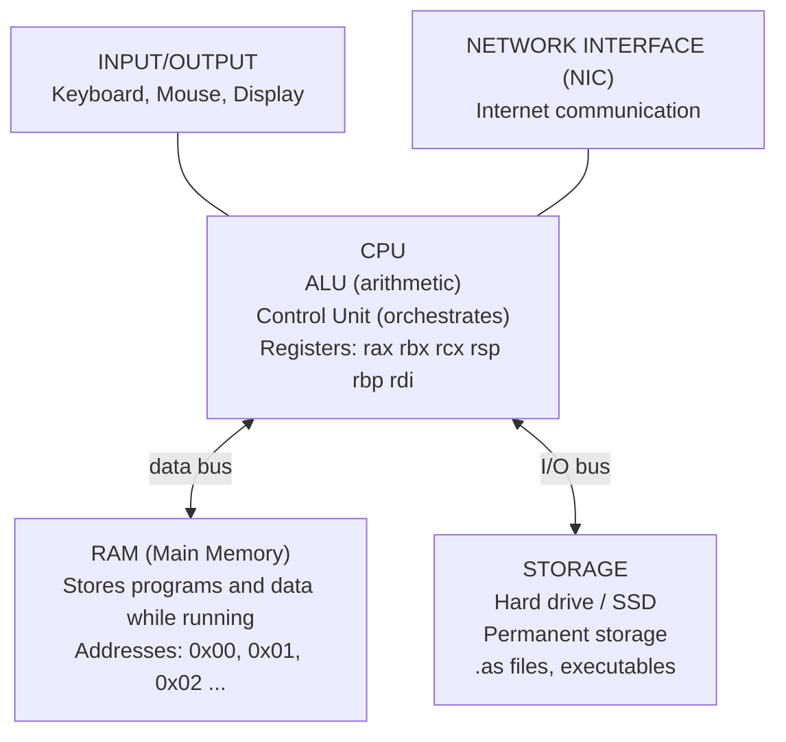
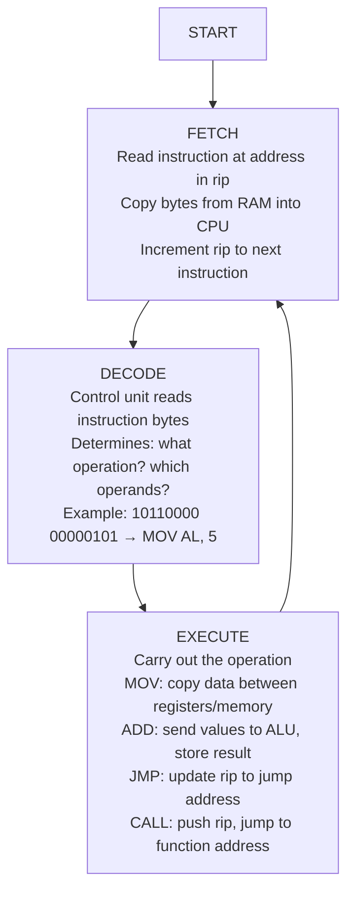
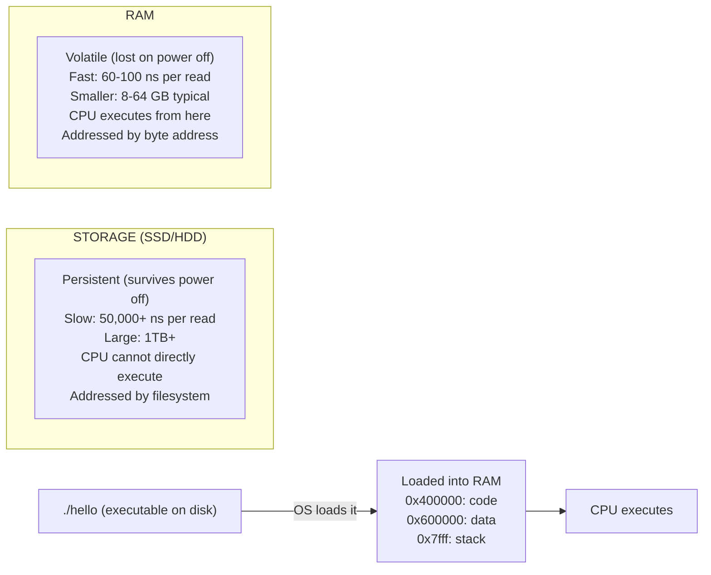
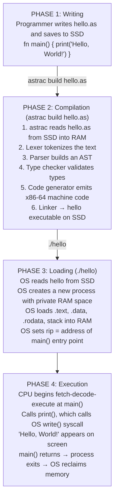

# Chapter 02: How Computers Work

> "Computers are incredibly fast, accurate, and stupid. Human beings are incredibly slow, inaccurate, and brilliant. Together they are powerful beyond imagination."
> — Albert Einstein (attributed)

You do not need to become a hardware engineer to build a compiler. But you do need to understand what the computer is actually doing when it runs a program. This knowledge shapes every decision we will make in building Astra — from how we lay out data in memory, to how we generate code, to why certain operations are fast and others are slow.

This chapter builds a mental model of the computer from the ground up. We start with physical hardware — transistors, wires, electricity — and work our way up through increasingly powerful abstractions until we arrive at the moment an Astra program executes. By the end, you will understand not just *that* computers work, but *how* they work, and that understanding will make you a better language designer.

---

## Table of Contents

1. The Computer as an Instruction-Following Machine
2. Hardware Components: The Big Picture
3. The CPU in Detail
4. The Fetch-Decode-Execute Cycle
5. RAM: Random Access Memory
6. Storage vs RAM: Why Programs Must Be Loaded
7. The Memory Hierarchy
8. A Simple Program's Life: From .as File to CPU
9. How the Operating System Helps
10. What Our Astra Compiler Must Produce
11. Exercises

---

## 1. The Computer as an Instruction-Following Machine

Imagine the world's most obedient chef. This chef:
- Follows recipes **exactly** — no improvisation
- Reads only **one instruction at a time**
- Works **incredibly fast** — billions of instructions per second
- **Never gets tired** and never makes mistakes (given correct instructions)
- Knows how to perform only a **small fixed set of operations**: add, subtract, compare, move data, jump to a different step

This is a CPU (Central Processing Unit). It is a machine that executes a fixed set of instructions, one after another, at extraordinary speed. Everything a computer does — displaying a web page, playing music, running a game, compiling Astra code — ultimately reduces to this chef following a very, very long recipe.

The recipe is your program. The instructions are machine code. The kitchen is the computer's hardware.

Here is the critical point for compiler writers: **we are writing a program (the Astra compiler) whose ultimate output is a recipe (machine code) for this chef to follow**. Everything in this chapter tells us what kind of recipes the chef can understand.

### What "Instructions" Really Means

A CPU instruction is an operation with a very specific, limited scope. Real x86-64 CPU instructions (the kind most desktop computers use) include things like:

```
MOV rax, 5          ; copy the value 5 into a CPU register called rax
ADD rax, rbx        ; add the value in rbx to rax, store result in rax
CMP rax, 0          ; compare rax with 0 (sets flags for next instruction)
JE  label           ; if the last comparison was equal, jump to label
CALL function       ; call a function (push return address, jump to function)
RET                 ; return from a function (pop address, jump there)
PUSH rax            ; save rax's value onto the stack
POP  rbx            ; load a value from the stack into rbx
```

These are primitive. They work on very small pieces of data (usually 1 to 8 bytes). They do one thing at a time. And yet, from combinations of these primitive operations, every program ever written has been built.

When our Astra compiler generates code, it is generating sequences of instructions like these. The `fn add(a: int, b: int) -> int { return a + b }` function in Astra becomes just a few machine instructions: load `a`, load `b`, add them, return. Our compiler figures out which instructions, in what order, handling all the details of registers and memory.

---

## 2. Hardware Components: The Big Picture

A modern computer has many components, but for understanding how programs run, we care about five:



### CPU (Central Processing Unit)

The brain of the computer. It executes instructions. It contains:
- **Arithmetic Logic Unit (ALU)**: performs math and comparisons
- **Control Unit**: reads instructions and orchestrates everything
- **Registers**: tiny, blazingly fast storage inside the CPU

A modern CPU might have multiple **cores** — essentially multiple CPUs on one chip that can work in parallel. For now, we think of one core executing one instruction at a time.

### RAM (Random Access Memory)

The working memory of the computer. When you run a program, it gets loaded from storage into RAM. RAM is much faster than storage but loses all data when power is cut.

RAM is organized as a sequence of **bytes** (groups of 8 bits), each with a unique **address** (a number). The CPU reads and writes individual bytes or small groups using these addresses.

A modern computer might have 16 gigabytes of RAM — that is about 16 billion individually addressable bytes.

### Storage (Hard Drive or SSD)

Permanent storage. Your `.as` source files live here. Your compiled executable lives here. When you double-click a program, the OS loads it from storage into RAM so the CPU can access it quickly.

Storage is hundreds to thousands of times slower than RAM. You never want the CPU waiting for storage if you can avoid it.

### Input/Output (I/O)

Keyboard, mouse, screen, network card, USB ports. These are the computer's interface with the outside world. For Astra programs, the main I/O we care about is reading from stdin (keyboard), writing to stdout (screen), reading/writing files, and making HTTP requests.

### The Bus

The **bus** is the set of wires connecting all components. Data travels on buses between CPU, RAM, and storage. Bus speed is a major bottleneck — even if the CPU is fast, it cannot operate faster than data can arrive.

---

## 3. The CPU in Detail

Let us zoom into the CPU because this is where programs actually execute.

```
┌──────────────────────────────────────────────────────────────────┐
│                     CPU INTERNALS                                │
│                                                                  │
│  ┌────────────────────────────────────────────────────────────┐ │
│  │                    REGISTERS                               │ │
│  │  General Purpose:  rax  rbx  rcx  rdx  rsi  rdi  r8..r15  │ │
│  │  Stack Pointer:    rsp  (top of stack)                     │ │
│  │  Base Pointer:     rbp  (start of current stack frame)     │ │
│  │  Instruction Ptr:  rip  (address of NEXT instruction)      │ │
│  │  Flags:            RFLAGS (zero, carry, sign, overflow...)  │ │
│  └────────────────────────────────────────────────────────────┘ │
│                          │                                       │
│           ┌──────────────┼──────────────┐                        │
│           ▼              ▼              ▼                        │
│  ┌──────────────┐  ┌──────────┐  ┌──────────────┐               │
│  │     ALU      │  │ Control  │  │  Cache (L1)  │               │
│  │              │  │  Unit    │  │  Very fast   │               │
│  │ + - * / %    │  │          │  │  tiny RAM    │               │
│  │ AND OR XOR   │  │ Fetches  │  │  inside CPU  │               │
│  │ << >>        │  │ Decodes  │  │  ~32KB       │               │
│  │ CMP          │  │ Executes │  └──────────────┘               │
│  └──────────────┘  └──────────┘                                  │
└──────────────────────────────────────────────────────────────────┘
```

### Registers: The CPU's Scratch Paper

Registers are the fastest storage in a computer. They are built directly into the CPU chip and can be read or written in a single clock cycle (less than a nanosecond on modern hardware). However, there are only a small number of them — typically 16 general-purpose registers on a 64-bit x86 CPU.

Key registers in x86-64 architecture:

| Register | Purpose |
|----------|---------|
| `rax` | General purpose; also stores function return values |
| `rbx` | General purpose |
| `rcx` | General purpose; also loop counter |
| `rdx` | General purpose; also stores 2nd return value |
| `rsi` | Source index; also 2nd function argument |
| `rdi` | Destination index; also 1st function argument |
| `rsp` | Stack pointer — points to top of current stack |
| `rbp` | Base pointer — points to base of current stack frame |
| `rip` | Instruction pointer — address of next instruction to execute |
| `RFLAGS` | Flags register — stores result flags (zero, carry, sign, etc.) |

The **instruction pointer** (`rip`) is special — the CPU automatically updates it to point to the next instruction after each execution. You can also change it with `JMP` (jump) or `CALL` instructions to implement loops, conditions, and function calls.

### The ALU: The Math Machine

The **Arithmetic Logic Unit** performs all mathematical and logical operations: addition, subtraction, multiplication, division, bitwise AND/OR/XOR, comparisons, and bit shifts. The ALU takes inputs from registers, performs the operation, and stores the result back in a register, also setting appropriate flags in RFLAGS.

Example: When Astra evaluates `age + 1`, the compiled code does:
1. Load `age` from memory into register `rax`
2. Use the ALU to add the literal 1 to `rax`
3. Store the result back in `rax` (or wherever the result is needed)

### The Control Unit: The Orchestrator

The **Control Unit** reads instructions from memory (guided by `rip`), decodes them (figures out what operation to perform and on what data), and orchestrates all the other parts of the CPU to carry out the instruction. It is the CPU's manager.

---

## 4. The Fetch-Decode-Execute Cycle

Every CPU, from the smallest microcontroller to the most powerful server chip, operates on the same fundamental loop: **Fetch, Decode, Execute**. This cycle repeats billions of times per second.



### A Step-by-Step Example

Let's trace the execution of a tiny Astra program through the fetch-decode-execute cycle. Consider this Astra code:

```astra
fn add(a: int, b: int) -> int {
    return a + b
}
```

The compiler generates roughly this machine code (simplified x86-64):

```
Address | Bytes           | Instruction
--------|-----------------|----------------------------------
0x1000  | 55              | PUSH rbp
0x1001  | 48 89 e5        | MOV rbp, rsp
0x1004  | 89 7d fc        | MOV [rbp-4], edi   ; store param a
0x1007  | 89 75 f8        | MOV [rbp-8], esi   ; store param b
0x100a  | 8b 45 fc        | MOV eax, [rbp-4]   ; load a into eax
0x100d  | 03 45 f8        | ADD eax, [rbp-8]   ; eax = eax + b
0x1010  | 5d              | POP rbp
0x1011  | c3              | RET                 ; return
```

**Cycle 1:**
- FETCH: Read 1 byte from address 0x1000. Got: `0x55`. rip becomes 0x1001.
- DECODE: `0x55` means `PUSH rbp`
- EXECUTE: Save current rbp value onto the stack

**Cycle 2:**
- FETCH: Read 3 bytes from 0x1001. Got: `0x48 0x89 0xe5`. rip becomes 0x1004.
- DECODE: `0x48 0x89 0xe5` means `MOV rbp, rsp`
- EXECUTE: Copy the value in rsp into rbp

**Cycle 3:**
- FETCH: Read 3 bytes from 0x1004.
- DECODE: `MOV [rbp-4], edi` — store the value in edi (first parameter `a`) at memory address rbp-4
- EXECUTE: Write the value of `a` to the stack

...and so on through every instruction.

This happens for **every single instruction** in your program. A modern CPU can execute 3 billion or more of these cycles per second. The `fetch-decode-execute` cycle is as fundamental to computers as the heartbeat is to humans.

---

## 5. RAM: Random Access Memory

**RAM** stands for **Random Access Memory**. The word "random" here does not mean "unpredictable" — it means that you can access **any** location (any address) in **any order**, in the **same amount of time**. This is in contrast to storage like tape drives, where you had to physically seek to a location (much slower for non-sequential access).

Think of RAM like a massive apartment building:

```
┌─────────────────────────────────────────────────────────┐
│                     RAM as Building                     │
│                                                         │
│  Address │ Value     │                                  │
│  ────────┼───────────┤                                  │
│  0x0000  │ 0x48      │ ← Every room has a unique number │
│  0x0001  │ 0x65      │   (address)                      │
│  0x0002  │ 0x6C      │                                  │
│  0x0003  │ 0x6C      │ ← Every room holds one byte      │
│  0x0004  │ 0x6F      │   (one 8-bit value)              │
│  0x0005  │ 0x00      │                                  │
│  ...     │ ...       │ The CPU can go directly to any   │
│  0xFFFF  │ 0xC3      │ room (address) without visiting  │
│                      │ all the rooms before it.         │
└─────────────────────────────────────────────────────────┘
```

The content at addresses 0x0000–0x0004 above happens to be the ASCII codes for "Hello" (H=0x48, e=0x65, l=0x6C, l=0x6C, o=0x6F). RAM just stores bytes — it does not know or care whether those bytes represent text, numbers, instructions, or something else. That interpretation is up to the program.

### How Addressing Works

On a 64-bit system, memory addresses are 64-bit numbers. Theoretically, this allows addressing up to 2^64 bytes — an astronomically large number (about 18 exabytes). In practice, the operating system only maps a portion of this theoretical address space to real RAM.

When the CPU executes `MOV rax, [0x1000]`, it:
1. Puts the address 0x1000 on the address bus
2. RAM looks up the bytes at that address
3. RAM puts those bytes on the data bus
4. The CPU reads the bytes from the data bus into rax

This entire operation takes roughly 60–100 nanoseconds for RAM (longer if not cached). The CPU runs at ~3 GHz — about one cycle every 0.33 nanoseconds. So a single RAM access can stall the CPU for 200–300 cycles. This is why cache is so important (see Section 7).

### Pointers

A **pointer** is a variable that stores a memory address. Instead of storing the actual data, it stores the *location* of the data.

```
┌──────────────────────────────────────────────────────────┐
│                   POINTERS IN MEMORY                     │
│                                                          │
│  Variable  │  Address  │  Value                         │
│  ──────────┼───────────┼──────────────────────          │
│  age       │  0x1000   │  25   ← actual integer value   │
│  ptr_age   │  0x1008   │  0x1000  ← address of age      │
│                                                          │
│  Reading *ptr_age means:                                 │
│  1. Look at the value at 0x1008 → get 0x1000            │
│  2. Now look at the value at 0x1000 → get 25            │
│                                                          │
│  ptr_age ──────────────────►  age (25)                   │
│  (0x1008 holds 0x1000)         (0x1000 holds 25)        │
└──────────────────────────────────────────────────────────┘
```

Pointers are fundamental to how strings, arrays, and structs work in low-level languages. Astra uses pointers internally (our compiler generates code that uses them), but Astra programs themselves will mostly not need to think about raw pointers — we will design safer abstractions.

---

## 6. Storage vs RAM: Why Programs Must Be Loaded

Your `.as` source file lives on storage (an SSD or hard drive). Your compiled executable also lives on storage. But when you run the executable, the operating system must **load** it into RAM first. Why?

The CPU can only execute instructions that are in RAM. The CPU's instruction pointer (`rip`) holds a RAM address. It cannot point to a location on your hard drive. This is because:

1. **Storage is too slow**: RAM access is ~100 nanoseconds. SSD access is ~50,000–100,000 nanoseconds. The CPU would starve waiting for instructions from SSD.
2. **Storage has different interfaces**: The CPU cannot directly address storage the way it addresses RAM. There is a whole storage controller, filesystem, I/O bus in between.
3. **The architecture assumes RAM**: The entire x86-64 architecture is designed around the assumption that code and data are in RAM.



This loading process — taking an executable from storage and setting it up in RAM — is one of the most important things the operating system does. We will explore this in Section 9.

---

## 7. The Memory Hierarchy

Computer scientists and hardware engineers have developed a **memory hierarchy** — a layered system of storage, where each layer is faster but smaller and more expensive.

```
┌─────────────────────────────────────────────────────────────────┐
│                    MEMORY HIERARCHY                             │
│                                                                 │
│  ┌────────────────────────────────────────────────────────┐    │
│  │  CPU REGISTERS                                         │    │
│  │  ~16 registers × 8 bytes = 128 bytes                   │    │
│  │  Speed: 1 cycle (~0.33 ns)   Cost: very expensive      │    │
│  └────────────────────────────────────────────────────────┘    │
│                         ▲ Fastest, Smallest                     │
│  ┌────────────────────────────────────────────────────────┐    │
│  │  L1 CACHE (inside CPU)                                 │    │
│  │  ~32 KB per core                                       │    │
│  │  Speed: 4 cycles (~1.3 ns)                             │    │
│  └────────────────────────────────────────────────────────┘    │
│                                                                 │
│  ┌────────────────────────────────────────────────────────┐    │
│  │  L2 CACHE (inside CPU, shared or per-core)             │    │
│  │  ~256 KB per core                                      │    │
│  │  Speed: 12 cycles (~4 ns)                              │    │
│  └────────────────────────────────────────────────────────┘    │
│                                                                 │
│  ┌────────────────────────────────────────────────────────┐    │
│  │  L3 CACHE (inside CPU, shared across all cores)        │    │
│  │  ~8-32 MB                                              │    │
│  │  Speed: 30-40 cycles (~12 ns)                          │    │
│  └────────────────────────────────────────────────────────┘    │
│                                                                 │
│  ┌────────────────────────────────────────────────────────┐    │
│  │  RAM (DRAM)                                            │    │
│  │  8-64 GB typical                                       │    │
│  │  Speed: 200-300 cycles (~70 ns)                        │    │
│  └────────────────────────────────────────────────────────┘    │
│                                                                 │
│  ┌────────────────────────────────────────────────────────┐    │
│  │  SSD STORAGE                                           │    │
│  │  256 GB - 4 TB typical                                 │    │
│  │  Speed: 100,000+ cycles (~50,000 ns)                   │    │
│  └────────────────────────────────────────────────────────┘    │
│                                                                 │
│  ┌────────────────────────────────────────────────────────┐    │
│  │  HDD STORAGE (spinning disk)                           │    │
│  │  1-20 TB                                               │    │
│  │  Speed: 10,000,000+ cycles (~5 ms)                     │    │
│  └────────────────────────────────────────────────────────┘    │
│                         ▼ Slowest, Largest, Cheapest            │
└─────────────────────────────────────────────────────────────────┘
```

### How Caches Work

The cache exists because the CPU is much faster than RAM. When the CPU reads from address X, the hardware automatically fetches not just X, but the entire **cache line** (typically 64 bytes) surrounding X into L1 cache. If the CPU needs nearby addresses soon (which is very likely in code that processes arrays sequentially), those reads come from L1 cache — much faster.

This has a profound implication for language design: **data layout in memory matters enormously for performance**. Code that accesses memory sequentially (cache-friendly) is much faster than code that jumps around randomly (cache-hostile). Our Astra compiler should try to generate cache-friendly code.

For example, when Astra processes a loop over an array:
```astra
for i in 0..1000 {
    total = total + array[i]
}
```

This is cache-friendly — it accesses `array[0]`, then `array[1]`, then `array[2]` — sequentially. The hardware prefetcher will load upcoming elements into cache before the CPU needs them.

---

## 8. A Simple Program's Life: From .as File to CPU

Let us trace the complete journey of an Astra program from source code to execution:



### The Executable File Format

When our compiler produces the `./hello` executable, it produces a file in a specific format that the operating system understands. On Linux, this is **ELF** (Executable and Linkable Format). On macOS, it is **Mach-O**. On Windows, it is **PE** (Portable Executable).

These formats contain sections (called **segments**):
- `.text` — the actual machine code instructions
- `.data` — initialized global variables
- `.rodata` — read-only data (string literals, constants)
- `.bss` — uninitialized global variables (just size, zeroed at load time)

Our compiler's code generator must produce code organized into these sections. When we get to code generation (around Chapter 15), we will be writing bytes in these exact formats.

---

## 9. How the Operating System Helps

The **operating system** (OS) is software that sits between user programs and the raw hardware. It provides crucial services that our Astra programs will rely on:

### Process Management

When you run `./hello`, the OS creates a **process** — an isolated container for the running program with:
- Its own virtual address space (appears to have all RAM to itself)
- Its own set of open files
- Its own CPU registers (saved and restored when the process is paused)
- A process ID (PID) for the OS to track it

The OS **schedules** processes — deciding which one runs on which CPU core at any moment. Even on a single-core machine, many processes appear to run simultaneously because the OS rapidly switches between them.

### Virtual Memory

The OS provides each process with a **virtual address space** — a private view of memory. When your Astra program accesses address 0x400000, that is not the actual physical RAM address. The OS (and CPU's Memory Management Unit) translates it to a physical address on the fly.

This means:
- Two programs can each think they own address 0x400000 without conflicting
- Programs cannot accidentally (or maliciously) read each other's memory
- The OS can use storage as an extension of RAM (**swap**) transparently

```
┌─────────────────────────────────────────────────────────┐
│                 VIRTUAL ADDRESS SPACE                   │
│                                                         │
│  Process A sees:        Process B sees:                 │
│  ┌────────────┐         ┌────────────┐                  │
│  │ 0xffff...  │         │ 0xffff...  │                  │
│  │  (stack)   │         │  (stack)   │                  │
│  │            │         │            │                  │
│  │ 0x7fff...  │         │ 0x7fff...  │                  │
│  │  (heap)    │         │  (heap)    │                  │
│  │            │         │            │                  │
│  │ 0x400000   │         │ 0x400000   │                  │
│  │  (code)    │         │  (code)    │                  │
│  └────────────┘         └────────────┘                  │
│                                                         │
│  Both map to DIFFERENT physical RAM locations!          │
│  The OS/MMU handles the translation transparently.      │
└─────────────────────────────────────────────────────────┘
```

### System Calls

Programs cannot directly control hardware — the OS controls it. Programs must ask the OS for hardware services through **system calls** (sometimes called **syscalls**).

Key system calls that Astra programs use:

| System Call | Purpose | Astra Usage |
|-------------|---------|-------------|
| `write` | Write bytes to a file or stdout | `print()` ultimately calls this |
| `read` | Read bytes from a file or stdin | `read_line()` calls this |
| `open` | Open a file | `file.open()` calls this |
| `close` | Close a file | `file.close()` calls this |
| `exit` | Terminate the process | End of `main()` |
| `mmap` | Allocate memory | Memory allocator |
| `brk` | Extend heap | Memory allocator |

When our Astra code calls `print("Hello")`, the chain of calls looks like:

```
Astra: print("Hello")
    ↓ (compiled to call to stdlib's print function)
Astra stdlib: print(s: string) {
    // formats the string, then calls write
    write_syscall(stdout_fd, s.ptr, s.len)
}
    ↓ (system call)
Linux kernel: sys_write(1, 0x601000, 13)
    ↓
Terminal driver: sends bytes to terminal emulator
    ↓
Screen: "Hello" appears
```

### Memory Management: Stack and Heap

The OS gives each process two main regions of memory for runtime use:

**The Stack** is a region of memory that automatically grows and shrinks as functions are called and return. When you call a function, a **stack frame** is pushed — space is allocated for local variables and return addresses. When the function returns, the frame is popped — that memory is immediately reclaimed.

The stack is very fast but limited in size (usually 1-8 MB). You cannot allocate large amounts of data on the stack.

**The Heap** is a much larger region for dynamic allocation. When you need memory whose size is not known at compile time (like a string the user types), you request it from the heap. This requires explicit management — someone must eventually free that memory.

In Go (our compiler's language), a garbage collector automatically frees heap memory when it is no longer reachable. In Astra (the language we are building), we will implement similar automatic memory management.

---

## 10. What Our Astra Compiler Must Produce

We now have the complete picture. Let us be precise about what `astrac` must produce.

**Input:** An Astra source file (`.as`) — a text file containing the Astra program

**Output:** A native executable for the target platform (Linux ELF, macOS Mach-O, or Windows PE)

**Requirements for the output:**
1. Organized into proper sections (`.text`, `.data`, `.rodata`)
2. Machine code (x86-64 instructions) that the CPU can execute directly
3. Linked against the Astra standard library (for `print`, `len`, etc.)
4. Properly handles the calling convention (how arguments are passed, where return values go)
5. Sets up a proper stack frame for `main` and all other functions
6. Makes correct system calls for I/O operations
7. Exits cleanly when `main` returns

This is not trivial, but it is absolutely achievable. Every piece of knowledge in this chapter — the CPU's fetch-decode-execute cycle, registers, the memory hierarchy, virtual memory, system calls — directly informs decisions we will make when writing the code generator.

---

## Astra Build Milestone: The Compiler Architecture Diagram

This is not a code milestone — it is an understanding milestone. Below is the complete ASCII architecture diagram of the Astra compiler pipeline, showing how each stage maps to hardware concepts from this chapter.

```
┌─────────────────────────────────────────────────────────────────────┐
│              ASTRA PROGRAM: COMPLETE LIFECYCLE                      │
│                                                                     │
│  DEVELOPER WRITES                                                   │
│  ─────────────────                                                  │
│  $ vim hello.as           ← Text editor (user-space process)        │
│  $ astrac build hello.as  ← Invokes our compiler                    │
│                                                                     │
│  ┌─────────────────────────────────────────────────────────────┐   │
│  │                 astrac COMPILER PROCESS                     │   │
│  │                                                             │   │
│  │  hello.as (on SSD)                                          │   │
│  │       │ os.ReadFile() syscall                               │   │
│  │       ▼                                                     │   │
│  │  [text in RAM: "fn main() { ... }"]                         │   │
│  │       │                                                     │   │
│  │       ▼ LEXER                                               │   │
│  │  [token stream in RAM: KEYWORD IDENT LPAREN ...]            │   │
│  │       │                                                     │   │
│  │       ▼ PARSER                                              │   │
│  │  [AST in RAM: heap-allocated tree nodes]                    │   │
│  │       │    Each node = a Go struct in heap memory           │   │
│  │       ▼ TYPE CHECKER                                        │   │
│  │  [typed AST: each node annotated with its type]             │   │
│  │       │                                                     │   │
│  │       ▼ CODE GENERATOR                                      │   │
│  │  [x86-64 bytes: the actual machine instructions]            │   │
│  │       │                                                     │   │
│  │       ▼ LINKER / ELF WRITER                                 │   │
│  │  hello (ELF on SSD) ← os.WriteFile() syscall               │   │
│  └─────────────────────────────────────────────────────────────┘   │
│                                                                     │
│  USER RUNS THE PROGRAM                                              │
│  ─────────────────────                                              │
│  $ ./hello                                                          │
│       │                                                             │
│       ▼ OS creates process, maps ELF into virtual memory            │
│  ┌─────────────────────────────────────────────────────────────┐   │
│  │                  hello PROCESS (in RAM)                     │   │
│  │  Virtual Addr  │ Contents                                   │   │
│  │  0x00400000    │ .text: MOV, CALL, RET instructions         │   │
│  │  0x00601000    │ .rodata: "Hello, World!\n" bytes            │   │
│  │  0x7fff0000    │ .stack: main's stack frame (rbp, locals)   │   │
│  └─────────────────────────────────────────────────────────────┘   │
│       │                                                             │
│       ▼ OS sets rip = address of _start (or main)                  │
│  ┌─────────────────────────────────────────────────────────────┐   │
│  │              CPU: FETCH-DECODE-EXECUTE LOOP                 │   │
│  │                                                             │   │
│  │  Cycle 1: FETCH 0x400000, DECODE PUSH rbp, EXECUTE         │   │
│  │  Cycle 2: FETCH 0x400001, DECODE MOV rbp rsp, EXECUTE      │   │
│  │  ...                                                        │   │
│  │  Cycle N: FETCH call to write syscall                       │   │
│  │  → OS kernel receives syscall                               │   │
│  │  → Writes "Hello, World!\n" to file descriptor 1 (stdout)  │   │
│  │  → Terminal displays the text                               │   │
│  └─────────────────────────────────────────────────────────────┘   │
│                                                                     │
│  OUTPUT:  Hello, World!                                             │
└─────────────────────────────────────────────────────────────────────┘
```

This diagram is your north star. Every chapter in this guide moves us closer to one of the boxes above being fully implemented. By Chapter 27, all these boxes will be filled with working Go code.

---

## 11. Exercises

1. **The Recipe Exercise**: Write down (in English) the "fetch-decode-execute" cycle as if you were a CPU processing a real-world recipe instruction: "Add 2 cups of flour". What would the "fetch" step be? What is "decode"? What is "execute"? What is the equivalent of `rip` in your recipe?
   *Hint: Think of rip as your finger pointing to the current step in the recipe.*

2. **Memory Addresses**: If RAM is like an apartment building where each room holds exactly one byte, and you have 4 gigabytes of RAM, how many rooms (addresses) does the building have? Express your answer in both decimal and hexadecimal.
   *Hint: 1 gigabyte = 1,073,741,824 bytes. In hexadecimal, 4 GB = 0x100000000.*

3. **Cache Behavior**: Consider two loops over an array of 1000 integers:
   - Loop A: `for i in 0..1000 { total += array[i] }`
   - Loop B: `for i in 0..1000 { total += array[999-i] }` (reverse order)
   Which loop will likely have better cache performance, and why? 
   *Hint: Think about how cache lines work — when you access element 0, elements 1-7 come along for free.*

4. **Registers are Precious**: A function in Astra has local variables: `a`, `b`, `c`, `d`, `e`, `f`, `g`, `h`, `i`, `j` — ten integer variables. x86-64 has about 14 usable general-purpose registers. What does the compiler do if a function has more local variables than registers?
   *Hint: This is called "register spilling". Where else could the CPU store the overflow variables?*

5. **System Calls**: Research and write a short explanation of what happens when an Astra program calls `print("error!")` but the terminal has been closed (the file descriptor is invalid). What would the `write` system call return? How should the Astra standard library handle this?
   *Hint: System calls return error codes (negative numbers on Linux). The `write` syscall would return -EBADF.*

6. **Virtual Memory Puzzle**: Two Astra programs are running simultaneously. Program A stores the integer 42 at address 0x601000. Program B reads from address 0x601000 — does it get 42?
   *Hint: Think about virtual vs physical addresses and process isolation.*

7. **The Memory Hierarchy**: Write out the access time (in nanoseconds, approximately) for: L1 cache, L2 cache, L3 cache, RAM, SSD, and a spinning hard drive. Now calculate how many L1 cache accesses fit in the time it takes for one SSD access.
   *Hint: SSD ≈ 50,000 ns. L1 ≈ 1 ns. The ratio will surprise you.*

8. **Program Sections**: The text mentions that executables are divided into `.text`, `.data`, and `.rodata` sections. For each of the following pieces of an Astra program, determine which section they go in:
   - The compiled machine code for `fn add(a, b)`
   - The string literal `"Hello, World!"`
   - A global variable `let total = 0`
   - A constant `const PI = 3.14159`
   *Hint: Read-only data goes in .rodata. Mutable globals go in .data. Code goes in .text.*

---

## Summary: Key Concepts

| Concept | Definition | Why It Matters for Astra |
|---------|-----------|--------------------------|
| CPU | Executes instructions one at a time at billions per second | Our compiler produces instructions for the CPU |
| Register | Tiny fast storage inside CPU (16 in x86-64) | Code generator must manage register allocation |
| ALU | Performs arithmetic and logic inside CPU | All Astra `+`, `-`, `*`, `==` map to ALU operations |
| rip | Instruction pointer; CPU's "current position" | Function calls change rip; compiler must handle |
| Fetch-Decode-Execute | CPU's fundamental operating loop | Every instruction our compiler generates goes through this |
| RAM | Fast volatile main memory; programs run here | Compiler must generate proper memory addresses |
| Memory address | Unique byte identifier in RAM | Pointers, arrays, strings are all addresses |
| Cache | Fast memory between CPU and RAM | Cache-friendly data layout → faster programs |
| Storage | Slow persistent storage where files live | Source and executables live here |
| Memory hierarchy | Registers → cache → RAM → SSD → HDD | Informs data structure design in Astra |
| Operating system | Manages processes, memory, I/O | Our compiler's output runs under OS control |
| Process | Running program with private address space | Every `./hello` execution creates a process |
| Virtual memory | Per-process isolated view of address space | Makes programs safe and portable |
| System call | How programs ask OS for hardware services | `print()` ultimately makes a `write` syscall |
| Stack | LIFO memory for function calls and locals | Local variables, return addresses live here |
| Heap | Dynamic memory for runtime allocation | Strings, arrays, structs often live here |
| ELF / Mach-O | Executable file formats | Our code generator must produce valid ELF/Mach-O |
| .text section | Code instructions in executable | Compiler puts machine code here |
| .rodata section | Read-only data in executable | String literals live here |
