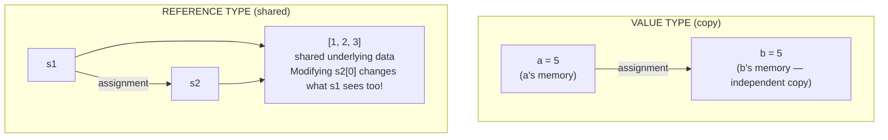
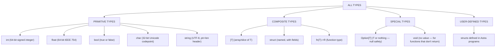
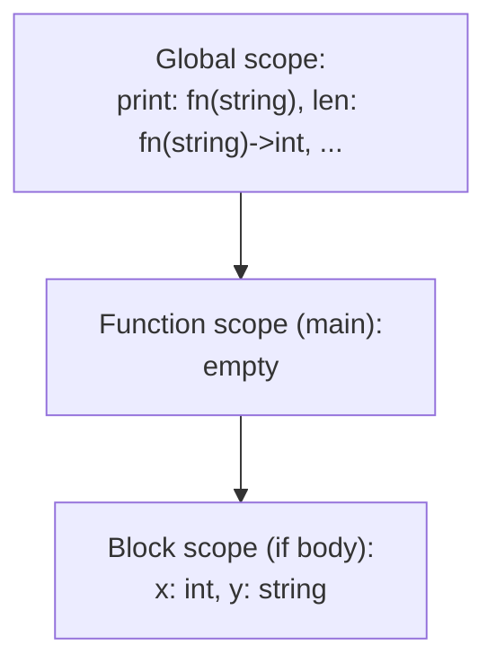

# Chapter 05: Variables, Data Types, and Memory

> "Memory management is probably the most difficult aspect of systems programming, and it's one of the major sources of bugs."
> — Andrew Tanenbaum

Variables are the most fundamental concept in all of programming. Every program you have ever used — every game, every website, every app — stores its working data in variables. But what *is* a variable, really? The textbook answer ("a named storage location") is correct but shallow. In this chapter, we go deep: we understand variables as they actually exist in the computer's memory, learn where different kinds of variables live and why, and design the type system for Astra that will inform the entire rest of the compiler.

This chapter bridges the abstract (language design) with the concrete (memory layout). By the end, you will have defined the Go structs that represent Astra's type system — actual code that will be used in the type checker, the code generator, and every other part of the compiler.

---

## Table of Contents

1. What Is a Variable? From Analogy to Reality
2. Stack vs Heap: The Two Worlds of Memory
3. The Stack in Detail: LIFO and Stack Frames
4. The Heap in Detail: Dynamic Allocation
5. Value Types vs Reference Types
6. Go's Type System: Static Typing with Inference
7. Astra's Type System Design
8. Type Conversions and Casting
9. Null Safety in Astra: The Option Type
10. Constants vs Variables
11. Variable Scope
12. Memory Layout of Structs: Alignment and Padding
13. Exercises

---

## 1. What Is a Variable? From Analogy to Reality

### The Box Analogy

The classic explanation: a variable is like a labeled box. You put something inside, and later you can retrieve it by the label.

```
Variable: age
┌─────────────┐
│     25      │
└─────────────┘
   label: age

age = 30
┌─────────────┐
│     30      │  ← the box now holds a different value
└─────────────┘
   label: age
```

This analogy is fine for understanding programs at a high level. But it falls apart when you ask: where is the box? How big is it? What happens when the function ends? Can two boxes be in the same place?

To answer these questions, we need the real memory picture.

### The Real Memory Picture

In reality, a variable is:
1. A **region of memory** (a contiguous sequence of bytes) at a specific **address**
2. A **name** (the identifier) that the compiler maps to that address
3. A **type** that tells the compiler how to interpret the bytes at that address

```
┌─────────────────────────────────────────────────────────────────┐
│                  VARIABLE IN MEMORY (REALITY)                   │
│                                                                 │
│  Source code:  let age: int = 25                                │
│                                                                 │
│  At compile time:                                               │
│  ┌──────────────────────────────────────────────────────────┐  │
│  │  Name:    "age"                                          │  │
│  │  Type:    int (64-bit signed)                            │  │
│  │  Address: 0x7fff5c00 (decided by compiler/OS)            │  │
│  │  Size:    8 bytes                                        │  │
│  └──────────────────────────────────────────────────────────┘  │
│                                                                 │
│  At runtime, in RAM:                                            │
│  Addr      │  Byte value                                        │
│  0x7fff5c00│  0x19  ← byte 0 of 25 (in little-endian: LSB)    │
│  0x7fff5c01│  0x00  ← byte 1                                   │
│  0x7fff5c02│  0x00  ← byte 2                                   │
│  0x7fff5c03│  0x00  ← byte 3                                   │
│  0x7fff5c04│  0x00  ← byte 4                                   │
│  0x7fff5c05│  0x00  ← byte 5                                   │
│  0x7fff5c06│  0x00  ← byte 6                                   │
│  0x7fff5c07│  0x00  ← byte 7 (MSB, most significant byte)      │
│                                                                 │
│  The number 25 in 64-bit little-endian:                        │
│  0x0000000000000019 — 25 in hex                                 │
└─────────────────────────────────────────────────────────────────┘
```

### Little-Endian vs Big-Endian

Notice that 25 is stored as `0x19 0x00 0x00 ... 0x00` — the least significant byte first. This is **little-endian** byte order, used by x86-64 (Intel/AMD) processors. Some architectures (like network protocols, PowerPC) use **big-endian** (most significant byte first).

```
Number: 0x01020304 (16909060 in decimal)

Big-endian:    01 02 03 04    (natural reading order)
Little-endian: 04 03 02 01    (least significant first)

x86-64 (our target): little-endian
```

Our code generator must write values in little-endian order when generating machine code for x86-64.

### The Compiler's Name-to-Address Mapping

In Astra, the programmer writes `age` but the CPU only knows addresses. The compiler's job is to maintain a **symbol table** — a map from names to addresses (or positions within a stack frame, or global memory offsets).

```
Symbol Table during compilation:

Name     │ Address/Offset  │ Type    │ Scope
─────────┼─────────────────┼─────────┼──────────────
age      │ rbp - 8         │ int     │ function local
name     │ rbp - 24        │ string  │ function local
is_adult │ rbp - 32        │ bool    │ function local
pi       │ .data + 0       │ float   │ global
```

In the compiled executable, `age` does not exist as a name — only the address `rbp - 8` (8 bytes below the base pointer of the current stack frame). The compiler translates every occurrence of `age` in Astra source code into the address `rbp - 8` in machine code.

---

## 2. Stack vs Heap: The Two Worlds of Memory

Every variable in your program lives in one of two memory regions: the **stack** or the **heap**. Understanding the difference is fundamental to understanding how our compiler will manage memory.

```
┌─────────────────────────────────────────────────────────────────┐
│                    PROCESS MEMORY MAP                           │
│                                                                 │
│  High addresses   ┌───────────────────────────────────────┐    │
│  (~0x7fff...000)  │ STACK                                 │    │
│                   │ ↓ grows downward                      │    │
│                   │   function call frames                 │    │
│                   │   local variables                      │    │
│                   │   return addresses                     │    │
│                   │   function parameters                  │    │
│                   ├───────────────────────────────────────┤    │
│                   │ (unmapped — OS catches stack overflow) │    │
│                   ├───────────────────────────────────────┤    │
│                   │ HEAP                                  │    │
│                   │ ↑ grows upward                        │    │
│                   │   dynamically allocated data           │    │
│                   │   strings, arrays, structs             │    │
│                   │   manually or GC managed              │    │
│                   ├───────────────────────────────────────┤    │
│                   │ BSS (zero-initialized globals)        │    │
│                   ├───────────────────────────────────────┤    │
│                   │ DATA (initialized globals + statics)  │    │
│                   ├───────────────────────────────────────┤    │
│  Low addresses    │ TEXT (program code = machine instructions) │
│  (~0x00400000)    └───────────────────────────────────────┘    │
└─────────────────────────────────────────────────────────────────┘
```

---

## 3. The Stack in Detail: LIFO and Stack Frames

The **stack** is a region of memory that operates on the **LIFO** principle: Last In, First Out. Think of a stack of plates — you put a plate on top, and you take plates from the top. You cannot remove a plate from the middle.

### How the Stack Works

The CPU register `rsp` (Stack Pointer) always points to the current top of the stack. On x86-64, the stack grows **downward** — toward lower addresses. When you `PUSH` a value, `rsp` decreases by the size of the value.

```
Initial state: rsp = 0x7fff5000

After PUSH rax (push 8 bytes):
  rsp = 0x7ffefff8

After PUSH rbx (push 8 bytes):
  rsp = 0x7ffefff0

After POP rbx (remove top 8 bytes, restore rbx):
  rsp = 0x7ffefff8

After POP rax (remove top 8 bytes, restore rax):
  rsp = 0x7fff5000  ← back where we started
```

### Stack Frames

When a function is called, a **stack frame** (also called an **activation record**) is pushed. It contains:
- The return address (where to go when the function ends)
- The caller's base pointer (rbp) — so we can restore it
- All local variables
- Any arguments that did not fit in registers

```
┌─────────────────────────────────────────────────────────────────┐
│           STACK FRAMES FOR NESTED FUNCTION CALLS                │
│                                                                 │
│  fn main() {                                                    │
│      let x = 10                                                 │
│      greet("Aditya")                                            │
│  }                                                              │
│                                                                 │
│  fn greet(name: string) {                                       │
│      let msg = "Hello"                                          │
│      print(msg + ", " + name)                                   │
│  }                                                              │
│                                                                 │
│  Stack (rsp points to top, grows down):                         │
│  ┌────────────────────────────────────────────┐                 │
│  │ ... (other processes/OS) ...               │                 │
│  ├────────────────────────────────────────────┤                 │
│  │  main's frame:                             │◄─ rbp (initially)│
│  │  [saved rbp from caller]  @ rbp            │                 │
│  │  [return address]         @ rbp - 8        │                 │
│  │  [x = 10]                 @ rbp - 16       │                 │
│  ├────────────────────────────────────────────┤                 │
│  │  greet's frame:                            │◄─ rbp (now)     │
│  │  [saved main's rbp]       @ rbp            │                 │
│  │  [return address]         @ rbp - 8        │                 │
│  │  [name (string header)]   @ rbp - 24       │                 │
│  │  [msg (string header)]    @ rbp - 40       │                 │
│  ├────────────────────────────────────────────┤                 │
│  │  print's frame:           ...              │◄─ rsp (current top)│
│  └────────────────────────────────────────────┘                 │
│                                                                 │
│  When greet() returns:                                          │
│  - greet's frame is popped (rsp moves back up)                  │
│  - main's rbp is restored                                       │
│  - CPU jumps to the return address                              │
│  - All of greet's local variables are gone                      │
└─────────────────────────────────────────────────────────────────┘
```

### Stack Advantages and Limitations

**Advantages:**
- Very fast: push and pop are just incrementing/decrementing `rsp`
- Automatic cleanup: variables disappear when the function returns
- No fragmentation: the stack is a contiguous region

**Limitations:**
- Fixed maximum size: typically 1–8 MB per thread. Deep recursion can cause **stack overflow** (the stack grows into unmapped memory and the OS kills the process)
- Cannot outlive the function: you cannot return a pointer to a local stack variable safely
- Fixed at compile time: the size of each local variable must be known when compiling

This last point is why strings and dynamic arrays cannot live entirely on the stack — their size is not always known at compile time.

---

## 4. The Heap in Detail: Dynamic Allocation

The **heap** is a larger region of memory for data whose size is not known at compile time, or whose lifetime must extend beyond the function that created it.

Think of the heap like a storage warehouse. You can request a box of any size, store your data there, and the box persists until you explicitly say you are done with it. But the warehouse manager (memory allocator) must keep track of which boxes are in use and which are available.

### Dynamic Allocation in Go

In Go, heap allocation happens automatically when:
- A struct is created with `new()` or `&T{}`
- A slice is created with `make()` or grows beyond its initial capacity
- A function returns a pointer to a local variable (Go detects this and moves it to heap — called **escape analysis**)
- Variables captured in closures

```go
// This goes to the stack (small, fixed-size, doesn't escape)
x := 42    // 8 bytes on stack

// This goes to the heap (dynamic size)
s := "hello world"  // string header on stack, bytes on heap

// This goes to the heap (explicitly, via new)
p := new(int)  // allocates 8 bytes on heap, p is a pointer to it
*p = 42

// This goes to the heap (slice data)
nums := make([]int, 1000)  // 8000 bytes on heap (1000 × 8 bytes each)
```

### Garbage Collection

In languages like C and C++, the programmer must manually free heap memory when done:
```c
int* p = malloc(sizeof(int));   // allocate
*p = 42;
free(p);                         // must manually free!
// Using p after this point is a "use after free" bug
```

Go (and therefore our Astra implementation) uses a **garbage collector** (GC). The GC periodically scans all reachable objects, finds unreachable ones (objects with no live references pointing to them), and frees them automatically.

```go
// In Go/Astra: just allocate, GC handles the rest
p := new(int)
*p = 42
// No free() needed. When p goes out of scope and there are no
// other references to the int, the GC will reclaim the memory.
```

This eliminates an entire class of bugs (use-after-free, double-free, memory leaks) at the cost of some performance overhead and occasional GC pauses.

---

## 5. Value Types vs Reference Types

This is one of the most important distinctions in language design and a source of many bugs for developers who do not understand it.

### Value Types: Copy Semantics

A **value type** is copied when assigned or passed to a function. The copy is completely independent — modifying one does not affect the other.

```go
// Go value types: int, float64, bool, [N]array, struct (by default)
a := 10
b := a    // b gets a COPY of a's value
b = 99    // modifying b does NOT change a
fmt.Println(a)  // 10  (unchanged)
fmt.Println(b)  // 99

// Struct assignment is also a copy
type Point struct { X, Y int }
p1 := Point{1, 2}
p2 := p1      // p2 is a COPY
p2.X = 99     // does not change p1
fmt.Println(p1.X)  // 1  (unchanged)
fmt.Println(p2.X)  // 99
```

### Reference Types: Shared Semantics

A **reference type** shares the underlying data — multiple variables can point to the same memory, so a change through one is visible through all.

```go
// Go reference types: slices, maps, pointers, channels, functions
s1 := []int{1, 2, 3}
s2 := s1    // s2 SHARES the underlying array with s1
s2[0] = 99  // THIS CHANGES s1 TOO!
fmt.Println(s1)  // [99 2 3]  ← s1 was modified through s2!

// To get a true copy of a slice, use copy():
s3 := make([]int, len(s1))
copy(s3, s1)
s3[0] = 0
fmt.Println(s1)  // [99 2 3]  ← s1 unchanged now
fmt.Println(s3)  // [0 2 3]
```



### Value and Reference in Astra

In Astra's design:
- `int`, `float`, `bool`, `char` are **value types** — copied on assignment
- `string` (the header) is technically a value type, but the underlying bytes are shared (immutable strings)
- `struct` values are **value types** (copies) unless you use `&` to get a pointer
- Arrays and slices are **reference types** — assignment shares the data
- Explicitly created pointers (`&x`) are reference types

This design mirrors Go's behavior and is a deliberate choice: most small data is value-typed (safe, easy to reason about), while large collections are reference-typed (efficient, but requires care).

---

## 6. Go's Type System: Static Typing with Inference

Go is **statically typed**: every variable has a fixed type determined at compile time. Types cannot change at runtime. This catches an entire class of bugs before the program ever runs.

```go
x := 42           // type: int (inferred)
x = "hello"       // COMPILE ERROR: cannot assign string to int

func add(a, b int) int {
    return a + b
}
add(1, "two")  // COMPILE ERROR: cannot use string as int
```

Go also supports **type inference** (`:=` syntax): the compiler figures out the type from the assigned value, so you do not have to write it explicitly.

```go
// Without inference:
var x int = 42
var s string = "hello"

// With inference (preferred):
x := 42           // Go infers int
s := "hello"      // Go infers string
f := 3.14         // Go infers float64 (not float32!)
b := true         // Go infers bool
```

### Type Inference Rules in Go

Go's type inference is straightforward — it uses the type of the right-hand side expression:

| Expression | Inferred Type |
|-----------|---------------|
| `42` | `int` |
| `42.0` | `float64` |
| `42 + 0.5` | Compile error (mixed types!) |
| `"hello"` | `string` |
| `'A'` | `rune` (= int32) |
| `[]byte("hello")` | `[]byte` |
| `[3]int{1,2,3}` | `[3]int` |

Note: Go does NOT automatically convert between numeric types. `42 + 42.0` is a compile error because `int` and `float64` are different types. You must write `float64(42) + 42.0`.

---

## 7. Astra's Type System Design

Now we design the type system for Astra. This is a real language design decision — the choices we make here affect everything from programmer ergonomics to the complexity of the type checker.

### Astra's Type Hierarchy



### Astra's Mutability: `let` vs `let mut`

In Astra, variables are **immutable by default**. You must explicitly opt in to mutability:

```astra
let x = 5       // immutable — cannot be reassigned
x = 10          // COMPILE ERROR: x is not mutable

let mut y = 5   // mutable — can be reassigned
y = 10          // OK
```

This is inspired by Rust's design. Making immutability the default helps prevent accidental modifications and makes code easier to reason about.

### Astra's Type Inference

Like Go, Astra infers types from the right-hand side:

```astra
let a = 42            // type: int (integer literals default to int)
let b = 3.14          // type: float (decimal literals default to float)
let c = true          // type: bool
let d = "hello"       // type: string
let e = 'A'           // type: char

// Explicit type annotation (optional when inference works):
let f: int = 42
let g: float = 3.14
```

### The Option Type: Null Safety

One of Astra's safety guarantees: **there is no null**. In languages like Java, C, and Go, a variable can hold `null`/`nil`, leading to null pointer exceptions — one of the most common runtime crashes.

Astra uses the `Option[T]` type for values that might be absent:

```astra
// A function that might fail to find a user
fn find_user(id: int) -> Option[string] {
    if id == 1 {
        return Some("Aditya")
    }
    return None
}

// Calling it:
let user = find_user(1)
match user {
    Some(name) => print("Found: " + name)
    None => print("User not found")
}

// Or with optional chaining:
let username = find_user(1)?  // returns None from current fn if None
```

The compiler guarantees that you cannot use an `Option[T]` value as a `T` without checking it first. This eliminates null pointer exceptions at the type system level.

---

## 8. Type Conversions and Casting

Astra (like Go) does not automatically convert between types. You must be explicit:

```astra
let x: int = 42
let f: float = float(x)    // explicit conversion: int → float

let big: int = 1000
let small: bool = bool(big) // COMPILE ERROR: no int→bool conversion

// String conversions require stdlib:
let n: int = 42
let s: string = string(n)  // "42"
let parsed: int = int("42") // 42 (can fail — returns Option[int])
```

### Widening vs Narrowing

**Widening** conversions (more data can be stored) are always safe:
```astra
let i: int = 42
let f: float = float(i)    // int → float: always safe (though may lose precision)
```

**Narrowing** conversions (less data can be stored) can lose information:
```astra
let big: int = 1_000_000_000_000
let small = int8(big)  // RUNTIME PANIC or wrap-around — data lost!
```

Astra's design: widening conversions are explicit functions (`float(i)`). Narrowing conversions are also explicit, with the option to use a safe version that returns `Option[T]`.

---

## 9. Null Safety in Astra: The Option Type (Design Detail)

Let us go deeper on Astra's null safety because it affects the type checker significantly.

### The Problem with Null

In Java or C:
```java
String name = getUserName(123);
int len = name.length();  // CRASH if name == null
```

There is no way to tell from the type `String` whether the value might be null. Every string access is potentially a null pointer exception.

### Astra's Solution: Option[T]

In Astra, a function that might return nothing must say so in its return type:

```astra
// This function MUST return an int — it cannot return null
fn parse_age(s: string) -> int {
    return 25  // must always return an int
}

// This function might not find a result — it says so explicitly
fn find_age(name: string) -> Option[int] {
    if name == "Aditya" {
        return Some(25)
    }
    return None
}
```

The `Option[int]` type forces the caller to handle both cases:

```astra
let age = find_age("Bob")
// age has type Option[int] — you CANNOT call age + 1 directly

// Must unwrap safely:
if let Some(a) = age {
    print(a + 1)  // a has type int here
}

// Or use a default:
let value = age.unwrap_or(0)  // if None, use 0
```

The compiler enforces this — you literally cannot write code that ignores the `None` case. This is what null safety means at the type system level.

---

## 10. Constants vs Variables

**Constants** are values known at compile time that never change. The compiler can:
- Use them directly in generated code (no memory address needed)
- Compute expressions using them at compile time (`const MAX = 100; let arr: [MAX]int`)
- Use them in other constants

```astra
// Astra constants
const PI = 3.14159265358979
const MAX_SIZE = 1000
const APP_NAME = "MyApp"

// Using constants
let circumference = 2.0 * PI * radius
let buffer: [MAX_SIZE]byte = ...

// CANNOT do this — variables require runtime values
let x = 5
const DOUBLE_X = x * 2  // COMPILE ERROR: x is not a constant
```

### In Go:

```go
const MaxTokens = 100_000      // compile-time constant
const Version = "0.1.0"        // string constant
const Pi = 3.14159265358979

// Iota: auto-incrementing constant (used for enum-like constants)
type TokenType int
const (
    TOKEN_INT TokenType = iota   // 0
    TOKEN_FLOAT                  // 1
    TOKEN_STRING                 // 2
    TOKEN_BOOL                   // 3
    TOKEN_IDENT                  // 4
)
```

We use `iota` in Go to define the integer values of our token types — no need to assign numbers manually.

---

## 11. Variable Scope

**Scope** defines where a variable is visible and accessible. Astra uses **lexical scope** (also called **block scope** or **static scope**): a variable is visible from its declaration to the end of the enclosing block `{ }`.

```astra
let x = 10          // outer scope

if true {
    let y = 20      // inner scope — y only visible here
    print(x)        // OK: x is visible from outer scope
    print(y)        // OK: y is visible here
}

print(x)            // OK: x still visible
print(y)            // COMPILE ERROR: y is not in scope here
```

### Shadowing

A variable in an inner scope can **shadow** (hide) a variable with the same name in an outer scope:

```astra
let x = 10

if true {
    let x = 20    // different x! shadows outer x
    print(x)      // prints 20
}

print(x)          // prints 10 — outer x is unchanged
```

Shadowing is controversial. Some languages forbid it (Go disallows shadowing in the same scope). Astra allows it in nested scopes (like Rust) because it is useful in patterns like:

```astra
let name = get_raw_name()       // name: string (raw, possibly untrimmed)
let name = name.trim()          // name: string (the clean version)
// Now name refers to the trimmed version — clean and clear
```

### Scope Rules for Our Type Checker

The type checker must implement scope correctly. We will use a **scope chain**: a linked list of symbol tables, one per scope level. When looking up a name, we search from the innermost scope outward.



---

## 12. Memory Layout of Structs: Alignment and Padding

When our code generator places a struct's fields in memory, it must respect **alignment rules**. Each field must be at an address that is a multiple of its size. Otherwise, some CPUs will crash (fault) on unaligned access, and x86-64 will slow down significantly.

### Natural Alignment

| Type | Size | Alignment |
|------|------|-----------|
| `bool` | 1 byte | 1-byte aligned |
| `int8` | 1 byte | 1-byte aligned |
| `int16` | 2 bytes | 2-byte aligned |
| `int32` / `char` | 4 bytes | 4-byte aligned |
| `int` / `float` | 8 bytes | 8-byte aligned |
| pointer | 8 bytes | 8-byte aligned |
| string (ptr+len) | 16 bytes | 8-byte aligned |

### Struct Layout with Padding

The compiler inserts **padding** bytes between fields to ensure each field is properly aligned:

```astra
struct BadLayout {
    flag: bool    // 1 byte at offset 0
    // 7 bytes PADDING (to align value to 8-byte boundary)
    value: int    // 8 bytes at offset 8
    tiny: bool    // 1 byte at offset 16
    // 7 bytes PADDING (to make total size multiple of 8)
}
// Total: 1 + 7 + 8 + 1 + 7 = 24 bytes — 14 bytes wasted!

struct GoodLayout {
    value: int    // 8 bytes at offset 0
    flag: bool    // 1 byte at offset 8
    tiny: bool    // 1 byte at offset 9
    // 6 bytes PADDING (to make total size multiple of 8)
}
// Total: 8 + 1 + 1 + 6 = 16 bytes — only 6 bytes wasted!
```

```
┌─────────────────────────────────────────────────────────────────┐
│            STRUCT ALIGNMENT VISUALIZATION                       │
│                                                                 │
│  BadLayout (24 bytes):                                          │
│  Offset:  0    1    2    3    4    5    6    7    8    ...   16  │
│           [b]  [pad][pad][pad][pad][pad][pad][pad][value....]  [b]│
│                                                                 │
│  GoodLayout (16 bytes):                                         │
│  Offset:  0    1    2    3    4    5    6    7    8    9  10... │
│           [value (8 bytes)                        ] [f] [t][pad]│
│                                                                 │
│  Rule: Put largest fields first, smallest fields last           │
│        to minimize wasted padding space.                        │
└─────────────────────────────────────────────────────────────────┘
```

In Go (our compiler language), the compiler handles struct alignment automatically. In the code we generate for Astra programs, we will also handle alignment — either by following rules automatically or by documenting that Astra structs follow the same layout rules as C structs.

---

## Astra Build Milestone: Defining the Type System in Go

Now we implement the actual Go code for Astra's type system. This will be used by the type checker, the code generator, and the AST throughout the compiler.

### File: astrac/types/types.go

```go
// types/types.go — Astra Type System
//
// This file defines all types in the Astra type system.
// Every expression in an Astra program has a type, and the type checker
// uses these structs to verify that types are used correctly.
//
// Design principles:
// 1. Types are represented as Go interfaces so we can handle all type kinds
//    uniformly in switch statements.
// 2. Each concrete type is a Go struct with fields specific to that type.
// 3. All types implement the Type interface (TypeName() string).
// 4. Types are compared by value (structural equality), not by pointer.

package types

import (
	"fmt"
	"strings"
)

// ─────────────────────────────────────────────
// The core Type interface
// ─────────────────────────────────────────────

// Type is the interface implemented by all Astra types.
// Every expression in an Astra program has a Type.
type Type interface {
	// TypeName returns a human-readable name for this type.
	// Used in error messages: "expected int, got string"
	TypeName() string

	// Equals returns true if this type is the same as other.
	// Used during type checking to verify assignments and function calls.
	Equals(other Type) bool
}

// ─────────────────────────────────────────────
// Primitive Types
// ─────────────────────────────────────────────

// IntType represents Astra's int type: 64-bit signed two's complement integer.
// Range: -9,223,372,036,854,775,808 to 9,223,372,036,854,775,807
type IntType struct{}

func (t IntType) TypeName() string      { return "int" }
func (t IntType) Equals(other Type) bool { _, ok := other.(IntType); return ok }

// FloatType represents Astra's float type: 64-bit IEEE 754 double precision.
// Approx range: ±1.7 × 10^308, ~15-16 significant decimal digits.
type FloatType struct{}

func (t FloatType) TypeName() string      { return "float" }
func (t FloatType) Equals(other Type) bool { _, ok := other.(FloatType); return ok }

// BoolType represents Astra's bool type: true or false.
// Stored as 1 byte for alignment; only uses 1 bit of information.
type BoolType struct{}

func (t BoolType) TypeName() string      { return "bool" }
func (t BoolType) Equals(other Type) bool { _, ok := other.(BoolType); return ok }

// CharType represents Astra's char type: a Unicode code point (32-bit).
// Equivalent to Go's rune (int32). Can represent any Unicode character.
type CharType struct{}

func (t CharType) TypeName() string      { return "char" }
func (t CharType) Equals(other Type) bool { _, ok := other.(CharType); return ok }

// StringType represents Astra's string type: UTF-8 encoded text.
// Internally: a 16-byte header (8-byte pointer + 8-byte length) pointing
// to heap-allocated UTF-8 bytes.
type StringType struct{}

func (t StringType) TypeName() string      { return "string" }
func (t StringType) Equals(other Type) bool { _, ok := other.(StringType); return ok }

// VoidType represents the absence of a value.
// Used as the return type of functions that do not return a value.
// e.g., fn print(s: string) → the return type is void
type VoidType struct{}

func (t VoidType) TypeName() string      { return "void" }
func (t VoidType) Equals(other Type) bool { _, ok := other.(VoidType); return ok }

// ─────────────────────────────────────────────
// Composite Types
// ─────────────────────────────────────────────

// FunctionType represents the type of an Astra function.
// Example: fn add(a: int, b: int) -> int has type:
//   FunctionType{Params: [IntType, IntType], Return: IntType}
type FunctionType struct {
	Params []Type // types of the parameters, in order
	Return Type   // return type (VoidType if function returns nothing)
}

func (t FunctionType) TypeName() string {
	paramNames := make([]string, len(t.Params))
	for i, p := range t.Params {
		paramNames[i] = p.TypeName()
	}
	return fmt.Sprintf("fn(%s) -> %s", strings.Join(paramNames, ", "), t.Return.TypeName())
}

func (t FunctionType) Equals(other Type) bool {
	o, ok := other.(FunctionType)
	if !ok {
		return false
	}
	if len(t.Params) != len(o.Params) {
		return false
	}
	for i := range t.Params {
		if !t.Params[i].Equals(o.Params[i]) {
			return false
		}
	}
	return t.Return.Equals(o.Return)
}

// SliceType represents Astra's array/slice type: [T]
// Example: [int] is a slice of integers, [string] is a slice of strings.
type SliceType struct {
	Element Type // the type of each element
}

func (t SliceType) TypeName() string {
	return fmt.Sprintf("[%s]", t.Element.TypeName())
}

func (t SliceType) Equals(other Type) bool {
	o, ok := other.(SliceType)
	if !ok {
		return false
	}
	return t.Element.Equals(o.Element)
}

// StructType represents a named struct type in Astra.
// Example: struct Person { name: string; age: int }
// becomes StructType{Name: "Person", Fields: {"name": StringType, "age": IntType}}
type StructType struct {
	Name   string            // the struct's name (e.g., "Person")
	Fields map[string]Type   // field name → field type
	Order  []string          // field names in declaration order (for layout)
}

func (t StructType) TypeName() string {
	return t.Name
}

func (t StructType) Equals(other Type) bool {
	o, ok := other.(StructType)
	if !ok {
		return false
	}
	// Structs are equal if they have the same name (nominal typing)
	// In Astra, two structs with different names are different types
	// even if their fields are identical (like Go, unlike TypeScript).
	return t.Name == o.Name
}

// GetField returns the type of a struct field, or nil if not found.
func (t StructType) GetField(name string) Type {
	return t.Fields[name]
}

// ─────────────────────────────────────────────
// Special Types
// ─────────────────────────────────────────────

// OptionType represents Astra's Option[T] type.
// A value of Option[T] is either Some(T) (contains a T value) or None (absent).
// Used for null safety — no null pointer exceptions in Astra.
// Example: Option[int] can hold Some(42) or None.
type OptionType struct {
	Inner Type // the type of the value when present
}

func (t OptionType) TypeName() string {
	return fmt.Sprintf("Option[%s]", t.Inner.TypeName())
}

func (t OptionType) Equals(other Type) bool {
	o, ok := other.(OptionType)
	if !ok {
		return false
	}
	return t.Inner.Equals(o.Inner)
}

// ─────────────────────────────────────────────
// Convenience Functions
// ─────────────────────────────────────────────

// Predefined instances of primitive types.
// Use these throughout the compiler instead of creating new instances:
// e.g., write types.Int instead of types.IntType{}
var (
	Int    Type = IntType{}
	Float  Type = FloatType{}
	Bool   Type = BoolType{}
	Char   Type = CharType{}
	String Type = StringType{}
	Void   Type = VoidType{}
)

// IsNumeric returns true if the type is a numeric type (int or float).
// Used when checking arithmetic operations.
func IsNumeric(t Type) bool {
	switch t.(type) {
	case IntType, FloatType:
		return true
	}
	return false
}

// IsComparable returns true if values of this type can be compared with == and !=
func IsComparable(t Type) bool {
	switch t.(type) {
	case IntType, FloatType, BoolType, CharType, StringType:
		return true
	}
	return false
}

// IsOrdered returns true if values of this type can be compared with <, >, <=, >=
func IsOrdered(t Type) bool {
	switch t.(type) {
	case IntType, FloatType, CharType, StringType:
		return true
	}
	return false
}

// TypeCheck represents the result of a type-checking operation.
// Not a Type itself, but used by the type checker.
type TypeCheck struct {
	ActualType   Type
	ExpectedType Type
	IsOK         bool
}

// Check creates a TypeCheck result.
func Check(actual, expected Type) TypeCheck {
	return TypeCheck{
		ActualType:   actual,
		ExpectedType: expected,
		IsOK:         actual.Equals(expected),
	}
}

// Error returns a type mismatch error message, or empty string if types match.
func (tc TypeCheck) Error() string {
	if tc.IsOK {
		return ""
	}
	return fmt.Sprintf("type error: expected %s, got %s",
		tc.ExpectedType.TypeName(), tc.ActualType.TypeName())
}
```

### Quick Verification

You can test this file works by adding a simple `main.go` test:

```go
// Temporary test in main.go to verify types package works
package main

import (
    "fmt"
    "github.com/astra-lang/astrac/types"
)

func main() {
    // Test primitive types
    fmt.Println(types.Int.TypeName())    // "int"
    fmt.Println(types.Float.TypeName())  // "float"
    fmt.Println(types.String.TypeName()) // "string"

    // Test equality
    fmt.Println(types.Int.Equals(types.Int))     // true
    fmt.Println(types.Int.Equals(types.Float))   // false

    // Test function type
    addType := types.FunctionType{
        Params: []types.Type{types.Int, types.Int},
        Return: types.Int,
    }
    fmt.Println(addType.TypeName())  // "fn(int, int) -> int"

    // Test struct type
    personType := types.StructType{
        Name: "Person",
        Fields: map[string]types.Type{
            "name": types.String,
            "age":  types.Int,
        },
        Order: []string{"name", "age"},
    }
    fmt.Println(personType.TypeName())         // "Person"
    fmt.Println(personType.GetField("age"))    // int (as Type interface)

    // Test Option type
    optInt := types.OptionType{Inner: types.Int}
    fmt.Println(optInt.TypeName())  // "Option[int]"

    // Test type checking utility
    tc := types.Check(types.Int, types.String)
    fmt.Println(tc.IsOK)    // false
    fmt.Println(tc.Error()) // "type error: expected string, got int"
    
    fmt.Println("Type system OK!")
}
```

Run with: `go run main.go` from the `astrac` directory.

---

## 13. Exercises

1. **Stack vs Heap Decision**: For each of the following Astra declarations, decide whether the data lives on the stack or the heap. Explain your reasoning:
   - `let x: int = 42` inside a function
   - `let name: string = "Aditya"` (where does the header go? where do the bytes go?)
   - `let nums: [int] = [1, 2, 3, 4, 5]`
   - A function parameter `fn greet(name: string)`
   *Hint: Recall that strings are ptr+len headers. The header can be on the stack, but the bytes are on the heap.*

2. **Stack Frame Drawing**: Draw the stack frame for the following Astra function when called as `area(5.0, 3.0)`:
   ```astra
   fn area(width: float, height: float) -> float {
       let result = width * height
       let doubled = result * 2.0
       return doubled
   }
   ```
   Show every field in the frame: saved rbp, return address, parameters, local variables. Calculate the total frame size.
   *Hint: Each float is 8 bytes. rbp and return address are each 8 bytes.*

3. **Type System Exploration**: Using the `types` package we built, write Go code that creates the following types and prints their `TypeName()`:
   - The type of `fn map(arr: [int], f: fn(int)->int) -> [int]`
   - The type of a struct `Rectangle` with fields `width: float` and `height: float`
   - The type `Option[Option[string]]`
   *Hint: Nest the type constructors.*

4. **Alignment Puzzle**: For the following Astra struct, calculate the size, the offset of each field, and the number of padding bytes. Then redesign the struct to minimize padding while keeping all fields:
   ```astra
   struct Data {
       flag1: bool
       count: int
       flag2: bool
       value: float
       flag3: bool
   }
   ```
   *Hint: Align each field to its natural alignment. The total struct size must be a multiple of the largest alignment.*

5. **Scope Tracing**: Trace through the following Astra code and for each use of a variable, identify which declaration it refers to (outer or inner scope):
   ```astra
   let x = 10
   let y = 20
   if x > 5 {
       let x = x + 1    // which x on the right side?
       let z = x + y    // which x and y?
       print(z)
   }
   print(x)             // which x?
   print(y)             // which y?
   ```
   *Hint: In Astra, `let x = x + 1` in an inner scope: the right-hand `x` refers to the outer `x` before the new binding takes effect.*

6. **Null Safety Design**: The `find_user` function in the chapter returns `Option[string]`. What would happen in a language without `Option` (like early Java) if `find_user` returned `null`? Write down 3 specific bugs that could occur. Then explain how Astra's `Option[T]` prevents each one.
   *Hint: Think about: forgetting to check, checking in the wrong place, passing null to functions that don't expect it.*

7. **Value vs Reference Semantics**: Predict the output of the following Go code. Then write an equivalent Astra design that would have the same behavior:
   ```go
   a := []int{1, 2, 3}
   b := a
   b[0] = 99
   fmt.Println(a[0])  // what does this print?
   
   type Point struct{ X, Y int }
   p1 := Point{1, 2}
   p2 := p1
   p2.X = 99
   fmt.Println(p1.X)  // what does this print?
   ```
   *Hint: One is a reference type (slice), one is a value type (struct).*

8. **Extending the Type System**: Add two new types to the `types.go` file:
   - `TupleType` with fields `Elements []Type` — represents a fixed-size group of values of different types (like Python tuples or Go multi-return values)
   - `MapType` with fields `Key Type` and `Value Type` — represents a hash map
   Implement `TypeName()` and `Equals()` for both. Write a test showing `MapType{Key: String, Value: Int}.TypeName()` outputs `"map[string]int"`.
   *Hint: Follow the same pattern as SliceType and FunctionType.*

---

## Summary: Key Concepts

| Concept | Definition | Compiler/Language Relevance |
|---------|-----------|----------------------------|
| Variable | Named memory region with type | Compiler maps names to addresses |
| Stack | LIFO memory for function locals | Local variables, fast, auto-freed |
| Heap | Dynamic memory for runtime data | Strings, slices, long-lived objects |
| Stack frame | Per-function region on stack | Code generator creates/destroys these |
| Stack overflow | Stack exceeds maximum size | Deep recursion causes this |
| Zero value | Default value for uninitialized vars | Go's safety guarantee |
| Value type | Copied on assignment (int, bool, struct) | Semantics affect code generation |
| Reference type | Shared on assignment (slice, map) | Mutation visible through any reference |
| Static typing | Types fixed at compile time | Enables type checking before run |
| Type inference | Compiler deduces type from value | Less verbosity without losing safety |
| Immutability | Variables default to non-reassignable | `let` vs `let mut` in Astra |
| Option[T] | T or nothing — no null | Null pointer exceptions impossible |
| Little-endian | LSB stored at lowest address | x86-64 byte order for code gen |
| Alignment | Data at address multiple of its size | Struct layout, padding |
| Padding | Empty bytes for alignment | Struct fields may have gaps |
| Scope | Region where a name is visible | Type checker enforces this |
| Shadowing | Inner name hides outer name | `let x = x.trim()` pattern |
| Symbol table | Name → type/address mapping | Core compiler data structure |
| Nominal typing | Types equal if same name (struct) | `Person != Employee` even if same fields |
