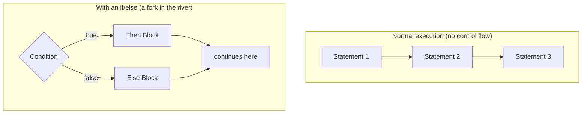
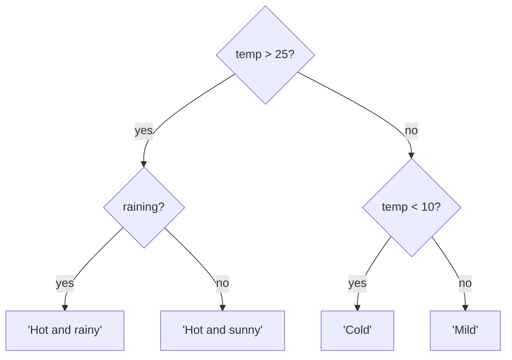
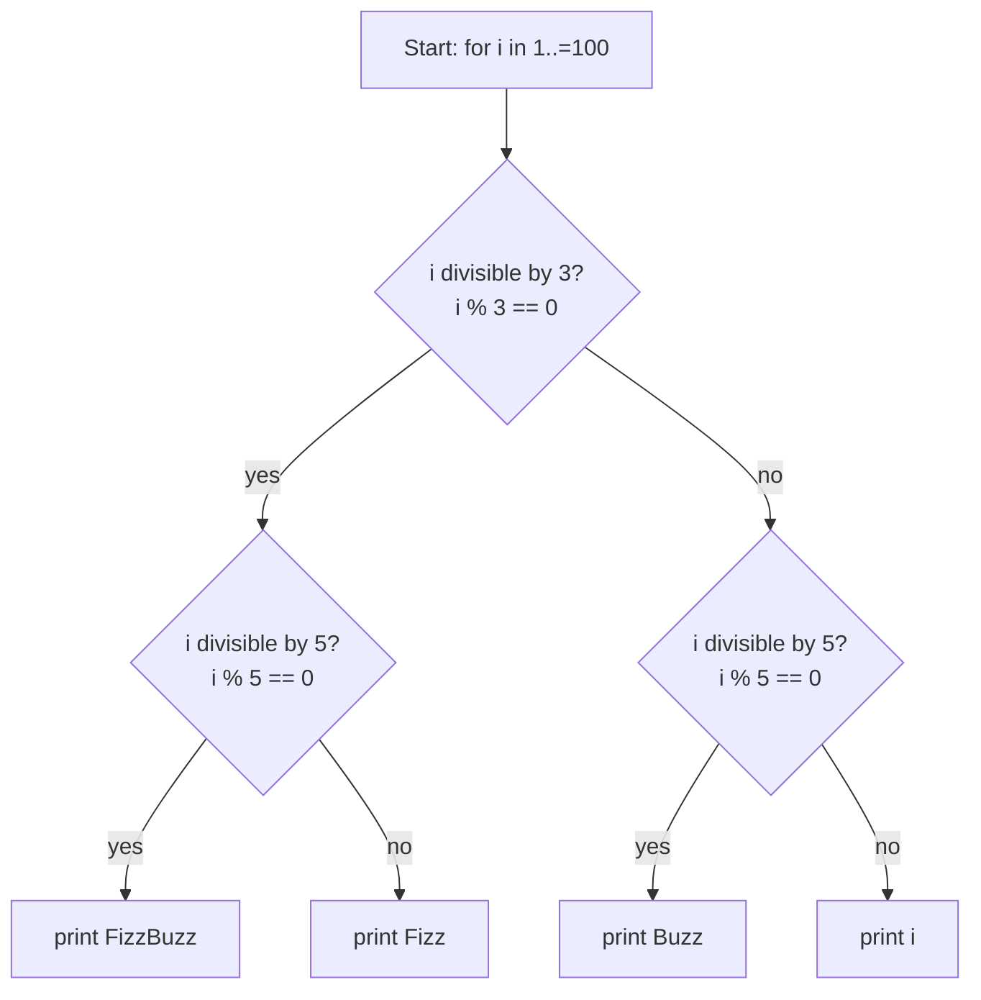

# Chapter 07: Control Flow — Directing Your Program's Path

> "A program without control flow is like a river without banks — it goes nowhere interesting."
> — Anonymous

---

## Chapter Overview

Every program you have ever used makes decisions. When you type a wrong password, the app says "incorrect password" instead of letting you in. When a game detects that your health is zero, it shows a game-over screen. When a spreadsheet sums a column, it repeats an operation for every row. All of these behaviors are driven by **control flow** — the mechanism that lets a program decide *which* instructions to execute, in *what order*, and *how many times*.

By default, a computer executes code one line at a time, from top to bottom, like reading a book. Control flow lets us break that straight-line execution. We can say "jump to this section if a condition is true," or "repeat this block ten times," or "stop executing this function and return a value." Without control flow, every program would be as dumb as a grocery list — it would do exactly the same thing every single time.

In this chapter, we will study control flow deeply — both as a concept and as something we must implement in our Astra compiler. We will look at `if/else` statements, comparison operators, boolean logic, `match` expressions (Astra's upgrade to switch statements), guard clauses, and dead code. We will also define the AST (Abstract Syntax Tree) nodes that our compiler will use to represent these constructs internally. By the end of this chapter, you will understand not just how to *use* control flow, but how a compiler *sees* it.

---

## What We're Building

In our Astra compiler journey, we are currently building up the **AST layer** — the data structures that represent a parsed Astra program in memory. Control flow is at the heart of almost every real program, so we need solid AST nodes for `if`, `else`, and `match`. In this chapter we will define those nodes in Go, in the file `ast/statements.go`. These nodes will be used by the parser (Chapter 15), type checker (Chapter 22), and code generator (Chapter 35).

---

## Table of Contents

1. The Program as a River — Control Flow Visualized
2. The `if` Statement in Go
3. The `if` Statement in Astra — Cleaner Syntax
4. The Dangling Else Problem (and How Astra Solves It)
5. Comparison Operators and What They Return
6. Boolean Logic: `&&`, `||`, `!` with Truth Tables
7. Short-Circuit Evaluation
8. Nested `if` Statements
9. Guard Clauses and Early Returns
10. The Ternary Operator — Why Astra Doesn't Have One
11. Switch vs Match — Pattern Matching Preview
12. Control Flow in the Compiler
13. Dead Code — What It Is and When Compilers Detect It
14. Flowcharts and ASCII Diagrams
15. Astra Build Milestone: AST Nodes for Control Flow
16. Exercises
17. Summary

---

## 1. The Program as a River — Control Flow Visualized

Imagine water flowing down a river. In calm sections, the water flows in one straight channel. But rivers also have **forks** (the water must go left or right), **loops** (water circling in an eddy), and **waterfalls** (an abrupt jump to a lower level). A program works the same way.



The "fork" is where a condition is evaluated. If it is true, the program takes one path; if false, it takes another. Both paths eventually converge back into the single stream of execution (unless one of them exits the function entirely).

The term **control flow** comes from this metaphor: the *flow* of execution through your program is *controlled* by conditions and loops.

---

## 2. The `if` Statement in Go

In Go, an `if` statement looks like this:

```go
package main

import "fmt"

func main() {
    age := 20

    if age >= 18 {
        fmt.Println("You are an adult.")
    }
}
```

Key rules in Go's `if`:
- No parentheses around the condition (`age >= 18`, not `(age >= 18)`)
- The opening brace `{` must be on the **same line** as `if` — Go enforces this
- The body is always enclosed in braces `{ }`

**Adding an `else` branch:**

```go
if age >= 18 {
    fmt.Println("Adult")
} else {
    fmt.Println("Minor")
}
```

**The `else if` chain:**

```go
score := 85

if score >= 90 {
    fmt.Println("Grade: A")
} else if score >= 80 {
    fmt.Println("Grade: B")
} else if score >= 70 {
    fmt.Println("Grade: C")
} else {
    fmt.Println("Grade: F")
}
```

**Go's special initializer syntax:**

Go has a unique feature — you can run a short statement before the condition:

```go
// The variable 'err' is scoped only to this if block
if err := doSomething(); err != nil {
    fmt.Println("Error:", err)
}
```

This is very common in Go for error handling, but Astra will not use this pattern (we will use a cleaner `Result` type instead).

---

## 3. The `if` Statement in Astra — Cleaner Syntax

Astra's `if` statement is inspired by Go's but is even cleaner:

```astra
let age = 20

if age >= 18 {
    print("Adult")
}

if age >= 18 {
    print("Adult")
} else {
    print("Minor")
}

let score = 85
if score >= 90 {
    print("A")
} else if score >= 80 {
    print("B")
} else if score >= 70 {
    print("C")
} else {
    print("F")
}
```

**Comparison with other languages:**

```
Java / C / JavaScript (old style):
    if (age >= 18) {
        System.out.println("Adult");  // parentheses required
    }

Python:
    if age >= 18:          # colon, no braces
        print("Adult")     # indentation is syntax

Go:
    if age >= 18 {         // no parens, brace required
        fmt.Println("Adult")
    }

Astra:
    if age >= 18 {         // same as Go — clean and explicit
        print("Adult")
    }
```

Astra deliberately follows Go's approach. The removal of parentheses from `if` conditions is a readability win — the condition is already visually distinct because it sits between `if` and `{`. Adding parentheses around it is just noise.

---

## 4. The Dangling Else Problem (and How Astra Solves It)

The **dangling else problem** is a classic ambiguity in programming language design. Consider this C code:

```c
// C code — which 'if' does the 'else' belong to?
if (x > 0)
    if (y > 0)
        printf("Both positive");
    else
        printf("x positive, y not");   // does this belong to inner or outer if?
```

In C, the `else` binds to the **nearest** `if` — so it belongs to the inner `if`. But visually, the indentation suggests it might belong to the outer `if`. This ambiguity has caused real bugs in production software.

**How Astra solves this: mandatory braces.**

Astra requires braces around every `if` body, no exceptions. There is no single-line `if` without braces. This completely eliminates the dangling else problem:

```astra
// This is a compile error in Astra:
if x > 0
    print("positive")    // ERROR: must use braces

// This is correct:
if x > 0 {
    if y > 0 {
        print("Both positive")
    } else {
        print("x positive, y not")  // crystal clear which if this belongs to
    }
}
```

The Apple SSL/TLS bug of 2014 ("goto fail") was caused by missing braces in an `if` statement. A mandatory-brace rule would have prevented it. Language design matters.

---

## 5. Comparison Operators and What They Return

Comparison operators take two values and return a **boolean** — either `true` or `false`.

```
Operator  Meaning                 Example           Result
────────────────────────────────────────────────────────────
==        Equal to                5 == 5            true
!=        Not equal to            5 != 3            true
<         Less than               3 < 5             true
>         Greater than            5 > 3             true
<=        Less than or equal      5 <= 5            true
>=        Greater than or equal   6 >= 5            true
```

**In Go:**
```go
x := 5
fmt.Println(x == 5)   // true
fmt.Println(x != 3)   // true
fmt.Println(x < 10)   // true
fmt.Println(x > 10)   // false
```

**In Astra:**
```astra
let x = 5
print(x == 5)    // true
print(x != 3)    // true
print(x < 10)    // true
```

**Common mistake — assignment vs comparison:**
```go
// WRONG in many languages: uses = instead of ==
if x = 5 {   // this is an assignment, not a comparison!
    ...
}

// Go catches this — it will not compile because 'x = 5' is a statement, not an expression
// Astra catches this too
```

---

## 6. Boolean Logic: `&&`, `||`, `!` with Truth Tables

**Boolean values** are named after George Boole, a 19th-century mathematician who developed a system of logical algebra. In programming, a boolean (`bool`) has exactly two possible values: `true` or `false`.

The three boolean operators:

**AND (`&&`) — both must be true:**

```
A       B       A && B
──────────────────────
false   false   false
false   true    false
true    false   false
true    true    true     ← only this row is true
```

**OR (`||`) — at least one must be true:**

```
A       B       A || B
──────────────────────
false   false   false    ← only this row is false
false   true    true
true    false   true
true    true    true
```

**NOT (`!`) — flips the value:**

```
A       !A
──────────
false   true
true    false
```

**In Go and Astra:**

```go
// Go
age := 25
hasID := true

if age >= 18 && hasID {
    fmt.Println("Can enter")
}

if age < 13 || age > 65 {
    fmt.Println("Special pricing")
}

isLoggedIn := false
if !isLoggedIn {
    fmt.Println("Please log in")
}
```

```astra
// Astra
let age = 25
let has_id = true

if age >= 18 && has_id {
    print("Can enter")
}

if age < 13 || age > 65 {
    print("Special pricing")
}

let is_logged_in = false
if !is_logged_in {
    print("Please log in")
}
```

**Operator precedence (order of evaluation):**

```
Highest precedence (evaluated first):
  !  (NOT)
  <  >  <=  >=  ==  !=
  &&  (AND)
  ||  (OR)       ← lowest precedence
```

This means `a && b || c` is evaluated as `(a && b) || c`, not `a && (b || c)`. When in doubt, use parentheses to make your intent explicit.

---

## 7. Short-Circuit Evaluation

**Short-circuit evaluation** is a performance optimization (and safety feature) that all modern languages implement. It means:

- With `&&`: if the LEFT side is `false`, the RIGHT side is NOT evaluated (because the result can only be `false` regardless)
- With `||`: if the LEFT side is `true`, the RIGHT side is NOT evaluated (because the result can only be `true` regardless)

**Why does this matter?**

```go
// In Go
var user *User = nil   // user is nil (no user object)

// SAFE because of short-circuit:
if user != nil && user.Age > 18 {
    fmt.Println("Adult user")
}
// If user is nil, the second condition is NEVER evaluated,
// so we never try to access user.Age — no crash!

// WITHOUT short-circuit (hypothetical):
if user != nil && user.Age > 18  {   // if user is nil, accessing user.Age would PANIC
}
```

The pattern `if x != nil && x.field > 0` is extremely common in Go and Astra. It is safe precisely because of short-circuit evaluation.

```
Short-circuit AND:
  false && ???  →  false   (right side skipped)
  true  && ???  →  evaluate right side

Short-circuit OR:
  true  || ???  →  true    (right side skipped)
  false || ???  →  evaluate right side
```

---

## 8. Nested `if` Statements

You can place `if` statements inside other `if` statements. This is called **nesting**.

```astra
let temperature = 30
let is_raining = false

if temperature > 25 {
    if is_raining {
        print("Hot and rainy — bring an umbrella")
    } else {
        print("Hot and sunny — wear sunscreen")
    }
} else {
    if temperature < 10 {
        print("Cold — wear a jacket")
    } else {
        print("Mild — light clothing is fine")
    }
}
```

**ASCII control flow diagram for the above:**



**Warning:** deeply nested `if` statements become hard to read. As a rule of thumb, if you are nesting more than 2-3 levels deep, consider restructuring your code using guard clauses (next section) or breaking logic into smaller functions.

---

## 9. Guard Clauses and Early Returns

A **guard clause** is an `if` statement at the top of a function that immediately returns (or errors out) if a precondition is not met. Guard clauses invert the usual pattern of nesting — instead of wrapping the "happy path" inside an `if`, you exit early for all the error/invalid cases.

**Without guard clauses (deeply nested, hard to read):**

```go
func processOrder(order *Order) string {
    if order != nil {
        if order.IsValid() {
            if order.InStock() {
                if order.PaymentConfirmed() {
                    return "Order processed successfully"
                } else {
                    return "Payment failed"
                }
            } else {
                return "Item out of stock"
            }
        } else {
            return "Invalid order"
        }
    } else {
        return "No order provided"
    }
}
```

**With guard clauses (flat, easy to read):**

```go
func processOrder(order *Order) string {
    if order == nil {
        return "No order provided"       // guard: exit early
    }
    if !order.IsValid() {
        return "Invalid order"           // guard: exit early
    }
    if !order.InStock() {
        return "Item out of stock"       // guard: exit early
    }
    if !order.PaymentConfirmed() {
        return "Payment failed"          // guard: exit early
    }

    return "Order processed successfully"  // happy path at the end, no nesting
}
```

**In Astra:**

```astra
fn process_order(order: Order) -> string {
    if order == nil {
        return "No order provided"
    }
    if !order.is_valid() {
        return "Invalid order"
    }
    if !order.in_stock() {
        return "Out of stock"
    }

    return "Processed"
}
```

Guard clauses are one of the most powerful readability techniques in programming. They make the structure of your function immediately obvious: the first few lines handle all the "bad" cases, and everything below is the "good path."

---

## 10. The Ternary Operator — Why Astra Doesn't Have One

Many languages have a **ternary operator** — a compact way to write an `if/else` expression in one line:

```javascript
// JavaScript ternary
let label = age >= 18 ? "Adult" : "Minor";
//                    ^         ^
//              if-true     if-false
```

```python
# Python ternary
label = "Adult" if age >= 18 else "Minor"
```

Astra does **not** have a ternary operator. Here's why:

1. **Readability for beginners:** The `?` and `:` symbols are non-obvious. You have to learn what they mean. `if/else` is self-documenting.
2. **Nesting becomes unreadable:** Nested ternaries are notoriously confusing: `a ? b ? c : d : e`
3. **Go doesn't have it either** — and Go is one of the most readable mainstream languages
4. **`if` in Astra is already concise enough**

Instead of a ternary, Astra encourages using a straightforward `if/else`:

```astra
// No ternary in Astra — use if/else
let label = ""
if age >= 18 {
    label = "Adult"
} else {
    label = "Minor"
}

// Or use a function
fn age_label(age: int) -> string {
    if age >= 18 {
        return "Adult"
    }
    return "Minor"
}
let label = age_label(age)
```

The second approach (using a function) is often cleaner anyway because it gives the concept a name.

---

## 11. Switch vs Match — Pattern Matching Preview

**Switch statements** in Go and C-family languages test a single value against multiple cases:

```go
// Go switch
day := "Monday"

switch day {
case "Monday", "Tuesday", "Wednesday", "Thursday", "Friday":
    fmt.Println("Weekday")
case "Saturday", "Sunday":
    fmt.Println("Weekend")
default:
    fmt.Println("Unknown day")
}
```

Go's switch is already much better than C's — in C, you need `break` after every case or execution **falls through** to the next case (a notorious source of bugs). Go has no fall-through by default.

**Astra's `match` expression** is even more powerful — it supports **pattern matching**, which lets you match on structure, not just values:

```astra
// Astra match — basic value matching
let day = "Monday"

match day {
    "Saturday" | "Sunday" => { print("Weekend") }
    _ => { print("Weekday") }         // _ is the wildcard: matches anything
}

// match on a number with ranges
let score = 85
match score {
    90..100 => { print("A") }
    80..90  => { print("B") }
    70..80  => { print("C") }
    _       => { print("F") }
}

// match on types (later chapters)
match value {
    int n   => { print("Got an int: " + n) }
    string s => { print("Got a string: " + s) }
    _        => { print("Got something else") }
}
```

The `match` expression in Astra is **exhaustive** — the compiler requires that all possible cases are covered (either with specific cases or a `_` wildcard). This prevents a whole class of bugs where new enum variants are added but existing match expressions forget to handle them.

```
Pattern matching power comparison:

C switch:      Can only match integers and characters.
               Fall-through is the default (requires break).

Go switch:     Can match any comparable value.
               No fall-through by default (clean!).
               Can use expressions in cases.

Astra match:   Can match values, ranges, types, and structures.
               Exhaustiveness checked by the compiler.
               Returns a value (it's an expression, not just a statement).
```

---

## 12. Control Flow in the Compiler

Our Astra compiler itself uses control flow constantly — it is just a Go program, after all. Let's look at how control flow appears in the lexer and parser stages:

```go
// In the lexer: classifying a character
func (l *Lexer) nextToken() Token {
    ch := l.current()

    // Guard clauses for special characters
    if ch == 0 {
        return Token{Type: EOF}
    }

    if isWhitespace(ch) {
        l.skipWhitespace()
        return l.nextToken()
    }

    if isDigit(ch) {
        return l.readNumber()
    }

    if isLetter(ch) {
        return l.readIdentifier()
    }

    // Switch on operator characters
    switch ch {
    case '+':
        l.advance()
        return Token{Type: PLUS, Lexeme: "+"}
    case '-':
        l.advance()
        return Token{Type: MINUS, Lexeme: "-"}
    case '*':
        l.advance()
        return Token{Type: STAR, Lexeme: "*"}
    case '/':
        l.advance()
        return Token{Type: SLASH, Lexeme: "/"}
    case '(':
        l.advance()
        return Token{Type: LPAREN, Lexeme: "("}
    case ')':
        l.advance()
        return Token{Type: RPAREN, Lexeme: ")"}
    case '{':
        l.advance()
        return Token{Type: LBRACE, Lexeme: "{"}
    case '}':
        l.advance()
        return Token{Type: RBRACE, Lexeme: "}"}
    default:
        return Token{Type: ILLEGAL, Lexeme: string(ch)}
    }
}
```

This is real control flow used in a real compiler. Notice the guard clauses at the top (handle EOF and whitespace first), followed by the main dispatch switch. This pattern will appear many times in our Astra compiler's source code.

---

## 13. Dead Code — What It Is and When Compilers Detect It

**Dead code** is code that can never be executed. It exists in the source file but no control flow path will ever reach it.

```go
// Example of dead code
func example() int {
    return 42
    fmt.Println("This will never run")   // DEAD CODE: unreachable after return
}
```

```astra
// Astra examples of dead code
fn classify(score: int) -> string {
    if score >= 0 {
        return "Non-negative"
    } else {
        return "Negative"
    }
    print("unreachable")   // ERROR: dead code — both branches return
}
```

**When compilers can detect dead code:**

```
Easy to detect:
  - Code after a return statement
  - Code after a break/continue
  - An else branch that immediately follows an if branch that always returns

Hard to detect (requires deep analysis):
  - if (false) { ... }       — obvious to a human, requires constant folding
  - Code after an infinite loop — requires proving the loop never exits
  - Code in a function that is never called — requires whole-program analysis
```

Go will warn (and sometimes error) on some dead code. Astra's compiler will flag dead code as a warning during the semantic analysis phase (Chapter 22). Dead code is not just wasteful — it often indicates a logic error.

---

## 14. Flowcharts and ASCII Diagrams

Flowcharts are a visual way to represent control flow. Here is the notation we will use:

```
┌─────────────┐   Rectangle = a process/statement
│  Statement  │
└─────────────┘

┌─────────────┐   Diamond = a decision (condition)
│  Condition? │
└──────┬──────┘
   yes │  no

○  = start/end point (circle)

→  = flow direction
```

**Example: FizzBuzz flowchart**

FizzBuzz is a classic programming problem: for each number 1-100, print "Fizz" if divisible by 3, "Buzz" if divisible by 5, "FizzBuzz" if divisible by both, else print the number.



**In Astra:**

```astra
for i in 1..=100 {
    if i % 3 == 0 && i % 5 == 0 {
        print("FizzBuzz")
    } else if i % 3 == 0 {
        print("Fizz")
    } else if i % 5 == 0 {
        print("Buzz")
    } else {
        print(i)
    }
}
```

---

## 15. Astra Build Milestone: AST Nodes for Control Flow

Now we define the data structures that our Astra compiler will use to represent control flow in memory. Create the file `ast/statements.go`:

```go
// ast/statements.go
// This file defines AST node types for Astra's control flow statements.
// An AST (Abstract Syntax Tree) is a tree structure that represents
// the parsed structure of a program. Each node in the tree corresponds
// to one syntactic construct in the source code.

package ast

// ------------------------------------------------------------
// Interfaces
// ------------------------------------------------------------

// Node is the base interface for all AST nodes.
// Every node must be able to report its source position
// so we can give good error messages.
type Node interface {
    TokenLiteral() string  // the literal text of the token that started this node
    String() string        // human-readable representation for debugging
}

// Statement is a Node that doesn't produce a value.
// Examples: if statements, for loops, variable declarations.
type Statement interface {
    Node
    statementNode() // marker method to distinguish from Expression
}

// Expression is a Node that produces a value.
// Examples: 2 + 3, fn call, variable reference.
type Expression interface {
    Node
    expressionNode() // marker method to distinguish from Statement
}

// ------------------------------------------------------------
// BlockStatement
// ------------------------------------------------------------

// BlockStatement represents a sequence of statements enclosed in { }.
// It is used as the body of if, else, while, for, and function declarations.
//
// Example Astra source:
//   {
//       let x = 5
//       print(x)
//   }
type BlockStatement struct {
    Statements []Statement  // the list of statements inside the block
}

func (bs *BlockStatement) statementNode()       {}
func (bs *BlockStatement) TokenLiteral() string { return "{" }
func (bs *BlockStatement) String() string {
    result := "{\n"
    for _, s := range bs.Statements {
        result += "    " + s.String() + "\n"
    }
    result += "}"
    return result
}

// ------------------------------------------------------------
// IfStatement
// ------------------------------------------------------------

// IfStatement represents an if/else construct in Astra.
//
// Example Astra source:
//   if age >= 18 {
//       print("Adult")
//   } else {
//       print("Minor")
//   }
//
// AST representation:
//   IfStatement{
//       Condition: BinaryExpr{Left: Ident("age"), Op: ">=", Right: IntLit(18)},
//       Then:      BlockStatement{[CallExpr{print, ["Adult"]}]},
//       Else:      BlockStatement{[CallExpr{print, ["Minor"]}]},
//   }
type IfStatement struct {
    Condition Expression    // the boolean expression being tested
    Then      *BlockStatement  // executed if Condition is true
    Else      *BlockStatement  // executed if Condition is false; nil if no 'else'
}

func (is *IfStatement) statementNode()       {}
func (is *IfStatement) TokenLiteral() string { return "if" }
func (is *IfStatement) String() string {
    result := "if " + is.Condition.String() + " " + is.Then.String()
    if is.Else != nil {
        result += " else " + is.Else.String()
    }
    return result
}

// HasElse returns true if this if statement has an else branch.
func (is *IfStatement) HasElse() bool {
    return is.Else != nil
}

// ------------------------------------------------------------
// MatchStatement (Astra's switch)
// ------------------------------------------------------------

// MatchStatement represents Astra's match expression.
//
// Example Astra source:
//   match score {
//       90..100 => { print("A") }
//       80..90  => { print("B") }
//       _       => { print("F") }
//   }
type MatchStatement struct {
    Subject Expression   // the value being matched (e.g., 'score')
    Cases   []MatchCase  // the list of cases
}

func (ms *MatchStatement) statementNode()       {}
func (ms *MatchStatement) TokenLiteral() string { return "match" }
func (ms *MatchStatement) String() string {
    result := "match " + ms.Subject.String() + " {\n"
    for _, c := range ms.Cases {
        result += "    " + c.String() + "\n"
    }
    result += "}"
    return result
}

// MatchCase represents a single arm (case) of a match statement.
//
// Pattern is the value or pattern to match against.
// Body is executed when the pattern matches.
//
// Example:
//   90..100 => { print("A") }
//   ^^^^^^^    ^^^^^^^^^^^^^
//   Pattern    Body
type MatchCase struct {
    Pattern Expression    // what to match against (literal, range, wildcard, type)
    Body    *BlockStatement // code to run if the pattern matches
}

func (mc *MatchCase) String() string {
    return mc.Pattern.String() + " => " + mc.Body.String()
}

// WildcardPattern represents the _ (underscore) wildcard in a match statement.
// It matches any value and is used as the default case.
type WildcardPattern struct{}

func (wp *WildcardPattern) expressionNode()      {}
func (wp *WildcardPattern) TokenLiteral() string { return "_" }
func (wp *WildcardPattern) String() string       { return "_" }

// RangePattern represents a range like 80..90 in a match pattern.
type RangePattern struct {
    Low       Expression // start of range (inclusive)
    High      Expression // end of range (exclusive unless Inclusive is true)
    Inclusive bool       // true if ..= (inclusive end)
}

func (rp *RangePattern) expressionNode()      {}
func (rp *RangePattern) TokenLiteral() string { return ".." }
func (rp *RangePattern) String() string {
    op := ".."
    if rp.Inclusive {
        op = "..="
    }
    return rp.Low.String() + op + rp.High.String()
}

// OrPattern represents pattern1 | pattern2 in a match arm.
// Example: "Saturday" | "Sunday"
type OrPattern struct {
    Left  Expression
    Right Expression
}

func (op *OrPattern) expressionNode()      {}
func (op *OrPattern) TokenLiteral() string { return "|" }
func (op *OrPattern) String() string {
    return op.Left.String() + " | " + op.Right.String()
}

// ------------------------------------------------------------
// Connecting the tree: how these nodes relate
// ------------------------------------------------------------

// Here is how you would construct the AST for this Astra program:
//
//   if score >= 90 {
//       print("A")
//   } else if score >= 80 {
//       print("B")
//   } else {
//       print("F")
//   }
//
// The 'else if' is just an IfStatement inside the Else block:
//
//   IfStatement{
//       Condition: score >= 90,
//       Then:      { print("A") },
//       Else: {
//           IfStatement{
//               Condition: score >= 80,
//               Then:      { print("B") },
//               Else:      { print("F") },
//           }
//       }
//   }

func ExampleASTConstruction() {
    // Placeholder identifiers for the example
    // (In the real compiler, these come from the parser)
    _ = &IfStatement{
        Condition: nil, // would be: BinaryExpr{score, >=, 90}
        Then:      &BlockStatement{},
        Else: &BlockStatement{
            Statements: []Statement{
                &IfStatement{
                    Condition: nil, // would be: BinaryExpr{score, >=, 80}
                    Then:      &BlockStatement{},
                    Else:      &BlockStatement{},
                },
            },
        },
    }
}
```

**How to test this milestone:**

```go
// ast/statements_test.go
package ast

import (
    "testing"
)

func TestIfStatementHasElse(t *testing.T) {
    // An if with no else
    ifOnly := &IfStatement{
        Condition: nil,
        Then:      &BlockStatement{},
        Else:      nil,
    }
    if ifOnly.HasElse() {
        t.Error("Expected no else branch")
    }

    // An if with an else
    ifElse := &IfStatement{
        Condition: nil,
        Then:      &BlockStatement{},
        Else:      &BlockStatement{},
    }
    if !ifElse.HasElse() {
        t.Error("Expected else branch to be present")
    }
}

func TestMatchCaseWildcard(t *testing.T) {
    wildcard := &WildcardPattern{}
    if wildcard.String() != "_" {
        t.Errorf("Expected '_', got %s", wildcard.String())
    }
    if wildcard.TokenLiteral() != "_" {
        t.Errorf("Expected '_' token literal")
    }
}

func TestRangePatternString(t *testing.T) {
    // We can't use real IntLiteral nodes yet (defined in another file),
    // so we stub the test structure check
    rp := &RangePattern{
        Low:       &WildcardPattern{}, // placeholder
        High:      &WildcardPattern{}, // placeholder
        Inclusive: true,
    }
    // With Inclusive=true the operator should be ..=
    s := rp.String()
    if len(s) == 0 {
        t.Error("Expected non-empty string")
    }
}
```

Run the tests:

```bash
cd your-astra-compiler
go test ./ast/...
```

---

## 16. Exercises

1. **Truth Table Practice** — Write truth tables for the following expressions. Work through each row manually before checking with code:
   - `(a && b) || (!a && !b)` — what common logical operation is this?
   - `!(a || b)` — De Morgan's law: what is this equivalent to?
   *Hint: try all 4 combinations of a=T/F and b=T/F*

2. **Rewrite With Guard Clauses** — Rewrite the following function using guard clauses to eliminate nesting:
   ```go
   func processFile(path string) error {
       if path != "" {
           if fileExists(path) {
               if isReadable(path) {
                   return doProcessing(path)
               } else {
                   return errors.New("not readable")
               }
           } else {
               return errors.New("not found")
           }
       } else {
           return errors.New("empty path")
       }
   }
   ```
   *Hint: flip each condition and return early*

3. **Build the IfStatement** — In Go, construct the AST representation of this Astra code manually (as nested structs):
   ```astra
   if temperature > 30 {
       print("Hot")
   } else {
       print("Cool")
   }
   ```
   *Hint: use the IfStatement struct defined in the milestone*

4. **Dead Code Detection** — Which lines in the following Astra function are dead code? Explain why:
   ```astra
   fn classify(n: int) -> string {
       if n > 0 {
           return "positive"
       } else if n < 0 {
           return "negative"
       } else {
           return "zero"
       }
       print("done")   // line A
       return "?"      // line B
   }
   ```

5. **Match Statement Design** — Write an Astra `match` statement that classifies an HTTP status code:
   - 200-299: "Success"
   - 300-399: "Redirect"
   - 400-499: "Client Error"
   - 500-599: "Server Error"
   - Anything else: "Unknown"
   *Hint: use range patterns with `..`*

6. **Short-Circuit Safety** — Explain why the following code is safe in Astra even though `items` might be empty:
   ```astra
   if items.length() > 0 && items[0] == "start" {
       print("Found start marker")
   }
   ```
   What would happen without short-circuit evaluation?

7. **Add WildcardPattern to the Parser** — Looking at the AST milestone code, where in the compiler pipeline would you need to handle `WildcardPattern`? List at least 3 compiler phases that need to know about it, and briefly describe what each phase does with it.

8. **Flowchart Exercise** — Draw an ASCII flowchart for this Astra program:
   ```astra
   let x = 10
   if x > 5 {
       if x > 8 {
           print("big")
       } else {
           print("medium")
       }
   } else {
       print("small")
   }
   ```

---

## 17. Summary

| Concept | Go Syntax | Astra Syntax | Notes |
|---|---|---|---|
| Basic if | `if cond { }` | `if cond { }` | No parentheses required |
| If-else | `if c { } else { }` | `if c { } else { }` | Same |
| Else-if | `else if c { }` | `else if c { }` | Chain of conditions |
| Braces | Optional in some langs | **Mandatory** | Prevents dangling else |
| AND | `&&` | `&&` | Short-circuits |
| OR | `\|\|` | `\|\|` | Short-circuits |
| NOT | `!` | `!` | Flips boolean |
| Switch | `switch val { case x: }` | `match val { x => { } }` | Astra is exhaustive |
| Wildcard | `default:` | `_ =>` | Catches all remaining cases |
| Ternary | Not available in Go | **Not in Astra** | Use if/else instead |
| Guard clause | Early return pattern | Same | Reduces nesting |
| Dead code | Go warns on some | Astra warns more | Code after return |

**Key takeaways:**
- Control flow is the mechanism that makes programs make decisions
- Mandatory braces in Astra prevent the dangling else problem
- Short-circuit evaluation makes `nil && x.field` patterns safe
- Guard clauses dramatically improve readability by inverting conditions and returning early
- Astra's `match` is more powerful than switch: it is exhaustive and supports pattern matching
- The AST nodes `IfStatement`, `MatchStatement`, and `MatchCase` are the compiler's internal representation of control flow

---

*Next chapter: Chapter 08 — Loops: Making Computers Do Repetitive Work*
