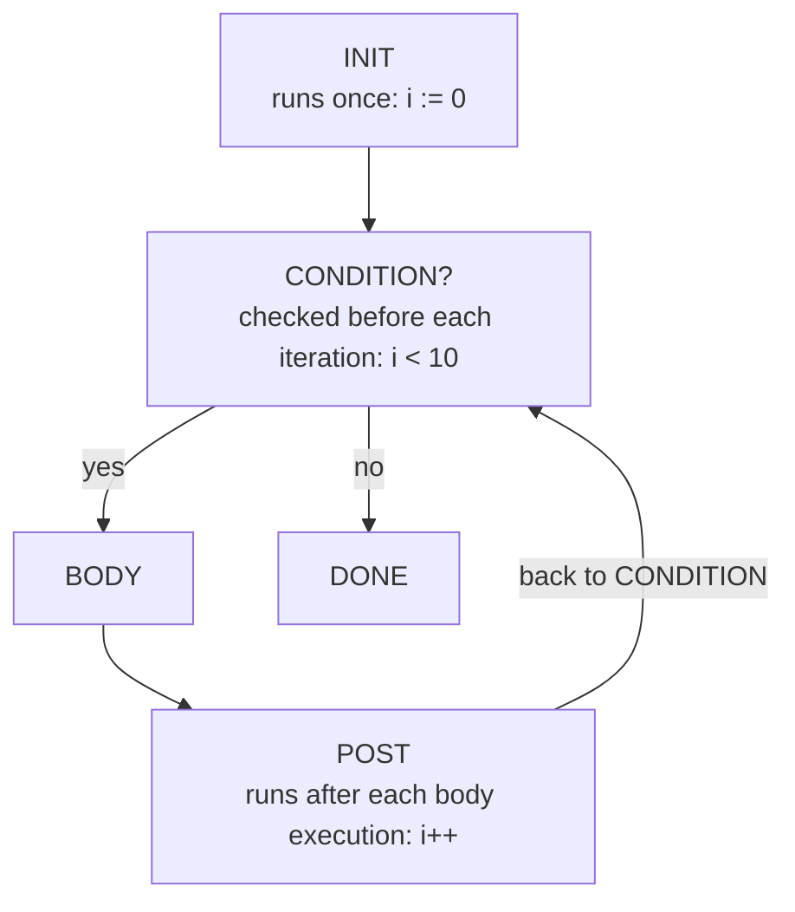
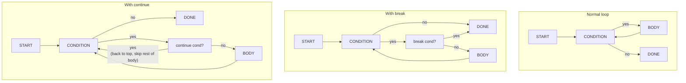

# Chapter 08: Loops — Making Computers Do Repetitive Work

> "Computers are incredibly fast at doing the same thing over and over again. The hard part is telling them exactly what to do."
> — Anonymous

---

## Chapter Overview

If there is one thing that separates computers from all other tools ever invented, it is their ability to do the same thing millions of times without getting bored, tired, or making mistakes from repetition. A human accountant who needs to add up 10,000 numbers will make errors somewhere around the 200th number. A computer can add 10,000 numbers in a microsecond, perfectly, every single time. **Loops** are the programming construct that harnesses this power.

A loop is a set of instructions that repeats until a condition is met. At its simplest, a loop says: "Keep doing this until I tell you to stop." But loops are more nuanced than that — they have different forms optimized for different use cases. There are loops that run a fixed number of times, loops that run until a condition becomes false, loops that step through every item in a collection, and even intentional infinite loops (used in servers and games that should run forever).

In this chapter, we will explore loops from both the user's perspective (writing Astra code) and the compiler's perspective (representing loops in the AST). We will look at common loop mistakes like off-by-one errors, discuss when to use recursion instead of iteration, and define the AST nodes our Astra compiler needs to handle `for in`, `while`, `break`, and `continue`. We will also peek at how the compiler's own main scanning loop works — the compiler itself is full of loops.

---

## What We're Building

Every real-world program uses loops. Our Astra compiler will need to parse loop constructs from source code and represent them as AST nodes. In this chapter, we define those nodes in `ast/statements.go`. These nodes are essential for the parser, the type checker (which verifies that loop variables have the right type), and the code generator (which emits assembly/machine code for loops). We will also see how the Astra compiler's own lexer uses loops to scan through source code.

---

## Table of Contents

1. Why Loops Exist — The Power of Repetition
2. The `for` Loop in Go — Three Forms
3. Astra's `for in` Loop — Range Syntax
4. Astra's `while` Loop
5. Loop Control: `break` and `continue`
6. Labeled Breaks for Nested Loops
7. Infinite Loops — Intentional and Accidental
8. The Loop Invariant — Formal Thinking About Loops
9. Off-by-One Errors — The Most Common Loop Bug
10. Nested Loops and O(n²) Complexity
11. Iterators and the for-range Pattern in Go
12. Recursion vs Iteration — When to Use Which
13. Loop Unrolling — A Compiler Optimization Preview
14. How the Compiler's Own Loop Works
15. Astra Build Milestone: AST Nodes for Loops
16. Exercises
17. Summary

---

## 1. Why Loops Exist — The Power of Repetition

Imagine you are writing a program to print the numbers 1 to 10. Without loops, you would write:

```astra
print(1)
print(2)
print(3)
print(4)
print(5)
print(6)
print(7)
print(8)
print(9)
print(10)
```

That is ten lines of code. Now imagine printing 1 to 1,000,000. Or processing every record in a database of 50 million users. Without loops, these tasks are simply impossible to write. With loops, they are trivial:

```astra
for i in 1..=10 {
    print(i)
}
```

Six lines become three. A million lines become three. This is the fundamental power of loops.

**Real-world analogies:**

```
Loops in daily life:
  - "Read every email in your inbox"
  - "Check every item on the receipt"
  - "Repeat the exercise 10 times"
  - "Keep cooking until the timer goes off"

All of these are loops: a repeated action with a stopping condition.
```

---

## 2. The `for` Loop in Go — Three Forms

Go has only one loop keyword — `for` — but it can be used in three different ways. This elegant design means you only need to learn one keyword to understand all loop patterns.

**Form 1: The classic three-part for loop** (like C's for loop)

```go
// for init; condition; post { body }
for i := 0; i < 10; i++ {
    fmt.Println(i)
}
// i starts at 0, runs while i < 10, increments i after each iteration
// Prints: 0 1 2 3 4 5 6 7 8 9
```

The three parts:
- **init**: runs once before the loop starts (`i := 0`)
- **condition**: checked before each iteration; if false, loop stops (`i < 10`)
- **post**: runs after each iteration (`i++`, which means `i = i + 1`)

**Form 2: The while-style loop** (omit init and post)

```go
// Go has no 'while' keyword — use 'for' with only a condition
n := 1
for n < 100 {
    n = n * 2
}
fmt.Println(n) // 128 — first power of 2 that is >= 100
```

**Form 3: The range loop** (iterate over a collection)

```go
// Iterate over a slice
numbers := []int{10, 20, 30, 40, 50}
for index, value := range numbers {
    fmt.Printf("Index %d: %d\n", index, value)
}

// Iterate over a string (yields runes, not bytes)
for i, ch := range "Hello" {
    fmt.Printf("Position %d: %c\n", i, ch)
}

// Iterate over a map
ages := map[string]int{"Alice": 30, "Bob": 25}
for name, age := range ages {
    fmt.Printf("%s is %d years old\n", name, age)
}

// Use _ to discard the index or value
for _, value := range numbers {
    fmt.Println(value)  // only the value, no index
}
```



---

## 3. Astra's `for in` Loop — Range Syntax

Astra's primary loop is the `for in` loop with range syntax. It is designed to be intuitive and to avoid the most common mistakes of traditional for loops.

```astra
// Basic range: 0 to 9 (10 is excluded)
for i in 0..10 {
    print(i)
}
// Prints: 0 1 2 3 4 5 6 7 8 9

// Inclusive range: 0 to 10 (10 IS included)
for i in 0..=10 {
    print(i)
}
// Prints: 0 1 2 3 4 5 6 7 8 9 10

// Iterate over a list
let names = ["Alice", "Bob", "Carol"]
for name in names {
    print("Hello, " + name)
}

// Iterate with an index (using enumerate)
for i, name in names.enumerate() {
    print(i + ": " + name)
}

// Iterate over a string's characters
let greeting = "Hello"
for ch in greeting.chars() {
    print(ch)
}
```

**Why `for i in 0..10` is better than `for (int i = 0; i < 10; i++)`:**

```
Traditional C-style for loop — 4 things to get right:
  for (int i = 0;  i < 10;   i++) { ... }
       ^^^^^^^^^^  ^^^^^^^^  ^^^
       1. init     2. end     3. step
       Also: < vs <= (the off-by-one trap!)

Astra's for-in — just 2 things:
  for i in 0..10 { ... }
            ^^^^^^
            start and end — that's it.
            The step is always 1 (or use step() for custom)
```

**Custom step (skipping values):**

```astra
// Count by 2s: 0, 2, 4, 6, 8
for i in (0..10).step(2) {
    print(i)
}

// Count down: 10, 9, 8, ... 1
for i in (1..=10).rev() {
    print(i)
}
```

---

## 4. Astra's `while` Loop

When you don't know in advance how many iterations you need, use a `while` loop. The loop continues as long as its condition is true.

```astra
// Read and process until done
let input = get_next_input()
while input != "quit" {
    process(input)
    input = get_next_input()
}

// Wait until a condition is met
let retries = 0
while !server.connected() && retries < 5 {
    server.try_connect()
    retries = retries + 1
}

if !server.connected() {
    print("Failed to connect after 5 retries")
}
```

**The `loop` keyword for explicit infinite loops:**

```astra
// Astra also has 'loop' for intentional infinite loops
loop {
    let event = get_next_event()
    if event.type == "quit" {
        break
    }
    handle(event)
}
```

This is clearer than `while true { }` because it explicitly signals intent: "this is meant to run forever until explicitly broken."

---

## 5. Loop Control: `break` and `continue`

Two keywords let you alter the normal flow of a loop:

**`break` — exit the loop immediately:**

```astra
// Search for the first negative number
let numbers = [3, 7, -2, 9, -5, 1]
let first_negative = 0

for n in numbers {
    if n < 0 {
        first_negative = n
        break       // stop as soon as we find one
    }
}

print("First negative: " + first_negative)
```

**`continue` — skip to the next iteration:**

```astra
// Print only even numbers
for i in 0..20 {
    if i % 2 != 0 {
        continue    // skip odd numbers
    }
    print(i)        // only reached for even numbers
}
```

**In Go (identical concept):**

```go
// break
for i := 0; i < 100; i++ {
    if i*i > 50 {
        break
    }
    fmt.Println(i)
}

// continue
for i := 0; i < 10; i++ {
    if i%2 != 0 {
        continue
    }
    fmt.Println(i)  // 0 2 4 6 8
}
```



---

## 6. Labeled Breaks for Nested Loops

When you have nested loops and want to break out of the **outer** loop from inside the **inner** loop, you need a labeled break.

**In Go (uses goto-style labels):**

```go
outer:
for i := 0; i < 5; i++ {
    for j := 0; j < 5; j++ {
        if i+j == 6 {
            fmt.Printf("Found: i=%d, j=%d\n", i, j)
            break outer   // breaks out of the outer loop, not just the inner one
        }
    }
}
fmt.Println("Done")
```

**In Astra (similar syntax):**

```astra
'outer: for i in 0..5 {
    for j in 0..5 {
        if i + j == 6 {
            print("Found: i=" + i + ", j=" + j)
            break 'outer    // exits the labeled outer loop
        }
    }
}
```

**When do you need labeled breaks?**

```astra
// Searching a 2D grid for a target value
let grid = [[1, 2, 3], [4, 5, 6], [7, 8, 9]]
let target = 5
let found = false
let found_row = 0
let found_col = 0

'search: for row_idx in 0..grid.length() {
    for col_idx in 0..grid[row_idx].length() {
        if grid[row_idx][col_idx] == target {
            found = true
            found_row = row_idx
            found_col = col_idx
            break 'search   // no point continuing; we found it
        }
    }
}

if found {
    print("Found at row " + found_row + ", col " + found_col)
}
```

---

## 7. Infinite Loops — Intentional and Accidental

**Intentional infinite loops** are loops designed to run forever. They are common in:

- **Game loops:** keep rendering the screen until the player quits
- **Server loops:** keep accepting connections until the server is shut down
- **Event loops:** keep processing user input until the application exits

```astra
// A game loop in Astra
loop {
    let input = get_input()
    update_game_state(input)
    render_frame()

    if game_state.should_quit {
        break
    }
}

// A server accept loop
loop {
    let conn = server.accept()      // blocks until a client connects
    handle_connection_async(conn)   // handle it in the background
}
```

**Accidental infinite loops** are bugs. They happen when the loop's condition never becomes false:

```astra
// BUG: infinite loop — i is never incremented inside the loop
let i = 0
while i < 10 {
    print(i)
    // forgot to write: i = i + 1
}

// BUG: loop condition always true
while true {
    print("stuck forever")
    // forgot to add a break condition
}
```

**How to debug an infinite loop:**
1. Add a counter and print it every N iterations — you will see it growing
2. Add a maximum iteration limit with a `break`
3. Inspect whether the loop variable is actually changing

```go
// Debugging technique: add a safety counter
maxIter := 1_000_000
count := 0
for condition {
    if count > maxIter {
        fmt.Println("Safety limit reached — possible infinite loop!")
        break
    }
    count++
    // ... loop body
}
```

---

## 8. The Loop Invariant — Formal Thinking About Loops

A **loop invariant** is a condition that is true before the loop starts, remains true before and after every iteration, and helps you prove the loop is correct. This sounds academic, but it is a powerful way to reason about whether your loop does what you think it does.

**Example: finding the maximum element in a list**

```astra
fn find_max(numbers: List<int>) -> int {
    let max = numbers[0]   // assume first element is max

    // Loop invariant: 'max' is the maximum of all elements we have seen so far
    for n in numbers {
        if n > max {
            max = n
        }
        // After this iteration: 'max' is still the maximum of all elements seen
    }
    // After the loop: 'max' is the maximum of ALL elements (invariant + loop finished)
    return max
}
```

The loop invariant is: "at the start of each iteration, `max` holds the maximum value of all elements processed so far."

- Before iteration 1: `max = numbers[0]`, which is trivially the max of [numbers[0]]. ✓
- After iteration k: `max` is the max of the first k elements. ✓
- After all iterations: `max` is the max of all elements. ✓

Understanding loop invariants helps you:
1. Write correct loops the first time
2. Debug loops that produce wrong results
3. Understand what a loop is *actually computing*

---

## 9. Off-by-One Errors — The Most Common Loop Bug

An **off-by-one error** (OBOE) is when a loop runs one too many or one too few times. It is one of the most common bugs in programming, especially for beginners.

```
The classic OBOE scenario:
  You want to process items 0 through 9 (10 items total).

  CORRECT:      for i in 0..10   (0 to 9, exclusive end)
  WRONG (too many):  for i in 0..=10  (0 to 10, 11 iterations)
  WRONG (too few):   for i in 1..10   (1 to 9, 9 iterations)
  WRONG (too few):   for i in 0..9    (0 to 8, 9 iterations)
```

**The fence post problem:**

If you build a fence that is 10 meters long with posts every 1 meter, how many posts do you need? 11 — because there is a post at both ends (0m, 1m, 2m, ..., 10m). The "off-by-one" in fence building is whether you count the *sections* (10) or the *posts* (11).

```
Posts:   |    |    |    |    |    |    |    |    |    |    |
         0    1    2    3    4    5    6    7    8    9    10
Sections:   0    1    2    3    4    5    6    7    8    9

Number of sections = 10
Number of posts    = 11  (sections + 1)
```

**Astra's solution — explicit exclusive vs inclusive ranges:**

```astra
0..10    // exclusive end: 0, 1, 2, ..., 9     (10 items)
0..=10   // inclusive end: 0, 1, 2, ..., 10    (11 items)
```

The explicit `..` vs `..=` notation makes your intent crystal clear and reduces the chance of OBOE. No more guessing whether the loop condition should be `< 10` or `<= 10`.

**Real-world OBOE examples:**

```astra
// Off-by-one when slicing strings or lists
let s = "Hello"
// s has indices 0..4 (5 characters)
// WRONG: s.slice(0, 6)  — index 5 doesn't exist!
// CORRECT: s.slice(0, 5)

// Off-by-one in a search
let items = [10, 20, 30, 40, 50]
// Items are at indices 0, 1, 2, 3, 4
// WRONG: for i in 0..=items.length() — index 5 doesn't exist!
// CORRECT: for i in 0..items.length()
```

---

## 10. Nested Loops and O(n²) Complexity

When you put a loop inside another loop, you get a **nested loop**. For every iteration of the outer loop, the inner loop runs all its iterations. This means the total number of iterations is multiplied.

```astra
// Nested loop: prints every (i, j) pair
for i in 0..3 {
    for j in 0..3 {
        print("(" + i + ", " + j + ")")
    }
}
// Output: (0,0) (0,1) (0,2) (1,0) (1,1) (1,2) (2,0) (2,1) (2,2)
// Total iterations: 3 × 3 = 9
```

**The problem with nested loops:**

If the outer loop runs `n` times and the inner loop also runs `n` times, the total iterations are `n × n = n²`. This is called **O(n²) time complexity** (pronounced "big-O of n-squared").

```
n = 10:      10 × 10 = 100 iterations      (fast)
n = 1,000:   1,000 × 1,000 = 1,000,000    (still OK)
n = 100,000: 100,000 × 100,000 = 10^10    (10 billion — SLOW)
```

A classic example of accidental O(n²) is the **bubble sort** algorithm:

```astra
// Bubble sort — O(n²) — fine for small lists, terrible for large ones
fn bubble_sort(list: List<int>) {
    for i in 0..list.length() {
        for j in 0..list.length() - 1 {
            if list[j] > list[j+1] {
                let temp = list[j]
                list[j] = list[j+1]
                list[j+1] = temp
            }
        }
    }
}
```

We will study algorithm complexity in depth in later chapters. For now, just be aware: **nested loops are expensive** and should be avoided for large datasets when possible.

---

## 11. Iterators and the for-range Pattern in Go

In Go, the `range` keyword is used with `for` to iterate over **iterable** types — slices, arrays, maps, strings, and channels.

```go
// Slice iteration
fruits := []string{"apple", "banana", "cherry"}
for i, fruit := range fruits {
    fmt.Printf("%d: %s\n", i, fruit)
}

// Map iteration (order is NOT guaranteed)
capitals := map[string]string{
    "France": "Paris",
    "Japan":  "Tokyo",
    "Brazil": "Brasilia",
}
for country, capital := range capitals {
    fmt.Printf("%s → %s\n", country, capital)
}

// Channel iteration (reads until channel is closed)
ch := make(chan int)
go func() {
    ch <- 1
    ch <- 2
    ch <- 3
    close(ch)
}()
for val := range ch {
    fmt.Println(val)
}

// String iteration (iterates over RUNES, not bytes)
for i, r := range "Hello, 世界" {
    fmt.Printf("Byte index %d: %c\n", i, r)
}
```

**Astra will have a similar mechanism — the `Iterable` trait:**

```astra
// Any type that implements Iterable can be used in a for-in loop
// (Traits are covered in Chapter 28)

// Built-in iterables:
for i in 0..10 { }          // Range is iterable
for item in my_list { }     // List<T> is iterable
for ch in my_string.chars() { }  // CharIterator is iterable
for key, val in my_map { }  // Map<K,V> is iterable
```

---

## 12. Recursion vs Iteration — When to Use Which

**Recursion** is when a function calls itself. **Iteration** is a loop. Both can solve the same problems, but they have different trade-offs.

**Factorial: both approaches**

```go
// Iterative factorial
func factorialIter(n int) int {
    result := 1
    for i := 2; i <= n; i++ {
        result *= i
    }
    return result
}

// Recursive factorial
func factorialRec(n int) int {
    if n <= 1 {           // base case — stops recursion
        return 1
    }
    return n * factorialRec(n-1)  // recursive call
}
```

```astra
// Iterative in Astra
fn factorial_iter(n: int) -> int {
    let result = 1
    for i in 2..=n {
        result = result * i
    }
    return result
}

// Recursive in Astra
fn factorial_rec(n: int) -> int {
    if n <= 1 {
        return 1
    }
    return n * factorial_rec(n - 1)
}
```

**When to use iteration:**
- The problem is naturally sequential (process each element once)
- Performance is critical (no function call overhead)
- The depth is large (risk of stack overflow with recursion)

**When to use recursion:**
- The problem has a naturally recursive structure (trees, graphs, nested data)
- The recursive solution is significantly clearer
- The depth is bounded and small

**The call stack diagram for `factorial_rec(4)`:**

```
factorial_rec(4)
  └── 4 * factorial_rec(3)
         └── 3 * factorial_rec(2)
                └── 2 * factorial_rec(1)
                       └── returns 1
                returns 2 * 1 = 2
         returns 3 * 2 = 6
  returns 4 * 6 = 24
```

We will cover recursion in depth in Chapter 19.

---

## 13. Loop Unrolling — A Compiler Optimization Preview

**Loop unrolling** is a compiler optimization where the compiler replaces a loop with multiple copies of the loop body, reducing the overhead of the loop control instructions (the condition check and counter increment).

```
Original loop (4 iterations):
  for i in 0..4 {
      arr[i] = arr[i] * 2
  }

After loop unrolling:
  arr[0] = arr[0] * 2
  arr[1] = arr[1] * 2
  arr[2] = arr[2] * 2
  arr[3] = arr[3] * 2
```

The unrolled version eliminates the loop condition check (4 comparisons) and counter increments (4 additions), at the cost of larger code. Modern CPUs can also execute multiple unrolled iterations simultaneously (instruction-level parallelism).

The Astra compiler will not implement loop unrolling in this guide — it requires deep knowledge of the target architecture. But understanding it helps you appreciate why "simple" code can be very fast: the compiler optimizes it behind the scenes.

---

## 14. How the Compiler's Own Loop Works

Our Astra compiler is a Go program. The very first thing a compiler does is **lex** the source code — read it character by character and group characters into **tokens** (keywords, identifiers, numbers, symbols). This process is entirely driven by a loop.

```go
// lexer/lexer.go
// The Lexer's main loop — this is real code our compiler will use

package lexer

type Lexer struct {
    source  []rune  // the source code as a slice of Unicode codepoints
    pos     int     // current position in source
    line    int     // current line number (for error messages)
    column  int     // current column number (for error messages)
}

func NewLexer(source string) *Lexer {
    return &Lexer{
        source: []rune(source),
        pos:    0,
        line:   1,
        column: 1,
    }
}

// Tokenize scans the entire source and returns all tokens.
// The main loop here is essential — it keeps scanning until
// we reach the end of the file.
func (l *Lexer) Tokenize() []Token {
    var tokens []Token

    // THE COMPILER'S MAIN LOOP:
    // Keep scanning tokens until we hit EOF.
    // This loop is the heart of the lexer.
    for {
        tok := l.nextToken()
        tokens = append(tokens, tok)

        // When we get an EOF token, we're done
        if tok.Type == EOF {
            break
        }
    }

    return tokens
}

func (l *Lexer) nextToken() Token {
    l.skipWhitespaceAndComments()

    if l.pos >= len(l.source) {
        return Token{Type: EOF, Line: l.line, Column: l.column}
    }

    ch := l.source[l.pos]

    // Numbers
    if isDigit(ch) {
        return l.readNumber()
    }

    // Identifiers and keywords
    if isLetter(ch) || ch == '_' {
        return l.readIdentifier()
    }

    // Strings
    if ch == '"' {
        return l.readString()
    }

    // Operators and punctuation
    return l.readSymbol()
}

// skipWhitespaceAndComments uses a loop to skip over
// spaces, tabs, newlines, and comments
func (l *Lexer) skipWhitespaceAndComments() {
    // This inner loop is also essential — whitespace can span many characters
    for l.pos < len(l.source) {
        ch := l.source[l.pos]

        if ch == ' ' || ch == '\t' || ch == '\r' {
            l.advance()
        } else if ch == '\n' {
            l.line++
            l.column = 1
            l.pos++
        } else if ch == '/' && l.peek() == '/' {
            // Single-line comment — skip until newline
            for l.pos < len(l.source) && l.source[l.pos] != '\n' {
                l.advance()
            }
        } else {
            break  // not whitespace, stop skipping
        }
    }
}

func (l *Lexer) advance() {
    l.pos++
    l.column++
}

func (l *Lexer) peek() rune {
    if l.pos+1 >= len(l.source) {
        return 0
    }
    return l.source[l.pos+1]
}

func isDigit(ch rune) bool  { return ch >= '0' && ch <= '9' }
func isLetter(ch rune) bool { return (ch >= 'a' && ch <= 'z') || (ch >= 'A' && ch <= 'Z') }
```

Notice how the compiler's own scanning logic is driven by loops — a `for` loop over all characters, inner loops to read multi-character tokens (identifiers, numbers, strings), and a loop to skip whitespace and comments. The compiler is, at its core, a program that processes data in loops.

---

## 15. Astra Build Milestone: AST Nodes for Loops

Add the following to `ast/statements.go`:

```go
// ast/statements.go (additions for Chapter 08)
// These types represent loop constructs in Astra's AST.

package ast

// ------------------------------------------------------------
// ForInStatement — Astra's primary loop: for i in 0..10 { }
// ------------------------------------------------------------

// ForInStatement represents a for-in loop.
//
// Example Astra source:
//   for i in 0..10 {
//       print(i)
//   }
//
// AST representation:
//   ForInStatement{
//       Variable: "i",
//       Iterable: RangeExpr{Low: 0, High: 10, Inclusive: false},
//       Body:     BlockStatement{[CallExpr{print, [Ident("i")]}]},
//   }
type ForInStatement struct {
    Variable string      // the loop variable name ("i", "item", etc.)
    Iterable Expression  // what we iterate over (a range, list, or any iterable)
    Body     *BlockStatement
}

func (f *ForInStatement) statementNode()       {}
func (f *ForInStatement) TokenLiteral() string { return "for" }
func (f *ForInStatement) String() string {
    return "for " + f.Variable + " in " + f.Iterable.String() + " " + f.Body.String()
}

// ------------------------------------------------------------
// WhileStatement — while condition { }
// ------------------------------------------------------------

// WhileStatement represents a while loop.
//
// Example Astra source:
//   while n < 100 {
//       n = n * 2
//   }
type WhileStatement struct {
    Condition Expression  // loop continues while this is true
    Body      *BlockStatement
}

func (w *WhileStatement) statementNode()       {}
func (w *WhileStatement) TokenLiteral() string { return "while" }
func (w *WhileStatement) String() string {
    return "while " + w.Condition.String() + " " + w.Body.String()
}

// ------------------------------------------------------------
// LoopStatement — loop { } — intentional infinite loop
// ------------------------------------------------------------

// LoopStatement represents an explicit infinite loop.
// It always needs a break statement inside to terminate.
//
// Example Astra source:
//   loop {
//       let e = get_event()
//       if e.type == "quit" { break }
//       handle(e)
//   }
type LoopStatement struct {
    Body *BlockStatement
}

func (l *LoopStatement) statementNode()       {}
func (l *LoopStatement) TokenLiteral() string { return "loop" }
func (l *LoopStatement) String() string {
    return "loop " + l.Body.String()
}

// ------------------------------------------------------------
// BreakStatement — exits the innermost loop
// ------------------------------------------------------------

// BreakStatement represents a break statement.
// Label is optional — if set, breaks out of the named outer loop.
//
// Example Astra source:
//   break          // exits the innermost loop
//   break 'outer   // exits the loop labeled 'outer
type BreakStatement struct {
    Label string // empty string if no label; "'outer" if labeled break
}

func (b *BreakStatement) statementNode()       {}
func (b *BreakStatement) TokenLiteral() string { return "break" }
func (b *BreakStatement) String() string {
    if b.Label != "" {
        return "break " + b.Label
    }
    return "break"
}

// ------------------------------------------------------------
// ContinueStatement — skips to the next iteration
// ------------------------------------------------------------

// ContinueStatement represents a continue statement.
// Label is optional — if set, continues the named outer loop.
//
// Example Astra source:
//   continue        // skip to next iteration of innermost loop
//   continue 'outer // skip to next iteration of outer loop
type ContinueStatement struct {
    Label string // empty string if no label
}

func (c *ContinueStatement) statementNode()       {}
func (c *ContinueStatement) TokenLiteral() string { return "continue" }
func (c *ContinueStatement) String() string {
    if c.Label != "" {
        return "continue " + c.Label
    }
    return "continue"
}

// ------------------------------------------------------------
// RangeExpression — 0..10 or 0..=10
// ------------------------------------------------------------

// RangeExpression represents a range like 0..10 or 0..=10.
// Used as the iterable in a ForInStatement.
//
// 0..10   — exclusive: 0, 1, 2, ..., 9
// 0..=10  — inclusive: 0, 1, 2, ..., 10
type RangeExpression struct {
    Low       Expression // start of range
    High      Expression // end of range
    Inclusive bool       // true if ..= (includes High)
}

func (r *RangeExpression) expressionNode()      {}
func (r *RangeExpression) TokenLiteral() string { return ".." }
func (r *RangeExpression) String() string {
    op := ".."
    if r.Inclusive {
        op = "..="
    }
    return r.Low.String() + op + r.High.String()
}

// ------------------------------------------------------------
// Semantic analysis helpers
// ------------------------------------------------------------

// IsInfiniteLoop returns true if we can statically determine
// the loop runs forever (e.g., loop { } with no break).
// This is a conservative check — we can't detect all infinite loops
// (that would require solving the Halting Problem).
func IsInfiniteLoop(stmt Statement) bool {
    switch s := stmt.(type) {
    case *LoopStatement:
        // A 'loop' statement is infinite unless it contains a break
        return !containsBreak(s.Body)
    case *WhileStatement:
        // while true { } with no break is infinite
        // (We'd need constant folding to detect 'true' — simplified here)
        return false
    default:
        return false
    }
}

// containsBreak checks if a block contains a break statement
// at the top level (not inside a nested loop).
func containsBreak(block *BlockStatement) bool {
    for _, stmt := range block.Statements {
        if _, ok := stmt.(*BreakStatement); ok {
            return true
        }
    }
    return false
}
```

**Testing the milestone:**

```go
// ast/loops_test.go
package ast

import "testing"

func TestForInStatementString(t *testing.T) {
    // Represents: for i in 0..10 { }
    stmt := &ForInStatement{
        Variable: "i",
        Iterable: &RangeExpression{
            Low:       &WildcardPattern{}, // placeholder for IntLiteral(0)
            High:      &WildcardPattern{}, // placeholder for IntLiteral(10)
            Inclusive: false,
        },
        Body: &BlockStatement{Statements: []Statement{}},
    }

    s := stmt.String()
    if len(s) == 0 {
        t.Error("Expected non-empty string representation")
    }
    t.Logf("ForInStatement: %s", s)
}

func TestBreakWithLabel(t *testing.T) {
    b := &BreakStatement{Label: "'outer"}
    if b.String() != "break 'outer" {
        t.Errorf("Expected 'break 'outer', got: %s", b.String())
    }
}

func TestBreakWithoutLabel(t *testing.T) {
    b := &BreakStatement{}
    if b.String() != "break" {
        t.Errorf("Expected 'break', got: %s", b.String())
    }
}

func TestRangeExpressionInclusive(t *testing.T) {
    r := &RangeExpression{
        Low:       &WildcardPattern{},
        High:      &WildcardPattern{},
        Inclusive: true,
    }
    s := r.String()
    // inclusive range should contain "..="
    found := false
    for i := 0; i+3 <= len(s); i++ {
        if s[i:i+3] == "..=" {
            found = true
            break
        }
    }
    if !found {
        t.Errorf("Expected ..= in inclusive range string, got: %s", s)
    }
}
```

---

## 16. Exercises

1. **Manual Loop Trace** — Trace through the following loop by hand (no computer). Write down the value of `result` after each iteration:
   ```astra
   let result = 0
   for i in 1..=5 {
       result = result + i
   }
   print(result)
   ```
   What is the final value? What famous formula does this compute?
   *Hint: Gauss's formula for the sum of 1..n*

2. **FizzBuzz with Loops** — Write a complete FizzBuzz program in Astra using a `for in` loop and `if/else if/else`. Test it mentally for i = 1, 3, 5, 15.

3. **Loop Bug Hunt** — Find and fix the bug in this Go code:
   ```go
   // Intended to sum numbers 1 to 10
   sum := 0
   for i := 1; i < 10; i++ {
       sum += i
   }
   fmt.Println(sum)  // should print 55, but prints 45
   ```
   *Hint: off-by-one error. Is the end condition right?*

4. **Nested Loop Analysis** — Count the total number of times the inner statement executes:
   ```astra
   for i in 0..5 {
       for j in 0..i {
           print("*")
       }
   }
   ```
   Draw the triangle pattern this prints. What is the total number of `*` characters?
   *Hint: it's 0 + 1 + 2 + 3 + 4*

5. **Build the AST** — Manually construct the Go structs for this Astra code:
   ```astra
   while retries < 5 {
       retries = retries + 1
   }
   ```
   Use the AST node types defined in the milestone.

6. **Labeled Break** — Write an Astra program that searches a 3x3 grid for the value 7 and breaks out of both loops when found. Use a labeled break.

7. **Loop Invariant** — Write a loop invariant for this function and verify it holds at each step:
   ```astra
   fn count_positive(nums: List<int>) -> int {
       let count = 0
       for n in nums {
           if n > 0 {
               count = count + 1
           }
       }
       return count
   }
   ```

8. **Compiler Loop Trace** — Looking at the `skipWhitespaceAndComments` function in the milestone, trace what happens when the lexer encounters this input: `"  // hello\n  let"`. Step through each character and describe what happens at each position.

---

## 17. Summary

| Concept | Go | Astra | Notes |
|---|---|---|---|
| Basic for loop | `for i := 0; i < n; i++` | `for i in 0..n` | Astra avoids the three-part form |
| Inclusive range | `for i := 0; i <= n; i++` | `for i in 0..=n` | `..=` makes inclusion explicit |
| While loop | `for condition { }` | `while condition { }` | Astra has a dedicated `while` keyword |
| Infinite loop | `for { }` | `loop { }` | `loop` makes intent explicit |
| For each | `for i, v := range slice` | `for v in list` | Astra uses in-keyword |
| Break | `break` | `break` | Same |
| Continue | `continue` | `continue` | Same |
| Labeled break | `break label` | `break 'label` | Astra uses tick prefix for labels |
| Range type | `range` keyword | `..` and `..=` syntax | Ranges are first-class in Astra |
| Off-by-one | Easy to make with `<` vs `<=` | Mitigated by `..` vs `..=` | Still possible, but clearer |

**Key takeaways:**
- Loops allow computers to perform repetitive work, which is their superpower
- Astra's `for i in 0..10` syntax reduces off-by-one errors with explicit inclusive/exclusive ranges
- `break` exits a loop early; `continue` skips the rest of the current iteration
- Labeled breaks let you exit outer loops from inside inner loops
- The loop invariant is a mental tool for reasoning about loop correctness
- The compiler itself is full of loops — the lexer's main loop scans all source characters
- Nested loops multiply iteration counts, leading to O(n²) complexity for large inputs

---

*Next chapter: Chapter 09 — Functions: The Building Blocks of Programs*
