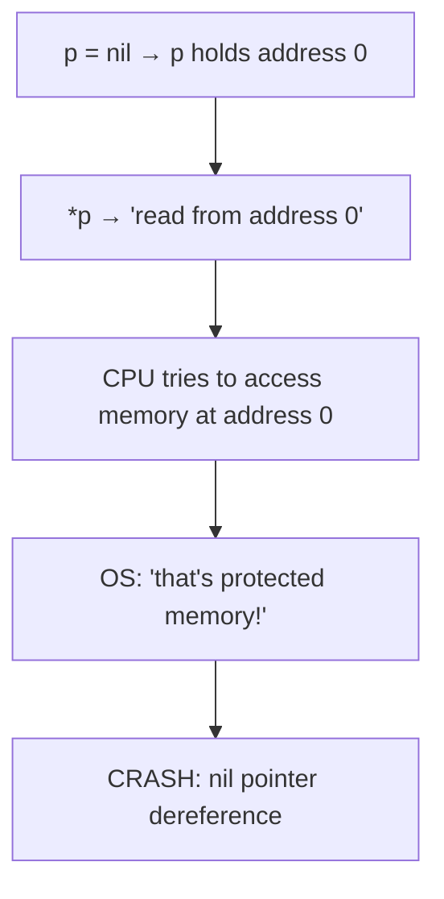
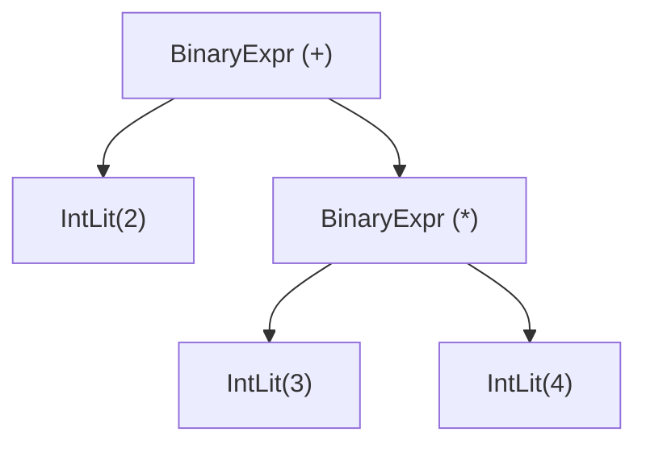

# Chapter 10: Pointers and Memory — How Data Lives in RAM

> "There is nothing more instructive than understanding where a value actually lives. Memory is not magic — it's just an enormous array of numbered boxes."
> — Anonymous

---

## Chapter Overview

When your program runs, all of its data — variables, objects, lists, strings — lives in **RAM** (Random Access Memory). RAM is the computer's working memory: fast, temporary, and limited. When you shut down your computer, everything in RAM disappears. Understanding how data is stored in RAM is not just academic curiosity — it directly affects the performance, correctness, and safety of every program you write.

A **pointer** is a variable that holds the *memory address* of another variable. Instead of holding a value directly (like the number 42), a pointer holds the *location* where the value 42 is stored. This is a simple concept, but it has enormous implications. Pointers are how data structures are linked together (trees, linked lists, graphs), how large objects are passed to functions without copying every byte, and how the operating system, compiler, and runtime communicate.

In this chapter, we will demystify memory and pointers completely. We will look at Go's approach to pointers (`&` and `*`), understand the difference between the stack and the heap, explore Go's garbage collector, and see how our Astra compiler uses a tree of pointers to represent a parsed program. Pointers can feel intimidating at first, but by the end of this chapter they will feel completely natural.

---

## What We're Building

Our Astra compiler represents parsed programs as an **Abstract Syntax Tree** (AST) — a tree of Go struct values connected by pointers. When the parser reads `2 + 3 * 4`, it creates a tree of `BinaryExpr` nodes connected by pointer fields. In this chapter we will see exactly how that tree is built and traversed, and we will understand *why* it must be done with pointers rather than values.

---

## Table of Contents

1. Memory as a Giant Array of Numbered Boxes
2. What is a Pointer? — The Address Analogy
3. Pointers in Go: `&` and `*`
4. The Nil Pointer — What It Means and Why It Crashes
5. Stack vs Heap — Two Regions of Memory
6. Go's Garbage Collector — Automatic Memory Management
7. Why Astra Needs a Garbage Collector Too
8. Pointer Receivers in Go — Why Methods Modify Structs with `*`
9. Pointer Arithmetic — What Go Avoids (and Why)
10. Memory Safety: The Bugs That C Has and Go/Astra Avoid
11. Reference Types in Go: Maps, Slices, Channels
12. Go's Escape Analysis — When the Compiler Moves Things to the Heap
13. How the Astra Compiler Stores the AST as a Tree of Pointers
14. The Visitor Pattern Preview — Traversing a Tree of Pointers
15. Astra Build Milestone: The AST as a Pointer Tree
16. Exercises
17. Summary

---

## 1. Memory as a Giant Array of Numbered Boxes

Imagine RAM as a very long row of boxes, each holding one byte (8 bits — a number from 0 to 255). Every box has a unique number called its **address** (or memory address). On a 64-bit computer, addresses can range from 0 to approximately 18 quintillion (2^64 - 1), though only a fraction of that is actually usable RAM.

```
RAM (simplified):

Address:  0    1    2    3    4    5    6    7    8    9    10   11
         ┌────┬────┬────┬────┬────┬────┬────┬────┬────┬────┬────┬────┐
Value:   │ 42 │  0 │  0 │  0 │ 72 │ 101│ 108│ 108│ 111│  0 │ 25 │  0 │
         └────┴────┴────┴────┴────┴────┴────┴────┴────┴────┴────┴────┘

At address 0-3: the integer 42 (stored in 4 bytes, little-endian)
At address 4-8: the string "Hello" (ASCII bytes: 72=H, 101=e, 108=l, 108=l, 111=o)
At address 10-11: the integer 25
```

When your program runs:
- The OS allocates a region of RAM for your program
- Variables are stored at specific addresses within that region
- The CPU reads and writes values by specifying their addresses

You don't normally think about these addresses — the compiler figures them all out for you. But understanding that they exist is the key to understanding pointers.

---

## 2. What is a Pointer? — The Address Analogy

A **pointer** is a variable whose *value* is a memory address. Instead of storing data directly, it stores the *location* of the data.

**Real-world analogy:** A pointer is like a sticky note that says "the information you want is in room 304." The sticky note itself is not the information — it tells you *where* to find the information.

```
Normal variable 'age':                Pointer to 'age':

Address: 1000                         Address: 2000
┌─────────────────┐                   ┌─────────────────┐
│  Value: 25      │                   │  Value: 1000    │  ← stores the ADDRESS of age
└─────────────────┘                   └─────────────────┘
        ↑                                      │
   age = 25                                    │ (points to address 1000)
                                               ↓
                                    Address: 1000
                                    ┌─────────────────┐
                                    │  Value: 25      │
                                    └─────────────────┘
```

**When do you need pointers?**

1. **Sharing data:** you want two parts of the program to see the *same* data, not copies
2. **Large data:** you don't want to copy a 100MB struct every time you call a function
3. **Optional values:** a pointer can be `nil`, indicating "no value" — you can't do that with a plain int or struct
4. **Data structures:** trees, linked lists, and graphs are built from nodes connected by pointers
5. **Mutation:** you want a function to modify a variable in its caller's scope

---

## 3. Pointers in Go: `&` and `*`

Go uses two operators for working with pointers:

- `&variable` — the **address-of** operator: gives you the address (pointer) of a variable
- `*pointer` — the **dereference** operator: follows the pointer to get the value it points at

```go
package main

import "fmt"

func main() {
    // 1. A normal variable
    age := 25
    fmt.Println("age =", age)             // 25
    fmt.Println("&age =", &age)           // 0xc0000b4010 (some address)

    // 2. A pointer variable
    var p *int = &age   // p is a pointer to int, initialized with the address of age
    fmt.Println("p =", p)                 // 0xc0000b4010 (same address as &age)
    fmt.Println("*p =", *p)              // 25 (the VALUE at that address)

    // 3. Modifying through a pointer
    *p = 30   // set the value AT the address to 30
    fmt.Println("age after *p = 30:", age)  // 30! age was changed through the pointer

    // 4. Shorthand: new() allocates memory and returns a pointer
    q := new(int)     // allocates an int on the heap, returns *int
    *q = 42
    fmt.Println("*q =", *q)   // 42

    // 5. Pointer to a struct
    type Point struct {
        X, Y int
    }
    pt := &Point{X: 3, Y: 4}   // allocate a Point struct, get a pointer
    fmt.Println(pt.X)            // Go automatically dereferences: pt.X same as (*pt).X
    pt.X = 10                    // modify through pointer — no explicit * needed for structs
    fmt.Println(pt)              // &{10 4}
}
```

**Type notation for pointers:**

```go
var a int     // a is an int
var b *int    // b is a pointer to int
var c **int   // c is a pointer to a pointer to int (rare, but valid)

// Pointer types follow the pattern: *T means "pointer to T"
// &T    gives a *T
// *(*T) gives a T
```

---

## 4. The Nil Pointer — What It Means and Why It Crashes

`nil` is Go's zero value for pointers. A nil pointer means "this pointer doesn't point to anything." It is the absence of a valid address.

```go
var p *int    // p is nil — no memory address assigned

fmt.Println(p)    // <nil>
fmt.Println(*p)   // CRASH: runtime error: invalid memory address or nil pointer dereference
```

**Why does dereferencing nil crash?**

When you do `*p`, the CPU tries to read from address 0 (nil is address 0 on most systems). Address 0 is never a valid program address — the OS protects it. Accessing it triggers a segmentation fault (on Linux/macOS) or access violation (on Windows), which crashes your program.



**Nil safety in Astra:**

One of Astra's design goals is to prevent nil pointer crashes. Astra uses **Option types** (similar to Rust's `Option<T>`) instead of nullable pointers:

```astra
// In Astra, there is no naked nil pointer.
// If a value might be absent, you use Option<T>:
let user: Option<User> = find_user(123)

match user {
    Some(u) => { print("Found user: " + u.name) }
    None    => { print("User not found") }
}

// You CANNOT access user.name directly if type is Option<User>
// — the compiler forces you to check first
```

This is a major improvement over languages like Java, C, and Go where nil checks are easy to forget.

---

## 5. Stack vs Heap — Two Regions of Memory

When a Go program runs, its memory is divided into two main regions: the **stack** and the **heap**.

```
Process memory layout (simplified):

High addresses
┌───────────────────────────────────┐
│           Stack                   │
│  (function frames grow downward)  │
│  ↓                               │
│                                  │
│                                  │
│  ↑                               │
│  (heap grows upward)              │
│           Heap                    │
├───────────────────────────────────┤
│  BSS Segment (global variables)  │
├───────────────────────────────────┤
│  Data Segment (constants)        │
├───────────────────────────────────┤
│  Text Segment (program code)     │
└───────────────────────────────────┘
Low addresses
```

**The Stack:**
- Stores function local variables and parameters
- Memory is allocated when a function is called, freed when it returns
- Very fast: allocation is just decrementing a pointer
- Limited size (typically 1-8MB per goroutine in Go)
- **LIFO** (Last In, First Out): the last function called is the first to return

**The Heap:**
- Stores data that must outlive the function that created it
- Memory is allocated manually (`malloc` in C) or automatically (Go GC)
- Slower than stack allocation
- Much larger (limited by physical RAM and virtual address space)
- Fragmentation can occur over time

```go
func stackExample() int {
    x := 42   // x lives on the STACK — freed when function returns
    return x  // we return the VALUE, not a pointer
}

func heapExample() *int {
    x := 42       // x would normally go on the stack...
    return &x     // but we return a POINTER to x
                  // Go detects this and moves x to the HEAP
                  // so it lives beyond this function call
}
```

---

## 6. Go's Garbage Collector — Automatic Memory Management

In C and C++, programmers manually manage heap memory: call `malloc()` to allocate, `free()` to release. Forgetting to call `free()` causes a **memory leak** (the program uses more and more memory until it runs out). Calling `free()` twice causes **double-free** (a crash). Using memory after calling `free()` causes **use-after-free** (undefined behavior — often a security vulnerability).

Go eliminates these bugs with a **garbage collector (GC)**. The GC automatically finds heap memory that is no longer reachable by any pointer in the program, and frees it.

```
Garbage collection: mark and sweep (simplified)

Step 1: MARK — start from all root pointers (globals, stack frames)
        and follow every pointer, marking reachable objects:
        ┌──────┐      ┌──────┐
        │  A   │─────▶│  B   │   A and B are reachable (marked ✓)
        └──────┘      └──────┘
        ┌──────┐      ┌──────┐
        │  C   │      │  D   │   C and D are unreachable (no pointer to them)
        └──────┘      └──────┘
         [orphaned]    [orphaned]

Step 2: SWEEP — free all unmarked objects (C and D)
        C is freed. D is freed. Memory is reclaimed.
```

**Go's GC runs concurrently** — it runs alongside your program with minimal pauses. Go 1.x GC pause times are typically less than 1 millisecond.

**The trade-off:**
- GC means you never manually free memory → no memory leaks, double-free, or use-after-free
- GC has runtime overhead (CPU cycles, pause time)
- GC does not give you precise control over when memory is released

For our Astra language, this trade-off is excellent. Safety and ease of use matter more than fine-grained memory control for most programs Astra will run.

---

## 7. Why Astra Needs a Garbage Collector Too

When an Astra program creates objects at runtime — allocating structs, lists, closures — those objects need to be freed when no longer needed. Our options:

1. **Manual memory management** (like C): error-prone, requires expert programmers
2. **Reference counting** (like Python, Swift): each object tracks how many pointers point to it; freed when count reaches 0. Problem: cycles (A→B→A) are never freed without special handling.
3. **Tracing garbage collector** (like Go, Java, C#): periodically scans all reachable objects and frees the rest. Handles cycles automatically.
4. **Ownership system** (like Rust): the compiler tracks ownership statically; no runtime GC needed but requires complex annotations.

**Astra will use a tracing garbage collector** for its initial versions, similar to Go's. This means:
- Astra programs never explicitly free memory
- The Astra runtime includes a GC that runs periodically
- We avoid the complexity of Rust's ownership system for now

The GC is implemented in the Astra runtime (written in C, covered in later chapters). For now, just know: Astra programs allocate freely, and the runtime handles cleanup.

---

## 8. Pointer Receivers in Go — Why Methods Modify Structs with `*`

In Go, you can define **methods** on types. A method has a **receiver** — the value it operates on. If you want a method to modify its receiver, the receiver must be a pointer.

```go
type Counter struct {
    Count int
}

// Value receiver — gets a COPY of the Counter
// Changes do NOT affect the original
func (c Counter) IncrementByValue() {
    c.Count++   // modifies the copy, not the original
}

// Pointer receiver — gets a POINTER to the Counter
// Changes DO affect the original
func (c *Counter) IncrementByPointer() {
    c.Count++   // modifies the original through the pointer
}

func main() {
    c := Counter{Count: 0}
    c.IncrementByValue()
    fmt.Println(c.Count)   // 0 — not changed!

    c.IncrementByPointer()
    fmt.Println(c.Count)   // 1 — changed!
}
```

**Rule of thumb:** use a pointer receiver when:
- The method needs to modify the receiver
- The receiver is a large struct (avoids copying)
- You need consistency (if some methods use `*T`, use it for all methods on that type)

**In our Astra compiler,** all the compiler's own methods that modify state use pointer receivers:

```go
type Lexer struct { pos int; ... }
func (l *Lexer) advance() { l.pos++ }         // pointer receiver: modifies l.pos
func (l *Lexer) current() rune { return l.source[l.pos] }  // value receiver OK for read-only
```

---

## 9. Pointer Arithmetic — What Go Avoids (and Why)

In C, you can add numbers to pointers to move them to adjacent memory locations:

```c
// C — DANGEROUS pointer arithmetic
int arr[] = {10, 20, 30, 40, 50};
int *p = arr;
printf("%d\n", *p);       // 10
printf("%d\n", *(p+1));   // 20
printf("%d\n", *(p+2));   // 30
p += 3;
printf("%d\n", *p);       // 40
*(p + 10) = 999;  // writes to memory 10 ints past arr — BUFFER OVERFLOW! DANGER!
```

Pointer arithmetic is extremely powerful — it's how C implements arrays, strings, and many data structures. But it's also the source of enormous security vulnerabilities: buffer overflows, out-of-bounds reads, and similar bugs.

**Go and Astra do not allow pointer arithmetic.** Pointers can only point to valid Go/Astra values. You cannot do `p + 1` on a `*int`. If you need array access, you use the `[]` indexing operator, which includes bounds checking.

This is a deliberate trade-off:
- You lose the ability to do unsafe, C-style memory manipulation
- You gain safety: no buffer overflows, no out-of-bounds pointer access

The `unsafe` package in Go *does* allow pointer arithmetic for special cases (like interfacing with C code), but using it is explicitly marked as "here be dragons."

---

## 10. Memory Safety: The Bugs That C Has and Go/Astra Avoid

Memory safety is one of the most important properties of a programming language. Here are the major memory bugs in C and how Go/Astra prevent them:

```
Bug Type            | C Example                    | Go/Astra Prevention
─────────────────────────────────────────────────────────────────────────────
Null dereference    | *null_ptr                    | Nil check at runtime (Go)
                    |                               | Option<T> forces check (Astra)
─────────────────────────────────────────────────────────────────────────────
Buffer overflow     | arr[100] on arr[10]          | Bounds checking: runtime panic
                    |                               | Cannot do pointer arithmetic
─────────────────────────────────────────────────────────────────────────────
Use after free      | free(p); printf("%d", *p);   | GC: memory not freed while
                    |                               | any pointer points to it
─────────────────────────────────────────────────────────────────────────────
Double free         | free(p); free(p);            | GC: programmer never frees
                    |                               | memory manually
─────────────────────────────────────────────────────────────────────────────
Memory leak         | malloc without free          | GC automatically frees
                    |                               | unreachable memory
─────────────────────────────────────────────────────────────────────────────
Dangling pointer    | pointer to a freed object    | GC: object not freed while
                    |                               | pointer exists (no dangling)
─────────────────────────────────────────────────────────────────────────────
Uninitialized read  | int x; printf("%d", x);      | All variables have zero values
                    |                               | in Go (0, "", nil, false)
─────────────────────────────────────────────────────────────────────────────
```

Microsoft Research found that approximately 70% of CVEs (Common Vulnerabilities and Exposures) in Microsoft products were memory safety bugs. By using a memory-safe language like Go for our compiler, we eliminate this entire class of vulnerabilities.

---

## 11. Reference Types in Go: Maps, Slices, Channels

In Go, some types are already "reference-like" — they internally hold a pointer to their backing data. This means passing them to functions does not copy all the data.

**Slices** have a three-word header: a pointer to the backing array, a length, and a capacity:

```go
s := []int{1, 2, 3, 4, 5}
// s is actually:
// ┌──────────────────────────────────┐
// │ ptr → [1,2,3,4,5]  len=5  cap=5 │
// └──────────────────────────────────┘

// When you pass s to a function, the HEADER is copied, not the array:
func printAll(nums []int) {
    // nums is a copy of the header, but points to the SAME backing array
    nums[0] = 999     // this modifies the ORIGINAL array!
    fmt.Println(nums)
}
printAll(s)
fmt.Println(s[0])  // 999 — the original was modified!
```

**Maps** are also reference types:

```go
m := map[string]int{"a": 1}
modify(m)

func modify(m map[string]int) {
    m["b"] = 2   // modifies the ORIGINAL map
}
```

**Channels** are a reference to a communication queue between goroutines.

This is an important subtlety: "passing by value" in Go means copying the value, but if that value IS a pointer (or contains pointers like slices and maps), the pointed-to data is shared.

---

## 12. Go's Escape Analysis — When the Compiler Moves Things to the Heap

When you write Go code, you don't explicitly say "put this on the stack" or "put this on the heap." The Go compiler decides automatically through **escape analysis**.

**Escape analysis rule:** if a variable's address is taken AND that address could be used after the function returns, the variable must be placed on the heap (it "escapes" to the heap).

```go
func stackAllocated() int {
    x := 42
    return x   // x's VALUE is returned, not its address
               // x does NOT escape — stays on stack
}

func heapAllocated() *int {
    x := 42
    return &x  // x's ADDRESS is returned
               // x's address will be used after this function returns
               // x ESCAPES to the heap
}

// You can see what the compiler decides:
// go build -gcflags='-m' main.go
// Output: ./main.go:8:2: moved to heap: x
```

For our compiler, escape analysis means:
- Creating small temporary objects during parsing may be stack-allocated (fast)
- AST nodes that are returned from parsing functions escape to the heap
- The GC will eventually collect AST nodes when the compiler is done with them

---

## 13. How the Astra Compiler Stores the AST as a Tree of Pointers

The most important use of pointers in our compiler is the **AST** (Abstract Syntax Tree). When the parser reads Astra source code, it creates a tree of Go structs connected by pointer fields.

Consider the expression `2 + 3 * 4`. Because `*` has higher precedence than `+`, it is parsed as `2 + (3 * 4)`:



In memory, this tree is represented as Go structs connected by pointers:

```
BinaryExpr at 0xC0001A0000:
┌────────────────────────────────────────────┐
│  Op:    "+"                                │
│  Left:  0xC0001B0000  ─────────────────┐  │
│  Right: 0xC0001B0010  ──────────┐      │  │
└────────────────────────────────────────────┘
                                  │      │
         IntLit(2) at 0xC0001B0000│      │
         ┌────────────────────┐   │      │
         │  Value: 2          │ ◀─┘      │
         └────────────────────┘          │
                                         │
         BinaryExpr(*) at 0xC0001B0010   │
         ┌────────────────────────────┐◀─┘
         │  Op:    "*"               │
         │  Left:  0xC0001C0000 ──┐  │
         │  Right: 0xC0001C0010─┐ │  │
         └────────────────────────────┘
                                 │ │
    IntLit(3) at 0xC0001C0000    │ │
    ┌────────────────────┐       │ │
    │  Value: 3          │ ◀─────┘ │
    └────────────────────┘         │
                                   │
    IntLit(4) at 0xC0001C0010      │
    ┌────────────────────┐         │
    │  Value: 4          │ ◀───────┘
    └────────────────────┘
```

Every node in the tree is a Go struct allocated on the heap. Every parent-child relationship is a pointer. The whole AST is a tree of pointers.

---

## 14. The Visitor Pattern Preview — Traversing a Tree of Pointers

Once we have the AST as a tree of pointers, how do we process it? We need to **traverse** the tree — visit every node and do something with it (type-check it, generate code, evaluate it).

The standard pattern for this is the **Visitor pattern**. A visitor is an object that implements a "visit" function for each node type. You walk the tree, and at each node you call the appropriate visit function.

```go
// A visitor interface for our AST
type Visitor interface {
    VisitIntLiteral(node *IntLiteral) interface{}
    VisitBinaryExpr(node *BinaryExpr) interface{}
    VisitIdentifier(node *Identifier) interface{}
    // ... one method per node type
}

// An evaluator visitor that computes the value of an expression
type Evaluator struct{}

func (e *Evaluator) VisitIntLiteral(node *IntLiteral) interface{} {
    return node.Value   // an int literal evaluates to its value
}

func (e *Evaluator) VisitBinaryExpr(node *BinaryExpr) interface{} {
    left := node.Left.Accept(e).(int)
    right := node.Right.Accept(e).(int)
    switch node.Op {
    case "+":  return left + right
    case "-":  return left - right
    case "*":  return left * right
    case "/":  return left / right
    }
    panic("unknown op: " + node.Op)
}

// Each node implements Accept:
func (n *IntLiteral) Accept(v Visitor) interface{} {
    return v.VisitIntLiteral(n)
}
func (n *BinaryExpr) Accept(v Visitor) interface{} {
    return v.VisitBinaryExpr(n)
}
```

We will implement the full visitor pattern in Chapter 20 (Semantic Analysis) and Chapter 35 (Code Generation). For now, understand that tree traversal is the heart of every compiler phase.

---

## 15. Astra Build Milestone: The AST as a Pointer Tree

Here is the complete, runnable code showing how AST nodes are connected with pointers:

```go
// ast/pointer_demo.go
// This file demonstrates how AST nodes are connected with pointers.
// It shows the in-memory representation of: 2 + 3 * 4

package ast

import "fmt"

// ------------------------------------------------------------
// Basic expression node types (simplified for this demo)
// ------------------------------------------------------------

// IntLiteral represents an integer constant in Astra source code.
// Example: 42, 0, -5
type IntLiteral struct {
    Value int
}

func (n *IntLiteral) expressionNode()      {}
func (n *IntLiteral) TokenLiteral() string { return fmt.Sprintf("%d", n.Value) }
func (n *IntLiteral) String() string       { return fmt.Sprintf("%d", n.Value) }

// BinaryExpr represents a binary operation: left op right
// Example: 2 + 3, x * y, a > b
type BinaryExpr struct {
    Op    string     // "+", "-", "*", "/", "==", "!=", "<", ">", etc.
    Left  Expression // left operand
    Right Expression // right operand
}

func (n *BinaryExpr) expressionNode()      {}
func (n *BinaryExpr) TokenLiteral() string { return n.Op }
func (n *BinaryExpr) String() string {
    return "(" + n.Left.String() + " " + n.Op + " " + n.Right.String() + ")"
}

// ------------------------------------------------------------
// Building the tree for: 2 + 3 * 4
// ------------------------------------------------------------

// BuildExpressionTree builds the AST for: 2 + 3 * 4
// Operator precedence makes this: 2 + (3 * 4)
//
// Tree structure:
//        (+)
//       /   \
//     2     (*)
//           / \
//          3   4
func BuildExpressionTree() *BinaryExpr {
    // Step 1: Create the leaf nodes (integer literals)
    two   := &IntLiteral{Value: 2}
    three := &IntLiteral{Value: 3}
    four  := &IntLiteral{Value: 4}

    // Step 2: Build the inner node: 3 * 4
    // This BinaryExpr's Left points to 'three', Right points to 'four'
    multiplication := &BinaryExpr{
        Op:    "*",
        Left:  three,
        Right: four,
    }

    // Step 3: Build the root node: 2 + (3 * 4)
    // This BinaryExpr's Left points to 'two', Right points to 'multiplication'
    addition := &BinaryExpr{
        Op:    "+",
        Left:  two,
        Right: multiplication,
    }

    return addition
}

// WalkTree recursively walks the AST and prints each node.
// This is a simplified version of what the type checker and code generator do.
func WalkTree(node Expression, depth int) {
    indent := ""
    for i := 0; i < depth; i++ {
        indent += "  "
    }

    switch n := node.(type) {
    case *IntLiteral:
        fmt.Printf("%sIntLiteral: %d\n", indent, n.Value)

    case *BinaryExpr:
        fmt.Printf("%sBinaryExpr: %s\n", indent, n.Op)
        fmt.Printf("%sLeft:\n", indent)
        WalkTree(n.Left, depth+1)
        fmt.Printf("%sRight:\n", indent)
        WalkTree(n.Right, depth+1)
    }
}

// EvaluateTree recursively evaluates an expression tree.
// This is how an interpreter (or constant folder) computes values.
func EvaluateTree(node Expression) int {
    switch n := node.(type) {
    case *IntLiteral:
        return n.Value

    case *BinaryExpr:
        left  := EvaluateTree(n.Left)
        right := EvaluateTree(n.Right)
        switch n.Op {
        case "+": return left + right
        case "-": return left - right
        case "*": return left * right
        case "/": return left / right
        }
    }
    panic("unknown node type")
}

// Demo shows the full usage
func Demo() {
    root := BuildExpressionTree()

    fmt.Println("Expression:", root.String())
    // Output: (2 + (3 * 4))

    fmt.Println("\nTree structure:")
    WalkTree(root, 0)
    // Output:
    // BinaryExpr: +
    // Left:
    //   IntLiteral: 2
    // Right:
    //   BinaryExpr: *
    //   Left:
    //     IntLiteral: 3
    //   Right:
    //     IntLiteral: 4

    result := EvaluateTree(root)
    fmt.Println("\nResult:", result)
    // Output: 14

    // Access specific nodes through the pointer chain:
    fmt.Println("\nPointer navigation:")
    fmt.Println("Root op:", root.Op)                                    // "+"
    fmt.Println("Root left:", root.Left.(*IntLiteral).Value)            // 2
    innerMul := root.Right.(*BinaryExpr)
    fmt.Println("Inner op:", innerMul.Op)                               // "*"
    fmt.Println("Inner left:", innerMul.Left.(*IntLiteral).Value)       // 3
    fmt.Println("Inner right:", innerMul.Right.(*IntLiteral).Value)     // 4
}
```

```go
// ast/pointer_demo_test.go
package ast

import "testing"

func TestBuildExpressionTree(t *testing.T) {
    root := BuildExpressionTree()

    // Verify the tree structure
    if root.Op != "+" {
        t.Errorf("Expected root op '+', got '%s'", root.Op)
    }

    // Left child should be IntLiteral(2)
    left, ok := root.Left.(*IntLiteral)
    if !ok {
        t.Fatal("Expected left child to be *IntLiteral")
    }
    if left.Value != 2 {
        t.Errorf("Expected left value 2, got %d", left.Value)
    }

    // Right child should be BinaryExpr(*)
    right, ok := root.Right.(*BinaryExpr)
    if !ok {
        t.Fatal("Expected right child to be *BinaryExpr")
    }
    if right.Op != "*" {
        t.Errorf("Expected right op '*', got '%s'", right.Op)
    }

    // Right.Left should be IntLiteral(3)
    rl, ok := right.Left.(*IntLiteral)
    if !ok {
        t.Fatal("Expected right.left to be *IntLiteral")
    }
    if rl.Value != 3 {
        t.Errorf("Expected 3, got %d", rl.Value)
    }

    // Right.Right should be IntLiteral(4)
    rr, ok := right.Right.(*IntLiteral)
    if !ok {
        t.Fatal("Expected right.right to be *IntLiteral")
    }
    if rr.Value != 4 {
        t.Errorf("Expected 4, got %d", rr.Value)
    }
}

func TestEvaluateTree(t *testing.T) {
    root := BuildExpressionTree()
    // 2 + 3 * 4 = 2 + 12 = 14
    result := EvaluateTree(root)
    if result != 14 {
        t.Errorf("Expected 14, got %d", result)
    }
}

func TestExpressionString(t *testing.T) {
    root := BuildExpressionTree()
    s := root.String()
    // Should be (2 + (3 * 4))
    if s != "(2 + (3 * 4))" {
        t.Errorf("Expected '(2 + (3 * 4))', got '%s'", s)
    }
}
```

Run with:

```bash
go test ./ast/... -v
```

---

## 16. Exercises

1. **Memory Address Exploration** — In Go, write a program that:
   - Creates an `int` variable with value 42
   - Takes its address with `&`
   - Prints the address (it will look like `0xc000...`)
   - Creates a second `int` with value 43 and prints its address
   - Observes that the two addresses differ by the size of an int (8 bytes on 64-bit)
   *Hint: use `fmt.Printf("%p\n", &x)` to print a pointer*

2. **Nil Safety** — What happens when you run this Go code? Explain *why* it crashes:
   ```go
   type Node struct { Value int }
   var n *Node
   fmt.Println(n.Value)
   ```
   Fix it by adding a nil check before accessing `n.Value`.

3. **Pointer Receiver** — Write a Go struct `Stack` with:
   - A slice field `items []int`
   - A `Push(x int)` method (pointer receiver — modifies the Stack)
   - A `Pop() int` method (pointer receiver — removes and returns the top item)
   - A `IsEmpty() bool` method (value receiver — reads without modifying)
   Test it by pushing 1, 2, 3 and popping all three.

4. **Stack vs Heap** — Classify each variable as stack-allocated or heap-allocated in Go, and explain why:
   ```go
   func f() (*int, int) {
       a := 10    // variable a
       b := 20
       return &a, b   // variable b
   }
   ```

5. **Build the Tree** — Using `IntLiteral` and `BinaryExpr`, manually construct the AST for the expression: `(1 + 2) * (3 + 4)`. Note that the parentheses change the tree structure compared to `1 + 2 * 3 + 4`.

6. **Evaluate the Tree** — Using `EvaluateTree` from the milestone, what does `(1 + 2) * (3 + 4)` evaluate to? Build the tree in Go and call `EvaluateTree` to verify.

7. **Memory Safety Scenarios** — For each scenario, identify whether Go prevents the bug automatically or whether you could still make the mistake:
   - a) Accessing array index out of bounds
   - b) Using a map key that doesn't exist
   - c) Dereferencing a nil pointer
   - d) Allocating 10 structs and forgetting to clean up
   - e) Calling a method on a nil pointer receiver

8. **Garbage Collection** — Consider the following Go code. At what point in the program does the string `"hello"` become eligible for garbage collection?
   ```go
   func makeString() *string {
       s := "hello"
       return &s
   }
   func main() {
       p := makeString()
       fmt.Println(*p)
       p = nil      // line A
       // line B
   }
   ```

---

## 17. Summary

| Concept | Description | Go Syntax |
|---|---|---|
| Memory address | Each byte in RAM has a unique number | Not directly visible |
| Pointer | Variable holding a memory address | `*int`, `*string`, `*MyStruct` |
| Address-of | Get the address of a variable | `&variable` |
| Dereference | Get the value at a pointer's address | `*pointer` |
| Nil pointer | A pointer pointing to address 0 (nothing) | `nil` |
| Stack | Fast, automatic memory for local vars | Managed by compiler |
| Heap | Slower, persistent memory for shared data | Allocated with `new()`, `&T{}` |
| Escape analysis | Compiler decides stack vs heap | `go build -gcflags='-m'` |
| Garbage collector | Automatic memory reclamation | Runs automatically |
| Value receiver | Method gets a copy | `func (t T) method()` |
| Pointer receiver | Method gets a pointer (can mutate) | `func (t *T) method()` |
| Reference types | Types that internally hold pointers | `[]T`, `map[K]V`, `chan T` |
| AST tree | Program represented as linked nodes | `*BinaryExpr{Left: ..., Right: ...}` |

**Key takeaways:**
- RAM is an array of numbered bytes; a pointer is a variable that holds an address
- `&x` gets the address of `x`; `*p` reads the value at pointer `p`
- Nil pointers crash on dereference; always check for nil before using a pointer
- Stack memory is fast and automatic; heap memory is larger and managed by the GC
- Go's GC automatically frees unreachable heap memory, eliminating memory leaks and use-after-free bugs
- Go avoids pointer arithmetic, preventing entire classes of security vulnerabilities
- Slices, maps, and channels are reference types — passing them copies the header, not the data
- Our compiler represents the AST as a tree of Go structs connected by pointers

---

*Next chapter: Chapter 11 — Arrays and Dynamic Arrays: Storing Collections of Data*
