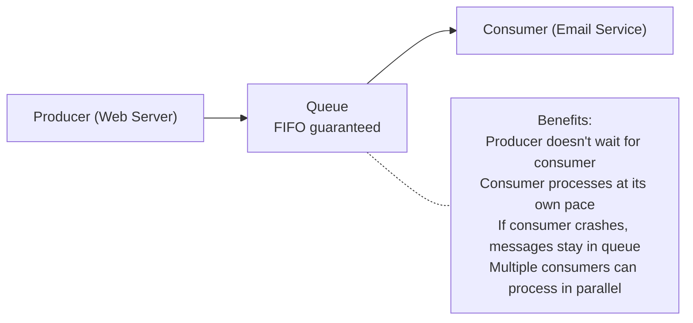

# Chapter 15: Queues — First In, First Out

> "A queue is the kindest data structure. It serves people in the order they arrived." — Unknown

---

## Overview

Imagine the checkout line at a supermarket. The first customer to join the line is the first to be served. No cutting, no jumping to the front — everyone waits their turn in the order they arrived. This is a **queue**.

Where a stack enforces LIFO (Last In, First Out), a queue enforces **FIFO** (First In, First Out). This property makes queues the natural data structure for any scenario involving waiting, scheduling, or ordered processing.

Queues are everywhere in real software: print spoolers, CPU task scheduling, message brokers like RabbitMQ and Kafka, web server request handling, and the breadth-first search algorithm that powers social network analysis.

This chapter covers:
- The FIFO property and how it differs from LIFO
- Enqueue, dequeue, front, back, and size operations
- Array-backed queue with a naive implementation and its flaw
- Circular buffer: the efficient O(1) solution
- Linked list-backed queue
- The deque (double-ended queue)
- Priority queue teaser
- A fully generic `Queue[T]` in Go
- Real-world applications: CPU scheduling, message queues, BFS
- **Astra Build Milestone**: The compiler's diagnostic engine — collecting all errors instead of stopping at the first one

---

## What We're Building

By the end of this chapter you will understand how to implement a queue efficiently using a circular buffer, and you will see how the Astra compiler uses a queue-like diagnostic engine to collect and report multiple errors in one compilation pass — a critical feature of any usable compiler.

---

## Table of Contents

1. The Queue Abstraction
2. The FIFO Property
3. Operations: Enqueue, Dequeue, Front, Back, Size
4. The Naive Array Queue — And Its Problem
5. The Circular Buffer: O(1) Without Waste
6. Linked List-Backed Queue
7. The Deque (Double-Ended Queue)
8. Priority Queue Preview
9. Real-World Applications
10. Generic Queue[T] in Go
11. Astra Build Milestone: The Diagnostic Engine

---

## 1. The Queue Abstraction

A **queue** is a linear data structure that allows insertions only at the **back** and removals only from the **front**:

```
ENQUEUE (add to back) ─────────────────────────►
                   ┌────┬────┬────┬────┬────┐
                   │ 1  │ 2  │ 3  │ 4  │ 5  │
                   └────┴────┴────┴────┴────┘
◄─────────────────────────── DEQUEUE (remove from front)
   front                                back
```

This single constraint — insert at back, remove from front — gives the queue its FIFO ordering guarantee. Items are processed in exactly the order they were added.

---

## 2. The FIFO Property

FIFO stands for **First In, First Out**. The first item added to the queue is the first item to be removed.

```
Enqueue: A, B, C, D (in this order)

Queue state:
  [A] [B] [C] [D]
   ^               ^
  front           back

Dequeue four times:
  1st dequeue → A
  2nd dequeue → B
  3rd dequeue → C
  4th dequeue → D

Items come out in the same order they went in.
```

Compare to a stack (LIFO), where dequeuing those same items in order would give D, C, B, A.

**When FIFO matters:**
- Printing documents: first submitted, first printed
- HTTP requests: first arrived, first served
- Message queues: message order is preserved
- BFS: visit nodes level by level, closest first

---

## 3. Operations: Enqueue, Dequeue, Front, Back, Size

| Operation        | Description                                    | Complexity    |
|------------------|------------------------------------------------|---------------|
| `Enqueue(item)`  | Add item to the back of the queue              | O(1)          |
| `Dequeue()`      | Remove and return the front item               | O(1)          |
| `Front()`        | Return the front item without removing it      | O(1)          |
| `Back()`         | Return the back item without removing it       | O(1)          |
| `IsEmpty()`      | Return true if the queue has no items          | O(1)          |
| `Size()`         | Return the number of items                     | O(1)          |

All queue operations should run in O(1) — constant time. This seems obvious for a linked list, but achieving O(1) with an array requires some care.

---

## 4. The Naive Array Queue — And Its Problem

The most obvious implementation uses a slice, appending at the back and removing from the front:

```go
// WARNING: this is the WRONG approach — do not use in production
type NaiveQueue[T any] struct {
    items []T
}

func (q *NaiveQueue[T]) Enqueue(item T) {
    q.items = append(q.items, item)  // O(1) amortized — good
}

func (q *NaiveQueue[T]) Dequeue() (T, bool) {
    if len(q.items) == 0 {
        var zero T
        return zero, false
    }
    front := q.items[0]
    q.items = q.items[1:]  // O(n) — BAD! Shifts entire slice leftward.
    return front, true
}
```

The problem is `q.items[1:]`. This does NOT free the memory for index 0 — it just moves the slice header to start at index 1. Worse, if we assign `q.items = q.items[1:]` repeatedly, the underlying array grows without bound and is never garbage collected. We continuously leak memory.

Alternatively, you might try removing index 0 by shifting everything:

```go
// Also bad: O(n) operation
func (q *NaiveQueue[T]) DequeueShift() (T, bool) {
    if len(q.items) == 0 {
        var zero T
        return zero, false
    }
    front := q.items[0]
    copy(q.items, q.items[1:])   // shift every element left by 1 — O(n)
    q.items = q.items[:len(q.items)-1]
    return front, true
}
```

This is O(n) per dequeue — for a queue of 1 million items, every single dequeue shifts 999,999 elements. Completely unacceptable.

We need a smarter approach.

---

## 5. The Circular Buffer: O(1) Without Waste

A **circular buffer** (also called a ring buffer) is a fixed-capacity array where both the head and tail pointers wrap around to the beginning when they reach the end of the array.

```
Capacity: 8

Initial state:         head=0, tail=0, size=0
[ _ | _ | _ | _ | _ | _ | _ | _ ]
  0   1   2   3   4   5   6   7

After enqueue(A, B, C): head=0, tail=3, size=3
[ A | B | C | _ | _ | _ | _ | _ ]
  ^           ^
 head        tail

After dequeue() twice: head=2, tail=3, size=1
[ _ | _ | C | _ | _ | _ | _ | _ ]
          ^   ^
        head tail

After enqueue(D,E,F,G,H,I): head=2, tail=3+6=9 → wraps to 1, size=7
[ I | _ | C | D | E | F | G | H ]
      ^   ^
     tail head

The buffer "wraps around" — index 9 becomes index 9 % 8 = 1
```

The trick is using the modulo operator (`%`) to wrap indices:

```go
package queue

import "fmt"

// CircularQueue[T] is a FIFO queue backed by a circular buffer.
type CircularQueue[T any] struct {
    items    []T
    head     int  // index of the front item
    tail     int  // index where the next item will be written
    size     int  // current number of items
    capacity int  // allocated capacity
}

// NewCircularQueue creates a queue with the given initial capacity.
func NewCircularQueue[T any](capacity int) *CircularQueue[T] {
    if capacity < 1 {
        capacity = 16
    }
    return &CircularQueue[T]{
        items:    make([]T, capacity),
        capacity: capacity,
    }
}

// Enqueue adds an item to the back — O(1) amortized.
func (q *CircularQueue[T]) Enqueue(item T) {
    if q.size == q.capacity {
        q.grow()
    }
    q.items[q.tail] = item
    q.tail = (q.tail + 1) % q.capacity
    q.size++
}

// Dequeue removes and returns the front item — O(1).
func (q *CircularQueue[T]) Dequeue() (T, bool) {
    if q.IsEmpty() {
        var zero T
        return zero, false
    }
    item := q.items[q.head]
    var zero T
    q.items[q.head] = zero   // clear the slot (helps GC)
    q.head = (q.head + 1) % q.capacity
    q.size--
    return item, true
}

// Front returns the front item without removing it — O(1).
func (q *CircularQueue[T]) Front() (T, bool) {
    if q.IsEmpty() {
        var zero T
        return zero, false
    }
    return q.items[q.head], true
}

// Back returns the back item without removing it — O(1).
func (q *CircularQueue[T]) Back() (T, bool) {
    if q.IsEmpty() {
        var zero T
        return zero, false
    }
    backIdx := (q.tail - 1 + q.capacity) % q.capacity
    return q.items[backIdx], true
}

// IsEmpty returns true if the queue has no items.
func (q *CircularQueue[T]) IsEmpty() bool { return q.size == 0 }

// Size returns the number of items.
func (q *CircularQueue[T]) Size() int { return q.size }

// grow doubles the capacity of the internal buffer.
func (q *CircularQueue[T]) grow() {
    newCapacity := q.capacity * 2
    newItems := make([]T, newCapacity)
    // Copy items in order from head to tail, wrapping around
    for i := 0; i < q.size; i++ {
        newItems[i] = q.items[(q.head+i)%q.capacity]
    }
    q.items = newItems
    q.head = 0
    q.tail = q.size
    q.capacity = newCapacity
}

// String shows the queue contents from front to back.
func (q *CircularQueue[T]) String() string {
    if q.IsEmpty() {
        return "Queue[]"
    }
    result := "Queue[front→"
    for i := 0; i < q.size; i++ {
        if i > 0 {
            result += ", "
        }
        result += fmt.Sprintf("%v", q.items[(q.head+i)%q.capacity])
    }
    result += "←back]"
    return result
}
```

Now every operation is O(1) — no shifting, no wasted memory.

---

## 6. Linked List-Backed Queue

For cases where capacity is truly unbounded and you cannot predict the maximum size, a linked list-backed queue works well. The head of the linked list is the front of the queue; the tail pointer makes enqueue O(1):

```go
package queue

// listNode is a singly linked list node.
type listNode[T any] struct {
    data T
    next *listNode[T]
}

// LinkedQueue[T] is a queue backed by a singly linked list.
type LinkedQueue[T any] struct {
    front *listNode[T]
    back  *listNode[T]
    size  int
}

func NewLinkedQueue[T any]() *LinkedQueue[T] {
    return &LinkedQueue[T]{}
}

// Enqueue adds to the back — O(1).
func (q *LinkedQueue[T]) Enqueue(item T) {
    node := &listNode[T]{data: item}
    if q.back != nil {
        q.back.next = node
    } else {
        q.front = node
    }
    q.back = node
    q.size++
}

// Dequeue removes from the front — O(1).
func (q *LinkedQueue[T]) Dequeue() (T, bool) {
    if q.IsEmpty() {
        var zero T
        return zero, false
    }
    val := q.front.data
    q.front = q.front.next
    if q.front == nil {
        q.back = nil
    }
    q.size--
    return val, true
}

// Front returns the front item — O(1).
func (q *LinkedQueue[T]) Front() (T, bool) {
    if q.IsEmpty() {
        var zero T
        return zero, false
    }
    return q.front.data, true
}

func (q *LinkedQueue[T]) IsEmpty() bool { return q.size == 0 }
func (q *LinkedQueue[T]) Size() int     { return q.size }
```

**When to use each:**

| Queue Type    | Best When                                       |
|---------------|-------------------------------------------------|
| Circular buffer | Fixed/predictable max size, best cache performance |
| Linked list   | Unbounded size, frequent resize, simple code    |

---

## 7. The Deque (Double-Ended Queue)

A **deque** (pronounced "deck") supports insertion and removal at **both** ends — it is simultaneously a stack and a queue:

```go
package deque

type Deque[T any] struct {
    items []T
    head  int
    size  int
    cap   int
}

func NewDeque[T any](capacity int) *Deque[T] {
    if capacity < 1 { capacity = 16 }
    return &Deque[T]{items: make([]T, capacity), cap: capacity}
}

// PushFront adds to the front — O(1) amortized.
func (d *Deque[T]) PushFront(item T) {
    if d.size == d.cap { d.grow() }
    d.head = (d.head - 1 + d.cap) % d.cap
    d.items[d.head] = item
    d.size++
}

// PushBack adds to the back — O(1) amortized.
func (d *Deque[T]) PushBack(item T) {
    if d.size == d.cap { d.grow() }
    tail := (d.head + d.size) % d.cap
    d.items[tail] = item
    d.size++
}

// PopFront removes from the front — O(1).
func (d *Deque[T]) PopFront() (T, bool) {
    if d.size == 0 {
        var zero T
        return zero, false
    }
    val := d.items[d.head]
    var zero T
    d.items[d.head] = zero
    d.head = (d.head + 1) % d.cap
    d.size--
    return val, true
}

// PopBack removes from the back — O(1).
func (d *Deque[T]) PopBack() (T, bool) {
    if d.size == 0 {
        var zero T
        return zero, false
    }
    tail := (d.head + d.size - 1 + d.cap) % d.cap
    val := d.items[tail]
    var zero T
    d.items[tail] = zero
    d.size--
    return val, true
}

func (d *Deque[T]) grow() {
    newCap := d.cap * 2
    newItems := make([]T, newCap)
    for i := 0; i < d.size; i++ {
        newItems[i] = d.items[(d.head+i)%d.cap]
    }
    d.items = newItems
    d.head = 0
    d.cap = newCap
}

func (d *Deque[T]) IsEmpty() bool { return d.size == 0 }
func (d *Deque[T]) Size() int     { return d.size }
```

Deques are used in:
- **Sliding window maximum** algorithm (important in competitive programming)
- **Palindrome checking**
- **Implementing both stack and queue** operations on the same structure
- **Work-stealing schedulers** (each thread has a deque; it works from the back and steals from the front of other threads)

---

## 8. Priority Queue Preview

A **priority queue** is like a queue, but instead of serving the item that arrived first, it serves the item with the highest (or lowest) priority.

```
Priority Queue (min-priority: lower number = served first):

Enqueue: Task(priority=5), Task(priority=2), Task(priority=8), Task(priority=1)

Dequeue order: priority=1, priority=2, priority=5, priority=8

(NOT the insertion order: 5, 2, 8, 1)
```

Implementing a priority queue efficiently requires a **heap** — covered in detail in Chapter 18. For now, know that:
- A naive priority queue using a sorted list has O(n log n) insertion
- A heap-based priority queue has O(log n) insertion and O(log n) extraction

Priority queues are used in Dijkstra's shortest path algorithm, Huffman coding (data compression), OS process scheduling (giving higher priority to interactive processes), and — as we'll see in Chapter 18 — the Astra compiler's optimization pass ordering.

---

## 9. Real-World Applications

### CPU Task Scheduling

Modern operating systems use a queue (often a priority queue) to schedule CPU time:

```
Ready Queue:
+──────────────+──────────────+──────────────+
│  Process A   │  Process B   │  Process C   │
│ priority: 3  │ priority: 1  │ priority: 5  │
+──────────────+──────────────+──────────────+

CPU runs highest priority first (Process C: priority 5)
When it blocks (I/O), Process A runs, then Process B.
```

### Print Spooler

When multiple users print to the same printer, documents queue up and print in order:

```go
type PrintJob struct {
    User     string
    Document string
    Pages    int
}

type PrintSpooler struct {
    queue *LinkedQueue[PrintJob]
}

func (s *PrintSpooler) Submit(job PrintJob) {
    s.queue.Enqueue(job)
    fmt.Printf("Queued: %s's '%s' (%d pages)\n",
        job.User, job.Document, job.Pages)
}

func (s *PrintSpooler) Print() {
    job, ok := s.queue.Dequeue()
    if !ok {
        fmt.Println("Print queue is empty")
        return
    }
    fmt.Printf("Printing: %s's '%s' (%d pages)\n",
        job.User, job.Document, job.Pages)
}
```

### Message Queues (RabbitMQ, Kafka, SQS)

Message queues decouple producers from consumers:



### Breadth-First Search (BFS)

BFS uses a queue to explore a graph level by level (covered fully in Chapter 27):

```
Graph:
    A ── B ── E
    |    |
    C    D

BFS from A: queue starts with [A]
Visit A, enqueue neighbors [B, C]
Visit B, enqueue neighbors [D, E] → queue: [C, D, E]
Visit C → queue: [D, E]
Visit D → queue: [E]
Visit E → queue: []

BFS order: A, B, C, D, E (level by level)
```

---

## 10. Generic Queue[T] in Go

Here is the complete, production-quality generic queue combining the circular buffer approach:

```go
package queue

import (
    "fmt"
    "strings"
)

// Queue[T] is a generic FIFO queue backed by a circular buffer.
// All operations are O(1) amortized.
type Queue[T any] struct {
    items []T
    head  int
    tail  int
    size  int
}

// New creates a queue with an optional initial capacity hint.
func New[T any](capacityHint ...int) *Queue[T] {
    cap := 16
    if len(capacityHint) > 0 && capacityHint[0] > 0 {
        cap = capacityHint[0]
    }
    return &Queue[T]{items: make([]T, cap)}
}

// Enqueue adds item to the back of the queue.
func (q *Queue[T]) Enqueue(item T) {
    if q.size == len(q.items) {
        q.grow()
    }
    q.items[q.tail] = item
    q.tail = (q.tail + 1) % len(q.items)
    q.size++
}

// Dequeue removes and returns the front item.
// Returns (zero, false) if empty.
func (q *Queue[T]) Dequeue() (T, bool) {
    if q.IsEmpty() {
        var zero T
        return zero, false
    }
    item := q.items[q.head]
    var zero T
    q.items[q.head] = zero
    q.head = (q.head + 1) % len(q.items)
    q.size--
    return item, true
}

// MustDequeue dequeues or panics if empty.
func (q *Queue[T]) MustDequeue() T {
    val, ok := q.Dequeue()
    if !ok {
        panic("queue: Dequeue on empty queue")
    }
    return val
}

// Front returns the front item without removing it.
func (q *Queue[T]) Front() (T, bool) {
    if q.IsEmpty() {
        var zero T
        return zero, false
    }
    return q.items[q.head], true
}

// Back returns the back item without removing it.
func (q *Queue[T]) Back() (T, bool) {
    if q.IsEmpty() {
        var zero T
        return zero, false
    }
    return q.items[(q.tail-1+len(q.items))%len(q.items)], true
}

// IsEmpty returns true if the queue has no items.
func (q *Queue[T]) IsEmpty() bool { return q.size == 0 }

// Size returns the number of items in the queue.
func (q *Queue[T]) Size() int { return q.size }

// Clear removes all items.
func (q *Queue[T]) Clear() {
    q.items = make([]T, 16)
    q.head, q.tail, q.size = 0, 0, 0
}

// ToSlice returns items in order from front to back.
func (q *Queue[T]) ToSlice() []T {
    result := make([]T, q.size)
    for i := 0; i < q.size; i++ {
        result[i] = q.items[(q.head+i)%len(q.items)]
    }
    return result
}

// grow doubles the internal buffer capacity.
func (q *Queue[T]) grow() {
    newItems := make([]T, len(q.items)*2)
    for i := 0; i < q.size; i++ {
        newItems[i] = q.items[(q.head+i)%len(q.items)]
    }
    q.items = newItems
    q.head = 0
    q.tail = q.size
}

// String shows the queue from front to back.
func (q *Queue[T]) String() string {
    if q.IsEmpty() {
        return "Queue(empty)"
    }
    parts := make([]string, q.size)
    for i := 0; i < q.size; i++ {
        parts[i] = fmt.Sprintf("%v", q.items[(q.head+i)%len(q.items)])
    }
    return "Queue[" + strings.Join(parts, " ← ") + "] (front first)"
}
```

---

## 11. Astra Build Milestone: The Diagnostic Engine

One of the most important qualities of a compiler is good error reporting. Compilers that stop at the first error force the programmer to fix one error, recompile, discover the next error, fix it, recompile — a tedious loop. Great compilers report **all errors at once**.

The Astra compiler uses a **diagnostic engine** — essentially a queue — to collect errors and warnings throughout every phase of compilation, then print them all at the end.

```go
// diagnostics/engine.go

package diagnostics

import (
    "fmt"
    "sort"
    "strings"
)

// DiagLevel indicates the severity of a diagnostic message.
type DiagLevel int

const (
    LevelNote    DiagLevel = iota  // informational
    LevelWarning                   // non-fatal, should be fixed
    LevelError                     // fatal, compilation cannot succeed
)

func (l DiagLevel) String() string {
    switch l {
    case LevelNote:    return "note"
    case LevelWarning: return "warning"
    case LevelError:   return "error"
    default:           return "unknown"
    }
}

// Diagnostic is a single compiler message with location information.
type Diagnostic struct {
    Level   DiagLevel
    Message string
    File    string
    Line    int
    Column  int
    Hint    string  // optional suggestion for how to fix
}

func (d Diagnostic) String() string {
    loc := fmt.Sprintf("%s:%d:%d", d.File, d.Line, d.Column)
    if d.Hint != "" {
        return fmt.Sprintf("%s: %s: %s\n  hint: %s", loc, d.Level, d.Message, d.Hint)
    }
    return fmt.Sprintf("%s: %s: %s", loc, d.Level, d.Message)
}

// Engine collects diagnostics during compilation.
// It acts as a queue: diagnostics are enqueued during compilation phases
// and dequeued/displayed at the end.
type Engine struct {
    diagnostics []Diagnostic
    errorCount  int
    warnCount   int
    file        string  // current file being compiled
}

// NewEngine creates a fresh diagnostic engine.
func NewEngine(file string) *Engine {
    return &Engine{
        diagnostics: make([]Diagnostic, 0, 16),
        file:        file,
    }
}

// Error records a compilation error.
func (e *Engine) Error(line, col int, format string, args ...interface{}) {
    e.diagnostics = append(e.diagnostics, Diagnostic{
        Level:   LevelError,
        Message: fmt.Sprintf(format, args...),
        File:    e.file,
        Line:    line,
        Column:  col,
    })
    e.errorCount++
}

// ErrorWithHint records an error with a suggested fix.
func (e *Engine) ErrorWithHint(line, col int, hint, format string, args ...interface{}) {
    e.diagnostics = append(e.diagnostics, Diagnostic{
        Level:   LevelError,
        Message: fmt.Sprintf(format, args...),
        File:    e.file,
        Line:    line,
        Column:  col,
        Hint:    hint,
    })
    e.errorCount++
}

// Warning records a non-fatal warning.
func (e *Engine) Warning(line, col int, format string, args ...interface{}) {
    e.diagnostics = append(e.diagnostics, Diagnostic{
        Level:   LevelWarning,
        Message: fmt.Sprintf(format, args...),
        File:    e.file,
        Line:    line,
        Column:  col,
    })
    e.warnCount++
}

// Note records an informational note.
func (e *Engine) Note(line, col int, format string, args ...interface{}) {
    e.diagnostics = append(e.diagnostics, Diagnostic{
        Level:   LevelNote,
        Message: fmt.Sprintf(format, args...),
        File:    e.file,
        Line:    line,
        Column:  col,
    })
}

// HasErrors returns true if any errors were recorded.
func (e *Engine) HasErrors() bool { return e.errorCount > 0 }

// ErrorCount returns the number of errors.
func (e *Engine) ErrorCount() int { return e.errorCount }

// WarnCount returns the number of warnings.
func (e *Engine) WarnCount() int { return e.warnCount }

// All returns all diagnostics in source order.
func (e *Engine) All() []Diagnostic {
    // Sort by line, then column
    sorted := make([]Diagnostic, len(e.diagnostics))
    copy(sorted, e.diagnostics)
    sort.Slice(sorted, func(i, j int) bool {
        if sorted[i].Line != sorted[j].Line {
            return sorted[i].Line < sorted[j].Line
        }
        return sorted[i].Column < sorted[j].Column
    })
    return sorted
}

// Print outputs all diagnostics to stderr in source order.
func (e *Engine) Print() {
    for _, d := range e.All() {
        fmt.Println(d)
    }
    fmt.Println(e.Summary())
}

// Summary returns a one-line summary: "N errors, M warnings"
func (e *Engine) Summary() string {
    var parts []string
    if e.errorCount > 0 {
        parts = append(parts, fmt.Sprintf("%d error(s)", e.errorCount))
    }
    if e.warnCount > 0 {
        parts = append(parts, fmt.Sprintf("%d warning(s)", e.warnCount))
    }
    if len(parts) == 0 {
        return "compiled successfully"
    }
    return strings.Join(parts, ", ")
}
```

Now let's see how this is used throughout the Astra compilation pipeline:

```go
// compiler/compile.go

package compiler

import (
    "your-module/diagnostics"
    "your-module/lexer"
    "your-module/parser"
    "your-module/sema"
)

type CompileResult struct {
    Success bool
    Diags   *diagnostics.Engine
}

func Compile(filename, source string) CompileResult {
    diags := diagnostics.NewEngine(filename)

    // Phase 1: Lexing
    l := lexer.New(source)
    tokens, lexErrors := l.Scan()
    for _, err := range lexErrors {
        diags.Error(err.Line, err.Col, err.Message)
    }
    if diags.HasErrors() {
        diags.Print()
        return CompileResult{Success: false, Diags: diags}
    }

    // Phase 2: Delimiter validation (uses a stack internally)
    delimErrors := lexer.ValidateDelimiters(tokens)
    for _, err := range delimErrors {
        // These errors have location from the token
        diags.Error(0, 0, err.Error())
    }

    // Phase 3: Parsing
    p := parser.NewParser(tokens, diags)
    program, parseOk := p.Parse()
    // Note: parser writes to diags directly, doesn't stop on first error
    // It tries to recover and continue parsing

    if !parseOk || diags.HasErrors() {
        diags.Print()
        return CompileResult{Success: false, Diags: diags}
    }

    // Phase 4: Semantic analysis
    analyzer := sema.NewAnalyzer(diags)
    analyzer.Analyze(program)

    // Print ALL diagnostics collected across all phases
    diags.Print()
    return CompileResult{Success: !diags.HasErrors(), Diags: diags}
}
```

Here's an example of what this produces for a buggy Astra file:

```astra
fn main() {
    let x = undefined_var + 10
    let y: int = "hello"
    if x > y
        print(z)
    }
}
```

```
main.as:2:13: error: undefined variable 'undefined_var'
main.as:3:19: error: type mismatch: cannot assign 'string' to 'int'
main.as:4:5: error: if condition must be followed by '{'
main.as:5:15: error: undefined variable 'z'
main.as:6:5: error: unexpected '}' — no matching '{'
5 error(s)
```

Without the diagnostic queue, the compiler would stop at the first error (`undefined_var`) and the programmer would have to fix it, recompile, see the type mismatch, fix it, recompile again — five round trips instead of one.

The queue-like accumulation of all errors is what makes the compiler **usable**. This pattern — collecting all errors, then reporting them — is used by every major compiler: GCC, Clang, rustc, the Go compiler, TypeScript.

Here is how the parser uses the diagnostic engine to record an error but keep parsing (error recovery):

```go
// parser/parser.go — error recovery example

func (p *Parser) parseStatement() ast.Stmt {
    switch p.peek().Type {
    case lexer.LET:
        return p.parseLet()
    case lexer.IF:
        return p.parseIf()
    case lexer.FOR:
        return p.parseFor()
    case lexer.RETURN:
        return p.parseReturn()
    default:
        // Unknown statement start: record error, skip to next semicolon/brace
        tok := p.peek()
        p.diags.Error(tok.Line, tok.Column,
            "unexpected token %q in statement position", tok.Lexeme)
        // Recovery: skip tokens until we find something that looks like a
        // statement boundary, so we can keep parsing and find more errors.
        p.synchronize()
        return nil  // return nil node; caller handles it
    }
}

// synchronize discards tokens until a known good starting point.
// This is "error recovery" — after an error, we resync so we can
// continue parsing and find more errors.
func (p *Parser) synchronize() {
    p.advance()  // skip the bad token
    for !p.isAtEnd() {
        switch p.peek().Type {
        case lexer.FN, lexer.LET, lexer.CONST,
             lexer.IF, lexer.FOR, lexer.WHILE,
             lexer.RETURN, lexer.RBRACE:
            return  // found a safe place to resume
        }
        p.advance()
    }
}
```

---

## Exercises

1. **Implement a queue using two stacks**. Push to one stack; when popping, if the second stack is empty, transfer everything from the first stack to the second. Show that this gives amortized O(1) per operation.

2. **Sliding window maximum**: Given an integer array and window size k, find the maximum element in every window of size k as the window slides from left to right. Solve in O(n) using a deque.

3. **BFS on a grid**: Given a 2D grid where `0` = open and `1` = wall, find the shortest path from top-left to bottom-right using BFS with a queue.

4. **Hot potato simulation**: n people stand in a circle. Starting from person 0, count k people clockwise and eliminate that person. Repeat until one person remains. Simulate using a circular queue.

5. **Implement a task scheduler**: Design a data structure that processes tasks in FIFO order but supports "priority override" — some tasks can jump to the front. Hint: use a deque.

6. **Level-order tree traversal**: Implement level-order traversal (BFS) on a binary tree using a queue. Print each level on its own line.

7. **Rate limiter**: Design a fixed-window rate limiter using a queue. Given a queue of request timestamps, determine whether a new request at timestamp `t` is allowed (limit: max 5 requests per 10 seconds).

8. **Astra extension**: The diagnostic engine currently collects errors in a slice. Extend it to support a "maximum error limit" — after N errors, stop collecting and add a final "too many errors, suppressing further output" message. This prevents a single typo from flooding the screen.

---

## Summary

| Concept             | Key Point                                               |
|---------------------|----------------------------------------------------------|
| Queue               | FIFO: First In, First Out                               |
| Enqueue             | O(1) — add to back                                      |
| Dequeue             | O(1) — remove from front                               |
| Front/Back          | O(1) — peek without removing                           |
| Naive array queue   | O(n) dequeue due to shifting — avoid                   |
| Circular buffer     | O(1) for all operations, excellent cache performance    |
| Linked list queue   | O(1) for all operations, unbounded, more memory        |
| Deque               | Both ends accessible — stack + queue in one             |
| Priority queue      | Serves by priority, not insertion order (needs heap)    |
| BFS                 | Uses a queue to explore graphs level by level           |
| CPU scheduling      | OS uses priority queues to schedule processes           |
| Message queues      | Decouple producers and consumers in distributed systems |
| Astra usage         | Diagnostic engine collects all errors, not just the first|
