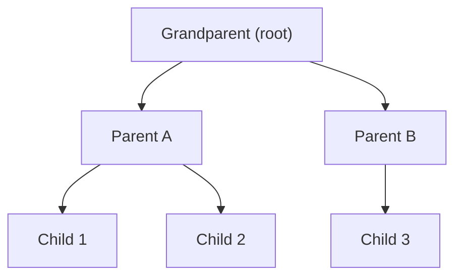
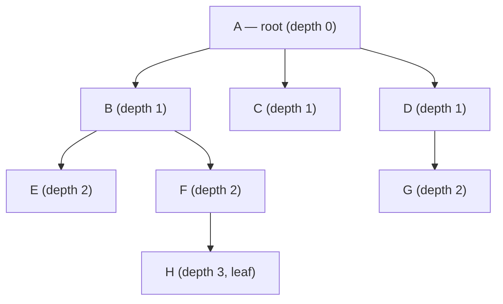
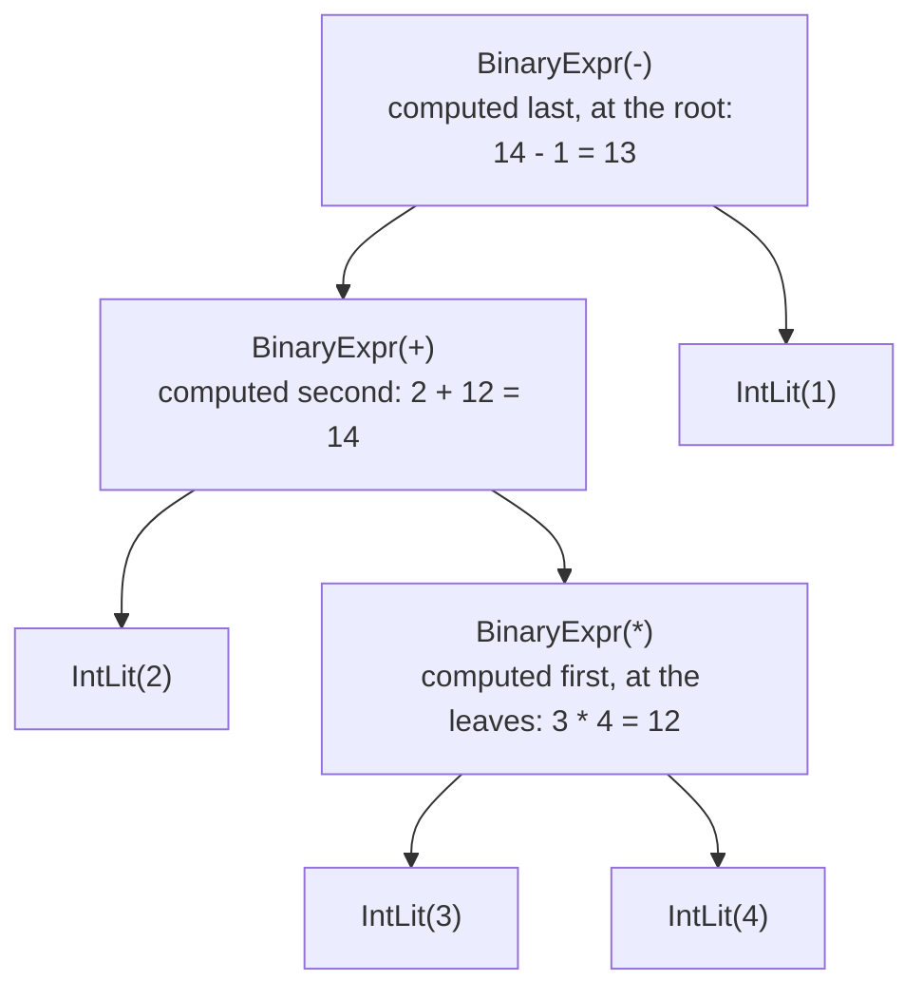

# Chapter 17: Trees and Binary Search Trees

> "A tree is a connected acyclic graph — or a data structure that makes computer scientists feel nostalgic for their childhood." — Nobody famous, but somebody said it

---

## Overview

Every directory on your computer is a tree. The HTML structure of every web page is a tree (the DOM). Your company's org chart is a tree. The expressions in a programming language like Astra are trees. The folder hierarchy in macOS Finder is a tree. Genealogy family trees are, well, trees.

Trees are one of the most fundamental and widely used data structures in computing. Unlike arrays and linked lists which are linear (one item after another), trees are **hierarchical** — items can have multiple children, enabling branching structure that models the real world extremely well.

In this chapter we focus specifically on **binary search trees (BSTs)** — the foundational tree that enables O(log n) lookup, which sits between O(1) hash maps (fastest) and O(n) linear search (slowest).

This chapter covers:
- Tree terminology: root, leaf, depth, height, subtree
- Binary trees: at most two children
- BST invariant and why it enables fast search
- BST operations: insert, search, delete (all three delete cases)
- Tree traversals: in-order, pre-order, post-order, level-order
- Balanced vs unbalanced trees and the O(n) worst case
- AVL trees and Red-Black trees (brief)
- N-ary trees
- Generic BST in Go
- **Astra Build Milestone**: A preview of the Abstract Syntax Tree (AST)

---

## What We're Building

By the end of this chapter you will have a working generic Binary Search Tree in Go, and you will understand why the AST (Abstract Syntax Tree) that the Astra compiler builds from source code is literally a tree, and how tree traversal algorithms directly map to how the compiler processes code.

---

## Table of Contents

1. What Is a Tree?
2. Tree Terminology
3. Binary Trees
4. The Binary Search Tree Invariant
5. BST Insert — O(log n) Average
6. BST Search — O(log n) Average
7. BST Delete — Three Cases
8. Tree Traversals
9. Balanced vs Unbalanced Trees
10. AVL Trees and Red-Black Trees (Brief)
11. N-ary Trees
12. Generic BST in Go
13. Astra Build Milestone: The Abstract Syntax Tree

---

## 1. What Is a Tree?

A **tree** is a hierarchical data structure made of **nodes** connected by **edges**, with no cycles. Every tree has:
- Exactly one **root** node (the top)
- Every other node has exactly one **parent**
- Each node can have zero or more **children**
- Nodes with no children are called **leaves**

The family tree analogy:



Grandparent is the **root**. Child 1, Child 2, and Child 3 are **leaves**. Parent A and Parent B have children, so they are **internal nodes**.

What makes a tree different from a general graph?
- **No cycles**: you cannot follow edges and return to a node you've already visited
- **One root**: one designated starting node
- **Connected**: there is exactly one path between any two nodes

---

## 2. Tree Terminology

Let us establish the vocabulary once and use it for the rest of the chapter:



| Term         | Meaning                                                        |
|--------------|----------------------------------------------------------------|
| Root         | The topmost node (A); no parent                               |
| Node         | Any element in the tree                                       |
| Leaf         | A node with no children (E, C, F, G... wait, G has no child) |
| Parent       | A node directly above another (A is parent of B, C, D)       |
| Child        | A node directly below another (B, C, D are children of A)    |
| Sibling      | Nodes sharing the same parent (B, C, D are siblings)         |
| Ancestor     | Any node on the path from a node to the root                  |
| Descendant   | Any node reachable by going down from a node                  |
| Depth        | Distance from the root (A has depth 0, B has depth 1)        |
| Height       | Depth of the deepest leaf (height of tree = 3 here)          |
| Subtree      | A node plus all its descendants                               |
| Edge         | A connection between parent and child                         |
| Degree       | Number of children a node has (A has degree 3)               |

A tree with n nodes always has exactly n-1 edges. This is a useful property for verifying your tree implementations.

---

## 3. Binary Trees

A **binary tree** is a tree where every node has **at most two children**: a **left child** and a **right child**.

```go
// BinaryTreeNode[T] is a node in a binary tree.
type BinaryTreeNode[T any] struct {
    Data  T
    Left  *BinaryTreeNode[T]
    Right *BinaryTreeNode[T]
}
```

Binary trees appear everywhere:
- **Binary search trees**: sorted data, O(log n) search
- **Heaps**: priority queues (Chapter 18)
- **Huffman trees**: data compression
- **Syntax trees**: in compilers (including Astra's AST)
- **Decision trees**: machine learning

A **complete binary tree** has all levels fully filled except possibly the last, and the last level is filled from left to right:

```
     1
    / \
   2   3
  / \ /
 4  5 6

Complete (6 nodes, 3 levels)
```

A **perfect binary tree** has all leaves at the same depth and every internal node has exactly two children:

```
      1
    /   \
   2     3
  / \   / \
 4   5 6   7

Perfect (7 nodes, 3 levels, 2^3 - 1 = 7)
```

A perfect binary tree of height h has 2^(h+1) - 1 nodes. This is where O(log n) comes from — a balanced tree with n nodes has height approximately log₂(n).

---

## 4. The Binary Search Tree Invariant

A **Binary Search Tree (BST)** is a binary tree with one additional rule: the **BST invariant**.

For every node N:
- **Every node in N's left subtree** has a value **less than** N's value
- **Every node in N's right subtree** has a value **greater than** N's value

```
          8
        /   \
       3     10
      / \      \
     1   6      14
        / \    /
       4   7  13

Check invariant:
- 8: left subtree {3,1,6,4,7} all < 8 ✓, right subtree {10,14,13} all > 8 ✓
- 3: left {1} < 3 ✓, right {6,4,7} > 3 ✓
- 10: left empty ✓, right {14,13} > 10 ✓
```

The BST invariant enables **binary search** on the tree: to find a value v, compare it to the current node. If v < node, go left. If v > node, go right. If equal, found! This cuts the search space in half at every step, giving O(log n) average search time.

---

## 5. BST Insert — O(log n) Average

To insert a value, we find the correct position by following the BST invariant:

```go
package bst

// BST[T] is a generic Binary Search Tree.
// T must support comparison (we use a comparator function).
type BST[T any] struct {
    root *node[T]
    less func(a, b T) bool  // returns true if a < b
    size int
}

type node[T any] struct {
    data  T
    left  *node[T]
    right *node[T]
}

// New creates a BST with a custom less-than comparator.
func New[T any](less func(a, b T) bool) *BST[T] {
    return &BST[T]{less: less}
}

// Insert adds a value to the BST. Duplicates are ignored.
func (b *BST[T]) Insert(val T) {
    b.root = b.insertNode(b.root, val)
}

func (b *BST[T]) insertNode(n *node[T], val T) *node[T] {
    if n == nil {
        b.size++
        return &node[T]{data: val}
    }
    if b.less(val, n.data) {
        n.left = b.insertNode(n.left, val)    // val < node: go left
    } else if b.less(n.data, val) {
        n.right = b.insertNode(n.right, val)  // val > node: go right
    }
    // If neither, val == n.data: duplicate, ignore
    return n
}
```

Inserting 5, 3, 8, 1, 4 into an empty BST:

```
Insert 5:        Insert 3:       Insert 8:       Insert 1:       Insert 4:
    5                5               5               5               5
                    /               / \             / \             / \
                   3               3   8           3   8           3   8
                                  /               / \             / \
                                 1              1   ⬤           1   4
```

---

## 6. BST Search — O(log n) Average

```go
// Contains returns true if the BST contains val.
func (b *BST[T]) Contains(val T) bool {
    return b.searchNode(b.root, val)
}

func (b *BST[T]) searchNode(n *node[T], val T) bool {
    if n == nil {
        return false  // fell off the tree: not found
    }
    if b.less(val, n.data) {
        return b.searchNode(n.left, val)   // val < node: search left
    }
    if b.less(n.data, val) {
        return b.searchNode(n.right, val)  // val > node: search right
    }
    return true  // val == node.data: found!
}
```

Searching for 4 in the tree above:

```
     5
    / \
   3   8
  / \
 1   4

Step 1: 4 < 5 → go left to 3
Step 2: 4 > 3 → go right to 4
Step 3: 4 == 4 → FOUND in 3 steps

Compare to linear search: might need to check all 5 nodes
```

---

## 7. BST Delete — Three Cases

Deletion is the most complex BST operation. There are three cases:

**Case 1: Node has no children (it's a leaf)** — just remove it.

```
Delete 1 from:       Result:
    5                    5
   / \                  / \
  3   8                3   8
 / \                    \
1   4                    4
```

**Case 2: Node has one child** — replace the node with its child.

```
Delete 3 from:       Result:
    5                    5
   / \                  / \
  3   8                4   8
   \
    4
```

**Case 3: Node has two children** — find the **in-order successor** (smallest value in the right subtree), copy its value to the current node, then delete the successor:

```
Delete 5 from:       Find in-order successor of 5 (smallest in right subtree):
    5                    5
   / \                  / \
  3   8                3   8   → successor is 8 (smallest in right subtree)
 / \
1   4

Copy 8 into node, delete original 8:
    8
   /
  3
 / \
1   4
```

```go
// Delete removes a value from the BST.
func (b *BST[T]) Delete(val T) {
    b.root, _ = b.deleteNode(b.root, val)
}

func (b *BST[T]) deleteNode(n *node[T], val T) (*node[T], bool) {
    if n == nil {
        return nil, false  // value not found
    }
    var deleted bool
    if b.less(val, n.data) {
        // val < node: go left
        n.left, deleted = b.deleteNode(n.left, val)
    } else if b.less(n.data, val) {
        // val > node: go right
        n.right, deleted = b.deleteNode(n.right, val)
    } else {
        // Found the node to delete
        deleted = true
        b.size--

        // Case 1: no children
        if n.left == nil && n.right == nil {
            return nil, deleted
        }
        // Case 2a: only right child
        if n.left == nil {
            return n.right, deleted
        }
        // Case 2b: only left child
        if n.right == nil {
            return n.left, deleted
        }
        // Case 3: two children — find in-order successor
        successor := b.minNode(n.right)
        n.data = successor.data
        n.right, _ = b.deleteNode(n.right, successor.data)
        b.size++  // we decremented above, but deleteNode will decrement again
    }
    return n, deleted
}

// minNode returns the node with the minimum value in the subtree.
func (b *BST[T]) minNode(n *node[T]) *node[T] {
    for n.left != nil {
        n = n.left
    }
    return n
}

// Min returns the minimum value in the BST.
func (b *BST[T]) Min() (T, bool) {
    if b.root == nil {
        var zero T
        return zero, false
    }
    return b.minNode(b.root).data, true
}

// Max returns the maximum value in the BST.
func (b *BST[T]) Max() (T, bool) {
    if b.root == nil {
        var zero T
        return zero, false
    }
    n := b.root
    for n.right != nil {
        n = n.right
    }
    return n.data, true
}
```

---

## 8. Tree Traversals

A **traversal** visits every node exactly once. The order in which nodes are visited defines the traversal type.

### In-Order Traversal (Left → Root → Right)

Visits nodes in **sorted order** for a BST. This is the magic property of BSTs.

```go
// InOrder calls fn on each value in sorted ascending order.
func (b *BST[T]) InOrder(fn func(T)) {
    b.inOrder(b.root, fn)
}

func (b *BST[T]) inOrder(n *node[T], fn func(T)) {
    if n == nil { return }
    b.inOrder(n.left, fn)   // 1. visit entire left subtree
    fn(n.data)               // 2. visit this node
    b.inOrder(n.right, fn)  // 3. visit entire right subtree
}
```

For our tree {1, 3, 4, 5, 8}: in-order visits `1, 3, 4, 5, 8` — sorted!

### Pre-Order Traversal (Root → Left → Right)

Visits the node **before** its children. Used to serialize/copy a tree.

```go
func (b *BST[T]) PreOrder(fn func(T)) {
    b.preOrder(b.root, fn)
}

func (b *BST[T]) preOrder(n *node[T], fn func(T)) {
    if n == nil { return }
    fn(n.data)                // 1. visit this node first
    b.preOrder(n.left, fn)   // 2. visit left subtree
    b.preOrder(n.right, fn)  // 3. visit right subtree
}
```

Pre-order of our tree: `5, 3, 1, 4, 8`

### Post-Order Traversal (Left → Right → Root)

Visits the node **after** its children. Used to delete a tree or evaluate expressions.

```go
func (b *BST[T]) PostOrder(fn func(T)) {
    b.postOrder(b.root, fn)
}

func (b *BST[T]) postOrder(n *node[T], fn func(T)) {
    if n == nil { return }
    b.postOrder(n.left, fn)   // 1. visit left subtree
    b.postOrder(n.right, fn)  // 2. visit right subtree
    fn(n.data)                 // 3. visit this node last
}
```

Post-order of our tree: `1, 4, 3, 8, 5`

### Level-Order Traversal (BFS — breadth-first)

Visits nodes level by level, left to right. Uses a **queue** (from Chapter 15).

```go
func (b *BST[T]) LevelOrder(fn func(T)) {
    if b.root == nil { return }

    queue := [](*node[T]){b.root}
    for len(queue) > 0 {
        // dequeue front
        current := queue[0]
        queue = queue[1:]

        fn(current.data)  // visit this node

        // enqueue children
        if current.left != nil  { queue = append(queue, current.left)  }
        if current.right != nil { queue = append(queue, current.right) }
    }
}
```

Level-order of our tree: `5, 3, 8, 1, 4`

### Visual Summary of Traversals

```
Tree:
       5
      / \
     3   8
    / \
   1   4

In-order   (L→N→R): 1, 3, 4, 5, 8   ← always sorted for a BST
Pre-order  (N→L→R): 5, 3, 1, 4, 8   ← root comes first
Post-order (L→R→N): 1, 4, 3, 8, 5   ← root comes last
Level-order(BFS):   5, 3, 8, 1, 4   ← breadth first
```

---

## 9. Balanced vs Unbalanced Trees

The BST invariant does NOT guarantee a balanced tree. If you insert items in sorted order, you get a completely unbalanced tree:

```
Insert 1, 2, 3, 4, 5 in order:

1
 \
  2
   \
    3
     \
      4
       \
        5

This is just a linked list! Search is O(n), not O(log n).
```

The worst case for BST operations is O(n) — when the tree degenerates into a linear chain. This happens whenever items are inserted in sorted or reverse-sorted order.

**Expected case**: if items are inserted in random order, the expected height is O(log n), giving O(log n) operations.

The fundamental problem: a plain BST provides no guarantee on balance.

---

## 10. AVL Trees and Red-Black Trees (Brief)

**Self-balancing BSTs** automatically restructure themselves to maintain O(log n) height.

### AVL Trees

An **AVL tree** (named after Adelson-Velsky and Landis, 1962) maintains the invariant that for every node, the heights of its left and right subtrees differ by at most 1 (the "balance factor").

```
Balanced AVL:          Unbalanced (balance factor = 2 at root):
      5                          5
     / \                          \
    3   8    ← heights differ by   7
   /                                \
  1                                  9
  
  Balance factors: -1, 0, +1 only     Balance factor at 5 = 2 → REBALANCE!
```

When a rotation is needed after insert/delete, AVL trees perform one of four rotations (left, right, left-right, right-left) to restore balance. After rebalancing, both subtrees have heights within 1 of each other.

AVL trees guarantee O(log n) for all operations. They are used in databases and memory-managed environments where read-heavy workloads dominate (AVL trees are slightly more rigidly balanced than red-black trees, making lookups marginally faster but inserts/deletes slightly slower).

### Red-Black Trees

A **red-black tree** is a BST where every node is colored red or black, with these rules:
1. The root is black
2. Red nodes cannot have red children (no two reds in a row)
3. Every path from root to any leaf has the same number of black nodes

These rules ensure the tree's height is at most 2×log₂(n+1) — guaranteeing O(log n) operations.

Red-black trees are used everywhere:
- **Go's `sort` package** and the `container/heap` package
- **Linux kernel** (the completely fair scheduler uses an RB tree)
- **Java's `TreeMap` and `TreeSet`**
- **C++ STL `std::map` and `std::set`**

Red-black trees allow slightly more imbalance than AVL trees, making inserts and deletes faster (fewer rotations) at the cost of marginally slower lookups. For most real-world workloads (mixed reads and writes), they win.

---

## 11. N-ary Trees

An **N-ary tree** allows each node to have any number of children, not just two:

```go
// NaryNode[T] is a node in an N-ary tree.
type NaryNode[T any] struct {
    Data     T
    Children []*NaryNode[T]
}

// NaryTree[T] is an N-ary tree.
type NaryTree[T any] struct {
    Root *NaryNode[T]
}

// AddChild adds a child to a node.
func AddChild[T any](parent *NaryNode[T], childData T) *NaryNode[T] {
    child := &NaryNode[T]{Data: childData}
    parent.Children = append(parent.Children, child)
    return child
}

// DFS visits nodes in depth-first order.
func DFS[T any](node *NaryNode[T], fn func(*NaryNode[T])) {
    if node == nil { return }
    fn(node)  // pre-order: visit before children
    for _, child := range node.Children {
        DFS(child, fn)
    }
}

// Height computes the height of an N-ary tree.
func Height[T any](node *NaryNode[T]) int {
    if node == nil || len(node.Children) == 0 {
        return 0
    }
    maxH := 0
    for _, child := range node.Children {
        h := Height(child)
        if h > maxH {
            maxH = h
        }
    }
    return maxH + 1
}
```

N-ary trees appear as:
- **Filesystem directory trees** (each directory can have any number of files/subdirectories)
- **HTML/XML DOM** (each element can have any number of child elements)
- **Compiler ASTs** (each node type has a specific set of children: an if-statement has 3: condition, then-body, else-body)
- **Tries** (Chapter 19): each node has up to 26 children (one per letter)

---

## 12. Generic BST in Go — Complete Implementation

```go
package bst

import "fmt"

// BST[T] is a complete generic Binary Search Tree.
type BST[T any] struct {
    root *node[T]
    less func(a, b T) bool
    size int
}

type node[T any] struct {
    data        T
    left, right *node[T]
    height      int  // used for balance factor in AVL variant
}

// New creates a BST with a comparison function.
// less(a, b) must return true if a < b.
func New[T any](less func(a, b T) bool) *BST[T] {
    return &BST[T]{less: less}
}

// NewIntBST creates a BST of integers.
func NewIntBST() *BST[int] {
    return New(func(a, b int) bool { return a < b })
}

// NewStringBST creates a BST of strings (lexicographic order).
func NewStringBST() *BST[string] {
    return New(func(a, b string) bool { return a < b })
}

func (b *BST[T]) equal(a, c T) bool {
    return !b.less(a, c) && !b.less(c, a)
}

func (b *BST[T]) Insert(val T)        { b.root = b.insertNode(b.root, val) }
func (b *BST[T]) Contains(val T) bool { return b.containsNode(b.root, val) }
func (b *BST[T]) Size() int           { return b.size }
func (b *BST[T]) IsEmpty() bool       { return b.size == 0 }

func (b *BST[T]) insertNode(n *node[T], val T) *node[T] {
    if n == nil { b.size++; return &node[T]{data: val} }
    if b.less(val, n.data) {
        n.left = b.insertNode(n.left, val)
    } else if b.less(n.data, val) {
        n.right = b.insertNode(n.right, val)
    }
    return n
}

func (b *BST[T]) containsNode(n *node[T], val T) bool {
    if n == nil { return false }
    if b.less(val, n.data) { return b.containsNode(n.left, val) }
    if b.less(n.data, val) { return b.containsNode(n.right, val) }
    return true
}

func (b *BST[T]) InOrderSlice() []T {
    result := make([]T, 0, b.size)
    b.inOrder(b.root, func(v T) { result = append(result, v) })
    return result
}

func (b *BST[T]) inOrder(n *node[T], fn func(T)) {
    if n == nil { return }
    b.inOrder(n.left, fn)
    fn(n.data)
    b.inOrder(n.right, fn)
}

func (b *BST[T]) PreOrderSlice() []T {
    result := make([]T, 0, b.size)
    b.preOrder(b.root, func(v T) { result = append(result, v) })
    return result
}

func (b *BST[T]) preOrder(n *node[T], fn func(T)) {
    if n == nil { return }
    fn(n.data)
    b.preOrder(n.left, fn)
    b.preOrder(n.right, fn)
}

func (b *BST[T]) PostOrderSlice() []T {
    result := make([]T, 0, b.size)
    b.postOrder(b.root, func(v T) { result = append(result, v) })
    return result
}

func (b *BST[T]) postOrder(n *node[T], fn func(T)) {
    if n == nil { return }
    b.postOrder(n.left, fn)
    b.postOrder(n.right, fn)
    fn(n.data)
}

func (b *BST[T]) Height() int { return b.height(b.root) }

func (b *BST[T]) height(n *node[T]) int {
    if n == nil { return -1 }
    l, r := b.height(n.left), b.height(n.right)
    if l > r { return l + 1 }
    return r + 1
}

// Print draws the tree visually (useful for debugging small trees).
func (b *BST[T]) Print() {
    b.printNode(b.root, "", false)
}

func (b *BST[T]) printNode(n *node[T], prefix string, isLeft bool) {
    if n == nil { return }
    connector := "└── "
    if isLeft { connector = "├── " }
    fmt.Printf("%s%s%v\n", prefix, connector, n.data)

    childPrefix := prefix + "│   "
    if !isLeft { childPrefix = prefix + "    " }

    if n.left != nil || n.right != nil {
        b.printNode(n.left,  childPrefix, true)
        b.printNode(n.right, childPrefix, false)
    }
}
```

Usage:

```go
package main

import (
    "fmt"
    "your-module/bst"
)

func main() {
    tree := bst.NewIntBST()
    for _, v := range []int{5, 3, 8, 1, 4, 7, 9, 2, 6} {
        tree.Insert(v)
    }

    fmt.Println("In-order (sorted):", tree.InOrderSlice())
    // [1 2 3 4 5 6 7 8 9]

    fmt.Println("Pre-order:", tree.PreOrderSlice())
    // [5 3 1 2 4 8 7 6 9]

    fmt.Println("Post-order:", tree.PostOrderSlice())
    // [2 1 4 3 6 7 9 8 5]

    fmt.Println("Height:", tree.Height())   // 3
    fmt.Println("Contains 4:", tree.Contains(4))  // true
    fmt.Println("Contains 10:", tree.Contains(10)) // false

    tree.Print()
    // └── 5
    //     ├── 3
    //     │   ├── 1
    //     │   │   └── 2
    //     │   └── 4
    //     └── 8
    //         ├── 7
    //         │   ├── 6
    //         └── 9
}
```

---

## 13. Astra Build Milestone: The Abstract Syntax Tree Preview

The **Abstract Syntax Tree (AST)** is the central data structure of the Astra compiler. After the parser processes the token list (Chapter 13), it builds an AST that represents the **structure and meaning** of the program, rather than its text.

"Abstract" means we've thrown away irrelevant details like whitespace, comments, and parentheses (we've captured their meaning instead).

### From Expression to AST

Consider the Astra expression:

```
2 + 3 * 4 - 1
```

The parser applies operator precedence rules (`*` before `+` and `-`) to build:



The traversal order that evaluates this correctly is **post-order** (left, right, then root) — exactly the post-order traversal we studied above.

### The AST Node Hierarchy

The Astra AST is a tree where each node type represents a different syntactic construct:

```go
// ast/nodes.go

package ast

import "your-module/lexer"

// Node is the base interface for all AST nodes.
type Node interface {
    nodeKind() string
    GetLine() int
    GetColumn() int
}

// Expr is any node that produces a value.
type Expr interface {
    Node
    exprNode()
}

// Stmt is any node that performs an action.
type Stmt interface {
    Node
    stmtNode()
}

// Decl is a top-level declaration.
type Decl interface {
    Node
    declNode()
}

// --- Expressions ---

// IntLiteral: e.g., 42
type IntLiteral struct {
    Value  int64
    Line   int
    Column int
}
func (n *IntLiteral) nodeKind() string { return "IntLiteral" }
func (n *IntLiteral) GetLine() int     { return n.Line }
func (n *IntLiteral) GetColumn() int   { return n.Column }
func (n *IntLiteral) exprNode()        {}

// FloatLiteral: e.g., 3.14
type FloatLiteral struct {
    Value  float64
    Line   int
    Column int
}
func (n *FloatLiteral) nodeKind() string { return "FloatLiteral" }
func (n *FloatLiteral) GetLine() int     { return n.Line }
func (n *FloatLiteral) GetColumn() int   { return n.Column }
func (n *FloatLiteral) exprNode()        {}

// StringLiteral: e.g., "hello"
type StringLiteral struct {
    Value  string
    Line   int
    Column int
}
func (n *StringLiteral) nodeKind() string { return "StringLiteral" }
func (n *StringLiteral) GetLine() int     { return n.Line }
func (n *StringLiteral) GetColumn() int   { return n.Column }
func (n *StringLiteral) exprNode()        {}

// BoolLiteral: true or false
type BoolLiteral struct {
    Value  bool
    Line   int
    Column int
}
func (n *BoolLiteral) nodeKind() string { return "BoolLiteral" }
func (n *BoolLiteral) GetLine() int     { return n.Line }
func (n *BoolLiteral) GetColumn() int   { return n.Column }
func (n *BoolLiteral) exprNode()        {}

// Identifier: e.g., x, myVar, add
type Identifier struct {
    Name   string
    Line   int
    Column int
}
func (n *Identifier) nodeKind() string { return "Identifier" }
func (n *Identifier) GetLine() int     { return n.Line }
func (n *Identifier) GetColumn() int   { return n.Column }
func (n *Identifier) exprNode()        {}

// BinaryExpr: e.g., a + b, x * y, age >= 18
type BinaryExpr struct {
    Left   Expr
    Op     string  // "+", "-", "*", "/", "==", "!=", "<", ">", "<=", ">="
    Right  Expr
    Line   int
    Column int
}
func (n *BinaryExpr) nodeKind() string { return "BinaryExpr" }
func (n *BinaryExpr) GetLine() int     { return n.Line }
func (n *BinaryExpr) GetColumn() int   { return n.Column }
func (n *BinaryExpr) exprNode()        {}

// UnaryExpr: e.g., -x, !flag
type UnaryExpr struct {
    Op      string  // "-", "!"
    Operand Expr
    Line    int
    Column  int
}
func (n *UnaryExpr) nodeKind() string { return "UnaryExpr" }
func (n *UnaryExpr) GetLine() int     { return n.Line }
func (n *UnaryExpr) GetColumn() int   { return n.Column }
func (n *UnaryExpr) exprNode()        {}

// CallExpr: e.g., add(1, 2), print("hello")
type CallExpr struct {
    Callee Expr    // the function being called
    Args   []Expr  // arguments
    Line   int
    Column int
}
func (n *CallExpr) nodeKind() string { return "CallExpr" }
func (n *CallExpr) GetLine() int     { return n.Line }
func (n *CallExpr) GetColumn() int   { return n.Column }
func (n *CallExpr) exprNode()        {}

// --- Statements ---

// LetStmt: e.g., let x = 42
type LetStmt struct {
    Name   string
    Type   string  // optional explicit type annotation
    Value  Expr
    Line   int
    Column int
}
func (n *LetStmt) nodeKind() string { return "LetStmt" }
func (n *LetStmt) GetLine() int     { return n.Line }
func (n *LetStmt) GetColumn() int   { return n.Column }
func (n *LetStmt) stmtNode()        {}

// ReturnStmt: e.g., return x + 1
type ReturnStmt struct {
    Value  Expr  // nil if "return" with no value
    Line   int
    Column int
}
func (n *ReturnStmt) nodeKind() string { return "ReturnStmt" }
func (n *ReturnStmt) GetLine() int     { return n.Line }
func (n *ReturnStmt) GetColumn() int   { return n.Column }
func (n *ReturnStmt) stmtNode()        {}

// IfStmt: e.g., if condition { ... } else { ... }
type IfStmt struct {
    Condition Expr
    ThenBody  []Stmt
    ElseBody  []Stmt  // nil if no else
    Line      int
    Column    int
}
func (n *IfStmt) nodeKind() string { return "IfStmt" }
func (n *IfStmt) GetLine() int     { return n.Line }
func (n *IfStmt) GetColumn() int   { return n.Column }
func (n *IfStmt) stmtNode()        {}

// ForStmt: e.g., for i in 0..10 { ... }
type ForStmt struct {
    Var      string  // loop variable name
    Iterable Expr    // the range expression
    Body     []Stmt
    Line     int
    Column   int
}
func (n *ForStmt) nodeKind() string { return "ForStmt" }
func (n *ForStmt) GetLine() int     { return n.Line }
func (n *ForStmt) GetColumn() int   { return n.Column }
func (n *ForStmt) stmtNode()        {}

// ExprStmt: an expression used as a statement, e.g., print("hello")
type ExprStmt struct {
    Expr   Expr
    Line   int
    Column int
}
func (n *ExprStmt) nodeKind() string { return "ExprStmt" }
func (n *ExprStmt) GetLine() int     { return n.Line }
func (n *ExprStmt) GetColumn() int   { return n.Column }
func (n *ExprStmt) stmtNode()        {}

// --- Declarations ---

// FunctionParam: a single parameter in a function signature.
type FunctionParam struct {
    Name     string
    TypeName string
    Line     int
    Column   int
}

// FunctionDecl: e.g., fn add(a: int, b: int) -> int { ... }
type FunctionDecl struct {
    Name       string
    Params     []FunctionParam
    ReturnType string  // "" if void
    Body       []Stmt
    Line       int
    Column     int
}
func (n *FunctionDecl) nodeKind() string { return "FunctionDecl" }
func (n *FunctionDecl) GetLine() int     { return n.Line }
func (n *FunctionDecl) GetColumn() int   { return n.Column }
func (n *FunctionDecl) declNode()        {}

// Program is the root of the AST.
type Program struct {
    Declarations []Decl
}
func (n *Program) nodeKind() string { return "Program" }
func (n *Program) GetLine() int     { return 0 }
func (n *Program) GetColumn() int   { return 0 }
```

### AST Visitor Pattern

Compilers traverse the AST multiple times — for type checking, optimization, code generation. The **visitor pattern** separates the traversal from the operation:

```go
// ast/visitor.go

package ast

// Visitor defines an operation to perform on each AST node.
// Returning false from any Visit method stops traversal of that subtree.
type Visitor interface {
    VisitIntLiteral(n *IntLiteral) bool
    VisitFloatLiteral(n *FloatLiteral) bool
    VisitStringLiteral(n *StringLiteral) bool
    VisitBoolLiteral(n *BoolLiteral) bool
    VisitIdentifier(n *Identifier) bool
    VisitBinaryExpr(n *BinaryExpr) bool
    VisitUnaryExpr(n *UnaryExpr) bool
    VisitCallExpr(n *CallExpr) bool
    VisitLetStmt(n *LetStmt) bool
    VisitReturnStmt(n *ReturnStmt) bool
    VisitIfStmt(n *IfStmt) bool
    VisitForStmt(n *ForStmt) bool
    VisitFunctionDecl(n *FunctionDecl) bool
}

// Walk traverses an AST node and its children using the given Visitor.
// This is the pre-order traversal over the AST tree.
func Walk(v Visitor, node Node) {
    switch n := node.(type) {
    case *BinaryExpr:
        if v.VisitBinaryExpr(n) {
            Walk(v, n.Left)    // visit left subtree
            Walk(v, n.Right)   // visit right subtree
        }
    case *UnaryExpr:
        if v.VisitUnaryExpr(n) {
            Walk(v, n.Operand)
        }
    case *CallExpr:
        if v.VisitCallExpr(n) {
            Walk(v, n.Callee)
            for _, arg := range n.Args { Walk(v, arg) }
        }
    case *LetStmt:
        if v.VisitLetStmt(n) {
            Walk(v, n.Value)
        }
    case *ReturnStmt:
        if n.Value != nil && v.VisitReturnStmt(n) {
            Walk(v, n.Value)
        }
    case *IfStmt:
        if v.VisitIfStmt(n) {
            Walk(v, n.Condition)
            for _, s := range n.ThenBody { Walk(v, s) }
            for _, s := range n.ElseBody { Walk(v, s) }
        }
    case *FunctionDecl:
        if v.VisitFunctionDecl(n) {
            for _, s := range n.Body { Walk(v, s) }
        }
    // ... other cases ...
    }
}
```

An example visitor that counts all integer literals in the AST:

```go
type IntLiteralCounter struct {
    Count int
}

func (c *IntLiteralCounter) VisitIntLiteral(n *ast.IntLiteral) bool {
    c.Count++
    return false  // no children to visit
}
// ... implement other Visit methods as no-ops returning true ...

counter := &IntLiteralCounter{}
ast.Walk(counter, program)
fmt.Printf("Found %d integer literals\n", counter.Count)
```

The AST is a tree, and everything we learned about trees — traversal orders, recursive processing, N-ary structure — applies directly to the compiler's most central data structure.

---

## Exercises

1. **BST from sorted array**: Given a sorted array, build a balanced BST in O(n). The middle element should be the root.

2. **Validate a BST**: Given a binary tree, check whether it satisfies the BST invariant. Do not just check parent-child pairs — check the full range invariant for each node.

3. **Lowest Common Ancestor**: Given a BST and two values, find their lowest common ancestor — the deepest node that is an ancestor of both.

4. **Kth smallest element**: Find the k-th smallest element in a BST in O(log n + k). Hint: augment each node with a `subtreeSize` field.

5. **BST to doubly linked list**: Convert a BST in-place to a sorted doubly linked list without allocating any new nodes. The left pointer becomes `prev` and right pointer becomes `next`.

6. **Tree diameter**: Compute the diameter of a binary tree — the length of the longest path between any two nodes (the path may not pass through the root).

7. **Serialize and deserialize**: Implement `Serialize(tree)` that converts a BST to a string, and `Deserialize(str)` that rebuilds the same BST from the string. Use pre-order traversal.

8. **Astra AST challenge**: Implement a `PrettyPrinter` visitor that walks an Astra AST and outputs formatted source code (also called "pretty printing" or "code formatting"). For example, the AST for `let x=1+2*3` should print as `let x = 1 + 2 * 3` with proper spacing.

---

## Summary

| Concept                | Key Point                                                    |
|------------------------|--------------------------------------------------------------|
| Tree                   | Hierarchical, connected, acyclic; one root                  |
| Binary tree            | At most two children per node (left, right)                 |
| BST invariant          | Left < Node < Right for all nodes in all subtrees           |
| BST insert             | O(log n) average, O(n) worst (degenerate/sorted input)      |
| BST search             | O(log n) average — halves search space at each step         |
| BST delete             | Three cases: leaf, one child, two children (use successor)  |
| In-order traversal     | L→N→R: produces sorted output for BSTs                     |
| Pre-order traversal    | N→L→R: root first; used to serialize trees                 |
| Post-order traversal   | L→R→N: root last; used to evaluate expression trees        |
| Level-order (BFS)      | Level by level; requires a queue                            |
| Balanced tree          | Height O(log n); guaranteed O(log n) operations             |
| AVL tree               | Self-balancing; strict balance, fast lookups                |
| Red-black tree         | Self-balancing; relaxed balance, fast insert/delete         |
| N-ary tree             | Any number of children; used in filesystems, ASTs, tries    |
| Astra AST              | Tree of node types; traversed by visitor pattern in compiler|
