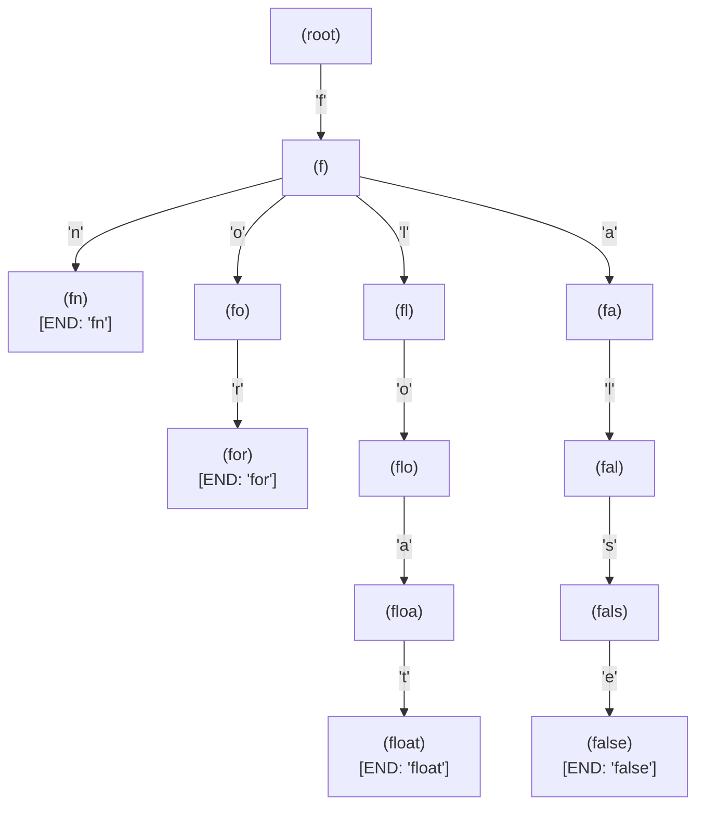
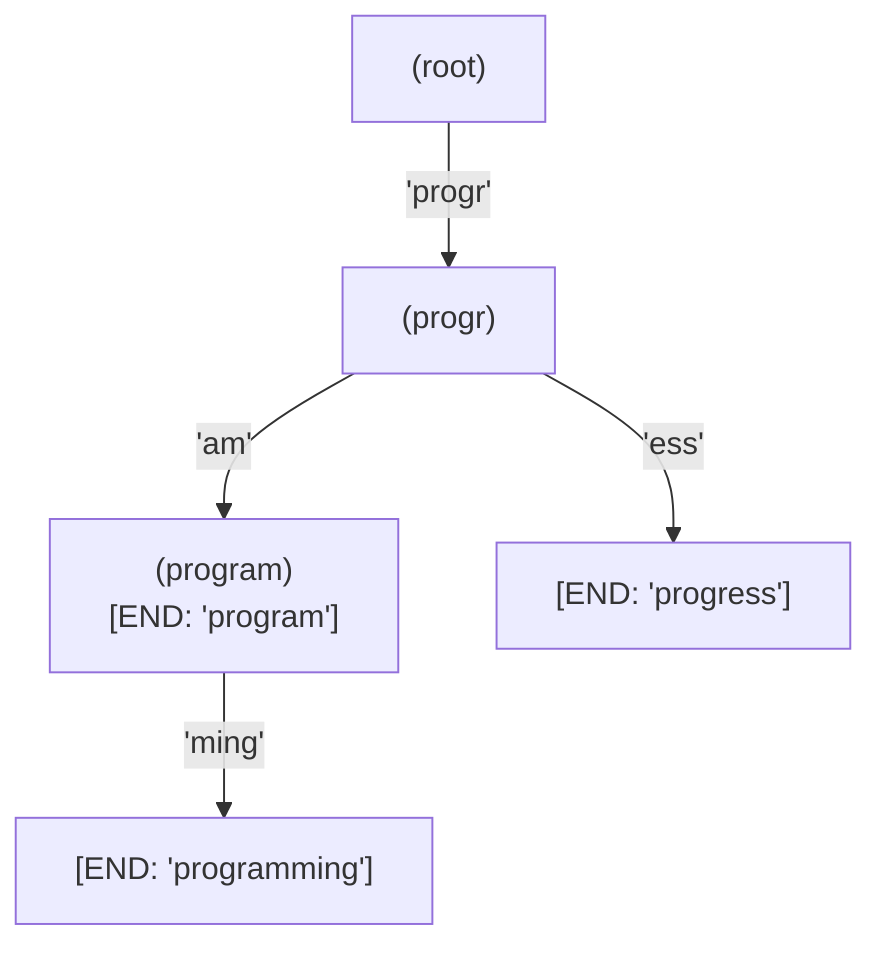

# Chapter 19: Tries — Prefix Trees for Lightning-Fast String Lookup

> *"A trie is a tree that has been trained to spell. Every path from root to leaf is a word; every internal node is a promise of what might come next."*
> — Inspired by Donald Knuth, *The Art of Computer Programming*

Imagine you are building a search engine. A user starts typing "prog" and you need to suggest completions: "programming," "program," "progress," "programmer." A hash map can tell you in O(1) whether "programming" is a valid word — but it cannot efficiently find ALL words that START with "prog." To find those, you would have to scan every word in the dictionary, which could be millions of entries.

The **trie** (pronounced "try," from re**trie**val) solves this problem elegantly. It is a tree where every path from the root to a marked node spells out a word. A prefix search for "prog" just walks four nodes into the tree and then collects everything below. It is the data structure behind autocomplete in search engines, the spell-checker in your IDE, and — crucially for Astra — the keyword recognizer in the lexer that distinguishes `for` from `forever` and `fn` from `float`.

This chapter teaches tries from scratch: the data structure, all operations with complete Go implementations, complexity analysis, and the Astra lexer's keyword lookup system.

## What We're Building

The Astra lexer needs to distinguish keywords from identifiers. When it reads the token `for`, it must produce a `FOR` token. When it reads `forever`, it must produce an `IDENT` token. A trie (or equivalently, a hash map) maps string → token type:

```astra
fn main() {
    for i in 0..10 {   // "for" → FOR token, "in" → IN token
        let x = true   // "let" → LET, "true" → TRUE
    }
}
```

The keyword trie built here feeds directly into Chapter 54 (Astra Lexer).

## Table of Contents

1. The Problem — Fast String Prefix Operations
2. The Trie Data Structure
3. Trie Operations — Insert, Search, StartsWith, Delete
4. AllWithPrefix — The Autocomplete Operation
5. Complete Go Implementation
6. Complexity Analysis
7. Compressed Tries — Radix Trees
8. Suffix Tries and Suffix Arrays
9. Applications Beyond Keywords
10. Astra Build Milestone — The Keyword Trie
11. Exercises
12. Summary

---

## 1. The Problem — Fast String Prefix Operations

### Why Not a Hash Map?

A hash map is the obvious data structure for key-value lookup:

```go
keywords := map[string]TokenType{
    "for": FOR,
    "fn":  FN,
    // ...
}
tokenType, ok := keywords["for"]  // O(1) average — fast!
```

For **exact match**, a hash map is excellent. But try these operations:

- **Autocomplete:** Find all words starting with "pr" → hash map must scan ALL keys
- **Longest prefix match:** Find the longest keyword that matches the start of the input → requires scanning
- **Prefix validation:** Does ANY keyword start with "fn"? → requires scanning

For a lexer with 23 keywords, the hash map is perfectly fast — we use it in Astra. But for autocomplete in a text editor with 100,000 words, the trie is the right tool. Understanding tries teaches you pattern matching, tree traversal, and the thinking behind many advanced algorithms.

### Why Not a Sorted Array with Binary Search?

```go
keywords := []string{"chan", "const", "else", "enum", "false", ...}
// Binary search: O(log n) for exact match
// Prefix search: O(log n) to find start + O(k) to collect k matches
```

Better than scanning everything, but still requires that we store all words and find the start point each time. Tries handle all prefix operations in O(m) where m is the length of the query — independent of how many words are stored.

---

## 2. The Trie Data Structure

A trie is a tree with a specific structure:

- The **root node** represents the empty string (start of everything).
- Each **edge** is labeled with a character.
- Each **node** represents the string formed by concatenating all edge labels from root to that node.
- Some nodes are marked as **end nodes** — they represent complete words in the dictionary.

Think of it like a filing cabinet where each drawer represents the next letter of your word. To find all words starting with "pro", open the "p" drawer, then the "r" drawer, then the "o" drawer, and collect everything below.

### A Trie Containing Astra Keywords "fn", "for", "float", "false"



Notice:
- All four words share the first node for 'f' — they all start with 'f'
- "fn" and "for" share nothing after 'f' (different next characters 'n' vs 'o')
- "float" and "false" share 'f' then 'l' then 'a' before diverging
- Only nodes marked [END] represent complete words; intermediate nodes are just partial prefixes

### The TrieNode Structure

Each node needs:
1. A map from character to child node (children)
2. A flag indicating whether this node ends a complete word
3. Optionally, any associated data (like a token type for keywords)

```go
type TrieNode struct {
    children map[rune]*TrieNode  // character → child node
    isEnd    bool                // is this a complete word?
    value    interface{}         // associated data (e.g., TokenType for keywords)
}
```

Why `map[rune]` and not `map[byte]`? Because Astra identifiers may contain Unicode in the future, and rune correctly handles multi-byte characters. For pure ASCII keywords, we could use `map[byte]` or even `[128]*TrieNode` (fixed array indexed by ASCII value) for speed.

**Alternative: Fixed-size array for ASCII-only tries**

```go
// Faster for ASCII-only tries (no hash overhead):
type TrieNodeASCII struct {
    children [128]*TrieNodeASCII  // one slot per ASCII character
    isEnd    bool
    tokenType TokenType
}
```

Array indexing is O(1) without hashing, and the memory is contiguous (cache-friendly). For Astra's keyword trie with only ASCII keywords, this is the fastest approach.

---

## 3. Trie Operations — Insert, Search, StartsWith, Delete

Let us trace through each operation carefully.

### Insert

**Algorithm:** Walk character by character. If the next node doesn't exist, create it. After the last character, mark `isEnd = true`.

```
Insert("for") into an empty trie:

Step 1: at root, look for child 'f' → doesn't exist → create node_f
Step 2: at node_f, look for child 'o' → doesn't exist → create node_fo
Step 3: at node_fo, look for child 'r' → doesn't exist → create node_for
Step 4: at node_for, set isEnd = true (we have a complete word)
```

```
Insert("float") into a trie that already has "fn", "for":

Step 1: at root, look for child 'f' → EXISTS (from "fn" and "for") → follow it
Step 2: at node_f, look for child 'l' → doesn't exist → create node_fl
Step 3: at node_fl, look for child 'o' → doesn't exist → create node_flo
Step 4: at node_flo, look for child 'a' → doesn't exist → create node_floa
Step 5: at node_floa, look for child 't' → doesn't exist → create node_float
Step 6: at node_float, set isEnd = true
```

Key insight: we never duplicate the 'f' node. Words with common prefixes **share** nodes. This is what makes tries memory-efficient for sets of strings with shared prefixes.

### Search (Exact Match)

**Algorithm:** Walk character by character. If any character's node doesn't exist, return false. If we consume all characters, return `isEnd` of the final node.

```
Search("for"):
  'f' → follow to node_f  ✓
  'o' → follow to node_fo ✓
  'r' → follow to node_for ✓
  End of string. Is node_for.isEnd == true? YES → return true

Search("fo"):
  'f' → follow to node_f  ✓
  'o' → follow to node_fo ✓
  End of string. Is node_fo.isEnd == true? NO → return false
  ("fo" is a prefix of "for" but not itself a word)

Search("fox"):
  'f' → follow to node_f  ✓
  'o' → follow to node_fo ✓
  'x' → look for child 'x' in node_fo → DOESN'T EXIST → return false
```

### StartsWith (Prefix Check)

**Algorithm:** Same as Search, but don't check `isEnd` — just verify the path exists.

```
StartsWith("fl"):
  'f' → follow to node_f  ✓
  'l' → follow to node_fl ✓
  End of prefix. Path exists → return true
  ("fl" is a valid prefix — "float" starts with "fl")

StartsWith("fx"):
  'f' → follow to node_f  ✓
  'x' → look for child 'x' in node_f → DOESN'T EXIST → return false
```

### Delete

**Algorithm:** Recursively search for the word. On the way back up (after finding the end), clear `isEnd`. If a node has no children and `isEnd = false`, it can be removed (garbage collected).

```
Delete("for") from trie containing "for", "float":

Step 1: Navigate to node_for
Step 2: Set node_for.isEnd = false  ("for" is no longer a complete word)
Step 3: Check if node_for can be removed:
  - node_for.isEnd = false
  - node_for.children is empty
  → YES, remove it (nil the pointer in node_fo.children['r'])
Step 4: Check node_fo:
  - node_fo.isEnd = false
  - node_fo.children is now empty
  → YES, remove it
Step 5: Check node_f:
  - node_f.isEnd = false
  - node_f.children still has 'l' (for "float")
  → NO, keep it
```

After deleting "for", the trie still correctly represents "float" (and "fn" etc.) with no orphaned nodes.

---

## 4. AllWithPrefix — The Autocomplete Operation

This is the most powerful trie operation. Given a prefix, find ALL words in the trie that start with it.

**Algorithm:**
1. Navigate to the node representing the prefix (using the Search algorithm without checking `isEnd`)
2. From that node, do a **Depth-First Search (DFS)** to collect all paths that end at an `isEnd` node
3. Each such path, prepended with the prefix, is a result

```
AllWithPrefix("f") in our trie of {fn, for, float, false}:

Step 1: Navigate to node_f
Step 2: DFS from node_f:
  - Try 'n': follow to node_fn → isEnd=true → collect "fn"
    - node_fn has no children → backtrack
  - Try 'o': follow to node_fo → isEnd=false
    - Try 'r': follow to node_for → isEnd=true → collect "for"
      - node_for has no children → backtrack
    - backtrack to node_fo → backtrack to node_f
  - Try 'l': follow to node_fl → isEnd=false
    - Try 'o': follow to node_flo → isEnd=false
      - Try 'a': ... → eventually reach node_float → isEnd=true → collect "float"
    - backtrack
  - Try 'a': ... → eventually reach node_false → isEnd=true → collect "false"

Result: ["fn", "for", "float", "false"]

AllWithPrefix("fo"):
Step 1: Navigate to node_fo
Step 2: DFS from node_fo → finds "for"
Result: ["for"]

AllWithPrefix("xyz"):
Step 1: Navigate... 'x' not in root.children → return []
Result: []
```

---

## 5. Complete Go Implementation

```go
// datastructures/trie.go
package datastructures

import "fmt"

// TrieNode represents one node in the trie.
// Each node stores its children as a map from rune to child node,
// a flag marking whether this node ends a complete word,
// and an optional associated value (useful for keyword → token-type mapping).
type TrieNode struct {
    children map[rune]*TrieNode
    isEnd    bool
    value    interface{} // nil for plain word storage; TokenType for keyword trie
}

// newTrieNode creates an empty trie node with an initialized children map.
func newTrieNode() *TrieNode {
    return &TrieNode{
        children: make(map[rune]*TrieNode),
    }
}

// Trie is the main trie data structure.
// The root node represents the empty string.
type Trie struct {
    root      *TrieNode
    wordCount int // number of complete words stored
}

// NewTrie creates a new, empty trie.
func NewTrie() *Trie {
    return &Trie{
        root: newTrieNode(),
    }
}

// ============================================================
// Insert
// ============================================================

// Insert adds a word to the trie.
// If the word already exists, this is a no-op (idempotent).
func (t *Trie) Insert(word string) {
    t.InsertWithValue(word, nil)
}

// InsertWithValue adds a word with an associated value.
// Used for keyword tries where each keyword maps to a token type.
func (t *Trie) InsertWithValue(word string, value interface{}) {
    current := t.root

    // Walk one character at a time:
    for _, ch := range word {  // range gives us runes (Unicode code points)
        if _, exists := current.children[ch]; !exists {
            // This character's node doesn't exist yet — create it
            current.children[ch] = newTrieNode()
        }
        current = current.children[ch]
    }

    // Mark the end of the word
    if !current.isEnd {
        current.isEnd = true
        current.value = value
        t.wordCount++
    }
}

// ============================================================
// Search
// ============================================================

// Search returns true if the exact word is in the trie.
// Complexity: O(m) where m = len(word)
func (t *Trie) Search(word string) bool {
    node := t.findNode(word)
    return node != nil && node.isEnd
}

// SearchWithValue returns the value associated with a word, and whether it was found.
// Returns (nil, false) if the word is not in the trie.
func (t *Trie) SearchWithValue(word string) (interface{}, bool) {
    node := t.findNode(word)
    if node == nil || !node.isEnd {
        return nil, false
    }
    return node.value, true
}

// findNode is a helper: navigate to the node for the given string.
// Returns nil if any character in the string is missing.
func (t *Trie) findNode(s string) *TrieNode {
    current := t.root
    for _, ch := range s {
        next, exists := current.children[ch]
        if !exists {
            return nil  // character not found → path doesn't exist
        }
        current = next
    }
    return current
}

// ============================================================
// StartsWith
// ============================================================

// StartsWith returns true if ANY word in the trie starts with the given prefix.
// Complexity: O(m) where m = len(prefix)
func (t *Trie) StartsWith(prefix string) bool {
    return t.findNode(prefix) != nil
}

// ============================================================
// Delete
// ============================================================

// Delete removes a word from the trie.
// Returns true if the word was found and deleted, false if it wasn't in the trie.
// Orphaned nodes (nodes with no children and isEnd=false) are pruned.
func (t *Trie) Delete(word string) bool {
    deleted := t.deleteHelper(t.root, []rune(word), 0)
    if deleted {
        t.wordCount--
    }
    return deleted
}

// deleteHelper recursively navigates to the word and then cleans up on the way back.
// Returns true if this node should be deleted by its parent (it's now unused).
func (t *Trie) deleteHelper(node *TrieNode, word []rune, depth int) bool {
    if node == nil {
        return false  // path doesn't exist, word wasn't in trie
    }

    // Base case: we've consumed all characters
    if depth == len(word) {
        if !node.isEnd {
            return false  // word wasn't in trie (path exists but not marked as end)
        }
        node.isEnd = false
        node.value = nil
        // Signal to parent: delete me if I have no children
        return len(node.children) == 0
    }

    // Recursive case: go deeper
    ch := word[depth]
    child, exists := node.children[ch]
    if !exists {
        return false  // character missing, word not in trie
    }

    shouldDeleteChild := t.deleteHelper(child, word, depth+1)

    if shouldDeleteChild {
        // Child is now unused — remove the edge to it
        delete(node.children, ch)
        // Signal to OUR parent: delete us if we're also unused
        return len(node.children) == 0 && !node.isEnd
    }

    return false
}

// ============================================================
// AllWithPrefix — The Autocomplete Operation
// ============================================================

// AllWithPrefix returns all words in the trie that start with the given prefix.
// Results are returned in the order they are encountered (depth-first).
// If no words share the prefix, returns an empty slice.
func (t *Trie) AllWithPrefix(prefix string) []string {
    startNode := t.findNode(prefix)
    if startNode == nil {
        return []string{}  // prefix doesn't exist in trie
    }

    results := []string{}
    // DFS from the prefix node, accumulating the suffix
    t.collectWords(startNode, prefix, &results)
    return results
}

// collectWords does a DFS from node, appending complete words to results.
// current is the string built up so far (prefix + characters traversed in DFS).
func (t *Trie) collectWords(node *TrieNode, current string, results *[]string) {
    if node.isEnd {
        // This node marks a complete word — add it to results
        *results = append(*results, current)
    }

    // Visit children in sorted order for deterministic output
    // (In production, you might sort keys or use a sorted map)
    for ch, child := range node.children {
        // Extend the current string with this character
        t.collectWords(child, current+string(ch), results)
    }
}

// ============================================================
// Utility Methods
// ============================================================

// WordCount returns the number of complete words stored.
func (t *Trie) WordCount() int { return t.wordCount }

// Size returns the total number of nodes (for memory analysis).
func (t *Trie) Size() int {
    return t.countNodes(t.root)
}

func (t *Trie) countNodes(node *TrieNode) int {
    if node == nil { return 0 }
    count := 1
    for _, child := range node.children {
        count += t.countNodes(child)
    }
    return count
}

// Print displays the trie contents (for debugging).
func (t *Trie) Print() {
    fmt.Printf("Trie (%d words, %d nodes):\n", t.wordCount, t.Size())
    t.printHelper(t.root, "", 0)
}

func (t *Trie) printHelper(node *TrieNode, prefix string, depth int) {
    indent := ""
    for i := 0; i < depth; i++ { indent += "  " }

    if node.isEnd {
        fmt.Printf("%s[%q] END\n", indent, prefix)
    }
    for ch, child := range node.children {
        fmt.Printf("%s'%c'\n", indent, ch)
        t.printHelper(child, prefix+string(ch), depth+1)
    }
}
```

---

## 6. Complexity Analysis

```
┌─────────────────────────────────────────────────────────────────┐
│                  TRIE COMPLEXITY ANALYSIS                        │
├─────────────────────┬──────────────┬──────────────────────────── │
│ Operation           │ Time         │ Notes                        │
├─────────────────────┼──────────────┼──────────────────────────── │
│ Insert(word)        │ O(m)         │ m = word length              │
│ Search(word)        │ O(m)         │ m = word length              │
│ StartsWith(prefix)  │ O(m)         │ m = prefix length            │
│ Delete(word)        │ O(m)         │ m = word length              │
│ AllWithPrefix(pre)  │ O(m + k)     │ m = prefix len, k = results  │
├─────────────────────┼──────────────┼──────────────────────────── │
│ Space               │ O(A × N × M) │ A = alphabet size,           │
│                     │              │ N = word count,              │
│                     │              │ M = average word length      │
│                     │ O(N × M) in  │ when using map[rune]         │
│                     │ practice     │ (sparse children)            │
└─────────────────────┴──────────────┴──────────────────────────── │
```

**Key insight:** All operations are O(m) where m is the string length. This means the trie's performance is **independent of how many words are stored**. A trie with 1 million words handles `Search("for")` in exactly the same time as a trie with 3 words — 3 node hops.

Compare to hash map: O(1) average for exact match, but hash computation is itself O(m) in practice (you must hash the entire string). So for keyword lookup, trie and hash map have similar real-world performance; the trie wins for prefix operations.

**Space analysis:** In the worst case (no shared prefixes), you need one node per character per word. For ASCII-only keywords with a fixed array of 128 children per node, each node costs 128 pointers × 8 bytes = 1024 bytes. For 23 keywords averaging 4 characters, that is roughly 23 × 4 × 1024 = ~94KB. The map-based approach uses only ~23 × 4 × 48 bytes (map overhead) = ~4KB. For keyword tries, map-based is clearly better.

---

## 7. Compressed Tries — Radix Trees

**The problem:** In a sparse trie (many nodes with only one child), you waste memory on long chains:

```
"programming" in a naive trie:
(root) → p → r → o → g → r → a → m → m → i → n → g [END]
         11 nodes for one word!
```

**The solution:** Compress chains of single-child nodes into a single edge with a string label:

```
"programming" in a radix tree (Patricia trie):
(root) → ["programming"] → [END]
          1 node with one multi-character edge!

With "program" and "programming":
(root) → ["program"] → [END: "program"]
                     └→ ["ming"] → [END: "programming"]
```

This is called a **Patricia trie** (Practical Algorithm To Retrieve Information Coded in Alphanumeric) or **radix tree**.



Radix trees are used in:
- **Linux kernel:** IP routing tables (longest prefix match for routing)
- **Go standard library:** `http.ServeMux` uses a radix tree for URL routing
- **Redis:** The internal string store uses a radix tree

---

## 8. Suffix Tries and Suffix Arrays

A **suffix trie** is a trie built from ALL suffixes of a string. For the string "banana":

```
Suffixes: "banana", "anana", "nana", "ana", "na", "a"
```

Building a trie of these suffixes allows you to:
- Check if any substring is present: O(m)
- Find the longest repeated substring
- Count occurrences of a pattern

**Problem:** A suffix trie for a string of length n has O(n²) nodes in the worst case — huge.

**Suffix arrays** are the compact alternative: an array of starting indices of all suffixes sorted lexicographically. They achieve the same results with O(n) space and O(m log n) queries. They are used in:
- Bioinformatics (finding gene sequences in genomes)
- Data compression (BWT in bzip2/LZ77)
- Full-text search engines

---

## 9. Applications Beyond Keywords

### Autocomplete — Search Engines and IDEs

Every time you type in a search box and see suggestions, there is likely a trie (or a compressed version) behind it:

```
Type "prog" →
  Trie.AllWithPrefix("prog") → ["program", "programming", "progress", "programmer"]
```

Google's search suggestions use far more sophisticated data (word frequency, your history, trending searches) but the core lookup is prefix-based.

### Spell Checking — Finding the Closest Word

To check if a word is spelled correctly, search for it in the trie. If not found, suggest similar words by trying deletions, insertions, and substitutions:

```
Input: "programing" (missing 'm')
Search("programing") → false (not in trie)
Try deleting each character:
  "rograming", "pograming", ..., "programing"[i deleted]...
  "programing" → try removing position 8 → "programing"... no
  ...
  "programming" found! → suggest "programming"
```

This is the **edit distance / Levenshtein distance** algorithm implemented efficiently with trie exploration.

### IP Routing — Longest Prefix Match

A router's routing table maps IP address **prefixes** to next hops:

```
192.168.0.0/16  → Interface A
192.168.1.0/24  → Interface B
10.0.0.0/8      → Interface C
```

For an incoming packet with IP `192.168.1.100`, the router needs the **longest matching prefix** — that is `192.168.1.0/24` → Interface B. A radix trie over binary representations of IP addresses solves this in O(32) = O(1) hops (for IPv4).

### DNS Lookup

Domain names are hierarchical: `www.example.com` has parts `com`, `example`, `www`. DNS lookup works by searching for the most specific label. Tries where each edge represents a domain label make this efficient.

### Git Object Storage

Git stores objects (commits, trees, blobs) by their SHA-1 hash. The `.git/objects` directory is organized with the first 2 hex characters as a directory name:

```
.git/objects/
  a1/  → all objects starting with "a1..."
  3f/  → all objects starting with "3f..."
```

This is a two-level trie over hex characters — O(1) lookup by hash.

---

## 10. 🔨 Astra Build Milestone — The Keyword Trie

The Astra lexer needs to look up whether an identifier-shaped token is actually a keyword. Here is the complete keyword table and a dual implementation: one using a standard Go map (simple, fast), and one using our Trie (educational).

```go
// lexer/keywords.go
package lexer

// TokenType represents the category of a lexical token.
type TokenType int

const (
    // Identifiers and literals
    IDENT   TokenType = iota // user-defined name: x, my_var, Point
    INT_LIT                   // integer literal: 42, -7, 0xFF
    FLOAT_LIT                 // float literal: 3.14, -0.5e10
    STRING_LIT                // string literal: "hello"
    BOOL_LIT                  // true or false (handled separately below)

    // Keywords (must come after literals)
    FN      // fn
    LET     // let
    CONST   // const
    IF      // if
    ELSE    // else
    FOR     // for
    WHILE   // while
    IN      // in
    RETURN  // return
    STRUCT  // struct
    IMPL    // impl
    TRAIT   // trait
    IMPORT  // import
    PACKAGE // package
    TRUE    // true
    FALSE   // false
    MATCH   // match
    ENUM    // enum
    PUB     // pub
    SELF    // self
    SPAWN   // spawn  (concurrency: spawn a goroutine)
    CHAN    // chan   (channel declaration)
    SELECT  // select (channel select statement)

    // Operators and punctuation
    PLUS        // +
    MINUS       // -
    STAR        // *
    SLASH       // /
    PERCENT     // %
    EQ          // =
    EQ_EQ       // ==
    BANG_EQ     // !=
    LT          // <
    GT          // >
    LT_EQ       // <=
    GT_EQ       // >=
    AND_AND     // &&
    OR_OR       // ||
    BANG        // !
    AMPERSAND   // &
    PIPE        // |
    CARET       // ^
    LSHIFT      // <<
    RSHIFT      // >>
    LPAREN      // (
    RPAREN      // )
    LBRACE      // {
    RBRACE      // }
    LBRACKET    // [
    RBRACKET    // ]
    COMMA       // ,
    SEMICOLON   // ;
    COLON       // :
    DOT         // .
    DOT_DOT     // ..
    ARROW       // ->
    FAT_ARROW   // =>

    // Special
    EOF     // end of file
    ILLEGAL // unrecognized character
)

// ============================================================
// Implementation 1: Hash Map (used in production Astra lexer)
// ============================================================

// keywords is the primary keyword lookup table.
// O(1) average lookup time. Built once at program start.
var keywords = map[string]TokenType{
    // Core language
    "fn":      FN,
    "let":     LET,
    "const":   CONST,
    "if":      IF,
    "else":    ELSE,
    "for":     FOR,
    "while":   WHILE,
    "in":      IN,
    "return":  RETURN,
    // Type system
    "struct":  STRUCT,
    "impl":    IMPL,
    "trait":   TRAIT,
    "enum":    ENUM,
    // Modules
    "import":  IMPORT,
    "package": PACKAGE,
    // Boolean literals (treated as keywords, not IDENT)
    "true":    TRUE,
    "false":   FALSE,
    // Pattern matching
    "match":   MATCH,
    // Visibility
    "pub":     PUB,
    // Object reference
    "self":    SELF,
    // Concurrency
    "spawn":   SPAWN,
    "chan":    CHAN,
    "select":  SELECT,
}

// LookupKeyword returns the token type for the given identifier.
// If the identifier is a keyword, returns (keyword_token_type, true).
// If it is a plain identifier, returns (IDENT, false).
func LookupKeyword(ident string) (TokenType, bool) {
    tt, ok := keywords[ident]
    return tt, ok
}

// LookupIdentifier is the convenience function the lexer calls:
// returns the correct token type whether ident is keyword or not.
func LookupIdentifier(ident string) TokenType {
    if tt, ok := keywords[ident]; ok {
        return tt
    }
    return IDENT
}

// ============================================================
// Implementation 2: Trie-based keyword lookup (educational)
// ============================================================

// KeywordTrie is a trie-based keyword lookup that supports prefix operations.
// While the hash map above is used in production, the trie demonstrates
// how autocomplete and syntax highlighting tools work.
type KeywordTrie struct {
    root *trieNode
}

type trieNode struct {
    children  [128]*trieNode // ASCII-only; index by character value
    isEnd     bool
    tokenType TokenType
}

// NewKeywordTrie creates a trie pre-loaded with all Astra keywords.
func NewKeywordTrie() *KeywordTrie {
    t := &KeywordTrie{root: &trieNode{}}
    for word, tt := range keywords {
        t.insert(word, tt)
    }
    return t
}

func (t *KeywordTrie) insert(word string, tt TokenType) {
    current := t.root
    for i := 0; i < len(word); i++ {
        ch := word[i]
        if ch >= 128 {
            panic("KeywordTrie: non-ASCII character in keyword")
        }
        if current.children[ch] == nil {
            current.children[ch] = &trieNode{}
        }
        current = current.children[ch]
    }
    current.isEnd = true
    current.tokenType = tt
}

// Lookup returns the token type for an exact match.
func (t *KeywordTrie) Lookup(word string) (TokenType, bool) {
    current := t.root
    for i := 0; i < len(word); i++ {
        ch := word[i]
        if ch >= 128 || current.children[ch] == nil {
            return IDENT, false
        }
        current = current.children[ch]
    }
    if current.isEnd {
        return current.tokenType, true
    }
    return IDENT, false
}

// CouldBeKeyword returns true if the given prefix could lead to any keyword.
// Used by the lexer to decide whether to keep reading characters.
func (t *KeywordTrie) CouldBeKeyword(prefix string) bool {
    current := t.root
    for i := 0; i < len(prefix); i++ {
        ch := prefix[i]
        if ch >= 128 || current.children[ch] == nil {
            return false
        }
        current = current.children[ch]
    }
    return true
}

// AllKeywordsWithPrefix returns all keywords starting with prefix.
// Used by IDE autocomplete features.
func (t *KeywordTrie) AllKeywordsWithPrefix(prefix string) []string {
    current := t.root
    for i := 0; i < len(prefix); i++ {
        ch := prefix[i]
        if ch >= 128 || current.children[ch] == nil {
            return nil
        }
        current = current.children[ch]
    }
    var results []string
    t.collect(current, prefix, &results)
    return results
}

func (t *KeywordTrie) collect(node *trieNode, current string, results *[]string) {
    if node == nil { return }
    if node.isEnd {
        *results = append(*results, current)
    }
    for ch := byte(0); ch < 128; ch++ {
        if node.children[ch] != nil {
            t.collect(node.children[ch], current+string(ch), results)
        }
    }
}

// ============================================================
// Keyword Statistics (useful for documentation and debugging)
// ============================================================

// KeywordStats prints information about all keywords.
func KeywordStats() {
    fmt.Printf("Astra has %d keywords:\n", len(keywords))
    maxLen := 0
    for word := range keywords {
        if len(word) > maxLen { maxLen = len(word) }
    }
    fmt.Printf("Longest keyword: %d characters\n", maxLen)

    // Group by first character
    byFirst := make(map[byte][]string)
    for word := range keywords {
        byFirst[word[0]] = append(byFirst[word[0]], word)
    }
    fmt.Println("\nKeywords by first character:")
    for ch := byte('a'); ch <= byte('z'); ch++ {
        if words, ok := byFirst[ch]; ok {
            fmt.Printf("  '%c': %v\n", ch, words)
        }
    }
}
```

### Visual: The Astra Keyword Trie Structure

```
┌───────────────────────────────────────────────────────────────────────┐
│              ASTRA KEYWORD TRIE (partial view)                        │
│                                                                       │
│ (root)                                                                │
│  ├── 'c' ──► (c)                                                      │
│  │           ├── 'h' ──► (ch) ──► 'a' ──► 'n' ──► [END: CHAN]        │
│  │           └── 'o' ──► (co) ──► 'n' ──► 's' ──► 't' ──► [END:CONST]│
│  │                                                                    │
│  ├── 'e' ──► (e)                                                      │
│  │           ├── 'l' ──► 's' ──► 'e' ──► [END: ELSE]                 │
│  │           └── 'n' ──► 'u' ──► 'm' ──► [END: ENUM]                 │
│  │                                                                    │
│  ├── 'f' ──► (f)                                                      │
│  │           ├── 'a' ──► 'l' ──► 's' ──► 'e' ──► [END: FALSE]        │
│  │           ├── 'n' ──► [END: FN]                                    │
│  │           └── 'o' ──► 'r' ──► [END: FOR]                          │
│  │                                                                    │
│  ├── 'i' ──► (i)                                                      │
│  │           ├── 'f' ──► [END: IF]                                    │
│  │           ├── 'm' ──► 'p' ──► 'l' ──► [END: IMPL]                 │
│  │           └── 'n' ──► [END: IN]                                    │
│  │                                                                    │
│  ├── 'l' ──► 'e' ──► 't' ──► [END: LET]                              │
│  ├── 'm' ──► 'a' ──► 't' ──► 'c' ──► 'h' ──► [END: MATCH]           │
│  ├── 'p' ──► (p) ──► 'a' ──► 'c' ──► 'k' ──► ... ──► [END: PACKAGE] │
│  │           └── 'u' ──► 'b' ──► [END: PUB]                          │
│  ├── 'r' ──► 'e' ──► 't' ──► 'u' ──► 'r' ──► 'n' ──► [END: RETURN]  │
│  ├── 's' ──► (s) ──► 'e' ──► 'l' ──► 'e' ──► 'c' ──► 't' ──► [SELCT]│
│  │           ├── 'e' ──► 'l' ──► 'f' ──► [END: SELF]                 │
│  │           ├── 'p' ──► 'a' ──► 'w' ──► 'n' ──► [END: SPAWN]        │
│  │           └── 't' ──► 'r' ──► 'u' ──► 'c' ──► 't' ──► [END:STRUCT]│
│  ├── 't' ──► 'r' ──► (tr) ──► 'a' ──► 'i' ──► 't' ──► [END: TRAIT]  │
│  │                    └── 'u' ──► 'e' ──► [END: TRUE]                 │
│  └── 'w' ──► 'h' ──► 'i' ──► 'l' ──► 'e' ──► [END: WHILE]           │
└───────────────────────────────────────────────────────────────────────┘
```

---

## Exercises

1. **Build a trie by hand.** On paper, draw the trie that results from inserting these words in order: `"let"`, `"loop"`, `"lambda"`, `"list"`, `"len"`. How many nodes does the trie have? How many would a hash map use?
   *Hint: count every node including the root. Nodes are shared when prefixes match.*

2. **Implement AllWords.** Add a method `AllWords() []string` to the `Trie` struct that returns ALL words stored in the trie (not just those with a specific prefix). Use `AllWithPrefix("")` or implement a separate DFS from the root.
   *Hint: `AllWithPrefix("")` navigates to the root and then does DFS — this already collects all words.*

3. **Trie vs hash map benchmark.** Write a Go benchmark (`func BenchmarkTrieSearch(b *testing.B)` in a `_test.go` file) comparing the time to look up all 23 Astra keywords using (a) the hash map and (b) the `KeywordTrie`. Run with `go test -bench=. -benchmem`. Which is faster? Why?
   *Hint: the hash map must compute a hash for the entire string; the trie does character comparison. For short keywords, these are similar.*

4. **Prefix counting.** Add a field `count` to `TrieNode` that stores how many complete words pass through this node (i.e., have this node's prefix). Update `Insert` and `Delete` to maintain this count. Then implement `CountWithPrefix(prefix string) int` that returns the number of words with that prefix in O(m) time.
   *Hint: increment `count` at every node visited during Insert. Decrement during Delete.*

5. **Compressed trie (radix tree).** Implement a simple radix tree for the Astra keywords. A `RadixNode` should have a `label string` (the compressed edge string) instead of a single character. Implement `Insert` and `Search`. Draw the resulting tree for Astra's keywords and count how many nodes it has compared to the uncompressed trie.
   *Hint: when inserting, find the longest common prefix between the existing edge label and the new string, then split if necessary.*

6. **Autocomplete simulation.** Using `AllKeywordsWithPrefix`, build a simple REPL that accepts typed input character by character and prints matching keywords after each character. For example: user types 'f' → print `[fn, for, false]`; user types 'o' → print `[for]`; user types 'r' → print `[for]`; user presses Enter → token type `FOR`.
   *Hint: use `bufio.NewReader(os.Stdin)` and `ReadByte()` to read one character at a time.*

---

## Summary

| Concept | Definition | Astra Use |
|---|---|---|
| Trie | Tree where paths spell words | Keyword lookup, autocomplete |
| TrieNode | Node with children map + isEnd flag | One per character prefix |
| Insert | Add word by creating nodes along its path | Add keyword → token type mapping |
| Search | Check if exact word exists | Is "for" a keyword? |
| StartsWith | Check if any word has this prefix | Does any keyword start with "fn"? |
| AllWithPrefix | Collect all words with given prefix | Autocomplete suggestions |
| Delete | Remove word; prune orphaned nodes | Remove obsolete keyword |
| Radix tree | Compressed trie: chain nodes into strings | IP routing, URL routing |
| Suffix trie | Trie of all suffixes of a string | Substring search, bioinformatics |
| Short-circuit | Skip evaluation when result is known | Same idea: skip subtrees in trie search |
| O(m) | All trie operations proportional to string length | Independent of number of stored words |
| ASCII trie | Fixed 128-slot array per node | Faster than map for ASCII-only keys |
| String interning | Store each string once, share pointers | Ties into Chapter 12 strings |

The trie is one of those data structures that seems complex at first but reveals a beautiful elegance: the shape of the tree exactly mirrors the structure of the strings it stores. Every shared prefix becomes shared structure — both saving memory and enabling fast prefix queries that no hash map can match. The keyword trie you built here will be integrated into the Astra lexer (Chapter 54), and the ideas of tree traversal you practiced here reappear in every part of the compiler that walks the AST.
