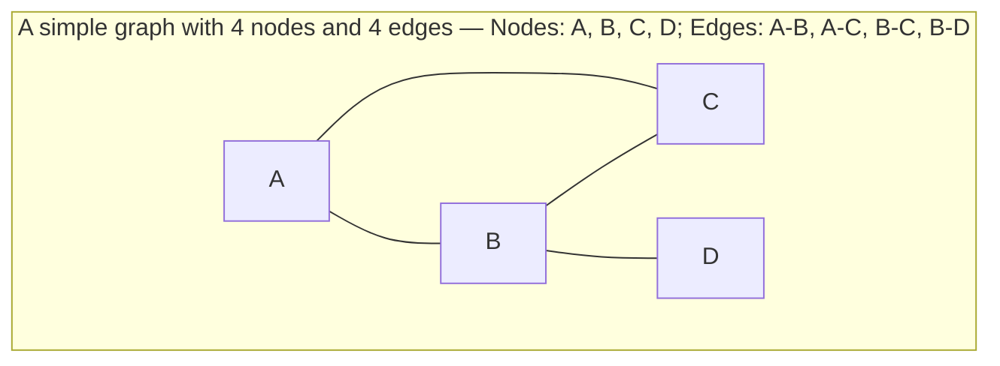
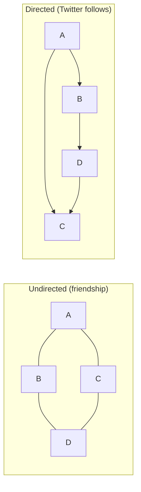
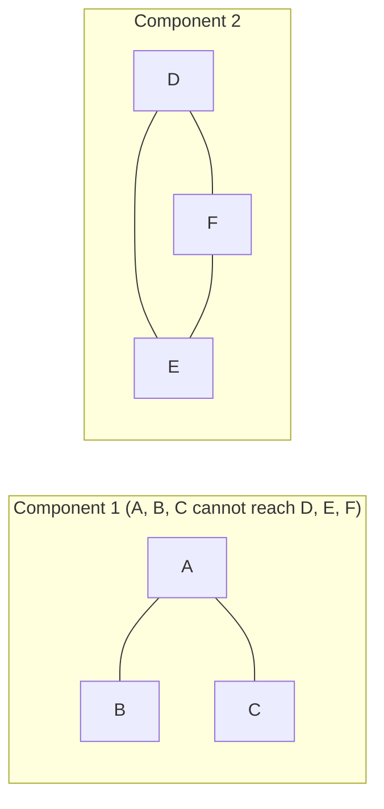
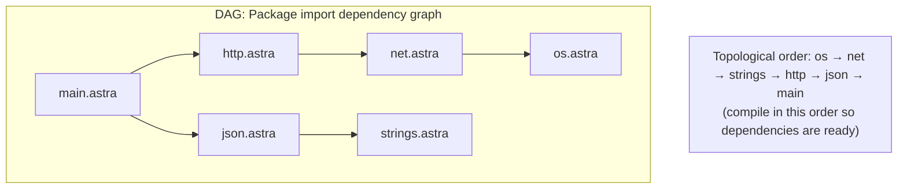

# Chapter 20: Graphs — Modeling Connections and Networks

> *"If trees are the data structure of hierarchy, graphs are the data structure of the world. Every interesting problem is ultimately a graph problem."*
> — Paraphrased from numerous computer science educators

Pick any interesting real-world system: a social network, a road map, the internet, a city's power grid, a software project's dependencies, a brain's neurons, or the version history of a git repository. Every one of them consists of **things** connected to other **things** by **relationships**. The data structure that models this universal pattern is called a **graph** — and it is the most general, most powerful, and most widely-applied data structure in computer science.

This chapter builds graphs from first principles: the vocabulary, the different ways to represent them in memory, the special cases (trees, DAGs, bipartite graphs) that appear constantly in practice, and the Union-Find data structure that tracks connected components efficiently. We then apply all of this to build the **Control Flow Graph (CFG)** — the compiler's internal representation of a function's execution paths, which the code generator needs to produce correct assembly. By the end, you will have a solid Go implementation of a graph and a CFG builder that works for real Astra functions.

## What We're Building

The Astra compiler uses graphs in multiple phases:

```astra
fn classify(n: int) -> string {
    if n < 0 {
        return "negative"
    } else if n == 0 {
        return "zero"
    } else {
        return "positive"
    }
}
```

The compiler turns this into a **Control Flow Graph** where each node is a basic block (a straight-line sequence of code) and each edge is a possible jump. The code generator (Chapter 60) walks this graph to emit assembly instructions in the right order.

## Table of Contents

1. What Is a Graph?
2. Graph Vocabulary — The Language of Connections
3. Graph Representations — Three Ways to Store a Graph
4. Special Graphs — Trees, DAGs, and More
5. Union-Find — Tracking Connected Components
6. Complete Go Implementation — Directed Weighted Graph
7. Real-World Graph Problems
8. Astra Build Milestone — The Control Flow Graph
9. Exercises
10. Summary

---

## 1. What Is a Graph?

A graph is just **dots connected by lines**.

Formally: a graph `G = (V, E)` where:
- `V` is a set of **vertices** (also called **nodes**)
- `E` is a set of **edges**, each connecting two vertices

That is the entire definition. Everything else is specialization.



### Examples from Real Life

| Real System | Nodes (Vertices) | Edges | Direction? |
|---|---|---|---|
| Social network (Facebook) | People | Friendships | Undirected (mutual) |
| Twitter/X | Users | Follow relationships | Directed (asymmetric) |
| Road map | Intersections | Roads | Undirected (or directed for one-way streets) |
| Web pages | Web pages | Hyperlinks | Directed |
| Git history | Commits | Parent relationships | Directed |
| Internet | Routers | Network cables | Undirected (usually) |
| Build system (make) | Files/targets | Dependencies | Directed |
| Import graph | Source files | `import` statements | Directed |
| Airline routes | Airports | Flights | Directed, weighted (distance/time) |
| Electrical circuit | Components | Wires | Undirected, weighted (resistance) |

Every time you hear "X depends on Y," "X connects to Y," or "X follows Y" — you are looking at a graph.

---

## 2. Graph Vocabulary — The Language of Connections

### Directed vs Undirected

In an **undirected graph**, edges have no direction: if A connects to B, then B also connects to A. Think of a road you can drive both ways.

In a **directed graph** (digraph), edges have a direction: A → B means "you can go from A to B" but not necessarily from B to A. Think of a one-way street, or a Twitter follow.



### Weighted vs Unweighted

In a **weighted graph**, each edge has a numeric value (the weight). In a road map, the weight might be distance in kilometers. In a network, it might be bandwidth in Mbps.

### Degree

The **degree** of a node is how many edges connect to it.

In directed graphs:
- **In-degree**: number of edges pointing INTO the node
- **Out-degree**: number of edges pointing OUT of the node

```
    A ──→ B ──→ C
          ↑
          D

In-degree(B)  = 2  (edges from A and D)
Out-degree(B) = 1  (edge to C)
In-degree(A)  = 0  (no edges into A)
```

### Adjacency

Two nodes are **adjacent** (neighbors) if there is an edge between them. Node B is adjacent to A if there is an edge A→B or A-B.

### Path and Cycle

A **path** is a sequence of nodes where consecutive nodes are connected by edges. Length of a path = number of edges.

A **cycle** is a path that starts and ends at the same node. The simplest cycle has 3 nodes: A→B→C→A.

A graph with **no cycles** is **acyclic**.

### Connected Component

In an undirected graph, a **connected component** is a maximal set of nodes where every node can reach every other node. A graph is **connected** if it has exactly one connected component.



### DAG — Directed Acyclic Graph

A **DAG** (Directed Acyclic Graph) is a directed graph with no cycles. This is one of the most important special cases because:
- You can always process nodes in **topological order** (respecting all dependencies)
- Many real-world dependency relationships are DAGs



**A tree is a special case of a DAG** (directed, acyclic, exactly one path between any two nodes, exactly one root, each node except root has exactly one parent).

---

## 3. Graph Representations — Three Ways to Store a Graph

### Representation 1: Adjacency List

Store a list of neighbors for each vertex. This is the most common representation because it is memory-efficient for sparse graphs (graphs where the number of edges is much less than V²).

```
Graph: A→B, A→C, B→D, C→D

Adjacency List:
┌───┬───────┐
│ A │ [B, C]│
├───┼───────┤
│ B │ [D]   │
├───┼───────┤
│ C │ [D]   │
├───┼───────┤
│ D │ []    │
└───┴───────┘
```

```go
// Using a map of int slices (integer vertex IDs):
type Graph struct {
    vertices int
    edges    map[int][]int   // vertex → list of neighbors
}
```

**Complexity for adjacency list:**
- Space: O(V + E) — proportional to vertices + edges (excellent for sparse graphs)
- Check if edge (u,v) exists: O(degree(u)) — must scan the neighbor list
- Iterate over all neighbors of u: O(degree(u)) — perfect for traversal algorithms

**When to use:** Almost always. Most real graphs are sparse.

### Representation 2: Adjacency Matrix

A V×V matrix where `matrix[i][j] = 1` (or the weight) if there is an edge from i to j, and 0 otherwise.

```
Graph: A→B, A→C, B→D, C→D
Vertices numbered: A=0, B=1, C=2, D=3

Adjacency Matrix:
     A  B  C  D
A  [ 0, 1, 1, 0 ]
B  [ 0, 0, 0, 1 ]
C  [ 0, 0, 0, 1 ]
D  [ 0, 0, 0, 0 ]

matrix[0][1] = 1 means A→B exists
matrix[1][0] = 0 means B→A does NOT exist (directed graph)
```

```go
// Using a 2D slice:
type GraphMatrix struct {
    n      int       // number of vertices
    matrix [][]int   // matrix[i][j] = edge weight (0 = no edge)
}
```

**Complexity for adjacency matrix:**
- Space: O(V²) — 100 nodes = 10,000 cells; 1000 nodes = 1,000,000 cells
- Check if edge (u,v) exists: O(1) — instant! Just read matrix[u][v]
- Iterate over all neighbors of u: O(V) — must scan the whole row

**When to use:** Dense graphs (E close to V²), or when you need O(1) edge existence checks.

### Representation 3: Edge List

Simply store a list of all edges as pairs (or triples for weighted):

```
Edge list: [(A,B), (A,C), (B,D), (C,D)]
Weighted:  [(A,B,5), (A,C,2), (B,D,8), (C,D,1)]
```

```go
type Edge struct {
    From, To int
    Weight   float64
}
type GraphEdgeList struct {
    vertices int
    edges    []Edge
}
```

**Complexity:**
- Space: O(E)
- Check if edge exists: O(E) — must scan all edges
- Sort edges by weight: easy (just sort the slice)

**When to use:** Kruskal's Minimum Spanning Tree algorithm (which processes edges sorted by weight), or when edge order matters.

### Comparison Table

```
┌──────────────────┬──────────────┬──────────────┬──────────────┐
│ Operation        │ Adj List     │ Adj Matrix   │ Edge List    │
├──────────────────┼──────────────┼──────────────┼──────────────┤
│ Space            │ O(V + E)     │ O(V²)        │ O(E)         │
│ Edge exists(u,v) │ O(deg(u))    │ O(1)         │ O(E)         │
│ All neighbors(u) │ O(deg(u))    │ O(V)         │ O(E)         │
│ Add edge         │ O(1)         │ O(1)         │ O(1)         │
│ Remove edge      │ O(deg(u))    │ O(1)         │ O(E)         │
│ Sort by weight   │ Complex      │ Complex      │ O(E log E)   │
│ Best for         │ Most graphs  │ Dense graphs │ MST algorithms│
└──────────────────┴──────────────┴──────────────┴──────────────┘
```

---

## 4. Special Graphs — Trees, DAGs, and More

### Tree

A tree is an undirected, connected, acyclic graph. The key property: V - 1 edges exactly. There is exactly one path between any two nodes.

When rooted, a tree becomes directed (parent → children). Every node except the root has exactly one parent. Trees are the subject of Chapters 17-18.

### DAG (Directed Acyclic Graph)

We discussed DAGs above. Key uses:
- **Build systems** (Makefile, Bazel, Buck): compile targets in topological order
- **Package managers** (npm, cargo, go modules): resolve dependencies without circular imports
- **Task schedulers**: run tasks in the correct order
- **Git commit graph**: each commit points to its parents; no commit can be its own ancestor
- **Spreadsheet cells**: cell A1 depends on B1 which depends on C1 — no circular references allowed

### Bipartite Graph

A graph where vertices split into two groups (say "left" and "right"), and edges only go between groups — never within a group.

```
┌──────────────────────────────────────────────────────────────┐
│  BIPARTITE GRAPH: Job assignment problem                     │
│                                                              │
│  Workers          Jobs                                       │
│  Alice  ─────────── Design                                   │
│  Bob    ─────────── Coding                                   │
│  Carol  ─────────── Testing                                  │
│                                                              │
│  (Workers and Jobs are two groups; edges cross between them) │
└──────────────────────────────────────────────────────────────┘
```

Applications: matching problems (assign workers to jobs, students to dorms), recommendation systems (users to items), network flow.

### Complete Graph K_n

Every vertex connects to every other vertex. K_4 has 4 vertices and 6 edges; K_n has n(n-1)/2 edges. This is the densest possible undirected graph — the adjacency matrix is all 1s (except diagonal).

### Planar Graph

A graph that can be drawn on a flat surface without any edges crossing. All trees, roads on a map, and circuit board layouts (ideally) are planar. Euler's formula: V - E + F = 2 (where F = number of faces including the outer face). The Four Color Theorem says any planar map can be colored with just 4 colors.

---

## 5. Union-Find — Tracking Connected Components

The **Union-Find** data structure (also called **Disjoint Set Union** or **DSU**) efficiently answers two questions:

1. **Find(x):** Which connected component does x belong to?
2. **Union(x, y):** Merge the components containing x and y

It is used in:
- Kruskal's Minimum Spanning Tree (add edges, skip if they form a cycle)
- Cycle detection in undirected graphs
- Image segmentation (group adjacent pixels of similar color)
- Network connectivity queries

### The Idea

Each component has a **representative** (root). Every element stores a pointer to its parent. `Find(x)` follows parent pointers until reaching the root.

```go
// unionfind/uf.go
package unionfind

// UnionFind represents a disjoint-set data structure.
type UnionFind struct {
    parent []int   // parent[i] = parent of element i (parent[i] == i means root)
    rank   []int   // rank[i] = approximate depth of subtree (for union by rank)
    count  int     // number of connected components
}

// New creates a Union-Find for n elements (initially n separate components).
func New(n int) *UnionFind {
    parent := make([]int, n)
    rank := make([]int, n)
    for i := range parent {
        parent[i] = i  // each element is its own parent (its own component)
    }
    return &UnionFind{parent: parent, rank: rank, count: n}
}

// Find returns the representative (root) of x's component.
// Uses PATH COMPRESSION: after finding root, make all nodes on the path
// point directly to root (future finds are faster).
func (uf *UnionFind) Find(x int) int {
    if uf.parent[x] != x {
        uf.parent[x] = uf.Find(uf.parent[x])  // path compression
    }
    return uf.parent[x]
}

// Union merges the components containing x and y.
// Uses UNION BY RANK: attach smaller tree under larger tree's root.
// Returns true if x and y were in different components (a merge happened),
// false if they were already in the same component.
func (uf *UnionFind) Union(x, y int) bool {
    rootX := uf.Find(x)
    rootY := uf.Find(y)
    if rootX == rootY {
        return false  // already in the same component — would create a cycle!
    }
    // Attach smaller rank tree under larger rank tree:
    if uf.rank[rootX] < uf.rank[rootY] {
        uf.parent[rootX] = rootY
    } else if uf.rank[rootX] > uf.rank[rootY] {
        uf.parent[rootY] = rootX
    } else {
        uf.parent[rootY] = rootX
        uf.rank[rootX]++  // same rank: one tree gets deeper
    }
    uf.count--
    return true
}

// Connected returns true if x and y are in the same component.
func (uf *UnionFind) Connected(x, y int) bool {
    return uf.Find(x) == uf.Find(y)
}

// Count returns the number of connected components.
func (uf *UnionFind) Count() int { return uf.count }
```

**Why is this nearly O(1)?** With both path compression and union by rank, the amortized cost per operation is O(α(n)) where α is the inverse Ackermann function. For all practical values of n (even astronomical numbers), α(n) ≤ 5. Effectively O(1).

---

## 6. Complete Go Implementation — Directed Weighted Graph

```go
// graph/graph.go
package graph

import (
    "fmt"
    "math"
)

// Edge represents a directed weighted edge from one vertex to another.
type Edge struct {
    To     int     // destination vertex
    Weight float64 // edge weight (use 1.0 for unweighted graphs)
}

// Graph is a directed, weighted graph using an adjacency list representation.
// Vertices are identified by integer indices (0 to vertices-1).
// To use string names, maintain a separate name→index map.
type Graph struct {
    vertices int            // total number of vertices
    adj      [][]Edge       // adj[v] = list of edges leaving vertex v
    names    map[int]string // optional: vertex index → human name
}

// New creates a graph with the given number of vertices.
func New(vertices int) *Graph {
    adj := make([][]Edge, vertices)
    for i := range adj {
        adj[i] = []Edge{}
    }
    return &Graph{
        vertices: vertices,
        adj:      adj,
        names:    make(map[int]string),
    }
}

// SetName assigns a human-readable name to a vertex (for display).
func (g *Graph) SetName(v int, name string) {
    g.names[v] = name
}

// Name returns the name of vertex v (or "v<n>" if no name was set).
func (g *Graph) Name(v int) string {
    if name, ok := g.names[v]; ok { return name }
    return fmt.Sprintf("v%d", v)
}

// AddEdge adds a directed edge from u to v with the given weight.
// For unweighted graphs, use weight = 1.0.
func (g *Graph) AddEdge(from, to int, weight float64) {
    if from < 0 || from >= g.vertices || to < 0 || to >= g.vertices {
        panic(fmt.Sprintf("AddEdge: vertex out of range (%d → %d, max %d)", from, to, g.vertices-1))
    }
    g.adj[from] = append(g.adj[from], Edge{To: to, Weight: weight})
}

// AddEdgeUnweighted adds a directed unweighted edge (weight = 1).
func (g *Graph) AddEdgeUnweighted(from, to int) {
    g.AddEdge(from, to, 1.0)
}

// HasEdge returns true if there is a directed edge from u to v.
// Complexity: O(out-degree of u)
func (g *Graph) HasEdge(from, to int) bool {
    for _, e := range g.adj[from] {
        if e.To == to { return true }
    }
    return false
}

// EdgeWeight returns the weight of edge (from → to), or math.NaN() if not found.
func (g *Graph) EdgeWeight(from, to int) float64 {
    for _, e := range g.adj[from] {
        if e.To == to { return e.Weight }
    }
    return math.NaN()
}

// RemoveEdge removes the directed edge from u to v.
// Returns true if the edge existed and was removed.
func (g *Graph) RemoveEdge(from, to int) bool {
    edges := g.adj[from]
    for i, e := range edges {
        if e.To == to {
            // Remove element i from the slice (order-preserving):
            g.adj[from] = append(edges[:i], edges[i+1:]...)
            return true
        }
    }
    return false
}

// Neighbors returns all vertices that vertex v has edges to.
func (g *Graph) Neighbors(v int) []int {
    result := make([]int, 0, len(g.adj[v]))
    for _, e := range g.adj[v] {
        result = append(result, e.To)
    }
    return result
}

// Edges returns all outgoing edges from vertex v.
func (g *Graph) Edges(v int) []Edge { return g.adj[v] }

// OutDegree returns the number of outgoing edges from v.
func (g *Graph) OutDegree(v int) int { return len(g.adj[v]) }

// InDegree returns the number of incoming edges to v.
// This is O(V + E) — for frequent in-degree queries, maintain a reverse adjacency list.
func (g *Graph) InDegree(v int) int {
    count := 0
    for _, edges := range g.adj {
        for _, e := range edges {
            if e.To == v { count++ }
        }
    }
    return count
}

// Vertices returns the total number of vertices.
func (g *Graph) Vertices() int { return g.vertices }

// ============================================================
// BFS — Breadth-First Search (preview; detailed in Chapter 23)
// ============================================================

// BFS returns vertices reachable from start in breadth-first order.
// BFS explores all neighbors at distance 1, then distance 2, etc.
// Like throwing a stone in water: the ripple expands outward layer by layer.
func (g *Graph) BFS(start int) []int {
    visited := make([]bool, g.vertices)
    order := []int{}
    queue := []int{start}
    visited[start] = true

    for len(queue) > 0 {
        v := queue[0]
        queue = queue[1:]  // dequeue
        order = append(order, v)

        for _, neighbor := range g.Neighbors(v) {
            if !visited[neighbor] {
                visited[neighbor] = true
                queue = append(queue, neighbor)  // enqueue
            }
        }
    }
    return order
}

// ============================================================
// DFS — Depth-First Search (preview; detailed in Chapter 23)
// ============================================================

// DFS returns vertices reachable from start in depth-first order.
// DFS plunges as deep as possible before backtracking.
// Like exploring a maze: go down one corridor until you hit a dead end, then backtrack.
func (g *Graph) DFS(start int) []int {
    visited := make([]bool, g.vertices)
    order := []int{}
    g.dfsHelper(start, visited, &order)
    return order
}

func (g *Graph) dfsHelper(v int, visited []bool, order *[]int) {
    visited[v] = true
    *order = append(*order, v)
    for _, neighbor := range g.Neighbors(v) {
        if !visited[neighbor] {
            g.dfsHelper(neighbor, visited, order)
        }
    }
}

// ============================================================
// Topological Sort — critical for DAGs
// ============================================================

// TopologicalSort returns a topological ordering of vertices.
// In a topological order, for every edge u→v, u comes before v.
// Returns error if the graph contains a cycle (not a DAG).
// Uses DFS-based algorithm (Kahn's algorithm is an alternative).
func (g *Graph) TopologicalSort() ([]int, error) {
    visited := make([]bool, g.vertices)
    inStack := make([]bool, g.vertices)  // detect cycles
    result := []int{}

    var visit func(v int) error
    visit = func(v int) error {
        if inStack[v] {
            return fmt.Errorf("cycle detected at vertex %s", g.Name(v))
        }
        if visited[v] {
            return nil
        }
        inStack[v] = true
        for _, neighbor := range g.Neighbors(v) {
            if err := visit(neighbor); err != nil { return err }
        }
        inStack[v] = false
        visited[v] = true
        // Prepend to result (DFS finishing order, reversed = topological order)
        result = append([]int{v}, result...)
        return nil
    }

    for v := 0; v < g.vertices; v++ {
        if !visited[v] {
            if err := visit(v); err != nil { return nil, err }
        }
    }
    return result, nil
}

// Print displays the graph structure (for debugging).
func (g *Graph) Print() {
    fmt.Printf("Graph (%d vertices):\n", g.vertices)
    for v := 0; v < g.vertices; v++ {
        fmt.Printf("  %s → ", g.Name(v))
        for i, e := range g.adj[v] {
            if i > 0 { fmt.Print(", ") }
            fmt.Printf("%s(%.1f)", g.Name(e.To), e.Weight)
        }
        fmt.Println()
    }
}
```

---

## 7. Real-World Graph Problems

### Facebook: Friend Recommendations (BFS)

To suggest "people you may know," Facebook runs BFS from your node and finds friends-of-friends (distance 2). Friends you share many mutual friends with are ranked higher.

```
You → Alice → Bob → Carol  (suggest Carol to You)
You → Alice → Bob → Dave   (suggest Dave to You)
```

BFS ensures you find the CLOSEST connections first — not random distant ones.

### Google Maps: Shortest Route (Dijkstra's Algorithm)

Google Maps models roads as a weighted directed graph (weight = travel time, considering traffic). Dijkstra's algorithm finds the shortest path from your location to your destination. A* improves on Dijkstra by using GPS coordinates to guide the search toward the destination.

### Netflix: Recommendations (Collaborative Filtering)

Build a bipartite graph: users on the left, movies on the right. Edge weight = rating. If User A and User B both rated the same movies highly, they are "similar." Find movies that similar users loved but you haven't seen yet. This is the graph algorithm behind "Because you watched X, you might like Y."

### Compiler: Import Resolution (Topological Sort)

The Astra compiler reads all source files and builds an import dependency graph. If `main.astra` imports `http.astra` which imports `net.astra`, the compiler must compile `net.astra` first. A topological sort gives the correct compilation order. If there is a cycle (`A imports B imports A`), the topological sort fails — and the compiler reports a "circular import" error.

---

## 8. 🔨 Astra Build Milestone — The Control Flow Graph

The **Control Flow Graph (CFG)** is the most important graph in a compiler. Every function compiles to a CFG where:

- **Nodes** = Basic Blocks: sequences of instructions with no branches inside (execution always enters at the top and exits at the bottom)
- **Edges** = Possible transfers of control: conditional jumps (if), unconditional jumps (goto/continue), function returns

### What Is a Basic Block?

A **basic block** is the longest straight-line sequence of code that:
1. Has exactly one entry point (only reached via the first instruction)
2. Has exactly one exit point (the last instruction; may be a conditional or unconditional jump)
3. No internal branches

```
┌─────────────────────────────────────────────────────────────────┐
│  BASIC BLOCK: a straight-line sequence, like a hallway          │
│  ┌────────────────────────────────────────────────────────┐    │
│  │  entry ─── instruction 1                               │    │
│  │             instruction 2                               │    │
│  │             instruction 3                               │    │
│  │             exit ─────────────────────────────────────→ │    │
│  └────────────────────────────────────────────────────────┘    │
│                                                                 │
│  BRANCHES create new basic blocks, like hallway junctions:      │
│  ┌──────────┐      YES ──→ ┌──────────┐                        │
│  │ if n < 0 │              │ block A  │                        │
│  └──────────┘      NO ───→ ┌──────────┐                        │
│                             │ block B  │                        │
│                             └──────────┘                        │
└─────────────────────────────────────────────────────────────────┘
```

### The CFG Data Structures

```go
// ir/cfg.go
package ir

import "fmt"

// Instruction represents a single operation in a basic block.
// This is a simplified IR (Intermediate Representation).
// In Chapter 60, this becomes actual LLVM IR or assembly.
type Instruction struct {
    Op      string // operation: "add", "sub", "cmp", "load", "store", "call", ...
    Dest    string // destination register/variable (e.g., "%1", "n")
    Args    []string // source operands
    Comment string // for human-readable dumps
}

func (i Instruction) String() string {
    if i.Comment != "" {
        return fmt.Sprintf("  %-25s  ; %s", i.format(), i.Comment)
    }
    return fmt.Sprintf("  %s", i.format())
}

func (i Instruction) format() string {
    if i.Dest == "" {
        return fmt.Sprintf("%s %s", i.Op, joinArgs(i.Args))
    }
    return fmt.Sprintf("%s = %s %s", i.Dest, i.Op, joinArgs(i.Args))
}

func joinArgs(args []string) string {
    result := ""
    for j, a := range args {
        if j > 0 { result += ", " }
        result += a
    }
    return result
}

// BasicBlock is a node in the CFG.
// It contains a straight-line sequence of instructions (no internal branches).
type BasicBlock struct {
    Label        string         // human-readable name: "entry", "then_0", "else_0", "merge_0"
    Instructions []Instruction  // the instructions in this block
    Successors   []*BasicBlock  // blocks this block can jump to (0, 1, or 2 for if-else)
    Predecessors []*BasicBlock  // blocks that can jump to this block
    // Used by optimizations:
    Visited      bool           // scratch field for graph traversal algorithms
    DomBlock     *BasicBlock    // immediate dominator (used in SSA construction, Chapter 70)
}

// AddInstruction appends an instruction to this basic block.
func (bb *BasicBlock) AddInstruction(instr Instruction) {
    bb.Instructions = append(bb.Instructions, instr)
}

// AddSuccessor adds an edge from this block to another block.
// Also adds the reverse edge (this block becomes a predecessor of next).
func (bb *BasicBlock) AddSuccessor(next *BasicBlock) {
    bb.Successors = append(bb.Successors, next)
    next.Predecessors = append(next.Predecessors, bb)
}

// IsTerminated returns true if the last instruction is a branch or return.
func (bb *BasicBlock) IsTerminated() bool {
    if len(bb.Instructions) == 0 { return false }
    last := bb.Instructions[len(bb.Instructions)-1]
    return last.Op == "ret" || last.Op == "br" || last.Op == "condbr"
}

// Print displays the basic block contents (for debugging/dump).
func (bb *BasicBlock) Print() {
    fmt.Printf("%s:\n", bb.Label)
    for _, instr := range bb.Instructions {
        fmt.Println(instr.String())
    }
    if len(bb.Successors) > 0 {
        fmt.Printf("  → successors: ")
        for i, s := range bb.Successors {
            if i > 0 { fmt.Print(", ") }
            fmt.Print(s.Label)
        }
        fmt.Println()
    }
}

// CFG represents the Control Flow Graph of one function.
type CFG struct {
    FunctionName string        // e.g., "classify"
    Entry        *BasicBlock   // the first block to execute (function entry)
    Exit         *BasicBlock   // a virtual block representing function exit
    Blocks       []*BasicBlock // all blocks in creation order
}

// NewCFG creates an empty CFG for a function.
// Automatically creates the entry block.
func NewCFG(funcName string) *CFG {
    entry := &BasicBlock{Label: "entry"}
    exit := &BasicBlock{Label: "exit"}
    return &CFG{
        FunctionName: funcName,
        Entry:        entry,
        Exit:         exit,
        Blocks:       []*BasicBlock{entry},
    }
}

// NewBlock creates a new basic block and adds it to the CFG.
func (cfg *CFG) NewBlock(label string) *BasicBlock {
    bb := &BasicBlock{Label: label}
    cfg.Blocks = append(cfg.Blocks, bb)
    return bb
}

// Print dumps the entire CFG (for debugging).
func (cfg *CFG) Print() {
    fmt.Printf("\nCFG for function '%s':\n", cfg.FunctionName)
    fmt.Println(repeat("─", 50))
    for _, bb := range cfg.Blocks {
        bb.Print()
        fmt.Println()
    }
}

func repeat(s string, n int) string {
    r := ""
    for i := 0; i < n; i++ { r += s }
    return r
}
```

### Building the CFG for `classify`

Now let us manually build the CFG for the Astra function:

```astra
fn classify(n: int) -> string {
    if n < 0 {
        return "negative"
    } else if n == 0 {
        return "zero"
    } else {
        return "positive"
    }
}
```

```go
// Example: manually constructing the CFG for classify()
// In the real compiler, CFGBuilder generates this automatically from the AST.
func BuildClassifyCFG() *CFG {
    cfg := NewCFG("classify")

    // ── Basic Block: entry ──────────────────────────
    // This is where the function starts.
    // It evaluates the first condition: n < 0
    entry := cfg.Entry
    entry.AddInstruction(Instruction{
        Op: "load", Dest: "%n", Args: []string{"n"},
        Comment: "load parameter n",
    })
    entry.AddInstruction(Instruction{
        Op: "cmp_lt", Dest: "%cond1", Args: []string{"%n", "0"},
        Comment: "n < 0 ?",
    })
    entry.AddInstruction(Instruction{
        Op: "condbr", Args: []string{"%cond1", "then_0", "elif_block"},
        Comment: "if n < 0 goto then_0 else goto elif_block",
    })

    // ── Basic Block: then_0 ─────────────────────────
    // Reached when n < 0. Returns "negative".
    then0 := cfg.NewBlock("then_0")
    then0.AddInstruction(Instruction{
        Op: "ret", Args: []string{`"negative"`},
        Comment: `return "negative"`,
    })

    // ── Basic Block: elif_block ─────────────────────
    // Reached when n >= 0. Evaluates the second condition: n == 0
    elif := cfg.NewBlock("elif_block")
    elif.AddInstruction(Instruction{
        Op: "cmp_eq", Dest: "%cond2", Args: []string{"%n", "0"},
        Comment: "n == 0 ?",
    })
    elif.AddInstruction(Instruction{
        Op: "condbr", Args: []string{"%cond2", "then_1", "else_block"},
        Comment: "if n == 0 goto then_1 else goto else_block",
    })

    // ── Basic Block: then_1 ─────────────────────────
    // Reached when n == 0. Returns "zero".
    then1 := cfg.NewBlock("then_1")
    then1.AddInstruction(Instruction{
        Op: "ret", Args: []string{`"zero"`},
        Comment: `return "zero"`,
    })

    // ── Basic Block: else_block ─────────────────────
    // Reached when n > 0. Returns "positive".
    elseBlock := cfg.NewBlock("else_block")
    elseBlock.AddInstruction(Instruction{
        Op: "ret", Args: []string{`"positive"`},
        Comment: `return "positive"`,
    })

    // ── Connect the blocks (add edges to the CFG) ───
    entry.AddSuccessor(then0)
    entry.AddSuccessor(elif)
    elif.AddSuccessor(then1)
    elif.AddSuccessor(elseBlock)
    // then0, then1, elseBlock all flow to the virtual exit block:
    then0.AddSuccessor(cfg.Exit)
    then1.AddSuccessor(cfg.Exit)
    elseBlock.AddSuccessor(cfg.Exit)

    return cfg
}
```

### ASCII Art: The CFG for `classify`

```
┌────────────────────────────────────────────────────────────────────────┐
│              CFG for fn classify(n: int) -> string                     │
│                                                                        │
│                    ┌──────────────────────┐                            │
│                    │       ENTRY          │                            │
│                    │  %n = load n         │                            │
│                    │  %c1 = cmp_lt %n, 0  │                            │
│                    │  condbr %c1, ...     │                            │
│                    └──────────┬───────────┘                            │
│                               │                                        │
│             true (%c1=1)      │      false (%c1=0)                     │
│            ┌──────────────────┘──────────────────┐                    │
│            ▼                                     ▼                     │
│   ┌─────────────────┐                 ┌─────────────────────┐         │
│   │    THEN_0       │                 │    ELIF_BLOCK        │         │
│   │  ret "negative" │                 │  %c2 = cmp_eq %n, 0 │         │
│   └────────┬────────┘                 │  condbr %c2, ...    │         │
│            │                          └─────────┬───────────┘         │
│            │                                    │                      │
│            │             true (%c2=1)           │     false (%c2=0)    │
│            │            ┌───────────────────────┴──────────────┐      │
│            │            ▼                                       ▼      │
│            │   ┌─────────────────┐                  ┌──────────────────┐│
│            │   │    THEN_1       │                  │   ELSE_BLOCK     ││
│            │   │  ret "zero"     │                  │  ret "positive"  ││
│            │   └────────┬────────┘                  └────────┬─────────┘│
│            │            │                                    │          │
│            └────────────┼────────────────────────────────────┘          │
│                         ▼                                               │
│                  ┌────────────┐                                         │
│                  │    EXIT    │                                         │
│                  │  (virtual) │                                         │
│                  └────────────┘                                         │
└────────────────────────────────────────────────────────────────────────┘
```

**Reading the CFG:**
- The `entry` block runs first, evaluates `n < 0`
- If `n < 0` (true branch): go to `then_0`, return "negative"
- If `n >= 0` (false branch): go to `elif_block`, evaluate `n == 0`
- If `n == 0` (true): go to `then_1`, return "zero"
- If `n > 0` (false): go to `else_block`, return "positive"
- All three return paths converge at the virtual `exit` block

**Why does the compiler need this?** The code generator (Chapter 60) must:
1. Assign each basic block a memory address in the output binary
2. Generate conditional jump instructions that encode the successor block addresses
3. Perform **liveness analysis** (what variables are alive at each point) by walking CFG edges
4. Apply **dead code elimination** (unreachable blocks have no predecessors)
5. Implement **register allocation** (which variables share registers) using CFG-based algorithms

Without the CFG, the compiler would have to re-analyze the source code for each of these tasks. The CFG is the shared intermediate representation that makes all these passes efficient.

---

## Exercises

1. **Graph from description.** Build a `Graph` (using the Go implementation above) representing the following Astra import dependencies:
   - `main.astra` imports `http` and `json`
   - `http` imports `net` and `strings`
   - `json` imports `strings`
   - `net` imports nothing
   - `strings` imports nothing
   
   Run `TopologicalSort()` and verify the order is valid (every import appears before its importer). Draw the graph.
   *Hint: assign integer IDs to each module and use `SetName` for display.*

2. **Cycle detection.** Add a method `HasCycle() bool` to the `Graph` struct that returns true if the directed graph contains a cycle. Test it on: (a) the DAG from exercise 1, (b) a graph where you add the edge `net → main` (creating a cycle).
   *Hint: Use the `inStack` technique from `TopologicalSort` — if you encounter a vertex that is currently on the DFS stack, you've found a cycle.*

3. **Union-Find in action.** Given 6 vertices (0-5) and edges: `(0,1), (1,2), (3,4)`, use `UnionFind` to determine:
   - How many connected components are there after adding all edges?
   - Are vertices 0 and 2 connected?
   - Are vertices 0 and 3 connected?
   - What happens when you add edge `(2, 3)`?
   *Hint: Call `Union` for each edge and then use `Connected` to answer queries.*

4. **Extend the CFG.** Write a Go function `BuildLoopCFG() *CFG` that builds the CFG for this Astra code:
   ```astra
   fn sum_to(n: int) -> int {
       let total = 0
       for i in 0..n {
           total = total + i
       }
       return total
   }
   ```
   A `for` loop produces at least three basic blocks: `loop_header` (check condition), `loop_body` (execute body), `loop_exit` (after the loop). Draw the CFG.
   *Hint: `loop_header` has two successors: `loop_body` (condition true) and `loop_exit` (condition false). `loop_body` has one successor: back to `loop_header`.*

5. **Dominator tree.** In a CFG, block D **dominates** block B if every path from entry to B passes through D. The entry block dominates all blocks; every block dominates itself. Implement a `ComputeDominators(cfg *CFG) map[*BasicBlock]*BasicBlock` function that computes the immediate dominator of each block. Use the simple O(V²) algorithm: for each block, intersect the dominator sets of all predecessors.
   *Hint: Start with dom[entry] = {entry}; dom[every other block] = all blocks. Repeatedly compute dom[b] = {b} ∪ (intersection of dom[p] for all predecessors p of b) until no changes.*

6. **CFG visualization.** Write a function `CFGToDOT(cfg *CFG) string` that returns the graph in Graphviz DOT format:
   ```
   digraph classify {
     entry -> then_0 [label="n<0"];
     entry -> elif_block [label="n>=0"];
     ...
   }
   ```
   The DOT format can be rendered at https://dreampuf.github.io/GraphvizOnline/ to produce a visual graph diagram.
   *Hint: iterate over all blocks, and for each successor pair, emit `"blockA" -> "blockB";`.*

---

## Summary

| Concept | Definition | Astra Use |
|---|---|---|
| Graph | Set of vertices + set of edges | Used everywhere in compiler |
| Directed graph | Edges have direction (A→B ≠ B→A) | Import graph, CFG, call graph |
| Undirected graph | Edges are mutual (A-B = B-A) | Conflict graphs in register allocation |
| Weighted graph | Edges have numeric values | Register interference, code optimization |
| Adjacency list | List of neighbors per vertex | Default; O(V+E) space |
| Adjacency matrix | V×V grid; 1 if edge exists | Dense graphs; O(1) edge check |
| Edge list | List of all edges | Kruskal's MST algorithm |
| DAG | Directed, acyclic graph | Import dependencies, AST |
| Topological sort | Linear order respecting all DAG edges | Compilation order |
| Union-Find | Track connected components | Kruskal's MST, cycle detection |
| Path compression | Flatten Union-Find trees for speed | Amortized O(α(n)) ≈ O(1) |
| BFS | Explore layer by layer (queue) | Friend suggestions, shortest path |
| DFS | Explore deep first (stack/recursion) | Topological sort, cycle detection |
| Basic Block | Straight-line sequence, no internal branches | CFG node |
| Control Flow Graph | Graph of basic blocks | Core compiler IR |
| Entry block | First block executed in a function | CFG starting point |
| Successor / Predecessor | Adjacent blocks in CFG | Used by all analysis passes |
| Dominator | Every path from entry passes through it | SSA construction (Chapter 70) |
| Dead code | Blocks with no predecessors (unreachable) | Eliminated by optimizer |

Graphs are the language of connection. Once you see them, you see them everywhere — in the dependencies between source files, in the flow of execution through a function, in the interference between live variables competing for registers. Every major compiler phase from type checking to code generation uses graph algorithms. The CFG you built here is not just an exercise — it is the exact data structure the Astra code generator will use in Chapter 60 to emit correct, optimized assembly for every function you write.
