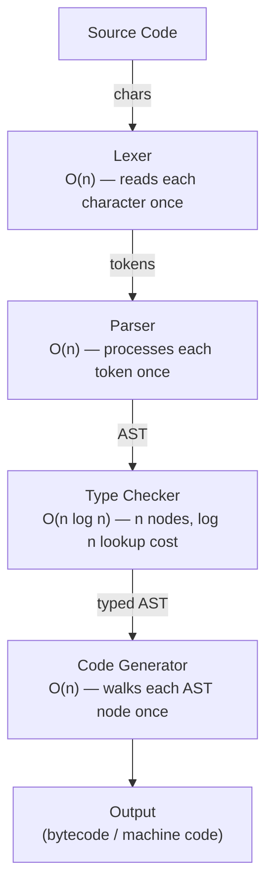

# Chapter 21: Big O Notation — Measuring Performance

> "The difference between a good algorithm and a bad one isn't measured in lines of code. It's measured in whether your program finishes before the sun burns out."

---

## Overview

You have written code that works. Congratulations — that is genuinely half the battle. But "works" and "works fast enough" are two very different things. A program that gives the right answer after three days of running is not useful. A compiler that takes twenty minutes to compile a hundred lines of code will make developers throw their laptops out the window.

This chapter is about measuring and reasoning about performance in a hardware-independent way. We will learn Big O notation — the language that every programmer, every computer science textbook, and every job interview uses to describe how fast (or slow) an algorithm is. We will also apply this thinking directly to the Astra compiler, analyzing every pass from lexer to code generator.

## What We Are Building

By the end of this chapter, you will be able to look at any piece of code and estimate how it scales as the input grows. You will understand why the Astra lexer is O(n), why a naive symbol lookup would be O(n) but a hash map lookup is O(1), and why these choices compound to make the difference between a compiler that feels instant and one that makes you want to go make coffee.

---

## Table of Contents

1. Why Performance Matters (and Why "My Computer Is Fast" Is Not an Answer)
2. Counting Operations Instead of Measuring Time
3. What Big O Actually Means
4. The Common Complexities with Real Examples
5. Best, Average, and Worst Case
6. Space Complexity
7. Amortized Analysis
8. How to Analyze Code
9. Big O in the Astra Compiler
10. The Drop Constants and Dominant Term Rules
11. Astra Build Milestone
12. Exercises
13. Summary

---

## 1. Why Performance Matters

Let us start with a concrete example that makes the stakes clear.

Imagine you are searching for a specific book in a library. The library has 1,000 books and no organization system — the books are just piled randomly. To find your book, you might have to look at every single book until you find it. On average, you will look at 500 books. At worst, you look at all 1,000.

Now imagine the library grows to 1,000,000 books. Same random pile. Now you might have to look at 500,000 books on average. The library got 1,000 times bigger, and your search got 1,000 times slower.

But what if the books were alphabetically sorted? You could open to the middle, see if your book comes before or after, eliminate half the library, repeat. After 20 steps, you would find any book in a million-book library. The library got 1,000 times bigger, but your search only got about 10 steps slower (from ~10 steps for 1,000 books to ~20 steps for 1,000,000 books).

That is the essence of algorithm analysis. The choice of algorithm can turn a problem that takes a year into one that takes a second.

Here is a table showing how different growth rates play out. Assume each "operation" takes 1 nanosecond:

```
Input Size (n) | O(1)  | O(log n) | O(n)    | O(n log n) | O(n²)     | O(2^n)
---------------|-------|----------|---------|------------|-----------|----------
10             | 1 ns  | 3 ns     | 10 ns   | 33 ns      | 100 ns    | 1 µs
100            | 1 ns  | 7 ns     | 100 ns  | 664 ns     | 10 µs     | 4 * 10^12 years
1,000          | 1 ns  | 10 ns    | 1 µs    | 10 µs      | 1 ms      | HEAT DEATH
1,000,000      | 1 ns  | 20 ns    | 1 ms    | 20 ms      | 16 min    | HEAT DEATH
1,000,000,000  | 1 ns  | 30 ns    | 1 sec   | 30 sec     | 31 years  | HEAT DEATH
```

The O(2^n) column is not a joke. For n=100, an O(2^n) algorithm would require more operations than there are atoms in the observable universe.

---

## 2. Counting Operations Instead of Measuring Time

You might wonder: why not just measure how long the code takes to run? The answer is that time measurements are hardware-dependent, load-dependent, and temperature-dependent. Your code runs faster on a newer machine. It runs slower when other programs are hogging the CPU. It runs differently at different times of day.

We need a way to measure algorithms that is independent of hardware. The solution is to count the number of fundamental operations the algorithm performs, expressed as a function of the input size.

What counts as a "fundamental operation"?

- A comparison (is x > y?)
- An assignment (x = 5)
- An arithmetic operation (x + y)
- Accessing an element of an array (arr[i])
- A function call (approximately — we count what happens inside too)

Let us count operations in a simple function:

```go
func findMax(arr []int) int {
    max := arr[0]           // 1 operation (assignment)
    for i := 1; i < len(arr); i++ {   // n-1 iterations
        if arr[i] > max {  // 1 comparison per iteration
            max = arr[i]   // 1 assignment (sometimes)
        }
    }
    return max             // 1 operation
}
```

Total operations: roughly 1 + (n-1) * 2 + 1 = 2n. As n grows, the "2n" dominates. We say this is O(n).

---

## 3. What Big O Actually Means

Big O notation describes the upper bound of an algorithm's growth rate. It answers the question: "In the worst case, as the input size grows towards infinity, how does the number of operations grow?"

Formally:

```
f(n) is O(g(n)) if there exist constants c > 0 and n₀ > 0 such that:
f(n) ≤ c * g(n) for all n ≥ n₀
```

Do not be scared by the math. In practice, this means:

1. We care about how things grow, not about exact counts
2. We ignore constant multipliers
3. We only care about the dominant (fastest-growing) term

Think of Big O as the "shape" of the algorithm's growth curve:

```
Operations
    |
    |                                                    O(n²)
    |                                                  /
    |                                              /
    |                                          /
    |                                    O(n log n)
    |                                /
    |                           /
    |                    O(n)
    |               /
    |         /
    |    /   O(log n)
    | ─────────────────────────────────────── O(1)
    +-----------------------------------------> Input size (n)
```

---

## 4. The Common Complexities with Real Examples

### O(1) — Constant Time

The operation takes the same amount of time regardless of input size.

```go
// Accessing an array element by index: always one operation
func getFirst(arr []int) int {
    return arr[0]
}

// Hash map lookup (on average)
func lookupSymbol(table map[string]int, name string) int {
    return table[name]
}
```

Real-world O(1) examples:
- Getting the length of a Go slice (stored separately, no counting needed)
- Looking up a value in a hash map
- Pushing or popping from a stack
- Accessing a struct field

### O(log n) — Logarithmic Time

The problem is halved with each step. Log base 2 of 1,000,000 is only about 20.

```go
// Binary search: halve the search space each time
func binarySearch(arr []int, target int) int {
    left, right := 0, len(arr)-1
    for left <= right {
        mid := left + (right-left)/2  // avoids overflow
        if arr[mid] == target {
            return mid
        } else if arr[mid] < target {
            left = mid + 1
        } else {
            right = mid - 1
        }
    }
    return -1
}
```

Real-world O(log n) examples:
- Binary search in a sorted array
- Searching a balanced binary search tree
- Finding a number in a phone book by halving

### O(n) — Linear Time

We look at each element once.

```go
// Linear search: look at each element
func linearSearch(arr []int, target int) int {
    for i, v := range arr {
        if v == target {
            return i
        }
    }
    return -1
}

// Sum all elements
func sum(arr []int) int {
    total := 0
    for _, v := range arr {
        total += v
    }
    return total
}
```

Real-world O(n) examples:
- Reading all characters in a file (like our lexer does)
- Printing all elements of a list
- Finding the maximum element in an unsorted array

### O(n log n) — Linearithmic Time

This is the sweet spot for comparison-based sorting. It is as fast as sorting can theoretically get.

```go
// Merge sort is O(n log n)
// We split n elements into log n levels of recursion
// Each level does O(n) work merging
// Total: O(n log n)
```

We will cover merge sort in detail in Chapter 22. For now, know that this complexity appears whenever you divide and conquer with linear work at each level.

### O(n²) — Quadratic Time

A loop inside a loop, each going n times.

```go
// Check all pairs: O(n²)
func hasDuplicate(arr []int) bool {
    for i := 0; i < len(arr); i++ {
        for j := i + 1; j < len(arr); j++ {
            if arr[i] == arr[j] {
                return true
            }
        }
    }
    return false
}
```

For n=1,000, this does about 500,000 comparisons. For n=10,000, about 50,000,000. It scales terribly. But for n=10 or n=100, it is perfectly fine.

### O(2^n) — Exponential Time

Generates all subsets, tries all combinations. Doubles with each additional element.

```go
// Generate all subsets of an array: O(2^n) subsets exist
func allSubsets(arr []int) [][]int {
    if len(arr) == 0 {
        return [][]int{{}}
    }
    rest := allSubsets(arr[1:])
    var result [][]int
    for _, subset := range rest {
        result = append(result, subset)                    // without arr[0]
        result = append(result, append([]int{arr[0]}, subset...)) // with arr[0]
    }
    return result
}
```

### O(n!) — Factorial Time

Generates all permutations. Even worse than exponential.

```
n=1:  1 permutation
n=5:  120 permutations
n=10: 3,628,800 permutations
n=20: 2,432,902,008,176,640,000 permutations
```

The traveling salesman problem (find the shortest route visiting all cities) is O(n!) with brute force.

---

## 5. Best, Average, and Worst Case

Big O is about the worst case, but we also talk about best case (Omega, Ω) and average case (Theta, Θ).

```
Notation  | Meaning        | "At least this fast" or "At most this slow"
----------|----------------|---------------------------------------------
O(f(n))   | Upper bound    | Worst case — never slower than this
Ω(f(n))   | Lower bound    | Best case — never faster than this
Θ(f(n))   | Tight bound    | Both upper and lower — exactly this
```

Example: Linear search on an array of n elements

- Best case Ω(1): The target is the first element. We find it immediately.
- Worst case O(n): The target is the last element or not present. We check all n elements.
- Average case Θ(n/2) = Θ(n): On average, the target is in the middle. We check n/2 elements.

Why do we usually care about worst case? Because software needs to make guarantees. If you are building a real-time system (like a game or a medical device), you need to know the worst that can happen, not just the average.

For the Astra compiler, we care about worst case: what happens when the user compiles a very large program?

---

## 6. Space Complexity

Big O also applies to memory usage. Space complexity measures how much extra memory an algorithm uses as the input grows.

```go
// Space complexity O(1): only uses a fixed amount of extra memory
func reverseInPlace(arr []int) {
    left, right := 0, len(arr)-1
    for left < right {
        arr[left], arr[right] = arr[right], arr[left]
        left++
        right--
    }
}

// Space complexity O(n): creates a new array of size n
func reverseCopy(arr []int) []int {
    result := make([]int, len(arr))  // O(n) space
    for i, v := range arr {
        result[len(arr)-1-i] = v
    }
    return result
}

// Recursive fibonacci: O(n) space for call stack
func fib(n int) int {
    if n <= 1 { return n }
    return fib(n-1) + fib(n-2)
    // At any point, the call stack is n levels deep
    // That is O(n) memory
}
```

Space-time tradeoffs are real. Often you can make an algorithm faster by using more memory (caching, lookup tables), or save memory by doing more computation. Understanding both lets you make intelligent tradeoffs.

---

## 7. Amortized Analysis

Sometimes an operation is occasionally expensive but cheap on average. Amortized analysis gives us the average cost per operation over a sequence of operations.

The classic example is the dynamic array (Go's slice, C++'s vector).

When you append to a slice and it is full, Go doubles the underlying array's capacity and copies all elements. That copy is O(n) — expensive! But it happens rarely.

```
Operation 1:   append — capacity was 1, now 2,  copy 1  element.  Cost: 2
Operation 2:   append — capacity was 2, now 4,  copy 2  elements. Cost: 3
Operation 3:   append — no resize needed.                          Cost: 1
Operation 4:   append — capacity was 4, now 8,  copy 4  elements. Cost: 5
Operations 5-8: append — no resize needed.                         Cost: 1 each
Operation 8:   capacity was 8, now 16, copy 8  elements.           Cost: 9
```

The total cost of n append operations is O(n), not O(n²). Divided by n operations, each append costs O(1) on average — constant amortized time.

```
Cost of resize events: 2 + 4 + 8 + 16 + ... + n = 2n (geometric series)
Cost of regular appends: n
Total: 3n = O(n)
Amortized cost per append: O(n)/n = O(1)
```

This is why appending to a Go slice is fast in practice even though individual resizes are expensive.

---

## 8. How to Analyze Code

Here are the rules for reading code and determining its Big O complexity:

### Rule 1: Simple statements are O(1)

```go
x := 5           // O(1)
y := x + 3       // O(1)
arr[0] = 10      // O(1)
```

### Rule 2: A single loop over n elements is O(n)

```go
for i := 0; i < n; i++ {
    // O(1) work inside
}
// Total: O(n)
```

### Rule 3: Nested loops multiply

```go
for i := 0; i < n; i++ {       // n times
    for j := 0; j < n; j++ {   // n times each
        // O(1) work
    }
}
// Total: O(n * n) = O(n²)
```

```go
for i := 0; i < n; i++ {       // n times
    for j := 0; j < m; j++ {   // m times each
        // O(1) work
    }
}
// Total: O(n * m)
```

### Rule 4: Sequential blocks add

```go
for i := 0; i < n; i++ { }    // O(n)
for j := 0; j < n; j++ { }    // O(n)
// Total: O(n) + O(n) = O(2n) = O(n)
```

### Rule 5: Halving loops are O(log n)

```go
for i := 1; i < n; i *= 2 {   // i doubles each time: 1, 2, 4, 8, 16...
    // O(1) work
}
// i reaches n after log₂(n) steps
// Total: O(log n)
```

### Rule 6: Recursion requires thinking about the recurrence

For a function that calls itself with half the input each time and does O(n) work:

```
T(n) = T(n/2) + O(n)    → O(n)         (binary search with linear work)
T(n) = 2*T(n/2) + O(n)  → O(n log n)  (merge sort)
T(n) = T(n-1) + O(1)    → O(n)         (linear recursion)
T(n) = 2*T(n-1) + O(1)  → O(2^n)      (naive Fibonacci — exponential!)
```

---

## 9. Big O in the Astra Compiler

Let us now analyze every pass of the Astra compiler. This is where algorithm analysis becomes real.

### The Astra Compiler Pipeline



### The Lexer: O(n)

The lexer reads the source file character by character. It processes each character exactly once (with a small constant for lookahead). If the source file has n characters, the lexer does O(n) work.

```go
// Simplified Astra lexer
type Lexer struct {
    source []rune
    pos    int
}

func (l *Lexer) NextToken() Token {
    // Each call advances pos by at least 1
    // Total calls over the entire source: O(n)
    l.skipWhitespace()       // O(k) where k is whitespace chars skipped
    
    ch := l.source[l.pos]
    
    if isDigit(ch) {
        return l.readNumber()  // O(d) where d is digits in the number
    }
    if isLetter(ch) {
        return l.readIdentifier()  // O(w) where w is word length
    }
    // ...
}
// Total work across all NextToken calls: O(n) — every character handled once
```

Why O(n)? Because each character is consumed exactly once. We never go backwards (except for one-character lookahead, which is a constant). The total work is proportional to the source length.

### The Parser: O(n)

The parser processes the token stream. Each token is consumed exactly once by some parse function. Recursive descent parsers are O(n) in the number of tokens.

```go
// Each call to parseStatement consumes some tokens and never revisits them
func (p *Parser) parseStatement() ast.Statement {
    switch p.currentToken.Type {
    case token.LET:
        return p.parseLetStatement()   // consumes: let, name, =, expr, newline
    case token.FN:
        return p.parseFunctionDef()    // consumes: fn, name, (, params, ), body
    case token.FOR:
        return p.parseForLoop()        // consumes: for, var, in, range, body
    }
}
// Total tokens consumed = total tokens = O(n) where n is source length
```

### The Type Checker: O(n log n) with Proper Data Structures

The type checker visits each AST node once — that is O(n) nodes. But for each node, it may need to look up a type definition or a variable's type. The data structure used for the symbol table determines the lookup cost.

```go
// If we use a linear scan to find types:
// O(n) lookups × O(n) per lookup = O(n²) total — BAD

// If we use a hash map for the symbol table:
// O(n) lookups × O(1) per lookup = O(n) total — GREAT

// If we use a balanced BST (like Go's sorted map):
// O(n) lookups × O(log n) per lookup = O(n log n) total — GOOD

type TypeChecker struct {
    // Good: hash map for O(1) average lookup
    symbolTable map[string]Type
    
    // Even better for ordered iteration: balanced BST
    // Go's map doesn't guarantee order, but is O(1) average
}

func (tc *TypeChecker) resolveType(name string) (Type, bool) {
    t, ok := tc.symbolTable[name]  // O(1) average
    return t, ok
}
```

### The Code Generator: O(n)

The code generator walks the typed AST once, emitting code for each node. Each node is visited exactly once. This is a straightforward tree traversal: O(n) where n is the number of AST nodes.

```go
func (cg *CodeGenerator) generateExpression(expr ast.Expression) string {
    switch e := expr.(type) {
    case *ast.IntLiteral:
        return fmt.Sprintf("%d", e.Value)  // O(1)
    case *ast.BinaryExpr:
        left := cg.generateExpression(e.Left)   // recurse on left
        right := cg.generateExpression(e.Right) // recurse on right
        return fmt.Sprintf("(%s %s %s)", left, e.Op, right)  // O(1)
    case *ast.Identifier:
        return e.Name  // O(1)
    }
    // Each node visited once → O(n) total
}
```

### Why Data Structure Choice Matters

Consider what happens if we had used the wrong data structure for the symbol table:

```
Source file: 10,000 lines of Astra code
~50,000 tokens
~30,000 AST nodes
~5,000 identifier references

With linear scan symbol table (array of pairs):
  5,000 lookups × O(5,000) per lookup = 25,000,000 operations
  At 1 billion ops/second: 0.025 seconds
  (Seems okay for small programs, but...)
  
  For 100,000 lines:
  50,000 lookups × O(50,000) per lookup = 2,500,000,000 operations
  At 1 billion ops/second: 2.5 SECONDS just for symbol lookup!

With hash map symbol table:
  5,000 lookups × O(1) per lookup = 5,000 operations
  For 100,000 lines: still ~O(1) per lookup
  Type checking stays fast regardless of program size.
```

---

## 10. The Drop Constants and Dominant Term Rules

### Drop Constants Rule

O(2n) = O(n). O(100n) = O(n). Big O ignores constant multipliers.

Why? Because Big O describes growth rates, not exact counts. Whether your algorithm does 2 operations or 200 operations per element, if it grows linearly with input, it is O(n). The constant matters in practice (a 100x constant is real), but Big O is about the shape of growth.

```go
// These are all O(n):
for i := 0; i < n; i++ { }              // n iterations
for i := 0; i < n; i++ { x++; y++ }    // 2n operations
for i := 0; i < 3*n; i++ { }           // 3n iterations

// These are all O(n²):
for i := 0; i < n; i++ {
    for j := 0; j < n; j++ { }   // n² iterations
}
for i := 0; i < n; i++ {
    for j := 0; j < 2*n; j++ { } // 2n² iterations — still O(n²)
}
```

### Dominant Term Rule

O(n² + n) = O(n²). O(n log n + n) = O(n log n). We keep only the fastest-growing term.

Why? As n grows very large, the smaller terms become negligible. If n = 1,000,000:
- n² = 1,000,000,000,000
- n = 1,000,000
- n² + n = 1,000,001,000,000 ≈ n²

The n term is 0.0001% of the total. It does not matter.

```
f(n) = 5n³ + 100n² + 10000n + 99999
As n → ∞, the 5n³ term dominates.
Big O: O(n³)
```

---

## Astra Build Milestone

Let us write a complete complexity analyzer for the Astra compiler. This code lets us instrument and measure the actual operation counts of each compiler pass.

```go
// File: compiler/analysis/complexity.go
package analysis

import (
    "fmt"
    "time"
)

// PassMetrics records performance data for one compiler pass
type PassMetrics struct {
    PassName       string
    InputSize      int     // number of tokens or AST nodes
    OperationCount int64   // counted operations
    Duration       time.Duration
    BigOClass      string  // "O(n)", "O(n log n)", etc.
}

// CompilerProfiler instruments all passes
type CompilerProfiler struct {
    passes []PassMetrics
}

func (cp *CompilerProfiler) ProfilePass(name, bigO string, inputSize int, fn func() int64) PassMetrics {
    start := time.Now()
    ops := fn()
    duration := time.Since(start)
    
    m := PassMetrics{
        PassName:       name,
        InputSize:      inputSize,
        OperationCount: ops,
        Duration:       duration,
        BigOClass:      bigO,
    }
    cp.passes = append(cp.passes, m)
    return m
}

func (cp *CompilerProfiler) Report() {
    fmt.Println("=== Astra Compiler Performance Report ===")
    fmt.Printf("%-20s %-12s %-15s %-12s %s\n",
        "Pass", "Input Size", "Operations", "Time", "Big O")
    fmt.Println("─────────────────────────────────────────────────────────")
    for _, m := range cp.passes {
        fmt.Printf("%-20s %-12d %-15d %-12s %s\n",
            m.PassName, m.InputSize, m.OperationCount,
            m.Duration.Round(time.Microsecond), m.BigOClass)
    }
}

// InstrumentedLexer counts operations
type InstrumentedLexer struct {
    source    []rune
    pos       int
    opCount   int64
}

func (l *InstrumentedLexer) Tokenize() ([]Token, int64) {
    var tokens []Token
    for l.pos < len(l.source) {
        l.opCount++ // count each character examined
        tok := l.nextToken()
        tokens = append(tokens, tok)
    }
    return tokens, l.opCount
    // Should be approximately n (source length) — O(n) verified
}

// SymbolTableBenchmark demonstrates the difference between
// O(n) linear scan vs O(1) hash map lookup
type SymbolTableBenchmark struct{}

func (s *SymbolTableBenchmark) LinearScan(symbols []string, target string) (int, int64) {
    ops := int64(0)
    for i, sym := range symbols {
        ops++ // count each comparison
        if sym == target {
            return i, ops
        }
    }
    return -1, ops
}

func (s *SymbolTableBenchmark) HashMapLookup(table map[string]int, target string) (int, int64) {
    // Hash map lookup: approximately O(1)
    // One hash computation + one or a few comparisons
    v, ok := table[target]
    if !ok {
        return -1, 1
    }
    return v, 1 // approximately 1 operation
}

func DemonstrateSymbolTableScaling() {
    bench := &SymbolTableBenchmark{}
    sizes := []int{100, 1000, 10000, 100000}
    
    fmt.Println("\n=== Symbol Table Lookup Scaling ===")
    fmt.Printf("%-12s %-20s %-20s\n", "Table Size", "Linear Scan (ops)", "Hash Map (ops)")
    fmt.Println("────────────────────────────────────────────────")
    
    for _, n := range sizes {
        // Build structures
        symbols := make([]string, n)
        hashMap := make(map[string]int, n)
        for i := 0; i < n; i++ {
            name := fmt.Sprintf("symbol_%d", i)
            symbols[i] = name
            hashMap[name] = i
        }
        
        target := fmt.Sprintf("symbol_%d", n-1) // worst case: last element
        
        _, linearOps := bench.LinearScan(symbols, target)
        _, hashOps := bench.HashMapLookup(hashMap, target)
        
        fmt.Printf("%-12d %-20d %-20d\n", n, linearOps, hashOps)
    }
}

// ComplexityVerifier checks if measured ops match expected Big O
func VerifyLinear(ops1, ops2 int64, n1, n2 int) bool {
    // If O(n), then ops2/ops1 ≈ n2/n1
    ratio := float64(ops2) / float64(ops1)
    expected := float64(n2) / float64(n1)
    // Allow 10% tolerance
    return ratio >= expected*0.9 && ratio <= expected*1.1
}
```

When you run the DemonstrateSymbolTableScaling function, you see output like:

```
=== Symbol Table Lookup Scaling ===
Table Size   Linear Scan (ops)    Hash Map (ops)
────────────────────────────────────────────────
100          100                  1
1000         1000                 1
10000        10000                1
100000       100000               1
```

This makes the O(n) vs O(1) difference viscerally real. As the symbol table grows 1000x, the linear scan gets 1000x slower. The hash map stays at 1 operation.

---

## Exercises

1. **Count the operations**: Analyze this function and determine its Big O complexity. Justify your answer by counting operations.
   ```go
   func mystery(arr []int) int {
       count := 0
       for i := 0; i < len(arr); i++ {
           for j := i; j < len(arr); j++ {
               if arr[i] > arr[j] {
                   count++
               }
           }
       }
       return count
   }
   ```

2. **Space complexity**: What is the space complexity of each of these functions?
   - A function that reverses a string in-place
   - A function that creates a sorted copy of an array
   - A recursive function that computes n! (factorial)

3. **Data structure selection**: The Astra compiler needs to store all defined function names so it can quickly check if a function exists before calling it. The compiler may have thousands of functions. What data structure would you choose and why? What is the Big O of your choice?

4. **Amortized analysis**: You are implementing a stack in Go using a slice. Explain why the amortized cost of push operations is O(1) even though some individual pushes trigger an O(n) resize.

5. **Growth rate comparison**: Without a calculator, rank these from fastest to slowest growing (for large n):
   - 5n² + 3n + 100
   - 2^n
   - n log n
   - 10000 (constant)
   - n!
   - n^0.5 (square root)

6. **Identify the bottleneck**: A simple Astra compiler has these passes with these complexities:
   - Lexer: O(n)
   - Parser: O(n)
   - Symbol resolution: O(n²) (uses linear scan)
   - Type checking: O(n)
   - Code generation: O(n)
   What is the overall complexity? Which pass should be optimized first?

7. **Real measurement**: Write a Go program that measures how long it takes to find an element in:
   - An unsorted slice of 10,000 integers
   - A sorted slice of 10,000 integers using binary search
   - A map of 10,000 integers
   Run each 1000 times and average the results. Do the numbers match your Big O predictions?

8. **Compiler question**: The Astra error reporter needs to find the line number for a given character position in the source file. One approach: scan from the start counting newlines until reaching the position. Another approach: pre-compute a sorted array of newline positions and binary search. Compare the Big O of both approaches for a file with n characters and e errors.

---

## Summary Table

| Complexity   | Name          | Example                        | 10 elements | 1M elements       |
|--------------|---------------|--------------------------------|-------------|-------------------|
| O(1)         | Constant      | Hash map lookup                | 1 op        | 1 op              |
| O(log n)     | Logarithmic   | Binary search                  | 3 ops       | 20 ops            |
| O(n)         | Linear        | Lexer, linear search           | 10 ops      | 1,000,000 ops     |
| O(n log n)   | Linearithmic  | Merge sort, type checker       | 33 ops      | 20,000,000 ops    |
| O(n²)        | Quadratic     | Naive duplicate check          | 100 ops     | 1,000,000,000,000 |
| O(2^n)       | Exponential   | All subsets                    | 1,024 ops   | 2^1,000,000 ops   |
| O(n!)        | Factorial     | All permutations               | 3.6M ops    | Astronomical      |

| Concept           | Definition                                      |
|-------------------|-------------------------------------------------|
| Big O             | Upper bound on growth rate (worst case)         |
| Omega (Ω)         | Lower bound on growth rate (best case)          |
| Theta (Θ)         | Tight bound (both upper and lower)              |
| Space complexity  | How memory usage grows with input               |
| Amortized O(1)    | Expensive sometimes, cheap on average           |
| Drop constants    | O(2n) = O(n)                                    |
| Dominant term     | O(n² + n) = O(n²)                               |

| Astra Compiler Pass | Big O        | Key data structure     |
|---------------------|--------------|------------------------|
| Lexer               | O(n)         | None (sequential scan) |
| Parser              | O(n)         | None (token stream)    |
| Type Checker        | O(n log n)   | Hash map for symbols   |
| Code Generator      | O(n)         | AST tree               |

The most important takeaway: algorithms and data structures are not abstract academic exercises. The difference between O(n) and O(n²) is the difference between a compiler that compiles in milliseconds and one that takes minutes. Every choice you make in the Astra compiler — which data structure to use, which algorithm to apply — has a Big O consequence that becomes more visible as programs grow larger.
