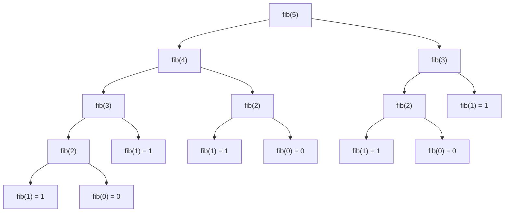
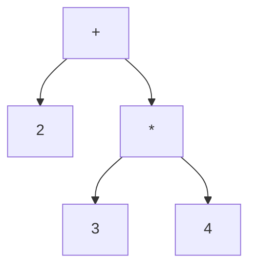

# Chapter 24: Recursion — Functions That Call Themselves

> "To understand recursion, you must first understand recursion."

---

## Overview

Recursion is the programming technique where a function calls itself. At first, this seems paradoxical — how can a function call itself? Will it not just call itself forever? The answer lies in two essential ingredients that every correct recursive function must have: a stopping condition (the base case) and a step that moves toward that stopping condition (the recursive case).

Recursion is not just a clever trick. It is the natural way to express solutions to problems that are defined in terms of smaller versions of themselves. Trees are recursive structures (a tree is a node with child trees). The Astra source code is a recursive structure (an expression can contain sub-expressions). The parser that reads that source code is recursive in its very design.

This chapter builds your recursive intuition from the ground up, then shows you the crown jewel: the Astra parser is a recursive descent parser, and every parsing rule in it is a recursive function call.

## What We Are Building

By the end of this chapter, you will understand how to write recursive functions correctly, how the call stack works during recursion (with diagrams), what stack overflow means and when it happens, why Go does not optimize tail calls, and — most importantly — you will implement a complete recursive descent parser for arithmetic expressions that demonstrates exactly how the Astra parser works.

---

## Table of Contents

1. What Is Recursion?
2. The Two Laws of Recursion
3. Factorial — The Canonical Example
4. The Call Stack During Recursion
5. Stack Overflow — When Recursion Goes Too Deep
6. Fibonacci — The Danger of Naive Recursion
7. Memoized Fibonacci
8. Tail Recursion and Why Go Doesn't Optimize It
9. Tree Traversal by Recursion
10. Tower of Hanoi
11. Recursive Data Structures
12. Mutual Recursion
13. When to Use Recursion vs Iteration
14. Astra Build Milestone — The Recursive Descent Parser
15. Exercises
16. Summary

---

## 1. What Is Recursion?

Consider a set of mirrors facing each other. Each mirror reflects the other mirror, which reflects the first mirror, which reflects the second, ad infinitum — until the image becomes too small to see. Recursion in programming is similar: a function calls itself, which calls itself, which calls itself — until it reaches a case small enough to solve directly.

Here is the simplest possible recursive function:

```go
func countdown(n int) {
    if n <= 0 {
        fmt.Println("Blast off!")
        return  // base case: stop here
    }
    fmt.Println(n)
    countdown(n - 1)  // recursive case: call self with smaller input
}

// countdown(3) prints:
// 3
// 2
// 1
// Blast off!
```

Notice:
- The function calls itself (`countdown(n - 1)`)
- Each call has a smaller value of `n` (moving toward the base case)
- When `n <= 0`, the function returns without calling itself (the base case)

---

## 2. The Two Laws of Recursion

**Law 1: Every recursive function must have a base case.**

The base case is the condition under which the function does NOT call itself. Without a base case, the function calls itself forever (until the program crashes with a stack overflow).

**Law 2: Every recursive case must move toward the base case.**

Each recursive call must pass a smaller or simpler version of the problem. "Smaller" might mean: a smaller number, a shorter string, a smaller array, a shallower tree. The important thing is that each call makes progress toward the condition where the base case will be reached.

```go
// WRONG: No base case — infinite recursion, stack overflow!
func badCountdown(n int) {
    fmt.Println(n)
    badCountdown(n - 1)  // this will run forever (n goes to -infinity)
}

// WRONG: Recursive case doesn't move toward base case
func alsoWrong(n int) {
    if n == 0 {
        return
    }
    alsoWrong(n + 1)  // n gets BIGGER, never reaches 0!
}

// RIGHT: Has base case AND moves toward it
func countdown(n int) {
    if n <= 0 { return }  // base case
    fmt.Println(n)
    countdown(n - 1)      // n-1 is closer to 0 ✓
}
```

---

## 3. Factorial — The Canonical Example

The factorial of n (written n!) is the product of all integers from 1 to n:
- 5! = 5 × 4 × 3 × 2 × 1 = 120
- 0! = 1 (by definition)

The recursive definition: n! = n × (n-1)!

This is recursion stated mathematically. The code almost writes itself:

```go
// Recursive factorial
func factorialRecursive(n int) int {
    if n == 0 || n == 1 {  // base case
        return 1
    }
    return n * factorialRecursive(n-1)  // recursive case
}

// Iterative factorial
func factorialIterative(n int) int {
    result := 1
    for i := 2; i <= n; i++ {
        result *= i
    }
    return result
}
```

**Which is better?** For factorial, the iterative version is better in practice:
- Same O(n) time complexity
- O(1) space vs O(n) space (no call stack frames)
- No risk of stack overflow for large n
- Slightly faster (function call overhead is real)

But the recursive version is cleaner and more directly expresses the mathematical definition. For teaching purposes and for problems that are naturally recursive (trees, grammars), recursion is the right choice.

---

## 4. The Call Stack During Recursion

To understand recursion fully, you need to see what happens in memory when a recursive function runs. The call stack is a region of memory where the computer stores information about active function calls.

Each time a function is called, a "stack frame" is pushed onto the call stack. This frame contains:
- The function's local variables
- The function's parameters
- The return address (where to go back to when the function returns)

When a function returns, its frame is popped off the stack.

Let us trace `factorialRecursive(4)`:

```
Call: factorialRecursive(4)
  ┌─────────────────────────┐
  │ factorialRecursive(4)   │ ← current frame
  │   n = 4                 │
  │   waiting for result of │
  │   factorialRecursive(3) │
  └─────────────────────────┘

Calls: factorialRecursive(3)
  ┌─────────────────────────┐
  │ factorialRecursive(3)   │ ← new frame on top
  │   n = 3                 │
  │   waiting for result of │
  │   factorialRecursive(2) │
  ├─────────────────────────┤
  │ factorialRecursive(4)   │
  │   n = 4, waiting...     │
  └─────────────────────────┘

Calls: factorialRecursive(2)
  ┌─────────────────────────┐
  │ factorialRecursive(2)   │ ← new frame
  │   n = 2                 │
  ├─────────────────────────┤
  │ factorialRecursive(3)   │
  │   n = 3, waiting...     │
  ├─────────────────────────┤
  │ factorialRecursive(4)   │
  │   n = 4, waiting...     │
  └─────────────────────────┘

Calls: factorialRecursive(1) — BASE CASE!
  ┌─────────────────────────┐
  │ factorialRecursive(1)   │ ← base case, returns 1
  ├─────────────────────────┤
  │ factorialRecursive(2)   │
  ├─────────────────────────┤
  │ factorialRecursive(3)   │
  ├─────────────────────────┤
  │ factorialRecursive(4)   │
  └─────────────────────────┘

Return 1 to factorialRecursive(2):
  factorialRecursive(2) computes: 2 * 1 = 2, returns 2
  ┌─────────────────────────┐
  │ factorialRecursive(3)   │ ← receives 2
  ├─────────────────────────┤
  │ factorialRecursive(4)   │
  └─────────────────────────┘

Return 2 to factorialRecursive(3):
  factorialRecursive(3) computes: 3 * 2 = 6, returns 6

Return 6 to factorialRecursive(4):
  factorialRecursive(4) computes: 4 * 6 = 24, returns 24

Final answer: 24
```

The key observation: all those frames are on the stack simultaneously. For `factorial(4)`, we have 4 frames. For `factorial(1000)`, we would have 1000 frames.

---

## 5. Stack Overflow — When Recursion Goes Too Deep

Each stack frame takes memory (typically 1-8 KB per frame in Go). The total stack size is limited (Go starts with 8 KB and grows to ~1 GB by default, but each goroutine's stack is bounded).

If you recurse too deeply without hitting a base case, you run out of stack memory:

```go
func infiniteRecursion(n int) int {
    return infiniteRecursion(n + 1)  // no base case!
}
// This will crash with: "runtime: goroutine stack exceeds 1000000000-byte limit"
// "runtime: sp=0xc0200e0378 stack=[0xc020000000, 0xc040000000]"
// "fatal error: stack overflow"
```

```go
// Even with a base case, if n is too large, we overflow
func factorial(n int) int {
    if n <= 1 { return 1 }
    return n * factorial(n-1)
}
// factorial(100000) will overflow Go's stack
// factorial(10000) might work but is slow
```

**How to avoid stack overflow:**
1. Convert recursion to iteration (use an explicit stack)
2. Use tail recursion (if the language supports TCO — Go does not)
3. Use an iterative approach with a loop and a data structure

---

## 6. Fibonacci — The Danger of Naive Recursion

The Fibonacci sequence: 0, 1, 1, 2, 3, 5, 8, 13, 21, ...
Each number is the sum of the two before it: fib(n) = fib(n-1) + fib(n-2)

```go
// Naive recursive Fibonacci — looks clean, is TERRIBLE in practice
func fib(n int) int {
    if n <= 1 {
        return n  // base cases: fib(0)=0, fib(1)=1
    }
    return fib(n-1) + fib(n-2)
}
```

Let us trace fib(5) and count the calls:



Count the calls: fib(5) makes 15 calls total. fib(6) makes 25 calls. fib(50) makes about 2^50 = 1 quadrillion calls. This is O(2^n) — exponential!

The problem: we compute fib(3) twice, fib(2) three times, fib(1) five times. All that repeated work is wasted. This is the defining problem that dynamic programming solves (Chapter 26).

---

## 7. Memoized Fibonacci

Memoization: cache the result of each subproblem the first time we compute it. If we need it again, return the cached value instantly.

```go
// Memoized Fibonacci: O(n) time, O(n) space
func fibMemoized(n int) int {
    cache := make(map[int]int)
    return fibHelper(n, cache)
}

func fibHelper(n int, cache map[int]int) int {
    if n <= 1 {
        return n
    }
    if cached, ok := cache[n]; ok {
        return cached  // return instantly — no recomputation
    }
    result := fibHelper(n-1, cache) + fibHelper(n-2, cache)
    cache[n] = result  // store for future use
    return result
}

// Each value fib(0), fib(1), ..., fib(n) computed exactly once
// Time: O(n), Space: O(n)
```

Now fib(50) makes only 50 unique calls instead of 2^50. The call tree becomes a chain rather than a branching tree.

---

## 8. Tail Recursion and Why Go Does Not Optimize It

A function is tail-recursive if the recursive call is the very last operation before returning. There is nothing done with the result of the recursive call except returning it.

```go
// NOT tail recursive: the multiplication happens after the recursive call returns
func factorial(n int) int {
    if n == 0 { return 1 }
    return n * factorial(n-1)  // must multiply AFTER factorial returns
}

// Tail recursive version: accumulate the result in a parameter
func factorialTail(n, acc int) int {
    if n == 0 { return acc }
    return factorialTail(n-1, n*acc)  // result is DIRECTLY returned, no work after
}
// Usage: factorialTail(5, 1)
```

With tail call optimization (TCO), a tail-recursive call can reuse the current stack frame instead of creating a new one. This means tail-recursive functions use O(1) stack space, avoiding stack overflow entirely.

**Does Go implement TCO?** No. Go deliberately does not optimize tail calls, for several reasons:
1. Go's goroutine stack grows dynamically, so stack overflow is less common
2. Go's stack traces (used for debugging) would be confusing if frames were reused
3. The Go specification does not guarantee TCO
4. Go prefers iterative style for performance-critical code

**Does Astra implement TCO?** No. The Astra compiler follows Go's philosophy: clear semantics over clever optimization. If you need deep recursion in Astra, use an iterative approach with an explicit stack.

This means Astra programmers writing deeply recursive functions should be aware of stack depth limits.

---

## 9. Tree Traversal by Recursion

Trees are the most naturally recursive data structure. A tree consists of a root node with zero or more child subtrees. Each subtree is itself a tree. Recursive tree traversal is one of the cleanest examples of recursion in action.

```go
// Binary tree node
type TreeNode struct {
    Value int
    Left  *TreeNode
    Right *TreeNode
}

// Inorder traversal: left, root, right
// For a BST, inorder gives sorted output
func inorder(root *TreeNode) {
    if root == nil { return }          // base case: empty tree
    inorder(root.Left)                 // recurse left subtree
    fmt.Println(root.Value)            // process current node
    inorder(root.Right)                // recurse right subtree
}

// Preorder traversal: root, left, right
// Useful for copying a tree or printing its structure
func preorder(root *TreeNode) {
    if root == nil { return }
    fmt.Println(root.Value)
    preorder(root.Left)
    preorder(root.Right)
}

// Postorder traversal: left, right, root
// Useful for deleting a tree or evaluating an expression tree
func postorder(root *TreeNode) {
    if root == nil { return }
    postorder(root.Left)
    postorder(root.Right)
    fmt.Println(root.Value)
}

// Calculate tree height recursively
func height(root *TreeNode) int {
    if root == nil { return 0 }
    leftH := height(root.Left)
    rightH := height(root.Right)
    if leftH > rightH {
        return leftH + 1
    }
    return rightH + 1
}
```

The Astra AST (Abstract Syntax Tree) is a tree. Every operation the compiler performs on code — type checking, optimization, code generation — is a tree traversal. Each traversal is naturally expressed recursively.

---

## 10. Tower of Hanoi

Tower of Hanoi is a classic puzzle: three pegs, n disks on the leftmost peg (largest on bottom), goal is to move all disks to the rightmost peg without ever placing a larger disk on a smaller one.

The elegant recursive solution:

```
To move n disks from src to dst using aux as helper:
  1. Move n-1 disks from src to aux (using dst as helper)
  2. Move the largest disk from src to dst
  3. Move n-1 disks from aux to dst (using src as helper)

Base case: n=0, nothing to do
```

```go
func hanoi(n int, src, dst, aux string) {
    if n == 0 { return }  // base case
    hanoi(n-1, src, aux, dst)              // move n-1 disks out of the way
    fmt.Printf("Move disk %d from %s to %s\n", n, src, dst)  // move largest
    hanoi(n-1, aux, dst, src)              // move n-1 disks to destination
}
// hanoi(3, "A", "C", "B")
// Makes 2^n - 1 = 7 moves for n=3
```

Tower of Hanoi cannot be done more efficiently — any algorithm needs at least 2^n - 1 moves. The recursive solution directly reveals this lower bound: to move n disks, you must move n-1 disks twice (plus one move for the largest disk). That is T(n) = 2*T(n-1) + 1, which solves to T(n) = 2^n - 1.

---

## 11. Recursive Data Structures

The Astra language itself defines recursive data structures:

```astra
struct Node {
    value: int
    next: Node      // Node contains another Node — recursive!
}

struct Tree {
    value: int
    left: Tree      // recursive reference
    right: Tree     // recursive reference
}
```

Working with these naturally requires recursive algorithms. The Astra compiler's type checker must handle recursive struct types (e.g., ensuring that a recursive type is well-formed — no infinite-size structs without pointers).

```go
// Checking if a type contains an infinite-size cycle (no pointers)
// A struct with a field of its own type (not a pointer) would be infinite-size
func hasInfiniteCycle(typeName string, chain map[string]bool, types map[string][]string) bool {
    if chain[typeName] {
        return true  // we've seen this type while resolving it — cycle!
    }
    chain[typeName] = true
    for _, fieldType := range types[typeName] {
        if hasInfiniteCycle(fieldType, chain, types) {
            return true
        }
    }
    delete(chain, typeName)  // backtrack
    return false
}
```

---

## 12. Mutual Recursion

Two functions can be mutually recursive — A calls B, which calls A, which calls B, and so on. Each must eventually reach a base case.

```go
// Is n even? (using mutual recursion — for illustration only)
func isEven(n int) bool {
    if n == 0 { return true }   // base case
    return isOdd(n - 1)         // n is even iff n-1 is odd
}

func isOdd(n int) bool {
    if n == 0 { return false }  // base case
    return isEven(n - 1)        // n is odd iff n-1 is even
}
```

In the Astra parser, mutual recursion is essential. `parseExpression` calls `parseAddition`, which calls `parseMultiplication`, which calls `parsePrimary`, which — for parenthesized expressions — calls `parseExpression` again. This is mutual recursion at the heart of parsing.

---

## 13. When to Use Recursion vs Iteration

| Use Recursion When...                              | Use Iteration When...                          |
|----------------------------------------------------|------------------------------------------------|
| Problem is naturally recursive (trees, graphs)     | Problem is naturally sequential (loops)        |
| Recursive solution is significantly clearer        | Performance is critical                        |
| Maximum depth is bounded and manageable            | Depth could be very large (risk of overflow)   |
| You're traversing a recursive data structure       | The iterative version is just as readable      |
| Implementing a parser, evaluator, or tree walker   | Implementing a loop over an array              |

The rule of thumb: if the data structure is recursive (tree, graph, nested structure), use recursion. If the problem is inherently sequential (process each element in order), use iteration.

The Astra parser uses recursion because the grammar is recursive. The Astra code generator uses recursion because the AST is a recursive tree. The Astra optimizer uses recursion for the same reason. That said, internal bookkeeping (tracking scope depth, counting iterations) is always done iteratively.

---

## Astra Build Milestone — The Recursive Descent Parser

This is the most important section of this chapter. The Astra parser is a **recursive descent parser**: each grammar rule becomes a function, and those functions call each other recursively to parse nested structures.

### The Grammar of Arithmetic Expressions

```
expression   → addition
addition     → multiplication ( ('+' | '-') multiplication )*
multiplication → primary ( ('*' | '/') primary )*
primary      → NUMBER | '(' expression ')'
```

This grammar is recursive: `expression` → `addition` → `multiplication` → `primary` → `'(' expression ')'` — primary can eventually call expression again!

### How `2 + 3 * 4` is Parsed

```
parseExpression()
  → parseAddition()
    → parseMultiplication()         ← "what comes before the +"?
      → parsePrimary()
        → reads '2'
        → returns IntLit(2)
      → no '*' or '/', returns IntLit(2)
    → sees '+', reads it
    → parseMultiplication()         ← "what comes after the +"?
      → parsePrimary()
        → reads '3'
        → returns IntLit(3)
      → sees '*', reads it
      → parsePrimary()
        → reads '4'
        → returns IntLit(4)
      → returns BinaryExpr('*', IntLit(3), IntLit(4))
    → returns BinaryExpr('+', IntLit(2), BinaryExpr('*', IntLit(3), IntLit(4)))
```

The resulting AST correctly encodes that `*` binds tighter than `+`:



This is operator precedence handled entirely through the recursive structure of the grammar — no explicit precedence rules needed!

### Complete Mini Parser Implementation in Go

```go
// File: mini_parser/parser.go
package miniparser

import (
    "fmt"
    "strconv"
    "unicode"
)

// ─── LEXER ────────────────────────────────────────────────────────────────────

type TokenKind int

const (
    TokNumber TokenKind = iota
    TokPlus
    TokMinus
    TokStar
    TokSlash
    TokLParen
    TokRParen
    TokEOF
)

type Token struct {
    Kind  TokenKind
    Value string
}

type Lexer struct {
    input []rune
    pos   int
}

func NewLexer(input string) *Lexer {
    return &Lexer{input: []rune(input)}
}

func (l *Lexer) skipSpaces() {
    for l.pos < len(l.input) && unicode.IsSpace(l.input[l.pos]) {
        l.pos++
    }
}

func (l *Lexer) Next() Token {
    l.skipSpaces()
    if l.pos >= len(l.input) {
        return Token{Kind: TokEOF}
    }
    ch := l.input[l.pos]
    l.pos++
    switch ch {
    case '+': return Token{Kind: TokPlus, Value: "+"}
    case '-': return Token{Kind: TokMinus, Value: "-"}
    case '*': return Token{Kind: TokStar, Value: "*"}
    case '/': return Token{Kind: TokSlash, Value: "/"}
    case '(': return Token{Kind: TokLParen, Value: "("}
    case ')': return Token{Kind: TokRParen, Value: ")"}
    default:
        if unicode.IsDigit(ch) {
            start := l.pos - 1
            for l.pos < len(l.input) && unicode.IsDigit(l.input[l.pos]) {
                l.pos++
            }
            return Token{Kind: TokNumber, Value: string(l.input[start:l.pos])}
        }
        panic(fmt.Sprintf("unexpected character: %c", ch))
    }
}

// ─── AST NODES ────────────────────────────────────────────────────────────────

type Expr interface {
    Eval() int
    String() string
}

type IntLit struct{ Value int }
func (n *IntLit) Eval() int    { return n.Value }
func (n *IntLit) String() string { return strconv.Itoa(n.Value) }

type BinaryExpr struct {
    Op    string
    Left  Expr
    Right Expr
}
func (b *BinaryExpr) Eval() int {
    l, r := b.Left.Eval(), b.Right.Eval()
    switch b.Op {
    case "+": return l + r
    case "-": return l - r
    case "*": return l * r
    case "/": return l / r
    }
    panic("unknown op: " + b.Op)
}
func (b *BinaryExpr) String() string {
    return fmt.Sprintf("(%s %s %s)", b.Left, b.Op, b.Right)
}

// ─── RECURSIVE DESCENT PARSER ─────────────────────────────────────────────────

type Parser struct {
    lexer   *Lexer
    current Token
    depth   int // for tracing
}

func NewParser(input string) *Parser {
    p := &Parser{lexer: NewLexer(input)}
    p.advance()  // prime the pump: load first token
    return p
}

func (p *Parser) advance() {
    p.current = p.lexer.Next()
}

func (p *Parser) eat(kind TokenKind) Token {
    tok := p.current
    if tok.Kind != kind {
        panic(fmt.Sprintf("expected token kind %d, got '%s'", kind, tok.Value))
    }
    p.advance()
    return tok
}

func (p *Parser) trace(name string) func() {
    indent := ""
    for i := 0; i < p.depth; i++ { indent += "  " }
    fmt.Printf("%s→ %s (current: '%s')\n", indent, name, p.current.Value)
    p.depth++
    return func() {
        p.depth--
        fmt.Printf("%s← %s done\n", indent, name)
    }
}

// parseExpression is the top-level rule.
// expression → addition
func (p *Parser) ParseExpression() Expr {
    defer p.trace("parseExpression")()
    return p.parseAddition()
}

// parseAddition handles + and - (left-to-right, lower precedence)
// addition → multiplication ( ('+' | '-') multiplication )*
func (p *Parser) parseAddition() Expr {
    defer p.trace("parseAddition")()
    
    // Parse the left-hand side (higher precedence first)
    left := p.parseMultiplication()
    
    // Then consume any number of + or - operators
    for p.current.Kind == TokPlus || p.current.Kind == TokMinus {
        op := p.current.Value
        p.advance() // consume the operator
        right := p.parseMultiplication()
        left = &BinaryExpr{Op: op, Left: left, Right: right}
        // Note: left is updated each iteration → left-associative
        // 2 - 3 - 4 becomes ((2 - 3) - 4), not (2 - (3 - 4))
    }
    return left
}

// parseMultiplication handles * and / (higher precedence than + and -)
// multiplication → primary ( ('*' | '/') primary )*
func (p *Parser) parseMultiplication() Expr {
    defer p.trace("parseMultiplication")()
    
    left := p.parsePrimary()
    
    for p.current.Kind == TokStar || p.current.Kind == TokSlash {
        op := p.current.Value
        p.advance()
        right := p.parsePrimary()
        left = &BinaryExpr{Op: op, Left: left, Right: right}
    }
    return left
}

// parsePrimary handles numbers and parenthesized expressions
// primary → NUMBER | '(' expression ')'
func (p *Parser) parsePrimary() Expr {
    defer p.trace("parsePrimary")()
    
    if p.current.Kind == TokNumber {
        tok := p.eat(TokNumber)
        val, _ := strconv.Atoi(tok.Value)
        return &IntLit{Value: val}
    }
    
    if p.current.Kind == TokLParen {
        p.eat(TokLParen)
        expr := p.ParseExpression()  // ← RECURSIVE CALL! Parses nested expression
        p.eat(TokRParen)
        return expr
    }
    
    panic(fmt.Sprintf("unexpected token: '%s'", p.current.Value))
}

// ─── MAIN DEMO ────────────────────────────────────────────────────────────────

func ParseAndEval(input string) {
    fmt.Printf("\n=== Parsing: %q ===\n", input)
    p := NewParser(input)
    ast := p.ParseExpression()
    fmt.Printf("AST: %s\n", ast)
    fmt.Printf("Result: %d\n", ast.Eval())
}
```

When you run `ParseAndEval("2 + 3 * 4")`, you see:

```
=== Parsing: "2 + 3 * 4" ===
→ parseExpression (current: '2')
  → parseAddition (current: '2')
    → parseMultiplication (current: '2')
      → parsePrimary (current: '2')
      ← parsePrimary done
    ← parseMultiplication done
    → parseMultiplication (current: '3')
      → parsePrimary (current: '3')
      ← parsePrimary done
      → parsePrimary (current: '4')
      ← parsePrimary done
    ← parseMultiplication done
  ← parseAddition done
← parseExpression done
AST: (2 + (3 * 4))
Result: 14
```

And for `(2 + 3) * 4`:

```
=== Parsing: "(2 + 3) * 4" ===
→ parseExpression (current: '(')
  → parseAddition (current: '(')
    → parseMultiplication (current: '(')
      → parsePrimary (current: '(')
        → parseExpression (current: '2')    ← RECURSIVE CALL for the parenthesized expr
          → parseAddition (current: '2')
            → parseMultiplication ...
              → parsePrimary (current: '2') ← returns 2
            → parseMultiplication ...
              → parsePrimary (current: '3') ← returns 3
          ← parseAddition done
        ← parseExpression done
      ← parsePrimary done (consumed '(', inner expr, ')')
      → parsePrimary (current: '4')         ← right side of *
      ← parsePrimary done
    ← parseMultiplication done
  ← parseAddition done
← parseExpression done
AST: ((2 + 3) * 4)
Result: 20
```

This is exactly how the Astra parser works, just with many more grammar rules (function calls, if-expressions, for loops, type annotations, etc.). Every rule is a function, and parenthesized or nested constructs trigger recursive calls back to higher-level rules.

---

## Exercises

1. **Trace factorial(5)**: Draw the complete call stack diagram for `factorialRecursive(5)`, showing all frames at peak depth and the unwinding as each call returns.

2. **Sum of a list recursively**: Write a recursive function `sumList(arr []int) int` without using any loops. Then write it iteratively. Compare the code.

3. **Power function**: Implement `power(base, exp int) int` recursively. Then implement a fast version using the insight that `base^exp = (base^(exp/2))^2` for even exp. What is the complexity of the fast version?

4. **Flatten nested slices**: In Go, write a recursive function that flattens a `[]interface{}` where elements can be either integers or other `[]interface{}` slices:
   `[1, [2, [3, 4], 5], 6]` → `[1, 2, 3, 4, 5, 6]`

5. **Extend the parser**: Add support for unary negation to the mini parser. The grammar becomes:
   `primary → NUMBER | '(' expression ')' | '-' primary`
   This allows expressions like `-5`, `-(2+3)`, `2 * -3`.

6. **Add variables**: Extend the parser and evaluator to support named variables. Add a `let x = 5` construct and then allow `x` to appear in expressions. You will need an environment (map) to store variable values.

7. **Mutual recursion**: Write two mutually recursive functions `isPalindrome(s string)` and `isPalindromeHelper(s string, left, right int)`. Then explain why this does or does not need mutual recursion (could you use just one function?).

8. **Tail-recursive sum**: Write a tail-recursive version of `sum(1..n)`. Explain why Go does not benefit from tail call optimization and what you would do instead for very large n.

---

## Summary Table

| Concept             | Definition                                          | Example                          |
|---------------------|-----------------------------------------------------|----------------------------------|
| Base case           | Condition that stops recursion                      | `if n == 0 { return 1 }`        |
| Recursive case      | The function calling itself with smaller input      | `return n * factorial(n-1)`     |
| Call stack frame    | Memory storing a function's locals and return addr  | Each recursive call = 1 frame   |
| Stack overflow      | Too many frames, memory exhausted                   | Recursion depth > ~millions      |
| Tail recursion      | Recursive call is the last operation                | `return factorial(n-1, acc*n)`  |
| TCO                 | Compiler optimization: reuse frame for tail calls   | Go does NOT do this             |
| Memoization         | Cache recursive results to avoid recomputation      | fib(n) stored in map            |
| Mutual recursion    | Function A calls B, B calls A                       | Parser's rules call each other  |

| Algorithm         | Recursion Type    | Time     | Space    | Notes                            |
|-------------------|-------------------|----------|----------|----------------------------------|
| Factorial         | Linear recursion  | O(n)     | O(n)     | Better iterative                 |
| Naive Fibonacci   | Tree recursion    | O(2^n)   | O(n)     | Terrible — use memoization       |
| Memoized Fibonacci | Tree (with cache) | O(n)     | O(n)     | Much better                     |
| Tree traversal    | Tree recursion    | O(n)     | O(h)     | h = tree height                  |
| Merge sort        | Binary recursion  | O(n logn)| O(n)     | Elegant divide and conquer       |
| Recursive descent | Mutual recursion  | O(n)     | O(d)     | d = parse depth, used in Astra  |

The recursive descent parser is not just an example of recursion — it is recursion's greatest triumph in everyday software. Every time you compile an Astra program, parse a JSON file, or run a SQL query, a recursive descent parser (or something equivalent) is reading your code and building a tree from it. Understanding recursion means understanding how compilers think.
