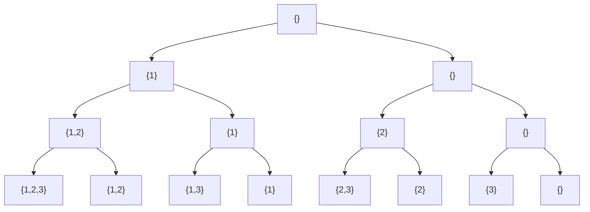

# Chapter 25: Backtracking — Trying Every Possibility

> "Sometimes the only way forward is to try something, discover it does not work, undo it, and try something else. This is not failure. This is how complex problems get solved."

---

## Overview

Imagine you are navigating a maze. You reach a fork in the path. You go left, walk down the corridor, hit a dead end. You come back to the fork, mark the left path as "visited/failed," and try the right path. You keep doing this — trying paths, backing up when you hit dead ends — until you find the exit or exhaust all possibilities.

This is backtracking: a systematic exploration of all possible solutions by building candidates incrementally and abandoning ("backtracking" from) a candidate as soon as you determine it cannot possibly lead to a valid solution.

Backtracking is not brute force — it is informed brute force with early pruning. The art of backtracking is in the pruning: how quickly can you determine that a partial solution is doomed, so you can stop exploring that branch?

This chapter covers backtracking algorithms, their applications, and — critically — two places where the Astra compiler uses backtracking-like strategies: type inference and error recovery.

## What We Are Building

By the end of this chapter, you will understand how to frame problems as decision trees, implement backtracking with Go, apply pruning to avoid unnecessary exploration, and see how type inference in the Astra compiler uses a backtracking-like constraint-solving approach when types are ambiguous.

---

## Table of Contents

1. What Is Backtracking?
2. Backtracking as DFS on a Decision Tree
3. The N-Queens Problem — Step by Step
4. Sudoku Solver
5. Generating All Permutations
6. Generating All Subsets (Power Set)
7. Word Search in a Grid
8. Pruning — Cutting Bad Branches Early
9. Constraint Satisfaction Problems
10. The Complexity of Backtracking
11. When Backtracking Is the Right Tool
12. Astra Build Milestone
13. Exercises
14. Summary

---

## 1. What Is Backtracking?

Backtracking is an algorithmic technique that considers searching every possible combination in order to solve a computational problem. It incrementally builds candidates to the solutions and abandons a candidate ("backtracks") as soon as it determines the candidate cannot lead to a valid solution.

The key elements:
1. **Choice**: At each step, you have a set of choices to make
2. **Constraints**: Some choices lead to invalid states
3. **Goal**: A complete valid state is what you are looking for

The backtracking template:

```go
func backtrack(state State, choices []Choice) bool {
    if isGoal(state) {
        recordSolution(state)
        return true
    }
    
    for _, choice := range choices {
        if isValid(state, choice) {    // pruning: skip invalid choices
            applyChoice(state, choice)  // make the choice
            if backtrack(state, remainingChoices(choices, choice)) {
                return true  // found a solution!
            }
            undoChoice(state, choice)   // BACKTRACK: undo the choice
        }
    }
    return false  // no valid solution from this state
}
```

The crucial step is `undoChoice`. After exploring a path that leads to failure, we restore the state to exactly what it was before we made that choice. Then we try the next choice.

---

## 2. Backtracking as DFS on a Decision Tree

Every backtracking problem can be visualized as a decision tree. Each level of the tree represents a decision point. Each branch represents a choice. Each leaf represents either a solution or a dead end.

Backtracking is simply a depth-first search (DFS) on this decision tree, with pruning to cut branches that cannot lead to solutions.

```
Decision tree for 3-digit combinations using digits {1, 2, 3}:

                     []
           /          |          \
          [1]        [2]          [3]
        /  |  \    /  |  \     /  |  \
      [1,1][1,2][1,3][2,1]...  [3,1][3,2][3,3]
      / \ / \ / \
[1,1,1][1,1,2][1,1,3]...

DFS explores this tree top-to-bottom, left-to-right.
With constraints, entire subtrees can be pruned (marked ✗):

                     []
           /          |          \
          [1]        [2]  ✗(pruned) [3]
        /     \
      [1,2]   [1,3]  ✗
     /   \
   [1,2,3] [1,2,1] ✗
       ↑ SOLUTION
```

---

## 3. The N-Queens Problem — Step by Step

Place N queens on an N×N chessboard such that no two queens attack each other. Queens attack in rows, columns, and diagonals.

```
Valid 4-Queens solution:
. Q . .
. . . Q
Q . . .
. . Q .
```

**The decision**: For each row (one queen per row), choose which column to place the queen.

**The constraint**: No two queens share the same column or diagonal.

```go
func solveNQueens(n int) [][]string {
    var solutions [][]string
    board := make([]int, n)  // board[row] = column of queen in that row
    for i := range board {
        board[i] = -1  // -1 means no queen placed yet
    }
    
    var backtrack func(row int)
    backtrack = func(row int) {
        if row == n {
            // All n queens placed — record this solution
            solutions = append(solutions, boardToStrings(board, n))
            return
        }
        
        // Try placing a queen in each column of this row
        for col := 0; col < n; col++ {
            if isSafe(board, row, col) {  // PRUNING: skip unsafe positions
                board[row] = col           // place queen
                backtrack(row + 1)         // recurse to next row
                board[row] = -1            // BACKTRACK: remove queen
            }
        }
    }
    
    backtrack(0)  // start with row 0
    return solutions
}

func isSafe(board []int, row, col int) bool {
    for r := 0; r < row; r++ {
        c := board[r]
        if c == col {
            return false  // same column
        }
        // Check diagonals: |row - r| == |col - c|
        if abs(row-r) == abs(col-c) {
            return false  // on a diagonal
        }
    }
    return true
}

func abs(x int) int {
    if x < 0 { return -x }
    return x
}

func boardToStrings(board []int, n int) []string {
    result := make([]string, n)
    for row := 0; row < n; row++ {
        line := make([]byte, n)
        for col := 0; col < n; col++ {
            if board[row] == col {
                line[col] = 'Q'
            } else {
                line[col] = '.'
            }
        }
        result[row] = string(line)
    }
    return result
}
```

Let us trace the algorithm for 4-Queens (abbreviated):

```
Row 0: try col 0 → place Q at (0,0)
  Row 1: try col 0 → same column as (0,0), SKIP
  Row 1: try col 1 → diagonal of (0,0), SKIP
  Row 1: try col 2 → safe, place Q at (1,2)
    Row 2: try col 0 → safe, place Q at (2,0)
      Row 3: try col 0 → same col as (2,0), SKIP
      Row 3: try col 1 → diagonal of (1,2), SKIP
      Row 3: try col 2 → same col as (1,2), SKIP
      Row 3: try col 3 → diagonal of (2,0), SKIP
      Row 3: all columns tried, BACKTRACK
    Row 2: undo (2,0), try col 1 → diagonal of (0,0), SKIP
    Row 2: try col 3 → safe, place Q at (2,3)
      Row 3: try col 0 → safe? no, diagonal of (1,2)...
      ... (more exploration)
  Row 1: undo (1,2), try col 3 → safe, place Q at (1,3)
    ... (more exploration)
Row 0: undo (0,0), try col 1 → ...
  ...
  Eventually finds: Q at (0,1), (1,3), (2,0), (3,2) — SOLUTION!
```

For 8×8 chessboard: 92 solutions out of 8^8 = 16,777,216 possible placements. Backtracking with pruning reduces the actual work dramatically.

---

## 4. Sudoku Solver

Sudoku is a perfect backtracking problem. The grid has 81 cells. For each empty cell, we try digits 1-9 that satisfy the row, column, and 3×3 box constraints.

```go
func solveSudoku(board [][]byte) bool {
    for row := 0; row < 9; row++ {
        for col := 0; col < 9; col++ {
            if board[row][col] == '.' {  // empty cell
                for digit := byte('1'); digit <= '9'; digit++ {
                    if isValidPlacement(board, row, col, digit) {
                        board[row][col] = digit  // make choice
                        
                        if solveSudoku(board) {
                            return true  // solution found
                        }
                        
                        board[row][col] = '.'  // BACKTRACK
                    }
                }
                return false  // no digit works here — dead end
            }
        }
    }
    return true  // all cells filled — solution!
}

func isValidPlacement(board [][]byte, row, col int, digit byte) bool {
    // Check row
    for c := 0; c < 9; c++ {
        if board[row][c] == digit { return false }
    }
    // Check column
    for r := 0; r < 9; r++ {
        if board[r][col] == digit { return false }
    }
    // Check 3×3 box
    boxRow, boxCol := (row/3)*3, (col/3)*3
    for r := boxRow; r < boxRow+3; r++ {
        for c := boxCol; c < boxCol+3; c++ {
            if board[r][c] == digit { return false }
        }
    }
    return true
}
```

---

## 5. Generating All Permutations

A permutation is an arrangement of elements in a specific order. For [1, 2, 3], the permutations are: [1,2,3], [1,3,2], [2,1,3], [2,3,1], [3,1,2], [3,2,1] — 3! = 6 total.

```go
func permutations(nums []int) [][]int {
    var result [][]int
    used := make([]bool, len(nums))
    current := make([]int, 0, len(nums))
    
    var backtrack func()
    backtrack = func() {
        if len(current) == len(nums) {
            // Found a complete permutation — copy and record it
            perm := make([]int, len(current))
            copy(perm, current)
            result = append(result, perm)
            return
        }
        
        for i, num := range nums {
            if !used[i] {
                used[i] = true
                current = append(current, num)    // choose
                backtrack()                        // explore
                current = current[:len(current)-1] // BACKTRACK: unchoose
                used[i] = false
            }
        }
    }
    
    backtrack()
    return result
}
```

**Complexity**: There are n! permutations, and we visit each node in the decision tree once. With n elements, the tree has n + n*(n-1) + n*(n-1)*(n-2) + ... ≈ n! * e nodes. So generating all permutations is O(n * n!).

---

## 6. Generating All Subsets (Power Set)

The power set of {1, 2, 3} is: {}, {1}, {2}, {3}, {1,2}, {1,3}, {2,3}, {1,2,3} — 2^n = 8 subsets.

```go
func subsets(nums []int) [][]int {
    var result [][]int
    current := []int{}
    
    var backtrack func(start int)
    backtrack = func(start int) {
        // Every partial state (at any depth) is a valid subset
        snapshot := make([]int, len(current))
        copy(snapshot, current)
        result = append(result, snapshot)
        
        for i := start; i < len(nums); i++ {
            current = append(current, nums[i])     // include nums[i]
            backtrack(i + 1)                        // recurse
            current = current[:len(current)-1]      // BACKTRACK: exclude nums[i]
        }
    }
    
    backtrack(0)
    return result
}
```

Decision tree for {1, 2, 3}:



Each path from root to a leaf represents a unique subset.

---

## 7. Word Search in a Grid

Given a 2D grid of characters and a word, determine if the word exists in the grid (horizontally, vertically, no reuse of cells).

```go
func wordSearch(board [][]byte, word string) bool {
    rows, cols := len(board), len(board[0])
    visited := make([][]bool, rows)
    for i := range visited {
        visited[i] = make([]bool, cols)
    }
    
    // Try starting from each cell
    for r := 0; r < rows; r++ {
        for c := 0; c < cols; c++ {
            if dfs(board, visited, word, 0, r, c) {
                return true
            }
        }
    }
    return false
}

func dfs(board [][]byte, visited [][]bool, word string, idx, r, c int) bool {
    if idx == len(word) {
        return true  // matched entire word!
    }
    
    rows, cols := len(board), len(board[0])
    
    // Boundary and already-visited check (pruning)
    if r < 0 || r >= rows || c < 0 || c >= cols {
        return false
    }
    if visited[r][c] {
        return false  // can't reuse cells
    }
    if board[r][c] != word[idx] {
        return false  // this cell doesn't match
    }
    
    // Make the choice: mark this cell as visited
    visited[r][c] = true
    
    // Explore all four directions
    directions := [][2]int{{-1,0},{1,0},{0,-1},{0,1}}
    for _, d := range directions {
        if dfs(board, visited, word, idx+1, r+d[0], c+d[1]) {
            visited[r][c] = false  // clean up (could omit if returning true early)
            return true
        }
    }
    
    // BACKTRACK: unmark this cell
    visited[r][c] = false
    return false
}
```

---

## 8. Pruning — Cutting Bad Branches Early

Pruning is what separates practical backtracking from theoretical brute force. The earlier you can detect that a partial solution cannot lead to a valid complete solution, the more work you save.

**Types of pruning:**

**1. Feasibility pruning**: Check constraints immediately after each choice.
```go
// N-Queens: before placing, check if position is safe
// Don't place and then check later — check first!
if isSafe(board, row, col) {
    place(board, row, col)
    backtrack(row + 1)
    remove(board, row, col)
}
```

**2. Bound pruning**: For optimization problems, estimate the best possible outcome from the current state. If it cannot beat the current best solution, prune.
```go
// Knapsack: if remaining items' total value cannot improve current best, stop
if currentValue + remainingMaxValue <= bestValue {
    return  // this branch cannot possibly improve things
}
```

**3. Forward checking**: When you make a choice, immediately propagate constraints to remaining choices and prune any that are now impossible.
```go
// Sudoku: when placing a digit, immediately eliminate it from
// the candidate sets of cells in the same row/col/box.
// If any cell's candidate set becomes empty, prune immediately.
```

**4. Symmetry breaking**: Many problems have symmetric solutions (rotate/reflect a valid N-Queens solution and get another valid solution). Eliminate symmetries to avoid computing both.

---

## 9. Constraint Satisfaction Problems

Backtracking is the general technique for solving Constraint Satisfaction Problems (CSPs). A CSP consists of:
- Variables (cells in Sudoku, queens on the board)
- Domains (possible values for each variable: digits 1-9, columns 0-7)
- Constraints (no two queens attack each other, no duplicate in a Sudoku row)

The backtracking algorithm for CSPs:
1. Select an unassigned variable (heuristics help here)
2. Try each value in its domain
3. Check if the assignment satisfies all constraints
4. If yes, recurse; if no solution found, undo and try next value

**Variable ordering heuristics** dramatically affect performance:
- **MRV (Minimum Remaining Values)**: Choose the variable with the fewest valid values. This is the "fail-first" heuristic — catch failures early.
- **Degree heuristic**: Among variables with equal remaining values, choose the one involved in the most constraints.
- **LCV (Least Constraining Value)**: When choosing a value, pick the one that eliminates the fewest choices from remaining variables.

---

## 10. The Complexity of Backtracking

In the worst case, backtracking is exponential: O(b^d) where b is the branching factor (choices at each step) and d is the depth (length of solution). For N-Queens, b=N and d=N, giving O(N^N). For permutations, it is O(n * n!).

However, in practice, pruning often reduces the actual work dramatically:
- Without pruning, 8-Queens explores 8^8 = 16,777,216 placements
- With pruning, it explores only about 2,057 placements — a 8,000x speedup!

The theoretical worst case is O(2^n) or O(n!), but the practical performance depends on:
- Quality and aggressiveness of pruning
- Problem structure (how many solutions exist, how they are distributed)
- Variable and value ordering heuristics

This is why backtracking with good pruning often works in practice even for problems with exponential worst-case complexity.

---

## 11. When Backtracking Is the Right Tool

Use backtracking when:
- You need to find all solutions (not just one)
- The problem has constraints that eliminate many possibilities
- You can define a clear "undo" operation
- The brute-force solution space is too large but most of it can be pruned

Do NOT use backtracking when:
- A greedy algorithm always makes the right local choice (use greedy)
- The same subproblems appear repeatedly (use dynamic programming)
- You just need one solution and there is a direct algorithm

**Backtracking + Memoization = Dynamic Programming**: When the subproblems in backtracking overlap (you explore the same state from multiple paths), caching the results (memoization) converts backtracking into dynamic programming. This is the conceptual bridge between this chapter and Chapter 26.

---

## Astra Build Milestone

### Part 1: Type Inference Backtracking

When the Astra type checker encounters a generic function call or an ambiguous expression, it may need to try type candidates and backtrack if they do not work. This is a simplified version of Hindley-Milner type inference.

```go
// File: compiler/typeinference/inference.go
package typeinference

import "fmt"

// TypeVar represents an unknown type that needs to be inferred
type TypeVar struct {
    ID   int
    Name string
}

// Type represents any Astra type
type Type interface {
    typeTag() string
    String() string
}

type ConcreteType struct{ Name string }
func (c *ConcreteType) typeTag() string { return "concrete" }
func (c *ConcreteType) String() string  { return c.Name }

type UnknownType struct{ Var *TypeVar }
func (u *UnknownType) typeTag() string { return "unknown" }
func (u *UnknownType) String() string  { return "?" + u.Var.Name }

// Constraint says "type A must equal type B"
type Constraint struct {
    Left  Type
    Right Type
}

// TypeInferencer tries to solve type constraints
type TypeInferencer struct {
    constraints []Constraint
    bindings    map[int]Type // TypeVar.ID → resolved Type
    candidates  [][]Type     // possible types to try for each TypeVar
}

// tryUnify attempts to make typeA equal to typeB.
// Returns true if successful, false if a contradiction is found.
// Uses backtracking when multiple candidates exist.
func (ti *TypeInferencer) tryUnify(a, b Type) bool {
    // Both concrete: must be the same type
    ca, aIsConcrete := a.(*ConcreteType)
    cb, bIsConcrete := b.(*ConcreteType)
    if aIsConcrete && bIsConcrete {
        return ca.Name == cb.Name
    }
    
    // One is an unknown (TypeVar): bind it
    if ua, aIsVar := a.(*UnknownType); aIsVar {
        return ti.bindVar(ua.Var, b)
    }
    if ub, bIsVar := b.(*UnknownType); bIsVar {
        return ti.bindVar(ub.Var, a)
    }
    
    return false
}

func (ti *TypeInferencer) bindVar(v *TypeVar, t Type) bool {
    if existing, ok := ti.bindings[v.ID]; ok {
        // Already bound — check consistency
        return ti.tryUnify(existing, t)
    }
    ti.bindings[v.ID] = t
    return true
}

// SolveWithBacktracking attempts to solve all constraints.
// When a TypeVar has multiple candidate types, it tries each one
// and backtracks if it leads to a contradiction.
func (ti *TypeInferencer) SolveWithBacktracking(varID int, candidates []Type) (Type, error) {
    fmt.Printf("Solving TypeVar T%d, candidates: ", varID)
    for i, c := range candidates {
        if i > 0 { fmt.Print(", ") }
        fmt.Print(c)
    }
    fmt.Println()
    
    for _, candidate := range candidates {
        fmt.Printf("  Trying %s...\n", candidate)
        
        // Save state (snapshot of current bindings)
        savedBindings := make(map[int]Type)
        for k, v := range ti.bindings {
            savedBindings[k] = v
        }
        
        // Try this candidate
        ti.bindings[varID] = candidate
        
        // Check if all constraints are satisfied
        satisfied := true
        for _, constraint := range ti.constraints {
            if !ti.tryUnify(constraint.Left, constraint.Right) {
                satisfied = false
                break
            }
        }
        
        if satisfied {
            fmt.Printf("  -> %s works!\n", candidate)
            return candidate, nil
        }
        
        // BACKTRACK: restore saved state
        fmt.Printf("  -> %s failed, backtracking...\n", candidate)
        ti.bindings = savedBindings
    }
    
    return nil, fmt.Errorf("cannot infer type for T%d: no candidate satisfies all constraints", varID)
}

// Example: infer the type of x in:
// fn identity(x: T) -> T { return x }
// let result: int = identity(42)
// What is T?
func DemoTypeInference() {
    fmt.Println("=== Type Inference with Backtracking ===")
    fmt.Println()
    fmt.Println("Program:")
    fmt.Println("  fn identity(x: T) -> T { return x }")
    fmt.Println("  let result: int = identity(42)")
    fmt.Println("  // What is T?")
    fmt.Println()
    
    intType := &ConcreteType{Name: "int"}
    stringType := &ConcreteType{Name: "string"}
    floatType := &ConcreteType{Name: "float64"}
    
    tv := &TypeVar{ID: 0, Name: "T"}
    
    ti := &TypeInferencer{
        bindings: make(map[int]Type),
        // Constraint: T must equal int (from the call site: identity(42), result is int)
        constraints: []Constraint{
            {Left: &UnknownType{Var: tv}, Right: intType},
        },
    }
    
    // Try candidates in order: string, float64, int
    // (string and float64 will fail, int will succeed)
    candidates := []Type{stringType, floatType, intType}
    
    result, err := ti.SolveWithBacktracking(0, candidates)
    if err != nil {
        fmt.Println("Type error:", err)
    } else {
        fmt.Printf("\nInferred: T = %s\n", result)
    }
}
```

Running this produces:

```
=== Type Inference with Backtracking ===

Program:
  fn identity(x: T) -> T { return x }
  let result: int = identity(42)
  // What is T?

Solving TypeVar T0, candidates: string, float64, int
  Trying string...
  -> string failed, backtracking...
  Trying float64...
  -> float64 failed, backtracking...
  Trying int...
  -> int works!

Inferred: T = int
```

### Part 2: Error Recovery in the Parser

When the Astra parser encounters a syntax error, it does not immediately stop. It tries to recover and continue parsing — to report as many errors as possible in a single compilation. This uses a backtracking-like strategy called "panic mode recovery."

```go
// File: compiler/parser/recovery.go
package parser

import "fmt"

// SynchronizationSet is the set of tokens we "sync" to after an error.
// These are tokens that reliably start new statements or declarations.
var synchronizationSet = map[TokenType]bool{
    FN:     true,
    LET:    true,
    FOR:    true,
    WHILE:  true,
    RETURN: true,
    RBRACE: true,
    EOF:    true,
}

// parseStatementWithRecovery tries to parse a statement.
// If it fails, it records the error and advances to a sync point,
// then tries to continue parsing from there.
func (p *Parser) parseStatementWithRecovery() Statement {
    // Save parser state for recovery
    savedPos := p.tokenPos
    savedErrors := len(p.errors)
    
    defer func() {
        if r := recover(); r != nil {
            // A parse error occurred — restore to last good state conceptually,
            // but advance past the bad tokens (sync to synchronization set)
            fmt.Printf("  Parse error recovered at token: %s\n", p.currentToken())
            
            // Discard extra errors from the failed attempt
            p.errors = p.errors[:savedErrors]
            _ = savedPos
            
            // Record just the one error
            p.addError(fmt.Sprintf("syntax error: unexpected %s", p.currentToken()))
            
            // Advance to synchronization point (BACKTRACK past the bad tokens)
            p.synchronize()
        }
    }()
    
    return p.parseStatement()
}

// synchronize advances the parser past the current error
// until it finds a token in the synchronization set.
// This is the "backtrack" step: give up on the current construct,
// find a safe place to restart.
func (p *Parser) synchronize() {
    for !synchronizationSet[p.current.Type] {
        p.advance()  // skip this token
    }
    fmt.Printf("  Synchronized at: %s\n", p.currentToken())
}

// ParseProgram demonstrates error recovery across multiple statements
func (p *Parser) ParseProgram() []Statement {
    var stmts []Statement
    
    fmt.Println("Parsing program with error recovery:")
    
    for p.current.Type != EOF {
        stmt := p.parseStatementWithRecovery()
        if stmt != nil {
            stmts = append(stmts, stmt)
            fmt.Printf("  Parsed: %T\n", stmt)
        }
        // Continue to next statement even after errors
    }
    
    if len(p.errors) > 0 {
        fmt.Printf("\nFound %d errors:\n", len(p.errors))
        for _, e := range p.errors {
            fmt.Println("  -", e)
        }
    }
    
    return stmts
}
```

This error recovery strategy is crucial for a good developer experience. Without it, the compiler would stop at the first error. With it, the compiler reports all errors in a single pass, allowing the developer to fix many issues before recompiling.

---

## Exercises

1. **N-Queens count**: Modify the N-Queens solver to count the number of solutions for N=1 through N=12 without storing them. Count the total nodes explored in the decision tree with and without pruning. Report the ratio.

2. **Combination sum**: Given an array of positive integers and a target sum, find all unique combinations that sum to the target. Each number can be used multiple times. Example: `candidates=[2,3,6,7], target=7` → `[[2,2,3],[7]]`.

3. **Palindrome partitioning**: Given a string, partition it such that every substring is a palindrome. Return all possible partitions. Example: `"aab"` → `[["a","a","b"],["aa","b"]]`.

4. **Crossword solver**: Given a crossword grid (with some letters already filled in and empty cells marked with '.'), and a list of words, fill the crossword such that all the words fit. Use backtracking.

5. **Implement constraint propagation**: Extend the Sudoku solver to use constraint propagation (arc consistency): when you place a digit, immediately remove it from the possible values of all cells in the same row, column, and box. Compare the number of recursive calls needed with and without this optimization.

6. **Phone number combinations**: Given a phone number's digit sequence (e.g., "23"), return all letter combinations that could represent it (like a phone keypad). `"23"` → `["ad","ae","af","bd","be","bf","cd","ce","cf"]`. Use backtracking.

7. **Type inference implementation**: Extend the type inference demo to handle a more complex case:
   ```astra
   fn add(a: T, b: T) -> T { return a + b }
   let result = add(1, 2)   // T must be int
   let s = add("hello", "world")  // T must be string
   ```
   Implement a system that infers T separately for each call site.

8. **Regex backtracking**: Simple regex matching uses backtracking. Implement a matcher for patterns containing only `.` (match any character) and `*` (zero or more of the preceding character). Test on `pattern="a.*b"` against `text="aXXb"`.

---

## Summary Table

| Algorithm           | Problem Type            | Complexity | Key Pruning           |
|---------------------|-------------------------|------------|-----------------------|
| N-Queens            | CSP / placement         | O(N!)      | Safety check         |
| Sudoku              | CSP / grid              | O(9^81)    | Constraint propagation|
| All permutations    | Combinatorial           | O(n * n!)  | Used[] tracking      |
| All subsets         | Combinatorial           | O(n * 2^n) | Start index          |
| Word search         | Grid DFS                | O(m*n*4^L) | Visited + char match |
| Type inference      | Constraint satisfaction | O(k^v)     | Constraint check      |

| Concept                | Definition                                          |
|------------------------|-----------------------------------------------------|
| Backtracking           | Depth-first search with undo on failure            |
| Pruning                | Skipping branches that cannot lead to a solution   |
| State restoration      | Undoing a choice to try another                    |
| Synchronization        | Finding a safe recovery point after a parse error  |
| CSP                    | Constraint satisfaction problem                    |
| MRV heuristic          | Choose the variable with fewest remaining values   |

| Astra Compiler Use    | Technique                | Why It Is Backtracking               |
|-----------------------|--------------------------|--------------------------------------|
| Type inference        | Try candidates, backtrack | Try type, check constraints, undo   |
| Error recovery        | Panic-mode synchronize   | Give up on bad construct, resync    |
| Import resolution     | Try paths, backtrack     | Try import path, fail, try another  |

Backtracking captures a deep truth about problem-solving: sometimes you must commit to a choice before you know if it is right, and be willing to undo that commitment if reality proves you wrong. This willingness to try, fail, and try again — systematically and without despair — is both a powerful algorithm design pattern and a philosophy for tackling hard problems in general.
