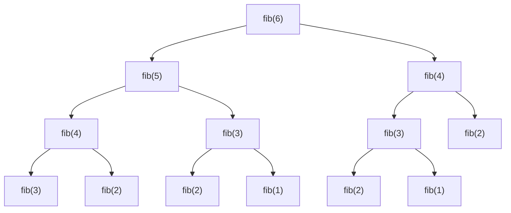

# Chapter 26: Dynamic Programming — Remembering Past Work

> "Those who cannot remember the past are condemned to repeat it." — George Santayana (also: naive recursive algorithms)

---

## Overview

Dynamic programming (DP) is one of the most powerful and most feared topics in algorithms. The fear is unwarranted. Dynamic programming has a simple core idea: if you have already solved a subproblem, do not solve it again — remember the answer.

That is it. The rest is just applying this idea systematically.

The name "dynamic programming" is notoriously misleading. It has nothing to do with "dynamic" in the programming language sense, and little to do with "programming" as in writing code. The inventor, Richard Bellman, chose the name in the 1950s to sound impressive to government bureaucrats. A better name would be "smart recursion" or "remembered computation."

This chapter builds your DP intuition from scratch, walks through the classic DP problems, and applies DP to the Astra compiler's constant-folding optimization pass.

## What We Are Building

By the end of this chapter, you will understand memoization (top-down DP) and tabulation (bottom-up DP), know the two properties a problem must have to be solved with DP, be able to solve classic DP problems (Fibonacci, LCS, knapsack, coin change, edit distance), and implement the Astra compiler's constant-folding pass, which uses DP-like reasoning to evaluate constant expressions at compile time.

---

## Table of Contents

1. The Problem with Recursion: Repeated Work
2. The Two Properties of Dynamic Programming
3. Memoization: Top-Down DP
4. Tabulation: Bottom-Up DP
5. Classic DP: Fibonacci (DP Version)
6. Classic DP: Longest Common Subsequence
7. Classic DP: 0/1 Knapsack
8. Classic DP: Coin Change
9. Classic DP: Edit Distance (Levenshtein)
10. Classic DP: Longest Increasing Subsequence
11. Space Optimization: Rolling Arrays
12. Real-World DP: Git Diff
13. Astra Build Milestone — Constant Folding
14. Exercises
15. Summary

---

## 1. The Problem with Recursion: Repeated Work

Let us revisit naive Fibonacci:

```go
func fib(n int) int {
    if n <= 1 { return n }
    return fib(n-1) + fib(n-2)
}
```

Computing fib(6) generates this call tree:



Count how many times each subproblem is computed:
- fib(4): 2 times
- fib(3): 3 times
- fib(2): 5 times
- fib(1): 8 times

For fib(50), fib(1) is computed about 2^49 times. Astronomical.

The fix: store the result of fib(k) the first time we compute it. Every subsequent call returns the stored value instantly.

---

## 2. The Two Properties of Dynamic Programming

A problem can be solved with dynamic programming if and only if it has these two properties:

### Property 1: Optimal Substructure

The optimal solution to the problem contains optimal solutions to subproblems.

For Fibonacci: fib(n) = fib(n-1) + fib(n-2). The solution to the whole problem (fib(n)) is built from solutions to subproblems (fib(n-1) and fib(n-2)).

For Shortest Path: the shortest path from A to C via B consists of the shortest path from A to B followed by the shortest path from B to C.

For sorting: this property does NOT hold! The best way to sort n elements is not simply "sort the first n/2 elements and sort the last n/2 elements." There is no natural decomposition of sorting into independent subproblems.

### Property 2: Overlapping Subproblems

The same subproblems are solved multiple times during the recursion.

For Fibonacci: fib(n-2) is needed by both fib(n) (directly) and fib(n-1) (as fib((n-1)-1)).

For Merge Sort: merge sort does NOT have overlapping subproblems. The left half [0..mid] and right half [mid+1..n] are distinct. Divide and conquer handles this better.

When both properties hold → use dynamic programming. When only optimal substructure holds (no overlapping subproblems) → use divide and conquer.

---

## 3. Memoization: Top-Down DP

Memoization adds a cache to an existing recursive solution. We solve it "top-down" — starting from the final goal and recursing into subproblems, but storing each result.

```go
// Top-down DP: memoized Fibonacci
func fibMemo(n int, memo map[int]int) int {
    if n <= 1 { return n }          // base case
    if v, ok := memo[n]; ok {       // cache hit: return stored result
        return v
    }
    result := fibMemo(n-1, memo) + fibMemo(n-2, memo)
    memo[n] = result                // store for future use
    return result
}

// Wrapper
func Fibonacci(n int) int {
    return fibMemo(n, make(map[int]int))
}
```

The call tree for memoized fib(6) looks like:

```
fib(6)
├── fib(5)
│   ├── fib(4)
│   │   ├── fib(3)
│   │   │   ├── fib(2) → computed, stored
│   │   │   └── fib(1) → base case
│   │   └── fib(2) → CACHE HIT (already stored)
│   └── fib(3) → CACHE HIT
└── fib(4) → CACHE HIT

Total unique computations: fib(0) through fib(6) = 7
Compare to naive: 25 calls for fib(6)
```

**Advantages of memoization:**
- Easy to implement: add a cache to existing recursive solution
- Only computes needed subproblems (some problems have subproblems you never need)
- Natural to reason about: follows the recursion structure

**Disadvantages:**
- Recursive overhead (function call stack)
- Hash map has overhead (hash computation, memory)
- Can still overflow the stack for very deep recursion

---

## 4. Tabulation: Bottom-Up DP

Instead of starting from the top and caching results, tabulation starts from the smallest subproblems and works up. We fill a table of subproblem results in a logical order.

```go
// Bottom-up DP: tabulated Fibonacci
func fibTable(n int) int {
    if n <= 1 { return n }
    
    dp := make([]int, n+1)  // dp[i] = fib(i)
    dp[0] = 0               // base case
    dp[1] = 1               // base case
    
    for i := 2; i <= n; i++ {
        dp[i] = dp[i-1] + dp[i-2]  // fill in order
    }
    
    return dp[n]
}
```

Filling the table:

```
i:    0  1  2  3  4  5  6  7  8
dp:   0  1  1  2  3  5  8  13 21
```

Each cell depends only on the two cells before it. No recursion, no stack frames, no hash map overhead.

**Advantages of tabulation:**
- No recursive call overhead
- No risk of stack overflow
- Often faster in practice (better cache locality)
- Space can often be optimized (only keep the last few rows)

**Disadvantages:**
- Must determine the correct filling order (not always obvious)
- Computes all subproblems even if some are not needed

**Which to use?** In most cases, tabulation is preferred for its simplicity and performance. Use memoization when:
- You only need a subset of subproblems
- The filling order is hard to determine
- You are converting an existing recursive solution

---

## 5. Classic DP: Fibonacci (Optimized)

Fibonacci only needs the two previous values, not the entire array:

```go
// O(n) time, O(1) space — space-optimized Fibonacci
func fibOptimal(n int) int {
    if n <= 1 { return n }
    prev2, prev1 := 0, 1
    for i := 2; i <= n; i++ {
        curr := prev1 + prev2
        prev2 = prev1
        prev1 = curr
    }
    return prev1
}
```

---

## 6. Classic DP: Longest Common Subsequence

Given two strings, find the length of their longest common subsequence (LCS). A subsequence preserves order but does not require consecutive characters.

LCS("ABCBDAB", "BDCAB") = "BCAB" or "BDAB", length 4.

**The recurrence:**
```
LCS(s1, s2, i, j):
  if i == 0 or j == 0: return 0  (empty string)
  if s1[i] == s2[j]:  return 1 + LCS(s1, s2, i-1, j-1)  (characters match)
  else:                return max(LCS(s1, s2, i-1, j), LCS(s1, s2, i, j-1))
```

**DP table for "ABCB" and "BCB":**

```
     ""  B   C   B
""  [ 0   0   0   0 ]
A   [ 0   0   0   0 ]
B   [ 0   1   1   1 ]
C   [ 0   1   2   2 ]
B   [ 0   1   2   3 ]

LCS length = dp[4][3] = 3 (the subsequence "BCB")
```

```go
func longestCommonSubsequence(s1, s2 string) int {
    m, n := len(s1), len(s2)
    
    // dp[i][j] = LCS length of s1[:i] and s2[:j]
    dp := make([][]int, m+1)
    for i := range dp {
        dp[i] = make([]int, n+1)
    }
    
    for i := 1; i <= m; i++ {
        for j := 1; j <= n; j++ {
            if s1[i-1] == s2[j-1] {
                dp[i][j] = dp[i-1][j-1] + 1
            } else {
                dp[i][j] = max(dp[i-1][j], dp[i][j-1])
            }
        }
    }
    
    return dp[m][n]
}

func max(a, b int) int {
    if a > b { return a }
    return b
}
// O(mn) time, O(mn) space
```

**Compiler use:** When the Astra compiler detects that an imported module changed, it computes the diff (which lines changed) using LCS. LCS is also used in the error message "did you mean X?" feature.

---

## 7. Classic DP: 0/1 Knapsack

You have a knapsack with capacity W. You have n items, each with weight w[i] and value v[i]. Maximize the total value of items you can fit in the knapsack (each item can be used at most once).

**The recurrence:**
```
knapsack(i, w):
  if i == 0 or w == 0: return 0
  if w[i] > w: skip item i (can't fit)
    return knapsack(i-1, w)
  else: choose max of:
    skip item i: knapsack(i-1, w)
    take item i: v[i] + knapsack(i-1, w - w[i])
```

```go
func knapsack(weights, values []int, capacity int) int {
    n := len(weights)
    
    // dp[i][c] = max value using first i items with capacity c
    dp := make([][]int, n+1)
    for i := range dp {
        dp[i] = make([]int, capacity+1)
    }
    
    for i := 1; i <= n; i++ {
        w, v := weights[i-1], values[i-1]
        for c := 0; c <= capacity; c++ {
            // Don't take item i
            dp[i][c] = dp[i-1][c]
            
            // Take item i (if it fits)
            if w <= c {
                takeIt := v + dp[i-1][c-w]
                if takeIt > dp[i][c] {
                    dp[i][c] = takeIt
                }
            }
        }
    }
    
    return dp[n][capacity]
}
// O(n*W) time, O(n*W) space
```

---

## 8. Classic DP: Coin Change

Given coin denominations and a target amount, find the minimum number of coins needed to make the amount.

```go
func coinChange(coins []int, amount int) int {
    // dp[i] = minimum coins needed to make amount i
    dp := make([]int, amount+1)
    
    // Initialize with "impossible" value
    for i := range dp {
        dp[i] = amount + 1  // larger than any valid answer
    }
    dp[0] = 0  // base case: 0 coins to make amount 0
    
    for i := 1; i <= amount; i++ {
        for _, coin := range coins {
            if coin <= i {
                if dp[i-coin]+1 < dp[i] {
                    dp[i] = dp[i-coin] + 1
                }
            }
        }
    }
    
    if dp[amount] > amount {
        return -1  // impossible
    }
    return dp[amount]
}

// coinChange([1,5,10,25], 36) = 3 (25+10+1)
// coinChange([2], 3) = -1 (impossible)
```

---

## 9. Classic DP: Edit Distance (Levenshtein Distance)

Edit distance between two strings is the minimum number of single-character edits (insertions, deletions, substitutions) needed to transform one string into another.

editDistance("kitten", "sitting") = 3:
- kitten → sitten (substitute k→s)
- sitten → sittin (substitute e→i)
- sittin → sitting (insert g)

```go
func editDistance(s1, s2 string) int {
    m, n := len(s1), len(s2)
    
    // dp[i][j] = edit distance between s1[:i] and s2[:j]
    dp := make([][]int, m+1)
    for i := range dp {
        dp[i] = make([]int, n+1)
    }
    
    // Base cases: transforming to/from empty string
    for i := 0; i <= m; i++ { dp[i][0] = i }  // delete i characters
    for j := 0; j <= n; j++ { dp[0][j] = j }  // insert j characters
    
    for i := 1; i <= m; i++ {
        for j := 1; j <= n; j++ {
            if s1[i-1] == s2[j-1] {
                dp[i][j] = dp[i-1][j-1]  // characters match: no edit needed
            } else {
                dp[i][j] = 1 + min3(
                    dp[i-1][j],    // delete from s1
                    dp[i][j-1],    // insert into s1
                    dp[i-1][j-1],  // substitute
                )
            }
        }
    }
    
    return dp[m][n]
}

func min3(a, b, c int) int {
    if a < b { b = a }
    if b < c { return b }
    return c
}
```

**The DP table for "cat" vs "bat":**

```
     ""  b   a   t
""  [ 0   1   2   3 ]
c   [ 1   1   2   3 ]
a   [ 2   2   1   2 ]
t   [ 3   3   2   1 ]

editDistance("cat", "bat") = 1 (substitute c→b)
```

**Compiler use:** The "did you mean X?" error suggestion. When a user types `prnt` instead of `print`, the compiler computes the edit distance from "prnt" to each known symbol. If the minimum edit distance is small (≤ 2), it suggests the closest match.

---

## 10. Classic DP: Longest Increasing Subsequence

Given a sequence, find the length of the longest strictly increasing subsequence.

For [10, 9, 2, 5, 3, 7, 101, 18]:
LIS = [2, 3, 7, 18] or [2, 5, 7, 18] or [2, 5, 7, 101] — length 4.

```go
// O(n²) DP solution
func lengthOfLIS(nums []int) int {
    if len(nums) == 0 { return 0 }
    
    n := len(nums)
    dp := make([]int, n)
    for i := range dp { dp[i] = 1 }  // each element is an LIS of length 1
    
    maxLen := 1
    for i := 1; i < n; i++ {
        for j := 0; j < i; j++ {
            if nums[j] < nums[i] {  // nums[i] can extend the LIS ending at j
                if dp[j]+1 > dp[i] {
                    dp[i] = dp[j] + 1
                }
            }
        }
        if dp[i] > maxLen {
            maxLen = dp[i]
        }
    }
    return maxLen
}
// There is also an O(n log n) solution using binary search
```

---

## 11. Space Optimization: Rolling Arrays

Many DP problems only need the "previous row" to compute the "current row." We can optimize O(mn) space to O(n) with rolling arrays.

For Fibonacci: we only need the two previous values → O(1) space.

For LCS: instead of keeping the entire m×n table, keep only two rows:

```go
func lcSpaceOptimized(s1, s2 string) int {
    m, n := len(s1), len(s2)
    
    // Only two rows needed at a time
    prev := make([]int, n+1)
    curr := make([]int, n+1)
    
    for i := 1; i <= m; i++ {
        for j := 1; j <= n; j++ {
            if s1[i-1] == s2[j-1] {
                curr[j] = prev[j-1] + 1
            } else {
                curr[j] = max(prev[j], curr[j-1])
            }
        }
        prev, curr = curr, prev  // swap: current becomes previous for next row
        // Zero out curr for next iteration
        for j := range curr { curr[j] = 0 }
    }
    
    return prev[n]
}
// Same O(mn) time, but O(n) space instead of O(mn)
```

---

## 12. Real-World DP: Git Diff

When you run `git diff`, Git is computing the edit distance (or a variant called the Myers diff algorithm) between two versions of a file. The diff output shows which lines were added, removed, or unchanged.

The Myers diff algorithm finds the LCS of the two files' line arrays. Lines in the LCS are "unchanged." Lines in one file but not the LCS are "deleted." Lines in the other file but not the LCS are "added."

```
File v1:            File v2:
  line 1              line 1
  line 2     →        line 2.5 (inserted)
  line 3              line 2
  line 4              line 4 (line 3 deleted)
```

Spell checkers use edit distance to suggest corrections. Bioinformatics uses LCS and edit distance to align DNA sequences. Auto-merge tools use LCS to merge conflicting file edits. All of these are DP in production.

---

## Astra Build Milestone — Constant Folding

Constant folding is a compiler optimization that evaluates constant expressions at compile time. Instead of emitting code to compute `2 + 3` at runtime, the compiler computes the result (5) and emits that directly.

```astra
// Before constant folding:
let x = 2 + 3 * 4

// After constant folding:
let x = 14   // computed at compile time, no runtime work!
```

Constant folding is applied recursively (bottom-up) on the AST — which is exactly DP-style: solve subproblems (leaf nodes) first, then combine to solve larger problems (parent nodes).

```go
// File: compiler/optimizer/constant_fold.go
package optimizer

import (
    "fmt"
    "math"
)

// ─── AST NODE TYPES ───────────────────────────────────────────────────────────

// Expression is any expression node in the AST
type Expression interface {
    exprNode()
    String() string
}

// IntLiteral: a constant integer value
type IntLiteral struct{ Value int64 }
func (n *IntLiteral) exprNode() {}
func (n *IntLiteral) String() string { return fmt.Sprintf("%d", n.Value) }

// FloatLiteral: a constant float value
type FloatLiteral struct{ Value float64 }
func (n *FloatLiteral) exprNode() {}
func (n *FloatLiteral) String() string { return fmt.Sprintf("%g", n.Value) }

// BoolLiteral: a constant boolean value
type BoolLiteral struct{ Value bool }
func (n *BoolLiteral) exprNode() {}
func (n *BoolLiteral) String() string {
    if n.Value { return "true" }
    return "false"
}

// Identifier: a variable reference (not a constant — cannot fold)
type Identifier struct{ Name string }
func (n *Identifier) exprNode() {}
func (n *Identifier) String() string { return n.Name }

// BinaryExpr: left Op right
type BinaryExpr struct {
    Op    string
    Left  Expression
    Right Expression
}
func (n *BinaryExpr) exprNode() {}
func (n *BinaryExpr) String() string {
    return fmt.Sprintf("(%s %s %s)", n.Left, n.Op, n.Right)
}

// UnaryExpr: Op operand
type UnaryExpr struct {
    Op      string
    Operand Expression
}
func (n *UnaryExpr) exprNode() {}
func (n *UnaryExpr) String() string {
    return fmt.Sprintf("(%s%s)", n.Op, n.Operand)
}

// ─── CONSTANT FOLDER ─────────────────────────────────────────────────────────

// FoldResult tracks what happened during folding
type FoldResult struct {
    Original  string
    Optimized string
    Savings   string
}

// ConstantFolder traverses the AST and folds constant expressions
type ConstantFolder struct {
    changes int // count of optimizations made
    results []FoldResult
}

// Fold is the main entry point: recursively fold an expression
// This is bottom-up DP: fold subexpressions first, then combine
func (cf *ConstantFolder) Fold(expr Expression) Expression {
    switch e := expr.(type) {
    
    // Literals: already constants, return as-is
    case *IntLiteral, *FloatLiteral, *BoolLiteral:
        return expr
    
    // Variables: cannot fold (value unknown at compile time)
    case *Identifier:
        return expr
    
    case *UnaryExpr:
        // Step 1: Fold the operand first (bottom-up)
        operand := cf.Fold(e.Operand)
        
        // Step 2: If operand became a constant, apply unary op
        switch e.Op {
        case "-":
            if lit, ok := operand.(*IntLiteral); ok {
                return cf.recordFold(expr, &IntLiteral{Value: -lit.Value})
            }
            if lit, ok := operand.(*FloatLiteral); ok {
                return cf.recordFold(expr, &FloatLiteral{Value: -lit.Value})
            }
        case "!":
            if lit, ok := operand.(*BoolLiteral); ok {
                return cf.recordFold(expr, &BoolLiteral{Value: !lit.Value})
            }
        }
        return &UnaryExpr{Op: e.Op, Operand: operand}
    
    case *BinaryExpr:
        // Step 1: Fold both sides first (DP: solve subproblems first)
        left := cf.Fold(e.Left)
        right := cf.Fold(e.Right)
        
        // Step 2: If both sides are int literals, compute the result
        lInt, lIsInt := left.(*IntLiteral)
        rInt, rIsInt := right.(*IntLiteral)
        if lIsInt && rIsInt {
            if result, ok := cf.foldIntBinary(e.Op, lInt.Value, rInt.Value); ok {
                return cf.recordFold(expr, result)
            }
        }
        
        // Step 3: If both sides are float literals, compute the result
        lFloat, lIsFloat := left.(*FloatLiteral)
        rFloat, rIsFloat := right.(*FloatLiteral)
        if lIsFloat && rIsFloat {
            if result, ok := cf.foldFloatBinary(e.Op, lFloat.Value, rFloat.Value); ok {
                return cf.recordFold(expr, result)
            }
        }
        
        // Step 4: Mixed int+float: promote int to float
        if lIsInt && rIsFloat {
            if result, ok := cf.foldFloatBinary(e.Op, float64(lInt.Value), rFloat.Value); ok {
                return cf.recordFold(expr, result)
            }
        }
        if lIsFloat && rIsInt {
            if result, ok := cf.foldFloatBinary(e.Op, lFloat.Value, float64(rInt.Value)); ok {
                return cf.recordFold(expr, result)
            }
        }
        
        // Step 5: Bool operations
        lBool, lIsBool := left.(*BoolLiteral)
        rBool, rIsBool := right.(*BoolLiteral)
        if lIsBool && rIsBool {
            if result, ok := cf.foldBoolBinary(e.Op, lBool.Value, rBool.Value); ok {
                return cf.recordFold(expr, result)
            }
        }
        
        // Step 6: Algebraic simplifications (even with unknowns)
        if simplified := cf.algebraicSimplify(e.Op, left, right); simplified != nil {
            return cf.recordFold(expr, simplified)
        }
        
        // Cannot fold: return with folded subexpressions
        return &BinaryExpr{Op: e.Op, Left: left, Right: right}
    }
    
    return expr
}

func (cf *ConstantFolder) foldIntBinary(op string, l, r int64) (Expression, bool) {
    switch op {
    case "+":  return &IntLiteral{Value: l + r}, true
    case "-":  return &IntLiteral{Value: l - r}, true
    case "*":  return &IntLiteral{Value: l * r}, true
    case "/":
        if r == 0 { return nil, false }  // division by zero: don't fold
        return &IntLiteral{Value: l / r}, true
    case "%":
        if r == 0 { return nil, false }
        return &IntLiteral{Value: l % r}, true
    case "**": return &IntLiteral{Value: int64(math.Pow(float64(l), float64(r)))}, true
    case "==": return &BoolLiteral{Value: l == r}, true
    case "!=": return &BoolLiteral{Value: l != r}, true
    case "<":  return &BoolLiteral{Value: l < r}, true
    case "<=": return &BoolLiteral{Value: l <= r}, true
    case ">":  return &BoolLiteral{Value: l > r}, true
    case ">=": return &BoolLiteral{Value: l >= r}, true
    }
    return nil, false
}

func (cf *ConstantFolder) foldFloatBinary(op string, l, r float64) (Expression, bool) {
    switch op {
    case "+": return &FloatLiteral{Value: l + r}, true
    case "-": return &FloatLiteral{Value: l - r}, true
    case "*": return &FloatLiteral{Value: l * r}, true
    case "/":
        if r == 0 { return nil, false }
        return &FloatLiteral{Value: l / r}, true
    }
    return nil, false
}

func (cf *ConstantFolder) foldBoolBinary(op string, l, r bool) (Expression, bool) {
    switch op {
    case "&&": return &BoolLiteral{Value: l && r}, true
    case "||": return &BoolLiteral{Value: l || r}, true
    case "==": return &BoolLiteral{Value: l == r}, true
    case "!=": return &BoolLiteral{Value: l != r}, true
    }
    return nil, false
}

// algebraicSimplify handles cases where one operand is a constant
// even when the other is not. These are identity/annihilator rules.
func (cf *ConstantFolder) algebraicSimplify(op string, left, right Expression) Expression {
    lInt, lIsInt := left.(*IntLiteral)
    rInt, rIsInt := right.(*IntLiteral)
    lBool, lIsBool := left.(*BoolLiteral)
    rBool, rIsBool := right.(*BoolLiteral)
    
    switch op {
    case "*":
        // x * 0 = 0, 0 * x = 0
        if (lIsInt && lInt.Value == 0) || (rIsInt && rInt.Value == 0) {
            return &IntLiteral{Value: 0}
        }
        // x * 1 = x, 1 * x = x
        if lIsInt && lInt.Value == 1 { return right }
        if rIsInt && rInt.Value == 1 { return left }
    case "+":
        // x + 0 = x, 0 + x = x
        if lIsInt && lInt.Value == 0 { return right }
        if rIsInt && rInt.Value == 0 { return left }
    case "-":
        // x - 0 = x
        if rIsInt && rInt.Value == 0 { return left }
    case "&&":
        // x && false = false
        if (lIsBool && !lBool.Value) || (rIsBool && !rBool.Value) {
            return &BoolLiteral{Value: false}
        }
        // x && true = x
        if lIsBool && lBool.Value { return right }
        if rIsBool && rBool.Value { return left }
    case "||":
        // x || true = true
        if (lIsBool && lBool.Value) || (rIsBool && rBool.Value) {
            return &BoolLiteral{Value: true}
        }
        // x || false = x
        if lIsBool && !lBool.Value { return right }
        if rIsBool && !rBool.Value { return left }
    }
    return nil
}

func (cf *ConstantFolder) recordFold(original, optimized Expression) Expression {
    cf.changes++
    cf.results = append(cf.results, FoldResult{
        Original:  original.String(),
        Optimized: optimized.String(),
        Savings:   "computed at compile time",
    })
    return optimized
}

func (cf *ConstantFolder) Report() {
    if cf.changes == 0 {
        fmt.Println("No constant folding opportunities found.")
        return
    }
    fmt.Printf("Constant folding: %d optimization(s) applied\n", cf.changes)
    for _, r := range cf.results {
        fmt.Printf("  %s → %s  (%s)\n", r.Original, r.Optimized, r.Savings)
    }
}

// ─── DEMO ─────────────────────────────────────────────────────────────────────

func RunConstantFoldingDemo() {
    fmt.Println("=== Astra Constant Folding Demo ===\n")

    cf := &ConstantFolder{}

    // Example 1: (2 + 3) * x — partially foldable
    expr1 := &BinaryExpr{
        Op: "*",
        Left: &BinaryExpr{
            Op:    "+",
            Left:  &IntLiteral{Value: 2},
            Right: &IntLiteral{Value: 3},
        },
        Right: &Identifier{Name: "x"},
    }
    fmt.Printf("Before: %s\n", expr1)
    result1 := cf.Fold(expr1)
    fmt.Printf("After:  %s\n\n", result1)

    // Example 2: Deeply nested constants
    cf2 := &ConstantFolder{}
    expr2 := &BinaryExpr{
        Op: "+",
        Left: &BinaryExpr{
            Op:    "*",
            Left:  &IntLiteral{Value: 10},
            Right: &IntLiteral{Value: 20},
        },
        Right: &BinaryExpr{
            Op:    "/",
            Left:  &IntLiteral{Value: 100},
            Right: &IntLiteral{Value: 4},
        },
    }
    fmt.Printf("Before: %s\n", expr2)
    result2 := cf2.Fold(expr2)
    fmt.Printf("After:  %s\n", result2)
    cf2.Report()

    // Example 3: Algebraic simplifications
    fmt.Println()
    cf3 := &ConstantFolder{}
    expr3 := &BinaryExpr{Op: "*", Left: &Identifier{Name: "y"}, Right: &IntLiteral{Value: 0}}
    fmt.Printf("Before: %s\n", expr3)
    result3 := cf3.Fold(expr3)
    fmt.Printf("After:  %s  (x * 0 = 0)\n", result3)

    cf4 := &ConstantFolder{}
    expr4 := &BinaryExpr{Op: "+", Left: &Identifier{Name: "z"}, Right: &IntLiteral{Value: 0}}
    fmt.Printf("Before: %s\n", expr4)
    result4 := cf4.Fold(expr4)
    fmt.Printf("After:  %s  (x + 0 = x)\n", result4)
}
```

Running the demo:

```
=== Astra Constant Folding Demo ===

Before: ((2 + 3) * x)
After:  (5 * x)

Before: ((10 * 20) + (100 / 4))
After:  225
Constant folding: 3 optimization(s) applied
  (10 * 20) → 200  (computed at compile time)
  (100 / 4) → 25  (computed at compile time)
  (200 + 25) → 225  (computed at compile time)

Before: (y * 0)
After:  0  (x * 0 = 0)
Before: (z + 0)
After:  z  (x + 0 = x)
```

The constant folder processes the tree bottom-up — exactly like dynamic programming fills a table from smallest subproblems upward. Leaf nodes (literals) are the base cases. Internal nodes are combined from their already-solved children.

---

## Exercises

1. **Fibonacci with space optimization**: Implement three versions of Fibonacci: naive recursive, memoized, and space-optimized tabulation. Time them all for n=40. Report the results.

2. **Coin change: reconstruct the solution**: The `coinChange` function returns the minimum count. Modify it to also return which coins were used. Hint: store an additional `choice[]` array tracking which coin was used at each amount.

3. **Edit distance application**: Write a function `suggest(userInput string, validSymbols []string) []string` that returns the top 3 suggestions for a misspelled symbol name using edit distance. Symbols with edit distance > 2 are not suggested.

4. **0/1 Knapsack with space optimization**: Reduce the knapsack solution's space complexity from O(n*W) to O(W) using a rolling array. Hint: fill the table right-to-left for each item.

5. **LCS for compiler diffs**: Given two versions of an Astra source file as slices of strings (one string per line), use LCS to compute a diff showing which lines were added, removed, or unchanged. Print the diff in unified diff format (+/- notation).

6. **Matrix chain multiplication**: Given n matrices with dimensions, find the optimal order to multiply them to minimize total scalar multiplications. This is a classic DP problem with dp[i][j] = min cost to multiply matrices i through j.

7. **Constant folding extension**: Extend the constant folder to handle string literals. Fold string concatenation at compile time: `"Hello" + " " + "World"` → `"Hello World"`. Also fold string comparison: `"abc" == "abc"` → `true`.

8. **DP vs memoization**: Take the coin change problem and implement both a memoized recursive version and a tabulated iterative version. For `coins=[1,5,10,25]` and amounts from 1 to 1000, compare the number of function calls (recursive) vs table accesses (iterative). Which is faster in Go? Why?

---

## Summary Table

| Property              | Description                                          | Example                      |
|-----------------------|------------------------------------------------------|------------------------------|
| Optimal Substructure  | Optimal solution contains optimal subsolutions       | Shortest path, Fibonacci     |
| Overlapping Subproblems | Same subproblems solved multiple times             | Fibonacci, LCS               |
| Memoization (top-down)| Add cache to existing recursive solution            | fibMemo                      |
| Tabulation (bottom-up)| Fill a table in logical order from base cases       | fibTable, knapsack           |
| Rolling arrays        | Space optimization: only keep needed rows           | O(n) instead of O(mn)        |

| Problem              | Complexity     | DP Type           | Space          |
|----------------------|----------------|-------------------|----------------|
| Fibonacci            | O(n)           | Both              | O(1) optimized |
| LCS                  | O(mn)          | Tabulation        | O(n) optimized |
| 0/1 Knapsack         | O(nW)          | Tabulation        | O(W) optimized |
| Coin Change          | O(nA)          | Tabulation        | O(A)           |
| Edit Distance        | O(mn)          | Tabulation        | O(n) optimized |
| LIS                  | O(n²) / O(nlogn) | Tabulation     | O(n)           |

| Astra Compiler DP Use | Technique                | Effect                                     |
|-----------------------|--------------------------|--------------------------------------------|
| Constant folding      | Bottom-up tree traversal | Evaluate constants at compile time         |
| "Did you mean?"       | Edit distance            | Suggest closest matching symbol name       |
| Module diff           | LCS                      | Show which parts of a file changed         |
| Register allocation   | Graph coloring (DP-based) | Assign variables to CPU registers         |

Dynamic programming is not a magic trick. It is the systematic application of a simple idea: solve each subproblem once, remember the answer, and build larger solutions from smaller ones. The constant folding pass in the Astra compiler is DP in disguise — it processes the AST bottom-up, evaluating leaf nodes first and combining results upward, remembering that a subtree evaluates to a constant so it never re-evaluates that subtree. Once you see the pattern, you see it everywhere.
