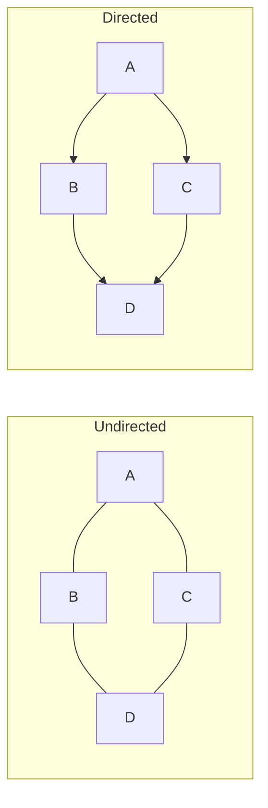
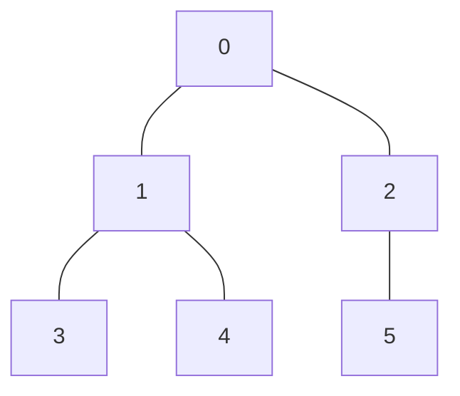

# Chapter 27: Graph Algorithms — Navigating Connections

> "In mathematics, the art of asking questions is more valuable than solving problems." — Georg Cantor

---

## Overview

Graphs are everywhere. The internet is a graph of computers connected by cables and wireless links. Your social network is a graph of people connected by friendships. A city's road network is a graph of intersections connected by roads. And inside your compiler — the Astra compiler we are building — graphs appear in the form of import dependencies, call graphs, and control-flow graphs.

This chapter is a complete, beginner-friendly tour of graph algorithms. We will start from scratch: what is a graph, how do we store it in memory, and how do we traverse it? Then we will build up to the classic algorithms: BFS, DFS, topological sort, cycle detection, Dijkstra's shortest path, Bellman-Ford, and Floyd-Warshall. Every algorithm comes with a complete Go implementation and an ASCII diagram so you can see exactly what is happening.

By the end of this chapter you will be able to implement three critical pieces of the Astra compiler that rely directly on graph algorithms: circular import detection, compilation order determination, and dead code elimination.

---

## What We Are Building

By the end of this chapter you will have:

- A complete graph library in Go (adjacency list representation)
- A working BFS and DFS implementation
- A topological sort using Kahn's algorithm
- Cycle detection using the three-color DFS approach
- Dijkstra's shortest path using a min-heap priority queue
- Bellman-Ford and Floyd-Warshall for special cases
- Three complete, production-quality compiler components:
  1. Circular import detector for the Astra compiler
  2. Compilation order resolver (topological sort of import graph)
  3. Dead code eliminator (DFS reachability analysis)

---

## Table of Contents

1. Graphs — The Fundamentals
2. Representing Graphs in Go
3. Breadth-First Search (BFS)
4. Depth-First Search (DFS)
5. Topological Sort
6. Cycle Detection
7. Dijkstra's Shortest Path
8. Bellman-Ford Algorithm
9. Floyd-Warshall Algorithm
10. Astra Build Milestone: Three Compiler Uses of Graph Algorithms

---

## 1. Graphs — The Fundamentals

A graph is a collection of **vertices** (also called nodes) and **edges** (connections between vertices). That is literally it. The simplicity of the definition belies the enormous power of the concept.

Let us pin down some vocabulary you will see throughout this chapter:

**Directed vs Undirected**

In an **undirected graph**, edges have no direction. If there is an edge between A and B, you can travel from A to B or from B to A. Think of a two-way street.

In a **directed graph** (also called a digraph), each edge has a direction, like a one-way street. An edge from A to B means you can go from A to B but not necessarily from B to A.



**Weighted vs Unweighted**

A **weighted graph** has a number (weight or cost) associated with each edge. Think of a road map where edges represent roads and weights represent distances in kilometers. An **unweighted graph** treats all edges as equal.

**Key Terminology**

- **Path**: A sequence of vertices where each consecutive pair is connected by an edge.
- **Cycle**: A path that starts and ends at the same vertex.
- **Connected graph**: Every vertex can be reached from every other vertex (undirected).
- **Strongly connected**: In a directed graph, every vertex can reach every other vertex.
- **DAG (Directed Acyclic Graph)**: A directed graph with no cycles. This is critically important for topological sort.
- **Degree**: The number of edges connected to a vertex. In directed graphs, we have **in-degree** (edges coming in) and **out-degree** (edges going out).
- **V**: The number of vertices in a graph.
- **E**: The number of edges in a graph.

**Why does the Astra compiler care about graphs?**

When you write Astra code that imports packages, you create a dependency graph. Package A imports B and C, package B imports D — this forms a directed graph. The compiler needs to:

1. Detect circular dependencies (cycles in the import graph)
2. Compile packages in the right order (topological sort)
3. Find which functions are actually reachable from `main` (DFS for dead code elimination)

Understanding graph algorithms is not academic fluff — it is a direct prerequisite for building a real compiler.

---

## 2. Representing Graphs in Go

There are two standard ways to represent a graph in memory. Choosing the right one matters for performance.

### Adjacency Matrix

A 2D array where `matrix[i][j] = 1` means there is an edge from vertex i to vertex j.

```
Graph:          Matrix (0-indexed):
0 --> 1         [0, 1, 0, 0]
0 --> 2         [0, 0, 1, 0]
1 --> 2         [0, 0, 0, 1]
2 --> 3         [0, 0, 0, 0]

Space: O(V²)
Edge lookup: O(1)
Listing neighbors: O(V)
```

Good for dense graphs. Bad for sparse graphs (most real-world graphs are sparse).

### Adjacency List

Each vertex stores a list of its neighbors.

```
Graph:          Adjacency List:
0 --> 1         0: [1, 2]
0 --> 2         1: [2]
1 --> 2         2: [3]
2 --> 3         3: []

Space: O(V + E)
Edge lookup: O(degree)
Listing neighbors: O(degree)
```

Much better for sparse graphs. This is what we will use.

Here is a complete Go graph implementation:

```go
package graph

import "fmt"

// Graph represents a directed or undirected graph using adjacency lists.
type Graph struct {
    numVertices int
    adjacency   [][]int // adjacency[v] = list of vertices v points to
    directed    bool
}

// NewGraph creates a new graph with numVertices vertices.
func NewGraph(numVertices int, directed bool) *Graph {
    adj := make([][]int, numVertices)
    for i := range adj {
        adj[i] = []int{}
    }
    return &Graph{
        numVertices: numVertices,
        adjacency:   adj,
        directed:    directed,
    }
}

// AddEdge adds an edge from u to v.
func (g *Graph) AddEdge(u, v int) {
    g.adjacency[u] = append(g.adjacency[u], v)
    if !g.directed {
        g.adjacency[v] = append(g.adjacency[v], u)
    }
}

// Neighbors returns all vertices adjacent to v.
func (g *Graph) Neighbors(v int) []int {
    return g.adjacency[v]
}

// Print displays the graph's adjacency list.
func (g *Graph) Print() {
    for i, neighbors := range g.adjacency {
        fmt.Printf("%d → %v\n", i, neighbors)
    }
}
```

For weighted graphs, we extend this with an edge weight:

```go
// WeightedEdge represents an edge with a weight (used for Dijkstra and Bellman-Ford).
type WeightedEdge struct {
    To     int
    Weight int
}

// WeightedGraph is a directed weighted graph.
type WeightedGraph struct {
    numVertices int
    adjacency   [][]WeightedEdge
}

func NewWeightedGraph(numVertices int) *WeightedGraph {
    adj := make([][]WeightedEdge, numVertices)
    for i := range adj {
        adj[i] = []WeightedEdge{}
    }
    return &WeightedGraph{numVertices: numVertices, adjacency: adj}
}

func (g *WeightedGraph) AddEdge(from, to, weight int) {
    g.adjacency[from] = append(g.adjacency[from], WeightedEdge{To: to, Weight: weight})
}
```

---

## 3. Breadth-First Search (BFS)

### The Intuition

Imagine you drop a stone in a pond. Ripples spread outward in concentric circles, each ring a little farther from the center than the last. BFS works the same way. Starting from a source vertex, it visits all vertices at distance 1 first, then all vertices at distance 2, then distance 3, and so on.

This "level by level" traversal is achieved using a **queue** (First-In, First-Out).

### The Algorithm

```
BFS(graph, start):
  1. Create a queue Q and enqueue start
  2. Mark start as visited
  3. While Q is not empty:
     a. Dequeue a vertex u from Q
     b. For each neighbor v of u:
        - If v is not visited:
          - Mark v as visited
          - Record distance[v] = distance[u] + 1
          - Record parent[v] = u
          - Enqueue v
```

### ASCII Diagram: BFS Traversal

Consider this graph:



BFS from vertex 0:

```
Step 1: Queue = [0],          Visited = {0},          Distance = {0:0}
Step 2: Dequeue 0, neighbors 1,2
        Queue = [1, 2],        Visited = {0,1,2},      Distance = {0:0, 1:1, 2:1}
Step 3: Dequeue 1, neighbors 3,4
        Queue = [2, 3, 4],     Visited = {0,1,2,3,4},  Distance = {0:0,1:1,2:1,3:2,4:2}
Step 4: Dequeue 2, neighbor 5
        Queue = [3, 4, 5],     Visited = {0..5},        Distance = {0:0,1:1,2:1,3:2,4:2,5:2}
Step 5: Dequeue 3, no unvisited neighbors.  Queue = [4, 5]
Step 6: Dequeue 4, no unvisited neighbors.  Queue = [5]
Step 7: Dequeue 5, no unvisited neighbors.  Queue = []
Done. BFS order: 0, 1, 2, 3, 4, 5
```

### Complexity

- **Time**: O(V + E) — we visit each vertex once and each edge once.
- **Space**: O(V) — the queue can hold at most V vertices; visited and distance arrays are O(V).

### Applications

- **Shortest path in unweighted graphs**: BFS always finds the shortest (fewest edges) path from source to any vertex.
- **Level-order traversal of trees**: Trees are just graphs; BFS gives level order.
- **Social network degrees of separation**: Facebook's "friend of a friend" uses BFS.
- **Web crawling**: Start from one page, explore all links at depth 1, then depth 2, etc.

### Complete Go Implementation

```go
package graph

// BFSResult stores the output of a BFS traversal.
type BFSResult struct {
    Visited  []bool  // visited[v] = true if v was reachable from start
    Distance []int   // distance[v] = shortest path length from start to v
    Parent   []int   // parent[v] = the vertex we came from; -1 for start/unreachable
}

// BFS performs breadth-first search from vertex start.
func (g *Graph) BFS(start int) BFSResult {
    visited := make([]bool, g.numVertices)
    distance := make([]int, g.numVertices)
    parent := make([]int, g.numVertices)

    // Initialize all distances to -1 (unreachable) and parents to -1
    for i := range distance {
        distance[i] = -1
        parent[i] = -1
    }

    // Use a slice as a queue (simple and effective for most purposes)
    queue := []int{start}
    visited[start] = true
    distance[start] = 0

    for len(queue) > 0 {
        // Dequeue the front element
        u := queue[0]
        queue = queue[1:]

        // Explore all neighbors of u
        for _, v := range g.Neighbors(u) {
            if !visited[v] {
                visited[v] = true
                distance[v] = distance[u] + 1
                parent[v] = u
                queue = append(queue, v)
            }
        }
    }

    return BFSResult{
        Visited:  visited,
        Distance: distance,
        Parent:   parent,
    }
}

// ShortestPath returns the shortest path from start to end using BFS.
// Returns nil if no path exists.
func (g *Graph) ShortestPath(start, end int) []int {
    result := g.BFS(start)
    if !result.Visited[end] {
        return nil // no path exists
    }

    // Reconstruct the path by following parent pointers backward
    path := []int{}
    for v := end; v != -1; v = result.Parent[v] {
        path = append([]int{v}, path...) // prepend
    }
    return path
}
```

---

## 4. Depth-First Search (DFS)

### The Intuition

If BFS is a ripple spreading outward, DFS is an explorer who always goes as deep as possible before turning back. Think of solving a maze: you pick a direction and keep going until you hit a dead end, then backtrack and try another direction.

DFS naturally uses a **stack**. In the recursive version, the call stack IS the stack. We can also write an iterative version with an explicit stack.

### Recursive DFS

```
DFS(graph, u, visited):
  1. Mark u as visited
  2. For each neighbor v of u:
     - If v is not visited:
       - DFS(graph, v, visited)
```

### ASCII Diagram: DFS Traversal

Same graph as before:


DFS from vertex 0 (assuming neighbors are processed left to right):

```
Visit 0  → recurse to neighbor 1
  Visit 1  → recurse to neighbor 3
    Visit 3  → no unvisited neighbors, return
  Back at 1 → recurse to neighbor 4
    Visit 4  → no unvisited neighbors, return
  Back at 1 → done, return
Back at 0 → recurse to neighbor 2
  Visit 2  → recurse to neighbor 5
    Visit 5  → no unvisited neighbors, return
  Back at 2 → done, return
Back at 0 → done.

DFS pre-order: 0, 1, 3, 4, 2, 5
DFS post-order: 3, 4, 1, 5, 2, 0  ← crucial for topological sort!
```

The **post-order** (a vertex is recorded after all its descendants are finished) is what we need for topological sort. Keep this in mind.

### Pre-order vs Post-order

- **Pre-order**: Record the vertex the moment you enter it. Good for copying/searching trees.
- **Post-order**: Record the vertex after all its subtree is done. Good for topological sort, expression evaluation.

### Complexity

- **Time**: O(V + E)
- **Space**: O(V) for the visited array and the recursion stack (depth can be at most V)

### Applications

- **Cycle detection**
- **Topological sort**
- **Finding connected components**
- **Maze solving**
- **Strongly connected components** (Kosaraju's, Tarjan's)

### Complete Go Implementation

```go
// DFSResult stores output of a DFS traversal.
type DFSResult struct {
    Visited    []bool
    PreOrder   []int // vertices in the order they were first visited
    PostOrder  []int // vertices in the order they finished
    Parent     []int
}

// DFS performs depth-first search from start vertex.
func (g *Graph) DFS(start int) DFSResult {
    visited := make([]bool, g.numVertices)
    parent := make([]int, g.numVertices)
    preOrder := []int{}
    postOrder := []int{}

    for i := range parent {
        parent[i] = -1
    }

    var dfsHelper func(u int)
    dfsHelper = func(u int) {
        visited[u] = true
        preOrder = append(preOrder, u) // record on entry

        for _, v := range g.Neighbors(u) {
            if !visited[v] {
                parent[v] = u
                dfsHelper(v)
            }
        }

        postOrder = append(postOrder, u) // record on exit
    }

    dfsHelper(start)
    return DFSResult{
        Visited:   visited,
        PreOrder:  preOrder,
        PostOrder: postOrder,
        Parent:    parent,
    }
}

// DFSAll runs DFS from every unvisited vertex, discovering all components.
func (g *Graph) DFSAll() DFSResult {
    visited := make([]bool, g.numVertices)
    parent := make([]int, g.numVertices)
    preOrder := []int{}
    postOrder := []int{}

    for i := range parent {
        parent[i] = -1
    }

    var dfsHelper func(u int)
    dfsHelper = func(u int) {
        visited[u] = true
        preOrder = append(preOrder, u)
        for _, v := range g.Neighbors(u) {
            if !visited[v] {
                parent[v] = u
                dfsHelper(v)
            }
        }
        postOrder = append(postOrder, u)
    }

    for v := 0; v < g.numVertices; v++ {
        if !visited[v] {
            dfsHelper(v)
        }
    }

    return DFSResult{
        Visited:   visited,
        PreOrder:  preOrder,
        PostOrder: postOrder,
        Parent:    parent,
    }
}

// DFSIterative is a non-recursive DFS using an explicit stack.
// Note: this produces pre-order, not the same as recursive DFS in all cases.
func (g *Graph) DFSIterative(start int) []int {
    visited := make([]bool, g.numVertices)
    order := []int{}

    stack := []int{start}
    for len(stack) > 0 {
        // Pop from top
        u := stack[len(stack)-1]
        stack = stack[:len(stack)-1]

        if visited[u] {
            continue
        }
        visited[u] = true
        order = append(order, u)

        // Push neighbors in reverse order so we process them left-to-right
        neighbors := g.Neighbors(u)
        for i := len(neighbors) - 1; i >= 0; i-- {
            if !visited[neighbors[i]] {
                stack = append(stack, neighbors[i])
            }
        }
    }
    return order
}
```

---

## 5. Topological Sort

### What Is It?

A **topological sort** of a directed acyclic graph (DAG) is a linear ordering of all vertices such that for every directed edge from U to V, U comes before V in the ordering.

Think of it as: if U depends on V (U → V means "U must come after V"), topological sort gives you an order where dependencies are satisfied.

**Critical constraint**: Topological sort is only possible on DAGs. If there is a cycle, there is no valid ordering — you cannot have A before B and B before A simultaneously.

### Why Does This Matter for Astra?

If package A imports B and B imports C, you must compile C first, then B, then A. The topological sort of the import graph gives you the compilation order.

```
Import graph:          Valid compilation orders:
A → B → C             C, B, A   (the topological sort)
A → C
```

### Kahn's Algorithm (BFS-based)

Kahn's algorithm is elegant. The core insight: any vertex with in-degree 0 (nothing depends on it; it depends on nothing) can be compiled first. After we "compile" it, we reduce the in-degree of its dependents. The next vertices with in-degree 0 can then be processed, and so on.

```
Kahn's Algorithm:
1. Compute in-degree for every vertex
2. Enqueue all vertices with in-degree 0
3. While queue is not empty:
   a. Dequeue vertex u → add to result
   b. For each neighbor v of u:
      - Decrement in-degree[v]
      - If in-degree[v] == 0, enqueue v
4. If result contains all vertices → success (DAG)
   If result is smaller → graph has a cycle!
```

### ASCII Diagram: Kahn's Algorithm

```
Graph (import dependencies, edge = "imports"):
main → utils
main → math
math → utils
utils has no imports

In-degrees:
  main:  0  (nothing imports main)
  utils: 2  (main and math both import utils)
  math:  1  (main imports math)

Step 1: in-degree 0 → enqueue [main]
Step 2: Process main → result=[main]
        Decrement math's in-degree: 1→0, enqueue math
        Decrement utils's in-degree: 2→1
        Queue: [math]
Step 3: Process math → result=[main, math]
        Decrement utils's in-degree: 1→0, enqueue utils
        Queue: [utils]
Step 4: Process utils → result=[main, math, utils]
        Queue: []

Reverse = compilation order: utils, math, main  ✓
```

### Complete Go Implementation

```go
// TopologicalSort returns vertices in topological order using Kahn's algorithm.
// Returns (order, true) if the graph is a DAG, or (nil, false) if there is a cycle.
func (g *Graph) TopologicalSort() ([]int, bool) {
    // Step 1: compute in-degrees
    inDegree := make([]int, g.numVertices)
    for u := 0; u < g.numVertices; u++ {
        for _, v := range g.Neighbors(u) {
            inDegree[v]++
        }
    }

    // Step 2: enqueue all vertices with in-degree 0
    queue := []int{}
    for v, deg := range inDegree {
        if deg == 0 {
            queue = append(queue, v)
        }
    }

    // Step 3: process queue
    result := []int{}
    for len(queue) > 0 {
        u := queue[0]
        queue = queue[1:]
        result = append(result, u)

        for _, v := range g.Neighbors(u) {
            inDegree[v]--
            if inDegree[v] == 0 {
                queue = append(queue, v)
            }
        }
    }

    // Step 4: if result doesn't contain all vertices, there's a cycle
    if len(result) != g.numVertices {
        return nil, false // cycle detected
    }
    return result, true
}
```

### DFS-based Topological Sort

There is an alternative approach: run DFS on all vertices and collect the **post-order**. Then reverse it. The reversed post-order IS the topological sort.

```go
// TopologicalSortDFS returns topological order using DFS post-order.
func (g *Graph) TopologicalSortDFS() ([]int, bool) {
    result := g.DFSAll()
    if !g.HasCycle() { // we'll implement HasCycle next
        // reverse post-order
        post := result.PostOrder
        for i, j := 0, len(post)-1; i < j; i, j = i+1, j-1 {
            post[i], post[j] = post[j], post[i]
        }
        return post, true
    }
    return nil, false
}
```

---

## 6. Cycle Detection

### In Directed Graphs: Three-Color DFS

For directed graphs, we use three "colors" to track the state of each vertex during DFS:

- **WHITE (0)**: Not yet visited.
- **GRAY (1)**: Currently being explored (on the DFS call stack).
- **BLACK (2)**: Fully explored (all descendants done).

A **back edge** (an edge to a GRAY vertex) indicates a cycle: we found an ancestor that is still on the current DFS path.

```
Example cycle:  A → B → C → A

DFS from A:
  Color[A] = GRAY
  Visit B:
    Color[B] = GRAY
    Visit C:
      Color[C] = GRAY
      Visit A:  → Color[A] == GRAY → CYCLE DETECTED!
```

```go
// HasCycle returns true if the directed graph contains a cycle.
func (g *Graph) HasCycle() bool {
    // 0 = white, 1 = gray, 2 = black
    color := make([]int, g.numVertices)

    var dfs func(u int) bool
    dfs = func(u int) bool {
        color[u] = 1 // gray: currently visiting
        for _, v := range g.Neighbors(u) {
            if color[v] == 1 {
                return true // back edge found → cycle!
            }
            if color[v] == 0 {
                if dfs(v) {
                    return true
                }
            }
        }
        color[u] = 2 // black: fully explored
        return false
    }

    for v := 0; v < g.numVertices; v++ {
        if color[v] == 0 {
            if dfs(v) {
                return true
            }
        }
    }
    return false
}
```

### In Undirected Graphs: DFS with Parent Tracking

In an undirected graph, every edge shows up in both directions in the adjacency list. So when we are at vertex u (came from parent p), we must NOT flag the edge back to p as a cycle — that is just the edge we used to get here.

```go
// HasCycleUndirected returns true if the undirected graph contains a cycle.
func (g *Graph) HasCycleUndirected() bool {
    visited := make([]bool, g.numVertices)

    var dfs func(u, parent int) bool
    dfs = func(u, parent int) bool {
        visited[u] = true
        for _, v := range g.Neighbors(u) {
            if !visited[v] {
                if dfs(v, u) {
                    return true
                }
            } else if v != parent {
                // visited and not the parent → cycle!
                return true
            }
        }
        return false
    }

    for v := 0; v < g.numVertices; v++ {
        if !visited[v] {
            if dfs(v, -1) {
                return true
            }
        }
    }
    return false
}
```

---

## 7. Dijkstra's Shortest Path

### The Problem

BFS finds shortest paths in unweighted graphs. But what if edges have different weights (costs)? We need **Dijkstra's algorithm**.

**Key constraint**: All edge weights must be non-negative. Dijkstra breaks with negative weights.

### The Intuition

Dijkstra's is a greedy algorithm. It maintains a set of vertices whose shortest distance from the source is already known. At each step, it picks the unfinished vertex with the smallest known distance, "finalizes" it, and updates the distances of its neighbors.

Think of it as: at each step, we always process the nearest unvisited city on a map.

### The Algorithm

```
Dijkstra(graph, source):
1. dist[source] = 0, dist[all others] = ∞
2. Create a min-priority queue with (dist, vertex)
3. While priority queue is not empty:
   a. Extract vertex u with minimum dist
   b. For each neighbor v with edge weight w:
      - If dist[u] + w < dist[v]:
        - dist[v] = dist[u] + w
        - parent[v] = u
        - Add (dist[v], v) to priority queue
```

### ASCII Diagram: Step-by-Step Example

```
Graph:
    0 --4-- 1
    |       |
    2       3
    |       |
    3 --5-- 2

Weights: (0→1)=4, (0→3)=2, (1→2)=3, (3→2)=5, (3→1)=1

Source = 0

Initial: dist = [0, ∞, ∞, ∞], PQ = [(0, 0)]

Step 1: Extract (0, 0). Process vertex 0.
  Neighbor 1: dist[0]+4=4 < ∞ → dist[1]=4, parent[1]=0
  Neighbor 3: dist[0]+2=2 < ∞ → dist[3]=2, parent[3]=0
  PQ = [(2,3), (4,1)]
  dist = [0, 4, ∞, 2]

Step 2: Extract (2, 3). Process vertex 3.
  Neighbor 2: dist[3]+5=7 < ∞ → dist[2]=7, parent[2]=3
  Neighbor 1: dist[3]+1=3 < 4 → dist[1]=3, parent[1]=3  ← shorter path!
  PQ = [(3,1), (4,1-stale), (7,2)]
  dist = [0, 3, 7, 2]

Step 3: Extract (3, 1). Process vertex 1.
  Neighbor 2: dist[1]+3=6 < 7 → dist[2]=6, parent[2]=1
  PQ = [(4,1-stale), (6,2), (7,2-stale)]
  dist = [0, 3, 6, 2]

Step 4: Extract (4, 1) — already finalized, skip.
Step 5: Extract (6, 2). Process vertex 2. No improvements.
Step 6: Extract (7, 2) — already finalized, skip.

Final distances: 0→0, 1→3, 2→6, 3→2
Shortest path from 0 to 2: 0 → 3 → 1 → 2
```

### Complete Go Implementation

```go
package graph

import "container/heap"

// Item in the priority queue: (priority/distance, vertex)
type PQItem struct {
    vertex   int
    priority int
    index    int // index in the heap (required by container/heap)
}

// PriorityQueue implements heap.Interface for Dijkstra.
type PriorityQueue []*PQItem

func (pq PriorityQueue) Len() int { return len(pq) }
func (pq PriorityQueue) Less(i, j int) bool {
    return pq[i].priority < pq[j].priority // min-heap
}
func (pq PriorityQueue) Swap(i, j int) {
    pq[i], pq[j] = pq[j], pq[i]
    pq[i].index = i
    pq[j].index = j
}
func (pq *PriorityQueue) Push(x interface{}) {
    item := x.(*PQItem)
    item.index = len(*pq)
    *pq = append(*pq, item)
}
func (pq *PriorityQueue) Pop() interface{} {
    old := *pq
    n := len(old)
    item := old[n-1]
    *pq = old[:n-1]
    return item
}

const INF = 1<<62 - 1 // a very large number representing "unreachable"

// Dijkstra computes shortest paths from source in a weighted graph.
// Returns (dist, parent) where dist[v] is the shortest distance and
// parent[v] is the previous vertex on the shortest path.
func (g *WeightedGraph) Dijkstra(source int) ([]int, []int) {
    dist := make([]int, g.numVertices)
    parent := make([]int, g.numVertices)
    finalized := make([]bool, g.numVertices)

    for i := range dist {
        dist[i] = INF
        parent[i] = -1
    }
    dist[source] = 0

    pq := &PriorityQueue{}
    heap.Init(pq)
    heap.Push(pq, &PQItem{vertex: source, priority: 0})

    for pq.Len() > 0 {
        item := heap.Pop(pq).(*PQItem)
        u := item.vertex

        // Skip stale entries (vertex already finalized)
        if finalized[u] {
            continue
        }
        finalized[u] = true

        for _, edge := range g.adjacency[u] {
            v := edge.To
            w := edge.Weight
            newDist := dist[u] + w
            if newDist < dist[v] {
                dist[v] = newDist
                parent[v] = u
                heap.Push(pq, &PQItem{vertex: v, priority: newDist})
            }
        }
    }

    return dist, parent
}

// ShortestPathWeighted reconstructs the path from source to dest.
func (g *WeightedGraph) ShortestPathWeighted(source, dest int) (int, []int) {
    dist, parent := g.Dijkstra(source)
    if dist[dest] == INF {
        return -1, nil
    }
    path := []int{}
    for v := dest; v != -1; v = parent[v] {
        path = append([]int{v}, path...)
    }
    return dist[dest], path
}
```

**Complexity**: O((V + E) log V) with a binary heap priority queue. The log V factor comes from heap operations.

---

## 8. Bellman-Ford Algorithm

Dijkstra fails when edge weights are negative. Bellman-Ford handles negative weights and can also **detect negative cycles** (cycles whose total weight is negative — you could go around them forever to get an infinitely short path, which is meaningless).

### The Algorithm

```
Bellman-Ford(graph, source):
1. dist[source] = 0, dist[all others] = ∞
2. Repeat V-1 times:
   For every edge (u, v, w):
     If dist[u] + w < dist[v]:
       dist[v] = dist[u] + w
3. For every edge (u, v, w):
   If dist[u] + w < dist[v]:
     → negative cycle detected!
```

The key insight: the shortest path can have at most V-1 edges (otherwise it would revisit a vertex, forming a cycle). So relaxing all edges V-1 times is sufficient to find all shortest paths.

**Complexity**: O(V * E) — much slower than Dijkstra, but more general.

```go
// BellmanFord computes shortest paths, handling negative weights.
// Returns (dist, parent, hasNegativeCycle).
func (g *WeightedGraph) BellmanFord(source int) ([]int, []int, bool) {
    dist := make([]int, g.numVertices)
    parent := make([]int, g.numVertices)

    for i := range dist {
        dist[i] = INF
        parent[i] = -1
    }
    dist[source] = 0

    // Relax all edges V-1 times
    for iteration := 0; iteration < g.numVertices-1; iteration++ {
        updated := false
        for u := 0; u < g.numVertices; u++ {
            if dist[u] == INF {
                continue // can't relax edges from unreachable vertices
            }
            for _, edge := range g.adjacency[u] {
                v, w := edge.To, edge.Weight
                if dist[u]+w < dist[v] {
                    dist[v] = dist[u] + w
                    parent[v] = u
                    updated = true
                }
            }
        }
        if !updated {
            break // early termination if no improvement
        }
    }

    // Check for negative cycles: if we can still relax, there is one
    for u := 0; u < g.numVertices; u++ {
        if dist[u] == INF {
            continue
        }
        for _, edge := range g.adjacency[u] {
            if dist[u]+edge.Weight < dist[edge.To] {
                return dist, parent, true // negative cycle!
            }
        }
    }

    return dist, parent, false
}
```

---

## 9. Floyd-Warshall Algorithm

Dijkstra and Bellman-Ford compute shortest paths from ONE source. Floyd-Warshall computes **all-pairs shortest paths** — the shortest distance between every pair of vertices simultaneously.

It uses **dynamic programming**: `dist[i][j][k]` = shortest path from i to j using only vertices 0..k as intermediaries.

The transition: `dist[i][j] = min(dist[i][j], dist[i][k] + dist[k][j])`

**Complexity**: O(V³) in both time and the initialization. Only practical for small graphs (V < 500).

```go
// FloydWarshall computes all-pairs shortest paths.
// Returns a 2D matrix where dist[i][j] = shortest distance from i to j.
func FloydWarshall(numVertices int, edges [][]int) [][]int {
    // Initialize distance matrix
    dist := make([][]int, numVertices)
    for i := range dist {
        dist[i] = make([]int, numVertices)
        for j := range dist[i] {
            if i == j {
                dist[i][j] = 0
            } else {
                dist[i][j] = INF
            }
        }
    }

    // Fill in known edges: edges[i] = {from, to, weight}
    for _, edge := range edges {
        from, to, weight := edge[0], edge[1], edge[2]
        dist[from][to] = weight
    }

    // Floyd-Warshall main loop: try each vertex k as an intermediate
    for k := 0; k < numVertices; k++ {
        for i := 0; i < numVertices; i++ {
            for j := 0; j < numVertices; j++ {
                if dist[i][k] != INF && dist[k][j] != INF {
                    if dist[i][k]+dist[k][j] < dist[i][j] {
                        dist[i][j] = dist[i][k] + dist[k][j]
                    }
                }
            }
        }
    }

    // Detect negative cycles: if dist[i][i] < 0, there is one
    for i := 0; i < numVertices; i++ {
        if dist[i][i] < 0 {
            return nil // negative cycle
        }
    }

    return dist
}
```

**When to use which algorithm**:

```
Algorithm       | Weights      | Source   | Complexity    | Notes
────────────────┼──────────────┼──────────┼───────────────┼──────────────────────
BFS             | unweighted   | single   | O(V+E)        | simplest
Dijkstra        | non-negative | single   | O((V+E)log V) | most common
Bellman-Ford    | any          | single   | O(V·E)        | detects neg cycles
Floyd-Warshall  | any          | all pairs| O(V³)         | small graphs only
```

---

## Astra Build Milestone

### Three Critical Compiler Uses of Graph Algorithms

The Astra compiler's semantic analysis and optimization phases are fundamentally graph problems. Let us implement all three.

#### 1. Circular Import Detection

If package A imports B and B imports A, neither can be compiled first. This is a cycle in the import graph, and the compiler must detect and report it clearly.

```go
// compiler/resolver/import_graph.go

package resolver

import "fmt"

// ImportGraph tracks which packages import which other packages.
type ImportGraph struct {
    // adjacency[pkg] = list of packages that pkg imports
    adjacency map[string][]string
}

// NewImportGraph creates an empty import graph.
func NewImportGraph() *ImportGraph {
    return &ImportGraph{adjacency: make(map[string][]string)}
}

// AddImport records that package `from` imports package `to`.
func (ig *ImportGraph) AddImport(from, to string) {
    ig.adjacency[from] = append(ig.adjacency[from], to)
    // Ensure `to` exists in the map even if it imports nothing
    if _, exists := ig.adjacency[to]; !exists {
        ig.adjacency[to] = []string{}
    }
}

// DetectCircularImports uses three-color DFS to find cycles.
// Returns an error describing the cycle, or nil if the graph is acyclic.
func (ig *ImportGraph) DetectCircularImports() error {
    const (
        WHITE = 0 // not yet visited
        GRAY  = 1 // currently in DFS stack (being explored)
        BLACK = 2 // fully explored
    )

    color := make(map[string]int)
    // Track the DFS path for reporting the cycle clearly
    path := []string{}

    var dfs func(pkg string) error
    dfs = func(pkg string) error {
        color[pkg] = GRAY
        path = append(path, pkg)

        for _, dep := range ig.adjacency[pkg] {
            if color[dep] == GRAY {
                // Found a back edge → cycle!
                // Find where the cycle starts in our path
                cycleStart := -1
                for i, p := range path {
                    if p == dep {
                        cycleStart = i
                        break
                    }
                }
                cyclePath := path[cycleStart:]
                return fmt.Errorf(
                    "circular import detected: %s → %s\n  full cycle: %v → %s",
                    dep, pkg, cyclePath, dep,
                )
            }
            if color[dep] == WHITE {
                if err := dfs(dep); err != nil {
                    return err
                }
            }
        }

        path = path[:len(path)-1] // pop from path
        color[pkg] = BLACK
        return nil
    }

    // Run DFS from every unvisited package
    for pkg := range ig.adjacency {
        if color[pkg] == WHITE {
            if err := dfs(pkg); err != nil {
                return err
            }
        }
    }
    return nil
}
```

Usage in the compiler:

```go
// In the Astra compiler's main compilation pipeline:
func (c *Compiler) resolveImports(files []*AstraFile) error {
    ig := resolver.NewImportGraph()
    for _, file := range files {
        for _, imp := range file.Imports {
            ig.AddImport(file.Package, imp.Path)
        }
    }
    if err := ig.DetectCircularImports(); err != nil {
        return fmt.Errorf("import error: %w", err)
    }
    return nil
}
```

Example error output when A → B → A:

```
Error: import error: circular import detected: A → B
  full cycle: [A B] → A
```

#### 2. Compilation Order via Topological Sort

After verifying there are no cycles, we sort the import graph to determine which package to compile first.

```go
// CompilationOrder returns packages in the order they should be compiled.
// Packages with no dependencies come first.
func (ig *ImportGraph) CompilationOrder() ([]string, error) {
    // First check for cycles
    if err := ig.DetectCircularImports(); err != nil {
        return nil, err
    }

    // Compute in-degrees
    inDegree := make(map[string]int)
    for pkg := range ig.adjacency {
        if _, exists := inDegree[pkg]; !exists {
            inDegree[pkg] = 0
        }
        for _, dep := range ig.adjacency[pkg] {
            inDegree[dep]++
        }
    }

    // Kahn's algorithm
    queue := []string{}
    for pkg, deg := range inDegree {
        if deg == 0 {
            queue = append(queue, pkg)
        }
    }
    // Sort queue for deterministic output (important for reproducible builds)
    sort.Strings(queue)

    order := []string{}
    for len(queue) > 0 {
        pkg := queue[0]
        queue = queue[1:]
        order = append(order, pkg)

        // Decrease in-degree for packages that depend on pkg
        // But since edges go FROM importer TO importee, we need to think carefully:
        // ig.adjacency[pkg] = what pkg imports = pkg's dependencies
        // We want: all packages that import pkg (reverse direction)
        // For topological sort, we process in reverse import direction
        // (compile dependencies before importers)
    }

    // Reverse: we want dependencies first, importers last
    for i, j := 0, len(order)-1; i < j; i, j = i+1, j-1 {
        order[i], order[j] = order[j], order[i]
    }

    return order, nil
}
```

#### 3. Dead Code Elimination via DFS Reachability

Any function not reachable from `main` is dead code and can be eliminated, making the binary smaller.

```go
// compiler/optimizer/dead_code.go

package optimizer

// CallGraph tracks which functions call which other functions.
type CallGraph struct {
    adjacency map[string][]string // adjacency[fn] = list of functions fn calls
    allFuncs  map[string]bool     // set of all functions in the program
}

func NewCallGraph() *CallGraph {
    return &CallGraph{
        adjacency: make(map[string][]string),
        allFuncs:  make(map[string]bool),
    }
}

func (cg *CallGraph) AddFunction(name string) {
    cg.allFuncs[name] = true
    if _, exists := cg.adjacency[name]; !exists {
        cg.adjacency[name] = []string{}
    }
}

func (cg *CallGraph) AddCall(caller, callee string) {
    cg.adjacency[caller] = append(cg.adjacency[caller], callee)
}

// FindDeadFunctions returns functions not reachable from entryPoint.
func (cg *CallGraph) FindDeadFunctions(entryPoint string) []string {
    // DFS from entryPoint to find all reachable functions
    visited := make(map[string]bool)

    var dfs func(fn string)
    dfs = func(fn string) {
        if visited[fn] {
            return
        }
        visited[fn] = true
        for _, callee := range cg.adjacency[fn] {
            dfs(callee)
        }
    }

    dfs(entryPoint)

    // Any function not visited is dead code
    dead := []string{}
    for fn := range cg.allFuncs {
        if !visited[fn] {
            dead = append(dead, fn)
        }
    }
    sort.Strings(dead) // deterministic output
    return dead
}
```

Example: in a program where `main` calls `add` and `multiply`, but `unusedHelper` is never called:

```go
cg := NewCallGraph()
cg.AddFunction("main")
cg.AddFunction("add")
cg.AddFunction("multiply")
cg.AddFunction("unusedHelper")

cg.AddCall("main", "add")
cg.AddCall("main", "multiply")
// unusedHelper is never called

dead := cg.FindDeadFunctions("main")
// dead = ["unusedHelper"]
fmt.Println("Dead code:", dead) // Dead code: [unusedHelper]
```

---

## Astra Build Milestone Exercises

1. **BFS shortest import path**: Given the import graph, use BFS to find the minimum number of import hops between two packages. Useful for understanding transitive dependencies.

2. **All connected components**: Write a function `FindPackageClusters(ig *ImportGraph) [][]string` that groups packages into connected components. Packages that never interact with each other form separate clusters.

3. **Strongly connected components**: Implement Kosaraju's algorithm (two-pass DFS) to find groups of mutually-importing packages (though these would all be circular imports in a well-formed program).

4. **Weighted compilation priority**: Extend the import graph to include compile-time estimates for each package. Use Dijkstra's to find the critical path (the sequence of dependencies that takes longest) to optimize parallel compilation.

5. **Call graph construction**: Walk the AST of an Astra program to automatically build the call graph (as used in dead code elimination). Hook this up to the Astra AST walker from Chapter 56.

6. **Negative cycle in costs**: Model function inlining as a weighted graph where the weight of an edge from `caller` to `callee` is the size increase from inlining. Use Bellman-Ford to detect if there is a sequence of inlining decisions that would lead to a shrinking binary (a "beneficial cycle").

---

## Summary Table

| Algorithm | Strategy | Time | Space | Key Use in Astra |
|---|---|---|---|---|
| BFS | Queue, level by level | O(V+E) | O(V) | Shortest import path |
| DFS | Recursion/stack, deep first | O(V+E) | O(V) | Dead code elimination |
| Topological sort (Kahn) | BFS + in-degrees | O(V+E) | O(V) | Compilation order |
| Topological sort (DFS) | Reverse post-order | O(V+E) | O(V) | Alternative compile order |
| Cycle detection (directed) | Three-color DFS | O(V+E) | O(V) | Circular import detection |
| Cycle detection (undirected) | DFS + parent tracking | O(V+E) | O(V) | Detecting bad dependencies |
| Dijkstra | Greedy + min-heap | O((V+E)logV) | O(V) | Fastest compilation path |
| Bellman-Ford | Relax all edges V-1 times | O(V*E) | O(V) | General shortest path |
| Floyd-Warshall | Dynamic programming | O(V³) | O(V²) | All-pairs analysis |
