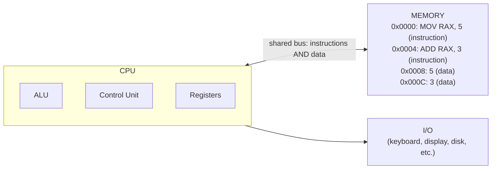

# Chapter 29: Computer Architecture — How Your CPU Really Works

> "To understand the machine is to understand yourself. You are, after all, a biological computer." — Anonymous

---

## Overview

You have been writing code for chapters. You have built a lexer, a parser, a type checker, and even parts of a code generator. But there is a question lurking underneath all of it: *where does the code actually go?* What physical thing executes your Astra program?

This chapter answers that question completely. We are going to open up the CPU — the brain of your computer — and look at every component, every wire, every trick it uses to run your programs billions of times per second. By the end, you will understand why certain code is fast and other code is slow, why caches matter enormously, and exactly what hardware our Astra compiler is targeting when it generates code.

This is not just background knowledge. Understanding computer architecture directly shapes how we design Astra's code generator, memory model, and standard library.

---

## What We're Building

In this chapter we lay the architectural foundation for Astra's code generator. Specifically:

- We map out the x86-64 registers that Astra's compiler will use
- We trace how a simple Astra expression `let x = 2 + 3` will eventually become real CPU instructions
- We understand *why* those instructions are laid out the way they are

---

## Table of Contents

1. The Stored-Program Computer (Von Neumann Architecture)
2. Harvard Architecture — A Different Approach
3. Inside the CPU: ALU, Control Unit, and Registers
4. The Instruction Cycle: Fetch, Decode, Execute, Writeback
5. Pipelining: The Assembly Line Inside Your CPU
6. Pipeline Hazards
7. Superscalar and Out-of-Order Execution
8. The Cache Hierarchy
9. Branch Prediction
10. CISC vs RISC
11. Memory-Mapped I/O
12. Interrupts and Exceptions
13. Astra Build Milestone: Targeting x86-64
14. Exercises
15. Summary

---

## 1. The Stored-Program Computer (Von Neumann Architecture)

In the 1940s, mathematician John von Neumann described a computer design so powerful and clean that virtually every computer built since then follows it. The insight was deceptively simple: **store the program in the same memory as the data**.

Before this idea, computers were rewired with physical cables to change programs. Von Neumann's architecture treats instructions as just another kind of data, stored in memory, read and processed by the CPU.



The Von Neumann architecture has three main parts:

**Central Processing Unit (CPU):** Does all the thinking. Contains sub-components for arithmetic, logic, and control.

**Memory:** Stores both the program (instructions) and the data the program works on. Think of it as a giant array of bytes, each with a numeric address.

**Input/Output (I/O):** Everything else — keyboard, mouse, disk drives, network cards, GPU, speakers.

The CPU and memory are connected by a **bus** — a set of wires that carries addresses, data, and control signals. This shared bus is also Von Neumann's biggest limitation: the CPU often has to wait for memory, creating what engineers call the **Von Neumann bottleneck**. We will see how caches solve this problem.

---

## 2. Harvard Architecture — A Different Approach

The Harvard architecture separates instruction memory from data memory:

```
+--------------------------------------------------+
|              HARVARD ARCHITECTURE                |
|                                                  |
|   +---------+    +---------------------+         |
|   |         |<-->| INSTRUCTION MEMORY  |         |
|   |   CPU   |    | (read-only, fast)   |         |
|   |         |    +---------------------+         |
|   |         |                                    |
|   |         |    +---------------------+         |
|   |         |<-->|    DATA MEMORY      |         |
|   +---------+    | (read/write)        |         |
|                  +---------------------+         |
+--------------------------------------------------+

Separate buses mean the CPU can fetch an instruction
AND read/write data at the same time.
```

**Advantages of Harvard:**
- Can fetch the next instruction while reading/writing data simultaneously
- Instruction memory can be read-only (more secure)
- Common in microcontrollers (Arduino, PICs) and DSPs

**Where you see it today:** Modern x86 CPUs are technically Von Neumann (unified RAM) but their L1 caches are split into separate instruction cache and data cache — giving Harvard-style speed benefits while maintaining Von Neumann compatibility.

---

## 3. Inside the CPU: ALU, Control Unit, and Registers

A CPU is not a single thing — it is a collection of specialized components working in concert. Let us examine each one.

```
+---------------------------------------------------------------+
|                         CPU CHIP                              |
|                                                               |
|  +------------------+      +------------------------------+  |
|  |   CONTROL UNIT   |      |   REGISTER FILE              |  |
|  |                  |      |                              |  |
|  | - Fetches instr. |      | rax: 0x0000000000000005      |  |
|  | - Decodes them   |      | rbx: 0x0000000000000000      |  |
|  | - Signals ALU    |      | rcx: 0x0000000000000003      |  |
|  | - Manages flow   |      | rdx: 0x0000000000000000      |  |
|  +------------------+      | rsp: 0x00007fff5fbff8b0      |  |
|           |                | rbp: 0x00007fff5fbff8c0      |  |
|           v                | rip: 0x0000000100001234      |  |
|  +------------------+      | ... (16 registers total)     |  |
|  |       ALU        |      +------------------------------+  |
|  |                  |                    |                   |
|  | + - * / % & | ^  |<-------------------+                   |
|  | ==  !=  <  >     |                                        |
|  | shift, rotate    |                                        |
|  +------------------+                                        |
|           |                                                   |
|           +-----------> FLAGS REGISTER                        |
|                         (ZF, CF, SF, OF, PF...)              |
+---------------------------------------------------------------+
```

### The Arithmetic Logic Unit (ALU)

The ALU is the calculator inside the CPU. It performs two categories of operations:

**Arithmetic:** Addition, subtraction, multiplication, division, modulus. These work on numbers.

**Logic:** AND, OR, XOR, NOT, bit shifts, comparisons. These work on bits.

Every time you write `2 + 3` in Astra, the ALU does that addition. Every comparison in an `if` statement — the ALU handles it. It is the workhorse of computation.

The ALU also sets **flag bits** after each operation:
- **Zero Flag (ZF):** Set when the result is zero
- **Sign Flag (SF):** Set when the result is negative
- **Carry Flag (CF):** Set when there is a carry out of the highest bit (unsigned overflow)
- **Overflow Flag (OF):** Set when signed arithmetic overflows

These flags are then used by conditional jump instructions to implement `if`, `while`, and `for`.

### The Control Unit

The control unit is the orchestrator. It:

1. Reads the next instruction from memory (at the address in `rip`)
2. Decodes the instruction (figures out what it means)
3. Sends signals to the ALU, register file, and memory to carry it out
4. Updates `rip` to point to the next instruction

You never interact with the control unit directly. It operates automatically, step by step, executing one instruction after another.

### Registers

Registers are the CPU's own private storage — the fastest memory that exists. On x86-64, there are 16 general-purpose 64-bit registers:

```
REGISTER    SIZE    CONVENTION
--------    ----    ----------
rax         64-bit  Return value, accumulator
rbx         64-bit  Callee-saved (preserved across calls)
rcx         64-bit  4th argument, counter
rdx         64-bit  3rd argument, high bits of 128-bit mul
rsi         64-bit  2nd argument, source for string ops
rdi         64-bit  1st argument, dest for string ops
rsp         64-bit  Stack pointer (always points to top of stack)
rbp         64-bit  Base pointer (frame pointer)
r8          64-bit  5th argument
r9          64-bit  6th argument
r10         64-bit  Caller-saved, temporary
r11         64-bit  Caller-saved, temporary
r12         64-bit  Callee-saved
r13         64-bit  Callee-saved
r14         64-bit  Callee-saved
r15         64-bit  Callee-saved
rip         64-bit  Instruction pointer (not directly accessible)
rflags      64-bit  Status flags (not directly writable)
```

Each 64-bit register can also be accessed in smaller sizes:

```
rax  (64-bit)  =  [ 63...32 | eax (32-bit) ]
eax  (32-bit)  =  [ 31...16 | ax  (16-bit) ]
ax   (16-bit)  =  [ 15...8  | ah  | al     ]
                              (8-bit high)  (8-bit low)
```

Registers are orders of magnitude faster than RAM. Accessing a register takes about **0 extra cycles** (it is as fast as the CPU itself). Accessing main RAM takes **200+ cycles**. This gap is why register allocation is one of the most important jobs of a compiler.

---

## 4. The Instruction Cycle: Fetch, Decode, Execute, Writeback

The CPU executes instructions in a repeating cycle. Understanding this cycle is fundamental to understanding everything else.

```
+----------------------------------------------------------+
|                  THE INSTRUCTION CYCLE                   |
|                                                          |
|   +--------+    +--------+    +---------+   +--------+  |
|   |        |    |        |    |         |   |        |  |
|   | FETCH  |--->| DECODE |--->| EXECUTE |-->| WRITE  |  |
|   |        |    |        |    |         |   |  BACK  |  |
|   +--------+    +--------+    +---------+   +--------+  |
|       |              |             |             |       |
|   Read next      Figure out    Do the work   Save the   |
|   instruction    what the      (ALU, memory  result to  |
|   from memory    instruction   access, etc)  register   |
|   at rip         means                       or memory  |
|                                                          |
|   After WRITEBACK: increment rip, start FETCH again     |
+----------------------------------------------------------+
```

### Step 1: Fetch

The control unit reads the instruction at the memory address stored in `rip` (the instruction pointer). On x86-64, instructions are variable-length (1 to 15 bytes), so the fetch stage reads some bytes and figures out where the instruction ends.

**Example:** Fetching `MOV RAX, 5`
```
rip = 0x100001000
Memory[0x100001000..0x100001007] = 48 B8 05 00 00 00 00 00
                                   ^^  (REX prefix + MOV opcode)
                                      ^^^^^^^^^^^^^^^^^^^^ (64-bit immediate: 5)
```

After fetching, `rip` is updated to point past this instruction.

### Step 2: Decode

The control unit decodes the raw bytes into an internal representation. It figures out:
- What operation this is (MOV, ADD, JMP, etc.)
- What operands are involved (which registers, what immediate value)
- How long the instruction is

### Step 3: Execute

The actual work happens here. For arithmetic instructions, the ALU performs the computation. For memory instructions, the memory access happens. For branch instructions, the control unit checks the flags and decides whether to redirect `rip`.

### Step 4: Writeback

The result is written back to a register or memory location. For `MOV RAX, 5`, the value `5` is written into the `rax` register.

This four-stage cycle was the original CPU model. Modern CPUs have vastly extended it — but the fundamental concept remains.

---

## 5. Pipelining: The Assembly Line Inside Your CPU

Imagine a car factory where each car takes four steps: frame assembly, painting, engine installation, finishing. If the factory did one car at a time — waiting for each step before starting the next — it would be agonizingly slow.

Instead, car factories use **assembly lines**: while step 4 finishes car #1, step 3 starts on car #2, step 2 starts on car #3, and step 1 starts on car #4. Four cars are being worked on simultaneously.

Modern CPUs do exactly this with instructions. This is called **pipelining**.

```
WITHOUT PIPELINING (serial):
Cycle:    1    2    3    4    5    6    7    8    9   10   11   12
Instr 1: [F]  [D]  [E]  [W]
Instr 2:                     [F]  [D]  [E]  [W]
Instr 3:                                         [F]  [D]  [E]  [W]
Throughput: 1 instruction per 4 cycles

WITH PIPELINING (assembly line):
Cycle:    1    2    3    4    5    6
Instr 1: [F]  [D]  [E]  [W]
Instr 2:      [F]  [D]  [E]  [W]
Instr 3:           [F]  [D]  [E]  [W]
Throughput: 1 instruction per cycle (4x improvement!)
```

Real modern CPUs have 14–19 pipeline stages (Intel Sandy Bridge has 14, some Prescott cores had 31). The deeper the pipeline, the faster each stage can be (enabling higher clock speeds), but the greater the cost of pipeline hazards.

---

## 6. Pipeline Hazards

The assembly line analogy breaks down in one important way: instructions are not independent. Sometimes instruction 2 needs a result that instruction 1 has not computed yet. These situations are called **hazards**.

### Data Hazards

A data hazard occurs when an instruction depends on the result of a previous instruction that has not finished.

```
ADD rax, rbx   ; Step 1: rax = rax + rbx
MOV rcx, rax   ; Step 2: needs rax, but step 1 isn't done yet!

Without handling:
Cycle:  1    2    3    4    5
ADD:   [F]  [D]  [E]  [W]
MOV:        [F]  [D] STALL STALL [E] [W]
                      ^^^^^^^^^^
                      Waiting for ADD to write rax
```

Modern CPUs use **forwarding** (also called bypassing): instead of waiting for the writeback stage, the result is forwarded directly from the execute stage of ADD to the execute stage of MOV.

### Control Hazards

A control hazard occurs at conditional branches. When the CPU encounters:
```
CMP rax, 0
JE  some_label   ; Jump if rax == 0
ADD rbx, 1       ; Should this execute?
```

The CPU does not know whether to fetch instructions after `JE` or fetch instructions at `some_label` until `JE` has been evaluated. This causes the pipeline to **stall** while waiting.

Modern CPUs use **branch prediction** to guess which path to take. If the guess is correct, no stall. If wrong, the speculatively fetched instructions must be flushed from the pipeline (a branch misprediction penalty of 10–20 cycles on modern CPUs).

### Structural Hazards

A structural hazard occurs when two instructions need the same hardware resource at the same time (e.g., both need the memory bus). Modern CPUs avoid this by duplicating resources — having multiple ALUs, multiple load/store units, etc.

---

## 7. Superscalar and Out-of-Order Execution

Modern CPUs go far beyond simple pipelining with two additional techniques.

### Superscalar Execution

A superscalar CPU has **multiple execution units** and can start more than one instruction per cycle.

```
SUPERSCALAR (2-wide):
Cycle:    1    2    3    4    5
Port 0:  [ADD] [MUL]     [SUB]
Port 1:  [MOV]      [CMP]     [AND]

Two instructions can be in the execute stage simultaneously!
```

Modern CPUs are 4–6 wide. An Intel Core i9 can theoretically retire 6 instructions per cycle. This is called **instruction-level parallelism (ILP)**.

### Out-of-Order Execution

The CPU does not execute instructions in program order. It examines a window of upcoming instructions (the **reorder buffer**, typically 200–350 instructions on modern Intel CPUs) and executes them as soon as their dependencies are ready.

```
Original order:     Out-of-order execution:
1. LOAD rax, [mem]  1. LOAD rax, [mem]   (starts, slow memory access)
2. ADD rax, rbx     2. MUL rcx, rdx      (executes NOW, doesn't need rax)
3. MUL rcx, rdx     3. ADD rax, rbx      (executes when LOAD finishes)
4. RET              4. RET

Instructions 3 and 2 are swapped — the CPU found independent work to do
while waiting for the memory load.
```

From the programmer's perspective, the program behaves as if it executed in order (the CPU ensures this). But internally, instructions execute in whatever order maximizes hardware utilization.

---

## 8. The Cache Hierarchy

The single biggest performance gap in modern computers is between CPU speed and memory speed. The CPU can execute billions of operations per second. RAM takes ~100 nanoseconds to respond — during which the CPU could have done hundreds of operations.

The solution is **caches**: small, fast memory built directly onto the CPU chip.

```
THE CACHE HIERARCHY:
                                        Access    Size    Technology
                                        -------   -----   ----------
CPU Registers                           0 cycles  ~1KB    Flip-flops
     |
     v
L1 Cache (split: 32KB data, 32KB instr) 4 cycles  32KB    SRAM
     |
     v
L2 Cache                                12 cycles  256KB   SRAM
     |
     v
L3 Cache (shared between cores)        40 cycles  8MB     SRAM
     |
     v
Main RAM (DRAM)                        200 cycles  16GB    DRAM
     |
     v
NVMe SSD                              50,000 cy   1TB     NAND flash
     |
     v
HDD / Network                       millions cy   ∞       Spinning rust / photons


Analogy:
L1 cache   = your desk (instant access)
L2 cache   = bookshelf in your room
L3 cache   = bookshelf down the hall
RAM        = library in your building
SSD        = library in another city
HDD        = library in another country
```

### How Caches Work

A cache stores **cache lines** — fixed-size chunks of memory (typically 64 bytes on x86-64). When you access a memory address:

1. Check L1: hit? Return data (4 cycles). Miss? Check L2.
2. Check L2: hit? Return data (12 cycles), store in L1. Miss? Check L3.
3. Check L3: hit? Return data (40 cycles), store in L1 and L2. Miss? Go to RAM.
4. RAM: fetch the 64-byte line (200 cycles), store in L1, L2, and L3.

### Cache Miss Effects on Performance

The difference between cache-friendly and cache-unfriendly code is dramatic:

```
CACHE-FRIENDLY (sequential access):
for i in 0..1000000 {
    sum = sum + array[i]   // Each element is next to the previous one.
}                           // After first miss, the rest of the cache line is warm.
// Typical: ~2 cycles per element

CACHE-UNFRIENDLY (random access):
for i in 0..1000000 {
    sum = sum + array[random_index[i]]  // Each access is a different cache line.
}                                        // Almost every access is a cache miss.
// Typical: ~200 cycles per element = 100x slower!
```

This is why **data layout matters**. Astra's standard library and runtime will be designed with cache-friendly data layouts where possible.

### Cache Associativity

Caches are not fully associative (too expensive). They use **N-way set associativity** — a given memory address can only go into a few possible cache slots. This means some access patterns can cause **conflict misses** even when the cache is not full.

---

## 9. Branch Prediction

Modern CPUs do not wait to find out which way a branch goes — they **guess** and start executing speculatively. If the guess is right, no penalty. If wrong, the speculative work is discarded (flushed) and the correct path is fetched.

```
BRANCH PREDICTION IN ACTION:

if condition {         CMP ...
    do_thing_A         JE  label_A     <-- CPU predicts: NOT taken (stays in loop)
} else {               ; ... code A    <-- CPU speculatively executes this
    do_thing_B
}
label_A:
; ... code B
```

Modern branch predictors are remarkably accurate — typically 95–99% accuracy on real workloads. They use sophisticated algorithms:

**Static prediction:** Always predict not-taken, or use hints in the instruction encoding.

**Dynamic prediction:** Track the history of each branch. Two-bit saturating counters remember whether a branch was recently taken.

**Correlating predictors:** Track patterns like "branch A is taken when the previous 3 branches went this way."

**Neural network predictors:** Used in modern Intel/AMD CPUs — literally small neural networks to predict complex patterns.

The **branch misprediction penalty** on modern CPUs is 15–20 cycles. This is why sorting data before processing it can be dramatically faster: sorted data has predictable branches (all elements above threshold, then all below), while unsorted data has 50% branch mispredictions.

---

## 10. CISC vs RISC

The computing world has long debated two philosophies for instruction set design.

### CISC: Complex Instruction Set Computer

**Examples:** x86, x86-64 (Intel/AMD)

CISC architectures have hundreds of complex instructions. A single CISC instruction might:
- Load a value from memory at an address computed by adding a base register + an offset register * a scale factor + an immediate offset
- Perform an arithmetic operation on it
- Store the result back to memory

```
CISC example (x86):
IMUL eax, [rbx + rcx*4 + 16]
; Multiply eax by the memory value at address (rbx + rcx*4 + 16)
; One instruction does: address calculation + memory load + multiplication

This would take 3-4 instructions on a RISC machine.
```

CISC advantages: compact code (fewer instructions = less memory bandwidth). Familiar to programmers who write assembly. Historically easier to port old code.

CISC disadvantages: Complex to implement in hardware. Variable-length instructions complicate pipelining.

### RISC: Reduced Instruction Set Computer

**Examples:** ARM (phones, Apple Silicon), RISC-V (open source), MIPS, PowerPC

RISC architectures have a small set of simple, regular instructions. Every instruction does one thing. Memory access is separate from computation (load/store architecture).

```
RISC example (ARM/RISC-V):
LOAD  t0, 16(a1)       ; Load from memory[a1 + 16] into t0
MUL   a0, a0, t0       ; Multiply a0 by t0, store in a0
; Two instructions, each does exactly one thing
```

RISC advantages: Simple hardware, easy to pipeline, lower power (important for phones), regular encoding simplifies superscalar execution.

**The modern reality:** Modern x86 CPUs internally break CISC instructions into simpler **micro-operations (µops)** that look very much like RISC instructions. The CISC instruction set is a compatibility layer; the engine underneath is RISC-like.

**Astra targets x86-64** because that is what most desktop and server computers use. However, the compiler architecture will make it relatively straightforward to add ARM/RISC-V backends later.

---

## 11. Memory-Mapped I/O

How does the CPU communicate with hardware devices like a keyboard, network card, or graphics card? One elegant answer is **memory-mapped I/O**.

The idea: certain memory addresses do not correspond to actual RAM. Instead, they are wired to hardware registers in peripheral devices. Reading or writing those addresses communicates with the device.

```
MEMORY ADDRESS SPACE:
0x0000000000000000  +-----------+
                    |           |
                    |    RAM    |  (your program lives here)
                    |           |
0x00000000A0000000  +-----------+
                    | Video RAM | (write pixels here, they appear on screen)
0x00000000FEC00000  +-----------+
                    |    I/O    | (APIC, PCI config, etc.)
                    |  Devices  |
0xFFFFFFFFFFFFFFFF  +-----------+
```

On modern systems, the OS and hardware cooperate so user programs never directly touch memory-mapped I/O. Instead, programs use **system calls** to ask the OS kernel to perform I/O operations on their behalf.

---

## 12. Interrupts and Exceptions

CPUs handle unexpected events through **interrupts** and **exceptions**.

### Hardware Interrupts

When a hardware device needs attention (keyboard key pressed, network packet arrived, disk read complete), it sends an electrical signal to the CPU. The CPU:

1. Finishes the current instruction
2. Saves its current state (registers, `rip`) to the stack
3. Looks up the **interrupt handler** address in the **interrupt descriptor table (IDT)**
4. Jumps to the handler (which runs in kernel space)
5. The handler services the device (reads the keypress, processes the packet)
6. Returns with `iretq`, restoring saved state
7. Your program resumes, unaware this happened

### Exceptions

Exceptions are synchronous events generated by the CPU itself:
- **Divide by zero:** Your code executes `DIV` with divisor 0
- **Page fault:** Accessing an unmapped memory address
- **General protection fault:** Attempting a privileged operation from user space
- **Breakpoint:** Hitting a `INT 3` instruction (used by debuggers)

From Astra's perspective: when your Astra program crashes with a "segmentation fault," that is a page fault exception that the OS converted into a signal (`SIGSEGV`) sent to your process. The OS decided you violated memory rules and terminated your program.

```
INTERRUPT/EXCEPTION FLOW:

Your Program         |    CPU          |    Kernel
--------------------|-----------------|------------------
add rax, rbx        |                 |
mov rcx, [bad_addr] |--PAGE FAULT---> |
(suspended here)    |                 | - Find handler in IDT
                    |                 | - Run page fault handler
                    |                 | - Can it fix it? (e.g., swap in page)
                    |                 |   YES: restore program, continue
                    |                 |   NO: send SIGSEGV to process
(terminated by OS)  |                 |
```

---

## 13. Astra Build Milestone: Targeting x86-64

Now that we understand computer architecture, let us map it directly to Astra's code generator.

### The Registers Astra Will Use

Astra's x86-64 code generator will use all 16 general-purpose registers, following the System V AMD64 ABI (covered in depth in Chapter 31):

```go
// codegen/registers.go

package codegen

// Register names for 64-bit, 32-bit, 16-bit, and 8-bit access
type Register struct {
    Name64 string // e.g., "rax"
    Name32 string // e.g., "eax"
    Name16 string // e.g., "ax"
    Name8  string // e.g., "al"
}

// All 16 general-purpose x86-64 registers
var Registers = []Register{
    // Caller-saved (may be changed by function calls — caller must save if needed)
    {Name64: "rax", Name32: "eax",  Name16: "ax",   Name8: "al"},   // Return value
    {Name64: "rcx", Name32: "ecx",  Name16: "cx",   Name8: "cl"},   // 4th argument
    {Name64: "rdx", Name32: "edx",  Name16: "dx",   Name8: "dl"},   // 3rd argument
    {Name64: "rsi", Name32: "esi",  Name16: "si",   Name8: "sil"},  // 2nd argument
    {Name64: "rdi", Name32: "edi",  Name16: "di",   Name8: "dil"},  // 1st argument
    {Name64: "r8",  Name32: "r8d",  Name16: "r8w",  Name8: "r8b"},  // 5th argument
    {Name64: "r9",  Name32: "r9d",  Name16: "r9w",  Name8: "r9b"},  // 6th argument
    {Name64: "r10", Name32: "r10d", Name16: "r10w", Name8: "r10b"}, // Scratch
    {Name64: "r11", Name32: "r11d", Name16: "r11w", Name8: "r11b"}, // Scratch

    // Callee-saved (function must preserve these — must save/restore if used)
    {Name64: "rbx", Name32: "ebx",  Name16: "bx",   Name8: "bl"},
    {Name64: "r12", Name32: "r12d", Name16: "r12w", Name8: "r12b"},
    {Name64: "r13", Name32: "r13d", Name16: "r13w", Name8: "r13b"},
    {Name64: "r14", Name32: "r14d", Name16: "r14w", Name8: "r14b"},
    {Name64: "r15", Name32: "r15d", Name16: "r15w", Name8: "r15b"},
}

// Special-purpose registers (managed automatically by hardware/ABI)
var SpecialRegisters = struct {
    StackPointer string // Always points to the top of the stack
    BasePointer  string // Points to the start of the current stack frame
    InstrPointer string // Points to the next instruction to execute
}{
    StackPointer: "rsp",
    BasePointer:  "rbp",
    InstrPointer: "rip", // Not directly writable; changed by jmp/call/ret
}

// Argument registers in order (System V AMD64 ABI)
var ArgRegisters = []string{"rdi", "rsi", "rdx", "rcx", "r8", "r9"}

// CallerSavedRegs: registers the CALLER must save before making a function call
var CallerSaved = []string{"rax", "rcx", "rdx", "rsi", "rdi", "r8", "r9", "r10", "r11"}

// CalleeSavedRegs: registers the CALLEE must save/restore if it uses them
var CalleeSaved = []string{"rbx", "r12", "r13", "r14", "r15", "rbp"}
```

### How `let x = 2 + 3` Becomes x86-64 Instructions

Let us trace the complete journey of a simple Astra expression through the compiler:

```astra
fn main() {
    let x = 2 + 3
    print(x)
}
```

**Stage 1: Lexer Output**
```
Tokens: fn, IDENT(main), (, ), {,
        let, IDENT(x), =, INT(2), +, INT(3),
        IDENT(print), (, IDENT(x), ),
        }
```

**Stage 2: AST**
```
FunctionDecl {
  name: "main"
  body: Block {
    VarDecl { name: "x", init: BinaryExpr { op: "+", left: IntLit(2), right: IntLit(3) } }
    CallExpr { callee: "print", args: [Ident("x")] }
  }
}
```

**Stage 3: Code Generation → x86-64 Assembly**

The code generator walks the AST and emits assembly:

```asm
; Generated by astrac for: fn main()
; Platform: x86-64 Linux/macOS

    .section .text
    .global main

main:
    ; === Function prologue ===
    push    rbp             ; Save caller's base pointer
    mov     rbp, rsp        ; Set up our own stack frame

    ; === let x = 2 + 3 ===
    ; Evaluate right-hand side: 2 + 3
    mov     rax, 2          ; Load constant 2 into rax
    mov     rcx, 3          ; Load constant 3 into rcx
    add     rax, rcx        ; rax = rax + rcx = 5

    ; Store result in local variable x
    ; (x is at stack offset -8 from rbp)
    sub     rsp, 8          ; Allocate 8 bytes on stack for x
    mov     QWORD PTR [rbp-8], rax  ; x = 5

    ; === print(x) ===
    mov     rdi, QWORD PTR [rbp-8]  ; Load x as first argument
    call    astra_print_int         ; Call print function

    ; === Function epilogue ===
    mov     rax, 0          ; Return value 0 (main returns int)
    mov     rsp, rbp        ; Restore stack pointer
    pop     rbp             ; Restore caller's base pointer
    ret                     ; Return to caller
```

**Annotation of each instruction:**

```
push rbp
    WHY: Before we use rbp for our own stack frame, we must save the caller's
         value. The ABI requires this. push decrements rsp by 8, then writes
         rbp to [rsp].

mov rbp, rsp
    WHY: Now rbp points to the start of our stack frame. Local variables will
         be addressed as [rbp - N]. This makes debugging easier and is
         required by the ABI for stack unwinding.

mov rax, 2
    WHY: The constant 2 must be in a register before we can add. We use rax
         as a temporary working register.

mov rcx, 3
    WHY: Same for 3. We use rcx as the second operand.

add rax, rcx
    WHY: The ALU adds the two values. Result ends up in rax (destination).
         After this, rax = 5.

sub rsp, 8
    WHY: We need 8 bytes of stack space for the local variable x (an int64).
         Subtracting from rsp grows the stack downward.

mov QWORD PTR [rbp-8], rax
    WHY: Store the value of x (currently in rax = 5) to the stack.
         QWORD PTR means "treat this as a 64-bit memory access".
         [rbp-8] is 8 bytes below our frame pointer — where x lives.

mov rdi, QWORD PTR [rbp-8]
    WHY: Load x back from the stack. We need to pass it as the first
         argument to print. The ABI says: first argument goes in rdi.

call astra_print_int
    WHY: The call instruction does two things: pushes the return address
         (address of the next instruction) onto the stack, then jumps to
         astra_print_int.

mov rax, 0
    WHY: main returns an exit code. 0 means success. The ABI says return
         values go in rax.

mov rsp, rbp
    WHY: Restore the stack pointer. This effectively "frees" all local
         variables (x, in this case).

pop rbp
    WHY: Restore the caller's base pointer. pop reads from [rsp], then
         increments rsp by 8.

ret
    WHY: The ret instruction pops the return address from the stack and
         jumps to it. Control returns to whoever called main (the OS loader).
```

This is the complete journey. Every Astra program, no matter how complex, eventually reduces to sequences of instructions like these.

---

## 14. Exercises

**Exercise 1 — Register Mapping:**
Look at the register table in the Build Milestone. Without looking it up, answer:
- Which register holds the first function argument?
- Which register holds the function return value?
- Which register always points to the top of the stack?
- Which registers must a function preserve if it uses them?

**Exercise 2 — Cache Math:**
Your program accesses 1 million integers sequentially. Each integer is 8 bytes. A cache line is 64 bytes. How many cache lines does this access? If L1 cache is 32KB, how many cache lines fit? Does the entire array fit in L1? What about L2 (256KB)? L3 (8MB)?

**Exercise 3 — Pipeline Trace:**
Given these three instructions, draw a pipeline timing diagram (like the ones in section 5) showing cycles 1 through 8:
```asm
MOV rax, 10
ADD rax, rax
MOV rbx, rax
```
Mark where data hazards occur. Show how forwarding eliminates the stall.

**Exercise 4 — Branch Prediction:**
Consider two loops:
```python
# Loop A: sorted array
data = sorted([random() for _ in range(1000000)])
total = sum(x for x in data if x > 0.5)

# Loop B: unsorted array
data = [random() for _ in range(1000000)]
total = sum(x for x in data if x > 0.5)
```
Which loop runs faster and why? What does the branch predictor do differently for each?

**Exercise 5 — Architecture Identification:**
For each device, say whether it more likely uses CISC (x86) or RISC (ARM):
- A gaming PC
- An iPhone
- A cloud server at AWS (hint: research AWS Graviton)
- A Raspberry Pi
- An ATM machine (older ones)
- A modern MacBook

**Exercise 6 — Instruction Counting:**
For the Astra code `let y = (a + b) * (c - d)`, write the x86-64 assembly you would expect Astra's code generator to produce. Assume a, b, c, d are already in registers rdi, rsi, rdx, rcx respectively. Use only: mov, add, sub, imul. Store the result in rax.

**Exercise 7 — Cache Hierarchy Research:**
Using your computer's specs (or look them up online for a common Intel Core i7 or Apple M1), fill in this table:

| Level | Size | Latency (cycles) | Latency (ns at 3GHz) |
|-------|------|-----------------|----------------------|
| L1    |      |                 |                      |
| L2    |      |                 |                      |
| L3    |      |                 |                      |
| RAM   |      |                 |                      |

**Exercise 8 — Von Neumann vs Harvard:**
The Astra compiler itself is a program running on your CPU. When the compiler is processing an Astra source file:
- Where does the compiler's *own code* live in the Von Neumann memory space?
- Where does the Astra source file (data being processed) live?
- Where does the compiler put the AST it is building?
- How does the Harvard-style L1 cache split (separate instruction/data caches) help the compiler run faster?

---

## 15. Summary

| Concept | Key Point | Astra Implication |
|---------|-----------|-------------------|
| Von Neumann | Program and data in same memory | Our compiled code lives in RAM alongside our data |
| CPU Components | ALU (math), CU (control), Registers (fast storage) | Code gen targets ALU ops and register assignments |
| Instruction Cycle | Fetch → Decode → Execute → Writeback | Every Astra statement becomes 1+ full cycles |
| Pipelining | Multiple instructions overlap in stages | Generate code in sequences that avoid hazards |
| Data Hazards | Dependency between consecutive instructions | Go's assembler handles nop insertion; we should be aware |
| L1 Cache | 4 cycles, 32KB | Keep frequently accessed data in L1-friendly patterns |
| L3 Cache | 40 cycles, 8MB | Large data structures that don't fit in L1/L2 |
| RAM | 200 cycles, 16GB | Avoid unnecessary memory accesses in generated code |
| Branch Prediction | CPU guesses branches; mispredictions cost ~15 cycles | Prefer predictable patterns (sorted data, loop invariants) |
| x86 vs RISC | x86 has complex instructions; ARM is simpler | Astra targets x86-64 first, ARM backend planned later |
| Interrupts | Hardware events that pause the CPU | OS uses interrupts to implement system calls |
| Registers (x86-64) | 16 general-purpose 64-bit registers | Astra's register allocator must track all 16 |

Understanding computer architecture is not just academic. Every optimization decision in Astra's compiler — how we allocate registers, how we lay out data structures, how we generate loops — is guided by these hardware realities. The machine is not a neutral executor. It has preferences, and great compilers learn them.

In the next chapter, we will move from *understanding* assembly to *writing* it — speaking directly to the machine in its own language.
