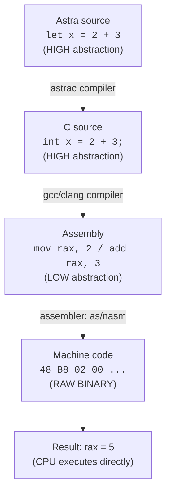

# Chapter 30: Assembly Language — Speaking the Machine's Language

> "Assembly language is what the computer speaks. Learning it is like learning the mother tongue — raw, honest, and deeply illuminating." — Unknown systems programmer

---

## Overview

In Chapter 29, we studied the CPU as a piece of hardware — fetch, decode, execute, writeback, caches, pipelines. Now we go one step further: we learn to talk to it directly.

Assembly language is the lowest level of human-readable programming. There is no garbage collector, no runtime, no type system, no classes. There is only **registers, memory, and instructions**. Every high-level language — Go, Python, C, and our own Astra — ultimately compiles down to assembly. Understanding assembly means understanding *exactly* what your computer is doing, one instruction at a time.

This chapter teaches you x86-64 assembly comprehensively, works through a complete hand-compiled example (a C function → assembly, line by line), and shows exactly what Astra's code generator must produce for a simple function.

---

## What We're Building

By the end of this chapter:

- You can read and understand x86-64 assembly output
- You understand every instruction Astra's code generator will emit
- You can look at any compiler's output (with `gcc -S`) and understand what you see
- Astra's code generator for functions takes clearer shape

---

## Table of Contents

1. What Is Assembly Language?
2. AT&T vs Intel Syntax
3. The x86-64 Register Set In Depth
4. Addressing Modes
5. Core Instructions: mov, add, sub, mul, div
6. Stack Instructions: push, pop
7. Control Flow: jmp, je/jne, jl/jg, jle/jge
8. Function Call Instructions: call, ret
9. The Stack: How It Actually Works
10. Reading Compiler Output with `gcc -S`
11. Hand-Compiling a C Function to Assembly
12. Astra Build Milestone: Code Generation for Functions
13. Exercises
14. Summary

---

## 1. What Is Assembly Language?

Every CPU has a set of built-in operations it can perform — its **instruction set architecture (ISA)**. These instructions are stored in memory as raw bytes (binary). For example, the x86-64 instruction to add two registers might be the bytes `0x48 0x01 0xC3`.

Nobody wants to write programs as raw bytes. Assembly language gives each instruction a **mnemonic** — a short human-readable name:

```
Binary (machine code):   48 01 C3
Assembly (human-readable): add  rbx, rax
```

An **assembler** (a program like `as`, `nasm`, or `masm`) converts assembly mnemonics back to binary machine code. Assembly is essentially a 1-to-1 mapping with machine code, with a few conveniences like labels and symbolic names.



Assembly is important for compiler writers for three reasons:
1. It is what our code generator *produces*
2. It lets us inspect what the CPU actually receives
3. Understanding it helps us generate better code

---

## 2. AT&T vs Intel Syntax

x86-64 assembly has two common syntax flavors, and they are frustratingly different:

```
OPERATION: Move the value 5 into register rax

Intel syntax:   mov  rax, 5        (destination, source)
AT&T syntax:    movq $5, %rax      (source, destination — reversed!)

OPERATION: Add rbx to rax, store in rax

Intel syntax:   add  rax, rbx      (dest += src)
AT&T syntax:    addq %rbx, %rax   (src += ... wait, no, it's reversed)
```

AT&T syntax (used by GCC by default) reverses the operand order and adds percent signs before registers and dollar signs before constants. Intel syntax (used by NASM, MASM, and Intel's documentation) is more readable for humans.

**We will use Intel syntax throughout this book.** It is more intuitive: destination comes first, then source, just like `x = y` in normal code.

When reading GCC output (`gcc -S`), you will see AT&T syntax. Just remember: it is backward from what we write.

```
Quick conversion guide:
                Intel               AT&T
Registers:      rax                 %rax
Constants:      42                  $42
Operand order:  dest, src           src, dest
Memory sizes:   QWORD PTR           q suffix (movq)
Memory ref:     [rbp - 8]           -8(%rbp)
```

---

## 3. The x86-64 Register Set In Depth

We introduced registers in Chapter 29. Let us now understand them in the detail needed to write and generate code.

### General-Purpose Registers and Their Sub-registers

```
64-bit name    32-bit sub    16-bit sub    8-bit high    8-bit low
-----------    ----------    ----------    ----------    ---------
rax            eax           ax            ah            al
rbx            ebx           bx            bh            bl
rcx            ecx           cx            ch            cl
rdx            edx           dx            dh            dl
rsi            esi           si            (none)        sil
rdi            edi           di            (none)        dil
rsp            esp           sp            (none)        spl
rbp            ebp           bp            (none)        bpl
r8             r8d           r8w           (none)        r8b
r9             r9d           r9w           (none)        r9b
r10            r10d          r10w          (none)        r10b
r11            r11d          r11w          (none)        r11b
r12            r12d          r12w          (none)        r12b
r13            r13d          r13w          (none)        r13b
r14            r14d          r14w          (none)        r14b
r15            r15d          r15w          (none)        r15b
```

The sub-registers access the lower bits of the full 64-bit register:

```
rax:   [63      32][31     16][15  8][7   0]
           (upper)   eax        ax    al
                             [ah]  [al]
```

**Important quirk:** Writing to a 32-bit sub-register (like `eax`) **zero-extends** the result into the full 64-bit register. Writing to a 16-bit or 8-bit sub-register does NOT zero-extend — it only changes those bits.

```asm
; Start: rax = 0xFFFFFFFF_FFFFFFFF (all ones)

mov eax, 5        ; rax is now 0x0000000000000005 (32-bit write zero-extends!)
mov ax, 5         ; rax is now 0x00000000FFFF0005 (16-bit write does NOT zero-extend)
mov al, 5         ; rax is now 0x000000000000FF05 (8-bit write does NOT zero-extend)
```

This quirk is why compilers often use 32-bit operations for 32-bit math — it is slightly shorter encoding AND automatically zeroes the top 32 bits.

---

## 4. Addressing Modes

An **addressing mode** specifies how to locate an operand. x86-64 has four main modes:

### Immediate (Constant) Addressing

The operand is a constant value encoded directly in the instruction.

```asm
mov rax, 42         ; rax = 42  (immediate)
add rbx, 100        ; rbx = rbx + 100  (immediate)
```

### Register Addressing

The operand is a register.

```asm
mov rax, rbx        ; rax = rbx  (register to register)
add rcx, rdx        ; rcx = rcx + rdx
```

### Direct Memory Addressing

The operand is at a specific memory address (rarely used in modern code; the linker fills in the address).

```asm
mov rax, [0x100001000]   ; Load 8 bytes from address 0x100001000 into rax
```

### Indirect (Computed) Memory Addressing

The most powerful mode. The memory address is computed using this formula:

```
[base + index * scale + displacement]

Where:
  base         = any 64-bit register (e.g., rbx)
  index        = any 64-bit register except rsp (e.g., rcx)
  scale        = 1, 2, 4, or 8 (for element sizing)
  displacement = signed 32-bit constant
```

Examples:

```asm
mov rax, [rbx]              ; Load from address in rbx
mov rax, [rbx + 8]          ; Load from address rbx + 8
mov rax, [rbx + rcx]        ; Load from rbx + rcx
mov rax, [rbx + rcx*8]      ; Load from rbx + rcx*8 (array of 8-byte elements)
mov rax, [rbx + rcx*8 + 16] ; Full form: rbx + rcx*8 + 16
```

The full indirect form is incredibly useful for array access:

```astra
// Astra code:
let value = array[i]

// Becomes x86-64 (if array base is in rbx, i is in rcx):
mov rax, [rbx + rcx*8]   ; Each int64 is 8 bytes, so offset = i * 8
```

---

## 5. Core Instructions

### MOV — Move Data

```asm
mov dest, src     ; dest = src

; Examples:
mov rax, 5           ; rax = 5 (register ← immediate)
mov rbx, rax         ; rbx = rax (register ← register)
mov [rbp-8], rax     ; memory[rbp-8] = rax (memory ← register)
mov rax, [rbp-8]     ; rax = memory[rbp-8] (register ← memory)
```

Note: `mov memory, memory` is NOT allowed. To move from one memory location to another, you must go through a register.

### ADD — Addition

```asm
add dest, src     ; dest = dest + src

add rax, rbx      ; rax = rax + rbx
add rax, 10       ; rax = rax + 10
add [rbp-8], rax  ; memory[rbp-8] = memory[rbp-8] + rax (rare but valid)
```

After ADD, the flags register is updated. If the result is zero, ZF is set. If there is overflow, OF is set.

### SUB — Subtraction

```asm
sub dest, src     ; dest = dest - src

sub rax, rbx      ; rax = rax - rbx
sub rsp, 32       ; rsp = rsp - 32 (common: allocate stack space)
```

### IMUL — Signed Multiplication

Multiplication has a more complex interface because the product of two 64-bit numbers can be 128 bits:

```asm
; Two-operand form (most common): dest = dest * src (truncated to 64 bits)
imul rax, rbx     ; rax = rax * rbx

; Three-operand form: dest = src * immediate
imul rax, rbx, 5  ; rax = rbx * 5

; One-operand form: rdx:rax = rax * operand (full 128-bit result)
imul rbx          ; rdx:rax = rax * rbx (high 64 bits in rdx, low 64 in rax)
```

For most Astra code generation, the two-operand form is sufficient.

### IDIV — Signed Division

Division is the most complex:

```asm
; Prepare: sign-extend rax into rdx:rax using cqo
cqo               ; sign-extend rax into rdx (rdx:rax = (128-bit) rax)
idiv rbx          ; rax = rdx:rax / rbx (quotient)
                  ; rdx = rdx:rax % rbx (remainder)
```

To get the modulus of `a % b`:
```asm
mov rax, a_value
cqo
idiv rbx          ; After: rdx = a % b
mov rax, rdx      ; Move remainder to return register
```

### NEG, AND, OR, XOR — Other ALU Operations

```asm
neg rax           ; rax = -rax (two's complement negation)
and rax, rbx      ; rax = rax & rbx (bitwise AND)
or  rax, rbx      ; rax = rax | rbx (bitwise OR)
xor rax, rbx      ; rax = rax ^ rbx (bitwise XOR)

; Trick: xor rax, rax is the fastest way to set rax to 0!
xor rax, rax      ; rax = 0 (shorter encoding than mov rax, 0)

not rax           ; rax = ~rax (bitwise NOT)
shl rax, 3        ; rax = rax << 3 (shift left by 3 = multiply by 8)
shr rax, 2        ; rax = rax >> 2 (shift right by 2 = divide by 4, unsigned)
sar rax, 2        ; rax = rax >> 2 (arithmetic shift right = divide by 4, signed)
```

### CMP — Compare (Without Storing)

```asm
cmp rax, rbx      ; Compute rax - rbx, set flags, discard result
cmp rax, 0        ; Compare rax with 0
```

CMP subtracts the second operand from the first, sets the flags, and throws away the result. It is used before conditional jumps.

---

## 6. Stack Instructions: PUSH and POP

The stack is a region of memory where functions store local variables and save registers. On x86-64:

- `rsp` always points to the **top of the stack** (the most recently pushed value)
- The stack **grows downward** (toward lower addresses)
- Each stack slot is 8 bytes (on 64-bit systems)

```
STACK STATE BEFORE PUSH:

High addresses
+---------+
|  ...    |
|  old    |  <- where rsp was before our function started
|  stuff  |
+---------+  <- rsp (current top)
|  ???    |  (unused stack space below)
Low addresses

AFTER: push rax  (where rax = 42)

High addresses
+---------+
|  ...    |
|  old    |
|  stuff  |
+---------+
|   42    |  <- rsp (decremented by 8, then 42 written here)
+---------+
|  ???    |
Low addresses

AFTER: pop rbx  (reads top of stack into rbx)

rbx = 42 now

High addresses
+---------+
|  ...    |
|  old    |
|  stuff  |
+---------+  <- rsp (incremented by 8)
|   42    |  (still in memory, but "below" the stack now — will be overwritten)
+---------+
```

**PUSH** is equivalent to:
```asm
push rax
; Same as:
sub rsp, 8
mov QWORD PTR [rsp], rax
```

**POP** is equivalent to:
```asm
pop rbx
; Same as:
mov rbx, QWORD PTR [rsp]
add rsp, 8
```

---

## 7. Control Flow Instructions

Without control flow, a program just executes instructions top to bottom. Control flow instructions change where execution goes.

### Unconditional Jump

```asm
jmp label         ; Always jump to label
jmp rax           ; Jump to address in rax (indirect jump, used for switch tables)
```

### Conditional Jumps

These jump only if certain flags are set. They are always used after `CMP` or another instruction that sets flags:

```asm
; After: cmp rax, rbx  (computes rax - rbx)

je  label   ; Jump if Equal (ZF=1, i.e., rax == rbx)
jne label   ; Jump if Not Equal (ZF=0, i.e., rax != rbx)
jl  label   ; Jump if Less (signed: rax < rbx)
jle label   ; Jump if Less or Equal (signed: rax <= rbx)
jg  label   ; Jump if Greater (signed: rax > rbx)
jge label   ; Jump if Greater or Equal (signed: rax >= rbx)
jb  label   ; Jump if Below (unsigned: rax < rbx)
jbe label   ; Jump if Below or Equal (unsigned: rax <= rbx)
ja  label   ; Jump if Above (unsigned: rax > rbx)
jae label   ; Jump if Above or Equal (unsigned: rax >= rbx)
jz  label   ; Jump if Zero (same as je)
jnz label   ; Jump if Not Zero (same as jne)
js  label   ; Jump if Sign (result was negative)
jns label   ; Jump if Not Sign (result was non-negative)
```

### Implementing an If-Statement

```astra
// Astra:
if x > 10 {
    y = 1
} else {
    y = 0
}
```

```asm
; Assembly equivalent (x in [rbp-8], y in [rbp-16]):
    mov     rax, QWORD PTR [rbp-8]   ; Load x
    cmp     rax, 10                   ; Compare x with 10
    jle     .else_branch              ; If x <= 10, jump to else
.then_branch:
    mov     QWORD PTR [rbp-16], 1    ; y = 1
    jmp     .end_if
.else_branch:
    mov     QWORD PTR [rbp-16], 0    ; y = 0
.end_if:
    ; execution continues here
```

### Implementing a While Loop

```astra
// Astra:
while i < 10 {
    i = i + 1
}
```

```asm
; i is in [rbp-8]
.loop_start:
    mov     rax, QWORD PTR [rbp-8]   ; Load i
    cmp     rax, 10                   ; Compare i with 10
    jge     .loop_end                 ; If i >= 10, exit loop
    ; Loop body:
    mov     rax, QWORD PTR [rbp-8]   ; Load i
    add     rax, 1                    ; i + 1
    mov     QWORD PTR [rbp-8], rax   ; Store back to i
    jmp     .loop_start               ; Go back to top
.loop_end:
    ; continue after loop
```

---

## 8. Function Call Instructions: CALL and RET

### CALL

```asm
call label        ; Push return address, then jump to label
```

`call label` is equivalent to:
```asm
push rip          ; Push address of next instruction (the return address)
jmp  label        ; Jump to function
```

But `rip` is not directly writable, so `call` is a special instruction that does both atomically.

### RET

```asm
ret               ; Pop return address from stack, jump to it
```

`ret` is equivalent to:
```asm
pop  rip          ; Read the return address from stack
jmp  rip          ; Jump to it
```

Again, since `rip` is not directly writable, `ret` is a special instruction.

The calling convention dictates that when `ret` executes:
- `rsp` must point exactly where it was when `call` was executed (plus the 8 bytes for the return address that `call` pushed and `ret` pops)
- `rax` contains the return value (for 64-bit values)

---

## 9. The Stack: How It Really Works During a Function Call

Let us trace the complete stack state through a function call:

```asm
; In main(), rsp = 0x7fff5fbff8b0 initially

; main calls add(2, 3):
mov  rdi, 2          ; First argument
mov  rsi, 3          ; Second argument
call add             ; Push return address, jump to add
; rsp is now 0x7fff5fbff8a8 (decremented by 8)
; Memory[0x7fff5fbff8a8] = address of next instruction in main

; === Inside add: ===
push rbp             ; Save main's rbp. rsp = 0x7fff5fbff8a0
                     ; Memory[0x7fff5fbff8a0] = main's rbp value
mov  rbp, rsp        ; rbp = 0x7fff5fbff8a0

; Stack layout now:
; 0x7fff5fbff8b0   <- where rsp was in main
; 0x7fff5fbff8a8   <- return address (pushed by call)
; 0x7fff5fbff8a0   <- saved rbp from main  <- rbp and rsp point here

; Function body executes...
mov  rax, rdi        ; rax = 2
add  rax, rsi        ; rax = 2 + 3 = 5

; Epilogue:
pop  rbp             ; Restore main's rbp. rsp = 0x7fff5fbff8a8
ret                  ; Pop return address, jump to main. rsp = 0x7fff5fbff8b0
; === Back in main ===
; rax = 5 (the return value)
; rsp = 0x7fff5fbff8b0 (exactly where it was before call)
```

The stack is like a conversation transcript. Every function call adds a new "page" (stack frame) and every return tears it out. When the program ends, the stack is empty.

---

## 10. Reading Compiler Output with `gcc -S`

The best way to learn assembly is to see what real compilers produce. GCC can emit assembly instead of object code with the `-S` flag:

```bash
# Create a test file
cat > test.c << 'EOF'
int add(int a, int b) {
    return a + b;
}
int main() {
    int result = add(2, 3);
    return 0;
}
EOF

# Compile to assembly (Intel syntax)
gcc -S -masm=intel -O0 -o test.s test.c

# View the output
cat test.s
```

The `-O0` disables optimization so the output is educational (unoptimized code is easier to read). The `-masm=intel` uses Intel syntax.

To see optimized output:
```bash
gcc -S -masm=intel -O2 -o test_opt.s test.c
# Compare: the optimized version will be dramatically shorter!
```

---

## 11. Hand-Compiling a C Function to Assembly

Let us take the following C code and manually compile it to assembly, explaining every decision:

```c
int add(int a, int b) {
    return a + b;
}

int main() {
    int result = add(2, 3);
    return 0;
}
```

### The `add` Function

According to the System V AMD64 ABI:
- First argument (`a`) is in `edi` (32-bit lower half of `rdi`)
- Second argument (`b`) is in `esi` (32-bit lower half of `rsi`)
- Return value goes in `eax` (32-bit lower half of `rax`)
- We use 32-bit registers because `int` in C is 32 bits

```asm
; =======================================================
; int add(int a, int b)
; On entry: edi = a, esi = b
; Must return: eax = a + b
; =======================================================

add:
    ; --- Prologue ---
    push    rbp                 ; (1) Save caller's base pointer on stack
    mov     rbp, rsp            ; (2) Establish our stack frame

    ; --- Save arguments to stack (unoptimized compiler does this) ---
    mov     DWORD PTR [rbp-4], edi    ; (3) Store parameter 'a' at [rbp-4]
    mov     DWORD PTR [rbp-8], esi    ; (4) Store parameter 'b' at [rbp-8]

    ; --- Compute a + b ---
    mov     eax, DWORD PTR [rbp-4]   ; (5) Load 'a' into eax
    add     eax, DWORD PTR [rbp-8]   ; (6) eax = a + b

    ; --- Epilogue ---
    pop     rbp                 ; (7) Restore caller's base pointer
    ret                         ; (8) Return; eax still contains a + b
```

**Line-by-line explanation:**

**(1) `push rbp`**
The ABI requires us to save `rbp`. The caller is using `rbp` for its own stack frame. If we just overwrite `rbp` without saving it first, the caller's stack frame is destroyed. `push rbp` decrements `rsp` by 8 and writes `rbp` to that new top-of-stack.

**(2) `mov rbp, rsp`**
Now `rbp` points to our stack frame. Local variables will be at `[rbp-4]`, `[rbp-8]`, etc. This makes addressing simpler and also allows debuggers and exception handlers to walk the call stack.

**(3) `mov DWORD PTR [rbp-4], edi`**
Unoptimized compilers store all parameters to the stack immediately. `DWORD PTR` means 4-byte (32-bit) access, matching `int`. `edi` is the 32-bit view of `rdi`.

**(4) `mov DWORD PTR [rbp-8], esi`**
Same for parameter `b`.

**(5) `mov eax, DWORD PTR [rbp-4]`**
Load `a` from its stack slot into `eax`.

**(6) `add eax, DWORD PTR [rbp-8]`**
Add `b` (from stack) to `eax`. x86 allows one memory operand in ADD. Result is in `eax`, which is where the ABI says return values go.

**(7) `pop rbp`**
Restore the caller's `rbp`. This reads 8 bytes from `[rsp]` into `rbp`, then increments `rsp` by 8.

**(8) `ret`**
Pop the return address from the stack and jump to it. Execution returns to `main`.

### The `main` Function

```asm
; =======================================================
; int main()
; Returns: eax = 0 (success)
; =======================================================

main:
    ; --- Prologue ---
    push    rbp                   ; (1) Save caller's rbp (OS's frame)
    mov     rbp, rsp              ; (2) Establish stack frame

    ; --- Allocate local variable: int result ---
    sub     rsp, 16               ; (3) Allocate 16 bytes on stack
                                  ;     (compiler aligns to 16 bytes)
                                  ;     result lives at [rbp-4]

    ; --- Call add(2, 3) ---
    mov     edi, 2                ; (4) First argument: a = 2
    mov     esi, 3                ; (5) Second argument: b = 3
    call    add                   ; (6) Call add; return address pushed to stack
                                  ;     After return: eax = 5

    ; --- int result = add(2, 3) ---
    mov     DWORD PTR [rbp-4], eax ; (7) result = return value (5)

    ; --- return 0 ---
    mov     eax, 0                ; (8) Return value = 0

    ; --- Epilogue ---
    leave                         ; (9) Equivalent to: mov rsp, rbp; pop rbp
    ret                           ; (10) Return to OS
```

**Line-by-line explanation:**

**(3) `sub rsp, 16`**
We need 4 bytes for `result` (an `int`). But the ABI requires `rsp` to be 16-byte aligned before a `call` instruction. The `call` instruction will push 8 bytes (the return address), so `rsp` must be at `8 mod 16` just before `call`. We allocate 16 bytes for the variable to maintain this alignment.

**(4) `mov edi, 2`**
Loads the constant 2 into `edi`. Note: writing `edi` automatically zeroes the upper 32 bits of `rdi` (the 32-bit write zero-extension rule).

**(6) `call add`**
The CPU pushes the address of instruction (7) onto the stack, then jumps to `add`. When `add` executes `ret`, it will jump back here.

**(9) `leave`**
The `leave` instruction is a convenience instruction equivalent to `mov rsp, rbp; pop rbp`. It tears down the stack frame in one instruction.

---

## 12. Astra Build Milestone: Code Generation for Functions

Now let us see exactly what Astra's code generator must produce. Consider this Astra function:

```astra
fn add(a: int, b: int) -> int {
    return a + b
}
```

The Astra compiler must generate this assembly:

```asm
; =====================================================
; Astra function: fn add(a: int, b: int) -> int
; Generated by: astrac (Astra compiler in Go)
; Convention: System V AMD64 ABI
; =====================================================

add:
    push    rbp             ; Save caller's base pointer
    mov     rbp, rsp        ; Set up our stack frame (rbp = rsp)
    mov     rax, rdi        ; a is in rdi (1st argument); move to rax
    add     rax, rsi        ; rax = a + b  (rsi = 2nd argument = b)
    pop     rbp             ; Restore caller's base pointer
    ret                     ; Return; rax holds a + b
```

This is the optimized version — we do not bother spilling to the stack because the function is simple and we can keep everything in registers.

**Why this is correct:**

- `rdi` holds `a` (first argument per ABI)
- `rsi` holds `b` (second argument per ABI)
- `rax` will hold the return value per ABI
- `push rbp` / `pop rbp` is required by the ABI for proper stack frame maintenance
- We use `rax` as our working register (it is caller-saved, so we do not need to preserve it)

Now here is the Go code inside Astra's compiler that generates this output:

```go
// codegen/codegen.go
package codegen

import (
    "fmt"
    "io"
    "strings"

    "github.com/astra-lang/astra/ast"
)

// CodeGenerator walks the AST and emits x86-64 assembly (Intel syntax)
type CodeGenerator struct {
    output    strings.Builder
    labelCount int
}

func New() *CodeGenerator {
    return &CodeGenerator{}
}

// Emit writes a formatted assembly line
func (cg *CodeGenerator) emit(format string, args ...interface{}) {
    fmt.Fprintf(&cg.output, format+"\n", args...)
}

// EmitLabel writes a label (no indentation)
func (cg *CodeGenerator) emitLabel(name string) {
    fmt.Fprintf(&cg.output, "%s:\n", name)
}

// emitInstr writes an indented instruction
func (cg *CodeGenerator) emitInstr(instr string) {
    fmt.Fprintf(&cg.output, "    %s\n", instr)
}

// freshLabel generates a unique label like .L0, .L1, .L2 ...
func (cg *CodeGenerator) freshLabel() string {
    label := fmt.Sprintf(".L%d", cg.labelCount)
    cg.labelCount++
    return label
}

// GenerateFunction generates assembly for a function declaration
func (cg *CodeGenerator) GenerateFunction(fn *ast.FunctionDecl) {
    cg.emit("; Astra function: fn %s", fn.Name)
    cg.emitLabel(fn.Name)

    // Prologue
    cg.emitInstr("push    rbp")
    cg.emitInstr("mov     rbp, rsp")

    // Allocate stack space for local variables
    localBytes := cg.calcLocalBytes(fn.Body)
    if localBytes > 0 {
        cg.emitInstr(fmt.Sprintf("sub     rsp, %d", align16(localBytes)))
    }

    // Map parameters to stack offsets
    paramOffsets := map[string]int{}
    argRegs := []string{"rdi", "rsi", "rdx", "rcx", "r8", "r9"}
    for i, param := range fn.Params {
        if i < len(argRegs) {
            // Parameter is in a register — for simple functions,
            // we can use it directly without spilling to stack.
            // For now (unoptimized), we spill everything:
            offset := (i + 1) * 8
            paramOffsets[param.Name] = -offset
            cg.emitInstr(fmt.Sprintf("mov     QWORD PTR [rbp-%d], %s",
                offset, argRegs[i]))
        }
    }

    // Generate body
    cg.generateBlock(fn.Body, paramOffsets)

    // Epilogue (also emitted by return statements, but we emit a fallthrough)
    cg.emitFunctionEpilogue()
}

func (cg *CodeGenerator) emitFunctionEpilogue() {
    cg.emitInstr("mov     rsp, rbp")
    cg.emitInstr("pop     rbp")
    cg.emitInstr("ret")
}

func (cg *CodeGenerator) generateBlock(block *ast.Block, vars map[string]int) {
    for _, stmt := range block.Statements {
        cg.generateStatement(stmt, vars)
    }
}

func (cg *CodeGenerator) generateStatement(stmt ast.Statement, vars map[string]int) {
    switch s := stmt.(type) {
    case *ast.ReturnStatement:
        cg.generateExpression(s.Value, vars, "rax")
        cg.emitFunctionEpilogue()
    case *ast.VarDecl:
        cg.generateExpression(s.Init, vars, "rax")
        offset := vars[s.Name]
        cg.emitInstr(fmt.Sprintf("mov     QWORD PTR [rbp%+d], rax", offset))
    case *ast.ExprStatement:
        cg.generateExpression(s.Expr, vars, "rax")
    }
}

func (cg *CodeGenerator) generateExpression(expr ast.Expression, vars map[string]int, destReg string) {
    switch e := expr.(type) {
    case *ast.IntLiteral:
        cg.emitInstr(fmt.Sprintf("mov     %s, %d", destReg, e.Value))

    case *ast.Identifier:
        offset := vars[e.Name]
        cg.emitInstr(fmt.Sprintf("mov     %s, QWORD PTR [rbp%+d]", destReg, offset))

    case *ast.BinaryExpr:
        // Evaluate left into rax, right into rcx, then combine
        cg.generateExpression(e.Left, vars, "rax")
        cg.generateExpression(e.Right, vars, "rcx")
        switch e.Op {
        case "+":
            cg.emitInstr("add     rax, rcx")
        case "-":
            cg.emitInstr("sub     rax, rcx")
        case "*":
            cg.emitInstr("imul    rax, rcx")
        case "/":
            cg.emitInstr("cqo")            // sign-extend rax into rdx:rax
            cg.emitInstr("idiv    rcx")    // rax = quotient, rdx = remainder
        case "%":
            cg.emitInstr("cqo")
            cg.emitInstr("idiv    rcx")
            cg.emitInstr("mov     rax, rdx") // remainder in rdx
        }
        if destReg != "rax" {
            cg.emitInstr(fmt.Sprintf("mov     %s, rax", destReg))
        }
    }
}

// align16 rounds up to the nearest 16-byte boundary
func align16(n int) int {
    return (n + 15) &^ 15
}

// calcLocalBytes estimates stack space needed for local variables
func (cg *CodeGenerator) calcLocalBytes(block *ast.Block) int {
    count := 0
    for _, stmt := range block.Statements {
        if _, ok := stmt.(*ast.VarDecl); ok {
            count++
        }
    }
    return count * 8 // Each int64 needs 8 bytes
}

// Output returns the generated assembly as a string
func (cg *CodeGenerator) Output(w io.Writer) {
    fmt.Fprint(w, cg.output.String())
}
```

This is the skeleton of Astra's code generator. It is incomplete (it does not handle all expression types, structs, etc.) but it demonstrates the structure. In later chapters we will fill it in.

---

## 13. Exercises

**Exercise 1 — Syntax Translation:**
Translate these Intel syntax instructions to AT&T syntax:
```asm
mov rax, 42
add rbx, rax
mov [rbp-8], rcx
imul rax, rcx, 7
```

**Exercise 2 — Addressing Modes:**
For each instruction, identify the addressing mode of each operand (immediate, register, or memory):
```asm
mov rax, 100
mov rbx, rax
mov rcx, [rbp-16]
mov [rbx + rcx*8 + 4], rdx
add rax, QWORD PTR [rsp]
```

**Exercise 3 — Stack Tracing:**
Given `rsp = 0x7fff0000` initially, trace `rsp` and the stack contents after each instruction:
```asm
push rax    ; rax = 10
push rbx    ; rbx = 20
push rcx    ; rcx = 30
pop  rdx
pop  rsi
```
What are the final values of `rdx`, `rsi`, and `rsp`?

**Exercise 4 — If-Statement Assembly:**
Write x86-64 assembly for this Astra code. Assume `x` is at `[rbp-8]`, `y` at `[rbp-16]`:
```astra
if x >= 5 {
    y = x * 2
} else {
    y = 0
}
```

**Exercise 5 — Loop Assembly:**
Write x86-64 assembly for this loop. Assume `i` is at `[rbp-8]`, `sum` at `[rbp-16]`:
```astra
while i <= 10 {
    sum = sum + i
    i = i + 1
}
```

**Exercise 6 — Compiler Inspection:**
Write a short C file with a function that computes `a * b + c`. Compile it with `gcc -S -masm=intel -O0`. Then compile with `gcc -S -masm=intel -O2`. Compare the outputs. What optimizations did the compiler apply?

**Exercise 7 — Register Width:**
Starting with `rax = 0xABCDEF1234567890`, what is the value of `rax` after each of these (in isolation, resetting each time):
```asm
mov eax, 0x11111111    ; rax = ?
mov ax,  0x2222        ; rax = ?
mov al,  0x33          ; rax = ?
xor rax, rax           ; rax = ?
```

**Exercise 8 — ABI Compliance:**
Consider a function `fn multiply(a: int, b: int, c: int) -> int` that returns `a * b + c`. Write the complete x86-64 assembly for this function, correctly using the ABI register conventions. Which registers hold `a`, `b`, and `c` on entry?

---

## 14. Summary

| Concept | Detail |
|---------|--------|
| Assembly | Human-readable machine code, 1-to-1 with CPU instructions |
| Intel syntax | `mov dest, src` — destination first (we use this) |
| AT&T syntax | `mov src, dest` — source first (GCC default) |
| Registers | 16 general-purpose 64-bit registers; sub-registers access lower bits |
| Immediate | Constant value in instruction: `mov rax, 42` |
| Register | Register-to-register: `mov rax, rbx` |
| Memory | Load/store from RAM: `mov rax, [rbp-8]` |
| Indirect | Computed address: `[rbx + rcx*8 + 16]` |
| Stack | Grows downward; `rsp` = top; PUSH decrements, POP increments |
| CALL | Pushes return address, jumps to function |
| RET | Pops return address, jumps to it |
| CMP + JCC | Compare, then conditional jump based on flags |
| IMUL | Signed multiply; use two-operand form for 64-bit truncated result |
| IDIV | Signed divide; requires `cqo` to sign-extend rax into rdx:rax |
| gcc -S | See the assembly a C compiler generates |
| ABI | Argument registers: rdi, rsi, rdx, rcx, r8, r9; return in rax |

Assembly is Astra's native language. Everything our compiler produces is eventually assembly. The deeper you understand these instructions, the better code generator you can build. In the next chapter, we go deeper into the calling convention — the complete set of rules every function must follow.
