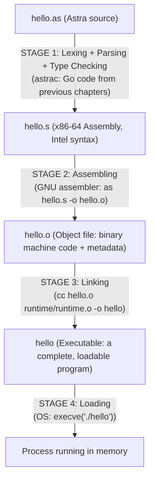

# Chapter 32: Object Files, Linking, and Executable Format

> "A program is not truly born until it is linked. Before that, it is just fragments, waiting to find their connections." — Anonymous linker engineer

---

## Overview

You have written Astra code, watched it become assembly, and understood how that assembly follows the ABI. But there is a gap between "assembly file" and "runnable program" that most programmers never think about. This chapter fills that gap completely.

When `astrac` compiles an Astra program, it does not hand the CPU an assembly text file. That text must be assembled into binary machine code, organized into an object file, and then linked together with other object files and libraries before the operating system can load and run it. Each of these steps has a rich structure.

We will explore object files (ELF, Mach-O, PE), sections, symbols, relocations, the linker's job, dynamic linking, and the role of libc. Then we will implement the Go code that drives this pipeline in `astrac`.

---

## What We're Building

The Astra Build Milestone for this chapter is the `Link()` method in the Astra compiler — the Go code that invokes external tools (GNU assembler `as`, linker via `cc`) to transform assembly output into a runnable executable. We will also build a minimal "Hello, World" in raw assembly with no C runtime.

---

## Table of Contents

1. The Compilation Pipeline for a Single File
2. What Is an Object File?
3. ELF: The Executable and Linkable Format
4. Object File Sections: .text, .data, .bss, .rodata
5. Symbols: Names for Code and Data
6. Relocations: Unresolved References
7. The Linker's Job
8. Static vs Dynamic Linking
9. The Dynamic Linker
10. libc: The C Standard Library as a Foundation
11. The Linker Script
12. Raw Assembly Hello World (No C Runtime)
13. Astra Build Milestone: The Linker Driver
14. Exercises
15. Summary

---

## 1. The Compilation Pipeline for a Single File

Let us trace the journey of a single Astra source file from source to executable:



Each stage is a distinct transformation. Let us look at each artifact in detail.

---

## 2. What Is an Object File?

After assembling, we get an **object file** — a binary file containing:

1. **Machine code** for the functions in this source file
2. **Data** for global variables defined in this file
3. **A symbol table** — a list of names (functions, variables) and where they are in the file
4. **Relocation entries** — a list of places in the code that reference other symbols whose addresses are not yet known
5. **Debug information** (if compiled with `-g`) — source file names, line numbers, type information

Object files are **not executable** on their own. They are building blocks — fragments of a complete program that the linker will assemble.

```
OBJECT FILE STRUCTURE:

+--------------------------------+
|     FILE HEADER               |
|  (identifies file type, arch) |
+--------------------------------+
|     SECTION TABLE             |
|  (index of all sections below)|
+--------------------------------+
|     .text section             |
|  (machine code bytes)         |
+--------------------------------+
|     .data section             |
|  (initialized global data)    |
+--------------------------------+
|     .bss section              |
|  (uninitialized globals)      |
+--------------------------------+
|     .rodata section           |
|  (read-only data: strings)    |
+--------------------------------+
|     .symtab section           |
|  (symbol table)               |
+--------------------------------+
|     .rela.text section        |
|  (relocation entries)         |
+--------------------------------+
|     .strtab section           |
|  (string table: symbol names) |
+--------------------------------+
```

---

## 3. ELF: The Executable and Linkable Format

Linux uses the **ELF (Executable and Linkable Format)** for both object files and executables. macOS uses **Mach-O**. Windows uses **PE (Portable Executable)**. Despite different formats, the concepts are the same.

### ELF File Header

The ELF header (64 bytes at the start of every ELF file) identifies the file:

```
ELF HEADER (64 bytes):
+--+--+--+--+  Bytes 0-3:  Magic number: 0x7F 'E' 'L' 'F'
|7F|45|4C|46|
+--+--+--+--+
|02|             Byte 4:   Class: 2 = ELF64 (64-bit)
+--+
|01|             Byte 5:   Data: 1 = little-endian
+--+
|01|             Byte 6:   ELF version: 1 (always)
+--+
...
|02|00|          Bytes 16-17: e_type: 2 = ET_EXEC (executable) or 1 = ET_REL (object)
+--+--+
|3E|00|          Bytes 18-19: e_machine: 0x3E = EM_X86_64
+--+--+
|01|00|00|00|    Bytes 20-23: e_version: 1
...
|entry_point|    Bytes 24-31: e_entry: virtual address of _start
...
```

You can inspect any ELF file with `readelf`:

```bash
# On Linux:
gcc -o hello hello.c
readelf -h hello           # View ELF header
readelf -S hello           # View section headers
readelf -s hello           # View symbol table
readelf -r hello           # View relocations
objdump -d hello           # Disassemble .text section
```

### Mach-O (macOS)

macOS uses Mach-O, which has a similar structure with different terminology:
- ELF sections → Mach-O sections organized into **segments** (.text, __DATA, etc.)
- ELF symbols → Mach-O symbols with slightly different visibility rules
- ELF relocations → Mach-O relocations

```bash
# On macOS:
clang -o hello hello.c
otool -h hello             # View Mach-O header
otool -l hello             # View load commands (section layout)
nm hello                   # View symbol table
otool -t hello             # Disassemble text section
```

---

## 4. Object File Sections

An object file is divided into named regions called **sections**. Each section stores one category of data.

### .text — Executable Code

The `.text` section contains the compiled machine code. Despite the name, it is binary — not human-readable text. It is marked as executable and read-only. The CPU fetches instructions from here.

```
.text section:
Offset  Bytes                     Disassembly
0x0000  55                        push rbp
0x0001  48 89 E5                  mov  rbp, rsp
0x0004  89 7D FC                  mov  DWORD PTR [rbp-4], edi
0x0007  8B 45 FC                  mov  eax, DWORD PTR [rbp-4]
0x000A  0F AF C0                  imul eax, eax
0x000D  5D                        pop  rbp
0x000E  C3                        ret
```

### .data — Initialized Global/Static Variables

The `.data` section contains global and static variables that have initial values.

```c
// C code:
int global_counter = 42;
char greeting[] = "hello";

// In .data section:
// global_counter: 2A 00 00 00  (42 in little-endian)
// greeting:       68 65 6C 6C 6F 00  ("hello\0")
```

The OS loads `.data` into memory when your program starts, with read/write permissions.

### .bss — Uninitialized Data

The `.bss` section represents global variables that are zero-initialized. Crucially, `.bss` takes up **no space in the file** — only a size is recorded. The OS allocates and zeroes the memory at load time.

```c
// C code:
int big_array[1000000];   // Zero initialized — lives in .bss
static int counter;       // Also zero initialized

// In object file:
// .bss section size = 4 * 1000000 + 4 = 4,000,004 bytes
// But the file itself stores 0 bytes for this!
```

The name "bss" is historical: "Block Started by Symbol" from 1950s IBM assembly language.

### .rodata — Read-Only Data

String literals and other constants go in `.rodata`. It is read-only (attempting to write to it causes a segfault — good for catching bugs).

```c
// C code:
const char* message = "Hello, World!";
// "Hello, World!" is in .rodata

printf("Hello, %s\n", name);
// The format string "Hello, %s\n" is in .rodata
```

In Astra:
```astra
print("Hello, Astra!")   // "Hello, Astra!" is in .rodata
```

---

## 5. Symbols: Names for Code and Data

A **symbol** is an entry in the symbol table that associates a name with a location in the file.

```
SYMBOL TABLE (from `nm hello.o`):
Name            Type   Binding    Value      Size
-----------     ----   -------    -----      ----
main            FUNC   GLOBAL     0x0000     0x3A
square          FUNC   GLOBAL     0x003A     0x12
global_counter  OBJ    GLOBAL     0x0000     0x04
.L0             LABEL  LOCAL      0x0010     0
```

### Symbol Binding

- **GLOBAL:** Visible to other object files. The linker will use global symbols to resolve cross-file references. Use `global func_name` in assembly (or in C, functions are global by default).
- **LOCAL:** Only visible within this object file. In C, `static` functions produce local symbols. In assembly, labels starting with `.` are typically local.
- **WEAK:** Like global, but can be overridden by another global definition.

### Symbol Types

- **FUNC (STT_FUNC):** A function. Points to the start of the function code in `.text`.
- **OBJECT (STT_OBJECT):** A data variable. Points to data in `.data` or `.bss`.
- **SECTION:** Points to a section start. Used internally by relocations.

### Undefined Symbols

If a file calls a function defined in another file (or library), that function's symbol appears in the symbol table as **undefined** (value = 0, type = UND). The linker's job is to find the definition and resolve these undefined references.

```bash
# See undefined symbols in an object file:
nm -u hello.o
# Output might show:
#   U printf    (undefined: will be found in libc)
#   U malloc    (undefined: will be found in libc)
```

---

## 6. Relocations: Unresolved References

When the assembler creates an object file, many addresses are not yet known. For example:

```asm
; In function.s:
call    printf          ; What is printf's address? Unknown!
lea     rsi, [message]  ; What is message's address? Unknown!
```

The assembler cannot fill in these addresses. Instead, it creates a **relocation entry** — a record that says "at offset X in section .text, there is a reference to symbol Y. When the linker knows Y's address, it should patch these bytes."

```
RELOCATION TABLE (.rela.text):
Offset    Type           Symbol   Addend
------    -----------    ------   ------
0x0005    R_X86_64_PLT32  printf   -4
0x0010    R_X86_64_32S    message   0
```

The linker reads these entries and patches the machine code with the correct addresses.

### Relocation Types

- **R_X86_64_64:** 64-bit absolute address. Patch with the symbol's full 64-bit address.
- **R_X86_64_32S:** 32-bit signed address. For near references that fit in 32 bits.
- **R_X86_64_PC32:** 32-bit PC-relative address. Used for `call` and `jmp` instructions (the address is relative to the next instruction).
- **R_X86_64_PLT32:** Like PC32, but uses the PLT (Procedure Linkage Table) for dynamic linking.

---

## 7. The Linker's Job

The linker (`ld` on Linux, the system linker on macOS) takes multiple object files and produces a single executable. It does three main things:

### Step 1: Symbol Resolution

The linker collects all symbol tables. Every undefined symbol must be found in exactly one other object file (or library). If a symbol is undefined in all inputs, the linker fails with "undefined reference to 'function_name'".

```
Object A:         Object B:         libc.so:
- defines: main   - defines: sqrt   - defines: printf
- uses: printf    - uses: printf    - defines: malloc
- uses: sqrt                        - defines: sqrt
                                    - defines: ...

Linker merges: main (from A) calls printf and sqrt,
               both found in libc.so. Done.
```

### Step 2: Relocation

After resolving symbols (every symbol now has a final address), the linker patches all relocation entries. It writes the correct addresses into the machine code bytes.

### Step 3: Layout

The linker arranges all input sections into a single output file. All `.text` sections from all object files are concatenated into one big `.text`. Similarly for `.data`, `.rodata`, `.bss`.

```
LINKER OUTPUT LAYOUT:

Input:  main.o (.text starts at 0)
        lib.o  (.text starts at 0)
        math.o (.text starts at 0)

Output executable:
        .text  [main.o code][lib.o code][math.o code]
               ^0x1000      ^0x1050     ^0x10A0
        .data  [main.o data][lib.o data][math.o data]
               ^0x2000      ...
        .bss   ...
```

---

## 8. Static vs Dynamic Linking

There are two ways to incorporate library code into your program.

### Static Linking

All library code is copied into your executable at link time. The executable contains everything it needs — it can run on any system, even one without the library installed.

```bash
# Static linking with libc:
gcc -static hello.c -o hello_static
ls -lh hello_static   # Typically 500KB-1MB (libc included!)
ldd hello_static      # Output: "not a dynamic executable" — no dependencies
```

**Pros:** No runtime dependencies, predictable behavior, can run on minimal systems.
**Cons:** Large executable, multiple programs each copy the same library code into RAM.

### Dynamic Linking

Library code stays in separate files (`.so` on Linux, `.dylib` on macOS, `.dll` on Windows). At runtime, the **dynamic linker** finds and loads the library.

```bash
# Dynamic linking (default):
gcc hello.c -o hello_dynamic
ls -lh hello_dynamic   # Typically 16KB (just the program code!)
ldd hello_dynamic      # Shows: libm.so.6, libc.so.6, ld-linux.so.2
```

**Pros:** Multiple programs share one copy of the library in RAM, smaller executables.
**Cons:** Requires the correct library versions at runtime, "DLL hell" on Windows.

```
DYNAMIC LINKING IN MEMORY:

Process A:                    Process B:
+----------------+            +----------------+
|  program code  |            |  program code  |
|  for A         |            |  for B         |
+----------------+            +----------------+
       |                             |
       v                             v
+----------------------------------------+
|           libc.so (one copy)           |
|  (mapped into both processes' spaces)  |
|  printf, malloc, free, read, write...  |
+----------------------------------------+
```

---

## 9. The Dynamic Linker

When you run a dynamically linked executable, the OS does not run your program immediately. First, it runs the **dynamic linker** (also called `ld-linux.so` or the dynamic linker/loader).

The dynamic linker:
1. Reads the executable's list of needed shared libraries
2. Finds each library on the filesystem (searching `LD_LIBRARY_PATH`, `/etc/ld.so.conf`, etc.)
3. Maps each library into the process's address space
4. Resolves all dynamic symbols (fixes up PLT/GOT entries)
5. Calls each library's initialization function (`__init_array`)
6. Hands control to your program's `_start` function

```
PROGRAM STARTUP SEQUENCE:

1. OS: load executable → find it needs ld-linux.so
2. OS: load ld-linux.so (the dynamic linker itself)
3. ld-linux.so: read executable's NEEDED list: ["libc.so.6", "libm.so.6"]
4. ld-linux.so: mmap libc.so.6 into address space
5. ld-linux.so: mmap libm.so.6 into address space
6. ld-linux.so: fix up GOT/PLT entries (lazy resolution)
7. ld-linux.so: call libc __init_array (sets up malloc arena, etc.)
8. ld-linux.so: jump to _start (in your executable)
9. _start: call __libc_start_main
10. __libc_start_main: call your main()
11. main() returns
12. __libc_start_main: call exit() → OS cleanup → done
```

### PLT and GOT

Dynamic calls go through two indirection tables:

**PLT (Procedure Linkage Table):** A trampoline in the executable's `.text`. When you call `printf`, you actually call `printf@PLT`, which jumps through the GOT.

**GOT (Global Offset Table):** A table of addresses in `.data`. Initially, each entry points back to the PLT resolver. The first call to a function triggers the dynamic linker to find the real address and fill it into the GOT. Subsequent calls go directly to the function.

This **lazy resolution** means functions are only looked up the first time they are called — improving startup time for large programs.

---

## 10. libc: The C Standard Library as a Foundation

Every C program (and Astra program) ultimately calls functions in `libc` — the C standard library. On Linux, this is `glibc`. On macOS, it is `libSystem`.

Libc provides:
- Memory management: `malloc`, `free`, `calloc`, `realloc`
- I/O: `printf`, `scanf`, `fopen`, `fread`, `fwrite`, `fclose`
- String operations: `strlen`, `strcpy`, `strcmp`, `sprintf`
- Math: `sqrt`, `sin`, `cos`, `pow`
- System call wrappers: `read`, `write`, `open`, `close`, `fork`, `exec`
- Program startup and teardown: `_start`, `__libc_start_main`, `exit`

Even though Astra has its own standard library, under the hood the Astra runtime calls into libc (or makes syscalls directly). The `cc` command we use to link automatically links libc.

**Why not link raw syscalls directly?**

You can (we show this in the raw assembly example below), but libc provides:
- Portability across kernel versions (ABI stability)
- Thread-local storage for errno
- Buffered I/O (dramatically faster than syscall-per-character)
- Complex features like locales, Unicode, crypto

---

## 11. The Linker Script

The linker's behavior is controlled by a **linker script** — a text file that specifies how to arrange sections in the output file. Most programs use the default system linker script (you never see it). Advanced programs — operating system kernels, bootloaders, embedded firmware — write custom linker scripts.

```
/* Example minimal linker script */
ENTRY(_start)      /* Program entry point */

SECTIONS {
    . = 0x400000;  /* Load address: 4MB into virtual address space */

    .text : {
        *(.text)   /* All .text sections from all input files */
    }

    .rodata : {
        *(.rodata) /* All .rodata sections */
    }

    . = ALIGN(4096);  /* Align to page boundary before writable sections */

    .data : {
        *(.data)
    }

    .bss : {
        *(.bss)
    }
}
```

For Astra, we will use the default system linker script by invoking `cc` (which internally invokes `ld` with the appropriate default script).

---

## 12. Raw Assembly Hello World (No C Runtime)

To understand what the OS actually requires of an executable, let us write the minimal possible program: print "Hello, World!" using only Linux syscalls, with no C runtime at all.

```asm
; hello_raw.asm
; Assemble: nasm -f elf64 hello_raw.asm -o hello_raw.o
; Link:     ld hello_raw.o -o hello_raw
; Run:      ./hello_raw

; This program uses Linux system calls directly.
; No C library. No runtime. Just pure OS interaction.

section .text           ; Declare executable section
    global _start       ; Export _start symbol (linker finds it as entry point)

_start:
    ; ================================================================
    ; System call: write(fd=1, buf=message, count=13)
    ; Linux syscall number for write: 1
    ; Arguments: rdi=fd, rsi=buf, rdx=count
    ; Return value in rax: number of bytes written (or -errno on error)
    ; ================================================================
    mov     rax, 1          ; syscall number: sys_write = 1
    mov     rdi, 1          ; file descriptor: 1 = stdout
    mov     rsi, message    ; pointer to string data
    mov     rdx, 13         ; number of bytes to write
    syscall                 ; transfer control to kernel

    ; ================================================================
    ; System call: exit(status=0)
    ; Linux syscall number for exit: 60
    ; Arguments: rdi=status
    ; ================================================================
    mov     rax, 60         ; syscall number: sys_exit = 60
    xor     rdi, rdi        ; exit status: 0 (success)
    syscall                 ; transfer control to kernel; this never returns

section .data           ; Declare data section
message:
    db      "Hello, World!", 10   ; "Hello, World!" followed by newline (ASCII 10)
                                   ; 13 bytes total (H-e-l-l-o-,-space-W-o-r-l-d-!)
                                   ; +1 for newline = 14? Let us count:
                                   ; H=1 e=2 l=3 l=4 o=5 ,=6 " "=7 W=8 o=9 r=10
                                   ; l=11 d=12 !=13 \n=14 → 14 bytes. Use rdx=14.
```

Wait, let me fix the byte count in the explanation:
- "Hello, World!" = 13 characters
- Plus newline = 14 bytes total
- Use `rdx = 14`

```asm
; Corrected:
section .data
message:
    db      "Hello, World!", 10   ; 14 bytes (13 chars + newline)

; And in _start:
    mov     rdx, 14         ; 14 bytes
```

To build and run on Linux:

```bash
nasm -f elf64 hello_raw.asm -o hello_raw.o
ld hello_raw.o -o hello_raw
./hello_raw
# Output: Hello, World!
```

This demonstrates: the only thing the OS needs from an executable is a `_start` symbol and valid system calls. No `main`, no libc, no runtime. The entire C ecosystem is built on top of this minimal foundation.

**On macOS,** syscalls work differently (macOS changes syscall numbers between releases, discourages direct syscalls, and requires `_main` as the entry point when linking with the system SDK):

```asm
; hello_mac.asm (macOS, using Mach-O format)
; Assemble: nasm -f macho64 hello_mac.asm -o hello_mac.o
; Link:     ld hello_mac.o -macosx_version_min 10.7 -lSystem -o hello_mac

section .text
    global _main

_main:
    ; On macOS, the write syscall is number 0x2000004
    mov     rax, 0x2000004   ; sys_write (macOS)
    mov     rdi, 1            ; stdout
    mov     rsi, message
    mov     rdx, 14
    syscall

    mov     rax, 0x2000001   ; sys_exit (macOS)
    xor     rdi, rdi
    syscall

section .data
message:
    db      "Hello, World!", 10
```

For Astra, we avoid direct syscalls and instead link with `libc` via `cc`. This keeps us portable.

---

## 13. Astra Build Milestone: The Linker Driver

Here is the complete Go implementation of Astra's build pipeline — the code that takes assembly output and produces an executable:

```go
// compiler/linker.go
// The Astra linker driver: invokes external tools (as, cc) to assemble
// and link Astra programs. This is the final stage of the astrac compiler.

package compiler

import (
    "fmt"
    "os"
    "os/exec"
    "path/filepath"
    "runtime"
    "strings"
)

// BuildConfig holds configuration for the build pipeline.
type BuildConfig struct {
    // Optimization level: 0 = none (for debugging), 1-3 = progressively more
    OptLevel int

    // Debug enables debug information in the output
    Debug bool

    // Verbose prints each command before running it
    Verbose bool

    // TargetOS is "linux" or "darwin" (macOS)
    TargetOS string

    // ExtraLinkFlags are additional flags passed to the linker
    ExtraLinkFlags []string

    // RuntimePath is the path to Astra's pre-compiled runtime object file
    RuntimePath string
}

// DefaultBuildConfig returns a build configuration suitable for the current system.
func DefaultBuildConfig() BuildConfig {
    return BuildConfig{
        OptLevel:    0,
        Debug:       false,
        Verbose:     false,
        TargetOS:    runtime.GOOS, // "linux" or "darwin" or "windows"
        RuntimePath: "runtime/runtime.o",
    }
}

// BuildPipeline manages the complete build process for an Astra program.
type BuildPipeline struct {
    config BuildConfig
}

// NewBuildPipeline creates a new build pipeline with the given configuration.
func NewBuildPipeline(config BuildConfig) *BuildPipeline {
    return &BuildPipeline{config: config}
}

// Build runs the complete build pipeline:
//   1. Write assembly to a .s file
//   2. Assemble the .s file to a .o file
//   3. Link the .o file with the Astra runtime to produce an executable
//
// asmContent is the assembly text produced by Astra's code generator.
// outputPath is the desired output executable path.
func (bp *BuildPipeline) Build(asmContent string, outputPath string) error {
    // Step 1: Write assembly to a temporary .s file
    asmFile := outputPath + ".s"
    if err := os.WriteFile(asmFile, []byte(asmContent), 0644); err != nil {
        return fmt.Errorf("failed to write assembly file %q: %w", asmFile, err)
    }
    // Clean up the assembly file when done (unless debugging)
    if !bp.config.Debug {
        defer os.Remove(asmFile)
    }

    // Step 2: Assemble
    objFile := outputPath + ".o"
    if err := bp.Assemble(asmFile, objFile); err != nil {
        return fmt.Errorf("assembly failed: %w", err)
    }
    if !bp.config.Debug {
        defer os.Remove(objFile)
    }

    // Step 3: Link
    if err := bp.Link(objFile, outputPath); err != nil {
        return fmt.Errorf("linking failed: %w", err)
    }

    return nil
}

// Assemble invokes the GNU assembler to convert assembly to an object file.
func (bp *BuildPipeline) Assemble(asmFile, objFile string) error {
    args := []string{
        asmFile,           // Input: assembly file
        "-o", objFile,     // Output: object file
    }

    if bp.config.Debug {
        args = append(args, "--gstabs") // Include STABS debug info
    }

    return bp.runCommand("as", args...)
}

// Link invokes the C compiler as a linker driver to link the program.
// Using `cc` (which calls `ld` internally) is easier than calling `ld` directly
// because cc handles:
// - Correct linker flags for the target OS
// - Linking libc and other system libraries automatically
// - Providing the CRT (C Runtime: _start, __libc_start_main, etc.)
func (bp *BuildPipeline) Link(objFile, outputFile string) error {
    args := []string{
        objFile,               // Our compiled object file
        "-o", outputFile,      // Output executable
        "-no-pie",             // Disable position-independent executable (simpler)
    }

    // Add Astra runtime if it exists
    if bp.config.RuntimePath != "" {
        if _, err := os.Stat(bp.config.RuntimePath); err == nil {
            args = append(args, bp.config.RuntimePath)
        }
    }

    // Platform-specific flags
    switch bp.config.TargetOS {
    case "darwin":
        // macOS needs extra linker flags
        args = append(args, "-Wl,-platform_version,macos,11.0,11.0")
    case "linux":
        // Linux: nothing extra needed for basic programs
    }

    // Add any extra link flags from config
    args = append(args, bp.config.ExtraLinkFlags...)

    return bp.runCommand("cc", args...)
}

// runCommand runs an external command, printing it if verbose.
func (bp *BuildPipeline) runCommand(name string, args ...string) error {
    if bp.config.Verbose {
        fmt.Printf("$ %s %s\n", name, strings.Join(args, " "))
    }

    cmd := exec.Command(name, args...)
    cmd.Stdout = os.Stdout
    cmd.Stderr = os.Stderr

    if err := cmd.Run(); err != nil {
        return fmt.Errorf("command %q failed: %w", name+" "+strings.Join(args, " "), err)
    }
    return nil
}

// CheckTools verifies that the required external tools are available.
// Returns an error listing any missing tools.
func CheckTools() error {
    required := []string{"as", "cc"}
    var missing []string

    for _, tool := range required {
        if _, err := exec.LookPath(tool); err != nil {
            missing = append(missing, tool)
        }
    }

    if len(missing) > 0 {
        return fmt.Errorf("missing required tools: %s\n"+
            "On Ubuntu/Debian: apt install gcc binutils\n"+
            "On macOS: xcode-select --install",
            strings.Join(missing, ", "))
    }
    return nil
}

// BuildRuntime compiles the Astra C runtime from source.
// The runtime provides basic functions that every Astra program needs:
// astra_print_int, astra_print_str, astra_alloc, astra_exit, etc.
func BuildRuntime(runtimeCFile, outputOFile string) error {
    // Check if runtime needs rebuilding
    if isUpToDate(runtimeCFile, outputOFile) {
        return nil // Already up to date
    }

    args := []string{
        "-c",              // Compile only, do not link
        runtimeCFile,      // Input: runtime C source
        "-o", outputOFile, // Output: runtime object file
        "-O2",             // Optimize the runtime
        "-fPIC",           // Position-independent code (for shared library compat)
    }

    cmd := exec.Command("cc", args...)
    cmd.Stdout = os.Stdout
    cmd.Stderr = os.Stderr

    if err := cmd.Run(); err != nil {
        return fmt.Errorf("runtime compilation failed: %w", err)
    }
    return nil
}

// isUpToDate checks if the output file is newer than the input file.
// If so, we do not need to rebuild.
func isUpToDate(inputFile, outputFile string) bool {
    inStat, err := os.Stat(inputFile)
    if err != nil {
        return false
    }
    outStat, err := os.Stat(outputFile)
    if err != nil {
        return false // Output does not exist
    }
    return outStat.ModTime().After(inStat.ModTime())
}

// Full integration: the astrac Build command
// This is what runs when you type: astrac build main.as

// CompileAndLink is the main entry point for the astrac compiler.
// It takes an Astra source file and produces an executable.
func CompileAndLink(sourceFile, outputFile string, config BuildConfig) error {
    // 1. Check tools are available
    if err := CheckTools(); err != nil {
        return err
    }

    // 2. Build Astra runtime (if not already built)
    runtimeC := filepath.Join(filepath.Dir(config.RuntimePath), "..", "runtime", "runtime.c")
    if err := BuildRuntime(runtimeC, config.RuntimePath); err != nil {
        return fmt.Errorf("failed to build Astra runtime: %w", err)
    }

    // 3. Read and compile Astra source
    source, err := os.ReadFile(sourceFile)
    if err != nil {
        return fmt.Errorf("failed to read source file %q: %w", sourceFile, err)
    }

    // 4. Run the compiler pipeline (lexer → parser → typechecker → codegen)
    // (This calls the compiler stages from previous chapters)
    asmOutput, err := CompileAstraToAssembly(string(source), sourceFile)
    if err != nil {
        return fmt.Errorf("compilation error in %q: %w", sourceFile, err)
    }

    // 5. Assemble and link
    pipeline := NewBuildPipeline(config)
    if err := pipeline.Build(asmOutput, outputFile); err != nil {
        return err
    }

    if config.Verbose {
        fmt.Printf("Successfully built %q → %q\n", sourceFile, outputFile)
    }
    return nil
}

// CompileAstraToAssembly is a placeholder for the full compiler pipeline.
// In a complete implementation, this calls Lexer → Parser → TypeChecker → CodeGen.
func CompileAstraToAssembly(source, filename string) (string, error) {
    // TODO: Plug in the actual compiler pipeline from earlier chapters.
    // For now, return a simple "hello world" assembly as a placeholder.
    return `    .section .text
    .global main
main:
    push    rbp
    mov     rbp, rsp
    mov     rdi, 0
    call    astra_exit
`, nil
}
```

And the Astra runtime in C:

```c
// runtime/runtime.c
// The Astra runtime: thin wrapper functions that Astra-generated code calls.
// Compiled separately and linked with every Astra program.

#include <stdio.h>
#include <stdlib.h>
#include <string.h>
#include <stdint.h>

// Print an integer followed by a newline
void astra_print_int(int64_t value) {
    printf("%lld\n", (long long)value);
}

// Print a string followed by a newline
void astra_print_str(const char* str) {
    puts(str);
}

// Print a boolean (true/false)
void astra_print_bool(int64_t value) {
    puts(value ? "true" : "false");
}

// Allocate memory (wrapper around malloc with panic on failure)
void* astra_alloc(int64_t size) {
    void* ptr = malloc((size_t)size);
    if (!ptr) {
        fputs("astra: out of memory\n", stderr);
        exit(1);
    }
    return ptr;
}

// Free allocated memory
void astra_free(void* ptr) {
    free(ptr);
}

// Exit with given status code
void astra_exit(int64_t code) {
    exit((int)code);
}

// Integer to string (returns a malloc'd string — caller must free)
char* astra_int_to_string(int64_t value) {
    // Max int64: 19 digits + sign + null = 21 chars
    char* buf = (char*)astra_alloc(21);
    snprintf(buf, 21, "%lld", (long long)value);
    return buf;
}

// String length
int64_t astra_strlen(const char* str) {
    return (int64_t)strlen(str);
}

// String concatenation (returns malloc'd result)
char* astra_strcat(const char* a, const char* b) {
    size_t la = strlen(a), lb = strlen(b);
    char* result = (char*)astra_alloc((int64_t)(la + lb + 1));
    memcpy(result, a, la);
    memcpy(result + la, b, lb);
    result[la + lb] = '\0';
    return result;
}

// Panic with a message and exit
void astra_panic(const char* message) {
    fprintf(stderr, "astra panic: %s\n", message);
    exit(1);
}
```

---

## 14. Exercises

**Exercise 1 — Inspect an ELF:**
Compile any C program on Linux with `gcc -o test test.c`. Run `readelf -S test` to see its sections. List all sections and describe what each one contains.

**Exercise 2 — Symbol Table:**
Compile `gcc -c test.c -o test.o` (object file only). Run `nm test.o`. What symbols are defined (capital letters)? What are undefined (lowercase U)? Why are the undefined ones undefined?

**Exercise 3 — Static vs Dynamic Size:**
Compile the same "Hello, World" C program twice: once with `-static` and once without. Compare file sizes. What is the ratio? Run `ldd` on each. What does this tell you about the tradeoff?

**Exercise 4 — Section Contents:**
Use `objdump -d` to disassemble the `.text` section of a compiled program. Use `objdump -s -j .rodata` to see the raw bytes of `.rodata`. Find a string literal from your source code in the `.rodata` dump.

**Exercise 5 — Relocation Analysis:**
Compile with `gcc -c test.c -o test.o` and run `readelf -r test.o`. Find a relocation for a function call. What type is it (R_X86_64_PLT32 or something else)? What does this type mean?

**Exercise 6 — Raw Syscall:**
Write and run the raw assembly Hello World from section 12 on Linux (or the macOS variant). Modify it to print "Hello from Astra!" and exit with code 42. Verify the exit code with `echo $?` after running.

**Exercise 7 — Linker Error:**
Create two C files: `a.c` defines `int add(int a, int b) { return a + b; }` and `b.c` calls `add` but does not include a declaration. Compile both to `.o` files. Try to link them. Now delete `a.o` and try to link again. What is the error? How does it relate to our discussion of undefined symbols?

**Exercise 8 — Runtime Extension:**
Add a function `astra_print_float(double value)` to the Astra runtime in C. It should print the value with 6 decimal places. Then write the Go code in the linker driver test that builds the runtime and verify the new function is in the symbol table.

---

## 15. Summary

| Concept | Detail |
|---------|--------|
| Object file | Binary fragment: machine code + symbols + relocations (not yet executable) |
| ELF | Linux format for object files and executables |
| Mach-O | macOS format; similar concepts, different structure |
| .text | Executable machine code |
| .data | Initialized global/static variables |
| .bss | Uninitialized globals (zero-filled at load time; no file space) |
| .rodata | Read-only constants (string literals, etc.) |
| Symbol | Name + address in an object file |
| Undefined symbol | Name used but not defined here; linker must find it |
| Relocation | "Patch this address when you know where X lives" |
| Linker | Resolves symbols, applies relocations, arranges output |
| Static linking | Library code copied into executable (self-contained) |
| Dynamic linking | Library loaded at runtime (shared, smaller binaries) |
| PLT/GOT | Indirection tables enabling lazy dynamic symbol resolution |
| libc | Foundation library wrapping syscalls; linked by default |
| syscall | Direct OS call (`SYSCALL` instruction + convention) |
| `as` | GNU assembler: converts .s → .o |
| `cc` | C compiler used as linker driver: invokes `ld` with correct flags |

The build pipeline — from source to executable — is now complete. We can write Astra source, compile it to assembly, assemble it to an object file, and link it with the runtime to get a working binary. In the next chapter, we step back to understand virtual machines — a powerful alternative to native compilation that illuminates many concepts about code generation.
