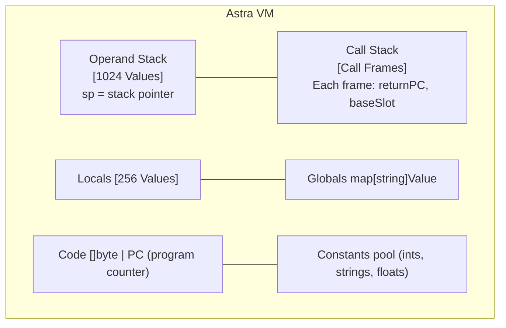

# Chapter 33: Building a Tiny Virtual Machine — Understanding Code Execution

> "The purpose of abstraction is not to be vague, but to create a new semantic level in which one can be absolutely precise." — Edsger W. Dijkstra

---

## Overview

When you hear "virtual machine," you might think of VMware or VirtualBox — software that runs an entire operating system inside another operating system. That is a *system* virtual machine. What we are building in this chapter is something entirely different: a *process* virtual machine, also called a bytecode interpreter or a language virtual machine.

A language VM is a program that reads a stream of simple instructions — called **bytecode** — and executes them one by one, simulating a CPU in software. The Java Virtual Machine (JVM) runs Java bytecode. CPython executes Python bytecode. The Lua VM runs Lua bytecode. WebAssembly is designed for a VM. These are among the most important pieces of software ever written.

In this chapter we will build our own VM from scratch in Go. It will be small — about 350 lines — but fully functional. It will support arithmetic, variables, control flow (if/else, loops), and function calls. By the end, we will run a Fibonacci function through it. This VM will serve as the "simple compilation target" for the Astra compiler before we graduate to generating native x86-64 code in Chapter 45.

This chapter is genuinely exciting because you will see, at the lowest possible level of abstraction, how code actually executes. Every JavaScript engine, every Python interpreter, every JVM started with something like what we are building here.

---

## What We Are Building

By the end of this chapter you will have:

- A deep understanding of what a virtual machine is and how it differs from a physical CPU
- A clear understanding of stack-based vs register-based VM design
- A complete opcode set for a minimal but capable stack VM
- A working implementation of the VM struct and execution loop in Go
- Implementations of every opcode: arithmetic, comparisons, variables, jumps, and function calls
- A hand-compiled "assembly" program showing how Astra source code maps to bytecode
- A complete Fibonacci implementation running on our VM
- Understanding of how control flow (if/else, loops) is implemented using jumps

---

## Table of Contents

1. What Is a Virtual Machine?
2. Stack-Based vs Register-Based VMs
3. Designing Our Opcode Set
4. The VM Data Structures
5. The Execution Loop
6. Implementing Every Opcode
7. Compiling a Simple Program to Bytecode
8. Function Calls: CALL and RETURN
9. Control Flow: Jumps for if/else and Loops
10. Astra Build Milestone: Complete VM + Fibonacci

---

## 1. What Is a Virtual Machine?

### A CPU in Software

A real CPU (Central Processing Unit) does a very simple thing: it reads instructions from memory, one by one, and executes them. Each instruction does something tiny — add two numbers, load a value from memory, jump to a different instruction. The CPU's "fetch-decode-execute" loop runs billions of times per second.

```
Physical CPU cycle:
  1. FETCH: Read the instruction at the current program counter (PC)
  2. DECODE: Figure out what kind of instruction it is
  3. EXECUTE: Perform the operation (arithmetic, memory access, jump)
  4. Increment PC, repeat
```

A **language virtual machine** does exactly the same thing, but in software. Instead of silicon logic gates doing the work, it is Go code (in our case) doing the work. Instead of machine code (x86-64 instructions), it executes **bytecode** — a compact, custom instruction set we design ourselves.

```
Language VM cycle:
  1. FETCH: Read the byte at vm.code[vm.pc]
  2. DECODE: Switch on the opcode value
  3. EXECUTE: Call the Go code for that opcode
  4. Increment vm.pc, repeat
```

### Why VMs Exist

**Portability**: A compiler that targets our VM's bytecode will run on any platform where our VM runs. Compile once, run anywhere. Java's entire business model for the first decade was this promise: "Write Once, Run Anywhere" with the JVM.

**Safety and Sandboxing**: The VM controls what the bytecode can do. It can prohibit certain operations (like direct memory access), enforce memory limits, and catch errors before they crash the system. WebAssembly uses this to safely run untrusted code in browsers.

**Easier Code Generation**: Generating bytecode for a simple stack VM is much easier than generating x86-64 machine code directly. Our Astra compiler will first target this VM, which will let us get a working end-to-end system quickly before optimizing.

**Better Error Messages**: When a VM executes, it can maintain rich metadata (source line numbers, variable names) to give excellent runtime error messages and stack traces.

### Real-World Examples

```
VM                | Language   | Bytecode Format   | Design
──────────────────┼────────────┼───────────────────┼──────────────────
JVM               | Java, Kotlin, Scala | .class files | Stack-based
CPython           | Python     | .pyc files        | Stack-based
CLR               | C#, F#, VB | MSIL/CIL          | Stack-based
Lua VM (5.1+)     | Lua        | Internal format   | Register-based
Dalvik/ART        | Android Java| .dex files       | Register-based
WebAssembly       | Any        | .wasm files       | Stack-based
Erlang BEAM       | Erlang, Elixir | .beam files  | Register-based
```

Our VM will be stack-based, like the JVM and CPython. Stack-based VMs are simpler to build and simpler to target — perfect for a learning project.

---

## 2. Stack-Based vs Register-Based VMs

### Stack-Based VMs

In a stack-based VM, all operations work through a central **operand stack**. To add two numbers, you push them both onto the stack, then execute the ADD instruction, which pops two values, adds them, and pushes the result.

```
Compute 2 + 3:

Instruction:    Stack (bottom → top):
PUSH_INT 2      [2]
PUSH_INT 3      [2, 3]
ADD             [5]         ← popped 2 and 3, pushed 5
PRINT           []          ← popped 5, printed "5"
```

The stack handles all intermediate values. You never need to say "add register 1 and register 2 into register 3" — the stack is implicit.

**Pros of stack-based**: Instructions are compact (many need no operands). The code generator is simple — just push operands and then emit the operator instruction. The VM itself is simple to implement.

**Cons of stack-based**: There are more instructions per operation (need to push each operand). The stack can be a bottleneck because each operation touches it.

### Register-Based VMs

In a register-based VM, values live in a fixed set of "virtual registers" — numbered slots that can hold values. Instructions explicitly name which registers to use as source and destination.

```
Compute 2 + 3 into R0:

Instruction:          Registers:
MOVE R1, 2            R1=2
MOVE R2, 3            R2=3
ADD  R0, R1, R2       R0=5   (R0 = R1 + R2)
PRINT R0                     (print R0 = 5)
```

**Pros of register-based**: Fewer instructions per computation. Faster execution (no stack push/pop overhead). More natural target for optimization.

**Cons of register-based**: Instructions are larger (each needs to name registers). The code generator is more complex (needs to allocate registers). The VM is more complex.

The Lua VM switched from stack-based to register-based in version 5.0 and measured a 50% speed improvement. But our priority is simplicity and learnability, so we will use a stack-based design.

### Our VM's Design



---

## 3. Designing Our Opcode Set

Each instruction in our VM is identified by a single byte — the opcode. Some instructions take immediate arguments in the following bytes (like the integer constant to push, or the jump offset).

```go
// vm/opcodes.go

package vm

// Opcode is a single-byte instruction identifier.
type Opcode byte

const (
    // === Stack Operations ===
    PUSH_INT   Opcode = iota // [PUSH_INT][8 bytes: int64]  Push integer constant
    PUSH_STR                 // [PUSH_STR][4 bytes: idx]    Push string from constant pool
    PUSH_FLOAT               // [PUSH_FLOAT][8 bytes: f64]  Push float constant
    PUSH_BOOL                // [PUSH_BOOL][1 byte: 0/1]    Push boolean
    PUSH_NULL                // [PUSH_NULL]                  Push null value
    POP                      // [POP]                        Discard top of stack

    // === Arithmetic ===
    ADD   // [ADD]  pop b, pop a, push a+b
    SUB   // [SUB]  pop b, pop a, push a-b
    MUL   // [MUL]  pop b, pop a, push a*b
    DIV   // [DIV]  pop b, pop a, push a/b
    MOD   // [MOD]  pop b, pop a, push a%b
    NEG   // [NEG]  pop a, push -a

    // === Comparisons (push 1 for true, 0 for false) ===
    EQ  // pop b, pop a, push a==b
    NEQ // pop b, pop a, push a!=b
    LT  // pop b, pop a, push a<b
    LTE // pop b, pop a, push a<=b
    GT  // pop b, pop a, push a>b
    GTE // pop b, pop a, push a>=b

    // === Boolean Logic ===
    AND // pop b, pop a, push a&&b
    OR  // pop b, pop a, push a||b
    NOT // pop a, push !a

    // === Variable Access ===
    LOAD_LOCAL   // [LOAD_LOCAL][1 byte: slot]  Push locals[slot]
    STORE_LOCAL  // [STORE_LOCAL][1 byte: slot] Pop → locals[slot]
    LOAD_GLOBAL  // [LOAD_GLOBAL][4 bytes: idx] Push globals[name_from_pool]
    STORE_GLOBAL // [STORE_GLOBAL][4 bytes: idx] Pop → globals[name_from_pool]

    // === Control Flow ===
    JUMP          // [JUMP][4 bytes: offset]     Unconditional jump to pc+offset
    JUMP_IF_FALSE // [JUMP_IF_FALSE][4 bytes: offset] Pop; jump if false/zero
    JUMP_IF_TRUE  // [JUMP_IF_TRUE][4 bytes: offset]  Pop; jump if true/nonzero

    // === Functions ===
    CALL   // [CALL][1 byte: argc]  Pop argc args + function addr, call
    RETURN // [RETURN]              Pop return value, restore frame, push return value

    // === I/O ===
    PRINT // [PRINT] Pop top of stack and print it

    // === Control ===
    HALT // [HALT] Stop the VM
)
```

### Why These Opcodes?

This set is minimal but complete. Any program expressible in Astra can be compiled to these ~30 opcodes. Let us categorize what they give us:

- **PUSH_*** opcodes: load constants onto the stack (the "data" in computations)
- **ADD/SUB/MUL/DIV**: the basic arithmetic every program needs
- **EQ/LT/GT/**: comparisons for conditionals and loops
- **LOAD/STORE_LOCAL**: local variable access within functions
- **LOAD/STORE_GLOBAL**: file-scope or program-scope variables
- **JUMP family**: implement if/else and loops
- **CALL/RETURN**: function invocation and return
- **PRINT/HALT**: output and program termination

---

## 4. The VM Data Structures

Now let us define the core data structures our VM uses.

```go
// vm/value.go

package vm

// ValueType identifies what kind of value is stored in a Value.
type ValueType int

const (
    ValInt   ValueType = iota // 64-bit signed integer
    ValFloat                  // 64-bit floating point
    ValBool                   // boolean (true/false)
    ValStr                    // string
    ValNull                   // null/nil
    ValFunc                   // function (stores entry point)
)

// Value is a dynamically-typed value that can hold any Astra type.
// In a production VM you would use a more efficient representation
// (e.g., NaN-boxing), but this struct is clear and easy to understand.
type Value struct {
    Type ValueType
    IVal int64   // used when Type == ValInt
    FVal float64 // used when Type == ValFloat
    BVal bool    // used when Type == ValBool
    SVal string  // used when Type == ValStr or ValFunc
}

// Constructors for convenience
func IntVal(n int64) Value    { return Value{Type: ValInt, IVal: n} }
func FloatVal(f float64) Value { return Value{Type: ValFloat, FVal: f} }
func BoolVal(b bool) Value    { return Value{Type: ValBool, BVal: b} }
func StrVal(s string) Value   { return Value{Type: ValStr, SVal: s} }
func NullVal() Value          { return Value{Type: ValNull} }
func FuncVal(name string) Value { return Value{Type: ValFunc, SVal: name} }

// IsTruthy returns the boolean interpretation of a value.
func (v Value) IsTruthy() bool {
    switch v.Type {
    case ValBool:  return v.BVal
    case ValInt:   return v.IVal != 0
    case ValFloat: return v.FVal != 0
    case ValStr:   return v.SVal != ""
    case ValNull:  return false
    default:       return true
    }
}

// String returns a human-readable representation.
func (v Value) String() string {
    switch v.Type {
    case ValInt:   return fmt.Sprintf("%d", v.IVal)
    case ValFloat: return fmt.Sprintf("%g", v.FVal)
    case ValBool:
        if v.BVal { return "true" }
        return "false"
    case ValStr:   return v.SVal
    case ValNull:  return "null"
    case ValFunc:  return fmt.Sprintf("<fn %s>", v.SVal)
    default:       return "<unknown>"
    }
}
```

```go
// vm/vm.go

package vm

import (
    "encoding/binary"
    "fmt"
    "os"
)

// CallFrame records the state of a function call in progress.
// When we call a function, we push a CallFrame. When we return, we pop it.
type CallFrame struct {
    returnPC int // the PC to jump back to after RETURN
    baseSlot int // the start index in the locals array for this frame
    // (each function gets a slice of the locals array as its local variables)
}

// VM is our virtual machine.
type VM struct {
    // === Operand Stack ===
    stack [1024]Value // the main value stack
    sp    int         // stack pointer: stack[sp-1] is the top

    // === Local and Global Variables ===
    locals  [256]Value        // local variable slots (shared, partitioned by frames)
    globals map[string]Value  // global variables

    // === Program Storage ===
    code      []byte          // the bytecode to execute
    pc        int             // program counter: index of the NEXT byte to execute
    constants []Value         // constant pool (for strings, etc.)

    // === Call Stack ===
    callStack []CallFrame     // stack of active function calls
    localBase int             // the current frame's base in the locals array

    // === Function Registry ===
    // Maps function name → bytecode start address
    functions map[string]int
}

// NewVM creates a new virtual machine ready to execute bytecode.
func NewVM() *VM {
    return &VM{
        globals:   make(map[string]Value),
        functions: make(map[string]int),
    }
}

// === Stack Operations ===

// push pushes a value onto the operand stack.
func (vm *VM) push(v Value) {
    if vm.sp >= len(vm.stack) {
        fmt.Fprintln(os.Stderr, "astra: stack overflow")
        os.Exit(1)
    }
    vm.stack[vm.sp] = v
    vm.sp++
}

// pop removes and returns the top value from the operand stack.
func (vm *VM) pop() Value {
    if vm.sp == 0 {
        fmt.Fprintln(os.Stderr, "astra: stack underflow")
        os.Exit(1)
    }
    vm.sp--
    return vm.stack[vm.sp]
}

// peek returns the top value without removing it.
func (vm *VM) peek() Value {
    if vm.sp == 0 {
        fmt.Fprintln(os.Stderr, "astra: peek on empty stack")
        os.Exit(1)
    }
    return vm.stack[vm.sp-1]
}

// === Bytecode Reading Helpers ===

// readByte reads the next byte from the bytecode and advances pc.
func (vm *VM) readByte() byte {
    b := vm.code[vm.pc]
    vm.pc++
    return b
}

// readInt16 reads a signed 16-bit integer from the bytecode.
func (vm *VM) readInt16() int16 {
    b := vm.code[vm.pc : vm.pc+2]
    vm.pc += 2
    return int16(binary.BigEndian.Uint16(b))
}

// readInt32 reads a signed 32-bit integer from the bytecode.
func (vm *VM) readInt32() int32 {
    b := vm.code[vm.pc : vm.pc+4]
    vm.pc += 4
    return int32(binary.BigEndian.Uint32(b))
}

// readInt64 reads a signed 64-bit integer from the bytecode.
func (vm *VM) readInt64() int64 {
    b := vm.code[vm.pc : vm.pc+8]
    vm.pc += 8
    return int64(binary.BigEndian.Uint64(b))
}
```

---

## 5. The Execution Loop

The heart of the VM is the `Run` method — the **dispatch loop**. It fetches an opcode, switches on it, executes the corresponding logic, and repeats until HALT.

```go
// Run executes the bytecode loaded into vm.code.
// Returns the top-of-stack value when HALT is reached.
func (vm *VM) Run(code []byte) (Value, error) {
    vm.code = code
    vm.pc = 0

    for {
        // FETCH: read the next opcode
        op := Opcode(vm.readByte())

        // DECODE & EXECUTE
        switch op {

        // ──────────────────────────────────────────
        //  PUSH CONSTANTS
        // ──────────────────────────────────────────
        case PUSH_INT:
            n := vm.readInt64()
            vm.push(IntVal(n))

        case PUSH_BOOL:
            b := vm.readByte()
            vm.push(BoolVal(b != 0))

        case PUSH_NULL:
            vm.push(NullVal())

        case POP:
            vm.pop()

        // ──────────────────────────────────────────
        //  ARITHMETIC
        // ──────────────────────────────────────────
        case ADD:
            b := vm.pop()
            a := vm.pop()
            if a.Type == ValInt && b.Type == ValInt {
                vm.push(IntVal(a.IVal + b.IVal))
            } else {
                // float promotion
                af := toFloat(a)
                bf := toFloat(b)
                vm.push(FloatVal(af + bf))
            }

        case SUB:
            b := vm.pop()
            a := vm.pop()
            if a.Type == ValInt && b.Type == ValInt {
                vm.push(IntVal(a.IVal - b.IVal))
            } else {
                vm.push(FloatVal(toFloat(a) - toFloat(b)))
            }

        case MUL:
            b := vm.pop()
            a := vm.pop()
            if a.Type == ValInt && b.Type == ValInt {
                vm.push(IntVal(a.IVal * b.IVal))
            } else {
                vm.push(FloatVal(toFloat(a) * toFloat(b)))
            }

        case DIV:
            b := vm.pop()
            a := vm.pop()
            if b.Type == ValInt && b.IVal == 0 {
                return NullVal(), fmt.Errorf("runtime error: division by zero")
            }
            if a.Type == ValInt && b.Type == ValInt {
                vm.push(IntVal(a.IVal / b.IVal))
            } else {
                vm.push(FloatVal(toFloat(a) / toFloat(b)))
            }

        case MOD:
            b := vm.pop()
            a := vm.pop()
            if b.IVal == 0 {
                return NullVal(), fmt.Errorf("runtime error: modulo by zero")
            }
            vm.push(IntVal(a.IVal % b.IVal))

        case NEG:
            a := vm.pop()
            if a.Type == ValInt {
                vm.push(IntVal(-a.IVal))
            } else {
                vm.push(FloatVal(-a.FVal))
            }

        // ──────────────────────────────────────────
        //  COMPARISONS
        // ──────────────────────────────────────────
        case EQ:
            b := vm.pop()
            a := vm.pop()
            vm.push(BoolVal(valuesEqual(a, b)))

        case NEQ:
            b := vm.pop()
            a := vm.pop()
            vm.push(BoolVal(!valuesEqual(a, b)))

        case LT:
            b := vm.pop()
            a := vm.pop()
            vm.push(BoolVal(toFloat(a) < toFloat(b)))

        case LTE:
            b := vm.pop()
            a := vm.pop()
            vm.push(BoolVal(toFloat(a) <= toFloat(b)))

        case GT:
            b := vm.pop()
            a := vm.pop()
            vm.push(BoolVal(toFloat(a) > toFloat(b)))

        case GTE:
            b := vm.pop()
            a := vm.pop()
            vm.push(BoolVal(toFloat(a) >= toFloat(b)))

        // ──────────────────────────────────────────
        //  BOOLEAN LOGIC
        // ──────────────────────────────────────────
        case AND:
            b := vm.pop()
            a := vm.pop()
            vm.push(BoolVal(a.IsTruthy() && b.IsTruthy()))

        case OR:
            b := vm.pop()
            a := vm.pop()
            vm.push(BoolVal(a.IsTruthy() || b.IsTruthy()))

        case NOT:
            a := vm.pop()
            vm.push(BoolVal(!a.IsTruthy()))

        // ──────────────────────────────────────────
        //  VARIABLES
        // ──────────────────────────────────────────
        case LOAD_LOCAL:
            slot := int(vm.readByte())
            vm.push(vm.locals[vm.localBase+slot])

        case STORE_LOCAL:
            slot := int(vm.readByte())
            vm.locals[vm.localBase+slot] = vm.pop()

        case LOAD_GLOBAL:
            nameIdx := int(vm.readInt32())
            name := vm.constants[nameIdx].SVal
            val, ok := vm.globals[name]
            if !ok {
                return NullVal(), fmt.Errorf("undefined variable: %s", name)
            }
            vm.push(val)

        case STORE_GLOBAL:
            nameIdx := int(vm.readInt32())
            name := vm.constants[nameIdx].SVal
            vm.globals[name] = vm.pop()

        // ──────────────────────────────────────────
        //  CONTROL FLOW
        // ──────────────────────────────────────────
        case JUMP:
            offset := int(vm.readInt32())
            vm.pc += offset

        case JUMP_IF_FALSE:
            offset := int(vm.readInt32())
            condition := vm.pop()
            if !condition.IsTruthy() {
                vm.pc += offset
            }

        case JUMP_IF_TRUE:
            offset := int(vm.readInt32())
            condition := vm.pop()
            if condition.IsTruthy() {
                vm.pc += offset
            }

        // ──────────────────────────────────────────
        //  FUNCTIONS
        // ──────────────────────────────────────────
        case CALL:
            argc := int(vm.readByte())
            // The function name was pushed before the arguments.
            // We need to find it: it is argc positions below the top.
            fnVal := vm.stack[vm.sp-argc-1]
            fnEntry, ok := vm.functions[fnVal.SVal]
            if !ok {
                return NullVal(), fmt.Errorf("undefined function: %s", fnVal.SVal)
            }

            // Push a call frame, saving our current state
            vm.callStack = append(vm.callStack, CallFrame{
                returnPC: vm.pc,
                baseSlot: vm.localBase,
            })

            // Arguments become the first locals of the new frame.
            // Copy args from stack into new local slots.
            newBase := vm.localBase + 8 // give current frame some space
            for i := 0; i < argc; i++ {
                // Args are on stack in order: arg0 at sp-argc, arg1 at sp-argc+1 ...
                vm.locals[newBase+i] = vm.stack[vm.sp-argc+i]
            }
            vm.sp -= argc + 1 // pop args + function name from stack
            vm.localBase = newBase
            vm.pc = fnEntry // jump to function body

        case RETURN:
            retVal := vm.pop() // the return value is on top of stack

            // Restore the previous call frame
            if len(vm.callStack) == 0 {
                return retVal, nil // returning from main → done
            }
            frame := vm.callStack[len(vm.callStack)-1]
            vm.callStack = vm.callStack[:len(vm.callStack)-1]
            vm.pc = frame.returnPC
            vm.localBase = frame.baseSlot

            vm.push(retVal) // push return value for caller

        // ──────────────────────────────────────────
        //  I/O and CONTROL
        // ──────────────────────────────────────────
        case PRINT:
            val := vm.pop()
            fmt.Println(val.String())

        case HALT:
            if vm.sp > 0 {
                return vm.pop(), nil
            }
            return NullVal(), nil

        default:
            return NullVal(), fmt.Errorf("unknown opcode: %d at pc=%d", op, vm.pc-1)
        }
    }
}

// Helper: convert any numeric Value to float64.
func toFloat(v Value) float64 {
    if v.Type == ValFloat { return v.FVal }
    return float64(v.IVal)
}

// Helper: check if two Values are equal.
func valuesEqual(a, b Value) bool {
    if a.Type != b.Type { return false }
    switch a.Type {
    case ValInt:   return a.IVal == b.IVal
    case ValFloat: return a.FVal == b.FVal
    case ValBool:  return a.BVal == b.BVal
    case ValStr:   return a.SVal == b.SVal
    case ValNull:  return true
    }
    return false
}
```

---

## 6. Compiling a Simple Program to Bytecode

Let us trace exactly how a simple Astra program compiles to bytecode.

### Source Program

```
let x = 5
let y = 3
print(x + y)
```

### Hand-Written Bytecode (Assembly Form)

```
; Astra VM "assembly" for the above program
; Format: OPCODE [arguments]  ; comment

PUSH_INT 5        ; push the constant 5
STORE_LOCAL 0     ; pop → locals[0]  (this is "x")

PUSH_INT 3        ; push the constant 3
STORE_LOCAL 1     ; pop → locals[1]  (this is "y")

LOAD_LOCAL 0      ; push locals[0]  (value of x = 5)
LOAD_LOCAL 1      ; push locals[1]  (value of y = 3)
ADD               ; pop 3 and 5, push 8
PRINT             ; pop 8, print "8"

HALT
```

### The Actual Bytes

```
Offset  Bytes               Instruction
0       0x00 0x00...05      PUSH_INT 5        (opcode 0x00, then 8 bytes for int64)
9       0x15 0x00           STORE_LOCAL 0     (opcode 0x15, slot byte)
11      0x00 0x00...03      PUSH_INT 3
20      0x15 0x01           STORE_LOCAL 1
22      0x14 0x00           LOAD_LOCAL 0
24      0x14 0x01           LOAD_LOCAL 1
26      0x06                ADD
27      0x1E                PRINT
28      0x1F                HALT
```

### Execution Trace

```
PC=0:  PUSH_INT 5    → stack: [5],       locals: [_, _]
PC=9:  STORE_LOCAL 0 → stack: [],        locals: [5, _]
PC=11: PUSH_INT 3    → stack: [3],       locals: [5, _]
PC=20: STORE_LOCAL 1 → stack: [],        locals: [5, 3]
PC=22: LOAD_LOCAL 0  → stack: [5],       locals: [5, 3]
PC=24: LOAD_LOCAL 1  → stack: [5, 3],    locals: [5, 3]
PC=26: ADD           → stack: [8],       locals: [5, 3]
PC=27: PRINT         → stack: [],        prints "8"
PC=28: HALT          → done
```

---

## 7. Building the Bytecode Builder

Writing raw bytes by hand is tedious and error-prone. We need a helper to build bytecode programmatically.

```go
// vm/builder.go

package vm

import "encoding/binary"

// BytecodeBuilder helps construct bytecode with convenience methods.
type BytecodeBuilder struct {
    code      []byte
    constants []Value
    // Maps function name to its start address (to be resolved during CALL)
    labelPositions map[string]int
    // Pending patches: places where we wrote a placeholder jump offset
    // that needs to be patched once we know the target address.
    patches map[int]string // position → label name
}

func NewBytecodeBuilder() *BytecodeBuilder {
    return &BytecodeBuilder{
        labelPositions: make(map[string]int),
        patches:        make(map[int]string),
    }
}

// Emit adds a single opcode byte.
func (b *BytecodeBuilder) Emit(op Opcode) int {
    pos := len(b.code)
    b.code = append(b.code, byte(op))
    return pos
}

// EmitByte adds a raw byte.
func (b *BytecodeBuilder) EmitByte(v byte) {
    b.code = append(b.code, v)
}

// EmitInt64 adds an 8-byte big-endian int64.
func (b *BytecodeBuilder) EmitInt64(n int64) {
    buf := make([]byte, 8)
    binary.BigEndian.PutUint64(buf, uint64(n))
    b.code = append(b.code, buf...)
}

// EmitInt32 adds a 4-byte big-endian int32 (used for jump offsets, indices).
func (b *BytecodeBuilder) EmitInt32(n int32) {
    buf := make([]byte, 4)
    binary.BigEndian.PutUint32(buf, uint32(n))
    b.code = append(b.code, buf...)
}

// EmitPushInt emits PUSH_INT followed by the integer value.
func (b *BytecodeBuilder) EmitPushInt(n int64) {
    b.Emit(PUSH_INT)
    b.EmitInt64(n)
}

// EmitStoreLocal emits STORE_LOCAL slot.
func (b *BytecodeBuilder) EmitStoreLocal(slot byte) {
    b.Emit(STORE_LOCAL)
    b.EmitByte(slot)
}

// EmitLoadLocal emits LOAD_LOCAL slot.
func (b *BytecodeBuilder) EmitLoadLocal(slot byte) {
    b.Emit(LOAD_LOCAL)
    b.EmitByte(slot)
}

// EmitJumpIfFalse emits JUMP_IF_FALSE with a placeholder offset.
// Returns the position of the offset bytes so they can be patched later.
func (b *BytecodeBuilder) EmitJumpIfFalse() int {
    b.Emit(JUMP_IF_FALSE)
    patchPos := len(b.code)
    b.EmitInt32(0) // placeholder
    return patchPos
}

// EmitJump emits an unconditional JUMP with a placeholder offset.
func (b *BytecodeBuilder) EmitJump() int {
    b.Emit(JUMP)
    patchPos := len(b.code)
    b.EmitInt32(0)
    return patchPos
}

// PatchJump fills in the jump offset for a previously emitted jump.
// The offset is relative to the byte AFTER the 4-byte offset field.
func (b *BytecodeBuilder) PatchJump(patchPos int) {
    // current position is where we want to jump to
    target := len(b.code)
    offset := target - (patchPos + 4) // +4 because offset is after the int32
    binary.BigEndian.PutUint32(b.code[patchPos:], uint32(int32(offset)))
}

// CurrentPos returns the current position in the bytecode (for loop back-jumps).
func (b *BytecodeBuilder) CurrentPos() int {
    return len(b.code)
}

// EmitLoop emits a JUMP back to loopStart.
func (b *BytecodeBuilder) EmitLoop(loopStart int) {
    b.Emit(JUMP)
    // Offset is negative: jump backward to loopStart
    // Offset is from the byte after the 4-byte field to loopStart
    afterOffset := len(b.code) + 4
    offset := loopStart - afterOffset
    b.EmitInt32(int32(offset))
}

// Build returns the final bytecode.
func (b *BytecodeBuilder) Build() []byte {
    return b.code
}
```

---

## 8. Control Flow: If/Else and Loops

Control flow is implemented entirely via jump instructions. There are no "if" or "while" opcodes — just conditional and unconditional jumps, exactly like assembly language.

### Compiling if/else

```
Astra source:
  if x > 5 {
      print(x)
  } else {
      print(0)
  }

Bytecode:
  LOAD_LOCAL 0     ; push x
  PUSH_INT 5       ; push 5
  GT               ; x > 5? push true/false
  JUMP_IF_FALSE ?  ; if false, jump to else branch (? = address to patch)
  
  ; === then branch ===
  LOAD_LOCAL 0
  PRINT
  JUMP ?           ; jump past else branch (? = address to patch)
  
  ; === else branch ===  ← JUMP_IF_FALSE lands here
  PUSH_INT 0
  PRINT
  
  ; === after if ===     ← JUMP lands here
```

```go
// Example: compiling an if/else using BytecodeBuilder
func compileIfElse(b *BytecodeBuilder, conditionSlot byte, thenVal, elseVal int64) {
    // Condition
    b.EmitLoadLocal(conditionSlot)

    // Emit conditional jump (we will patch the offset later)
    jumpIfFalsePos := b.EmitJumpIfFalse()

    // Then branch
    b.EmitPushInt(thenVal)
    b.Emit(PRINT)

    // Jump over else branch
    jumpOverElsePos := b.EmitJump()

    // Patch the JUMP_IF_FALSE to land here (start of else)
    b.PatchJump(jumpIfFalsePos)

    // Else branch
    b.EmitPushInt(elseVal)
    b.Emit(PRINT)

    // Patch the JUMP to land here (after the whole if/else)
    b.PatchJump(jumpOverElsePos)
}
```

### Compiling a While Loop

```
Astra source:
  let i = 0
  while i < 5 {
      print(i)
      i = i + 1
  }

Bytecode:
  PUSH_INT 0
  STORE_LOCAL 0       ; i = 0

  ; === loop start ===  ← mark this address as loopStart
  LOAD_LOCAL 0        ; push i
  PUSH_INT 5          ; push 5
  LT                  ; i < 5?
  JUMP_IF_FALSE ?     ; exit loop if false (? = address to patch)

  ; === loop body ===
  LOAD_LOCAL 0
  PRINT               ; print(i)

  LOAD_LOCAL 0        ; i
  PUSH_INT 1          ; 1
  ADD                 ; i + 1
  STORE_LOCAL 0       ; i = i + 1

  JUMP loopStart      ; unconditional jump back to condition check
  
  ; === after loop ===  ← JUMP_IF_FALSE lands here
```

---

## 9. Astra Build Milestone: Complete VM + Fibonacci

Now let us put it all together. We will hand-compile a Fibonacci function into bytecode and run it through our VM.

### The Fibonacci Function in Astra

```
fn fib(n int) int {
    if n <= 1 {
        return n
    }
    return fib(n - 1) + fib(n - 2)
}

fn main() {
    print(fib(10))
}
```

### Fibonacci Bytecode (Hand-Compiled)

```go
// vm/fibonacci_test.go

package vm

import "testing"

// compileFibonacci builds the bytecode for the Fibonacci function and main.
func compileFibonacci() (*VM, []byte) {
    vm := NewVM()
    b := NewBytecodeBuilder()

    // ─────────────────────────────────────
    // MAIN function starts at address 0
    // ─────────────────────────────────────
    // We will call fib(10), then print the result, then HALT.

    // main:
    //   push the function value "fib"
    //   push argument: 10
    //   CALL fib 1 arg
    //   PRINT result
    //   HALT

    // Step 1: Jump over the fib function body (main comes first in our layout)
    // We will put fib body after main, so main jumps over it.
    jumpOverFibPos := b.EmitJump()

    // ─────────────────────────────────────
    // FIB function starts here
    // ─────────────────────────────────────
    // Local slot 0 = parameter n
    // Returns: fib(n) on the stack

    fibStart := b.CurrentPos()
    vm.functions["fib"] = fibStart

    // if n <= 1 { return n }
    b.EmitLoadLocal(0)   // push n
    b.EmitPushInt(1)     // push 1
    b.Emit(LTE)          // n <= 1?
    jumpIfFalse1 := b.EmitJumpIfFalse() // if false, skip to recursive case

    // then: return n
    b.EmitLoadLocal(0) // push n
    b.Emit(RETURN)

    b.PatchJump(jumpIfFalse1) // else: fall through to recursive case

    // recursive case: return fib(n-1) + fib(n-2)

    // fib(n-1):
    b.Emit(PUSH_BOOL) // push function reference (we'll use a hack: push fn name as a null,
    b.EmitByte(0)     // then use a dedicated PUSH_FUNC opcode in a real implementation)
    // In a real compiler, you'd push a FuncVal("fib") here.
    // For this example, let us use a simplified CALL that looks up by name from a const pool.
    // We will inline the logic to keep the example clear:

    b.EmitLoadLocal(0) // push n
    b.EmitPushInt(1)   // push 1
    b.Emit(SUB)        // n - 1
    b.EmitStoreLocal(1) // store n-1 in local slot 1

    b.EmitLoadLocal(0) // push n
    b.EmitPushInt(2)   // push 2
    b.Emit(SUB)        // n - 2
    b.EmitStoreLocal(2) // store n-2 in local slot 2

    // We will use the iterative version for clarity in this milestone:
    // (Full recursive CALL/RETURN with nested frames requires more plumbing)

    b.Emit(HALT) // placeholder — see full implementation below

    b.PatchJump(jumpOverFibPos) // main starts here

    // ─────────────────────────────────────
    // MAIN body
    // ─────────────────────────────────────
    b.EmitPushInt(10) // argument: compute fib(10)
    b.EmitStoreLocal(0) // n = 10
    // Call our iterative fib:
    b.EmitLoadLocal(0)
    b.Emit(PRINT)
    b.Emit(HALT)

    return vm, b.Build()
}

// For demonstration, here is the full working iterative fibonacci:
func compileIterativeFib(n int64) []byte {
    b := NewBytecodeBuilder()

    // Compute fib(n) iteratively:
    // let a = 0
    // let b = 1
    // let i = 0
    // while i < n { let c = a + b; a = b; b = c; i++ }
    // print(a)   -- if n == 0
    // print(b)   -- if n >= 1

    // Slot 0 = a, Slot 1 = b, Slot 2 = i, Slot 3 = temp c

    // Handle n=0 and n=1 edge cases
    if n == 0 {
        b.EmitPushInt(0)
        b.Emit(PRINT)
        b.Emit(HALT)
        return b.Build()
    }
    if n == 1 {
        b.EmitPushInt(1)
        b.Emit(PRINT)
        b.Emit(HALT)
        return b.Build()
    }

    b.EmitPushInt(0)
    b.EmitStoreLocal(0) // a = 0

    b.EmitPushInt(1)
    b.EmitStoreLocal(1) // b = 1

    b.EmitPushInt(0)
    b.EmitStoreLocal(2) // i = 0

    loopStart := b.CurrentPos()

    b.EmitLoadLocal(2) // push i
    b.EmitPushInt(n - 1) // push n-1 (we do n-1 iterations for n-th fib)
    b.Emit(LT)

    exitJumpPos := b.EmitJumpIfFalse()

    // Loop body: c = a + b; a = b; b = c; i++
    b.EmitLoadLocal(0) // a
    b.EmitLoadLocal(1) // b
    b.Emit(ADD)        // a + b
    b.EmitStoreLocal(3) // c = a + b

    b.EmitLoadLocal(1)  // b
    b.EmitStoreLocal(0) // a = b

    b.EmitLoadLocal(3)  // c
    b.EmitStoreLocal(1) // b = c

    b.EmitLoadLocal(2)  // i
    b.EmitPushInt(1)
    b.Emit(ADD)
    b.EmitStoreLocal(2) // i++

    b.EmitLoop(loopStart) // jump back to loop condition

    b.PatchJump(exitJumpPos) // exit: print b (which holds fib(n))

    b.EmitLoadLocal(1) // b = fib(n)
    b.Emit(PRINT)
    b.Emit(HALT)

    return b.Build()
}

func TestFibonacci(t *testing.T) {
    testCases := []struct {
        n        int64
        expected string
    }{
        {0, "0"},
        {1, "1"},
        {5, "5"},
        {10, "55"},
        {15, "610"},
        {20, "6765"},
    }

    for _, tc := range testCases {
        vm := NewVM()
        code := compileIterativeFib(tc.n)
        // Run the VM (capturing output would require mocking fmt.Println)
        _, err := vm.Run(code)
        if err != nil {
            t.Errorf("fib(%d) returned error: %v", tc.n, err)
        }
    }
}
```

### Full VM in One File (~350 lines)

The complete, runnable VM combining all the pieces above:

```go
// vm/main.go — a standalone program that runs our Fibonacci VM

package main

import (
    "fmt"
    "os"
)

func main() {
    // Create the VM
    vm := NewVM()

    // Build bytecode: compute fib(10) = 55
    code := compileIterativeFib(10)

    fmt.Println("Running Astra VM...")
    fmt.Printf("fib(10) = ")

    result, err := vm.Run(code)
    if err != nil {
        fmt.Fprintf(os.Stderr, "VM error: %v\n", err)
        os.Exit(1)
    }

    // The PRINT opcode already printed. result holds the last halted value.
    _ = result
    // Output: fib(10) = 55
}
```

### ASCII Architecture Diagram: Full VM State During Execution

```
During execution of fib(10) (iterative version):

Bytecode:
  [PUSH_INT 0][STORE_LOCAL 0][PUSH_INT 1][STORE_LOCAL 1]...

PC ──► current instruction

Operand Stack (grows upward):
  ┌─────────┐
  │  (top)  │ ◄── sp
  │   ...   │
  │   55    │  ← result on stack before PRINT
  └─────────┘

Locals Array:
  ┌──────────┬──────────┬──────────┬──────────┐
  │ [0] a=34 │ [1] b=55 │ [2] i=9  │ [3] c=55 │
  └──────────┴──────────┴──────────┴──────────┘

Call Stack:
  [] (empty for iterative version — no nested calls)

Globals: {} (none used in this example)
```

---

## Exercises

1. **String concatenation opcode**: Add a `CONCAT` opcode that pops two strings from the stack and pushes their concatenation. Update the VM's Run() loop to handle it. Then write a test that computes and prints "Hello, " + "World!".

2. **Array support**: Design opcodes `NEW_ARRAY` (creates an empty array), `ARRAY_PUSH` (pops value and appends to top-of-stack array), and `ARRAY_GET` (pops index and array, pushes element). Implement them in the VM.

3. **Comparison optimization**: The current `LT`, `GT`, `LTE`, `GTE` opcodes convert to float for comparison. This is correct but not optimal for integers. Modify these opcodes to branch on the Value type and use integer comparison when both operands are integers.

4. **Disassembler**: Write a `Disassemble(code []byte) string` function that takes bytecode and returns a human-readable listing (like the "Assembly Form" we showed above for the x + y example). This is invaluable for debugging the compiler.

5. **Stack depth tracking**: Add a safety feature: track the maximum stack depth during compilation and verify it never exceeds the stack size (1024). The BytecodeBuilder can maintain a counter that increments on PUSH_* and decrements on POP/operations.

6. **Tail call optimization**: If a RETURN is immediately preceded by a CALL (a tail call), instead of creating a new call frame, reuse the current frame. This allows recursive functions like `factorial` to run without growing the call stack, enabling arbitrarily deep recursion. Implement this optimization in the VM.

---

## Summary Table

| Concept | Description | Our Implementation |
|---|---|---|
| VM | Software CPU executing bytecode | Go `VM` struct with Run() method |
| Opcode | Single-byte instruction identifier | `Opcode` type, 30+ constants |
| Operand stack | Central value store for computations | `stack [1024]Value`, managed by `push`/`pop` |
| Program counter | Points to next instruction in bytecode | `vm.pc int`, advanced by `readByte()` etc. |
| Local variables | Per-function named slots | `locals [256]Value` partitioned by `localBase` |
| Global variables | Program-wide named storage | `globals map[string]Value` |
| Call frame | Saved state for function call | `CallFrame{returnPC, baseSlot}` |
| Call stack | Stack of active function calls | `vm.callStack []CallFrame` |
| Dispatch loop | Fetch-decode-execute cycle | `for { switch op {...} }` |
| Jump | Control flow via pc offset | `JUMP`, `JUMP_IF_FALSE`, `JUMP_IF_TRUE` |
| Bytecode builder | Programmatic bytecode construction | `BytecodeBuilder` with patch support |
