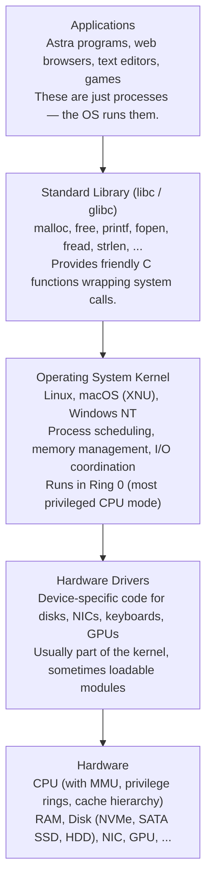
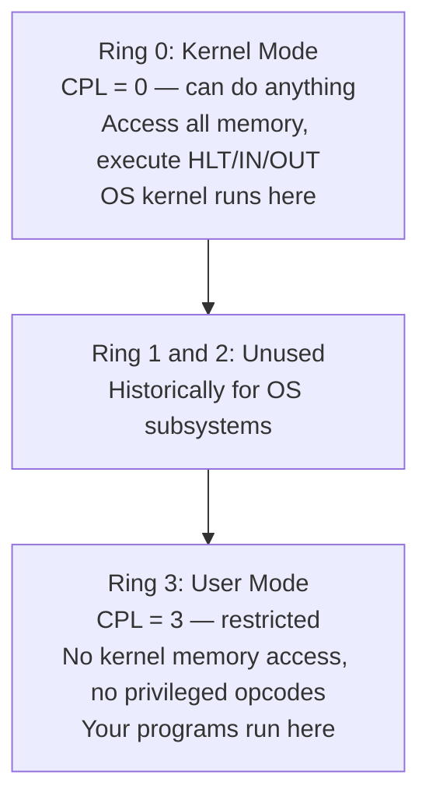
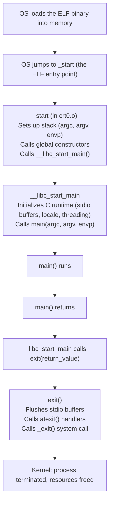
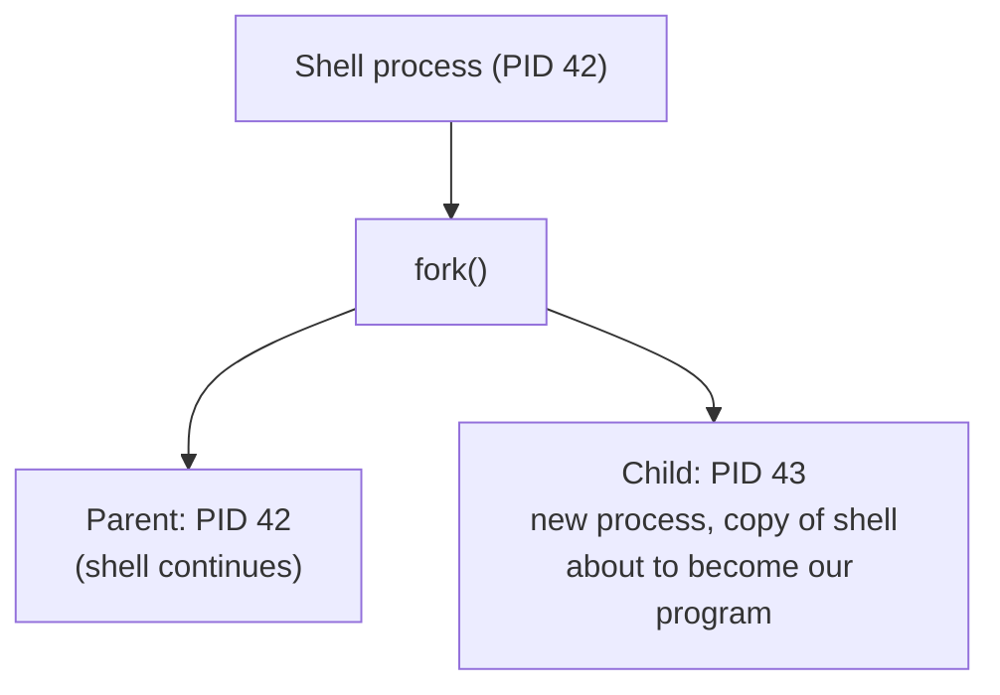

# Chapter 34: Introduction to Operating Systems — The Software That Runs Everything

> "An operating system is not a program that does things for you. It is a program that makes it easier for other programs to do things for themselves." — Linus Torvalds (paraphrased)

---

## Overview

Every program you have ever written — every "Hello, World!" in Go, every Astra function, every script — runs under the supervision of an operating system. The OS is the invisible foundation beneath your code. When your program calls `fmt.Println`, it is ultimately the OS that moves characters to your screen. When you call `malloc`, it is the OS that grants you memory. When your program exits, the OS reclaims everything it used.

As compiler writers, we cannot afford to treat the OS as a black box. The Astra compiler must generate code that runs correctly in the OS environment: it must call the right system calls, respect the process address space layout, understand how programs are launched, and interact correctly with the C standard library that most programs link against.

This chapter is a beginner-friendly introduction to operating systems from a compiler writer's perspective. We will not go deep into OS internals (scheduling algorithms, file system implementation, virtual memory management) — that is a whole course by itself. Instead, we will focus on exactly what you need to know to build a working runtime for the Astra language.

By the end of this chapter, you will understand how programs are loaded and started, what system calls are and how to use them, what the process address space looks like (crucial for understanding how variables, the stack, and the heap relate to each other), and how to write the thin OS abstraction layer that the Astra runtime uses.

---

## What We Are Building

By the end of this chapter you will have:

- A clear mental model of the hardware-software stack, from transistors to applications
- Understanding of kernel space vs user space and why the boundary exists
- Knowledge of the most important Linux/POSIX system calls
- Understanding of the process address space layout (text, data, BSS, heap, stack)
- Understanding of how a program is launched via fork + exec
- The complete Astra runtime OS abstraction layer (runtime/os.c)
- Understanding of POSIX and why it makes Astra programs portable across Linux and macOS

---

## Table of Contents

1. What Does an OS Actually Do?
2. The Hardware-Software Stack
3. Kernel Space vs User Space
4. System Calls — The Official API to the OS
5. POSIX: The Standard That Unifies Unix
6. The C Standard Library (libc)
7. Process Address Space Layout
8. How a Program Launches: fork + exec
9. Command-Line Arguments and Environment Variables
10. The /proc and /sys Filesystems
11. Astra Build Milestone: The Runtime OS Interface Layer

---

## 1. What Does an OS Actually Do?

Imagine a busy hotel. Guests (programs) arrive and want to use rooms (CPU), housekeeping (disk), room service (network), and the swimming pool (memory). Without a hotel manager, every guest would fight over rooms, steal each other's towels, and the whole place would descend into chaos. The hotel manager (the operating system) ensures:

- **Resource management**: Every guest gets a fair share. No single guest monopolizes the pool.
- **Isolation**: Guest A cannot walk into Guest B's room (another process's memory).
- **Abstraction**: Guests do not need to know how the plumbing works, just how to turn on the tap.

More concretely, the OS does four things:

### Resource Manager

The OS manages the four fundamental computing resources:

1. **CPU time**: Multiple programs "run simultaneously" even on a single-core machine. The OS rapidly switches between them (typically every 1-10 milliseconds), creating the illusion of parallelism. This is called **preemptive multitasking**.

2. **Memory**: The OS allocates memory to programs and ensures they cannot access each other's allocations. It uses hardware support (the Memory Management Unit, MMU) to enforce these boundaries.

3. **I/O devices**: Disks, network cards, keyboards, displays — each needs a specialized driver. The OS provides a unified interface so programs can read and write files without knowing what hardware they are on.

4. **File storage**: The OS provides a file system abstraction: hierarchical directories of named files. Your disk is a block device that stores raw bytes; the OS file system layer makes it look like organized folders and files.

### Referee

Processes (running programs) are isolated from each other. Process A cannot read or modify Process B's memory. If Process A crashes (segmentation fault, infinite loop), it does not affect Process B. Without this isolation, a buggy browser tab could corrupt your email client's data. The OS enforces this isolation using hardware protection mechanisms.

### Abstraction Layer

Different computers have different hardware. A file on an SSD, a file on an HDD, and a file on a USB drive all look identical to your program — they are all accessed via the same `open()`, `read()`, `write()`, `close()` interface. The OS (through device drivers) translates these generic calls to hardware-specific operations.

Without this abstraction, every program would need to know the exact model of every disk, keyboard, and network card. The program would break whenever the hardware changed. The OS spares you this nightmare.

### Without an OS

To illustrate why we need an OS, imagine writing a program for bare hardware:

- You need to initialize the CPU in 64-bit mode, set up page tables, and configure the memory map.
- To print to the screen, you need to talk to the BIOS, or the VGA controller, or configure a framebuffer — depending on the hardware.
- To read a file, you need to speak the ATA or NVMe protocol to the disk controller.
- There is no "other program running simultaneously" — the machine is entirely yours, but you have to manage everything.

This is the world of embedded systems and bootloaders. The OS exists so that normal programs do not have to deal with any of this.

---

## 2. The Hardware-Software Stack

Every layer of the stack provides a service to the layer above it and uses services from the layer below it.



When your Astra program calls `println("Hello, World!")`, here is the journey:

```mermaid
flowchart TD
    A["Astra code: println(\"Hello\")"]
    B["runtime/io.c: astra_os_write(\"Hello\\n\", 6)\nAstra compiler generates a call to the runtime"]
    C["libc: write(1, \"Hello\\n\", 6)\nOur runtime calls the OS via POSIX — syscall wrapper"]
    D["Linux kernel: sys_write()\nSYSCALL instruction triggers switch to Ring 0"]
    E["TTY driver\nKernel identifies fd 1 as stdout → writes to terminal buffer"]
    F["Display hardware\nPixels appear on screen"]
    A --> B --> C --> D --> E --> F
```

Six layers from your `println()` to a pixel on the screen. The abstraction stack earns its keep.

---

## 3. Kernel Space vs User Space

### CPU Privilege Levels

Modern CPUs (x86-64 in particular) implement **privilege rings** — hardware-enforced privilege levels that control what code can do.

```
Ring 0 (most privileged):   Kernel code
                            Can do anything: access any memory, execute
                            privileged instructions (HLT, MOV CR3, IN/OUT), etc.

Ring 1 & 2 (rarely used):  OS extensions, device drivers in some systems

Ring 3 (least privileged):  User programs
                            Cannot access kernel memory.
                            Cannot execute privileged instructions.
                            Cannot directly access hardware.
```

On Linux and Windows, only Ring 0 (kernel) and Ring 3 (user) are used.



### Why Does This Matter?

**Safety**: A buggy Astra program that tries to overwrite memory at address 0 will get a segmentation fault (the MMU enforces protection) instead of silently corrupting the kernel. Without this protection, any bug could crash the entire system.

**Security**: A malicious program cannot read another process's memory (where passwords might live), cannot modify kernel data structures, and cannot bypass the file permissions system.

**Stability**: The kernel can isolate and kill a misbehaving process without affecting other processes. Your browser crashing does not take down your terminal session.

### The Boundary: How to Cross It

User programs need the kernel to do privileged things (write to a file, allocate memory, create a process). The mechanism to safely cross from Ring 3 to Ring 0 is the **system call** (or "syscall"). We will explore this in detail next.

---

## 4. System Calls — The Official API to the OS

### What Is a System Call?

A system call is a controlled transition from user mode (Ring 3) to kernel mode (Ring 0). It is the official interface: the list of services the kernel offers to user programs.

When your Go program calls `os.ReadFile("data.txt")`, it eventually executes the `read` system call. The `read` syscall is implemented inside the Linux kernel, which has the privilege to access the disk driver. After `read` completes, the kernel returns the result to your program and drops back to Ring 3.

### The Mechanics

On x86-64 Linux, system calls use the `SYSCALL` instruction:

```asm
; Example: call write(fd=1, buf=rsi, count=rdx) on Linux x86-64
mov rax, 1       ; syscall number 1 = write
mov rdi, 1       ; first arg: fd = 1 (stdout)
lea rsi, [msg]   ; second arg: pointer to string
mov rdx, 13      ; third arg: length in bytes
syscall          ; trigger the system call
; After syscall returns, rax holds the return value (bytes written, or -errno)
```

The CPU executes `SYSCALL`, which:
1. Saves the user-mode return address
2. Switches to kernel mode (Ring 0)
3. Jumps to the kernel's syscall dispatch table
4. Executes the appropriate kernel function
5. Switches back to Ring 3
6. Returns the result in `rax`

### The Most Important Linux System Calls

These are the syscalls the Astra runtime relies on:

```
Number | Name       | Signature                                    | What It Does
───────┼────────────┼──────────────────────────────────────────────┼─────────────────────────────
0      | read       | read(fd, buf, count) → bytes_read            | Read from file/socket/pipe
1      | write      | write(fd, buf, count) → bytes_written        | Write to file/stdout/pipe
2      | open       | open(path, flags, mode) → fd                 | Open a file, get descriptor
3      | close      | close(fd) → 0                                | Close a file descriptor
5      | fstat      | fstat(fd, stat_buf) → 0                      | Get file metadata
9      | mmap       | mmap(addr,len,prot,flags,fd,off) → ptr       | Map memory/file into addr space
11     | munmap     | munmap(addr, len) → 0                        | Unmap memory
12     | brk        | brk(addr) → new_brk                         | Set heap boundary (used by malloc)
21     | access     | access(path, mode) → 0                      | Check file permissions
39     | getpid     | getpid() → pid                               | Get process ID
57     | fork       | fork() → pid (0 in child)                   | Create child process
59     | execve     | execve(path, argv, envp) → (no return)       | Execute a program
60     | exit       | exit(status) → (no return)                  | Terminate process
231    | exit_group | exit_group(status) → (no return)             | Terminate all threads
```

### The Full Call Chain: printf to pixels

Let us trace `printf("Hello\n")` from C all the way to the OS:

```mermaid
flowchart TD
    S1["1. Application: printf(\"Hello\\n\")"]
    S2["2. libc: printf() formats string\ncalls fwrite() → calls write() (libc wrapper)"]
    S3["3. libc write() sets up registers and executes SYSCALL\nrax=1 (sys_write), rdi=1 (stdout fd)\nrsi=ptr to \"Hello\\n\", rdx=6"]
    S4["4. Kernel: sys_write() handler runs in Ring 0\nLooks up fd 1 in file descriptor table → TTY\nCalls TTY write handler"]
    S5["5. TTY driver: writes characters to terminal emulator buffer"]
    S6["6. Display: terminal emulator renders glyphs\nPixels appear on screen"]
    S1 --> S2 --> S3 --> S4 --> S5 --> S6
```

The `SYSCALL` instruction is the only mechanism for crossing the user/kernel boundary. Everything else is userspace code calling other userspace code.

---

## 5. POSIX: The Standard That Unifies Unix

### The Problem POSIX Solves

In the 1980s, Unix fragmented. Different vendors (Sun, IBM, HP, SGI, NeXT) had their own Unix variants with slightly different APIs. A program written for SunOS might not compile on HPUX. This was a maintenance nightmare.

POSIX (Portable Operating System Interface) is an IEEE standard (IEEE 1003.1) that defines a common interface for Unix-like operating systems. It specifies:

- Process model (fork, exec, wait, signals)
- File system interface (open, read, write, close, stat)
- I/O (file descriptors, pipes, FIFOs)
- Threads (pthreads)
- Environment variables, command-line arguments
- Timing, clocks, timers
- Networking sockets (POSIX.1-2001)

### Who Follows POSIX?

```
OS                   | POSIX Compliance
─────────────────────┼─────────────────────────────────────────
Linux (all distros)  | Near-complete (Linux Standard Base)
macOS                | Certified POSIX (10.5+)
FreeBSD, OpenBSD     | Near-complete
iOS, Android         | Partial (iOS is certified macOS subset)
Windows (NT kernel)  | Partial via WSL2, Cygwin, or MSVCRT
Solaris, AIX, HP-UX  | Full certification
```

### Why Does Astra Care?

If the Astra runtime uses only POSIX system calls, Astra programs will compile and run on Linux AND macOS without any changes to the compiler or runtime. This is a huge win. The `astra_os_write`, `astra_os_alloc`, etc. functions we will write in the Milestone use only POSIX-standard calls — `write`, `mmap`, `munmap`, `_exit` — all of which exist on both Linux and macOS.

```c
// This code compiles and runs identically on Linux and macOS
// because both follow POSIX:
#include <unistd.h>      // write, _exit — POSIX
#include <sys/mman.h>    // mmap, munmap — POSIX

void say_hello() {
    write(1, "Hello from Astra!\n", 18); // stdout = fd 1 on all POSIX systems
}
```

---

## 6. The C Standard Library (libc)

### What Is libc?

The C standard library (libc, or glibc on Linux) is a collection of functions available to every C program automatically. It sits between your code and the system calls, providing:

1. **Higher-level I/O**: `printf`, `scanf`, `fopen`, `fclose`, `fread`, `fwrite` — buffered I/O, formatted output, that kind of thing. These are friendlier than raw `read`/`write`.

2. **Memory management**: `malloc`, `free`, `realloc`, `calloc`. These manage a heap by requesting pages from the kernel via `brk` or `mmap`, then subdividing them into smaller allocations.

3. **String manipulation**: `strlen`, `strcpy`, `strcmp`, `memcpy`, `memset`, and many more.

4. **Math**: `sin`, `cos`, `sqrt`, `pow`, etc.

5. **Time**: `time`, `gettimeofday`, `clock_gettime`.

6. **Standard input/output abstraction**: The `FILE*` type and functions operating on it.

### libc Is Always There (Almost)

On Linux and macOS, programs are dynamically linked against libc by default. This means:

```
$ ldd ./my_program
    linux-vdso.so.1 (0x...)
    libc.so.6 => /lib/x86_64-linux-gnu/libc.so.6 (0x...)
    /lib64/ld-linux-x86-64.so.2 (0x...)
```

The dynamic linker loads libc into your process's address space at startup, before your `main()` is called.

### The Astra Runtime and libc

The Astra runtime will link against libc for:
- `malloc`/`free` for heap allocation (Chapter 64)
- `printf`/`puts` for debug output
- Math functions for the standard library

But for the core OS interface — memory mapping, I/O, exit — we use system calls directly via thin wrappers. This gives us control and portability.

### The C Runtime Startup Sequence

Before your `main()` is called, the C runtime (`crt0.o` or `crt1.o`) does important initialization:



For the Astra runtime, we will define our own `_astra_start` that does minimal initialization before calling the compiled `main` function:

```c
// runtime/start.c
extern int astra_main(int argc, char** argv);

void _astra_start(int argc, char** argv) {
    // Minimal Astra runtime initialization
    // (garbage collector setup, stdlib initialization)
    int exit_code = astra_main(argc, argv);
    _exit(exit_code); // bypass libc's exit() to avoid its overhead
}
```

---

## 7. Process Address Space Layout

Every running process has its own **virtual address space** — a private illusion that it owns all of memory from address 0 to some maximum. The OS uses the MMU to map these virtual addresses to physical RAM locations, with each process getting its own mapping.

The virtual address space has a conventional layout. Understanding this layout is crucial for compiler writers: it tells you where your code lives, where your global variables are, where the heap is, and where the stack is.

```
High addresses (0xFFFFFFFFFFFFFFFF on 64-bit systems):
┌─────────────────────────────────────────────────────────┐
│                   Kernel Space                          │
│  (inaccessible to user programs — segfault if accessed) │
│  Kernel code, kernel data, page tables, etc.            │
│  On x86-64 Linux: starts at 0xFFFF800000000000          │
├─────────────────────────────────────────────────────────┤  ↑ higher addresses
│                     Stack                               │
│   Grows DOWNWARD (toward lower addresses)               │
│   Contains: local variables, return addresses, saved    │
│   registers, function arguments                         │
│   Size: typically limited to 8 MB (ulimit -s)           │
│   ↓                                                     │
├─────────────────────────────────────────────────────────┤
│                  [gap / ASLR region]                    │
│  Address Space Layout Randomization randomizes the      │
│  positions of stack, heap, and libraries to make        │
│  buffer overflow exploits harder.                       │
├─────────────────────────────────────────────────────────┤
│              Memory-Mapped Region                        │
│   Shared libraries (libc.so, ld.so, etc.)               │
│   mmap() allocations                                    │
│   File-backed mappings                                  │
├─────────────────────────────────────────────────────────┤
│                    ↑                                    │
│                   Heap                                  │
│   Grows UPWARD (toward higher addresses)                │
│   malloc()/free() manage memory here                    │
│   The kernel extends it via the brk() syscall           │
├─────────────────────────────────────────────────────────┤
│                    BSS Segment                          │
│   Uninitialized global and static variables             │
│   Zeroed by the OS at program load time                 │
│   Not stored in the binary (just a size record)         │
│   Example: static int counter; (= 0 by default)        │
├─────────────────────────────────────────────────────────┤
│                   Data Segment                          │
│   Initialized global and static variables               │
│   Stored in the binary with their initial values        │
│   Example: int magic = 42; (stored in binary as 42)    │
├─────────────────────────────────────────────────────────┤
│                   Text Segment (Code)                   │
│   The program's executable machine code instructions    │
│   Read-only (writing here → segfault, prevents self-    │
│   modifying code exploits)                              │
│   This is where your compiled Astra functions live      │
└─────────────────────────────────────────────────────────┘
Low addresses (0x0000000000000000 — the null address)
```

### Concrete Example: Where Do Astra Variables Live?

```astra
// In Astra:
let globalCount = 42         // → DATA segment (initialized global)
let zeroed: int              // → BSS segment (uninitialized global, starts at 0)

fn main() {
    let localVar = 100       // → STACK (allocated in main's stack frame)
    let ptr = malloc(64)     // → HEAP (returned by malloc)
    // The machine code for main() → TEXT segment
}
```

### Why the Stack Grows Down and the Heap Grows Up

This is a historical convention from the early days of Unix. With a stack growing down from high addresses and a heap growing up from low addresses, they can both expand freely without knowing how much space the other will need. They "collide" in the middle only when the process runs out of memory — a stack overflow or out-of-memory condition.

```
Address space (simplified):
  High: [Stack ↓         ][ ... free space ... ][↑ Heap] :Low
```

### Stack Frames in Detail

When your Astra function is called, the CPU creates a **stack frame** (also called an activation record):

```
Before call to foo(a, b):          After call to foo(a, b):
                                    
High │  previous frame    │        │  previous frame    │
  ↑  │────────────────────│        │────────────────────│
     │  return address    │  ←new  │  return address    │ ← where to go when foo returns
     │  saved rbp         │        │  saved rbp         │ ← caller's frame pointer
     │  local var 1       │        │  local var 1       │
     │  local var 2       │        │  local var 2       │
  ↓  │  ...               │        │  ...               │
Low  │   rsp (stack ptr)  │        │  rsp → (new bottom)│
```

Each function call pushes a new frame, and each `return` pops it. This is the physical stack that our VM's "locals array" was abstracting over.

### ASLR: Address Space Layout Randomization

Notice the "gap / ASLR region" in the diagram. Modern OSes randomize the base addresses of the stack, heap, and loaded libraries on each program run. This means a buffer overflow attack that relies on knowing the exact address of a return value or function becomes much harder — the attacker would need to guess a random 48-bit address.

```
Run 1: stack starts at 0x7fff6d2a0000
Run 2: stack starts at 0x7fff3ab90000
Run 3: stack starts at 0x7fff8f12c000
```

ASLR is transparent to well-written programs (you should never hard-code addresses). The Astra compiler must generate position-independent code (PIC) that works regardless of where it is loaded.

---

## 8. How a Program Launches: fork + exec

When you type `./my_astra_program` in the shell, a fascinating sequence of events unfolds. Understanding this sequence tells you exactly what state your program starts in.

### Step 1: The Shell Calls fork()

```c
pid_t pid = fork();
// fork() creates an exact copy (child process) of the current process.
// In the parent, fork() returns the child's PID.
// In the child, fork() returns 0.
// After fork(), both processes run simultaneously.
```

The `fork()` system call creates a new process that is an almost-exact copy of the parent (the shell). It inherits:
- All memory (copy-on-write)
- All open file descriptors (stdin, stdout, stderr, any open files)
- Environment variables
- The current working directory



### Step 2: The Child Calls exec()

In the child process, the shell calls `execve()`:

```c
// In the child:
execve("./my_astra_program", argv, envp);
// execve() replaces the current process image entirely:
// - Loads the ELF binary from disk
// - Maps it into the address space (text, data, BSS)
// - Sets up the initial stack with argc, argv, envp
// - Jumps to the program's entry point (_start)
// execve() DOES NOT RETURN on success.
// The child process has become a new program.
```

After `execve`:
- The child process still has PID 43
- But all its memory is now replaced with `my_astra_program`'s code and data
- Its PC (program counter) is set to `_start` in the new binary
- Its file descriptors are preserved (stdin, stdout, stderr inherited from shell)

```
Child process (PID 43):
Before execve: [shell code, shell data]
After execve:  [my_astra_program code, my_astra_program data]
Still PID 43, same fd table, new memory image
```

### Step 3: The OS Loads the ELF Binary

The kernel's `execve` handler:

1. **Opens the binary file** and reads the ELF header.
2. **Maps the segments** into the address space:
   - The `.text` segment → read-only, executable pages
   - The `.data` segment → read-write pages, initialized from file
   - The `.bss` segment → anonymous zero-filled pages
3. **Maps the dynamic linker** (`ld.so`) if the binary uses shared libraries.
4. **Sets up the initial stack** with:
   - `argc` — number of command-line arguments
   - `argv` — array of pointers to argument strings
   - `envp` — array of `KEY=VALUE` environment strings
   - `auxv` — auxiliary vector (hwcap, page size, etc.)
5. **Sets the program counter** to the entry point (`_start`).

### Step 4: _start → _astra_start → main()

```c
// The ELF entry point _start is in crt0.o (or our custom start.asm):
// (This is the actual assembly the CPU starts executing)

_start:
    pop  rdi        ; argc
    mov  rsi, rsp   ; argv (pointer to the array)
    lea  rdx, [rsp + rdi*8 + 8]  ; envp
    call _astra_start
    ; If _astra_start returns, we should not reach here
    hlt
```

```c
// runtime/start.c
void _astra_start(int argc, char** argv) {
    // 1. Initialize Astra runtime (memory allocator, etc.)
    astra_runtime_init();
    
    // 2. Call the compiled main function
    int exit_code = astra_main(argc, argv);
    
    // 3. Clean up and exit
    astra_runtime_shutdown();
    _exit(exit_code);
}
```

### The Full Launch Timeline

```mermaid
flowchart TD
    T1["Shell parses command, calls fork()"]
    T2["Child process created (copy of shell)"]
    T3["Child calls execve(\"./hello_astra\", argv, envp)"]
    T4["Kernel reads ELF header\nMaps .text, .data, .bss segments\nCreates stack with argc/argv"]
    T5["Kernel loads dynamic linker\nResolves symbols (libc.so.6, etc.)"]
    T6["CPU jumps to _start"]
    T7["_start calls _astra_start(3, argv)"]
    T8["_astra_start calls astra_main(3, argv)"]
    T9["main() runs, prints output, returns 0"]
    T10["_astra_start calls _exit(0)\nKernel: process terminates, resources freed\nShell: wait() returns, prompt printed"]
    T1 --> T2 --> T3 --> T4 --> T5 --> T6 --> T7 --> T8 --> T9 --> T10
```

---

## 9. Command-Line Arguments and Environment Variables

### argv and argc

When the OS sets up the stack before calling `_start`, it places the command-line arguments there:

```
Stack layout just before _start (x86-64 Linux):

rsp →   argc     (e.g., 3)
        argv[0]  → "./hello_astra\0"
        argv[1]  → "arg1\0"
        argv[2]  → "arg2\0"
        NULL     (terminator)
        envp[0]  → "PATH=/usr/bin:/bin\0"
        envp[1]  → "HOME=/home/user\0"
        ...
        NULL     (envp terminator)
        auxv[0]  (auxiliary vector)
        ...
        string data area (the actual argument strings)
```

In Astra's runtime, we pass these to the compiled `main` function:

```c
// runtime/start.c
void _astra_start(int argc, char** argv) {
    // Pass argc and argv to the compiled Astra main.
    // Astra programs can access os.args() which returns these.
    astra_set_args(argc, argv);
    int code = astra_main(argc, argv);
    _exit(code);
}
```

The Astra standard library exposes these as:

```astra
// In Astra code:
import os

fn main() {
    let args = os.args()   // ["./hello_astra", "arg1", "arg2"]
    for arg in args {
        println(arg)
    }
}
```

### Environment Variables

Environment variables are `KEY=VALUE` pairs passed to every process. They let the parent process configure child processes without hardcoding values.

```c
// Access environment variables in C (and Astra's stdlib):
#include <stdlib.h>

char* path = getenv("PATH");    // "/usr/local/bin:/usr/bin:/bin"
char* home = getenv("HOME");    // "/home/username"
char* missing = getenv("DOES_NOT_EXIST"); // → NULL
```

Common environment variables:
- `PATH`: directories searched for executable programs
- `HOME`: the user's home directory
- `USER` / `USERNAME`: current username
- `LANG` / `LC_ALL`: locale settings
- `TMPDIR`: directory for temporary files
- `LD_LIBRARY_PATH`: additional directories for shared libraries (Linux)
- `DYLD_LIBRARY_PATH`: same, for macOS

In Astra:
```astra
import os

fn main() {
    let home = os.getenv("HOME")
    match home {
        Some(dir) => println("Home: " + dir)
        None => println("HOME not set")
    }
}
```

---

## 10. The /proc and /sys Filesystems on Linux

One of Unix's great insights: **"everything is a file."** Even process information and kernel configuration are accessible via the filesystem.

### /proc — The Process Filesystem

`/proc` is a virtual filesystem that the Linux kernel populates dynamically. It does not live on disk — reading a file in `/proc` makes the kernel generate the data on-the-fly.

```
/proc/1234/          ← directory for process 1234
    /proc/1234/maps  ← virtual memory map (what's loaded where)
    /proc/1234/status ← process status (name, pid, memory usage)
    /proc/1234/fd/   ← file descriptors (0=stdin, 1=stdout, 2=stderr, ...)
    /proc/1234/cmdline ← original command line (null-separated)
    /proc/self/      ← shortcut: the current process

/proc/cpuinfo        ← CPU model, features (SSE4.2, AVX, etc.)
/proc/meminfo        ← total and available RAM, swap usage
/proc/loadavg        ← 1/5/15-minute load averages
/proc/version        ← kernel version string
/proc/filesystems    ← supported filesystem types
```

Example: check your own process's virtual memory map:

```bash
$ cat /proc/self/maps
55a3f8800000-55a3f8801000 r--p 00000000 fd:01 1234567   /usr/bin/cat
55a3f8801000-55a3f8802000 r-xp 00001000 fd:01 1234567   /usr/bin/cat
7f8d3a000000-7f8d3a200000 rw-p 00000000 00:00 0         [heap]
7fff8e200000-7fff8e221000 rw-p 00000000 00:00 0         [stack]
```

The Astra compiler can read `/proc/self/maps` to verify its generated code is loaded at the expected address, or to inspect memory usage.

### /sys — The sysfs Filesystem

`/sys` exposes kernel objects and device attributes as files. You can read hardware information and sometimes tune kernel parameters:

```
/sys/class/net/eth0/speed    ← network interface speed
/sys/block/sda/size          ← disk size in 512-byte sectors
/sys/devices/system/cpu/     ← CPU topology information
```

---

## 11. Astra Build Milestone: The Runtime OS Interface Layer

The Astra runtime needs to interact with the OS for three fundamental operations:
1. Writing output (print statements)
2. Allocating memory (heap allocations)
3. Exiting (when the program ends)

We wrap these in a thin, portable abstraction that works on both Linux and macOS (any POSIX system):

```c
// runtime/os.c — The Astra runtime's OS interface
// This file uses only POSIX-standard system calls, so it compiles
// and runs correctly on Linux, macOS, FreeBSD, and other POSIX systems.

#include <sys/types.h>   // size_t, ssize_t
#include <sys/mman.h>    // mmap, munmap, PROT_*, MAP_*
#include <unistd.h>      // write, _exit
#include <stddef.h>      // NULL

// ─────────────────────────────────────────────────────────────
// I/O
// ─────────────────────────────────────────────────────────────

// Write bytes to stdout (file descriptor 1).
// This is a direct write() syscall, not buffered like printf.
// The Astra compiler's print() calls this function.
void astra_os_write(const char* buf, size_t len) {
    // write() returns the number of bytes written, or -1 on error.
    // We loop because write() may write fewer bytes than requested
    // (partial writes can happen, especially to pipes).
    size_t written = 0;
    while (written < len) {
        ssize_t n = write(1, buf + written, len - written);
        if (n < 0) {
            // I/O error — try to report and abort
            const char* err = "astra: write error\n";
            write(2, err, 19); // fd 2 = stderr
            _exit(1);
        }
        written += (size_t)n;
    }
}

// Write bytes to stderr (file descriptor 2).
// Used for error messages from the Astra runtime.
void astra_os_write_err(const char* buf, size_t len) {
    size_t written = 0;
    while (written < len) {
        ssize_t n = write(2, buf + written, len - written);
        if (n < 0) { break; } // nothing more we can do
        written += (size_t)n;
    }
}

// ─────────────────────────────────────────────────────────────
// Memory Allocation
// ─────────────────────────────────────────────────────────────

// Allocate a page-aligned block of memory directly from the OS.
// Uses mmap() instead of malloc() so we bypass libc entirely.
//
// mmap() parameters explained:
//   addr  = NULL   → let the kernel choose the address
//   len         → how many bytes to allocate
//   PROT_READ|PROT_WRITE → we want to read and write this memory
//   MAP_PRIVATE  → changes are private (not shared with other processes)
//   MAP_ANONYMOUS → not backed by a file (just RAM)
//   fd = -1       → required when using MAP_ANONYMOUS
//   offset = 0    → required when using MAP_ANONYMOUS
//
// Returns a pointer to page-aligned memory, or panics on failure.
// The returned size is rounded up to the nearest page (usually 4096 bytes).
void* astra_os_alloc(size_t size) {
    void* ptr = mmap(
        NULL,                        // let kernel choose address
        size,                        // bytes to allocate
        PROT_READ | PROT_WRITE,      // readable and writable
        MAP_PRIVATE | MAP_ANONYMOUS, // private, not file-backed
        -1,                          // fd (unused with MAP_ANONYMOUS)
        0                            // offset (unused with MAP_ANONYMOUS)
    );

    if (ptr == MAP_FAILED) {
        // Out of memory — this is unrecoverable. Panic.
        const char* msg = "astra: fatal: out of memory\n";
        write(2, msg, 28); // write to stderr
        _exit(1);
    }

    // The kernel zero-initializes anonymous mmap allocations.
    // This means all newly allocated Astra variables start at zero/null.
    return ptr;
}

// Free a previously allocated block.
// `size` must be the same size passed to astra_os_alloc().
// (Unlike free(), munmap() requires the size.)
void astra_os_free(void* ptr, size_t size) {
    if (ptr == NULL || size == 0) { return; }
    munmap(ptr, size);
}

// Resize an existing allocation.
// Since mmap gives page-aligned memory, this creates a new allocation
// and copies. A production runtime would use mremap() on Linux.
void* astra_os_realloc(void* old_ptr, size_t old_size, size_t new_size) {
    void* new_ptr = astra_os_alloc(new_size);
    if (new_ptr == NULL) { return NULL; }

    // Copy the old contents (up to the smaller of old and new sizes)
    size_t copy_size = old_size < new_size ? old_size : new_size;
    // Manual memcpy (avoiding libc dependency in our minimal build):
    char* src = (char*)old_ptr;
    char* dst = (char*)new_ptr;
    for (size_t i = 0; i < copy_size; i++) {
        dst[i] = src[i];
    }

    astra_os_free(old_ptr, old_size);
    return new_ptr;
}

// ─────────────────────────────────────────────────────────────
// Process Control
// ─────────────────────────────────────────────────────────────

// Terminate the process immediately.
// Uses _exit() (not exit()) to bypass libc's cleanup:
//   exit():   flushes stdio buffers, calls atexit() handlers, then _exit()
//   _exit():  directly invokes the exit_group syscall, no cleanup
// We use _exit() because we do our own cleanup before calling this.
void astra_os_exit(int code) {
    _exit(code);
}

// ─────────────────────────────────────────────────────────────
// Utility
// ─────────────────────────────────────────────────────────────

// Get the system page size (typically 4096 bytes on x86-64).
// Memory allocated via mmap must be a multiple of this size.
size_t astra_os_page_size(void) {
    return (size_t)sysconf(_SC_PAGESIZE);
}

// Round size up to the nearest multiple of the page size.
// Required because mmap always allocates whole pages.
size_t astra_os_round_to_page(size_t size) {
    size_t page = astra_os_page_size();
    return (size + page - 1) & ~(page - 1);
}
```

### The Corresponding Header File

```c
// runtime/os.h — Public interface to the OS abstraction layer

#pragma once
#include <stddef.h>

// I/O
void astra_os_write(const char* buf, size_t len);
void astra_os_write_err(const char* buf, size_t len);

// Memory
void*  astra_os_alloc(size_t size);
void   astra_os_free(void* ptr, size_t size);
void*  astra_os_realloc(void* old_ptr, size_t old_size, size_t new_size);

// Process
void astra_os_exit(int code);

// Utility
size_t astra_os_page_size(void);
size_t astra_os_round_to_page(size_t size);
```

### How the Astra Compiler Uses This Layer

When the Astra compiler generates code for a `println()` call, it generates a call to `astra_os_write`. When it generates code for a heap allocation (e.g., creating a new object), it calls `astra_os_alloc`. When the program finishes, it calls `astra_os_exit`.

```
Astra source:              Compiled output:
println("Hello")    →      astra_os_write("Hello\n", 6);
let arr = [1,2,3]   →      int64_t* arr = astra_os_alloc(24);
                           arr[0]=1; arr[1]=2; arr[2]=3;
```

This is the bridge between the Astra language and the operating system. Everything else in the runtime (the garbage collector, the standard library, the exception mechanism) is built on top of this foundation.

### Why mmap Instead of malloc?

You might wonder: why not just use `malloc()` from libc for `astra_os_alloc()`? We use `mmap` for several reasons:

1. **Independence**: We do not need to link against libc for memory allocation. Our Astra runtime can be minimal.
2. **Granularity**: `mmap` always gives us whole pages. This is exactly what the Astra garbage collector (Chapter 64) needs to work efficiently.
3. **Predictability**: `mmap` behavior is simple and well-documented. `malloc`'s internal fragmentation and free-list behavior can be surprising.
4. **Control**: For advanced features like a precise garbage collector, we need to track every allocation. Using our own allocator (backed by mmap) gives us that control.

In practice, many language runtimes (Go, Rust, V8) use mmap for their internal allocators rather than relying on malloc.

---

## Exercises

1. **strace exploration**: On Linux, run any Astra (or C) program under `strace` to see every system call it makes: `strace ./hello 2>&1 | head -50`. Identify the `write()` call for the output, the `mmap()` calls for memory, and the `exit_group()` at the end. Write down what you observed.

2. **Process address space visualization**: Write a small C (or Go) program that reads `/proc/self/maps` and prints each memory segment with its permissions and name. Identify the text, heap, stack, and shared library regions.

3. **Custom write with buffering**: The current `astra_os_write` makes a syscall for every print. Add a 4096-byte I/O buffer to `astra_os_write` so it batches small writes and only calls `write()` when the buffer is full or when `astra_os_flush()` is called. This can dramatically reduce the number of syscalls for programs that print many small strings.

4. **Page size detection**: Write a test that calls `astra_os_page_size()` and verifies the result is a power of 2 and at least 4096. Then allocate exactly one page and verify the pointer is page-aligned (i.e., `ptr & (pageSize-1) == 0`).

5. **Environment variable access**: Add `astra_os_getenv(const char* name)` to the OS layer. It should call `getenv()` (from stdlib.h) and return a pointer to the value string, or NULL if not set. Then expose this as `os.getenv()` in Astra's standard library.

6. **Graceful OOM handling**: Extend `astra_os_alloc` to accept an error callback: `void* astra_os_alloc_safe(size_t size, void (*oom_handler)(size_t requested))`. If mmap fails, instead of hard-crashing with `_exit(1)`, call the provided handler. This allows the Astra runtime to run finalizers and print a proper out-of-memory error before exiting.

---

## Summary Table

| Concept | Description | Relevance to Astra |
|---|---|---|
| OS as resource manager | Controls CPU, memory, I/O, files | Astra runtime requests resources via OS |
| Kernel space / Ring 0 | Most privileged CPU mode | OS kernel runs here; Astra code cannot |
| User space / Ring 3 | Least privileged mode | All Astra programs run here |
| System call | Controlled crossing from Ring 3 to Ring 0 | read, write, mmap, exit used by runtime |
| POSIX | Common interface standard for Unix-like OSes | Ensures Astra runs on Linux AND macOS |
| libc | C standard library wrapping syscalls | Astra runtime optionally links against it |
| Text segment | Read-only, executable program code | Compiled Astra functions live here |
| Data / BSS | Global variables (initialized / zero) | Astra global variables live here |
| Heap | Dynamic memory (malloc/mmap) | Astra objects and arrays live here |
| Stack | Local variables, return addresses | Astra function locals live here |
| fork + exec | How processes are created and replaced | How the user runs Astra programs |
| argv / envp | Command-line args and environment | Passed to Astra's main() via runtime |
| /proc filesystem | Virtual FS exposing process info | Useful for debugging and tooling |
| astra_os_alloc | mmap-based page allocator | Foundation of Astra's memory management |
| astra_os_write | Direct write() syscall for output | Foundation of Astra's print statement |
