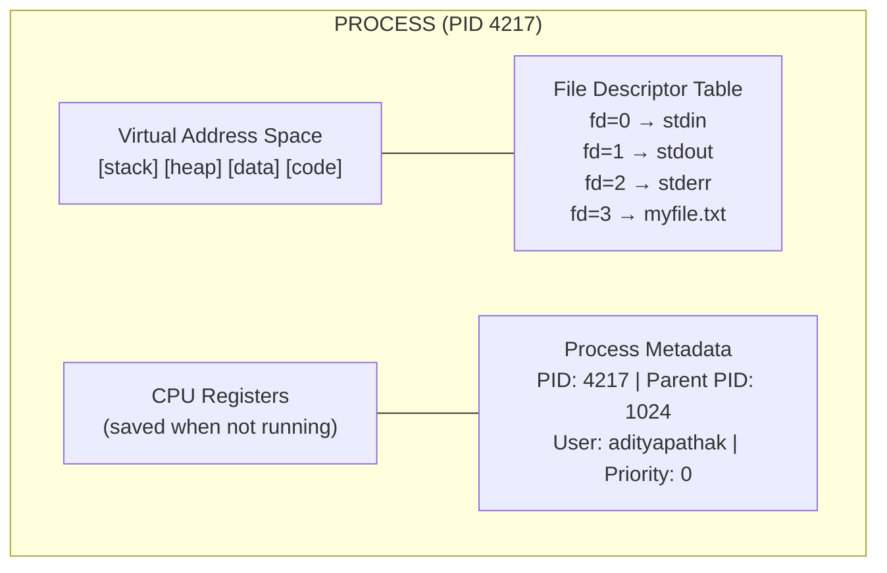
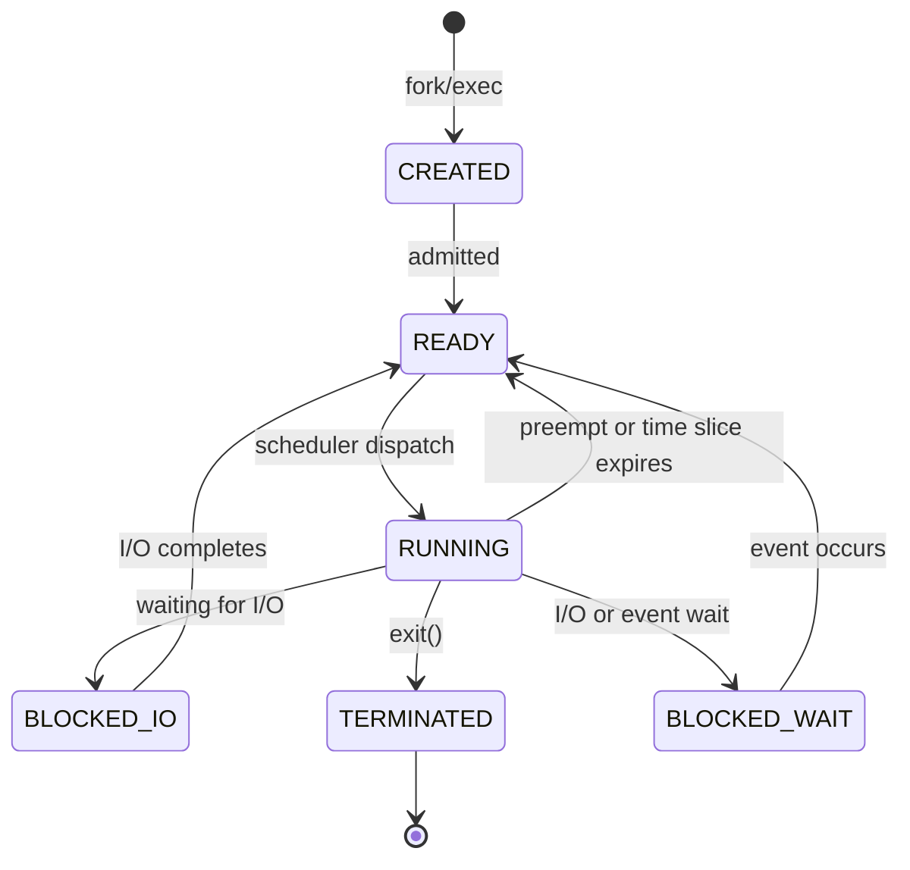
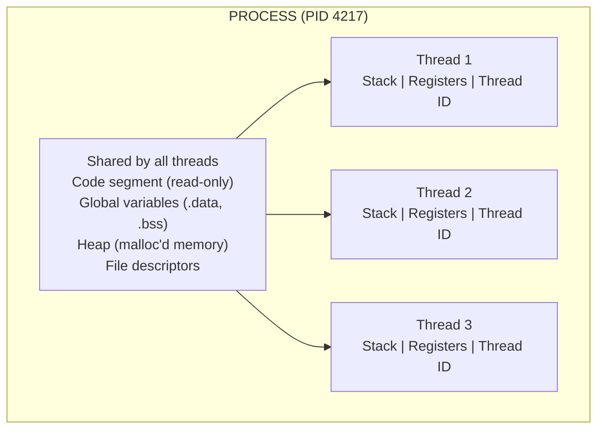
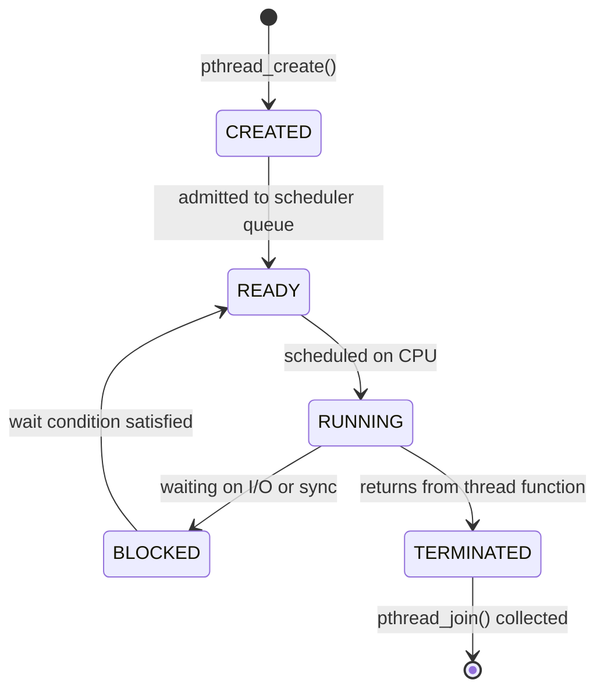
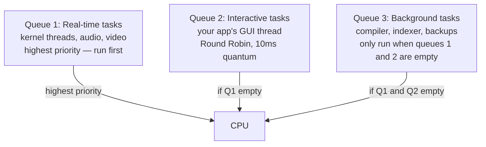
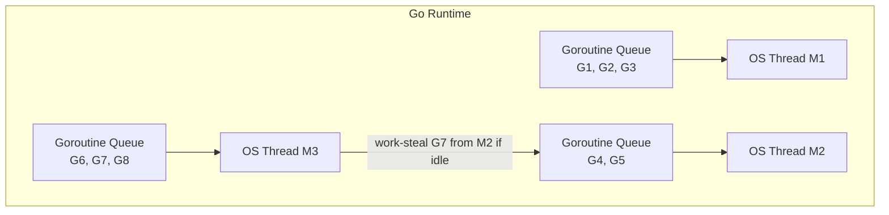

# Chapter 35: Processes, Threads, and Scheduling

> "Concurrency is not parallelism. Concurrency is about dealing with lots of things at once. Parallelism is about doing lots of things at once. Not the same, but related."
> — Rob Pike, co-creator of Go

---

## Overview

Every program you have ever written runs as a **process** — a living, breathing instance of your code given its own piece of memory, its own identity (a process ID), and its own relationship with the operating system. But a process on its own is just one thread of execution: it can only do one thing at a time. To tap into the true power of modern multi-core CPUs, we need **threads** — lightweight workers that live inside a process and share its memory, letting multiple computations happen simultaneously.

This chapter takes you deep into how the operating system manages these concurrent entities. We will study how processes are born and die, how threads share resources and sometimes fight over them (causing race conditions), and how the OS scheduler decides which thread gets to run on the CPU at any given moment. We will then climb up to Go's elegant concurrency model — goroutines and channels — and finally look at how Astra, our language, exposes its own concurrency primitives. The Astra compiler itself uses goroutines to compile multiple files in parallel, so understanding this chapter is not just theory: it is directly visible in the compiler code you will write.

---

## What We're Building

We will implement **parallel compilation** in the Astra compiler: a `CompilePackage` function that fires off a goroutine per source file, compiles them concurrently, and safely gathers results. We will also design Astra's `spawn` and `chan<T>` syntax, connecting the language semantics to the OS-level threading model we study here.

---

## Table of Contents

1. What Is a Process?
2. Process Lifecycle and the Process Table
3. Process Creation: fork() and exec()
4. What Is a Thread?
5. Thread Creation and Lifecycle in C
6. Context Switching — The Cost of Multitasking
7. Scheduling Algorithms
8. The Shared State Problem: Race Conditions
9. Synchronization Primitives: Mutex, Semaphore, Spinlock, Atomics
10. Deadlock — When Threads Wait Forever
11. Go's Concurrency Model: Goroutines and Channels
12. Astra's Concurrency Design
13. Astra Build Milestone: Parallel Compilation
14. Exercises
15. Summary

---

## 1. What Is a Process?

Imagine you are reading a recipe book. The recipe is the **program** — it is just text on a page, doing nothing. When you actually start cooking, following the recipe step by step, that activity is the **process**. The process is the program *in execution*.

Every process owns four things exclusively:



**Own address space**: Each process believes it owns all of memory from address 0 to 2^48. This illusion is maintained by the CPU's Memory Management Unit (MMU) — we will cover the details in Chapter 36. The key point is that process A cannot read or write process B's memory without special system calls. This isolation is why a crash in one program does not corrupt another.

**Own file descriptors**: When you open a file, the OS gives you a small integer (a "file descriptor") like 3, 4, 5. These are indices into a per-process table. File descriptor 3 in process A and file descriptor 3 in process B are completely different files.

**Own PID**: Every process gets a unique integer identifier. On Linux, you can see all running processes with `ps aux` or `top`. PID 1 is `init` (or `systemd`) — the first process the kernel starts. Every other process is a descendant of PID 1.

**Own set of CPU register values**: When a process is not running (because the OS gave the CPU to another process), its register values are saved and restored. This is context switching, which we will cover in Section 6.

### The Process Control Block (PCB)

The kernel maintains a data structure for every process called the **Process Control Block**:

```
┌─────────────────────────────────────┐
│         Process Control Block       │
├─────────────────────────────────────┤
│ PID          │ 4217                 │
│ State        │ RUNNING              │
│ Program Counter │ 0x401234          │
│ Stack Pointer   │ 0x7fff1234        │
│ General Registers │ rax=0, rbx=...  │
│ Priority     │ 0                    │
│ Memory maps  │ → page table root    │
│ Open files   │ → fd table           │
│ Signal handlers │ → signal table    │
│ Parent PID   │ 1024                 │
│ Children     │ [4218, 4219]         │
└─────────────────────────────────────┘
```

This PCB is what makes it possible to pause a process and resume it later — the OS saves everything into the PCB and restores it when the process runs again.

---

## 2. Process Lifecycle and the Process Table

A process moves through five states during its life:



**Created**: The process has been created (by `fork()`) but has not yet been admitted to the ready queue.

**Ready**: The process has everything it needs to run — it is just waiting for the CPU. Many processes can be in the ready state simultaneously; they form a queue that the scheduler works through.

**Running**: The process currently has the CPU. On a single-core machine, only one process can be in this state at a time. On a 4-core machine, up to 4 processes can run simultaneously.

**Blocked**: The process is waiting for something — disk I/O to complete, a network packet to arrive, another process to signal it. It does NOT need the CPU right now, so the scheduler will not give it one.

**Terminated (Zombie)**: The process has finished executing but its PCB still exists, waiting for its parent to read its exit code via `wait()`. The PCB is tiny, but if a parent never calls `wait()`, zombie processes accumulate. A well-written server always `wait()`s for its children.

---

## 3. Process Creation: fork() and exec()

On Unix-like systems (Linux, macOS), processes are created using two system calls: `fork()` and `exec()`.

**fork()** creates an exact copy of the current process. The child gets a copy of the parent's address space (using copy-on-write for efficiency), a copy of the file descriptor table, but a NEW PID.

```c
#include <unistd.h>
#include <stdio.h>

int main() {
    printf("Before fork, PID=%d\n", getpid());

    pid_t child = fork();

    if (child == 0) {
        // We are in the CHILD process
        printf("Child: PID=%d, parent=%d\n", getpid(), getppid());
    } else if (child > 0) {
        // We are in the PARENT process
        printf("Parent: PID=%d, child=%d\n", getpid(), child);
        wait(NULL); // wait for child to finish (prevents zombie)
    } else {
        // fork() failed
        perror("fork");
    }
    return 0;
}
```

**exec()** replaces the current process's program with a new one. The PID stays the same, but the code, data, and stack are completely replaced. This is how your shell runs programs: it `fork()`s itself, then the child calls `exec("ls")` to become the `ls` program.

```mermaid
flowchart TD
    S["Shell process (PID 1024)"]
    F["fork()"]
    P["Shell (PID 1024)\nKeeps running"]
    C["Child (PID 1025)\nexec(\"ls\", args)"]
    L["ls program runs\n(same PID 1025)\nexits when done"]
    W["Shell: wait(1025)\nShell continues (shows prompt)"]
    S --> F
    F --> P
    F --> C
    C --> L
    L --> W
    P --> W
```

---

## 4. What Is a Thread?

A process is heavyweight: creating a new process requires duplicating the entire address space, copying file descriptors, setting up new page tables. This takes time and memory.

A **thread** is a lightweight execution unit that lives INSIDE a process and shares its address space. Think of a process as a house, and threads as the people living in it. They share the kitchen (heap), the living room (global variables), and the library (code). But each person has their own bedroom: each thread has its own **stack** and its own **set of CPU registers**.



**Why threads are faster than processes:**
- Creating a thread: ~10 microseconds (just allocate a stack, create a Thread Control Block)
- Creating a process: ~100 microseconds (copy page tables, duplicate file descriptors, etc.)
- Context switching between threads of the SAME process: cheaper (same page tables, no TLB flush needed)
- Communication: threads can just write to a shared variable. Processes must use IPC (pipes, sockets, shared memory — all slower)

**Why threads exist on multi-core CPUs:**
A process with 4 threads can run 4 computations simultaneously on a 4-core CPU. A single-threaded process can only use 1 core at a time, leaving 3 cores idle. For a compiler like Astra, compiling 100 files can be done 100x faster (roughly) if you use 100 goroutines on 8 cores.

---

## 5. Thread Creation and Lifecycle in C

The POSIX Threads library (pthreads) is the standard way to create threads in C:

```c
#include <pthread.h>
#include <stdio.h>
#include <stdlib.h>

// Each thread runs this function
void* thread_work(void* arg) {
    int thread_id = *(int*)arg;
    printf("Thread %d: doing work...\n", thread_id);

    // simulate work
    for (long i = 0; i < 100000000L; i++) { /* busy wait */ }

    printf("Thread %d: done\n", thread_id);
    return NULL; // return value (can be collected by pthread_join)
}

int main() {
    pthread_t threads[4];
    int ids[4] = {1, 2, 3, 4};

    // CREATE 4 threads
    for (int i = 0; i < 4; i++) {
        // pthread_create(thread_handle, attributes, function, argument)
        int rc = pthread_create(&threads[i], NULL, thread_work, &ids[i]);
        if (rc != 0) { perror("pthread_create"); exit(1); }
    }

    // JOIN (wait for all threads to finish)
    for (int i = 0; i < 4; i++) {
        pthread_join(threads[i], NULL); // blocks until thread[i] finishes
    }

    printf("All threads done.\n");
    return 0;
}
```

**Thread lifecycle:**



**Detached threads**: If you call `pthread_detach(thread)`, the thread cleans up its resources automatically when it finishes (no need for `pthread_join`). Useful for "fire and forget" background tasks, but you lose the ability to wait for the result.

---

## 6. Context Switching — The Cost of Multitasking

Your CPU can only execute one thread per core at a time. If you have 1000 threads and 8 cores, the OS must rapidly switch between threads to give the illusion of simultaneous execution. This switching is called a **context switch**.

Here is what happens during a context switch from Thread A to Thread B:

```
Thread A running
      │
      │  Timer interrupt fires (or Thread A blocks on I/O)
      │
      ▼
KERNEL MODE ENTRY
      │
      ├── Save Thread A's context into its TCB:
      │       - Program Counter (rip)
      │       - Stack Pointer (rsp)
      │       - All general-purpose registers (rax, rbx, ...)
      │       - Floating point registers
      │       - Flags register
      │
      ├── Update Thread A's state: RUNNING → READY (or BLOCKED)
      │
      ├── Run scheduler: pick next thread to run (Thread B)
      │
      ├── Load Thread B's context from its TCB:
      │       - Restore all registers
      │       - Restore stack pointer
      │       - Restore program counter
      │
      ├── If Thread B is in a DIFFERENT PROCESS:
      │       - Switch page tables (CR3 register on x86-64)
      │       - Flush TLB (all cached address translations invalidated!)
      │       - This adds significant overhead (~100s of nanoseconds)
      │
      └── Return to user mode — Thread B is now running
```

**Context switch cost:**
- Same-process thread switch: ~1-3 microseconds
- Different-process switch: ~10-20 microseconds (due to TLB flush and cache pollution)

**Why expensive?** Two reasons:
1. **Cache pollution**: the CPU's L1/L2 caches were warm with Thread A's data. Thread B works with different data, causing many cache misses initially.
2. **TLB flush**: the Translation Lookaside Buffer (hardware cache of virtual-to-physical address translations) must be flushed when switching between processes. Every memory access is slow until the TLB warms up again.

This is why Go's goroutines are so much lighter than OS threads — the Go runtime manages its own scheduling on top of a small pool of OS threads, minimizing expensive OS context switches.

---

## 7. Scheduling Algorithms

The scheduler is the part of the OS kernel that decides which thread runs on the CPU next. Different algorithms make different tradeoffs between fairness, throughput, and latency.

### 7.1 First Come First Served (FCFS)

Run threads in the order they arrive. The simplest possible scheduler.

```
Arrival order: A(10ms), B(2ms), C(1ms)

Timeline:
[AAAAAAAAAA][BB][C]
0          10  12  13

Average wait time: A waits 0ms, B waits 10ms, C waits 12ms
Average = 7.33ms  ← terrible for short jobs
```

Problem: The **convoy effect** — short jobs get stuck behind long ones.

### 7.2 Round Robin

Give each thread a fixed time slice (the "quantum" — typically 1-10ms). When the quantum expires, preempt and give the CPU to the next thread.

```
Quantum = 2ms. Threads: A(10ms), B(4ms), C(6ms)

Timeline:
[AA][BB][CC][AA][BB][CC][AA][CC][AA][AA]
 0   2   4   6   8  10  12  14  16  18  20

A finishes at 20ms, B at 8ms, C at 16ms
```

Round Robin is **fair** — every thread makes progress. Used as the foundation of most real schedulers.

### 7.3 Priority Scheduling

Each thread gets a priority number (higher = more important). The scheduler always runs the highest-priority READY thread.

Problem: **Starvation** — if high-priority threads keep arriving, low-priority threads may NEVER run.

Solution: **Aging** — gradually increase the priority of waiting threads over time, so even low-priority threads eventually get the CPU.

### 7.4 Multilevel Queue Scheduling

Threads are divided into categories (real-time, interactive, background batch) with separate queues, each with its own scheduling algorithm.



### 7.5 CFS — Completely Fair Scheduler (Linux)

The scheduler Linux uses today. The idea: every thread should get an equal share of CPU time. CFS tracks a "virtual runtime" (vruntime) for each thread — how much CPU time it has used. The scheduler always picks the thread with the LOWEST vruntime (the most "unfairly treated" thread).

CFS uses a **red-black tree** (a self-balancing BST) ordered by vruntime. Picking the next thread is O(log n). This gives Linux both fairness and efficiency.

```
         vruntime tree (left = least CPU time = runs next)
                    [thread_D: 12ms]
                   /                \
          [thread_A: 8ms]    [thread_F: 18ms]
         /           \
  [thread_B: 5ms]  [thread_C: 7ms]
         ↑
    Next to run (lowest vruntime)
```

### 7.6 Preemptive vs Cooperative Scheduling

**Preemptive** (modern OSes): The scheduler can stop a running thread at any time (via timer interrupt) and switch to another. The thread has NO say in this. This is what Linux, Windows, macOS all use.

**Cooperative**: A thread runs until it voluntarily yields (calls `yield()` or blocks on I/O). If it never yields, it hogs the CPU forever. Early Windows (3.x) and early Mac OS used this — a single misbehaving app could freeze the whole system.

Go's goroutine scheduler is **preemptive** since Go 1.14 (before that, goroutines had to hit certain checkpoints to be preempted).

---

## 8. The Shared State Problem: Race Conditions

Threads share memory. This is powerful (fast communication) but dangerous. Consider two threads, both trying to increment a shared counter:

```c
// SHARED global variable
int counter = 0;

// Thread 1:              // Thread 2:
counter++;                counter++;
```

"counter++" looks like one operation. At the machine code level, it is THREE:

```asm
MOV rax, [counter]   ; 1. load counter into register
ADD rax, 1           ; 2. add 1
MOV [counter], rax   ; 3. store back to memory
```

Now watch what happens with two threads running "simultaneously":

```
Thread 1                    Thread 2                    counter value
──────────────────────────────────────────────────────────────────────
MOV rax, [counter]                                      0  (rax1 = 0)
ADD rax, 1                                              0  (rax1 = 1)
                            MOV rax, [counter]          0  (rax2 = 0)
                            ADD rax, 1                  0  (rax2 = 1)
MOV [counter], rax                                      1  ← Thread 1 writes 1
                            MOV [counter], rax          1  ← Thread 2 ALSO writes 1!

Final counter value: 1 — but we did TWO increments! We expected 2!
```

This is a **race condition** — the result depends on which thread runs first, and it is wrong. Race conditions produce bugs that are nearly impossible to reproduce (they depend on exact CPU timing) and almost impossible to debug.

---

## 9. Synchronization Primitives

### 9.1 Mutex (Mutual Exclusion Lock)

A mutex is like a bathroom key. Before entering the critical section (the code that accesses shared state), a thread LOCKS the mutex. When done, it UNLOCKS it. Only one thread can hold the lock at a time; all others block (wait).

```c
#include <pthread.h>

int counter = 0;
pthread_mutex_t lock = PTHREAD_MUTEX_INITIALIZER;

void* increment(void* arg) {
    for (int i = 0; i < 1000000; i++) {
        pthread_mutex_lock(&lock);   // acquire lock — blocks if held by another
        counter++;                   // critical section — safe now
        pthread_mutex_unlock(&lock); // release lock — wake up waiting threads
    }
    return NULL;
}
```

Now `counter` will always reach 2,000,000 as expected.

**Cost**: Locking/unlocking a mutex takes ~20-100ns (involves atomic CPU instructions and possibly a kernel call if there is contention).

### 9.2 Semaphore

A semaphore is a generalized mutex with a counter. A binary semaphore (counter 0 or 1) is equivalent to a mutex. A counting semaphore with counter N allows up to N threads to proceed simultaneously — useful for limiting concurrent access to a resource pool (like a database connection pool of size 10).

```c
#include <semaphore.h>
sem_t db_connections;
sem_init(&db_connections, 0, 10); // allow 10 concurrent accesses

// In each thread:
sem_wait(&db_connections);  // decrement; blocks if counter would go below 0
// ... use database connection ...
sem_post(&db_connections);  // increment; wakes a waiting thread if any
```

### 9.3 Spinlock

Instead of sleeping and waking, a spinlock continuously checks if the lock is available (busy-waiting). Faster than a mutex when the wait is very short (microseconds), because there is no kernel context switch. But wastes CPU cycles if the wait is long.

```c
pthread_spinlock_t spinlock;
pthread_spin_lock(&spinlock);   // spins (loops) until lock is free
// ... critical section ...
pthread_spin_unlock(&spinlock);
```

### 9.4 Atomic Operations

For simple operations (increment, compare-and-swap), the CPU provides **atomic instructions** that execute as a single uninterruptible hardware operation. No lock needed, much faster.

```c
#include <stdatomic.h>
atomic_int counter = 0;

// Thread 1 and Thread 2 can both do this safely:
atomic_fetch_add(&counter, 1); // atomic increment — always correct, no mutex needed
```

In Go, the `sync/atomic` package provides these. The Astra compiler uses atomic operations for its internal counters.

---

## 10. Deadlock — When Threads Wait Forever

Deadlock happens when two or more threads are each waiting for a resource held by the other. Neither can proceed. The system is frozen.

Classic example: two threads, two locks.

```
Thread 1:               Thread 2:
lock(mutex_A)           lock(mutex_B)
lock(mutex_B) ←──┐  ┌─→ lock(mutex_A)
...              │  │  ...
                 │  │
Thread 1 waits for mutex_B (held by Thread 2)
Thread 2 waits for mutex_A (held by Thread 1)
DEADLOCK — neither can proceed!
```

### The Four Conditions (Coffman Conditions)

Deadlock requires ALL FOUR of these to hold simultaneously:

1. **Mutual exclusion**: at least one resource can only be held by one thread at a time.
2. **Hold and wait**: a thread holds a resource while waiting for another.
3. **No preemption**: the OS cannot forcibly take a resource from a thread.
4. **Circular wait**: there is a cycle in the "waiting for" graph.

**Prevention**: eliminate one of the four conditions. For circular wait: require all threads to acquire locks in the SAME global order. If all threads always lock mutex_A before mutex_B, the cycle is impossible.

**Avoidance (Banker's Algorithm)**: Before granting a resource request, check if the resulting state is "safe" (i.e., all threads can eventually complete). Used in embedded real-time systems; too expensive for general OSes.

**Detection**: Let deadlocks happen, detect them by finding cycles in the resource allocation graph, then recover (kill a process, roll back transactions).

In Go, goroutines and channels are designed to avoid deadlock patterns that are common with raw mutexes — but deadlocks are still possible if you write incorrect channel code.

---

## 11. Go's Concurrency Model: Goroutines and Channels

Go was designed by people who understood the problems with raw threads. Its concurrency model is built on two ideas:

### 11.1 Goroutines

A goroutine is like a thread, but managed by the Go runtime rather than the OS. Starting a goroutine is as simple as the `go` keyword:

```go
go doSomething() // launches doSomething in a new goroutine
```

**Why goroutines are special:**
- **Tiny initial stack**: ~2KB (compared to 8MB for an OS thread). You can have a million goroutines in a program.
- **Growable stack**: if a goroutine needs more stack, the Go runtime automatically grows it (up to 1GB by default).
- **Managed by Go scheduler**: the Go runtime runs M goroutines on N OS threads (M:N threading). Typically N equals the number of CPU cores.
- **Work-stealing scheduler**: if one OS thread runs out of goroutines, it "steals" goroutines from other threads' queues. This keeps all cores busy.



### 11.2 Channels

Go's philosophy: **"Do not communicate by sharing memory; share memory by communicating."**

Instead of using a shared variable + mutex, goroutines communicate by passing values through **channels**. A channel is a typed conduit; sending blocks until a receiver is ready (for unbuffered channels).

```go
// Unbuffered channel: synchronous handoff
ch := make(chan int)

go func() {
    ch <- 42 // blocks until someone receives
}()

value := <-ch // blocks until someone sends
fmt.Println(value) // 42

// Buffered channel: async up to buffer size
bch := make(chan int, 5) // can hold 5 values without blocking
bch <- 1
bch <- 2
bch <- 3 // these don't block (buffer has space)
```

Channels eliminate the need for mutexes in many situations, making concurrent code much easier to reason about.

### 11.3 The sync Package

For cases where you DO need traditional synchronization, Go provides `sync.Mutex`, `sync.RWMutex`, `sync.WaitGroup`, and `sync.Once`.

```go
var wg sync.WaitGroup
var mu sync.Mutex
counter := 0

for i := 0; i < 1000; i++ {
    wg.Add(1)
    go func() {
        defer wg.Done()
        mu.Lock()
        counter++ // now safe
        mu.Unlock()
    }()
}

wg.Wait()
fmt.Println(counter) // always 1000
```

---

## 12. Astra's Concurrency Design

Astra exposes concurrency through two constructs (detailed in Chapter 76):

### 12.1 `spawn` — Launch a Fiber

```astra
// Astra source code
fn main() {
    let handle = spawn compute_pi(1000000)
    let result = await handle
    print("Pi ≈ " + result)
}
```

`spawn expr` launches `expr` as a lightweight concurrent fiber (backed by a goroutine in the Go-based Astra runtime). The `await` collects the result when the fiber completes.

### 12.2 `chan<T>` — Typed Channels

```astra
// Astra source code
fn producer(ch: chan<int>) {
    for i in 0..10 {
        ch.send(i)
    }
    ch.close()
}

fn consumer(ch: chan<int>) {
    for value in ch {
        print("Received: " + value)
    }
}

fn main() {
    let ch: chan<int> = chan.new()
    spawn producer(ch)
    spawn consumer(ch)
}
```

The Astra compiler desugars `spawn` into a Go goroutine launch, and `chan<T>` into a Go `chan T`. This means Astra programs get M:N threading, work-stealing, and all the concurrency goodness of Go's runtime for free.

---

## 13. Astra Build Milestone: Parallel Compilation

The Astra compiler itself uses goroutines to compile multiple source files in parallel. Here is the complete `CompilePackage` function:

```go
// compiler/compiler.go
package compiler

import (
    "fmt"
    "os"
    "sync"

    "github.com/astra-lang/astra/ir"
)

// CompilePackage compiles multiple Astra source files in parallel.
// Each file is compiled independently (no inter-file dependencies at
// this stage — those are resolved in the linker phase).
func (c *Compiler) CompilePackage(files []string) ([]*ir.Module, error) {
    modules := make([]*ir.Module, len(files))
    errs    := make([]error, len(files))

    var wg sync.WaitGroup

    for i, file := range files {
        wg.Add(1) // tell the WaitGroup to expect one more goroutine

        // IMPORTANT: capture i and file as local variables.
        // If we used i and file directly in the goroutine, by the time
        // the goroutine runs, the for-loop may have advanced i and file.
        go func(idx int, filename string) {
            defer wg.Done() // signal WaitGroup when this goroutine finishes

            // Read the source file from disk
            src, err := os.ReadFile(filename)
            if err != nil {
                errs[idx] = fmt.Errorf("reading %s: %w", filename, err)
                return
            }

            // Compile the source. This runs the full pipeline:
            // lexer → parser → AST → type checker → IR generation
            module, err := c.compileOne(string(src))
            if err != nil {
                errs[idx] = fmt.Errorf("compiling %s: %w", filename, err)
                return
            }

            modules[idx] = module
        }(i, file)
    }

    // Wait for ALL goroutines to finish
    wg.Wait()

    // Check if any goroutine reported an error
    for i, err := range errs {
        if err != nil {
            return nil, fmt.Errorf("package compilation failed: %w", err)
        }
        _ = i
    }

    return modules, nil
}

// compileOne compiles a single Astra source file to an IR module.
// This function is safe to call concurrently — it creates a fresh
// Lexer, Parser, and TypeChecker for each file.
func (c *Compiler) compileOne(source string) (*ir.Module, error) {
    // Each stage creates its own local state — no shared mutable state
    lexer   := NewLexer(source)
    tokens  := lexer.Tokenize()

    parser  := NewParser(tokens)
    ast, err := parser.ParseProgram()
    if err != nil {
        return nil, err
    }

    checker := NewTypeChecker(c.globalTypeEnv) // read-only global env
    if err := checker.Check(ast); err != nil {
        return nil, err
    }

    gen := NewIRGenerator()
    return gen.Generate(ast), nil
}
```

The key insight: each goroutine gets its own `Lexer`, `Parser`, and `TypeChecker`. The only shared data is `c.globalTypeEnv` (the built-in type definitions), which is READ-ONLY after initialization — no mutex needed for read-only data.

We also need a way to limit concurrency (avoid creating 1000 goroutines for 1000 files — the OS will thrash):

```go
// CompilePackageWithLimit compiles files in parallel but limits to
// GOMAXPROCS goroutines at a time using a semaphore channel.
func (c *Compiler) CompilePackageWithLimit(files []string) ([]*ir.Module, error) {
    numCPU := runtime.GOMAXPROCS(0) // number of logical CPUs
    sem    := make(chan struct{}, numCPU) // semaphore: at most numCPU concurrent

    modules := make([]*ir.Module, len(files))
    errs    := make([]error, len(files))
    var wg sync.WaitGroup

    for i, file := range files {
        wg.Add(1)
        go func(idx int, filename string) {
            defer wg.Done()
            sem <- struct{}{}        // acquire slot
            defer func() { <-sem }() // release slot when done

            src, err := os.ReadFile(filename)
            if err != nil { errs[idx] = err; return }
            modules[idx], errs[idx] = c.compileOne(string(src))
        }(i, file)
    }

    wg.Wait()
    for _, err := range errs {
        if err != nil { return nil, err }
    }
    return modules, nil
}
```

This is a real-world pattern used in Go compilers, build tools like Bazel, and web servers everywhere.

---

## Exercises

1. **Race condition hunt**: Write a Go program with two goroutines both incrementing a shared `int` counter one million times (without a mutex). Run it several times. Record the different results you get. Then add a `sync.Mutex` and verify the result is always 2,000,000. Use `go run -race` to have Go's race detector catch the bug automatically.

2. **Semaphore pool**: Implement a "worker pool" of exactly 4 goroutines using a buffered channel as a semaphore. The pool should process a slice of 100 "jobs" (each job just sleeps for a random duration between 1-100ms and prints its job ID). Verify that at most 4 goroutines run at any given time.

3. **Pipeline pattern**: Model the Astra compilation pipeline (lex → parse → type-check → codegen) as a Go channel pipeline. Create 4 goroutines connected by channels: the first reads source files and sends strings, the second lexes and sends token slices, the third parses and sends ASTs, the fourth prints the AST. Feed 5 files through the pipeline.

4. **Deadlock by design**: Write a Go program that deadlocks two goroutines on channels (not mutexes). Describe exactly why the deadlock occurs using the four Coffman conditions.

5. **Scheduling simulation**: Implement a Round Robin scheduler simulator in Go. Create a struct `Task` with fields `Name string`, `BurstTime int` (total CPU time needed), and `Remaining int`. Implement a function `RoundRobin(tasks []Task, quantum int)` that simulates scheduling and prints a Gantt chart showing which task runs in each time slot. Calculate average waiting time.

6. **Goroutine profiling**: Write an Astra program that spawns 10 fibers, each computing the first 10,000 Fibonacci numbers. Use `spawn` and collect results with `await`. Then think: how would the Astra compiler's code generator need to be modified to support `spawn` expressions? Sketch the AST node and code generation logic.

---

## Summary

| Concept | Key Point |
|---|---|
| Process | Program in execution; own address space, PID, file descriptors |
| Thread | Lightweight unit within a process; shared heap/code, own stack |
| PCB/TCB | Kernel data structure saving all context for a suspended thread |
| Context switch | Save registers + load registers; costs ~1-20μs; cache-polluting |
| FCFS scheduling | Simple, but convoy effect hurts short jobs |
| Round Robin | Fair; each gets a time quantum; basis of real schedulers |
| CFS (Linux) | Virtual runtime + red-black tree; completely fair |
| Race condition | Two threads read-modify-write shared data without synchronization |
| Mutex | Lock before critical section; one thread at a time |
| Deadlock | Circular wait on resources; requires all 4 Coffman conditions |
| Goroutine | Go's lightweight thread (~2KB stack); managed by Go runtime |
| Channel | Typed communication conduit between goroutines; prevents races |
| M:N threading | N goroutines scheduled on M OS threads via work-stealing |
| Astra `spawn` | Creates a goroutine-like fiber; result retrieved with `await` |
| Astra `chan<T>` | Typed channel matching Go semantics |
| Parallel compilation | Astra compiles each file in its own goroutine via `CompilePackage` |
