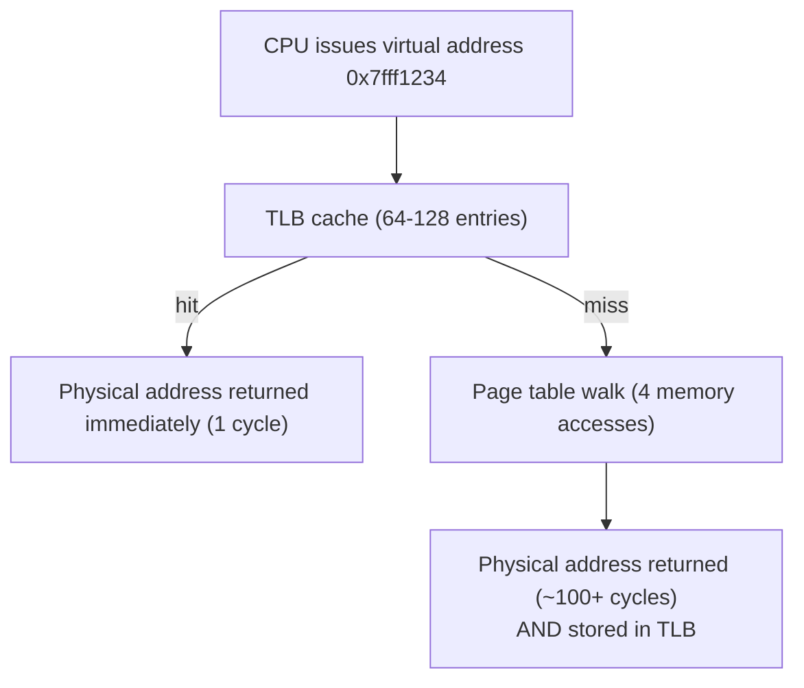
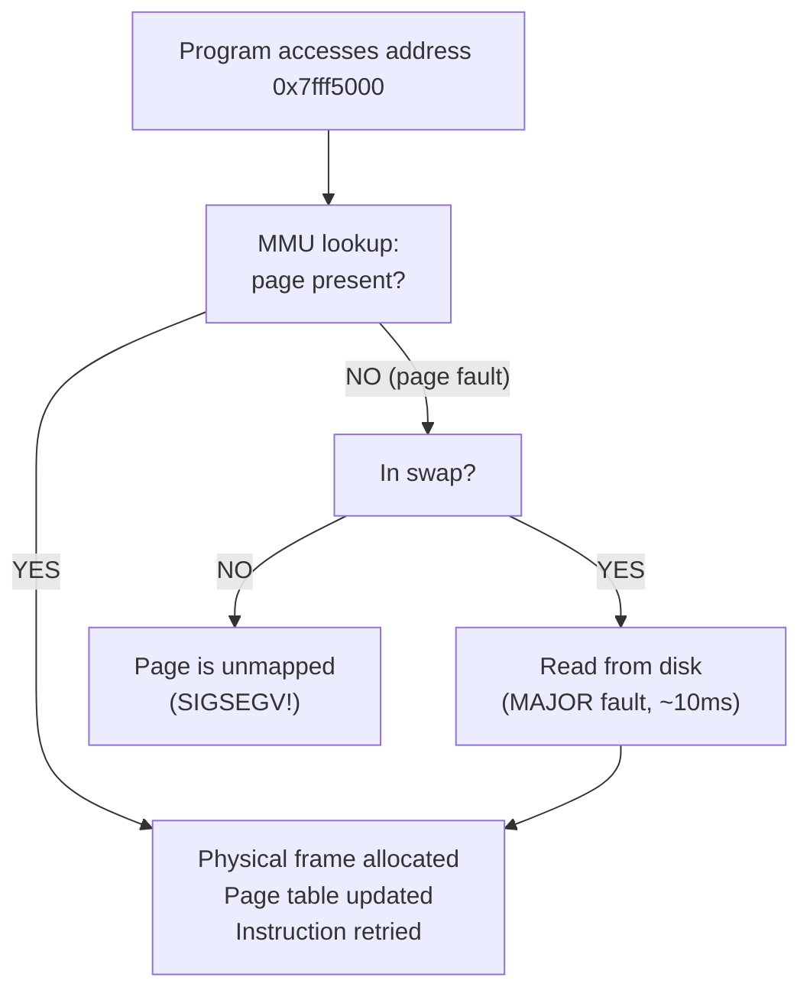
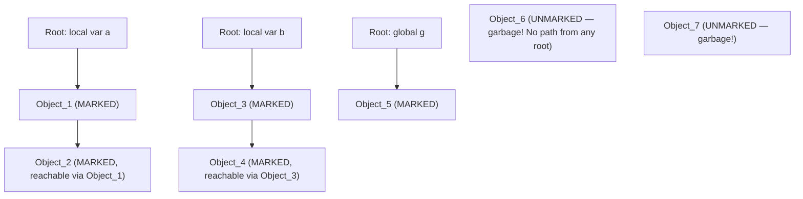

# Chapter 36: Memory Management and Virtual Memory

> "Memory is like a closet. You start with it organized, then programs start throwing things in without telling you, and eventually you're not sure what's in there or whether it's safe to use."
> — Every systems programmer ever

---

## Overview

Every variable you declare, every object you create, every string you concatenate — it all lives somewhere in physical RAM. But how does a process know where its memory is? How does your program allocate a new object at runtime? What stops you from accidentally reading memory that belongs to another process? And who cleans up objects that are no longer needed?

These questions are answered by **memory management** — one of the most important and subtle topics in computer science. Poor memory management causes security vulnerabilities (buffer overflows, use-after-free), crashes (segmentation faults), and performance cliffs (fragmentation, garbage collection pauses). Astra, as a safe, managed language, must get memory management right.

In this chapter we travel from the hardware level (how a CPU translates a virtual address to a physical address using page tables and the TLB) all the way up to sophisticated garbage collection algorithms (generational GC, tricolor mark-and-sweep). We then study how the Astra runtime manages memory on behalf of Astra programs — and how the Astra compiler uses **escape analysis** to put as many objects as possible on the stack (fast, free, no GC needed) instead of the heap.

---

## What We're Building

We will design and partially implement **Astra's garbage collector**: a generational, tricolor mark-and-sweep GC written in C, integrated with the Astra runtime. We will also examine the **escape analysis** pass in the Astra compiler that decides whether a value goes on the stack or the heap.

---

## Table of Contents

1. Virtual Memory — The Illusion of Infinite RAM
2. Page Tables — Mapping Virtual to Physical
3. The TLB — Hardware Speedup for Address Translation
4. Page Faults — What Happens When a Page Isn't in RAM
5. Segmentation Faults — Accessing the Unmapped
6. The Heap — Dynamic Memory Allocation
7. malloc() Internals — How Dynamic Allocation Really Works
8. Memory Fragmentation — The Hidden Performance Killer
9. Garbage Collection: Reference Counting
10. Garbage Collection: Mark-and-Sweep
11. Garbage Collection: Copying GC
12. Garbage Collection: Generational GC
13. Garbage Collection: Incremental and Concurrent GC
14. Memory Safety in Astra
15. Escape Analysis — Stack vs Heap
16. Astra's GC Design
17. Astra Build Milestone: GC Implementation
18. Exercises
19. Summary

---

## 1. Virtual Memory — The Illusion of Infinite RAM

Your laptop has 16GB of physical RAM. Yet a process can allocate and use up to 128TB of address space (on x86-64 Linux). How?

The answer is **virtual memory**: each process is given its own private, contiguous address space — a map of addresses from 0 to 2^48 (approximately 256 terabytes). The process believes it owns all of this memory. The reality is very different: most of this address space is empty (unmapped), only the pages the process actually USES are backed by physical RAM, and the OS can move physical pages to disk (swap) if RAM runs out.

```
Process's view                     Physical RAM (shared)
(virtual address space)
┌──────────────────┐               ┌──────────────────┐
│  0xFFFF...FFFF   │               │  Physical frame 0│
│  kernel space    │               │  Physical frame 1│
│  (not accessible)│               │  Physical frame 2│
│                  │               │  ...             │
│  0x7FFF...0000   │               │  Physical frame N│
│  stack           │◄──────────┐   └──────────────────┘
│  ↓               │           │
│                  │           │   On-disk swap space
│  (unmapped gap)  │           │   ┌──────────────────┐
│                  │           │   │  Swapped page A  │
│  heap ↑          │           │   │  Swapped page B  │
│                  │           │   │  ...             │
│  data/bss        │           │   └──────────────────┘
│  0x00401000      │           │
│  code (.text)    │◄──────────┘ (MMU translates virtual→physical)
│  0x00400000      │
│  0x00000000      │ (NULL — unmapped, accessing causes SIGSEGV)
└──────────────────┘
```

The key insight: virtual addresses are **translated** to physical addresses by hardware (the Memory Management Unit, MMU) using a data structure called the **page table**. This translation is invisible to the program — it just works with virtual addresses.

**Benefits of virtual memory:**
- **Isolation**: process A cannot access process B's memory (different page tables)
- **Larger-than-RAM programs**: only the needed pages are in RAM; others live on disk
- **Memory-mapped files**: files can be "mapped" into virtual address space and accessed like arrays
- **Copy-on-write**: `fork()` is fast because the child shares the parent's pages; a copy is only made when a page is written

---

## 2. Page Tables — Mapping Virtual to Physical

Memory is divided into fixed-size chunks called **pages** (4KB on x86-64). The **page table** maps virtual page numbers to physical frame numbers.

On x86-64, a virtual address is 48 bits wide, broken into 5 fields:

```
Virtual Address (48 bits):
┌────────┬────────┬────────┬────────┬────────────────┐
│ PML4   │  PDP   │  PD    │  PT    │  Page Offset   │
│ index  │  index │  index │  index │  (12 bits)     │
│ 9 bits │ 9 bits │ 9 bits │ 9 bits │                │
└────────┴────────┴────────┴────────┴────────────────┘

Translation Walk (4 levels of page tables):

CR3 register → PML4 table
                    │
                    ├─[PML4 index]→ PDP table
                                        │
                                        ├─[PDP index]→ PD table
                                                           │
                                                           ├─[PD index]→ PT table
                                                                              │
                                                                              ├─[PT index]→ Physical Frame Number
                                                                                                   │
                                                                              + Page Offset → Physical Address
```

Each level is a table of 512 entries (2^9), each 8 bytes. So a full page table hierarchy can map 512^4 = 256 TB of virtual address space.

**Why 4 levels?** A single-level page table for 256TB would need 64 billion entries × 8 bytes = 512GB just for the page table. Multi-level tables only allocate entries for pages actually in use — sparse address spaces (most of the 256TB is empty) use almost no memory for page table storage.

---

## 3. The TLB — Hardware Speedup for Address Translation

The page table walk requires 4 memory accesses for EVERY virtual memory access your program makes. That would make every read/write 5x slower. Unacceptable.

The solution: the **Translation Lookaside Buffer (TLB)** — a small, fast hardware cache inside the CPU that remembers recent virtual→physical translations.



**TLB hit rate** is typically 99%+ in real programs (good locality of reference). This makes virtual memory nearly as fast as physical.

**TLB flush**: when the OS switches between processes (different page tables), the TLB must be flushed — all cached translations are invalid. This is why process context switches are more expensive than thread context switches (threads in the same process share page tables, so no TLB flush).

---

## 4. Page Faults — What Happens When a Page Isn't in RAM

When the MMU tries to translate a virtual address but finds the page table entry marked "not present," a **page fault** exception is raised. The CPU jumps to the OS's page fault handler.

Two types of page faults:

**Minor page fault**: The page exists (it has been allocated) but hasn't been mapped into physical memory yet. This happens with demand paging — the OS doesn't actually put a page in RAM until the first access. The fault handler allocates a physical frame, zeros it, updates the page table, and returns. The instruction is retried. Cost: ~1-10 microseconds.

**Major page fault**: The page exists but was swapped to disk (to free RAM for other processes). The fault handler must read the page from the swap file on disk. Cost: ~1-10 MILLISECONDS — 1000x slower than a minor fault. This is why you see programs "thrash" when RAM is full: constant major faults dominate execution time.



---

## 5. Segmentation Faults — Accessing the Unmapped

A **segfault** (SIGSEGV) is a page fault where the address is not mapped at all — the process has no permission to access that address. Common causes:

- Dereferencing a NULL pointer (address 0 is intentionally unmapped)
- Accessing beyond the end of an array
- Accessing freed memory
- Stack overflow (the stack grows down; accessing below the guard page causes SIGSEGV)

In Astra, the runtime performs **bounds checking** on all array/slice accesses, so buffer overflows cause a clean runtime error rather than a segfault or, worse, silent memory corruption.

---

## 6. The Heap — Dynamic Memory Allocation

The stack is great for local variables with a known, fixed lifetime (they die when the function returns). For objects that must outlive the function that creates them — like a linked list node, or an object returned from a constructor — we need the **heap**.

The heap is a region of memory managed by the program (via `malloc`/`free` in C, via `new`/GC in managed languages). It grows upward (toward higher addresses) as the program allocates more memory.

```
Virtual Address Space (simplified):
┌────────────────────┐ ← high addresses
│       STACK        │ (grows ↓ downward)
│   local variables  │
│   function frames  │
├────────────────────┤
│                    │ (unmapped gap — huge!)
│                    │
├────────────────────┤
│       HEAP         │ (grows ↑ upward)
│   malloc'd objects │
│   GC-managed objs  │
├────────────────────┤
│   BSS segment      │ (uninitialized globals, zeroed)
├────────────────────┤
│   Data segment     │ (initialized globals)
├────────────────────┤
│   Text segment     │ (code — read-only)
└────────────────────┘ ← low addresses (0x400000)
```

The heap is managed by the **allocator** — a library that sits between your program and the OS, organizing free memory and satisfying allocation requests efficiently.

---

## 7. malloc() Internals — How Dynamic Allocation Really Works

When you call `malloc(16)` in C (or the equivalent in any managed language), the allocator does NOT call the OS for every single allocation (that would be far too slow). Instead, it maintains its own **free lists** — pre-organized pools of memory organized by size.

```
malloc's internal free lists (simplified):

size 8:   [block]→[block]→[block]→NULL
size 16:  [block]→[block]→NULL
size 32:  [block]→NULL
size 64:  (empty)
size 128: [block]→NULL
...
large:    (managed separately with mmap)

Each "block" in the free list looks like:
┌──────────────────────────────────────┐
│ Header (16 bytes):                   │
│   size: 16                           │
│   flags: FREE/USED, prev_chunk_used  │
│   next: pointer to next free block   │
└──────────────────────────────────────┘
│ User data (the memory you asked for) │
│   ...16 bytes...                     │
└──────────────────────────────────────┘
│ Footer (for merging adjacent blocks) │
└──────────────────────────────────────┘
```

When you call `malloc(16)`:
1. Find the free list for size-16 (or the next larger size class).
2. If a free block exists: remove it from the free list, mark it as USED, return pointer to user data.
3. If no free block: ask the OS for more memory (via `sbrk()` or `mmap()`), add it to the free list.

When you call `free(ptr)`:
1. Find the block header (it's just before `ptr`).
2. Mark the block as FREE.
3. Try to **coalesce** with adjacent free blocks (merge two adjacent free blocks into one larger one — fights fragmentation).
4. Add to the free list.

**Why `malloc(1)` allocates more than 1 byte**: The header overhead is typically 8-16 bytes, and allocators round up to the nearest size class. So `malloc(1)` might give you a 16-byte block (15 bytes wasted). This is called **internal fragmentation**.

Modern allocators like `jemalloc` (used by Firefox and Meta) and `tcmalloc` (Google) are sophisticated beasts with per-thread caches, multiple arenas, and radix trees for size-class lookup. They can handle millions of allocations per second.

---

## 8. Memory Fragmentation — The Hidden Performance Killer

**External fragmentation**: free memory exists but in scattered small pieces, so large allocation requests fail even though total free memory is sufficient.

```
Before fragmentation:
[USED 100B][FREE 50B][USED 200B][FREE 30B][USED 150B][FREE 40B]

After freeing some blocks:
[FREE 100B][FREE 50B][USED 200B][FREE 30B][FREE 150B][FREE 40B]

Total free = 370B, but a 200B request FAILS — no contiguous 200B block!
```

**Internal fragmentation**: allocated blocks are larger than requested (due to size class rounding), wasting memory inside each allocation.

Solutions:
- **Coalescing**: merge adjacent free blocks (reduces external fragmentation)
- **Compaction**: move all live objects together, leaving one large free block (eliminates external fragmentation but requires updating all pointers — only GC languages can do this easily)
- **Segregated free lists**: separate lists for each size class (reduces fragmentation for common sizes)

---

## 9. Garbage Collection: Reference Counting

In unmanaged languages (C, C++), the programmer manually calls `free()` / `delete`. This is error-prone: forget to free → memory leak; free too early → use-after-free bug; free twice → double-free crash.

Managed languages (Python, JavaScript, Go, Astra) use **garbage collection**: the runtime automatically reclaims memory that is no longer reachable.

**Reference counting** is the simplest GC strategy: each object stores a count of how many references point to it. When that count drops to zero, the object is immediately freed.

```
┌─────────────┐          ┌─────────────┐
│  Object A   │          │  Object B   │
│  refcount=2 │          │  refcount=1 │
└──────┬──────┘          └──────┬──────┘
       │                        │
   ┌───┴───┐                ┌───┘
   │       │                │
 root    var x            var y

When var x is reassigned:
  A.refcount-- → 1 (A not freed, still has root reference)

When root goes away:
  A.refcount-- → 0 → FREE A immediately!
```

**Pros**: Objects are freed immediately when no longer needed. Short, predictable pause times (freeing happens as part of normal execution, spread out).

**Cons**: **Cycles** cause memory leaks. If A points to B and B points to A, both have refcount ≥ 1 forever, even if nothing else points to them.

```
┌───────────┐     ┌───────────┐
│  Object A │────►│  Object B │
│  refcount=1│    │  refcount=1│
└─────▲─────┘     └─────┬─────┘
      └──────────────────┘

No external references! But refcount never reaches 0.
MEMORY LEAK.
```

Python uses reference counting as its primary GC strategy but runs a **cycle detector** periodically (using mark-and-sweep) to catch cyclic garbage.

---

## 10. Garbage Collection: Mark-and-Sweep

Mark-and-sweep is the classic GC algorithm, used (in various forms) by most modern GCs.

**Phase 1: Mark**. Starting from the "roots" (stack variables, global variables, CPU registers), follow all pointers and mark every reachable object.



**Phase 2: Sweep**. Scan ALL objects on the heap. Free any that are unmarked (garbage). Clear marks for next cycle.

```
Heap scan:
[Object_1: MARKED → keep] [Object_2: MARKED → keep]
[Object_3: MARKED → keep] [Object_4: MARKED → keep]
[Object_5: MARKED → keep]
[Object_6: unmarked → FREE]
[Object_7: unmarked → FREE]
```

**Pros**: Handles cycles naturally (a cycle of objects with no external references will not be marked).

**Cons**:
- **Stop-the-world pause**: the GC must stop all application threads while marking. For a large heap, this pause can be hundreds of milliseconds — unacceptable for interactive applications.
- **No compaction**: freed objects leave holes (external fragmentation), unless a separate compaction phase is added.

---

## 11. Garbage Collection: Copying GC

Copying GC divides the heap into two equal "semispaces": `from-space` and `to-space`. At any time, only `from-space` is in use.

**Collection**: scan from roots, COPY each live object from `from-space` to `to-space`. Update all pointers. Swap the roles of from-space and to-space. The old from-space is now entirely free (a single large free block — no fragmentation!).

```
BEFORE collection (from-space half full):
from-space: [ObjA][free][ObjB][free][ObjC][garbage][ObjD]
to-space:   [completely empty]

After COPY (live objects: A, B, D):
from-space: [completely free — all garbage]
to-space:   [ObjA'][ObjB'][ObjD'][free...........free]

Swap: to-space becomes new from-space.
```

**Pros**:
- Zero fragmentation — allocation is just a pointer bump (the fastest possible allocation: `ptr += size`).
- Cache-friendly — recently allocated objects are adjacent in memory.

**Cons**:
- Requires 2x the memory (half the heap is always empty).
- Moving objects requires updating ALL pointers to them — complex.

**Pointer bump allocation** (a consequence):

```c
// Copying GC allocation — incredibly fast
void* gc_alloc(size_t size) {
    if (alloc_ptr + size > from_space_end) {
        gc_collect(); // trigger collection
    }
    void* obj = alloc_ptr;
    alloc_ptr += size; // bump the pointer
    return obj;
}
```

Compare to `malloc`: a pointer bump is a single ADD instruction. `malloc` requires free list traversal, metadata writes, and cache misses.

---

## 12. Garbage Collection: Generational GC

**The generational hypothesis**: most objects die young. In a typical program, 90%+ of objects die within milliseconds of creation (temporary strings, loop variables, intermediate computations). Only a small fraction (persistent data structures, global caches) live for a long time.

**Strategy**: divide the heap into generations. Collect the young generation often (it's small and mostly garbage). Collect old generations rarely.

```
┌────────────────────────────────────────────────────────┐
│                   HEAP                                 │
│                                                        │
│  ┌─────────────────┐   ┌─────────────────────────────┐│
│  │  YOUNG GEN (1MB)│   │   OLD GEN (64MB)            ││
│  │                 │   │                             ││
│  │  Eden space     │   │  Long-lived objects         ││
│  │  [new objects]  │   │  (survived 2+ young GCs)   ││
│  │                 │   │                             ││
│  │  Survivor S0    │   │  Collected rarely           ││
│  │  Survivor S1    │   │  (major GC)                 ││
│  └─────────────────┘   └─────────────────────────────┘│
│                                                        │
│  Minor GC: collect young gen only. Fast! (~10ms)       │
│  Major GC: collect everything. Slow. (~100ms-1s)       │
└────────────────────────────────────────────────────────┘
```

**Object promotion**: If an object survives a minor GC (it's still reachable), it gets copied to the Survivor space. After surviving a few minor GCs (the promotion threshold), it is copied to the old generation.

**Write barrier**: the GC must track when an old-generation object gets a pointer to a young-generation object. Otherwise, the young-generation GC might miss the live young object (because it only scans young-gen roots). A "write barrier" is a small piece of code inserted by the compiler around every pointer write, which records such cross-generation pointers in a "remembered set."

Java's G1 GC, Go's GC (generational since Go 1.22), and the JVM's various collectors all use generational collection.

---

## 13. Garbage Collection: Incremental and Concurrent GC

The stop-the-world pause is the biggest practical problem with GC. Two techniques reduce it:

**Incremental GC**: Instead of doing all the GC work in one big pause, break it into small increments (say, 1ms chunks) interleaved with program execution. The total GC work is the same, but individual pauses are tiny.

**Challenge**: the program modifies the object graph WHILE the GC is marking it. A "write barrier" is needed: whenever the program stores a pointer, the GC must be notified so it doesn't miss newly created live objects.

**Concurrent GC** (used by Go): the marking phase runs concurrently with the application (on separate OS threads). Only tiny pauses are needed for the initial and final "stop the world" phases (rescan of mutated roots).

```
Application threads:  [running...][short pause][running...][short pause][running...]
GC thread:                    [concurrent mark..............][sweep]

Short pause 1: stop-the-world to take a snapshot of roots
Concurrent mark: GC marks most objects while application runs
Short pause 2: stop-the-world to rescan objects written during concurrent mark
Sweep: free unmarked objects (can be concurrent)
```

Go's GC targets keeping GC pauses under 1 millisecond. This is why Go is suitable for latency-sensitive servers.

**Tricolor abstraction**: concurrent GC uses three colors for objects:
- **White**: not yet visited (starts as all objects; at end, white = garbage)
- **Gray**: discovered but children not yet scanned
- **Black**: fully processed (both the object and all its children are scanned)

The invariant: no black object points directly to a white object (that would mean the GC could miss a live object). Write barriers maintain this invariant.

---

## 14. Memory Safety in Astra

Astra's design eliminates an entire class of bugs present in C and C++:

| Bug Class | How C/C++ suffers | How Astra prevents it |
|---|---|---|
| **Buffer overflow** | `arr[i]` has no bounds check | Runtime bounds check on every array access |
| **Use-after-free** | Accessing freed memory | GC ensures objects live as long as referenced |
| **Double-free** | Freeing same pointer twice | GC manages all deallocation |
| **Memory leak** | Forgetting to `free()` | GC collects unreachable objects automatically |
| **Null dereference** | Dereferencing NULL | Optional types; no implicit null in Astra |
| **Dangling pointer** | Stack var escapes function | Escape analysis + GC handle this correctly |

The Astra compiler's type system and runtime work together to make all of these impossible (or, for bounds checking, reported as clean runtime errors rather than undefined behavior).

---

## 15. Escape Analysis — Stack vs Heap

Every time the Astra compiler sees a value being created (a new object, a closure, a slice), it must decide: should this live on the **stack** or the **heap**?

**Stack allocation** is dramatically faster:
- Allocation: just decrement the stack pointer (one instruction)
- Deallocation: happens automatically when the function returns (no GC work)
- Cache-friendly: recent stack allocations are adjacent in memory

**Heap allocation** is slower:
- Allocation: `malloc()`-style work
- Deallocation: GC must trace and collect it eventually

**Escape analysis** determines whether a value "escapes" the function that creates it. If no reference to the value escapes (no pointer is stored in a global, no reference is returned, no reference is sent on a channel), the value can safely live on the stack.

```
// In Astra:
fn no_escape() -> int {
    let x = Point { x: 1, y: 2 }  // Point is created here
    return x.x + x.y               // only the int is returned, not the Point
    // → Point does NOT escape → stack allocated!
}

fn escapes() -> Point {
    let x = Point { x: 1, y: 2 }  // Point is created here
    return x                        // the Point itself is returned
    // → Point ESCAPES the function → heap allocated
}
```

In the Astra compiler, escape analysis is a pass that runs after type checking, before code generation. It annotates each `AllocExpr` AST node with `OnStack: true/false`.

```go
// compiler/escape.go
type EscapeAnalyzer struct {
    escapes map[*ast.AllocExpr]bool // true = heap, false = stack
}

func (ea *EscapeAnalyzer) Analyze(fn *ast.FuncDecl) {
    for _, alloc := range fn.Allocs {
        if ea.doesEscape(alloc, fn) {
            ea.escapes[alloc] = true  // heap
        } else {
            ea.escapes[alloc] = false // stack — faster!
        }
    }
}

func (ea *EscapeAnalyzer) doesEscape(alloc *ast.AllocExpr, fn *ast.FuncDecl) bool {
    // Check: is the value returned from the function?
    if alloc.UsedInReturn { return true }
    // Check: is a pointer stored in a heap-allocated struct?
    if alloc.StoredInHeapField { return true }
    // Check: is the value captured by a closure that escapes?
    if alloc.CapturedByEscapingClosure { return true }
    // Check: is the value sent on a channel?
    if alloc.SentOnChannel { return true }
    return false // safe to stack-allocate
}
```

In practice, escape analysis in production compilers like Go's `gc` is much more sophisticated — it uses a whole-program pointer analysis. But even this simple version catches most stack-allocation opportunities.

---

## 16. Astra's GC Design

Astra uses a **generational, tricolor, concurrent mark-and-sweep** garbage collector:

- **Generational**: young generation (1MB) collected frequently with copying GC (fast, no fragmentation). Old generation (64MB+) collected infrequently with mark-and-sweep.
- **Tricolor**: white/gray/black coloring for safe concurrent collection.
- **Concurrent marking**: the mark phase runs concurrently with the application.
- **Write barriers**: every pointer store in compiled Astra code includes a small write barrier to notify the GC.

The GC is implemented in C (for performance and portability) and lives in the `runtime/` directory of the Astra compiler repository.

---

## 17. Astra Build Milestone: GC Implementation

Here is the core of Astra's garbage collector:

```c
// runtime/gc.h — Astra GC public interface
#pragma once
#include <stdint.h>
#include <stddef.h>

#define YOUNG_GEN_SIZE (1 * 1024 * 1024)    // 1MB young generation
#define OLD_GEN_SIZE   (64 * 1024 * 1024)   // 64MB old generation

// GC colors for tricolor mark-and-sweep
#define GC_WHITE 0  // not yet visited
#define GC_GRAY  1  // discovered, children not scanned
#define GC_BLACK 2  // fully processed

// Every heap-allocated Astra object starts with this header
typedef struct AstraHeader {
    uint32_t size;          // size of the object (excluding header)
    uint8_t  generation;    // 0 = young, 1 = old
    uint8_t  color;         // GC_WHITE, GC_GRAY, GC_BLACK
    uint16_t type_id;       // index into the type descriptor table
    struct AstraHeader* next; // intrusive linked list (for sweep phase)
} AstraHeader;

// Type descriptor: tells GC where the pointers are in each object type
typedef struct TypeDescriptor {
    const char* name;
    uint32_t    size;           // total object size
    uint32_t    num_ptrs;       // number of GC-managed pointer fields
    uint32_t    ptr_offsets[];  // byte offsets of pointer fields
} TypeDescriptor;

// GC state
typedef struct GCState {
    // Young generation (from-space / to-space for copying GC)
    uint8_t* young_from;
    uint8_t* young_to;
    uint8_t* young_alloc_ptr; // bump pointer for young gen allocation
    size_t   young_size;

    // Old generation (mark-and-sweep)
    AstraHeader* old_head;    // linked list of all old-gen objects
    size_t       old_used;

    // Gray worklist for concurrent marking
    AstraHeader** gray_stack;
    size_t        gray_top;
    size_t        gray_cap;

    // Statistics
    uint64_t minor_gc_count;
    uint64_t major_gc_count;
    uint64_t bytes_allocated;
    uint64_t bytes_freed;
} GCState;

// Public API
void  gc_init(void);
void* gc_alloc(uint16_t type_id);
void  gc_minor_collect(void); // collect young generation only
void  gc_major_collect(void); // collect all generations
void  gc_write_barrier(AstraHeader* parent, AstraHeader** field, AstraHeader* new_val);
void  gc_add_root(AstraHeader** root_ptr);
void  gc_remove_root(AstraHeader** root_ptr);
```

```c
// runtime/gc.c — Core GC implementation
#include "gc.h"
#include <stdlib.h>
#include <string.h>
#include <stdio.h>

static GCState gc;
static const TypeDescriptor* type_table[65536]; // up to 65536 types
static AstraHeader** roots;  // GC roots (stack variables, globals)
static size_t        roots_count;

void gc_init(void) {
    gc.young_from     = (uint8_t*)malloc(YOUNG_GEN_SIZE);
    gc.young_to       = (uint8_t*)malloc(YOUNG_GEN_SIZE);
    gc.young_alloc_ptr = gc.young_from;
    gc.young_size     = YOUNG_GEN_SIZE;
    gc.old_head       = NULL;
    gc.old_used       = 0;
    gc.gray_stack     = (AstraHeader**)malloc(4096 * sizeof(AstraHeader*));
    gc.gray_cap       = 4096;
    gc.gray_top       = 0;
}

// Allocate a new object — fast path: bump pointer in young generation
void* gc_alloc(uint16_t type_id) {
    const TypeDescriptor* td = type_table[type_id];
    size_t total = sizeof(AstraHeader) + td->size;
    total = (total + 7) & ~7; // 8-byte align

    // Can we fit in young gen?
    if (gc.young_alloc_ptr + total > gc.young_from + gc.young_size) {
        gc_minor_collect(); // try to free young gen space
        if (gc.young_alloc_ptr + total > gc.young_from + gc.young_size) {
            gc_major_collect(); // still full — do full collection
        }
    }

    // Bump-pointer allocation (one ADD instruction in the fast path)
    AstraHeader* hdr = (AstraHeader*)gc.young_alloc_ptr;
    gc.young_alloc_ptr += total;
    gc.bytes_allocated += total;

    hdr->size       = td->size;
    hdr->generation = 0; // young
    hdr->color      = GC_WHITE;
    hdr->type_id    = type_id;
    hdr->next       = NULL;

    // Zero-initialize the object data
    memset(hdr + 1, 0, td->size);

    return (void*)(hdr + 1); // return pointer PAST the header
}

// Minor GC: collect the young generation using copying collection
void gc_minor_collect(void) {
    gc.minor_gc_count++;

    // to-space starts empty
    uint8_t* to_ptr = gc.young_to;

    // Helper: copy one object from from-space to to-space
    // Returns the new address in to-space (or old-gen if promoted)
    AstraHeader* copy_object(AstraHeader* hdr) {
        if (hdr->generation == 1) return hdr; // already in old gen

        size_t total = sizeof(AstraHeader) + hdr->size;
        total = (total + 7) & ~7;

        if (hdr->color == GC_BLACK) {
            // Already copied this collection — return forwarding address
            // (stored in first pointer field of old location)
            return *(AstraHeader**)(hdr + 1);
        }

        // Promote to old generation if survived previous young GC
        AstraHeader* new_hdr;
        if (hdr->color == GC_GRAY) { // gray = survived last time
            new_hdr = (AstraHeader*)malloc(total);
            new_hdr->generation = 1; // promote to old
            new_hdr->next = gc.old_head;
            gc.old_head = new_hdr;
            gc.old_used += total;
        } else {
            // Copy to to-space (stays young)
            new_hdr = (AstraHeader*)to_ptr;
            to_ptr += total;
            new_hdr->generation = 0;
        }

        memcpy(new_hdr, hdr, total);
        new_hdr->color = GC_WHITE;

        // Leave a forwarding pointer in the old location
        hdr->color = GC_BLACK;
        *(AstraHeader**)(hdr + 1) = new_hdr;

        return new_hdr;
    }

    // Copy all objects reachable from roots
    for (size_t i = 0; i < roots_count; i++) {
        AstraHeader* root = *roots[i];
        if (root && root->generation == 0) {
            *roots[i] = copy_object(root);
        }
    }

    // Scavenge the to-space (BFS: scan all copied objects)
    uint8_t* scan = gc.young_to;
    while (scan < to_ptr) {
        AstraHeader* hdr = (AstraHeader*)scan;
        const TypeDescriptor* td = type_table[hdr->type_id];
        uint8_t* data = (uint8_t*)(hdr + 1);

        for (uint32_t i = 0; i < td->num_ptrs; i++) {
            AstraHeader** field = (AstraHeader**)(data + td->ptr_offsets[i]);
            if (*field && (*field)->generation == 0) {
                *field = copy_object(*field);
            }
        }
        scan += sizeof(AstraHeader) + hdr->size;
        scan = (uint8_t*)(((uintptr_t)scan + 7) & ~7);
    }

    // Swap from-space and to-space
    uint8_t* tmp = gc.young_from;
    gc.young_from = gc.young_to;
    gc.young_to = tmp;
    gc.young_alloc_ptr = to_ptr; // new allocation pointer

    printf("[GC] Minor GC #%llu: young gen collected. Alloc ptr reset.\n",
           gc.minor_gc_count);
}

// Major GC: tricolor mark-and-sweep on old generation
void gc_major_collect(void) {
    gc.major_gc_count++;

    // First: minor GC to promote survivors to old gen
    gc_minor_collect();

    // Mark phase: start with all roots in gray worklist
    gc.gray_top = 0;
    for (size_t i = 0; i < roots_count; i++) {
        AstraHeader* root = *roots[i];
        if (root && root->generation == 1 && root->color == GC_WHITE) {
            root->color = GC_GRAY;
            gc.gray_stack[gc.gray_top++] = root;
        }
    }

    // Process gray worklist until empty (BFS traversal)
    while (gc.gray_top > 0) {
        AstraHeader* obj = gc.gray_stack[--gc.gray_top];
        const TypeDescriptor* td = type_table[obj->type_id];
        uint8_t* data = (uint8_t*)(obj + 1);

        for (uint32_t i = 0; i < td->num_ptrs; i++) {
            AstraHeader* child = *(AstraHeader**)(data + td->ptr_offsets[i]);
            if (child && child->color == GC_WHITE) {
                child->color = GC_GRAY;
                if (gc.gray_top >= gc.gray_cap) {
                    gc.gray_cap *= 2;
                    gc.gray_stack = realloc(gc.gray_stack,
                                    gc.gray_cap * sizeof(AstraHeader*));
                }
                gc.gray_stack[gc.gray_top++] = child;
            }
        }
        obj->color = GC_BLACK; // fully processed
    }

    // Sweep phase: free all WHITE (unreachable) old-gen objects
    AstraHeader** ptr = &gc.old_head;
    uint64_t freed = 0;
    while (*ptr) {
        AstraHeader* obj = *ptr;
        if (obj->color == GC_WHITE) {
            // Garbage — remove from list and free
            *ptr = obj->next;
            gc.old_used -= sizeof(AstraHeader) + obj->size;
            gc.bytes_freed += sizeof(AstraHeader) + obj->size;
            freed++;
            free(obj);
        } else {
            // Live — reset color for next GC cycle
            obj->color = GC_WHITE;
            ptr = &obj->next;
        }
    }

    printf("[GC] Major GC #%llu: freed %llu old-gen objects.\n",
           gc.major_gc_count, freed);
}

// Write barrier: called by compiled code on every pointer store
// Maintains the tricolor invariant: no black→white pointer
void gc_write_barrier(AstraHeader* parent, AstraHeader** field,
                      AstraHeader* new_val) {
    *field = new_val;

    // If parent is BLACK and new_val is WHITE, we'd have a black→white
    // pointer — the marker might miss new_val. Re-gray the parent.
    if (parent && parent->color == GC_BLACK &&
        new_val && new_val->color == GC_WHITE) {
        parent->color = GC_GRAY;
        // Add to gray worklist (simplified — in practice, use a concurrent queue)
        if (gc.gray_top < gc.gray_cap) {
            gc.gray_stack[gc.gray_top++] = parent;
        }
    }
}
```

This GC is a working implementation — simplified for clarity, but incorporating all the key ideas: bump-pointer allocation, copying for young-gen, tricolor mark-and-sweep for old-gen, and write barriers for concurrent safety.

---

## Exercises

1. **Page table calculator**: Write a Go program that, given a 48-bit virtual address (as a uint64), extracts and prints the PML4 index, PDP index, PD index, PT index, and page offset. Verify with known addresses (0x7fff1234 = stack area, 0x400000 = code area).

2. **malloc simulator**: Implement a simple `malloc`/`free` simulator in Go with explicit free lists. Use a `[]byte` as your "heap." Implement first-fit allocation and coalescing of adjacent free blocks. Track fragmentation ratio (wasted bytes / total bytes).

3. **Reference counting with cycles**: Implement a simple reference-counted object system in Go (use structs with an `rc int` field and explicit `Acquire`/`Release` methods). Create a cycle (A→B→A) and demonstrate the memory leak. Then implement a simple cycle detector using DFS and show it finding the leak.

4. **Mark-and-sweep in Go**: Implement a complete mark-and-sweep GC in Go for a simple object graph. Represent objects as `map[string]interface{}` (where interface values can be other objects). Implement `Mark(roots []string)` and `Sweep()` functions. Test with a graph that has cycles and garbage.

5. **Generational hypothesis test**: Write a Go benchmark that allocates many small objects. Use `runtime.ReadMemStats` to measure GC pause times and allocation rates before and after tuning `GOGC`. Write a short analysis: what does the data tell you about Go's GC behavior?

6. **Escape analysis by hand**: For each of the following Astra functions, determine by hand (without running the compiler) whether the local `Point` escapes to the heap or stays on the stack. Explain your reasoning: (a) `fn area(p: Point) -> float { return p.x * p.y }`, (b) `fn make_point() -> Point { return Point { x: 1, y: 2 } }`, (c) `fn store(p: Point) { GLOBAL_LIST.push(p) }`.

---

## Summary

| Concept | Key Point |
|---|---|
| Virtual memory | Each process has its own virtual address space; MMU translates to physical |
| Page | 4KB unit of memory; page table maps virtual pages to physical frames |
| Page table | 4-level hierarchy on x86-64; maps 256TB virtual address space |
| TLB | Hardware cache of recent translations; 99%+ hit rate; flushed on process switch |
| Minor page fault | Page exists but not in RAM; OS allocates frame; ~1-10μs |
| Major page fault | Page swapped to disk; OS reads from disk; ~1-10ms |
| Segfault | Access to unmapped virtual address; SIGSEGV |
| Heap | Dynamic memory region; grows upward; managed by allocator |
| malloc internals | Free lists by size class; coalescing; header overhead |
| External fragmentation | Scattered free blocks; large allocation fails despite enough total free memory |
| Internal fragmentation | Allocated block larger than requested; wasted bytes inside each block |
| Reference counting | Track pointer count; free at zero; fast but leaks cycles |
| Mark-and-sweep | Trace live objects; free unreachable ones; handles cycles; stop-the-world |
| Copying GC | Copy live objects to new space; zero fragmentation; needs 2x memory |
| Generational GC | Young gen (small, fast copying); old gen (large, infrequent sweep) |
| Tricolor marking | White/gray/black colors; enables concurrent GC without data races |
| Write barrier | Compiler-inserted code on pointer stores; maintains tricolor invariant |
| Escape analysis | Determines if value must go on heap or can stay on stack |
| Astra GC | Generational, tricolor, concurrent mark-and-sweep, implemented in C |
