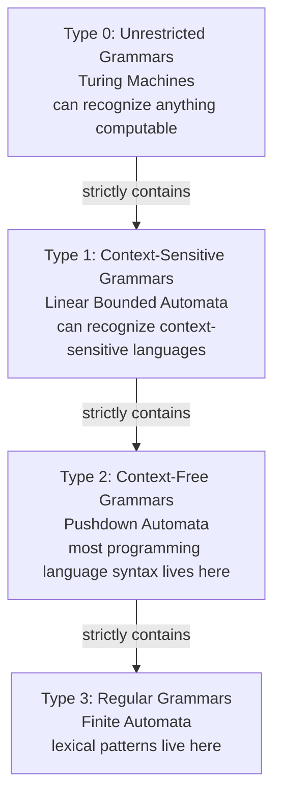

# Chapter 38: Introduction to Theory of Computation — The Mathematics Behind Compilers

> "The question 'What is computable?' is one of the most beautiful questions in all of mathematics. Turing answered it, and in doing so, invented the computer."
> — Anonymous

---

## Overview

Have you ever felt like there was a whole mathematical universe behind compilers that nobody told you about? There is. It is called **Theory of Computation** — also called **Automata Theory**, **Formal Language Theory**, or simply **Theoretical Computer Science**. This is the subject with nodes, arrows, states, and strange symbols like ε (epsilon) that you may have glimpsed in a textbook and quickly moved on from.

This chapter is your formal introduction to that universe. We are going to study it not as an abstract exercise, but as the bedrock on which every compiler — including the Astra compiler you are building — is constructed. Every lexer is an automaton. Every parser recognizes a formal language. The Chomsky hierarchy is why your lexer and parser are structured the way they are. Once you understand this material, the Astra compiler will feel inevitable — not a collection of tricks, but a mathematically grounded machine.

---

## What We're Building

By the end of this chapter, you will have formally characterized Astra as a language in the mathematical sense. You will write down Astra's alphabet, define what it means for a string to be in the Astra language, and understand exactly where Astra sits in the Chomsky hierarchy. This is the theoretical specification that all subsequent chapters build upon.

---

## Table of Contents

1. What Is Theory of Computation?
2. The Big Picture: Why Compilers Need Formal Mathematics
3. The Chomsky Hierarchy
4. Alphabets — The Building Blocks
5. Strings Over an Alphabet
6. Languages — Sets of Strings
7. The Empty String ε
8. Formal Grammars and Production Rules
9. Rewriting Systems
10. Why Regular Expressions Cannot Parse Programming Languages
11. Why Context-Free Grammars Can Parse Most Languages
12. The Connection to Astra
13. Astra Build Milestone: Defining Astra as a Formal Language
14. Exercises
15. Summary

---

## 1. What Is Theory of Computation?

Theory of Computation is the branch of mathematics and computer science that asks three fundamental questions:

1. **What can be computed?** (Computability theory — Turing machines, decidability, the Halting Problem)
2. **How efficiently can it be computed?** (Complexity theory — P vs NP, Big O in a deeper sense)
3. **What patterns can be recognized by what machines?** (Automata theory and formal languages — DFAs, NFAs, PDAs, grammars)

For compiler construction, the third question is the most immediately relevant. When you write a lexer, you are building a machine that recognizes patterns in a stream of characters. When you write a parser, you are building a machine that recognizes structure in a stream of tokens. Theory of Computation gives you the mathematical tools to understand exactly what kind of machine you need for each job — and what those machines fundamentally cannot do.

### The Three Subjects Are Really One

These three branches — computability, complexity, and automata — are deeply intertwined. The automata hierarchy (Chapter 39–42) maps precisely onto the language hierarchy (this chapter). The complexity of parsing (Chapter 44) depends on the type of automaton used. And the limits of compilation (undecidable problems) come from computability theory (Chapter 43).

### This Is the "Subject with States and Nodes"

If you have ever flipped through a textbook and seen diagrams of circles connected by arrows with letters on them — that is automata theory. The circles are **states**, the arrows are **transitions**, and the whole diagram is a **finite automaton** — a mathematical model of computation. We will build those diagrams rigorously in Chapter 39, but now you know what they are: models of the machines inside your compiler.

---

## 2. The Big Picture: Why Compilers Need Formal Mathematics

Consider what a compiler does at the highest level: it takes a string of characters (source code) and determines whether that string is a valid program, then transforms it. The key insight is this:

**A valid program is a string. The set of all valid programs is a language. The compiler is a machine that recognizes that language.**

This is not a metaphor. It is a precise mathematical statement. Once you accept it, you can use the full power of formal language theory:

- You can **prove** that lexing can be done in O(n) time with a DFA.
- You can **prove** that certain things — like detecting all possible runtime errors — are mathematically impossible.
- You can **prove** that your grammar is unambiguous (or discover that it is not).
- You can **generate** a parser automatically from a grammar specification.

Without formal mathematics, compiler construction is folklore — a collection of tricks that happen to work. With it, compiler construction is engineering — principled application of proven theory.

### A Concrete Example

Here is a question: Can you write a regular expression that matches only programs with balanced curly braces? The answer, which we will prove rigorously in Chapter 39, is **no**. No regular expression can do this. But a context-free grammar can. This is not a limitation of the regex syntax you happen to know — it is a fundamental mathematical truth about what regular expressions can express. Understanding why changes how you think about language design entirely.

---

## 3. The Chomsky Hierarchy

In 1956, the linguist Noam Chomsky (yes, the same Noam Chomsky known for linguistics and political commentary) published a classification of formal grammars that turns out to describe exactly the hierarchy of machines needed to recognize different types of languages. This is the **Chomsky hierarchy**.



Each level strictly contains the one below it. Every regular language is context-free. Every context-free language is context-sensitive. Every context-sensitive language is recognizable by a Turing machine. But the containment is strict: there are context-free languages that are not regular, context-sensitive languages that are not context-free, and so on.

### Type 3: Regular Languages

Regular languages are the simplest. They are generated by **regular grammars** and recognized by **finite automata** (DFAs and NFAs, covered in Chapter 39). They are also described by **regular expressions** (Chapter 40).

Examples of regular languages:
- All binary strings (Σ = {0,1}, language = Σ*)
- All decimal integers: one or more digits from {0,1,...,9}
- All valid C identifiers: start with letter or underscore, followed by letters/digits/underscores
- All strings containing an even number of 'a's

Examples of things that are NOT regular (and the proof technique — the pumping lemma — is in Chapter 39):
- Balanced parentheses: `()`, `(())`, `((()))`, `(()())`, ...
- Strings of the form aⁿbⁿ (n 'a's followed by n 'b's)
- All valid programs in any programming language

**Relevance to Astra**: The Astra **lexer** recognizes regular languages. Each token type (integer literal, string literal, identifier, keyword) is described by a regular expression, which is implemented as a finite automaton.

### Type 2: Context-Free Languages

Context-free languages (CFLs) are generated by **context-free grammars** (CFGs) and recognized by **pushdown automata** (PDAs — a DFA with a stack, covered in Chapter 42). Most programming language syntax is context-free.

Examples of context-free languages:
- Balanced parentheses: {εεε : ε is balanced}
- Strings of the form aⁿbⁿ
- Arithmetic expressions with proper precedence
- Most of the syntax of Astra, Python, Go, Java, C, etc.

Examples of things that are NOT context-free:
- `{aⁿbⁿcⁿ : n ≥ 0}` (three matched groups — needs a Turing machine to count two things simultaneously)
- The C preprocessor's `#ifdef` with arbitrary nesting dependencies
- Type inference in some advanced type systems

**Relevance to Astra**: The Astra **parser** recognizes a context-free language. The grammar you write for Astra is a context-free grammar, and the recursive descent parser implements a pushdown automaton.

### Type 1: Context-Sensitive Languages

Context-sensitive languages are generated by **context-sensitive grammars** where production rules can depend on the surrounding context (hence the name). They are recognized by **linear bounded automata** — Turing machines with tape bounded by the length of the input.

These languages are rarely used directly in compiler construction, but certain semantics (like name resolution in some languages) technically require context-sensitive analysis. Fortunately, we handle this with symbol tables in a separate semantic analysis phase rather than trying to encode it in the grammar.

Example: `{aⁿbⁿcⁿ : n ≥ 0}`

### Type 0: Unrestricted Grammars

Unrestricted grammars have no constraints on production rules. They generate all recursively enumerable languages — everything that a Turing machine can recognize. This is the full power of computation.

**Relevance**: The full semantics of a programming language (including type checking, memory safety, runtime behavior) is often at this level — some questions about program behavior are undecidable (Chapter 43).

---

## 4. Alphabets — The Building Blocks

Everything in formal language theory starts with an **alphabet**.

**Definition**: An alphabet Σ (sigma) is a finite, non-empty set of symbols.

The symbols can be anything — but they must be atomic (indivisible) and finite in number. Here are some common alphabets:

```
Binary alphabet:     Σ = {0, 1}
Decimal digits:      Σ = {0, 1, 2, 3, 4, 5, 6, 7, 8, 9}
Lowercase letters:   Σ = {a, b, c, ..., z}
Boolean:             Σ = {true, false}
DNA bases:           Σ = {A, T, G, C}
ASCII source code:   Σ = {all 128 ASCII characters}
Astra tokens:        Σ = {INTEGER, FLOAT, STRING, IDENT, FN, LET, IF, ..., EOF}
```

Notice the last two entries. When we talk about the Astra **lexer**, the alphabet is ASCII characters (or Unicode code points). When we talk about the Astra **parser**, the alphabet is the set of all possible **tokens** — the lexer has already converted characters into tokens, and the parser works on this higher-level alphabet.

This layering is fundamental: compilers process the same source in multiple passes, each at a different level of abstraction, each recognizing a language over a different alphabet.

### Astra's Character Alphabet

```
Σ_astra_source = {
    -- Letters --
    'a', 'b', 'c', ..., 'z',    -- 26 lowercase
    'A', 'B', 'C', ..., 'Z',    -- 26 uppercase
    
    -- Digits --
    '0', '1', '2', ..., '9',    -- 10 digits
    
    -- Operators and Punctuation --
    '+', '-', '*', '/', '%',     -- arithmetic
    '=', '!', '<', '>',          -- comparison/assignment
    '(', ')', '{', '}', '[', ']', -- brackets
    ',', ';', ':', '.', '"', '\'', -- separators
    '&', '|', '^', '~',          -- bitwise/logical
    '#', '@', '_', '\\',         -- misc
    
    -- Whitespace --
    ' ', '\t', '\n', '\r',
    
    -- Null/EOF --
    '\0'
}
```

In practice, Astra will support Unicode (UTF-8 encoded), so the full alphabet is the set of all Unicode code points. But the formal treatment uses ASCII for simplicity.

---

## 5. Strings Over an Alphabet

Given an alphabet Σ, a **string** (also called a **word**) over Σ is a finite sequence of symbols from Σ.

```
Σ = {0, 1}

Strings over Σ:
  "0"        (length 1)
  "1"        (length 1)
  "01"       (length 2)
  "101"      (length 3)
  "0000"     (length 4)
  ""         (length 0 — this is the empty string ε)
```

The length of a string w is written |w|. So |"101"| = 3 and |ε| = 0.

The **concatenation** of strings u and v is written uv (or u·v). If u = "abc" and v = "def", then uv = "abcdef".

The set of ALL strings over Σ (including the empty string) is written Σ* (sigma-star). This is an infinite set even when Σ is finite. For example:

```
{0,1}* = {ε, "0", "1", "00", "01", "10", "11", "000", "001", ...}
```

The set of all non-empty strings is Σ⁺ (sigma-plus):
```
{0,1}⁺ = {"0", "1", "00", "01", "10", "11", "000", ...}  (no ε)
```

### Strings in Astra

In the context of Astra source code, a "string" in the formal language theory sense is a source file — a sequence of characters. For example:

```
"fn main() {\n    let x = 42\n}\n"
```

This is a string over the ASCII alphabet. Whether it is in the Astra language depends on whether it follows Astra's grammar rules — i.e., whether the parser accepts it.

---

## 6. Languages — Sets of Strings

A **formal language** L over alphabet Σ is a (possibly infinite) set of strings over Σ.

```
L ⊆ Σ*
```

Languages are sets, so all set operations apply: union, intersection, complement, difference. Here are some examples:

```
Over Σ = {a, b}:

L1 = {ε, "a", "b", "aa", "ab", "ba", "bb", ...} = Σ*  (all strings)

L2 = {"ab", "aabb", "aaabbb", "aaaabbbb", ...}
   = {aⁿbⁿ : n ≥ 1}  (not regular! see Chapter 39)

L3 = {strings with equal number of 'a' and 'b'}
   = {"ab", "ba", "aabb", "abab", "abba", "baab", ...}

L4 = ∅  (the empty language — no strings at all)

L5 = {ε}  (language containing only the empty string)
```

Note: L4 (empty language) and L5 (language containing only ε) are different! L4 has no strings; L5 has exactly one string (the empty string).

### The Astra Language

Here is the key insight that makes everything click:

**The set of all valid Astra programs is a formal language.**

```
L_astra = { s ∈ Σ_ascii* : s is a syntactically valid Astra program }
```

This language contains strings like:
```
"fn main() {\n    let x = 42\n    print(x)\n}\n"
"fn add(a: int, b: int) -> int {\n    return a + b\n}\n"
"struct Point {\n    x: float\n    y: float\n}\n"
```

And it does NOT contain strings like:
```
"fn {"                         -- syntax error: missing function name
"let let let = = ="            -- syntax error
"((((("                        -- unbalanced parentheses
"fn main() { let x = ; }"     -- syntax error: missing expression
```

The compiler's job — specifically the parser's job — is to decide membership in L_astra: given a string s, is s ∈ L_astra? If yes, parse it into an AST. If no, report an error.

---

## 7. The Empty String ε (Epsilon)

The empty string ε (epsilon) is the string of length zero — the string containing no symbols. It plays a crucial role in formal language theory, similar to zero in arithmetic.

Key properties:
- **|ε| = 0** (length is zero)
- **εw = wε = w** for any string w (concatenating ε with anything gives that thing)
- **ε ∈ Σ*** (the empty string is always in Σ*)
- In some contexts, ε represents a "free" transition in an automaton — moving without consuming any input

In grammar rules, ε is used to indicate that something can be absent:

```
optional_else := 'else' block | ε
```

This rule says: an optional else clause is either the keyword 'else' followed by a block, or nothing at all (ε).

In Astra's grammar notation, we often write this as:
```ebnf
optional_else := ('else' block)?
```

The `?` is EBNF shorthand for `X | ε`.

---

## 8. Formal Grammars and Production Rules

A **formal grammar** is a system for generating a language. It consists of:

1. **Terminals** (T): The actual symbols of the language (like characters or tokens)
2. **Non-terminals** (N): Abstract symbols that represent syntactic categories (like "expression", "statement")
3. **Production rules** (P): Rules that show how to rewrite non-terminals
4. **Start symbol** (S): The non-terminal where generation begins

**Definition**: A formal grammar G = (N, T, P, S)

### A Simple Example

Let us build a grammar for the language of balanced parentheses:

```
N = {S}                    -- one non-terminal: S
T = {'(', ')'}             -- two terminals
S = S                      -- start symbol
P = {
    S → '(' S ')'          -- a balanced pair wrapping another balanced string
    S → SS                 -- two balanced strings concatenated
    S → ε                  -- or nothing at all
}
```

Using this grammar, we can derive the string "(())":
```
S
→ (S)           [using S → (S)]
→ ((S))         [using S → (S)]
→ (())          [using S → ε]
```

Or the string "()()" :
```
S
→ SS            [using S → SS]
→ ()S           [using S → ε on first S, then S → (S)]
→ ()()          [using S → ε on second S]
```

This grammar **generates** the language of all balanced parentheses strings. The grammar is the specification; the automaton is the recognizer. Both describe the same language.

### Grammar for Astra Expressions

Here is a simplified grammar for Astra arithmetic expressions:

```
N = {Expr, Term, Factor}
T = {INTEGER, '+', '-', '*', '/', '(', ')'}
S = Expr

P = {
    Expr   → Expr '+' Term     -- addition
    Expr   → Expr '-' Term     -- subtraction
    Expr   → Term              -- just a term

    Term   → Term '*' Factor   -- multiplication
    Term   → Term '/' Factor   -- division
    Term   → Factor            -- just a factor

    Factor → '(' Expr ')'     -- grouped expression
    Factor → INTEGER           -- a literal integer
}
```

This grammar enforces **operator precedence** structurally: multiplication binds tighter than addition because `Factor` is at a lower level than `Term`, which is at a lower level than `Expr`. We will study this in depth in Chapter 41.

---

## 9. Rewriting Systems

A grammar is a kind of **rewriting system** — a system that transforms strings by applying rules. The derivation process works as follows:

1. Start with the start symbol S.
2. Choose a non-terminal in the current string.
3. Replace it with the right-hand side of one of its production rules.
4. Repeat until no non-terminals remain.

The result is a string of terminals — a sentence in the language.

```
Formal definition:
Given grammar G = (N, T, P, S), we say string α directly derives string β
(written α ⇒ β) if:

    α = γ A δ     (A is a non-terminal, γ and δ are strings of terminals and non-terminals)
    A → ρ is in P
    β = γ ρ δ     (A has been replaced by ρ)
```

The **language generated by grammar G** is:

```
L(G) = { w ∈ T* : S ⇒* w }
```

Where ⇒* means "derives in zero or more steps". The language of G is all terminal strings reachable from the start symbol.

### Leftmost and Rightmost Derivations

When multiple non-terminals appear in a string, we choose which one to rewrite next. Two canonical strategies:

- **Leftmost derivation**: Always rewrite the leftmost non-terminal. Top-down parsers (like recursive descent) correspond to leftmost derivations.
- **Rightmost derivation**: Always rewrite the rightmost non-terminal. Bottom-up parsers (like LR parsers) correspond to rightmost derivations in reverse.

```
Deriving 1 + 2 * 3 with the expression grammar (leftmost):

Expr
⇒ Expr + Term              [Expr → Expr + Term, rewrite leftmost]
⇒ Term + Term              [Expr → Term]
⇒ Factor + Term            [Term → Factor]
⇒ INTEGER + Term           [Factor → INTEGER]
⇒ INTEGER + Term * Factor  [Term → Term * Factor]
⇒ INTEGER + Factor * Factor
⇒ INTEGER + INTEGER * Factor
⇒ INTEGER + INTEGER * INTEGER
```

The order of rewriting determines the parse tree structure, which determines the meaning. This is why grammar design matters so much.

---

## 10. Why Regular Expressions Cannot Parse Programming Languages

This is one of the most important theoretical results for compiler writers. Regular expressions are enormously useful — they power the Astra lexer — but they fundamentally cannot describe the syntax of a programming language. Here is why.

### The Core Limitation: No Memory

A finite automaton (which is what a regular expression compiles to) has **no memory** beyond its current state. It has a fixed, finite number of states, and it cannot count arbitrarily.

Consider the task of matching balanced curly braces in Astra:

```
{}           -- 1 level, balanced
{{}}         -- 2 levels, balanced
{{{}}}       -- 3 levels, balanced
{{{...}}}    -- n levels, balanced
```

To match balanced braces, the recognizer needs to know the current **nesting depth**, so it knows when it has seen enough `}` to close all the `{`. But nesting depth can be arbitrarily large. A finite automaton has only a fixed number of states — it cannot track arbitrarily large nesting depth. Therefore, no regular expression can match balanced braces.

### The Pumping Lemma (Informal)

The formal proof uses the **Pumping Lemma for Regular Languages** (we give the full proof in Chapter 39). Informally, it says:

> If a language is regular, then long strings in the language can be "pumped" — a middle portion can be repeated any number of times and the result is still in the language. If you can show that some language has strings that CANNOT be pumped, the language is not regular.

For balanced braces: the string `{ⁿ}ⁿ` (n open braces followed by n close braces) is in the language. The pumping lemma would require that we can repeat some middle part and stay in the language. But repeating the open braces gives us more `{` than `}`, which is no longer balanced. Contradiction — the language is not regular.

### Practical Impact on Astra

This is precisely why the Astra compiler has TWO separate recognition phases:

1. **Lexer** (regular language recognizer): Converts character stream to token stream. Each token is described by a regular expression. The lexer does NOT check that braces are balanced — it just produces `LBRACE` and `RBRACE` tokens.

2. **Parser** (context-free language recognizer): Converts token stream to AST. The parser uses a context-free grammar and a stack (via recursive calls) to track nesting depth and verify balance.

This separation is not arbitrary — it is forced by mathematics. You MUST use a context-free parser for balanced delimiters. You CANNOT use a regular expression.

---

## 11. Why Context-Free Grammars Can Parse Most Languages

Context-free grammars (CFGs) are recognized by pushdown automata — finite automata augmented with a stack. The stack provides **unbounded memory**: you can push onto it as deeply as needed, tracking arbitrary nesting depth.

The stack is what makes the difference. With a stack:
- Push a symbol when you see `{`
- Pop a symbol when you see `}`
- If the stack is empty when you see `}`, it is unmatched — error
- If the stack is not empty when you reach end-of-input, it is unclosed — error

This is exactly what the Astra parser does with its call stack (which IS the PDA stack, as Chapter 42 will show). Every recursive call to `parseBlock()` pushes a frame; returning from `parseBlock()` pops that frame.

### What CFGs Cannot Do

Even CFGs have limits. The language `{aⁿbⁿcⁿ : n ≥ 0}` is not context-free — you would need to count two separate things (the a's vs b's and the b's vs c's) simultaneously, which requires two stacks (a Turing machine). This is why semantic constraints like "you cannot reference a variable before declaring it" are not expressed in the grammar — they require a separate semantic analysis phase.

---

## 12. The Connection to Astra

Now we can draw the precise map from theory to the Astra compiler:

```
Theory                     Astra Compiler Phase
─────────────────────────────────────────────────────────────
Regular language           Lexical analysis (lexer)
Finite automaton (DFA)     Lexer state machine
Regular grammar/regex      Token pattern definitions
─────────────────────────────────────────────────────────────
Context-free language      Syntactic analysis (parser)
Pushdown automaton (PDA)   Recursive descent parser
Context-free grammar       Astra grammar specification
─────────────────────────────────────────────────────────────
Context-sensitive lang.    Semantic analysis (type checker)
Attribute grammar          Symbol table + type rules
─────────────────────────────────────────────────────────────
Recursively enumerable     Runtime behavior
Turing machine             The executing Astra program
─────────────────────────────────────────────────────────────
```

Every chapter in this volume deepens one row of this table. By the time you finish Volume 6, you will be able to look at any compiler phase and immediately identify which level of the Chomsky hierarchy it operates at — and what theoretical tools apply.

---

## 13. Astra Build Milestone: Defining Astra as a Formal Language

Let us formally characterize the Astra programming language in mathematical terms.

### Astra's Alphabet

```go
// In Go, we can represent Astra's character alphabet implicitly
// through the rune type (Unicode code point). For formal purposes:

// Σ_astra = { all Unicode scalar values }
// In practice, we restrict to the printable subset + whitespace + EOF

// The token alphabet (for the parser's perspective):
type TokenType int

const (
    // Literals
    TOKEN_INTEGER TokenType = iota  // [0-9]+
    TOKEN_FLOAT                      // [0-9]+'.'[0-9]+
    TOKEN_STRING                     // '"' ... '"'
    TOKEN_IDENT                      // [a-zA-Z_][a-zA-Z0-9_]*
    TOKEN_BOOL                       // true | false

    // Keywords (a finite set — part of the alphabet!)
    TOKEN_FN
    TOKEN_LET
    TOKEN_IF
    TOKEN_ELSE
    TOKEN_WHILE
    TOKEN_FOR
    TOKEN_IN
    TOKEN_RETURN
    TOKEN_STRUCT
    TOKEN_IMPORT
    TOKEN_TRUE
    TOKEN_FALSE

    // Operators
    TOKEN_PLUS     // +
    TOKEN_MINUS    // -
    TOKEN_STAR     // *
    TOKEN_SLASH    // /
    TOKEN_PERCENT  // %
    TOKEN_EQ       // =
    TOKEN_EQEQ     // ==
    TOKEN_NEQ      // !=
    TOKEN_LT       // <
    TOKEN_GT       // >
    TOKEN_LTE      // <=
    TOKEN_GTE      // >=
    TOKEN_AND      // &&
    TOKEN_OR       // ||
    TOKEN_BANG     // !
    TOKEN_ARROW    // ->
    TOKEN_DOT      // .
    TOKEN_DOTDOT   // ..

    // Delimiters
    TOKEN_LPAREN   // (
    TOKEN_RPAREN   // )
    TOKEN_LBRACE   // {
    TOKEN_RBRACE   // }
    TOKEN_LBRACKET // [
    TOKEN_RBRACKET // ]
    TOKEN_COMMA    // ,
    TOKEN_SEMICOLON // ;
    TOKEN_COLON    // :

    // Special
    TOKEN_EOF
    TOKEN_ILLEGAL  // unrecognized character
)

// The token alphabet Σ_token has cardinality = number of token types above
// This is a FINITE set — exactly the requirement for a formal alphabet
```

### Strings In the Astra Language vs. Strings Not In It

```astra
// ============================================================
// STRINGS THAT ARE IN L_astra (valid Astra programs):
// ============================================================

// Example 1: The simplest valid program
fn main() {
}

// Example 2: Variable declaration and arithmetic
fn main() {
    let x = 10
    let y = 20
    let z = x + y
}

// Example 3: A function with a return type
fn add(a: int, b: int) -> int {
    return a + b
}

// Example 4: Struct definition
struct Point {
    x: float
    y: float
}

// Example 5: Control flow
fn max(a: int, b: int) -> int {
    if a > b {
        return a
    } else {
        return b
    }
}

// Example 6: Loops and ranges
fn sum_to(n: int) -> int {
    let total = 0
    for i in 0..n {
        total = total + i
    }
    return total
}
```

```astra
// ============================================================
// STRINGS THAT ARE NOT IN L_astra (invalid Astra programs):
// ============================================================

// NOT in L_astra: missing function body
fn main()           // ← no block {} — syntax error

// NOT in L_astra: expression without context
42 + 17             // ← top-level expression not allowed

// NOT in L_astra: unbalanced braces
fn main() {
    let x = 1
                    // ← missing closing }

// NOT in L_astra: invalid token sequence
let = let fn {}     // ← meaningless sequence of keywords

// NOT in L_astra: invalid operator
fn main() {
    let x = 5 +* 3  // ← "+*" is not a valid operator
}

// NOT in L_astra: wrong separator
fn add(a: int; b: int) -> int {  // ← semicolon instead of comma in params
    return a + b
}

// NOT in L_astra: empty file with invalid character
@#$%               // ← illegal characters

// NOT in L_astra: keyword as identifier
fn let() {         // ← 'let' is a keyword, not a valid function name
}
```

### Formal Language Membership Check in Go

```go
// The compiler's job: decide membership in L_astra
// This is implemented as: lex → parse → return true/false (+ AST or error)

package main

import (
    "fmt"
)

// IsValidAstraProgram returns true if the input string is in L_astra
// (i.e., if it is a syntactically valid Astra program)
func IsValidAstraProgram(source string) bool {
    lexer := NewLexer(source)
    tokens := lexer.Tokenize()
    
    if lexer.HasErrors() {
        // Lexical error: source has characters not in Σ_astra
        // or token patterns don't match — string is NOT in L_astra
        return false
    }
    
    parser := NewParser(tokens)
    _, err := parser.Parse()
    
    // Parser checks context-free grammar membership
    return err == nil
}

// Demonstration:
func main() {
    examples := []struct {
        code    string
        inLang  bool
        reason  string
    }{
        {
            code:   "fn main() {\n    let x = 42\n}\n",
            inLang: true,
            reason: "complete, valid Astra program",
        },
        {
            code:   "fn main() {",
            inLang: false,
            reason: "unclosed brace — not a member of the context-free language",
        },
        {
            code:   "let x = 5",
            inLang: false,
            reason: "top-level let is not allowed by the grammar",
        },
        {
            code:   "fn add(a: int, b: int) -> int { return a + b }",
            inLang: true,
            reason: "valid function definition",
        },
        {
            code:   "@invalid@",
            inLang: false,
            reason: "@ is not in Σ_astra — lexical error",
        },
    }
    
    for _, ex := range examples {
        result := IsValidAstraProgram(ex.code)
        status := "NOT IN"
        if result {
            status = "IN"
        }
        fmt.Printf("[%s L_astra] %s\n  Reason: %s\n\n", status, ex.code[:min(30, len(ex.code))], ex.reason)
    }
}

func min(a, b int) int {
    if a < b {
        return a
    }
    return b
}
```

### The Chomsky Level of Each Astra Phase

```
Astra Lexer:
    Input alphabet:  Σ_chars = Unicode scalar values
    Output:          Token stream
    Language type:   REGULAR (Type 3)
    Recognizer:      DFA (one per token type, combined)
    Evidence:        Each token pattern is a regular expression

Astra Parser:
    Input alphabet:  Σ_tokens = set of all token types
    Output:          Abstract Syntax Tree
    Language type:   CONTEXT-FREE (Type 2)
    Recognizer:      PDA (implemented as recursive descent with call stack)
    Evidence:        Grammar has recursive rules for nesting (blocks, expressions)

Astra Type Checker:
    Input:           AST with symbol information
    Output:          Typed AST or error
    Language type:   CONTEXT-SENSITIVE (Type 1) — approximately
    Recognizer:      Attribute grammar / constraint solver
    Evidence:        Type rules depend on declaration context

Astra Runtime:
    Input:           Bytecode / machine code
    Output:          Computation result
    Language type:   RECURSIVELY ENUMERABLE (Type 0)
    Recognizer:      Turing machine (the CPU)
    Evidence:        Astra is Turing complete (Chapter 43)
```

---

## 14. Exercises

**Exercise 38.1** — Alphabet Identification
For each of the following languages, identify the most appropriate alphabet Σ:
a) The language of all valid email addresses
b) The language of all Python programs
c) The language of all valid IPv4 addresses
d) The language of all binary trees (as strings)

**Exercise 38.2** — String Membership
Given Σ = {a, b, c} and language L = {strings where every 'a' is immediately followed by 'b'}:
a) Is "ab" ∈ L?
b) Is "abc" ∈ L?
c) Is "aab" ∈ L?
d) Is "ababc" ∈ L?
e) Is ε ∈ L?
f) Describe L formally (or give a regex for it).

**Exercise 38.3** — Chomsky Classification
For each of the following, identify which level of the Chomsky hierarchy it belongs to and justify your answer:
a) All strings of digits (integers)
b) All balanced parentheses strings
c) {aⁿbⁿcⁿ : n ≥ 0}
d) All valid JSON documents
e) All programs that terminate without runtime errors
f) All programs that are equivalent to a given program P

**Exercise 38.4** — Grammar Construction
Write a formal grammar (N, T, P, S) for the language of all non-empty comma-separated lists of integers. For example: "1", "1,2", "1,2,3" are in the language. Your grammar should handle arbitrary length lists.

**Exercise 38.5** — Language Operations
Let L1 = {aⁿ : n ≥ 0} (strings of zero or more 'a's) and L2 = {bⁿ : n ≥ 0} (strings of zero or more 'b's). Describe the following:
a) L1 ∪ L2 (union)
b) L1 · L2 (concatenation)  
c) L1 ∩ L2 (intersection)
d) L1* (Kleene star of L1)

**Exercise 38.6** — Compiler Phases and Language Theory
The Astra compiler processes source code in phases. For each phase below, identify: (i) what the input "string" is, (ii) what the input "alphabet" is, and (iii) what type of language is being recognized:
a) Lexer
b) Parser
c) Type checker
d) Code generator

**Exercise 38.7** — Production Rules for Astra
Consider this Astra code snippet:
```astra
let x: int = 5 + 3 * 2
```
Write a sequence of production rule applications (a derivation) that generates this statement from the start symbol `Statement`, using the informal grammar fragment:
```
Statement   → 'let' IDENT ':' Type '=' Expression
Expression  → Expression '+' Term | Term
Term        → Term '*' Factor | Factor
Factor      → INTEGER
Type        → 'int' | 'float' | 'string' | 'bool'
```

**Exercise 38.8** — Thinking About Limits
Python allows you to write code that generates and executes other Python code at runtime (using `eval()` and `exec()`). 
a) What does this imply about the language class of "programs that behave correctly" in Python?
b) Astra does NOT have eval/exec. Does this make Astra's language class lower? Does it make Astra "less powerful"?
c) What is the tradeoff between adding meta-programming features (like eval) and being able to statically analyze programs?

---

## 15. Summary

| Concept | Definition | Astra Relevance |
|---|---|---|
| Theory of Computation | Math of what machines can compute | Foundation of all compiler theory |
| Chomsky Hierarchy | Type 0–3 classification of languages | Maps to compiler phases |
| Type 3 (Regular) | DFA/NFA/regex languages | Astra lexer |
| Type 2 (Context-Free) | CFG/PDA languages | Astra parser |
| Type 1 (Context-Sensitive) | Context-dependent rules | Type checking (approximately) |
| Type 0 (Unrestricted) | Full Turing machine power | Astra runtime behavior |
| Alphabet Σ | Finite set of symbols | Characters for lexer, tokens for parser |
| String | Finite sequence over Σ | Source file (lexer), token stream (parser) |
| Language L | Set of strings L ⊆ Σ* | Set of valid Astra programs |
| Empty string ε | String of length zero | Optional grammar elements |
| Formal grammar | (N, T, P, S) — rules for generating L | Astra grammar specification |
| Production rule | A → β — rewriting rule | How to derive sentences |
| Derivation | Sequence of rule applications | The parser's execution trace |
| Regular ≠ CF | Braces cannot be balanced by regex | Why lexer ≠ parser |

**Key insight of this chapter**: A compiler is a language recognizer. The Astra lexer recognizes a regular language; the Astra parser recognizes a context-free language. These are not arbitrary design choices — they are consequences of the mathematical properties of these language classes. You cannot check balanced braces with a regex. You can check them with a CFG. The Chomsky hierarchy tells you which tool to use for which job.

In the next chapter, we build the machines: Deterministic and Nondeterministic Finite Automata — the mathematical engines behind every lexer ever written.
