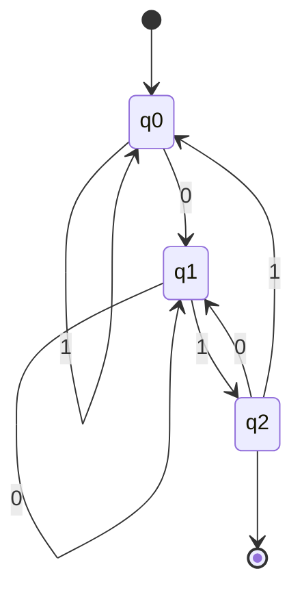
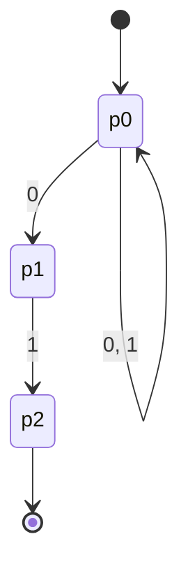
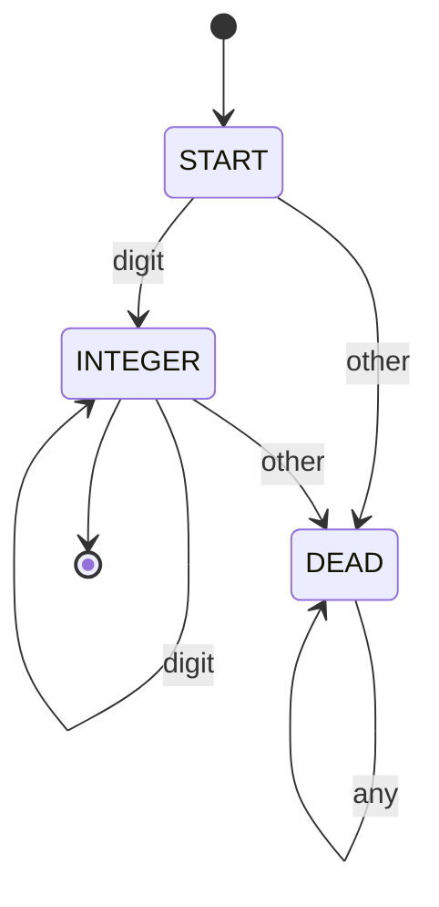
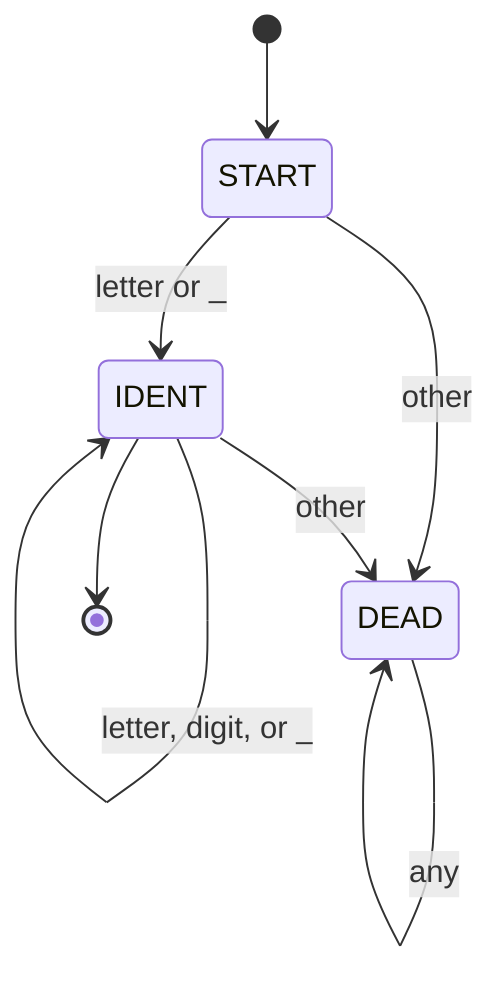
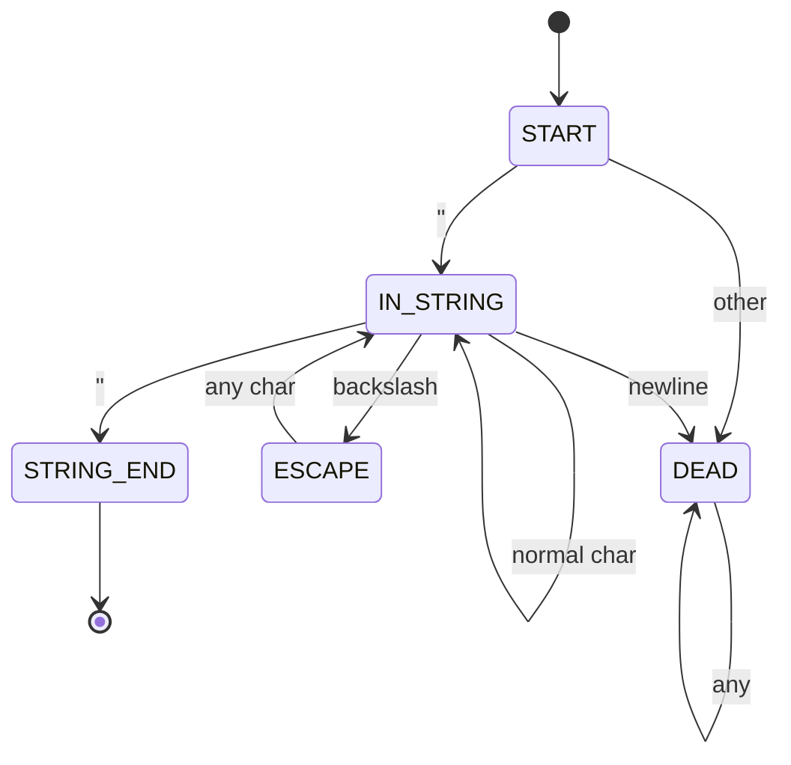
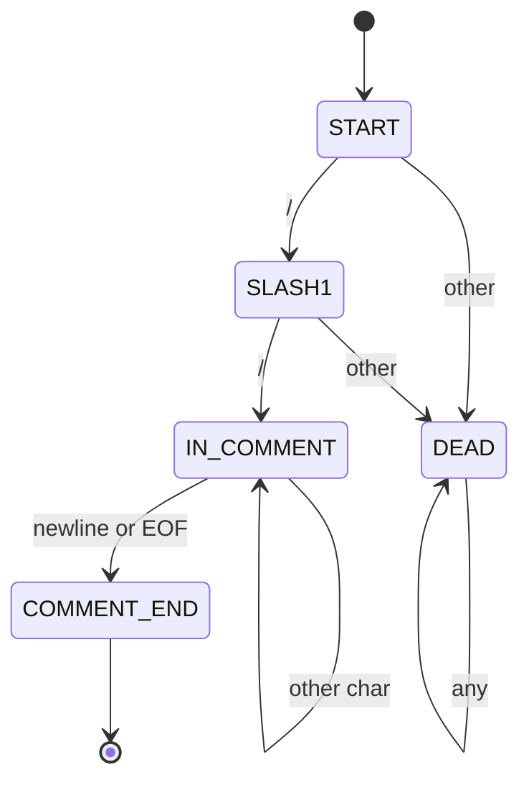

# Chapter 39: Finite Automata — DFA and NFA

> "An automaton is a model of computation so simple that it seems like a toy — until you realize that every lexer in every compiler ever written is exactly this toy."
> — Every Theory of Computation professor, ever

---

## Overview

In Chapter 38, we established that the Astra lexer recognizes a **regular language** — the set of all valid token sequences. In this chapter, we build the machines that recognize regular languages: **Finite Automata**. We study two variants — the Deterministic Finite Automaton (DFA) and the Nondeterministic Finite Automaton (NFA) — and explore the key algorithms that connect them: Thompson's construction (regex → NFA), subset construction (NFA → DFA), and Hopcroft's algorithm (DFA minimization).

By the end, you will understand exactly what the Astra lexer IS mathematically, you will have drawn DFAs for all major Astra token types, and you will have Go code that implements DFA-style lexing.

---

## What We're Building

We will formalize the Astra lexer as a collection of DFAs — one per token type — and sketch how they combine into a single, efficient character-by-character scanner. The DFAs for integer literals, identifiers, string literals, and comments will all be drawn and implemented.

---

## Table of Contents

1. What Is a Finite Automaton?
2. Deterministic Finite Automata (DFA) — Formal Definition
3. DFA Example: Recognizing Binary Strings Ending in "01"
4. DFA State Diagrams with ASCII Art
5. DFA Simulation — Stepping Through a String
6. Nondeterministic Finite Automata (NFA)
7. ε-Transitions and NFA Power
8. NFA vs DFA: Design vs Implementation
9. Thompson's Construction: Regex → NFA
10. Subset Construction: NFA → DFA
11. DFA Minimization: Hopcroft's Algorithm
12. Regular Languages and the Limits of Finite Automata
13. The Pumping Lemma — Proving Languages Are Not Regular
14. Astra Build Milestone: DFAs for Astra Token Types
15. Exercises
16. Summary

---

## 1. What Is a Finite Automaton?

Imagine a vending machine. It has a finite set of **states** — it is waiting for money, it has $0.25, it has $0.50, it has $0.75, and it has enough money to dispense. When you insert a coin, the machine **transitions** from one state to another based on the input (coin type). When you reach the "enough money" state, the machine **accepts** (dispenses your item).

This is a finite automaton. Specifically:
- **States**: A finite set of configurations the machine can be in
- **Transitions**: Rules for moving between states based on input
- **Start state**: Where the machine begins
- **Accept states**: States that mean "yes, this input is accepted"

The machine reads input one symbol at a time, left to right, moving between states according to the transition rules. After reading all input, if the machine is in an accept state, it accepts the input string. Otherwise, it rejects it.

Finite automata are the simplest model of computation that is still useful. They cannot do everything — they cannot count arbitrarily, they cannot remember what they saw at the beginning while processing the end — but within their limits they are extremely efficient: a DFA runs in exactly O(n) time where n is the input length, with no backtracking.

---

## 2. Deterministic Finite Automata (DFA) — Formal Definition

**Definition**: A DFA is a 5-tuple M = (Q, Σ, δ, q₀, F) where:

- **Q**: A finite set of **states**
- **Σ**: A finite **alphabet** (input symbols)
- **δ: Q × Σ → Q**: The **transition function** — given a state and a symbol, returns the next state
- **q₀ ∈ Q**: The **start state**
- **F ⊆ Q**: The set of **accept states** (also called final states)

The word "deterministic" means that δ is a total function — for every (state, symbol) pair, there is exactly ONE next state. No ambiguity. No choices. Given any state and any input symbol, the next state is uniquely determined.

**Extended transition function δ***: We extend δ to work on strings (not just single symbols):
```
δ*(q, ε)    = q              (reading empty string leaves state unchanged)
δ*(q, wa)   = δ(δ*(q, w), a) (read string w to reach some state, then read symbol a)
```

**Acceptance**: DFA M accepts string w if and only if δ*(q₀, w) ∈ F.
The language **recognized** (or **accepted**) by M is:
```
L(M) = { w ∈ Σ* : δ*(q₀, w) ∈ F }
```

### The "Dead State"

Sometimes δ is not defined for every (state, symbol) pair — we say the DFA has a **partial** transition function. In this case, any transition to an undefined pair leads to a **dead state** (also called a **trap state** or **sink state**) from which no accept state is reachable. All input is rejected from the dead state. We often omit dead states from diagrams for clarity.

---

## 3. DFA Example: Recognizing Binary Strings Ending in "01"

Let us build a DFA that recognizes the language L = {w ∈ {0,1}* : w ends with "01"}.

We need to track the last two characters we have seen. States:
- **q₀**: Start. No useful suffix seen yet (or last char was '1' after something else)
- **q₁**: Last character was '0'
- **q₂**: Last two characters were "01" ← ACCEPT STATE

Transition table:

```
State  | Input '0' | Input '1'
-------|-----------|----------
q₀     |    q₁    |    q₀
q₁     |    q₁    |    q₂
q₂     |    q₁    |    q₀
```

Reading this table:
- From q₀: if we see '0', go to q₁ (we have a potential start of "01"); if we see '1', stay at q₀ (useless suffix)
- From q₁: if we see '0', stay at q₁ (we replaced the old '0' with a new '0'); if we see '1', go to q₂ (we completed "01")
- From q₂: if we see '0', go to q₁ (new potential start); if we see '1', go to q₀ (suffix "11" is useless)

The formal 5-tuple: M = ({q₀, q₁, q₂}, {0,1}, δ, q₀, {q₂})

---

## 4. DFA State Diagrams with ASCII Art

The standard way to visualize a DFA is a **state diagram**: circles for states, arrows for transitions, double circles for accept states, and an unlabeled arrow pointing to the start state.

### DFA for Strings Ending in "01"



Let us use the cleaner tabular notation for the DFAs we build for Astra.

---

## 5. DFA Simulation — Stepping Through a String

Let us simulate M on input "1001":

```
Input:   1  0  0  1
State: q₀

Step 1: Read '1'. State = δ(q₀, '1') = q₀
Step 2: Read '0'. State = δ(q₀, '0') = q₁
Step 3: Read '0'. State = δ(q₁, '0') = q₁
Step 4: Read '1'. State = δ(q₁, '1') = q₂

Final state: q₂ ∈ F = {q₂} → ACCEPT ✓
"1001" ends in "01" — correct!
```

Now let us try "100":

```
Input:   1  0  0
State: q₀

Step 1: Read '1'. State = δ(q₀, '1') = q₀
Step 2: Read '0'. State = δ(q₀, '0') = q₁
Step 3: Read '0'. State = δ(q₁, '0') = q₁

Final state: q₁ ∉ F → REJECT ✗
"100" does not end in "01" — correct!
```

DFA simulation in Go:

```go
type DFA struct {
    States      []string
    Alphabet    []rune
    Transitions map[string]map[rune]string // state → symbol → nextState
    StartState  string
    AcceptStates map[string]bool
}

func (dfa *DFA) Accepts(input string) bool {
    current := dfa.StartState
    for _, ch := range input {
        transitions, ok := dfa.Transitions[current]
        if !ok {
            return false // dead state
        }
        next, ok := transitions[ch]
        if !ok {
            return false // no transition defined — dead state
        }
        current = next
    }
    return dfa.AcceptStates[current]
}

// Build the "ends in 01" DFA:
func EndsWith01DFA() *DFA {
    return &DFA{
        States:     []string{"q0", "q1", "q2"},
        Alphabet:   []rune{'0', '1'},
        StartState: "q0",
        AcceptStates: map[string]bool{"q2": true},
        Transitions: map[string]map[rune]string{
            "q0": {'0': "q1", '1': "q0"},
            "q1": {'0': "q1", '1': "q2"},
            "q2": {'0': "q1", '1': "q0"},
        },
    }
}
```

---

## 6. Nondeterministic Finite Automata (NFA)

A **Nondeterministic Finite Automaton** (NFA) relaxes the determinism requirement of a DFA. In an NFA:
- A state can have **zero, one, or multiple** transitions for the same input symbol
- A state can have **ε-transitions** — transitions that consume no input
- The NFA **accepts** if there EXISTS at least one path through the machine that leads to an accept state

**Definition**: An NFA is a 5-tuple N = (Q, Σ, δ, q₀, F) where:
- **Q, Σ, q₀, F**: Same as DFA
- **δ: Q × (Σ ∪ {ε}) → 2^Q**: Transition function now returns a **set** of states (the power set 2^Q), and accepts ε as an input

The NFA "accepts" string w if there exists ANY sequence of transitions (including ε-transitions) that leads from q₀ to some state in F after reading all of w.

### NFA for Strings Ending in "01" (Simpler Design)

```
N = ({p₀, p₁, p₂}, {0,1}, δ, p₀, {p₂})

δ(p₀, 0) = {p₀, p₁}    ← nondeterminism! stay OR start matching "01"
δ(p₀, 1) = {p₀}
δ(p₁, 0) = {}
δ(p₁, 1) = {p₂}
δ(p₂, 0) = {}
δ(p₂, 1) = {}
```



This NFA is much easier to design than the DFA — the nondeterminism handles "start matching 01 at any position" naturally. The NFA accepts "1001" because one branch of execution reaches p₂.

---

## 7. ε-Transitions and NFA Power

An **ε-transition** allows the NFA to move to another state without consuming any input. This is enormously useful for composing automata.

**ε-closure**: For a set of states S, ε-closure(S) is the set of all states reachable from any state in S via zero or more ε-transitions.

```
Example: NFA with ε-transitions

States: {q₀, q₁, q₂, q₃}

ε-transitions:
  q₀ ──ε──► q₁
  q₀ ──ε──► q₂

ε-closure({q₀}) = {q₀, q₁, q₂}  ← all states reachable via ε from q₀
```

ε-transitions are used in Thompson's construction (next section) to build NFAs for compound regular expressions by "gluing" smaller NFAs together with ε-transitions.

---

## 8. NFA vs DFA: Design vs Implementation

Key theorem: **DFAs and NFAs recognize exactly the same set of languages — the regular languages.**

This means:
- For every NFA, there exists an equivalent DFA (subset construction)
- For every DFA, there exists an equivalent NFA (trivial — a DFA IS an NFA)

But NFAs and DFAs have different practical tradeoffs:

| Property | NFA | DFA |
|---|---|---|
| **Ease of design** | Easier (nondeterminism = guessing) | Harder (must track all possibilities explicitly) |
| **Simulation** | Complex (track set of states) | Simple (track one state) |
| **Memory** | Potentially exponential states (when converted) | 2ⁿ states in worst case |
| **Speed** | O(n·|Q|) with set simulation | O(n) simple |
| **Size** | Compact | Can be exponentially larger |
| **Composability** | Easy (use ε-transitions) | Hard to compose directly |

In practice: we **design** NFAs (because they are easier to build from regex) and **execute** DFAs (because they are faster). The subset construction converts one to the other.

---

## 9. Thompson's Construction: Regex → NFA

Thompson's construction (Ken Thompson, 1968) is the fundamental algorithm for converting a regular expression to an NFA. It works inductively on the structure of the regex.

### Base Cases

```
1. Empty string ε:

   ──►(start)──ε──►((accept))


2. Single symbol a:

   ──►(start)──a──►((accept))
```

### Inductive Cases

```
3. Concatenation: r₁r₂
   (NFA for r₁ followed by NFA for r₂, connected by ε)

   ──►[NFA₁]──ε──►[NFA₂]──►((accept))


4. Union (alternation): r₁ | r₂
   (new start state with ε to both, both accept to new accept state)

            ε    ┌──►[NFA₁]──►┐ ε
   ──►(start)──┤              ├──►((accept))
            ε    └──►[NFA₂]──►┘


5. Kleene star: r*
   (loop back with ε, also skip entirely with ε)

                  ε (loop back)
            ┌──────────────────┐
            │                  │
   ──►(start)──ε──►[NFA_r]──ε──►((accept))
            │                           ▲
            └───────────────────────────┘
                    ε (zero times)
```

### Thompson's Construction Example: Regex `(a|b)*c`

This regex matches any string of a's and b's followed by a 'c'.

```
Step 1: Build NFA for 'a':
  (s₁) ──a──► ((s₂))

Step 2: Build NFA for 'b':
  (s₃) ──b──► ((s₄))

Step 3: Union of 'a' and 'b': (a|b)
  
       ε──►(s₁)──a──►(s₂)──ε
(s₅)──┤                       ├──►((s₆))
       ε──►(s₃)──b──►(s₄)──ε

Step 4: Kleene star: (a|b)*

                ε (loop)
        ┌──────────────────────────┐
        │                          │
(s₇)──ε──►(s₅)──[union above]──►(s₆)──ε──►((s₈))
   │                                                ▲
   └────────────────────────────────────────────────┘
                        ε (zero times)

Step 5: Concatenate with 'c':
  (s₉) ──c──► ((s₁₀))

Step 6: Concatenate (a|b)* with 'c':
  [star NFA above] ──ε──► (s₉) ──c──► ((s₁₀))
```

The final NFA accepts exactly `(a|b)*c`. This mechanical construction is the basis of every regex engine.

---

## 10. Subset Construction: NFA → DFA

The **subset construction** (also called **powerset construction**) converts an NFA N to an equivalent DFA D. The key idea: each state in D represents a **set of NFA states** — all the states the NFA could currently be in.

**Algorithm**:
1. Start with ε-closure({q₀}) as the DFA start state
2. For each DFA state S (set of NFA states) and each input symbol a:
   - Compute T = ∪{δ_NFA(q, a) : q ∈ S} (all NFA states reachable on a from any state in S)
   - Compute T' = ε-closure(T) (close under ε-transitions)
   - T' is the new DFA state; add edge S ──a──► T'
3. A DFA state S is accepting if S ∩ F_NFA ≠ ∅

### Example: NFA to DFA for Strings Ending in "01"

Recall the NFA:
```
δ(p₀, 0) = {p₀, p₁}
δ(p₀, 1) = {p₀}
δ(p₁, 1) = {p₂}
```

Subset construction:

```
DFA start state: {p₀}   (ε-closure of {p₀} = {p₀}, no ε-transitions)

From {p₀}:
  On '0': ∪ δ(p₀, 0) = {p₀, p₁} → DFA state A = {p₀, p₁}
  On '1': ∪ δ(p₀, 1) = {p₀}     → DFA state B = {p₀}

From A = {p₀, p₁}:
  On '0': δ(p₀, 0) ∪ δ(p₁, 0) = {p₀, p₁} ∪ {} = {p₀, p₁} = A
  On '1': δ(p₀, 1) ∪ δ(p₁, 1) = {p₀} ∪ {p₂} = {p₀, p₂} → DFA state C = {p₀, p₂}

From B = {p₀}:
  Same as start. On '0': A. On '1': B.

From C = {p₀, p₂}:
  On '0': δ(p₀, 0) ∪ δ(p₂, 0) = {p₀, p₁} ∪ {} = A
  On '1': δ(p₀, 1) ∪ δ(p₂, 1) = {p₀} ∪ {} = B
```

DFA result:
```
States:  {p₀} (start), A={p₀,p₁}, B={p₀} (same as start!), C={p₀,p₂}
Accept:  C (because p₂ ∈ C, and p₂ is NFA accept state)

This matches our earlier hand-built DFA — q₀={p₀}, q₁={p₀,p₁}, q₂={p₀,p₂}
```

---

## 11. DFA Minimization: Hopcroft's Algorithm

Subset construction can produce DFAs with exponentially many states. DFA minimization reduces to the **minimum equivalent DFA** — the smallest DFA recognizing the same language.

**Hopcroft's Algorithm** (1971) works by:
1. Partitioning states into two groups: accept states F and non-accept states Q\F
2. Iteratively splitting groups: if two states in the same group differ in their transitions (one goes to a different partition than the other on some symbol), split them
3. Repeat until stable

**Equivalence relation**: Two states p and q are **equivalent** (written p ≡ q) if for every string w, δ*(p, w) ∈ F ↔ δ*(q, w) ∈ F. That is, p and q accept exactly the same future inputs. Equivalent states can be merged.

The minimum DFA is unique (up to renaming of states) for any regular language. This gives us a canonical form.

```go
// DFA minimization via Hopcroft's algorithm (simplified)
func MinimizeDFA(dfa *DFA) *DFA {
    // Step 1: Initial partition
    partitions := []map[string]bool{
        dfa.AcceptStates,
        complement(dfa.States, dfa.AcceptStates),
    }
    
    // Step 2: Refine partitions
    changed := true
    for changed {
        changed = false
        newPartitions := []map[string]bool{}
        
        for _, group := range partitions {
            splits := splitGroup(group, partitions, dfa)
            if len(splits) > 1 {
                changed = true
            }
            newPartitions = append(newPartitions, splits...)
        }
        partitions = newPartitions
    }
    
    // Step 3: Build minimized DFA from partitions
    return buildFromPartitions(partitions, dfa)
}
```

---

## 12. Regular Languages and the Limits of Finite Automata

**Theorem (Kleene, 1956)**: The following three descriptions define exactly the same class of languages (regular languages):
1. Languages recognized by DFAs
2. Languages recognized by NFAs
3. Languages described by regular expressions

This equivalence is beautiful: three completely different formalisms — state machines, nondeterministic machines, and algebraic expressions — all capture exactly the same set of languages.

**Properties of regular languages** (closure properties):
- Union: If L₁ and L₂ are regular, so is L₁ ∪ L₂
- Concatenation: If L₁ and L₂ are regular, so is L₁L₂
- Kleene star: If L is regular, so is L*
- Complement: If L is regular, so is Σ* \ L (complement)
- Intersection: If L₁ and L₂ are regular, so is L₁ ∩ L₂
- Difference: If L₁ and L₂ are regular, so is L₁ \ L₂
- Reversal: If L is regular, so is L^R = {w^R : w ∈ L}

---

## 13. The Pumping Lemma — Proving Languages Are Not Regular

The **Pumping Lemma** is the standard technique for proving that a language is NOT regular. It works by contradiction.

**Theorem (Pumping Lemma)**: If L is a regular language, then there exists a pumping length p ≥ 1 such that every string w ∈ L with |w| ≥ p can be written as w = xyz where:
1. |xy| ≤ p
2. |y| ≥ 1 (y is non-empty)
3. For all k ≥ 0, xyᵏz ∈ L (we can "pump" y any number of times)

**Why it works**: If L is regular, it has some DFA with p states. Any string longer than p must cause a state to repeat (by the pigeonhole principle). The repeated portion corresponds to a loop in the DFA — and we can traverse that loop any number of times (pump y) and stay accepted.

### Proof that {aⁿbⁿ : n ≥ 0} Is Not Regular

Assume for contradiction that L = {aⁿbⁿ} is regular, with pumping length p.

Consider the string w = aᵖbᵖ. Clearly |w| = 2p ≥ p, and w ∈ L.

By the pumping lemma, w = xyz where |xy| ≤ p and |y| ≥ 1.

Since |xy| ≤ p and the first p characters of w are all 'a', the string y consists entirely of 'a's. Say |y| = m ≥ 1.

Pumping: xy²z = aᵖ⁺ᵐbᵖ.

But aᵖ⁺ᵐbᵖ has more 'a's than 'b's (since m ≥ 1), so aᵖ⁺ᵐbᵖ ∉ L. This contradicts the pumping lemma.

Therefore L is not regular. QED.

**Consequence for Astra**: The language of balanced braces is equivalent in difficulty to {aⁿbⁿ}. The lexer CANNOT check for balanced braces — only the parser can.

---

## 14. Astra Build Milestone: DFAs for Astra Token Types

Every token in Astra corresponds to a regular language, recognized by a DFA. Let us draw and implement each.

### DFA 1: Integer Literals [0-9]+

Language: One or more decimal digits.

```
States: {DEAD, START, INTEGER}
Σ: all ASCII characters
Start: START
Accept: {INTEGER}

Transitions:
  START   + digit  → INTEGER
  START   + other  → DEAD
  INTEGER + digit  → INTEGER   (self-loop!)
  INTEGER + other  → DEAD
  DEAD    + any    → DEAD
```



### DFA 2: Identifiers [a-zA-Z_][a-zA-Z0-9_]*

Language: Start with letter or underscore, followed by any mix of letters, digits, underscores.

```
States: {DEAD, START, IDENT}
Accept: {IDENT}

Transitions:
  START + letter/underscore → IDENT
  START + other             → DEAD
  IDENT + letter/digit/underscore → IDENT   (self-loop)
  IDENT + other             → DEAD
```



**Note on keywords**: The keyword `fn`, `let`, `if`, etc. are identifiers that happen to match reserved strings. The DFA for IDENT recognizes them all; the lexer then checks if the matched identifier is a keyword.

### DFA 3: String Literals "..." with Escape Sequences

Language: Opening `"`, followed by any sequence of non-quote, non-backslash characters OR backslash-escaped characters, followed by closing `"`.

```
States: {DEAD, START, IN_STRING, ESCAPE, STRING_END}
Accept: {STRING_END}

Transitions:
  START      + '"'   → IN_STRING
  START      + other → DEAD
  IN_STRING  + '\\'  → ESCAPE       (start of escape sequence)
  IN_STRING  + '"'   → STRING_END   (closing quote)
  IN_STRING  + '\n'  → DEAD         (unescaped newline — illegal)
  IN_STRING  + other → IN_STRING    (normal char, self-loop)
  ESCAPE     + any   → IN_STRING    (any char after \ is valid escape start)
  STRING_END + any   → (emit token, don't consume)
```



### DFA 4: Line Comment // ... \n

Language: `//` followed by any characters until (but not including) newline.

```
States: {DEAD, START, SLASH1, IN_COMMENT, COMMENT_END}
Accept: {COMMENT_END}

Transitions:
  START      + '/'   → SLASH1
  START      + other → DEAD
  SLASH1     + '/'   → IN_COMMENT
  SLASH1     + other → DEAD        (could be division operator — different token)
  IN_COMMENT + '\n'  → COMMENT_END
  IN_COMMENT + EOF   → COMMENT_END (also end of comment)
  IN_COMMENT + other → IN_COMMENT  (self-loop)
```



### Go Implementation: DFA-Style Lexing

```go
package lexer

import (
    "fmt"
    "strings"
    "unicode"
)

// Token represents a lexed token
type Token struct {
    Type    TokenType
    Lexeme  string
    Line    int
    Column  int
}

// Lexer implements DFA-based tokenization for Astra
type Lexer struct {
    source  string
    runes   []rune
    start   int    // start of current token
    current int    // current position
    line    int
    column  int
    tokens  []Token
    errors  []string
}

func NewLexer(source string) *Lexer {
    return &Lexer{
        source: source,
        runes:  []rune(source),
        line:   1,
        column: 1,
    }
}

// isDigit: transition condition for the INTEGER DFA
func isDigit(r rune) bool {
    return r >= '0' && r <= '9'
}

// isAlpha: first character of IDENT DFA
func isAlpha(r rune) bool {
    return unicode.IsLetter(r) || r == '_'
}

// isAlphaNumeric: subsequent characters of IDENT DFA
func isAlphaNumeric(r rune) bool {
    return isAlpha(r) || isDigit(r)
}

// peek: look at current character without consuming
func (l *Lexer) peek() rune {
    if l.current >= len(l.runes) {
        return 0 // EOF
    }
    return l.runes[l.current]
}

// peekNext: look one character ahead
func (l *Lexer) peekNext() rune {
    if l.current+1 >= len(l.runes) {
        return 0
    }
    return l.runes[l.current+1]
}

// advance: consume current character and advance
func (l *Lexer) advance() rune {
    r := l.runes[l.current]
    l.current++
    if r == '\n' {
        l.line++
        l.column = 1
    } else {
        l.column++
    }
    return r
}

// lexIntegerOrFloat: implements DFA for [0-9]+ ('.' [0-9]+)?
// This is a combined DFA for INTEGER and FLOAT tokens.
//
// DFA states (implicit in the code structure):
//   State 0 (START):     reading first digit
//   State 1 (DIGITS):    reading subsequent digits
//   State 2 (DOT):       saw '.' after digits — could be float
//   State 3 (FRAC):      reading digits after '.'
func (l *Lexer) lexIntegerOrFloat() Token {
    // State 1: DIGITS (we already consumed the first digit before calling this)
    for isDigit(l.peek()) {
        l.advance() // self-loop in INTEGER DFA
    }

    // Transition to FLOAT: check for '.' followed by digit
    if l.peek() == '.' && isDigit(l.peekNext()) {
        l.advance() // consume '.'
        // State 3: FRAC
        for isDigit(l.peek()) {
            l.advance()
        }
        return l.makeToken(TOKEN_FLOAT)
    }

    return l.makeToken(TOKEN_INTEGER)
}

// lexIdentifierOrKeyword: implements DFA for [a-zA-Z_][a-zA-Z0-9_]*
//
// DFA states:
//   State 0 (START): already consumed first char (letter/_)
//   State 1 (IDENT): consuming subsequent chars
func (l *Lexer) lexIdentifierOrKeyword() Token {
    // State 1: self-loop on alphanumeric/underscore
    for isAlphaNumeric(l.peek()) {
        l.advance()
    }

    // Extract lexeme and check if it is a keyword
    lexeme := string(l.runes[l.start:l.current])
    tokType, isKeyword := keywords[lexeme]
    if !isKeyword {
        tokType = TOKEN_IDENT
    }
    return l.makeToken(tokType)
}

// keywords maps reserved words to their token types
var keywords = map[string]TokenType{
    "fn":     TOKEN_FN,
    "let":    TOKEN_LET,
    "if":     TOKEN_IF,
    "else":   TOKEN_ELSE,
    "while":  TOKEN_WHILE,
    "for":    TOKEN_FOR,
    "in":     TOKEN_IN,
    "return": TOKEN_RETURN,
    "struct": TOKEN_STRUCT,
    "true":   TOKEN_TRUE,
    "false":  TOKEN_FALSE,
    "import": TOKEN_IMPORT,
}

// lexString: implements DFA for '"' ([^"\\] | '\\' .)* '"'
//
// DFA states:
//   OPEN:      consumed opening '"'
//   IN_STRING: inside the string body
//   ESCAPE:    saw '\', expecting any char
//   CLOSED:    consumed closing '"' — ACCEPT
func (l *Lexer) lexString() Token {
    // We are in state IN_STRING (already consumed opening '"')
    for {
        ch := l.peek()
        switch ch {
        case '"':
            l.advance() // consume closing '"' — transition to CLOSED
            return l.makeToken(TOKEN_STRING)
        case '\\':
            l.advance() // consume '\' — transition to ESCAPE
            if l.current < len(l.runes) {
                l.advance() // consume escaped char — back to IN_STRING
            }
        case '\n', 0:
            l.error("unterminated string literal")
            return l.makeToken(TOKEN_ILLEGAL)
        default:
            l.advance() // normal char — self-loop in IN_STRING
        }
    }
}

// lexComment: implements DFA for '//' [^\n]* '\n'
//
// DFA states:
//   We enter after consuming '//' (detected by caller)
//   IN_COMMENT: reading comment body
//   DONE:       saw '\n' — ACCEPT
func (l *Lexer) lexComment() {
    // Self-loop in IN_COMMENT until newline or EOF
    for l.peek() != '\n' && l.peek() != 0 {
        l.advance()
    }
    // Do not emit a token for comments (they are whitespace in Astra)
}

func (l *Lexer) makeToken(t TokenType) Token {
    return Token{
        Type:   t,
        Lexeme: string(l.runes[l.start:l.current]),
        Line:   l.line,
        Column: l.column,
    }
}

func (l *Lexer) error(msg string) {
    l.errors = append(l.errors, fmt.Sprintf("[line %d, col %d] %s", l.line, l.column, msg))
}

func (l *Lexer) HasErrors() bool {
    return len(l.errors) > 0
}

// Tokenize: the main lexer loop — dispatches to individual DFAs
func (l *Lexer) Tokenize() []Token {
    for l.current < len(l.runes) {
        l.start = l.current
        ch := l.advance()

        switch {
        case ch == ' ' || ch == '\t' || ch == '\r' || ch == '\n':
            // Whitespace — skip (whitespace DFA trivially accepts and discards)
            continue

        case isDigit(ch):
            // Start of INTEGER or FLOAT DFA
            l.tokens = append(l.tokens, l.lexIntegerOrFloat())

        case isAlpha(ch):
            // Start of IDENTIFIER DFA
            l.tokens = append(l.tokens, l.lexIdentifierOrKeyword())

        case ch == '"':
            // Start of STRING DFA
            l.tokens = append(l.tokens, l.lexString())

        case ch == '/':
            if l.peek() == '/' {
                l.advance() // consume second '/'
                l.lexComment() // comment DFA
            } else {
                l.tokens = append(l.tokens, l.makeToken(TOKEN_SLASH))
            }

        // Single-character tokens (trivial 2-state DFAs: START → ACCEPT)
        case ch == '+': l.tokens = append(l.tokens, l.makeToken(TOKEN_PLUS))
        case ch == '-':
            if l.peek() == '>' {
                l.advance()
                l.tokens = append(l.tokens, l.makeToken(TOKEN_ARROW))
            } else {
                l.tokens = append(l.tokens, l.makeToken(TOKEN_MINUS))
            }
        case ch == '*': l.tokens = append(l.tokens, l.makeToken(TOKEN_STAR))
        case ch == '%': l.tokens = append(l.tokens, l.makeToken(TOKEN_PERCENT))
        case ch == '(': l.tokens = append(l.tokens, l.makeToken(TOKEN_LPAREN))
        case ch == ')': l.tokens = append(l.tokens, l.makeToken(TOKEN_RPAREN))
        case ch == '{': l.tokens = append(l.tokens, l.makeToken(TOKEN_LBRACE))
        case ch == '}': l.tokens = append(l.tokens, l.makeToken(TOKEN_RBRACE))
        case ch == '[': l.tokens = append(l.tokens, l.makeToken(TOKEN_LBRACKET))
        case ch == ']': l.tokens = append(l.tokens, l.makeToken(TOKEN_RBRACKET))
        case ch == ',': l.tokens = append(l.tokens, l.makeToken(TOKEN_COMMA))
        case ch == ';': l.tokens = append(l.tokens, l.makeToken(TOKEN_SEMICOLON))
        case ch == ':': l.tokens = append(l.tokens, l.makeToken(TOKEN_COLON))
        case ch == '.':
            if l.peek() == '.' {
                l.advance()
                l.tokens = append(l.tokens, l.makeToken(TOKEN_DOTDOT))
            } else {
                l.tokens = append(l.tokens, l.makeToken(TOKEN_DOT))
            }

        // Two-character tokens
        case ch == '=':
            if l.peek() == '=' {
                l.advance()
                l.tokens = append(l.tokens, l.makeToken(TOKEN_EQEQ))
            } else {
                l.tokens = append(l.tokens, l.makeToken(TOKEN_EQ))
            }
        case ch == '!':
            if l.peek() == '=' {
                l.advance()
                l.tokens = append(l.tokens, l.makeToken(TOKEN_NEQ))
            } else {
                l.tokens = append(l.tokens, l.makeToken(TOKEN_BANG))
            }
        case ch == '<':
            if l.peek() == '=' {
                l.advance()
                l.tokens = append(l.tokens, l.makeToken(TOKEN_LTE))
            } else {
                l.tokens = append(l.tokens, l.makeToken(TOKEN_LT))
            }
        case ch == '>':
            if l.peek() == '=' {
                l.advance()
                l.tokens = append(l.tokens, l.makeToken(TOKEN_GTE))
            } else {
                l.tokens = append(l.tokens, l.makeToken(TOKEN_GT))
            }
        case ch == '&' && l.peek() == '&':
            l.advance()
            l.tokens = append(l.tokens, l.makeToken(TOKEN_AND))
        case ch == '|' && l.peek() == '|':
            l.advance()
            l.tokens = append(l.tokens, l.makeToken(TOKEN_OR))

        default:
            l.error(fmt.Sprintf("unexpected character '%c'", ch))
            l.tokens = append(l.tokens, l.makeToken(TOKEN_ILLEGAL))
        }
    }

    // Append EOF token
    l.start = l.current
    l.tokens = append(l.tokens, l.makeToken(TOKEN_EOF))
    return l.tokens
}

// Demonstrate the lexer on a sample Astra program
func DemoLexer() {
    source := `fn add(a: int, b: int) -> int {
    // Add two numbers
    let result = a + b
    return result
}`

    lexer := NewLexer(source)
    tokens := lexer.Tokenize()

    fmt.Println("Tokens for Astra program:")
    fmt.Println(strings.Repeat("-", 50))
    for _, tok := range tokens {
        fmt.Printf("  %-15s '%s'\n", tokenTypeName(tok.Type), tok.Lexeme)
    }
}
```

This lexer is a direct implementation of the DFAs described above. Each `case` branch in `Tokenize()` is the start of a DFA simulation. The loops inside `lexIntegerOrFloat()`, `lexIdentifierOrKeyword()`, etc. are the DFA's self-loops (transitions back to the same state while the condition holds).

---

## 15. Exercises

**Exercise 39.1** — DFA Construction
Draw the DFA (state diagram + transition table) for each of the following languages over Σ = {a, b}:
a) Strings that start with 'a' and end with 'b'
b) Strings that contain the substring "aba"
c) Strings of even length
d) Strings with an even number of 'a's

**Exercise 39.2** — DFA Simulation
Using the "ends in 01" DFA from Section 3, trace the execution (step by step) on these inputs:
a) "01"
b) "1010"
c) "000001"
d) "10"
e) "" (empty string)

**Exercise 39.3** — NFA Design
Design an NFA (not DFA) for the language "strings over {a,b,c} where the third-to-last character is 'a'". 
a) Draw the NFA state diagram.
b) Convert it to a DFA using subset construction. How many states does the DFA have?
c) Why is the NFA more natural to design here?

**Exercise 39.4** — Thompson's Construction
Apply Thompson's construction to the regular expression `a(b|c)*d`. Show each step, drawing the NFA fragments and the final combined NFA.

**Exercise 39.5** — Pumping Lemma Application
Use the pumping lemma to prove that the following languages are NOT regular:
a) L = {ww : w ∈ {a,b}*} (strings that are their own repetition)
b) L = {aⁿ : n is a perfect square} (strings whose length is a perfect square)
c) L = {strings with more 'a's than 'b's}

**Exercise 39.6** — Astra Lexer Extension
The Astra lexer currently handles `//` line comments. Extend the lexer to handle block comments `/* ... */`. 
a) Draw the DFA for block comments.
b) What makes this DFA slightly tricky? (Hint: what happens with nested `/*`?)
c) Implement the block comment DFA in Go.

**Exercise 39.7** — Keyword DFA
Rather than using a hash table to distinguish keywords from identifiers, some lexers use a DFA that directly recognizes keywords. 
a) Draw a DFA that accepts exactly the strings {"if", "in", "int"} and rejects all others.
b) This DFA is essentially a trie. What is the advantage of the hash-table approach used in the Astra lexer? What is the advantage of the DFA approach?

**Exercise 39.8** — Minimization
The Astra float literal DFA you designed has some redundancy. Take the DFA for `[0-9]+ '.' [0-9]+` and apply Hopcroft's minimization algorithm (or trace through it manually). How many states does the minimal DFA have?

---

## 16. Summary

| Concept | Definition | Astra Relevance |
|---|---|---|
| DFA | (Q, Σ, δ, q₀, F) — deterministic state machine | Each token type is a DFA |
| NFA | Like DFA but with multiple/ε transitions | Easier to design, same power |
| Transition function δ | Q × Σ → Q (DFA) or Q × Σ∪{ε} → 2^Q (NFA) | Lexer switch/case |
| Accept state | State meaning "input accepted" | Token recognized! |
| Thompson's construction | Regex → NFA | How lexer patterns are compiled |
| Subset construction | NFA → DFA | How NFA is made executable |
| Hopcroft's algorithm | DFA → minimal DFA | Lexer optimization |
| Regular language | Language recognizable by DFA/NFA | All Astra token types |
| Pumping lemma | Proof technique for "not regular" | Why parser ≠ lexer |
| DFA simulation | O(n) time, one state at a time | Why lexing is fast |

**The key insight of this chapter**: The Astra lexer IS a collection of DFAs. Each DFA recognizes one token type. The lexer runs them all simultaneously (or in a combined DFA) and always takes the longest match. This is the formal mathematical content of the `Tokenize()` function you implemented. Every state in the lexer code corresponds to a state in a DFA; every loop corresponds to a self-loop transition; every `return` corresponds to reaching an accept state.

In Chapter 40, we study regular expressions formally — the algebra that generates the languages our DFAs recognize.
