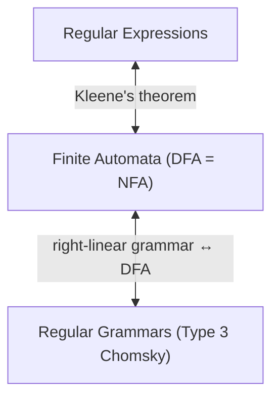

# Chapter 40: Regular Expressions — The Mathematics Behind Pattern Matching

> "Regular expressions are a notation that allows you to describe patterns in text with shocking precision. Kleene invented them to describe nerve activity. We use them to find email addresses. Both applications work for the same mathematical reason."
> — Adapted from various computer science textbooks

---

## Overview

Most programmers have used regular expressions — those cryptic strings of dots, stars, and brackets in grep, Python, and JavaScript. But the regex you know from daily use is not the formal mathematical object called a "regular expression." The formal version is simpler, more beautiful, and more powerful in the sense that it is provably equivalent to finite automata and regular grammars.

This chapter covers both. We start with the mathematical definition of regular expressions — three operations that generate all regular languages — and then connect this to Kleene's theorem, the profound result that says regexes, DFAs, and NFAs are all exactly equivalent. Then we build a simple regex engine from scratch in Go, implement the Astra token patterns as formal regular expressions, and convert them to the actual lexer code you use in the compiler.

---

## What We're Building

The Astra Build Milestone in this chapter is the complete formal specification of all Astra token patterns as mathematical regular expressions, and the implementation of those patterns in Go. You will see exactly how the abstract math maps to concrete lexer code.

---

## Table of Contents

1. Regular Expressions: The Formal Definition
2. The Three Fundamental Operations
3. Extended Operators: Plus, Optional, Character Classes
4. Building Languages from Regex
5. Kleene's Theorem: The Great Equivalence
6. Thompson's Construction — The Formal Bridge
7. Regex in Practice: Programming vs Mathematics
8. POSIX Regex vs PCRE
9. Go's regexp Package
10. Building a Tiny Regex Engine from Scratch
11. Regular Language Closure Properties
12. Why Back-References Break Regular Languages
13. Applications: Lexical Analysis, Search, Validation
14. Astra Build Milestone: Formal Token Patterns
15. Exercises
16. Summary

---

## 1. Regular Expressions: The Formal Definition

The **formal definition** of regular expressions is elegantly simple — far simpler than the regex syntax you know from grep. Formal regular expressions are defined inductively over an alphabet Σ.

**Base cases** — these are regular expressions:
- **∅**: The empty set (matches nothing, generates the empty language ∅)
- **ε**: The empty string (matches the empty string, generates the language {ε})
- **a**: For any symbol a ∈ Σ, the symbol itself (matches exactly 'a', generates {a})

**Inductive cases** — if r and s are regular expressions, then so are:
- **r·s** (concatenation): Match r followed by s. Generates L(r)·L(s) = {uv : u ∈ L(r), v ∈ L(s)}
- **r|s** (union/alternation): Match r or s. Generates L(r) ∪ L(s)
- **r*** (Kleene star): Match r zero or more times. Generates L(r)* = {ε} ∪ L(r) ∪ L(r)² ∪ ...

**That is the entire definition.** Three operations. Everything else — `+`, `?`, `[a-z]`, `\d`, lookahead, etc. — is shorthand built on top of these three.

### The Language of a Regular Expression

Every regular expression r generates (describes) a language L(r):

```
L(∅)   = ∅                      (empty language)
L(ε)   = {ε}                    (language containing only empty string)
L(a)   = {a}                    (language containing only the string "a")
L(r·s) = L(r)·L(s)              (concatenation of languages)
L(r|s) = L(r) ∪ L(s)           (union of languages)
L(r*)  = ∪{n≥0} L(r)ⁿ          (Kleene closure)
```

### Examples

```
Regex: a|b
L(a|b) = {a} ∪ {b} = {a, b}
Matches: "a" or "b" (not "ab")

Regex: (a|b)*
L((a|b)*) = {ε, a, b, aa, ab, ba, bb, aaa, ...} = {a,b}*
Matches: any string over {a,b}

Regex: a(b|c)*d
L = {ad, abd, acd, abbd, abcd, acbd, accd, abbbd, ...}
Matches: 'a' followed by any b's and c's, followed by 'd'

Regex: 0(0|1)*1
L = {01, 001, 011, 0001, 0011, 0101, 0111, ...}
Matches: binary strings starting with 0 and ending with 1
```

---

## 2. The Three Fundamental Operations

### Concatenation (·)

Concatenation takes two languages and combines them by appending every string from the second language to every string from the first.

```
L₁ = {a, ab}
L₂ = {c, cd}
L₁·L₂ = {ac, acd, abc, abcd}
```

In regex notation, concatenation is usually implicit: `ab` means 'a' followed by 'b'. We write `r·s` explicitly in formal treatment.

Concatenation is associative: (r·s)·t = r·(s·t). It distributes over union: r·(s|t) = (r·s)|(r·t).

### Union (|)

Union takes two languages and includes all strings from both.

```
L₁ = {cat, dog}
L₂ = {fish, dog}
L₁ | L₂ = {cat, dog, fish}    (sets — no duplicates)
```

Union is commutative (r|s = s|r), associative ((r|s)|t = r|(s|t)), and has ∅ as identity (r|∅ = r).

### Kleene Star (*)

The Kleene star is the most powerful operation. It generates all possible concatenations of a language with itself, zero or more times.

```
L = {ab}
L* = {ε, ab, abab, ababab, abababab, ...}

L = {a, b}
L* = {ε, a, b, aa, ab, ba, bb, aaa, ...} = {a,b}*
```

Key identities:
- ε* = ε (zero or more empty strings is still just ε)
- ∅* = {ε} (zero or more items from empty language gives empty string)
- (r*)* = r* (idempotent)
- (r|ε)* = r* (adding ε to the base doesn't change star)
- r* = ε|r·r* (recursive definition: empty, or one r followed by r*)

---

## 3. Extended Operators: Plus, Optional, Character Classes

Formal regular expressions have only three operations. But writing even simple patterns with just those is verbose. So we define shorthand:

```
r⁺  = r·r*          (one or more: same as r* but at least one)
r?  = r|ε            (zero or one: optional)
rⁿ  = r·r·...·r     (exactly n times — n concatenations)
        (n times)

[abc]     = a|b|c                    (character class)
[a-z]     = a|b|c|...|z             (range)
[^abc]    = any character except a, b, c   (negated class)
.         = any character except newline
\d        = [0-9]
\w        = [a-zA-Z0-9_]
\s        = [ \t\n\r]
```

These are all definable in terms of the three fundamental operations — they are shorthand, not new power.

```
Formal derivation of [0-9]+:
  [0-9]  = 0|1|2|3|4|5|6|7|8|9
  [0-9]+ = [0-9] · [0-9]*
         = (0|1|2|3|4|5|6|7|8|9) · (0|1|2|3|4|5|6|7|8|9)*
```

This is exactly the formal regex for Astra integer literals.

---

## 4. Building Languages from Regex

Let us build the language of all valid Astra identifiers step by step using formal regex:

```
Step 1: Letter characters
  letter = a|b|c|...|z|A|B|C|...|Z    (52 alternatives)

Step 2: Digit characters
  digit = 0|1|2|3|4|5|6|7|8|9          (10 alternatives)

Step 3: Underscore
  underscore = _

Step 4: First character of identifier (must be letter or underscore)
  id_start = letter | underscore

Step 5: Subsequent characters (letter, digit, or underscore)
  id_cont = letter | digit | underscore

Step 6: Full identifier
  identifier = id_start · id_cont*

Expanding: identifier = (a|b|...|z|A|...|Z|_) · (a|b|...|z|A|...|Z|0|...|9|_)*
```

This is the formal mathematical definition of what an Astra identifier is. The lexer's `lexIdentifierOrKeyword()` function implements the DFA for exactly this regular expression.

---

## 5. Kleene's Theorem: The Great Equivalence

**Kleene's Theorem** (Stephen Kleene, 1956): The following three are equivalent — they describe exactly the same class of languages (the regular languages):

1. **Regular expressions**: Expressions built from Σ, ∅, ε using concatenation, union, and Kleene star
2. **Deterministic Finite Automata (DFAs)**: State machines with deterministic transitions
3. **Nondeterministic Finite Automata (NFAs)**: State machines with multiple/ε transitions



**Proof sketch**:
- **Regex → NFA**: Thompson's construction (Chapter 39, and expanded in Section 6 below)
- **NFA → DFA**: Subset construction (Chapter 39)
- **DFA → Regex**: State elimination method (replace states with regex until only start and accept remain)
- **Regular grammar → NFA**: Each grammar rule A → aB becomes a transition; A → a becomes a transition to accept
- **NFA → Regular grammar**: Each transition becomes a grammar rule

This theorem is why all three formalisms appear in compiler textbooks — they are three faces of the same mathematical object. You can work in whichever is most convenient for a given task.

---

## 6. Thompson's Construction — The Formal Bridge

Thompson's construction is the formal algorithm that proves "regex → NFA". Let us trace it through the complete example of building an NFA for the Astra float literal pattern:

```
Pattern: [0-9]+ '.' [0-9]+
Formal regex: digit · digit* · '.' · digit · digit*
  where digit = 0|1|2|3|4|5|6|7|8|9
```

**Step 1**: Build NFA for a single digit `d` (where d = 0|1|2|...|9):

```
For '0': (s₁) ──0──► (s₂)
For '1': (s₃) ──1──► (s₄)
... and so on for each digit ...
For '9': (s₁₉) ──9──► (s₂₀)

Union all: 
        ε──►(s₁)──0──►(s₂)──ε
        ε──►(s₃)──1──►(s₄)──ε
(start)─┤   ...              ├──►(accept_digit)
        ε──►(s₁₉)──9──►(s₂₀)─ε
```

**Step 2**: Build NFA for `digit*` (Kleene star):

```
                        ε (loop back)
                 ┌──────────────────────────┐
                 │                          │
(start_star)──ε──►(start_digit)──[...]──►(accept_digit)──ε──►(accept_star)
     │                                                              ▲
     └──────────────────────────────────────────────────────────────┘
                              ε (zero times)
```

**Step 3**: Concatenate `digit · digit*` to get `digit+`:

```
[digit NFA] ──ε──► [digit* NFA]
```

**Step 4**: Single character '.' NFA:

```
(s_dot_start) ──'.'──► (s_dot_accept)
```

**Step 5**: Concatenate everything: `digit+ · '.' · digit+`:

```
[digit+ NFA] ──ε──► ['.' NFA] ──ε──► [digit+ NFA]
```

The final NFA accepts exactly the strings matched by `[0-9]+'.'[0-9]+`. Apply subset construction → DFA. This is what a real lexer generator (like flex/lex) does automatically.

---

## 7. Regex in Practice: Programming vs Mathematics

The "regular expressions" in programming languages like Python, JavaScript, Go, and Perl are NOT the same as formal regular expressions. They are significantly more powerful — and some features break the "regular" property entirely.

### Standard Extensions (Still Regular)

These features can be expressed in formal regex (they are shorthand):
```
+          r+ = rr*         (one or more)
?          r? = r|ε         (optional)
{n}        rⁿ               (exactly n)
{n,m}      rⁿ|rⁿ⁺¹|...|rᵐ  (between n and m)
[a-z]      a|b|c|...|z      (character range)
\d         [0-9]            (digit shorthand)
\w         [a-zA-Z0-9_]     (word character)
(r)        r                (grouping)
```

### Extensions That Break Regularity

These features make practical regex MORE than regular:

```
Backreferences: (a+)\1
  Matches: "aa", "aaaa", "aaaaaa" — the same string repeated twice.
  This is equivalent to {ww : w ∈ a+} which is NOT a regular language
  (proven by the pumping lemma in Chapter 39).
  Consequence: regex engines with backreferences are NOT finite automata!
  They require a more powerful engine (essentially a pushdown automaton or more).

Lookahead: r(?=s)
  Matches r only if followed by s, without consuming s.
  Can be simulated by DFAs in some cases but not all.

Lookbehind: r(?<=s)
  Similar, but looks behind the current position.
```

### The Practical Consequence

Python's `re` module, JavaScript's `RegExp`, and Perl's regex engine are all **backtracking NFA simulators**. They support backreferences and lookahead, which means they are handling languages beyond regular. The cost: worst-case exponential time! A carefully crafted input can cause **ReDoS (Regular Expression Denial of Service)** — a security vulnerability where a regex takes exponentially long on adversarial input.

Go's `regexp` package, by contrast, implements **true finite automaton matching** (using Russ Cox's RE2 algorithm). It guarantees O(n) matching time, but does not support backreferences. This is the mathematically correct implementation.

---

## 8. POSIX Regex vs PCRE

Two major dialects of practical regex:

**POSIX Regex**:
- Defined by the IEEE POSIX standard
- Two flavors: BRE (Basic) and ERE (Extended)
- Guarantees: leftmost-longest match (greedy, always takes the longest possible match)
- Used by: `grep`, `sed`, `awk`
- Implementation: NFA-based (can use DFA for ERE)

**PCRE (Perl Compatible Regular Expressions)**:
- Defined by Perl, adopted by Python, PHP, Java, JavaScript, Ruby, and most modern languages
- Supports: backreferences, lookahead, lookbehind, named groups, atomic groups, possessive quantifiers
- No length guarantee on matching time (can be exponential)
- Implementation: backtracking NFA

**Go's `regexp` package**:
- Implements RE2 (Google's regex engine, based on Cox's work)
- Syntax: mostly POSIX ERE, no backreferences
- Guarantee: O(n) matching time for input of length n
- Implementation: true DFA/NFA simulation

For the Astra lexer, we use Go's `regexp` package for specification but implement the actual lexer as a hand-written DFA (for better error reporting and performance).

---

## 9. Go's regexp Package

```go
package main

import (
    "fmt"
    "regexp"
)

func main() {
    // Compile a regular expression (returns *regexp.Regexp)
    integer := regexp.MustCompile(`^[0-9]+$`)
    
    // Test membership
    fmt.Println(integer.MatchString("12345"))  // true
    fmt.Println(integer.MatchString("12.45"))  // false
    fmt.Println(integer.MatchString(""))       // false

    // Find all matches
    words := regexp.MustCompile(`[a-zA-Z_][a-zA-Z0-9_]*`)
    src := "fn add(a: int, b: int) -> int { return a + b }"
    matches := words.FindAllString(src, -1)
    fmt.Println(matches)
    // [fn add a int b int int return a b]

    // Find with submatch groups
    assignment := regexp.MustCompile(`let ([a-zA-Z_]\w*)\s*=\s*(.+)`)
    result := assignment.FindStringSubmatch("let x = 42")
    if result != nil {
        fmt.Println("Full match:", result[0])  // "let x = 42"
        fmt.Println("Name:      ", result[1])  // "x"
        fmt.Println("Value:     ", result[2])  // "42"
    }

    // Split — equivalent to tokenizing on a separator
    whitespace := regexp.MustCompile(`\s+`)
    tokens := whitespace.Split("fn  main()  {}", -1)
    fmt.Println(tokens)  // [fn main() {}]

    // Replace
    comments := regexp.MustCompile(`//[^\n]*`)
    cleaned := comments.ReplaceAllString("let x = 5 // comment\n", "")
    fmt.Println(cleaned)  // "let x = 5 \n"
}
```

**Go regex syntax cheatsheet**:
```
.          Any character (except newline by default)
^          Start of text (or line in multiline mode)
$          End of text (or line)
[abc]      Character class: a, b, or c
[^abc]     Negated class: anything except a, b, c
[a-z]      Range: a through z
\d         Digit [0-9]
\D         Non-digit [^0-9]
\w         Word character [0-9A-Za-z_]
\W         Non-word character
\s         Whitespace [ \t\n\f\r]
\S         Non-whitespace
r*         Zero or more
r+         One or more
r?         Zero or one
r{n}       Exactly n
r{n,m}     Between n and m
r{n,}      At least n
(r)        Grouping (capturing group)
(?:r)      Non-capturing group
r|s        Alternation: r or s
```

---

## 10. Building a Tiny Regex Engine from Scratch

Let us build a minimal NFA-based regex engine in Go. This demonstrates Thompson's construction concretely and shows exactly how regex matching works under the hood.

```go
package regex

// NFAState represents a state in the NFA
type NFAState struct {
    id     int
    accept bool
    
    // Transitions
    symbol rune      // 0 means ε-transition
    out    *NFAState // primary out
    out2   *NFAState // secondary out (for split states)
}

// Fragment represents an NFA fragment during construction
// start: the entry state
// accepts: the list of "dangling" accept states (not yet connected)
type Fragment struct {
    start   *NFAState
    accepts []*NFAState // pointers to out fields that need to be patched
}

var stateCount int

func newState(symbol rune, out *NFAState, out2 *NFAState) *NFAState {
    stateCount++
    return &NFAState{id: stateCount, symbol: symbol, out: out, out2: out2}
}

const (
    SPLIT  = 0xFFFD // ε-transition split (for alternation and star)
    MATCH  = 0xFFFE // accept state marker
    ANY    = 0xFFFF // matches any character (for '.')
)

// buildNFA converts a simple postfix regex to an NFA using Thompson's construction
// Postfix: "ab|" means a|b, "ab." means ab (concatenation)
// Operators: '.' = concat, '|' = union, '*' = star, '+' = plus, '?' = optional
func buildNFA(postfix string) *NFAState {
    stack := []*Fragment{}

    for _, ch := range postfix {
        switch ch {
        case '.': // Concatenation
            // Pop two fragments and connect them
            e2 := stack[len(stack)-1]
            e1 := stack[len(stack)-2]
            stack = stack[:len(stack)-2]
            // Patch e1's accepts to point to e2's start
            patch(e1.accepts, e2.start)
            stack = append(stack, &Fragment{start: e1.start, accepts: e2.accepts})

        case '|': // Union (alternation)
            e2 := stack[len(stack)-1]
            e1 := stack[len(stack)-2]
            stack = stack[:len(stack)-2]
            // New split state that goes to either e1 or e2
            s := newState(SPLIT, e1.start, e2.start)
            stack = append(stack, &Fragment{
                start:   s,
                accepts: append(e1.accepts, e2.accepts...),
            })

        case '*': // Kleene star
            e := stack[len(stack)-1]
            stack = stack[:len(stack)-1]
            // New split state: go into e or skip entirely
            s := newState(SPLIT, e.start, nil)
            // Loop back: e's accepts point back to s
            patch(e.accepts, s)
            stack = append(stack, &Fragment{
                start:   s,
                accepts: []*NFAState{s}, // s.out2 is the skip path
            })

        case '+': // One or more
            e := stack[len(stack)-1]
            stack = stack[:len(stack)-1]
            // Split state at the end: loop or exit
            s := newState(SPLIT, e.start, nil)
            patch(e.accepts, s)
            stack = append(stack, &Fragment{
                start:   e.start,
                accepts: []*NFAState{s},
            })

        case '?': // Optional
            e := stack[len(stack)-1]
            stack = stack[:len(stack)-1]
            // Split: go into e or skip
            s := newState(SPLIT, e.start, nil)
            stack = append(stack, &Fragment{
                start:   s,
                accepts: append(e.accepts, s), // s.out2 is dangling
            })

        default: // Literal character
            s := newState(ch, nil, nil)
            stack = append(stack, &Fragment{
                start:   s,
                accepts: []*NFAState{s},
            })
        }
    }

    // Connect final dangling accepts to the match state
    matchState := newState(MATCH, nil, nil)
    matchState.accept = true
    e := stack[0]
    patch(e.accepts, matchState)
    return e.start
}

// patch connects all dangling accept states to a target state
func patch(states []*NFAState, target *NFAState) {
    for _, s := range states {
        if s.out == nil {
            s.out = target
        } else if s.out2 == nil {
            s.out2 = target
        }
    }
}

// NFA simulation using set of current states (Thompson's algorithm)
func simulateNFA(start *NFAState, input string) bool {
    current := epsilonClosure([]*NFAState{start})

    for _, ch := range input {
        next := []*NFAState{}
        for _, state := range current {
            if state.symbol == ch || state.symbol == ANY {
                if state.out != nil {
                    next = append(next, state.out)
                }
            }
        }
        current = epsilonClosure(next)
        if len(current) == 0 {
            return false // dead — no possible paths
        }
    }

    // Accept if any current state is an accept state
    for _, state := range current {
        if state.accept {
            return true
        }
    }
    return false
}

// epsilonClosure computes all states reachable via ε-transitions
func epsilonClosure(states []*NFAState) []*NFAState {
    seen := map[int]bool{}
    result := []*NFAState{}
    stack := append([]*NFAState{}, states...)

    for len(stack) > 0 {
        s := stack[len(stack)-1]
        stack = stack[:len(stack)-1]

        if seen[s.id] {
            continue
        }
        seen[s.id] = true
        result = append(result, s)

        if s.symbol == SPLIT {
            // ε-transitions: add both out states
            if s.out != nil && !seen[s.out.id] {
                stack = append(stack, s.out)
            }
            if s.out2 != nil && !seen[s.out2.id] {
                stack = append(stack, s.out2)
            }
        }
    }
    return result
}

// SimpleRegex matches a pattern against a string.
// This is the high-level API: convert infix regex to postfix, then build NFA.
// (Postfix conversion not shown — standard shunting yard algorithm)
func Matches(pattern, input string) bool {
    postfix := infixToPostfix(pattern) // standard algorithm
    start := buildNFA(postfix)
    return simulateNFA(start, input)
}

// Demo
func DemoRegexEngine() {
    tests := []struct {
        pattern, input string
        want           bool
    }{
        {`[0-9]+`, "12345", true},
        {`[0-9]+`, "123ab", false},
        {`[a-z]+`, "hello", true},
        {`fn|let|if`, "fn", true},
        {`fn|let|if`, "while", false},
        {`[a-zA-Z_][a-zA-Z0-9_]*`, "my_var123", true},
        {`[a-zA-Z_][a-zA-Z0-9_]*`, "123invalid", false},
    }

    for _, tt := range tests {
        got := Matches(tt.pattern, tt.input)
        status := "PASS"
        if got != tt.want {
            status = "FAIL"
        }
        fmt.Printf("[%s] /%s/ on %q: got %v, want %v\n",
            status, tt.pattern, tt.input, got, tt.want)
    }
}
```

This tiny engine correctly implements Thompson's NFA simulation. It runs in O(n · |Q|) time (where n is input length and |Q| is number of NFA states) — always polynomial, never exponential, because we track the full set of active states simultaneously rather than backtracking.

---

## 11. Regular Language Closure Properties

Regular languages are **closed** under these operations — applying the operation to regular languages always yields a regular language:

| Operation | Definition | Proof sketch |
|---|---|---|
| Union | L₁ ∪ L₂ | Product automaton or Thompson union |
| Concatenation | L₁·L₂ | Connect accept states of L₁ to start of L₂ via ε |
| Kleene star | L* | Loop from accept states back to start via ε |
| Complement | Σ* \ L | Swap accept and non-accept states in the DFA |
| Intersection | L₁ ∩ L₂ | L₁ ∩ L₂ = complement(complement(L₁) ∪ complement(L₂)) |
| Difference | L₁ \ L₂ | L₁ ∩ complement(L₂) |
| Reversal | L^R | Reverse all transitions, swap start/accept |
| Homomorphism | h(L) | Apply h to each symbol |

### Why Closure Properties Matter for Astra

The Astra lexer needs to recognize **several** token types simultaneously and return the longest match. This is possible because:

1. Each token type is a regular language
2. The union of all token types is regular (closure under union)
3. The combined DFA can recognize all tokens in one pass

The "longest match" rule (sometimes called the "maximal munch" rule) is also implementable with DFAs: keep reading as long as you are in an accepting state, backtrack to the last accept when no more transitions are possible.

---

## 12. Why Back-References Break Regular Languages

This section provides the formal proof that back-references take practical regex beyond the regular languages.

Consider the regex `(.+)\1` (PCRE syntax for: capture group 1, then the same string again).

This matches: "aa", "abab", "xyzxyz", "hellohello" — any string that is a repetition of some shorter string.

The language: L = {ww : w ∈ Σ⁺}

**Theorem**: L = {ww : w ∈ {a,b}⁺} is not regular.

**Proof (Pumping Lemma)**:
Suppose L is regular with pumping length p.
Consider the string s = aᵖbᵖaᵖbᵖ ∈ L (w = aᵖbᵖ, repeated twice).
|s| = 4p ≥ p.
By the pumping lemma, s = xyz where |xy| ≤ p and |y| ≥ 1.
Since |xy| ≤ p and the first p characters are all 'a', y = aᵐ for some m ≥ 1.
Pumping: xy²z = aᵖ⁺ᵐbᵖaᵖbᵖ.
This has p+m 'a's before the first group of b's, but only p 'a's after the b's.
So xy²z cannot be written as ww for any w.
Therefore xy²z ∉ L — contradiction. QED.

Since L is not regular, no DFA (and therefore no formal regular expression) can recognize it. Backreference regex engines must use a different mechanism — hence they are not mathematically "regular" despite being called "regular expressions".

**Practical consequence**: Regex engines with backreferences can have worst-case exponential time. Go's regexp package correctly excludes them to guarantee O(n) time.

---

## 13. Applications: Lexical Analysis, Text Search, Validation

### Lexical Analysis (The Astra Use Case)

Regex is the standard specification language for lexer tokens. Lexer generators (flex, lex, antlr, golex) take a list of regex patterns and automatically generate a DFA. The Astra lexer is hand-written, but it implements the same DFAs that a generator would produce.

```
Token specification (flex-like syntax):
[0-9]+              { return INTEGER; }
[0-9]+\.[0-9]+      { return FLOAT; }
[a-zA-Z_]\w*        { return check_keyword(yytext); }
\"([^\"\\]|\\.)*\"  { return STRING; }
"//"[^\n]*          { /* skip comment */ }
[ \t\n\r]+          { /* skip whitespace */ }
.                   { return ILLEGAL; }
```

### Text Search

Go's `regexp` package is used for text search in the Astra tooling:

```go
// Find all identifiers in source code
identRe := regexp.MustCompile(`\b[a-zA-Z_][a-zA-Z0-9_]*\b`)

// Find all string literals
stringRe := regexp.MustCompile(`"(?:[^"\\]|\\.)*"`)

// Find TODO comments
todoRe := regexp.MustCompile(`//\s*TODO:?\s*(.*)`)
```

### Input Validation

```go
// Validate that a string is a valid Astra identifier
func IsValidIdentifier(s string) bool {
    re := regexp.MustCompile(`^[a-zA-Z_][a-zA-Z0-9_]*$`)
    return re.MatchString(s)
}

// Check if a string is a reserved keyword
func IsKeyword(s string) bool {
    keywords := regexp.MustCompile(`^(fn|let|if|else|while|for|in|return|struct|true|false|import)$`)
    return keywords.MatchString(s)
}
```

---

## 14. Astra Build Milestone: Formal Token Patterns

Here is the complete formal specification of all Astra token patterns as mathematical regular expressions, followed by their implementation as Go lexer code.

### Formal Regular Expressions for Astra Tokens

```
-- Notation: using extended regex shorthand (formally derivable from the three operations)

INTEGER     := [0-9]+
              = (0|1|2|3|4|5|6|7|8|9)(0|1|2|3|4|5|6|7|8|9)*

FLOAT       := [0-9]+ '.' [0-9]+
              = (0|...|9)+ · '.' · (0|...|9)+

STRING      := '"' ([^"\\] | '\\' .)* '"'
              = '"' · (([any char except " and \]) | ('\' · [any char]))* · '"'

IDENTIFIER  := [a-zA-Z_][a-zA-Z0-9_]*
              = (letter|'_') · (letter|digit|'_')*

WHITESPACE  := [ \t\r\n]+
              = (' '|'\t'|'\r'|'\n') · (' '|'\t'|'\r'|'\n')*

COMMENT     := '//' [^\n]* ('\n'|EOF)
              = '/' · '/' · ([any char except '\n'])* · ('\n'|ε)

PLUS        := '+'
MINUS       := '-'
STAR        := '*'
SLASH       := '/'
PERCENT     := '%'

ASSIGN      := '='
EQ          := '=' '='
NEQ         := '!' '='
LT          := '<'
GT          := '>'
LTE         := '<' '='
GTE         := '>' '='

AND         := '&' '&'
OR          := '|' '|'
BANG        := '!'
ARROW       := '-' '>'
DOT         := '.'
DOTDOT      := '.' '.'

LPAREN      := '('
RPAREN      := ')'
LBRACE      := '{'
RBRACE      := '}'
LBRACKET    := '['
RBRACKET    := ']'

COMMA       := ','
SEMICOLON   := ';'
COLON       := ':'

-- Keywords (subset of IDENTIFIER that match exactly these strings):
FN          := 'f' 'n'
LET         := 'l' 'e' 't'
IF          := 'i' 'f'
ELSE        := 'e' 'l' 's' 'e'
WHILE       := 'w' 'h' 'i' 'l' 'e'
FOR         := 'f' 'o' 'r'
IN          := 'i' 'n'
RETURN      := 'r' 'e' 't' 'u' 'r' 'n'
STRUCT      := 's' 't' 'r' 'u' 'c' 't'
TRUE        := 't' 'r' 'u' 'e'
FALSE       := 'f' 'a' 'l' 's' 'e'
IMPORT      := 'i' 'm' 'p' 'o' 'r' 't'
```

### From Formal Regex to Go Lexer Code

The mapping from formal regex to Go code is direct and mechanical:

```go
// ============================================================
// FORMAL REGEX → GO IMPLEMENTATION MAPPING
// ============================================================

// INTEGER := [0-9]+
// DFA states: START → {reading digits} → ACCEPT
// Implementation:
func (l *Lexer) scanInteger() Token {
    // We are in state "reading digits" (first digit already consumed)
    for isDigit(l.peek()) {
        l.advance() // self-loop: DFA stays in "reading digits" state
    }
    // peek() is not a digit → transition to DEAD → emit token
    return l.makeToken(TOKEN_INTEGER)
}

// FLOAT := [0-9]+ '.' [0-9]+
// DFA states: START → DIGITS → DOT → FRAC → ACCEPT
// Implementation:
func (l *Lexer) scanNumber() Token {
    for isDigit(l.peek()) {
        l.advance() // DIGITS state self-loop
    }
    if l.peek() == '.' && isDigit(l.peekNext()) {
        l.advance() // transition: DIGITS → DOT (consume '.')
        for isDigit(l.peek()) {
            l.advance() // FRAC state self-loop
        }
        return l.makeToken(TOKEN_FLOAT) // ACCEPT as float
    }
    return l.makeToken(TOKEN_INTEGER) // ACCEPT as integer
}

// STRING := '"' ([^"\\] | '\\' .)* '"'
// DFA states: START → OPEN → IN_STRING → {ESCAPE} → IN_STRING → CLOSED → ACCEPT
// Implementation:
func (l *Lexer) scanString() Token {
    // Currently in state IN_STRING (opening '"' already consumed)
    for {
        switch l.peek() {
        case '"':
            l.advance() // transition: IN_STRING → CLOSED
            return l.makeToken(TOKEN_STRING) // ACCEPT
        case '\\':
            l.advance() // transition: IN_STRING → ESCAPE
            if !l.isAtEnd() {
                l.advance() // transition: ESCAPE → IN_STRING (consume any char)
            }
        case '\n', 0:
            l.addError("unterminated string literal")
            return l.makeToken(TOKEN_ILLEGAL) // ERROR: transition to DEAD
        default:
            l.advance() // self-loop: IN_STRING → IN_STRING
        }
    }
}

// IDENTIFIER := [a-zA-Z_][a-zA-Z0-9_]*
// DFA states: START → IDENT → ACCEPT
// Implementation:
func (l *Lexer) scanIdentOrKeyword() Token {
    for isAlphaNumeric(l.peek()) {
        l.advance() // self-loop: IDENT → IDENT
    }
    // ACCEPT — but which token type?
    text := string(l.runes[l.start:l.current])
    if tokType, isKw := keywords[text]; isKw {
        return l.makeToken(tokType) // ACCEPT as keyword
    }
    return l.makeToken(TOKEN_IDENT) // ACCEPT as identifier
}

// COMMENT := '//' [^\n]* ('\n' | EOF)
// DFA states: START → SLASH1 → IN_COMMENT → ACCEPT (discarded)
// Implementation:
func (l *Lexer) scanLineComment() {
    // Already consumed '//'. Now in state IN_COMMENT.
    for l.peek() != '\n' && !l.isAtEnd() {
        l.advance() // self-loop: IN_COMMENT → IN_COMMENT
    }
    // Hit '\n' or EOF → ACCEPT (but we discard comments, emit nothing)
}

// WHITESPACE := [ \t\r\n]+
// DFA states: START → WS → ACCEPT (discarded)
// Implementation:
func (l *Lexer) skipWhitespace() {
    for {
        switch l.peek() {
        case ' ', '\t', '\r', '\n':
            l.advance() // self-loop: WS → WS
        default:
            return // not whitespace → done
        }
    }
}

// ============================================================
// MULTI-CHARACTER OPERATOR SCANNING
// These correspond to DFAs with 2-3 states:
// ============================================================

// EQ ('=') or ASSIGN ('=='):
// START → FIRST_EQ → ACCEPT('=') or → SECOND_EQ → ACCEPT('==')
func (l *Lexer) scanEq() Token {
    if l.peek() == '=' {
        l.advance()
        return l.makeToken(TOKEN_EQEQ) // '==' 
    }
    return l.makeToken(TOKEN_EQ) // '='
}

// MINUS ('-') or ARROW ('->'):
func (l *Lexer) scanMinus() Token {
    if l.peek() == '>' {
        l.advance()
        return l.makeToken(TOKEN_ARROW) // '->'
    }
    return l.makeToken(TOKEN_MINUS) // '-'
}

// DOT ('.') or DOTDOT ('..'):
func (l *Lexer) scanDot() Token {
    if l.peek() == '.' {
        l.advance()
        return l.makeToken(TOKEN_DOTDOT) // '..'
    }
    return l.makeToken(TOKEN_DOT) // '.'
}

// ============================================================
// LEXER PRIORITY RULES (the "maximal munch" principle)
// ============================================================
// When multiple token patterns can match at the current position,
// the lexer always takes the LONGEST match.
//
// Example: "let" could match:
//   - TOKEN_LET (keyword) — length 3
//   - TOKEN_IDENT "le" — length 2
//   - TOKEN_IDENT "l" — length 1
// By maximal munch, TOKEN_LET wins.
//
// Example: "letter" matches:
//   - TOKEN_IDENT "letter" — length 6
//   - TOKEN_LET (keyword) "let" — length 3
// By maximal munch, TOKEN_IDENT "letter" wins (longer match).
// This is why we check keywords AFTER scanning the full identifier.

// ============================================================
// COMPLETE TOKEN PATTERN VERIFICATION
// ============================================================

// TestAllPatterns verifies that the lexer correctly recognizes
// all token patterns for the formal regex specifications above.
func TestAllPatterns() {
    type testCase struct {
        input    string
        wantType TokenType
        wantLex  string
    }

    cases := []testCase{
        // INTEGER := [0-9]+
        {"42", TOKEN_INTEGER, "42"},
        {"0", TOKEN_INTEGER, "0"},
        {"999", TOKEN_INTEGER, "999"},

        // FLOAT := [0-9]+ '.' [0-9]+
        {"3.14", TOKEN_FLOAT, "3.14"},
        {"0.0", TOKEN_FLOAT, "0.0"},
        {"100.001", TOKEN_FLOAT, "100.001"},

        // STRING := '"' ([^"\\] | '\\' .)* '"'
        {`"hello"`, TOKEN_STRING, `"hello"`},
        {`"say \"hi\""`, TOKEN_STRING, `"say \"hi\""`},
        {`""`, TOKEN_STRING, `""`},

        // IDENTIFIER
        {"myVar", TOKEN_IDENT, "myVar"},
        {"_private", TOKEN_IDENT, "_private"},
        {"x123", TOKEN_IDENT, "x123"},

        // KEYWORDS (subsets of IDENTIFIER DFA, distinguished post-scan)
        {"fn", TOKEN_FN, "fn"},
        {"let", TOKEN_LET, "let"},
        {"if", TOKEN_IF, "if"},
        {"return", TOKEN_RETURN, "return"},

        // OPERATORS
        {"==", TOKEN_EQEQ, "=="},
        {"!=", TOKEN_NEQ, "!="},
        {"->", TOKEN_ARROW, "->"},
        {"..", TOKEN_DOTDOT, ".."},
        {"<=", TOKEN_LTE, "<="},
    }

    for _, tc := range cases {
        l := NewLexer(tc.input)
        tokens := l.Tokenize()
        if len(tokens) < 1 {
            fmt.Printf("FAIL: %q — no tokens produced\n", tc.input)
            continue
        }
        tok := tokens[0]
        if tok.Type == tc.wantType && tok.Lexeme == tc.wantLex {
            fmt.Printf("PASS: %q → %s(%q)\n", tc.input, tokenTypeName(tc.wantType), tc.wantLex)
        } else {
            fmt.Printf("FAIL: %q → got %s(%q), want %s(%q)\n",
                tc.input,
                tokenTypeName(tok.Type), tok.Lexeme,
                tokenTypeName(tc.wantType), tc.wantLex)
        }
    }
}
```

---

## 15. Exercises

**Exercise 40.1** — Formal Regex Construction
Write formal regular expressions (using only concatenation, union, and Kleene star — no shorthand) for:
a) All strings over {a, b} containing at least two b's
b) All binary strings that represent even numbers (i.e., end in 0)
c) All strings of the form: one or more a's followed by the same number of b's (warning: can you do this? Hint: the answer is no, but try writing it and see what goes wrong)

**Exercise 40.2** — Language Description
For each of the following regular expressions, describe in English the language it generates and give three examples of strings in the language:
a) `(a|b)*aba(a|b)*`
b) `[0-9]([0-9]|_)*[0-9]|[0-9]`
c) `(""|"[^"]*[^\\]")`

**Exercise 40.3** — Kleene's Theorem Direction
The DFA → regex direction of Kleene's theorem uses "state elimination". Start with this 3-state DFA and derive the equivalent regular expression using state elimination:
```
States: {q₀, q₁, q₂}
Start: q₀
Accept: {q₂}
Transitions: q₀──a──►q₁, q₁──b──►q₁ (self-loop), q₁──c──►q₂
```

**Exercise 40.4** — Regex Engine Extension
Extend the tiny regex engine in Section 10 to support:
a) The `?` (optional) operator — you already have the Thompson construction for it, implement it
b) Character classes `[abc]` — a single state that accepts any of the listed characters
c) The `.` wildcard — matches any character except newline

**Exercise 40.5** — ReDoS Vulnerability
Research the "catastrophic backtracking" problem in regex engines. 
a) Find a simple regex that causes exponential backtracking in Python's `re` module
b) Explain why Go's `regexp` package is immune to this problem
c) Rewrite your catastrophic regex as a formal regular expression and describe what DFA it corresponds to

**Exercise 40.6** — Astra Lexer Testing
Write a Go test function that tests the Astra lexer against all the formal token patterns in the Build Milestone. For each pattern, generate 5 strings that SHOULD match and 5 strings that should NOT match, and verify.

**Exercise 40.7** — POSIX vs PCRE
Given the regex `a.*b` and the input `"aXbYb"`:
a) What does POSIX (greedy leftmost-longest) matching return?
b) What does PCRE (greedy but non-possessive) matching return?
c) What does a formal DFA-based recognizer return if asked "is the full string in the language `a·Σ*·b`"?

**Exercise 40.8** — Token Priority
The Astra lexer uses "maximal munch" — always take the longest possible token. Consider the input `...`. Should this be tokenized as `DOT DOT DOT` (three dots) or `DOTDOT DOT` or `DOT DOTDOT`? The answer depends on the lexer's priority rules. Describe what the Astra lexer currently does (based on the code in Section 14), and whether you think this is the right behavior.

---

## 16. Summary

| Concept | Definition | Astra Relevance |
|---|---|---|
| Formal regex | ∅, ε, a, r·s, r\|s, r* | Specifies Astra token patterns |
| Concatenation | L(r·s) = L(r)·L(s) | "fn" = 'f'·'n' |
| Union | L(r\|s) = L(r)∪L(s) | `[0-9]` = 0\|1\|...\|9 |
| Kleene star | L(r*) = all reps of r | `[0-9]*` = zero or more digits |
| Plus r⁺ | r·r* (shorthand) | `[0-9]+` = one or more digits |
| Optional r? | r\|ε (shorthand) | `('->')?` = optional arrow |
| Kleene's theorem | Regex = DFA = NFA | Three views of same thing |
| Thompson's construction | Regex → NFA | How patterns become machines |
| Go regexp | RE2-based, O(n) guaranteed | Lexer testing, tooling |
| Backreference | Makes regex non-regular | Not in Go regexp (by design) |
| Closure properties | Regular under ∪, ·, * , complement | Why combined lexer DFA works |
| Maximal munch | Longest match wins | "letx" → IDENT, not LET + IDENT |

**The key insight of this chapter**: Regular expressions, DFAs, and NFAs are all the same thing — just different presentations of the same mathematical structure (Kleene's theorem). You design tokens as regular expressions because it is natural to think in patterns. The system converts those patterns to NFAs (Thompson's construction) and then to DFAs (subset construction) for efficient execution. The Astra lexer is a hand-optimized version of this pipeline, with the same mathematical guarantee: O(n) time, no backtracking.

In Chapter 41, we graduate beyond regular languages to context-free grammars — the mathematical framework that describes the full structure of Astra programs.
