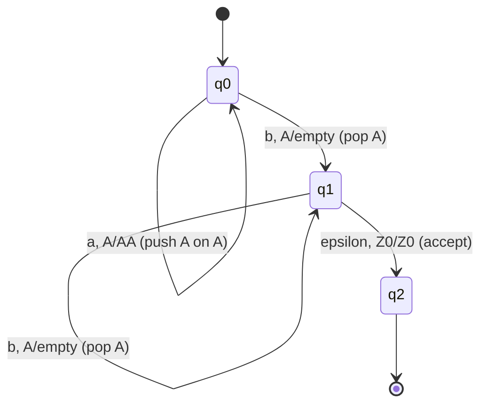
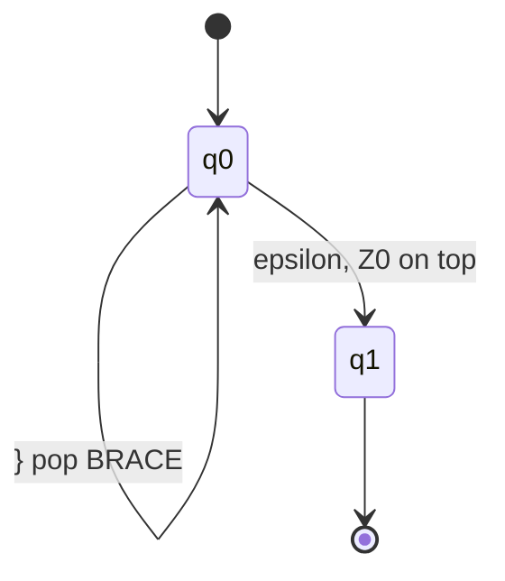
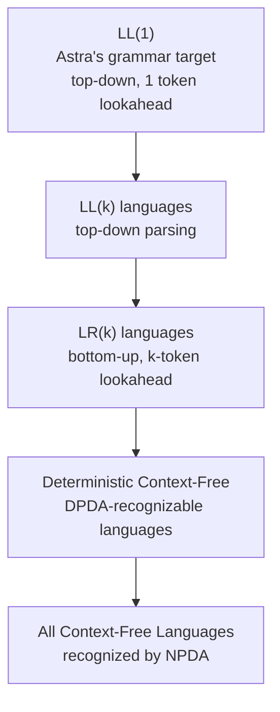

# Chapter 42: Pushdown Automata — Adding a Stack to Finite Automata

> "A finite automaton is a machine with no memory. A pushdown automaton is a machine with a notepad — a single stack where it can scribble things down and erase them. That single notepad is the difference between recognizing tokens and parsing programs."
> — Every theory of computation course, restated

---

## Overview

In Chapters 39 and 40, we studied Finite Automata — machines that recognize **regular languages**. We built DFAs for every Astra token type. But there is a fundamental limitation we have not yet confronted: DFAs cannot match balanced delimiters. A DFA cannot check that `{` and `}` match up, or that `(((` has three corresponding `))`)`s. This is not a practical limitation of our implementation — it is a mathematical impossibility, proven by the Pumping Lemma.

To parse programs — which have nested, recursive structure — we need more power. The key insight is simple and beautiful: take a DFA and add a **stack**. The resulting model is the **Pushdown Automaton** (PDA). The stack gives the PDA unlimited memory in one dimension (depth), which is exactly the memory needed to track nested structure. Context-free languages — the class that includes all programming language syntaxes we care about — are precisely the languages recognized by PDAs.

Even more importantly, there is a direct, concrete connection to your Astra parser: your recursive descent parser IS a pushdown automaton in disguise. The C/Go call stack IS the PDA's stack. This chapter makes that connection explicit and traces the exact stack evolution as the Astra parser processes a function declaration.

---

## What We're Building

We will trace the Astra parser as a PDA, showing the exact stack state at each step of parsing `fn add(a: int) -> int { return a + 1 }`. We will also prove that no DFA can parse matching braces, implement a PDA simulator in Go, and show the state diagrams for balanced-bracket PDAs.

---

## Table of Contents

1. Why DFAs Can't Count — The Pumping Lemma
2. The Key Insight: Add a Stack
3. Formal Definition of a Pushdown Automaton
4. PDA Example 1: Recognizing {aⁿbⁿ}
5. PDA Example 2: Balanced Parentheses and Brackets
6. PDA State Diagram Notation
7. Acceptance Modes: Final State vs Empty Stack
8. Nondeterministic PDAs — More Powerful Than Deterministic PDAs
9. CFG ↔ PDA Equivalence
10. Deterministic Context-Free Languages and Parsing
11. The Connection to Parsing: Your Call Stack IS the PDA Stack
12. Astra Build Milestone: The Astra Parser as a PDA
13. Exercises
14. Summary

---

## 1. Why DFAs Can't Count — The Pumping Lemma

Consider the language L = {aⁿbⁿ : n ≥ 1} — strings of n a's followed by n b's. Examples: `ab`, `aabb`, `aaabbb`, `aaaabbbb`. This is the simplest example of a language that requires counting.

**Claim**: L is NOT regular — no DFA can recognize it.

**Proof** (using the Pumping Lemma for regular languages):

The Pumping Lemma states: if L is regular, then there exists a "pumping length" p such that any string w ∈ L with |w| ≥ p can be split into w = xyz where:
1. |xy| ≤ p
2. |y| ≥ 1
3. For all k ≥ 0, xy^k z ∈ L

**Proof by contradiction**: Suppose L = {aⁿbⁿ} is regular with pumping length p. Take w = aᵖbᵖ ∈ L with |w| = 2p ≥ p.

By the Pumping Lemma, w = xyz where |xy| ≤ p and |y| ≥ 1. Since |xy| ≤ p and the first p characters of w are all a's, xy consists entirely of a's. So y = aʲ for some j ≥ 1.

Now pump: xy²z = a^(p+j) b^p. But p+j ≠ p (since j ≥ 1), so xy²z ∉ L.

Contradiction! The Pumping Lemma says xy²z MUST be in L. So our assumption (L is regular) was wrong. **L is not regular. No DFA can recognize it.**

**Why does this matter?** Consider what {aⁿbⁿ} represents in programming: it is the pattern "open delimiter followed by the same number of close delimiters." Every time you write `{...{...{...}...}...}`, you are writing a string from the same family. Programming languages are full of such patterns. DFAs — and therefore lexers — cannot check these patterns. We need something more powerful.

```
DFA has finite memory:
State 0 → State 1 → ... → State p (finite!)

After seeing "aaaa...a" (p+1 a's), the DFA MUST
revisit some state (pigeonhole principle). Once it's
in a loop, it has "lost count" of how many a's it saw.
It cannot correctly count the matching b's.
```

---

## 2. The Key Insight: Add a Stack

The DFA's limitation is its finite memory — it can only be in one of a fixed number of states, and states cannot encode unbounded counts.

The fix: **give the machine a stack**. The stack is a last-in-first-out (LIFO) memory that can grow arbitrarily deep. The machine can push symbols onto the stack to "remember" something, and pop them off later to "check" what it remembered.

```
Finite Automaton:                 Pushdown Automaton:
┌──────────────────┐              ┌──────────────────┐
│                  │              │                  │
│  Q (states)      │              │  Q (states)      │
│                  │              │                  │
│  Input tape      │              │  Input tape      │
│  ─────────────── │              │  ─────────────── │
│  a a b b b       │              │  a a b b b       │
│  ↑ (read head)   │              │  ↑ (read head)   │
│                  │              │                  │
└──────────────────┘              │  ┌─────────┐     │
                                  │  │ Stack:  │     │
  Memory: just current state      │  │   A     │ ← top
                                  │  │   A     │     │
                                  │  │   Z₀    │ ← bottom
                                  │  └─────────┘     │
                                  └──────────────────┘

  Memory: current state + entire stack contents
  = UNBOUNDED memory (in the stack dimension)
```

Intuition for {aⁿbⁿ}: when reading an `a`, push an `A` onto the stack. When reading a `b`, pop an `A` off the stack. If the stack is empty when input ends, we have seen equal numbers of a's and b's. The stack acts as a **counter** that can reach any depth.

---

## 3. Formal Definition of a Pushdown Automaton

A **Pushdown Automaton** (PDA) is a 7-tuple:

M = (Q, Σ, Γ, δ, q₀, Z₀, F)

where:

| Symbol | Name | Meaning |
|---|---|---|
| Q | States | Finite set of states (same as DFA) |
| Σ | Input alphabet | Set of input symbols (same as DFA) |
| Γ | Stack alphabet | Set of symbols that can appear on the stack (may differ from Σ) |
| δ | Transition function | Q × (Σ ∪ {ε}) × Γ → 2^(Q × Γ*) |
| q₀ | Start state | Initial state ∈ Q |
| Z₀ | Initial stack symbol | Special symbol placed on stack at start |
| F | Accept states | Set of accepting states ⊆ Q |

**The transition function δ** is the complicated part. Let's unpack it:

δ(q, a, X) = {(q', γ), ...}

This says: **when in state q, reading input symbol a, with stack top X**:
- Move to state q'
- Pop X off the stack
- Push the string γ onto the stack (in reverse order, so the first symbol of γ is the new top)

Special cases:
- If γ = ε (empty string): just pop X, push nothing (net effect: pop one symbol)
- If γ = X: push X back (net effect: stack unchanged, but we read a and changed state)
- If γ = YX: push Y on top of X (stack grows by one)
- Input symbol can be ε (epsilon transition): don't consume input, just act on the stack

**Configuration**: a snapshot of the PDA at any moment is (q, w, α) where q is the current state, w is the remaining input, and α is the stack contents (leftmost = top).

---

## 4. PDA Example 1: Recognizing {aⁿbⁿ}

Let's build a PDA that accepts exactly the strings `ab`, `aabb`, `aaabbb`, etc.

PDA = ({q₀, q₁, q₂}, {a, b}, {A, Z₀}, δ, q₀, Z₀, {q₂})

Transition function δ:

| State | Input | Stack top | Next state | Stack action |
|---|---|---|---|---|
| q₀ | a | Z₀ | q₀ | Push A, keep Z₀ → stack: AZ₀ |
| q₀ | a | A | q₀ | Push A on top of A → stack: AAZ₀ |
| q₀ | b | A | q₁ | Pop A |
| q₁ | b | A | q₁ | Pop A |
| q₁ | ε | Z₀ | q₂ | Keep Z₀ (accept!) |

State diagram:



**Trace for input "aabb":**

```
Step  State  Input remaining  Stack (top→bottom)  Action
────  ─────  ───────────────  ──────────────────  ──────────────────────────
0     q₀     aabb             Z₀                  Start
1     q₀     abb              AZ₀                 Read 'a', push A onto Z₀
2     q₀     bb               AAZ₀                Read 'a', push A onto A
3     q₁     b                AZ₀                 Read 'b', pop A (q₀→q₁)
4     q₁     (empty)          Z₀                  Read 'b', pop A
5     q₂     (empty)          Z₀                  ε-transition, stack has Z₀ → ACCEPT
```

The stack grew to depth 2 (one A per a seen), then shrank as each b consumed an A. If the input were "aaabbb", the stack would grow to depth 3. The stack can handle any depth — this is what no DFA can do.

---

## 5. PDA Example 2: Balanced Parentheses and Brackets

This is directly relevant to parsing Astra — we need to verify that `(`, `[`, and `{` are properly matched.

PDA = ({q₀, q₁}, {(, ), [, ], {, }}, {PAREN, BRACKET, BRACE, Z₀}, δ, q₀, Z₀, {q₁})

Transitions:

| State | Input | Stack top | Next | Stack action |
|---|---|---|---|---|
| q₀ | ( | any | q₀ | Push PAREN |
| q₀ | [ | any | q₀ | Push BRACKET |
| q₀ | { | any | q₀ | Push BRACE |
| q₀ | ) | PAREN | q₀ | Pop PAREN |
| q₀ | ] | BRACKET | q₀ | Pop BRACKET |
| q₀ | } | BRACE | q₀ | Pop BRACE |
| q₀ | ε | Z₀ | q₁ | Keep Z₀ (accept) |

The key: mismatches cause the PDA to get stuck (no applicable transition) → reject.



**Trace for input `({[]})`:**

```
Step  Input  Action                   Stack (top→bottom)
────  ─────  ───────────────────────  ──────────────────
0           start                    Z₀
1     (      push PAREN               PAREN Z₀
2     {      push BRACE               BRACE PAREN Z₀
3     [      push BRACKET             BRACKET BRACE PAREN Z₀
4     ]      pop BRACKET (matches [)  BRACE PAREN Z₀
5     }      pop BRACE   (matches {)  PAREN Z₀
6     )      pop PAREN   (matches ()  Z₀
7     ε      stack has Z₀ → ACCEPT   Z₀
```

**Trace for input `({)}`** — MISMATCH:

```
Step  Input  Action                   Stack        Result
────  ─────  ───────────────────────  ───────────  ──────
0           start                    Z₀
1     (      push PAREN               PAREN Z₀
2     {      push BRACE               BRACE PAREN Z₀
3     )      want to pop PAREN,       ← BRACE is on top, not PAREN!
             no transition defined    → STUCK → REJECT
```

The PDA correctly rejects mismatched brackets by failing to find an applicable transition rule.

---

## 6. PDA State Diagram Notation

A standard notation for PDA transitions on state diagram arrows:

```
Arrow label:   a, X / γ

Meaning:
  a = input symbol consumed (or ε for no input consumed)
  X = stack symbol popped
  γ = string pushed onto stack (left symbol = new top)

Examples:
  a, A / AА    → read 'a', pop A, push A then A (A stays, extra A added)
  b, A / ε     → read 'b', pop A, push nothing (A is consumed)
  ε, Z₀ / Z₀  → no input, peek at Z₀ without changing it, stay (or transition)
  (, Z₀ / PZ₀ → read '(', pop Z₀, push P then Z₀ (P is now on top)
```

Full PDA state diagram for {aⁿbⁿcⁿ} is NOT possible with a DPDA (it requires nondeterminism or a more powerful model — we prove this in the next chapter).

---

## 7. Acceptance Modes: Final State vs Empty Stack

A PDA can accept in two equivalent ways:

**Acceptance by final state**: the PDA accepts if, after consuming all input, the machine is in an accepting state F. The stack can have anything on it.

**Acceptance by empty stack**: the PDA accepts if, after consuming all input, the stack is empty (contains only Z₀, or is completely empty depending on definition).

**Theorem**: the two modes are equivalent — every language accepted by final state has a PDA that accepts by empty stack, and vice versa.

In practice, acceptance by empty stack is more natural for parsing (the stack empties when all nested structures are closed), while acceptance by final state is more natural for simulation. Astra's recursive descent parser uses final state acceptance conceptually (the parser succeeds if `parseProgram()` returns without error).

---

## 8. Nondeterministic PDAs — More Powerful Than Deterministic PDAs

**Nondeterministic PDA (NPDA)**: like an NFA for PDAs — the transition function can return multiple possible (state, stack-action) pairs, and the machine accepts if ANY execution path leads to acceptance.

**Deterministic PDA (DPDA)**: at most one applicable transition in each (state, input, stack-top) situation. Deterministic.

**Key theorem**: NPDAs are strictly MORE powerful than DPDAs! This is different from finite automata where NFA = DFA.

The language L = {wwᴿ : w ∈ {a,b}*} (palindromes over {a,b}) requires nondeterminism — the DPDA doesn't know when the middle of the string has been reached.

Also: the language {aⁿbⁿcⁿ} (equal numbers of a's, b's, c's) cannot be recognized by any PDA (not even nondeterministic) — it requires a Turing machine. More on this in Chapter 43.

This has a direct practical consequence: some context-free languages cannot be parsed deterministically without lookahead. This is exactly why some grammars require LR(1) parsing (which implicitly uses nondeterminism resolved by lookahead) while others can be parsed with simple LL(1) recursive descent.

---

## 9. CFG ↔ PDA Equivalence

The most important theorem in this chapter:

**Theorem**: A language L is context-free if and only if some NPDA recognizes L.

This means: CFGs and PDAs describe exactly the same class of languages.

**Direction 1: CFG → PDA** (every CFG can be converted to an equivalent NPDA):

Given a CFG G = (V, T, P, S), construct an NPDA M:
- States: {q₀, q_loop, q_accept}
- Stack alphabet = V ∪ T ∪ {Z₀}
- Start: push Z₀, then push S (the start symbol), go to q_loop

In q_loop:
- If top of stack is a nonterminal A: nondeterministically choose a production A → α and replace A with α on the stack (push α in reverse order)
- If top of stack is a terminal a and next input is a: match (pop a, read a)
- If top of stack is Z₀: accept

This is called the **top-down NPDA** — it simulates leftmost derivation. Each nondeterministic choice corresponds to choosing which production to apply. This is exactly what your LL(1) parser does deterministically using lookahead to resolve the nondeterminism!

**Direction 2: PDA → CFG** (every NPDA can be converted to an equivalent CFG):

For each pair of states (p, q) in the PDA, create a nonterminal A[p,q] meaning "the PDA can move from state p to state q while consuming some input and ending with the same stack as it started." The grammar rules are derived from the PDA transitions.

---

## 10. Deterministic Context-Free Languages and Parsing

Not all context-free languages can be parsed deterministically in linear time. The hierarchy:



**LL(1)**: parse left-to-right, Leftmost derivation, 1 token of lookahead. This is what recursive descent parsers implement. Astra's grammar is designed to be LL(1) — with one token of lookahead, the parser always knows exactly which production to apply.

**LR(k)**: parse left-to-right, Rightmost derivation (reverse), k tokens of lookahead. More powerful than LL(k) — can parse a larger class of grammars. Tools like yacc/bison generate LR(1) parsers.

**Why Astra uses LL(1)**: LL(1) parsers are:
- Simple to implement (recursive descent — one function per grammar rule)
- Easy to understand and debug
- Easy to generate good error messages
- Fast (O(n) time, linear in input size)

The slight power reduction (can't parse all CFLs, only LL(1) ones) is addressed by designing Astra's grammar to be LL(1) — eliminating left recursion, left-factoring ambiguous rules.

---

## 11. The Connection to Parsing: Your Call Stack IS the PDA Stack

This is the payoff of the entire chapter. Your Astra recursive descent parser is a PDA in disguise.

**The correspondence:**

| PDA concept | Parser concept |
|---|---|
| PDA state | Current parsing function |
| PDA stack | Go function call stack |
| Push γ onto stack | Recursive function call |
| Pop from stack | Function return |
| Read input symbol | Consume next token (lexer.NextToken()) |
| ε-transition | Non-consuming lookahead (lexer.Peek()) |

Every `parseXxx()` function in the parser corresponds to a grammar rule being "expanded." When `parseExpr()` calls `parseAddExpr()`, which calls `parseMulExpr()`, etc., the call stack IS growing. When those calls return, the call stack IS shrinking. This is exactly the PDA stack behavior.

```
Grammar rule:               Parser function:
────────────────────────    ──────────────────────────────────────
FuncDecl → fn id            func (p *Parser) parseFuncDecl() {
           ( Params )           p.expect(KW_FN)
           → ReturnType         name := p.expect(IDENT)
           Block                p.expect(LPAREN)      // push → parseParams
                                params := p.parseParams()  // ↑ stack grows
                                p.expect(RPAREN)      // pop  ← parseParams
                                p.expect(ARROW)
                                ret := p.parseType()   // push → parseType
                                body := p.parseBlock() // push → parseBlock
                                return FuncDecl{...}
                            }
```

---

## 12. Astra Build Milestone: The Astra Parser as a PDA

Let's trace the PDA execution of parsing `fn add(a: int) -> int { return a + 1 }`.

We will show the call stack (= PDA stack) at each step, alongside the corresponding parser code.

```
Token stream: fn  add  (  a  :  int  )  ->  int  {  return  a  +  1  }
Token index:  1   2    3  4  5  6    7  8   9    10 11      12 13 14 15
```

**PDA trace (showing call stack depth and frame contents):**

```
Step 1: parseProgram() called
  Stack: [parseProgram]
  Tokens remaining: fn add ( a : int ) -> int { return a + 1 }
  Action: sees 'fn' → call parseFuncDecl()

Step 2: parseFuncDecl() called
  Stack: [parseFuncDecl] [parseProgram]
  Tokens remaining: fn add ( a : int ) -> int { return a + 1 }
  Action: consume 'fn', consume 'add', consume '('

Step 3: parseParams() called
  Stack: [parseParams] [parseFuncDecl] [parseProgram]
  Tokens remaining: a : int ) -> int { return a + 1 }
  Action: sees IDENT 'a' → call parseParam()

Step 4: parseParam() called
  Stack: [parseParam] [parseParams] [parseFuncDecl] [parseProgram]
  Tokens remaining: a : int ) -> int { return a + 1 }
  Action: consume 'a', consume ':', call parseType()

Step 5: parseType() called (for param type)
  Stack: [parseType] [parseParam] [parseParams] [parseFuncDecl] [parseProgram]
  Tokens remaining: int ) -> int { return a + 1 }
  Action: consume 'int', return TypeInt

Step 5 complete: parseType() returns TypeInt
  Stack: [parseParam] [parseParams] [parseFuncDecl] [parseProgram]
  Tokens remaining: ) -> int { return a + 1 }

Step 6: parseParam() returns Param{name:"a", type:int}
  Stack: [parseParams] [parseFuncDecl] [parseProgram]
  Tokens remaining: ) -> int { return a + 1 }

Step 7: parseParams() sees ')' → returns [Param{a, int}]
  Stack: [parseFuncDecl] [parseProgram]
  Tokens remaining: ) -> int { return a + 1 }
  Action: consume ')', consume '->'

Step 8: parseType() called (for return type)
  Stack: [parseType] [parseFuncDecl] [parseProgram]
  Tokens remaining: int { return a + 1 }
  Action: consume 'int', return TypeInt

Step 8 complete: parseType() returns TypeInt
  Stack: [parseFuncDecl] [parseProgram]
  Tokens remaining: { return a + 1 }

Step 9: parseBlock() called
  Stack: [parseBlock] [parseFuncDecl] [parseProgram]
  Tokens remaining: { return a + 1 }
  Action: consume '{'

Step 10: parseStatement() called
  Stack: [parseStatement] [parseBlock] [parseFuncDecl] [parseProgram]
  Tokens remaining: return a + 1 }
  Action: sees 'return' → call parseReturnStmt()

Step 11: parseReturnStmt() called
  Stack: [parseReturnStmt] [parseStatement] [parseBlock] [parseFuncDecl] [parseProgram]
  Tokens remaining: return a + 1 }
  Action: consume 'return', call parseExpr()

Step 12: parseExpr() → parseAddExpr() → parsePrimaryExpr()
  Stack: [parsePrimaryExpr] [parseAddExpr] [parseExpr]
         [parseReturnStmt] [parseStatement] [parseBlock]
         [parseFuncDecl] [parseProgram]
  Tokens remaining: a + 1 }
  Action: consume 'a', return Ident{a}

Step 13: parseAddExpr() sees '+', calls parsePrimaryExpr() for right side
  Stack grows then shrinks:
  [parsePrimaryExpr] → consumes '1', returns IntLit{1}
  Back to [parseAddExpr]: returns BinOp{+, Ident{a}, IntLit{1}}

Step 14: parseExpr() returns BinOp{+, Ident{a}, IntLit{1}}
  Stack: [parseReturnStmt] [parseStatement] [parseBlock]
         [parseFuncDecl] [parseProgram]

Step 15: parseReturnStmt() returns ReturnStmt{BinOp{...}}
  Stack: [parseStatement] [parseBlock] [parseFuncDecl] [parseProgram]

Step 16: parseStatement() returns
  Stack: [parseBlock] [parseFuncDecl] [parseProgram]
  Tokens remaining: }

Step 17: parseBlock() sees '}', consumes it, returns Block{[ReturnStmt{...}]}
  Stack: [parseFuncDecl] [parseProgram]

Step 18: parseFuncDecl() returns FuncDecl{name:"add", params:[{a,int}], ret:int, body:...}
  Stack: [parseProgram]

Step 19: parseProgram() assembles the program AST, returns
  Stack: []
  Input fully consumed, stack empty → ACCEPT (parse success)
```

Visual summary of stack depth over time:

```
Depth
8  │                                ████
7  │                               ██████
6  │               ██████         ████████
5  │             ██████████       ██████████
4  │           ████████████       ████████████
3  │     ████████████████████     ████████████████
2  │   ████████████████████████   ████████████████████
1  │ ██████████████████████████████████████████████████
   └──────────────────────────────────────────────────►
   fn add ( a : int ) -> int { return a + 1 }   time
```

The recursive descent parser in Go:

```go
// parser/parser.go — the PDA in action

// parseFuncDecl corresponds to the grammar rule:
// FuncDecl → 'fn' IDENT '(' Params ')' '->' Type Block
func (p *Parser) parseFuncDecl() (*ast.FuncDecl, error) {
    // Consume 'fn'
    if err := p.expect(token.KW_FN); err != nil {
        return nil, err
    }

    // Consume function name
    nameToken, err := p.expectIdent()
    if err != nil {
        return nil, err
    }

    // Consume '(' — entering nested structure (PDA: push PAREN)
    if err := p.expect(token.LPAREN); err != nil {
        return nil, err
    }

    // Parse parameters — RECURSIVE CALL = PDA stack push
    params, err := p.parseParams()
    if err != nil {
        return nil, err
    }

    // Consume ')' — exiting nested structure (PDA: pop PAREN)
    if err := p.expect(token.RPAREN); err != nil {
        return nil, fmt.Errorf("expected ')' to close parameter list: %w", err)
    }

    // Consume '->'
    if err := p.expect(token.ARROW); err != nil {
        return nil, err
    }

    // Parse return type — RECURSIVE CALL = PDA stack push
    retType, err := p.parseType()
    if err != nil {
        return nil, err
    }

    // Parse function body — RECURSIVE CALL = PDA stack push
    body, err := p.parseBlock()
    if err != nil {
        return nil, err
    }

    return &ast.FuncDecl{
        Name:       nameToken.Value,
        Params:     params,
        ReturnType: retType,
        Body:       body,
    }, nil
}

// parseBlock corresponds to: Block → '{' Statement* '}'
func (p *Parser) parseBlock() (*ast.Block, error) {
    // PDA: push BRACE (opening '{')
    if err := p.expect(token.LBRACE); err != nil {
        return nil, err
    }

    var stmts []ast.Statement
    for p.peek().Type != token.RBRACE && p.peek().Type != token.EOF {
        stmt, err := p.parseStatement() // PDA: recursive push
        if err != nil {
            return nil, err
        }
        stmts = append(stmts, stmt)
    }

    // PDA: pop BRACE (closing '}')
    if err := p.expect(token.RBRACE); err != nil {
        return nil, fmt.Errorf("expected '}' to close block: %w", err)
    }

    return &ast.Block{Statements: stmts}, nil
}
```

Every `expect(LBRACE)` / `expect(RBRACE)` pair is exactly the PDA push/pop. Every recursive call is exactly the PDA stack growing. The function call stack IS the PDA stack.

---

## Exercises

1. **Pumping Lemma practice**: Use the Pumping Lemma to prove that the language L = {aⁿbᵐ : n ≤ m} (fewer a's than b's) is NOT regular. (Hint: it IS context-free — construct the PDA too.)

2. **PDA simulator in Go**: Implement a PDA simulator. Represent a PDA as a `struct PDA` with a transition table `map[StateInputStack][]Transition`. Implement a `Run(input string) bool` method using a recursive backtracking search (for nondeterministic PDAs). Test it on the {aⁿbⁿ} PDA from Section 4.

3. **Balanced brackets PDA**: Implement the balanced-brackets PDA from Section 5 in your simulator. Test it on: `({[]})` (valid), `({)}` (invalid), `([[]])` (valid), `(]` (invalid), `` (empty string — valid? decide and implement).

4. **NPDA for palindromes**: Construct an NPDA that recognizes L = {wwᴿ : w ∈ {a,b}*} — all palindromes over {a, b}. Draw the state diagram. Trace the execution for input `abba`. Explain why a DPDA cannot recognize this language.

5. **LL(1) check**: For the following Astra grammar fragment, compute the FIRST and FOLLOW sets (from Chapter 41) and verify it is LL(1) — i.e., for each non-terminal, the FIRST sets of all its productions are disjoint. If it is NOT LL(1), modify it to make it LL(1): `Expr → Expr '+' Term | Term` (left recursive — needs fixing!), `Term → IDENT | '(' Expr ')'`.

6. **Parser PDA trace**: Trace the parser-as-PDA for the Astra expression `(a + b) * c`. Show the call stack at every step. Draw the stack depth graph over time (like the one in Section 12). Count the maximum stack depth.

---

## Summary

| Concept | Key Point |
|---|---|
| DFA limitation | Finite memory — cannot count, cannot match balanced delimiters |
| Pumping Lemma | Proves {aⁿbⁿ} is not regular: pumping creates unequal a/b counts |
| PDA = DFA + stack | Adding a LIFO stack gives unbounded memory; can count nesting depth |
| PDA formal definition | 7-tuple (Q, Σ, Γ, δ, q₀, Z₀, F); transitions read input + pop/push stack |
| {aⁿbⁿ} PDA | Push A for each a; pop A for each b; accept when stack has Z₀ only |
| Balanced brackets PDA | Push open bracket; pop when matching close found; reject on mismatch |
| Accept by final state | Accept if state ∈ F after all input consumed |
| Accept by empty stack | Accept if stack is empty (or just Z₀) after all input consumed; equivalent |
| NPDA vs DPDA | NPDAs are strictly more powerful than DPDAs (unlike NFA vs DFA) |
| CFG = NPDA | Every CFG corresponds to an NPDA and vice versa |
| LL(1) vs LR(1) | Both deterministic; LL(1) = top-down, LR(1) = bottom-up, LR more powerful |
| Astra uses LL(1) | Simple recursive descent; designed grammar is LL(1) |
| Parser IS a PDA | Go call stack = PDA stack; recursive calls = stack pushes; returns = pops |
| parseFuncDecl() | Corresponds to the FuncDecl grammar rule; stack grows with each sub-parse |
