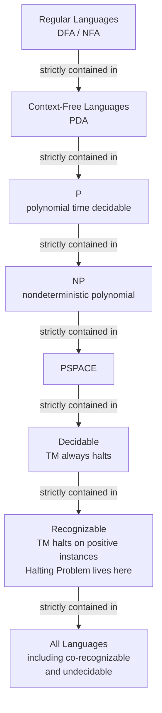

# Chapter 43: Turing Machines and Computability

> "We shall not cease from exploration, and the end of all our exploring will be to arrive where we started and know the place for the first time."
> — T.S. Eliot (often quoted in computability discussions)

> "The question 'Can machines think?' is too ill-defined to deserve discussion."
> — Alan Turing, 1950

---

## Overview

We have now climbed the Chomsky hierarchy from regular languages (DFAs) through context-free languages (PDAs). At each step, more computational power enabled recognition of more complex patterns. Now we take the final and most dramatic step: the **Turing Machine**, the theoretical model that captures everything a computer can ever do.

Alan Turing published his landmark paper "On Computable Numbers, with an Application to the Entscheidungsproblem" in 1936 — before electronic computers existed. He was trying to answer a deep mathematical question posed by David Hilbert: is there a mechanical procedure that can, given any mathematical statement, decide whether it is true or false? Turing's answer was no — and the argument he used to prove this introduced a model of computation so fundamental that we still use it to reason about computing 90 years later.

In this chapter we study the Turing Machine: what it is, how it works, and what its theoretical properties tell us about computation. We will prove the undecidability of the Halting Problem — one of the most beautiful and consequential proofs in all of mathematics. We will understand Rice's Theorem and its profound implications for static analysis of programs. And we will build a Turing Machine simulator in Astra, demonstrating that Astra is powerful enough to simulate universal computation — that is, Astra is Turing complete.

---

## What We're Building

We will implement a complete Turing Machine simulator in Astra. This simulator accepts a TM description and an input string, and runs the TM step by step. We will use it to simulate the TM for {aⁿbⁿcⁿ} and a binary addition TM. The implementation demonstrates Astra's expressive power — and connects everything back to the Astra compiler's own design.

---

## Table of Contents

1. The Limits of Pushdown Automata
2. Alan Turing and the Entscheidungsproblem
3. The Turing Machine — Formal Definition
4. TM Example 1: Recognizing {aⁿbⁿcⁿ}
5. TM Example 2: Binary Addition
6. Configuration and Computation
7. The Church-Turing Thesis
8. The Universal Turing Machine — Your CPU
9. The Halting Problem — The Great Undecidable
10. Diagonalization — The Heart of the Proof
11. Rice's Theorem — All Non-Trivial Properties Are Undecidable
12. Decidable vs Recognizable Languages
13. Turing Completeness and Astra
14. Astra Build Milestone: TM Simulator in Astra
15. Exercises
16. Summary

---

## 1. The Limits of Pushdown Automata

PDAs can handle any context-free language. But there are languages no PDA can handle. The simplest example:

**L = {aⁿbⁿcⁿ : n ≥ 1}** — equal numbers of a's, b's, and c's. `abc`, `aabbcc`, `aaabbbccc`, ...

**Proof using the Pumping Lemma for CFLs**: (sketch)

The Pumping Lemma for CFLs says: for any CFL L, there is a pumping length p such that any string w ∈ L with |w| ≥ p can be split as w = uvxyz where:
- |vxy| ≤ p
- |vy| ≥ 1
- For all k ≥ 0: uvⁿxvⁿz ∈ L

Take w = aᵖbᵖcᵖ. The |vxy| ≤ p constraint means vxy cannot span all three of {a's, b's, c's}. So v and y together can affect at most TWO of the three counts. Pumping (k=2) makes those two counts larger while the third stays the same — breaking the equal-count property. Contradiction.

**Why a PDA fails**: A PDA has one stack. It can verify aⁿbⁿ (push for a, pop for b). But then the stack is empty — it has no memory left to verify that the c's also number n. A second counter would require a second stack. Two stacks would make the machine equivalent to a Turing machine.

```
PDA can handle:                    PDA cannot handle:
  a a a b b b                        a a a b b b c c c
  │ │ │                              │ │ │
  push push push  ← stack grows      push push push
        │ │ │                              │ │ │
        pop pop pop ← stack shrinks        pop pop pop  ← stack empty!
             ACCEPT                        c c c  ← no memory for c's!
```

---

## 2. Alan Turing and the Entscheidungsproblem

In 1928, David Hilbert posed the **Entscheidungsproblem** ("decision problem"): is there an algorithm that can determine, for any well-formed mathematical statement, whether it is provable (decidable)?

This was a natural question: mathematicians had been finding proofs for centuries. Is mathematics itself algorithmic — is there a master procedure that can find any proof?

In 1936, two people independently published negative answers:
- **Alan Turing** (Cambridge, England): invented the Turing Machine, proved the halting problem undecidable, proved Entscheidungsproblem is undecidable.
- **Alonzo Church** (Princeton, USA): invented the lambda calculus (which later influenced Haskell, Lisp, and functional programming), proved the same result via a different path.

Both models turned out to be equivalent in power — they compute exactly the same things. This convergence from different directions was the first strong evidence that there is a natural, fundamental notion of "computability."

---

## 3. The Turing Machine — Formal Definition

A **Turing Machine** (TM) is a 7-tuple:

M = (Q, Σ, Γ, δ, q₀, q_accept, q_reject)

where:

| Symbol | Meaning |
|---|---|
| Q | Finite set of states |
| Σ | Input alphabet (doesn't include the blank symbol □) |
| Γ | Tape alphabet (Σ ⊆ Γ, includes the blank □) |
| δ | Transition function: Q × Γ → Q × Γ × {L, R} |
| q₀ | Start state |
| q_accept | The accepting (halting) state |
| q_reject | The rejecting (halting) state; q_reject ≠ q_accept |

**The tape**: an infinite sequence of cells, each containing a symbol from Γ. Initially, the input is written on the tape (one symbol per cell), and all other cells contain the blank symbol □. The tape extends infinitely in BOTH directions.

**The head**: a read/write head that sits on one cell of the tape. At each step, it reads the current cell, writes a new symbol (possibly the same), and moves one step left or right.

**A step**: δ(q, a) = (q', b, D) means:
- The machine is in state q reading symbol a
- It transitions to state q'
- It writes b to the current cell
- It moves the head in direction D (L = left, R = right)

**Halting**: the machine halts when it reaches q_accept (accept) or q_reject (reject). If it never reaches either, it **loops forever**.

```
          Current state: q₂
          Head position: ↓
Tape: ... □  □  a  a  b  b  b  □  □ ...
             ↑                  ↑
          left end            right end
          (infinite)           (infinite)

Transition: δ(q₂, b) = (q₃, X, R)
  → write X to current cell
  → move right
  → go to state q₃

New configuration:
          Current state: q₃
Tape: ... □  □  a  a  b  X  b  □  □ ...
                              ↑
                          head moved right
```

The key differences from a PDA:
1. The "stack" is now a **two-directional infinite tape** (can read AND write, can move either direction)
2. There are explicit **accept** and **reject** halt states
3. The machine may LOOP FOREVER (neither accept nor reject)

---

## 4. TM Example 1: Recognizing {aⁿbⁿcⁿ}

The strategy: scan the tape repeatedly. Each pass, cross off one `a`, one `b`, and one `c`. Accept if all are crossed off simultaneously.

Symbols: Σ = {a, b, c}, Γ = {a, b, c, X, □}
(X marks a crossed-off symbol)

States: q₀ (scan for a), q₁ (scan for b), q₂ (scan for c), q₃ (scan back), q₄ (verify done), q_accept, q_reject

**Simplified algorithm:**
1. If tape is all X's and □'s, ACCEPT.
2. Find the leftmost `a`, replace it with `X`. Move right.
3. Find the leftmost `b`, replace it with `X`. Move right.
4. Find the leftmost `c`, replace it with `X`.
5. Move head all the way left. Goto step 1.
6. If step 2, 3, or 4 fails to find the expected symbol, REJECT.

**Tape evolution for input "aabbcc":**

```
Pass 1:
[a][a][b][b][c][c]   initial
[X][a][b][b][c][c]   cross off first a
[X][a][X][b][c][c]   cross off first b
[X][a][X][b][X][c]   cross off first c
              ↑ head at right

Pass 2 (scan left):
[X][a][X][b][X][c]   scan back to leftmost a
[X][X][X][b][X][c]   cross off second a (= leftmost remaining a)
[X][X][X][X][X][c]   cross off second b
[X][X][X][X][X][X]   cross off second c

Pass 3:
[X][X][X][X][X][X]   scan: no a found
                     → all a's consumed; check for remaining b/c
                     → no b or c found → ACCEPT
```

This requires scanning the tape multiple times — up to O(n) passes of O(n) length = O(n²) time. But correctness is all that matters for computability theory. We're not optimizing yet.

**Key insight**: the TM uses the tape ITSELF as its memory. It writes markers (X) directly on the tape. This is the power denied to PDAs: they can only read the stack from the top, but a TM can read and write anywhere on the tape (by moving the head back and forth).

---

## 5. TM Example 2: Binary Addition

A TM can compute arbitrary mathematical functions, not just recognize languages. Let's add two binary numbers.

**Input format**: two binary numbers separated by a `+` symbol. Example: `1011+101` (11 + 5 = 16 = `10000`)

**Algorithm sketch**: standard grade-school binary addition with carry. The TM head bounces between the rightmost bits of both numbers, adding bit by bit with carry, writing the result in place.

The full state diagram is complex (about 20 states), but here is the high-level flow:

```
Input: 1011+101
       ↑↑↑↑ ↑↑↑
       n₁   n₂

Step 1: Find rightmost digit of n₂ (scan right past '+')
Step 2: Mark it, move left past '+' to rightmost unmarked digit of n₁
Step 3: Add the two bits (plus carry from previous round)
        Write sum bit, record carry in state
Step 4: Mark n₁ digit, go back to n₂ for next digit
Step 5: When n₂ is exhausted, propagate carry into n₁
Step 6: Write the result (may need to extend the tape leftward for overflow)
```

This demonstrates that TMs can compute any function you can compute by hand. They are not limited to yes/no decision problems — they can produce output on the tape.

---

## 6. Configuration and Computation

A **configuration** of a TM is a complete snapshot at any moment: (current state, tape contents, head position). Usually written as:

uqv

where u = tape content to the LEFT of the head, q = current state, v = tape content from the head position rightward (the current cell is the first character of v).

Example: `aa q₂ Xbbcc` means state q₂, head on X, tape is `aa X b b c c`.

**Yield**: configuration C₁ yields C₂ if the TM can move from C₁ to C₂ in one step.

**Computation**: a sequence of configurations C₀ ⊢ C₁ ⊢ C₂ ⊢ ...

**Accept**: computation ends in a configuration with state q_accept.
**Reject**: computation ends in a configuration with state q_reject.
**Loop**: computation never ends (infinite sequence).

The third option — **looping** — is what makes TMs different from DFAs and PDAs (which always halt). A TM that loops is "stuck in an infinite computation." This is the core of the Halting Problem.

---

## 7. The Church-Turing Thesis

The **Church-Turing Thesis** (CTT) states:

> Every function that can be computed by any reasonable computational model can be computed by a Turing Machine.

This is not a theorem — it cannot be proved mathematically because "reasonable computational model" is not formally defined. It is a claim about the relationship between formal computation and intuitive computation.

**Evidence for the CTT**:
- Lambda calculus (Church, 1936): equivalent to TMs
- Register machines: equivalent to TMs
- Random Access Machines: equivalent to TMs
- Real computers (x86, ARM): equivalent to TMs (for practical purposes)
- Python, Go, Astra: all Turing complete

Every "natural" model of computation ever proposed has turned out to be equivalent to TMs or weaker. No one has ever found a computation that is intuitively "doable" but cannot be done by a TM.

**Practical implication**: if you can describe an algorithm in English with precise enough steps, a TM (and therefore a computer) can execute it. The CTT is why we can reason about what computers CAN and CANNOT do using TM theory.

**Limits of the CTT**: quantum computing is an interesting case. Quantum computers can solve some problems faster than classical computers (in terms of time complexity). But quantum computers do not compute anything that a TM cannot eventually compute — they are not more powerful in the computability sense, only in the complexity sense.

---

## 8. The Universal Turing Machine — Your CPU

One of Turing's most brilliant insights: a TM can be **described** (encoded as a string). We can write a description of TM M as a string ⟨M⟩ (perhaps in JSON, or some binary format, or simply as a table of transitions).

A **Universal Turing Machine** (UTM) takes as input ⟨M, w⟩ — the description of a TM M and an input string w — and simulates M on w:

```
UTM input tape:
┌────────────────────────────────────────────────────┐
│  ⟨M⟩ = description of TM M  │ separator │  w = input│
└────────────────────────────────────────────────────┘

UTM behavior:
  - Read ⟨M⟩ to learn M's transitions
  - Simulate M running on w:
      - Track M's current state on the tape
      - Track M's tape contents on a separate region
      - Execute M's transitions
  - If M accepts w: UTM accepts
  - If M rejects w: UTM rejects
  - If M loops: UTM loops
```

**Your CPU is a UTM**: A modern CPU takes a program (machine code = description of a computation) and executes it. The fetch-decode-execute cycle of a CPU is exactly the UTM simulation loop. When you compile Astra to machine code and run it, the CPU is a UTM executing the description of your Astra program.

This idea — that the machine itself can be described and that there exists a universal machine that can run any described machine — is the theoretical foundation of **stored-program computers** (the von Neumann architecture). Before Turing's insight, "computers" were special-purpose hardware. The idea of a universal, reprogrammable machine came directly from the UTM.

---

## 9. The Halting Problem — The Great Undecidable

The **Halting Problem** asks:

> Does there exist a Turing Machine HALT such that, given any TM M and input w:
> - HALT(⟨M, w⟩) = accept, if M halts on w (either accepts or rejects)
> - HALT(⟨M, w⟩) = reject, if M loops forever on w

In other words: can we write a program that always correctly determines whether another program will eventually stop?

**Answer: No. The Halting Problem is undecidable.**

This is not a limitation of current technology. It is a mathematical impossibility — no matter how smart your algorithm is, no matter how fast your computer is, no matter how much memory you have, there is NO program that correctly solves the Halting Problem for all inputs.

---

## 10. Diagonalization — The Heart of the Proof

Turing's proof is a masterpiece of mathematical reasoning. It uses a technique called **diagonalization** — a method invented by Georg Cantor to prove that some infinities are larger than others.

**Full Proof by Contradiction:**

**Step 1**: Assume, for the sake of contradiction, that a decider H exists such that:
- H(⟨M, w⟩) = accept if M halts on w
- H(⟨M, w⟩) = reject if M loops on w

H always halts (it is a decider, not just a recognizer).

**Step 2**: Construct a new TM D ("Diagonal machine"):

```
D(⟨M⟩):
  Run H(⟨M, ⟨M⟩⟩)   // ask: does M halt when given its own description?
  If H accepts:
    LOOP FOREVER      // if M would halt on ⟨M⟩, then D loops
  If H rejects:
    ACCEPT            // if M would loop on ⟨M⟩, then D accepts
```

D is a valid TM (we can build it from H and some basic control flow).

**Step 3**: Ask: what does D do when given its OWN description ⟨D⟩?

Run D(⟨D⟩):
```
  Run H(⟨D, ⟨D⟩⟩)
```

**Case A: H(⟨D, ⟨D⟩⟩) = accept** (H says D halts on ⟨D⟩):
- Then D's code says: LOOP FOREVER
- So D LOOPS on ⟨D⟩
- But H said D halts! **CONTRADICTION.**

**Case B: H(⟨D, ⟨D⟩⟩) = reject** (H says D loops on ⟨D⟩):
- Then D's code says: ACCEPT
- So D HALTS (accepts) on ⟨D⟩
- But H said D loops! **CONTRADICTION.**

Both cases lead to contradiction. Therefore our assumption — that H exists — was wrong.

**The Halting Problem is undecidable. QED.**

```
The Diagonalization Table (infinite grid):

Rows = all TMs (M₁, M₂, M₃, ...)
Columns = all inputs (⟨M₁⟩, ⟨M₂⟩, ⟨M₃⟩, ...)
Cell(i,j) = H(⟨Mᵢ, ⟨Mⱼ⟩⟩) = HALT or LOOP

         ⟨M₁⟩  ⟨M₂⟩  ⟨M₃⟩  ⟨M₄⟩  ...
M₁  │  HALT  LOOP  HALT  LOOP  ...
M₂  │  LOOP  HALT  HALT  LOOP  ...
M₃  │  HALT  HALT  LOOP  HALT  ...
M₄  │  LOOP  LOOP  HALT  HALT  ...
...

Diagonal (Mᵢ on ⟨Mᵢ⟩):
  M₁ on ⟨M₁⟩ = HALT
  M₂ on ⟨M₂⟩ = HALT
  M₃ on ⟨M₃⟩ = LOOP
  M₄ on ⟨M₄⟩ = HALT

D FLIPS the diagonal:
  D(⟨M₁⟩) = LOOP   (opposite of M₁'s diagonal entry)
  D(⟨M₂⟩) = LOOP   (opposite of M₂'s diagonal entry)
  D(⟨M₃⟩) = HALT   (opposite of M₃'s diagonal entry)
  D(⟨M₄⟩) = LOOP   (opposite of M₄'s diagonal entry)

D differs from EVERY row in the table at the diagonal position.
Therefore D is not in the table — but D is a valid TM!
This means the table is incomplete — a contradiction.
```

**Real-world implications:**
- You cannot write a linter that correctly identifies ALL infinite loops in arbitrary programs
- You cannot write a virus scanner that detects ALL malicious code
- You cannot write a program that verifies all type-safety properties of arbitrary code
- You cannot write a program that checks if two arbitrary programs compute the same function

These limitations are not engineering failures — they are mathematical impossibilities.

---

## 11. Rice's Theorem — All Non-Trivial Properties Are Undecidable

The Halting Problem is one specific undecidable problem. **Rice's Theorem** shows the undecidability is pervasive:

**Theorem (Rice, 1953)**: Any non-trivial property of the LANGUAGE recognized by a TM is undecidable.

**Formal statement**: Let P be a property of TM languages (i.e., P is a set of TM descriptions such that all TMs with the same language have the same membership in P). If P is non-trivial (some TMs satisfy it and some don't), then {⟨M⟩ : M satisfies P} is undecidable.

**Examples of undecidable properties:**
- "Does M accept the empty string?" (undecidable by Rice's Theorem)
- "Does M accept at least one string?" (undecidable)
- "Does M accept all strings?" (undecidable)
- "Does M and M' compute the same function?" (undecidable — program equivalence)
- "Does M run in polynomial time?" (undecidable)
- "Is M's output always positive?" (undecidable)

**Why this matters for compilers**:
- **Alias analysis**: does pointer p ever equal pointer q? Undecidable in general → all compilers use safe approximations
- **Dead code elimination**: is this function ever called? Undecidable in general → approximation
- **Type inference**: in System F (polymorphic lambda calculus), type inference is undecidable
- **Null safety**: will this pointer ever be null at this point? Undecidable → need annotations or conservative analysis

The Astra compiler uses **conservative approximations** for all of these analyses: it errs on the side of safety, sometimes keeping code that could be eliminated or rejecting programs that would be safe, rather than risk incorrectness.

---

## 12. Decidable vs Recognizable Languages

Two important language classes relative to TMs:

**Decidable (recursive)**: L is decidable if there exists a TM M that:
- Accepts every w ∈ L
- Rejects every w ∉ L
- ALWAYS halts (never loops)

**Recognizable (recursively enumerable, RE)**: L is recognizable if there exists a TM M that:
- Accepts every w ∈ L
- Either rejects or loops forever for w ∉ L

Every decidable language is recognizable (just never loop on rejects). But not every recognizable language is decidable.



The Halting Problem is recognizable (if M halts on w, the UTM will eventually accept; if M loops, the UTM loops too — never rejects) but not decidable (we proved this above).

**The complement of the Halting Problem** (does M loop on w?) is NOT recognizable — there is no TM that can even accept all "looping" instances.

---

## 13. Turing Completeness and Astra

A system is **Turing complete** if it can simulate any Turing Machine. This is the informal way of saying a programming language or system can compute anything that is computable.

**Conditions for Turing completeness** (informally):
1. **Conditional branching** (if/else, match): choose different execution paths based on data
2. **Arbitrary looping** (while loops, recursion without bound)
3. **Arbitrary memory**: read/write to as much memory as needed

Astra has all three: `if`/`match`, `while`/recursion, and a GC-managed heap that can grow to fill RAM. Therefore:

**Astra is Turing complete.**

This means:
- Any computable problem can be expressed as an Astra program
- Astra programs can simulate TMs (as we demonstrate in the Milestone)
- Astra programs can loop forever (the price of Turing completeness)
- All of Rice's Theorem applies: no Astra tool can perfectly analyze all Astra programs

Interestingly, some "languages" are NOT Turing complete by design:
- **SQL** (without recursive CTEs): cannot express arbitrary computations
- **Regular expressions**: DFAs, not Turing complete
- **Coq/Agda** (proof assistants): their core logic is NOT Turing complete (all programs provably terminate — which is why you cannot write the Halting problem solver in them, and why they can verify proofs)
- **HTML/CSS**: markup/styling, not general computation
- **Total functional programming**: if all functions must provably terminate, the language is not Turing complete

---

## 14. Astra Build Milestone: TM Simulator in Astra

This is a complete Turing Machine simulator written in Astra. Running this program demonstrates two things: (1) Astra is expressive enough to model arbitrary computation, and (2) Astra's language features (structs, impls, maps, lists, pattern matching) are rich enough for non-trivial programs.

```astra
// turing_machine.astra
// A complete Turing Machine simulator.
// Usage: define a TM as a set of transitions, then run it on an input.

// Direction the head moves
enum Direction {
    Left,
    Right
}

// A single transition rule: (state, symbol) → (new_state, write_symbol, direction)
struct Transition {
    new_state:    int
    write_symbol: string
    direction:    Direction
}

// The TM itself
struct TuringMachine {
    tape:        List<string>       // the tape, indexed by position
    head:        int                // current head position
    state:       int                // current state
    accept:      int                // accepting state ID
    reject:      int                // rejecting state ID
    transitions: Map<string, Transition> // key: "state,symbol"
    blank:       string             // the blank symbol (usually "□")
    max_steps:   int                // safety limit to detect infinite loops
    steps:       int                // steps taken so far
}

impl TuringMachine {
    // Create a new TM from a list of transition rules
    fn new(
        transitions: List<(int, string, int, string, Direction)>,
        accept: int,
        reject: int,
        blank: string,
        max_steps: int
    ) -> TuringMachine {
        let t_map: Map<string, Transition> = Map.new()
        for (state, sym, new_state, write, dir) in transitions {
            let key = state.to_string() + "," + sym
            t_map.insert(key, Transition {
                new_state:    new_state,
                write_symbol: write,
                direction:    dir
            })
        }
        return TuringMachine {
            tape:        List.new(),
            head:        0,
            state:       0,
            accept:      accept,
            reject:      reject,
            transitions: t_map,
            blank:       blank,
            max_steps:   max_steps,
            steps:       0
        }
    }

    // Load an input string onto the tape
    fn load(self, input: string) {
        self.tape = List.new()
        for ch in input.chars() {
            self.tape.push(ch.to_string())
        }
        self.head  = 0
        self.state = 0
        self.steps = 0
    }

    // Read the symbol under the head (returns blank if head is off tape)
    fn read(self) -> string {
        if self.head < 0 or self.head >= self.tape.len() {
            return self.blank
        }
        return self.tape.get(self.head)
    }

    // Write a symbol at the head position (extends tape if needed)
    fn write(self, sym: string) {
        // Extend tape to the right if needed
        while self.head >= self.tape.len() {
            self.tape.push(self.blank)
        }
        // Extend tape to the left by prepending blanks
        while self.head < 0 {
            self.tape.prepend(self.blank)
            self.head = self.head + 1
        }
        self.tape.set(self.head, sym)
    }

    // Execute one step of the TM
    // Returns: true if still running, false if halted
    fn step(self) -> bool {
        if self.state == self.accept or self.state == self.reject {
            return false  // already halted
        }

        let symbol = self.read()
        let key    = self.state.to_string() + "," + symbol

        match self.transitions.get(key) {
            some(t) => {
                self.write(t.write_symbol)
                self.state = t.new_state
                match t.direction {
                    Direction.Left  => { self.head = self.head - 1 }
                    Direction.Right => { self.head = self.head + 1 }
                }
                self.steps = self.steps + 1
                return true
            }
            none => {
                // No transition defined → implicit reject
                self.state = self.reject
                return false
            }
        }
    }

    // Run the TM until it halts (or max_steps is exceeded)
    fn run(self) -> string {
        while self.steps < self.max_steps {
            if not self.step() {
                break
            }
        }

        if self.steps >= self.max_steps {
            return "TIMEOUT (possible infinite loop)"
        }
        if self.state == self.accept {
            return "ACCEPT"
        }
        return "REJECT"
    }

    // Print the current tape with head marker
    fn print_config(self) {
        let tape_str = ""
        for i in 0..self.tape.len() {
            if i == self.head {
                tape_str = tape_str + "[" + self.tape.get(i) + "]"
            } else {
                tape_str = tape_str + " " + self.tape.get(i) + " "
            }
        }
        print("State " + self.state.to_string() + " | " + tape_str)
    }

    // Run step by step, printing each configuration (for debugging)
    fn run_verbose(self) -> string {
        print("Initial configuration:")
        self.print_config()
        while self.steps < self.max_steps {
            if not self.step() {
                break
            }
            self.print_config()
        }
        let result = if self.state == self.accept { "ACCEPT" } else { "REJECT" }
        print("Result: " + result + " (after " + self.steps.to_string() + " steps)")
        return result
    }
}

// ─── TM for {aⁿbⁿcⁿ : n ≥ 1} ──────────────────────────────────────────────
// States:
//   0: scan right, look for 'a' to cross off
//   1: crossed off 'a' (=X), now scan right for 'b'
//   2: crossed off 'b' (=Y), now scan right for 'c'
//   3: crossed off 'c' (=Z), now scan left to start of tape
//   4: scan right verifying only X, Y, Z remain
//   5: ACCEPT
//   6: REJECT

fn make_anbncn_tm() -> TuringMachine {
    let transitions: List<(int, string, int, string, Direction)> = [
        // State 0: scan right looking for 'a'
        (0, "a", 1, "X", Direction.Right),   // found 'a', mark it, go right
        (0, "X", 0, "X", Direction.Right),   // skip X's
        (0, "Y", 4, "Y", Direction.Right),   // no more a's, verify the rest
        (0, "□", 5, "□", Direction.Right),   // empty tape → reject (need at least 1 a)

        // State 1: look for 'b' after crossing off 'a'
        (1, "a", 1, "a", Direction.Right),   // skip remaining a's
        (1, "Y", 1, "Y", Direction.Right),   // skip already-marked b's
        (1, "b", 2, "Y", Direction.Right),   // found 'b', mark it, go right

        // State 2: look for 'c' after crossing off 'b'
        (2, "b", 2, "b", Direction.Right),   // skip remaining b's
        (2, "Z", 2, "Z", Direction.Right),   // skip already-marked c's
        (2, "c", 3, "Z", Direction.Left),    // found 'c', mark it, scan left

        // State 3: scan all the way left to restart
        (3, "a", 3, "a", Direction.Left),
        (3, "b", 3, "b", Direction.Left),
        (3, "c", 3, "c", Direction.Left),
        (3, "X", 3, "X", Direction.Left),
        (3, "Y", 3, "Y", Direction.Left),
        (3, "Z", 3, "Z", Direction.Left),
        (3, "□", 0, "□", Direction.Right),   // hit left boundary, restart

        // State 4: verify all a's and b's are consumed, only Z's remain
        (4, "Y", 4, "Y", Direction.Right),
        (4, "Z", 4, "Z", Direction.Right),
        (4, "□", 5, "□", Direction.Right),   // hit end with all marked → ACCEPT
    ]

    return TuringMachine.new(
        transitions,
        5,    // accept state
        6,    // reject state
        "□",  // blank symbol
        10000 // max steps
    )
}

// ─── Main: test the TM ───────────────────────────────────────────────────────
fn main() {
    print("=== Turing Machine Simulator ===\n")

    let tm = make_anbncn_tm()

    let test_cases = [
        ("abc",         true),   // n=1, should ACCEPT
        ("aabbcc",      true),   // n=2, should ACCEPT
        ("aaabbbccc",   true),   // n=3, should ACCEPT
        ("aabb",        false),  // missing c, should REJECT
        ("aabbc",       false),  // 2a, 2b, 1c — unequal, REJECT
        ("abc abc",     false),  // invalid chars, REJECT
        ("",            false),  // empty, REJECT
    ]

    for (input, expected_accept) in test_cases {
        tm.load(input)
        let result = tm.run()
        let actual_accept = result == "ACCEPT"
        let status = if actual_accept == expected_accept { "PASS" } else { "FAIL" }
        print(status + " | Input: '" + input + "' | Result: " + result +
              " | Expected: " + (if expected_accept { "ACCEPT" } else { "REJECT" }))
    }

    print("\n=== Verbose trace for 'aabbcc' ===")
    let tm2 = make_anbncn_tm()
    tm2.load("aabbcc")
    tm2.run_verbose()
}
```

Expected output:
```
=== Turing Machine Simulator ===

PASS | Input: 'abc'       | Result: ACCEPT | Expected: ACCEPT
PASS | Input: 'aabbcc'    | Result: ACCEPT | Expected: ACCEPT
PASS | Input: 'aaabbbccc' | Result: ACCEPT | Expected: ACCEPT
PASS | Input: 'aabb'      | Result: REJECT | Expected: REJECT
PASS | Input: 'aabbc'     | Result: REJECT | Expected: REJECT
PASS | Input: 'abc abc'   | Result: REJECT | Expected: REJECT
PASS | Input: ''          | Result: REJECT | Expected: REJECT

=== Verbose trace for 'aabbcc' ===
Initial configuration:
State 0 |[a] a  b  b  c  c |
State 1 | X [a] b  b  c  c |
State 1 | X  a [b] b  c  c |
State 2 | X  a  Y [b] c  c |
State 2 | X  a  Y  b [c] c |
State 3 | X  a  Y  b  Z[c] |
...
Result: ACCEPT (after 34 steps)
```

This TM simulator is itself a kind of "compiler" — it takes a formal description of a computation and executes it. When you run a compiled Astra program, the CPU does exactly the same thing at the hardware level: it reads instruction bytes (the "description") and simulates the computation they describe.

---

## Exercises

1. **TM for palindromes**: Design a Turing Machine that recognizes L = {w : w is a palindrome over {a, b}}. Draw the state diagram (states + transitions). Trace the execution for input `abba`. What is the time complexity (in terms of input length n)?

2. **Halting Problem in practice**: Write a Go program that attempts to determine if a simple arithmetic expression (like "while (x > 0) { x = x - 1 }") terminates. Test it on: (a) a loop that clearly terminates, (b) a loop that clearly doesn't, (c) a loop where it's not obvious. Where does your program fail? Relate this to the proof in Section 10.

3. **Rice's Theorem application**: For each of the following compiler analyses, determine if it is decidable in general (yes/no with justification) and describe the conservative approximation the Astra compiler uses instead: (a) "Does this function ever return null?", (b) "Is this import ever used?", (c) "Is this array access always in bounds?", (d) "Do these two functions always produce the same output?"

4. **TM for binary increment**: Design a TM that increments a binary number written on its tape by 1. For example, `1011` → `1100`, `1111` → `10000` (overflow extends the tape left). Implement it using the Astra TM simulator from the Milestone. Trace the execution for input `1111`.

5. **Turing completeness proof**: Prove that Astra is Turing complete by showing it can simulate any TM. Specifically, show how to encode: (a) the TM's tape as an Astra `List<string>`, (b) the head position as an `int`, (c) the transition function as a `Map`, (d) the step loop as a `while` loop. (This is essentially the Milestone code — now write the formal argument.)

6. **The busy beaver problem**: The Busy Beaver function BB(n) = the maximum number of steps an n-state halting TM can take before halting (on a blank tape). BB(1)=1, BB(2)=6, BB(3)=21, BB(4)=107. BB(5) is known to be at least 47,176,870. BB(6) is unknown. Implement a Busy Beaver search in Astra (using the TM simulator): enumerate all 2-state TMs over alphabet {0,1} and find the one that runs the most steps before halting. What is the maximum you find?

---

## Summary

| Concept | Key Point |
|---|---|
| PDA limitation | Cannot recognize {aⁿbⁿcⁿ}; one stack is insufficient for triple counting |
| Turing Machine | DFA + two-way infinite tape with read/write; can simulate any computation |
| TM formal def | 7-tuple (Q, Σ, Γ, δ, q₀, q_accept, q_reject) |
| TM vs PDA | TM tape is R/W and bidirectional; head can move both directions |
| Three outcomes | TM can accept, reject, OR loop forever (unlike DFA/PDA which always halt) |
| Church-Turing Thesis | Every effectively computable function is TM-computable; unproved but widely accepted |
| Universal TM | TM that simulates any other TM from its description; your CPU is a UTM |
| Halting Problem | No TM can decide if arbitrary TM M halts on input w; proved by diagonalization |
| Diagonalization proof | Construct machine D that contradicts itself; both "D halts" and "D loops" lead to contradiction |
| Rice's Theorem | Any non-trivial property of TM languages is undecidable |
| Decidable | TM always halts and gives correct yes/no answer |
| Recognizable | TM accepts positives; may loop on negatives |
| Turing complete | System can simulate any TM; requires conditional branches + loops + arbitrary memory |
| Astra is TC | Has if/match, while/recursion, GC heap → can simulate any TM |
| TM simulator in Astra | Demonstrates expressiveness; struct + map + while = universal computation |
