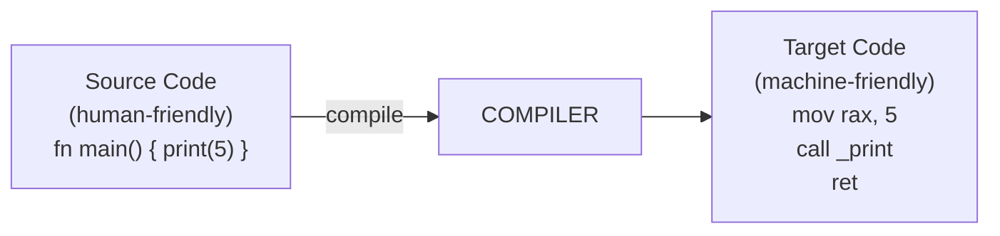
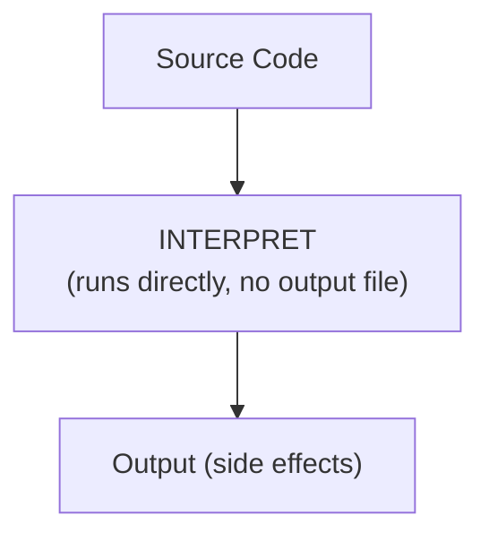
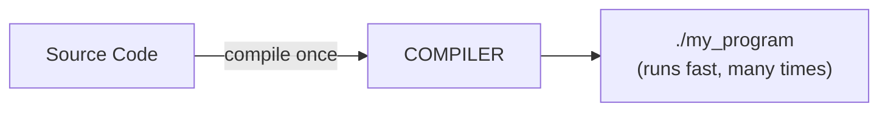
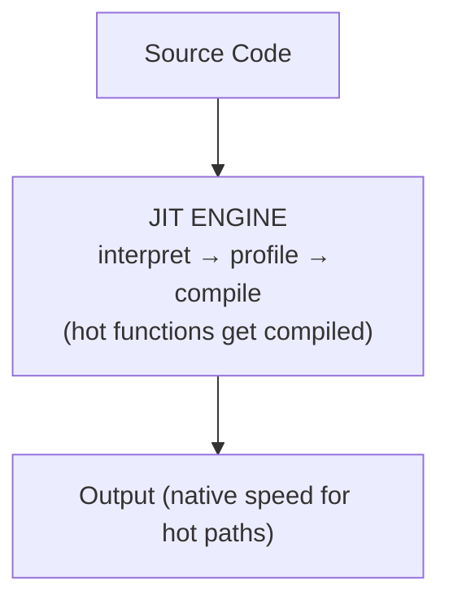
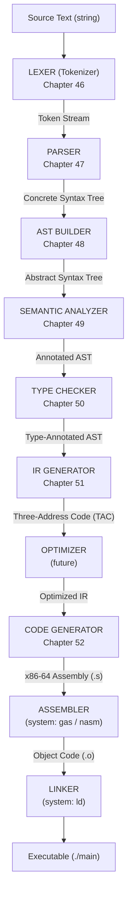
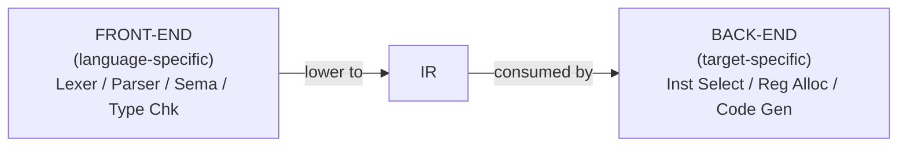
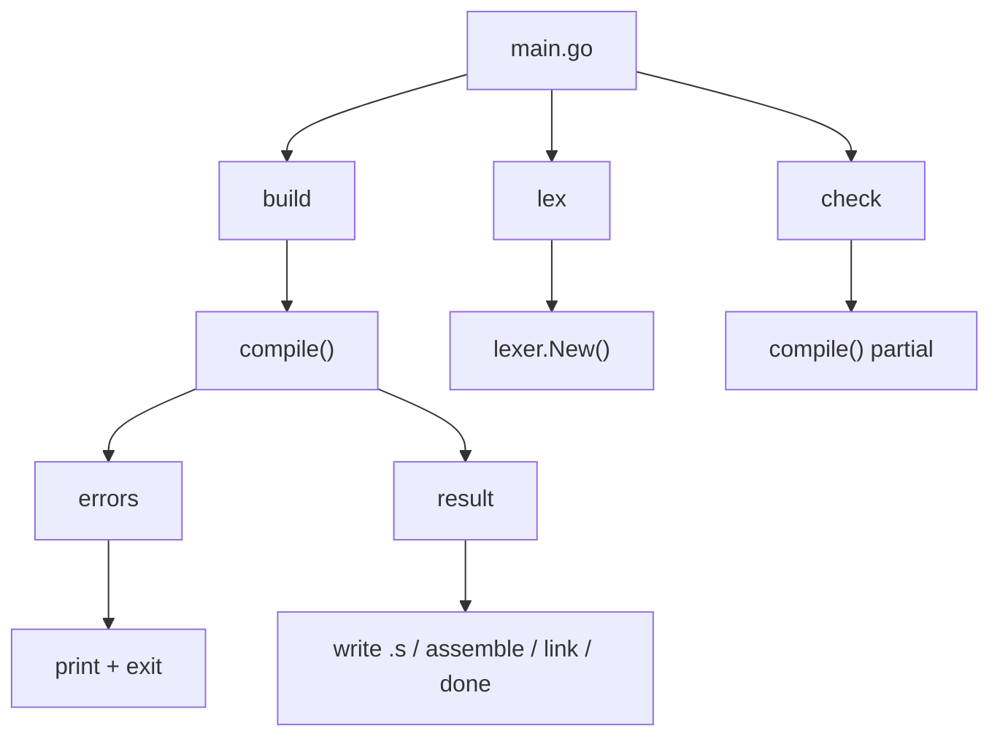

# Chapter 45: Introduction to Compilers — The Big Picture

> "Any sufficiently advanced technology is indistinguishable from magic. A compiler is exactly that — until you build one yourself."

---

## Overview

You have spent the previous volumes learning the foundations: how computers work at the silicon level, how operating systems manage processes and memory, how algorithms solve problems efficiently, and how formal languages and automata define what is even *computable*. Now we arrive at the summit of this mountain. This chapter introduces the compiler — the program that translates human-readable source code into machine instructions that a processor can execute.

By the end of this volume, you will have built **Astra**, a complete compiled programming language, from scratch, in Go. This chapter gives you the full architectural map so that every subsequent chapter has clear context. Think of this as the architect's blueprint before construction begins.

---

## What We're Building

In this chapter we design the top-level structure of **astrac** — the Astra compiler binary. We define every package, every phase, and the orchestration code in `main.go` that ties everything together. By the end of the chapter you will have a running (though mostly stubbed) compiler skeleton.

---

## Table of Contents

1. What Is a Compiler?
2. Compiler vs Interpreter vs JIT
3. The Phases of a Compiler — A Complete Walkthrough
4. Front-End vs Back-End: Why the Split?
5. Single-Pass vs Multi-Pass Compilers
6. Error Recovery: Reporting All the Problems
7. Compiler Correctness
8. Famous Real-World Compilers
9. The Bootstrap Problem
10. Astra Build Milestone: The astrac Architecture
11. Exercises
12. Summary

---

## 1. What Is a Compiler?

At its core, a compiler is a **translator**. It reads a program written in one language (the *source language*) and produces an equivalent program in another language (the *target language*), preserving the meaning of the original.



The word "equivalent" is doing a lot of work in that definition. It means: if you run the source program, and you run the compiled program, they produce the same observable results (same output, same side effects) for all valid inputs. Compilers do not change what a program *does* — only what *language* it is expressed in.

Notice what makes this hard: the source language (Astra) is designed for humans. It has named variables, structured loops, function abstractions. The target language (x86-64 assembly) is designed for silicon. It has numbered registers, unconditional jumps, raw memory addresses. The compiler must bridge an enormous conceptual gap.

**An analogy:** Imagine translating a Shakespeare play from English to Japanese. You cannot translate word-by-word — English sentence structure differs fundamentally from Japanese. You must understand the *meaning* at a deep level, then re-express that meaning in the idioms of the target language. A compiler does exactly this, but for programs instead of poetry.

---

## 2. Compiler vs Interpreter vs JIT

Three major strategies exist for executing a program written in a high-level language. Understanding the tradeoffs explains why different languages make different choices.

### The Interpreter

An interpreter reads the source code and *executes it directly*, instruction by instruction, without producing a separate output file.



**Advantages:** Fast startup (no compilation step), easy to add interactivity (REPL), simpler implementation.

**Disadvantages:** Every time you run the program, the interpreter must re-parse and re-analyze the source. Typically 10x to 100x slower than compiled code.

**Examples:** Python (CPython), Ruby (MRI), Bash.

### The Compiler

A compiler does all its work *once*, producing a standalone executable. Execution later is as fast as the hardware allows — no interpreter overhead.



**Advantages:** Fast execution, optimizations possible (the compiler can analyze the whole program), type errors caught before running.

**Disadvantages:** Compilation takes time, compiled binary is platform-specific.

**Examples:** GCC (C/C++), Clang, Go compiler (gc), rustc.

### JIT — Just-In-Time Compilation

JIT is the hybrid: start interpreting, but identify the "hot" code paths (frequently executed loops and functions) and compile those to native code *on the fly*, while the program is running.



**Advantages:** Startup as fast as an interpreter, peak performance close to a compiled language, can specialize code for actual runtime values.

**Disadvantages:** Warmup time (first few executions are slow), complex implementation, memory overhead (both bytecode and native code exist at once).

**Examples:** Java HotSpot JVM, V8 JavaScript engine, PyPy, LuaJIT.

**Astra's choice:** We build a traditional ahead-of-time (AOT) compiler. Simplest to understand, best performance, appropriate for a systems language.

---

## 3. The Phases of a Compiler — A Complete Walkthrough

Modern compilers are structured as a *pipeline*. Each phase transforms the representation of the program into something closer to machine code. Think of an assembly line: raw steel enters one end; a finished car leaves the other. Each station does one specific job.

Here is the complete pipeline we will build for Astra:



Let's walk through each phase with a concrete example. We'll trace this Astra snippet through the entire pipeline:

```astra
let x = 2 + 3
print(x)
```

### Phase 1: Lexical Analysis (Lexer / Tokenizer)

The lexer reads the raw source text — a sequence of characters — and groups them into *tokens*. A token is the smallest meaningful unit: a keyword, a number, an identifier, an operator.

```
Input:  "let x = 2 + 3\nprint(x)\n"

Output tokens:
  LET        "let"
  IDENT      "x"
  EQUALS     "="
  INT_LIT    "2"   (value: 2)
  PLUS       "+"
  INT_LIT    "3"   (value: 3)
  NEWLINE
  IDENT      "print"
  LPAREN     "("
  IDENT      "x"
  RPAREN     ")"
  NEWLINE
  EOF
```

The lexer discards whitespace and comments — they carry no semantic meaning. It tracks line and column numbers for error reporting.

### Phase 2: Syntax Analysis (Parser)

The parser reads the token stream and checks that it conforms to the *grammar* of Astra. It produces a tree that represents the grammatical structure.

```
Input:  [LET] [IDENT "x"] [=] [INT "2"] [+] [INT "3"]

Parse Tree:
  VarDeclaration
    name: "x"
    value: BinaryExpression
              left:  IntLiteral(2)
              op:    "+"
              right: IntLiteral(3)
```

The parser catches syntax errors: missing semicolons, unbalanced parentheses, malformed expressions.

### Phase 3: AST Construction

The Abstract Syntax Tree is a cleaned-up version of the parse tree. It removes redundant grammar nodes (like parentheses that only existed to define precedence) and focuses on *semantically meaningful* structure.

```
AST:
  Program
    └─ VarDecl { name: "x", value: BinaryExpr(2, +, 3) }
    └─ CallExpr { fn: "print", args: [Ident("x")] }
```

### Phase 4: Semantic Analysis

The semantic analyzer checks that the program *makes sense*, not just that it's syntactically correct.

- Is `x` defined before it is used in `print(x)`?
- Are there any name conflicts?
- Is `print` actually a function?

This phase builds and maintains the *symbol table* — a dictionary mapping names to their definitions.

### Phase 5: Type Checking

The type checker annotates every expression with its type and verifies that types are consistent.

```
BinaryExpr(2 + 3):
  left:  IntLiteral(2) → type: int
  right: IntLiteral(3) → type: int
  op:    +
  result type: int (int + int = int ✓)

VarDecl x = (2+3):
  inferred type of x: int

CallExpr print(x):
  x has type int
  print accepts int ✓
```

### Phase 6: IR Generation

The IR generator lowers the AST into three-address code — a flat list of simple instructions, each doing at most one operation.

```
t1 = 2
t2 = 3
t3 = t1 + t2
x  = t3
param x
call print
```

### Phase 7: Optimization (future)

The optimizer transforms the IR to be more efficient without changing the result. For example, constant folding can reduce `t1 = 2; t2 = 3; t3 = t1 + t2` to `t3 = 5` at compile time.

### Phase 8: Code Generation

The code generator translates IR to x86-64 assembly instructions.

```asm
    mov     rdi, 5          ; load x = 5 into arg register
    call    _astra_print_int
```

### Phases 9 & 10: Assembly and Linking

We invoke the system assembler (`gas`) to convert `.s` text into a `.o` binary, then invoke the system linker (`ld`) to combine `.o` files and produce the final executable.

---

## 4. Front-End vs Back-End: Why the Split?

Compiler engineers divide the pipeline into two halves at the IR boundary.



**The front-end** is *language-specific*. It understands Astra's syntax and type system. If we later want to support a different syntax (like a Lisp-style Astra), we replace only the front-end.

**The back-end** is *target-specific*. It understands x86-64 registers and instructions. If we later want to support ARM (like Apple M-series chips), we replace only the back-end.

**The IR is the contract between them.** This is the secret behind LLVM's power: hundreds of language front-ends (C, C++, Rust, Swift, Julia, Haskell...) all lower to the same LLVM IR. Then LLVM's back-end targets x86-64, ARM, RISC-V, WebAssembly, and more. Build one good IR, and you get all combinations for free.

For Astra, we define our own simple TAC IR. Once you understand the principles, adopting LLVM as a back-end would be a natural next step.

---

## 5. Single-Pass vs Multi-Pass Compilers

Early compilers (1950s-60s) were *single-pass*: they read the source once, emitting code as they went, with no lookahead. This was necessary because memory was scarce — you couldn't store the whole program as a tree.

**Problem:** In a single-pass compiler, you cannot use a function before you declare it.

```c
/* This would fail in a single-pass compiler: */
int main() {
    int result = add(3, 4);  /* add not seen yet! */
}
int add(int a, int b) { return a + b; }
```

**Multi-pass compilers** (the modern approach) make multiple passes over the program:
1. Pass 1: Build AST (lex + parse)
2. Pass 2: Collect all top-level declarations into symbol table
3. Pass 3: Resolve names and check types
4. Pass 4: Generate IR
5. Pass 5: Optimize IR
6. Pass 6: Generate code

Each pass sees the *complete* program, so forward references (using something before defining it) work naturally.

**Astra uses multi-pass.** This allows you to write:

```astra
fn main() {
    let result = add(3, 4)  // add defined later — that's OK
}

fn add(a: int, b: int) -> int { return a + b }
```

The tradeoff: multi-pass requires storing the entire program in memory as an AST. This is fine for any modern computer, even for very large programs.

---

## 6. Error Recovery: Reporting All the Problems

A compiler that reports only the first error and then stops is frustrating. Real compilers try to *continue after errors* so they can report as many problems as possible in one compilation.

**Error recovery strategies:**

**Panic mode:** When a syntax error is detected, discard tokens until a *synchronization point* is found (typically a semicolon, closing brace, or the start of a new statement). Then resume parsing.

```
fn main() {
    let x = 2 +     ← syntax error: missing right operand
    let y = 3       ← parser syncs here, continues
    print(y)        ← this is reported correctly
}
```

**Error productions:** The grammar explicitly includes rules for common mistakes, allowing the parser to recognize and diagnose them gracefully.

**Error nodes in the AST:** Instead of crashing, the parser inserts a special `ErrorNode` in the AST. Subsequent phases skip error nodes, preventing cascading spurious errors.

**Astra's approach:** We use panic-mode recovery at the statement level. Each phase collects errors into a `DiagnosticEngine` rather than immediately halting. After each phase, if errors exist, we print them all and stop.

```go
type Diagnostic struct {
    Level   DiagLevel   // Error, Warning, Note
    Message string
    Pos     token.Pos   // file, line, column
}

type DiagnosticEngine struct {
    diagnostics []Diagnostic
}

func (d *DiagnosticEngine) Error(msg string, pos token.Pos) {
    d.diagnostics = append(d.diagnostics, Diagnostic{
        Level:   DiagError,
        Message: msg,
        Pos:     pos,
    })
}

func (d *DiagnosticEngine) HasErrors() bool {
    for _, diag := range d.diagnostics {
        if diag.Level == DiagError { return true }
    }
    return false
}
```

---

## 7. Compiler Correctness

What does it mean for a compiler to be *correct*?

**Semantic preservation:** For every valid program P written in the source language, the compiled program P' must produce the same observable behavior as interpreting P.

This sounds obvious, but it's subtle:

- **Undefined behavior:** C compilers are allowed to produce *any* output for programs with undefined behavior (like signed integer overflow). This is why GCC can "optimize" your safety check away.
- **Order of evaluation:** Does `f() + g()` evaluate `f` before `g`? The compiled code must match the language spec.
- **Memory model:** Multi-threaded programs — does the compiler's reordering of instructions violate the memory model?

**Proof of correctness:** Mathematically proving a compiler correct is an active research area. The CompCert project proved their C compiler correct using the Coq proof assistant. This took approximately 100 person-years of work.

**Testing for correctness in practice:** Most production compilers use:
- **Regression test suites:** thousands of programs with known correct output
- **Fuzzing:** automatically generating random programs and checking that compiler output matches a reference interpreter
- **Differential testing:** compile the same program with two compilers, check they produce the same output

For Astra, we write a test suite: for each test, we have a `.as` source file and a `.expected` file. The test runner compiles and runs the source and checks the output matches expected.

---

## 8. Famous Real-World Compilers

Understanding real compilers contextualizes what we are building:

**GCC — GNU Compiler Collection (1987 — present)**
Supports C, C++, Fortran, Ada, and more. Targets 40+ architectures. The most widely-used open-source compiler. Known for excellent optimization. Extremely complex codebase (~10 million lines of C).

**Clang/LLVM (2000 — present)**
LLVM is a compiler infrastructure project (IR + back-ends). Clang is the C/C++/Objective-C front-end. Apple uses it for all Apple platforms. Rust uses LLVM as its back-end. Much cleaner codebase than GCC. LLVM IR is worth studying as a reference IR design.

**javac + JVM HotSpot**
`javac` compiles Java source to JVM bytecode (a portable IR). The JVM then JIT-compiles hot bytecode to native code. This two-stage approach enables platform independence ("write once, run anywhere") while achieving good performance.

**rustc**
The Rust compiler. Front-end written in Rust, back-end via LLVM. Famously complex due to the borrow checker (its semantic analysis phase must verify memory ownership rules). Compilation is slow because it does so much analysis. One of the most sophisticated production compilers.

**go build**
Go's compiler, written in Go. Extremely fast — Go was designed for fast compilation. Ahead-of-time, produces statically linked binaries by default. Simple, readable implementation.

**Our Astra compiler draws most inspiration from go build:** simple, fast, written in Go, produces statically-linked executables.

---

## 9. The Bootstrap Problem

Here is a delightful chicken-and-egg puzzle: **if you write a compiler in its own language, how do you compile the compiler?**

```
You want to write astrac in Astra.
But to run astrac, you need astrac compiled.
But to compile astrac, you need astrac running.
```

This is the **bootstrap problem**.

**The historical solution — three-stage bootstrap (used by GCC and Go):**

```
Stage 0: Write an initial compiler in some already-existing language.
         (For Go: the first Go compiler was written in C.)

Stage 1: Use Stage 0 to compile the compiler source.
         C_compiler compiles go_compiler.go → go_compiler_v1

Stage 2: Use Stage 1 to compile the compiler source again.
         go_compiler_v1 compiles go_compiler.go → go_compiler_v2

Stage 3: go_compiler_v2 should be bit-for-bit identical to go_compiler_v1.
         If it is, the bootstrap is complete. If not, there's a bug.
```

**Go's actual history:**
- Go 1.4 compiler was written in C
- Go 1.5 introduced the Go compiler written in Go (compiled using Go 1.4 which was written in C)
- Since then, you need a previous version of Go to build a new version of Go

**Rust's history:**
- Early Rust compiler was written in OCaml
- Rust 0.9 (2014) introduced the Rust compiler written in Rust
- Today building Rust from scratch requires downloading a pre-compiled Rust binary as the "stage 0" compiler

**Ken Thompson's Trust Attack (1984):** In his Turing Award lecture, Thompson showed that even if you bootstrap correctly, a malicious compiler could insert backdoors into compiled programs — including into the compiler itself — and the attack would survive even if you compiled from clean source. This is a foundational insight into the limits of software verification. (Look up "Reflections on Trusting Trust".)

**For Astra:** We write `astrac` in Go. No bootstrap problem — we already have Go installed. If we later wanted to write `astrac` in Astra, we would use the Go-based `astrac` as our stage-0 compiler.

---

## 10. Astra Build Milestone: The astrac Architecture

Now we design the complete architecture of the Astra compiler. This is the skeleton that all subsequent chapters fill in.

### Directory Structure

```
astrac/
├── main.go              ← CLI entry point
├── go.mod               ← Go module definition
├── lexer/
│   ├── lexer.go         ← Lexer implementation
│   ├── token.go         ← Token types and definitions
│   └── lexer_test.go    ← Tests
├── parser/
│   ├── parser.go        ← Recursive descent + Pratt parser
│   └── parser_test.go
├── ast/
│   ├── ast.go           ← All AST node type definitions
│   ├── visitor.go       ← Visitor interface
│   └── printer.go       ← AST pretty printer
├── sema/
│   ├── resolver.go      ← Name resolution / scope analysis
│   ├── typechecker.go   ← Type checking
│   ├── symtable.go      ← Symbol table
│   └── types/
│       └── types.go     ← Type representations
├── ir/
│   ├── ir.go            ← IR instruction types
│   ├── builder.go       ← IR builder (lowers AST to IR)
│   └── printer.go       ← IR pretty printer (for debugging)
├── codegen/
│   ├── x86_64.go        ← x86-64 code generator
│   ├── regalloc.go      ← Register allocator (linear scan)
│   └── abi.go           ← System V AMD64 ABI conventions
├── runtime/
│   ├── runtime.c        ← Runtime library (C)
│   └── runtime.h        ← Runtime header
└── stdlib/
    └── io.as            ← Standard library (Astra source)
```

### The Go Module File

```go
// go.mod
module github.com/astra-lang/astrac

go 1.21
```

### The Main Orchestration File

```go
// main.go
package main

import (
    "fmt"
    "os"
    "os/exec"
    "path/filepath"
    "strings"

    "github.com/astra-lang/astrac/ast"
    "github.com/astra-lang/astrac/codegen"
    "github.com/astra-lang/astrac/ir"
    "github.com/astra-lang/astrac/lexer"
    "github.com/astra-lang/astrac/parser"
    "github.com/astra-lang/astrac/sema"
)

func main() {
    if len(os.Args) < 3 {
        usage()
        os.Exit(1)
    }
    command := os.Args[1]
    switch command {
    case "build":
        buildFile(os.Args[2])
    case "run":
        runFile(os.Args[2])
    case "check":
        checkFile(os.Args[2])
    case "lex":
        lexFile(os.Args[2])  // debug: show tokens
    case "parse":
        parseFile(os.Args[2]) // debug: show AST
    case "ir":
        irFile(os.Args[2])   // debug: show IR
    default:
        fmt.Fprintf(os.Stderr, "unknown command: %s\n", command)
        usage()
        os.Exit(1)
    }
}

func usage() {
    fmt.Fprintln(os.Stderr, "usage: astrac <command> <file.as>")
    fmt.Fprintln(os.Stderr, "commands:")
    fmt.Fprintln(os.Stderr, "  build  - compile to executable")
    fmt.Fprintln(os.Stderr, "  run    - compile and run")
    fmt.Fprintln(os.Stderr, "  check  - type-check only")
    fmt.Fprintln(os.Stderr, "  lex    - debug: dump tokens")
    fmt.Fprintln(os.Stderr, "  parse  - debug: dump AST")
    fmt.Fprintln(os.Stderr, "  ir     - debug: dump IR")
}

// CompileResult holds the output of the compile pipeline.
type CompileResult struct {
    Tokens    []lexer.Token
    AST       *ast.Program
    IR        *ir.Program
    Assembly  string
}

// compile runs the full compilation pipeline on source text.
func compile(source, filename string) (*CompileResult, []error) {
    result := &CompileResult{}
    var allErrors []error

    // ── Phase 1: Lexical Analysis ──────────────────────────────────────────
    l := lexer.New(source, filename)
    tokens, err := l.Tokenize()
    if err != nil {
        return nil, []error{err}
    }
    result.Tokens = tokens

    // ── Phase 2 & 3: Parsing → AST ────────────────────────────────────────
    p := parser.New(tokens, filename)
    program, parseErrs := p.Parse()
    if len(parseErrs) > 0 {
        for _, e := range parseErrs { allErrors = append(allErrors, e) }
        return nil, allErrors
    }
    result.AST = program

    // ── Phase 4: Semantic Analysis (name resolution) ──────────────────────
    resolver := sema.NewResolver(filename)
    resolveErrs := resolver.Resolve(program)
    if len(resolveErrs) > 0 {
        for _, e := range resolveErrs { allErrors = append(allErrors, e) }
        return nil, allErrors
    }

    // ── Phase 5: Type Checking ────────────────────────────────────────────
    checker := sema.NewTypeChecker(resolver.Symbols(), filename)
    typeErrs := checker.Check(program)
    if len(typeErrs) > 0 {
        for _, e := range typeErrs { allErrors = append(allErrors, e) }
        return nil, allErrors
    }

    // ── Phase 6: IR Generation ────────────────────────────────────────────
    gen := ir.NewBuilder(checker.Symbols())
    irProgram := gen.Lower(program)
    result.IR = irProgram

    // ── Phase 7: Code Generation ──────────────────────────────────────────
    cg := codegen.New(irProgram)
    asm := cg.Generate()
    result.Assembly = asm

    return result, nil
}

// buildFile compiles a .as file to an executable.
func buildFile(path string) {
    source, err := os.ReadFile(path)
    if err != nil {
        fatalf("cannot read %s: %v", path, err)
    }

    result, errs := compile(string(source), path)
    if len(errs) > 0 {
        for _, e := range errs { fmt.Fprintln(os.Stderr, e) }
        os.Exit(1)
    }

    // Write assembly to a temp file
    base := strings.TrimSuffix(filepath.Base(path), ".as")
    asmFile := base + ".s"
    objFile := base + ".o"
    exeFile := "./" + base

    if err := os.WriteFile(asmFile, []byte(result.Assembly), 0644); err != nil {
        fatalf("cannot write assembly: %v", err)
    }

    // Assemble: as → .o
    if err := runCmd("as", asmFile, "-o", objFile); err != nil {
        fatalf("assembler failed: %v", err)
    }

    // Link: ld → executable (with runtime)
    if err := runCmd("gcc", objFile, "-o", exeFile, "runtime/runtime.o"); err != nil {
        fatalf("linker failed: %v", err)
    }

    // Cleanup intermediate files
    os.Remove(asmFile)
    os.Remove(objFile)

    fmt.Printf("compiled %s → %s\n", path, exeFile)
}

// runFile compiles and immediately executes.
func runFile(path string) {
    buildFile(path)
    base := strings.TrimSuffix(filepath.Base(path), ".as")
    cmd := exec.Command("./" + base)
    cmd.Stdout = os.Stdout
    cmd.Stderr = os.Stderr
    if err := cmd.Run(); err != nil {
        os.Exit(1)
    }
}

// checkFile runs only the front-end (no code gen).
func checkFile(path string) {
    source, err := os.ReadFile(path)
    if err != nil { fatalf("cannot read %s: %v", path, err) }
    _, errs := compile(string(source), path)
    if len(errs) > 0 {
        for _, e := range errs { fmt.Fprintln(os.Stderr, e) }
        os.Exit(1)
    }
    fmt.Printf("%s: OK\n", path)
}

// lexFile dumps the token stream (debug mode).
func lexFile(path string) {
    source, err := os.ReadFile(path)
    if err != nil { fatalf("cannot read %s: %v", path, err) }
    l := lexer.New(string(source), path)
    tokens, lerr := l.Tokenize()
    if lerr != nil { fatalf("lex error: %v", lerr) }
    for _, tok := range tokens {
        fmt.Printf("%-15s %q\n", tok.Type, tok.Lexeme)
    }
}

// parseFile dumps the AST (debug mode).
func parseFile(path string) {
    source, err := os.ReadFile(path)
    if err != nil { fatalf("cannot read %s: %v", path, err) }
    l := lexer.New(string(source), path)
    tokens, _ := l.Tokenize()
    p := parser.New(tokens, path)
    program, errs := p.Parse()
    if len(errs) > 0 {
        for _, e := range errs { fmt.Fprintln(os.Stderr, e) }
        os.Exit(1)
    }
    printer := ast.NewPrinter()
    fmt.Println(printer.Print(program))
}

// irFile dumps the IR (debug mode).
func irFile(path string) {
    source, err := os.ReadFile(path)
    if err != nil { fatalf("cannot read %s: %v", path, err) }
    result, errs := compile(string(source), path)
    if len(errs) > 0 {
        for _, e := range errs { fmt.Fprintln(os.Stderr, e) }
        os.Exit(1)
    }
    fmt.Println(ir.Print(result.IR))
}

func runCmd(name string, args ...string) error {
    cmd := exec.Command(name, args...)
    cmd.Stdout = os.Stdout
    cmd.Stderr = os.Stderr
    return cmd.Run()
}

func fatalf(format string, args ...interface{}) {
    fmt.Fprintf(os.Stderr, "astrac: "+format+"\n", args...)
    os.Exit(1)
}
```

### The Error Type

```go
// errors.go (in the root package or a shared errors package)
package compiler

import (
    "fmt"
    "github.com/astra-lang/astrac/lexer"
)

// CompileError is a structured compiler error with position information.
type CompileError struct {
    Phase   string       // "lexer", "parser", "sema", "types"
    Message string
    Pos     lexer.Pos
}

func (e *CompileError) Error() string {
    return fmt.Sprintf("%s:%d:%d: %s: %s",
        e.Pos.File, e.Pos.Line, e.Pos.Column, e.Phase, e.Message)
}

// Pos tracks source location for every token and AST node.
type Pos struct {
    File   string
    Line   int
    Column int
}
```

### The Pipeline Data Flow



### Initializing the Project

To follow along, create the project:

```bash
mkdir -p astrac/{lexer,parser,ast,sema/types,ir,codegen,runtime,stdlib}
cd astrac
go mod init github.com/astra-lang/astrac
# Create stub files so it compiles
touch main.go lexer/lexer.go lexer/token.go parser/parser.go \
      ast/ast.go sema/resolver.go sema/typechecker.go sema/symtable.go \
      sema/types/types.go ir/ir.go ir/builder.go codegen/x86_64.go
```

Each subsequent chapter fills in one of these packages with complete, working code.

---

## 11. Exercises

1. **Compiler identification:** For each language below, identify whether it uses compilation, interpretation, or JIT. If compilation, is it AOT or deferred? Research the actual implementation.
   - Python (CPython), Python (PyPy), Java, JavaScript (Node.js), C#, Go, Bash, Lua.

2. **Phases identification:** Given the following compiler error messages, identify which phase of the compiler likely produced each error:
   - `unexpected character '#'`
   - `expected ')' but found ';'`
   - `undefined variable 'foo'`
   - `cannot use string as int`
   - `cannot divide by zero` (at compile time, from constant folding)

3. **Front-end/back-end separation:** Suppose you have 4 source languages and 3 target platforms. Without an IR: how many compiler components do you need? With a shared IR: how many? Write the formula.

4. **Error recovery exercise:** Write a short Astra program with 3 intentional syntax errors in different statements. Describe what panic-mode error recovery would do for each error and what the parser would report.

5. **Bootstrap exercise:** Describe in your own words how you would bootstrap the Astra compiler if you decided to rewrite `astrac` in Astra itself. What are the stages? What is the "seed" compiler?

6. **Compiler correctness:** Why is it insufficient to test a compiler by running it on a few programs and checking the output looks right? What kinds of bugs would this fail to catch?

7. **IR benefits:** An IR must represent the same computation as the source. If you have this Astra source:
   ```astra
   let z = (x + y) * 2
   ```
   Write the three-address code IR for this expression. (You will implement this for real in Chapter 51.)

8. **Research:** Read about LLVM IR. Find one example of an optimization that LLVM performs on its IR. Describe the optimization in plain language.

---

## 12. Summary

| Concept | Key Idea |
|---|---|
| Compiler | Translates source → target, preserving semantics |
| Interpreter | Executes source directly, no output file |
| JIT | Compile hot paths at runtime |
| Compiler phases | Lex → Parse → AST → Sema → Types → IR → Codegen |
| Front-end | Language-specific phases (up to IR) |
| Back-end | Target-specific phases (from IR down) |
| IR | The bridge; enables multiple source → target combinations |
| Multi-pass | Multiple traversals of the program enable forward references |
| Error recovery | Continue after errors to report multiple problems |
| Bootstrap | Use a previous compiler to compile a new compiler of the same language |
| astrac | Go binary: lexer → parser → sema → typechecker → IR → x86-64 |

The compiler pipeline we have designed is not simplified for teaching — it is the real architecture used by production compilers like Go and Rust. Every chapter from here fills in one piece of this blueprint with working, tested Go code. By Chapter 52, you will run `astrac build main.as` and get a real x86-64 executable. Let's begin.
