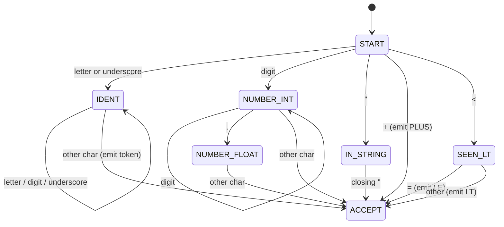

# Chapter 46: Lexical Analysis — Breaking Source Code Into Tokens

> "Before you can understand a sentence, you must first recognize the words. The lexer teaches the compiler to read."

---

## Overview

Imagine trying to understand a sentence if all the characters were just a raw stream with no boundaries: `thequickbrownfox`. You'd first need to split it into words: `the`, `quick`, `brown`, `fox`. That is exactly what a lexer does with source code. It takes a flat string of characters and breaks it into *tokens* — the smallest meaningful units of the language.

This is the first phase of every compiler, and it's deceptively simple. A lexer for a realistic language needs to handle keywords, identifiers, integers, floats, strings, multi-character operators like `<=` and `..`, line numbers, error recovery, and more. By the end of this chapter, you will have built a **complete, working Astra lexer** in Go.

---

## What We're Building

A Go package `lexer/` that takes an Astra source string as input and produces a slice of `Token` values as output. The rest of the compiler consumes this token slice rather than the raw source.

---

## Table of Contents

1. What Is a Token?
2. Categories of Tokens in Astra
3. The Lexer's Job
4. How a DFA-Based Lexer Works
5. Maximal Munch
6. Tracking Line and Column Numbers
7. The Token Struct
8. Handling Identifiers and Keywords
9. Handling Number Literals
10. Handling String Literals
11. Handling Operators (Single and Multi-Character)
12. Error Handling
13. Hand-Written vs Generated Lexers
14. Astra Build Milestone: Complete Lexer Implementation
15. Exercises
16. Summary

---

## 1. What Is a Token?

A **token** is the smallest meaningful unit of source code. The key word is *meaningful* — individual characters usually have no meaning by themselves; they gain meaning when grouped.

```
Source text:   let  x  =  2  +  3
               ───  ─  ─  ─  ─  ─
Tokens:        KW   ID  =  INT + INT
```

Compare this to natural language. In English, the sentence "The dog barked" has the characters `T`, `h`, `e`, ` `, `d`, `o`, `g`... but the meaningful units are the words: "The", "dog", "barked". The lexer is the program that identifies those word boundaries.

A token has three components:
- **Type:** what kind of token is it? (keyword, number, operator...)
- **Lexeme:** the raw characters that make up this token (`"let"`, `"42"`, `"+="`)
- **Value:** sometimes the lexeme is converted to a native Go value (the string `"42"` becomes the integer `42`)
- **Position:** where in the source file does this token appear? (for error messages)

---

## 2. Categories of Tokens in Astra

Astra has the following token categories:

**Keywords** — reserved words with special meaning:
```
fn    let    if    else    for    while    in    return
true  false  struct    impl    import    pub    mut
break    continue    match    as
```

**Identifiers** — user-defined names:
```
x    main    add    Point    myVariable    snake_case    CamelCase
```
Rule: starts with a letter or underscore, followed by letters, digits, or underscores.

**Integer literals:**
```
42        0        1000000
0xFF      0b1010   0o755      ← hex, binary, octal
```

**Float literals:**
```
3.14      0.5      1.0e10     2.718281828
```

**String literals:**
```
"hello"   "world\n"   "tab\there"   "quote\""   ""
```

**Boolean literals:**
```
true   false
```

**Operators:**
```
+   -   *   /   %         ← arithmetic
==  !=  <   >   <=  >=    ← comparison
&&  ||  !                 ← logical
=   +=  -=  *=  /=        ← assignment
->  ..  ::                ← special: arrow, range, path
&   |   ^   <<  >>        ← bitwise
```

**Punctuation:**
```
(   )   {   }   [   ]   ,   ;   :   .
```

**Special:**
```
EOF      ← end of file
ILLEGAL  ← unrecognized character (error)
NEWLINE  ← significant in Astra (like Go, statement terminator)
```

---

## 3. The Lexer's Job

The lexer's contract:
1. Read the source text from left to right, one character at a time
2. Group characters into tokens
3. **Discard** whitespace (spaces, tabs) and comments
4. **Preserve** newlines when they act as statement terminators
5. Track line and column numbers throughout
6. Produce a flat slice of tokens for the parser to consume

The lexer does NOT understand grammar. It does not know that `let x = 5` is a variable declaration. It just sees `LET IDENT(x) ASSIGN INT(5)`. Grammar is the parser's job.

```
Source:  fn add(a: int) -> int { return a + 1 }
          ▼
         Lexer
          ▼
Tokens:  FN IDENT(add) LPAREN IDENT(a) COLON INT_TYPE RPAREN
         ARROW INT_TYPE LBRACE RETURN IDENT(a) PLUS INT(1) RBRACE EOF
```

---

## 4. How a DFA-Based Lexer Works

The lexer is essentially a **Deterministic Finite Automaton (DFA)** — the concept you studied in the Theory of Computation chapter. Each state corresponds to "I'm currently in the middle of recognizing such-and-such token." Transitions happen on each input character.



In a hand-written lexer, we implement this DFA implicitly with `if/switch` statements rather than an explicit table. Each call to `scanToken()` reads one token from the input.

---

## 5. Maximal Munch

The **maximal munch rule** (also called the **longest match rule**) says: when multiple token types could match at the current position, choose the longest one.

Examples:

```
Source: <=
Wrong:  LT (just '<')  then  EQ ('=')
Right:  LE ('<=')         ← maximal munch wins

Source: ..5
Wrong:  DOT DOT INT(5)   ← maybe correct if '..' is a token
Right:  RANGE INT(5)     ← '..' is the range operator

Source: ++
In Astra: ++ is not a valid token
Correct: PLUS PLUS       ← two separate tokens (or error)
```

Implementing maximal munch: when you see `<`, don't emit immediately. Peek at the next character. If it's `=`, consume both and emit `LE`. Otherwise, emit `LT` without consuming the `=`.

```go
case '<':
    if l.peek() == '=' {
        l.advance()   // consume '='
        l.addToken(LE)
    } else {
        l.addToken(LT)
    }
```

---

## 6. Tracking Line and Column Numbers

Good error messages tell the user *exactly* where the error is:

```
main.as:5:12: error: undefined variable 'foo'
        let x = foo + 1
                ^^^
```

To produce these messages, the lexer must track:
- `line`: current line number (starts at 1, increments on each `\n`)
- `column`: current column number (starts at 1, resets to 1 after each `\n`)

```go
func (l *Lexer) advance() byte {
    ch := l.source[l.current]
    l.current++
    if ch == '\n' {
        l.line++
        l.column = 1
    } else {
        l.column++
    }
    return ch
}
```

The token stores the position at its *start*, not its end.

---

## 7. The Token Struct

```go
// lexer/token.go
package lexer

import "fmt"

// TokenType identifies the type of a token.
type TokenType string

const (
    // Literals
    INT_LIT    TokenType = "INT_LIT"
    FLOAT_LIT  TokenType = "FLOAT_LIT"
    STRING_LIT TokenType = "STRING_LIT"
    BOOL_LIT   TokenType = "BOOL_LIT"

    // Identifier
    IDENT TokenType = "IDENT"

    // Keywords
    KW_FN       TokenType = "fn"
    KW_LET      TokenType = "let"
    KW_MUT      TokenType = "mut"
    KW_IF       TokenType = "if"
    KW_ELSE     TokenType = "else"
    KW_FOR      TokenType = "for"
    KW_WHILE    TokenType = "while"
    KW_IN       TokenType = "in"
    KW_RETURN   TokenType = "return"
    KW_TRUE     TokenType = "true"
    KW_FALSE    TokenType = "false"
    KW_STRUCT   TokenType = "struct"
    KW_IMPL     TokenType = "impl"
    KW_IMPORT   TokenType = "import"
    KW_PUB      TokenType = "pub"
    KW_BREAK    TokenType = "break"
    KW_CONTINUE TokenType = "continue"
    KW_MATCH    TokenType = "match"
    KW_AS       TokenType = "as"

    // Arithmetic operators
    PLUS     TokenType = "+"
    MINUS    TokenType = "-"
    STAR     TokenType = "*"
    SLASH    TokenType = "/"
    PERCENT  TokenType = "%"

    // Comparison operators
    EQ_EQ    TokenType = "=="
    BANG_EQ  TokenType = "!="
    LT       TokenType = "<"
    GT       TokenType = ">"
    LT_EQ    TokenType = "<="
    GT_EQ    TokenType = ">="

    // Logical operators
    AND_AND  TokenType = "&&"
    OR_OR    TokenType = "||"
    BANG     TokenType = "!"

    // Assignment operators
    ASSIGN   TokenType = "="
    PLUS_EQ  TokenType = "+="
    MINUS_EQ TokenType = "-="
    STAR_EQ  TokenType = "*="
    SLASH_EQ TokenType = "/="

    // Bitwise operators
    AMPERSAND TokenType = "&"
    PIPE      TokenType = "|"
    CARET     TokenType = "^"
    SHL       TokenType = "<<"
    SHR       TokenType = ">>"

    // Special operators
    ARROW     TokenType = "->"   // -> (return type)
    RANGE     TokenType = ".."   // .. (range)
    COLON_COLON TokenType = "::" // :: (path separator)

    // Punctuation
    LPAREN    TokenType = "("
    RPAREN    TokenType = ")"
    LBRACE    TokenType = "{"
    RBRACE    TokenType = "}"
    LBRACKET  TokenType = "["
    RBRACKET  TokenType = "]"
    COMMA     TokenType = ","
    SEMICOLON TokenType = ";"
    COLON     TokenType = ":"
    DOT       TokenType = "."
    NEWLINE   TokenType = "NEWLINE"

    // Special
    EOF     TokenType = "EOF"
    ILLEGAL TokenType = "ILLEGAL"
)

// Pos records the source location of a token.
type Pos struct {
    File   string
    Line   int
    Column int
}

func (p Pos) String() string {
    return fmt.Sprintf("%s:%d:%d", p.File, p.Line, p.Column)
}

// Token is a single lexed token.
type Token struct {
    Type    TokenType
    Lexeme  string  // raw text from source
    // Parsed literal values (only set for literal tokens)
    IntVal    int64
    FloatVal  float64
    StringVal string
    BoolVal   bool
    Pos       Pos
}

func (t Token) String() string {
    return fmt.Sprintf("Token{%s %q at %s}", t.Type, t.Lexeme, t.Pos)
}

// keywords maps keyword strings to their token type.
var keywords = map[string]TokenType{
    "fn":       KW_FN,
    "let":      KW_LET,
    "mut":      KW_MUT,
    "if":       KW_IF,
    "else":     KW_ELSE,
    "for":      KW_FOR,
    "while":    KW_WHILE,
    "in":       KW_IN,
    "return":   KW_RETURN,
    "true":     KW_TRUE,
    "false":    KW_FALSE,
    "struct":   KW_STRUCT,
    "impl":     KW_IMPL,
    "import":   KW_IMPORT,
    "pub":      KW_PUB,
    "break":    KW_BREAK,
    "continue": KW_CONTINUE,
    "match":    KW_MATCH,
    "as":       KW_AS,
}
```

---

## 8. Handling Identifiers and Keywords

Identifiers and keywords look the same to the lexer at first: both start with a letter. The strategy is:

1. Recognize any sequence starting with a letter/underscore as an identifier candidate
2. Look up the complete lexeme in the keyword table
3. If found → emit the keyword token type; if not → emit IDENT

```
Source: "for"     → Start scanning letters → lexeme = "for" → keywords["for"] = KW_FOR
Source: "format"  → Start scanning letters → lexeme = "format" → not in keywords → IDENT
Source: "foreach" → Start scanning letters → lexeme = "foreach" → not in keywords → IDENT
```

This is correct even for partial matches: `foreach` is an identifier, not `KW_FOR` followed by `IDENT(each)`. Maximal munch handles this automatically.

---

## 9. Handling Number Literals

Integer literals:
```
42          decimal
0xFF        hexadecimal  (prefix 0x or 0X)
0b1010      binary       (prefix 0b or 0B)
0o755       octal        (prefix 0o or 0O)
```

Float literals:
```
3.14        standard decimal float
1.0e10      scientific notation
2.5e-3      with negative exponent
```

The algorithm:
1. See a digit → enter number scanning mode
2. If next chars are `x`/`X` → scan hex digits
3. If next chars are `b`/`B` → scan binary digits
4. Otherwise scan decimal digits
5. If we see a `.` followed by more digits → switch to float mode
6. If we see `e`/`E` → scan optional sign and exponent digits

---

## 10. Handling String Literals

String literals are delimited by double quotes and can contain *escape sequences*:

```
"hello"          → hello
"line1\nline2"   → line1
                   line2
"tab\there"      → tab    here
"quote\""        → quote"
"backslash\\"    → backslash\
"null\0"         → (null byte)
```

The lexer must:
1. Consume the opening `"`
2. Accumulate characters into a buffer
3. On `\`, process the escape sequence
4. On closing `"`, emit the STRING_LIT token with the *processed* value (not the raw lexeme)
5. On `\n` inside a string without `\` prefix: error (unterminated string)

---

## 11. Handling Operators

**Single-character operators** emit their token immediately:
```go
case '+': l.addToken(PLUS)
case '-': l.addToken(MINUS)
case '*': l.addToken(STAR)
```

**Multi-character operators** require peeking at the next character:
```go
case '<':
    if l.peek() == '=' { l.advance(); l.addToken(LT_EQ)  }
    else if l.peek() == '<' { l.advance(); l.addToken(SHL) }
    else { l.addToken(LT) }

case '-':
    if l.peek() == '>' { l.advance(); l.addToken(ARROW)    }
    else if l.peek() == '=' { l.advance(); l.addToken(MINUS_EQ) }
    else { l.addToken(MINUS) }

case '.':
    if l.peek() == '.' { l.advance(); l.addToken(RANGE) }
    else { l.addToken(DOT) }
```

---

## 12. Error Handling

When the lexer encounters a character it doesn't recognize, it:
1. Records the position of the illegal character
2. Emits an `ILLEGAL` token with the character as its lexeme
3. **Continues scanning** (does not stop)

This lets the lexer find multiple errors in one pass.

```go
default:
    l.addToken(ILLEGAL)
    return fmt.Errorf("%s: unexpected character %q", l.pos(), ch)
```

Actually, for Astra we collect errors rather than returning immediately:

```go
default:
    l.errors = append(l.errors, &LexError{
        Message: fmt.Sprintf("unexpected character %q", ch),
        Pos:     l.currentPos(),
    })
    l.addToken(ILLEGAL)
    // continue to next character
```

---

## 13. Hand-Written vs Generated Lexers

**Lexer generators** (like Flex, ANTLR) take a formal description of tokens (as regular expressions) and automatically generate a lexer. This is powerful for quickly prototyping or for very complex token rules.

**Hand-written lexers** (what we build) have several advantages:
- **Better error messages:** You control exactly what the error says
- **Edge cases:** You can handle quirks that don't fit regular expressions cleanly
- **Performance:** A hand-written DFA with switch statements can be extremely fast
- **Education:** You understand exactly what is happening at each step
- **Simplicity:** For a language like Astra, the grammar is simple enough that hand-writing is faster than learning a tool

All major production compilers (GCC, Clang, Go, Rust) use hand-written lexers. We follow that tradition.

---

## 14. Astra Build Milestone: Complete Lexer Implementation

Here is the complete, runnable Astra lexer:

```go
// lexer/lexer.go
package lexer

import (
    "fmt"
    "strconv"
    "strings"
    "unicode"
)

// LexError is a single lexical error.
type LexError struct {
    Message string
    Pos     Pos
}

func (e *LexError) Error() string {
    return fmt.Sprintf("%s: lexer error: %s", e.Pos, e.Message)
}

// Lexer scans Astra source text into tokens.
type Lexer struct {
    source   string
    filename string
    start    int    // byte offset of current token's first character
    current  int    // byte offset of next character to read
    line     int    // current line number (1-based)
    column   int    // current column (1-based)
    // column at start of current token
    startLine   int
    startColumn int
    tokens      []Token
    errors      []*LexError
}

// New creates a Lexer for the given source text.
func New(source, filename string) *Lexer {
    return &Lexer{
        source:   source,
        filename: filename,
        line:     1,
        column:   1,
    }
}

// Tokenize runs the lexer and returns all tokens.
// Returns both tokens and any errors encountered (lexing continues after errors).
func (l *Lexer) Tokenize() ([]Token, []*LexError) {
    for !l.isAtEnd() {
        l.start = l.current
        l.startLine = l.line
        l.startColumn = l.column
        l.scanToken()
    }
    // Always append EOF
    l.tokens = append(l.tokens, Token{
        Type:   EOF,
        Lexeme: "",
        Pos:    Pos{File: l.filename, Line: l.line, Column: l.column},
    })
    return l.tokens, l.errors
}

// ── Core scanning ─────────────────────────────────────────────────────────────

func (l *Lexer) scanToken() {
    ch := l.advance()
    switch ch {
    // Single-character punctuation
    case '(': l.addToken(LPAREN)
    case ')': l.addToken(RPAREN)
    case '{': l.addToken(LBRACE)
    case '}': l.addToken(RBRACE)
    case '[': l.addToken(LBRACKET)
    case ']': l.addToken(RBRACKET)
    case ',': l.addToken(COMMA)
    case ';': l.addToken(SEMICOLON)
    case '%': l.addToken(PERCENT)
    case '^': l.addToken(CARET)
    case '\n': l.addToken(NEWLINE)

    // Whitespace — skip (but not newlines, handled above)
    case ' ', '\t', '\r':
        // do nothing

    // Comments
    case '/':
        if l.match('/') {
            // Line comment: consume until end of line
            for !l.isAtEnd() && l.peek() != '\n' {
                l.advance()
            }
            // Don't emit a token; the newline will be scanned next
        } else if l.match('*') {
            l.scanBlockComment()
        } else if l.match('=') {
            l.addToken(SLASH_EQ)
        } else {
            l.addToken(SLASH)
        }

    // Multi-character operators
    case '+':
        if l.match('=') { l.addToken(PLUS_EQ) } else { l.addToken(PLUS) }
    case '-':
        if l.match('>') { l.addToken(ARROW) } else if l.match('=') { l.addToken(MINUS_EQ) } else { l.addToken(MINUS) }
    case '*':
        if l.match('=') { l.addToken(STAR_EQ) } else { l.addToken(STAR) }
    case '!':
        if l.match('=') { l.addToken(BANG_EQ) } else { l.addToken(BANG) }
    case '=':
        if l.match('=') { l.addToken(EQ_EQ) } else { l.addToken(ASSIGN) }
    case '<':
        if l.match('=') { l.addToken(LT_EQ) } else if l.match('<') { l.addToken(SHL) } else { l.addToken(LT) }
    case '>':
        if l.match('=') { l.addToken(GT_EQ) } else if l.match('>') { l.addToken(SHR) } else { l.addToken(GT) }
    case '&':
        if l.match('&') { l.addToken(AND_AND) } else { l.addToken(AMPERSAND) }
    case '|':
        if l.match('|') { l.addToken(OR_OR) } else { l.addToken(PIPE) }
    case ':':
        if l.match(':') { l.addToken(COLON_COLON) } else { l.addToken(COLON) }
    case '.':
        if l.match('.') { l.addToken(RANGE) } else { l.addToken(DOT) }

    // String literals
    case '"':
        l.scanString()

    // Number literals (starting with digit)
    default:
        if isDigit(ch) {
            l.scanNumber(ch)
        } else if isAlpha(ch) {
            l.scanIdentifier()
        } else {
            l.addError(fmt.Sprintf("unexpected character %q", ch))
        }
    }
}

// ── Number scanning ────────────────────────────────────────────────────────────

func (l *Lexer) scanNumber(first byte) {
    isFloat := false

    // Check for base prefix
    if first == '0' && !l.isAtEnd() {
        switch l.peek() {
        case 'x', 'X':
            l.advance() // consume 'x'
            l.scanHexNumber()
            return
        case 'b', 'B':
            l.advance() // consume 'b'
            l.scanBinaryNumber()
            return
        case 'o', 'O':
            l.advance() // consume 'o'
            l.scanOctalNumber()
            return
        }
    }

    // Decimal integer part
    for !l.isAtEnd() && isDigit(l.peek()) {
        l.advance()
    }

    // Optional fractional part
    if !l.isAtEnd() && l.peek() == '.' {
        // Make sure it's not ".." (range operator)
        if l.peekNext() != '.' {
            isFloat = true
            l.advance() // consume '.'
            for !l.isAtEnd() && isDigit(l.peek()) {
                l.advance()
            }
        }
    }

    // Optional exponent
    if !l.isAtEnd() && (l.peek() == 'e' || l.peek() == 'E') {
        isFloat = true
        l.advance() // consume 'e'
        if !l.isAtEnd() && (l.peek() == '+' || l.peek() == '-') {
            l.advance() // consume sign
        }
        for !l.isAtEnd() && isDigit(l.peek()) {
            l.advance()
        }
    }

    lexeme := l.source[l.start:l.current]
    if isFloat {
        val, err := strconv.ParseFloat(lexeme, 64)
        if err != nil {
            l.addError(fmt.Sprintf("invalid float literal %q: %v", lexeme, err))
            return
        }
        l.addTokenWithValue(FLOAT_LIT, lexeme, 0, val, "", false)
    } else {
        val, err := strconv.ParseInt(lexeme, 10, 64)
        if err != nil {
            l.addError(fmt.Sprintf("invalid integer literal %q: %v", lexeme, err))
            return
        }
        l.addTokenWithValue(INT_LIT, lexeme, val, 0, "", false)
    }
}

func (l *Lexer) scanHexNumber() {
    for !l.isAtEnd() && isHexDigit(l.peek()) {
        l.advance()
    }
    lexeme := l.source[l.start:l.current]
    // Parse the hex part (after "0x")
    val, err := strconv.ParseInt(lexeme[2:], 16, 64)
    if err != nil {
        l.addError(fmt.Sprintf("invalid hex literal %q", lexeme))
        return
    }
    l.addTokenWithValue(INT_LIT, lexeme, val, 0, "", false)
}

func (l *Lexer) scanBinaryNumber() {
    for !l.isAtEnd() && (l.peek() == '0' || l.peek() == '1') {
        l.advance()
    }
    lexeme := l.source[l.start:l.current]
    val, err := strconv.ParseInt(lexeme[2:], 2, 64)
    if err != nil {
        l.addError(fmt.Sprintf("invalid binary literal %q", lexeme))
        return
    }
    l.addTokenWithValue(INT_LIT, lexeme, val, 0, "", false)
}

func (l *Lexer) scanOctalNumber() {
    for !l.isAtEnd() && l.peek() >= '0' && l.peek() <= '7' {
        l.advance()
    }
    lexeme := l.source[l.start:l.current]
    val, err := strconv.ParseInt(lexeme[2:], 8, 64)
    if err != nil {
        l.addError(fmt.Sprintf("invalid octal literal %q", lexeme))
        return
    }
    l.addTokenWithValue(INT_LIT, lexeme, val, 0, "", false)
}

// ── String scanning ────────────────────────────────────────────────────────────

func (l *Lexer) scanString() {
    var buf strings.Builder
    for !l.isAtEnd() && l.peek() != '"' {
        ch := l.advance()
        if ch == '\n' {
            l.addError("unterminated string literal (newline before closing quote)")
            return
        }
        if ch == '\\' {
            // Escape sequence
            if l.isAtEnd() {
                l.addError("unterminated escape sequence")
                return
            }
            esc := l.advance()
            switch esc {
            case 'n':  buf.WriteByte('\n')
            case 't':  buf.WriteByte('\t')
            case 'r':  buf.WriteByte('\r')
            case '"':  buf.WriteByte('"')
            case '\\': buf.WriteByte('\\')
            case '0':  buf.WriteByte(0)
            case 'u':
                // Unicode: \uXXXX
                r := l.scanUnicodeEscape()
                buf.WriteRune(r)
            default:
                l.addError(fmt.Sprintf("unknown escape sequence \\%c", esc))
            }
        } else {
            buf.WriteByte(ch)
        }
    }

    if l.isAtEnd() {
        l.addError("unterminated string literal (reached EOF)")
        return
    }
    l.advance() // consume closing '"'

    lexeme := l.source[l.start:l.current]
    l.addTokenWithValue(STRING_LIT, lexeme, 0, 0, buf.String(), false)
}

func (l *Lexer) scanUnicodeEscape() rune {
    // Expect exactly 4 hex digits: \uXXXX
    var hexStr strings.Builder
    for i := 0; i < 4; i++ {
        if l.isAtEnd() || !isHexDigit(l.peek()) {
            l.addError("invalid unicode escape: expected 4 hex digits")
            return unicode.ReplacementChar
        }
        hexStr.WriteByte(l.advance())
    }
    val, _ := strconv.ParseInt(hexStr.String(), 16, 32)
    return rune(val)
}

// ── Identifier and keyword scanning ────────────────────────────────────────────

func (l *Lexer) scanIdentifier() {
    for !l.isAtEnd() && isAlphaNumeric(l.peek()) {
        l.advance()
    }
    lexeme := l.source[l.start:l.current]

    // Check if it's a keyword
    if kwType, ok := keywords[lexeme]; ok {
        // Handle boolean literals specially
        if kwType == KW_TRUE {
            l.addTokenWithValue(BOOL_LIT, lexeme, 0, 0, "", true)
        } else if kwType == KW_FALSE {
            l.addTokenWithValue(BOOL_LIT, lexeme, 0, 0, "", false)
        } else {
            l.addToken(kwType)
        }
    } else {
        l.addToken(IDENT)
    }
}

// ── Block comment scanning ──────────────────────────────────────────────────────

func (l *Lexer) scanBlockComment() {
    depth := 1 // support nested block comments /* /* */ */
    for !l.isAtEnd() && depth > 0 {
        ch := l.advance()
        if ch == '/' && l.peek() == '*' {
            l.advance()
            depth++
        } else if ch == '*' && l.peek() == '/' {
            l.advance()
            depth--
        }
    }
    if depth > 0 {
        l.addError("unterminated block comment")
    }
}

// ── Token construction helpers ─────────────────────────────────────────────────

func (l *Lexer) addToken(typ TokenType) {
    lexeme := l.source[l.start:l.current]
    l.tokens = append(l.tokens, Token{
        Type:   typ,
        Lexeme: lexeme,
        Pos:    Pos{File: l.filename, Line: l.startLine, Column: l.startColumn},
    })
}

func (l *Lexer) addTokenWithValue(typ TokenType, lexeme string,
    intVal int64, floatVal float64, strVal string, boolVal bool) {
    l.tokens = append(l.tokens, Token{
        Type:      typ,
        Lexeme:    lexeme,
        IntVal:    intVal,
        FloatVal:  floatVal,
        StringVal: strVal,
        BoolVal:   boolVal,
        Pos:       Pos{File: l.filename, Line: l.startLine, Column: l.startColumn},
    })
}

func (l *Lexer) addError(msg string) {
    l.errors = append(l.errors, &LexError{
        Message: msg,
        Pos:     Pos{File: l.filename, Line: l.startLine, Column: l.startColumn},
    })
}

// ── Character navigation ───────────────────────────────────────────────────────

// advance consumes and returns the current character.
func (l *Lexer) advance() byte {
    ch := l.source[l.current]
    l.current++
    if ch == '\n' {
        l.line++
        l.column = 1
    } else {
        l.column++
    }
    return ch
}

// peek returns the current character without consuming it.
func (l *Lexer) peek() byte {
    if l.isAtEnd() { return 0 }
    return l.source[l.current]
}

// peekNext returns the character after the current one (2-char lookahead).
func (l *Lexer) peekNext() byte {
    if l.current+1 >= len(l.source) { return 0 }
    return l.source[l.current+1]
}

// match conditionally consumes a character if it matches expected.
func (l *Lexer) match(expected byte) bool {
    if l.isAtEnd() { return false }
    if l.source[l.current] != expected { return false }
    l.advance()
    return true
}

func (l *Lexer) isAtEnd() bool { return l.current >= len(l.source) }

func (l *Lexer) currentPos() Pos {
    return Pos{File: l.filename, Line: l.line, Column: l.column}
}

// ── Character classification helpers ──────────────────────────────────────────

func isDigit(ch byte) bool     { return ch >= '0' && ch <= '9' }
func isHexDigit(ch byte) bool  { return isDigit(ch) || (ch >= 'a' && ch <= 'f') || (ch >= 'A' && ch <= 'F') }
func isAlpha(ch byte) bool     { return (ch >= 'a' && ch <= 'z') || (ch >= 'A' && ch <= 'Z') || ch == '_' }
func isAlphaNumeric(ch byte) bool { return isAlpha(ch) || isDigit(ch) }
```

### Testing the Lexer

```go
// lexer/lexer_test.go
package lexer

import (
    "testing"
)

func TestBasicTokens(t *testing.T) {
    source := `fn main() {
    let x = 2 + 3
    print(x)
}`
    l := New(source, "test.as")
    tokens, errs := l.Tokenize()

    if len(errs) > 0 {
        t.Fatalf("unexpected errors: %v", errs)
    }

    expected := []TokenType{
        KW_FN, IDENT, LPAREN, RPAREN, LBRACE, NEWLINE,
        KW_LET, IDENT, ASSIGN, INT_LIT, PLUS, INT_LIT, NEWLINE,
        IDENT, LPAREN, IDENT, RPAREN, NEWLINE,
        RBRACE, NEWLINE, EOF,
    }

    if len(tokens) != len(expected) {
        t.Fatalf("expected %d tokens, got %d", len(expected), len(tokens))
    }
    for i, tok := range tokens {
        if tok.Type != expected[i] {
            t.Errorf("token %d: expected %s, got %s", i, expected[i], tok.Type)
        }
    }
}

func TestStringEscapes(t *testing.T) {
    source := `"hello\nworld"`
    l := New(source, "test.as")
    tokens, errs := l.Tokenize()
    if len(errs) > 0 { t.Fatalf("errors: %v", errs) }
    if tokens[0].Type != STRING_LIT { t.Fatal("expected STRING_LIT") }
    if tokens[0].StringVal != "hello\nworld" {
        t.Fatalf("expected escaped value, got %q", tokens[0].StringVal)
    }
}

func TestHexLiteral(t *testing.T) {
    l := New("0xFF", "test.as")
    tokens, errs := l.Tokenize()
    if len(errs) > 0 { t.Fatalf("errors: %v", errs) }
    if tokens[0].IntVal != 255 {
        t.Fatalf("expected 255, got %d", tokens[0].IntVal)
    }
}

func TestRangeOperator(t *testing.T) {
    // Ensure "0..5" is INT(..) RANGE INT(5), not INT(0) DOT DOT INT(5)
    l := New("0..5", "test.as")
    tokens, errs := l.Tokenize()
    if len(errs) > 0 { t.Fatalf("errors: %v", errs) }
    if tokens[1].Type != RANGE {
        t.Fatalf("expected RANGE, got %s", tokens[1].Type)
    }
}

func TestArrowToken(t *testing.T) {
    l := New("-> int", "test.as")
    tokens, _ := l.Tokenize()
    if tokens[0].Type != ARROW { t.Fatalf("expected ARROW") }
}

func TestLineNumbers(t *testing.T) {
    source := "let\nx"
    l := New(source, "test.as")
    tokens, _ := l.Tokenize()
    // 'let' on line 1, 'x' on line 2
    if tokens[0].Pos.Line != 1 { t.Errorf("let: expected line 1, got %d", tokens[0].Pos.Line) }
    if tokens[2].Pos.Line != 2 { t.Errorf("x: expected line 2, got %d", tokens[2].Pos.Line) }
}
```

### Running the Lexer

You can now run:

```bash
cd astrac
go test ./lexer/...   # run lexer tests
astrac lex main.as    # dump token stream for debugging
```

Example output for `fn main() { let x = 2 + 3 }`:

```
fn              "fn"
IDENT           "main"
(               "("
)               ")"
{               "{"
NEWLINE         "\n"
let             "let"
IDENT           "x"
=               "="
INT_LIT         "2"
+               "+"
INT_LIT         "3"
NEWLINE         "\n"
}               "}"
EOF             ""
```

---

## 15. Exercises

1. **Token counting:** Write a Go program that uses the Astra lexer to count how many tokens of each type appear in a given `.as` file. Which token type appears most often in a typical program?

2. **Newlines as statement terminators:** Go uses newlines as implicit semicolons (with specific rules about which newlines count). Study Go's rule: "if the last token before a newline is an identifier, integer literal, floating-point literal, imaginary literal, rune literal, string literal, or one of the tokens `break`, `continue`, `fallthrough`, or `return`, or one of the operators `++`, `--`, `)`, `]`, or `}`." Design an analogous rule for Astra. Implement it as a post-processing step on the token stream.

3. **Lexer for a subset:** Write a lexer for a tiny language with only: integers, `+`, `-`, `*`, `/`, `(`, `)`. Test it on `(3 + 4) * 2`.

4. **Error recovery:** Modify the Astra lexer so that when it sees an unexpected character, it skips forward to the next whitespace and resumes. Run it on the source `let x = 2 @ 3` and verify it still tokenizes the rest correctly.

5. **Comment stripping:** Add support for Astra doc comments: `/// This is a doc comment`. These should emit a DOC_COMMENT token (with the text) rather than being discarded, so that a documentation generator can extract them later.

6. **Escape sequences:** What would need to change in `scanString()` to also support `\xHH` (hex byte escape) sequences like `"\x41"` (which should produce the character `A`)?

7. **Float parsing edge case:** What does the lexer do with the input `1.`? (A `1` followed by a `.`.) Should it be INT(1) DOT, or FLOAT(1.0)? Write a test for this case and decide which behavior is correct for Astra.

8. **DFA diagram:** Draw the complete DFA diagram for recognizing the following subset of Astra tokens: integers, identifiers, `=`, `==`, `<`, `<=`. Include start state, accept states, and all transitions.

---

## 16. Summary

| Concept | Key Idea |
|---|---|
| Token | Smallest meaningful unit: type + lexeme + value + position |
| Lexer job | Characters → tokens; discard whitespace/comments |
| DFA | Implicit state machine; each switch case is a state transition |
| Maximal munch | Always match the longest possible token |
| Keywords | Scan as identifier first, then look up in keyword table |
| Numbers | Decimal/hex/binary/octal/float all handled in scanNumber() |
| Strings | Escape sequences processed to produce actual string value |
| Multi-char ops | Peek at next char to decide: `<` vs `<=`, `-` vs `->` |
| Error recovery | Record errors, continue scanning; report all errors at end |
| Position tracking | line/column maintained in advance(); used for error messages |

The lexer is complete and tested. The parser (Chapter 47) can now consume the token stream and recognize grammatical structure without worrying about individual characters.
