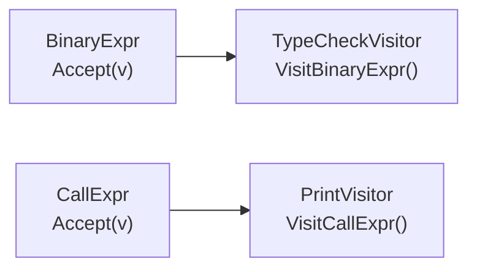

# Chapter 48: Abstract Syntax Trees — The Heart of the Compiler

> "The AST is the compiler's model of the world — a complete, structured, navigable representation of what the programmer wrote."

---

## Overview

Every subsequent phase of the compiler — semantic analysis, type checking, IR generation, and code generation — operates on the AST. The AST is the central data structure, the compiler's internal understanding of your program. Getting it right is critical.

In this chapter we define every AST node type that Astra needs, implement the Visitor pattern for traversing those nodes without modifying them, build an AST pretty printer (an invaluable debugging tool), and discuss the Go design patterns that make working with heterogeneous tree nodes both correct and ergonomic.

---

## What We're Building

The complete `ast/` package: all node type definitions, the `Visitor` interface, and an `ASTPrinter` that can dump a human-readable representation of any Astra AST for debugging.

---

## Table of Contents

1. Parse Tree vs AST: The Real Difference
2. The Three Families of AST Nodes
3. The Node Interface in Go
4. Using Go Interfaces for Heterogeneous Trees
5. The Visitor Pattern — Theory
6. The Visitor Pattern — In Go
7. Type Assertions and Type Switches
8. Walking the AST Recursively
9. The AST Pretty Printer
10. Common AST Design Mistakes
11. Astra Build Milestone: Complete AST Definition
12. Exercises
13. Summary

---

## 1. Parse Tree vs AST: The Real Difference

Let's be precise about what we mean. Consider parsing `(2 + 3)`.

**The parse tree** represents every symbol the grammar needed to recognize this input:

```
expression
└─ "("
└─ expression
   └─ term
      └─ factor
         └─ INT(2)
   └─ "+"
   └─ term
      └─ factor
         └─ INT(3)
└─ ")"
```

The parentheses, the intermediate grammar nodes (`term`, `factor`) — all present and accounted for. This is faithful to the grammar but noisy.

**The AST** represents only the semantic content:

```
BinaryExpr
├─ op: "+"
├─ left: IntLiteral(2)
└─ right: IntLiteral(3)
```

The parentheses are gone (their effect is captured by the tree structure — this node is a child of whoever needs its result). The grammar-artifact nodes are gone. What remains is pure meaning.

**What gets stripped when going from parse tree to AST:**
- Grouping parentheses (the structure makes them implicit)
- Commas in argument lists (the list structure replaces them)
- Colons in type annotations (stored as named fields, not separate nodes)
- Semicolons and newlines (purely syntactic)
- Grammar intermediate nodes (`term`, `factor`, `primary`)

**What the AST adds:**
- Explicit type annotations on expressions (filled in by the type checker)
- Symbol references resolved to definitions (filled in by the semantic analyzer)
- Source position on every node (for error messages at every phase)

---

## 2. The Three Families of AST Nodes

Astra's AST has three major families of nodes, and every node belongs to exactly one:

```
                    AST Node
                  /    |    \
           Decl  Stmt  Expr
            │     │     │
    FnDecl  │  VarDecl  │  BinaryExpr
   StructDecl│  IfStmt  │  CallExpr
   ImplDecl  │  ForStmt │  Identifier
   ImportDecl│  ReturnStmt IntLiteral
             │  Block   │  ...
             │           │
             └───────────┘
```

**Declarations** define top-level names: functions, structs, impl blocks, imports. They appear at the program level.

**Statements** are executable actions: variable declarations, assignments, if/for/while/return. They appear inside function bodies.

**Expressions** are computations that produce a value: arithmetic, comparisons, function calls, literals, variable reads. They appear as sub-components of statements and other expressions.

This three-way split is important because the grammar rules are different for each, and the compiler phases treat them differently:
- The semantic analyzer resolves names in declarations first, then processes statement bodies
- The type checker assigns types to expressions
- The code generator emits different IR for statements vs expressions

---

## 3. The Node Interface in Go

Go uses interfaces to define contracts. We define three interfaces — one for each family — plus a base `Node` interface:

```go
// ast/node.go
package ast

import "github.com/astra-lang/astrac/lexer"

// Node is the base interface for all AST nodes.
type Node interface {
    GetPos() lexer.Pos  // source position for error messages
    nodeTag()           // marker method to prevent accidental implementation
}

// Declaration is a top-level declaration (fn, struct, impl, import).
type Declaration interface {
    Node
    declTag()
}

// Statement is a statement inside a function body.
type Statement interface {
    Node
    stmtTag()
}

// Expression is an expression that produces a value.
type Expression interface {
    Node
    exprTag()
    // GetType() returns the resolved type (nil before type checking)
    // We'll add this in Chapter 50 when we implement the type checker.
}

// Type represents an Astra type annotation.
type Type interface {
    typeTag()
    String() string  // human-readable type name
}
```

The "tag" methods (`nodeTag()`, `declTag()`, `stmtTag()`, `exprTag()`) exist purely to prevent types that accidentally have the same methods from satisfying the interface. It's a Go idiom for creating sealed interfaces.

---

## 4. Using Go Interfaces for Heterogeneous Trees

Since `Expression` is an interface, a `BinaryExpr`'s `Left` and `Right` fields can hold *any* kind of expression — `IntLiteral`, `Identifier`, another `BinaryExpr`, a `CallExpr`, etc. This is the power of interfaces for tree structures.

```go
type BinaryExpr struct {
    Left  Expression   // can be any expression type
    Right Expression   // can be any expression type
    Op    string
    Pos   lexer.Pos
}

// Now this is valid:
var e Expression = &BinaryExpr{
    Left: &IntLiteral{Value: 2},
    Right: &BinaryExpr{
        Left:  &IntLiteral{Value: 3},
        Right: &IntLiteral{Value: 4},
        Op:    "*",
    },
    Op: "+",
}
// Represents: 2 + (3 * 4)
```

Each concrete type must implement the interface methods. In Go, we use the `var _ Interface = (*Type)(nil)` idiom to statically verify this:

```go
// Compile-time checks that all types implement their interfaces:
var _ Expression = (*IntLiteral)(nil)
var _ Expression = (*BinaryExpr)(nil)
var _ Expression = (*CallExpr)(nil)
var _ Statement  = (*VarDecl)(nil)
var _ Statement  = (*IfStatement)(nil)
var _ Declaration = (*FnDeclaration)(nil)
```

If any of these lines fails to compile, we immediately know we forgot to implement a required method.

---

## 5. The Visitor Pattern — Theory

Every compiler phase needs to *walk* the AST and do something at each node. The type checker visits every expression and assigns types. The IR generator visits every statement and emits IR. The pretty printer visits every node and prints it.

The naive approach: add a method for each operation to each node type.

```go
type BinaryExpr struct { ... }
func (e *BinaryExpr) TypeCheck() types.Type { ... }
func (e *BinaryExpr) GenIR() ir.Value { ... }
func (e *BinaryExpr) Print() string { ... }
```

**Problem:** Every time you add a new compiler phase, you must modify every AST node type. Adding 5 phases × 30 node types = 150 changes. This violates the Open-Closed Principle (open for extension, closed for modification).

The **Visitor pattern** inverts this. Instead of spreading the operation across node types, you encapsulate each operation in a *visitor* class.



Now adding a new compiler phase means adding one new visitor struct with one method per node type. No existing node types are modified.

**Tradeoff:** If you add a *new node type*, you must add a method to every existing visitor. So the Visitor pattern is ideal when node types are stable (true for us — the grammar rarely changes) and operations are numerous and growing.

---

## 6. The Visitor Pattern — In Go

Go doesn't have virtual dispatch in the OOP sense, but the combination of interfaces and type switches gives us equivalent power. Here is the full visitor design for Astra:

```go
// ast/visitor.go
package ast

// ExprVisitor visits all expression node types.
// Each compiler phase that processes expressions implements this.
type ExprVisitor interface {
    VisitIntLiteral(n *IntLiteral) interface{}
    VisitFloatLiteral(n *FloatLiteral) interface{}
    VisitStringLiteral(n *StringLiteral) interface{}
    VisitBoolLiteral(n *BoolLiteral) interface{}
    VisitIdentifier(n *Identifier) interface{}
    VisitBinaryExpr(n *BinaryExpr) interface{}
    VisitUnaryExpr(n *UnaryExpr) interface{}
    VisitCallExpr(n *CallExpr) interface{}
    VisitIndexExpr(n *IndexExpr) interface{}
    VisitFieldAccess(n *FieldAccess) interface{}
    VisitStructLiteral(n *StructLiteral) interface{}
    VisitListLiteral(n *ListLiteral) interface{}
}

// StmtVisitor visits all statement node types.
type StmtVisitor interface {
    VisitVarDecl(n *VarDecl) interface{}
    VisitAssignStmt(n *AssignStmt) interface{}
    VisitIfStatement(n *IfStatement) interface{}
    VisitForStatement(n *ForStatement) interface{}
    VisitWhileStatement(n *WhileStatement) interface{}
    VisitReturnStatement(n *ReturnStatement) interface{}
    VisitBreakStatement(n *BreakStatement) interface{}
    VisitContinueStatement(n *ContinueStatement) interface{}
    VisitExprStatement(n *ExprStatement) interface{}
    VisitBlockStatement(n *BlockStatement) interface{}
}

// DeclVisitor visits all declaration node types.
type DeclVisitor interface {
    VisitFnDeclaration(n *FnDeclaration) interface{}
    VisitStructDecl(n *StructDecl) interface{}
    VisitImplDecl(n *ImplDecl) interface{}
    VisitImportDecl(n *ImportDecl) interface{}
}

// Visitor combines all three visitor interfaces.
type Visitor interface {
    ExprVisitor
    StmtVisitor
    DeclVisitor
}

// Accept dispatches an expression to the correct visitor method.
func AcceptExpr(expr Expression, v ExprVisitor) interface{} {
    switch e := expr.(type) {
    case *IntLiteral:    return v.VisitIntLiteral(e)
    case *FloatLiteral:  return v.VisitFloatLiteral(e)
    case *StringLiteral: return v.VisitStringLiteral(e)
    case *BoolLiteral:   return v.VisitBoolLiteral(e)
    case *Identifier:    return v.VisitIdentifier(e)
    case *BinaryExpr:    return v.VisitBinaryExpr(e)
    case *UnaryExpr:     return v.VisitUnaryExpr(e)
    case *CallExpr:      return v.VisitCallExpr(e)
    case *IndexExpr:     return v.VisitIndexExpr(e)
    case *FieldAccess:   return v.VisitFieldAccess(e)
    case *StructLiteral: return v.VisitStructLiteral(e)
    case *ListLiteral:   return v.VisitListLiteral(e)
    default:
        panic(fmt.Sprintf("unknown expression type: %T", expr))
    }
}

// AcceptStmt dispatches a statement to the correct visitor method.
func AcceptStmt(stmt Statement, v StmtVisitor) interface{} {
    switch s := stmt.(type) {
    case *VarDecl:         return v.VisitVarDecl(s)
    case *AssignStmt:      return v.VisitAssignStmt(s)
    case *IfStatement:     return v.VisitIfStatement(s)
    case *ForStatement:    return v.VisitForStatement(s)
    case *WhileStatement:  return v.VisitWhileStatement(s)
    case *ReturnStatement: return v.VisitReturnStatement(s)
    case *BreakStatement:  return v.VisitBreakStatement(s)
    case *ContinueStatement: return v.VisitContinueStatement(s)
    case *ExprStatement:   return v.VisitExprStatement(s)
    case *BlockStatement:  return v.VisitBlockStatement(s)
    default:
        panic(fmt.Sprintf("unknown statement type: %T", stmt))
    }
}
```

---

## 7. Type Assertions and Type Switches

When you have an `Expression` interface value, Go lets you check and extract the underlying concrete type.

**Type assertion** (check one type):

```go
// Panics if expr is not *IntLiteral
intLit := expr.(*IntLiteral)

// Safe version: returns (value, ok)
intLit, ok := expr.(*IntLiteral)
if ok {
    fmt.Println("integer value:", intLit.Value)
}
```

**Type switch** (check multiple types):

```go
switch e := expr.(type) {
case *IntLiteral:
    fmt.Println("int:", e.Value)
case *FloatLiteral:
    fmt.Println("float:", e.Value)
case *StringLiteral:
    fmt.Println("string:", e.Value)
case *BinaryExpr:
    fmt.Println("binary op:", e.Op)
    // e is now *BinaryExpr inside this case
default:
    fmt.Printf("unknown: %T\n", expr)
}
```

Type switches are the idiomatic Go way to handle heterogeneous trees. They are compiled to efficient jump tables. We use them extensively in the semantic analyzer, type checker, and code generator.

**The exhaustiveness problem:** Go's type switch has no compile-time check that you've handled all cases. If you add a new AST node type and forget to add it to a type switch, you get the `default` case silently. This is the main argument for the visitor pattern (a missing `Visit*` method is a compile error) vs type switches (a missing case is silently ignored).

For Astra, we use both: the visitor pattern for the main compiler phases, and type switches for smaller utilities where completeness is less critical.

---

## 8. Walking the AST Recursively

Many operations need to recursively visit every node in the tree. The `Walk` function makes this easy:

```go
// ast/walk.go
package ast

// WalkExpr calls fn on every expression node, depth-first.
func WalkExpr(expr Expression, fn func(Expression)) {
    fn(expr)
    switch e := expr.(type) {
    case *BinaryExpr:
        WalkExpr(e.Left, fn)
        WalkExpr(e.Right, fn)
    case *UnaryExpr:
        WalkExpr(e.Operand, fn)
    case *CallExpr:
        WalkExpr(e.Function, fn)
        for _, arg := range e.Args { WalkExpr(arg, fn) }
    case *IndexExpr:
        WalkExpr(e.Object, fn)
        WalkExpr(e.Index, fn)
    case *FieldAccess:
        WalkExpr(e.Object, fn)
    case *StructLiteral:
        for _, f := range e.Fields { WalkExpr(f.Value, fn) }
    case *ListLiteral:
        for _, elem := range e.Elements { WalkExpr(elem, fn) }
    // Leaves: IntLiteral, FloatLiteral, StringLiteral, BoolLiteral, Identifier
    // No children to walk.
    }
}

// WalkStmt calls fn on every statement node, depth-first.
func WalkStmt(stmt Statement, fn func(Statement)) {
    fn(stmt)
    switch s := stmt.(type) {
    case *BlockStatement:
        for _, sub := range s.Statements { WalkStmt(sub, fn) }
    case *IfStatement:
        WalkStmt(s.Then, fn)
        if s.Else != nil { WalkStmt(s.Else, fn) }
    case *ForStatement:
        WalkStmt(s.Body, fn)
    case *WhileStatement:
        WalkStmt(s.Body, fn)
    case *VarDecl, *AssignStmt, *ReturnStatement,
         *BreakStatement, *ContinueStatement, *ExprStatement:
        // Leaf statements (no nested statements, only expressions)
    }
}
```

**Usage example — count all integer literals in a function:**

```go
func countIntLiterals(fn *ast.FnDeclaration) int {
    count := 0
    ast.WalkStmt(fn.Body, func(stmt ast.Statement) {
        if es, ok := stmt.(*ast.ExprStatement); ok {
            ast.WalkExpr(es.Expr, func(expr ast.Expression) {
                if _, ok := expr.(*ast.IntLiteral); ok {
                    count++
                }
            })
        }
    })
    return count
}
```

---

## 9. The AST Pretty Printer

The pretty printer is an implementation of `Visitor` that produces a human-readable indented representation of the AST. It is invaluable during development: when the parser produces wrong structure, `astrac parse main.as` dumps the tree so you can see exactly what happened.

```go
// ast/printer.go
package ast

import (
    "fmt"
    "strings"
)

// Printer prints a human-readable indented AST.
type Printer struct {
    buf    strings.Builder
    indent int
}

func NewPrinter() *Printer { return &Printer{} }

func (p *Printer) Print(prog *Program) string {
    p.buf.Reset()
    p.writeln("Program")
    p.indent++
    for _, decl := range prog.Declarations {
        p.printDecl(decl)
    }
    p.indent--
    return p.buf.String()
}

func (p *Printer) printDecl(decl Declaration) {
    switch d := decl.(type) {
    case *FnDeclaration:
        p.writeln(fmt.Sprintf("FnDecl name=%q return=%s", d.Name, typeStr(d.Return)))
        p.indent++
        for _, param := range d.Params {
            p.writeln(fmt.Sprintf("Param %s: %s", param.Name, typeStr(param.Type)))
        }
        p.printStmt(d.Body)
        p.indent--
    case *StructDecl:
        p.writeln(fmt.Sprintf("StructDecl name=%q", d.Name))
        p.indent++
        for _, f := range d.Fields {
            p.writeln(fmt.Sprintf("Field %s: %s", f.Name, typeStr(f.Type)))
        }
        p.indent--
    case *ImplDecl:
        p.writeln(fmt.Sprintf("ImplDecl for=%q", d.StructName))
        p.indent++
        for _, m := range d.Methods { p.printDecl(m) }
        p.indent--
    case *ImportDecl:
        p.writeln(fmt.Sprintf("ImportDecl path=%q", d.Path))
    }
}

func (p *Printer) printStmt(stmt Statement) {
    switch s := stmt.(type) {
    case *BlockStatement:
        p.writeln("Block")
        p.indent++
        for _, sub := range s.Statements { p.printStmt(sub) }
        p.indent--
    case *VarDecl:
        mutStr := ""
        if s.IsMut { mutStr = " mut" }
        p.writeln(fmt.Sprintf("VarDecl%s %s: %s", mutStr, s.Name, typeStr(s.Type)))
        p.indent++
        p.printExpr(s.Value)
        p.indent--
    case *AssignStmt:
        p.writeln(fmt.Sprintf("Assign op=%s", s.Op))
        p.indent++
        p.printExpr(s.Target)
        p.printExpr(s.Value)
        p.indent--
    case *IfStatement:
        p.writeln("If")
        p.indent++
        p.writeln("Cond:")
        p.indent++; p.printExpr(s.Cond); p.indent--
        p.writeln("Then:")
        p.printStmt(s.Then)
        if s.Else != nil {
            p.writeln("Else:")
            p.printStmt(s.Else)
        }
        p.indent--
    case *ForStatement:
        p.writeln(fmt.Sprintf("For %s in .. ", s.Var))
        p.indent++
        p.writeln("Start:"); p.indent++; p.printExpr(s.Start); p.indent--
        p.writeln("End:");   p.indent++; p.printExpr(s.End);   p.indent--
        p.printStmt(s.Body)
        p.indent--
    case *WhileStatement:
        p.writeln("While")
        p.indent++
        p.printExpr(s.Cond)
        p.printStmt(s.Body)
        p.indent--
    case *ReturnStatement:
        p.writeln("Return")
        if s.Value != nil {
            p.indent++; p.printExpr(s.Value); p.indent--
        }
    case *ExprStatement:
        p.writeln("ExprStmt")
        p.indent++; p.printExpr(s.Expr); p.indent--
    case *BreakStatement:
        p.writeln("Break")
    case *ContinueStatement:
        p.writeln("Continue")
    }
}

func (p *Printer) printExpr(expr Expression) {
    switch e := expr.(type) {
    case *IntLiteral:
        p.writeln(fmt.Sprintf("IntLit(%d)", e.Value))
    case *FloatLiteral:
        p.writeln(fmt.Sprintf("FloatLit(%g)", e.Value))
    case *StringLiteral:
        p.writeln(fmt.Sprintf("StringLit(%q)", e.Value))
    case *BoolLiteral:
        p.writeln(fmt.Sprintf("BoolLit(%v)", e.Value))
    case *Identifier:
        p.writeln(fmt.Sprintf("Ident(%q)", e.Name))
    case *BinaryExpr:
        p.writeln(fmt.Sprintf("BinaryExpr(%s)", e.Op))
        p.indent++
        p.printExpr(e.Left)
        p.printExpr(e.Right)
        p.indent--
    case *UnaryExpr:
        p.writeln(fmt.Sprintf("UnaryExpr(%s)", e.Op))
        p.indent++; p.printExpr(e.Operand); p.indent--
    case *CallExpr:
        p.writeln("Call")
        p.indent++
        p.writeln("Fn:"); p.indent++; p.printExpr(e.Function); p.indent--
        p.writeln(fmt.Sprintf("Args(%d):", len(e.Args)))
        p.indent++
        for _, arg := range e.Args { p.printExpr(arg) }
        p.indent--
        p.indent--
    case *FieldAccess:
        p.writeln(fmt.Sprintf("FieldAccess(.%s)", e.Field))
        p.indent++; p.printExpr(e.Object); p.indent--
    case *IndexExpr:
        p.writeln("Index")
        p.indent++
        p.printExpr(e.Object)
        p.printExpr(e.Index)
        p.indent--
    case *StructLiteral:
        p.writeln(fmt.Sprintf("StructLit(%s)", e.TypeName))
        p.indent++
        for _, f := range e.Fields {
            p.writeln(fmt.Sprintf("Field %s:", f.Name))
            p.indent++; p.printExpr(f.Value); p.indent--
        }
        p.indent--
    case *ListLiteral:
        p.writeln(fmt.Sprintf("ListLit(%d elems)", len(e.Elements)))
        p.indent++
        for _, elem := range e.Elements { p.printExpr(elem) }
        p.indent--
    default:
        p.writeln(fmt.Sprintf("<unknown expr %T>", expr))
    }
}

func (p *Printer) writeln(s string) {
    p.buf.WriteString(strings.Repeat("  ", p.indent))
    p.buf.WriteString(s)
    p.buf.WriteByte('\n')
}

func typeStr(t Type) string {
    if t == nil { return "<inferred>" }
    return t.String()
}
```

**Sample output** for `fn add(a: int, b: int) -> int { return a + b }`:

```
Program
  FnDecl name="add" return=int
    Param a: int
    Param b: int
    Block
      Return
        BinaryExpr(+)
          Ident("a")
          Ident("b")
```

---

## 10. Common AST Design Mistakes

**Mistake 1: Putting all nodes in one type with an enum tag.**

```go
// Bad design!
type Node struct {
    Kind  NodeKind
    Left  *Node
    Right *Node
    Name  string
    Value int
    // ... all possible fields for all node types
}
```

This causes every node to carry fields it doesn't need, wastes memory, and makes it easy to misuse fields (setting `Value` on a node where `Value` is meaningless).

**Use separate concrete types** with only the fields that node actually needs.

**Mistake 2: Not storing source positions.**

If you forget to store the source position of each node, every compiler error after the parsing phase will say "somewhere in the file" instead of "line 42, column 7." Always store `Pos` in every node type.

**Mistake 3: Mutable shared sub-trees.**

If two nodes in the AST share the same pointer to a sub-node, and one phase modifies it (e.g., annotating it with a type), the other node is unexpectedly changed. Solution: either use immutable nodes or ensure no sharing occurs.

**Mistake 4: Mixing statement and expression nodes.**

Some languages blur the line (e.g., in Ruby everything is an expression). Astra keeps them separate for clarity. Trying to use a `IfStatement` where an `Expression` is expected is a compile-time Go error — not a runtime panic.

**Mistake 5: Forgetting nil checks.**

Optional fields (like `else` in an if-statement, or the return type of a void function) are nil-able. Every visitor method that touches optional fields must check for nil. Use wrapper functions:

```go
func (p *Printer) printOptionalExpr(expr Expression) {
    if expr == nil { p.writeln("<nil>"); return }
    p.printExpr(expr)
}
```

---

## 11. Astra Build Milestone: Complete AST Definition

```go
// ast/ast.go
package ast

import (
    "fmt"
    "strings"
    "github.com/astra-lang/astrac/lexer"
)

// ─── Program ──────────────────────────────────────────────────────────────────

// Program is the root AST node — the entire file.
type Program struct {
    Declarations []Declaration
    Pos          lexer.Pos
}

func (p *Program) GetPos() lexer.Pos { return p.Pos }
func (p *Program) nodeTag()          {}

// ─── Expression Nodes ─────────────────────────────────────────────────────────

type IntLiteral struct {
    Value int64
    Pos   lexer.Pos
}
func (n *IntLiteral) GetPos() lexer.Pos { return n.Pos }
func (n *IntLiteral) nodeTag()          {}
func (n *IntLiteral) exprTag()          {}

type FloatLiteral struct {
    Value float64
    Pos   lexer.Pos
}
func (n *FloatLiteral) GetPos() lexer.Pos { return n.Pos }
func (n *FloatLiteral) nodeTag()          {}
func (n *FloatLiteral) exprTag()          {}

type StringLiteral struct {
    Value string  // already processed (escape sequences resolved)
    Pos   lexer.Pos
}
func (n *StringLiteral) GetPos() lexer.Pos { return n.Pos }
func (n *StringLiteral) nodeTag()          {}
func (n *StringLiteral) exprTag()          {}

type BoolLiteral struct {
    Value bool
    Pos   lexer.Pos
}
func (n *BoolLiteral) GetPos() lexer.Pos { return n.Pos }
func (n *BoolLiteral) nodeTag()          {}
func (n *BoolLiteral) exprTag()          {}

type Identifier struct {
    Name   string
    Pos    lexer.Pos
    // Filled in by semantic analysis:
    Symbol *Symbol   // pointer to definition (nil before semantic analysis)
}
func (n *Identifier) GetPos() lexer.Pos { return n.Pos }
func (n *Identifier) nodeTag()          {}
func (n *Identifier) exprTag()          {}

type BinaryExpr struct {
    Left, Right Expression
    Op          string   // "+", "-", "*", "/", "==", "!=", "<", ">", etc.
    Pos         lexer.Pos
}
func (n *BinaryExpr) GetPos() lexer.Pos { return n.Pos }
func (n *BinaryExpr) nodeTag()          {}
func (n *BinaryExpr) exprTag()          {}

type UnaryExpr struct {
    Operand Expression
    Op      string   // "-", "!"
    Pos     lexer.Pos
}
func (n *UnaryExpr) GetPos() lexer.Pos { return n.Pos }
func (n *UnaryExpr) nodeTag()          {}
func (n *UnaryExpr) exprTag()          {}

type CallExpr struct {
    Function Expression
    Args     []Expression
    Pos      lexer.Pos
}
func (n *CallExpr) GetPos() lexer.Pos { return n.Pos }
func (n *CallExpr) nodeTag()          {}
func (n *CallExpr) exprTag()          {}

type IndexExpr struct {
    Object Expression
    Index  Expression
    Pos    lexer.Pos
}
func (n *IndexExpr) GetPos() lexer.Pos { return n.Pos }
func (n *IndexExpr) nodeTag()          {}
func (n *IndexExpr) exprTag()          {}

type FieldAccess struct {
    Object Expression
    Field  string
    Pos    lexer.Pos
}
func (n *FieldAccess) GetPos() lexer.Pos { return n.Pos }
func (n *FieldAccess) nodeTag()          {}
func (n *FieldAccess) exprTag()          {}

type FieldInit struct {
    Name  string
    Value Expression
    Pos   lexer.Pos
}

type StructLiteral struct {
    TypeName string
    Fields   []FieldInit
    Pos      lexer.Pos
}
func (n *StructLiteral) GetPos() lexer.Pos { return n.Pos }
func (n *StructLiteral) nodeTag()          {}
func (n *StructLiteral) exprTag()          {}

type ListLiteral struct {
    Elements []Expression
    Pos      lexer.Pos
}
func (n *ListLiteral) GetPos() lexer.Pos { return n.Pos }
func (n *ListLiteral) nodeTag()          {}
func (n *ListLiteral) exprTag()          {}

// ─── Statement Nodes ──────────────────────────────────────────────────────────

type VarDecl struct {
    Name  string
    Type  Type      // may be nil (inferred)
    Value Expression
    IsMut bool
    Pos   lexer.Pos
}
func (n *VarDecl) GetPos() lexer.Pos { return n.Pos }
func (n *VarDecl) nodeTag()          {}
func (n *VarDecl) stmtTag()          {}

type AssignStmt struct {
    Target Expression
    Op     string   // "=", "+=", "-=", "*=", "/="
    Value  Expression
    Pos    lexer.Pos
}
func (n *AssignStmt) GetPos() lexer.Pos { return n.Pos }
func (n *AssignStmt) nodeTag()          {}
func (n *AssignStmt) stmtTag()          {}

type IfStatement struct {
    Cond Expression
    Then *BlockStatement
    Else *BlockStatement   // nil if no else branch
    Pos  lexer.Pos
}
func (n *IfStatement) GetPos() lexer.Pos { return n.Pos }
func (n *IfStatement) nodeTag()          {}
func (n *IfStatement) stmtTag()          {}

type ForStatement struct {
    Var   string
    Start Expression
    End   Expression
    Body  *BlockStatement
    Pos   lexer.Pos
}
func (n *ForStatement) GetPos() lexer.Pos { return n.Pos }
func (n *ForStatement) nodeTag()          {}
func (n *ForStatement) stmtTag()          {}

type WhileStatement struct {
    Cond Expression
    Body *BlockStatement
    Pos  lexer.Pos
}
func (n *WhileStatement) GetPos() lexer.Pos { return n.Pos }
func (n *WhileStatement) nodeTag()          {}
func (n *WhileStatement) stmtTag()          {}

type ReturnStatement struct {
    Value Expression   // nil for bare "return" (void functions)
    Pos   lexer.Pos
}
func (n *ReturnStatement) GetPos() lexer.Pos { return n.Pos }
func (n *ReturnStatement) nodeTag()          {}
func (n *ReturnStatement) stmtTag()          {}

type BreakStatement    struct { Pos lexer.Pos }
func (n *BreakStatement) GetPos() lexer.Pos { return n.Pos }
func (n *BreakStatement) nodeTag()          {}
func (n *BreakStatement) stmtTag()          {}

type ContinueStatement struct { Pos lexer.Pos }
func (n *ContinueStatement) GetPos() lexer.Pos { return n.Pos }
func (n *ContinueStatement) nodeTag()          {}
func (n *ContinueStatement) stmtTag()          {}

type ExprStatement struct {
    Expr Expression
    Pos  lexer.Pos
}
func (n *ExprStatement) GetPos() lexer.Pos { return n.Pos }
func (n *ExprStatement) nodeTag()          {}
func (n *ExprStatement) stmtTag()          {}

type BlockStatement struct {
    Statements []Statement
    Pos        lexer.Pos
}
func (n *BlockStatement) GetPos() lexer.Pos { return n.Pos }
func (n *BlockStatement) nodeTag()          {}
func (n *BlockStatement) stmtTag()          {}

// ─── Declaration Nodes ────────────────────────────────────────────────────────

type Param struct {
    Name string
    Type Type
    Pos  lexer.Pos
}

type FnDeclaration struct {
    Name   string
    Params []Param
    Return Type       // nil means void
    Body   *BlockStatement
    Pos    lexer.Pos
}
func (n *FnDeclaration) GetPos() lexer.Pos { return n.Pos }
func (n *FnDeclaration) nodeTag()          {}
func (n *FnDeclaration) declTag()          {}
func (n *FnDeclaration) stmtTag()          {} // methods can appear as statements in impl blocks

type Field struct {
    Name string
    Type Type
    Pos  lexer.Pos
}

type StructDecl struct {
    Name   string
    Fields []Field
    Pos    lexer.Pos
}
func (n *StructDecl) GetPos() lexer.Pos { return n.Pos }
func (n *StructDecl) nodeTag()          {}
func (n *StructDecl) declTag()          {}

type ImplDecl struct {
    StructName string
    Methods    []*FnDeclaration
    Pos        lexer.Pos
}
func (n *ImplDecl) GetPos() lexer.Pos { return n.Pos }
func (n *ImplDecl) nodeTag()          {}
func (n *ImplDecl) declTag()          {}

type ImportDecl struct {
    Path string
    Pos  lexer.Pos
}
func (n *ImportDecl) GetPos() lexer.Pos { return n.Pos }
func (n *ImportDecl) nodeTag()          {}
func (n *ImportDecl) declTag()          {}

// ─── Type Nodes ───────────────────────────────────────────────────────────────

type NamedType struct {
    Name string
    Pos  lexer.Pos
}
func (t *NamedType) typeTag()      {}
func (t *NamedType) String() string { return t.Name }

type ListType struct {
    Elem Type
}
func (t *ListType) typeTag()      {}
func (t *ListType) String() string { return "[" + t.Elem.String() + "]" }

type FnType struct {
    Params []Type
    Return Type
}
func (t *FnType) typeTag() {}
func (t *FnType) String() string {
    var params []string
    for _, p := range t.Params { params = append(params, p.String()) }
    ret := ""
    if t.Return != nil { ret = " -> " + t.Return.String() }
    return fmt.Sprintf("fn(%s)%s", strings.Join(params, ", "), ret)
}

// ─── Symbol (used by Identifier after semantic analysis) ─────────────────────

// Symbol represents the definition of a name in the symbol table.
type Symbol struct {
    Name    string
    Kind    SymbolKind
    Type    Type       // will be a types.Type after type checking
    Pos     lexer.Pos  // definition location
}

type SymbolKind int
const (
    SymKindVariable SymbolKind = iota
    SymKindFunction
    SymKindParameter
    SymKindStruct
    SymKindBuiltin
)

// Compile-time interface checks
var (
    _ Expression  = (*IntLiteral)(nil)
    _ Expression  = (*FloatLiteral)(nil)
    _ Expression  = (*StringLiteral)(nil)
    _ Expression  = (*BoolLiteral)(nil)
    _ Expression  = (*Identifier)(nil)
    _ Expression  = (*BinaryExpr)(nil)
    _ Expression  = (*UnaryExpr)(nil)
    _ Expression  = (*CallExpr)(nil)
    _ Expression  = (*IndexExpr)(nil)
    _ Expression  = (*FieldAccess)(nil)
    _ Expression  = (*StructLiteral)(nil)
    _ Expression  = (*ListLiteral)(nil)
    _ Statement   = (*VarDecl)(nil)
    _ Statement   = (*AssignStmt)(nil)
    _ Statement   = (*IfStatement)(nil)
    _ Statement   = (*ForStatement)(nil)
    _ Statement   = (*WhileStatement)(nil)
    _ Statement   = (*ReturnStatement)(nil)
    _ Statement   = (*BreakStatement)(nil)
    _ Statement   = (*ContinueStatement)(nil)
    _ Statement   = (*ExprStatement)(nil)
    _ Statement   = (*BlockStatement)(nil)
    _ Declaration = (*FnDeclaration)(nil)
    _ Declaration = (*StructDecl)(nil)
    _ Declaration = (*ImplDecl)(nil)
    _ Declaration = (*ImportDecl)(nil)
)
```

---

## 12. Exercises

1. **AST for `for` loop:** Draw the complete AST for this Astra code:
   ```astra
   for i in 0..5 {
       print(i * 2)
   }
   ```
   Include every node and every field value.

2. **Visitor skeleton:** Implement a `CountVisitor` that counts the number of function calls in an AST. It should implement `ExprVisitor` and count every `CallExpr` node encountered.

3. **AST equality:** Write a function `ASTEqual(a, b Expression) bool` that recursively checks if two expression ASTs are structurally identical (same node types, same values, same structure). This is useful for testing.

4. **Missing nil check:** In the pretty printer's `printStmt`, what happens if someone passes a nil `Statement`? Where should nil checks be added?

5. **AST transformation:** Write a function `NegateCondition(expr Expression) Expression` that takes a boolean expression and returns its logical negation. For example, `x > 5` becomes `x <= 5`, and `a == b` becomes `a != b`. For expressions that can't be simply negated (like `a + b`), wrap in `UnaryExpr{Op: "!"}`.

6. **Type node for maps:** Astra doesn't currently have a map type. Design a `MapType` AST node that represents `{K: V}`. What fields does it need? How does it implement the `Type` interface?

7. **JSON serialization:** Write a function `ExprToJSON(expr Expression) string` that serializes an expression AST to JSON. For example, `BinaryExpr(2 + 3)` becomes `{"type":"BinaryExpr","op":"+","left":{"type":"IntLiteral","value":2},"right":{"type":"IntLiteral","value":3}}`.

8. **AST round-trip:** Write an `AstraPrinter` (different from the debug `Printer`) that converts an AST back into valid Astra source code. This is called "pretty-printing" or "un-parsing." For example, it would print the `add` function's AST as `fn add(a: int, b: int) -> int { return a + b }`.

---

## 13. Summary

| Concept | Key Idea |
|---|---|
| AST vs parse tree | AST removes grammar artifacts; keeps semantic content |
| Three families | Declaration, Statement, Expression — each has its own interface |
| Go interfaces | Used for heterogeneous node types; type switches for dispatch |
| Tag methods | Prevent accidental interface satisfaction; marker-only methods |
| Visitor pattern | Encapsulates operations; add new phases without modifying nodes |
| AcceptExpr/Stmt | Dispatcher functions using type switch; safe and exhaustive |
| Type switch | `switch e := expr.(type)` — idiomatic Go for heterogeneous dispatch |
| Walk functions | Recursively visits every node; simplifies analysis passes |
| Pretty printer | Essential debug tool; `astrac parse file.as` shows full AST |
| Symbol field | `Identifier.Symbol` is nil before sema, filled after name resolution |
| Compile-time checks | `var _ Interface = (*Type)(nil)` ensures all node types are valid |

The AST is now fully defined and documented. Every subsequent compiler phase uses these node types. The next chapter uses the AST to perform semantic analysis — checking that names are defined and scopes are correct.
