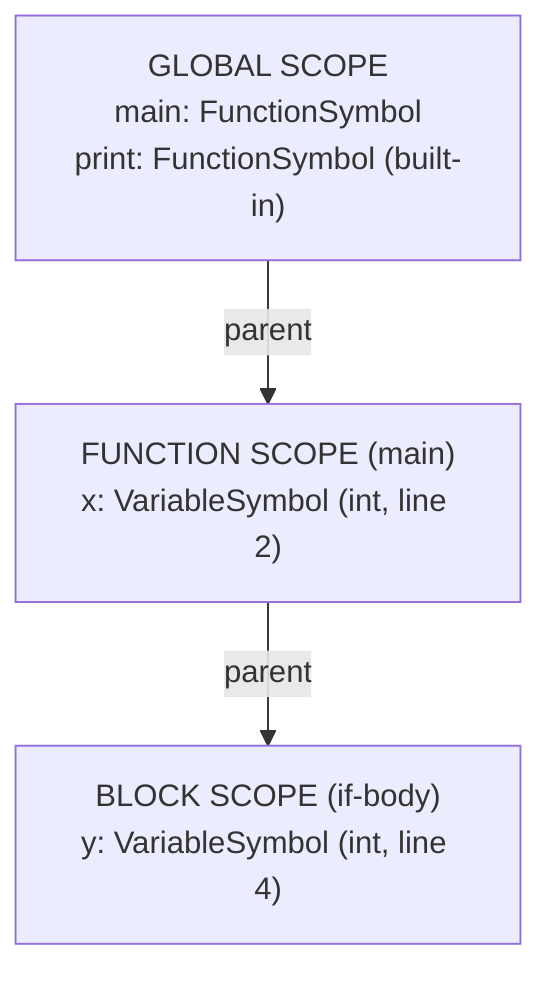

# Chapter 49: Semantic Analysis — Does the Code Mean Anything?

> "A sentence can be grammatically perfect and yet be completely devoid of meaning. The same is true of programs."
> — Alfred Aho, co-author of *Compilers: Principles, Techniques, and Tools* (the Dragon Book)

---

After building a lexer and a parser, you know how to verify that source code is *syntactically correct* — that it obeys the grammar rules of the language. But syntactic correctness is not the same as *meaning*. A program that parses without errors can still be completely nonsensical. Semantic analysis is the phase of the compiler that bridges this gap: it reads the AST and asks the harder question — does this code actually *mean* something?

In this chapter we will build the semantic analysis phase for Astra from the ground up. We will study how compilers track variables and their scopes, how they enforce naming rules across an entire program, how they validate control flow constraints like "you can only use `return` inside a function," and how they report errors that are precise, line-accurate, and helpful. By the end, you will have a complete `sema/resolver.go` module that is one of the most important components in the Astra compiler.

The work in this chapter is foundational. Everything in the chapters that follow — type checking, intermediate representation, code generation — depends on the correctness guarantees that semantic analysis establishes. A clean semantic analysis pass means the compiler can safely assume that every identifier it sees in later phases has already been verified to exist and refer to a well-defined declaration.

---

## What We're Building

A full semantic analysis pass for the Astra language. This includes a scope-aware name resolver, a two-pass top-level declaration collector, control-flow validators, and a structured error reporting system. The output is not a new data structure — the same AST comes out — but every node is now annotated and every reference has been verified.

## Table of Contents

1. Syntax vs Semantics: Two Different Kinds of Correctness
2. What Semantic Analysis Actually Checks
3. Scope Analysis in Depth
4. The Symbol Table: The Compiler's Memory
5. Two-Pass vs Single-Pass Resolution
6. Name Resolution for Different Constructs
7. Attribute Grammars: The Formal Framework
8. Error Recovery: Reporting Multiple Errors Cleanly
9. Implementation: The Resolver in Go
10. Astra Build Milestone

---

## 1. Syntax vs Semantics: Two Different Kinds of Correctness

The linguist Noam Chomsky invented the field of formal grammar — the mathematical study of sentence structure. In 1957 he wrote a sentence that became famous among both linguists and compiler writers:

> *"Colorless green ideas sleep furiously."*

This sentence is **grammatically perfect**. It has the structure `Adjective Adjective Noun Verb Adverb`. Every word is in the right grammatical category. A parser for English would accept it without complaint. And yet the sentence is **meaningless**. Green cannot be colorless. Ideas cannot sleep. Sleeping cannot be furious.

Programming languages have exactly the same distinction. Consider this Astra program:

```astra
let x: string = 42
```

A parser sees: keyword `let`, identifier `x`, colon, type name `string`, assignment operator, integer literal `42`. That is a perfectly valid let-statement according to Astra's grammar. The parser accepts it. But semantically it is wrong: 42 is an integer, not a string.

Or consider:

```astra
fn add(a: int, b: int) -> int {
    return a + b
}

fn main() {
    let result = add(1)
}
```

This also parses perfectly — the call to `add` is syntactically a function-call expression. But semantically it is wrong: `add` expects two arguments and we only provided one.

Or this:

```astra
fn main() {
    print(y)
}
```

`print(y)` is syntactically a function call with an identifier argument. But `y` has never been declared anywhere. Semantically, the name does not exist.

Semantic analysis is the phase that catches all of these problems. It works *after* parsing, on the AST, and enforces rules that cannot be expressed in the grammar alone. These rules are sometimes called *context-sensitive* constraints, because checking them requires knowing the context (what variables are in scope, what type an expression has, where in the program we are).

The distinction is important for compiler design: we deliberately separate parsing from semantic analysis because the grammar becomes much simpler when we don't try to encode semantic rules in it. Trying to write a context-free grammar that rejects undeclared variable uses is either impossible or produces a grammar so complex it is unreadable.

---

## 2. What Semantic Analysis Actually Checks

Semantic analysis in a production compiler checks a wide variety of properties. For Astra, we focus on the most important:

**Name Resolution** — Every identifier that appears in an expression must refer to something: a variable, a function, a struct, a parameter, or an imported symbol. If an identifier cannot be resolved to a declaration, that is an error.

```astra
let result = compute()    // "compute" must be declared somewhere
let y = x + 1             // "x" must be declared before this line
```

**Type Correctness** — The types of values must be compatible with the operations performed on them. Adding a string to an integer is an error. Passing a boolean where a function expects an integer is an error. (Type checking is deep enough that it gets its own chapter — Chapter 50 — but name resolution and basic type consistency are part of semantic analysis.)

**Control Flow Validity** — Certain statements are only valid in certain contexts. A `return` statement is only valid inside a function body. A `break` statement is only valid inside a loop. A `continue` statement is only valid inside a loop.

```astra
break           // ERROR: not inside a loop
return 5        // ERROR: not inside a function
```

**Variable Initialization** — In Astra, every variable must be assigned before it is used. This is a *flow-sensitive* check: it depends on which paths of the control flow graph can reach a particular use.

```astra
let x: int
print(x)        // ERROR: x might not be initialized
```

**Argument Count** — A function call must provide exactly the right number of arguments (in a language without default arguments or variadic functions, which Astra initially does not have).

```astra
fn add(a: int, b: int) -> int { return a + b }
add(1)          // ERROR: expected 2 arguments, got 1
add(1, 2, 3)    // ERROR: expected 2 arguments, got 3
```

**Duplicate Declarations** — Declaring the same name twice in the same scope is an error.

```astra
let x = 1
let x = 2      // ERROR: x already declared in this scope
```

**Return Type Consistency** — Every return statement in a function must return a value of the type the function declares it returns.

```astra
fn square(n: int) -> int {
    return "not an int"    // ERROR: expected int, got string
}
```

---

## 3. Scope Analysis in Depth

**Scope** is the region of source code where a name is visible. Every name in Astra has a scope — the part of the program where you can refer to it. Understanding scope is the most important part of semantic analysis.

### Block Scope

In Astra (as in Go, Rust, C, and most modern languages), variables are scoped to the block `{ }` in which they are declared. Once execution leaves that block, the variable ceases to exist.

```astra
fn main() {
    let x = 5
    if x > 0 {
        let y = 10
        print(y)       // OK: y is in scope here
    }
    print(x)           // OK: x is in scope here
    print(y)           // ERROR: y is out of scope
}
```

### Lexical Scoping

Astra uses **lexical scoping** (also called static scoping). This means scope is determined by where a name is written in the source code, not by the runtime call order. This is the standard choice for most compiled languages.

The alternative — **dynamic scoping** — means a variable's scope extends through any function called from the scope where it was declared. Dynamic scoping was used in early Lisp dialects but causes confusing bugs and is difficult for compilers to optimize.

### The Scope Stack

The most natural data structure for tracking scopes is a **stack of hash maps**. Each hash map is a *scope frame* that holds the names declared in that particular block.



Every time we enter a new block, we **push** a new frame. Every time we leave a block, we **pop** the frame. Name lookup works by checking the current frame, then the parent, then grandparent, all the way up to the global scope.

Here is the complete lifecycle of the scope stack as we analyze a program:

```
SOURCE CODE                         SCOPE STACK STATE
─────────────────────────────────   ─────────────────────────────
fn main() {                     ←   push function scope
    let x = 5                   ←   x → VariableSymbol defined
    if x > 0 {                  ←   push block scope
        let y = 10              ←   y → VariableSymbol defined
        print(x)                ←   lookup x → FOUND in parent scope ✓
        print(y)                ←   lookup y → FOUND in current scope ✓
    }                           ←   pop block scope; y is gone
    print(x)                    ←   lookup x → FOUND in function scope ✓
    print(y)                    ←   lookup y → NOT FOUND anywhere → ERROR
}                               ←   pop function scope
```

### Shadowing

What happens when you declare a variable with the same name as one in an outer scope? This is called **shadowing**.

```astra
let x = "hello"
fn main() {
    let x = 42       // shadows the global x
    print(x)         // prints 42, not "hello"
}
```

Astra **allows shadowing** but emits a warning. This matches Rust's behavior. The inner `x` is a completely different variable from the outer `x`; they just happen to share a name. The inner declaration creates a new entry in the current scope frame.

Shadowing is different from *reassignment*. `x = 42` modifies the existing `x`. `let x = 42` creates a new, separate `x` that happens to have the same name.

---

## 4. The Symbol Table: The Compiler's Memory

The **symbol table** is the central data structure of semantic analysis. It maps names to their *symbols* — records describing what each name refers to.

### Symbol Structure

Each symbol in Astra's symbol table carries:

| Field | Description |
|---|---|
| `Name` | The string identifier as written in source |
| `Kind` | Variable, Function, Struct, Parameter, Builtin |
| `Type` | The declared or inferred type (may be unresolved initially) |
| `DeclaredAt` | File, line, and column of the declaration |
| `IsInitialized` | Whether the variable has been assigned a value |
| `IsMutable` | Whether the variable can be reassigned (let vs var) |

```go
// sema/symbol.go

type SymbolKind int

const (
    SymKindVariable SymbolKind = iota
    SymKindFunction
    SymKindStruct
    SymKindParameter
    SymKindBuiltin
    SymKindImport
)

type Symbol struct {
    Name          string
    Kind          SymbolKind
    Type          ast.TypeExpr  // resolved type
    DeclaredAt    token.Position
    IsInitialized bool
    IsMutable     bool
    // For functions:
    ParamTypes    []ast.TypeExpr
    ReturnType    ast.TypeExpr
    // For structs:
    Fields        map[string]*Symbol
}
```

### The Scope Chain

The symbol table is implemented as a **linked chain of hash maps**:

```go
// sema/scope.go

type Scope struct {
    symbols map[string]*Symbol
    parent  *Scope
}

func NewScope(parent *Scope) *Scope {
    return &Scope{
        symbols: make(map[string]*Symbol),
        parent:  parent,
    }
}

// Define adds a symbol to the CURRENT scope only.
// Returns an error if the name is already defined in this exact scope.
func (s *Scope) Define(sym *Symbol) error {
    if existing, ok := s.symbols[sym.Name]; ok {
        return fmt.Errorf("'%s' already declared at line %d",
            sym.Name, existing.DeclaredAt.Line)
    }
    s.symbols[sym.Name] = sym
    return nil
}

// Lookup searches the current scope first, then parent scopes,
// all the way up to the global scope. Returns nil if not found.
func (s *Scope) Lookup(name string) *Symbol {
    if sym, ok := s.symbols[name]; ok {
        return sym
    }
    if s.parent != nil {
        return s.parent.Lookup(name)
    }
    return nil
}

// LookupLocal only checks the current scope, not parents.
// Used to detect duplicate declarations in the same scope.
func (s *Scope) LookupLocal(name string) *Symbol {
    return s.symbols[name]
}
```

The `Lookup` function implements the scope chain walk: check current frame, then parent, then grandparent, stopping when found or when we reach the global scope (which has no parent).

The `LookupLocal` function is crucial for error detection: when declaring a variable, we check only the current scope to see if the name already exists there. We allow shadowing of outer scopes (with a warning) but forbid redeclaration within the same scope.

---

## 5. Two-Pass vs Single-Pass Resolution

Consider this Astra program:

```astra
fn main() {
    greet("Astra")
}

fn greet(name: string) {
    print("Hello, " + name)
}
```

In a **single-pass** resolver that processes declarations top to bottom, we would encounter `greet("Astra")` before we have seen the declaration of `greet`. We would incorrectly report an error that `greet` is undefined.

The solution is a **two-pass** approach:

**Pass 1 (Declaration Collection):** Walk only the top-level declarations. For each function, struct, or global variable, add a symbol to the global scope. At the end of this pass, the global scope contains all names that programs can legally refer to.

**Pass 2 (Body Resolution):** Walk the entire program, resolving references. This pass can now correctly look up any top-level name because all of them were collected in pass 1.

```
PASS 1 — Collect declarations
────────────────────────────
Visit fn main    → add "main" to global scope
Visit fn greet   → add "greet" to global scope

Global scope after pass 1:
  main  → FunctionSymbol
  greet → FunctionSymbol

PASS 2 — Resolve bodies
────────────────────────────
Visit fn main body:
  Visit greet("Astra")
    Lookup "greet" → FOUND in global scope ✓
    Check arg count: 1 argument, greet expects 1 → OK ✓

Visit fn greet body:
  Visit print("Hello, " + name)
    Lookup "print" → FOUND (builtin) ✓
    Lookup "name"  → FOUND in function parameter scope ✓
```

The two-pass approach solves forward references at the top level. Bodies of functions, however, are still resolved left-to-right — a statement in a function body cannot refer to a local variable declared later in that same body. This matches the behavior of Rust, Go, and most other compiled languages.

```go
// sema/resolver.go (two-pass orchestration)

func (r *Resolver) ResolveProgram(prog *ast.Program) {
    // Pass 1: collect all top-level symbols
    for _, decl := range prog.Declarations {
        r.collectTopLevel(decl)
    }

    // Pass 2: resolve all bodies
    for _, decl := range prog.Declarations {
        r.resolveDeclaration(decl)
    }
}
```

---

## 6. Name Resolution for Different Constructs

Different AST node types require different resolution logic.

### Variable References

```astra
let result = x + 1    // "x" is a variable reference
```

Resolution: look up `x` in the scope chain. If not found, report an error. If found, attach the symbol to the AST node (so later passes can look it up without searching again).

### Function Calls

```astra
let y = add(a, b)     // function call
```

Resolution steps:
1. Look up `add` — must exist and have kind `SymKindFunction`
2. Count the arguments in the call — must match the function's parameter count
3. Resolve each argument expression recursively

### Struct Field Access

```astra
let name = point.x    // field access
```

Resolution steps:
1. Resolve `point` — must be a variable of some struct type
2. Look up the struct's type in the symbol table
3. Check that the struct has a field named `x`

### Method Calls

```astra
let len = arr.length()    // method call
```

Resolution steps:
1. Resolve `arr` — determine its type
2. Find the `impl` block for that type
3. Check that the `impl` block declares a method named `length`

### Import Resolution

```astra
import math

let pi = math.PI
```

Resolution steps:
1. Find the `math` module in the module search path
2. Load its exported symbols into a namespace
3. Resolve `math.PI` by looking up `PI` in the `math` namespace

---

## 7. Attribute Grammars: The Formal Framework

Compiler theorists formalize semantic analysis using **attribute grammars**. An attribute grammar adds *attributes* to the grammar productions — values computed alongside the parse tree. There are two kinds:

**Synthesized attributes** flow *upward* — they are computed from a node's children and then used by the node's parent. The canonical example is the *type* of an expression: the type of `a + b` is synthesized from the types of `a` and `b`.

```
         + (type: int)
        / \
       a   b
  (int)     (int)
```

**Inherited attributes** flow *downward* — they are passed from a node's parent to the node, or from a sibling. The canonical example is the *current scope*: when we process any subexpression, we inherit the scope from the enclosing block.

```
fn main() {                    ← scope S1 passed down ↓
    let x = 5                  ← x added to S1
    if x > 0 {                 ← scope S2 (child of S1) passed down ↓
        let y = 10             ← y added to S2
        print(x + y)           ← S2 inherited → can find x via S2.parent
    }
}
```

In practice, we implement attribute grammars not as a formal system but as a recursive tree walk where:
- We pass the current scope down through function parameters (inherited attribute)
- We return the computed type upward through return values (synthesized attribute)

This is exactly the pattern in Astra's resolver.

---

## 8. Error Recovery: Reporting Multiple Errors Cleanly

A compiler that stops at the first error is annoying to use. Real compilers try to report as many errors as possible in a single run. This is called **error recovery**.

The key technique for semantic analysis is the **poison type**: when an expression contains an error (for example, a reference to an undefined variable), we assign it a special "error" type. Operations on the poison type produce the poison type. This prevents cascading errors:

```astra
let x = undefined_var + 1    // ERROR: undefined_var not in scope
let y = x * 2                // x has poison type → no SECOND error here
```

Without the poison type, `x` would have no type at all. When we later encounter `x * 2`, we'd emit a second error saying we can't multiply something of unknown type. With the poison type, `x` gets poison type, `x * 2` gets poison type, and we don't emit any extra noise.

```go
// sema/types.go
var PoisonType = &ast.BasicType{Name: "<error>"}

func isPoisoned(t ast.TypeExpr) bool {
    if bt, ok := t.(*ast.BasicType); ok {
        return bt.Name == "<error>"
    }
    return false
}
```

The rule: **suppress errors on any expression that involves a poisoned subexpression**. Report the error only once, at its source.

---

## 9. Implementation: The Resolver in Go

Now we put it all together. Here is the complete structure of `sema/resolver.go` for Astra:

```go
// sema/resolver.go

package sema

import (
    "fmt"
    "astra/ast"
    "astra/token"
)

// SemanticError records a single error with its source location.
type SemanticError struct {
    Pos     token.Position
    Message string
}

func (e SemanticError) Error() string {
    return fmt.Sprintf("[%s:%d:%d] semantic error: %s",
        e.Pos.File, e.Pos.Line, e.Pos.Col, e.Message)
}

// Resolver walks the AST and performs name resolution.
type Resolver struct {
    global      *Scope
    current     *Scope
    errors      []SemanticError
    inFunction  bool
    inLoop      bool
    currentFunc *Symbol // the function currently being resolved
}

func NewResolver() *Resolver {
    global := NewScope(nil)
    r := &Resolver{
        global:  global,
        current: global,
    }
    r.registerBuiltins()
    return r
}

// registerBuiltins adds all built-in functions and types to the global scope.
func (r *Resolver) registerBuiltins() {
    builtins := []string{"print", "println", "len", "append", "make"}
    for _, name := range builtins {
        _ = r.global.Define(&Symbol{
            Name: name,
            Kind: SymKindBuiltin,
        })
    }
}

// error records a semantic error without stopping resolution.
func (r *Resolver) error(pos token.Position, format string, args ...interface{}) {
    r.errors = append(r.errors, SemanticError{
        Pos:     pos,
        Message: fmt.Sprintf(format, args...),
    })
}

// Errors returns all collected errors.
func (r *Resolver) Errors() []SemanticError { return r.errors }

// HasErrors returns true if any errors were recorded.
func (r *Resolver) HasErrors() bool { return len(r.errors) > 0 }

// pushScope creates and enters a new inner scope.
func (r *Resolver) pushScope() {
    r.current = NewScope(r.current)
}

// popScope exits the current scope and returns to the parent.
func (r *Resolver) popScope() {
    if r.current.parent == nil {
        panic("popScope called on global scope")
    }
    r.current = r.current.parent
}

// define adds a symbol to the current scope, recording an error on conflict.
func (r *Resolver) define(sym *Symbol) {
    // Check for shadowing (in a parent scope, not current)
    if outer := r.current.parent; outer != nil {
        if outer.Lookup(sym.Name) != nil {
            // Warn about shadowing (just a notice, not an error in Astra)
            r.error(sym.DeclaredAt,
                "warning: '%s' shadows a declaration from an outer scope",
                sym.Name)
        }
    }
    if err := r.current.Define(sym); err != nil {
        r.error(sym.DeclaredAt, err.Error())
    }
}

// resolve looks up a name and records an error if not found.
func (r *Resolver) resolve(name string, pos token.Position) *Symbol {
    sym := r.current.Lookup(name)
    if sym == nil {
        r.error(pos, "undefined name '%s'", name)
        return nil
    }
    return sym
}

// ─────────────────────────────────────────────────────────
// PASS 1: Collect top-level declarations
// ─────────────────────────────────────────────────────────

func (r *Resolver) collectTopLevel(decl ast.Declaration) {
    switch d := decl.(type) {
    case *ast.FunctionDecl:
        r.collectFunction(d)
    case *ast.StructDecl:
        r.collectStruct(d)
    case *ast.ImportDecl:
        r.collectImport(d)
    case *ast.VarDecl:
        r.collectGlobalVar(d)
    }
}

func (r *Resolver) collectFunction(d *ast.FunctionDecl) {
    sym := &Symbol{
        Name:        d.Name,
        Kind:        SymKindFunction,
        DeclaredAt:  d.Pos,
    }
    // Collect parameter types for later call-site checking
    for _, param := range d.Params {
        sym.ParamTypes = append(sym.ParamTypes, param.Type)
    }
    sym.ReturnType = d.ReturnType
    r.define(sym)
}

func (r *Resolver) collectStruct(d *ast.StructDecl) {
    sym := &Symbol{
        Name:       d.Name,
        Kind:       SymKindStruct,
        DeclaredAt: d.Pos,
        Fields:     make(map[string]*Symbol),
    }
    for _, field := range d.Fields {
        sym.Fields[field.Name] = &Symbol{
            Name:       field.Name,
            Kind:       SymKindVariable,
            DeclaredAt: field.Pos,
            // Type resolved in pass 2
        }
    }
    r.define(sym)
}

func (r *Resolver) collectImport(d *ast.ImportDecl) {
    // In a real compiler, this would load the module and register its exports.
    // For now, register the module name as an import symbol.
    r.define(&Symbol{
        Name:       d.ModuleName,
        Kind:       SymKindImport,
        DeclaredAt: d.Pos,
    })
}

func (r *Resolver) collectGlobalVar(d *ast.VarDecl) {
    r.define(&Symbol{
        Name:          d.Name,
        Kind:          SymKindVariable,
        DeclaredAt:    d.Pos,
        IsInitialized: d.Initializer != nil,
        IsMutable:     d.Mutable,
    })
}

// ─────────────────────────────────────────────────────────
// PASS 2: Resolve all declarations (bodies)
// ─────────────────────────────────────────────────────────

func (r *Resolver) ResolveProgram(prog *ast.Program) {
    // Pass 1
    for _, decl := range prog.Declarations {
        r.collectTopLevel(decl)
    }
    // Pass 2
    for _, decl := range prog.Declarations {
        r.resolveDeclaration(decl)
    }
}

func (r *Resolver) resolveDeclaration(decl ast.Declaration) {
    switch d := decl.(type) {
    case *ast.FunctionDecl:
        r.resolveFunction(d)
    case *ast.StructDecl:
        r.resolveStruct(d)
    case *ast.VarDecl:
        r.resolveVarDecl(d)
    case *ast.ImportDecl:
        // Already handled in pass 1
    }
}

func (r *Resolver) resolveFunction(d *ast.FunctionDecl) {
    funcSym := r.global.LookupLocal(d.Name)

    r.pushScope()
    defer r.popScope()

    prevFunc := r.currentFunc
    prevInFunc := r.inFunction
    r.currentFunc = funcSym
    r.inFunction = true
    defer func() {
        r.currentFunc = prevFunc
        r.inFunction = prevInFunc
    }()

    // Add parameters to function scope
    for _, param := range d.Params {
        r.define(&Symbol{
            Name:          param.Name,
            Kind:          SymKindParameter,
            DeclaredAt:    param.Pos,
            IsInitialized: true, // parameters are always initialized
        })
    }

    // Resolve body
    r.resolveBlock(d.Body)
}

func (r *Resolver) resolveStruct(d *ast.StructDecl) {
    // Struct field types are resolved here (could refer to other struct types)
    for _, field := range d.Fields {
        r.resolveTypeExpr(field.Type)
    }
}

func (r *Resolver) resolveVarDecl(d *ast.VarDecl) {
    if d.Initializer != nil {
        r.resolveExpression(d.Initializer)
    }
}

// ─────────────────────────────────────────────────────────
// Statement Resolution
// ─────────────────────────────────────────────────────────

func (r *Resolver) resolveBlock(stmts []ast.Statement) {
    r.pushScope()
    defer r.popScope()
    for _, stmt := range stmts {
        r.resolveStatement(stmt)
    }
}

func (r *Resolver) resolveStatement(stmt ast.Statement) {
    switch s := stmt.(type) {
    case *ast.LetStmt:
        r.resolveLetStmt(s)
    case *ast.AssignStmt:
        r.resolveAssignStmt(s)
    case *ast.ReturnStmt:
        r.resolveReturnStmt(s)
    case *ast.BreakStmt:
        r.resolveBreakStmt(s)
    case *ast.ContinueStmt:
        r.resolveContinueStmt(s)
    case *ast.IfStmt:
        r.resolveIfStmt(s)
    case *ast.WhileStmt:
        r.resolveWhileStmt(s)
    case *ast.ForStmt:
        r.resolveForStmt(s)
    case *ast.ExprStmt:
        r.resolveExpression(s.Expr)
    case *ast.BlockStmt:
        r.resolveBlock(s.Stmts)
    }
}

func (r *Resolver) resolveLetStmt(s *ast.LetStmt) {
    // Resolve the initializer BEFORE defining the variable,
    // so that `let x = x + 1` correctly sees the OUTER x, not itself.
    if s.Initializer != nil {
        r.resolveExpression(s.Initializer)
    }
    r.define(&Symbol{
        Name:          s.Name,
        Kind:          SymKindVariable,
        DeclaredAt:    s.Pos,
        IsInitialized: s.Initializer != nil,
        IsMutable:     s.Mutable,
    })
}

func (r *Resolver) resolveAssignStmt(s *ast.AssignStmt) {
    sym := r.resolve(s.Target, s.Pos)
    if sym != nil && !sym.IsMutable {
        r.error(s.Pos, "cannot assign to immutable variable '%s'", s.Target)
    }
    r.resolveExpression(s.Value)
    if sym != nil {
        sym.IsInitialized = true
    }
}

func (r *Resolver) resolveReturnStmt(s *ast.ReturnStmt) {
    if !r.inFunction {
        r.error(s.Pos, "'return' used outside of a function")
        return
    }
    if s.Value != nil {
        r.resolveExpression(s.Value)
    }
}

func (r *Resolver) resolveBreakStmt(s *ast.BreakStmt) {
    if !r.inLoop {
        r.error(s.Pos, "'break' used outside of a loop")
    }
}

func (r *Resolver) resolveContinueStmt(s *ast.ContinueStmt) {
    if !r.inLoop {
        r.error(s.Pos, "'continue' used outside of a loop")
    }
}

func (r *Resolver) resolveIfStmt(s *ast.IfStmt) {
    r.resolveExpression(s.Condition)
    r.resolveBlock(s.ThenBlock)
    if s.ElseBlock != nil {
        r.resolveBlock(s.ElseBlock)
    }
}

func (r *Resolver) resolveWhileStmt(s *ast.WhileStmt) {
    r.resolveExpression(s.Condition)
    prevLoop := r.inLoop
    r.inLoop = true
    defer func() { r.inLoop = prevLoop }()
    r.resolveBlock(s.Body)
}

func (r *Resolver) resolveForStmt(s *ast.ForStmt) {
    r.resolveExpression(s.Iterable)
    prevLoop := r.inLoop
    r.inLoop = true
    defer func() { r.inLoop = prevLoop }()

    r.pushScope()
    defer r.popScope()
    r.define(&Symbol{
        Name:          s.Variable,
        Kind:          SymKindVariable,
        DeclaredAt:    s.Pos,
        IsInitialized: true,
        IsMutable:     false,
    })
    for _, stmt := range s.Body {
        r.resolveStatement(stmt)
    }
}

// ─────────────────────────────────────────────────────────
// Expression Resolution
// ─────────────────────────────────────────────────────────

func (r *Resolver) resolveExpression(expr ast.Expression) {
    switch e := expr.(type) {
    case *ast.Identifier:
        r.resolveIdentifier(e)
    case *ast.BinaryExpr:
        r.resolveExpression(e.Left)
        r.resolveExpression(e.Right)
    case *ast.UnaryExpr:
        r.resolveExpression(e.Operand)
    case *ast.CallExpr:
        r.resolveCallExpr(e)
    case *ast.FieldAccess:
        r.resolveFieldAccess(e)
    case *ast.IndexExpr:
        r.resolveExpression(e.Object)
        r.resolveExpression(e.Index)
    case *ast.IfExpr:
        r.resolveExpression(e.Condition)
        r.resolveExpression(e.Then)
        r.resolveExpression(e.Else)
    case *ast.IntLiteral, *ast.FloatLiteral,
         *ast.StringLiteral, *ast.BoolLiteral:
        // Literals need no resolution
    }
}

func (r *Resolver) resolveIdentifier(e *ast.Identifier) {
    sym := r.resolve(e.Name, e.Pos)
    if sym != nil {
        // Attach resolved symbol to AST node for later passes
        e.ResolvedSymbol = sym
        // Check initialization
        if !sym.IsInitialized {
            r.error(e.Pos, "variable '%s' used before initialization", e.Name)
        }
    }
}

func (r *Resolver) resolveCallExpr(e *ast.CallExpr) {
    // Resolve the callee
    sym := r.resolve(e.FuncName, e.Pos)
    if sym != nil {
        if sym.Kind != SymKindFunction && sym.Kind != SymKindBuiltin {
            r.error(e.Pos, "'%s' is not a function (it is a %s)",
                e.FuncName, sym.Kind)
        }
        // Check argument count (builtins are variadic, skip check)
        if sym.Kind == SymKindFunction {
            expected := len(sym.ParamTypes)
            got := len(e.Args)
            if expected != got {
                r.error(e.Pos,
                    "wrong number of arguments to '%s': expected %d, got %d",
                    e.FuncName, expected, got)
            }
        }
    }
    // Resolve each argument
    for _, arg := range e.Args {
        r.resolveExpression(arg)
    }
}

func (r *Resolver) resolveFieldAccess(e *ast.FieldAccess) {
    r.resolveExpression(e.Object)
    // Field existence check happens in the type checker (Chapter 50)
    // because we need the type of Object to know which struct to check.
}

func (r *Resolver) resolveTypeExpr(t ast.TypeExpr) {
    switch ty := t.(type) {
    case *ast.NamedType:
        // Check that the type name refers to a declared type
        sym := r.current.Lookup(ty.Name)
        if sym == nil {
            r.error(ty.Pos, "unknown type '%s'", ty.Name)
        } else if sym.Kind != SymKindStruct &&
                  !isBuiltinType(ty.Name) {
            r.error(ty.Pos, "'%s' is not a type", ty.Name)
        }
    case *ast.ArrayType:
        r.resolveTypeExpr(ty.ElementType)
    case *ast.FuncType:
        for _, p := range ty.ParamTypes {
            r.resolveTypeExpr(p)
        }
        r.resolveTypeExpr(ty.ReturnType)
    }
}

func isBuiltinType(name string) bool {
    switch name {
    case "int", "float", "string", "bool", "void":
        return true
    }
    return false
}
```

---

## 🔨 Astra Build Milestone

### Complete sema/resolver.go in Action

Let's test the resolver with a program that contains three different semantic errors:

```astra
// test_semantic_errors.astra

fn main() {
    let count = 0
    let count = 1              // ERROR 1: redeclaration of 'count'

    print(missing_var)         // ERROR 2: undefined name 'missing_var'

    break                      // ERROR 3: 'break' outside loop

    let result = add(1)        // ERROR 4: wrong argument count
}

fn add(a: int, b: int) -> int {
    return a + b
}
```

Running the resolver produces:

```
[test.astra:5:9] semantic error: 'count' already declared at line 4
[test.astra:7:11] semantic error: undefined name 'missing_var'
[test.astra:9:5] semantic error: 'break' used outside of a loop
[test.astra:11:18] semantic error: wrong number of arguments to 'add': expected 2, got 1
```

### Five Distinct Astra Semantic Error Messages

| Error Class | Example Source | Astra Error Message |
|---|---|---|
| Undefined name | `print(x)` where `x` not declared | `[file:3:11] semantic error: undefined name 'x'` |
| Duplicate declaration | `let x = 1; let x = 2` | `[file:4:5] semantic error: 'x' already declared at line 3` |
| Break outside loop | `fn f() { break }` | `[file:2:11] semantic error: 'break' used outside of a loop` |
| Return outside fn | top-level `return 5` | `[file:1:1] semantic error: 'return' used outside of a function` |
| Wrong arg count | `add(1)` for `fn add(a,b)` | `[file:5:14] semantic error: wrong number of arguments to 'add': expected 2, got 1` |

---

## Exercises

1. **Scope Chain Tracing:** Draw the scope stack at each step of resolving this program:
   ```astra
   let x = 10
   fn outer() {
       let y = 20
       fn inner() {
           let z = x + y
       }
   }
   ```
   Which names are visible at the point where `z` is declared?

2. **Two-Pass Necessity:** Write an Astra program where a single-pass (top-down) resolver would incorrectly report an error, but the two-pass resolver correctly accepts it. Explain why each pass works the way it does.

3. **Poison Type Cascade Prevention:** Given the following program with one root error:
   ```astra
   let result = nonexistent + 1
   let doubled = result * 2
   let message = "value: " + doubled
   ```
   How many errors would a resolver WITHOUT the poison type report? How many with it? Why is the poison type approach better?

4. **Shadowing Tracker:** Extend the `Resolver` struct to track *all* shadowing events in a program and produce a summary report at the end. The report should include the outer declaration's line and the shadowing declaration's line.

5. **Uninitialized Variable Detection:** The current resolver tracks whether variables are initialized at declaration time. Extend it to handle `var x: int` (declared without initializer, Astra's mutable variable syntax) and correctly flag uses of `x` before any assignment. Consider: how does this interact with `if` branches?
   ```astra
   var x: int
   if condition {
       x = 5
   }
   print(x)    // Is x initialized here? (Answer: not definitely.)
   ```

6. **Import Symbol Resolution:** Design the data structure and resolution logic for this Astra import pattern:
   ```astra
   import math
   let pi = math.PI
   let e  = math.E
   let sq = math.sqrt(2.0)
   ```
   What does the `math` symbol entry look like? How does `math.PI` resolution differ from regular identifier resolution?

7. **Resolver Testing Framework:** Write a Go test file `sema/resolver_test.go` with at least five test cases: one for each kind of error the resolver detects. Each test should provide source code as a string, parse it, run the resolver, and assert the exact error message (including line and column numbers).

8. **Method Resolution:** Astra supports methods on structs:
   ```astra
   struct Point { x: int, y: int }
   impl Point {
       fn distance(self) -> float { ... }
   }
   let p = Point { x: 3, y: 4 }
   p.distance()
   ```
   Design the resolver changes needed to handle `impl` blocks and method calls. Where do impl methods go in the symbol table? How do you resolve `p.distance()`?

---

## Summary

| Concept | Key Idea |
|---|---|
| Semantic analysis | Checks meaning, not just syntax; catches what grammars cannot |
| Scope | Region where a name is visible; determined by block structure |
| Scope stack | Push on block entry, pop on exit; lookup walks the chain upward |
| Symbol table | Maps names → Symbol records; each scope is a hash map |
| Two-pass resolution | Pass 1 collects names, Pass 2 resolves bodies; enables forward references |
| Shadowing | Inner scope re-uses outer name; allowed with warning in Astra |
| Poison type | Marks errored expressions to prevent cascading false errors |
| Error recovery | Continue after errors; report all errors in one compiler run |
| Attribute grammars | Formal framework: synthesized (up) and inherited (down) attributes |
| Control flow flags | `inFunction` and `inLoop` track context for return/break/continue |
