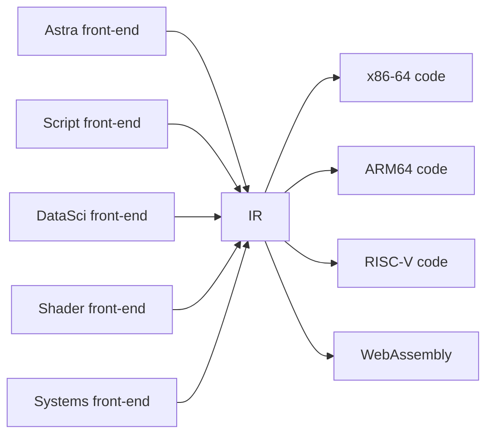
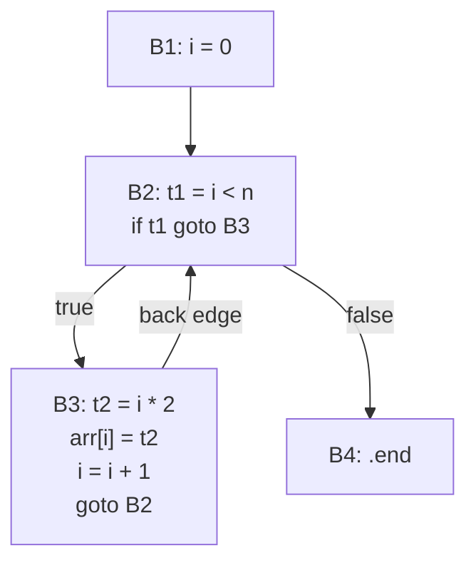

# Chapter 51: Intermediate Representation — The Compiler's Internal Language

> "The key insight of LLVM is that a great intermediate representation can outlast any particular front-end language or back-end target. The IR is the product."
> — Chris Lattner, creator of LLVM

---

Every non-trivial compiler has a dirty secret: it does not translate source code directly into machine code. Between the front-end (lexing, parsing, semantic analysis, type checking) and the back-end (register allocation, assembly emission), there is a hidden middle layer — the **Intermediate Representation**, or IR. The IR is a simplified, architecture-independent language that the compiler uses as its internal working medium. It is expressive enough to represent any computation, yet simple enough that optimization and code generation are practical.

In this chapter we design and implement Astra's IR. We will understand why IRs exist, what makes a good IR design, explore the two most important IR forms in modern compilers (Three-Address Code and Static Single Assignment), and build a complete Go implementation with a builder API. By the end of this chapter, you will have a `ir/ir.go` and `ir/builder.go` that can translate any Astra AST into a clean, verifiable IR ready for the code generator in Chapter 52.

The concepts here are the foundation of everything that makes production compilers fast. LLVM, GCC, the Java Virtual Machine, the .NET CLR, the V8 JavaScript engine — all are built around sophisticated intermediate representations. Understanding IR is understanding the core of modern compiler engineering.

---

## What We're Building

A complete mid-level IR for Astra: data structures for all instruction types, a builder API for lowering AST nodes to IR, a control flow graph constructor, and an IR printer for debugging. We will also implement the conversion of a real Astra function to IR and annotate every instruction.

## Table of Contents

1. Why Have an IR at All?
2. The IR Design Spectrum
3. Three-Address Code in Depth
4. SSA Form: Static Single Assignment
5. The Control Flow Graph
6. IR Data Structures in Go
7. The IR Builder
8. Lowering AST Constructs to IR
9. IR Validation
10. Astra Build Milestone

---

## 1. Why Have an IR at All?

Imagine you are building a compiler company. You want to support 5 source languages: Astra, a scripting language, a data science language, a shader language, and a systems language. And you want to target 4 machine architectures: x86-64 (desktop/server), ARM64 (mobile/Apple Silicon), RISC-V (embedded), and WebAssembly (browser).

Without an IR, you need a separate compiler for every language-architecture combination:

```
WITHOUT IR:
──────────────────────────────────────────────────────────────────────
             x86-64      ARM64      RISC-V     WebAssembly
Astra         [1]         [2]         [3]          [4]
Script        [5]         [6]         [7]          [8]
DataSci       [9]        [10]        [11]         [12]
Shader       [13]        [14]        [15]         [16]
Systems      [17]        [18]        [19]         [20]

Total: 5 × 4 = 20 separate compilers to build and maintain
──────────────────────────────────────────────────────────────────────
```

That is 20 separate, complex code generators, each requiring deep knowledge of both the source language semantics and the target architecture. Maintainability nightmare.

With an IR:



Each front-end translates its source language into the IR. Each back-end translates the IR into its target architecture's machine code. No front-end needs to know anything about any back-end, and vice versa.

This is exactly the architecture of LLVM: a rich IR (LLVM IR, also called bitcode) with many front-end language compilers (Clang for C/C++, Rust, Swift, Julia, etc.) and many back-ends (x86-64, ARM, RISC-V, WebAssembly, etc.).

**The second major benefit of IR: architecture-independent optimization.** Many important optimizations can be expressed and applied at the IR level, independently of both the source language and the target architecture:

- **Constant folding:** `t1 = 2 + 3` becomes `t1 = 5` (pure arithmetic at compile time)
- **Dead code elimination:** remove instructions whose results are never used
- **Common subexpression elimination:** compute `a * b` once, reuse the result
- **Loop invariant code motion:** move loop-invariant computations outside loops
- **Inline expansion:** replace a function call with a copy of the function body
- **Strength reduction:** replace `x * 4` with `x << 2` (shift is cheaper)

These optimizations are implemented once, in the IR, and they benefit all source languages targeting all architectures. This is why LLVM's optimizer is so powerful: decades of optimization passes have been written once and applied to every language that uses LLVM as a backend.

---

## 2. The IR Design Spectrum

IRs exist on a spectrum from high-level (close to the source language) to low-level (close to machine code).

**High-Level IR (HIR):** This is essentially the typed, decorated AST. It preserves source-level structure: structured loops, nested expressions, named variables with source-level types. Advantages: easy to emit directly from the front-end, easy to do type-level analysis. Disadvantages: hard to generate machine code from; structured loops are harder to optimize than flat control flow.

```
# High-level IR (essentially the AST):
while (x > 0) {
    x = x - 1
}
```

**Mid-Level IR (MIR):** Three-Address Code (TAC) or SSA form. Flat control flow with explicit labels and jumps, unlimited virtual registers, simple operations with at most one operator. This is the sweet spot for optimization. Advantages: easy to optimize (control flow is explicit, data flow is simple), still architecture-independent. Disadvantages: more verbose than HIR.

```
# Mid-level IR (TAC):
.loop_start:
  t1 = x > 0
  if not t1 goto .loop_end
  x = x - 1
  goto .loop_start
.loop_end:
```

**Low-Level IR (LIR) / Machine IR:** Close to actual machine code, but still somewhat abstract. Uses physical registers (or a constrained virtual register set), models calling conventions, stack frames, and instruction selection. This is the machine-specific IR used by the register allocator.

Astra uses a **mid-level IR** (Three-Address Code). We lower structured control flow into flat labels and jumps, reduce complex expressions into sequences of simple operations, and use unlimited virtual temporaries. After optimization (Chapter 70), we lower to x86-64 assembly (Chapter 52).

---

## 3. Three-Address Code in Depth

**Three-Address Code (TAC)** is the most widely used mid-level IR form. Every instruction has the form:

```
result = operand1  operator  operand2
```

At most **one** operation per instruction. At most **three** operands. This constraint forces complex expressions to be broken into sequences of simple steps, using **temporaries** (virtual variables with names like `t1`, `t2`, `t3`...) to hold intermediate values.

### Lowering Expressions

**Simple arithmetic:**
```astra
let z = (x + y) * 2    # Astra source
```
```
# TAC:
t1 = x + y
t2 = 2
t3 = t1 * t2
z  = t3
```

Each binary operation gets exactly one instruction. Parentheses are encoded in the *ordering* of instructions, not in the instructions themselves.

**Function call with multiple arguments:**
```astra
let result = add(x + 1, y * 2)    # Astra source
```
```
# TAC:
t1 = x + 1
t2 = y * 2
t3 = call add(t1, t2)
result = t3
```

Arguments are pre-computed into temporaries before the call instruction.

### Lowering Control Flow

The most striking change in lowering to TAC is what happens to structured control flow. Astra has `if`, `while`, `for` — clean, structured constructs. TAC has none of these. Everything becomes **labels** and **jumps** (`goto`).

**If-else:**
```astra
if x > 0 {
    y = 1
} else {
    y = -1
}
```
```
# TAC:
t1 = x > 0
if t1 goto .then
y = -1
goto .end
.then:
y = 1
.end:
```

Note the layout: the **else** branch comes first in the instruction stream, then a goto to skip to the end, then the **then** branch labeled `.then`. This is because conditional jumps (like `if t1 goto .then`) jump on *true*, so the false (else) path falls through naturally.

**While loop:**
```astra
while exp > 0 {
    result = result * base
    exp = exp - 1
}
```
```
# TAC:
.loop_start:
t1 = exp > 0
if not t1 goto .loop_end
t2 = result * base
result = t2
t3 = exp - 1
exp = t3
goto .loop_start
.loop_end:
```

The loop is built from three parts:
1. The loop header label (`.loop_start`)
2. The condition check with a conditional jump to the exit
3. The body, ending with an unconditional jump back to the header

**For loop with range:**
```astra
for i in 0..n {
    // body using i
}
```
```
# TAC:
i = 0
.for_start:
t1 = i < n
if not t1 goto .for_end
// ... body ...
t2 = i + 1
i = t2
goto .for_start
.for_end:
```

**Nested loops:**
```astra
for i in 0..n {
    for j in 0..m {
        arr[i * m + j] = 0
    }
}
```
```
# TAC:
i = 0
.outer_start:
t1 = i < n
if not t1 goto .outer_end
  j = 0
  .inner_start:
  t2 = j < m
  if not t2 goto .inner_end
    t3 = i * m
    t4 = t3 + j
    arr[t4] = 0
    t5 = j + 1
    j = t5
    goto .inner_start
  .inner_end:
t6 = i + 1
i = t6
goto .outer_start
.outer_end:
```

Every nested control structure generates its own pair of labels. The nesting is encoded in the control flow graph structure, not in the instruction syntax.

---

## 4. SSA Form: Static Single Assignment

**Static Single Assignment (SSA)** is a property of an IR: every variable is **assigned exactly once**. If a variable needs to be reassigned, we introduce a new name for the new value.

Why would this be useful? Consider the non-SSA program:

```
x = 1         # assignment 1 to x
x = x + 1    # assignment 2 to x
y = x * 2    # which x? The one from assignment 2
```

In SSA form:
```
x_1 = 1           # first definition of x
x_2 = x_1 + 1    # second definition (new name)
y_1 = x_2 * 2    # unambiguously x_2
```

The property that each variable is defined exactly once means that **the definition dominates every use**. You can always trace any use of a variable back to exactly one definition, with no ambiguity. This makes dataflow analysis — tracking what values flow through a program — vastly simpler.

### The Phi Function Problem

SSA works beautifully for straight-line code. But what about code with branches?

```astra
if condition {
    x = 1
} else {
    x = 2
}
print(x)    # which x? Could be from either branch
```

In SSA, we name the two assignments differently:

```
if t_cond goto .then
x_1 = 2
goto .merge
.then:
x_2 = 1
.merge:
# Which x do we use here? x_1 or x_2?
print(x_???)
```

We do not know which path was taken at runtime. SSA solves this with the **phi function** (φ-function):

```
.merge:
x_3 = φ(x_1, x_2)    # x_3 is x_1 if came from .else, x_2 if came from .then
print(x_3)
```

The phi function is not a real instruction — no machine architecture has a phi instruction. It is a mathematical device that says: "this variable's value depends on which control flow edge we arrived from." During code generation, phi functions are eliminated by inserting copy instructions at the end of each predecessor block.

### Why SSA is Great for Optimization

**Constant propagation:** In SSA, if `x_1 = 5` and `x_1` is only defined once, then every use of `x_1` can be replaced with `5` without any further analysis.

**Dead code elimination:** If a variable `x_1` is defined but never used (no uses of `x_1` appear in the code), the definition is dead and can be deleted. In non-SSA code, you would need dataflow analysis to discover this. In SSA, it is trivially visible.

**Global value numbering:** Two SSA variables with the same definition (same operator, same operands) represent the same value and can be unified. Common subexpression elimination becomes almost trivial.

**LLVM, GCC (since 2005), V8, and virtually every modern optimizing compiler use SSA form** for their main IR. Astra's initial implementation uses simple TAC (which is simpler to implement), but a future optimization pass converts to SSA for the optimizer (Chapter 70).

### Constructing SSA: The Dominator Tree

Converting to SSA requires understanding **dominance**: basic block A *dominates* basic block B if every path from the program entry to B passes through A. The **dominator tree** organizes all blocks by their dominance relationships.

Phi functions need to be inserted at blocks that have multiple predecessors where a variable has been defined in different predecessors. The precise algorithm is:

1. Compute the dominator tree (Lengauer-Tarjan algorithm, O(n log n))
2. Compute dominance frontiers (where phi functions are needed)
3. Insert phi functions at dominance frontiers
4. Rename variables: walk the dominator tree, giving new names to each definition and updating uses

Astra's Chapter 70 (compiler optimization) implements this conversion. For now, we use non-SSA TAC.

---

## 5. The Control Flow Graph

A **Control Flow Graph (CFG)** is a graph where:
- Each **node** is a **basic block**: a maximal sequence of consecutive instructions with no jumps and no labels in the middle (instructions always execute as a group)
- Each **directed edge** represents a possible transfer of control between blocks

### Identifying Basic Blocks

Given a flat sequence of TAC instructions, we identify basic blocks using **leaders**:
1. The first instruction is a leader
2. Any instruction that is the target of a jump is a leader
3. Any instruction immediately following a conditional jump is a leader

Each leader begins a new basic block. A basic block runs from one leader up to (but not including) the next leader.

```
TAC instructions:                 Leaders and blocks:
─────────────────────             ─────────────────────────
[0]  i = 0               ← B1    Block 1: [0]-[2]
[1]  .for_start:         ← B2    Block 2: starts at .for_start
[2]  t1 = i < n
[3]  if not t1 goto .end ← B2 ends here
[4]  t2 = i * 2          ← B3    Block 3: [4]-[6]
[5]  arr[i] = t2
[6]  i = i + 1
[7]  goto .for_start     ← B3 ends here (jumps back to B2)
[8]  .end:               ← B4    Block 4: [8]
```

CFG edges:
```
B1 ──► B2
B2 ──► B3  (if condition true)
B2 ──► B4  (if condition false → loop exit)
B3 ──► B2  (back edge, the loop)
```



The CFG is the data structure used by all dataflow analyses and optimizations. Loop detection, liveness analysis, reaching definitions, dominance — all are computed on the CFG.

---

## 6. IR Data Structures in Go

```go
// ir/ir.go
package ir

import "fmt"

// Instruction is the interface all IR instructions implement.
type Instruction interface {
    instrNode()
    String() string
}

// ─────────────────────────────────────────────────────────────────────
// Instruction types
// ─────────────────────────────────────────────────────────────────────

// BinOp: Dest = Left Op Right
// Example: t1 = a + b
type BinOp struct {
    Dest string
    Left string
    Op   string // "+", "-", "*", "/", "%", "<", ">", "<=", ">=", "==", "!="
    Right string
}

func (i *BinOp) instrNode() {}
func (i *BinOp) String() string {
    return fmt.Sprintf("    %s = %s %s %s", i.Dest, i.Left, i.Op, i.Right)
}

// UnOp: Dest = Op Src
// Example: t1 = -x
type UnOp struct {
    Dest string
    Op   string // "-", "!"
    Src  string
}

func (i *UnOp) instrNode() {}
func (i *UnOp) String() string {
    return fmt.Sprintf("    %s = %s%s", i.Dest, i.Op, i.Src)
}

// Copy: Dest = Src  (no-op operation, just a register move)
type Copy struct {
    Dest string
    Src  string
}

func (i *Copy) instrNode() {}
func (i *Copy) String() string {
    return fmt.Sprintf("    %s = %s", i.Dest, i.Src)
}

// LoadImm: load an immediate (constant) value
type LoadImm struct {
    Dest     string
    Kind     string // "int", "float", "string", "bool"
    IntVal   int64
    FloatVal float64
    StrVal   string
    BoolVal  bool
}

func (i *LoadImm) instrNode() {}
func (i *LoadImm) String() string {
    switch i.Kind {
    case "int":
        return fmt.Sprintf("    %s = %d", i.Dest, i.IntVal)
    case "float":
        return fmt.Sprintf("    %s = %f", i.Dest, i.FloatVal)
    case "string":
        return fmt.Sprintf("    %s = %q", i.Dest, i.StrVal)
    case "bool":
        if i.BoolVal {
            return fmt.Sprintf("    %s = true", i.Dest)
        }
        return fmt.Sprintf("    %s = false", i.Dest)
    }
    return fmt.Sprintf("    %s = <unknown imm>", i.Dest)
}

// Label: a jump target
type Label struct {
    Name string
}

func (i *Label) instrNode() {}
func (i *Label) String() string {
    return fmt.Sprintf("%s:", i.Name)
}

// Jump: unconditional goto
type Jump struct {
    Target string
}

func (i *Jump) instrNode() {}
func (i *Jump) String() string {
    return fmt.Sprintf("    goto %s", i.Target)
}

// CondJump: conditional jump
// if Cond goto TrueTarget else goto FalseTarget
type CondJump struct {
    Cond        string
    TrueTarget  string
    FalseTarget string
}

func (i *CondJump) instrNode() {}
func (i *CondJump) String() string {
    return fmt.Sprintf("    if %s goto %s else goto %s",
        i.Cond, i.TrueTarget, i.FalseTarget)
}

// Call: function call, optionally with a return value
// Dest = call FuncName(Args...)
// If Dest == "", the return value is discarded.
type Call struct {
    Dest     string   // "" if void or result discarded
    FuncName string
    Args     []string
}

func (i *Call) instrNode() {}
func (i *Call) String() string {
    if i.Dest != "" {
        return fmt.Sprintf("    %s = call %s(%s)",
            i.Dest, i.FuncName, joinArgs(i.Args))
    }
    return fmt.Sprintf("    call %s(%s)", i.FuncName, joinArgs(i.Args))
}

// Return: return from function
type Return struct {
    Value string // "" for void return
}

func (i *Return) instrNode() {}
func (i *Return) String() string {
    if i.Value == "" {
        return "    return"
    }
    return fmt.Sprintf("    return %s", i.Value)
}

// Alloc: allocate a local variable on the stack or heap
// Used for local arrays and structs
type Alloc struct {
    Dest string
    Type string
    Size int // in bytes
}

func (i *Alloc) instrNode() {}
func (i *Alloc) String() string {
    return fmt.Sprintf("    %s = alloc %s[%d]", i.Dest, i.Type, i.Size)
}

// Store: write a value to a memory address (pointer + byte offset)
type Store struct {
    Ptr    string
    Offset int
    Val    string
}

func (i *Store) instrNode() {}
func (i *Store) String() string {
    return fmt.Sprintf("    *(%s+%d) = %s", i.Ptr, i.Offset, i.Val)
}

// Load: read a value from a memory address
type Load struct {
    Dest   string
    Ptr    string
    Offset int
}

func (i *Load) instrNode() {}
func (i *Load) String() string {
    return fmt.Sprintf("    %s = *(%s+%d)", i.Dest, i.Ptr, i.Offset)
}

// IndexStore: store to an array element: arr[index] = val
type IndexStore struct {
    Arr   string
    Index string
    Val   string
}

func (i *IndexStore) instrNode() {}
func (i *IndexStore) String() string {
    return fmt.Sprintf("    %s[%s] = %s", i.Arr, i.Index, i.Val)
}

// IndexLoad: load from an array element: dest = arr[index]
type IndexLoad struct {
    Dest  string
    Arr   string
    Index string
}

func (i *IndexLoad) instrNode() {}
func (i *IndexLoad) String() string {
    return fmt.Sprintf("    %s = %s[%s]", i.Dest, i.Arr, i.Index)
}

// Phi: SSA phi function (only present after SSA conversion)
type PhiSource struct {
    Value string // variable name
    Block string // predecessor block label
}

type Phi struct {
    Dest    string
    Sources []PhiSource
}

func (i *Phi) instrNode() {}
func (i *Phi) String() string {
    s := fmt.Sprintf("    %s = φ(", i.Dest)
    for j, src := range i.Sources {
        if j > 0 {
            s += ", "
        }
        s += src.Value + " from " + src.Block
    }
    return s + ")"
}

// ─────────────────────────────────────────────────────────────────────
// Basic Block and Function
// ─────────────────────────────────────────────────────────────────────

// BasicBlock is a sequence of instructions with a single entry and exit.
type BasicBlock struct {
    Label        string
    Instructions []Instruction
    Successors   []*BasicBlock
    Predecessors []*BasicBlock
}

// Function holds the complete IR for one Astra function.
type Function struct {
    Name   string
    Params []string // parameter names (types in symbol table)
    Blocks []*BasicBlock
    // For the builder, the "current" block being emitted into:
    currentBlock *BasicBlock
}

// Program is the complete IR for an Astra source file.
type Program struct {
    Functions []*Function
    Globals   []*GlobalVar
    Strings   []*StringConst // string literal pool
}

type GlobalVar struct {
    Name  string
    Type  string
    Value string
}

type StringConst struct {
    Label   string // e.g. ".str0"
    Content string
}

// ─────────────────────────────────────────────────────────────────────
// IR Printer (for debugging)
// ─────────────────────────────────────────────────────────────────────

func (p *Program) Print() string {
    var out string
    for _, fn := range p.Functions {
        out += fn.Print()
        out += "\n"
    }
    return out
}

func (f *Function) Print() string {
    out := fmt.Sprintf("fn %s(%s):\n", f.Name, joinArgs(f.Params))
    for _, block := range f.Blocks {
        out += block.Print()
    }
    return out
}

func (b *BasicBlock) Print() string {
    out := fmt.Sprintf("  %s:\n", b.Label)
    for _, instr := range b.Instructions {
        out += instr.String() + "\n"
    }
    return out
}

func joinArgs(args []string) string {
    result := ""
    for i, a := range args {
        if i > 0 {
            result += ", "
        }
        result += a
    }
    return result
}
```

---

## 7. The IR Builder

```go
// ir/builder.go
package ir

import "fmt"

// Builder provides a fluent API for constructing IR from AST nodes.
// It maintains a current function and current basic block, and
// automatically handles label generation and block transitions.
type Builder struct {
    program   *Program
    currentFn *Function
    tempCount int   // counter for generating unique temp names
    labelCount int  // counter for generating unique label names
}

func NewBuilder() *Builder {
    return &Builder{
        program: &Program{},
    }
}

func (b *Builder) Program() *Program { return b.program }

// ─── Temp and Label generation ───────────────────────────────────────

// NewTemp returns a fresh temporary variable name: t1, t2, t3, ...
func (b *Builder) NewTemp() string {
    b.tempCount++
    return fmt.Sprintf("t%d", b.tempCount)
}

// NewLabel returns a fresh label name with a descriptive prefix.
func (b *Builder) NewLabel(prefix string) string {
    b.labelCount++
    return fmt.Sprintf(".%s_%d", prefix, b.labelCount)
}

// ─── Function management ─────────────────────────────────────────────

// BeginFunction starts emitting a new function.
func (b *Builder) BeginFunction(name string, params []string) {
    fn := &Function{Name: name, Params: params}
    b.program.Functions = append(b.program.Functions, fn)
    b.currentFn = fn
    // Create the entry block
    b.SetBlock(b.NewLabel("entry"))
}

// EndFunction finalizes the current function.
func (b *Builder) EndFunction() {
    b.currentFn = nil
}

// ─── Block management ────────────────────────────────────────────────

// SetBlock creates a new basic block with the given label and switches
// the builder to emit into it.
func (b *Builder) SetBlock(label string) *BasicBlock {
    block := &BasicBlock{Label: label}
    b.currentFn.Blocks = append(b.currentFn.Blocks, block)
    b.currentFn.currentBlock = block
    return block
}

// CurrentBlock returns the block currently being emitted into.
func (b *Builder) CurrentBlock() *BasicBlock {
    return b.currentFn.currentBlock
}

// ─── Instruction emission ────────────────────────────────────────────

// Emit appends an instruction to the current block.
func (b *Builder) Emit(i Instruction) {
    block := b.currentFn.currentBlock
    block.Instructions = append(block.Instructions, i)
}

// EmitBinOp emits a binary operation and returns the destination temp.
func (b *Builder) EmitBinOp(left, op, right string) string {
    dest := b.NewTemp()
    b.Emit(&BinOp{Dest: dest, Left: left, Op: op, Right: right})
    return dest
}

// EmitLoadInt emits an integer immediate load and returns the dest temp.
func (b *Builder) EmitLoadInt(n int64) string {
    dest := b.NewTemp()
    b.Emit(&LoadImm{Dest: dest, Kind: "int", IntVal: n})
    return dest
}

// EmitLoadFloat emits a float immediate load.
func (b *Builder) EmitLoadFloat(f float64) string {
    dest := b.NewTemp()
    b.Emit(&LoadImm{Dest: dest, Kind: "float", FloatVal: f})
    return dest
}

// EmitLoadString emits a string constant load.
func (b *Builder) EmitLoadString(s string) string {
    dest := b.NewTemp()
    b.Emit(&LoadImm{Dest: dest, Kind: "string", StrVal: s})
    return dest
}

// EmitLoadBool emits a boolean immediate load.
func (b *Builder) EmitLoadBool(v bool) string {
    dest := b.NewTemp()
    b.Emit(&LoadImm{Dest: dest, Kind: "bool", BoolVal: v})
    return dest
}

// EmitCopy emits a copy instruction.
func (b *Builder) EmitCopy(dest, src string) {
    b.Emit(&Copy{Dest: dest, Src: src})
}

// EmitCall emits a function call and returns the result temp (or "").
func (b *Builder) EmitCall(funcName string, args []string, hasReturn bool) string {
    if hasReturn {
        dest := b.NewTemp()
        b.Emit(&Call{Dest: dest, FuncName: funcName, Args: args})
        return dest
    }
    b.Emit(&Call{FuncName: funcName, Args: args})
    return ""
}

// EmitJump emits an unconditional jump.
func (b *Builder) EmitJump(target string) {
    b.Emit(&Jump{Target: target})
}

// EmitCondJump emits a conditional jump.
func (b *Builder) EmitCondJump(cond, trueTarget, falseTarget string) {
    b.Emit(&CondJump{Cond: cond, TrueTarget: trueTarget, FalseTarget: falseTarget})
}

// EmitReturn emits a return instruction.
func (b *Builder) EmitReturn(value string) {
    b.Emit(&Return{Value: value})
}

// EmitLabel emits a label instruction AND switches to a new block.
// This is a convenience that does both SetBlock and emits the label marker.
func (b *Builder) EmitLabel(name string) {
    b.SetBlock(name)
    // The label is implicit in the block name; no separate Label instruction needed.
}

// EmitIndexStore emits array element store.
func (b *Builder) EmitIndexStore(arr, index, val string) {
    b.Emit(&IndexStore{Arr: arr, Index: index, Val: val})
}

// EmitIndexLoad emits array element load.
func (b *Builder) EmitIndexLoad(arr, index string) string {
    dest := b.NewTemp()
    b.Emit(&IndexLoad{Dest: dest, Arr: arr, Index: index})
    return dest
}

// AddStringConst adds a string constant to the program's string pool.
func (b *Builder) AddStringConst(content string) string {
    label := fmt.Sprintf(".str%d", len(b.program.Strings))
    b.program.Strings = append(b.program.Strings,
        &StringConst{Label: label, Content: content})
    return label
}
```

---

## 8. Lowering AST Constructs to IR

With the builder in place, we can write the lowering pass — the code that walks the AST and emits IR instructions.

```go
// ir/lower.go
package ir

import "astra/ast"

// Lowerer converts a type-checked Astra AST into IR.
type Lowerer struct {
    b *Builder
}

func NewLowerer() *Lowerer {
    return &Lowerer{b: NewBuilder()}
}

func (l *Lowerer) Lower(prog *ast.Program) *Program {
    for _, decl := range prog.Declarations {
        if fn, ok := decl.(*ast.FunctionDecl); ok {
            l.lowerFunction(fn)
        }
    }
    return l.b.Program()
}

func (l *Lowerer) lowerFunction(fn *ast.FunctionDecl) {
    params := make([]string, len(fn.Params))
    for i, p := range fn.Params {
        params[i] = p.Name
    }
    l.b.BeginFunction(fn.Name, params)
    for _, stmt := range fn.Body {
        l.lowerStmt(stmt)
    }
    l.b.EndFunction()
}

// lowerStmt lowers a statement. Does not return a value.
func (l *Lowerer) lowerStmt(stmt ast.Statement) {
    switch s := stmt.(type) {
    case *ast.LetStmt:
        if s.Initializer != nil {
            val := l.lowerExpr(s.Initializer)
            l.b.EmitCopy(s.Name, val)
        }
    case *ast.AssignStmt:
        val := l.lowerExpr(s.Value)
        l.b.EmitCopy(s.Target, val)
    case *ast.ReturnStmt:
        if s.Value != nil {
            val := l.lowerExpr(s.Value)
            l.b.EmitReturn(val)
        } else {
            l.b.EmitReturn("")
        }
    case *ast.IfStmt:
        l.lowerIfStmt(s)
    case *ast.WhileStmt:
        l.lowerWhileStmt(s)
    case *ast.ForStmt:
        l.lowerForStmt(s)
    case *ast.ExprStmt:
        l.lowerExpr(s.Expr)
    case *ast.BlockStmt:
        for _, inner := range s.Stmts {
            l.lowerStmt(inner)
        }
    }
}

func (l *Lowerer) lowerIfStmt(s *ast.IfStmt) {
    thenLabel := l.b.NewLabel("then")
    elseLabel := l.b.NewLabel("else")
    endLabel  := l.b.NewLabel("if_end")

    cond := l.lowerExpr(s.Condition)

    if s.ElseBlock != nil {
        l.b.EmitCondJump(cond, thenLabel, elseLabel)
    } else {
        l.b.EmitCondJump(cond, thenLabel, endLabel)
    }

    // Then block
    l.b.EmitLabel(thenLabel)
    for _, stmt := range s.ThenBlock {
        l.lowerStmt(stmt)
    }
    l.b.EmitJump(endLabel)

    // Else block (if present)
    if s.ElseBlock != nil {
        l.b.EmitLabel(elseLabel)
        for _, stmt := range s.ElseBlock {
            l.lowerStmt(stmt)
        }
        l.b.EmitJump(endLabel)
    }

    // Merge point
    l.b.EmitLabel(endLabel)
}

func (l *Lowerer) lowerWhileStmt(s *ast.WhileStmt) {
    loopStart := l.b.NewLabel("while_start")
    loopBody  := l.b.NewLabel("while_body")
    loopEnd   := l.b.NewLabel("while_end")

    l.b.EmitJump(loopStart)
    l.b.EmitLabel(loopStart)

    cond := l.lowerExpr(s.Condition)
    l.b.EmitCondJump(cond, loopBody, loopEnd)

    l.b.EmitLabel(loopBody)
    for _, stmt := range s.Body {
        l.lowerStmt(stmt)
    }
    l.b.EmitJump(loopStart)

    l.b.EmitLabel(loopEnd)
}

func (l *Lowerer) lowerForStmt(s *ast.ForStmt) {
    // For ranges: for i in 0..n
    // We assume iterable has been lowered to a RangeExpr with Start and End fields
    loopStart := l.b.NewLabel("for_start")
    loopBody  := l.b.NewLabel("for_body")
    loopEnd   := l.b.NewLabel("for_end")

    rangeExpr := s.Iterable.(*ast.RangeExpr)
    startVal := l.lowerExpr(rangeExpr.Start)
    endVal   := l.lowerExpr(rangeExpr.End)

    l.b.EmitCopy(s.Variable, startVal)
    l.b.EmitJump(loopStart)

    l.b.EmitLabel(loopStart)
    cond := l.b.EmitBinOp(s.Variable, "<", endVal)
    l.b.EmitCondJump(cond, loopBody, loopEnd)

    l.b.EmitLabel(loopBody)
    for _, stmt := range s.Body {
        l.lowerStmt(stmt)
    }
    one := l.b.EmitLoadInt(1)
    next := l.b.EmitBinOp(s.Variable, "+", one)
    l.b.EmitCopy(s.Variable, next)
    l.b.EmitJump(loopStart)

    l.b.EmitLabel(loopEnd)
}

// lowerExpr lowers an expression and returns the name of the temporary
// holding the result.
func (l *Lowerer) lowerExpr(expr ast.Expression) string {
    switch e := expr.(type) {
    case *ast.IntLiteral:
        return l.b.EmitLoadInt(e.Value)
    case *ast.FloatLiteral:
        return l.b.EmitLoadFloat(e.Value)
    case *ast.StringLiteral:
        return l.b.EmitLoadString(e.Value)
    case *ast.BoolLiteral:
        return l.b.EmitLoadBool(e.Value)
    case *ast.Identifier:
        return e.Name // variable names are already valid IR names
    case *ast.BinaryExpr:
        left  := l.lowerExpr(e.Left)
        right := l.lowerExpr(e.Right)
        return l.b.EmitBinOp(left, e.Op, right)
    case *ast.UnaryExpr:
        operand := l.lowerExpr(e.Operand)
        dest := l.b.NewTemp()
        l.b.Emit(&UnOp{Dest: dest, Op: e.Op, Src: operand})
        return dest
    case *ast.CallExpr:
        args := make([]string, len(e.Args))
        for i, arg := range e.Args {
            args[i] = l.lowerExpr(arg)
        }
        return l.b.EmitCall(e.FuncName, args, e.HasReturn)
    case *ast.IndexExpr:
        obj   := l.lowerExpr(e.Object)
        index := l.lowerExpr(e.Index)
        return l.b.EmitIndexLoad(obj, index)
    }
    return "<?>"
}
```

---

## 9. IR Validation

After building the IR, we run a validation pass to catch any bugs in the lowerer:

```go
// ir/validate.go
package ir

import "fmt"

type ValidationError struct {
    Function string
    Block    string
    Message  string
}

func (e ValidationError) Error() string {
    return fmt.Sprintf("[fn %s, block %s]: %s",
        e.Function, e.Block, e.Message)
}

func Validate(prog *Program) []ValidationError {
    var errs []ValidationError
    for _, fn := range prog.Functions {
        errs = append(errs, validateFunction(fn)...)
    }
    return errs
}

func validateFunction(fn *Function) []ValidationError {
    var errs []ValidationError
    defined := make(map[string]bool)

    // Collect all defined temps (parameters are defined at entry)
    for _, p := range fn.Params {
        defined[p] = true
    }

    // Build set of all labels (jump targets that exist)
    labels := make(map[string]bool)
    for _, block := range fn.Blocks {
        labels[block.Label] = true
    }

    for _, block := range fn.Blocks {
        for _, instr := range block.Instructions {
            // Check jump targets exist
            switch i := instr.(type) {
            case *Jump:
                if !labels[i.Target] {
                    errs = append(errs, ValidationError{
                        Function: fn.Name, Block: block.Label,
                        Message: fmt.Sprintf("jump to undefined label '%s'", i.Target),
                    })
                }
            case *CondJump:
                if !labels[i.TrueTarget] {
                    errs = append(errs, ValidationError{
                        Function: fn.Name, Block: block.Label,
                        Message: fmt.Sprintf("jump to undefined label '%s'", i.TrueTarget),
                    })
                }
                if !labels[i.FalseTarget] {
                    errs = append(errs, ValidationError{
                        Function: fn.Name, Block: block.Label,
                        Message: fmt.Sprintf("jump to undefined label '%s'", i.FalseTarget),
                    })
                }
            case *BinOp:
                if !defined[i.Left] {
                    errs = append(errs, ValidationError{
                        Function: fn.Name, Block: block.Label,
                        Message: fmt.Sprintf("use of undefined temp '%s'", i.Left),
                    })
                }
                if !defined[i.Right] {
                    errs = append(errs, ValidationError{
                        Function: fn.Name, Block: block.Label,
                        Message: fmt.Sprintf("use of undefined temp '%s'", i.Right),
                    })
                }
                defined[i.Dest] = true
            case *Copy:
                defined[i.Dest] = true
            case *LoadImm:
                defined[i.Dest] = true
            }
        }
    }
    return errs
}
```

---

## 🔨 Astra Build Milestone

### Complete IR for the Power Function

```astra
fn power(base: int, exp: int) -> int {
    let result = 1
    while exp > 0 {
        result = result * base
        exp = exp - 1
    }
    return result
}
```

Running the lowerer on this function produces the following IR (printed with `fn.Print()`):

```
fn power(base, exp):
.entry_1:
    t1 = 1                    ← LoadImm: literal integer 1
    result = t1               ← Copy: result ← t1 (initializes result)
    goto .while_start_2       ← Jump: enter loop check

.while_start_2:               ← loop header (back-edge target)
    t2 = 0                    ← LoadImm: literal 0
    t3 = exp > t2             ← BinOp: t3 = (exp > 0), type bool
    if t3 goto .while_body_3 else goto .while_end_4
                              ← CondJump: loop condition branch

.while_body_3:                ← loop body block
    t4 = result * base        ← BinOp: multiply result by base
    result = t4               ← Copy: update result
    t5 = 1                    ← LoadImm: literal 1
    t6 = exp - t5             ← BinOp: decrement exp
    exp = t6                  ← Copy: update exp
    goto .while_start_2       ← Jump: back edge to loop header

.while_end_4:                 ← loop exit block
    return result             ← Return: return final result
```

### Instruction-by-Instruction Explanation

| Instruction | Type | What It Does |
|---|---|---|
| `t1 = 1` | LoadImm | Creates temp t1 holding constant integer 1 |
| `result = t1` | Copy | Assigns t1 to the variable result (let result = 1) |
| `goto .while_start_2` | Jump | Enters the loop (first iteration check) |
| `.while_start_2:` | (label) | Loop header: every iteration re-enters here |
| `t2 = 0` | LoadImm | Creates temp t2 holding constant 0 |
| `t3 = exp > t2` | BinOp | Computes the boolean condition exp > 0 |
| `if t3 goto ...` | CondJump | Branches: body if true, exit if false |
| `.while_body_3:` | (label) | Loop body begins here |
| `t4 = result * base` | BinOp | Computes new result: result * base |
| `result = t4` | Copy | Stores back to result variable |
| `t5 = 1` | LoadImm | Constant 1 for the decrement |
| `t6 = exp - t5` | BinOp | Computes exp - 1 |
| `exp = t6` | Copy | Updates exp |
| `goto .while_start_2` | Jump | Back edge: jump back to loop header |
| `.while_end_4:` | (label) | Execution reaches here when exp <= 0 |
| `return result` | Return | Returns the accumulated result |

---

## Exercises

1. **TAC Lowering by Hand:** Lower the following Astra code to Three-Address Code manually, following the examples in this chapter. Identify every leader, and draw the CFG with labeled blocks and directed edges.
   ```astra
   fn fibonacci(n: int) -> int {
       if n <= 1 { return n }
       return fibonacci(n - 1) + fibonacci(n - 2)
   }
   ```

2. **SSA Conversion:** Take the TAC you produced in exercise 1 and convert it to SSA form manually. Where do phi functions need to be inserted? What new variable names are introduced?

3. **CFG Construction:** Implement a `BuildCFG(fn *Function) *CFG` function in Go that takes a `Function` and constructs the full control flow graph, adding `Successors` and `Predecessors` edges to each `BasicBlock`. Test it on the power function.

4. **IR for Short-Circuit Evaluation:** Astra's `&&` and `||` operators are short-circuit: `a && b` does not evaluate `b` if `a` is false. Design the TAC lowering for `&&` and `||` that correctly implements short-circuit semantics using conditional jumps. How does this affect the CFG?

5. **Phi Function Elimination:** After SSA conversion, phi functions must be eliminated before code generation. Describe the algorithm for eliminating phi functions by inserting copy instructions at the end of predecessor blocks. Implement it as `EliminatePhiFunctions(fn *Function)`.

6. **IR Interpreter:** Write a simple interpreter for the Astra IR in Go. The interpreter executes IR instructions directly without generating machine code. It maintains a map of variable names to values and follows jumps by name. This is useful for testing the lowerer independently of the code generator.

7. **Constant Folding on IR:** Implement a simple optimization pass `ConstantFold(fn *Function)` that replaces `BinOp` instructions where both operands are `LoadImm` constants with a single `LoadImm` of the pre-computed result. For example, `t1 = 2; t2 = 3; t3 = t1 + t2` should become `t3 = 5`.

8. **Dead Code Elimination:** Implement `DeadCodeElim(fn *Function)` that removes any `LoadImm`, `BinOp`, or `Copy` instruction whose destination temporary is never used in any subsequent instruction in the function.

---

## Summary

| Concept | Key Idea |
|---|---|
| Why IR? | Decouples N front-ends from M back-ends; enables reusable optimizations |
| TAC | At most one operator, three operands; flat control flow with labels and jumps |
| Temporaries | Unlimited virtual registers: t1, t2, t3... assigned during lowering |
| Structured → flat | if/while/for become conditional jumps to labeled blocks |
| SSA form | Every variable defined exactly once; enables powerful dataflow optimizations |
| Phi functions | SSA merge points at control flow joins; eliminated before codegen |
| CFG | Nodes are basic blocks, edges are jumps; data structure for all analyses |
| Basic blocks | Maximal straight-line sequences; enter only at top, exit only at bottom |
| Leaders | Instructions that begin basic blocks: first, jump targets, post-jump |
| IR Builder | Fluent Go API: NewTemp(), EmitBinOp(), EmitCondJump(), SetBlock() |
| IR Validation | Checks defined-before-use and valid jump targets after building |
