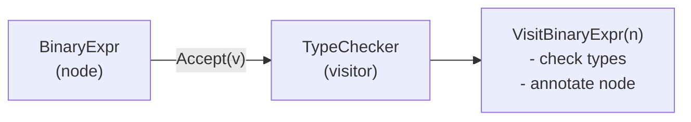

# Chapter 56: Building the Astra AST — The Compiler's Data Model

> "A tree is not just structure. It is the meaning of the program, made visible." — Unknown

---

## Overview

The Abstract Syntax Tree (AST) is the heart of the compiler. It is the data structure that all subsequent compiler phases — semantic analysis, type checking, IR generation — operate on.

In Chapter 55, the parser built the AST while parsing. In this chapter, we step back and study the AST in depth as its own artifact. We will understand the full node type hierarchy, implement a complete pretty printer, and build an AST walker utility that later phases will use to traverse the tree.

Think of the AST as the compiler's internal representation of meaning. The raw source text says `3 + 4 * 2`. The AST says:

```
BinaryExpr(+)
├── IntLiteral(3)
└── BinaryExpr(*)
      ├── IntLiteral(4)
      └── IntLiteral(2)
```

The tree structure encodes precedence, grouping, and nesting. Once you have the AST, you never look at source text again.

---

## Table of Contents

1. Why the AST Is "Abstract"
2. The Node Type Hierarchy
3. The Visitor Pattern
4. Complete AST Pretty Printer
5. Complete AST Walker
6. Position Tracking
7. AST Annotations for Later Phases
8. Complete Implementation
9. Example: Pretty-Printing `fn add`

---

## 1. Why the AST Is "Abstract"

The word "abstract" distinguishes this tree from a **parse tree** (or concrete syntax tree, CST). A parse tree includes every token — parentheses, semicolons, keywords. An AST includes only the semantically meaningful parts.

```
Source:  (3 + 4)

Parse Tree (CST):         AST:
  GroupedExpr               BinaryExpr(+)
  ├── LPAREN                ├── IntLiteral(3)
  ├── BinaryExpr            └── IntLiteral(4)
  │   ├── IntLiteral(3)
  │   ├── PLUS
  │   └── IntLiteral(4)
  └── RPAREN

The parentheses disappear in the AST because their only purpose
was to control precedence — and the tree structure already
encodes that information through nesting.
```

---

## 2. The Node Type Hierarchy

```mermaid
flowchart TD
    N["Node (interface)"]
    N --> D["Declaration (interface)"]
    N --> S["Statement (interface)"]
    N --> E["Expression (interface)"]
    N --> T["TypeExpr (interface)"]

    D --> D1["ImportDeclaration"]
    D --> D2["FnDeclaration"]
    D --> D3["StructDeclaration"]
    D --> D4["ImplDeclaration"]
    D --> D5["ConstDeclaration"]

    S --> S1["LetStatement"]
    S --> S2["ReturnStatement"]
    S --> S3["IfStatement"]
    S --> S4["ForStatement"]
    S --> S5["WhileStatement"]
    S --> S6["BreakStatement"]
    S --> S7["ContinueStatement"]
    S --> S8["BlockStatement"]
    S --> S9["ExpressionStatement"]

    E --> LIT["Literals"]
    E --> ID["Identifiers"]
    E --> OPS["Operations"]
    E --> CALLS["Calls"]
    E --> ACC["Access"]
    E --> COMP["Composite"]
    E --> ERR["ErrorExpr"]

    LIT --> L1["IntLiteral"]
    LIT --> L2["FloatLiteral"]
    LIT --> L3["StringLiteral"]
    LIT --> L4["BoolLiteral"]
    ID --> I1["Identifier"]
    ID --> I2["PathExpr"]
    OPS --> O1["BinaryExpr"]
    OPS --> O2["UnaryExpr"]
    OPS --> O3["AssignExpr"]
    CALLS --> C1["CallExpr"]
    CALLS --> C2["MethodCall"]
    ACC --> A1["FieldAccess"]
    ACC --> A2["IndexExpr"]
    COMP --> P1["StructLiteral"]
    COMP --> P2["RangeExpr"]

    T --> T1["NamedType"]
    T --> T2["FnType"]
    T --> T3["ArrayType"]
```



Each interface has a small set of methods that all implementing types must provide. This is Go's structural typing — no explicit "implements" declaration needed.

---

## 3. The Visitor Pattern

When you have a tree with many different node types, you often need to write algorithms that behave differently for each node type. The **Visitor pattern** solves this cleanly.

Instead of writing:

```go
// Bad: long switch statement in every algorithm
func process(node ast.Node) {
    switch n := node.(type) {
    case *ast.IntLiteral:
        // handle int literal...
    case *ast.BinaryExpr:
        // handle binary expr...
    // ... 20 more cases
    }
}
```

You define a `Visitor` interface with one method per node type:

```go
type Visitor interface {
    VisitIntLiteral(n *IntLiteral)
    VisitBinaryExpr(n *BinaryExpr)
    // ... one method per node type
}
```

And each node implements `Accept`:

```go
func (n *IntLiteral) Accept(v Visitor) {
    v.VisitIntLiteral(n)
}

func (n *BinaryExpr) Accept(v Visitor) {
    v.VisitBinaryExpr(n)
    // Note: visiting children is the Visitor's responsibility
}
```

The advantage: when you add a new algorithm (pretty printing, type checking, IR generation), you implement a new Visitor. You do not modify the AST nodes at all.



---

## 4. Complete AST Pretty Printer

The pretty printer produces a human-readable textual representation of the AST. It is invaluable for debugging — when you're not sure what the parser produced, print the AST.

```go
// ast/printer.go
// Converts an AST back to a readable, indented text representation.

package ast

import (
	"fmt"
	"strings"
)

// Printer produces a human-readable representation of an AST.
type Printer struct {
	sb     strings.Builder
	indent int
}

// Print returns the pretty-printed string for a top-level program.
func Print(prog *Program) string {
	pr := &Printer{}
	pr.printProgram(prog)
	return pr.sb.String()
}

// PrintExpr returns the pretty-printed string for a single expression.
func PrintExpr(expr Expression) string {
	pr := &Printer{}
	pr.printExpr(expr)
	return pr.sb.String()
}

// ─── Indentation helpers ───────────────────────────────────────────────────────

func (pr *Printer) writeln(format string, args ...interface{}) {
	for i := 0; i < pr.indent; i++ {
		pr.sb.WriteString("  ")
	}
	fmt.Fprintf(&pr.sb, format+"\n", args...)
}

func (pr *Printer) push() { pr.indent++ }
func (pr *Printer) pop()  { pr.indent-- }

// ─── Program ───────────────────────────────────────────────────────────────────

func (pr *Printer) printProgram(prog *Program) {
	pr.writeln("Program")
	pr.push()
	for _, decl := range prog.Declarations {
		pr.printDecl(decl)
	}
	pr.pop()
}

// ─── Declarations ──────────────────────────────────────────────────────────────

func (pr *Printer) printDecl(decl Declaration) {
	switch d := decl.(type) {
	case *ImportDeclaration:
		pr.writeln("ImportDeclaration(%q)", d.Path)
	case *FnDeclaration:
		pr.printFnDecl(d)
	case *StructDeclaration:
		pr.printStructDecl(d)
	case *ImplDeclaration:
		pr.printImplDecl(d)
	case *ConstDeclaration:
		pr.writeln("ConstDeclaration(%s)", d.Name)
		pr.push()
		pr.writeln("Type: %s", typeString(d.Type))
		pr.writeln("Value:")
		pr.push()
		pr.printExpr(d.Value)
		pr.pop()
		pr.pop()
	default:
		pr.writeln("<unknown declaration %T>", decl)
	}
}

func (pr *Printer) printFnDecl(fn *FnDeclaration) {
	pub := ""
	if fn.Pub {
		pub = "pub "
	}
	pr.writeln("FnDeclaration(%s%s)", pub, fn.Name)
	pr.push()

	if len(fn.Params) > 0 {
		pr.writeln("Params:")
		pr.push()
		for _, p := range fn.Params {
			pr.writeln("Param(%s: %s)", p.Name, typeString(p.Type))
		}
		pr.pop()
	}

	if fn.ReturnType != nil {
		pr.writeln("ReturnType: %s", typeString(fn.ReturnType))
	}

	pr.writeln("Body:")
	pr.push()
	pr.printBlock(fn.Body)
	pr.pop()

	pr.pop()
}

func (pr *Printer) printStructDecl(s *StructDeclaration) {
	pr.writeln("StructDeclaration(%s)", s.Name)
	pr.push()
	for _, f := range s.Fields {
		pr.writeln("Field(%s: %s)", f.Name, typeString(f.Type))
	}
	pr.pop()
}

func (pr *Printer) printImplDecl(impl *ImplDeclaration) {
	pr.writeln("ImplDeclaration(%s)", impl.TypeName)
	pr.push()
	for _, m := range impl.Methods {
		pr.printFnDecl(m)
	}
	pr.pop()
}

// ─── Statements ────────────────────────────────────────────────────────────────

func (pr *Printer) printBlock(block *Block) {
	for _, stmt := range block.Stmts {
		pr.printStmt(stmt)
	}
}

func (pr *Printer) printStmt(stmt Statement) {
	switch s := stmt.(type) {
	case *LetStatement:
		typeStr := ""
		if s.Type != nil {
			typeStr = ": " + typeString(s.Type)
		}
		pr.writeln("LetStatement(%s%s)", s.Name, typeStr)
		pr.push()
		pr.printExpr(s.Value)
		pr.pop()

	case *ReturnStatement:
		pr.writeln("ReturnStatement")
		if s.Value != nil {
			pr.push()
			pr.printExpr(s.Value)
			pr.pop()
		}

	case *IfStatement:
		pr.writeln("IfStatement")
		pr.push()
		pr.writeln("Condition:")
		pr.push()
		pr.printExpr(s.Condition)
		pr.pop()
		pr.writeln("Then:")
		pr.push()
		pr.printBlock(s.ThenBranch)
		pr.pop()
		if s.ElseBranch != nil {
			pr.writeln("Else:")
			pr.push()
			pr.printStmt(s.ElseBranch)
			pr.pop()
		}
		pr.pop()

	case *ForStatement:
		pr.writeln("ForStatement(%s in ...)", s.VarName)
		pr.push()
		pr.writeln("Range:")
		pr.push()
		pr.printExpr(s.RangeExpr)
		pr.pop()
		pr.writeln("Body:")
		pr.push()
		pr.printBlock(s.Body)
		pr.pop()
		pr.pop()

	case *WhileStatement:
		pr.writeln("WhileStatement")
		pr.push()
		pr.writeln("Condition:")
		pr.push()
		pr.printExpr(s.Condition)
		pr.pop()
		pr.writeln("Body:")
		pr.push()
		pr.printBlock(s.Body)
		pr.pop()
		pr.pop()

	case *ExpressionStatement:
		pr.writeln("ExpressionStatement")
		pr.push()
		pr.printExpr(s.Expr)
		pr.pop()

	case *BlockStatement:
		pr.writeln("Block")
		pr.push()
		pr.printBlock(s.Block)
		pr.pop()

	case *BreakStatement:
		pr.writeln("BreakStatement")

	case *ContinueStatement:
		pr.writeln("ContinueStatement")

	default:
		pr.writeln("<unknown statement %T>", stmt)
	}
}

// ─── Expressions ───────────────────────────────────────────────────────────────

func (pr *Printer) printExpr(expr Expression) {
	switch e := expr.(type) {
	case *IntLiteral:
		pr.writeln("IntLiteral(%d)", e.Value)
	case *FloatLiteral:
		pr.writeln("FloatLiteral(%g)", e.Value)
	case *StringLiteral:
		pr.writeln("StringLiteral(%q)", e.Value)
	case *BoolLiteral:
		pr.writeln("BoolLiteral(%v)", e.Value)
	case *Identifier:
		pr.writeln("Identifier(%s)", e.Name)
	case *PathExpr:
		pr.writeln("PathExpr(%s::%s)", e.Module, e.Name)

	case *BinaryExpr:
		pr.writeln("BinaryExpr(%s)", e.Op)
		pr.push()
		pr.printExpr(e.Left)
		pr.printExpr(e.Right)
		pr.pop()

	case *UnaryExpr:
		pr.writeln("UnaryExpr(%s)", e.Op)
		pr.push()
		pr.printExpr(e.Operand)
		pr.pop()

	case *AssignExpr:
		pr.writeln("AssignExpr")
		pr.push()
		pr.writeln("Target:")
		pr.push()
		pr.printExpr(e.Target)
		pr.pop()
		pr.writeln("Value:")
		pr.push()
		pr.printExpr(e.Value)
		pr.pop()
		pr.pop()

	case *CallExpr:
		pr.writeln("CallExpr")
		pr.push()
		pr.writeln("Callee:")
		pr.push()
		pr.printExpr(e.Callee)
		pr.pop()
		if len(e.Args) > 0 {
			pr.writeln("Args:")
			pr.push()
			for _, arg := range e.Args {
				pr.printExpr(arg)
			}
			pr.pop()
		}
		pr.pop()

	case *MethodCall:
		pr.writeln("MethodCall(.%s)", e.Method)
		pr.push()
		pr.writeln("Object:")
		pr.push()
		pr.printExpr(e.Object)
		pr.pop()
		if len(e.Args) > 0 {
			pr.writeln("Args:")
			pr.push()
			for _, arg := range e.Args {
				pr.printExpr(arg)
			}
			pr.pop()
		}
		pr.pop()

	case *FieldAccess:
		pr.writeln("FieldAccess(.%s)", e.Field)
		pr.push()
		pr.printExpr(e.Object)
		pr.pop()

	case *IndexExpr:
		pr.writeln("IndexExpr")
		pr.push()
		pr.printExpr(e.Object)
		pr.writeln("Index:")
		pr.push()
		pr.printExpr(e.Index)
		pr.pop()
		pr.pop()

	case *RangeExpr:
		pr.writeln("RangeExpr(..)")
		pr.push()
		pr.printExpr(e.Start)
		pr.printExpr(e.End)
		pr.pop()

	case *StructLiteral:
		pr.writeln("StructLiteral(%s)", e.TypeName)
		pr.push()
		for _, f := range e.Fields {
			pr.writeln("Field(%s):", f.Name)
			pr.push()
			pr.printExpr(f.Value)
			pr.pop()
		}
		pr.pop()

	case *ErrorExpr:
		pr.writeln("<error>")

	default:
		pr.writeln("<unknown expression %T>", expr)
	}
}

// ─── Type string helper ────────────────────────────────────────────────────────

func typeString(t TypeExpr) string {
	if t == nil {
		return "void"
	}
	switch ty := t.(type) {
	case *NamedType:
		return ty.Name
	case *FnType:
		var params []string
		for _, p := range ty.Params {
			params = append(params, typeString(p))
		}
		return fmt.Sprintf("fn(%s) -> %s", strings.Join(params, ", "), typeString(ty.Return))
	case *ArrayType:
		return fmt.Sprintf("[%s]", typeString(ty.Element))
	default:
		return fmt.Sprintf("<%T>", t)
	}
}
```

---

## 5. Complete AST Walker

The walker traverses every node in the AST, calling a user-provided callback at each node. This is useful for analyses that do not need full visitor dispatch — for example, collecting all identifiers or counting how many times a variable is used.

```go
// ast/walker.go
// Generic AST traversal utility.

package ast

// WalkFn is called for each node during traversal.
// If it returns false, the walker does not descend into children.
type WalkFn func(node Node) bool

// Walk traverses the entire program, calling fn for each node.
func Walk(prog *Program, fn WalkFn) {
	for _, decl := range prog.Declarations {
		walkDecl(decl, fn)
	}
}

func walkDecl(decl Declaration, fn WalkFn) {
	if !fn(decl) {
		return
	}
	switch d := decl.(type) {
	case *FnDeclaration:
		for _, p := range d.Params {
			if p.Type != nil {
				fn(p.Type)
			}
		}
		if d.ReturnType != nil {
			fn(d.ReturnType)
		}
		walkBlock(d.Body, fn)
	case *StructDeclaration:
		for _, f := range d.Fields {
			if f.Type != nil {
				fn(f.Type)
			}
		}
	case *ImplDeclaration:
		for _, m := range d.Methods {
			walkDecl(m, fn)
		}
	case *ConstDeclaration:
		walkExpr(d.Value, fn)
	}
}

func walkBlock(block *Block, fn WalkFn) {
	if block == nil {
		return
	}
	for _, stmt := range block.Stmts {
		walkStmt(stmt, fn)
	}
}

func walkStmt(stmt Statement, fn WalkFn) {
	if !fn(stmt) {
		return
	}
	switch s := stmt.(type) {
	case *LetStatement:
		if s.Value != nil {
			walkExpr(s.Value, fn)
		}
	case *ReturnStatement:
		if s.Value != nil {
			walkExpr(s.Value, fn)
		}
	case *IfStatement:
		walkExpr(s.Condition, fn)
		walkBlock(s.ThenBranch, fn)
		if s.ElseBranch != nil {
			walkStmt(s.ElseBranch, fn)
		}
	case *ForStatement:
		walkExpr(s.RangeExpr, fn)
		walkBlock(s.Body, fn)
	case *WhileStatement:
		walkExpr(s.Condition, fn)
		walkBlock(s.Body, fn)
	case *ExpressionStatement:
		walkExpr(s.Expr, fn)
	case *BlockStatement:
		walkBlock(s.Block, fn)
	}
}

func walkExpr(expr Expression, fn WalkFn) {
	if expr == nil || !fn(expr) {
		return
	}
	switch e := expr.(type) {
	case *BinaryExpr:
		walkExpr(e.Left, fn)
		walkExpr(e.Right, fn)
	case *UnaryExpr:
		walkExpr(e.Operand, fn)
	case *AssignExpr:
		walkExpr(e.Target, fn)
		walkExpr(e.Value, fn)
	case *CallExpr:
		walkExpr(e.Callee, fn)
		for _, arg := range e.Args {
			walkExpr(arg, fn)
		}
	case *MethodCall:
		walkExpr(e.Object, fn)
		for _, arg := range e.Args {
			walkExpr(arg, fn)
		}
	case *FieldAccess:
		walkExpr(e.Object, fn)
	case *IndexExpr:
		walkExpr(e.Object, fn)
		walkExpr(e.Index, fn)
	case *RangeExpr:
		walkExpr(e.Start, fn)
		walkExpr(e.End, fn)
	case *StructLiteral:
		for _, f := range e.Fields {
			walkExpr(f.Value, fn)
		}
	// Leaf nodes: IntLiteral, FloatLiteral, StringLiteral, BoolLiteral,
	// Identifier, PathExpr, ErrorExpr — no children to walk
	}
}

// ─── Utility functions built on Walk ──────────────────────────────────────────

// CollectIdentifiers returns all identifier names used in a program.
func CollectIdentifiers(prog *Program) []string {
	var names []string
	Walk(prog, func(node Node) bool {
		if ident, ok := node.(*Identifier); ok {
			names = append(names, ident.Name)
		}
		return true // always descend
	})
	return names
}

// CountNodes returns the total number of AST nodes in a program.
func CountNodes(prog *Program) int {
	count := 0
	Walk(prog, func(node Node) bool {
		count++
		return true
	})
	return count
}

// FindFunctionByName returns the FnDeclaration with the given name, or nil.
func FindFunctionByName(prog *Program, name string) *FnDeclaration {
	for _, decl := range prog.Declarations {
		if fn, ok := decl.(*FnDeclaration); ok && fn.Name == name {
			return fn
		}
	}
	return nil
}
```

---

## 6. Example: Pretty-Printing `fn add`

Let us trace through what happens when we parse and pretty-print:

```astra
fn add(a: int, b: int) -> int {
    return a + b
}
```

**Step 1: Lexer produces tokens**
```
FN IDENT("add") LPAREN IDENT("a") COLON IDENT("int") COMMA
IDENT("b") COLON IDENT("int") RPAREN ARROW IDENT("int")
LBRACE RETURN IDENT("a") PLUS IDENT("b") RBRACE EOF
```

**Step 2: Parser produces AST**
```
FnDeclaration
  name: "add"
  pub: false
  params:
    Param{name:"a", type: NamedType{"int"}}
    Param{name:"b", type: NamedType{"int"}}
  returnType: NamedType{"int"}
  body: Block
    statements:
      ReturnStatement
        value: BinaryExpr
          op: "+"
          left: Identifier{"a"}
          right: Identifier{"b"}
```

**Step 3: Pretty printer produces**:
```
Program
  FnDeclaration(add)
    Params:
      Param(a: int)
      Param(b: int)
    ReturnType: int
    Body:
      ReturnStatement
        BinaryExpr(+)
          Identifier(a)
          Identifier(b)
```

This matches exactly what the chapter introduction promised.

---

## 7. Testing the AST

```go
// ast/ast_test.go
package ast

import (
	"strings"
	"testing"
)

func TestPrinterFnDecl(t *testing.T) {
	prog := &Program{
		Declarations: []Declaration{
			&FnDeclaration{
				Name: "add",
				Params: []Param{
					{Name: "a", Type: &NamedType{Name: "int"}},
					{Name: "b", Type: &NamedType{Name: "int"}},
				},
				ReturnType: &NamedType{Name: "int"},
				Body: &Block{
					Stmts: []Statement{
						&ReturnStatement{
							Value: &BinaryExpr{
								Op:    "+",
								Left:  &Identifier{Name: "a"},
								Right: &Identifier{Name: "b"},
							},
						},
					},
				},
			},
		},
	}

	output := Print(prog)

	expectedParts := []string{
		"FnDeclaration(add)",
		"Param(a: int)",
		"Param(b: int)",
		"ReturnType: int",
		"ReturnStatement",
		"BinaryExpr(+)",
		"Identifier(a)",
		"Identifier(b)",
	}

	for _, part := range expectedParts {
		if !strings.Contains(output, part) {
			t.Errorf("expected output to contain %q\nGot:\n%s", part, output)
		}
	}
}

func TestWalkerCollectIdentifiers(t *testing.T) {
	prog := &Program{
		Declarations: []Declaration{
			&FnDeclaration{
				Name: "main",
				Body: &Block{
					Stmts: []Statement{
						&ExpressionStatement{
							Expr: &BinaryExpr{
								Op:    "+",
								Left:  &Identifier{Name: "x"},
								Right: &Identifier{Name: "y"},
							},
						},
					},
				},
			},
		},
	}

	names := CollectIdentifiers(prog)

	found := map[string]bool{}
	for _, n := range names {
		found[n] = true
	}

	if !found["x"] {
		t.Error("expected identifier 'x'")
	}
	if !found["y"] {
		t.Error("expected identifier 'y'")
	}
}

func TestWalkerCountNodes(t *testing.T) {
	prog := &Program{
		Declarations: []Declaration{
			&FnDeclaration{
				Name: "add",
				Params: []Param{
					{Name: "a", Type: &NamedType{Name: "int"}},
				},
				Body: &Block{
					Stmts: []Statement{
						&ReturnStatement{
							Value: &Identifier{Name: "a"},
						},
					},
				},
			},
		},
	}

	count := CountNodes(prog)
	// FnDeclaration, ReturnStatement, Identifier("a") = at minimum 3
	if count < 3 {
		t.Errorf("expected at least 3 nodes, got %d", count)
	}
}

func TestFindFunctionByName(t *testing.T) {
	prog := &Program{
		Declarations: []Declaration{
			&FnDeclaration{Name: "foo"},
			&FnDeclaration{Name: "bar"},
		},
	}

	fn := FindFunctionByName(prog, "bar")
	if fn == nil {
		t.Fatal("expected to find function 'bar'")
	}
	if fn.Name != "bar" {
		t.Errorf("expected name 'bar', got %q", fn.Name)
	}

	notFound := FindFunctionByName(prog, "baz")
	if notFound != nil {
		t.Error("expected nil for non-existent function 'baz'")
	}
}

func TestTypeString(t *testing.T) {
	cases := []struct {
		typ      TypeExpr
		expected string
	}{
		{&NamedType{Name: "int"}, "int"},
		{&NamedType{Name: "string"}, "string"},
		{&ArrayType{Element: &NamedType{Name: "int"}}, "[int]"},
		{&FnType{
			Params: []TypeExpr{&NamedType{Name: "int"}, &NamedType{Name: "int"}},
			Return: &NamedType{Name: "int"},
		}, "fn(int, int) -> int"},
	}

	for _, c := range cases {
		got := typeString(c.typ)
		if got != c.expected {
			t.Errorf("typeString(%T): expected %q, got %q", c.typ, c.expected, got)
		}
	}
}
```

---

## 8. How Subsequent Phases Use the AST

Each compiler phase traverses the AST and either reads from it or annotates it:

```
ASCII Diagram: AST Through the Compiler Pipeline

Original AST (from parser):
  BinaryExpr(+)
  ├── Identifier("x")
  └── IntLiteral(42)

After Semantic Analysis:
  BinaryExpr(+)
  ├── Identifier("x") → resolves to LetStatement at line 3
  └── IntLiteral(42)

After Type Checking:
  BinaryExpr(+) [type: int]
  ├── Identifier("x") [type: int]
  └── IntLiteral(42) [type: int]

After IR Generation:
  (not AST anymore — converted to IR instructions)
    t0 = load x
    t1 = 42
    t2 = t0 + t1
```

The cleanest way to annotate the AST is to add an optional type field to each expression node. In Chapter 58, we will add:

```go
type BinaryExpr struct {
	Op         string
	Left       Expression
	Right      Expression
	StartPos   lexer.Position
	ResolvedType Type  // filled in by type checker
}
```

Alternatively, you can maintain a separate `map[Expression]Type` keyed by node pointer. Both approaches work.

---

## Summary Table

| Component | File | Purpose |
|---|---|---|
| Node interfaces | `ast/ast.go` | Base interfaces for all nodes |
| Concrete node types | `ast/nodes.go` | All declaration/statement/expression types |
| Pretty printer | `ast/printer.go` | Human-readable AST output for debugging |
| Walker | `ast/walker.go` | Generic traversal with callback |
| Utilities | `ast/walker.go` | CollectIdentifiers, CountNodes, FindFunctionByName |
| Tests | `ast/ast_test.go` | Printer and walker tests |

---

## Exercises

1. **Add Node Counts**: Extend the `Printer` to show the count of nodes at each level. For example: `FnDeclaration(add) [3 statements]`.

2. **Infix Printer**: Implement a different printer that produces Astra source code from the AST (a "decompiler"). This is called a "pretty printer" in the traditional sense. Test it by verifying that parsing the output produces the same AST.

3. **Cycle Detection**: The walker currently has no cycle detection. If someone accidentally creates a cycle in the AST (a node pointing to an ancestor), the walker would loop forever. Add a visited-set to the walker to detect and report cycles.

4. **Pattern Matching Extension**: Add a `MatchStatement` node for Astra's `match` syntax. Define the complete node structure: a `MatchStatement` has a subject expression and a list of `MatchArm` nodes, each with a pattern and a body block. Implement the printer for it.

5. **AST Diff**: Implement a function `DiffASTs(a, b *Program) []string` that returns a list of differences between two ASTs. This is useful for testing — you can compare the AST of a refactored program with the original to verify the refactoring was semantics-preserving.

6. **Node Counter by Type**: Use the walker to implement a function that returns a `map[string]int` counting how many of each node type appear in a program. Run it on the sample Astra program from Chapter 53 and report the counts.

7. **Visitor Interface**: Implement the full Visitor interface pattern described in section 3. Write a concrete `NameCollectorVisitor` that collects all identifier names. Compare the verbosity with the walker approach.

8. **JSON Serialization**: Implement `MarshalJSON` for each AST node type so that the AST can be serialized to JSON. This allows tools like language servers and IDEs to exchange AST information with the compiler.
