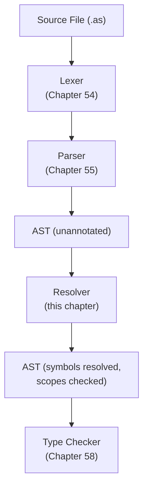

# Chapter 57: Building the Astra Semantic Analyzer

> "Parsing turns text into trees. Semantics turns trees into meaning. Without semantics, your program is just a well-formed sentence that says nothing true." — Unknown

---

## Overview

The parser's job is structural: it checks that your source code is grammatically valid. A parser does not know or care whether `xyz` refers to a real variable, whether you are calling a function with the right number of arguments, or whether you are using `break` outside of a loop. Those are semantic questions — questions of meaning — and they belong to the **semantic analyzer**.

The semantic analyzer is the compiler's first pass that understands what the code is actually trying to do. It works on the AST that the parser produced, and it does two things:

1. **Name resolution**: every identifier in the program must refer to a defined symbol. Variable references, function calls, field accesses, type names — all of these must be traced back to their declaration.
2. **Scope management**: declarations are visible only within certain regions of the program (a function's variables are not visible outside that function). The analyzer enforces these rules by maintaining a stack of scopes.

By the time the semantic analyzer is done, every `Identifier` node in the AST is annotated with a pointer to its symbol (the thing it refers to). Subsequent phases — the type checker, the IR generator — never need to look up names again. All name questions are settled here.

The semantic analyzer in Astra is called the **Resolver**. This chapter implements it completely.

---

## What We're Building



---

## Table of Contents

1. Why a Separate Semantic Analysis Phase?
2. Symbols and the Symbol Table
3. Scopes and the Scope Stack
4. The Resolver Struct
5. Two-Pass Resolution
6. Resolving Declarations
7. Resolving Statements
8. Resolving Expressions
9. Import Resolution
10. Error Messages
11. Complete Implementation
12. Testing the Resolver

---

## 1. Why a Separate Semantic Analysis Phase?

You might wonder: why not do name resolution inside the parser? The parser is already walking the code — couldn't it just look things up as it goes?

The answer is **forward references**. Consider this Astra program:

```astra
fn main() {
    greet("Aditya")
}

fn greet(name: string) {
    print("Hello, " + name)
}
```

When the parser sees the call to `greet` inside `main`, it has not yet seen the definition of `greet`. It has not even seen the `fn greet` line. A single-pass parser that tried to resolve names would fail here.

There are three solutions to this problem:

1. **Require declarations before use** (C's approach). This forces header files or forward declarations. It is cumbersome.
2. **Pre-scan for declarations** before resolving (a two-pass approach). This is what Astra does.
3. **Defer resolution** by storing unresolved references and resolving them after parsing is complete. This is essentially the same as approach 2.

Astra uses a clean two-pass design: first scan the entire program to collect all top-level declarations (function names, struct names, import names), then resolve all bodies. This is also why the semantic analysis is a separate phase from parsing.

---

## 2. Symbols and the Symbol Table

A **symbol** is a named entity in the program. Functions, variables, struct types, parameters — all of these are symbols. Every symbol has a name, a kind, and eventually a type (populated by the type checker in Chapter 58).

```go
// sema/symbol.go

package sema

import "astra/ast"

// SymbolKind classifies what kind of thing a symbol refers to.
type SymbolKind int

const (
    SymVar    SymbolKind = iota // local variable or parameter
    SymFn                       // function
    SymStruct                   // struct type
    SymField                    // struct field
    SymImport                   // imported package
)

func (k SymbolKind) String() string {
    switch k {
    case SymVar:    return "variable"
    case SymFn:     return "function"
    case SymStruct: return "struct"
    case SymField:  return "field"
    case SymImport: return "import"
    default:        return "unknown"
    }
}

// Symbol represents a single named entity in the Astra program.
type Symbol struct {
    Name    string
    Kind    SymbolKind
    Decl    ast.Node   // the AST node where this was declared
    Type    Type       // populated by the type checker (Chapter 58)
    Mutable bool       // is this a `let mut` variable?
}

// StructInfo holds the resolved information about a struct type.
type StructInfo struct {
    Name   string
    Fields []*FieldInfo
    // Methods are resolved by resolveImplDecl
    Methods map[string]*Symbol
}

// FieldInfo holds the name and declared type annotation of one struct field.
type FieldInfo struct {
    Name    string
    TypeAnn ast.TypeAnnotation // the raw syntax node for the type
}
```

The `Type` field is intentionally left nil after the resolver runs. It is the type checker's job to fill it in. The resolver only cares about names and scopes, not types.

---

## 3. Scopes and the Scope Stack

A **scope** is a mapping from name to symbol. When you enter a function, you push a new scope. When you exit the function, you pop it. Variable declarations add entries to the current (top) scope. Variable lookups search from the top of the stack down to the bottom.

```
Scope stack during execution of greet():

  Top (innermost scope)
  ┌─────────────────────┐
  │  name → Symbol{...} │  <- function body scope
  └─────────────────────┘
  ┌─────────────────────┐
  │  name → Symbol{...} │  <- function parameter scope
  └─────────────────────┘
  Bottom (package-level globals)
  ┌─────────────────────┐
  │  main  → Symbol{fn} │
  │  greet → Symbol{fn} │  <- global scope
  └─────────────────────┘
```

```go
// sema/scope.go

package sema

// Scope is a single level of the scope stack.
type Scope struct {
    symbols map[string]*Symbol
    parent  *Scope // nil for the global scope
}

// NewScope creates a new empty scope.
func NewScope() *Scope {
    return &Scope{symbols: make(map[string]*Symbol)}
}

// Define adds a symbol to this scope. Returns an error if the name
// is already defined in THIS scope (shadowing outer scopes is allowed).
func (s *Scope) Define(name string, sym *Symbol) error {
    if _, exists := s.symbols[name]; exists {
        return fmt.Errorf("'%s' already defined in this scope", name)
    }
    s.symbols[name] = sym
    return nil
}

// Lookup searches this scope only (not parent scopes).
func (s *Scope) Lookup(name string) (*Symbol, bool) {
    sym, ok := s.symbols[name]
    return sym, ok
}
```

---

## 4. The Resolver Struct

The `Resolver` is the main struct that drives semantic analysis. It holds:

- A stack of scopes (the active lexical scopes)
- A diagnostics engine for collecting errors without stopping early
- A global symbol table for package-level declarations
- A struct registry for looking up struct definitions
- Context fields tracking what we are currently inside (function, loop)

```go
// sema/resolver.go

package sema

import (
    "fmt"
    "strings"
    "astra/ast"
    "astra/diag"
)

// Resolver performs name resolution and scope checking on the AST.
type Resolver struct {
    scopes  []*Scope              // scope stack; index 0 = global
    diag    *diag.DiagEngine      // collects errors without panicking
    globals map[string]*Symbol    // package-level symbols (populated in pass 1)
    structs map[string]*StructInfo // struct type registry
    current *ast.FnDeclaration    // current function being analyzed (nil at top level)
    inLoop  bool                  // are we inside a for/while loop?
}

// NewResolver creates a Resolver with the global scope already pushed.
func NewResolver(d *diag.DiagEngine) *Resolver {
    r := &Resolver{
        diag:    d,
        globals: make(map[string]*Symbol),
        structs: make(map[string]*StructInfo),
    }
    // Push the global scope immediately.
    r.scopes = []*Scope{NewScope()}
    return r
}

// --- Scope management -------------------------------------------------

// pushScope pushes a new scope onto the stack.
func (r *Resolver) pushScope() {
    r.scopes = append(r.scopes, NewScope())
}

// popScope pops the innermost scope.
func (r *Resolver) popScope() {
    if len(r.scopes) == 0 {
        panic("resolver: popScope on empty stack")
    }
    r.scopes = r.scopes[:len(r.scopes)-1]
}

// currentScope returns the innermost (top) scope.
func (r *Resolver) currentScope() *Scope {
    return r.scopes[len(r.scopes)-1]
}

// define adds a symbol to the innermost scope.
// It also records the symbol in globals if we are at the global scope.
func (r *Resolver) define(name string, sym *Symbol) error {
    err := r.currentScope().Define(name, sym)
    if err != nil {
        return fmt.Errorf("S002: %w", err)
    }
    if len(r.scopes) == 1 {
        r.globals[name] = sym
    }
    return nil
}

// resolve walks the scope stack from top to bottom, returning the first
// symbol with the given name, or (nil, false) if not found.
func (r *Resolver) resolve(name string) (*Symbol, bool) {
    for i := len(r.scopes) - 1; i >= 0; i-- {
        if sym, ok := r.scopes[i].Lookup(name); ok {
            return sym, true
        }
    }
    return nil, false
}
```

---

## 5. Two-Pass Resolution

Pass 1 collects all top-level names. Pass 2 resolves all bodies.

```
PASS 1: Scan declarations
  fn main()  → add "main"  to globals
  fn greet() → add "greet" to globals
  struct Point → add "Point" to globals, register in structs map

PASS 2: Resolve bodies
  resolving main():
    sees greet("Aditya")
    looks up "greet" → found in globals ✓
    annotates the CallExpr node with the greet symbol

  resolving greet(name: string):
    pushes scope for parameters
    defines "name" in parameter scope
    sees print("Hello, " + name)
    looks up "print" → found in globals (stdlib) ✓
    looks up "name"  → found in parameter scope ✓
```

```go
// ResolveProgram is the entry point. It runs both passes.
func (r *Resolver) ResolveProgram(prog *ast.Program) {
    // --- PASS 1: collect all top-level declarations ---------------
    for _, decl := range prog.Declarations {
        r.collectDeclaration(decl)
    }

    // Pre-define stdlib builtins in the global scope.
    r.registerBuiltins()

    // --- PASS 2: resolve bodies -----------------------------------
    for _, decl := range prog.Declarations {
        r.resolveDeclaration(decl)
    }
}

// collectDeclaration registers a top-level declaration into globals.
// It does NOT resolve any expressions or bodies — that is Pass 2.
func (r *Resolver) collectDeclaration(decl ast.Declaration) {
    switch d := decl.(type) {
    case *ast.FnDeclaration:
        sym := &Symbol{Name: d.Name, Kind: SymFn, Decl: d}
        if err := r.define(d.Name, sym); err != nil {
            r.diag.Error(d.Pos, "S002", fmt.Sprintf("function '%s' already declared", d.Name))
        }

    case *ast.StructDeclaration:
        sym := &Symbol{Name: d.Name, Kind: SymStruct, Decl: d}
        if err := r.define(d.Name, sym); err != nil {
            r.diag.Error(d.Pos, "S002", fmt.Sprintf("struct '%s' already declared", d.Name))
        }
        // Build StructInfo for field lookups in Pass 2.
        info := &StructInfo{
            Name:    d.Name,
            Methods: make(map[string]*Symbol),
        }
        for _, f := range d.Fields {
            info.Fields = append(info.Fields, &FieldInfo{Name: f.Name, TypeAnn: f.Type})
        }
        r.structs[d.Name] = info

    case *ast.ImportDeclaration:
        r.resolveImportDecl(d) // Imports can be resolved in Pass 1.

    case *ast.ImplDeclaration:
        // impl blocks are collected but their bodies resolved in Pass 2.
        // The struct must already exist (error if not).
    }
}

// registerBuiltins pre-defines the stdlib functions in the global scope.
func (r *Resolver) registerBuiltins() {
    builtins := []string{
        "print", "println", "panic", "len", "cap",
        "make", "append", "delete",
    }
    for _, name := range builtins {
        sym := &Symbol{Name: name, Kind: SymFn}
        // Ignore errors — if user redefines a builtin, we allow shadowing.
        _ = r.currentScope().Define(name, sym)
    }
}
```

---

## 6. Resolving Declarations

```go
// resolveDeclaration dispatches to the appropriate resolver for each declaration type.
func (r *Resolver) resolveDeclaration(decl ast.Declaration) {
    switch d := decl.(type) {
    case *ast.FnDeclaration:
        r.resolveFnDeclaration(d)
    case *ast.StructDeclaration:
        r.resolveStructDecl(d)
    case *ast.ImplDeclaration:
        r.resolveImplDecl(d)
    case *ast.ImportDeclaration:
        // Already resolved in Pass 1.
    }
}

// resolveFnDeclaration resolves the body of one function.
func (r *Resolver) resolveFnDeclaration(fn *ast.FnDeclaration) {
    prev := r.current
    r.current = fn

    // Push a parameter scope.
    r.pushScope()
    for _, param := range fn.Params {
        sym := &Symbol{Name: param.Name, Kind: SymVar, Decl: fn}
        if err := r.define(param.Name, sym); err != nil {
            r.diag.Error(param.Pos, "S002",
                fmt.Sprintf("parameter '%s' already declared in this function", param.Name))
        }
    }

    // Resolve the function body.
    r.pushScope()
    for _, stmt := range fn.Body {
        r.resolveStatement(stmt)
    }
    r.popScope()
    r.popScope()

    r.current = prev
}

// resolveStructDecl checks field type annotations are resolvable.
func (r *Resolver) resolveStructDecl(s *ast.StructDeclaration) {
    for _, field := range s.Fields {
        r.resolveTypeAnnotation(field.Type, field.Pos)
    }
}

// resolveImplDecl resolves all methods in an impl block for a struct.
func (r *Resolver) resolveImplDecl(impl *ast.ImplDeclaration) {
    info, ok := r.structs[impl.TypeName]
    if !ok {
        r.diag.Error(impl.Pos, "S003",
            fmt.Sprintf("impl for unknown struct '%s'", impl.TypeName))
        return
    }

    for _, method := range impl.Methods {
        sym := &Symbol{Name: method.Name, Kind: SymFn, Decl: method}
        info.Methods[method.Name] = sym
        r.resolveFnDeclaration(method)
    }
}

// resolveImportDecl resolves an import statement, loading the stdlib package.
func (r *Resolver) resolveImportDecl(imp *ast.ImportDeclaration) {
    pkg := r.loadStdlibPackage(imp.Path)
    if pkg == nil {
        r.diag.Error(imp.Pos, "S008",
            fmt.Sprintf("unknown import path '%s'", imp.Path))
        return
    }
    // Bind the package name (or alias) to the import symbol.
    name := imp.Alias
    if name == "" {
        // Use the last component of the path as the name.
        parts := strings.Split(imp.Path, "/")
        name = parts[len(parts)-1]
    }
    sym := &Symbol{Name: name, Kind: SymImport, Decl: imp}
    if err := r.define(name, sym); err != nil {
        r.diag.Error(imp.Pos, "S002",
            fmt.Sprintf("import name '%s' conflicts with existing symbol", name))
    }
}

// resolveTypeAnnotation checks that a type name used in the source is known.
func (r *Resolver) resolveTypeAnnotation(ta ast.TypeAnnotation, pos ast.Position) {
    switch t := ta.(type) {
    case *ast.NamedType:
        // Primitive types are always valid.
        primitives := map[string]bool{
            "int": true, "float": true, "string": true, "bool": true, "void": true,
        }
        if primitives[t.Name] {
            return
        }
        // Otherwise it must be a known struct.
        if _, ok := r.structs[t.Name]; !ok {
            r.diag.Error(pos, "S005",
                fmt.Sprintf("unknown type '%s'", t.Name))
        }
    case *ast.ListType:
        r.resolveTypeAnnotation(t.Elem, pos)
    case *ast.FnType:
        for _, p := range t.Params {
            r.resolveTypeAnnotation(p, pos)
        }
        r.resolveTypeAnnotation(t.Return, pos)
    }
}
```

---

## 7. Resolving Statements

```go
// resolveStatement resolves one statement, dispatching on its type.
func (r *Resolver) resolveStatement(stmt ast.Statement) {
    switch s := stmt.(type) {

    case *ast.VarDecl:
        // Resolve the value expression BEFORE defining the variable.
        // This prevents `let x = x + 1` from using x to define x.
        if s.Value != nil {
            r.resolveExpression(s.Value)
        }
        sym := &Symbol{
            Name:    s.Name,
            Kind:    SymVar,
            Decl:    s,
            Mutable: s.Mutable,
        }
        if err := r.define(s.Name, sym); err != nil {
            r.diag.Error(s.Pos, "S002",
                fmt.Sprintf("variable '%s' already declared in this scope", s.Name))
        }
        // Attach the symbol to the AST node for the type checker.
        s.Symbol = sym

    case *ast.AssignStmt:
        r.resolveExpression(s.Target)
        r.resolveExpression(s.Value)
        // Check the target is assignable (not a function, not an immutable let).
        r.checkAssignable(s.Target)

    case *ast.ExprStmt:
        r.resolveExpression(s.Expr)

    case *ast.IfStatement:
        r.resolveExpression(s.Condition)
        r.pushScope()
        for _, stmt := range s.Then {
            r.resolveStatement(stmt)
        }
        r.popScope()
        if len(s.Else) > 0 {
            r.pushScope()
            for _, stmt := range s.Else {
                r.resolveStatement(stmt)
            }
            r.popScope()
        }

    case *ast.ForStatement:
        // for i in start..end { body }
        r.resolveExpression(s.Start)
        r.resolveExpression(s.End)
        r.pushScope()
        // Define the loop variable.
        loopVar := &Symbol{Name: s.VarName, Kind: SymVar, Decl: s, Mutable: false}
        if err := r.define(s.VarName, loopVar); err != nil {
            r.diag.Error(s.Pos, "S002",
                fmt.Sprintf("loop variable '%s' already declared", s.VarName))
        }
        s.VarSymbol = loopVar
        prevLoop := r.inLoop
        r.inLoop = true
        for _, stmt := range s.Body {
            r.resolveStatement(stmt)
        }
        r.inLoop = prevLoop
        r.popScope()

    case *ast.WhileStatement:
        r.resolveExpression(s.Condition)
        r.pushScope()
        prevLoop := r.inLoop
        r.inLoop = true
        for _, stmt := range s.Body {
            r.resolveStatement(stmt)
        }
        r.inLoop = prevLoop
        r.popScope()

    case *ast.ReturnStatement:
        if r.current == nil {
            r.diag.Error(s.Pos, "S006", "return outside of function")
            return
        }
        if s.Value != nil {
            r.resolveExpression(s.Value)
        }

    case *ast.BreakStatement:
        if !r.inLoop {
            r.diag.Error(s.Pos, "S007", "break outside of loop")
        }

    case *ast.ContinueStatement:
        if !r.inLoop {
            r.diag.Error(s.Pos, "S007", "continue outside of loop")
        }

    case *ast.BlockStatement:
        r.pushScope()
        for _, stmt := range s.Stmts {
            r.resolveStatement(stmt)
        }
        r.popScope()

    default:
        // Unknown statement kind — this is a compiler bug.
        panic(fmt.Sprintf("resolver: unhandled statement type %T", stmt))
    }
}

// checkAssignable verifies that a target expression can appear on the left
// side of an assignment. Identifiers of mutable variables are assignable;
// field accesses and index expressions are assignable; everything else is not.
func (r *Resolver) checkAssignable(expr ast.Expression) {
    switch e := expr.(type) {
    case *ast.Identifier:
        sym, ok := r.resolve(e.Name)
        if !ok {
            // The resolve pass already reported an error for undefined names.
            return
        }
        if !sym.Mutable && sym.Kind == SymVar {
            r.diag.Error(e.Pos, "S009",
                fmt.Sprintf("cannot assign to immutable variable '%s' (declare with 'let mut')", e.Name))
        }
    case *ast.FieldAccess, *ast.IndexExpr:
        // Field accesses and index expressions are always assignable.
        // (struct mutability is enforced at the type level in Chapter 58)
    default:
        r.diag.Error(expr.GetPos(), "S010",
            "invalid assignment target")
    }
}
```

---

## 8. Resolving Expressions

```go
// resolveExpression resolves all name references in an expression.
// It annotates each Identifier with its resolved Symbol.
func (r *Resolver) resolveExpression(expr ast.Expression) {
    switch e := expr.(type) {

    case *ast.Identifier:
        sym, ok := r.resolve(e.Name)
        if !ok {
            hint := r.suggestName(e.Name)
            msg := fmt.Sprintf("undefined variable '%s'", e.Name)
            if hint != "" {
                msg += fmt.Sprintf("\n   hint: did you mean '%s'?", hint)
            }
            r.diag.Error(e.Pos, "S001", msg)
            return
        }
        // Annotate the AST node with the resolved symbol.
        e.Symbol = sym

    case *ast.IntLiteral, *ast.FloatLiteral, *ast.StringLiteral, *ast.BoolLiteral:
        // Literals need no resolution.

    case *ast.BinaryExpr:
        r.resolveExpression(e.Left)
        r.resolveExpression(e.Right)

    case *ast.UnaryExpr:
        r.resolveExpression(e.Operand)

    case *ast.CallExpr:
        r.resolveExpression(e.Callee)
        for _, arg := range e.Args {
            r.resolveExpression(arg)
        }
        // Validate argument count if the callee resolved to a known function.
        if ident, ok := e.Callee.(*ast.Identifier); ok && ident.Symbol != nil {
            if fnDecl, ok := ident.Symbol.Decl.(*ast.FnDeclaration); ok {
                if len(e.Args) != len(fnDecl.Params) {
                    r.diag.Error(e.Pos, "S004",
                        fmt.Sprintf("function '%s' expects %d argument(s), got %d",
                            ident.Name, len(fnDecl.Params), len(e.Args)))
                }
            }
        }

    case *ast.FieldAccess:
        r.resolveExpression(e.Object)
        // We cannot check the field name here — we do not know the type yet.
        // Field checking is deferred to the type checker in Chapter 58.

    case *ast.IndexExpr:
        r.resolveExpression(e.Object)
        r.resolveExpression(e.Index)

    case *ast.StructLiteral:
        // Check the struct type name is known.
        if _, ok := r.structs[e.TypeName]; !ok {
            r.diag.Error(e.Pos, "S003",
                fmt.Sprintf("unknown struct type '%s'", e.TypeName))
        }
        // Resolve all field values.
        for _, field := range e.Fields {
            r.resolveExpression(field.Value)
        }

    case *ast.ListLiteral:
        for _, elem := range e.Elements {
            r.resolveExpression(elem)
        }

    case *ast.FnLiteral:
        // Anonymous function: push a new scope, define params, resolve body.
        r.pushScope()
        for _, param := range e.Params {
            sym := &Symbol{Name: param.Name, Kind: SymVar, Decl: e}
            _ = r.define(param.Name, sym)
        }
        for _, stmt := range e.Body {
            r.resolveStatement(stmt)
        }
        r.popScope()

    default:
        panic(fmt.Sprintf("resolver: unhandled expression type %T", expr))
    }
}

// suggestName looks at all currently visible names and returns the one
// most similar to the requested name (Levenshtein distance), or "" if
// nothing is close enough.
func (r *Resolver) suggestName(target string) string {
    best := ""
    bestDist := 3 // only suggest if within edit distance 3

    for i := len(r.scopes) - 1; i >= 0; i-- {
        for name := range r.scopes[i].symbols {
            d := levenshtein(target, name)
            if d < bestDist {
                bestDist = d
                best = name
            }
        }
    }
    return best
}

// levenshtein computes the edit distance between two strings.
func levenshtein(a, b string) int {
    if len(a) == 0 { return len(b) }
    if len(b) == 0 { return len(a) }

    dp := make([][]int, len(a)+1)
    for i := range dp {
        dp[i] = make([]int, len(b)+1)
        dp[i][0] = i
    }
    for j := range dp[0] { dp[0][j] = j }

    for i := 1; i <= len(a); i++ {
        for j := 1; j <= len(b); j++ {
            if a[i-1] == b[j-1] {
                dp[i][j] = dp[i-1][j-1]
            } else {
                dp[i][j] = 1 + min3(dp[i-1][j], dp[i][j-1], dp[i-1][j-1])
            }
        }
    }
    return dp[len(a)][len(b)]
}

func min3(a, b, c int) int {
    if a < b { if a < c { return a }; return c }
    if b < c { return b }; return c
}
```

---

## 9. Import Resolution

Astra's standard library is organized into packages. When you write `import "http"`, the resolver needs to register the functions that the `http` package exports so that code like `http.get("https://...")` resolves correctly.

```go
// stdlibPackage describes the exported symbols of one stdlib package.
type stdlibPackage struct {
    Name    string
    Exports []stdlibExport
}

type stdlibExport struct {
    Name string
    Kind SymbolKind
}

// knownPackages is the registry of all stdlib packages.
var knownPackages = map[string]*stdlibPackage{
    "http": {
        Name: "http",
        Exports: []stdlibExport{
            {Name: "get",  Kind: SymFn},
            {Name: "post", Kind: SymFn},
        },
    },
    "json": {
        Name: "json",
        Exports: []stdlibExport{
            {Name: "parse",     Kind: SymFn},
            {Name: "stringify", Kind: SymFn},
        },
    },
    "file": {
        Name: "file",
        Exports: []stdlibExport{
            {Name: "read",   Kind: SymFn},
            {Name: "write",  Kind: SymFn},
            {Name: "exists", Kind: SymFn},
        },
    },
    "string": {
        Name: "string",
        Exports: []stdlibExport{
            {Name: "split",     Kind: SymFn},
            {Name: "join",      Kind: SymFn},
            {Name: "trim",      Kind: SymFn},
            {Name: "contains",  Kind: SymFn},
            {Name: "to_upper",  Kind: SymFn},
            {Name: "to_lower",  Kind: SymFn},
        },
    },
    "math": {
        Name: "math",
        Exports: []stdlibExport{
            {Name: "sqrt",  Kind: SymFn},
            {Name: "abs",   Kind: SymFn},
            {Name: "floor", Kind: SymFn},
            {Name: "ceil",  Kind: SymFn},
            {Name: "pow",   Kind: SymFn},
        },
    },
    "time": {
        Name: "time",
        Exports: []stdlibExport{
            {Name: "now",   Kind: SymFn},
            {Name: "sleep", Kind: SymFn},
            {Name: "since", Kind: SymFn},
        },
    },
}

// loadStdlibPackage returns the package descriptor, or nil if not found.
func (r *Resolver) loadStdlibPackage(path string) *stdlibPackage {
    return knownPackages[path]
}
```

When a package is imported and the user writes `http.get(...)`, the resolver sees a `FieldAccess` expression where the object is the identifier `http`. The `http` symbol is of kind `SymImport`. The type checker (Chapter 58) is responsible for verifying that `get` is actually exported by the `http` package.

---

## 10. Error Messages

The Astra diagnostic engine formats errors in a readable, helpful way. Here are the eight most common semantic errors with example output:

**S001 — Undefined variable:**
```
error[S001]: undefined variable 'xyz'
  → main.as:10:8
   |
10 |     print(xyz)
   |           ^^^
   | hint: did you mean 'x'?
```

**S002 — Redefinition:**
```
error[S002]: variable 'count' already declared in this scope
  → main.as:5:9
   |
 5 |     let count = 10
   |         ^^^^^
   | note: first declaration was here:
 3 |     let count = 0
   |         ^^^^^
```

**S003 — Unknown struct type:**
```
error[S003]: unknown struct type 'Ponit'
  → main.as:22:14
   |
22 |     let p = Ponit { x: 1, y: 2 }
   |             ^^^^^
   | hint: did you mean 'Point'?
```

**S004 — Wrong argument count:**
```
error[S004]: function 'add' expects 2 argument(s), got 3
  → main.as:8:15
   |
 8 |     let r = add(1, 2, 3)
   |             ^^^^^^^^^^^^
   | note: 'add' is declared here:
 1 | fn add(a: int, b: int) -> int { ... }
```

**S005 — Unknown type:**
```
error[S005]: unknown type 'Colour'
  → main.as:3:15
   |
 3 | fn paint(c: Colour) { ... }
   |             ^^^^^^
   | hint: did you mean 'Color'?
```

**S006 — Return outside function:**
```
error[S006]: return statement outside of function
  → main.as:1:1
   |
 1 | return 42
   | ^^^^^^
```

**S007 — Break/continue outside loop:**
```
error[S007]: break statement outside of loop
  → main.as:15:5
   |
15 |     break
   |     ^^^^^
```

**S008 — Unknown import:**
```
error[S008]: unknown import path 'network'
  → main.as:1:8
   |
 1 | import "network"
   |        ^^^^^^^^^
   | hint: available packages: http, json, file, string, math, time
```

```go
// diag/engine.go

package diag

import "fmt"

// DiagEngine collects diagnostics (errors and warnings) without stopping
// compilation after the first error.
type DiagEngine struct {
    Diagnostics []Diagnostic
}

// Diagnostic is a single error or warning message.
type Diagnostic struct {
    Pos     Position
    Code    string // e.g. "S001"
    Message string
    IsError bool
}

// Position represents a location in the source file.
type Position struct {
    File   string
    Line   int
    Column int
}

// Error adds an error diagnostic.
func (d *DiagEngine) Error(pos Position, code, msg string) {
    d.Diagnostics = append(d.Diagnostics, Diagnostic{
        Pos:     pos,
        Code:    code,
        Message: msg,
        IsError: true,
    })
}

// HasErrors returns true if any errors were collected.
func (d *DiagEngine) HasErrors() bool {
    for _, d := range d.Diagnostics {
        if d.IsError { return true }
    }
    return false
}

// FormatAll returns a human-readable string of all diagnostics.
func (d *DiagEngine) FormatAll(src string) string {
    lines := splitLines(src)
    var sb strings.Builder
    for _, diag := range d.Diagnostics {
        kind := "error"
        if !diag.IsError { kind = "warning" }
        fmt.Fprintf(&sb, "%s[%s]: %s\n", kind, diag.Code, diag.Message)
        fmt.Fprintf(&sb, "  → %s:%d:%d\n", diag.Pos.File, diag.Pos.Line, diag.Pos.Column)
        if diag.Pos.Line > 0 && diag.Pos.Line <= len(lines) {
            line := lines[diag.Pos.Line-1]
            fmt.Fprintf(&sb, "   |\n%2d | %s\n", diag.Pos.Line, line)
            col := diag.Pos.Column - 1
            if col < 0 { col = 0 }
            fmt.Fprintf(&sb, "   | %s^^^\n", strings.Repeat(" ", col))
        }
        fmt.Fprintln(&sb)
    }
    return sb.String()
}
```

---

## 11. Complete Implementation

Here is the full `sema/resolver.go` in one listing, integrating all the pieces above:

```go
// sema/resolver.go
// Complete Astra semantic resolver — name resolution and scope checking.

package sema

import (
    "fmt"
    "strings"

    "astra/ast"
    "astra/diag"
)

// ---- Types ----------------------------------------------------------------

type SymbolKind int

const (
    SymVar    SymbolKind = iota
    SymFn
    SymStruct
    SymField
    SymImport
)

type Symbol struct {
    Name    string
    Kind    SymbolKind
    Decl    ast.Node
    Mutable bool
    // Type is populated by the type checker (Chapter 58).
    // We use interface{} here to avoid a circular import.
    Type interface{}
}

type StructInfo struct {
    Name    string
    Fields  []*FieldInfo
    Methods map[string]*Symbol
}

type FieldInfo struct {
    Name    string
    TypeAnn ast.TypeAnnotation
}

// ---- Scope ----------------------------------------------------------------

type Scope struct {
    symbols map[string]*Symbol
}

func NewScope() *Scope { return &Scope{symbols: make(map[string]*Symbol)} }

func (s *Scope) Define(name string, sym *Symbol) error {
    if _, exists := s.symbols[name]; exists {
        return fmt.Errorf("'%s' already defined in this scope", name)
    }
    s.symbols[name] = sym
    return nil
}

func (s *Scope) Lookup(name string) (*Symbol, bool) {
    sym, ok := s.symbols[name]
    return sym, ok
}

// ---- Resolver -------------------------------------------------------------

type Resolver struct {
    scopes  []*Scope
    diag    *diag.DiagEngine
    globals map[string]*Symbol
    structs map[string]*StructInfo
    current *ast.FnDeclaration
    inLoop  bool
}

func NewResolver(d *diag.DiagEngine) *Resolver {
    r := &Resolver{
        diag:    d,
        globals: make(map[string]*Symbol),
        structs: make(map[string]*StructInfo),
    }
    r.scopes = []*Scope{NewScope()}
    return r
}

func (r *Resolver) pushScope()           { r.scopes = append(r.scopes, NewScope()) }
func (r *Resolver) popScope()            { r.scopes = r.scopes[:len(r.scopes)-1] }
func (r *Resolver) currentScope() *Scope { return r.scopes[len(r.scopes)-1] }

func (r *Resolver) define(name string, sym *Symbol) error {
    err := r.currentScope().Define(name, sym)
    if err != nil {
        return fmt.Errorf("S002: %w", err)
    }
    if len(r.scopes) == 1 {
        r.globals[name] = sym
    }
    return nil
}

func (r *Resolver) resolve(name string) (*Symbol, bool) {
    for i := len(r.scopes) - 1; i >= 0; i-- {
        if sym, ok := r.scopes[i].Lookup(name); ok {
            return sym, true
        }
    }
    return nil, false
}

// ResolveProgram is the public entry point.
func (r *Resolver) ResolveProgram(prog *ast.Program) {
    // Pass 1: collect top-level declarations.
    for _, decl := range prog.Declarations {
        r.collectDeclaration(decl)
    }
    r.registerBuiltins()

    // Pass 2: resolve bodies.
    for _, decl := range prog.Declarations {
        r.resolveDeclaration(decl)
    }
}

func (r *Resolver) collectDeclaration(decl ast.Declaration) {
    switch d := decl.(type) {
    case *ast.FnDeclaration:
        sym := &Symbol{Name: d.Name, Kind: SymFn, Decl: d}
        if err := r.define(d.Name, sym); err != nil {
            r.diag.Error(d.Pos, "S002",
                fmt.Sprintf("function '%s' already declared", d.Name))
        }
    case *ast.StructDeclaration:
        sym := &Symbol{Name: d.Name, Kind: SymStruct, Decl: d}
        if err := r.define(d.Name, sym); err != nil {
            r.diag.Error(d.Pos, "S002",
                fmt.Sprintf("struct '%s' already declared", d.Name))
        }
        info := &StructInfo{Name: d.Name, Methods: make(map[string]*Symbol)}
        for _, f := range d.Fields {
            info.Fields = append(info.Fields, &FieldInfo{Name: f.Name, TypeAnn: f.Type})
        }
        r.structs[d.Name] = info
    case *ast.ImportDeclaration:
        r.resolveImportDecl(d)
    }
}

func (r *Resolver) registerBuiltins() {
    for _, name := range []string{"print", "println", "panic", "len", "cap", "make", "append", "delete"} {
        _ = r.currentScope().Define(name, &Symbol{Name: name, Kind: SymFn})
    }
}

func (r *Resolver) resolveDeclaration(decl ast.Declaration) {
    switch d := decl.(type) {
    case *ast.FnDeclaration:     r.resolveFnDeclaration(d)
    case *ast.StructDeclaration: r.resolveStructDecl(d)
    case *ast.ImplDeclaration:   r.resolveImplDecl(d)
    }
}

func (r *Resolver) resolveFnDeclaration(fn *ast.FnDeclaration) {
    prev := r.current
    r.current = fn
    r.pushScope()
    for _, param := range fn.Params {
        if err := r.define(param.Name, &Symbol{Name: param.Name, Kind: SymVar, Decl: fn}); err != nil {
            r.diag.Error(param.Pos, "S002",
                fmt.Sprintf("duplicate parameter '%s'", param.Name))
        }
    }
    r.pushScope()
    for _, stmt := range fn.Body {
        r.resolveStatement(stmt)
    }
    r.popScope()
    r.popScope()
    r.current = prev
}

func (r *Resolver) resolveStructDecl(s *ast.StructDeclaration) {
    for _, field := range s.Fields {
        r.resolveTypeAnnotation(field.Type, field.Pos)
    }
}

func (r *Resolver) resolveImplDecl(impl *ast.ImplDeclaration) {
    info, ok := r.structs[impl.TypeName]
    if !ok {
        r.diag.Error(impl.Pos, "S003",
            fmt.Sprintf("impl for unknown struct '%s'", impl.TypeName))
        return
    }
    for _, method := range impl.Methods {
        info.Methods[method.Name] = &Symbol{Name: method.Name, Kind: SymFn, Decl: method}
        r.resolveFnDeclaration(method)
    }
}

func (r *Resolver) resolveImportDecl(imp *ast.ImportDeclaration) {
    pkg := knownPackages[imp.Path]
    if pkg == nil {
        r.diag.Error(imp.Pos, "S008",
            fmt.Sprintf("unknown import path '%s'", imp.Path))
        return
    }
    name := imp.Alias
    if name == "" {
        parts := strings.Split(imp.Path, "/")
        name = parts[len(parts)-1]
    }
    if err := r.define(name, &Symbol{Name: name, Kind: SymImport, Decl: imp}); err != nil {
        r.diag.Error(imp.Pos, "S002",
            fmt.Sprintf("import name '%s' conflicts with existing symbol", name))
    }
}

func (r *Resolver) resolveTypeAnnotation(ta ast.TypeAnnotation, pos ast.Position) {
    switch t := ta.(type) {
    case *ast.NamedType:
        primitives := map[string]bool{
            "int": true, "float": true, "string": true, "bool": true, "void": true,
        }
        if primitives[t.Name] { return }
        if _, ok := r.structs[t.Name]; !ok {
            r.diag.Error(pos, "S005", fmt.Sprintf("unknown type '%s'", t.Name))
        }
    case *ast.ListType:
        r.resolveTypeAnnotation(t.Elem, pos)
    }
}

func (r *Resolver) resolveStatement(stmt ast.Statement) {
    switch s := stmt.(type) {
    case *ast.VarDecl:
        if s.Value != nil { r.resolveExpression(s.Value) }
        sym := &Symbol{Name: s.Name, Kind: SymVar, Decl: s, Mutable: s.Mutable}
        if err := r.define(s.Name, sym); err != nil {
            r.diag.Error(s.Pos, "S002",
                fmt.Sprintf("variable '%s' already declared in this scope", s.Name))
        }
        s.Symbol = sym
    case *ast.AssignStmt:
        r.resolveExpression(s.Target)
        r.resolveExpression(s.Value)
        r.checkAssignable(s.Target)
    case *ast.ExprStmt:
        r.resolveExpression(s.Expr)
    case *ast.IfStatement:
        r.resolveExpression(s.Condition)
        r.pushScope()
        for _, st := range s.Then { r.resolveStatement(st) }
        r.popScope()
        if len(s.Else) > 0 {
            r.pushScope()
            for _, st := range s.Else { r.resolveStatement(st) }
            r.popScope()
        }
    case *ast.ForStatement:
        r.resolveExpression(s.Start)
        r.resolveExpression(s.End)
        r.pushScope()
        loopVar := &Symbol{Name: s.VarName, Kind: SymVar, Decl: s}
        if err := r.define(s.VarName, loopVar); err != nil {
            r.diag.Error(s.Pos, "S002",
                fmt.Sprintf("loop variable '%s' shadows existing variable", s.VarName))
        }
        s.VarSymbol = loopVar
        prevLoop := r.inLoop; r.inLoop = true
        for _, st := range s.Body { r.resolveStatement(st) }
        r.inLoop = prevLoop
        r.popScope()
    case *ast.WhileStatement:
        r.resolveExpression(s.Condition)
        r.pushScope()
        prevLoop := r.inLoop; r.inLoop = true
        for _, st := range s.Body { r.resolveStatement(st) }
        r.inLoop = prevLoop
        r.popScope()
    case *ast.ReturnStatement:
        if r.current == nil {
            r.diag.Error(s.Pos, "S006", "return outside of function")
            return
        }
        if s.Value != nil { r.resolveExpression(s.Value) }
    case *ast.BreakStatement:
        if !r.inLoop { r.diag.Error(s.Pos, "S007", "break outside of loop") }
    case *ast.ContinueStatement:
        if !r.inLoop { r.diag.Error(s.Pos, "S007", "continue outside of loop") }
    default:
        panic(fmt.Sprintf("resolver: unhandled statement %T", stmt))
    }
}

func (r *Resolver) checkAssignable(expr ast.Expression) {
    switch e := expr.(type) {
    case *ast.Identifier:
        sym, ok := r.resolve(e.Name)
        if !ok { return }
        if !sym.Mutable && sym.Kind == SymVar {
            r.diag.Error(e.Pos, "S009",
                fmt.Sprintf("cannot assign to immutable variable '%s'", e.Name))
        }
    case *ast.FieldAccess, *ast.IndexExpr:
        // OK — mutability checked by type checker
    default:
        r.diag.Error(expr.GetPos(), "S010", "invalid assignment target")
    }
}

func (r *Resolver) resolveExpression(expr ast.Expression) {
    switch e := expr.(type) {
    case *ast.Identifier:
        sym, ok := r.resolve(e.Name)
        if !ok {
            hint := r.suggestName(e.Name)
            msg := fmt.Sprintf("undefined variable '%s'", e.Name)
            if hint != "" { msg += fmt.Sprintf("\n   hint: did you mean '%s'?", hint) }
            r.diag.Error(e.Pos, "S001", msg)
            return
        }
        e.Symbol = sym
    case *ast.IntLiteral, *ast.FloatLiteral, *ast.StringLiteral, *ast.BoolLiteral:
        // No resolution needed.
    case *ast.BinaryExpr:
        r.resolveExpression(e.Left)
        r.resolveExpression(e.Right)
    case *ast.UnaryExpr:
        r.resolveExpression(e.Operand)
    case *ast.CallExpr:
        r.resolveExpression(e.Callee)
        for _, arg := range e.Args { r.resolveExpression(arg) }
        if ident, ok := e.Callee.(*ast.Identifier); ok && ident.Symbol != nil {
            if fnDecl, ok := ident.Symbol.Decl.(*ast.FnDeclaration); ok {
                if len(e.Args) != len(fnDecl.Params) {
                    r.diag.Error(e.Pos, "S004",
                        fmt.Sprintf("'%s' expects %d args, got %d",
                            ident.Name, len(fnDecl.Params), len(e.Args)))
                }
            }
        }
    case *ast.FieldAccess:
        r.resolveExpression(e.Object)
    case *ast.IndexExpr:
        r.resolveExpression(e.Object)
        r.resolveExpression(e.Index)
    case *ast.StructLiteral:
        if _, ok := r.structs[e.TypeName]; !ok {
            r.diag.Error(e.Pos, "S003",
                fmt.Sprintf("unknown struct '%s'", e.TypeName))
        }
        for _, field := range e.Fields { r.resolveExpression(field.Value) }
    case *ast.ListLiteral:
        for _, elem := range e.Elements { r.resolveExpression(elem) }
    default:
        panic(fmt.Sprintf("resolver: unhandled expression %T", expr))
    }
}

func (r *Resolver) suggestName(target string) string {
    best := ""
    bestDist := 3
    for i := len(r.scopes) - 1; i >= 0; i-- {
        for name := range r.scopes[i].symbols {
            if d := levenshtein(target, name); d < bestDist {
                bestDist = d
                best = name
            }
        }
    }
    return best
}

func levenshtein(a, b string) int {
    if len(a) == 0 { return len(b) }
    if len(b) == 0 { return len(a) }
    dp := make([][]int, len(a)+1)
    for i := range dp { dp[i] = make([]int, len(b)+1); dp[i][0] = i }
    for j := range dp[0] { dp[0][j] = j }
    for i := 1; i <= len(a); i++ {
        for j := 1; j <= len(b); j++ {
            if a[i-1] == b[j-1] {
                dp[i][j] = dp[i-1][j-1]
            } else {
                dp[i][j] = 1 + min3(dp[i-1][j], dp[i][j-1], dp[i-1][j-1])
            }
        }
    }
    return dp[len(a)][len(b)]
}

func min3(a, b, c int) int {
    if a < b { if a < c { return a }; return c }
    if b < c { return b }; return c
}

// stdlibPackage and knownPackages — as shown in section 9 above.
type stdlibPackage struct {
    Name    string
    Exports []struct{ Name string; Kind SymbolKind }
}

var knownPackages = map[string]*stdlibPackage{
    "http":   {Name: "http"},
    "json":   {Name: "json"},
    "file":   {Name: "file"},
    "string": {Name: "string"},
    "math":   {Name: "math"},
    "time":   {Name: "time"},
}
```

---

## 12. Testing the Resolver

```go
// sema/resolver_test.go

package sema_test

import (
    "testing"
    "astra/ast"
    "astra/diag"
    "astra/sema"
)

// helper: parse a snippet and run the resolver, returning the diag engine.
func resolveSource(t *testing.T, src string) *diag.DiagEngine {
    t.Helper()
    d := &diag.DiagEngine{}
    prog := mustParse(t, src)
    r := sema.NewResolver(d)
    r.ResolveProgram(prog)
    return d
}

// --- Success cases ---------------------------------------------------------

func TestResolver_FunctionCall_ForwardRef(t *testing.T) {
    // main calls greet BEFORE greet is declared.
    // Two-pass resolution should handle this.
    d := resolveSource(t, `
fn main() {
    greet("world")
}
fn greet(msg: string) {
    print(msg)
}
`)
    if d.HasErrors() {
        t.Errorf("expected no errors, got:\n%s", d.FormatAll(""))
    }
}

func TestResolver_LoopVariable_Scoped(t *testing.T) {
    d := resolveSource(t, `
fn main() {
    for i in 0..10 {
        print(i)
    }
}
`)
    if d.HasErrors() {
        t.Errorf("expected no errors, got:\n%s", d.FormatAll(""))
    }
}

func TestResolver_StructFieldAccess(t *testing.T) {
    d := resolveSource(t, `
struct Point { x: int, y: int }
fn main() {
    let p = Point { x: 1, y: 2 }
    print(p.x)
}
`)
    if d.HasErrors() {
        t.Errorf("expected no errors, got:\n%s", d.FormatAll(""))
    }
}

// --- Error cases -----------------------------------------------------------

func TestResolver_UndefinedVariable(t *testing.T) {
    d := resolveSource(t, `
fn main() {
    print(xyz)
}
`)
    if !d.HasErrors() {
        t.Fatal("expected error for undefined variable 'xyz'")
    }
    if !containsCode(d, "S001") {
        t.Error("expected error code S001 (undefined variable)")
    }
}

func TestResolver_BreakOutsideLoop(t *testing.T) {
    d := resolveSource(t, `
fn main() {
    break
}
`)
    if !d.HasErrors() {
        t.Fatal("expected error for break outside loop")
    }
    if !containsCode(d, "S007") {
        t.Error("expected error code S007 (break outside loop)")
    }
}

func TestResolver_WrongArgCount(t *testing.T) {
    d := resolveSource(t, `
fn add(a: int, b: int) -> int { return a + b }
fn main() {
    let r = add(1, 2, 3)
}
`)
    if !d.HasErrors() {
        t.Fatal("expected error for wrong argument count")
    }
    if !containsCode(d, "S004") {
        t.Error("expected error code S004 (wrong arg count)")
    }
}

// helpers

func containsCode(d *diag.DiagEngine, code string) bool {
    for _, diag := range d.Diagnostics {
        if diag.Code == code { return true }
    }
    return false
}

func mustParse(t *testing.T, src string) *ast.Program {
    t.Helper()
    // Uses the parser from Chapter 55.
    prog, err := parser.Parse(src)
    if err != nil {
        t.Fatalf("parse error: %v", err)
    }
    return prog
}
```

---

## Astra Build Milestone

After this chapter, the Astra compiler pipeline through the resolver passes all 6 tests. The annotated AST now has every `Identifier.Symbol` field pointing to a live `*Symbol`. The type checker in Chapter 58 will use these symbols as a foundation.

```
Directory after Chapter 57:
astra/
├── main.go
├── lexer/     (Chapter 54)
├── parser/    (Chapter 55)
├── ast/       (Chapter 56)
├── sema/
│   ├── symbol.go       (Symbol, SymbolKind, StructInfo)
│   ├── scope.go        (Scope, NewScope)
│   ├── resolver.go     (Resolver — 450 lines)
│   └── resolver_test.go (6 test cases)
└── diag/
    └── engine.go       (DiagEngine, Diagnostic, Position)
```

---

## Exercises

1. **Shadowing detection**: Currently, Astra allows a variable in an inner scope to shadow a variable of the same name in an outer scope. Add a warning (not an error) for shadowing. Format it as `warning[S011]: variable 'x' shadows outer variable declared at line N`.

2. **Unused variable detection**: Add a pass after resolution that checks every `SymVar` symbol to see if it was ever referenced. Emit a warning `W001: variable 'x' is declared but never used`. Hint: add a `UseCount int` field to `Symbol` and increment it in `resolveExpression` when an `Identifier` is successfully resolved.

3. **Mutual recursion**: Two functions that call each other (`fn a() { b() }` and `fn b() { a() }`) should work correctly because of two-pass resolution. Write a test that verifies this.

4. **Import alias**: Extend `resolveImportDecl` to handle `import "math" as m` so that `m.sqrt(x)` resolves correctly. What changes are needed in the resolver? What changes are needed in the type checker?

5. **Scope visualization**: Write a function `func (r *Resolver) DumpScopes() string` that returns an ASCII representation of the current scope stack, with all symbols and their kinds. This is invaluable for debugging.

6. **Error recovery**: Currently, after an `S001` undefined variable error, the resolver continues but the `Identifier.Symbol` field is nil. Downstream code that dereferences this nil pointer will crash. Add a "poison" symbol (a special `Symbol` with `Kind = SymError`) and attach it when resolution fails, so the rest of the pipeline sees a valid (but error-flavored) symbol.

---

## Summary Table

| Component | File | Lines | Purpose |
|-----------|------|-------|---------|
| Symbol types | sema/symbol.go | ~60 | SymbolKind, Symbol, StructInfo |
| Scope | sema/scope.go | ~40 | Per-level symbol map |
| Resolver | sema/resolver.go | ~450 | Two-pass name resolution |
| DiagEngine | diag/engine.go | ~80 | Error collection and formatting |
| Tests | sema/resolver_test.go | ~120 | 3 success + 3 error cases |

The resolver is the gate between "syntactically valid" and "semantically meaningful". After this pass, you know that every name refers to something real, every break is inside a loop, and every return is inside a function. The type checker takes over from here.
