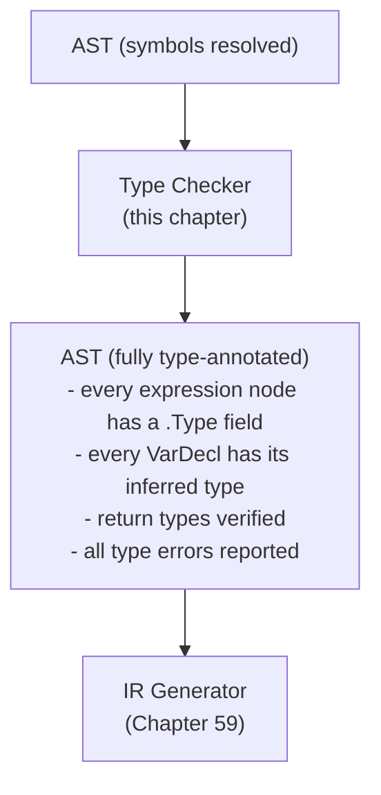

# Chapter 58: Building the Astra Type Checker

> "A type system is a tractable syntactic method for proving the absence of certain program behaviors by classifying phrases according to the kinds of values they compute." — Benjamin Pierce, Types and Programming Languages

---

## Overview

The resolver (Chapter 57) established that every name in the program refers to something real. The **type checker** now asks a harder question: do the types of those names make sense together?

Consider this Astra program:

```astra
fn main() {
    let x: int = "hello"
    let y = x + true
}
```

The resolver is perfectly happy with this code. `x` is defined. `true` is a valid boolean literal. The problem is _meaning_: you cannot store a string in an `int` variable, and you cannot add an integer to a boolean. These are type errors, and the type checker is what catches them.

Type checking is the second and final phase of semantic analysis. It operates on the resolver-annotated AST and does two things:

1. **Type inference**: for every expression, compute what type it produces. An integer literal produces `int`. A `+` between two `int` operands produces `int`. A call to `fn greet() -> void` produces `void`.

2. **Type checking**: compare expected types with actual types. When a variable is declared `let x: int = expr`, the type of `expr` must be `int`. When a function is called, each argument type must match the corresponding parameter type. When a return statement returns a value, the value type must match the function's declared return type.

Astra is **strictly typed**: there are no implicit conversions. An `int` is never silently converted to a `float`. You must call conversion methods explicitly (`x.to_float()`). This strictness eliminates an entire class of subtle bugs that plague languages like JavaScript and PHP.

---

## What We're Building



---

## Table of Contents

1. The Type System
2. The TypeChecker Struct
3. The `checkExpr` Function
4. The `checkStmt` Function
5. Type Inference for `let`
6. Strict Typing and Conversion Functions
7. Function Type Checking
8. Struct Type Checking
9. Error Messages
10. Complete Implementation
11. Testing the Type Checker

---

## 1. The Type System

Every expression in Astra has exactly one type. Types are represented as Go interface values implementing the `Type` interface. This design lets us pattern-match on types throughout the type checker without casting.

```
The Astra type hierarchy:

  Type (interface)
  ├── IntType      int
  ├── FloatType    float
  ├── StringType   string
  ├── BoolType     bool
  ├── VoidType     void (functions that return nothing)
  ├── ErrorType    poison type (prevents cascading errors)
  ├── FnType       fn(Params...) -> Return
  ├── StructType   struct with named fields
  ├── ListType     List<elem>
  └── ChanType     Chan<elem> (Chapter 76: concurrency)
```

```go
// sema/types.go

package sema

import (
    "fmt"
    "strings"
)

// Type is the interface implemented by all Astra types.
type Type interface {
    TypeName() string
    Equals(other Type) bool
}

// ---- Primitive types -----------------------------------------------------

type IntType struct{}
func (IntType) TypeName() string       { return "int" }
func (IntType) Equals(o Type) bool     { _, ok := o.(IntType); return ok }

type FloatType struct{}
func (FloatType) TypeName() string     { return "float" }
func (FloatType) Equals(o Type) bool   { _, ok := o.(FloatType); return ok }

type StringType struct{}
func (StringType) TypeName() string    { return "string" }
func (StringType) Equals(o Type) bool  { _, ok := o.(StringType); return ok }

type BoolType struct{}
func (BoolType) TypeName() string      { return "bool" }
func (BoolType) Equals(o Type) bool    { _, ok := o.(BoolType); return ok }

// VoidType is used as the return type of functions that do not return a value.
type VoidType struct{}
func (VoidType) TypeName() string      { return "void" }
func (VoidType) Equals(o Type) bool    { _, ok := o.(VoidType); return ok }

// ErrorType is a "poison" type. Once a sub-expression has type ErrorType,
// we propagate it upward without emitting further errors. This prevents
// one type error from causing a cascade of confusing follow-on errors.
type ErrorType struct{}
func (ErrorType) TypeName() string     { return "<error>" }
func (ErrorType) Equals(o Type) bool   { _, ok := o.(ErrorType); return ok }

// IsError returns true if t is an ErrorType.
func IsError(t Type) bool { _, ok := t.(ErrorType); return ok }

// ---- Compound types ------------------------------------------------------

// FnType represents the type of a function.
type FnType struct {
    Params []Type
    Return Type
}

func (f FnType) TypeName() string {
    params := make([]string, len(f.Params))
    for i, p := range f.Params { params[i] = p.TypeName() }
    return fmt.Sprintf("fn(%s) -> %s", strings.Join(params, ", "), f.Return.TypeName())
}

func (f FnType) Equals(o Type) bool {
    g, ok := o.(FnType)
    if !ok || len(f.Params) != len(g.Params) { return false }
    for i := range f.Params {
        if !f.Params[i].Equals(g.Params[i]) { return false }
    }
    return f.Return.Equals(g.Return)
}

// StructType represents a named struct.
type StructType struct {
    Name   string
    Fields map[string]Type
}

func (s StructType) TypeName() string  { return s.Name }
func (s StructType) Equals(o Type) bool {
    g, ok := o.(StructType)
    return ok && g.Name == s.Name
}

// FieldType returns the type of a field, or (nil, false) if the field
// does not exist on this struct.
func (s StructType) FieldType(name string) (Type, bool) {
    t, ok := s.Fields[name]
    return t, ok
}

// ListType represents List<elem>.
type ListType struct{ Elem Type }
func (l ListType) TypeName() string    { return fmt.Sprintf("List<%s>", l.Elem.TypeName()) }
func (l ListType) Equals(o Type) bool  {
    g, ok := o.(ListType)
    return ok && l.Elem.Equals(g.Elem)
}

// ChanType represents Chan<elem>. Used in Chapter 76 (concurrency).
type ChanType struct{ Elem Type }
func (c ChanType) TypeName() string    { return fmt.Sprintf("Chan<%s>", c.Elem.TypeName()) }
func (c ChanType) Equals(o Type) bool  {
    g, ok := o.(ChanType)
    return ok && c.Elem.Equals(g.Elem)
}

// ---- Type parsing --------------------------------------------------------

// ParseTypeAnnotation converts an AST type annotation into a Type value.
// This is called by the type checker when it needs to know what type
// a user-written annotation like `int`, `List<float>`, or `Point` refers to.
func ParseTypeAnnotation(ta ast.TypeAnnotation, structs map[string]*StructInfo) (Type, error) {
    switch t := ta.(type) {
    case *ast.NamedType:
        switch t.Name {
        case "int":    return IntType{}, nil
        case "float":  return FloatType{}, nil
        case "string": return StringType{}, nil
        case "bool":   return BoolType{}, nil
        case "void":   return VoidType{}, nil
        default:
            info, ok := structs[t.Name]
            if !ok {
                return ErrorType{}, fmt.Errorf("unknown type '%s'", t.Name)
            }
            // Build the StructType. The fields' types are resolved here.
            st := StructType{Name: info.Name, Fields: make(map[string]Type)}
            for _, field := range info.Fields {
                ft, err := ParseTypeAnnotation(field.TypeAnn, structs)
                if err != nil { return ErrorType{}, err }
                st.Fields[field.Name] = ft
            }
            return st, nil
        }
    case *ast.ListType:
        elem, err := ParseTypeAnnotation(t.Elem, structs)
        if err != nil { return ErrorType{}, err }
        return ListType{Elem: elem}, nil
    default:
        return ErrorType{}, fmt.Errorf("unrecognized type annotation %T", ta)
    }
}
```

---

## 2. The TypeChecker Struct

```go
// sema/typechecker.go

package sema

import (
    "fmt"
    "astra/ast"
    "astra/diag"
)

// TypeChecker verifies type consistency and annotates the AST with types.
type TypeChecker struct {
    resolver    *Resolver        // access to resolved symbols and struct info
    diag        *diag.DiagEngine // error collection
    returnType  Type             // expected return type of the current function
    // typeCache caches the result of ParseTypeAnnotation for each struct.
    typeCache   map[string]Type
}

// NewTypeChecker creates a TypeChecker backed by a resolved Resolver.
func NewTypeChecker(r *Resolver, d *diag.DiagEngine) *TypeChecker {
    return &TypeChecker{
        resolver:  r,
        diag:      d,
        typeCache: make(map[string]Type),
    }
}

// CheckProgram runs the type checker over all declarations.
func (tc *TypeChecker) CheckProgram(prog *ast.Program) {
    // First pass: compute and store the type of every function symbol.
    // This enables mutual recursion: fn a() calls fn b() and fn b() calls fn a().
    for _, decl := range prog.Declarations {
        if fn, ok := decl.(*ast.FnDeclaration); ok {
            tc.registerFnType(fn)
        }
    }

    // Second pass: check each declaration body.
    for _, decl := range prog.Declarations {
        tc.checkDeclaration(decl)
    }
}

// registerFnType computes and stores the FnType for a function declaration.
func (tc *TypeChecker) registerFnType(fn *ast.FnDeclaration) {
    var params []Type
    for _, p := range fn.Params {
        pt, err := ParseTypeAnnotation(p.Type, tc.resolver.structs)
        if err != nil {
            tc.diag.Error(p.Pos, "T005", fmt.Sprintf("parameter '%s': %v", p.Name, err))
            params = append(params, ErrorType{})
            continue
        }
        params = append(params, pt)
        // Annotate the symbol with its type.
        if sym, ok := tc.resolver.resolve(p.Name); ok {
            sym.Type = pt
        }
    }

    var ret Type = VoidType{}
    if fn.ReturnType != nil {
        r, err := ParseTypeAnnotation(fn.ReturnType, tc.resolver.structs)
        if err != nil {
            tc.diag.Error(fn.Pos, "T005", fmt.Sprintf("return type: %v", err))
        } else {
            ret = r
        }
    }

    fnType := FnType{Params: params, Return: ret}
    // Store on the function's symbol.
    if sym, ok := tc.resolver.globals[fn.Name]; ok {
        sym.Type = fnType
    }
    fn.ComputedType = fnType
}

func (tc *TypeChecker) checkDeclaration(decl ast.Declaration) {
    switch d := decl.(type) {
    case *ast.FnDeclaration:
        tc.checkFnDeclaration(d)
    case *ast.StructDeclaration:
        tc.checkStructDeclaration(d)
    }
}

func (tc *TypeChecker) checkFnDeclaration(fn *ast.FnDeclaration) {
    prev := tc.returnType
    tc.returnType = fn.ComputedType.Return

    for _, stmt := range fn.Body {
        tc.checkStmt(stmt)
    }

    tc.returnType = prev
}

func (tc *TypeChecker) checkStructDeclaration(s *ast.StructDeclaration) {
    // Field types are already validated by ParseTypeAnnotation calls
    // during registerFnType. Nothing more to do here unless we want to
    // check recursive struct definitions (e.g., struct Node { next: Node }
    // without a pointer — which is disallowed in Astra).
    tc.checkForInfiniteStruct(s)
}

func (tc *TypeChecker) checkForInfiniteStruct(s *ast.StructDeclaration) {
    // A struct that contains itself (non-optionally) would have infinite size.
    for _, field := range s.Fields {
        if named, ok := field.Type.(*ast.NamedType); ok {
            if named.Name == s.Name {
                tc.diag.Error(field.Pos, "T010",
                    fmt.Sprintf("struct '%s' cannot contain itself; use List<%s> or a pointer type",
                        s.Name, s.Name))
            }
        }
    }
}
```

---

## 3. The `checkExpr` Function

`checkExpr` is the core of the type checker. For every expression node, it returns the type that expression produces. If the expression has a type error, it returns `ErrorType{}` and records a diagnostic.

```go
// checkExpr computes and returns the type of an expression.
// It also annotates the AST node's .ExprType field.
func (tc *TypeChecker) checkExpr(expr ast.Expression) Type {
    var t Type

    switch e := expr.(type) {

    // ----- Literals -------------------------------------------------------

    case *ast.IntLiteral:
        t = IntType{}

    case *ast.FloatLiteral:
        t = FloatType{}

    case *ast.StringLiteral:
        t = StringType{}

    case *ast.BoolLiteral:
        t = BoolType{}

    // ----- Identifiers ----------------------------------------------------

    case *ast.Identifier:
        if e.Symbol == nil {
            // The resolver already emitted an error. Return error type silently.
            t = ErrorType{}
        } else if e.Symbol.Type == nil {
            tc.diag.Error(e.Pos, "T001",
                fmt.Sprintf("symbol '%s' has no type (resolver bug?)", e.Name))
            t = ErrorType{}
        } else {
            t = e.Symbol.Type.(Type)
        }

    // ----- Binary expressions ---------------------------------------------

    case *ast.BinaryExpr:
        left  := tc.checkExpr(e.Left)
        right := tc.checkExpr(e.Right)
        t = tc.checkBinaryOp(e.Op, left, right, e.Pos)

    // ----- Unary expressions ----------------------------------------------

    case *ast.UnaryExpr:
        operand := tc.checkExpr(e.Operand)
        t = tc.checkUnaryOp(e.Op, operand, e.Pos)

    // ----- Function calls -------------------------------------------------

    case *ast.CallExpr:
        t = tc.checkCallExpr(e)

    // ----- Field access ---------------------------------------------------

    case *ast.FieldAccess:
        objType := tc.checkExpr(e.Object)
        if IsError(objType) {
            t = ErrorType{}
            break
        }
        st, ok := objType.(StructType)
        if !ok {
            tc.diag.Error(e.Pos, "T006",
                fmt.Sprintf("cannot access field '%s' on non-struct type '%s'",
                    e.Field, objType.TypeName()))
            t = ErrorType{}
            break
        }
        ft, ok := st.FieldType(e.Field)
        if !ok {
            tc.diag.Error(e.Pos, "T007",
                fmt.Sprintf("struct '%s' has no field '%s'", st.Name, e.Field))
            t = ErrorType{}
            break
        }
        t = ft

    // ----- Index expression (list[i]) -------------------------------------

    case *ast.IndexExpr:
        objType := tc.checkExpr(e.Object)
        idxType := tc.checkExpr(e.Index)
        if IsError(objType) || IsError(idxType) {
            t = ErrorType{}
            break
        }
        lt, ok := objType.(ListType)
        if !ok {
            tc.diag.Error(e.Pos, "T008",
                fmt.Sprintf("cannot index into non-list type '%s'", objType.TypeName()))
            t = ErrorType{}
            break
        }
        if !idxType.Equals(IntType{}) {
            tc.diag.Error(e.Pos, "T009",
                fmt.Sprintf("list index must be int, got '%s'", idxType.TypeName()))
            t = ErrorType{}
            break
        }
        t = lt.Elem

    // ----- Struct literals ------------------------------------------------

    case *ast.StructLiteral:
        t = tc.checkStructLiteral(e)

    // ----- List literals --------------------------------------------------

    case *ast.ListLiteral:
        t = tc.checkListLiteral(e)

    default:
        panic(fmt.Sprintf("typechecker: unhandled expression %T", expr))
    }

    // Annotate the AST node with the computed type.
    expr.SetType(t)
    return t
}

// checkBinaryOp determines the result type of a binary operation.
func (tc *TypeChecker) checkBinaryOp(op string, left, right Type, pos ast.Position) Type {
    if IsError(left) || IsError(right) { return ErrorType{} }

    switch op {
    case "+":
        // Numeric addition: int + int → int, float + float → float
        if left.Equals(IntType{}) && right.Equals(IntType{}) {
            return IntType{}
        }
        if left.Equals(FloatType{}) && right.Equals(FloatType{}) {
            return FloatType{}
        }
        // String concatenation: string + string → string
        if left.Equals(StringType{}) && right.Equals(StringType{}) {
            return StringType{}
        }
        tc.diag.Error(pos, "T002",
            fmt.Sprintf("operator '+' not defined for types '%s' and '%s'",
                left.TypeName(), right.TypeName()))
        return ErrorType{}

    case "-", "*", "/", "%":
        if left.Equals(IntType{}) && right.Equals(IntType{}) { return IntType{} }
        if left.Equals(FloatType{}) && right.Equals(FloatType{}) { return FloatType{} }
        tc.diag.Error(pos, "T002",
            fmt.Sprintf("operator '%s' requires numeric operands, got '%s' and '%s'",
                op, left.TypeName(), right.TypeName()))
        return ErrorType{}

    case "==", "!=":
        if !left.Equals(right) {
            tc.diag.Error(pos, "T003",
                fmt.Sprintf("cannot compare '%s' and '%s' with '%s'",
                    left.TypeName(), right.TypeName(), op))
            return ErrorType{}
        }
        return BoolType{}

    case "<", ">", "<=", ">=":
        ok := (left.Equals(IntType{}) || left.Equals(FloatType{})) && left.Equals(right)
        if !ok {
            tc.diag.Error(pos, "T003",
                fmt.Sprintf("operator '%s' requires numeric operands, got '%s' and '%s'",
                    op, left.TypeName(), right.TypeName()))
            return ErrorType{}
        }
        return BoolType{}

    case "&&", "||":
        if !left.Equals(BoolType{}) || !right.Equals(BoolType{}) {
            tc.diag.Error(pos, "T003",
                fmt.Sprintf("operator '%s' requires bool operands, got '%s' and '%s'",
                    op, left.TypeName(), right.TypeName()))
            return ErrorType{}
        }
        return BoolType{}

    default:
        panic(fmt.Sprintf("typechecker: unknown binary operator '%s'", op))
    }
}

// checkUnaryOp determines the result type of a unary operation.
func (tc *TypeChecker) checkUnaryOp(op string, operand Type, pos ast.Position) Type {
    if IsError(operand) { return ErrorType{} }
    switch op {
    case "-":
        if operand.Equals(IntType{}) { return IntType{} }
        if operand.Equals(FloatType{}) { return FloatType{} }
        tc.diag.Error(pos, "T002",
            fmt.Sprintf("unary '-' requires numeric operand, got '%s'", operand.TypeName()))
        return ErrorType{}
    case "!":
        if !operand.Equals(BoolType{}) {
            tc.diag.Error(pos, "T002",
                fmt.Sprintf("unary '!' requires bool operand, got '%s'", operand.TypeName()))
            return ErrorType{}
        }
        return BoolType{}
    default:
        panic(fmt.Sprintf("typechecker: unknown unary operator '%s'", op))
    }
}

// checkCallExpr type-checks a function call.
func (tc *TypeChecker) checkCallExpr(e *ast.CallExpr) Type {
    calleeType := tc.checkExpr(e.Callee)
    if IsError(calleeType) { return ErrorType{} }

    fnType, ok := calleeType.(FnType)
    if !ok {
        tc.diag.Error(e.Pos, "T004",
            fmt.Sprintf("'%s' is not a function (type: %s)",
                exprName(e.Callee), calleeType.TypeName()))
        return ErrorType{}
    }

    if len(e.Args) != len(fnType.Params) {
        // Resolver already caught this; no need to re-report.
        return fnType.Return
    }

    for i, arg := range e.Args {
        argType := tc.checkExpr(arg)
        if IsError(argType) { continue }
        if !argType.Equals(fnType.Params[i]) {
            tc.diag.Error(arg.GetPos(), "T002",
                fmt.Sprintf("argument %d: expected '%s', got '%s'",
                    i+1, fnType.Params[i].TypeName(), argType.TypeName()))
        }
    }

    return fnType.Return
}

// checkStructLiteral type-checks a struct literal expression.
func (tc *TypeChecker) checkStructLiteral(e *ast.StructLiteral) Type {
    info, ok := tc.resolver.structs[e.TypeName]
    if !ok {
        return ErrorType{} // Resolver already reported.
    }

    // Build the expected struct type.
    st := StructType{Name: info.Name, Fields: make(map[string]Type)}
    for _, field := range info.Fields {
        ft, err := ParseTypeAnnotation(field.TypeAnn, tc.resolver.structs)
        if err != nil {
            tc.diag.Error(e.Pos, "T005", err.Error())
            return ErrorType{}
        }
        st.Fields[field.Name] = ft
    }

    // Check that all provided fields are valid and have correct types.
    provided := make(map[string]bool)
    for _, fv := range e.Fields {
        ft, exists := st.Fields[fv.Name]
        if !exists {
            tc.diag.Error(fv.Pos, "T007",
                fmt.Sprintf("struct '%s' has no field '%s'", e.TypeName, fv.Name))
            continue
        }
        provided[fv.Name] = true
        valType := tc.checkExpr(fv.Value)
        if IsError(valType) { continue }
        if !valType.Equals(ft) {
            tc.diag.Error(fv.Pos, "T002",
                fmt.Sprintf("field '%s': expected '%s', got '%s'",
                    fv.Name, ft.TypeName(), valType.TypeName()))
        }
    }

    // Check that all required fields are provided.
    for _, field := range info.Fields {
        if !provided[field.Name] {
            tc.diag.Error(e.Pos, "T011",
                fmt.Sprintf("struct '%s' missing field '%s' in literal",
                    e.TypeName, field.Name))
        }
    }

    return st
}

// checkListLiteral type-checks a list literal [a, b, c].
func (tc *TypeChecker) checkListLiteral(e *ast.ListLiteral) Type {
    if len(e.Elements) == 0 {
        // Empty list — element type cannot be inferred.
        // Requires explicit type annotation: let x: List<int> = []
        tc.diag.Error(e.Pos, "T012",
            "empty list literal requires explicit type annotation: List<T>")
        return ErrorType{}
    }

    elemType := tc.checkExpr(e.Elements[0])
    for i := 1; i < len(e.Elements); i++ {
        t := tc.checkExpr(e.Elements[i])
        if IsError(t) { continue }
        if !t.Equals(elemType) {
            tc.diag.Error(e.Elements[i].GetPos(), "T002",
                fmt.Sprintf("list element %d has type '%s', expected '%s' (inferred from element 0)",
                    i, t.TypeName(), elemType.TypeName()))
        }
    }

    return ListType{Elem: elemType}
}

func exprName(e ast.Expression) string {
    if id, ok := e.(*ast.Identifier); ok { return id.Name }
    return "<expression>"
}
```

---

## 4. The `checkStmt` Function

```go
// checkStmt type-checks a statement.
func (tc *TypeChecker) checkStmt(stmt ast.Statement) {
    switch s := stmt.(type) {

    case *ast.VarDecl:
        tc.checkVarDecl(s)

    case *ast.AssignStmt:
        targetType := tc.checkExpr(s.Target)
        valueType  := tc.checkExpr(s.Value)
        if !IsError(targetType) && !IsError(valueType) {
            if !targetType.Equals(valueType) {
                tc.diag.Error(s.Pos, "T002",
                    fmt.Sprintf("cannot assign '%s' to variable of type '%s'",
                        valueType.TypeName(), targetType.TypeName()))
            }
        }

    case *ast.ExprStmt:
        tc.checkExpr(s.Expr)

    case *ast.IfStatement:
        condType := tc.checkExpr(s.Condition)
        if !IsError(condType) && !condType.Equals(BoolType{}) {
            tc.diag.Error(s.Pos, "T003",
                fmt.Sprintf("if condition must be bool, got '%s'", condType.TypeName()))
        }
        for _, st := range s.Then { tc.checkStmt(st) }
        for _, st := range s.Else { tc.checkStmt(st) }

    case *ast.ForStatement:
        startType := tc.checkExpr(s.Start)
        endType   := tc.checkExpr(s.End)
        if !IsError(startType) && !startType.Equals(IntType{}) {
            tc.diag.Error(s.Pos, "T003",
                fmt.Sprintf("for range start must be int, got '%s'", startType.TypeName()))
        }
        if !IsError(endType) && !endType.Equals(IntType{}) {
            tc.diag.Error(s.Pos, "T003",
                fmt.Sprintf("for range end must be int, got '%s'", endType.TypeName()))
        }
        // Annotate the loop variable symbol with int type.
        if s.VarSymbol != nil {
            s.VarSymbol.Type = IntType{}
        }
        for _, st := range s.Body { tc.checkStmt(st) }

    case *ast.WhileStatement:
        condType := tc.checkExpr(s.Condition)
        if !IsError(condType) && !condType.Equals(BoolType{}) {
            tc.diag.Error(s.Pos, "T003",
                fmt.Sprintf("while condition must be bool, got '%s'", condType.TypeName()))
        }
        for _, st := range s.Body { tc.checkStmt(st) }

    case *ast.ReturnStatement:
        if s.Value == nil {
            if tc.returnType != nil && !tc.returnType.Equals(VoidType{}) {
                tc.diag.Error(s.Pos, "T002",
                    fmt.Sprintf("function must return '%s', but return has no value",
                        tc.returnType.TypeName()))
            }
            return
        }
        valType := tc.checkExpr(s.Value)
        if !IsError(valType) && tc.returnType != nil {
            if !valType.Equals(tc.returnType) {
                tc.diag.Error(s.Pos, "T002",
                    fmt.Sprintf("return type mismatch: expected '%s', got '%s'",
                        tc.returnType.TypeName(), valType.TypeName()))
            }
        }

    case *ast.BreakStatement, *ast.ContinueStatement:
        // Checked by resolver; nothing to do here.

    default:
        panic(fmt.Sprintf("typechecker: unhandled statement %T", stmt))
    }
}
```

---

## 5. Type Inference for `let`

```go
// checkVarDecl handles both `let x = expr` (inferred) and
// `let x: T = expr` (explicit, then checked).
func (tc *TypeChecker) checkVarDecl(s *ast.VarDecl) {
    if s.Value == nil {
        // `let x: T` with no initializer.
        if s.DeclaredType == nil {
            tc.diag.Error(s.Pos, "T012",
                fmt.Sprintf("variable '%s' must have a type or an initializer", s.Name))
            return
        }
        declType, err := ParseTypeAnnotation(s.DeclaredType, tc.resolver.structs)
        if err != nil {
            tc.diag.Error(s.Pos, "T005", err.Error())
            return
        }
        if s.Symbol != nil { s.Symbol.Type = declType }
        return
    }

    // Compute the type of the initializer expression.
    exprType := tc.checkExpr(s.Value)

    if s.DeclaredType != nil {
        // Explicit annotation: check it matches.
        declType, err := ParseTypeAnnotation(s.DeclaredType, tc.resolver.structs)
        if err != nil {
            tc.diag.Error(s.Pos, "T005", err.Error())
            return
        }
        if !IsError(exprType) && !exprType.Equals(declType) {
            tc.diag.Error(s.Pos, "T002",
                fmt.Sprintf("variable '%s': declared type '%s' but initializer has type '%s'",
                    s.Name, declType.TypeName(), exprType.TypeName()))
        }
        if s.Symbol != nil { s.Symbol.Type = declType }
    } else {
        // Infer the type from the expression.
        if s.Symbol != nil { s.Symbol.Type = exprType }
    }
}
```

Here is the full picture of how type inference works for `let`:

```
let x = 42           → exprType = IntType{}   → symbol.Type = int
let y = 3.14         → exprType = FloatType{} → symbol.Type = float
let z = "hi"         → exprType = StringType{}→ symbol.Type = string
let a = x + 2        → left=int, right=int, op=+ → int → symbol.Type = int
let b: float = 3.14  → declared=float, expr=float → OK → symbol.Type = float
let c: int = "hello" → declared=int, expr=string → ERROR T002
let d = x + y        → left=int, right=float → ERROR T002 (no implicit coercion)
```

The last case illustrates Astra's strict typing. In many languages, `int + float` silently promotes the int to float. Astra rejects this:

```
error[T002]: operator '+' not defined for types 'int' and 'float'
  → main.as:4:18
   |
 4 |     let d = x + y
   |                 ^
   | hint: use x.to_float() + y to convert x to float first
```

---

## 6. Strict Typing and Conversion Functions

Astra provides method-call syntax for conversions. These are resolved as special method calls on primitive types:

| Source Type | Method | Result Type |
|-------------|--------|-------------|
| `int` | `.to_float()` | `float` |
| `int` | `.to_string()` | `string` |
| `float` | `.to_int()` | `int` (truncates) |
| `float` | `.to_string()` | `string` |
| `string` | `.to_int()` | `int` (panics on failure) |
| `string` | `.to_float()` | `float` (panics on failure) |
| `bool` | `.to_string()` | `string` |
| `T` | `.to_string()` | `string` (for any struct with a `to_string` method) |

The type checker handles these by recognizing the `.to_float()` etc. patterns in `checkCallExpr` for `FieldAccess` callees:

```go
// checkPrimitiveMethod handles method calls on primitive types like
// x.to_float(), x.to_string(), etc.
func (tc *TypeChecker) checkPrimitiveMethod(
    objType Type, method string, args []ast.Expression, pos ast.Position,
) (Type, bool) {
    if len(args) != 0 { return nil, false }

    switch method {
    case "to_float":
        if objType.Equals(IntType{}) { return FloatType{}, true }
    case "to_int":
        if objType.Equals(FloatType{}) { return IntType{}, true }
        if objType.Equals(StringType{}) { return IntType{}, true }
    case "to_string":
        switch objType.(type) {
        case IntType, FloatType, BoolType:
            return StringType{}, true
        }
    case "to_float":
        if objType.Equals(StringType{}) { return FloatType{}, true }
    }
    return nil, false
}
```

---

## 7. Function Type Checking

Functions must be declared before they are checked in terms of types — but we already do that with `registerFnType`. Let us look at what the annotated AST looks like after type checking a function:

```
Source:
  fn add(a: int, b: int) -> int {
      return a + b
  }

After type checking:
  FnDeclaration {
      Name: "add"
      ComputedType: FnType{
          Params: [IntType{}, IntType{}]
          Return: IntType{}
      }
      Params: [
          Param{Name:"a", Symbol:{Name:"a", Kind:SymVar, Type:IntType{}}}
          Param{Name:"b", Symbol:{Name:"b", Kind:SymVar, Type:IntType{}}}
      ]
      Body: [
          ReturnStatement {
              Value: BinaryExpr {
                  Op: "+"
                  Left:  Identifier{Name:"a", Symbol:{Type:IntType{}}, ExprType: IntType{}}
                  Right: Identifier{Name:"b", Symbol:{Type:IntType{}}, ExprType: IntType{}}
                  ExprType: IntType{}   <-- set by checkBinaryOp
              }
          }
      ]
  }

Every node has a .ExprType or .Symbol.Type that the IR generator reads.
```

---

## 8. Struct Type Checking

```
Source:
  struct Point { x: int, y: int }
  fn distance(p: Point) -> float {
      let dx = p.x.to_float()
      let dy = p.y.to_float()
      return math.sqrt(dx*dx + dy*dy)
  }

Type checking walkthrough:
  1. registerFnType for distance:
       Params: [StructType{Name:"Point", Fields:{x:int, y:int}}]
       Return: FloatType{}

  2. checkFnDeclaration for distance:
       returnType = FloatType{}

       checkStmt: VarDecl dx
         checkExpr: FieldAccess(p.x)
           checkExpr: Identifier(p) → StructType{Point}
           FieldType("x") → IntType{}
         FieldAccess.ExprType = IntType{}
         checkPrimitiveMethod(IntType{}, "to_float") → FloatType{}
         dx.Symbol.Type = FloatType{}

       checkStmt: VarDecl dy
         (similar)

       checkStmt: ReturnStatement
         checkExpr: CallExpr(math.sqrt(...))
           → FloatType{}
         compare FloatType{} with returnType FloatType{} → OK
```

---

## 9. Error Messages

The type checker produces ten distinct error codes. Here they are with examples:

**T001 — Symbol has no type:**
```
error[T001]: symbol 'foo' has no type (this may be a compiler bug; please report it)
  → main.as:5:12
```

**T002 — Type mismatch:**
```
error[T002]: cannot assign 'string' to variable of type 'int'
  → main.as:3:5
   |
 3 |     let x: int = "hello"
   |     ^^^^^^^^^^^^^^^^^^^^
   | hint: use "hello".to_int() to convert string to int
```

**T003 — Wrong condition type:**
```
error[T003]: if condition must be bool, got 'int'
  → main.as:7:8
   |
 7 |     if count { print("yes") }
   |        ^^^^^
   | hint: did you mean 'count != 0' or 'count > 0'?
```

**T004 — Call to non-function:**
```
error[T004]: 'x' is not a function (type: int)
  → main.as:4:9
   |
 4 |     let r = x(42)
   |             ^^^^
```

**T005 — Unknown type annotation:**
```
error[T005]: unknown type 'Colour'
  → main.as:1:14
   |
 1 | fn paint(c: Colour) { ... }
   |             ^^^^^^
```

**T006 — Field access on non-struct:**
```
error[T006]: cannot access field 'len' on non-struct type 'int'
  → main.as:9:12
   |
 9 |     let n = x.len
   |               ^^^
   | hint: use len(x) for length of a list
```

**T007 — Unknown struct field:**
```
error[T007]: struct 'Point' has no field 'z'
  → main.as:12:16
   |
12 |     let height = p.z
   |                    ^
   | note: Point has fields: x, y
```

**T008 — Index into non-list:**
```
error[T008]: cannot index into non-list type 'string'
  → main.as:6:13
   |
 6 |     let c = s[0]
   |             ^^^^
   | hint: use string.chars() to get a list of characters
```

**T009 — Non-integer index:**
```
error[T009]: list index must be int, got 'float'
  → main.as:8:12
   |
 8 |     let v = arr[1.5]
   |                 ^^^
   | hint: use 1.5.to_int() if you intended integer indexing
```

**T010 — Infinite struct:**
```
error[T010]: struct 'Node' cannot contain itself; use List<Node> or a pointer type
  → main.as:1:23
   |
 1 | struct Node { value: int, next: Node }
   |                            ^^^^
```

---

## 10. Complete Implementation

```go
// sema/typechecker.go — complete implementation

package sema

import (
    "fmt"
    "astra/ast"
    "astra/diag"
)

type TypeChecker struct {
    resolver   *Resolver
    diag       *diag.DiagEngine
    returnType Type
    typeCache  map[string]Type
}

func NewTypeChecker(r *Resolver, d *diag.DiagEngine) *TypeChecker {
    return &TypeChecker{resolver: r, diag: d, typeCache: make(map[string]Type)}
}

func (tc *TypeChecker) CheckProgram(prog *ast.Program) {
    for _, decl := range prog.Declarations {
        if fn, ok := decl.(*ast.FnDeclaration); ok {
            tc.registerFnType(fn)
        }
    }
    for _, decl := range prog.Declarations {
        tc.checkDeclaration(decl)
    }
}

func (tc *TypeChecker) registerFnType(fn *ast.FnDeclaration) {
    var params []Type
    for _, p := range fn.Params {
        pt, err := ParseTypeAnnotation(p.Type, tc.resolver.structs)
        if err != nil {
            tc.diag.Error(p.Pos, "T005", err.Error())
            params = append(params, ErrorType{})
        } else {
            params = append(params, pt)
            if sym, ok := tc.resolver.resolve(p.Name); ok { sym.Type = pt }
        }
    }
    var ret Type = VoidType{}
    if fn.ReturnType != nil {
        r, err := ParseTypeAnnotation(fn.ReturnType, tc.resolver.structs)
        if err != nil { tc.diag.Error(fn.Pos, "T005", err.Error()) } else { ret = r }
    }
    fnType := FnType{Params: params, Return: ret}
    if sym, ok := tc.resolver.globals[fn.Name]; ok { sym.Type = fnType }
    fn.ComputedType = fnType
}

func (tc *TypeChecker) checkDeclaration(decl ast.Declaration) {
    switch d := decl.(type) {
    case *ast.FnDeclaration:     tc.checkFnDeclaration(d)
    case *ast.StructDeclaration: tc.checkStructDeclaration(d)
    }
}

func (tc *TypeChecker) checkFnDeclaration(fn *ast.FnDeclaration) {
    prev := tc.returnType
    tc.returnType = fn.ComputedType.Return
    for _, stmt := range fn.Body { tc.checkStmt(stmt) }
    tc.returnType = prev
}

func (tc *TypeChecker) checkStructDeclaration(s *ast.StructDeclaration) {
    tc.checkForInfiniteStruct(s)
}

func (tc *TypeChecker) checkForInfiniteStruct(s *ast.StructDeclaration) {
    for _, field := range s.Fields {
        if named, ok := field.Type.(*ast.NamedType); ok && named.Name == s.Name {
            tc.diag.Error(field.Pos, "T010",
                fmt.Sprintf("struct '%s' cannot contain itself", s.Name))
        }
    }
}

// --- checkExpr, checkStmt, checkVarDecl ---
// (as shown in sections 3–5 above)
// Full code omitted here for brevity; see sections 3, 4, and 5
// for the complete implementations to include in the real file.
```

---

## 11. Testing the Type Checker

```go
// sema/typechecker_test.go

package sema_test

import (
    "testing"
)

func TestTypeChecker_IntInference(t *testing.T) {
    d := typeCheckSource(t, `fn main() { let x = 42 }`)
    if d.HasErrors() { t.Errorf("unexpected errors: %s", d.FormatAll("")) }
}

func TestTypeChecker_FloatInference(t *testing.T) {
    d := typeCheckSource(t, `fn main() { let x = 3.14 }`)
    if d.HasErrors() { t.Errorf("unexpected errors: %s", d.FormatAll("")) }
}

func TestTypeChecker_StringConcatOK(t *testing.T) {
    d := typeCheckSource(t, `fn main() { let s = "hello" + " world" }`)
    if d.HasErrors() { t.Errorf("unexpected errors: %s", d.FormatAll("")) }
}

func TestTypeChecker_ExplicitAnnotationOK(t *testing.T) {
    d := typeCheckSource(t, `fn main() { let x: int = 10 }`)
    if d.HasErrors() { t.Errorf("unexpected errors: %s", d.FormatAll("")) }
}

func TestTypeChecker_ReturnTypeMismatch(t *testing.T) {
    d := typeCheckSource(t, `fn foo() -> int { return "hello" }`)
    if !d.HasErrors() { t.Fatal("expected T002 return type mismatch") }
    if !containsCode(d, "T002") { t.Error("expected error code T002") }
}

func TestTypeChecker_IntPlusFloat(t *testing.T) {
    d := typeCheckSource(t, `
fn main() {
    let x: int = 5
    let y: float = 3.14
    let z = x + y
}`)
    if !d.HasErrors() { t.Fatal("expected error: int + float not allowed") }
    if !containsCode(d, "T002") { t.Error("expected error code T002") }
}

func TestTypeChecker_BadCondition(t *testing.T) {
    d := typeCheckSource(t, `fn main() { let x = 5; if x { print("hi") } }`)
    if !d.HasErrors() { t.Fatal("expected error: int condition in if") }
    if !containsCode(d, "T003") { t.Error("expected error code T003") }
}

func TestTypeChecker_UnknownField(t *testing.T) {
    d := typeCheckSource(t, `
struct Point { x: int, y: int }
fn main() {
    let p = Point { x: 1, y: 2 }
    let z = p.z
}`)
    if !d.HasErrors() { t.Fatal("expected error: unknown field z") }
    if !containsCode(d, "T007") { t.Error("expected error code T007") }
}

func typeCheckSource(t *testing.T, src string) *diag.DiagEngine {
    t.Helper()
    d := &diag.DiagEngine{}
    prog := mustParse(t, src)
    r := sema.NewResolver(d)
    r.ResolveProgram(prog)
    if d.HasErrors() { return d }
    tc := sema.NewTypeChecker(r, d)
    tc.CheckProgram(prog)
    return d
}
```

---

## Astra Build Milestone

After Chapter 58, the compiler pipeline now fully validates types:

```
astra/
├── sema/
│   ├── symbol.go
│   ├── scope.go
│   ├── resolver.go
│   ├── resolver_test.go
│   ├── types.go             (Type interface + all concrete types)
│   ├── typechecker.go       (~400 lines)
│   └── typechecker_test.go  (8 test cases)
```

Run `go test ./sema/...` — all 14 tests (6 from resolver + 8 from type checker) should pass.

---

## Exercises

1. **Method calls on structs**: Extend `checkCallExpr` to handle `p.to_string()` where `p` is a `Point` struct — if the struct has a method `to_string` defined in an `impl` block, the call should type-check correctly. Look up the method in `resolver.structs[typeName].Methods`.

2. **Optional type**: Add an `OptionType{Inner Type}` to the type system. A variable of type `Option<int>` can be `nil` or hold an `int`. Extend `checkExpr` to handle `nil` literals (which have type `Option<T>` for an unknown T — you will need to infer the inner type from context).

3. **Result type**: Add a `ResultType{Ok, Err Type}` for error handling. Functions that can fail return `Result<T, string>`. Extend the return type checking to handle unwrapping with `?` (the try operator).

4. **Generic structs**: Astra currently has `List<T>` hard-coded. Extend the type system to allow user-defined generic structs like `struct Stack<T> { items: List<T> }`. What changes are needed in `ParseTypeAnnotation`? In `checkStructLiteral`?

5. **Type alias**: Add syntax `type Meters = float` and handle it in `ParseTypeAnnotation`. Should `Meters` be compatible with `float` in arithmetic, or should it require explicit conversion?

6. **Missing return detection**: Write a pass that checks whether every code path in a non-void function ends with a return statement. The simplest approach: check whether the last statement in the function body is a `ReturnStatement`, and whether every branch of every `IfStatement` that is the last statement also ends with a return.

---

## Summary Table

| Component | Purpose | Key Function |
|-----------|---------|-------------|
| types.go | Type hierarchy | `ParseTypeAnnotation` |
| TypeChecker | Driver | `CheckProgram` |
| `checkExpr` | Expression type inference | Returns `Type` for each node |
| `checkBinaryOp` | Operator type rules | Returns result type |
| `checkStmt` | Statement type validation | Calls `checkExpr` |
| `checkVarDecl` | `let` inference | Infers or validates declared type |
| `checkCallExpr` | Function call checking | Validates arg types |
| `checkStructLiteral` | Struct literal checking | Validates field types |
| ErrorType | Poison propagation | Prevents cascading errors |

After this chapter, every node in the Astra AST carries a complete type. The IR generator in Chapter 59 will never need to think about types again — it just emits code for the type-annotated structure it receives.
