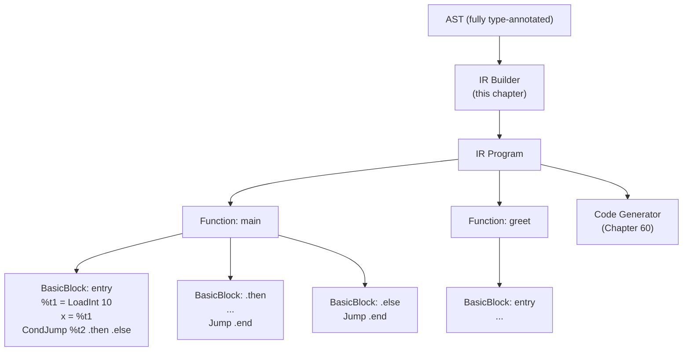
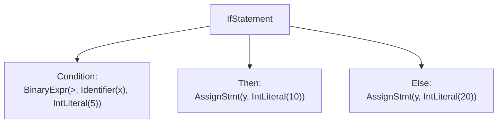

# Chapter 59: Building the Astra IR Generator

> "Intermediate representation is where your language stops being syntax and starts being computation. It is the moment the compiler decides what the program actually does." — Unknown

---

## Overview

After the type checker finishes, the AST is fully annotated: every identifier is resolved, every expression carries a type, every function knows its return type. The next question is: how do we turn this annotated tree into machine code?

We do not go directly from AST to assembly. That path is possible for very simple languages, but it produces terrible code, is hard to optimize, and ties your compiler to one machine architecture. Instead, we lower the AST to an **Intermediate Representation** (IR).

The IR is a simplified, architecture-neutral language. It is not as high-level as Astra source code, but it is not as low-level as x86-64 assembly either. Think of it as a language with infinite registers, no branches within expressions, and explicit control flow using labels and jumps.

Astra uses **three-address code** (TAC) as its IR. In three-address code:
- Every instruction has at most one operation, one destination, and at most two operands.
- Intermediate values are stored in **temporaries** (named `%t1`, `%t2`, etc.).
- Control flow is explicit: `if cond goto label1 else label2`.

Here is an example. This Astra code:

```astra
let result = (a + b) * (c - 2)
```

Becomes this three-address IR:

```
%t1 = a + b
%t2 = c - 2
result = %t1 * %t2
```

Each instruction is simple and linear. There are no nested expressions. Optimization passes can manipulate these instructions easily — they can reorder them, eliminate dead code, hoist invariants out of loops, and so on.

---

## What We're Building



---

## Table of Contents

1. Three-Address Code: Why and How
2. The IR Instruction Set
3. Basic Blocks and Functions
4. The IRBuilder Struct
5. Lowering Expressions
6. Lowering Statements
7. Lowering Control Flow
8. Lowering Function Declarations
9. Complete IR for a Real Program
10. Complete Implementation
11. The Astra Build Milestone

---

## 1. Three-Address Code: Why and How

The AST is a **tree** — nested, hierarchical, recursive. Machine instructions are **linear** — a flat sequence. The IR bridges this gap.

Consider an if/else:

```astra
if x > 5 {
    y = 10
} else {
    y = 20
}
```

The AST looks like:



The IR representation:

```
%t1 = x > 5
CondJump %t1, .then_1, .else_1

.then_1:
y = 10
Jump .end_1

.else_1:
y = 20

.end_1:
```

Now control flow is explicit. Each "block" between labels is a **basic block** — a straight-line sequence of instructions with no internal branches. Basic blocks are the fundamental unit of analysis for all optimization algorithms.

---

## 2. The IR Instruction Set

```go
// ir/instructions.go
// The complete Astra IR instruction set.

package ir

import "fmt"

// Instruction is implemented by all IR instruction types.
type Instruction interface {
    instrTag()        // marker method for the interface
    String() string   // human-readable form for debugging
}

// ---- Arithmetic and logic ------------------------------------------------

// BinOp: dest = left op right
type BinOp struct {
    Dest, Left, Right, Op string
}
func (*BinOp) instrTag() {}
func (b *BinOp) String() string {
    return fmt.Sprintf("  %s = %s %s %s", b.Dest, b.Left, b.Op, b.Right)
}

// UnOp: dest = op src
type UnOp struct {
    Dest, Src, Op string
}
func (*UnOp) instrTag() {}
func (u *UnOp) String() string {
    return fmt.Sprintf("  %s = %s %s", u.Dest, u.Op, u.Src)
}

// ---- Data movement -------------------------------------------------------

// Copy: dest = src
type Copy struct {
    Dest, Src string
}
func (*Copy) instrTag() {}
func (c *Copy) String() string { return fmt.Sprintf("  %s = %s", c.Dest, c.Src) }

// LoadInt: dest = <integer literal>
type LoadInt struct {
    Dest  string
    Value int64
}
func (*LoadInt) instrTag() {}
func (l *LoadInt) String() string { return fmt.Sprintf("  %s = %d", l.Dest, l.Value) }

// LoadFlt: dest = <float literal>
type LoadFlt struct {
    Dest  string
    Value float64
}
func (*LoadFlt) instrTag() {}
func (l *LoadFlt) String() string { return fmt.Sprintf("  %s = %g", l.Dest, l.Value) }

// LoadStr: dest = "..."
type LoadStr struct {
    Dest  string
    Value string
}
func (*LoadStr) instrTag() {}
func (l *LoadStr) String() string { return fmt.Sprintf("  %s = %q", l.Dest, l.Value) }

// LoadBool: dest = true/false
type LoadBool struct {
    Dest  string
    Value bool
}
func (*LoadBool) instrTag() {}
func (l *LoadBool) String() string {
    v := "false"; if l.Value { v = "true" }
    return fmt.Sprintf("  %s = %s", l.Dest, v)
}

// ---- Control flow --------------------------------------------------------

// Label: a jump target
type Label struct {
    Name string
}
func (*Label) instrTag() {}
func (l *Label) String() string { return l.Name + ":" }

// Jump: unconditional jump
type Jump struct {
    Target string
}
func (*Jump) instrTag() {}
func (j *Jump) String() string { return fmt.Sprintf("  jump %s", j.Target) }

// CondJump: if cond goto True else False
type CondJump struct {
    Cond, True, False string
}
func (*CondJump) instrTag() {}
func (c *CondJump) String() string {
    return fmt.Sprintf("  if %s goto %s else %s", c.Cond, c.True, c.False)
}

// ---- Function calls and returns ------------------------------------------

// Call: dest = func(arg0, arg1, ...)
// If the function returns void, Dest is "".
type Call struct {
    Dest string
    Func string
    Args []string
}
func (*Call) instrTag() {}
func (c *Call) String() string {
    args := strings.Join(c.Args, ", ")
    if c.Dest != "" {
        return fmt.Sprintf("  %s = call %s(%s)", c.Dest, c.Func, args)
    }
    return fmt.Sprintf("  call %s(%s)", c.Func, args)
}

// Return: return value (value is "" for void returns)
type Return struct {
    Value string
}
func (*Return) instrTag() {}
func (r *Return) String() string {
    if r.Value == "" { return "  return" }
    return fmt.Sprintf("  return %s", r.Value)
}

// ---- Memory operations ---------------------------------------------------

// Alloc: dest = alloc TypeName (allocate a struct on the heap)
type Alloc struct {
    Dest, TypeName string
}
func (*Alloc) instrTag() {}
func (a *Alloc) String() string { return fmt.Sprintf("  %s = alloc %s", a.Dest, a.TypeName) }

// SetField: ptr.field = val
type SetField struct {
    Ptr, Field, Val string
}
func (*SetField) instrTag() {}
func (s *SetField) String() string {
    return fmt.Sprintf("  %s.%s = %s", s.Ptr, s.Field, s.Val)
}

// GetField: dest = ptr.field
type GetField struct {
    Dest, Ptr, Field string
}
func (*GetField) instrTag() {}
func (g *GetField) String() string {
    return fmt.Sprintf("  %s = %s.%s", g.Dest, g.Ptr, g.Field)
}

// GetIndex: dest = ptr[index]
type GetIndex struct {
    Dest, Ptr, Index string
}
func (*GetIndex) instrTag() {}
func (g *GetIndex) String() string {
    return fmt.Sprintf("  %s = %s[%s]", g.Dest, g.Ptr, g.Index)
}

// SetIndex: ptr[index] = val
type SetIndex struct {
    Ptr, Index, Val string
}
func (*SetIndex) instrTag() {}
func (s *SetIndex) String() string {
    return fmt.Sprintf("  %s[%s] = %s", s.Ptr, s.Index, s.Val)
}
```

---

## 3. Basic Blocks and Functions

```go
// ir/program.go

package ir

import (
    "fmt"
    "strings"
)

// BasicBlock is a straight-line sequence of instructions ending in a
// terminator (Jump, CondJump, or Return).
type BasicBlock struct {
    Name   string
    Instrs []Instruction
}

func NewBasicBlock(name string) *BasicBlock {
    return &BasicBlock{Name: name}
}

// Append adds an instruction to the end of this block.
func (bb *BasicBlock) Append(i Instruction) {
    bb.Instrs = append(bb.Instrs, i)
}

// IsTerminated returns true if the last instruction is a terminator.
func (bb *BasicBlock) IsTerminated() bool {
    if len(bb.Instrs) == 0 { return false }
    switch bb.Instrs[len(bb.Instrs)-1].(type) {
    case *Jump, *CondJump, *Return:
        return true
    }
    return false
}

// Function holds all the basic blocks of one compiled function.
type Function struct {
    Name   string
    Params []string       // parameter names
    Blocks []*BasicBlock  // all basic blocks in order
}

func NewFunction(name string, params []string) *Function {
    entry := NewBasicBlock("entry")
    return &Function{
        Name:   name,
        Params: params,
        Blocks: []*BasicBlock{entry},
    }
}

// EntryBlock returns the first basic block (always "entry").
func (f *Function) EntryBlock() *BasicBlock { return f.Blocks[0] }

// AddBlock appends a new basic block to the function.
func (f *Function) AddBlock(bb *BasicBlock) { f.Blocks = append(f.Blocks, bb) }

// Dump returns a human-readable text dump of the function.
func (f *Function) Dump() string {
    var sb strings.Builder
    fmt.Fprintf(&sb, "fn %s(%s):\n", f.Name, strings.Join(f.Params, ", "))
    for _, block := range f.Blocks {
        if block.Name != "entry" {
            fmt.Fprintf(&sb, "%s:\n", block.Name)
        }
        for _, instr := range block.Instrs {
            fmt.Fprintln(&sb, instr.String())
        }
    }
    return sb.String()
}

// Program is the top-level IR structure: a list of functions.
type Program struct {
    Functions []*Function
}

func (p *Program) Dump() string {
    var sb strings.Builder
    for _, fn := range p.Functions {
        sb.WriteString(fn.Dump())
        sb.WriteByte('\n')
    }
    return sb.String()
}
```

---

## 4. The IRBuilder Struct

The `IRBuilder` is the state machine that drives IR generation. It tracks the current function and the current basic block (where new instructions are appended). When control flow splits (at an `if`), it creates new blocks and redirects the current block pointer.

```go
// ir/builder.go

package ir

import (
    "fmt"
    "astra/ast"
    "astra/sema"
)

// IRBuilder lowers a type-annotated AST into IR.
type IRBuilder struct {
    program    *Program
    fn         *Function      // current function being built
    block      *BasicBlock    // current basic block
    tempCount  int
    labelCount int
    // breakTarget tracks where 'break' should jump.
    breakTarget string
    // continueTarget tracks where 'continue' should jump.
    continueTarget string
    // structs maps struct names to their field order for offset calculation.
    structs map[string]*sema.StructInfo
}

// NewIRBuilder creates a builder for a given resolver.
func NewIRBuilder(structs map[string]*sema.StructInfo) *IRBuilder {
    return &IRBuilder{
        program: &Program{},
        structs: structs,
    }
}

// --- Naming helpers -------------------------------------------------------

// newTemp generates a fresh temporary name: %t1, %t2, ...
func (b *IRBuilder) newTemp() string {
    b.tempCount++
    return fmt.Sprintf("%%t%d", b.tempCount)
}

// newLabel generates a fresh label name: .L1, .L2, ...
func (b *IRBuilder) newLabel() string {
    b.labelCount++
    return fmt.Sprintf(".L%d", b.labelCount)
}

// --- Emission helpers -----------------------------------------------------

// emit appends an instruction to the current basic block.
func (b *IRBuilder) emit(i Instruction) {
    b.block.Append(i)
}

// startBlock finalizes the current block (if not terminated) and makes
// a new block current, emitting the label instruction.
func (b *IRBuilder) startBlock(name string) *BasicBlock {
    bb := NewBasicBlock(name)
    b.fn.AddBlock(bb)
    b.block = bb
    // Emit the label into the NEW block so the text dump shows it.
    b.emit(&Label{Name: name})
    return bb
}

// jumpTo emits an unconditional jump and starts a new block.
func (b *IRBuilder) jumpTo(target string) {
    if !b.block.IsTerminated() {
        b.emit(&Jump{Target: target})
    }
}

// BuildProgram lowers all declarations in a program.
func (b *IRBuilder) BuildProgram(prog *ast.Program) *Program {
    for _, decl := range prog.Declarations {
        if fn, ok := decl.(*ast.FnDeclaration); ok {
            b.lowerFunction(fn)
        }
    }
    return b.program
}
```

---

## 5. Lowering Expressions

`lowerExpr` is the heart of the IR generator. It takes an AST expression and returns the name of the temporary (or variable) that holds the result.

```go
// lowerExpr lowers an expression and returns the name of the result temporary.
func (b *IRBuilder) lowerExpr(expr ast.Expression) string {
    switch e := expr.(type) {

    case *ast.IntLiteral:
        t := b.newTemp()
        b.emit(&LoadInt{Dest: t, Value: e.Value})
        return t

    case *ast.FloatLiteral:
        t := b.newTemp()
        b.emit(&LoadFlt{Dest: t, Value: e.Value})
        return t

    case *ast.StringLiteral:
        t := b.newTemp()
        b.emit(&LoadStr{Dest: t, Value: e.Value})
        return t

    case *ast.BoolLiteral:
        t := b.newTemp()
        b.emit(&LoadBool{Dest: t, Value: e.Value})
        return t

    case *ast.Identifier:
        // Variables are already named in the IR; just return the name.
        // For function symbols, return the function name directly.
        return e.Name

    case *ast.BinaryExpr:
        left  := b.lowerExpr(e.Left)
        right := b.lowerExpr(e.Right)
        dest  := b.newTemp()
        b.emit(&BinOp{Dest: dest, Left: left, Right: right, Op: e.Op})
        return dest

    case *ast.UnaryExpr:
        src  := b.lowerExpr(e.Operand)
        dest := b.newTemp()
        b.emit(&UnOp{Dest: dest, Src: src, Op: e.Op})
        return dest

    case *ast.CallExpr:
        return b.lowerCallExpr(e)

    case *ast.FieldAccess:
        obj  := b.lowerExpr(e.Object)
        dest := b.newTemp()
        b.emit(&GetField{Dest: dest, Ptr: obj, Field: e.Field})
        return dest

    case *ast.IndexExpr:
        obj   := b.lowerExpr(e.Object)
        index := b.lowerExpr(e.Index)
        dest  := b.newTemp()
        b.emit(&GetIndex{Dest: dest, Ptr: obj, Index: index})
        return dest

    case *ast.StructLiteral:
        return b.lowerStructLiteral(e)

    case *ast.ListLiteral:
        return b.lowerListLiteral(e)

    default:
        panic(fmt.Sprintf("ir: unhandled expression %T", expr))
    }
}

// lowerCallExpr lowers a function call.
func (b *IRBuilder) lowerCallExpr(e *ast.CallExpr) string {
    // Lower the callee.
    callee := b.lowerExpr(e.Callee)

    // Lower each argument.
    args := make([]string, len(e.Args))
    for i, arg := range e.Args {
        args[i] = b.lowerExpr(arg)
    }

    // Determine if the call returns a value.
    var dest string
    retType := e.ExprType // type annotated by the type checker
    if retType != nil {
        if _, isVoid := retType.(sema.VoidType); !isVoid {
            dest = b.newTemp()
        }
    }

    b.emit(&Call{Dest: dest, Func: callee, Args: args})
    return dest
}

// lowerStructLiteral emits an Alloc + SetField sequence.
func (b *IRBuilder) lowerStructLiteral(e *ast.StructLiteral) string {
    ptr := b.newTemp()
    b.emit(&Alloc{Dest: ptr, TypeName: e.TypeName})
    for _, fv := range e.Fields {
        val := b.lowerExpr(fv.Value)
        b.emit(&SetField{Ptr: ptr, Field: fv.Name, Val: val})
    }
    return ptr
}

// lowerListLiteral emits a call to astra_list_new followed by appends.
func (b *IRBuilder) lowerListLiteral(e *ast.ListLiteral) string {
    listPtr := b.newTemp()
    b.emit(&Call{
        Dest: listPtr,
        Func: "astra_list_new",
        Args: []string{fmt.Sprintf("%d", len(e.Elements))},
    })
    for i, elem := range e.Elements {
        val := b.lowerExpr(elem)
        idx := b.newTemp()
        b.emit(&LoadInt{Dest: idx, Value: int64(i)})
        b.emit(&SetIndex{Ptr: listPtr, Index: idx, Val: val})
    }
    return listPtr
}
```

---

## 6. Lowering Statements

```go
// lowerStmt lowers a statement.
func (b *IRBuilder) lowerStmt(stmt ast.Statement) {
    switch s := stmt.(type) {

    case *ast.VarDecl:
        if s.Value != nil {
            val := b.lowerExpr(s.Value)
            b.emit(&Copy{Dest: s.Name, Src: val})
        }
        // Variables with no initializer start uninitialized;
        // the type checker guarantees this is safe (they must be
        // assigned before use — or this is an error already caught).

    case *ast.AssignStmt:
        val := b.lowerExpr(s.Value)
        switch target := s.Target.(type) {
        case *ast.Identifier:
            b.emit(&Copy{Dest: target.Name, Src: val})
        case *ast.FieldAccess:
            obj := b.lowerExpr(target.Object)
            b.emit(&SetField{Ptr: obj, Field: target.Field, Val: val})
        case *ast.IndexExpr:
            obj := b.lowerExpr(target.Object)
            idx := b.lowerExpr(target.Index)
            b.emit(&SetIndex{Ptr: obj, Index: idx, Val: val})
        default:
            panic(fmt.Sprintf("ir: unhandled assign target %T", target))
        }

    case *ast.ExprStmt:
        b.lowerExpr(s.Expr)

    case *ast.IfStatement:
        b.lowerIfStatement(s)

    case *ast.ForStatement:
        b.lowerForStatement(s)

    case *ast.WhileStatement:
        b.lowerWhileStatement(s)

    case *ast.ReturnStatement:
        if s.Value != nil {
            val := b.lowerExpr(s.Value)
            b.emit(&Return{Value: val})
        } else {
            b.emit(&Return{})
        }

    case *ast.BreakStatement:
        if b.breakTarget != "" {
            b.jumpTo(b.breakTarget)
        }

    case *ast.ContinueStatement:
        if b.continueTarget != "" {
            b.jumpTo(b.continueTarget)
        }

    default:
        panic(fmt.Sprintf("ir: unhandled statement %T", stmt))
    }
}
```

---

## 7. Lowering Control Flow

Control flow is the most interesting part of IR generation. Every branch in the source becomes an explicit `CondJump` and a set of labeled blocks in the IR.

```go
// lowerIfStatement lowers an if/else.
//
// IR shape:
//   cond = [lower condition]
//   CondJump cond, .then_N, .else_N
//   .then_N:
//     [lower then body]
//     Jump .end_N
//   .else_N:
//     [lower else body]
//   .end_N:
func (b *IRBuilder) lowerIfStatement(s *ast.IfStatement) {
    thenLabel := b.newLabel()
    elseLabel := b.newLabel()
    endLabel  := b.newLabel()

    // Lower the condition.
    cond := b.lowerExpr(s.Condition)
    b.emit(&CondJump{Cond: cond, True: thenLabel, False: elseLabel})

    // Then block.
    b.startBlock(thenLabel)
    for _, stmt := range s.Then {
        b.lowerStmt(stmt)
    }
    b.jumpTo(endLabel)

    // Else block.
    b.startBlock(elseLabel)
    for _, stmt := range s.Else {
        b.lowerStmt(stmt)
    }
    b.jumpTo(endLabel)

    // Continuation.
    b.startBlock(endLabel)
}

// lowerForStatement lowers a for-range loop.
//
// IR shape for: for i in start..end { body }
//
//   i = [lower start]
//   Jump .loop_check_N
//   .loop_check_N:
//     %end = [lower end]
//     %cond = i < %end
//     CondJump %cond, .loop_body_N, .loop_exit_N
//   .loop_body_N:
//     [lower body]
//     %next = i + 1
//     i = %next
//     Jump .loop_check_N
//   .loop_exit_N:
func (b *IRBuilder) lowerForStatement(s *ast.ForStatement) {
    checkLabel := b.newLabel()
    bodyLabel  := b.newLabel()
    exitLabel  := b.newLabel()

    // Initialize loop variable.
    start := b.lowerExpr(s.Start)
    b.emit(&Copy{Dest: s.VarName, Src: start})
    b.jumpTo(checkLabel)

    // Loop check block.
    b.startBlock(checkLabel)
    endVal := b.lowerExpr(s.End)
    cond   := b.newTemp()
    b.emit(&BinOp{Dest: cond, Left: s.VarName, Right: endVal, Op: "<"})
    b.emit(&CondJump{Cond: cond, True: bodyLabel, False: exitLabel})

    // Loop body block.
    b.startBlock(bodyLabel)
    prevBreak    := b.breakTarget
    prevContinue := b.continueTarget
    b.breakTarget    = exitLabel
    b.continueTarget = checkLabel

    for _, stmt := range s.Body {
        b.lowerStmt(stmt)
    }

    b.breakTarget    = prevBreak
    b.continueTarget = prevContinue

    // Increment loop variable.
    one  := b.newTemp()
    next := b.newTemp()
    b.emit(&LoadInt{Dest: one, Value: 1})
    b.emit(&BinOp{Dest: next, Left: s.VarName, Right: one, Op: "+"})
    b.emit(&Copy{Dest: s.VarName, Src: next})
    b.jumpTo(checkLabel)

    // Exit block.
    b.startBlock(exitLabel)
}

// lowerWhileStatement lowers a while loop.
//
// IR shape for: while cond { body }
//
//   Jump .loop_check_N
//   .loop_check_N:
//     %c = [lower cond]
//     CondJump %c, .loop_body_N, .loop_exit_N
//   .loop_body_N:
//     [lower body]
//     Jump .loop_check_N
//   .loop_exit_N:
func (b *IRBuilder) lowerWhileStatement(s *ast.WhileStatement) {
    checkLabel := b.newLabel()
    bodyLabel  := b.newLabel()
    exitLabel  := b.newLabel()

    b.jumpTo(checkLabel)

    b.startBlock(checkLabel)
    cond := b.lowerExpr(s.Condition)
    b.emit(&CondJump{Cond: cond, True: bodyLabel, False: exitLabel})

    b.startBlock(bodyLabel)
    prevBreak    := b.breakTarget
    prevContinue := b.continueTarget
    b.breakTarget    = exitLabel
    b.continueTarget = checkLabel

    for _, stmt := range s.Body {
        b.lowerStmt(stmt)
    }

    b.breakTarget    = prevBreak
    b.continueTarget = prevContinue
    b.jumpTo(checkLabel)

    b.startBlock(exitLabel)
}
```

---

## 8. Lowering Function Declarations

```go
// lowerFunction lowers one function declaration.
func (b *IRBuilder) lowerFunction(fn *ast.FnDeclaration) *Function {
    // Collect parameter names.
    params := make([]string, len(fn.Params))
    for i, p := range fn.Params {
        params[i] = p.Name
    }

    irFn := NewFunction(fn.Name, params)
    b.fn    = irFn
    b.block = irFn.EntryBlock()

    // Lower each statement in the function body.
    for _, stmt := range fn.Body {
        b.lowerStmt(stmt)
    }

    // If the last block is not terminated, add an implicit void return.
    if !b.block.IsTerminated() {
        b.emit(&Return{})
    }

    b.program.Functions = append(b.program.Functions, irFn)
    return irFn
}
```

---

## 9. Complete IR for a Real Program

Let us trace through a real Astra program and see every step:

**Input Astra source:**
```astra
fn sum_list(nums: List<int>, n: int) -> int {
    let total = 0
    for i in 0..n {
        total = total + nums[i]
    }
    return total
}
```

**IR generation walkthrough:**

1. `lowerFunction("sum_list", ["nums", "n"])`
2. Push entry block.
3. `let total = 0`:
   - `lowerExpr(IntLiteral(0))` → emit `%t1 = 0` → returns `%t1`
   - emit `total = %t1`
4. `for i in 0..n`:
   - `lowerExpr(IntLiteral(0))` → emit `%t2 = 0` → returns `%t2`
   - emit `i = %t2`
   - emit `jump .L1` (to loop check)
5. Start block `.L1` (loop check):
   - `lowerExpr(Identifier(n))` → returns `n`
   - emit `%t3 = i < n`
   - emit `if %t3 goto .L2 else .L3`
6. Start block `.L2` (loop body):
   - `total = total + nums[i]`:
     - `lowerExpr(IndexExpr(nums, i))`:
       - `lowerExpr(Identifier(nums))` → returns `nums`
       - `lowerExpr(Identifier(i))` → returns `i`
       - emit `%t4 = nums[i]` → returns `%t4`
     - `lowerExpr(BinaryExpr(+, total, %t4))`:
       - left = `total`, right = `%t4`
       - emit `%t5 = total + %t4` → returns `%t5`
     - emit `total = %t5`
   - Increment: emit `%t6 = 1`, emit `%t7 = i + %t6`, emit `i = %t7`
   - emit `jump .L1`
7. Start block `.L3` (loop exit):
8. `return total`:
   - `lowerExpr(Identifier(total))` → returns `total`
   - emit `return total`

**Final IR:**
```
fn sum_list(nums, n):
  %t1 = 0
  total = %t1
  jump .L1

.L1:
  %t3 = i < n
  if %t3 goto .L2 else .L3

.L2:
  %t4 = nums[i]
  %t5 = total + %t4
  total = %t5
  %t6 = 1
  %t7 = i + %t6
  i = %t7
  jump .L1

.L3:
  return total
```

This is clean, readable, and directly translatable to assembly. Every instruction corresponds to one or two assembly instructions.

---

## 10. Complete Implementation

```go
// ir/builder.go — complete Astra IR builder

package ir

import (
    "fmt"
    "strings"
    "astra/ast"
    "astra/sema"
)

// IRBuilder lowers a type-annotated Astra AST to three-address IR.
type IRBuilder struct {
    program        *Program
    fn             *Function
    block          *BasicBlock
    tempCount      int
    labelCount     int
    breakTarget    string
    continueTarget string
    structs        map[string]*sema.StructInfo
}

func NewIRBuilder(structs map[string]*sema.StructInfo) *IRBuilder {
    return &IRBuilder{program: &Program{}, structs: structs}
}

func (b *IRBuilder) newTemp() string {
    b.tempCount++
    return fmt.Sprintf("%%t%d", b.tempCount)
}

func (b *IRBuilder) newLabel() string {
    b.labelCount++
    return fmt.Sprintf(".L%d", b.labelCount)
}

func (b *IRBuilder) emit(i Instruction) { b.block.Append(i) }

func (b *IRBuilder) startBlock(name string) *BasicBlock {
    bb := NewBasicBlock(name)
    b.fn.AddBlock(bb)
    b.block = bb
    b.emit(&Label{Name: name})
    return bb
}

func (b *IRBuilder) jumpTo(target string) {
    if !b.block.IsTerminated() {
        b.emit(&Jump{Target: target})
    }
}

func (b *IRBuilder) BuildProgram(prog *ast.Program) *Program {
    for _, decl := range prog.Declarations {
        if fn, ok := decl.(*ast.FnDeclaration); ok {
            b.lowerFunction(fn)
        }
    }
    return b.program
}

func (b *IRBuilder) lowerFunction(fn *ast.FnDeclaration) *Function {
    params := make([]string, len(fn.Params))
    for i, p := range fn.Params { params[i] = p.Name }
    irFn := NewFunction(fn.Name, params)
    b.fn    = irFn
    b.block = irFn.EntryBlock()
    b.tempCount  = 0
    b.labelCount = 0
    for _, stmt := range fn.Body { b.lowerStmt(stmt) }
    if !b.block.IsTerminated() { b.emit(&Return{}) }
    b.program.Functions = append(b.program.Functions, irFn)
    return irFn
}

func (b *IRBuilder) lowerExpr(expr ast.Expression) string {
    switch e := expr.(type) {
    case *ast.IntLiteral:
        t := b.newTemp()
        b.emit(&LoadInt{Dest: t, Value: e.Value})
        return t
    case *ast.FloatLiteral:
        t := b.newTemp()
        b.emit(&LoadFlt{Dest: t, Value: e.Value})
        return t
    case *ast.StringLiteral:
        t := b.newTemp()
        b.emit(&LoadStr{Dest: t, Value: e.Value})
        return t
    case *ast.BoolLiteral:
        t := b.newTemp()
        b.emit(&LoadBool{Dest: t, Value: e.Value})
        return t
    case *ast.Identifier:
        return e.Name
    case *ast.BinaryExpr:
        left := b.lowerExpr(e.Left)
        right := b.lowerExpr(e.Right)
        dest := b.newTemp()
        b.emit(&BinOp{Dest: dest, Left: left, Right: right, Op: e.Op})
        return dest
    case *ast.UnaryExpr:
        src := b.lowerExpr(e.Operand)
        dest := b.newTemp()
        b.emit(&UnOp{Dest: dest, Src: src, Op: e.Op})
        return dest
    case *ast.CallExpr:
        return b.lowerCallExpr(e)
    case *ast.FieldAccess:
        obj := b.lowerExpr(e.Object)
        dest := b.newTemp()
        b.emit(&GetField{Dest: dest, Ptr: obj, Field: e.Field})
        return dest
    case *ast.IndexExpr:
        obj   := b.lowerExpr(e.Object)
        index := b.lowerExpr(e.Index)
        dest  := b.newTemp()
        b.emit(&GetIndex{Dest: dest, Ptr: obj, Index: index})
        return dest
    case *ast.StructLiteral:
        return b.lowerStructLiteral(e)
    case *ast.ListLiteral:
        return b.lowerListLiteral(e)
    default:
        panic(fmt.Sprintf("ir: unhandled expression %T", expr))
    }
}

func (b *IRBuilder) lowerCallExpr(e *ast.CallExpr) string {
    callee := b.lowerExpr(e.Callee)
    args := make([]string, len(e.Args))
    for i, arg := range e.Args { args[i] = b.lowerExpr(arg) }
    var dest string
    if rt := e.ExprType; rt != nil {
        if _, isVoid := rt.(sema.VoidType); !isVoid { dest = b.newTemp() }
    }
    b.emit(&Call{Dest: dest, Func: callee, Args: args})
    return dest
}

func (b *IRBuilder) lowerStructLiteral(e *ast.StructLiteral) string {
    ptr := b.newTemp()
    b.emit(&Alloc{Dest: ptr, TypeName: e.TypeName})
    for _, fv := range e.Fields {
        val := b.lowerExpr(fv.Value)
        b.emit(&SetField{Ptr: ptr, Field: fv.Name, Val: val})
    }
    return ptr
}

func (b *IRBuilder) lowerListLiteral(e *ast.ListLiteral) string {
    listPtr := b.newTemp()
    b.emit(&Call{
        Dest: listPtr,
        Func: "astra_list_new",
        Args: []string{fmt.Sprintf("%d", len(e.Elements))},
    })
    for i, elem := range e.Elements {
        val := b.lowerExpr(elem)
        idx := b.newTemp()
        b.emit(&LoadInt{Dest: idx, Value: int64(i)})
        b.emit(&SetIndex{Ptr: listPtr, Index: idx, Val: val})
    }
    return listPtr
}

func (b *IRBuilder) lowerStmt(stmt ast.Statement) {
    switch s := stmt.(type) {
    case *ast.VarDecl:
        if s.Value != nil {
            val := b.lowerExpr(s.Value)
            b.emit(&Copy{Dest: s.Name, Src: val})
        }
    case *ast.AssignStmt:
        val := b.lowerExpr(s.Value)
        switch target := s.Target.(type) {
        case *ast.Identifier:
            b.emit(&Copy{Dest: target.Name, Src: val})
        case *ast.FieldAccess:
            obj := b.lowerExpr(target.Object)
            b.emit(&SetField{Ptr: obj, Field: target.Field, Val: val})
        case *ast.IndexExpr:
            obj := b.lowerExpr(target.Object)
            idx := b.lowerExpr(target.Index)
            b.emit(&SetIndex{Ptr: obj, Index: idx, Val: val})
        }
    case *ast.ExprStmt:
        b.lowerExpr(s.Expr)
    case *ast.IfStatement:
        b.lowerIfStatement(s)
    case *ast.ForStatement:
        b.lowerForStatement(s)
    case *ast.WhileStatement:
        b.lowerWhileStatement(s)
    case *ast.ReturnStatement:
        if s.Value != nil {
            val := b.lowerExpr(s.Value)
            b.emit(&Return{Value: val})
        } else {
            b.emit(&Return{})
        }
    case *ast.BreakStatement:
        if b.breakTarget != "" { b.jumpTo(b.breakTarget) }
    case *ast.ContinueStatement:
        if b.continueTarget != "" { b.jumpTo(b.continueTarget) }
    default:
        panic(fmt.Sprintf("ir: unhandled statement %T", stmt))
    }
}

func (b *IRBuilder) lowerIfStatement(s *ast.IfStatement) {
    thenL := b.newLabel(); elseL := b.newLabel(); endL := b.newLabel()
    cond := b.lowerExpr(s.Condition)
    b.emit(&CondJump{Cond: cond, True: thenL, False: elseL})
    b.startBlock(thenL)
    for _, st := range s.Then { b.lowerStmt(st) }
    b.jumpTo(endL)
    b.startBlock(elseL)
    for _, st := range s.Else { b.lowerStmt(st) }
    b.jumpTo(endL)
    b.startBlock(endL)
}

func (b *IRBuilder) lowerForStatement(s *ast.ForStatement) {
    checkL := b.newLabel(); bodyL := b.newLabel(); exitL := b.newLabel()
    start := b.lowerExpr(s.Start)
    b.emit(&Copy{Dest: s.VarName, Src: start})
    b.jumpTo(checkL)
    b.startBlock(checkL)
    endVal := b.lowerExpr(s.End)
    cond   := b.newTemp()
    b.emit(&BinOp{Dest: cond, Left: s.VarName, Right: endVal, Op: "<"})
    b.emit(&CondJump{Cond: cond, True: bodyL, False: exitL})
    b.startBlock(bodyL)
    prevB, prevC := b.breakTarget, b.continueTarget
    b.breakTarget = exitL; b.continueTarget = checkL
    for _, st := range s.Body { b.lowerStmt(st) }
    b.breakTarget = prevB; b.continueTarget = prevC
    one := b.newTemp(); next := b.newTemp()
    b.emit(&LoadInt{Dest: one, Value: 1})
    b.emit(&BinOp{Dest: next, Left: s.VarName, Right: one, Op: "+"})
    b.emit(&Copy{Dest: s.VarName, Src: next})
    b.jumpTo(checkL)
    b.startBlock(exitL)
}

func (b *IRBuilder) lowerWhileStatement(s *ast.WhileStatement) {
    checkL := b.newLabel(); bodyL := b.newLabel(); exitL := b.newLabel()
    b.jumpTo(checkL)
    b.startBlock(checkL)
    cond := b.lowerExpr(s.Condition)
    b.emit(&CondJump{Cond: cond, True: bodyL, False: exitL})
    b.startBlock(bodyL)
    prevB, prevC := b.breakTarget, b.continueTarget
    b.breakTarget = exitL; b.continueTarget = checkL
    for _, st := range s.Body { b.lowerStmt(st) }
    b.breakTarget = prevB; b.continueTarget = prevC
    b.jumpTo(checkL)
    b.startBlock(exitL)
}
```

---

## Astra Build Milestone

After this chapter, the pipeline from source to IR is complete:

```
Directory after Chapter 59:
astra/
├── lexer/
├── parser/
├── ast/
├── sema/
├── ir/
│   ├── instructions.go   (all IR instruction types)
│   ├── program.go        (BasicBlock, Function, Program)
│   └── builder.go        (IRBuilder — ~350 lines)
└── diag/
```

To verify, add a `--emit-ir` flag to the compiler driver that prints the IR dump instead of continuing to code generation. For the `sum_list` function above, the output should be exactly:

```
fn sum_list(nums, n):
  %t1 = 0
  total = %t1
  jump .L1
.L1:
  %t2 = n
  %t3 = i < %t2
  if %t3 goto .L2 else .L3
.L2:
  %t4 = nums[i]
  %t5 = total + %t4
  total = %t5
  %t6 = 1
  %t7 = i + %t6
  i = %t7
  jump .L1
.L3:
  return total
```

---

## Exercises

1. **Dead block elimination**: After generating IR for an if/else where the condition is always `true` (a constant), the else block is unreachable. Write a pass `ir.EliminateDeadBlocks(fn *Function)` that removes basic blocks with no predecessors (other than the entry block).

2. **Constant folding in IR**: Write a pass that scans the IR for `BinOp` instructions where both operands are `LoadInt` or `LoadFlt` instructions. Evaluate the operation at compile time and replace the `BinOp` with a single `LoadInt`/`LoadFlt`. For example, `%t3 = %t1 + %t2` where `%t1 = 3` and `%t2 = 4` becomes `%t3 = 7`.

3. **Common subexpression elimination**: If the same computation appears twice in a basic block (e.g., `a + b` computed twice with the same `a` and `b`), replace the second occurrence with a copy from the first result. What data structure do you need to track this?

4. **Loop invariant code motion**: In the for-loop lowering, the `%t2 = n` (loading the loop bound) is computed on every iteration inside the check block. For a complex expression in the upper bound, this is wasteful. Restructure the loop lowering to compute the end value once before the loop header.

5. **IR textual format parser**: Write a function `ir.ParseIR(text string) (*Program, error)` that reads a text dump (as produced by `Dump()`) and reconstructs the `Program` struct. This is useful for writing IR-level tests that do not depend on the full front-end.

6. **phi nodes (advanced)**: In Static Single Assignment (SSA) form, every variable is assigned exactly once. Branches that merge (the end of an if/else) need "phi" instructions to choose between two values. Research SSA form and explain what the `sum_list` IR would look like with phi nodes. Would the optimizer benefit from this representation?

---

## Summary Table

| Component | File | Lines | Purpose |
|-----------|------|-------|---------|
| Instructions | ir/instructions.go | ~160 | All IR instruction types |
| Program model | ir/program.go | ~80 | BasicBlock, Function, Program |
| IR builder | ir/builder.go | ~350 | AST → three-address IR |
| `lowerExpr` | builder.go | ~100 | Expression lowering |
| `lowerStmt` | builder.go | ~80 | Statement lowering |
| `lowerIfStatement` | builder.go | ~25 | If/else control flow |
| `lowerForStatement` | builder.go | ~40 | For-range loop lowering |
| `lowerWhileStatement` | builder.go | ~30 | While loop lowering |

The IR is the compiler's last architecture-neutral representation. Everything before the IR builder is shared across all target platforms. Everything after it (Chapter 60) is architecture-specific. If you ever want to target ARM or WASM, you write a new code generator that reads the same IR.
