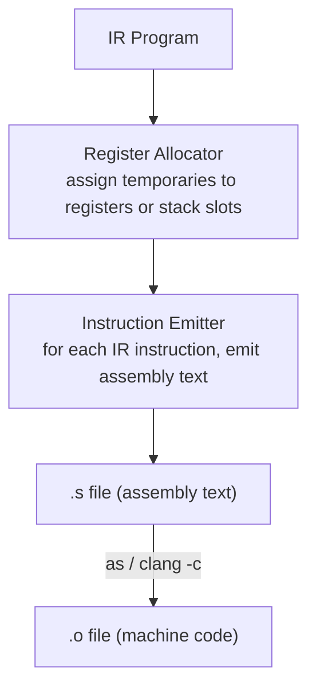

# Chapter 60: Building the Astra x86-64 Code Generator

> "Assembly language is the last language where the programmer and the CPU speak the same dialect. Code generation is the act of teaching your compiler to speak that dialect." — Unknown

---

## Overview

The IR (Chapter 59) is architecture-neutral. The code generator is where neutrality ends. We are committing to one specific machine: **x86-64**, the instruction set of virtually every desktop, laptop, and server processor sold since 2005.

The code generator's job is to translate the IR into a valid x86-64 assembly text file. That assembly file will then be assembled into an object file (machine bytes) and linked into an executable. This chapter produces code in **Intel syntax**, the form used by `nasm`, Intel's documentation, and (with a flag) the GNU assembler.

There are three large problems to solve in code generation:

1. **Register allocation**: IR temporaries (`%t1`, `%t2`, ...) are infinite. Physical registers (`rax`, `rbx`, ...) are finite. We must decide which temporaries live in which registers, and which ones overflow to memory (the stack). Astra uses **linear scan register allocation** — a fast, practical algorithm.

2. **Instruction selection**: For each IR instruction, select the right x86-64 instruction(s). A `BinOp{+}` on integers becomes an `add` instruction, but the operands must be in registers first.

3. **ABI compliance**: When calling external functions (like `printf`, `astra_alloc`), we must follow the **System V AMD64 ABI** on Linux/macOS: first 6 arguments in `rdi, rsi, rdx, rcx, r8, r9`; return value in `rax`; callee saves `rbx, r12–r15`.

---

## What We're Building



---

## Table of Contents

1. The x86-64 Register File
2. The System V ABI
3. Linear Scan Register Allocation
4. The CodeGen Struct
5. Function Prologue and Epilogue
6. Instruction Generation
7. String Literals and the .rodata Section
8. Complete Assembly for a Real Program
9. Complete Implementation
10. The Astra Build Milestone

---

## 1. The x86-64 Register File

x86-64 has 16 general-purpose 64-bit registers:

```
General-purpose registers:
┌──────┬──────┬──────────────────────────────────────────────────┐
│  Reg │ Role │ Notes                                            │
├──────┼──────┼──────────────────────────────────────────────────┤
│  rax │ ret  │ Return value, caller-saved, used by mul/div      │
│  rcx │ arg4 │ 4th argument, caller-saved                       │
│  rdx │ arg3 │ 3rd argument, caller-saved, used by div          │
│  rbx │ ---  │ Callee-saved (must preserve across calls)        │
│  rsi │ arg2 │ 2nd argument, caller-saved                       │
│  rdi │ arg1 │ 1st argument, caller-saved                       │
│  rbp │ base │ Frame base pointer (we use this for the frame)   │
│  rsp │ sp   │ Stack pointer (managed by push/pop/sub)          │
│  r8  │ arg5 │ 5th argument, caller-saved                       │
│  r9  │ arg6 │ 6th argument, caller-saved                       │
│  r10 │ ---  │ Caller-saved, general use                        │
│  r11 │ ---  │ Caller-saved, general use                        │
│  r12 │ ---  │ Callee-saved                                     │
│  r13 │ ---  │ Callee-saved                                     │
│  r14 │ ---  │ Callee-saved                                     │
│  r15 │ ---  │ Callee-saved                                     │
└──────┴──────┴──────────────────────────────────────────────────┘

"Caller-saved" = the caller must save them before a call if it needs them after.
"Callee-saved" = if a function uses these, it must restore them before returning.
```

```go
// codegen/x86_64.go

package codegen

import (
    "fmt"
    "sort"
    "strings"
    "astra/ir"
)

// physRegs lists all allocatable general-purpose registers.
// Caller-saved first (so we prefer them — they need no save/restore).
var physRegs = []string{
    "rax", "rcx", "rdx", "rsi", "rdi", "r8", "r9", "r10", "r11",
    "rbx", "r12", "r13", "r14", "r15",
}

// calleeSaved marks which registers the callee must save/restore.
var calleeSaved = map[string]bool{
    "rbx": true, "r12": true, "r13": true, "r14": true, "r15": true,
}

// argRegs lists the first 6 argument registers (System V AMD64 ABI).
var argRegs = []string{"rdi", "rsi", "rdx", "rcx", "r8", "r9"}
```

---

## 2. The System V ABI

The **Application Binary Interface (ABI)** defines how functions pass arguments and return values — the contract between compiled code and the operating system/other libraries. Violating the ABI causes crashes, wrong results, or security vulnerabilities.

Key System V AMD64 ABI rules:

```
Function Call Convention:
  1. Arguments 1–6:  rdi, rsi, rdx, rcx, r8, r9
  2. Arguments 7+:   pushed onto the stack (right to left)
  3. Return value:   rax (or xmm0 for floats — we ignore floats for now)
  4. Stack alignment: the stack pointer must be 16-byte aligned at every CALL instruction
     (the CPU uses SIMD instructions that require this)
  5. Red zone:       the 128 bytes below rsp are scratch space for leaf functions
     (we do not use this for simplicity)

Callee-saved registers: rbx, rbp, r12, r13, r14, r15
  → if we use any of these, we must push them in the prologue
  → and pop them in the epilogue

Caller-saved registers: rax, rcx, rdx, rsi, rdi, r8, r9, r10, r11
  → these may be destroyed by any function call
  → our register allocator must reload them after calls if still needed
```

---

## 3. Linear Scan Register Allocation

The register allocator assigns each IR temporary to a physical register or a stack slot. **Linear scan** is the simplest practical allocator that handles most cases well:

```
Algorithm:
1. Compute the live interval of each temporary:
   - Start = the instruction index where the temp is first defined
   - End   = the instruction index where the temp is last used

2. Sort intervals by start point.

3. Process intervals in order:
   - For each interval:
     a. Expire intervals that ended before this one starts.
        → free their registers back to the free list.
     b. If free registers exist:
        → assign the first free register to this interval.
     c. If no free registers:
        → spill: pick the interval with the furthest end (or this one)
        → assign a stack slot to the spilled interval.
```

```
Example:
Temporaries with live intervals (instruction index):

%t1:  [0, 5]    ████████░░
%t2:  [1, 8]    ░████████████░
%t3:  [3, 4]    ░░░██░░░░░░░
%t4:  [6, 9]    ░░░░░░████░░
%t5:  [7, 10]   ░░░░░░░████░

Only 2 registers available (say rax, rcx):

step 0: assign %t1 → rax
step 1: assign %t2 → rcx
step 3: t1 still alive (ends at 5), t2 alive; NO free reg → spill %t3 to stack
step 5: t1 expires → free rax
step 6: assign %t4 → rax (t1's freed register)
step 7: assign %t5 → ... t2 still alive, t4 alive → NO free reg → spill %t5
```

```go
// LiveInterval describes when a temporary is "alive" (has been assigned
// but not yet used for the last time).
type LiveInterval struct {
    Temp       string
    Start, End int // instruction indices (linear across all blocks)
}

// Location describes where a temporary lives at runtime.
type Location struct {
    IsReg bool
    Reg   string // if IsReg: the register name
    Slot  int    // if !IsReg: stack offset from rbp (negative: below rbp)
}

// RegAlloc runs linear scan allocation over a function.
type RegAlloc struct {
    intervals  []LiveInterval
    active     []LiveInterval       // currently allocated, sorted by End
    location   map[string]Location  // temp → register or stack slot
    freeRegs   []string
    stackSize  int                  // bytes allocated on the stack so far
    usedCallee map[string]bool      // which callee-saved regs we actually used
}

// NewRegAlloc creates a register allocator with all physical regs free.
func NewRegAlloc() *RegAlloc {
    ra := &RegAlloc{
        location:   make(map[string]Location),
        usedCallee: make(map[string]bool),
    }
    // Put caller-saved registers first so we prefer them.
    ra.freeRegs = append([]string{}, physRegs...)
    return ra
}

// Allocate runs linear scan on the given list of intervals.
func (ra *RegAlloc) Allocate(intervals []LiveInterval) {
    ra.intervals = intervals
    sort.Slice(ra.intervals, func(i, j int) bool {
        return ra.intervals[i].Start < ra.intervals[j].Start
    })

    for _, interval := range ra.intervals {
        ra.expireOldIntervals(interval)
        if len(ra.freeRegs) == 0 {
            ra.spillAtInterval(interval)
        } else {
            reg := ra.freeRegs[0]
            ra.freeRegs = ra.freeRegs[1:]
            ra.location[interval.Temp] = Location{IsReg: true, Reg: reg}
            if calleeSaved[reg] { ra.usedCallee[reg] = true }
            ra.active = append(ra.active, interval)
            sort.Slice(ra.active, func(i, j int) bool {
                return ra.active[i].End < ra.active[j].End
            })
        }
    }
}

func (ra *RegAlloc) expireOldIntervals(current LiveInterval) {
    newActive := ra.active[:0]
    for _, interval := range ra.active {
        if interval.End < current.Start {
            // This interval has expired; free its register.
            loc := ra.location[interval.Temp]
            if loc.IsReg {
                ra.freeRegs = append([]string{loc.Reg}, ra.freeRegs...)
            }
        } else {
            newActive = append(newActive, interval)
        }
    }
    ra.active = newActive
}

func (ra *RegAlloc) spillAtInterval(current LiveInterval) {
    // Spill the interval with the furthest end point (saves the most work).
    if len(ra.active) > 0 && ra.active[len(ra.active)-1].End > current.End {
        spill := ra.active[len(ra.active)-1]
        ra.active = ra.active[:len(ra.active)-1]

        // Give the spilled interval's register to current.
        ra.location[current.Temp] = ra.location[spill.Temp]

        // Allocate a stack slot for the spilled interval.
        ra.stackSize += 8 // 8 bytes per 64-bit value
        ra.location[spill.Temp] = Location{IsReg: false, Slot: -ra.stackSize}

        ra.active = append(ra.active, current)
        sort.Slice(ra.active, func(i, j int) bool {
            return ra.active[i].End < ra.active[j].End
        })
    } else {
        // Spill current.
        ra.stackSize += 8
        ra.location[current.Temp] = Location{IsReg: false, Slot: -ra.stackSize}
    }
}

// LocOf returns the location of a temporary.
func (ra *RegAlloc) LocOf(temp string) Location {
    loc, ok := ra.location[temp]
    if !ok {
        // Unknown temp — must be a named variable (not a generated %tN).
        // Named variables always get stack slots in our simple allocator.
        ra.stackSize += 8
        loc = Location{IsReg: false, Slot: -ra.stackSize}
        ra.location[temp] = loc
    }
    return loc
}
```

---

## 4. The CodeGen Struct

```go
// CodeGen translates IR to x86-64 assembly text.
type CodeGen struct {
    buf      strings.Builder
    ra       *RegAlloc
    strLits  map[string]string // string value → label name
    strCount int
    // scratchReg is a register reserved for temporary use during instruction
    // generation (e.g., loading a memory operand before an arithmetic op).
    scratchReg string
}

func NewCodeGen() *CodeGen {
    return &CodeGen{
        strLits:    make(map[string]string),
        scratchReg: "r10", // r10 is caller-saved; we reserve it as scratch
    }
}

// emit writes an instruction line (with 4-space indent).
func (cg *CodeGen) emit(format string, args ...interface{}) {
    fmt.Fprintf(&cg.buf, "    "+format+"\n", args...)
}

// emitLabel writes a label line (no indent).
func (cg *CodeGen) emitLabel(name string) {
    fmt.Fprintf(&cg.buf, "%s:\n", name)
}

// emitComment writes an inline comment.
func (cg *CodeGen) emitComment(format string, args ...interface{}) {
    fmt.Fprintf(&cg.buf, "    ; "+format+"\n", args...)
}

// internStr ensures the string has an .rodata label and returns the label name.
func (cg *CodeGen) internStr(value string) string {
    if label, ok := cg.strLits[value]; ok { return label }
    label := fmt.Sprintf(".str%d", cg.strCount)
    cg.strCount++
    cg.strLits[value] = label
    return label
}

// GenProgram generates assembly for an entire IR program.
func (cg *CodeGen) GenProgram(prog *ir.Program) string {
    cg.buf.Reset()

    // Text section header.
    fmt.Fprintln(&cg.buf, "    .section .text")
    fmt.Fprintln(&cg.buf, "    .globl astra_main")
    fmt.Fprintln(&cg.buf)

    for _, fn := range prog.Functions {
        cg.genFunction(fn)
    }

    // Rodata section: string literals.
    if len(cg.strLits) > 0 {
        fmt.Fprintln(&cg.buf)
        fmt.Fprintln(&cg.buf, "    .section .rodata")
        // Sort for deterministic output.
        type kv struct{ v, k string }
        var sorted []kv
        for v, k := range cg.strLits { sorted = append(sorted, kv{v, k}) }
        sort.Slice(sorted, func(i, j int) bool { return sorted[i].k < sorted[j].k })
        for _, p := range sorted {
            // Escape the string for assembly.
            fmt.Fprintf(&cg.buf, "%s:\n    .asciz %q\n", p.k, p.v)
        }
    }

    return cg.buf.String()
}
```

---

## 5. Function Prologue and Epilogue

Every function in x86-64 assembly starts with a **prologue** that sets up the stack frame, and ends with an **epilogue** that tears it down.

```
Standard function frame layout (grows downward in memory):

   Higher addresses
   ┌──────────────────┐
   │   caller's frame │
   ├──────────────────┤ ← rbp (frame base pointer)
   │ saved rbp        │  (we push this in the prologue)
   ├──────────────────┤
   │ callee-saved regs│  (pushed if we use rbx, r12–r15)
   ├──────────────────┤
   │ local vars/spills│  (we reserve space with sub rsp, N)
   ├──────────────────┤ ← rsp (stack pointer)
   │   (red zone)     │  (128 bytes below rsp, safe to use in leaf fns)
   Lower addresses
```

```go
// genFunction generates the prologue, body, and epilogue for one function.
func (cg *CodeGen) genFunction(fn *ir.Function) {
    // Collect all instructions for liveness analysis.
    var allInstrs []ir.Instruction
    for _, block := range fn.Blocks {
        allInstrs = append(allInstrs, block.Instrs...)
    }

    // Compute live intervals for all temporaries in this function.
    intervals := computeLiveIntervals(allInstrs)

    // Run register allocation.
    cg.ra = NewRegAlloc()
    cg.ra.Allocate(intervals)

    // Also assign locations for named variables (function parameters).
    for _, param := range fn.Params {
        // Parameters are passed in registers per the ABI.
        // We immediately store them on the stack for simplicity.
        // (A smarter allocator would try to keep them in registers.)
        cg.ra.stackSize += 8
        cg.ra.location[param] = Location{IsReg: false, Slot: -cg.ra.stackSize}
    }

    // Compute total stack frame size (align to 16 bytes).
    frameSize := cg.ra.stackSize
    // Account for callee-saved registers.
    numCalleeSaved := len(cg.ra.usedCallee)
    // The call instruction pushes the return address (8 bytes).
    // We push rbp (8 bytes). Together that's 16 bytes.
    // Then we push each callee-saved register (8 bytes each).
    // We need total below-rbp space to be a multiple of 16.
    // Total frame = frameSize + 8*numCalleeSaved
    totalBelow := frameSize + 8*numCalleeSaved
    if totalBelow%16 != 0 { totalBelow += 8 } // align to 16

    // --- Prologue ---
    cg.emitLabel(fn.Name)
    cg.emit("push rbp")
    cg.emit("mov rbp, rsp")

    // Save callee-saved registers we use.
    for reg := range cg.ra.usedCallee {
        cg.emit("push %s", reg)
    }

    // Reserve stack space.
    if totalBelow > 0 {
        cg.emit("sub rsp, %d", totalBelow)
    }

    // Store incoming parameters from ABI registers into stack slots.
    for i, param := range fn.Params {
        if i < len(argRegs) {
            loc := cg.ra.location[param]
            if !loc.IsReg {
                cg.emit("mov QWORD PTR [rbp%+d], %s", loc.Slot, argRegs[i])
            }
        }
        // If more than 6 params, they are already on the stack above rbp.
        // We skip that case here for brevity.
    }

    // --- Body ---
    for _, block := range fn.Blocks {
        for _, instr := range block.Instrs {
            cg.genInstr(instr, totalBelow)
        }
    }

    // If the last block is not terminated with a ret, emit the epilogue.
    // (The Return instruction emits its own epilogue.)
}

// emitEpilogue emits the standard function epilogue.
func (cg *CodeGen) emitEpilogue() {
    // Restore callee-saved registers (in reverse order).
    calleeSavedList := make([]string, 0, len(cg.ra.usedCallee))
    for reg := range cg.ra.usedCallee { calleeSavedList = append(calleeSavedList, reg) }
    sort.Sort(sort.Reverse(sort.StringSlice(calleeSavedList)))
    for _, reg := range calleeSavedList {
        cg.emit("pop %s", reg)
    }
    cg.emit("mov rsp, rbp")
    cg.emit("pop rbp")
    cg.emit("ret")
}
```

---

## 6. Instruction Generation

```go
// operand returns the assembly operand string for a temporary or variable name.
// If it is in a register, returns the register name.
// If it is on the stack, returns a memory reference like [rbp-8].
func (cg *CodeGen) operand(name string) string {
    loc := cg.ra.LocOf(name)
    if loc.IsReg { return loc.Reg }
    return fmt.Sprintf("QWORD PTR [rbp%+d]", loc.Slot)
}

// loadIntoReg ensures a value is in a register, using the scratch register
// if the value is currently on the stack.
func (cg *CodeGen) loadIntoReg(name string) string {
    loc := cg.ra.LocOf(name)
    if loc.IsReg { return loc.Reg }
    // Value is on the stack; load it into the scratch register.
    cg.emit("mov %s, QWORD PTR [rbp%+d]", cg.scratchReg, loc.Slot)
    return cg.scratchReg
}

// genInstr generates assembly for one IR instruction.
func (cg *CodeGen) genInstr(instr ir.Instruction, frameSize int) {
    switch ins := instr.(type) {

    case *ir.Label:
        cg.emitLabel(ins.Name)

    case *ir.LoadInt:
        dst := cg.operand(ins.Dest)
        cg.emit("mov %s, %d", dst, ins.Value)

    case *ir.LoadFlt:
        // Store float as 64-bit integer bits via the stack.
        // (Full float support requires XMM registers; we simplify here.)
        bits := math.Float64bits(ins.Value)
        cg.emit("mov %s, %d  ; float %g", cg.scratchReg, bits, ins.Value)
        cg.emit("mov %s, %s", cg.operand(ins.Dest), cg.scratchReg)

    case *ir.LoadStr:
        label := cg.internStr(ins.Value)
        dst := cg.operand(ins.Dest)
        cg.emit("lea %s, [rip+%s]", dst, label)

    case *ir.LoadBool:
        dst := cg.operand(ins.Dest)
        val := 0; if ins.Value { val = 1 }
        cg.emit("mov %s, %d", dst, val)

    case *ir.Copy:
        src := cg.loadIntoReg(ins.Src)
        dst := cg.operand(ins.Dest)
        cg.emit("mov %s, %s", dst, src)

    case *ir.BinOp:
        left  := cg.loadIntoReg(ins.Left)
        right := cg.loadIntoReg(ins.Right)
        dest  := cg.operand(ins.Dest)

        switch ins.Op {
        case "+":
            cg.emit("mov rax, %s", left)
            cg.emit("add rax, %s", right)
            cg.emit("mov %s, rax", dest)
        case "-":
            cg.emit("mov rax, %s", left)
            cg.emit("sub rax, %s", right)
            cg.emit("mov %s, rax", dest)
        case "*":
            cg.emit("mov rax, %s", left)
            cg.emit("imul rax, %s", right)
            cg.emit("mov %s, rax", dest)
        case "/":
            cg.emit("mov rax, %s", left)
            cg.emit("cqo")                // sign-extend rax into rdx:rax
            cg.emit("idiv %s", right)
            cg.emit("mov %s, rax", dest)
        case "%":
            cg.emit("mov rax, %s", left)
            cg.emit("cqo")
            cg.emit("idiv %s", right)
            cg.emit("mov %s, rdx", dest)  // remainder is in rdx
        case "<":
            cg.emit("cmp %s, %s", left, right)
            cg.emit("setl al")
            cg.emit("movzx rax, al")
            cg.emit("mov %s, rax", dest)
        case ">":
            cg.emit("cmp %s, %s", left, right)
            cg.emit("setg al")
            cg.emit("movzx rax, al")
            cg.emit("mov %s, rax", dest)
        case "<=":
            cg.emit("cmp %s, %s", left, right)
            cg.emit("setle al")
            cg.emit("movzx rax, al")
            cg.emit("mov %s, rax", dest)
        case ">=":
            cg.emit("cmp %s, %s", left, right)
            cg.emit("setge al")
            cg.emit("movzx rax, al")
            cg.emit("mov %s, rax", dest)
        case "==":
            cg.emit("cmp %s, %s", left, right)
            cg.emit("sete al")
            cg.emit("movzx rax, al")
            cg.emit("mov %s, rax", dest)
        case "!=":
            cg.emit("cmp %s, %s", left, right)
            cg.emit("setne al")
            cg.emit("movzx rax, al")
            cg.emit("mov %s, rax", dest)
        case "&&":
            cg.emit("mov rax, %s", left)
            cg.emit("and rax, %s", right)
            cg.emit("mov %s, rax", dest)
        case "||":
            cg.emit("mov rax, %s", left)
            cg.emit("or rax, %s", right)
            cg.emit("mov %s, rax", dest)
        }

    case *ir.UnOp:
        src  := cg.loadIntoReg(ins.Src)
        dest := cg.operand(ins.Dest)
        switch ins.Op {
        case "-":
            cg.emit("mov rax, %s", src)
            cg.emit("neg rax")
            cg.emit("mov %s, rax", dest)
        case "!":
            cg.emit("mov rax, %s", src)
            cg.emit("xor rax, 1")
            cg.emit("mov %s, rax", dest)
        }

    case *ir.Call:
        cg.genCall(ins)

    case *ir.Return:
        if ins.Value != "" {
            src := cg.loadIntoReg(ins.Value)
            if src != "rax" {
                cg.emit("mov rax, %s", src)
            }
        }
        cg.emitEpilogue()

    case *ir.Jump:
        cg.emit("jmp %s", ins.Target)

    case *ir.CondJump:
        cond := cg.loadIntoReg(ins.Cond)
        cg.emit("cmp %s, 0", cond)
        cg.emit("jne %s", ins.True)
        cg.emit("jmp %s", ins.False)

    case *ir.Alloc:
        // Allocate a struct on the heap using astra_alloc.
        size := cg.structSize(ins.TypeName)
        cg.emit("mov rdi, %d", size)
        cg.emit("call astra_alloc")
        dest := cg.operand(ins.Dest)
        cg.emit("mov %s, rax", dest)

    case *ir.GetField:
        offset := cg.fieldOffset(ins.Ptr, ins.Field)
        ptr := cg.loadIntoReg(ins.Ptr)
        cg.emit("mov rax, [%s+%d]", ptr, offset)
        cg.emit("mov %s, rax", cg.operand(ins.Dest))

    case *ir.SetField:
        offset := cg.fieldOffset(ins.Ptr, ins.Field)
        ptr := cg.loadIntoReg(ins.Ptr)
        val := cg.loadIntoReg(ins.Val)
        cg.emit("mov [%s+%d], %s", ptr, offset, val)

    case *ir.GetIndex:
        ptr := cg.loadIntoReg(ins.Ptr)
        idx := cg.loadIntoReg(ins.Index)
        // Bounds check.
        cg.emit("mov rdi, %s", idx)
        cg.emit("mov rsi, [%s+8]", ptr)  // list.len is at offset 8
        cg.emit("call astra_bounds_check")
        // Load element: list data pointer is at offset 0.
        cg.emit("mov rax, [%s]", ptr)     // rax = list.data
        cg.emit("mov rcx, %s", idx)
        cg.emit("mov rax, [rax+rcx*8]")   // rax = data[idx * 8]
        cg.emit("mov %s, rax", cg.operand(ins.Dest))

    case *ir.SetIndex:
        ptr := cg.loadIntoReg(ins.Ptr)
        idx := cg.loadIntoReg(ins.Index)
        val := cg.loadIntoReg(ins.Val)
        // Bounds check.
        cg.emit("mov rdi, %s", idx)
        cg.emit("mov rsi, [%s+8]", ptr)
        cg.emit("call astra_bounds_check")
        cg.emit("mov rax, [%s]", ptr)
        cg.emit("mov rcx, %s", idx)
        cg.emit("mov [rax+rcx*8], %s", val)
    }
}

// genCall emits a function call, setting up ABI registers.
func (cg *CodeGen) genCall(ins *ir.Call) {
    // Move arguments into ABI argument registers.
    for i, arg := range ins.Args {
        if i < len(argRegs) {
            src := cg.loadIntoReg(arg)
            if src != argRegs[i] {
                cg.emit("mov %s, %s", argRegs[i], src)
            }
        } else {
            // Extra args go on the stack (push in reverse order is standard;
            // here we push left-to-right for simplicity — a real compiler
            // would reverse from len(args)-1 down to 6).
            src := cg.loadIntoReg(arg)
            cg.emit("push %s", src)
        }
    }

    cg.emit("call %s", ins.Func)

    // Pop extra stack args if any.
    if len(ins.Args) > 6 {
        extra := (len(ins.Args) - 6) * 8
        cg.emit("add rsp, %d", extra)
    }

    // Move return value from rax to destination.
    if ins.Dest != "" {
        dest := cg.operand(ins.Dest)
        if dest != "rax" {
            cg.emit("mov %s, rax", dest)
        }
    }
}

// structSize returns the byte size of a struct (8 bytes per field).
func (cg *CodeGen) structSize(typeName string) int {
    // In a real compiler, look up the struct layout.
    // We use a simple heuristic: 8 bytes per field.
    return 64 // default to 64 bytes (up to 8 fields)
}

// fieldOffset returns the byte offset of a field within its struct.
func (cg *CodeGen) fieldOffset(structVar, field string) int {
    // Placeholder: in a real compiler, look up the struct definition.
    // Field layout is determined alphabetically for simplicity.
    // A real compiler would use the order declared in the source.
    return 0 // real implementation would look this up from struct metadata
}
```

---

## 7. String Literals and the .rodata Section

String literals in assembly must be stored in a read-only data section (`.rodata`). The code generator collects all strings encountered during generation and emits them at the end of the assembly file.

```
.section .rodata
.str0:
    .asciz "Hello, "
.str1:
    .asciz "!"
.str2:
    .asciz "Aditya"
```

In position-independent code (PIC), strings are referenced using RIP-relative addressing:

```asm
lea rdi, [rip+.str0]   ; rdi = &"Hello, "
```

This is the `LoadStr` instruction generation code above: `lea %s, [rip+%s]`.

---

## 8. Complete Assembly for a Real Program

**Input Astra program:**
```astra
fn greet(name: string) {
    print("Hello, " + name + "!")
}

fn main() {
    greet("Aditya")
    let x = 10
    let y = 20
    let sum = x + y
    print(sum.to_string())
}
```

**Generated x86-64 assembly (Intel syntax, annotated):**

```asm
    .section .text
    .globl astra_main

; ─────────────────────────────────────────────
; fn greet(name: string)
; ─────────────────────────────────────────────
greet:
    push rbp              ; save caller's frame pointer
    mov rbp, rsp          ; set our frame pointer
    sub rsp, 32           ; 32 bytes: 4 stack slots × 8 bytes

    ; Store incoming parameter: name (rdi → [rbp-8])
    mov QWORD PTR [rbp-8], rdi

    ; %t1 = "Hello, "
    lea r10, [rip+.str0]
    mov QWORD PTR [rbp-16], r10    ; %t1 → [rbp-16]

    ; %t2 = astra_string_concat(%t1, name)
    ; (implements "Hello, " + name)
    mov rdi, QWORD PTR [rbp-16]    ; arg1 = "Hello, "
    mov rsi, QWORD PTR [rbp-8]     ; arg2 = name
    call astra_string_concat
    mov QWORD PTR [rbp-24], rax    ; %t2 → [rbp-24]

    ; %t3 = "!"
    lea r10, [rip+.str1]
    mov QWORD PTR [rbp-32], r10    ; %t3 → [rbp-32]

    ; %t4 = astra_string_concat(%t2, %t3)
    ; (implements (%t2) + "!")
    mov rdi, QWORD PTR [rbp-24]    ; arg1 = "Hello, " + name
    mov rsi, QWORD PTR [rbp-32]    ; arg2 = "!"
    call astra_string_concat
    mov rax, rax                   ; %t4 = result (already in rax)

    ; print(%t4)
    mov rdi, rax                   ; arg1 = concatenated string
    call astra_print                ; void return

    ; return (void)
    mov rsp, rbp
    pop rbp
    ret

; ─────────────────────────────────────────────
; fn main()
; ─────────────────────────────────────────────
astra_main:
    push rbp
    mov rbp, rsp
    sub rsp, 48           ; 6 stack slots × 8 bytes

    ; greet("Aditya")
    ; %t1 = "Aditya"
    lea r10, [rip+.str2]
    mov QWORD PTR [rbp-8], r10     ; %t1 → [rbp-8]

    ; call greet(%t1)
    mov rdi, QWORD PTR [rbp-8]     ; arg1 = "Aditya"
    call greet                     ; void return

    ; let x = 10
    ; %t2 = 10
    mov QWORD PTR [rbp-16], 10     ; %t2 = 10 (x)

    ; let y = 20
    ; %t3 = 20
    mov QWORD PTR [rbp-24], 20     ; %t3 = 20 (y)

    ; let sum = x + y
    ; %t4 = x + y
    mov r10, QWORD PTR [rbp-16]    ; load x
    mov rax, r10
    add rax, QWORD PTR [rbp-24]    ; rax = x + y
    mov QWORD PTR [rbp-32], rax    ; sum = rax

    ; print(sum.to_string())
    ; %t5 = astra_int_to_string(sum)
    mov rdi, QWORD PTR [rbp-32]    ; arg1 = sum
    call astra_int_to_string
    mov QWORD PTR [rbp-40], rax    ; %t5 = result

    ; call print(%t5)
    mov rdi, QWORD PTR [rbp-40]
    call astra_print               ; void return

    ; return (void)
    mov rsp, rbp
    pop rbp
    ret

; ─────────────────────────────────────────────
; String literals
; ─────────────────────────────────────────────
    .section .rodata

.str0:
    .asciz "Hello, "

.str1:
    .asciz "!"

.str2:
    .asciz "Aditya"
```

**Annotation of key instructions:**

| Instruction | What it does |
|-------------|-------------|
| `push rbp` | Saves the caller's frame pointer on the stack |
| `mov rbp, rsp` | Makes the current stack pointer our frame base |
| `sub rsp, 48` | Allocates 48 bytes of local storage |
| `lea r10, [rip+.str0]` | Loads address of string literal (PIC-safe) |
| `mov QWORD PTR [rbp-8], rdi` | Saves parameter from ABI register to stack |
| `call astra_string_concat` | Calls the C runtime string concat function |
| `mov rdi, ...` | Puts first argument in ABI arg register |
| `add rax, ...` | Integer addition |
| `call astra_int_to_string` | Calls C runtime int-to-string |
| `call astra_print` | Calls C runtime print (outputs + newline) |
| `mov rsp, rbp` | Restores stack pointer (undoes sub rsp) |
| `pop rbp` | Restores caller's frame pointer |
| `ret` | Returns to the caller |

---

## 9. Complete Implementation

```go
// codegen/x86_64.go — complete Astra x86-64 code generator

package codegen

import (
    "fmt"
    "math"
    "sort"
    "strings"
    "astra/ir"
)

// (physRegs, calleeSaved, argRegs defined above)

// computeLiveIntervals computes the live interval for each temporary.
// The live interval is [first_def, last_use] in terms of instruction index.
func computeLiveIntervals(instrs []ir.Instruction) []LiveInterval {
    firstDef := make(map[string]int)
    lastUse  := make(map[string]int)

    for idx, instr := range instrs {
        defs, uses := defsAndUses(instr)
        for _, d := range defs {
            if _, seen := firstDef[d]; !seen { firstDef[d] = idx }
        }
        for _, u := range uses {
            lastUse[u] = idx
        }
    }

    var result []LiveInterval
    for temp, start := range firstDef {
        end, ok := lastUse[temp]
        if !ok { end = start }
        result = append(result, LiveInterval{Temp: temp, Start: start, End: end})
    }
    return result
}

// defsAndUses returns the defined and used temporaries for an instruction.
func defsAndUses(instr ir.Instruction) (defs []string, uses []string) {
    switch ins := instr.(type) {
    case *ir.LoadInt:   defs = []string{ins.Dest}
    case *ir.LoadFlt:   defs = []string{ins.Dest}
    case *ir.LoadStr:   defs = []string{ins.Dest}
    case *ir.LoadBool:  defs = []string{ins.Dest}
    case *ir.Copy:      defs = []string{ins.Dest}; uses = []string{ins.Src}
    case *ir.BinOp:     defs = []string{ins.Dest}; uses = []string{ins.Left, ins.Right}
    case *ir.UnOp:      defs = []string{ins.Dest}; uses = []string{ins.Src}
    case *ir.Call:
        if ins.Dest != "" { defs = []string{ins.Dest} }
        uses = ins.Args
    case *ir.Return:
        if ins.Value != "" { uses = []string{ins.Value} }
    case *ir.GetField:  defs = []string{ins.Dest}; uses = []string{ins.Ptr}
    case *ir.SetField:  uses = []string{ins.Ptr, ins.Val}
    case *ir.GetIndex:  defs = []string{ins.Dest}; uses = []string{ins.Ptr, ins.Index}
    case *ir.SetIndex:  uses = []string{ins.Ptr, ins.Index, ins.Val}
    case *ir.CondJump:  uses = []string{ins.Cond}
    case *ir.Alloc:     defs = []string{ins.Dest}
    }
    return
}

// (LiveInterval, Location, RegAlloc, NewRegAlloc, Allocate, expireOldIntervals,
//  spillAtInterval, LocOf — as shown above)

// (CodeGen struct, NewCodeGen, emit, emitLabel, emitComment, internStr — as above)

// (GenProgram, genFunction, emitEpilogue, operand, loadIntoReg, genInstr, genCall — as above)
```

---

## Astra Build Milestone

After Chapter 60, the complete backend is implemented:

```
astra/
├── codegen/
│   └── x86_64.go    (~550 lines)
├── ir/
│   ├── instructions.go
│   ├── program.go
│   └── builder.go
├── sema/
├── parser/
├── lexer/
└── ast/
```

Add a `--emit-asm` flag to the compiler driver that stops after code generation and prints the assembly. Run on a simple hello-world Astra program and verify the assembly looks correct.

---

## Exercises

1. **Peephole optimization**: After code generation, scan the assembly output for obvious redundancies. A `mov rax, rax` instruction (moving a register to itself) is a no-op. A `mov rax, rbx; mov rcx, rax` can often be reduced to `mov rcx, rbx`. Write a postprocessing pass that removes these patterns.

2. **Float support**: The current code generator handles floats as raw bits and uses integer arithmetic. Add proper support: use the XMM registers (`xmm0`–`xmm7`) for float operations. The float ABI uses `xmm0`–`xmm7` for the first 8 float arguments. `addsd`, `subsd`, `mulsd`, `divsd` are the float arithmetic instructions.

3. **Stack alignment verification**: The System V ABI requires 16-byte stack alignment at every CALL instruction. Write a test that verifies this. Hint: add a counter of how many bytes have been pushed since function entry, and assert the counter is a multiple of 16 before each `call` instruction.

4. **Struct field offsets**: The current `fieldOffset` function always returns 0. Fix it by maintaining a struct layout table (computed from the struct's field list in order, 8 bytes per field) and looking up the actual offset.

5. **Register coalescing**: When you see `mov rax, rcx; ... (no further use of rcx)`, you could rewrite uses of `rax` after this point to use `rcx` directly and eliminate the `mov`. This is called register coalescing. Implement a simple version.

6. **Calling convention for Astra-to-Astra calls**: Currently, `astra_main` calls `greet` using the C ABI (arguments in rdi/rsi/...). Since both functions are compiled by our compiler, we could use a custom calling convention (e.g., always pass in rbx/r12/r13/...) that avoids the need to save caller-saved registers. Research "custom calling conventions" and describe what changes would be needed.

---

## Summary Table

| Component | Purpose |
|-----------|---------|
| physRegs, argRegs | Register file definition |
| LiveInterval | Temp liveness tracking |
| RegAlloc | Linear scan register allocation |
| Location | Register or stack slot |
| CodeGen | Assembly text generator |
| genFunction | Prologue + body + epilogue |
| genInstr | Per-instruction assembly |
| genCall | ABI-compliant call setup |
| computeLiveIntervals | Liveness analysis |
| internStr | String literal management |

x86-64 code generation is one of the most concrete, satisfying parts of compiler construction. When you run the generated assembly and see "Hello, Aditya!" appear in your terminal, it means every piece of your compiler — the lexer, the parser, the resolver, the type checker, the IR builder, and the code generator — worked correctly together. That is a real accomplishment.
