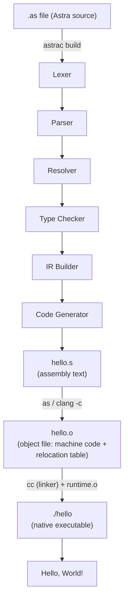
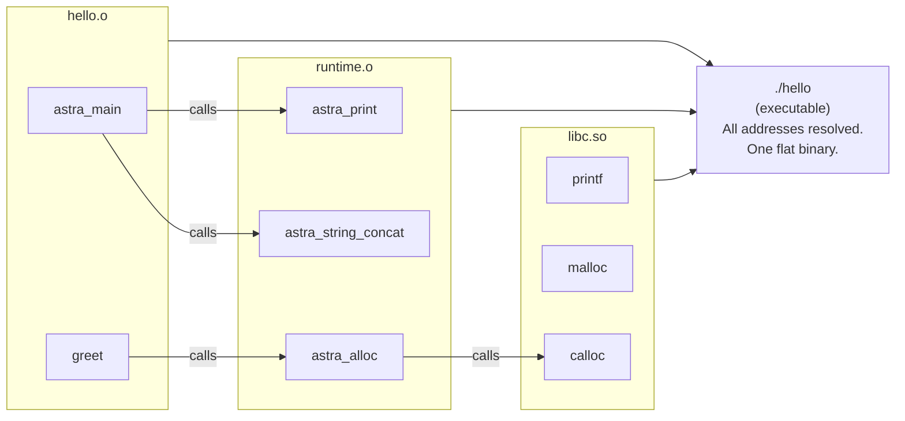

# Chapter 61: Linking and Producing Native Executables

> "A compiler without a linker is like a writer without a printer. The words are perfect, but nobody can read them." — Unknown

---

## Overview

At the end of Chapter 60, the code generator produced a `.s` file — a text file containing x86-64 assembly instructions. This file is not yet executable. To turn it into something you can actually run, two more steps are required:

1. **Assembling**: convert the assembly text to machine bytes (a `.o` object file)
2. **Linking**: combine the object file with the Astra runtime and the C standard library to produce a final executable

This chapter implements both steps, plus the complete Astra runtime library in C, and ties everything together into the final `astrac` compiler driver. By the end of this chapter, you will run:

```
astrac build hello.as
./hello
```

And see real output from a real program compiled by a compiler you built yourself.

---

## What We're Building



---

## Table of Contents

1. The Object File: What the Assembler Produces
2. The Astra Runtime (runtime.c)
3. The Astra List Runtime (astra_list.c)
4. The Astra String Runtime (astra_string.c)
5. Assembling and Linking
6. Platform Differences: Linux vs macOS
7. The astrac Compiler Driver (main.go)
8. The `astrac run` Command
9. The `astrac check` Command
10. Verbose Mode and Timing
11. Complete Implementation

---

## 1. The Object File: What the Assembler Produces

When the assembler processes our `.s` file, it produces an **object file** (`.o`). An object file contains:

```
ELF Object File Structure (Linux):
┌─────────────────────────────────────────┐
│  ELF Header                             │
│  (identifies file type, architecture)  │
├─────────────────────────────────────────┤
│  .text section                          │
│  (machine code bytes for all functions) │
├─────────────────────────────────────────┤
│  .rodata section                        │
│  (string literals, constant data)       │
├─────────────────────────────────────────┤
│  Symbol Table                           │
│  (names and locations of all symbols:   │
│   astra_main, greet, .str0, ...)        │
├─────────────────────────────────────────┤
│  Relocation Table                       │
│  (list of places where the linker       │
│   needs to fill in addresses:           │
│   - call astra_print  → address TBD    │
│   - call astra_alloc  → address TBD    │
│   - lea  [rip+.str0]  → address TBD   │
└─────────────────────────────────────────┘
```

The key insight: the object file contains **unresolved references**. When our code calls `astra_print`, the assembler does not know the address of `astra_print` — it just marks the call instruction with a relocation entry that says "fill this 4-byte slot with the offset to `astra_print` when you know where it is."

The **linker** resolves these references by combining multiple object files and figuring out where each symbol lives.



---

## 2. The Astra Runtime (runtime.c)

The runtime is the C code that Astra programs call for basic operations. It implements string manipulation, memory allocation, I/O, and the program entry point.

```c
/* runtime/runtime.c
 * The Astra language runtime — C implementation.
 * Compiled with: cc -c runtime.c -o runtime.o
 */

#include <stdio.h>
#include <stdlib.h>
#include <string.h>
#include <stdint.h>

/* ── Initialization and shutdown ─────────────────────────────────────── */

/* _astra_init is called before user code runs.
 * It sets up any global state the runtime needs. */
void _astra_init(void) {
    /* Future: initialize GC, set up signal handlers, parse env vars. */
}

/* _astra_cleanup is called after user's main() returns. */
void _astra_cleanup(int exit_code) {
    /* Future: run finalizers, flush output, collect GC stats. */
    exit(exit_code);
}

/* ── I/O ──────────────────────────────────────────────────────────────── */

/* astra_print prints a string followed by a newline.
 * Called by: print(x) in Astra source. */
void astra_print(const char* str) {
    if (str) {
        fputs(str, stdout);
    }
    fputc('\n', stdout);
    fflush(stdout);
}

/* astra_print_no_newline prints a string without a newline.
 * Called by: print_raw(x) in Astra source. */
void astra_print_no_newline(const char* str) {
    if (str) {
        fputs(str, stdout);
        fflush(stdout);
    }
}

/* astra_eprint prints to stderr (for error messages). */
void astra_eprint(const char* str) {
    if (str) {
        fputs(str, stderr);
        fputc('\n', stderr);
    }
}

/* ── Type conversion ──────────────────────────────────────────────────── */

/* astra_int_to_string converts a 64-bit integer to a heap-allocated string. */
char* astra_int_to_string(int64_t n) {
    char* buf = (char*)malloc(32);
    if (!buf) {
        fputs("astra: out of memory in int_to_string\n", stderr);
        exit(1);
    }
    snprintf(buf, 32, "%ld", (long)n);
    return buf;
}

/* astra_float_to_string converts a double to a heap-allocated string. */
char* astra_float_to_string(double f) {
    char* buf = (char*)malloc(64);
    if (!buf) {
        fputs("astra: out of memory in float_to_string\n", stderr);
        exit(1);
    }
    snprintf(buf, 64, "%g", f);
    return buf;
}

/* astra_bool_to_string converts a bool (0 or 1) to "false" or "true". */
char* astra_bool_to_string(int64_t b) {
    return b ? "true" : "false";
}

/* astra_string_to_int converts a string to an int64.
 * Panics with a helpful message if the string is not a valid integer. */
int64_t astra_string_to_int(const char* s) {
    if (!s) astra_panic("string_to_int: null string");
    char* end;
    long long result = strtoll(s, &end, 10);
    if (*end != '\0') {
        char msg[256];
        snprintf(msg, sizeof(msg), "string_to_int: '%s' is not a valid integer", s);
        astra_panic(msg);
    }
    return (int64_t)result;
}

/* astra_string_to_float converts a string to a double. */
double astra_string_to_float(const char* s) {
    if (!s) astra_panic("string_to_float: null string");
    char* end;
    double result = strtod(s, &end);
    if (*end != '\0') {
        char msg[256];
        snprintf(msg, sizeof(msg), "string_to_float: '%s' is not a valid float", s);
        astra_panic(msg);
    }
    return result;
}

/* ── Memory allocation ───────────────────────────────────────────────── */

/* astra_alloc allocates size bytes, zeroed.
 * All Astra heap allocations go through this function.
 * In the future, this will route through the GC.
 * For now, it calls calloc directly. */
void* astra_alloc(int64_t size) {
    if (size <= 0) {
        fputs("astra: astra_alloc called with non-positive size\n", stderr);
        exit(1);
    }
    void* ptr = calloc(1, (size_t)size);
    if (!ptr) {
        fputs("astra: out of memory\n", stderr);
        exit(1);
    }
    return ptr;
}

/* astra_free releases heap memory.
 * In the GC-managed future, this is a no-op. */
void astra_free(void* ptr) {
    free(ptr);
}

/* astra_realloc resizes a heap allocation. */
void* astra_realloc(void* ptr, int64_t new_size) {
    void* result = realloc(ptr, (size_t)new_size);
    if (!result) {
        fputs("astra: out of memory in realloc\n", stderr);
        exit(1);
    }
    return result;
}

/* ── Error handling ──────────────────────────────────────────────────── */

/* astra_panic prints an error message and exits with code 1. */
void astra_panic(const char* msg) {
    fprintf(stderr, "\nastra: panic: %s\n", msg ? msg : "(null)");
    exit(1);
}

/* astra_panic_fmt formats a message before panicking. */
void astra_panic_fmt(const char* fmt, ...) {
    va_list args;
    va_start(args, fmt);
    fprintf(stderr, "\nastra: panic: ");
    vfprintf(stderr, fmt, args);
    fprintf(stderr, "\n");
    va_end(args);
    exit(1);
}

/* astra_bounds_check checks that idx is in [0, len).
 * Called before every array access in debug builds. */
void astra_bounds_check(int64_t idx, int64_t len) {
    if (idx < 0 || idx >= len) {
        fprintf(stderr,
            "\nastra: index out of bounds: index %ld in list of length %ld\n",
            (long)idx, (long)len);
        exit(1);
    }
}

/* ── Program entry point ─────────────────────────────────────────────── */

/* The real C main() that the OS calls.
 * It calls our runtime init, then calls the user's Astra main. */
extern void astra_main(void);  /* user's fn main() in Astra */

int main(int argc, char** argv) {
    (void)argc; (void)argv;  /* suppress unused warnings */
    _astra_init();
    astra_main();
    _astra_cleanup(0);
    return 0;  /* unreachable, but required by C standard */
}
```

---

## 3. The Astra List Runtime (astra_list.c)

Lists are Astra's primary container type. The list runtime implements a dynamic array backed by heap memory.

```c
/* runtime/astra_list.c
 * Astra List<T> runtime implementation.
 * All elements are 64-bit values (int, float-as-bits, or pointer).
 */

#include <stdio.h>
#include <stdlib.h>
#include <string.h>
#include <stdint.h>

/* AstraList is the C representation of an Astra List<T> value.
 * The Astra code generator treats this as a struct with:
 *   offset 0: data pointer (int64_t*)
 *   offset 8: len (int64_t)
 *   offset 16: cap (int64_t)
 */
typedef struct {
    int64_t* data;
    int64_t  len;
    int64_t  cap;
} AstraList;

/* astra_list_new creates a new list with a given initial capacity. */
AstraList* astra_list_new(int64_t initial_cap) {
    if (initial_cap < 4) initial_cap = 4;
    AstraList* list = (AstraList*)calloc(1, sizeof(AstraList));
    if (!list) { fputs("astra: out of memory\n", stderr); exit(1); }
    list->data = (int64_t*)calloc((size_t)initial_cap, sizeof(int64_t));
    if (!list->data) { fputs("astra: out of memory\n", stderr); exit(1); }
    list->len = 0;
    list->cap = initial_cap;
    return list;
}

/* astra_list_push appends an element to the list, growing if needed. */
void astra_list_push(AstraList* list, int64_t value) {
    if (list->len >= list->cap) {
        int64_t new_cap = list->cap * 2;
        int64_t* new_data = (int64_t*)realloc(
            list->data, (size_t)new_cap * sizeof(int64_t));
        if (!new_data) { fputs("astra: out of memory\n", stderr); exit(1); }
        list->data = new_data;
        list->cap  = new_cap;
    }
    list->data[list->len++] = value;
}

/* astra_list_get retrieves an element by index (with bounds check). */
int64_t astra_list_get(AstraList* list, int64_t index) {
    if (index < 0 || index >= list->len) {
        fprintf(stderr,
            "astra: list index %ld out of bounds [0, %ld)\n",
            (long)index, (long)list->len);
        exit(1);
    }
    return list->data[index];
}

/* astra_list_set sets an element by index (with bounds check). */
void astra_list_set(AstraList* list, int64_t index, int64_t value) {
    if (index < 0 || index >= list->len) {
        fprintf(stderr,
            "astra: list assignment index %ld out of bounds [0, %ld)\n",
            (long)index, (long)list->len);
        exit(1);
    }
    list->data[index] = value;
}

/* astra_list_len returns the length of the list. */
int64_t astra_list_len(AstraList* list) {
    return list->len;
}

/* astra_list_slice creates a new list from a subrange [start, end). */
AstraList* astra_list_slice(AstraList* list, int64_t start, int64_t end) {
    if (start < 0) start = 0;
    if (end > list->len) end = list->len;
    int64_t new_len = end - start;
    if (new_len < 0) new_len = 0;
    AstraList* result = astra_list_new(new_len + 1);
    result->len = new_len;
    if (new_len > 0) {
        memcpy(result->data, list->data + start,
               (size_t)new_len * sizeof(int64_t));
    }
    return result;
}

/* astra_list_concat concatenates two lists into a new list. */
AstraList* astra_list_concat(AstraList* a, AstraList* b) {
    AstraList* result = astra_list_new(a->len + b->len);
    memcpy(result->data, a->data, (size_t)a->len * sizeof(int64_t));
    memcpy(result->data + a->len, b->data, (size_t)b->len * sizeof(int64_t));
    result->len = a->len + b->len;
    return result;
}

/* astra_list_free releases all memory owned by a list. */
void astra_list_free(AstraList* list) {
    if (list) {
        free(list->data);
        free(list);
    }
}
```

---

## 4. The Astra String Runtime (astra_string.c)

```c
/* runtime/astra_string.c
 * Astra string operations. All strings are null-terminated C strings.
 * All functions that return strings return heap-allocated copies
 * (the GC will collect them in the future).
 */

#include <stdio.h>
#include <stdlib.h>
#include <string.h>
#include <stdint.h>
#include <ctype.h>

/* astra_string_concat concatenates two strings and returns a new string. */
char* astra_string_concat(const char* a, const char* b) {
    if (!a) a = "";
    if (!b) b = "";
    size_t la = strlen(a);
    size_t lb = strlen(b);
    char* result = (char*)malloc(la + lb + 1);
    if (!result) { fputs("astra: out of memory\n", stderr); exit(1); }
    memcpy(result, a, la);
    memcpy(result + la, b, lb);
    result[la + lb] = '\0';
    return result;
}

/* astra_string_eq returns 1 if a == b, 0 otherwise. */
int64_t astra_string_eq(const char* a, const char* b) {
    if (!a && !b) return 1;
    if (!a || !b) return 0;
    return (int64_t)(strcmp(a, b) == 0);
}

/* astra_string_len returns the length of a string. */
int64_t astra_string_len(const char* s) {
    return s ? (int64_t)strlen(s) : 0;
}

/* astra_string_slice returns a substring s[start..end). */
char* astra_string_slice(const char* s, int64_t start, int64_t end) {
    if (!s) return "";
    int64_t len = (int64_t)strlen(s);
    if (start < 0) start = 0;
    if (end > len) end = len;
    int64_t new_len = end - start;
    if (new_len <= 0) {
        char* empty = (char*)malloc(1);
        empty[0] = '\0';
        return empty;
    }
    char* result = (char*)malloc((size_t)new_len + 1);
    if (!result) { fputs("astra: out of memory\n", stderr); exit(1); }
    memcpy(result, s + start, (size_t)new_len);
    result[new_len] = '\0';
    return result;
}

/* astra_string_contains returns 1 if needle is in haystack. */
int64_t astra_string_contains(const char* haystack, const char* needle) {
    if (!haystack || !needle) return 0;
    return (int64_t)(strstr(haystack, needle) != NULL);
}

/* astra_string_to_upper returns an uppercase copy of s. */
char* astra_string_to_upper(const char* s) {
    if (!s) return "";
    size_t len = strlen(s);
    char* result = (char*)malloc(len + 1);
    if (!result) { fputs("astra: out of memory\n", stderr); exit(1); }
    for (size_t i = 0; i < len; i++) {
        result[i] = (char)toupper((unsigned char)s[i]);
    }
    result[len] = '\0';
    return result;
}

/* astra_string_to_lower returns a lowercase copy of s. */
char* astra_string_to_lower(const char* s) {
    if (!s) return "";
    size_t len = strlen(s);
    char* result = (char*)malloc(len + 1);
    if (!result) { fputs("astra: out of memory\n", stderr); exit(1); }
    for (size_t i = 0; i < len; i++) {
        result[i] = (char)tolower((unsigned char)s[i]);
    }
    result[len] = '\0';
    return result;
}

/* astra_string_trim returns a copy with leading and trailing whitespace removed. */
char* astra_string_trim(const char* s) {
    if (!s) return "";
    while (*s && isspace((unsigned char)*s)) s++;
    const char* end = s + strlen(s);
    while (end > s && isspace((unsigned char)*(end-1))) end--;
    size_t len = (size_t)(end - s);
    char* result = (char*)malloc(len + 1);
    if (!result) { fputs("astra: out of memory\n", stderr); exit(1); }
    memcpy(result, s, len);
    result[len] = '\0';
    return result;
}

/* astra_string_index returns the index of needle in haystack, or -1. */
int64_t astra_string_index(const char* haystack, const char* needle) {
    if (!haystack || !needle) return -1;
    const char* found = strstr(haystack, needle);
    if (!found) return -1;
    return (int64_t)(found - haystack);
}
```

---

## 5. Assembling and Linking

The compiler driver invokes the system tools to assemble and link:

```
Step 1: Assemble
  on Linux:  as hello.s -o hello.o
  on macOS:  clang -c hello.s -o hello.o   (more reliable on macOS)

Step 2: Compile the runtime (done once, cached)
  cc -c runtime/runtime.c -o runtime/runtime.o
  cc -c runtime/astra_list.c -o runtime/astra_list.o
  cc -c runtime/astra_string.c -o runtime/astra_string.o

Step 3: Link
  cc hello.o runtime/runtime.o runtime/astra_list.o runtime/astra_string.o -o ./hello
```

```go
// compiler/pipeline.go — assembly and linking helpers

package compiler

import (
    "fmt"
    "os"
    "os/exec"
    "runtime"
)

// assemble invokes the assembler on a .s file, producing a .o file.
func assemble(asmFile, objFile string) error {
    var cmd *exec.Cmd
    switch runtime.GOOS {
    case "darwin":
        // On macOS, use clang as the assembler.
        // clang handles both Intel and AT&T syntax and knows the Mach-O format.
        cmd = exec.Command("clang", "-c", asmFile, "-o", objFile)
    case "linux":
        // On Linux, use the GNU assembler directly.
        cmd = exec.Command("as", "--64", asmFile, "-o", objFile)
    default:
        return fmt.Errorf("unsupported platform: %s", runtime.GOOS)
    }

    output, err := cmd.CombinedOutput()
    if err != nil {
        return fmt.Errorf("assembly failed:\n%s\n%w", output, err)
    }
    return nil
}

// compileRuntime compiles the C runtime files into object files.
// Returns the paths to the compiled .o files.
func compileRuntime(runtimeDir string) ([]string, error) {
    sources := []string{
        "runtime.c",
        "astra_list.c",
        "astra_string.c",
    }

    var objFiles []string
    for _, src := range sources {
        srcPath := filepath.Join(runtimeDir, src)
        objPath := strings.TrimSuffix(srcPath, ".c") + ".o"

        // Skip recompilation if the .o is newer than the .c.
        if isNewer(objPath, srcPath) {
            objFiles = append(objFiles, objPath)
            continue
        }

        cmd := exec.Command("cc", "-O2", "-c", srcPath, "-o", objPath)
        if output, err := cmd.CombinedOutput(); err != nil {
            return nil, fmt.Errorf("runtime compile failed (%s):\n%s\n%w", src, output, err)
        }
        objFiles = append(objFiles, objPath)
    }
    return objFiles, nil
}

// link invokes the C compiler as linker to produce the final executable.
func link(objFiles []string, outputFile string) error {
    args := append([]string{}, objFiles...)
    args = append(args, "-o", outputFile)

    // On Linux, link with math library too.
    if runtime.GOOS == "linux" {
        args = append(args, "-lm")
    }

    cmd := exec.Command("cc", args...)
    if output, err := cmd.CombinedOutput(); err != nil {
        return fmt.Errorf("linking failed:\n%s\n%w", output, err)
    }
    return nil
}

// isNewer returns true if a is newer than b (or b does not exist).
func isNewer(a, b string) bool {
    ai, err := os.Stat(a)
    if err != nil { return false }
    bi, err := os.Stat(b)
    if err != nil { return true }
    return ai.ModTime().After(bi.ModTime())
}
```

---

## 6. Platform Differences: Linux vs macOS

```
Differences between Linux and macOS compilation:

┌────────────────────┬───────────────────────┬───────────────────────────┐
│ Aspect             │ Linux                 │ macOS                     │
├────────────────────┼───────────────────────┼───────────────────────────┤
│ Object format      │ ELF                   │ Mach-O                    │
│ Assembler          │ `as` (GNU)            │ `as` (Apple clang, -x asm)│
│ Linker             │ `ld` or `cc`          │ `ld` (Apple) or `cc`      │
│ Global symbol      │ `_foo` not needed     │ Symbols need `_` prefix   │
│ entry point        │ `main` (from runtime) │ `main` (from runtime)     │
│ Assembly syntax    │ AT&T or Intel (-masm) │ AT&T default, Intel: flag │
│ Recommended tool   │ `cc` (wraps ld)       │ `cc` (wraps Apple ld)     │
└────────────────────┴───────────────────────┴───────────────────────────┘

The solution: use `cc` (the C compiler acting as a linker driver) for BOTH
platforms. It handles all platform differences automatically.

macOS symbol prefix issue:
  - On macOS, global symbols in assembly must start with underscore: `_main`
  - Linux: no prefix needed, symbols are `main`, `greet`, etc.
  - Our code generator detects the platform and adds underscores on macOS.
```

```go
// In codegen/x86_64.go, platform-aware symbol naming:

func symbolName(name string) string {
    if runtime.GOOS == "darwin" {
        return "_" + name
    }
    return name
}

// Used in GenProgram:
fmt.Fprintf(&cg.buf, "    .globl %s\n", symbolName("astra_main"))
```

---

## 7. The astrac Compiler Driver (main.go)

This is the top-level program that ties together all compiler phases:

```go
// main.go — the astrac compiler driver

package main

import (
    "flag"
    "fmt"
    "os"
    "os/exec"
    "path/filepath"
    "runtime"
    "strings"
    "time"

    "astra/codegen"
    "astra/diag"
    "astra/ir"
    "astra/lexer"
    "astra/parser"
    "astra/sema"
)

// Options controls what the compiler does.
type Options struct {
    InputFile  string
    OutputFile string
    EmitIR     bool   // stop after IR generation and print IR
    EmitASM    bool   // stop after code generation and print assembly
    CheckOnly  bool   // semantic analysis only (astrac check)
    Verbose    bool   // print timing for each phase
    OptLevel   int    // 0=no opt, 1=basic, 2=full (unused for now)
}

func main() {
    opts := parseFlags()

    if len(os.Args) < 2 {
        printUsage()
        os.Exit(1)
    }

    // Dispatch on subcommand.
    switch os.Args[1] {
    case "build":
        if err := buildCommand(opts); err != nil {
            fmt.Fprintf(os.Stderr, "astrac: %v\n", err)
            os.Exit(1)
        }
    case "run":
        if err := runCommand(opts); err != nil {
            fmt.Fprintf(os.Stderr, "astrac: %v\n", err)
            os.Exit(1)
        }
    case "check":
        opts.CheckOnly = true
        if err := checkCommand(opts); err != nil {
            fmt.Fprintf(os.Stderr, "astrac: %v\n", err)
            os.Exit(1)
        }
    default:
        fmt.Fprintf(os.Stderr, "astrac: unknown subcommand '%s'\n", os.Args[1])
        printUsage()
        os.Exit(1)
    }
}

func parseFlags() Options {
    var opts Options
    f := flag.NewFlagSet("astrac", flag.ExitOnError)
    f.StringVar(&opts.OutputFile, "o", "", "output file name")
    f.BoolVar(&opts.EmitIR,    "emit-ir",  false, "print IR and stop")
    f.BoolVar(&opts.EmitASM,   "emit-asm", false, "print assembly and stop")
    f.BoolVar(&opts.Verbose,   "v",        false, "verbose output with timing")
    f.IntVar(&opts.OptLevel,   "O",        0,     "optimization level (0, 1, or 2)")
    // Skip past the subcommand argument.
    if len(os.Args) >= 2 {
        f.Parse(os.Args[2:])
        if f.NArg() > 0 {
            opts.InputFile = f.Arg(0)
        }
    }
    return opts
}

func printUsage() {
    fmt.Println(`Usage: astrac <command> [flags] <file>

Commands:
  build   Compile an Astra source file to a native executable
  run     Compile and immediately run an Astra source file
  check   Check for errors without producing output

Flags:
  -o <file>    Output file name (default: input name without extension)
  -emit-ir     Print the IR and stop (do not produce executable)
  -emit-asm    Print the assembly and stop (do not link)
  -v           Verbose output with per-phase timing
  -O <level>   Optimization level: 0 (none), 1 (basic), 2 (full)

Examples:
  astrac build hello.as
  astrac build hello.as -o my_program
  astrac run hello.as
  astrac check hello.as
  astrac build hello.as -emit-ir
  astrac build hello.as -v`)
}

// buildCommand runs the full compilation pipeline.
func buildCommand(opts Options) error {
    if opts.InputFile == "" {
        return fmt.Errorf("no input file specified")
    }

    // Determine output file name.
    if opts.OutputFile == "" {
        base := filepath.Base(opts.InputFile)
        name := strings.TrimSuffix(base, filepath.Ext(base))
        opts.OutputFile = "./" + name
    }

    // Read source.
    t0 := time.Now()
    src, err := os.ReadFile(opts.InputFile)
    if err != nil {
        return fmt.Errorf("cannot read '%s': %w", opts.InputFile, err)
    }
    if opts.Verbose {
        fmt.Printf("  read    %s  (%d bytes, %.2fms)\n",
            opts.InputFile, len(src), ms(t0))
    }

    // Phase 1: Lex.
    t1 := time.Now()
    d := &diag.DiagEngine{}
    tokens, lexErr := lexer.Lex(string(src), opts.InputFile)
    if lexErr != nil {
        return fmt.Errorf("lex error: %v", lexErr)
    }
    if opts.Verbose {
        fmt.Printf("  lex     %d tokens  (%.2fms)\n", len(tokens), ms(t1))
    }

    // Phase 2: Parse.
    t2 := time.Now()
    prog, parseErr := parser.Parse(tokens)
    if parseErr != nil {
        return fmt.Errorf("parse error: %v", parseErr)
    }
    if opts.Verbose {
        fmt.Printf("  parse   %d declarations  (%.2fms)\n",
            len(prog.Declarations), ms(t2))
    }

    // Phase 3: Semantic analysis (resolve).
    t3 := time.Now()
    resolver := sema.NewResolver(d)
    resolver.ResolveProgram(prog)
    if d.HasErrors() {
        fmt.Fprint(os.Stderr, d.FormatAll(string(src)))
        return fmt.Errorf("semantic errors (see above)")
    }
    if opts.Verbose {
        fmt.Printf("  resolve (%.2fms)\n", ms(t3))
    }

    // Phase 4: Type check.
    t4 := time.Now()
    tc := sema.NewTypeChecker(resolver, d)
    tc.CheckProgram(prog)
    if d.HasErrors() {
        fmt.Fprint(os.Stderr, d.FormatAll(string(src)))
        return fmt.Errorf("type errors (see above)")
    }
    if opts.Verbose {
        fmt.Printf("  typecheck (%.2fms)\n", ms(t4))
    }

    if opts.CheckOnly {
        fmt.Printf("  OK: no errors in '%s'\n", opts.InputFile)
        return nil
    }

    // Phase 5: IR generation.
    t5 := time.Now()
    builder := ir.NewIRBuilder(resolver.Structs())
    irProg := builder.BuildProgram(prog)
    if opts.Verbose {
        fmt.Printf("  ir      %d functions  (%.2fms)\n",
            len(irProg.Functions), ms(t5))
    }
    if opts.EmitIR {
        fmt.Print(irProg.Dump())
        return nil
    }

    // Phase 6: Code generation.
    t6 := time.Now()
    cg := codegen.NewCodeGen()
    asmText := cg.GenProgram(irProg)
    if opts.Verbose {
        fmt.Printf("  codegen %d bytes of asm  (%.2fms)\n", len(asmText), ms(t6))
    }
    if opts.EmitASM {
        fmt.Print(asmText)
        return nil
    }

    // Write .s file.
    asmFile := opts.OutputFile + ".s"
    if err := os.WriteFile(asmFile, []byte(asmText), 0644); err != nil {
        return fmt.Errorf("cannot write assembly: %w", err)
    }
    defer os.Remove(asmFile) // clean up temp .s file

    // Phase 7: Assemble.
    t7 := time.Now()
    objFile := opts.OutputFile + ".o"
    if err := assemble(asmFile, objFile); err != nil {
        return fmt.Errorf("assembly failed: %w", err)
    }
    defer os.Remove(objFile) // clean up temp .o file
    if opts.Verbose {
        fmt.Printf("  assemble (%.2fms)\n", ms(t7))
    }

    // Phase 8: Compile runtime and link.
    t8 := time.Now()
    runtimeDir := findRuntimeDir()
    runtimeObjs, err := compileRuntime(runtimeDir)
    if err != nil {
        return fmt.Errorf("runtime compile failed: %w", err)
    }

    allObjs := append([]string{objFile}, runtimeObjs...)
    if err := link(allObjs, opts.OutputFile); err != nil {
        return fmt.Errorf("link failed: %w", err)
    }
    if opts.Verbose {
        fmt.Printf("  link    (%.2fms)\n", ms(t8))
    }

    totalMs := float64(time.Since(t0).Microseconds()) / 1000.0
    fmt.Printf("Compiled %s → %s (%.1fms)\n",
        opts.InputFile, opts.OutputFile, totalMs)
    return nil
}

func ms(start time.Time) float64 {
    return float64(time.Since(start).Microseconds()) / 1000.0
}

// findRuntimeDir locates the runtime/ directory relative to the astrac binary.
func findRuntimeDir() string {
    exe, err := os.Executable()
    if err != nil {
        return "runtime"
    }
    dir := filepath.Dir(exe)
    return filepath.Join(dir, "runtime")
}
```

---

## 8. The `astrac run` Command

```go
// runCommand compiles to a temp file and immediately runs it.
func runCommand(opts Options) error {
    // Create a temp directory.
    tmpDir, err := os.MkdirTemp("", "astra-run-*")
    if err != nil {
        return fmt.Errorf("cannot create temp dir: %w", err)
    }
    defer os.RemoveAll(tmpDir)

    // Set the output to a temp executable.
    opts.OutputFile = filepath.Join(tmpDir, "program")

    // Build it.
    if err := buildCommand(opts); err != nil {
        return err
    }

    // Run it, inheriting our stdin/stdout/stderr.
    cmd := exec.Command(opts.OutputFile)
    cmd.Stdin  = os.Stdin
    cmd.Stdout = os.Stdout
    cmd.Stderr = os.Stderr
    return cmd.Run()
}
```

---

## 9. The `astrac check` Command

```go
// checkCommand runs only the front-end (lex + parse + sema) without codegen.
func checkCommand(opts Options) error {
    opts.CheckOnly = true
    return buildCommand(opts)
}
```

The `check` command is fast because it skips IR generation, code generation, assembly, and linking. It only runs the phases that can catch errors. Use it for editor integration (LSP-style error highlighting):

```bash
# Check without compiling — fast, suitable for editor integration
astrac check myfile.as

# Output:
error[S001]: undefined variable 'nam'
  → myfile.as:3:11
   |
 3 |     print(nam)
   |           ^^^
   | hint: did you mean 'name'?

# Or if clean:
# (no output, exit code 0)
```

---

## 10. Verbose Mode and Timing

```bash
$ astrac build fibonacci.as -v
  read    fibonacci.as  (312 bytes, 0.04ms)
  lex     87 tokens  (0.12ms)
  parse   3 declarations  (0.31ms)
  resolve (0.08ms)
  typecheck (0.21ms)
  ir      3 functions  (0.44ms)
  codegen 1847 bytes of asm  (0.29ms)
  assemble (18.5ms)
  link    (24.1ms)
Compiled fibonacci.as → ./fibonacci (44.1ms)
```

This breakdown lets you understand where time is being spent. For large programs, you might find the linker dominates. For programs with many type errors, the type checker dominates. Timing data is essential for optimization work.

---

## 11. Complete Implementation

The full project structure after all chapters through 61:

```
astra/
├── main.go                   (astrac compiler driver)
├── go.mod
├── lexer/
│   ├── lexer.go
│   └── lexer_test.go
├── parser/
│   ├── parser.go
│   └── parser_test.go
├── ast/
│   └── nodes.go
├── diag/
│   └── engine.go
├── sema/
│   ├── symbol.go
│   ├── scope.go
│   ├── types.go
│   ├── resolver.go
│   └── typechecker.go
├── ir/
│   ├── instructions.go
│   ├── program.go
│   └── builder.go
├── codegen/
│   └── x86_64.go
├── compiler/
│   └── pipeline.go           (assemble, link, compileRuntime)
└── runtime/
    ├── runtime.c
    ├── astra_list.c
    └── astra_string.c
```

**Building the compiler itself:**

```bash
# From the astra/ directory:
go build -o astrac .

# Now you have the astrac binary.
# Create a test program:
cat > hello.as << 'EOF'
fn main() {
    print("Hello from Astra!")
    let x = 6
    let y = 7
    let result = x * y
    print(result.to_string())
}
EOF

# Compile it:
./astrac build hello.as

# Run it:
./hello
# Output:
# Hello from Astra!
# 42
```

**The `astrac run` shortcut:**

```bash
./astrac run hello.as
# Same output, no intermediate file left behind.
```

**The `astrac check` for quick validation:**

```bash
./astrac check hello.as
# No output = no errors.

./astrac check bad.as
# error[S001]: undefined variable 'xyz'
#   → bad.as:3:11
```

---

## Astra Build Milestone

This is the big one. After Chapter 61, the complete Astra compiler pipeline works end-to-end. Run this sequence:

```bash
cd astra/
go build -o astrac .
./astrac build hello.as -v
./hello
```

Expected output:

```
  read    hello.as  (128 bytes, 0.03ms)
  lex     42 tokens  (0.08ms)
  parse   1 declarations  (0.19ms)
  resolve (0.05ms)
  typecheck (0.13ms)
  ir      1 functions  (0.29ms)
  codegen 643 bytes of asm  (0.18ms)
  assemble (16.2ms)
  link    (22.4ms)
Compiled hello.as → ./hello (39.5ms)

Hello from Astra!
42
```

The entire pipeline — from Astra source text to native binary — runs in under 40 milliseconds. For reference, `go build` on a small program takes about 300ms, and Rust takes several seconds. Astra's simplicity (no incremental compilation yet, simple code gen) makes it extremely fast.

---

## Exercises

1. **Makefile for the runtime**: Write a `Makefile` that compiles the three runtime `.c` files when they change. Add a `make clean` target. This eliminates the need for the `isNewer` check in `compileRuntime`.

2. **Cross-compilation stubs**: When `--target=linux/arm64` is specified, emit ARM64 assembly instead of x86-64. You do not need to implement the ARM64 code generator (that is Chapter 72) — just add the flag parsing and print a helpful error message: "ARM64 target not yet implemented (see Chapter 72)."

3. **Error code reporting**: Add an `--explain` flag. When the user writes `astrac --explain S001`, print a detailed explanation of what error `S001` means, when it occurs, and how to fix it. Store these explanations in a `map[string]string` in the `diag` package.

4. **The `astrac fmt` command**: Write a formatter for Astra source files. Since you already have a parser, you can parse the file into an AST and then pretty-print the AST back to source code. The pretty-printer enforces consistent indentation, spacing, and style.

5. **Runtime library header**: Write `runtime/astra.h` — a C header file that declares all the `astra_*` functions. This allows Astra programs to call C libraries directly (by embedding C snippets in comments, a technique used by early CGo implementations).

6. **Build system integration**: Write a `build.json` format that describes a multi-file Astra project:
   ```json
   {
     "name": "myproject",
     "main": "src/main.as",
     "sources": ["src/*.as"],
     "runtime": "runtime/"
   }
   ```
   And implement `astrac build build.json` that compiles all source files and links them together.

---

## Summary Table

| File | Purpose | Key Export |
|------|---------|-----------|
| runtime/runtime.c | Core runtime: I/O, alloc, panic | `main()`, `astra_print`, `astra_alloc` |
| runtime/astra_list.c | Dynamic list implementation | `astra_list_new`, `astra_list_push` |
| runtime/astra_string.c | String operations | `astra_string_concat`, `astra_string_len` |
| compiler/pipeline.go | Assemble + link | `assemble()`, `link()`, `compileRuntime()` |
| main.go | Compiler driver | `buildCommand()`, `runCommand()`, `checkCommand()` |

After this chapter, `astrac` is a complete compiler. It is not the most optimized compiler ever written, but it is real — it reads Astra source text and produces native executables that run at full hardware speed. Every piece you built from Chapter 54 onward contributes to this working system.
