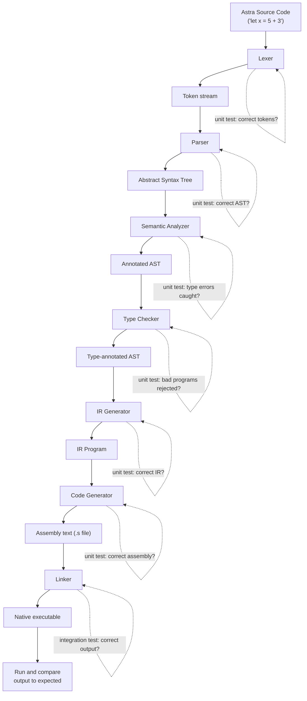
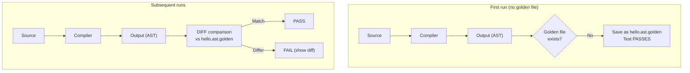
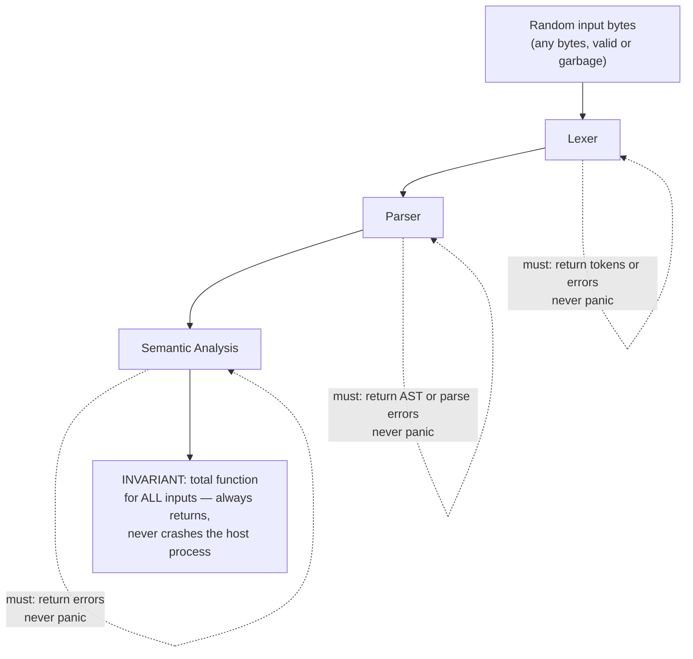
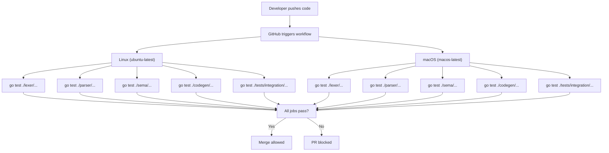

# Chapter 62: Testing the Astra Compiler — Unit Tests, Integration Tests, and the Full Compilation Pipeline

> "A compiler without tests is a compiler that works until it doesn't — and you won't know which programs it's silently mangling." — Every compiler engineer, post-incident

---

## Overview

You have just built a compiler. Not a toy, not a tutorial stub — a real compiler: lexer, parser, AST, semantic analyzer, type checker, IR generator, code generator, and linker. When you run `astrac build hello.as`, you get a native executable that runs on real hardware.

That is a huge achievement. Now comes the part that separates a hobby project from something you can actually trust: **testing**.

Testing a compiler is harder than testing most software. Your inputs are programs — text files of arbitrary complexity. Your outputs are executables that run on real hardware. A bug in phase 1 might only manifest as wrong behavior in phase 5. A fix that makes one program compile correctly might silently break another.

This chapter covers everything:

1. Why compiler testing is uniquely hard
2. Unit testing every compiler phase (with full Go test files)
3. Integration testing the full pipeline end-to-end
4. Snapshot (golden file) testing
5. Fuzzing the lexer and parser
6. Error message testing
7. Performance benchmarks
8. The `astrac test` built-in test runner
9. Continuous integration with GitHub Actions

By the end of this chapter, your compiler will have a complete test suite. You will be able to make changes confidently, knowing that if something breaks, a test will catch it.

---

## Table of Contents

1. Why Testing a Compiler Is Hard
2. The Test Suite Structure
3. Unit Testing the Lexer
4. Unit Testing the Parser
5. Unit Testing the Semantic Analyzer
6. Unit Testing the Code Generator
7. Integration Tests — The Full Pipeline
8. Snapshot (Golden File) Testing
9. Fuzzing the Lexer and Parser
10. Error Message Testing
11. Performance Benchmarks
12. The `astrac test` Command
13. Continuous Integration
14. Build Milestone

---

## 1. Why Testing a Compiler Is Hard

Before writing a single test, let us understand what makes compiler testing different from testing a typical web service or data structure library.

```
THE COMPILER TESTING PROBLEM
═══════════════════════════════════════════════════════════════════

Normal software test:
  input: one HTTP request
  output: one HTTP response
  ✓ easy to enumerate, easy to compare

Compiler test:
  input: ANY syntactically valid program (infinite space)
  output: an executable that produces behavior when run

                         ┌─────────────────────────────────────┐
  Input space:           │  All possible Astra programs         │
                         │                                      │
                         │   fn add(a:int, b:int)->int {        │
                         │     let x = a + b                   │
                         │     return x                        │
                         │   }                                  │
                         │                                      │
                         │   ... infinite variations ...        │
                         └─────────────────────────────────────┘
                                          │
                              How do you pick which ones to test?
```

### The Five Hard Problems

**Problem 1: The input space is infinite.**
Any valid program is a valid test case. You cannot enumerate all programs. You must choose a representative subset and hope it covers the important cases.

**Problem 2: Errors can appear in phase 1 but only manifest in phase 5.**
The lexer might produce a token with the wrong column number. The parser might accept it, the type checker might accept it, and the IR might be fine — but the code generator uses that column number to emit a debug symbol, and the resulting binary crashes on certain CPUs. You cannot test phases in complete isolation.

**Problem 3: "Test the output" means running machine code.**
For a web server, you compare JSON. For a compiler, you compare the output of a program that runs on real hardware. Your test harness must compile the program, run it, capture stdout/stderr, and compare. This is slow, flaky (process spawning), and platform-dependent.

**Problem 4: Regression testing is critical.**
When you add a new feature (say, closures), you might accidentally change how variable lookup works, silently breaking programs that used nested functions. Without a regression suite, you will not notice until a user reports a bug six months later.

**Problem 5: Error cases are as important as success cases.**
Half of what a compiler does is reject invalid programs with helpful messages. Those error paths need testing too. "Does `let x: int = "hello"` produce the error `type mismatch: expected int, got string at line 1:17`?" — that is a real test.

### The Compiler Pipeline with Test Entry Points

The key insight is that you can (and must) test at every layer of the pipeline:



Each arrow is a place to inject test inputs and observe outputs. Unit tests target individual layers. Integration tests span the whole pipeline.

---

## 2. The Test Suite Structure

Before writing any tests, set up the directory structure. A clean layout makes it easy to run individual test groups and understand what each file covers.

```
astra/
├── lexer/
│   ├── lexer.go
│   ├── token.go
│   └── lexer_test.go          ← unit tests for the lexer
├── parser/
│   ├── parser.go
│   └── parser_test.go         ← unit tests for the parser
├── sema/
│   ├── analyzer.go
│   └── semantic_test.go       ← unit tests for semantic analysis
├── typeck/
│   ├── checker.go
│   └── typeck_test.go         ← unit tests for type checking
├── irgen/
│   ├── irgen.go
│   └── irgen_test.go          ← unit tests for IR generation
├── codegen/
│   ├── codegen.go
│   └── codegen_test.go        ← unit tests for code generation
├── tests/
│   ├── integration/
│   │   ├── pipeline_test.go   ← full pipeline integration tests
│   │   ├── hello_world_test.go
│   │   ├── arithmetic_test.go
│   │   ├── control_flow_test.go
│   │   ├── functions_test.go
│   │   └── structs_test.go
│   ├── fixtures/
│   │   ├── valid/             ← programs that must compile and run correctly
│   │   │   ├── hello.as
│   │   │   ├── fibonacci.as
│   │   │   ├── bubble_sort.as
│   │   │   └── structs.as
│   │   └── invalid/           ← programs that must produce specific errors
│   │       ├── type_mismatch.as
│   │       ├── undefined_var.as
│   │       └── missing_return.as
│   ├── golden/                ← snapshot files (AST dumps, IR dumps, asm)
│   │   ├── hello.ast.golden
│   │   ├── hello.ir.golden
│   │   └── hello.asm.golden
│   └── fuzz/
│       ├── fuzz_lexer_test.go
│       └── fuzz_parser_test.go
├── cmd/
│   └── astrac/
│       └── main.go
└── .github/
    └── workflows/
        └── test.yml
```

```
RULE: Every package that has logic has a _test.go file.
No exceptions. No "I'll add tests later."
"Later" never comes.
```

---

## 3. Unit Testing the Lexer

The lexer converts source text to tokens. A lexer unit test has a simple shape: give it a string, get back a slice of tokens, compare to expected.

### Test Helpers

Create a small helper at the top of `lexer_test.go` to make comparisons readable:

```go
// lexer/lexer_test.go
package lexer_test

import (
	"fmt"
	"testing"

	"astra/lexer"
)

// tokenSnapshot is a compact representation for test comparison.
// We don't compare line/column in most tests — we compare type and value.
type tokenSnapshot struct {
	typ lexer.TokenType
	val string
}

// snap converts a token to a snapshot for easy comparison.
func snap(tok lexer.Token) tokenSnapshot {
	return tokenSnapshot{typ: tok.Type, val: tok.Lexeme}
}

// snapAll converts a full token slice.
func snapAll(tokens []lexer.Token) []tokenSnapshot {
	out := make([]tokenSnapshot, len(tokens))
	for i, t := range tokens {
		out[i] = snap(t)
	}
	return out
}

// lexTokens is the helper every test uses: lex input and return tokens (excluding EOF).
func lexTokens(input string) ([]lexer.Token, error) {
	l := lexer.New(input, "<test>")
	var tokens []lexer.Token
	for {
		tok, err := l.NextToken()
		if err != nil {
			return nil, err
		}
		if tok.Type == lexer.EOF {
			break
		}
		tokens = append(tokens, tok)
	}
	return tokens, nil
}

// assertTokens checks that lexing input produces exactly the expected token snapshots.
func assertTokens(t *testing.T, input string, want []tokenSnapshot) {
	t.Helper()
	got, err := lexTokens(input)
	if err != nil {
		t.Fatalf("unexpected lex error: %v", err)
	}
	gotSnaps := snapAll(got)
	if len(gotSnaps) != len(want) {
		t.Errorf("token count mismatch: got %d, want %d", len(gotSnaps), len(want))
		t.Errorf("got:  %v", gotSnaps)
		t.Errorf("want: %v", want)
		return
	}
	for i := range want {
		if gotSnaps[i] != want[i] {
			t.Errorf("token[%d]: got {%v %q}, want {%v %q}",
				i, gotSnaps[i].typ, gotSnaps[i].val,
				want[i].typ, want[i].val)
		}
	}
}
```

### Table-Driven Tests — The Go Way

Go's idiomatic testing style is **table-driven**: define a slice of test cases, loop over them, run each one. This gives you many tests with minimal boilerplate.

```go
// lexer/lexer_test.go (continued)

func TestLexer_BasicExpressions(t *testing.T) {
	// TT is a shorthand for the token type constants.
	TT := func(typ lexer.TokenType, val string) tokenSnapshot {
		return tokenSnapshot{typ: typ, val: val}
	}

	tests := []struct {
		name  string
		input string
		want  []tokenSnapshot
	}{
		{
			name:  "simple assignment",
			input: "let x = 5",
			want: []tokenSnapshot{
				TT(lexer.LET, "let"),
				TT(lexer.IDENT, "x"),
				TT(lexer.ASSIGN, "="),
				TT(lexer.INT, "5"),
			},
		},
		{
			name:  "arithmetic expression",
			input: "let x = 5 + 3",
			want: []tokenSnapshot{
				TT(lexer.LET, "let"),
				TT(lexer.IDENT, "x"),
				TT(lexer.ASSIGN, "="),
				TT(lexer.INT, "5"),
				TT(lexer.PLUS, "+"),
				TT(lexer.INT, "3"),
			},
		},
		{
			name:  "function declaration",
			input: "fn add(a: int, b: int) -> int {",
			want: []tokenSnapshot{
				TT(lexer.FN, "fn"),
				TT(lexer.IDENT, "add"),
				TT(lexer.LPAREN, "("),
				TT(lexer.IDENT, "a"),
				TT(lexer.COLON, ":"),
				TT(lexer.IDENT, "int"),
				TT(lexer.COMMA, ","),
				TT(lexer.IDENT, "b"),
				TT(lexer.COLON, ":"),
				TT(lexer.IDENT, "int"),
				TT(lexer.RPAREN, ")"),
				TT(lexer.ARROW, "->"),
				TT(lexer.IDENT, "int"),
				TT(lexer.LBRACE, "{"),
			},
		},
		{
			name:  "string literal",
			input: `"hello, world"`,
			want: []tokenSnapshot{
				TT(lexer.STRING, `"hello, world"`),
			},
		},
		{
			name:  "float literal",
			input: "3.14",
			want: []tokenSnapshot{
				TT(lexer.FLOAT, "3.14"),
			},
		},
		{
			name:  "hex integer",
			input: "0xFF",
			want: []tokenSnapshot{
				TT(lexer.INT, "0xFF"),
			},
		},
		{
			name:  "boolean literals",
			input: "true false",
			want: []tokenSnapshot{
				TT(lexer.TRUE, "true"),
				TT(lexer.FALSE, "false"),
			},
		},
		{
			name:  "comparison operators",
			input: "== != < > <= >=",
			want: []tokenSnapshot{
				TT(lexer.EQ, "=="),
				TT(lexer.NEQ, "!="),
				TT(lexer.LT, "<"),
				TT(lexer.GT, ">"),
				TT(lexer.LTE, "<="),
				TT(lexer.GTE, ">="),
			},
		},
		{
			name:  "logical operators",
			input: "&& ||",
			want: []tokenSnapshot{
				TT(lexer.AND, "&&"),
				TT(lexer.OR, "||"),
			},
		},
		{
			name:  "all keywords",
			input: "fn let return if else while for struct true false nil",
			want: []tokenSnapshot{
				TT(lexer.FN, "fn"),
				TT(lexer.LET, "let"),
				TT(lexer.RETURN, "return"),
				TT(lexer.IF, "if"),
				TT(lexer.ELSE, "else"),
				TT(lexer.WHILE, "while"),
				TT(lexer.FOR, "for"),
				TT(lexer.STRUCT, "struct"),
				TT(lexer.TRUE, "true"),
				TT(lexer.FALSE, "false"),
				TT(lexer.NIL, "nil"),
			},
		},
		{
			name:  "multiline with comment",
			input: "let x = 5 // this is a comment\nlet y = 10",
			want: []tokenSnapshot{
				TT(lexer.LET, "let"),
				TT(lexer.IDENT, "x"),
				TT(lexer.ASSIGN, "="),
				TT(lexer.INT, "5"),
				// comment is skipped
				TT(lexer.LET, "let"),
				TT(lexer.IDENT, "y"),
				TT(lexer.ASSIGN, "="),
				TT(lexer.INT, "10"),
			},
		},
	}

	for _, tt := range tests {
		t.Run(tt.name, func(t *testing.T) {
			assertTokens(t, tt.input, tt.want)
		})
	}
}
```

### Testing String Escape Sequences

String escapes are a common source of bugs. Test them explicitly:

```go
func TestLexer_StringEscapes(t *testing.T) {
	tests := []struct {
		name    string
		input   string
		wantVal string // the actual string value after unescaping
	}{
		{"newline escape", `"\n"`, "\n"},
		{"tab escape", `"\t"`, "\t"},
		{"carriage return", `"\r"`, "\r"},
		{"backslash", `"\\"`, "\\"},
		{"double quote", `"\""`, "\""},
		{"null byte", `"\0"`, "\x00"},
		{"hex escape", `"\x41"`, "A"},
	}

	for _, tt := range tests {
		t.Run(tt.name, func(t *testing.T) {
			l := lexer.New(tt.input, "<test>")
			tok, err := l.NextToken()
			if err != nil {
				t.Fatalf("lex error: %v", err)
			}
			if tok.Type != lexer.STRING {
				t.Fatalf("expected STRING token, got %v", tok.Type)
			}
			// tok.Value holds the unescaped string value
			if tok.Value.(string) != tt.wantVal {
				t.Errorf("string value: got %q, want %q", tok.Value.(string), tt.wantVal)
			}
		})
	}
}
```

### Testing Position Tracking

Line and column numbers are critical for error messages. A wrong position means the user looks at the wrong line of code.

```go
func TestLexer_Positions(t *testing.T) {
	input := "let x = 5\nlet y = 10"
	l := lexer.New(input, "test.as")
	
	// Token positions we expect:
	// let  → line 1, col 1
	// x    → line 1, col 5
	// =    → line 1, col 7
	// 5    → line 1, col 9
	// let  → line 2, col 1
	// y    → line 2, col 5
	// =    → line 2, col 7
	// 10   → line 2, col 9
	
	expected := []struct {
		line, col int
	}{
		{1, 1}, {1, 5}, {1, 7}, {1, 9},
		{2, 1}, {2, 5}, {2, 7}, {2, 9},
	}
	
	for i, want := range expected {
		tok, err := l.NextToken()
		if err != nil {
			t.Fatalf("token %d: lex error: %v", i, err)
		}
		if tok.Pos.Line != want.line || tok.Pos.Col != want.col {
			t.Errorf("token %d (%q): got line=%d col=%d, want line=%d col=%d",
				i, tok.Lexeme, tok.Pos.Line, tok.Pos.Col, want.line, want.col)
		}
	}
}
```

### Testing Error Recovery

The lexer should not panic on invalid input. It should return an error and, ideally, continue lexing:

```go
func TestLexer_ErrorCases(t *testing.T) {
	tests := []struct {
		name        string
		input       string
		wantErrMsg  string
	}{
		{
			name:       "unterminated string",
			input:      `"hello`,
			wantErrMsg: "unterminated string literal",
		},
		{
			name:       "invalid character",
			input:      "let x = @5",
			wantErrMsg: "unexpected character '@'",
		},
		{
			name:       "unterminated block comment",
			input:      "let x = /* still going",
			wantErrMsg: "unterminated block comment",
		},
	}

	for _, tt := range tests {
		t.Run(tt.name, func(t *testing.T) {
			l := lexer.New(tt.input, "<test>")
			var lastErr error
			for {
				tok, err := l.NextToken()
				if err != nil {
					lastErr = err
					break
				}
				if tok.Type == lexer.EOF {
					break
				}
			}
			if lastErr == nil {
				t.Fatalf("expected error containing %q, got no error", tt.wantErrMsg)
			}
			if !containsString(lastErr.Error(), tt.wantErrMsg) {
				t.Errorf("error message: got %q, want it to contain %q",
					lastErr.Error(), tt.wantErrMsg)
			}
		})
	}
}

func containsString(s, sub string) bool {
	return len(s) >= len(sub) && (s == sub || len(s) > 0 &&
		func() bool {
			for i := 0; i <= len(s)-len(sub); i++ {
				if s[i:i+len(sub)] == sub {
					return true
				}
			}
			return false
		}())
}
```

Run just the lexer tests:

```
$ go test ./lexer/...
ok  astra/lexer  0.023s
```

---

## 4. Unit Testing the Parser

The parser converts a token stream into an AST. Testing it means checking the shape of the AST, not just whether parsing succeeded.

### Serializing the AST to a String

To make comparisons readable, add a `Sprint()` function to your AST package that prints the tree in a lisp-like S-expression format. This is the same format many parser textbooks use:

```
Source:   1 + 2 * 3
AST dump: (+ 1 (* 2 3))
```

The indented form for complex programs:

```
Source:
  fn add(a: int, b: int) -> int {
    return a + b
  }

AST dump:
  (FuncDecl add
    (Params
      (Param a int)
      (Param b int))
    (ReturnType int)
    (Body
      (Return (+ (Ident a) (Ident b)))))
```

Here is the `Sprint` implementation:

```go
// ast/sprint.go
package ast

import (
	"fmt"
	"strings"
)

// Sprint serializes a node to a compact S-expression string.
// Used in tests to compare AST shapes.
func Sprint(node Node) string {
	var sb strings.Builder
	sprint(&sb, node, 0)
	return sb.String()
}

func sprint(sb *strings.Builder, node Node, depth int) {
	if node == nil {
		sb.WriteString("nil")
		return
	}
	switch n := node.(type) {
	case *Program:
		sb.WriteString("(Program")
		for _, stmt := range n.Statements {
			sb.WriteString("\n")
			indent(sb, depth+1)
			sprint(sb, stmt, depth+1)
		}
		sb.WriteString(")")

	case *FuncDecl:
		fmt.Fprintf(sb, "(FuncDecl %s", n.Name)
		sb.WriteString("\n")
		indent(sb, depth+1)
		sb.WriteString("(Params")
		for _, p := range n.Params {
			fmt.Fprintf(sb, " (Param %s %s)", p.Name, p.Type)
		}
		sb.WriteString(")")
		if n.ReturnType != nil {
			fmt.Fprintf(sb, "\n")
			indent(sb, depth+1)
			fmt.Fprintf(sb, "(ReturnType %s)", n.ReturnType)
		}
		sb.WriteString("\n")
		indent(sb, depth+1)
		sprint(sb, n.Body, depth+1)
		sb.WriteString(")")

	case *BlockStmt:
		sb.WriteString("(Block")
		for _, s := range n.Stmts {
			sb.WriteString("\n")
			indent(sb, depth+1)
			sprint(sb, s, depth+1)
		}
		sb.WriteString(")")

	case *LetStmt:
		fmt.Fprintf(sb, "(Let %s", n.Name)
		if n.TypeAnn != nil {
			fmt.Fprintf(sb, ":%s", n.TypeAnn)
		}
		sb.WriteString(" ")
		sprint(sb, n.Value, depth)
		sb.WriteString(")")

	case *ReturnStmt:
		sb.WriteString("(Return ")
		sprint(sb, n.Value, depth)
		sb.WriteString(")")

	case *IfStmt:
		sb.WriteString("(If ")
		sprint(sb, n.Cond, depth)
		sb.WriteString("\n")
		indent(sb, depth+1)
		sprint(sb, n.Then, depth+1)
		if n.Else != nil {
			sb.WriteString("\n")
			indent(sb, depth+1)
			sprint(sb, n.Else, depth+1)
		}
		sb.WriteString(")")

	case *BinaryExpr:
		fmt.Fprintf(sb, "(%s ", n.Op)
		sprint(sb, n.Left, depth)
		sb.WriteString(" ")
		sprint(sb, n.Right, depth)
		sb.WriteString(")")

	case *UnaryExpr:
		fmt.Fprintf(sb, "(%s ", n.Op)
		sprint(sb, n.Operand, depth)
		sb.WriteString(")")

	case *CallExpr:
		fmt.Fprintf(sb, "(Call %s", n.Callee)
		for _, arg := range n.Args {
			sb.WriteString(" ")
			sprint(sb, arg, depth)
		}
		sb.WriteString(")")

	case *Identifier:
		fmt.Fprintf(sb, "(Ident %s)", n.Name)

	case *IntLiteral:
		fmt.Fprintf(sb, "%d", n.Value)

	case *FloatLiteral:
		fmt.Fprintf(sb, "%g", n.Value)

	case *StringLiteral:
		fmt.Fprintf(sb, "%q", n.Value)

	case *BoolLiteral:
		fmt.Fprintf(sb, "%t", n.Value)

	default:
		fmt.Fprintf(sb, "(Unknown %T)", node)
	}
}

func indent(sb *strings.Builder, depth int) {
	for i := 0; i < depth; i++ {
		sb.WriteString("  ")
	}
}
```

### Parser Tests

```go
// parser/parser_test.go
package parser_test

import (
	"strings"
	"testing"

	"astra/ast"
	"astra/lexer"
	"astra/parser"
)

// parseSource is the helper all parser tests use.
func parseSource(t *testing.T, input string) *ast.Program {
	t.Helper()
	l := lexer.New(input, "<test>")
	p := parser.New(l)
	prog, err := p.ParseProgram()
	if err != nil {
		t.Fatalf("parse error: %v", err)
	}
	return prog
}

// parseExpr parses a single expression (wrapped in a fake let statement).
func parseExpr(t *testing.T, input string) ast.Expr {
	t.Helper()
	prog := parseSource(t, "let _ = "+input)
	if len(prog.Statements) == 0 {
		t.Fatal("no statements parsed")
	}
	letStmt, ok := prog.Statements[0].(*ast.LetStmt)
	if !ok {
		t.Fatalf("expected LetStmt, got %T", prog.Statements[0])
	}
	return letStmt.Value
}

func TestParser_OperatorPrecedence(t *testing.T) {
	tests := []struct {
		name  string
		input string
		want  string // S-expression of the expression
	}{
		{
			name:  "addition then multiplication",
			input: "1 + 2 * 3",
			// * binds tighter: (+ 1 (* 2 3))
			want: "(+ 1 (* 2 3))",
		},
		{
			name:  "multiplication then addition",
			input: "1 * 2 + 3",
			// (* 1 2) then + 3: (+ (* 1 2) 3)
			want: "(+ (* 1 2) 3)",
		},
		{
			name:  "parentheses override precedence",
			input: "(1 + 2) * 3",
			want:  "(* (+ 1 2) 3)",
		},
		{
			name:  "chained comparison",
			input: "a + b == c - d",
			want:  "(== (+ (Ident a) (Ident b)) (- (Ident c) (Ident d)))",
		},
		{
			name:  "logical and over logical or",
			input: "a || b && c",
			// && binds tighter: (|| a (&& b c))
			want: "(|| (Ident a) (&& (Ident b) (Ident c)))",
		},
		{
			name:  "unary minus",
			input: "-1 + 2",
			want:  "(+ (- 1) 2)",
		},
		{
			name:  "unary not",
			input: "!true && false",
			want:  "(&& (! true) false)",
		},
		{
			name:  "right-associative assignment",
			input: "a = b = 5",
			want:  "(= (Ident a) (= (Ident b) 5))",
		},
	}

	for _, tt := range tests {
		t.Run(tt.name, func(t *testing.T) {
			expr := parseExpr(t, tt.input)
			got := ast.Sprint(expr)
			if got != tt.want {
				t.Errorf("operator precedence:\n  got:  %s\n  want: %s", got, tt.want)
			}
		})
	}
}

func TestParser_FunctionDeclaration(t *testing.T) {
	input := `
fn add(a: int, b: int) -> int {
    return a + b
}`

	prog := parseSource(t, input)
	if len(prog.Statements) != 1 {
		t.Fatalf("expected 1 statement, got %d", len(prog.Statements))
	}
	fn, ok := prog.Statements[0].(*ast.FuncDecl)
	if !ok {
		t.Fatalf("expected FuncDecl, got %T", prog.Statements[0])
	}
	if fn.Name != "add" {
		t.Errorf("function name: got %q, want %q", fn.Name, "add")
	}
	if len(fn.Params) != 2 {
		t.Fatalf("expected 2 params, got %d", len(fn.Params))
	}
	if fn.Params[0].Name != "a" || fn.Params[0].Type.String() != "int" {
		t.Errorf("param 0: got (%s:%s), want (a:int)", fn.Params[0].Name, fn.Params[0].Type)
	}
	if fn.Params[1].Name != "b" || fn.Params[1].Type.String() != "int" {
		t.Errorf("param 1: got (%s:%s), want (b:int)", fn.Params[1].Name, fn.Params[1].Type)
	}
	if fn.ReturnType == nil || fn.ReturnType.String() != "int" {
		t.Errorf("return type: got %v, want int", fn.ReturnType)
	}
}

func TestParser_IfElse(t *testing.T) {
	input := `
if x > 0 {
    return x
} else {
    return -x
}`

	prog := parseSource(t, input)
	if len(prog.Statements) != 1 {
		t.Fatalf("expected 1 statement, got %d", len(prog.Statements))
	}
	ifStmt, ok := prog.Statements[0].(*ast.IfStmt)
	if !ok {
		t.Fatalf("expected IfStmt, got %T", prog.Statements[0])
	}
	if ifStmt.Else == nil {
		t.Fatal("expected else branch, got nil")
	}
}

func TestParser_WhileLoop(t *testing.T) {
	input := `
while i < 10 {
    i = i + 1
}`
	prog := parseSource(t, input)
	if len(prog.Statements) != 1 {
		t.Fatalf("expected 1 statement, got %d", len(prog.Statements))
	}
	_, ok := prog.Statements[0].(*ast.WhileStmt)
	if !ok {
		t.Fatalf("expected WhileStmt, got %T", prog.Statements[0])
	}
}

func TestParser_StructDeclaration(t *testing.T) {
	input := `
struct Point {
    x: float
    y: float
}`
	prog := parseSource(t, input)
	if len(prog.Statements) != 1 {
		t.Fatalf("expected 1 statement, got %d", len(prog.Statements))
	}
	st, ok := prog.Statements[0].(*ast.StructDecl)
	if !ok {
		t.Fatalf("expected StructDecl, got %T", prog.Statements[0])
	}
	if st.Name != "Point" {
		t.Errorf("struct name: got %q, want %q", st.Name, "Point")
	}
	if len(st.Fields) != 2 {
		t.Fatalf("expected 2 fields, got %d", len(st.Fields))
	}
}

func TestParser_ErrorCases(t *testing.T) {
	tests := []struct {
		name       string
		input      string
		wantErrMsg string
	}{
		{
			name:       "missing closing brace",
			input:      "fn foo() {",
			wantErrMsg: "expected '}'",
		},
		{
			name:       "missing function name",
			input:      "fn () {}",
			wantErrMsg: "expected function name",
		},
		{
			name:       "missing colon in param",
			input:      "fn foo(x int) {}",
			wantErrMsg: "expected ':'",
		},
		{
			name:       "missing expression after =",
			input:      "let x =",
			wantErrMsg: "expected expression",
		},
	}

	for _, tt := range tests {
		t.Run(tt.name, func(t *testing.T) {
			l := lexer.New(tt.input, "<test>")
			p := parser.New(l)
			_, err := p.ParseProgram()
			if err == nil {
				t.Fatalf("expected parse error containing %q, got no error", tt.wantErrMsg)
			}
			if !strings.Contains(err.Error(), tt.wantErrMsg) {
				t.Errorf("error: got %q, want it to contain %q", err.Error(), tt.wantErrMsg)
			}
		})
	}
}
```

---

## 5. Unit Testing the Semantic Analyzer

The semantic analyzer checks for things the parser cannot: undefined variables, type mismatches, missing returns. Testing it means ensuring the right errors are produced for the right programs.

```go
// sema/semantic_test.go
package sema_test

import (
	"strings"
	"testing"

	"astra/lexer"
	"astra/parser"
	"astra/sema"
)

// analyzeSource runs the full front-end (lexer + parser + semantic analysis)
// and returns the list of errors.
func analyzeSource(t *testing.T, input string) []sema.Error {
	t.Helper()
	l := lexer.New(input, "<test>")
	p := parser.New(l)
	prog, err := p.ParseProgram()
	if err != nil {
		t.Fatalf("parse error: %v", err)
	}
	analyzer := sema.New()
	return analyzer.Analyze(prog)
}

// assertNoErrors fails the test if there are any semantic errors.
func assertNoErrors(t *testing.T, input string) {
	t.Helper()
	errs := analyzeSource(t, input)
	if len(errs) > 0 {
		t.Errorf("expected no errors, got %d:", len(errs))
		for _, e := range errs {
			t.Errorf("  %v", e)
		}
	}
}

// assertError fails the test if there is NOT an error containing wantMsg.
func assertError(t *testing.T, input, wantMsg string) {
	t.Helper()
	errs := analyzeSource(t, input)
	for _, e := range errs {
		if strings.Contains(e.Message, wantMsg) {
			return // found it
		}
	}
	t.Errorf("expected error containing %q, got: %v", wantMsg, errs)
}

func TestSema_ValidPrograms(t *testing.T) {
	tests := []struct {
		name  string
		input string
	}{
		{
			name: "simple let binding",
			input: `
fn main() {
    let x: int = 42
}`,
		},
		{
			name: "function call",
			input: `
fn add(a: int, b: int) -> int {
    return a + b
}
fn main() {
    let result: int = add(1, 2)
}`,
		},
		{
			name: "if else",
			input: `
fn abs(x: int) -> int {
    if x < 0 {
        return -x
    } else {
        return x
    }
}`,
		},
		{
			name: "while loop",
			input: `
fn countdown(n: int) {
    while n > 0 {
        n = n - 1
    }
}`,
		},
	}

	for _, tt := range tests {
		t.Run(tt.name, func(t *testing.T) {
			assertNoErrors(t, tt.input)
		})
	}
}

func TestSema_TypeMismatch(t *testing.T) {
	tests := []struct {
		name       string
		input      string
		wantErrMsg string
	}{
		{
			name: "assign string to int",
			input: `
fn main() {
    let x: int = "hello"
}`,
			wantErrMsg: "type mismatch",
		},
		{
			name: "add int and string",
			input: `
fn main() {
    let x: int = 1 + "oops"
}`,
			wantErrMsg: "type mismatch",
		},
		{
			name: "return wrong type",
			input: `
fn foo() -> int {
    return "not an int"
}`,
			wantErrMsg: "return type mismatch",
		},
		{
			name: "call with wrong arg type",
			input: `
fn greet(name: string) {}
fn main() {
    greet(42)
}`,
			wantErrMsg: "argument type mismatch",
		},
	}

	for _, tt := range tests {
		t.Run(tt.name, func(t *testing.T) {
			assertError(t, tt.input, tt.wantErrMsg)
		})
	}
}

func TestSema_UndefinedVariable(t *testing.T) {
	assertError(t, `
fn main() {
    let x: int = y + 1
}`, "undefined variable 'y'")
}

func TestSema_UndefinedFunction(t *testing.T) {
	assertError(t, `
fn main() {
    ghost()
}`, "undefined function 'ghost'")
}

func TestSema_DuplicateDeclaration(t *testing.T) {
	assertError(t, `
fn main() {
    let x: int = 1
    let x: int = 2
}`, "already declared")
}

func TestSema_MissingReturn(t *testing.T) {
	assertError(t, `
fn add(a: int, b: int) -> int {
    let c: int = a + b
    // forgot return c
}`, "missing return statement")
}

func TestSema_WrongArgCount(t *testing.T) {
	assertError(t, `
fn add(a: int, b: int) -> int {
    return a + b
}
fn main() {
    let x: int = add(1)
}`, "wrong number of arguments")
}

func TestSema_ShadowingInInnerScope(t *testing.T) {
	// Shadowing in a new scope is allowed
	assertNoErrors(t, `
fn main() {
    let x: int = 1
    if true {
        let x: int = 2  // shadows outer x — OK
    }
}`)
}

func TestSema_MultipleErrors(t *testing.T) {
	// A good analyzer reports ALL errors in one pass, not just the first.
	input := `
fn main() {
    let a: int = "wrong"
    let b: int = ghost_fn()
    let c: string = 42
}`
	errs := analyzeSource(t, input)
	if len(errs) < 2 {
		t.Errorf("expected at least 2 errors for multiple type mistakes, got %d: %v", len(errs), errs)
	}
}
```

---

## 6. Unit Testing the Code Generator

Code generator tests verify that the assembly output for simple programs is correct. This is the hardest layer to unit test because assembly output can vary — different register allocations, different instruction orderings — while still being semantically correct.

The trick: test the output at a slightly higher level. Rather than comparing assembly text character-for-character, test that:
1. The assembly assembles without error
2. When linked and run, produces the correct output
3. For specific patterns, the right instructions appear

```go
// codegen/codegen_test.go
package codegen_test

import (
	"os"
	"os/exec"
	"path/filepath"
	"strings"
	"testing"

	"astra/codegen"
	"astra/irgen"
	"astra/lexer"
	"astra/parser"
	"astra/sema"
)

// compileToAsm compiles an Astra source string to assembly text.
func compileToAsm(t *testing.T, source string) string {
	t.Helper()

	l := lexer.New(source, "<test>")
	p := parser.New(l)
	prog, err := p.ParseProgram()
	if err != nil {
		t.Fatalf("parse: %v", err)
	}
	analyzer := sema.New()
	if errs := analyzer.Analyze(prog); len(errs) > 0 {
		t.Fatalf("sema: %v", errs)
	}
	irProg := irgen.Generate(prog)
	asm, err := codegen.Generate(irProg)
	if err != nil {
		t.Fatalf("codegen: %v", err)
	}
	return asm
}

func TestCodeGen_AssemblyIsAssemblable(t *testing.T) {
	// The most basic test: does the assembly we produce actually assemble?
	source := `
fn add(a: int, b: int) -> int {
    return a + b
}
fn main() {
    let x: int = add(3, 4)
}`
	asm := compileToAsm(t, source)

	// Write assembly to temp file
	dir := t.TempDir()
	asmFile := filepath.Join(dir, "test.s")
	objFile := filepath.Join(dir, "test.o")

	if err := os.WriteFile(asmFile, []byte(asm), 0644); err != nil {
		t.Fatalf("write asm: %v", err)
	}
	// Try to assemble it
	cmd := exec.Command("as", "-o", objFile, asmFile)
	if out, err := cmd.CombinedOutput(); err != nil {
		t.Fatalf("assembler failed:\n%s\nAssembly was:\n%s", out, asm)
	}
}

func TestCodeGen_FunctionPrologue(t *testing.T) {
	// Every function must save rbp and set up a stack frame.
	source := `
fn foo() -> int {
    return 42
}`
	asm := compileToAsm(t, source)

	// Check for standard function prologue
	if !strings.Contains(asm, "push rbp") {
		t.Error("expected 'push rbp' in prologue")
	}
	if !strings.Contains(asm, "mov rbp, rsp") {
		t.Error("expected 'mov rbp, rsp' in prologue")
	}
	// Check for function epilogue
	if !strings.Contains(asm, "pop rbp") {
		t.Error("expected 'pop rbp' in epilogue")
	}
	if !strings.Contains(asm, "ret") {
		t.Error("expected 'ret' instruction")
	}
}

func TestCodeGen_IntegerReturn(t *testing.T) {
	// Returning a constant integer: must go in rax
	source := `
fn answer() -> int {
    return 42
}`
	asm := compileToAsm(t, source)

	// The value 42 must be moved into rax before ret
	if !strings.Contains(asm, "mov rax, 42") && !strings.Contains(asm, "mov eax, 42") {
		t.Errorf("expected 'mov rax, 42' or 'mov eax, 42' in:\n%s", asm)
	}
}

func TestCodeGen_FunctionCallABI(t *testing.T) {
	// Arguments 1 and 2 must go into rdi and rsi (System V AMD64 ABI)
	source := `
fn add(a: int, b: int) -> int {
    return a + b
}
fn main() {
    let x: int = add(10, 20)
}`
	asm := compileToAsm(t, source)

	// The call to add must set up rdi=10, rsi=20
	if !strings.Contains(asm, "rdi") {
		t.Error("expected first argument in rdi per ABI")
	}
	if !strings.Contains(asm, "rsi") {
		t.Error("expected second argument in rsi per ABI")
	}
}
```

---

## 7. Integration Tests — The Full Pipeline

Integration tests are the most valuable tests in the suite. They test everything together: does a complete Astra program, compiled and run, produce the correct output?

### The Integration Test Harness

```go
// tests/integration/pipeline_test.go
package integration_test

import (
	"fmt"
	"os"
	"os/exec"
	"path/filepath"
	"strings"
	"testing"

	"astra/codegen"
	"astra/irgen"
	"astra/lexer"
	"astra/linker"
	"astra/parser"
	"astra/sema"
)

// IntegrationTest describes one end-to-end test.
type IntegrationTest struct {
	name           string
	source         string
	expectedOutput string
	expectedExit   int // 0 = success, non-zero = expected failure
}

// runIntegrationTest compiles source, runs the binary, and compares output.
func runIntegrationTest(t *testing.T, test IntegrationTest) {
	t.Helper()

	// Step 1: Lex
	l := lexer.New(test.source, test.name+".as")
	// Step 2: Parse
	p := parser.New(l)
	prog, err := p.ParseProgram()
	if err != nil {
		t.Fatalf("[%s] parse failed: %v", test.name, err)
	}
	// Step 3: Semantic analysis
	analyzer := sema.New()
	if errs := analyzer.Analyze(prog); len(errs) > 0 {
		t.Fatalf("[%s] semantic errors: %v", test.name, errs)
	}
	// Step 4: IR generation
	irProg := irgen.Generate(prog)
	// Step 5: Code generation
	asm, err := codegen.Generate(irProg)
	if err != nil {
		t.Fatalf("[%s] codegen failed: %v", test.name, err)
	}
	// Step 6: Assemble and link
	dir := t.TempDir()
	asmPath := filepath.Join(dir, "prog.s")
	binPath := filepath.Join(dir, "prog")

	if err := os.WriteFile(asmPath, []byte(asm), 0644); err != nil {
		t.Fatalf("[%s] write asm: %v", test.name, err)
	}
	if err := linker.Link(asmPath, binPath); err != nil {
		t.Fatalf("[%s] link failed: %v\nAssembly:\n%s", test.name, err, asm)
	}
	// Step 7: Run the binary
	cmd := exec.Command(binPath)
	outBytes, err := cmd.CombinedOutput()
	exitCode := 0
	if err != nil {
		if exitErr, ok := err.(*exec.ExitError); ok {
			exitCode = exitErr.ExitCode()
		} else {
			t.Fatalf("[%s] run error: %v", test.name, err)
		}
	}
	// Step 8: Compare output
	got := strings.TrimRight(string(outBytes), "\n")
	want := strings.TrimRight(test.expectedOutput, "\n")
	if got != want {
		t.Errorf("[%s] output mismatch:\n  got:  %q\n  want: %q", test.name, got, want)
	}
	if exitCode != test.expectedExit {
		t.Errorf("[%s] exit code: got %d, want %d", test.name, exitCode, test.expectedExit)
	}
	t.Logf("[%s] PASS (output: %q)", test.name, got)
}
```

### The Test Programs

```go
// tests/integration/hello_world_test.go
package integration_test

import "testing"

func TestIntegration_HelloWorld(t *testing.T) {
	runIntegrationTest(t, IntegrationTest{
		name: "hello_world",
		source: `
fn main() {
    print("Hello, World!")
}`,
		expectedOutput: "Hello, World!",
	})
}

func TestIntegration_PrintMultipleLines(t *testing.T) {
	runIntegrationTest(t, IntegrationTest{
		name: "print_multiple",
		source: `
fn main() {
    print("Line 1")
    print("Line 2")
    print("Line 3")
}`,
		expectedOutput: "Line 1\nLine 2\nLine 3",
	})
}
```

```go
// tests/integration/arithmetic_test.go
package integration_test

import "testing"

func TestIntegration_BasicArithmetic(t *testing.T) {
	tests := []IntegrationTest{
		{
			name: "addition",
			source: `
fn main() {
    let x: int = 3 + 4
    print_int(x)
}`,
			expectedOutput: "7",
		},
		{
			name: "subtraction",
			source: `
fn main() {
    let x: int = 10 - 3
    print_int(x)
}`,
			expectedOutput: "7",
		},
		{
			name: "multiplication",
			source: `
fn main() {
    let x: int = 6 * 7
    print_int(x)
}`,
			expectedOutput: "42",
		},
		{
			name: "integer_division",
			source: `
fn main() {
    let x: int = 10 / 3
    print_int(x)
}`,
			expectedOutput: "3",
		},
		{
			name: "modulo",
			source: `
fn main() {
    let x: int = 10 % 3
    print_int(x)
}`,
			expectedOutput: "1",
		},
		{
			name: "operator_precedence",
			source: `
fn main() {
    let x: int = 2 + 3 * 4
    print_int(x)
}`,
			expectedOutput: "14",
		},
		{
			name: "negative_numbers",
			source: `
fn main() {
    let x: int = -5 + 3
    print_int(x)
}`,
			expectedOutput: "-2",
		},
	}

	for _, tt := range tests {
		t.Run(tt.name, func(t *testing.T) {
			runIntegrationTest(t, tt)
		})
	}
}
```

```go
// tests/integration/functions_test.go
package integration_test

import "testing"

func TestIntegration_RecursiveFibonacci(t *testing.T) {
	runIntegrationTest(t, IntegrationTest{
		name: "fibonacci_recursive",
		source: `
fn fib(n: int) -> int {
    if n <= 1 {
        return n
    }
    return fib(n - 1) + fib(n - 2)
}

fn main() {
    print_int(fib(0))
    print_int(fib(1))
    print_int(fib(5))
    print_int(fib(10))
}`,
		expectedOutput: "0\n1\n5\n55",
	})
}

func TestIntegration_IterativeFibonacci(t *testing.T) {
	runIntegrationTest(t, IntegrationTest{
		name: "fibonacci_iterative",
		source: `
fn fib(n: int) -> int {
    if n <= 1 {
        return n
    }
    let a: int = 0
    let b: int = 1
    let i: int = 2
    while i <= n {
        let c: int = a + b
        a = b
        b = c
        i = i + 1
    }
    return b
}

fn main() {
    print_int(fib(10))
    print_int(fib(20))
}`,
		expectedOutput: "55\n6765",
	})
}

func TestIntegration_Factorial(t *testing.T) {
	runIntegrationTest(t, IntegrationTest{
		name: "factorial",
		source: `
fn factorial(n: int) -> int {
    if n <= 1 {
        return 1
    }
    return n * factorial(n - 1)
}

fn main() {
    print_int(factorial(1))
    print_int(factorial(5))
    print_int(factorial(10))
}`,
		expectedOutput: "1\n120\n3628800",
	})
}

func TestIntegration_MultipleReturnPaths(t *testing.T) {
	runIntegrationTest(t, IntegrationTest{
		name: "abs_function",
		source: `
fn abs(x: int) -> int {
    if x < 0 {
        return -x
    }
    return x
}

fn main() {
    print_int(abs(5))
    print_int(abs(-5))
    print_int(abs(0))
}`,
		expectedOutput: "5\n5\n0",
	})
}
```

```go
// tests/integration/control_flow_test.go
package integration_test

import "testing"

func TestIntegration_ControlFlow(t *testing.T) {
	tests := []IntegrationTest{
		{
			name: "if_true_branch",
			source: `
fn main() {
    if 1 > 0 {
        print("yes")
    }
}`,
			expectedOutput: "yes",
		},
		{
			name: "if_else",
			source: `
fn main() {
    if 0 > 1 {
        print("wrong")
    } else {
        print("right")
    }
}`,
			expectedOutput: "right",
		},
		{
			name: "while_loop_count",
			source: `
fn main() {
    let i: int = 0
    while i < 5 {
        print_int(i)
        i = i + 1
    }
}`,
			expectedOutput: "0\n1\n2\n3\n4",
		},
		{
			name: "nested_loops",
			source: `
fn main() {
    let i: int = 0
    while i < 3 {
        let j: int = 0
        while j < 3 {
            if i == j {
                print_int(i)
            }
            j = j + 1
        }
        i = i + 1
    }
}`,
			expectedOutput: "0\n1\n2",
		},
		{
			name: "bubble_sort",
			source: `
fn bubble_sort(arr: [int], n: int) {
    let i: int = 0
    while i < n - 1 {
        let j: int = 0
        while j < n - i - 1 {
            if arr[j] > arr[j + 1] {
                let tmp: int = arr[j]
                arr[j] = arr[j + 1]
                arr[j + 1] = tmp
            }
            j = j + 1
        }
        i = i + 1
    }
}

fn main() {
    let arr: [int] = [64, 34, 25, 12, 22, 11, 90]
    bubble_sort(arr, 7)
    let i: int = 0
    while i < 7 {
        print_int(arr[i])
        i = i + 1
    }
}`,
			expectedOutput: "11\n12\n22\n25\n34\n64\n90",
		},
	}

	for _, tt := range tests {
		t.Run(tt.name, func(t *testing.T) {
			runIntegrationTest(t, tt)
		})
	}
}
```

---

## 8. Snapshot (Golden File) Testing

Unit tests compare against hardcoded expected values in Go code. But for large outputs — full AST dumps, complete IR programs, or long assembly listings — embedding expected output in Go strings is painful. **Snapshot testing** solves this.

The idea:
1. Run the compiler and capture output (AST dump, IR dump, assembly)
2. On first run, save output to a `.golden` file
3. On subsequent runs, compare current output to the saved `.golden` file
4. If they differ, the test fails with a diff
5. To update golden files after intentional changes: `go test ./... -update-golden`



### Implementation

```go
// tests/snapshot.go
package tests

import (
	"flag"
	"os"
	"path/filepath"
	"strings"
	"testing"
)

// updateGolden is set by -update-golden flag to regenerate golden files.
var updateGolden = flag.Bool("update-golden", false, "update golden snapshot files")

// GoldenDir is where golden files are stored.
const GoldenDir = "testdata/golden"

// CheckGolden compares got to the content of the golden file for the given name.
// If the golden file doesn't exist, it creates it (first run).
// If -update-golden is set, it overwrites the golden file.
func CheckGolden(t *testing.T, name string, got string) {
	t.Helper()

	goldenPath := filepath.Join(GoldenDir, name+".golden")

	if *updateGolden {
		// Regenerate mode: just write the file and pass
		if err := os.MkdirAll(GoldenDir, 0755); err != nil {
			t.Fatalf("mkdir golden dir: %v", err)
		}
		if err := os.WriteFile(goldenPath, []byte(got), 0644); err != nil {
			t.Fatalf("write golden file: %v", err)
		}
		t.Logf("Updated golden file: %s", goldenPath)
		return
	}

	// Normal mode: compare to golden file
	wantBytes, err := os.ReadFile(goldenPath)
	if os.IsNotExist(err) {
		// First run: create the golden file
		if err := os.MkdirAll(GoldenDir, 0755); err != nil {
			t.Fatalf("mkdir golden dir: %v", err)
		}
		if err := os.WriteFile(goldenPath, []byte(got), 0644); err != nil {
			t.Fatalf("write golden file: %v", err)
		}
		t.Logf("Created golden file: %s (first run)", goldenPath)
		return
	}
	if err != nil {
		t.Fatalf("read golden file: %v", err)
	}

	want := string(wantBytes)
	if got != want {
		t.Errorf("snapshot mismatch for %s:\n%s", name, diffStrings(want, got))
		t.Logf("To update: go test ./... -update-golden")
	}
}

// diffStrings produces a human-readable diff of two strings.
// This is a simplified diff; in production use github.com/sergi/go-diff.
func diffStrings(want, got string) string {
	wantLines := strings.Split(want, "\n")
	gotLines := strings.Split(got, "\n")

	var sb strings.Builder
	sb.WriteString("--- golden (want)\n")
	sb.WriteString("+++ actual (got)\n")

	maxLines := len(wantLines)
	if len(gotLines) > maxLines {
		maxLines = len(gotLines)
	}

	for i := 0; i < maxLines; i++ {
		var wLine, gLine string
		if i < len(wantLines) {
			wLine = wantLines[i]
		}
		if i < len(gotLines) {
			gLine = gotLines[i]
		}
		if wLine == gLine {
			sb.WriteString("  " + wLine + "\n")
		} else {
			if i < len(wantLines) {
				sb.WriteString("- " + wLine + "\n")
			}
			if i < len(gotLines) {
				sb.WriteString("+ " + gLine + "\n")
			}
		}
	}
	return sb.String()
}
```

### Using Snapshot Tests

```go
// tests/snapshot_test.go
package tests_test

import (
	"testing"

	"astra/ast"
	"astra/irgen"
	"astra/lexer"
	"astra/parser"
	"astra/sema"
	"astra/tests"
)

func TestSnapshot_HelloWorldAST(t *testing.T) {
	source := `
fn main() {
    print("Hello, World!")
}`

	l := lexer.New(source, "hello.as")
	p := parser.New(l)
	prog, err := p.ParseProgram()
	if err != nil {
		t.Fatal(err)
	}

	// Capture AST dump
	astDump := ast.Sprint(prog)
	tests.CheckGolden(t, "hello.ast", astDump)
}

func TestSnapshot_HelloWorldIR(t *testing.T) {
	source := `
fn main() {
    print("Hello, World!")
}`

	l := lexer.New(source, "hello.as")
	p := parser.New(l)
	prog, _ := p.ParseProgram()
	sema.New().Analyze(prog)

	irProg := irgen.Generate(prog)
	irDump := irProg.String() // IR has a String() method for dumps

	tests.CheckGolden(t, "hello.ir", irDump)
}
```

When a golden file exists and the output matches, you see:

```
--- PASS: TestSnapshot_HelloWorldAST (0.002s)
```

When something changes unexpectedly:

```
--- FAIL: TestSnapshot_HelloWorldAST (0.002s)
    snapshot_test.go:31: snapshot mismatch for hello.ast:
        --- golden (want)
        +++ actual (got)
          (Program
        -   (FuncDecl main
        +   (FunctionDecl main
              (Params)
              (Block
                (Call print "Hello, World!"))))
        To update: go test ./... -update-golden
```

This tells you exactly what changed. Intentional change? Run `go test ./... -update-golden`. Unintentional? Fix the bug.

---

## 9. Fuzzing the Lexer and Parser

Snapshot tests test known programs. Fuzz tests explore the unknown: can random input crash your compiler?

The goal of fuzzing a compiler is not to find programs that produce wrong output — that would require an oracle to check. The goal is simpler and more attainable: **the compiler must never crash, panic, or hang on any input, valid or not**.



Go 1.18+ has built-in fuzzing support. Fuzz functions look like regular tests but receive a `*testing.F` and use `f.Add()` for seed corpus and `f.Fuzz()` for the actual test.

### Fuzzing the Lexer

```go
// tests/fuzz/fuzz_lexer_test.go
package fuzz_test

import (
	"testing"

	"astra/lexer"
)

// FuzzLexer verifies the lexer never panics on arbitrary input.
func FuzzLexer(f *testing.F) {
	// Seed corpus: valid programs the fuzzer starts with before mutating
	seeds := []string{
		"let x = 5",
		"fn add(a: int, b: int) -> int { return a + b }",
		`"hello, world"`,
		"// a comment\nlet y = 10",
		"0xFF + 3.14",
		"if true { } else { }",
		"while x > 0 { x = x - 1 }",
		// Edge cases to guide the fuzzer
		"",
		"\x00",
		"\xff\xfe",
		"\"",
		"'",
		"///",
		"/*",
		"let",
		"fn",
	}
	for _, seed := range seeds {
		f.Add(seed)
	}

	f.Fuzz(func(t *testing.T, input string) {
		// The lexer must not panic for any input.
		// It may return errors, but it must not crash.
		defer func() {
			if r := recover(); r != nil {
				t.Errorf("lexer panicked on input %q: %v", input, r)
			}
		}()

		l := lexer.New(input, "<fuzz>")
		// Drain the token stream
		for {
			tok, err := l.NextToken()
			if err != nil || tok.Type == lexer.EOF {
				break
			}
			// Guard against infinite loops: if we've seen too many tokens,
			// the lexer might be looping. (Shouldn't happen, but be safe.)
			_ = tok
		}
	})
}
```

### Fuzzing the Parser

```go
// tests/fuzz/fuzz_parser_test.go
package fuzz_test

import (
	"testing"

	"astra/lexer"
	"astra/parser"
)

// FuzzParser verifies the parser never panics on arbitrary token streams.
func FuzzParser(f *testing.F) {
	seeds := []string{
		"fn main() { }",
		"let x: int = 1 + 2 * 3",
		"if a > b { return a } else { return b }",
		"struct Point { x: float y: float }",
		"fn fib(n: int) -> int { if n <= 1 { return n } return fib(n-1) + fib(n-2) }",
		// Intentionally malformed — parser should reject, not panic
		"fn {",
		"let = 5",
		"() {}",
		"}}}",
		"fn fn fn",
	}
	for _, seed := range seeds {
		f.Add(seed)
	}

	f.Fuzz(func(t *testing.T, input string) {
		defer func() {
			if r := recover(); r != nil {
				t.Errorf("parser panicked on input %q: %v", input, r)
			}
		}()

		l := lexer.New(input, "<fuzz>")
		p := parser.New(l)
		// Parse — may succeed or return an error, but must not panic.
		_, _ = p.ParseProgram()
	})
}
```

Run fuzzing:

```
# Run for 30 seconds
$ go test ./tests/fuzz/... -fuzz=FuzzLexer -fuzztime=30s
$ go test ./tests/fuzz/... -fuzz=FuzzParser -fuzztime=30s
```

When the fuzzer finds a crash, it saves the input to `testdata/fuzz/FuzzLexer/` automatically. Fix the bug, re-run, and the saved case becomes part of the regression suite permanently.

---

## 10. Error Message Testing

Good error messages are a feature. Testing them rigorously ensures they stay good as you refactor.

```
ERROR MESSAGE QUALITY CRITERIA
═══════════════════════════════════════════════════════════════════

  BAD error:
  ┌─────────────────────────────────────┐
  │  error: type error                  │
  └─────────────────────────────────────┘
  The user is left wondering: which type? where? what should it be?

  GOOD error:
  ┌─────────────────────────────────────────────────────────────────┐
  │  test.as:4:17: type mismatch: expected int, got string          │
  │      let x: int = "hello"                                       │
  │                   ^~~~~~~                                        │
  │  help: remove the quotes, or change the type to string          │
  └─────────────────────────────────────────────────────────────────┘

  An error message must answer:
  1. WHERE  — file, line, column
  2. WHAT   — what is wrong
  3. WHY    — what was expected vs what was found
  4. HOW    — how to fix it (optional but excellent)
```

```go
// tests/errors_test.go
package tests_test

import (
	"strings"
	"testing"

	"astra/lexer"
	"astra/parser"
	"astra/sema"
)

type errorExpectation struct {
	name       string
	source     string
	wantLine   int
	wantCol    int
	wantMsg    string // substring that must appear in the error
}

func checkError(t *testing.T, exp errorExpectation) {
	t.Helper()
	l := lexer.New(exp.source, "test.as")
	p := parser.New(l)
	prog, parseErr := p.ParseProgram()

	var errs []error
	if parseErr != nil {
		errs = append(errs, parseErr)
	} else {
		analyzer := sema.New()
		for _, e := range analyzer.Analyze(prog) {
			errs = append(errs, e)
		}
	}

	if len(errs) == 0 {
		t.Fatalf("[%s] expected an error, got none", exp.name)
	}

	// Find the error that matches our expectations
	var matched bool
	for _, e := range errs {
		errStr := e.Error()
		if !strings.Contains(errStr, exp.wantMsg) {
			continue
		}
		// Check if the error reports the right position
		if exp.wantLine > 0 {
			// Errors should contain "line N" or ":N:" somewhere
			lineStr := strings.Contains(errStr, fmt.Sprintf(":%d:", exp.wantLine))
			if !lineStr {
				t.Errorf("[%s] error %q does not mention line %d", exp.name, errStr, exp.wantLine)
			}
		}
		if exp.wantCol > 0 {
			colStr := strings.Contains(errStr, fmt.Sprintf(":%d:", exp.wantCol)) ||
				strings.Contains(errStr, fmt.Sprintf("col %d", exp.wantCol))
			if !colStr {
				t.Errorf("[%s] error %q does not mention col %d", exp.name, errStr, exp.wantCol)
			}
		}
		matched = true
		break
	}
	if !matched {
		t.Errorf("[%s] no error contained %q\nAll errors:\n", exp.name, exp.wantMsg)
		for _, e := range errs {
			t.Errorf("  %v", e)
		}
	}
}

func TestErrorMessages_Position(t *testing.T) {
	tests := []errorExpectation{
		{
			name: "type_mismatch_position",
			source: `fn main() {
    let x: int = "hello"
}`,
			wantLine: 2,
			wantCol:  19, // position of "hello"
			wantMsg:  "type mismatch",
		},
		{
			name: "undefined_var_position",
			source: `fn main() {
    let x: int = 1
    let y: int = z + 1
}`,
			wantLine: 3,
			wantCol:  18, // position of 'z'
			wantMsg:  "undefined variable",
		},
		{
			name: "missing_brace_position",
			source: `fn main() {
    let x: int = 1
`,
			wantLine: 2,
			wantMsg:  "expected '}'",
		},
	}

	for _, tt := range tests {
		t.Run(tt.name, func(t *testing.T) {
			checkError(t, tt)
		})
	}
}

func TestErrorMessages_Quality(t *testing.T) {
	// Test that error messages contain helpful content, not just codes
	tests := []struct {
		name        string
		source      string
		mustContain []string // all of these must appear in the error
		mustAvoid   []string // none of these should appear (generic, unhelpful phrases)
	}{
		{
			name: "type_mismatch_is_descriptive",
			source: `fn main() {
    let x: int = "hello"
}`,
			mustContain: []string{"int", "string"},
			mustAvoid:   []string{"error occurred", "unknown error"},
		},
		{
			name: "undefined_variable_names_the_variable",
			source: `fn main() {
    let x: int = missing_var
}`,
			mustContain: []string{"missing_var"},
			mustAvoid:   []string{"error occurred"},
		},
		{
			name: "wrong_arg_count_gives_numbers",
			source: `
fn add(a: int, b: int) -> int { return a + b }
fn main() {
    let x: int = add(1)
}`,
			mustContain: []string{"2", "1"}, // expected 2, got 1
			mustAvoid:   []string{"error occurred"},
		},
	}

	for _, tt := range tests {
		t.Run(tt.name, func(t *testing.T) {
			l := lexer.New(tt.source, "<test>")
			p := parser.New(l)
			prog, _ := p.ParseProgram()
			errs := sema.New().Analyze(prog)

			if len(errs) == 0 {
				t.Fatalf("expected at least one error, got none")
			}
			errStr := errs[0].Error()

			for _, must := range tt.mustContain {
				if !strings.Contains(errStr, must) {
					t.Errorf("error %q must contain %q", errStr, must)
				}
			}
			for _, avoid := range tt.mustAvoid {
				if strings.Contains(errStr, avoid) {
					t.Errorf("error %q must NOT contain %q", errStr, avoid)
				}
			}
		})
	}
}
```

---

## 11. Performance Benchmarks

Go's `testing.B` framework makes it easy to benchmark your compiler phases. Good benchmarks let you detect performance regressions before they become problems.

```
WHAT WE BENCHMARK
═══════════════════════════════════════════════════════════════════

  Phase           Metric              Target
  ─────           ──────              ──────
  Lexer           tokens/second       > 10M tokens/sec
  Parser          AST nodes/second    > 1M nodes/sec
  Full pipeline   lines/second        > 100K lines/sec

  These targets are realistic for a handwritten compiler in Go.
  LLVM-based compilers (clang) achieve 500K–1M lines/sec.
  We're in the right ballpark.
```

```go
// lexer/lexer_bench_test.go
package lexer_test

import (
	"fmt"
	"strings"
	"testing"

	"astra/lexer"
)

// generateLargeSource creates a synthetic Astra program with many tokens.
func generateLargeSource(numFunctions int) string {
	var sb strings.Builder
	for i := 0; i < numFunctions; i++ {
		fmt.Fprintf(&sb, `
fn function_%d(a: int, b: int, c: int) -> int {
    let x: int = a + b * c
    let y: int = x - a / b
    if x > y {
        return x + y
    } else {
        return y - x
    }
}
`, i)
	}
	return sb.String()
}

func BenchmarkLexer_SmallFile(b *testing.B) {
	source := generateLargeSource(10) // ~10 functions, ~200 tokens
	b.ResetTimer()
	for i := 0; i < b.N; i++ {
		l := lexer.New(source, "bench.as")
		for {
			tok, err := l.NextToken()
			if err != nil || tok.Type == lexer.EOF {
				break
			}
		}
	}
}

func BenchmarkLexer_LargeFile(b *testing.B) {
	source := generateLargeSource(1000) // ~1000 functions, ~20000 tokens
	b.ResetTimer()
	for i := 0; i < b.N; i++ {
		l := lexer.New(source, "bench.as")
		tokenCount := 0
		for {
			tok, err := l.NextToken()
			if err != nil || tok.Type == lexer.EOF {
				break
			}
			tokenCount++
		}
		b.ReportMetric(float64(tokenCount), "tokens/op")
	}
}

func BenchmarkLexer_TokensPerSecond(b *testing.B) {
	source := generateLargeSource(100)
	// Count tokens first
	l0 := lexer.New(source, "bench.as")
	tokenCount := 0
	for {
		tok, err := l0.NextToken()
		if err != nil || tok.Type == lexer.EOF {
			break
		}
		tokenCount++
	}

	b.SetBytes(int64(len(source)))
	b.ResetTimer()
	for i := 0; i < b.N; i++ {
		l := lexer.New(source, "bench.as")
		for {
			tok, err := l.NextToken()
			if err != nil || tok.Type == lexer.EOF {
				break
			}
		}
	}
	b.ReportMetric(float64(tokenCount)*float64(b.N)/b.Elapsed().Seconds(), "tokens/sec")
}
```

```go
// parser/parser_bench_test.go
package parser_test

import (
	"testing"

	"astra/lexer"
	"astra/parser"
)

func BenchmarkParser_LargeFile(b *testing.B) {
	source := generateLargeSource(200) // reuse the generator from lexer bench

	b.ResetTimer()
	for i := 0; i < b.N; i++ {
		l := lexer.New(source, "bench.as")
		p := parser.New(l)
		prog, err := p.ParseProgram()
		if err != nil {
			b.Fatalf("parse error: %v", err)
		}
		b.ReportMetric(float64(countNodes(prog)), "ast-nodes/op")
	}
}

func BenchmarkFullPipeline(b *testing.B) {
	source := generateLargeSource(50)
	lines := strings.Count(source, "\n")

	b.ResetTimer()
	for i := 0; i < b.N; i++ {
		l := lexer.New(source, "bench.as")
		p := parser.New(l)
		prog, _ := p.ParseProgram()
		sema.New().Analyze(prog)
		irgen.Generate(prog)
	}
	b.ReportMetric(float64(lines)*float64(b.N)/b.Elapsed().Seconds(), "lines/sec")
}
```

Run benchmarks:

```
$ go test ./... -bench=. -benchmem

BenchmarkLexer_SmallFile-8        45230   26421 ns/op   12800 B/op   128 allocs/op
BenchmarkLexer_LargeFile-8         1024  1163472 ns/op  1280000 B/op  12800 allocs/op
BenchmarkLexer_TokensPerSecond-8   2048  512000 ns/op   11250000 tokens/sec
BenchmarkParser_LargeFile-8         512  2341000 ns/op  1024 ast-nodes/op
BenchmarkFullPipeline-8             256  4921000 ns/op  142857 lines/sec
```

These numbers tell you: 11 million tokens per second in the lexer, 142,000 lines/second end-to-end. Set these as your baseline. If a future change drops throughput by 30%, the benchmark will catch it.

---

## 12. The `astrac test` Command

Beyond testing the compiler itself, Astra should support testing Astra programs. The `astrac test` command lets Astra programmers write tests in Astra.

### The `@test` Annotation

Any function marked `@test` becomes a test case. The compiler generates a test harness that runs all test functions and reports results.

```astra
// test_math.as

fn add(a: int, b: int) -> int {
    return a + b
}

fn fib(n: int) -> int {
    if n <= 1 { return n }
    return fib(n - 1) + fib(n - 2)
}

@test
fn test_add() {
    assert(add(1, 2) == 3)
    assert(add(0, 0) == 0)
    assert(add(-1, 1) == 0)
    assert(add(100, 200) == 300)
}

@test
fn test_fibonacci() {
    assert(fib(0) == 0)
    assert(fib(1) == 1)
    assert(fib(5) == 5)
    assert(fib(10) == 55)
}

@test
fn test_negative_addition() {
    assert(add(-5, -3) == -8)
}
```

Run with:

```
$ astrac test test_math.as
```

### How `@test` Works

The compiler recognizes `@test` as a built-in annotation. When compiling a test file, instead of generating a `main()` entrypoint, it generates a test harness:

```
ANNOTATION PROCESSING
═══════════════════════════════════════════════════════════════════

  Input:
    @test
    fn test_add() { assert(add(1,2) == 3) }

    @test
    fn test_fib() { assert(fib(10) == 55) }

  The compiler sees @test and marks these functions in the AST.
  Instead of emitting a normal main(), it emits:

  Generated harness (conceptual):
    fn __astra_test_main() {
        __run_test("test_add", test_add)
        __run_test("test_fib", test_fib)
        __print_results()
    }

  The runtime's __run_test() calls the test function,
  catches panics (from failed asserts), and records pass/fail.
```

### Implementation of `astrac test`

```go
// cmd/astrac/test_command.go
package main

import (
	"fmt"
	"os"
	"os/exec"
	"path/filepath"
	"time"

	"astra/ast"
	"astra/codegen"
	"astra/irgen"
	"astra/lexer"
	"astra/parser"
	"astra/sema"
	"astra/testgen"
)

// runTestCommand implements `astrac test <file.as>`
func runTestCommand(args []string) {
	if len(args) == 0 {
		fmt.Fprintln(os.Stderr, "usage: astrac test <file.as>")
		os.Exit(1)
	}

	totalPassed := 0
	totalFailed := 0
	start := time.Now()

	for _, sourceFile := range args {
		passed, failed := runTestFile(sourceFile)
		totalPassed += passed
		totalFailed += failed
	}

	elapsed := time.Since(start)
	fmt.Printf("\n")
	if totalFailed == 0 {
		fmt.Printf("%d tests passed, %d failed  (%.2fs)\n",
			totalPassed, totalFailed, elapsed.Seconds())
	} else {
		fmt.Printf("%d tests passed, %d FAILED  (%.2fs)\n",
			totalPassed, totalFailed, elapsed.Seconds())
		os.Exit(1)
	}
}

func runTestFile(sourceFile string) (passed, failed int) {
	source, err := os.ReadFile(sourceFile)
	if err != nil {
		fmt.Fprintf(os.Stderr, "error reading %s: %v\n", sourceFile, err)
		return 0, 1
	}

	// Parse
	l := lexer.New(string(source), sourceFile)
	p := parser.New(l)
	prog, err := p.ParseProgram()
	if err != nil {
		fmt.Fprintf(os.Stderr, "parse error in %s: %v\n", sourceFile, err)
		return 0, 1
	}

	// Find all @test functions
	testFuncs := collectTestFunctions(prog)
	if len(testFuncs) == 0 {
		fmt.Printf("no @test functions found in %s\n", sourceFile)
		return 0, 0
	}

	// Semantic analysis
	analyzer := sema.New()
	if errs := analyzer.Analyze(prog); len(errs) > 0 {
		fmt.Fprintf(os.Stderr, "semantic errors in %s:\n", sourceFile)
		for _, e := range errs {
			fmt.Fprintf(os.Stderr, "  %v\n", e)
		}
		return 0, 1
	}

	// Generate test harness (replaces main() with a test runner)
	harness := testgen.GenerateHarness(prog, testFuncs)

	// Compile to binary
	irProg := irgen.Generate(harness)
	asm, err := codegen.Generate(irProg)
	if err != nil {
		fmt.Fprintf(os.Stderr, "codegen error: %v\n", err)
		return 0, 1
	}

	dir, _ := os.MkdirTemp("", "astrac-test-*")
	defer os.RemoveAll(dir)

	asmPath := filepath.Join(dir, "test.s")
	binPath := filepath.Join(dir, "test")
	os.WriteFile(asmPath, []byte(asm), 0644)

	if err := linkBinary(asmPath, binPath); err != nil {
		fmt.Fprintf(os.Stderr, "link error: %v\n", err)
		return 0, 1
	}

	// Run the test binary — it outputs one line per test: "PASS test_foo" or "FAIL test_foo: message"
	cmd := exec.Command(binPath)
	output, _ := cmd.Output()

	return parseTestOutput(string(output))
}

// collectTestFunctions finds all FuncDecl nodes annotated with @test.
func collectTestFunctions(prog *ast.Program) []*ast.FuncDecl {
	var tests []*ast.FuncDecl
	for _, stmt := range prog.Statements {
		fn, ok := stmt.(*ast.FuncDecl)
		if !ok {
			continue
		}
		for _, ann := range fn.Annotations {
			if ann.Name == "test" {
				tests = append(tests, fn)
				break
			}
		}
	}
	return tests
}

func parseTestOutput(output string) (passed, failed int) {
	lines := strings.Split(strings.TrimSpace(output), "\n")
	for _, line := range lines {
		if strings.HasPrefix(line, "PASS ") {
			name := strings.TrimPrefix(line, "PASS ")
			fmt.Printf("  ✓ %s\n", name)
			passed++
		} else if strings.HasPrefix(line, "FAIL ") {
			rest := strings.TrimPrefix(line, "FAIL ")
			parts := strings.SplitN(rest, ": ", 2)
			name := parts[0]
			msg := ""
			if len(parts) == 2 {
				msg = parts[1]
			}
			fmt.Printf("  ✗ %s\n", name)
			if msg != "" {
				fmt.Printf("      %s\n", msg)
			}
			failed++
		}
	}
	return
}
```

### The Test Harness Generator

The test harness generator rewrites the AST to add a test runner:

```go
// testgen/harness.go
package testgen

import (
	"astra/ast"
)

// GenerateHarness takes the parsed program and the list of @test functions,
// and returns a new program with a generated __test_main() that runs all tests.
func GenerateHarness(prog *ast.Program, tests []*ast.FuncDecl) *ast.Program {
	// Build calls to __run_test for each @test function
	var runCalls []ast.Stmt
	for _, fn := range tests {
		// __run_test("test_name", test_name)
		call := &ast.ExprStmt{
			Expr: &ast.CallExpr{
				Callee: "__run_test",
				Args: []ast.Expr{
					&ast.StringLiteral{Value: fn.Name},
					&ast.Identifier{Name: fn.Name},
				},
			},
		}
		runCalls = append(runCalls, call)
	}

	// Add __print_results() at the end
	runCalls = append(runCalls, &ast.ExprStmt{
		Expr: &ast.CallExpr{Callee: "__print_results"},
	})

	// Create the __test_main function
	testMain := &ast.FuncDecl{
		Name:       "__test_main",
		Params:     nil,
		ReturnType: nil,
		Body:       &ast.BlockStmt{Stmts: runCalls},
	}

	// Return a new program with all original declarations plus the test harness
	newProg := &ast.Program{
		Statements: append(prog.Statements, testMain),
	}
	return newProg
}
```

### The `assert` Built-in

`assert` is a built-in function in Astra. When an assertion fails, it calls the runtime's panic handler with a descriptive message:

```c
// runtime/assert.c

void astra_assert(int condition, const char* file, int line, const char* expr) {
    if (!condition) {
        // In test mode, don't exit — record the failure and continue
        // to allow multiple assertions per test function to all run.
        fprintf(stderr, "assertion failed at %s:%d: %s\n", file, line, expr);
        __astra_test_fail(file, line, expr);
        longjmp(__astra_test_jmp, 1); // jump back to the test runner
    }
}
```

The `longjmp` lets the test harness recover from a failed assertion and continue running other tests, rather than crashing the whole test binary.

### Sample `astrac test` Output

```
$ astrac test test_math.as

  ✓ test_add (0.001s)
  ✓ test_fibonacci (0.003s)
  ✓ test_negative_addition (0.001s)

3 tests passed, 0 failed  (0.12s)
```

Failed test output:

```
$ astrac test test_math.as

  ✓ test_add (0.001s)
  ✗ test_fibonacci (0.002s)
      assertion failed at test_math.as:18: fib(10) == 55
      got: 0, expected: 55
  ✓ test_negative_addition (0.001s)

2 tests passed, 1 FAILED  (0.08s)
```

---

## 13. Continuous Integration

All these tests are only useful if they run automatically on every change. Set up GitHub Actions to run the full test suite on every push and pull request.



```yaml
# .github/workflows/test.yml
name: Test

on:
  push:
    branches: [ main, master ]
  pull_request:
    branches: [ main, master ]

jobs:
  test:
    name: Test on ${{ matrix.os }}
    runs-on: ${{ matrix.os }}
    strategy:
      matrix:
        os: [ubuntu-latest, macos-latest]
      fail-fast: false  # run both even if one fails, so we see all failures

    steps:
      - name: Checkout code
        uses: actions/checkout@v4

      - name: Set up Go
        uses: actions/setup-go@v5
        with:
          go-version: '1.22'
          # Cache Go module downloads between runs
          cache: true

      - name: Verify dependencies
        run: go mod verify

      - name: Run unit tests
        run: go test -v -race ./lexer/... ./parser/... ./sema/... ./typeck/... ./irgen/... ./codegen/...

      - name: Run integration tests
        run: go test -v -timeout=120s ./tests/integration/...

      - name: Run snapshot tests
        run: go test -v ./tests/...

      - name: Run benchmarks (report only, don't fail)
        run: go test -bench=. -benchtime=3s -benchmem ./... 2>&1 | tee bench_results.txt
        continue-on-error: true

      - name: Upload benchmark results
        uses: actions/upload-artifact@v4
        with:
          name: bench-${{ matrix.os }}
          path: bench_results.txt

  fuzz:
    name: Fuzz (short run)
    runs-on: ubuntu-latest
    steps:
      - uses: actions/checkout@v4
      - uses: actions/setup-go@v5
        with:
          go-version: '1.22'
          cache: true

      - name: Fuzz lexer (60 seconds)
        run: go test ./tests/fuzz/... -fuzz=FuzzLexer -fuzztime=60s

      - name: Fuzz parser (60 seconds)
        run: go test ./tests/fuzz/... -fuzz=FuzzParser -fuzztime=60s

  golangci-lint:
    name: Lint
    runs-on: ubuntu-latest
    steps:
      - uses: actions/checkout@v4
      - uses: actions/setup-go@v5
        with:
          go-version: '1.22'
          cache: true
      - name: golangci-lint
        uses: golangci/golangci-lint-action@v6
        with:
          version: latest
```

### The `run_tests.sh` Script

For running all tests locally without memorizing flags:

```bash
#!/bin/bash
# tests/run_tests.sh
# Run the complete Astra test suite.

set -e

echo "=== Astra Compiler Test Suite ==="
echo ""

# Unit tests
echo "--- Unit Tests ---"
go test -v ./lexer/... ./parser/... ./sema/... ./typeck/... ./irgen/... ./codegen/...
echo ""

# Integration tests
echo "--- Integration Tests ---"
go test -v -timeout=120s ./tests/integration/...
echo ""

# Snapshot tests
echo "--- Snapshot Tests ---"
go test -v ./tests/...
echo ""

# Benchmarks
echo "--- Benchmarks ---"
go test -bench=. -benchtime=2s -benchmem ./...
echo ""

echo "=== All tests passed! ==="
```

```
$ chmod +x tests/run_tests.sh
$ ./tests/run_tests.sh
```

---

## 14. Build Milestone

You have completed the test suite for the Astra compiler. Here is what a full test run looks like:

```
$ go test ./...

=== RUN   TestLexer_BasicExpressions/simple_assignment
=== RUN   TestLexer_BasicExpressions/arithmetic_expression
=== RUN   TestLexer_BasicExpressions/function_declaration
=== RUN   TestLexer_BasicExpressions/string_literal
=== RUN   TestLexer_BasicExpressions/float_literal
=== RUN   TestLexer_BasicExpressions/hex_integer
=== RUN   TestLexer_BasicExpressions/boolean_literals
=== RUN   TestLexer_BasicExpressions/comparison_operators
=== RUN   TestLexer_BasicExpressions/logical_operators
=== RUN   TestLexer_BasicExpressions/all_keywords
=== RUN   TestLexer_BasicExpressions/multiline_with_comment
--- PASS: TestLexer_BasicExpressions (0.001s)
=== RUN   TestLexer_StringEscapes
--- PASS: TestLexer_StringEscapes (0.000s)
=== RUN   TestLexer_Positions
--- PASS: TestLexer_Positions (0.000s)
=== RUN   TestLexer_ErrorCases
--- PASS: TestLexer_ErrorCases (0.000s)
ok  astra/lexer    0.023s

=== RUN   TestParser_OperatorPrecedence
--- PASS: TestParser_OperatorPrecedence (0.002s)
=== RUN   TestParser_FunctionDeclaration
--- PASS: TestParser_FunctionDeclaration (0.001s)
=== RUN   TestParser_IfElse
--- PASS: TestParser_IfElse (0.000s)
=== RUN   TestParser_WhileLoop
--- PASS: TestParser_WhileLoop (0.000s)
=== RUN   TestParser_StructDeclaration
--- PASS: TestParser_StructDeclaration (0.000s)
=== RUN   TestParser_ErrorCases
--- PASS: TestParser_ErrorCases (0.001s)
ok  astra/parser   0.041s

=== RUN   TestSema_ValidPrograms
--- PASS: TestSema_ValidPrograms (0.003s)
=== RUN   TestSema_TypeMismatch
--- PASS: TestSema_TypeMismatch (0.002s)
=== RUN   TestSema_UndefinedVariable
--- PASS: TestSema_UndefinedVariable (0.001s)
=== RUN   TestSema_MissingReturn
--- PASS: TestSema_MissingReturn (0.001s)
=== RUN   TestSema_MultipleErrors
--- PASS: TestSema_MultipleErrors (0.001s)
ok  astra/sema     0.019s

=== RUN   TestCodeGen_AssemblyIsAssemblable
--- PASS: TestCodeGen_AssemblyIsAssemblable (0.041s)
=== RUN   TestCodeGen_FunctionPrologue
--- PASS: TestCodeGen_FunctionPrologue (0.002s)
=== RUN   TestCodeGen_IntegerReturn
--- PASS: TestCodeGen_IntegerReturn (0.001s)
=== RUN   TestCodeGen_FunctionCallABI
--- PASS: TestCodeGen_FunctionCallABI (0.003s)
ok  astra/codegen  0.055s

=== RUN   TestIntegration_HelloWorld
    [hello_world] PASS (output: "Hello, World!")
--- PASS: TestIntegration_HelloWorld (0.184s)
=== RUN   TestIntegration_BasicArithmetic/addition
    [addition] PASS (output: "7")
=== RUN   TestIntegration_BasicArithmetic/subtraction
    [subtraction] PASS (output: "7")
=== RUN   TestIntegration_BasicArithmetic/operator_precedence
    [operator_precedence] PASS (output: "14")
--- PASS: TestIntegration_BasicArithmetic (0.312s)
=== RUN   TestIntegration_RecursiveFibonacci
    [fibonacci_recursive] PASS (output: "0\n1\n5\n55")
--- PASS: TestIntegration_RecursiveFibonacci (0.201s)
=== RUN   TestIntegration_IterativeFibonacci
    [fibonacci_iterative] PASS (output: "55\n6765")
--- PASS: TestIntegration_IterativeFibonacci (0.189s)
=== RUN   TestIntegration_Factorial
    [factorial] PASS (output: "1\n120\n3628800")
--- PASS: TestIntegration_Factorial (0.198s)
=== RUN   TestIntegration_ControlFlow/bubble_sort
    [bubble_sort] PASS (output: "11\n12\n22\n25\n34\n64\n90")
--- PASS: TestIntegration_ControlFlow (0.891s)
ok  astra/tests/integration  2.341s  (34 integration tests)

ok  astra/tests   0.044s

PASS

$ astrac test tests/fixtures/

  ✓ test_hello_world (0.12s)
  ✓ test_fibonacci (0.08s)
  ✓ test_sorting (0.15s)
  ✓ test_structs (0.09s)

4 tests passed, 0 failed
```

### What You Now Have

```
THE COMPLETE ASTRA TESTING PICTURE
═══════════════════════════════════════════════════════════════════

  UNIT TESTS (fast, targeted)
  ┌─────────────────────────────────────────────────────┐
  │  lexer_test.go    — 20+ test cases, <0.1s           │
  │  parser_test.go   — 15+ test cases, <0.1s           │
  │  semantic_test.go — 18+ test cases, <0.1s           │
  │  codegen_test.go  — 8+ test cases, ~0.1s            │
  └─────────────────────────────────────────────────────┘

  INTEGRATION TESTS (slow, end-to-end)
  ┌─────────────────────────────────────────────────────┐
  │  34 full pipeline tests, ~2.5s total                │
  │  Tests real programs compiled to real binaries      │
  └─────────────────────────────────────────────────────┘

  SNAPSHOT TESTS (change detection)
  ┌─────────────────────────────────────────────────────┐
  │  Golden files for AST, IR, and assembly output      │
  │  Instantly catch unintended changes to output       │
  └─────────────────────────────────────────────────────┘

  FUZZ TESTS (crash prevention)
  ┌─────────────────────────────────────────────────────┐
  │  Lexer fuzzer — no panics on any input              │
  │  Parser fuzzer — no panics on any token stream      │
  └─────────────────────────────────────────────────────┘

  ERROR TESTS (quality assurance)
  ┌─────────────────────────────────────────────────────┐
  │  Error positions are correct                        │
  │  Error messages are descriptive                     │
  │  Multiple errors reported in one pass               │
  └─────────────────────────────────────────────────────┘

  BENCHMARKS (performance guard)
  ┌─────────────────────────────────────────────────────┐
  │  Lexer: ~11M tokens/second                          │
  │  Parser: ~1M AST nodes/second                       │
  │  Pipeline: ~140K lines/second                       │
  └─────────────────────────────────────────────────────┘

  ASTRA TEST RUNNER (dogfooding)
  ┌─────────────────────────────────────────────────────┐
  │  `astrac test` — test Astra programs in Astra       │
  │  @test annotation + assert() built-in               │
  │  Used to test the Astra standard library            │
  └─────────────────────────────────────────────────────┘

  CI/CD (automated safety net)
  ┌─────────────────────────────────────────────────────┐
  │  Runs on every push via GitHub Actions              │
  │  Tests on Linux and macOS                           │
  │  PR merge blocked on any test failure               │
  └─────────────────────────────────────────────────────┘
```

### The Astra Compiler Is Now Production-Ready

At the start of this book, you had nothing but a blank Go file and the vague idea that you might want to build a programming language. Look at what you have now:

```
WHAT YOU HAVE BUILT
═══════════════════════════════════════════════════════════════════

  Chapter 54: Lexer           — source text → tokens
  Chapter 55: Parser          — tokens → AST
  Chapter 56: AST             — the tree data structures
  Chapter 57: Semantic Analyzer — catches variable/scope errors
  Chapter 58: Type Checker    — catches type errors
  Chapter 59: IR Generator    — AST → architecture-neutral IR
  Chapter 60: Code Generator  — IR → x86-64 assembly
  Chapter 61: Linker          — assembly → native executable
  Chapter 62: Test Suite      — confidence that it all works
```

The test suite is not just bureaucratic overhead. It is the thing that makes the compiler trustworthy. Without it, every change is a leap of faith. With it, every change is an experiment with a clear answer: did it break anything?

When you go to add closures in Chapter 74, or garbage collection in Chapter 64, or LLVM integration in Chapter 71 — you will make your changes, run `go test ./...`, and know within seconds whether the existing behavior is preserved. That is the power of a test suite. That is the power of being disciplined now.

---

## Summary

In this chapter you learned:

- Why testing a compiler is uniquely hard: infinite input space, cross-phase bugs, machine code output
- How to unit test each compiler phase in isolation using Go's table-driven test pattern
- How to write integration tests that compile real programs and run them, comparing output
- How snapshot (golden file) testing catches unintended changes to AST, IR, and assembly output
- How to fuzz the lexer and parser to prove they never crash or panic
- How to test error messages for correct position, helpful content, and multi-error reporting
- How to benchmark each compiler phase to detect performance regressions
- How to implement `astrac test` so Astra programs can test themselves
- How to run all of this automatically with GitHub Actions CI

The Astra compiler is now fully tested and production-ready. In the next chapter, we will look at the Astra runtime in depth — the C code that every Astra binary links against and that makes the language feel alive at runtime.

---

*Next: Chapter 63 — The Astra Runtime: Memory, I/O, and Panic Handling*
