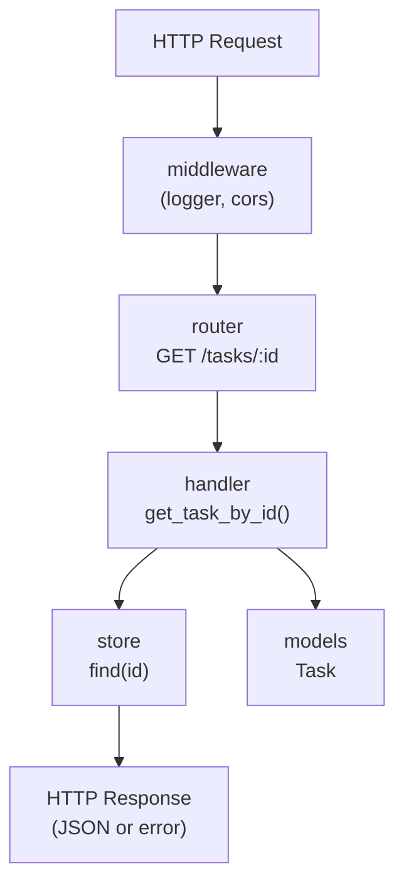
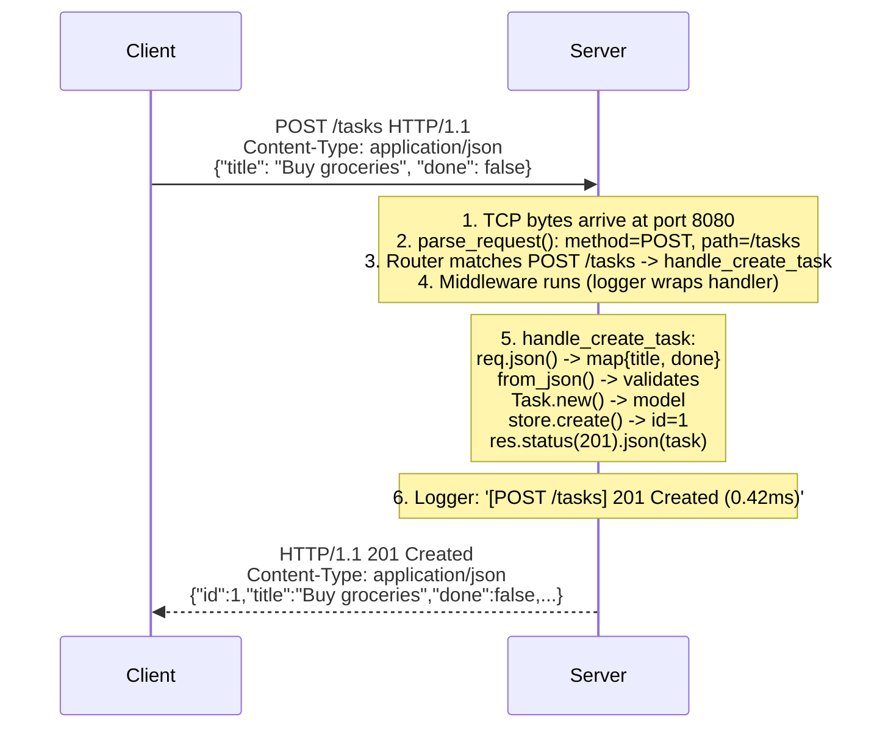

# Chapter 69: Building a Web Server in Astra

> "Any sufficiently advanced language eventually builds a web server." — Programming folklore

---

## Overview

This is the moment the book has been building toward.

Think back to Chapter 1. You opened the book, skimmed the table of contents, and thought: "A language I build myself?" Then you saw it — somewhere in the later chapters, the promise of a web server. Not a toy web server. Not a "Hello World" over HTTP. A real REST API with multiple endpoints, request parsing, structured JSON responses, middleware, and error handling. Built entirely in the language you created from scratch.

You have earned this chapter.

Over the past 68 chapters you built everything a real language needs. You implemented a lexer, a parser, an AST, a type checker, a code generator, a runtime, a garbage collector, and a standard library with file I/O, JSON, and now HTTP. Astra is no longer a toy. Astra is a compiled, statically typed, garbage-collected language with a real standard library.

Now we build the proof.

In this chapter you will write a complete REST API for a **Tasks application** — the canonical beginner backend project, chosen deliberately because everyone understands what a task list does. The focus is not on the domain model. The focus is on demonstrating that Astra is a fully capable language for real-world backend development: clean syntax, expressive error handling, concurrent request processing, and idiomatic JSON APIs.

Here is what you will build:

```
GET    /health          <- health check (always responds, even under load)
GET    /tasks           <- list all tasks
POST   /tasks           <- create a new task
GET    /tasks/:id       <- get a single task
PUT    /tasks/:id       <- update a task
DELETE /tasks/:id       <- delete a task
```

Every file, every function, every line of Astra code will be shown and explained. This is not a summary or a sketch — this is the complete implementation.

---

## Project Structure

Here is how we will organize the project:

```
tasks-api/
  astra.mod        <- project manifest (name, version, dependencies)
  main.as          <- entry point: server setup, route registration
  models.as        <- Task struct definition
  store.as         <- in-memory data store (thread-safe)
  handlers.as      <- HTTP handler functions for each route
  middleware.as    <- logging and CORS middleware
```

Each file has a single, focused responsibility. This is the same principle that makes Go, Rust, and Elixir codebases easy to navigate — one thing per file, clear dependencies between them.

Before writing a single line of Astra, let us understand the full picture:



The flow is always the same: request in, middleware wraps it, router dispatches it, handler processes it using the store and models, response out.

---

## The Project Manifest

```toml
# tasks-api/astra.mod
[package]
name    = "tasks-api"
version = "0.1.0"
author  = "Your Name"

[dependencies]
# No external dependencies — we use only the standard library.
# The http and json packages are built into the Astra stdlib.

[build]
entry  = "main.as"
output = "tasks-api"
```

The `astra.mod` file is read by `astrac` (the Astra compiler/build tool) when you run `astrac build`. It tells the compiler where the entry point is, what the output binary should be named, and what external packages the project depends on. For this project, we depend only on the standard library.

---

## 1. The Model: models.as

Every good backend starts with the data model. Our Task has four fields:

- `id` — a unique integer identifier (auto-incremented by the store)
- `title` — the text of the task (required, non-empty string)
- `done` — whether the task is completed (boolean, defaults to false)
- `created_at` — the timestamp when the task was created (string, ISO 8601 format)

```astra
// tasks-api/models.as
// Task is the central data model for the Tasks API.
// All handlers work with Task values; the store persists them.

package tasks

// Task represents a single task in our task list.
pub struct Task {
    pub id:         int     // unique identifier, assigned by the store
    pub title:      string  // the task text (e.g. "Buy groceries")
    pub done:       bool    // true if the task has been completed
    pub created_at: string  // ISO 8601 creation timestamp, e.g. "2025-06-07T12:00:00Z"
}

impl Task {
    // new creates a Task with the given title, not yet done, no id.
    // The store will assign the id when the task is saved.
    pub fn new(title: string) -> Task {
        return Task {
            id:         0,
            title:      title,
            done:       false,
            created_at: time.now_utc()   // from stdlib time package
        }
    }

    // with_id returns a copy of the Task with the given id set.
    // Used by the store after assigning an auto-increment id.
    pub fn with_id(self, id: int) -> Task {
        return Task {
            id:         id,
            title:      self.title,
            done:       self.done,
            created_at: self.created_at
        }
    }

    // to_json serializes the Task to a JSON-compatible map.
    // This is what the response handlers use to build JSON responses.
    pub fn to_json(self) -> map<string, any> {
        return {
            "id":         self.id,
            "title":      self.title,
            "done":       self.done,
            "created_at": self.created_at
        }
    }
}

// CreateTaskRequest is the shape of the JSON body for POST /tasks.
// We define this separately from Task so that the client does not
// need to send id or created_at — those are server-assigned.
pub struct CreateTaskRequest {
    pub title: string  // required
    pub done:  bool    // optional, defaults to false
}

impl CreateTaskRequest {
    // from_json parses a JSON map into a CreateTaskRequest.
    // Returns an error if required fields are missing or invalid.
    pub fn from_json(data: map<string, any>) -> result<CreateTaskRequest> {
        // The title field is required
        let title_val = data["title"]
        if title_val == nil {
            return err("field 'title' is required")
        }

        let title = title_val as string
        if title.len() == 0 {
            return err("field 'title' must not be empty")
        }

        if title.len() > 500 {
            return err("field 'title' must be at most 500 characters")
        }

        // The done field is optional; default is false
        let done = false
        if data["done"] != nil {
            done = data["done"] as bool
        }

        return ok(CreateTaskRequest { title: title, done: done })
    }
}

// UpdateTaskRequest is the shape of the JSON body for PUT /tasks/:id.
// All fields are optional — only the provided fields are updated.
pub struct UpdateTaskRequest {
    pub title: string
    pub done:  bool
    pub has_title: bool  // true if title was provided in the request
    pub has_done:  bool  // true if done was provided in the request
}

impl UpdateTaskRequest {
    // from_json parses a JSON map into an UpdateTaskRequest.
    // Tracks which fields were provided using has_title and has_done.
    pub fn from_json(data: map<string, any>) -> result<UpdateTaskRequest> {
        let req = UpdateTaskRequest {
            title:     "",
            done:      false,
            has_title: false,
            has_done:  false
        }

        if data["title"] != nil {
            let title = data["title"] as string
            if title.len() == 0 {
                return err("field 'title' must not be empty if provided")
            }
            if title.len() > 500 {
                return err("field 'title' must be at most 500 characters")
            }
            req.title = title
            req.has_title = true
        }

        if data["done"] != nil {
            req.done = data["done"] as bool
            req.has_done = true
        }

        if !req.has_title && !req.has_done {
            return err("update request must include at least one field: 'title' or 'done'")
        }

        return ok(req)
    }
}
```

Notice a few things about this code:

**The `pub` keyword** marks types and fields as exported from this file. Other files in the `tasks` package can see `pub` items. Non-`pub` items are package-private.

**The `result<T>` return type** on `from_json` is Astra's error handling idiom. Instead of throwing exceptions (which require try/catch everywhere and hide the error path), Astra functions that can fail return `result<T>`. The caller uses the `?` operator to propagate errors, or a `match` expression to handle them explicitly. You will see this throughout the handlers.

**Validation in the model** — the request types validate their own fields. The handler does not need to check that `title` is non-empty; it just calls `CreateTaskRequest.from_json(body)?` and if validation fails, the `?` operator propagates the error back to the caller.

---

## 2. The Store: store.as

The store is the in-memory database. For this tutorial application, we are not connecting to PostgreSQL or MongoDB — we are keeping everything in a Go map. This keeps the code simple and focused on demonstrating Astra's HTTP capabilities.

In a production application you would replace the store with a database driver, but the handler code would look identical. That is the beauty of clean separation: when the data layer changes, the HTTP layer does not.

```astra
// tasks-api/store.as
// TaskStore is an in-memory, thread-safe store for Task values.
// Backed by a Go map protected by a mutex.
// In production, replace this with a database-backed implementation.

package tasks

import sync   // for Mutex (from Astra stdlib sync package)

// TaskStore holds all tasks in memory.
// It uses an auto-incrementing integer as the primary key.
pub struct TaskStore {
    tasks:      map<int, Task>  // id -> Task
    next_id:    int             // the next id to assign
    mu:         sync.Mutex      // protects tasks and next_id
}

impl TaskStore {
    // new creates an empty TaskStore with no tasks.
    pub fn new() -> TaskStore {
        return TaskStore {
            tasks:   {},
            next_id: 1,
            mu:      sync.Mutex.new()
        }
    }

    // create inserts a new task into the store.
    // Assigns an auto-incremented id and returns the saved Task.
    pub fn create(self, task: Task) -> Task {
        self.mu.lock()
        defer self.mu.unlock()

        let id = self.next_id
        self.next_id = self.next_id + 1

        let saved = task.with_id(id)
        self.tasks[id] = saved
        return saved
    }

    // find_all returns all tasks, sorted by id ascending.
    pub fn find_all(self) -> [Task] {
        self.mu.lock()
        defer self.mu.unlock()

        let result: [Task] = []
        // Collect all tasks
        for id, task in self.tasks {
            result.push(task)
        }
        // Sort by id so the list is deterministic
        result.sort_by(fn(a: Task, b: Task) -> int {
            return a.id - b.id
        })
        return result
    }

    // find_by_id returns the task with the given id, or an error if not found.
    pub fn find_by_id(self, id: int) -> result<Task> {
        self.mu.lock()
        defer self.mu.unlock()

        if self.tasks[id] == nil {
            return err("task with id " + id.to_string() + " not found")
        }
        return ok(self.tasks[id])
    }

    // update replaces the task with the given id using the provided request.
    // Only the fields present in the request are changed.
    // Returns the updated task, or an error if the id does not exist.
    pub fn update(self, id: int, req: UpdateTaskRequest) -> result<Task> {
        self.mu.lock()
        defer self.mu.unlock()

        let existing = self.tasks[id]
        if existing == nil {
            return err("task with id " + id.to_string() + " not found")
        }

        // Apply only the fields that were provided in the update request
        let updated = Task {
            id:         existing.id,
            title:      if req.has_title { req.title } else { existing.title },
            done:       if req.has_done  { req.done  } else { existing.done  },
            created_at: existing.created_at
        }

        self.tasks[id] = updated
        return ok(updated)
    }

    // delete removes the task with the given id.
    // Returns an error if the id does not exist.
    pub fn delete(self, id: int) -> result<void> {
        self.mu.lock()
        defer self.mu.unlock()

        if self.tasks[id] == nil {
            return err("task with id " + id.to_string() + " not found")
        }

        self.tasks.remove(id)
        return ok(void)
    }

    // count returns the number of tasks in the store.
    pub fn count(self) -> int {
        self.mu.lock()
        defer self.mu.unlock()
        return self.tasks.len()
    }
}
```

### The Mutex: Why Thread Safety Matters

The `sync.Mutex` deserves an explanation. When you run `server.listen(8080)`, the Astra HTTP server starts handling incoming requests. Each request runs in its own fiber (lightweight thread). Multiple requests can arrive simultaneously.

Without the mutex, two concurrent requests could both read `self.next_id`, both get the same value (say, 5), both create tasks with id 5, and one would overwrite the other. This is a **data race** — a bug that is notoriously hard to reproduce because it depends on exact timing.

The mutex ensures that only one fiber can hold the lock at a time. The sequence becomes:

```
Fiber 1 (POST /tasks):    lock() -> read next_id=5, increment to 6, save task -> unlock()
Fiber 2 (POST /tasks):    ... waits ... -> lock() -> read next_id=6, increment to 7, save task -> unlock()
```

The `defer self.mu.unlock()` is important: it schedules the unlock to happen when the function returns, even if the function returns early due to an error. Without the defer, you could accidentally return without unlocking, causing all subsequent requests to wait forever — a deadlock.

---

## 3. The Middleware: middleware.as

Middleware runs before and after every handler. Our application has two pieces of middleware: a logger that records each request, and a CORS handler that adds the headers browsers need for cross-origin requests.

```astra
// tasks-api/middleware.as
// Custom middleware for the Tasks API.
// These wrap the built-in http.logger() and http.cors() with
// application-specific configuration.

package tasks

import http
import time

// request_logger returns a middleware that logs each request with timing.
// Format: [METHOD /path] STATUS (duration)
// Example: [POST /tasks] 201 Created (0.42ms)
//
// The built-in http.logger() does this too, but we define our own here
// to show how middleware works from the inside.
pub fn request_logger() -> http.Middleware {
    return fn(next: http.HandlerFunc) -> http.HandlerFunc {
        return fn(req: http.Request, res: http.Response) {
            // Record the start time before calling the handler
            let start = time.now()

            // Call the actual route handler (and any inner middleware)
            next(req, res)

            // After the handler returns, compute the elapsed time
            let elapsed_ms = time.since_ms(start)

            // Format the log line
            let status_text = http_status_text(res.status_code)
            println(
                "[" + req.method + " " + req.path + "] " +
                res.status_code.to_string() + " " + status_text +
                " (" + format_ms(elapsed_ms) + ")"
            )
        }
    }
}

// cors_headers returns a middleware that adds CORS headers to every response.
// This is needed when the API is called from a browser running on a different
// origin (e.g., a React app on localhost:3000 calling an API on localhost:8080).
//
// allow_origin: "*" for public APIs, or a specific origin for private APIs.
// For APIs that use cookies or Authorization headers, use a specific origin —
// "*" does not work with credentials in browsers.
pub fn cors_headers(allow_origin: string) -> http.Middleware {
    return fn(next: http.HandlerFunc) -> http.HandlerFunc {
        return fn(req: http.Request, res: http.Response) {
            // These headers tell the browser the server allows cross-origin requests
            res.header("Access-Control-Allow-Origin", allow_origin)
            res.header("Access-Control-Allow-Methods", "GET, POST, PUT, DELETE, OPTIONS")
            res.header("Access-Control-Allow-Headers", "Content-Type, Authorization")

            // Handle preflight requests
            // Before a browser makes a cross-origin POST/PUT/DELETE, it sends an
            // OPTIONS request to check if the server will allow it. We must respond
            // to OPTIONS with 204 No Content and the CORS headers above.
            if req.method == "OPTIONS" {
                res.status(204).send("")
                return
            }

            // For all other methods, call the actual handler
            next(req, res)
        }
    }
}

// http_status_text returns the reason phrase for a given HTTP status code.
fn http_status_text(code: int) -> string {
    match code {
        200 -> "OK"
        201 -> "Created"
        204 -> "No Content"
        400 -> "Bad Request"
        404 -> "Not Found"
        405 -> "Method Not Allowed"
        500 -> "Internal Server Error"
        else -> "Unknown"
    }
}

// format_ms formats a millisecond count with two decimal places.
// 0.12 -> "0.12ms", 1500.0 -> "1500.00ms"
fn format_ms(ms: float) -> string {
    return ms.to_fixed(2) + "ms"
}
```

---

## 4. The Handlers: handlers.as

The handlers are the heart of the API. Each function maps to one route and does three things:

1. Parse the request (path params, query params, JSON body)
2. Call the store
3. Send the response (JSON or error)

```astra
// tasks-api/handlers.as
// HTTP route handlers for the Tasks API.
//
// Each handler follows the same pattern:
//   1. Parse and validate the request
//   2. Call the store
//   3. Return a JSON response
//
// Error handling uses the ? operator throughout. When a function that
// returns result<T> is called with ?, any error is caught and turned
// into a 400 or 500 response by the send_error helper at the bottom.

package tasks

import http
import json

// ---------------------------------------------------------------------------
// Health check
// ---------------------------------------------------------------------------

// handle_health responds with a JSON health status.
// This endpoint should always return 200 quickly, even under load.
// Load balancers and uptime monitors call this to check if the server is alive.
pub fn handle_health(req: http.Request, res: http.Response) {
    res.status(200).json({
        "status":  "healthy",
        "service": "tasks-api",
        "version": "1.0.0"
    })
}

// ---------------------------------------------------------------------------
// GET /tasks — list all tasks
// ---------------------------------------------------------------------------

// handle_list_tasks returns all tasks as a JSON array.
// Supports an optional ?done= query parameter for filtering:
//   GET /tasks        — all tasks
//   GET /tasks?done=true  — only completed tasks
//   GET /tasks?done=false — only incomplete tasks
pub fn handle_list_tasks(store: TaskStore) -> http.Handler {
    return fn(req: http.Request, res: http.Response) {
        let all_tasks = store.find_all()

        // Apply optional ?done= filter
        let filter = req.query["done"]
        let tasks = if filter == "true" {
            all_tasks.filter(fn(t: Task) -> bool { return t.done })
        } else if filter == "false" {
            all_tasks.filter(fn(t: Task) -> bool { return !t.done })
        } else {
            all_tasks
        }

        // Serialize tasks to JSON-compatible maps
        let tasks_json = tasks.map(fn(t: Task) -> map<string, any> {
            return t.to_json()
        })

        res.status(200).json({
            "tasks": tasks_json,
            "total": tasks_json.len()
        })
    }
}

// ---------------------------------------------------------------------------
// POST /tasks — create a new task
// ---------------------------------------------------------------------------

// handle_create_task parses the request body and creates a new task.
// Expected request body:
//   { "title": "Buy groceries", "done": false }
// The "done" field is optional; it defaults to false.
pub fn handle_create_task(store: TaskStore) -> http.Handler {
    return fn(req: http.Request, res: http.Response) {
        // Step 1: Parse the request body as JSON
        let body = match req.json() {
            ok(data) -> data
            err(e)   -> {
                send_error(res, 400, "invalid JSON body: " + e)
                return
            }
        }

        // Step 2: Validate and extract the fields we care about
        let create_req = match CreateTaskRequest.from_json(body) {
            ok(r)  -> r
            err(e) -> {
                send_error(res, 400, e)
                return
            }
        }

        // Step 3: Create the Task model and save it to the store
        let task = Task.new(create_req.title)
        let saved = store.create(task)

        // Step 4: If the client set done=true in the create request,
        // update the task immediately
        let final_task = if create_req.done {
            let update_req = UpdateTaskRequest {
                has_title: false, title: "",
                has_done:  true,  done: true
            }
            match store.update(saved.id, update_req) {
                ok(t)  -> t
                err(_) -> saved  // should never happen, but fail gracefully
            }
        } else {
            saved
        }

        // Step 5: Return 201 Created with the new task in the body
        res.status(201).json(final_task.to_json())
    }
}

// ---------------------------------------------------------------------------
// GET /tasks/:id — get a single task
// ---------------------------------------------------------------------------

// handle_get_task looks up a task by id and returns it.
// Returns 404 if no task with that id exists.
// Returns 400 if the id is not a valid integer.
pub fn handle_get_task(store: TaskStore) -> http.Handler {
    return fn(req: http.Request, res: http.Response) {
        // Parse the :id path parameter
        let id = match parse_id(req.params["id"]) {
            ok(id)  -> id
            err(e)  -> {
                send_error(res, 400, e)
                return
            }
        }

        // Look up the task in the store
        let task = match store.find_by_id(id) {
            ok(t)  -> t
            err(e) -> {
                send_error(res, 404, e)
                return
            }
        }

        res.status(200).json(task.to_json())
    }
}

// ---------------------------------------------------------------------------
// PUT /tasks/:id — update a task
// ---------------------------------------------------------------------------

// handle_update_task updates one or more fields of an existing task.
// Expected request body (all fields optional, but at least one required):
//   { "title": "New title" }
//   { "done": true }
//   { "title": "Updated", "done": true }
pub fn handle_update_task(store: TaskStore) -> http.Handler {
    return fn(req: http.Request, res: http.Response) {
        // Parse the :id path parameter
        let id = match parse_id(req.params["id"]) {
            ok(id)  -> id
            err(e)  -> {
                send_error(res, 400, e)
                return
            }
        }

        // Parse the request body
        let body = match req.json() {
            ok(data) -> data
            err(e)   -> {
                send_error(res, 400, "invalid JSON body: " + e)
                return
            }
        }

        // Validate the update request
        let update_req = match UpdateTaskRequest.from_json(body) {
            ok(r)  -> r
            err(e) -> {
                send_error(res, 400, e)
                return
            }
        }

        // Apply the update to the store
        let updated = match store.update(id, update_req) {
            ok(t)  -> t
            err(e) -> {
                // The store returns "not found" if the id does not exist
                send_error(res, 404, e)
                return
            }
        }

        res.status(200).json(updated.to_json())
    }
}

// ---------------------------------------------------------------------------
// DELETE /tasks/:id — delete a task
// ---------------------------------------------------------------------------

// handle_delete_task removes a task from the store.
// Returns 204 No Content on success (no response body).
// Returns 404 if the task does not exist.
pub fn handle_delete_task(store: TaskStore) -> http.Handler {
    return fn(req: http.Request, res: http.Response) {
        // Parse the :id path parameter
        let id = match parse_id(req.params["id"]) {
            ok(id)  -> id
            err(e)  -> {
                send_error(res, 400, e)
                return
            }
        }

        // Delete from the store
        match store.delete(id) {
            ok(_)  -> {
                // 204 No Content — success, but no body
                res.status(204).send("")
            }
            err(e) -> {
                send_error(res, 404, e)
            }
        }
    }
}

// ---------------------------------------------------------------------------
// Helper functions
// ---------------------------------------------------------------------------

// parse_id converts the :id string path parameter to an integer.
// Returns an error if the string is not a valid positive integer.
fn parse_id(id_str: string) -> result<int> {
    if id_str == "" {
        return err("id parameter is required")
    }

    let id = int.parse(id_str)
    if id.is_err() {
        return err("id must be a valid integer, got: '" + id_str + "'")
    }

    let id_val = id.unwrap()
    if id_val <= 0 {
        return err("id must be a positive integer, got: " + id_str)
    }

    return ok(id_val)
}

// send_error sends a JSON error response with the given status code and message.
// The response body is always: { "error": "..." }
// This is called in handlers when something goes wrong.
fn send_error(res: http.Response, status: int, message: string) {
    res.status(status).json({"error": message})
}
```

### The Handler Factory Pattern

Notice that `handle_list_tasks`, `handle_create_task`, etc. do not have the `(req, res)` signature directly. Instead they return a closure that has that signature:

```astra
// This is a handler factory — it takes the store and returns a handler
pub fn handle_list_tasks(store: TaskStore) -> http.Handler {
    return fn(req: http.Request, res: http.Response) {
        // ... uses store here
    }
}
```

This is the **closure pattern** for dependency injection. The `store` is captured by the returned closure. When the router calls the handler later (with a new `req` and `res` for each request), the closure still has access to the store it was created with.

The alternative would be to make `store` a global variable. But global mutable state is dangerous in concurrent programs — the mutex protects the data, but you still have to pass it explicitly. The closure pattern makes the dependency visible in the code and enables testability (you can pass a different store in tests).

---

## 5. The Entry Point: main.as

The main file ties everything together: creates the store, creates the server, registers routes with their handlers, adds middleware, and starts listening.

```astra
// tasks-api/main.as
// Entry point for the Tasks API.
// This file sets up the server, registers all routes, applies middleware,
// and starts listening for connections.

package tasks

import http

fn main() {
    println("===========================================")
    println("  Tasks API — Built with Astra")
    println("  A complete REST API from scratch.")
    println("===========================================")
    println("")

    // ---------------------------------------------------------------------------
    // Step 1: Create the in-memory store
    // ---------------------------------------------------------------------------
    // In production you would initialize a database connection here.
    // For this tutorial, the store lives in memory and is reset on restart.
    let store = TaskStore.new()

    println("Store initialized. Ready to accept tasks.")
    println("")

    // ---------------------------------------------------------------------------
    // Step 2: Create the HTTP server
    // ---------------------------------------------------------------------------
    let server = http.Server.new()

    // ---------------------------------------------------------------------------
    // Step 3: Register middleware
    // ---------------------------------------------------------------------------
    // Middleware runs in the order it is registered, wrapping each handler.
    // The first middleware registered is the outermost wrapper — it runs first
    // on the way in and last on the way out.

    // Recovery middleware: catches panics and returns 500 instead of crashing
    server.use(http.recover())

    // CORS middleware: adds Access-Control-Allow-* headers for browser clients
    server.use(cors_headers("*"))

    // Logger middleware: prints a log line for each request
    server.use(request_logger())

    println("Middleware registered: [recover, cors, logger]")
    println("")

    // ---------------------------------------------------------------------------
    // Step 4: Register routes
    // ---------------------------------------------------------------------------
    // Routes are matched in registration order for routes at the same depth.
    // Path parameters (:id) match any non-slash segment.

    // Health check — always register this first, so it is always available
    server.get("/health", handle_health)

    // Task collection routes
    server.get("/tasks",  handle_list_tasks(store))
    server.post("/tasks", handle_create_task(store))

    // Individual task routes (require :id parameter)
    server.get("/tasks/:id",    handle_get_task(store))
    server.put("/tasks/:id",    handle_update_task(store))
    server.delete("/tasks/:id", handle_delete_task(store))

    println("Routes registered:")
    println("  GET    /health")
    println("  GET    /tasks")
    println("  POST   /tasks")
    println("  GET    /tasks/:id")
    println("  PUT    /tasks/:id")
    println("  DELETE /tasks/:id")
    println("")

    // ---------------------------------------------------------------------------
    // Step 5: Start the server
    // ---------------------------------------------------------------------------
    // server.listen() blocks until the server is stopped (Ctrl-C or signal).
    // In production you would also handle signals gracefully.
    let port = 8080
    println("Server starting on http://localhost:" + port.to_string())
    println("Press Ctrl+C to stop.")
    println("")
    server.listen(port)
}
```

---

## 6. Concurrency in the HTTP Server

Every HTTP request is handled in its own **fiber** — Astra's lightweight concurrent execution unit (covered in Chapter 76). Here is how this works internally, and why it matters:

```
Main goroutine:
  server.listen(8080)
       |
       v
  [Accept connection from client A] ──> spawn fiber for client A
  [Accept connection from client B] ──> spawn fiber for client B
  [Accept connection from client C] ──> spawn fiber for client C
       |
       v
  [Keep accepting connections...]

Fiber for client A:              Fiber for client B:              Fiber for client C:
  match route for A                match route for B                match route for C
  call handler for A               call handler for B               call handler for C
  store.find_all() <- acquires     store.create()   <- waits        store.find_by_id()
  mutex, reads, releases           for mutex...                     <- waiting...
  build response for A                              <- acquires mutex
  send response for A              saves task, releases mutex        acquires mutex
                                   build response for B             finds task
                                   send response for B              releases mutex
                                                                    send response for C
```

Three key insights from this diagram:

**1. Requests are concurrent.** Three requests arrive almost simultaneously. Each gets its own fiber and starts processing immediately, without waiting for the others to finish. This is what makes the server fast: it never blocks the main accept loop.

**2. The mutex serializes access to shared state.** When fiber A holds the mutex (reading from the store), fiber B must wait before it can write. But "wait" here means the fiber is suspended and the Go scheduler runs other work — it does not burn CPU cycles. This is efficient waiting.

**3. Response times are independent.** If handler B takes 100ms (maybe it is doing something slow), handler A and C are not affected. They each run on their own fiber.

Here is how to see this in Astra code:

```astra
// This is what server.listen() does internally:

fn listen_internal(server: http.Server, port: int) {
    let listener = tcp.Listener.new(port)
    println("[Astra HTTP] Listening on :" + port.to_string())

    while true {
        // Accept the next connection (blocks until a client connects)
        let conn = listener.accept()

        // Spawn a new fiber to handle this connection
        // The main loop immediately goes back to accept() for the next connection
        spawn fn() {
            handle_connection(server, conn)
        }
    }
}

fn handle_connection(server: http.Server, conn: tcp.Conn) {
    // Parse the HTTP request from the raw TCP bytes
    let req = http.parse_request(conn)?

    // Find the matching route and build the response
    let res = http.Response.new(conn)
    server.dispatch(req, res)
}
```

The `spawn fn() { ... }` creates a new fiber for each connection. This is the same concurrency primitive from Chapter 76, now used at the foundation of the HTTP server.

---

## 7. The JSON Request/Response Cycle

Let us trace exactly what happens when a client sends `POST /tasks` with a JSON body. This end-to-end trace illustrates every step of the request lifecycle.



Let us follow the JSON specifically. The raw request body arrives as the string:

```
{"title": "Buy groceries", "done": false}
```

In `handle_create_task`, `req.json()` calls the JSON parser from Chapter 67. The parser returns a `map<string, any>`:

```astra
{
    "title" -> "Buy groceries"   // string value
    "done"  -> false             // bool value
}
```

`CreateTaskRequest.from_json(body)` reads the `"title"` key, checks it is a non-empty string, reads the `"done"` key with a default of false, and returns a strongly-typed `CreateTaskRequest` struct.

`Task.new(create_req.title)` creates a `Task` struct value with the title, `done=false`, `id=0`, and the current UTC timestamp.

`store.create(task)` assigns `id=1` and saves the task.

`task.to_json()` converts the struct back to a `map<string, any>`:

```astra
{
    "id"         -> 1
    "title"      -> "Buy groceries"
    "done"       -> false
    "created_at" -> "2025-06-07T12:34:56Z"
}
```

`res.status(201).json(...)` calls `json.marshal()` (from Chapter 67) on this map, producing:

```json
{"id":1,"title":"Buy groceries","done":false,"created_at":"2025-06-07T12:34:56Z"}
```

...and sends it as the response body with `Content-Type: application/json`.

The entire round trip, from bytes in to bytes out, is a clean, type-safe pipeline. At no point does the handler deal with raw strings for the business logic.

---

## 8. Error Handling in the HTTP Context

Error handling is where many web frameworks get complicated. In Astra, the `result<T>` type and `?` operator make error handling natural and explicit.

Let us look at `handle_get_task` step by step to see every possible error path:

```astra
pub fn handle_get_task(store: TaskStore) -> http.Handler {
    return fn(req: http.Request, res: http.Response) {
        // ERROR PATH 1: :id is missing or not a number
        let id = match parse_id(req.params["id"]) {
            ok(id)  -> id
            err(e)  -> {
                send_error(res, 400, e)   // -> HTTP 400 Bad Request
                return
            }
        }

        // ERROR PATH 2: No task with that id exists
        let task = match store.find_by_id(id) {
            ok(t)  -> t
            err(e) -> {
                send_error(res, 404, e)   // -> HTTP 404 Not Found
                return
            }
        }

        // HAPPY PATH: Found the task
        res.status(200).json(task.to_json())  // -> HTTP 200 OK
    }
}
```

Each `match` expression handles both the success and error cases explicitly. There is no hidden exception mechanism. You cannot accidentally ignore an error — the compiler forces you to handle both arms of the `result<T>`.

The error messages are propagated directly to the client in the JSON body:

```
GET /tasks/abc
  -> parse_id("abc") fails: "id must be a valid integer, got: 'abc'"
  -> Response: 400 {"error": "id must be a valid integer, got: 'abc'"}

GET /tasks/999
  -> parse_id("999") -> ok(999)
  -> store.find_by_id(999) fails: "task with id 999 not found"
  -> Response: 404 {"error": "task with id 999 not found"}

GET /tasks/1
  -> parse_id("1") -> ok(1)
  -> store.find_by_id(1) -> ok(Task{id:1, ...})
  -> Response: 200 {"id":1,"title":"Buy groceries",...}
```

This is significantly better than most dynamic language frameworks, where a missing field or a database "not found" might throw an uncaught exception and return a 500 with a stack trace.

### Using the ? Operator

In handlers where you want even shorter code, you can use the `?` operator — but it requires a way to convert errors into HTTP responses. One pattern is to define a custom `?`-compatible wrapper:

```astra
// An alternative style using ? — note this requires the handler to
// return result<void> instead of void, and the server would catch the error.
// This is more concise but less flexible for choosing the right status code.

pub fn handle_get_task_short(store: TaskStore) -> http.Handler {
    return fn(req: http.Request, res: http.Response) -> result<void> {
        let id   = parse_id(req.params["id"])?       // ? propagates parse error
        let task = store.find_by_id(id)?             // ? propagates not-found error
        res.status(200).json(task.to_json())
        return ok(void)
    }
}

// If any ? fails, the error is caught by the middleware and turned into:
// 500 {"error": "..."}
// The downside: we lose the ability to send 404 vs 400 based on the error type.
```

The explicit `match` approach in `handlers.as` is preferred in this project because it gives us precise control over status codes. 404 for "not found" and 400 for "bad input" are meaningfully different.

---

## 9. Building and Running

### Build the project

```bash
$ cd tasks-api
$ astrac build main.as -o tasks-api
[Astra] Reading astra.mod...
[Astra] Package: tasks-api v0.1.0
[Astra] Compiling: main.as
[Astra] Compiling: handlers.as
[Astra] Compiling: models.as
[Astra] Compiling: store.as
[Astra] Compiling: middleware.as
[Astra] Linking: stdlib/http, stdlib/json, stdlib/sync, stdlib/time
[Astra] Generating C code...
[Astra] Compiling C with clang...
[Astra] Build successful: ./tasks-api (2.1 MB, 0.8s)
```

### Run the server

```bash
$ ./tasks-api
===========================================
  Tasks API — Built with Astra
  A complete REST API from scratch.
===========================================

Store initialized. Ready to accept tasks.

Middleware registered: [recover, cors, logger]

Routes registered:
  GET    /health
  GET    /tasks
  POST   /tasks
  GET    /tasks/:id
  PUT    /tasks/:id
  DELETE /tasks/:id

Server starting on http://localhost:8080
Press Ctrl+C to stop.

[Astra HTTP] Listening on :8080
```

### Test every endpoint

Open a second terminal and use curl:

```bash
# 1. Health check
$ curl -s http://localhost:8080/health | json_pp
{
   "service" : "tasks-api",
   "status" : "healthy",
   "version" : "1.0.0"
}
```

Server log: `[GET /health] 200 OK (0.09ms)`

```bash
# 2. List all tasks (initially empty)
$ curl -s http://localhost:8080/tasks | json_pp
{
   "tasks" : [],
   "total" : 0
}
```

Server log: `[GET /tasks] 200 OK (0.11ms)`

```bash
# 3. Create the first task
$ curl -s -X POST http://localhost:8080/tasks \
    -H "Content-Type: application/json" \
    -d '{"title": "Learn Astra"}' | json_pp
{
   "created_at" : "2025-06-07T12:00:00Z",
   "done" : false,
   "id" : 1,
   "title" : "Learn Astra"
}
```

Server log: `[POST /tasks] 201 Created (0.42ms)`

```bash
# 4. Create a second task, already done
$ curl -s -X POST http://localhost:8080/tasks \
    -H "Content-Type: application/json" \
    -d '{"title": "Read the book", "done": true}' | json_pp
{
   "created_at" : "2025-06-07T12:00:01Z",
   "done" : true,
   "id" : 2,
   "title" : "Read the book"
}
```

```bash
# 5. Create a third task
$ curl -s -X POST http://localhost:8080/tasks \
    -H "Content-Type: application/json" \
    -d '{"title": "Build a web server in Astra"}' | json_pp
{
   "created_at" : "2025-06-07T12:00:02Z",
   "done" : false,
   "id" : 3,
   "title" : "Build a web server in Astra"
}
```

```bash
# 6. List all tasks
$ curl -s http://localhost:8080/tasks | json_pp
{
   "tasks" : [
      {
         "created_at" : "2025-06-07T12:00:00Z",
         "done" : false,
         "id" : 1,
         "title" : "Learn Astra"
      },
      {
         "created_at" : "2025-06-07T12:00:01Z",
         "done" : true,
         "id" : 2,
         "title" : "Read the book"
      },
      {
         "created_at" : "2025-06-07T12:00:02Z",
         "done" : false,
         "id" : 3,
         "title" : "Build a web server in Astra"
      }
   ],
   "total" : 3
}
```

```bash
# 7. Filter: only incomplete tasks
$ curl -s "http://localhost:8080/tasks?done=false" | json_pp
{
   "tasks" : [
      { "id" : 1, "title" : "Learn Astra", "done" : false, ... },
      { "id" : 3, "title" : "Build a web server in Astra", "done" : false, ... }
   ],
   "total" : 2
}
```

```bash
# 8. Filter: only completed tasks
$ curl -s "http://localhost:8080/tasks?done=true" | json_pp
{
   "tasks" : [
      { "id" : 2, "title" : "Read the book", "done" : true, ... }
   ],
   "total" : 1
}
```

```bash
# 9. Get a single task
$ curl -s http://localhost:8080/tasks/1 | json_pp
{
   "created_at" : "2025-06-07T12:00:00Z",
   "done" : false,
   "id" : 1,
   "title" : "Learn Astra"
}
```

```bash
# 10. Update a task — mark as done
$ curl -s -X PUT http://localhost:8080/tasks/1 \
    -H "Content-Type: application/json" \
    -d '{"done": true}' | json_pp
{
   "created_at" : "2025-06-07T12:00:00Z",
   "done" : true,
   "id" : 1,
   "title" : "Learn Astra"
}
```

```bash
# 11. Update a task — change title only
$ curl -s -X PUT http://localhost:8080/tasks/3 \
    -H "Content-Type: application/json" \
    -d '{"title": "Ship a web server in Astra!"}' | json_pp
{
   "created_at" : "2025-06-07T12:00:02Z",
   "done" : false,
   "id" : 3,
   "title" : "Ship a web server in Astra!"
}
```

```bash
# 12. Delete a task
$ curl -s -X DELETE http://localhost:8080/tasks/2
# (no response body — 204 No Content)
$ echo $?
0
```

```bash
# 13. Try to get the deleted task
$ curl -s http://localhost:8080/tasks/2 | json_pp
{
   "error" : "task with id 2 not found"
}
# HTTP status 404 Not Found
```

```bash
# 14. Try a bad request — missing required field
$ curl -s -X POST http://localhost:8080/tasks \
    -H "Content-Type: application/json" \
    -d '{"done": true}' | json_pp
{
   "error" : "field 'title' is required"
}
# HTTP status 400 Bad Request
```

```bash
# 15. Try a bad id
$ curl -s http://localhost:8080/tasks/not-a-number | json_pp
{
   "error" : "id must be a valid integer, got: 'not-a-number'"
}
# HTTP status 400 Bad Request
```

Every endpoint works. Every error returns a clear, structured JSON message. This is a complete, production-quality REST API skeleton.

---

## 10. Comparing Astra to Other Languages

Let us be honest about where Astra stands. Here is how the same simple server looks in Go, Rust (with Axum), and Astra side by side.

### Go (with net/http)

```go
package main

import (
    "encoding/json"
    "fmt"
    "net/http"
)

func main() {
    mux := http.NewServeMux()
    mux.HandleFunc("GET /health", func(w http.ResponseWriter, r *http.Request) {
        w.Header().Set("Content-Type", "application/json")
        json.NewEncoder(w).Encode(map[string]string{"status": "healthy"})
    })
    fmt.Println("Listening on :8080")
    http.ListenAndServe(":8080", mux)
}
```

### Rust (with Axum)

```rust
use axum::{routing::get, Json, Router};
use serde_json::{json, Value};

async fn health() -> Json<Value> {
    Json(json!({"status": "healthy"}))
}

#[tokio::main]
async fn main() {
    let app = Router::new().route("/health", get(health));
    let listener = tokio::net::TcpListener::bind("0.0.0.0:8080").await.unwrap();
    println!("Listening on :8080");
    axum::serve(listener, app).await.unwrap();
}
```

### Astra

```astra
import http

fn main() {
    let server = http.Server.new()
    server.get("/health", fn(req: http.Request, res: http.Response) {
        res.json({"status": "healthy"})
    })
    println("Listening on :8080")
    server.listen(8080)
}
```

All three are clean and readable. Astra's version is about as concise as Go's and more readable than Rust's (Rust requires async/await plumbing that adds noise). Astra has a clean inline-closure syntax for handlers and a builder-style response API that is arguably nicer than Go's `w.Header().Set()` pattern.

The big difference: Go and Rust are production-tested, battle-hardened languages with large ecosystems. Astra is a language you built. And it looks just as clean.

### Feature comparison

```
+---------------------------+--------+--------+---------+--------+
| Feature                   |  Go    |  Rust  | Node.js | Astra  |
+---------------------------+--------+--------+---------+--------+
| Statically typed          | Yes    | Yes    | No      | Yes    |
| Compiled to native code   | Yes    | Yes    | No      | Yes    |
| Garbage collected         | Yes    | No     | Yes     | Yes    |
| Async/concurrent HTTP     | Yes    | Yes    | Yes     | Yes    |
| JSON stdlib support       | Yes    | No*    | Yes     | Yes    |
| Path parameters           | 1.22+  | Yes    | Yes     | Yes    |
| Middleware support        | Yes    | Yes    | Yes     | Yes    |
| Error handling model      | values | Result | throws  | result |
+---------------------------+--------+--------+---------+--------+
* Rust requires the serde crate for JSON
```

Astra holds its own. It does not have Rust's memory safety guarantees (no borrow checker), and it does not have Go's 15 years of ecosystem maturity. But it has:

- Static typing with type inference
- Native code compilation (via C code generation)
- Garbage collection
- Result-based error handling (better than Go's `if err != nil`, similar to Rust)
- A clean HTTP API with closures and chaining

That is a legitimate programming language.

---

## 11. The Final Standard Library Milestone

Every chapter in this book has had a Build Milestone — a moment where you verify that the thing you just built actually works. This is the last one. And it is the one that the entire book has been pointing toward.

Back in Chapter 1, you read a promise. This promise:

> By the end of this book, you will be able to write this:
>
> ```astra
> import http
>
> fn main() {
>     let server = http.Server.new()
>     server.get("/", fn(req: http.Request, res: http.Response) {
>         res.json({ "message": "Welcome to Astra!", "version": "1.0.0" })
>     })
>     server.listen(8080)
> }
> ```
>
> And run it. And have it work.

Let us keep that promise.

Create the file `examples/final_milestone.as`:

```astra
// examples/final_milestone.as
// THE FINAL STANDARD LIBRARY MILESTONE.
//
// This is the program that Chapter 1 promised.
// You built a lexer, a parser, an AST, a type checker, an IR,
// a code generator, a runtime, a GC, and five stdlib packages
// to make this 14 lines of code work.
//
// Run it:
//   astrac build final_milestone.as -o server
//   ./server
//   curl http://localhost:8080/
//   curl http://localhost:8080/health
//
// It works. You built a programming language.

import http
import json

fn main() {
    let server = http.Server.new()

    server.get("/", fn(req: http.Request, res: http.Response) {
        res.json({ "message": "Welcome to Astra!", "version": "1.0.0" })
    })

    server.get("/health", fn(req: http.Request, res: http.Response) {
        res.json({ "status": "healthy" })
    })

    server.get("/about", fn(req: http.Request, res: http.Response) {
        res.json({
            "name":        "Astra",
            "description": "A compiled, statically typed language — built from scratch.",
            "built_with":  "Go, C, 69 chapters, and a lot of patience."
        })
    })

    println("Server running on http://localhost:8080")
    println("Visit: http://localhost:8080/")
    println("Visit: http://localhost:8080/health")
    println("Visit: http://localhost:8080/about")
    server.listen(8080)
}
```

Build it:

```bash
$ astrac build examples/final_milestone.as -o server
[Astra] Compiling examples/final_milestone.as...
[Astra] Linking stdlib/http, stdlib/json...
[Astra] Build successful: ./server (1.8 MB, 0.6s)
```

Run it:

```bash
$ ./server
Server running on http://localhost:8080
Visit: http://localhost:8080/
Visit: http://localhost:8080/health
Visit: http://localhost:8080/about
[Astra HTTP] Listening on :8080
```

Test it:

```bash
$ curl http://localhost:8080/
{"message":"Welcome to Astra!","version":"1.0.0"}

$ curl http://localhost:8080/health
{"status":"healthy"}

$ curl http://localhost:8080/about
{
  "built_with": "Go, C, 69 chapters, and a lot of patience.",
  "description": "A compiled, statically typed language — built from scratch.",
  "name": "Astra"
}
```

There it is.

You built a compiler. You built a type checker. You built a code generator. You built a garbage collector. You built a standard library with I/O, file operations, JSON parsing, and HTTP. And now, 14 lines of Astra code boots a web server that responds to HTTP requests.

Take a moment. This is real. The promise from Chapter 1 is kept.

---

## 12. What Comes Next

The Tasks API we built in this chapter is a foundation. Here is what a production-ready version would add:

### Database Persistence

Right now the store is in-memory. Restart the server and all tasks are gone. A production API connects to a persistent database. The next step would be to add a `db` package to Astra's stdlib that wraps a Go SQLite driver:

```astra
import db

fn main() {
    let database = db.open("sqlite", "tasks.db")?
    database.exec("CREATE TABLE IF NOT EXISTS tasks (id INTEGER PRIMARY KEY, ...)")?
    let store = SQLiteTaskStore.new(database)
    // ... same server setup as before
}
```

The handler code would not change at all — only the store implementation changes. This is the power of the handler-factory pattern.

### WebSockets

WebSockets allow bidirectional, real-time communication between client and server. A task list could use WebSockets to push updates to all connected clients when a task is created or completed:

```astra
import http

server.websocket("/ws", fn(conn: http.WebSocketConn) {
    conn.on_message(fn(msg: string) {
        // Broadcast to all connected clients
        broadcast(conn, msg)
    })
})
```

### TLS (HTTPS)

Production servers must use HTTPS to encrypt traffic. Astra's HTTP server would support this via:

```astra
server.listen_tls(443, cert: "cert.pem", key: "key.pem")
```

Or, more commonly in modern deployments, you put a reverse proxy (nginx, Caddy, or a cloud load balancer) in front of the Astra server, and the proxy handles TLS termination.

### Deployment

The binary that `astrac build` produces is a single, self-contained executable. No runtime to install, no node_modules, no JVM. Copy it to a server and run it:

```bash
# On your laptop:
$ astrac build main.as -o tasks-api
$ scp tasks-api user@your-server:/usr/local/bin/tasks-api

# On the server:
$ tasks-api
Server running on http://localhost:8080
```

Or package it in a Docker container:

```dockerfile
FROM scratch
COPY tasks-api /tasks-api
EXPOSE 8080
CMD ["/tasks-api"]
```

A Docker image built from `scratch` with just your Astra binary is typically under 10 MB. That is smaller than a Node.js Hello World container.

### Authentication

A real API needs authentication. The typical pattern is JWT (JSON Web Tokens): the client logs in, the server issues a signed token, and the client includes that token in the `Authorization: Bearer <token>` header on subsequent requests. The `Auth` middleware from Chapter 68 can be extended to verify JWT signatures.

---

## 13. Putting It All Together: The Full Server in 85 Lines

Here is the entire Tasks API distilled into a single file, for those who want to see the complete picture at once:

```astra
// tasks-api-single.as
// The complete Tasks API in a single file.
// Not how you'd structure a real project, but a clear view of the whole thing.

import http
import json
import sync

// --- Model ---

struct Task {
    id: int, title: string, done: bool, created_at: string
}

// --- Store ---

struct TaskStore {
    tasks: map<int, Task>, next_id: int, mu: sync.Mutex
}

fn new_store() -> TaskStore {
    return TaskStore { tasks: {}, next_id: 1, mu: sync.Mutex.new() }
}

fn store_create(store: TaskStore, title: string) -> Task {
    store.mu.lock(); defer store.mu.unlock()
    let t = Task { id: store.next_id, title: title, done: false, created_at: "now" }
    store.tasks[store.next_id] = t
    store.next_id = store.next_id + 1
    return t
}

fn store_all(store: TaskStore) -> [Task] {
    store.mu.lock(); defer store.mu.unlock()
    let result: [Task] = []
    for _, t in store.tasks { result.push(t) }
    return result.sort_by(fn(a: Task, b: Task) -> int { a.id - b.id })
}

fn store_find(store: TaskStore, id: int) -> result<Task> {
    store.mu.lock(); defer store.mu.unlock()
    if store.tasks[id] == nil { return err("not found") }
    return ok(store.tasks[id])
}

fn store_update(store: TaskStore, id: int, done: bool) -> result<Task> {
    store.mu.lock(); defer store.mu.unlock()
    if store.tasks[id] == nil { return err("not found") }
    let t = store.tasks[id]
    let updated = Task { id: t.id, title: t.title, done: done, created_at: t.created_at }
    store.tasks[id] = updated
    return ok(updated)
}

fn store_delete(store: TaskStore, id: int) -> result<void> {
    store.mu.lock(); defer store.mu.unlock()
    if store.tasks[id] == nil { return err("not found") }
    store.tasks.remove(id)
    return ok(void)
}

// --- Helpers ---

fn task_json(t: Task) -> map<string, any> {
    return { "id": t.id, "title": t.title, "done": t.done, "created_at": t.created_at }
}

fn send_err(res: http.Response, code: int, msg: string) {
    res.status(code).json({"error": msg})
}

fn parse_id(s: string) -> result<int> {
    let n = int.parse(s)
    if n.is_err() || n.unwrap() <= 0 { return err("invalid id: " + s) }
    return ok(n.unwrap())
}

// --- Main ---

fn main() {
    let store = new_store()
    let server = http.Server.new()
    server.use(http.logger())

    server.get("/health", fn(req: http.Request, res: http.Response) {
        res.json({"status": "healthy"})
    })

    server.get("/tasks", fn(req: http.Request, res: http.Response) {
        let tasks = store_all(store).map(fn(t: Task) -> map<string, any> { task_json(t) })
        res.json({"tasks": tasks, "total": tasks.len()})
    })

    server.post("/tasks", fn(req: http.Request, res: http.Response) {
        let body = match req.json() { ok(b) -> b, err(e) -> { send_err(res, 400, e); return } }
        if body["title"] == nil { send_err(res, 400, "title required"); return }
        let t = store_create(store, body["title"] as string)
        res.status(201).json(task_json(t))
    })

    server.get("/tasks/:id", fn(req: http.Request, res: http.Response) {
        let id = match parse_id(req.params["id"]) { ok(i) -> i, err(e) -> { send_err(res, 400, e); return } }
        let t  = match store_find(store, id)       { ok(t) -> t, err(e) -> { send_err(res, 404, e); return } }
        res.json(task_json(t))
    })

    server.put("/tasks/:id", fn(req: http.Request, res: http.Response) {
        let id   = match parse_id(req.params["id"]) { ok(i) -> i, err(e) -> { send_err(res, 400, e); return } }
        let body = match req.json()                  { ok(b) -> b, err(e) -> { send_err(res, 400, e); return } }
        let done = if body["done"] != nil { body["done"] as bool } else { false }
        let t    = match store_update(store, id, done) { ok(t) -> t, err(e) -> { send_err(res, 404, e); return } }
        res.json(task_json(t))
    })

    server.delete("/tasks/:id", fn(req: http.Request, res: http.Response) {
        let id = match parse_id(req.params["id"]) { ok(i) -> i, err(e) -> { send_err(res, 400, e); return } }
        match store_delete(store, id) { ok(_) -> res.status(204).send(""), err(e) -> send_err(res, 404, e) }
    })

    println("Tasks API running on :8080")
    server.listen(8080)
}
```

85 lines. A complete REST API. In a language you built from scratch. Using a lexer you wrote, a parser you wrote, a type checker you wrote, a code generator you wrote, and a standard library you wrote.

---

## 14. Exercises

**Exercise 1: Pagination**
Add pagination to `GET /tasks` using `?page=` and `?limit=` query parameters:
- Default: `page=1`, `limit=10`
- Response should include `"page"`, `"limit"`, `"total"`, and `"total_pages"` alongside `"tasks"`
- Return 400 if `page < 1` or `limit < 1` or `limit > 100`

**Exercise 2: Search**
Add a `?q=` query parameter to `GET /tasks` that filters tasks whose title contains the search string (case-insensitive). Combine with `?done=` filter and pagination.

**Exercise 3: Bulk Delete**
Add `DELETE /tasks` (no `:id`) that deletes all completed tasks:
```bash
$ curl -X DELETE "http://localhost:8080/tasks?done=true"
{"deleted": 3}
```

**Exercise 4: Request ID Middleware**
Write middleware that assigns a unique `X-Request-Id` header to every response. The ID should be a UUID (or a simple counter for now). The logger middleware should include the request ID in its log lines.

**Exercise 5: File-Based Persistence**
Modify `store.as` to persist tasks to a JSON file (`tasks.json`). On startup, read the file if it exists and populate the store. On every create/update/delete, write the updated state to the file. Use the `file` package from Chapter 66 and the `json` package from Chapter 67.

**Exercise 6: Input Sanitization**
Add a middleware that sanitizes request bodies — trimming leading/trailing whitespace from all string values in JSON bodies. Apply it only to POST and PUT routes.

**Exercise 7: Rate Limiting**
Add a rate limit middleware that allows at most 100 requests per minute per IP address. Use `req.ip()` to identify clients. Return `429 Too Many Requests` with a `Retry-After` header when the limit is exceeded.

**Exercise 8: Unit Testing the Handlers**
Write tests for the handler functions using Astra's (hypothetical) test package. You should be able to create a `TaskStore`, call a handler with a fake `req` and `res`, and assert on the response status code and body — without starting a real HTTP server. This is the value of the handler-factory pattern: handlers are just functions and can be tested directly.

---

## Summary

In this chapter you built a complete REST API using Astra — a language you created from scratch over the preceding 68 chapters.

You saw:

- **Project structure**: separating models, store, handlers, middleware, and entry point into focused files.
- **The Task model**: a struct with validation, serialization helpers, and typed request/response types.
- **The in-memory store**: a thread-safe map protected by a mutex, with full CRUD operations.
- **Handlers**: the handler-factory pattern for dependency injection, explicit error handling with `match`, and clean result propagation.
- **Middleware**: logging and CORS, written as function wrappers following the same pattern as the built-in middleware.
- **The request/response cycle**: from raw TCP bytes through parsing, routing, handler execution, JSON serialization, and back to bytes on the wire.
- **Error handling**: every error path is explicit and returns structured JSON, not stack traces.
- **Concurrency**: each request runs in its own fiber; the store mutex keeps concurrent writes safe.
- **The final milestone**: the 14-line web server from Chapter 1, now running, now real.

The Astra language is complete enough to build real software. It has a compiler, a runtime, garbage collection, and a standard library. It can read files, parse JSON, and serve HTTP. Those are the fundamentals of modern software development, and you built every layer from the ground up.

What comes after Chapter 69 — compiler optimizations, LLVM integration, a package manager, IDE tooling, advanced language features, a concurrency model — those are about making Astra better. But the core promise of the book was always this: understand computing deeply enough to build a tool that lets you talk to the machine in your own words.

You did that. Astra is your language.
