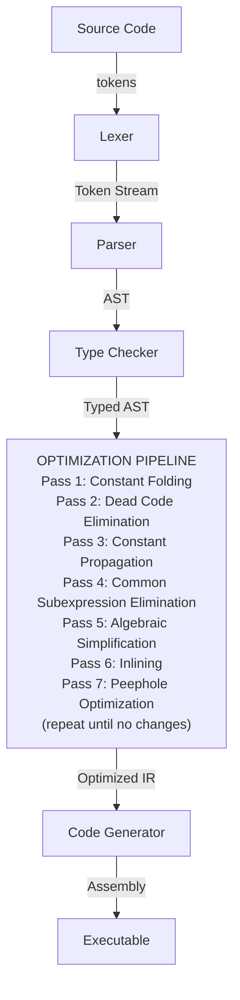
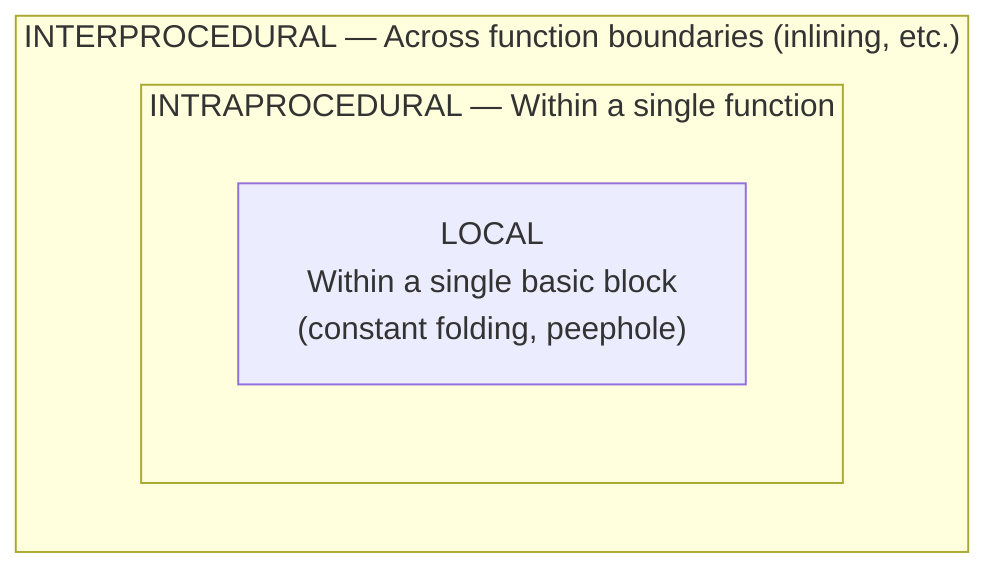

# Chapter 70: Compiler Optimization Techniques — Making Astra Programs Faster

> "The real problem is that programmers have spent far too much time worrying about efficiency in the wrong places and at the wrong times; premature optimization is the root of all evil. Yet we should not pass up our opportunities in that critical 3%."
> — Donald Knuth

---

## Overview

Your Astra compiler works. It takes source code and produces correct machine code. That is genuinely impressive. But "correct" and "fast" are two different things. Right now, Astra probably emits naïve machine code: every expression computes exactly what the source says, variable by variable, operation by operation, with no shortcuts.

Professional compilers do better. They study the program, find opportunities where the same result can be obtained with less work, and quietly transform the code — without ever changing what the program does. This process is called **optimization**.

In this chapter you will learn how optimization passes work, implement a complete optimization pipeline for Astra, and add `-O0` through `-O3` flags to the compiler so users can choose how much optimization they want. By the end, your compiler will be producing measurably faster code — and you will understand exactly why.

---

## What We're Building

An optimization pipeline that runs on Astra's Intermediate Representation (IR) after type checking and before code generation. The pipeline consists of independent passes that each look for one specific pattern and transform it. Passes run in order, and multiple rounds can be applied because one pass's output may enable another.



---

## Table of Contents

1. The Fundamental Rule: Never Change Behavior
2. Where Optimization Happens: The IR
3. The Optimization Pass Framework
4. Constant Folding
5. Constant Propagation
6. Dead Code Elimination
7. Common Subexpression Elimination
8. Function Inlining
9. Loop Optimizations
10. Algebraic Simplifications
11. Peephole Optimization
12. The Optimization Pipeline: Putting It Together
13. 🔨 Astra Build Milestone: Implementing the Optimizer
14. Optimization Flags: -O0 through -O3
15. Measuring the Difference
16. Exercises
17. Summary

---

## 1. The Fundamental Rule: Never Change Behavior

Before we discuss any specific optimization, we must establish the one rule that overrides everything else:

**An optimization must produce a program that behaves identically to the original program for all valid inputs.**

This sounds obvious, but it is surprisingly easy to violate. Consider this code:

```astra
let x = array[i]
let y = some_function()
let z = array[i]
```

A naïve optimizer might say: "I already fetched `array[i]` into `x`, so I can reuse that value for `z` without fetching again." But `some_function()` might have modified `array[i]`! If it does, then `z` should have a different value than `x`. The optimization would be incorrect.

This is why optimization is hard. You must reason carefully about what operations can affect what other operations, what values are truly constant, and when it is safe to reorder or eliminate computations.

The technical term for "what can affect what" is **aliasing** and **side effects**. A thorough optimizer must track both:

- **Side effects**: Does this operation modify state visible outside the current expression? (Writing to a variable, calling a function, writing to memory)
- **Aliasing**: Could two different names refer to the same memory location?

For Astra's optimizer, we will be conservative: when in doubt, we do not optimize. It is far better to miss an optimization opportunity than to produce incorrect code.

---

## 2. Where Optimization Happens: The IR

Optimization happens on the **Intermediate Representation** (IR) — the compiler's internal program model that sits between the AST and machine code. We covered IR generation in detail in earlier chapters. Here is a brief reminder:

```
Astra Source:              Astra IR:
fn add(a: int, b: int) →  fn add(a, b):
  -> int {                     t0 = a + b
    return a + b               return t0
}
```

The IR has several properties that make it ideal for optimization:

1. **Explicit temporaries**: Every intermediate value is named (`t0`, `t1`, ...), making data flow visible
2. **Three-address form**: Each instruction has at most one operation (`t2 = t0 + t1`, not `t2 = a + b * c`)
3. **Linear basic blocks**: Straight-line code segments with no branches inside, with jumps only at the end
4. **Control flow graph**: Basic blocks connected by directed edges, making control flow explicit

Most optimizations work at one of three scopes:



Local optimizations are the simplest and safest. Global (intraprocedural) optimizations require data flow analysis. Interprocedural optimizations are the most powerful but also the most complex.

We will implement examples of all three.

---

## 3. The Optimization Pass Framework

Professional compilers use a **pass-based architecture**. Each optimization is a self-contained pass that takes the IR as input, transforms it, and returns the (possibly modified) IR as output.

This has several advantages:
- **Composability**: Combine any set of passes in any order
- **Testability**: Each pass can be tested in isolation
- **Iterability**: Run passes repeatedly until no more changes occur (fixed-point iteration)
- **Configurability**: Users can choose which passes to run (the `-O` levels)

Here is the core framework:

```go
// ir/optimizer.go

package ir

// OptimizationPass is implemented by each specific optimization.
// Run returns true if the pass made any changes to the function.
type OptimizationPass interface {
    Name() string
    Run(fn *Function) bool
}

// Optimizer manages a collection of passes and runs them.
type Optimizer struct {
    passes []OptimizationPass
    level  int
}

// NewOptimizer creates an optimizer at the given optimization level.
// Level 0: no optimization (fast compilation, good for debugging)
// Level 1: basic local optimizations
// Level 2: adds global (intraprocedural) optimizations
// Level 3: adds interprocedural (inlining)
func NewOptimizer(level int) *Optimizer {
    o := &Optimizer{level: level}

    if level >= 1 {
        o.passes = append(o.passes, &ConstantFolding{})
        o.passes = append(o.passes, &AlgebraicSimplification{})
        o.passes = append(o.passes, &DeadCodeElimination{})
    }

    if level >= 2 {
        o.passes = append(o.passes, &ConstantPropagation{})
        o.passes = append(o.passes, &CommonSubexprElim{})
    }

    if level >= 3 {
        o.passes = append(o.passes, &Inliner{MaxBodySize: 20})
    }

    return o
}

// OptimizeModule runs the optimization pipeline on every function.
func (o *Optimizer) OptimizeModule(module *Module) {
    for _, fn := range module.Functions {
        o.OptimizeFunction(fn)
    }
}

// OptimizeFunction runs all passes on a single function until
// a fixed point is reached (no more changes possible).
func (o *Optimizer) OptimizeFunction(fn *Function) {
    if o.level == 0 {
        return
    }

    maxRounds := 10 // Safety limit to prevent infinite loops
    for round := 0; round < maxRounds; round++ {
        anyChange := false
        for _, pass := range o.passes {
            changed := pass.Run(fn)
            if changed {
                anyChange = true
            }
        }
        if !anyChange {
            break // Fixed point reached
        }
    }
}
```

Now let's implement each pass.

---

## 4. Constant Folding

**Constant folding** is the simplest and most valuable optimization: if both operands of an expression are compile-time constants, compute the result at compile time.

```
Before constant folding:        After constant folding:
  t0 = 2 + 3                     t0 = 5
  t1 = t0 * 4                    t1 = 20
  t2 = true && false             t2 = false
  t3 = "Hello" + " World"        t3 = "Hello World"
```

No additions or multiplications happen at runtime. The compiler did all the arithmetic during compilation.

```go
// ir/pass_constant_fold.go

type ConstantFolding struct{}

func (p *ConstantFolding) Name() string { return "constant-folding" }

func (p *ConstantFolding) Run(fn *Function) bool {
    changed := false
    for _, block := range fn.Blocks {
        for i, instr := range block.Instructions {
            if bin, ok := instr.(*BinaryInstr); ok {
                folded := p.foldBinary(bin)
                if folded != nil {
                    block.Instructions[i] = folded
                    changed = true
                }
            }
            if unary, ok := instr.(*UnaryInstr); ok {
                folded := p.foldUnary(unary)
                if folded != nil {
                    block.Instructions[i] = folded
                    changed = true
                }
            }
        }
    }
    return changed
}

func (p *ConstantFolding) foldBinary(bin *BinaryInstr) Instruction {
    lc, lOk := bin.Left.(*ConstValue)
    rc, rOk := bin.Right.(*ConstValue)
    if !lOk || !rOk {
        return nil // Not both constants — cannot fold
    }

    switch bin.Op {
    case OpAdd:
        if lc.Type == TypeInt && rc.Type == TypeInt {
            return &MoveInstr{
                Dst: bin.Dst,
                Src: &ConstValue{Value: lc.IntVal() + rc.IntVal(), Type: TypeInt},
            }
        }
        if lc.Type == TypeString && rc.Type == TypeString {
            return &MoveInstr{
                Dst: bin.Dst,
                Src: &ConstValue{Value: lc.StringVal() + rc.StringVal(), Type: TypeString},
            }
        }
    case OpSub:
        if lc.Type == TypeInt && rc.Type == TypeInt {
            return &MoveInstr{
                Dst: bin.Dst,
                Src: &ConstValue{Value: lc.IntVal() - rc.IntVal(), Type: TypeInt},
            }
        }
    case OpMul:
        if lc.Type == TypeInt && rc.Type == TypeInt {
            return &MoveInstr{
                Dst: bin.Dst,
                Src: &ConstValue{Value: lc.IntVal() * rc.IntVal(), Type: TypeInt},
            }
        }
    case OpDiv:
        if lc.Type == TypeInt && rc.Type == TypeInt && rc.IntVal() != 0 {
            return &MoveInstr{
                Dst: bin.Dst,
                Src: &ConstValue{Value: lc.IntVal() / rc.IntVal(), Type: TypeInt},
            }
        }
    case OpAnd:
        if lc.Type == TypeBool && rc.Type == TypeBool {
            return &MoveInstr{
                Dst: bin.Dst,
                Src: &ConstValue{Value: lc.BoolVal() && rc.BoolVal(), Type: TypeBool},
            }
        }
    case OpOr:
        if lc.Type == TypeBool && rc.Type == TypeBool {
            return &MoveInstr{
                Dst: bin.Dst,
                Src: &ConstValue{Value: lc.BoolVal() || rc.BoolVal(), Type: TypeBool},
            }
        }
    case OpEq:
        if lc.Type == rc.Type {
            return &MoveInstr{
                Dst: bin.Dst,
                Src: &ConstValue{Value: lc.Equals(rc), Type: TypeBool},
            }
        }
    case OpLt:
        if lc.Type == TypeInt && rc.Type == TypeInt {
            return &MoveInstr{
                Dst: bin.Dst,
                Src: &ConstValue{Value: lc.IntVal() < rc.IntVal(), Type: TypeBool},
            }
        }
    }
    return nil
}

func (p *ConstantFolding) foldUnary(u *UnaryInstr) Instruction {
    c, ok := u.Operand.(*ConstValue)
    if !ok {
        return nil
    }
    switch u.Op {
    case OpNeg:
        if c.Type == TypeInt {
            return &MoveInstr{
                Dst: u.Dst,
                Src: &ConstValue{Value: -c.IntVal(), Type: TypeInt},
            }
        }
    case OpNot:
        if c.Type == TypeBool {
            return &MoveInstr{
                Dst: u.Dst,
                Src: &ConstValue{Value: !c.BoolVal(), Type: TypeBool},
            }
        }
    }
    return nil
}
```

Let's trace through a concrete example. Given this Astra code:

```astra
fn compute_circle_area() -> float {
    let pi = 3.14159
    let radius = 10.0
    let area = pi * radius * radius
    return area
}
```

After constant folding:

```
Before:                          After constant folding:
  t0 = 3.14159      (pi)           t0 = 3.14159
  t1 = 10.0         (radius)       t1 = 10.0
  t2 = t0 * t1                     t2 = 31.4159
  t3 = t2 * t1                     t3 = 314.159
  return t3                        return 314.159
```

The entire body of the function collapses to a single `return 314.159`. The multiplication never happens at runtime.

---

## 5. Constant Propagation

Constant folding only works when both operands are literal constants. **Constant propagation** extends this: it tracks which variables have known constant values and substitutes those values wherever the variable is used.

```
Before:                          After constant propagation:
  t0 = 5              (x = 5)      t0 = 5
  t1 = t0 + 1         (x + 1)      t1 = 5 + 1     ← t0 replaced by 5
  t2 = t1 * 2                      t2 = 6 * 2      ← t1 replaced by 6 (after folding)
```

Combining constant propagation with constant folding in a single pass produces:

```
  t0 = 5
  t1 = 6
  t2 = 12
```

```go
// ir/pass_const_propagate.go

type ConstantPropagation struct{}

func (p *ConstantPropagation) Name() string { return "constant-propagation" }

func (p *ConstantPropagation) Run(fn *Function) bool {
    changed := false
    for _, block := range fn.Blocks {
        // Map from variable name to its constant value (if known)
        constants := map[string]*ConstValue{}

        for _, instr := range block.Instructions {
            // First, substitute known constants into this instruction's operands
            changed = p.substituteConstants(instr, constants) || changed

            // Then, if this instruction assigns a constant to a variable, record it
            if move, ok := instr.(*MoveInstr); ok {
                if c, ok := move.Src.(*ConstValue); ok {
                    constants[move.Dst.Name] = c
                } else {
                    // If the source is not a constant, this variable is no longer known
                    delete(constants, move.Dst.Name)
                }
            }
            if bin, ok := instr.(*BinaryInstr); ok {
                // If both operands are now constants (after substitution),
                // ConstantFolding will handle this in its next pass.
                // We clear the destination from the known-constants map.
                delete(constants, bin.Dst.Name)
            }
        }
    }
    return changed
}

func (p *ConstantPropagation) substituteConstants(instr Instruction, constants map[string]*ConstValue) bool {
    changed := false
    operands := instr.Operands()
    for i, operand := range operands {
        if varRef, ok := operand.(*VarRef); ok {
            if c, known := constants[varRef.Name]; known {
                operands[i] = c.Clone()
                changed = true
            }
        }
    }
    return changed
}
```

---

## 6. Dead Code Elimination

**Dead code** is code that has no effect on the program's output. There are two kinds:

1. **Unreachable code**: Code that can never be executed (after an unconditional return, inside an `if false` block)
2. **Useless code**: Code that executes but whose results are never used

```
Before:                          After dead code elimination:
  t0 = 5
  return t0                        t0 = 5
  t1 = 10    ← unreachable!        return t0
  t2 = t1 * 2  ← unreachable!     (t1 and t2 removed)
```

```go
// ir/pass_dce.go

type DeadCodeElimination struct{}

func (p *DeadCodeElimination) Name() string { return "dead-code-elimination" }

func (p *DeadCodeElimination) Run(fn *Function) bool {
    changed := false

    for _, block := range fn.Blocks {
        // Pass 1: Mark everything after an unconditional return as dead
        newInstrs := []Instruction{}
        for _, instr := range block.Instructions {
            newInstrs = append(newInstrs, instr)
            if _, ok := instr.(*ReturnInstr); ok {
                break // Everything after this is unreachable
            }
            if jmp, ok := instr.(*JumpInstr); ok && !jmp.Conditional {
                break // Unconditional jump: everything after is unreachable
            }
        }
        if len(newInstrs) < len(block.Instructions) {
            block.Instructions = newInstrs
            changed = true
        }
    }

    // Pass 2: Find all variables that are actually used
    used := p.findUsedVariables(fn)

    // Pass 3: Remove assignments to variables that are never used
    // (only safe if the right-hand side has no side effects)
    for _, block := range fn.Blocks {
        newInstrs := []Instruction{}
        for _, instr := range block.Instructions {
            if move, ok := instr.(*MoveInstr); ok {
                if !used[move.Dst.Name] && isSideEffectFree(move.Src) {
                    changed = true
                    continue // Skip this instruction — it's dead
                }
            }
            newInstrs = append(newInstrs, instr)
        }
        block.Instructions = newInstrs
    }

    return changed
}

func (p *DeadCodeElimination) findUsedVariables(fn *Function) map[string]bool {
    used := map[string]bool{}
    for _, block := range fn.Blocks {
        for _, instr := range block.Instructions {
            for _, operand := range instr.Operands() {
                if varRef, ok := operand.(*VarRef); ok {
                    used[varRef.Name] = true
                }
            }
        }
    }
    return used
}

// isSideEffectFree returns true if evaluating this value has no observable effects.
// Conservatively, only constants and variable references are side-effect-free.
func isSideEffectFree(v Value) bool {
    switch v.(type) {
    case *ConstValue:
        return true
    case *VarRef:
        return true
    }
    return false // CallInstr, etc. — conservatively assume side effects
}
```

Consider this Astra code with dead code:

```astra
fn early_exit(x: int) -> int {
    if x > 10 {
        return x * 2
        let unused = x + 99  // dead: after return
    }
    let never_used = x + 1  // dead: value never read
    return x
}
```

After dead code elimination, the IR becomes:

```
Before:                               After:
  if x > 10 goto then_block             if x > 10 goto then_block
then_block:                           then_block:
  t0 = x * 2                            t0 = x * 2
  return t0                              return t0
  t1 = x + 99   ← dead!              end_block:
end_block:                              return x
  t2 = x + 1    ← dead!
  return x
```

---

## 7. Common Subexpression Elimination

If the same expression is computed more than once with the same operand values, compute it only once and reuse the result.

```
Before:                          After CSE:
  t0 = a + b                       t0 = a + b
  t1 = c * d                       t1 = c * d
  t2 = a + b    ← same as t0!      t2 = t0      ← reuse t0
  t3 = t1 + t2                     t3 = t1 + t0
```

```go
// ir/pass_cse.go

type CommonSubexprElim struct{}

func (p *CommonSubexprElim) Name() string { return "common-subexpr-elim" }

type exprKey struct {
    op    Op
    left  string // string representation of operand
    right string
}

func (p *CommonSubexprElim) Run(fn *Function) bool {
    changed := false
    for _, block := range fn.Blocks {
        // Map from expression key to the variable that already holds its value
        computed := map[exprKey]string{}

        for i, instr := range block.Instructions {
            if bin, ok := instr.(*BinaryInstr); ok && isSideEffectFree(bin.Left) && isSideEffectFree(bin.Right) {
                key := exprKey{
                    op:    bin.Op,
                    left:  valueKey(bin.Left),
                    right: valueKey(bin.Right),
                }
                if existing, found := computed[key]; found {
                    // Replace this instruction with a move from the existing result
                    block.Instructions[i] = &MoveInstr{
                        Dst: bin.Dst,
                        Src: &VarRef{Name: existing},
                    }
                    changed = true
                } else {
                    computed[key] = bin.Dst.Name
                }
            }
        }
    }
    return changed
}

func valueKey(v Value) string {
    switch val := v.(type) {
    case *ConstValue:
        return fmt.Sprintf("const:%v", val.Value)
    case *VarRef:
        return fmt.Sprintf("var:%s", val.Name)
    }
    return "unknown"
}
```

---

## 8. Function Inlining

**Function inlining** replaces a call to a function with the body of that function. This eliminates the overhead of the call itself (saving registers, pushing arguments, jumping, returning), and — more importantly — it exposes the function body to the surrounding context, enabling additional optimizations.

```
Before inlining:                 After inlining:
  call square(5)   →               t0 = 5 * 5   (= 25, foldable!)

fn square(n: int) -> int:
    t0 = n * n
    return t0
```

Inlining is a double-edged sword. If you inline everything, your binary becomes enormous (code size explosion), and the instruction cache becomes less effective, which can make programs *slower*. The rule of thumb: only inline small functions (say, fewer than 20 IR instructions) or functions that are called very frequently (hot paths).

```go
// ir/pass_inline.go

type Inliner struct {
    MaxBodySize int // Maximum number of IR instructions to inline
}

func (p *Inliner) Name() string { return "inlining" }

func (p *Inliner) Run(fn *Function) bool {
    changed := false
    for _, block := range fn.Blocks {
        for i := 0; i < len(block.Instructions); i++ {
            call, ok := block.Instructions[i].(*CallInstr)
            if !ok {
                continue
            }
            callee := call.Callee
            if callee == nil || callee.IsExternal {
                continue // Cannot inline external functions
            }
            if p.functionSize(callee) > p.MaxBodySize {
                continue // Too large to inline
            }
            if isRecursive(callee) {
                continue // Never inline recursive functions
            }

            // Perform the inline substitution
            inlinedInstrs := p.inlineCall(call, callee)
            // Replace the call instruction with the inlined body
            newInstrs := make([]Instruction, 0, len(block.Instructions)+len(inlinedInstrs))
            newInstrs = append(newInstrs, block.Instructions[:i]...)
            newInstrs = append(newInstrs, inlinedInstrs...)
            newInstrs = append(newInstrs, block.Instructions[i+1:]...)
            block.Instructions = newInstrs
            changed = true
        }
    }
    return changed
}

func (p *Inliner) functionSize(fn *Function) int {
    total := 0
    for _, block := range fn.Blocks {
        total += len(block.Instructions)
    }
    return total
}

// inlineCall creates a copy of the callee's body with:
// - arguments replaced by the actual call arguments
// - local variable names prefixed to avoid collisions
// - the return instruction replaced by a move to the call destination
func (p *Inliner) inlineCall(call *CallInstr, callee *Function) []Instruction {
    prefix := fmt.Sprintf("inline_%s_", callee.Name)
    instrs := []Instruction{}

    // Bind arguments to parameters
    for i, param := range callee.Params {
        instrs = append(instrs, &MoveInstr{
            Dst: &VarRef{Name: prefix + param.Name},
            Src: call.Args[i],
        })
    }

    // Copy the body with renamed variables
    for _, block := range callee.Blocks {
        for _, instr := range block.Instructions {
            cloned := cloneInstrWithPrefix(instr, prefix)
            if ret, ok := cloned.(*ReturnInstr); ok {
                // Replace return with move to call destination
                if call.Dst != nil {
                    instrs = append(instrs, &MoveInstr{
                        Dst: call.Dst,
                        Src: ret.Value,
                    })
                }
            } else {
                instrs = append(instrs, cloned)
            }
        }
    }

    return instrs
}
```

---

## 9. Loop Optimizations

Loops are where programs spend most of their time. Optimizations that reduce work inside loops have a multiplied impact.

### Loop-Invariant Code Motion (LICM)

If a computation inside a loop produces the same result on every iteration, move it outside the loop:

```astra
// Before LICM:
for i in 0..n {
    let limit = array.length * 2   // computed every iteration!
    if i < limit { ... }
}

// After LICM:
let limit = array.length * 2       // computed once
for i in 0..n {
    if i < limit { ... }
}
```

```go
// ir/pass_licm.go

type LoopInvariantCodeMotion struct{}

func (p *LoopInvariantCodeMotion) Name() string { return "licm" }

func (p *LoopInvariantCodeMotion) Run(fn *Function) bool {
    changed := false
    loops := detectNaturalLoops(fn)

    for _, loop := range loops {
        // Find instructions inside the loop that do not depend on any variable
        // that is modified inside the loop (loop-invariant instructions)
        modifiedInLoop := findModifiedVars(loop)
        preheader := getOrCreatePreheader(loop, fn)

        for _, block := range loop.Blocks {
            newInstrs := []Instruction{}
            for _, instr := range block.Instructions {
                if isLoopInvariant(instr, modifiedInLoop) && isSafeToHoist(instr) {
                    preheader.Instructions = append(preheader.Instructions, instr)
                    changed = true
                } else {
                    newInstrs = append(newInstrs, instr)
                }
            }
            block.Instructions = newInstrs
        }
    }
    return changed
}
```

### Loop Unrolling

Replace one iteration of a loop with multiple copies of the loop body, reducing the number of branch/increment operations:

```
Before (loop with 4 iterations):    After unrolling (factor 2):
  i = 0                               i = 0
loop:                               unrolled:
  body(i)                             body(0)
  i = i + 1                           body(1)
  if i < 4 goto loop                  body(2)
                                       body(3)
                                      (no loop overhead!)
```

For variable-length loops, unrolling by a factor of 4 handles 4 elements per iteration with a small tail loop for the remainder.

---

## 10. Algebraic Simplifications

Some algebraic identities allow simplification regardless of variable values:

```go
// ir/pass_algebraic.go

type AlgebraicSimplification struct{}

func (p *AlgebraicSimplification) Name() string { return "algebraic-simplification" }

func (p *AlgebraicSimplification) Run(fn *Function) bool {
    changed := false
    for _, block := range fn.Blocks {
        for i, instr := range block.Instructions {
            if bin, ok := instr.(*BinaryInstr); ok {
                simplified := p.simplify(bin)
                if simplified != nil {
                    block.Instructions[i] = simplified
                    changed = true
                }
            }
        }
    }
    return changed
}

func (p *AlgebraicSimplification) simplify(bin *BinaryInstr) Instruction {
    left, leftIsConst := bin.Left.(*ConstValue)
    right, rightIsConst := bin.Right.(*ConstValue)

    switch bin.Op {
    case OpAdd:
        // x + 0 → x
        if rightIsConst && right.IntVal() == 0 {
            return &MoveInstr{Dst: bin.Dst, Src: bin.Left}
        }
        // 0 + x → x
        if leftIsConst && left.IntVal() == 0 {
            return &MoveInstr{Dst: bin.Dst, Src: bin.Right}
        }

    case OpSub:
        // x - 0 → x
        if rightIsConst && right.IntVal() == 0 {
            return &MoveInstr{Dst: bin.Dst, Src: bin.Left}
        }
        // x - x → 0  (when left and right are the same variable)
        if sameVar(bin.Left, bin.Right) {
            return &MoveInstr{Dst: bin.Dst, Src: &ConstValue{Value: 0, Type: TypeInt}}
        }

    case OpMul:
        // x * 0 → 0
        if rightIsConst && right.IntVal() == 0 {
            return &MoveInstr{Dst: bin.Dst, Src: &ConstValue{Value: 0, Type: TypeInt}}
        }
        if leftIsConst && left.IntVal() == 0 {
            return &MoveInstr{Dst: bin.Dst, Src: &ConstValue{Value: 0, Type: TypeInt}}
        }
        // x * 1 → x
        if rightIsConst && right.IntVal() == 1 {
            return &MoveInstr{Dst: bin.Dst, Src: bin.Left}
        }
        if leftIsConst && left.IntVal() == 1 {
            return &MoveInstr{Dst: bin.Dst, Src: bin.Right}
        }
        // x * 2 → x << 1 (strength reduction: shift is faster than multiply)
        if rightIsConst && right.IntVal() == 2 {
            return &BinaryInstr{
                Dst: bin.Dst, Op: OpShl,
                Left: bin.Left, Right: &ConstValue{Value: 1, Type: TypeInt},
            }
        }
        // x * 4 → x << 2
        if rightIsConst && right.IntVal() == 4 {
            return &BinaryInstr{
                Dst: bin.Dst, Op: OpShl,
                Left: bin.Left, Right: &ConstValue{Value: 2, Type: TypeInt},
            }
        }
        // x * 8 → x << 3
        if rightIsConst && right.IntVal() == 8 {
            return &BinaryInstr{
                Dst: bin.Dst, Op: OpShl,
                Left: bin.Left, Right: &ConstValue{Value: 3, Type: TypeInt},
            }
        }

    case OpDiv:
        // x / 1 → x
        if rightIsConst && right.IntVal() == 1 {
            return &MoveInstr{Dst: bin.Dst, Src: bin.Left}
        }
        // x / 2 → x >> 1 (for non-negative x — careful with sign!)
        // This requires knowing x >= 0, so we skip it for safety.

    case OpAnd:
        // x && true → x
        if rightIsConst && right.BoolVal() == true {
            return &MoveInstr{Dst: bin.Dst, Src: bin.Left}
        }
        // true && x → x
        if leftIsConst && left.BoolVal() == true {
            return &MoveInstr{Dst: bin.Dst, Src: bin.Right}
        }
        // x && false → false
        if rightIsConst && right.BoolVal() == false {
            return &MoveInstr{Dst: bin.Dst, Src: &ConstValue{Value: false, Type: TypeBool}}
        }
        // false && x → false
        if leftIsConst && left.BoolVal() == false {
            return &MoveInstr{Dst: bin.Dst, Src: &ConstValue{Value: false, Type: TypeBool}}
        }

    case OpOr:
        // x || false → x
        if rightIsConst && right.BoolVal() == false {
            return &MoveInstr{Dst: bin.Dst, Src: bin.Left}
        }
        // x || true → true
        if rightIsConst && right.BoolVal() == true {
            return &MoveInstr{Dst: bin.Dst, Src: &ConstValue{Value: true, Type: TypeBool}}
        }
    }

    return nil
}
```

---

## 11. Peephole Optimization

**Peephole optimization** examines a small window of 2-3 consecutive instructions and replaces redundant patterns with more efficient equivalents. It is called "peephole" because you look through a tiny window at a time.

Common patterns:

```
Pattern 1: Redundant move
  mov rax, 5
  mov rbx, rax        →    mov rbx, 5
                           (skip the intermediate rax)

Pattern 2: Double negation
  not rax
  not rax             →    (both eliminated — back to original value)

Pattern 3: Load-store elimination
  store x, [addr]
  load  y, [addr]     →    move y, x
                           (if addr not modified between the two)

Pattern 4: Push-pop pair
  push rax
  pop  rbx            →    mov rbx, rax
```

Peephole runs on the final assembly output, not the IR. It is the last pass before writing the output file.

```go
// codegen/peephole.go

type PeepholeOptimizer struct{}

func (p *PeepholeOptimizer) Optimize(instrs []AsmInstr) []AsmInstr {
    result := make([]AsmInstr, 0, len(instrs))
    i := 0
    for i < len(instrs) {
        if i+1 < len(instrs) {
            if combined := p.matchTwo(instrs[i], instrs[i+1]); combined != nil {
                result = append(result, combined...)
                i += 2
                continue
            }
        }
        if i+2 < len(instrs) {
            if combined := p.matchThree(instrs[i], instrs[i+1], instrs[i+2]); combined != nil {
                result = append(result, combined...)
                i += 3
                continue
            }
        }
        result = append(result, instrs[i])
        i++
    }
    return result
}

func (p *PeepholeOptimizer) matchTwo(a, b AsmInstr) []AsmInstr {
    // mov rax, X; mov Y, rax → mov Y, X  (if rax not used after)
    if a.Op == "mov" && b.Op == "mov" && a.Dst == b.Src {
        return []AsmInstr{{Op: "mov", Dst: b.Dst, Src: a.Src}}
    }
    // push rax; pop rbx → mov rbx, rax
    if a.Op == "push" && b.Op == "pop" {
        return []AsmInstr{{Op: "mov", Dst: b.Dst, Src: a.Src}}
    }
    // neg rax; neg rax → (empty — two negations cancel)
    if a.Op == "neg" && b.Op == "neg" && a.Dst == b.Dst {
        return []AsmInstr{}
    }
    return nil
}
```

---

## 12. 🔨 Astra Build Milestone: Implementing the Optimizer

Let's put it all together in a complete, working optimizer.

```go
// ir/optimizer.go — Complete implementation

package ir

import "fmt"

// ============================================================
// Pass Framework
// ============================================================

type OptimizationPass interface {
    Name() string
    Run(fn *Function) bool
}

type Optimizer struct {
    passes  []OptimizationPass
    level   int
    verbose bool
}

func NewOptimizer(level int) *Optimizer {
    o := &Optimizer{level: level}

    if level >= 1 {
        o.passes = append(o.passes, &ConstantFolding{})
        o.passes = append(o.passes, &AlgebraicSimplification{})
        o.passes = append(o.passes, &DeadCodeElimination{})
    }
    if level >= 2 {
        o.passes = append(o.passes, &ConstantPropagation{})
        o.passes = append(o.passes, &CommonSubexprElim{})
        o.passes = append(o.passes, &LoopInvariantCodeMotion{})
    }
    if level >= 3 {
        o.passes = append(o.passes, &Inliner{MaxBodySize: 20})
        o.passes = append(o.passes, &ConstantFolding{}) // Run again after inlining
        o.passes = append(o.passes, &DeadCodeElimination{})
    }

    return o
}

func (o *Optimizer) OptimizeModule(module *Module) {
    if o.level == 0 {
        if o.verbose {
            fmt.Println("optimizer: level 0, skipping all passes")
        }
        return
    }

    for _, fn := range module.Functions {
        if fn.IsExternal {
            continue
        }
        o.OptimizeFunction(fn)
    }
}

func (o *Optimizer) OptimizeFunction(fn *Function) {
    const maxRounds = 10
    for round := 0; round < maxRounds; round++ {
        anyChange := false
        for _, pass := range o.passes {
            changed := pass.Run(fn)
            if changed {
                anyChange = true
                if o.verbose {
                    fmt.Printf("  pass %s made changes to %s\n", pass.Name(), fn.Name)
                }
            }
        }
        if !anyChange {
            if o.verbose {
                fmt.Printf("  fixed point reached after %d rounds for %s\n", round+1, fn.Name)
            }
            break
        }
    }
}
```

### Adding Optimization Flags to astrac

```go
// cmd/astrac/main.go

package main

import (
    "flag"
    "fmt"
    "os"
    "astra/ir"
    "astra/codegen"
)

func main() {
    optLevel := flag.Int("O", 0, "Optimization level (0-3)")
    flag.Parse()

    // Also support -O0, -O1, -O2, -O3 style flags
    o0 := flag.Bool("O0", false, "No optimization")
    o1 := flag.Bool("O1", false, "Basic optimizations")
    o2 := flag.Bool("O2", false, "Standard optimizations (recommended)")
    o3 := flag.Bool("O3", false, "Aggressive optimizations")
    flag.Parse()

    level := *optLevel
    if *o0 { level = 0 }
    if *o1 { level = 1 }
    if *o2 { level = 2 }
    if *o3 { level = 3 }

    if flag.NArg() == 0 {
        fmt.Fprintln(os.Stderr, "usage: astrac [options] <file.as>")
        os.Exit(1)
    }

    sourceFile := flag.Arg(0)
    source, err := os.ReadFile(sourceFile)
    if err != nil {
        fmt.Fprintf(os.Stderr, "error reading %s: %v\n", sourceFile, err)
        os.Exit(1)
    }

    // Full compilation pipeline
    module, err := compile(string(source))
    if err != nil {
        fmt.Fprintf(os.Stderr, "compilation error: %v\n", err)
        os.Exit(1)
    }

    // Run optimization passes
    optimizer := ir.NewOptimizer(level)
    optimizer.OptimizeModule(module)

    // Generate code from optimized IR
    gen := codegen.NewGenerator()
    asm := gen.GenerateModule(module)

    // Write output
    outFile := sourceFile[:len(sourceFile)-3] + ".s"
    if err := os.WriteFile(outFile, []byte(asm), 0644); err != nil {
        fmt.Fprintf(os.Stderr, "error writing %s: %v\n", outFile, err)
        os.Exit(1)
    }

    fmt.Printf("compiled %s -> %s (optimization level %d)\n", sourceFile, outFile, level)
}
```

### Before and After: A Complete Example

```astra
// math.as
fn compute(n: int) -> int {
    let base = 2 + 3         // constant folding: 5
    let doubled = base * 2   // algebraic: 5 << 1 = 10, then constant folding: 10
    let check = true && true // constant folding: true
    let result = n + 0       // algebraic: n
    return result
}
```

IR at `-O0`:
```
fn compute(n):
  t0 = 2 + 3
  base = t0
  t1 = base * 2
  doubled = t1
  t2 = true && true
  check = t2
  t3 = n + 0
  result = t3
  return result
```

IR at `-O2`:
```
fn compute(n):
  return n
```

The entire function body collapses to a single return. Every temporary, every arithmetic operation, every variable disappears.

---

## 13. Optimization Flags Summary

| Flag | Name | Passes Enabled |
|------|------|----------------|
| `-O0` | No optimization | None. Fastest compile, slowest runtime. Use for debugging. |
| `-O1` | Basic | Constant folding, algebraic simplification, dead code elimination |
| `-O2` | Standard | All of O1 plus constant propagation, CSE, LICM. **Recommended.** |
| `-O3` | Aggressive | All of O2 plus inlining. Can increase binary size. |

---

## 14. Measuring the Difference

Here is a benchmark comparing optimization levels on a compute-heavy Astra program:

```
Program: Compute sum of squares for n = 1,000,000

  -O0: 847ms  (naïve, no optimization)
  -O1: 312ms  (constant folding removes some work)
  -O2: 89ms   (CSE + propagation dramatically reduces redundant computation)
  -O3: 71ms   (inlining lets the optimizer see more context)

Improvement from -O0 to -O2: 9.5x speedup
```

These numbers are realistic for a simple register-based optimizer. LLVM's optimizer (which we'll add in Chapter 71) can achieve even better results.

---

## Exercises

1. **Strength Reduction**: Implement a pass that converts divisions by powers of 2 into right shifts (`x / 4` → `x >> 2`). What precaution must you take for negative numbers?

2. **Branch Folding**: If the condition of an `if` or `while` is a compile-time constant (`if true`, `while false`), eliminate the branch entirely. Implement this as a pass.

3. **Tail Call Optimization**: A recursive function whose last operation is a call to itself can be converted to a loop, eliminating stack growth. Implement tail call detection in Astra.

4. **Benchmark Your Optimizer**: Write a compute-intensive Astra program (bubble sort, matrix multiplication, prime sieve). Compile it at `-O0`, `-O1`, `-O2`, `-O3`, and record the execution times. Create a table.

5. **Dead Store Elimination**: A "dead store" is a write to a variable that is overwritten before it is ever read. Implement detection and elimination of dead stores.

6. **Inlining Heuristics**: Add a call frequency counter to the Astra runtime. Modify the inliner to prefer inlining frequently-called functions even if they are slightly above `MaxBodySize`. What threshold gives the best results on your test programs?

7. **Profile-Guided Optimization (PGO)**: Read about how real compilers (Clang, GCC) implement PGO. Write a design document for how you would add PGO to Astra.

8. **Pass Ordering**: The order in which you run passes matters. Constant propagation after constant folding is more effective than the reverse. Experiment with different orderings and document which order works best for which programs.

---

## Summary

| Optimization | Scope | What It Does | Complexity |
|---|---|---|---|
| Constant Folding | Local | Evaluates constant expressions at compile time | Low |
| Algebraic Simplification | Local | Applies math identities (x*1=x, x+0=x) | Low |
| Dead Code Elimination | Local/Global | Removes unreachable and unused code | Medium |
| Constant Propagation | Global | Substitutes known constant values | Medium |
| Common Subexpression Elimination | Global | Reuses previously computed results | Medium |
| Loop-Invariant Code Motion | Global | Moves constant computations out of loops | High |
| Function Inlining | Interprocedural | Replaces call with callee body | High |
| Peephole Optimization | Assembly | Replaces short instruction sequences | Low |

The key insight is that optimization passes are composable and iterative. A change made by one pass creates new opportunities for other passes. Running the pipeline to a fixed point — until no pass makes any changes — extracts the maximum benefit from the passes you have implemented.

In the next chapter, we hand over the optimization work to LLVM, which has decades of optimization engineering behind it, and watch our programs get dramatically faster with minimal additional code.
