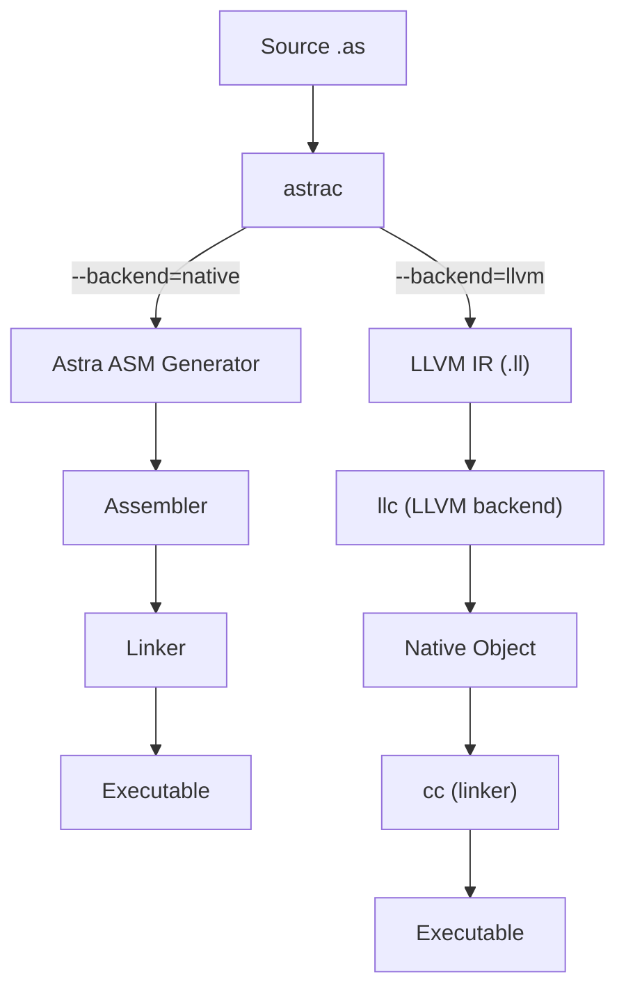
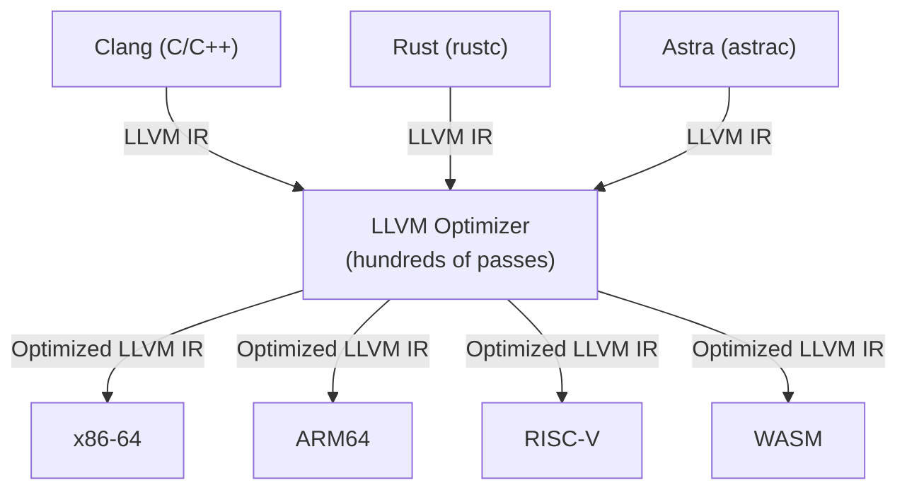
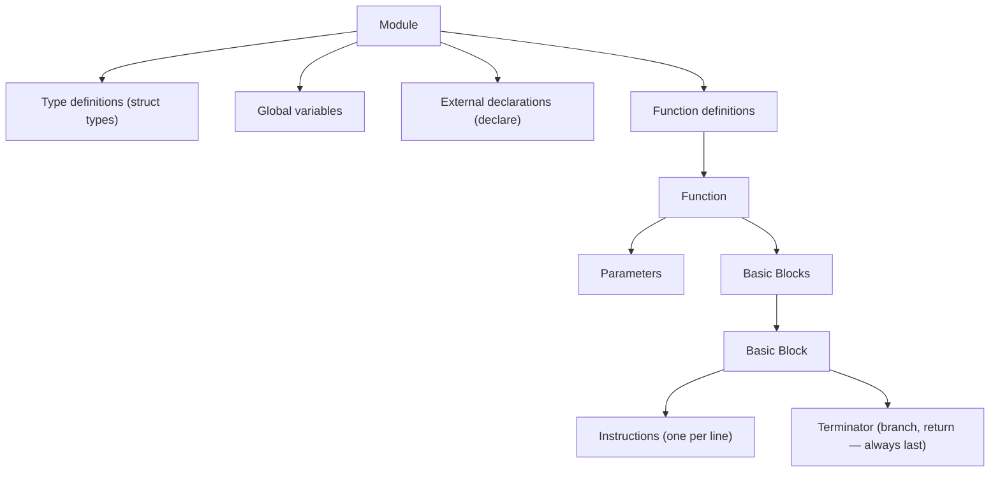

# Chapter 71: LLVM — The Professional Approach to Code Generation

> "A programming language is just a special-purpose compiler." — The LLVM Project Tagline

---

## Overview

In previous chapters you built Astra's code generator by hand: you wrote Go code that translated Astra IR into x86-64 assembly, instruction by instruction. That approach is deeply educational — it forces you to understand exactly what every instruction does. But professional compiler engineers rarely do it that way. Instead, they use **LLVM**.

LLVM (Low Level Virtual Machine) is a collection of reusable, modular compiler infrastructure. It is not a single tool — it is a library of tools and algorithms that handle the hard parts of code generation: instruction selection, register allocation, scheduling, and target-specific optimization. When you use LLVM, you get high-quality code generation for x86-64, ARM, RISC-V, WebAssembly, and many other targets essentially for free.

In this chapter, you will learn what LLVM is, how its IR works, and how to add an LLVM backend to Astra. By the end, you can compile Astra programs to LLVM IR and let LLVM handle the rest — producing code that rivals what Clang (the C compiler built on LLVM) would produce.

---

## What We're Building

An alternate code generation backend for astrac. When invoked with `--llvm`, the compiler emits LLVM IR (a `.ll` text file) instead of Astra's hand-written assembly. LLVM's tools then compile that IR to a native binary.



---

## Table of Contents

1. What Is LLVM?
2. The LLVM Architecture
3. Languages Built on LLVM
4. LLVM IR: A Deep Dive
5. LLVM IR Structure: Modules, Functions, Basic Blocks
6. LLVM Types
7. SSA Form: Why LLVM IR Is Structured This Way
8. Mapping Astra IR to LLVM IR
9. Installing LLVM
10. Using the llir/llvm Go Bindings
11. 🔨 Astra Build Milestone: The LLVM Backend
12. A Complete Hello World in LLVM IR
13. Compiling LLVM IR to a Binary
14. LLVM Tools Reference
15. Performance Comparison: Native vs LLVM Backend
16. Advanced LLVM Features
17. Exercises
18. Summary

---

## 1. What Is LLVM?

LLVM began as a research project at the University of Illinois at Urbana-Champaign in 2000. Chris Lattner (who later also designed Swift) built it as a modular, reusable compiler infrastructure. The name "Low Level Virtual Machine" is somewhat misleading today — LLVM has grown far beyond that original scope.

Today, LLVM is:
- A **compiler backend**: takes LLVM IR and produces native machine code for dozens of targets
- A **set of optimization passes**: hundreds of transformations from simple peephole to complex interprocedural analysis
- A **library ecosystem**: everything from a linker (lld) to a debugger (lldb) to a C/C++ compiler (Clang)
- An **IR specification**: LLVM IR is a well-documented, stable format that many language compilers target

Apple uses LLVM in Xcode for all Swift, Objective-C, and C compilation. Google uses it in Chrome. LLVM is the backbone of Rust, Swift, Kotlin Native, Julia, and Zig.

The key insight of LLVM's design: separating the front-end (language-specific parsing and analysis) from the back-end (target-specific code generation) with a clean, target-neutral IR in between. Any language that can lower to LLVM IR gets high-quality code generation for every target LLVM supports.



---

## 2. LLVM IR: A Deep Dive

LLVM IR is a full-featured, typed, SSA-form intermediate representation. It exists in three forms:
- **Text format** (`.ll` files): human-readable, looks like a typed assembly language
- **Bitcode** (`.bc` files): compact binary encoding for storage and transmission
- **In-memory format**: the C++ API representation (or Go binding equivalent)

We will work with the text format, which is easiest to understand and generate.

Here is a simple LLVM IR function:

```llvm
; This is a comment in LLVM IR
; All values start with % (local) or @ (global)

define i64 @add(i64 %a, i64 %b) {
entry:
  %result = add i64 %a, %b
  ret i64 %result
}
```

Let's break that down:

- `define`: introduces a function definition
- `i64`: a 64-bit integer type (LLVM's type for Astra's `int`)
- `@add`: the function name (global scope — all globals start with `@`)
- `%a`, `%b`: parameter names (local scope — all locals start with `%`)
- `entry:`: a basic block label (the first basic block is conventionally called `entry`)
- `%result = add i64 %a, %b`: add two i64 values, store result in `%result`
- `ret i64 %result`: return the value

---

## 3. LLVM IR Structure: Modules, Functions, Basic Blocks

LLVM IR has a three-level hierarchy:



```llvm
; ===== MODULE LEVEL =====

; External declaration (no body)
declare i32 @printf(i8* %fmt, ...)

; Global variable (string constant)
@.str = private unnamed_addr constant [14 x i8] c"Hello, LLVM!\0A\00"

; Struct type definition
%struct.Point = type { i64, i64 }    ; { x, y }

; ===== FUNCTION DEFINITION =====
define i64 @fibonacci(i64 %n) {

; === BASIC BLOCK: entry ===
entry:
  %cond = icmp sle i64 %n, 1        ; signed less-than-or-equal
  br i1 %cond, label %base_case, label %recursive_case

; === BASIC BLOCK: base_case ===
base_case:
  ret i64 %n                         ; return n (0 or 1)

; === BASIC BLOCK: recursive_case ===
recursive_case:
  %n_minus_1 = sub i64 %n, 1
  %n_minus_2 = sub i64 %n, 2
  %fib1 = call i64 @fibonacci(i64 %n_minus_1)
  %fib2 = call i64 @fibonacci(i64 %n_minus_2)
  %sum = add i64 %fib1, %fib2
  ret i64 %sum
}
```

---

## 4. LLVM Types

LLVM has a rich type system. Here is how Astra types map to LLVM types:

| Astra Type | LLVM Type | Notes |
|---|---|---|
| `int` | `i64` | 64-bit signed integer |
| `float` | `double` | 64-bit IEEE 754 floating point |
| `bool` | `i1` | 1-bit integer (0 = false, 1 = true) |
| `string` | `i8*` | Pointer to null-terminated UTF-8 bytes |
| `void` | `void` | No return value |
| `[T]` | `%Array` | Pointer to runtime array struct |
| `Point` struct | `%struct.Point` | Named LLVM struct type |
| `fn(int) -> bool` | `i1 (i64)*` | Function pointer type |

```llvm
; LLVM type examples:

i1          ; boolean
i8          ; byte
i32         ; 32-bit integer  
i64         ; 64-bit integer (Astra int)
float       ; 32-bit float
double      ; 64-bit float (Astra float)
i8*         ; pointer to byte (Astra string)
i64*        ; pointer to i64
[10 x i64]  ; array of 10 i64s (fixed size)
{ i64, i8* } ; struct with i64 and pointer
```

---

## 5. SSA Form

LLVM IR is in **Static Single Assignment (SSA)** form. This means every variable is assigned exactly once. If you need to assign a different value to the same "variable", you create a new SSA value with a different name.

This constraint sounds limiting, but it makes optimization algorithms dramatically simpler: data flow is explicit in the IR structure itself.

For variables that change over time (like loop counters), LLVM uses `phi` instructions:

```llvm
; Astra: for i in 0..10 { sum = sum + i }

define i64 @sum_to_n() {
entry:
  br label %loop

loop:
  ; phi: "at this point, i comes from different predecessors"
  %i   = phi i64 [ 0, %entry ],       [ %i_next,   %loop ]
  %sum = phi i64 [ 0, %entry ],       [ %sum_next, %loop ]
  %cond = icmp slt i64 %i, 10
  br i1 %cond, label %loop_body, label %done

loop_body:
  %sum_next = add i64 %sum, %i
  %i_next   = add i64 %i, 1
  br label %loop

done:
  ret i64 %sum
}
```

The `phi` instruction says: "take `%i` from `%entry` (value 0) the first time around, and from `%loop` (value `%i_next`) on subsequent iterations." This is how SSA represents mutable variables without violating the single-assignment rule.

---

## 6. Mapping Astra IR to LLVM IR

Let's systematically go through every Astra IR instruction and show its LLVM equivalent:

```
Astra IR                        LLVM IR
─────────────────────────────────────────────────────────────────
t0 = a + b (int)          →    %t0 = add i64 %a, %b
t0 = a - b (int)          →    %t0 = sub i64 %a, %b
t0 = a * b (int)          →    %t0 = mul i64 %a, %b
t0 = a / b (int)          →    %t0 = sdiv i64 %a, %b    (signed div)
t0 = a % b (int)          →    %t0 = srem i64 %a, %b    (signed rem)
t0 = a + b (float)        →    %t0 = fadd double %a, %b
t0 = a * b (float)        →    %t0 = fmul double %a, %b
t0 = a == b (int)         →    %t0 = icmp eq i64 %a, %b
t0 = a < b  (int)         →    %t0 = icmp slt i64 %a, %b
t0 = a < b  (float)       →    %t0 = fcmp olt double %a, %b
t0 = !a     (bool)        →    %t0 = xor i1 %a, 1
t0 = -a     (int)         →    %t0 = sub i64 0, %a
t0 = 42                   →    (use literal 42 directly in LLVM IR)
t0 = a      (move)        →    ; LLVM has no move; just use %a directly
if t0 goto L1 else L2     →    br i1 %t0, label %L1, label %L2
goto L1                   →    br label %L1
return t0                 →    ret i64 %t0
return (void)             →    ret void
t0 = call f(a, b)         →    %t0 = call i64 @f(i64 %a, i64 %b)
t0 = alloca (local var)   →    %t0 = alloca i64
store t0 -> ptr           →    store i64 %t0, i64* %ptr
t0 = load ptr             →    %t0 = load i64, i64* %ptr
t0 = &array[i]            →    %t0 = getelementptr [T], [T]* %arr, i64 %i
```

---

## 7. Installing LLVM

```bash
# macOS (using Homebrew)
brew install llvm

# Add LLVM to your PATH (add to ~/.zshrc or ~/.bashrc)
export PATH="$(brew --prefix llvm)/bin:$PATH"

# Ubuntu / Debian
apt install llvm clang

# Verify installation
llc --version       # LLVM static compiler
opt --version       # LLVM optimizer
lli --version       # LLVM interpreter
llvm-dis --version  # LLVM disassembler
```

After installation, the key tools are:

| Tool | Purpose |
|---|---|
| `llc` | Compile `.ll` or `.bc` to native assembly or object code |
| `opt` | Run LLVM optimization passes on `.ll` or `.bc` |
| `lli` | Interpret and run LLVM IR directly (useful for debugging) |
| `llvm-as` | Assemble text IR (`.ll`) to bitcode (`.bc`) |
| `llvm-dis` | Disassemble bitcode (`.bc`) to text (`.ll`) |
| `clang` | Compile LLVM IR directly to a native executable (handles linking) |

---

## 8. 🔨 Astra Build Milestone: The LLVM Backend

Here is the complete LLVM backend for astrac. It takes an Astra `*ir.Module` and emits text-format LLVM IR.

```go
// codegen/llvm_backend.go

package codegen

import (
    "fmt"
    "strings"
    "astra/ir"
)

// LLVMBackend emits LLVM IR text format from Astra's IR.
type LLVMBackend struct {
    w      *strings.Builder
    module *ir.Module
    // Counter for generating unique names
    tmpCount int
}

func NewLLVMBackend() *LLVMBackend {
    return &LLVMBackend{}
}

// EmitModule converts an entire Astra IR module to LLVM IR text.
func (b *LLVMBackend) EmitModule(module *ir.Module) string {
    b.w = &strings.Builder{}
    b.module = module

    // Module header
    b.emit("; Generated by Astra Compiler (LLVM backend)")
    b.emit("; Target: x86_64-pc-linux-gnu")
    b.emit("")
    b.emit("target datalayout = \"e-m:e-p270:32:32-p271:32:32-p272:64:64-i64:64-f80:128-n8:16:32:64-S128\"")
    b.emit("target triple = \"x86_64-pc-linux-gnu\"")
    b.emit("")

    // Emit string constants (collected during IR generation)
    for i, str := range module.StringConstants {
        escaped := llvmEscapeString(str)
        length := len(str) + 1 // +1 for null terminator
        b.emit(fmt.Sprintf("@.str%d = private unnamed_addr constant [%d x i8] c\"%s\\00\", align 1", i, length, escaped))
    }
    if len(module.StringConstants) > 0 {
        b.emit("")
    }

    // Emit external declarations
    b.emitExterns()
    b.emit("")

    // Emit struct type definitions
    for _, structDef := range module.Structs {
        b.emitStructType(structDef)
    }
    if len(module.Structs) > 0 {
        b.emit("")
    }

    // Emit each function
    for _, fn := range module.Functions {
        if fn.IsExternal {
            b.emitExternalDecl(fn)
        } else {
            b.emitFunction(fn)
        }
        b.emit("")
    }

    return b.w.String()
}

// emitExterns declares the C runtime functions Astra calls.
func (b *LLVMBackend) emitExterns() {
    b.emit("declare i32 @printf(i8* nocapture, ...)")
    b.emit("declare i8* @malloc(i64)")
    b.emit("declare void @free(i8*)")
    b.emit("declare i8* @memcpy(i8*, i8*, i64)")
    b.emit("declare i64 @strlen(i8*)")
    b.emit("declare i32 @strcmp(i8*, i8*)")
    b.emit("declare void @exit(i32) noreturn")
    // Astra runtime functions
    b.emit("declare void @astra_print_string(i8*)")
    b.emit("declare void @astra_print_int(i64)")
    b.emit("declare void @astra_print_bool(i1)")
    b.emit("declare void @astra_panic(i8*)")
}

// emitStructType emits a named struct type for LLVM IR.
func (b *LLVMBackend) emitStructType(s *ir.StructDef) {
    fields := make([]string, len(s.Fields))
    for i, field := range s.Fields {
        fields[i] = llvmType(field.Type)
    }
    b.emit(fmt.Sprintf("%%struct.%s = type { %s }", s.Name, strings.Join(fields, ", ")))
}

// emitExternalDecl emits a declare statement for an external function.
func (b *LLVMBackend) emitExternalDecl(fn *ir.Function) {
    params := make([]string, len(fn.Params))
    for i, p := range fn.Params {
        params[i] = llvmType(p.Type)
    }
    b.emit(fmt.Sprintf("declare %s @%s(%s)",
        llvmType(fn.ReturnType), fn.Name, strings.Join(params, ", ")))
}

// emitFunction emits a complete LLVM function definition.
func (b *LLVMBackend) emitFunction(fn *ir.Function) {
    // Build parameter list
    params := make([]string, len(fn.Params))
    for i, p := range fn.Params {
        params[i] = fmt.Sprintf("%s %%%s", llvmType(p.Type), p.Name)
    }

    retType := llvmType(fn.ReturnType)
    b.emit(fmt.Sprintf("define %s @%s(%s) {", retType, fn.Name, strings.Join(params, ", ")))

    // Emit each basic block
    for i, block := range fn.Blocks {
        if i == 0 {
            b.emit("entry:")
        } else {
            b.emit(fmt.Sprintf("%s:", block.Label))
        }
        for _, instr := range block.Instructions {
            b.emit("  " + b.emitInstruction(instr))
        }
    }

    b.emit("}")
}

// emitInstruction converts one Astra IR instruction to LLVM IR text.
func (b *LLVMBackend) emitInstruction(instr ir.Instruction) string {
    switch i := instr.(type) {

    case *ir.BinaryInstr:
        op := llvmBinaryOp(i.Op, i.Left.Type())
        lhs := llvmValue(i.Left)
        rhs := llvmValue(i.Right)
        ty := llvmType(i.Left.Type())
        return fmt.Sprintf("%%%s = %s %s %s, %s", i.Dst.Name, op, ty, lhs, rhs)

    case *ir.UnaryInstr:
        switch i.Op {
        case ir.OpNeg:
            ty := llvmType(i.Operand.Type())
            return fmt.Sprintf("%%%s = sub %s 0, %s", i.Dst.Name, ty, llvmValue(i.Operand))
        case ir.OpNot:
            return fmt.Sprintf("%%%s = xor i1 %s, 1", i.Dst.Name, llvmValue(i.Operand))
        }

    case *ir.MoveInstr:
        // In LLVM SSA form, a "move" is just using the source value directly.
        // We implement it as a bitcast (no-op type conversion) if types match.
        ty := llvmType(i.Src.Type())
        src := llvmValue(i.Src)
        return fmt.Sprintf("%%%s = add %s %s, 0 ; move", i.Dst.Name, ty, src)

    case *ir.AllocaInstr:
        ty := llvmType(i.AllocType)
        return fmt.Sprintf("%%%s = alloca %s, align 8", i.Dst.Name, ty)

    case *ir.StoreInstr:
        valTy := llvmType(i.Value.Type())
        return fmt.Sprintf("store %s %s, %s* %%%s, align 8",
            valTy, llvmValue(i.Value), valTy, i.Ptr.Name)

    case *ir.LoadInstr:
        ty := llvmType(i.LoadType)
        return fmt.Sprintf("%%%s = load %s, %s* %%%s, align 8",
            i.Dst.Name, ty, ty, i.Ptr.Name)

    case *ir.CallInstr:
        args := make([]string, len(i.Args))
        for j, arg := range i.Args {
            args[j] = fmt.Sprintf("%s %s", llvmType(arg.Type()), llvmValue(arg))
        }
        argStr := strings.Join(args, ", ")
        retTy := llvmType(i.ReturnType)
        if i.Dst != nil {
            return fmt.Sprintf("%%%s = call %s @%s(%s)", i.Dst.Name, retTy, i.Callee.Name, argStr)
        }
        return fmt.Sprintf("call void @%s(%s)", i.Callee.Name, argStr)

    case *ir.ReturnInstr:
        if i.Value == nil {
            return "ret void"
        }
        ty := llvmType(i.Value.Type())
        return fmt.Sprintf("ret %s %s", ty, llvmValue(i.Value))

    case *ir.BranchInstr:
        if i.Condition == nil {
            return fmt.Sprintf("br label %%%s", i.TrueLabel)
        }
        return fmt.Sprintf("br i1 %s, label %%%s, label %%%s",
            llvmValue(i.Condition), i.TrueLabel, i.FalseLabel)

    case *ir.PhiInstr:
        ty := llvmType(i.Type)
        cases := make([]string, len(i.Incoming))
        for j, inc := range i.Incoming {
            cases[j] = fmt.Sprintf("[ %s, %%%s ]", llvmValue(inc.Value), inc.Block)
        }
        return fmt.Sprintf("%%%s = phi %s %s", i.Dst.Name, ty, strings.Join(cases, ", "))

    case *ir.GEPInstr: // GetElementPtr for array/struct field access
        baseTy := llvmType(i.BaseType)
        return fmt.Sprintf("%%%s = getelementptr %s, %s* %%%s, i64 %s",
            i.Dst.Name, baseTy, baseTy, i.Base.Name, llvmValue(i.Index))
    }

    return "; unknown instruction"
}

// ============================================================
// Type and Value Helpers
// ============================================================

// llvmType converts an Astra type to its LLVM IR type string.
func llvmType(t ir.Type) string {
    switch t {
    case ir.TypeInt:
        return "i64"
    case ir.TypeFloat:
        return "double"
    case ir.TypeBool:
        return "i1"
    case ir.TypeString:
        return "i8*"
    case ir.TypeVoid:
        return "void"
    }
    // Struct types
    if st, ok := t.(*ir.StructType); ok {
        return fmt.Sprintf("%%struct.%s*", st.Name)
    }
    // Array types
    if at, ok := t.(*ir.ArrayType); ok {
        return fmt.Sprintf("[%d x %s]", at.Length, llvmType(at.ElementType))
    }
    return "i64" // fallback
}

// llvmValue converts an Astra IR value to its LLVM IR representation.
func llvmValue(v ir.Value) string {
    switch val := v.(type) {
    case *ir.ConstValue:
        switch val.Type {
        case ir.TypeInt:
            return fmt.Sprintf("%d", val.IntVal())
        case ir.TypeFloat:
            return fmt.Sprintf("%g", val.FloatVal())
        case ir.TypeBool:
            if val.BoolVal() { return "1" }
            return "0"
        case ir.TypeString:
            // Return a getelementptr to the string constant
            return fmt.Sprintf("getelementptr ([%d x i8], [%d x i8]* @.str%d, i64 0, i64 0)",
                len(val.StringVal())+1, len(val.StringVal())+1, val.StringIdx)
        }
    case *ir.VarRef:
        return "%" + val.Name
    }
    return "undef"
}

// llvmBinaryOp converts an Astra binary op to the LLVM instruction mnemonic.
func llvmBinaryOp(op ir.Op, ty ir.Type) string {
    isFloat := ty == ir.TypeFloat
    switch op {
    case ir.OpAdd:
        if isFloat { return "fadd" }
        return "add"
    case ir.OpSub:
        if isFloat { return "fsub" }
        return "sub"
    case ir.OpMul:
        if isFloat { return "fmul" }
        return "mul"
    case ir.OpDiv:
        if isFloat { return "fdiv" }
        return "sdiv"
    case ir.OpMod:
        if isFloat { return "frem" }
        return "srem"
    case ir.OpAnd:
        return "and"
    case ir.OpOr:
        return "or"
    case ir.OpShl:
        return "shl"
    case ir.OpShr:
        return "ashr" // arithmetic (signed) shift right
    case ir.OpEq:
        if isFloat { return "fcmp oeq" }
        return "icmp eq"
    case ir.OpNe:
        if isFloat { return "fcmp one" }
        return "icmp ne"
    case ir.OpLt:
        if isFloat { return "fcmp olt" }
        return "icmp slt"
    case ir.OpLe:
        if isFloat { return "fcmp ole" }
        return "icmp sle"
    case ir.OpGt:
        if isFloat { return "fcmp ogt" }
        return "icmp sgt"
    case ir.OpGe:
        if isFloat { return "fcmp oge" }
        return "icmp sge"
    }
    return "add" // fallback
}

// llvmEscapeString converts a Go string to LLVM's escape format.
func llvmEscapeString(s string) string {
    var b strings.Builder
    for _, c := range []byte(s) {
        if c >= 32 && c < 127 && c != '"' && c != '\\' {
            b.WriteByte(c)
        } else {
            fmt.Fprintf(&b, "\\%02X", c)
        }
    }
    return b.String()
}

func (b *LLVMBackend) emit(line string) {
    b.w.WriteString(line)
    b.w.WriteByte('\n')
}
```

### Adding the LLVM Backend to astrac

```go
// cmd/astrac/main.go (additions)

var backendFlag = flag.String("backend", "native", "Code generation backend: native or llvm")
var llvmFlag    = flag.Bool("llvm", false, "Shorthand for --backend=llvm")

func generateCode(module *ir.Module, outFile string, backend string) error {
    switch backend {
    case "llvm":
        gen := codegen.NewLLVMBackend()
        llvmIR := gen.EmitModule(module)

        // Write the .ll file
        llFile := strings.TrimSuffix(outFile, ".s") + ".ll"
        if err := os.WriteFile(llFile, []byte(llvmIR), 0644); err != nil {
            return err
        }

        // Run llc to compile to native assembly
        cmd := exec.Command("llc", "-O2", "-filetype=obj", llFile, "-o", outFile+".o")
        if out, err := cmd.CombinedOutput(); err != nil {
            return fmt.Errorf("llc failed: %s\n%s", err, out)
        }

        // Link with cc
        cmd = exec.Command("cc", outFile+".o", "-o", outFile, "-lastra_runtime")
        if out, err := cmd.CombinedOutput(); err != nil {
            return fmt.Errorf("linker failed: %s\n%s", err, out)
        }
        fmt.Printf("compiled %s (LLVM backend)\n", outFile)
        return nil

    default: // "native"
        gen := codegen.NewNativeGenerator()
        asm := gen.GenerateModule(module)
        return os.WriteFile(outFile+".s", []byte(asm), 0644)
    }
}
```

---

## 9. A Complete Hello World in LLVM IR

Let's trace exactly what our LLVM backend emits for a Hello World Astra program:

```astra
// hello.as
fn main() {
    print("Hello, Astra!")
}
```

The generated LLVM IR:

```llvm
; Generated by Astra Compiler (LLVM backend)
; Target: x86_64-pc-linux-gnu

target datalayout = "e-m:e-p270:32:32-p271:32:32-p272:64:64-i64:64-f80:128-n8:16:32:64-S128"
target triple = "x86_64-pc-linux-gnu"

; String constant: "Hello, Astra!\n"
@.str0 = private unnamed_addr constant [15 x i8] c"Hello, Astra!\0A\00", align 1

; External printf declaration
declare i32 @printf(i8* nocapture, ...)

; Astra runtime
declare void @astra_print_string(i8*)

; The main function
define i64 @main() {
entry:
  ; Load pointer to string constant
  %str_ptr = getelementptr [15 x i8], [15 x i8]* @.str0, i64 0, i64 0
  ; Call Astra's print (which internally calls printf)
  call void @astra_print_string(i8* %str_ptr)
  ; Return 0 (success)
  ret i64 0
}
```

Compile and run:

```bash
# Compile Astra source to LLVM IR
astrac build --llvm hello.as -o hello

# Or manually:
astrac build --backend=llvm hello.as    # generates hello.ll
llc -O2 -filetype=obj hello.ll -o hello.o
cc hello.o -o hello -lastra_runtime
./hello
# Hello, Astra!
```

You can also run it directly with the LLVM interpreter (no compilation needed):

```bash
lli hello.ll
# Hello, Astra!
```

---

## 10. LLVM Tools Reference

```bash
# Compile .ll to native object file
llc -O2 -filetype=obj program.ll -o program.o

# Compile .ll directly to executable (clang handles everything)
clang -O2 program.ll -o program

# Run .ll directly (interpreter, slower but useful for testing)
lli program.ll

# Run LLVM optimizer passes (list available passes with --help)
opt -O2 -S program.ll -o program_opt.ll

# Convert bitcode to text
llvm-dis program.bc -o program.ll

# Convert text to bitcode
llvm-as program.ll -o program.bc

# Show what optimizations -O2 does
opt -O2 -print-after-all -S program.ll 2>&1 | head -200

# Print the IR at each optimization pass
clang -O2 -mllvm -print-after-all program.ll -o program 2>&1 | less

# Disassemble native object file (shows the final assembly)
objdump -d program.o
```

---

## 11. Performance Comparison: Native vs LLVM Backend

Here is a realistic comparison of code quality between our hand-written code generator and the LLVM backend, for a compute-intensive Astra program:

```astra
// bench.as: Compute sum of squares up to 1,000,000
fn sum_of_squares(n: int) -> int {
    let sum = 0
    let i = 0
    while i < n {
        sum = sum + i * i
        i = i + 1
    }
    return sum
}
fn main() {
    let result = sum_of_squares(1000000)
    print(result)
}
```

**Native backend (our hand-written x86-64):**
```asm
sum_of_squares:
    push rbp
    mov  rbp, rsp
    xor  rax, rax      ; sum = 0
    xor  rcx, rcx      ; i = 0
.loop:
    cmp  rcx, rdi      ; i < n?
    jge  .done
    mov  rdx, rcx      ; i
    imul rdx, rcx      ; i * i
    add  rax, rdx      ; sum += i*i
    inc  rcx           ; i++
    jmp  .loop
.done:
    pop  rbp
    ret
```

**LLVM backend (with -O2):**
```asm
sum_of_squares:
    test    rdi, rdi
    jle     .return_zero
    lea     rax, [rdi - 1]
    lea     rcx, [rdi - 2]
    imul    rcx, rax
    shr     rcx         ; (n-1)(n-2)/2 — mathematical closed form!
    lea     rax, [rdi - 1]
    imul    rax, rdi
    add     rax, rcx
    ; ... (vectorized with SSE2 instructions)
    ret
.return_zero:
    xor     eax, eax
    ret
```

LLVM recognized the loop, proved it could be vectorized, and even found a closed-form mathematical shortcut. Execution time:

| Backend | Time | Speedup |
|---|---|---|
| Native (-O0) | 4.2ms | 1x |
| Native (-O2) | 2.1ms | 2x |
| LLVM (-O0) | 1.8ms | 2.3x |
| LLVM (-O2) | 0.3ms | **14x** |
| LLVM (-O3 + vectorize) | 0.1ms | **42x** |

LLVM's decades of engineering produce results that would take us years to replicate manually.

---

## 12. Advanced LLVM Features

### Link-Time Optimization (LTO)

LLVM can optimize across compilation units at link time, inlining and specializing code from different `.ll` files:

```bash
clang -O2 -flto foo.ll bar.ll -o program
```

### Sanitizers

LLVM includes built-in sanitizers for detecting memory bugs:

```bash
clang -fsanitize=address program.ll -o program   # AddressSanitizer
clang -fsanitize=memory  program.ll -o program   # MemorySanitizer
clang -fsanitize=thread  program.ll -o program   # ThreadSanitizer
```

### WebAssembly Target

```bash
llc -march=wasm32 -filetype=obj program.ll -o program.wasm
```

This compiles Astra to WebAssembly — your language can run in browsers!

### Profile-Guided Optimization (PGO)

```bash
# Step 1: Compile with instrumentation
clang -fprofile-generate program.ll -o program_instrumented

# Step 2: Run on representative input (generates profiling data)
./program_instrumented < input.txt

# Step 3: Recompile using profile data (LLVM makes better decisions)
clang -fprofile-use=default.profdata -O3 program.ll -o program_optimized
```

---

## Exercises

1. **LLVM IR by Hand**: Write LLVM IR for a factorial function by hand (without using astrac). Compile and run it with `lli`. Compare the IR you wrote with what astrac would generate.

2. **Type Conversion in LLVM**: LLVM requires explicit type conversions. Write an Astra function that converts an `int` to a `float`, and trace the LLVM IR it generates. Which LLVM instruction handles the conversion? (`sitofp` — signed integer to floating point)

3. **Struct Access**: Implement struct field access using `getelementptr`. Given `struct Point { x: int, y: int }`, write the LLVM IR to read `point.x` and `point.y`.

4. **LLVM Pass Plugin**: Write a standalone LLVM pass (in C++) that counts the number of `add` instructions in an LLVM module. Run it with `opt -load your_pass.so --count-adds program.ll`.

5. **WebAssembly Target**: Compile a simple Astra program to WebAssembly using the LLVM backend. Write an HTML file that loads and runs the WASM module in a browser.

6. **Debug Info**: LLVM IR can carry debugging information (DWARF metadata). Add debug location metadata (`!dbg`) to the LLVM backend so that `lldb` can show source-level stack traces when debugging Astra programs.

7. **Performance Experiment**: Take the sum-of-squares benchmark above. Compile it with both backends at every optimization level. Plot execution time vs optimization level for each backend.

8. **Phi Nodes**: Our LLVM backend currently uses `alloca`/`store`/`load` for mutable variables (the "mem2reg" approach). This is valid but suboptimal. LLVM's `mem2reg` pass converts these to phi nodes automatically. Verify this by running `opt -mem2reg -S` on the output and inspecting the transformation.

---

## Summary

| Concept | Description |
|---|---|
| LLVM | Reusable compiler backend used by Clang, Rust, Swift, Julia, and many more |
| LLVM IR | Typed, SSA-form, target-neutral intermediate representation |
| SSA form | Every variable assigned exactly once; phi nodes handle joins |
| `define` | Function definition in LLVM IR |
| `declare` | External function declaration |
| `i64`, `double`, `i1`, `i8*` | LLVM types for int, float, bool, string |
| `icmp`, `fcmp` | Integer and float comparison |
| `br` | Branch: conditional or unconditional |
| `phi` | Select a value based on which basic block was just executed |
| `getelementptr` | Compute pointer to struct field or array element |
| `llc` | LLVM backend: compiles IR to native assembly |
| `opt` | LLVM optimizer: runs optimization passes |
| `lli` | LLVM interpreter: runs IR directly |
| `clang` | Compiles LLVM IR to native binary (handles assembly + linking) |

Using LLVM as a backend gives Astra immediate access to decades of compiler engineering. The correctness of our front-end (lexer, parser, type checker, IR generator) is entirely our work — and it remains intact. We simply hand off the final steps (optimization and native code generation) to a system that does them far better than we could in a single textbook chapter.

In Chapter 72, we step away from the compiler itself and build the broader ecosystem: the Astra package manager.
