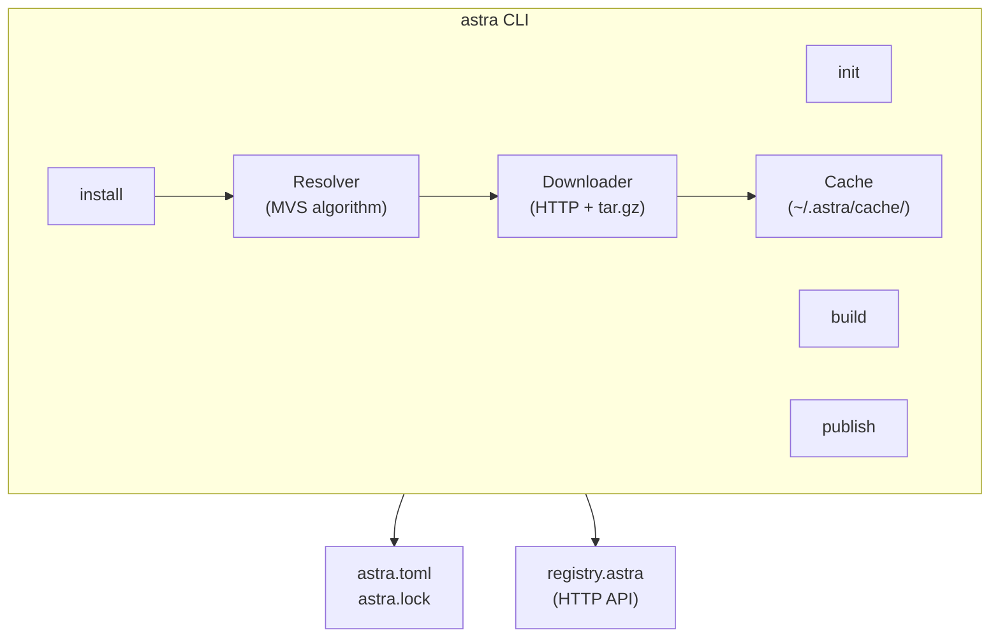
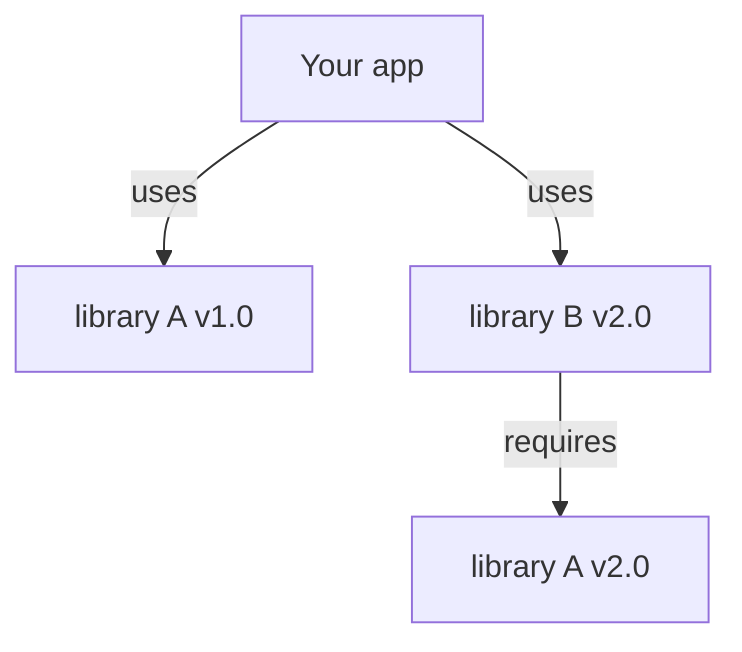
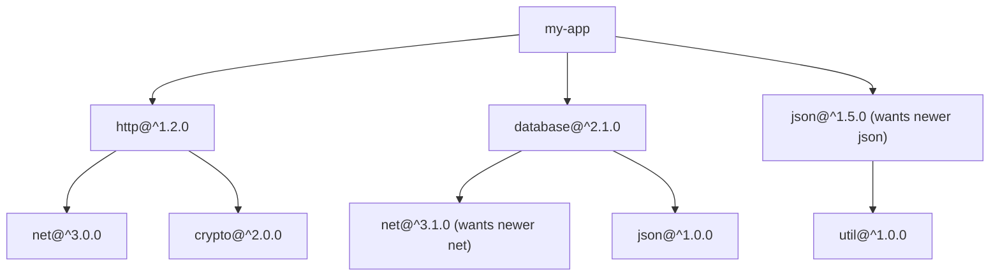
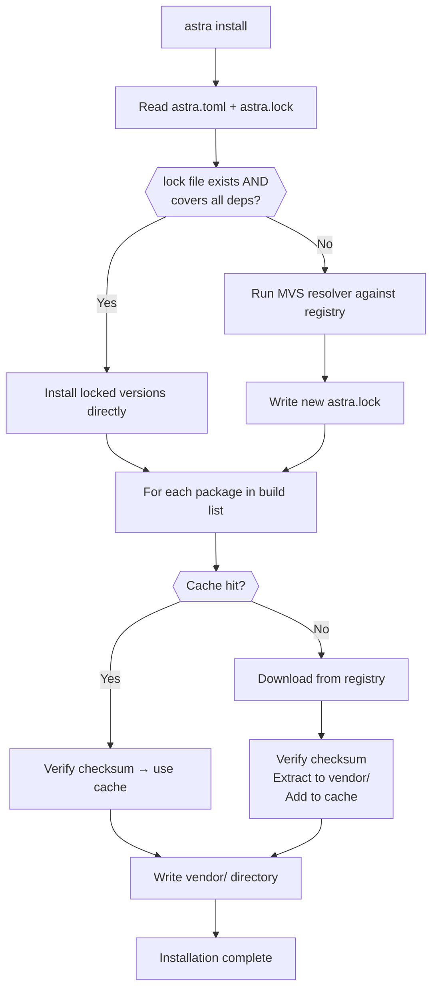

# Chapter 72: The Astra Package Manager — `astra install`

> "Software is not written in isolation. Every serious program stands on the shoulders of libraries written by thousands of people before you. The package manager is the infrastructure that makes that possible." — Isaac Z. Schlueter, creator of npm

---

## Overview

You have a complete compiler. It lexes, parses, type-checks, optimizes, and emits native machine code. You can build single-file Astra programs and they run fast. But the moment you try to build anything real — a web server, a JSON parser, a database client — you realize that writing everything from scratch is both impractical and irresponsible. The JSON parser alone would take weeks. The HTTP framework would take months. And then every team using Astra would write their own incompatible versions.

This is the problem that package managers solve. npm solved it for JavaScript. Cargo solved it for Rust. `go get` solved it for Go. pip solved it for Python. apt and homebrew solved it for system software. Every mature language ecosystem has a package manager, and that package manager is often what determines whether a language succeeds in practice.

In this chapter we build `astra` — the command-line tool and package manager for the Astra language. It manages project creation, dependency resolution and installation, building, testing, formatting, and publishing. By the end, `astra install` will resolve a dependency tree, download the exact right versions of every library, and make them available to your project — repeatably, on any machine.

---

## What We're Building

A complete `astra` CLI with a package registry backend. The full workflow:

```
astra init my-project       # create new project with astra.toml
cd my-project
astra add http@^1.0.0       # add dependency, update astra.toml
astra install               # resolve + download all deps
astra build                 # compile the project
astra test                  # run tests
astra publish               # push to registry
```



---

## Table of Contents

1. Why Package Managers Exist
2. Semantic Versioning — The Grammar of Compatibility
3. The `astra.toml` Project File
4. Dependency Resolution — The MVS Algorithm
5. The Lock File — Reproducible Builds
6. Package Structure — What a Publishable Package Looks Like
7. The Package Registry Architecture
8. Complete CLI Implementation in Go
9. Workspace Support — Monorepos
10. The Full Resolution and Installation Flow

---

## 1. Why Package Managers Exist

Before package managers, sharing code was painful. You downloaded a `.zip` from a website, extracted it into your project, and hoped it would work. When that library had its own dependencies, you tracked those down manually too. When a security vulnerability was patched in a library three levels deep in your dependency tree, you had no way of knowing unless you were subscribed to the right mailing list. When your colleague checked out your code on a different machine, they had to repeat the entire manual process.

Package managers automate all of this. At their core they do four things:

**1. Naming.** Every library has a globally unique name. `http-framework`, `database`, `json-parser`. You refer to dependencies by name, not by URL or file path.

**2. Versioning.** Every library has versions. You can say "I need version 1.2.0 or newer, but not 2.0.0 or newer because the API changed." The package manager understands this vocabulary.

**3. Resolution.** When your project depends on library A and library B, and both of them depend on library C but at different version ranges, the package manager finds a version of C that satisfies everyone. This is the hard algorithmic problem at the heart of package management.

**4. Retrieval.** The package manager knows where to download the code. You don't need to find URLs; you just name what you need.

The ecosystem effects are enormous. Because sharing code is easy, people share more code. Because code is versioned, you can upgrade safely. Because dependencies are tracked in a file, reproducibility is achievable. This is why npm's creation in 2009 transformed JavaScript from a "toy language" into a serious platform.

### A Brief History of Package Managers

| Year | Manager | Language | Key Innovation |
|------|---------|----------|----------------|
| 1994 | CPAN | Perl | First major package registry |
| 2003 | Gems | Ruby | Per-project gemfiles |
| 2007 | pip | Python | requirements.txt format |
| 2009 | npm | JavaScript | Nested dependencies, huge registry |
| 2010 | Homebrew | macOS system | Formula DSL |
| 2014 | Cargo | Rust | Lock files, workspace support |
| 2015 | go get | Go | VCS-based distribution |
| 2018 | go modules | Go | MVS algorithm, go.mod |

Astra's package manager draws from all of these, combining Cargo's excellent user experience with Go's minimal version selection algorithm.

### The Core Problem: Dependency Hell

Imagine this situation:



This is called a **diamond dependency conflict**. When library A has incompatible changes between 1.0 and 2.0, there may be no version that satisfies both direct and transitive requirements. Different package managers handle this differently:

- **npm (old)**: install multiple versions of the same library in different subtrees. Simple but causes code bloat and subtle bugs when instances don't share identity.
- **pip**: refuse to install conflicting versions and crash. Correct but fragile.
- **Cargo/Go modules**: use semantic versioning to define compatibility boundaries, then select the minimal satisfying version. Clean and deterministic.

Astra uses the Go/Cargo approach: semantic versioning defines compatibility, and the Minimal Version Selection algorithm resolves conflicts.

---

## 2. Semantic Versioning — The Grammar of Compatibility

Semantic versioning (semver) is a three-number version scheme: **MAJOR.MINOR.PATCH**. The critical insight is that these numbers carry meaning about compatibility.

```
     2   .   1   .   3
     │       │       │
     │       │       └── PATCH: bug fix, no API changes
     │       │           safe to upgrade blindly
     │       │
     │       └────────── MINOR: new features, backward compatible
     │                   old code still works
     │
     └────────────────── MAJOR: breaking API changes
                         code may need updates to compile
```

### Breaking vs. Non-Breaking Changes

A **breaking change** is any change that can cause existing code to stop compiling or stop working correctly after an upgrade:
- Renaming or removing a function
- Changing a function's parameter types or count
- Changing a function's return type
- Removing a struct field
- Changing the semantics of an existing function (even if the signature stays the same)

A **non-breaking change** leaves all existing code working:
- Adding new functions
- Adding new optional parameters (in languages that support them)
- Adding new struct fields (in languages where structs are initialized by name)
- Bug fixes that correct wrong behavior
- Performance improvements

The semver contract: if you follow these rules, library consumers can upgrade PATCH and MINOR versions safely. MAJOR version upgrades require conscious migration.

### Version Specifiers

When you declare a dependency, you specify a version range rather than an exact version. This allows the package manager to pick the best available version within the range.

```
"^2.1.0"        Compatible with 2.x.x — any version >= 2.1.0 and < 3.0.0
                The ^ says "MAJOR version must match, MINOR/PATCH can be higher"
                This is the most common specifier

"~1.5.0"        Patch-compatible — any version >= 1.5.0 and < 1.6.0
                The ~ says "MAJOR.MINOR must match, only PATCH can be higher"
                More conservative than ^

"=1.0.0"        Exactly this version, nothing else
                Use only when you KNOW you need this exact version

">=1.0.0 <2.0.0"  Range specifier: any version in this interval
                   Equivalent to ^1.0.0

"*"             Any version — dangerous, avoid

"1.2.3 - 2.3.0" Inclusive range (npm-style)
```

### Why ^ and ~ Matter

These specifiers exist because library authors make mistakes. The latest `^1.2.0` might have a bug fix in `1.2.7` that you want automatically. If you pin to `=1.2.0`, you miss that fix. But you also don't want the package manager to upgrade you to `2.0.0` automatically because that has breaking changes.

The caret `^` is the right default for most dependencies: get me the latest compatible version, but don't change the major version number.

```
astra.toml declares:     http-framework = "^1.2.0"
Available versions:      1.0.0, 1.1.0, 1.2.0, 1.2.1, 1.3.0, 1.9.0, 2.0.0

astra install selects:   1.9.0  (highest version satisfying >=1.2.0 and <2.0.0)
```

---

## 3. The `astra.toml` Project File

Every Astra project has an `astra.toml` at its root. This file is the single source of truth for everything about the project: its name, version, dependencies, build configuration, and metadata.

```toml
# astra.toml — Complete specification

[package]
name        = "my-web-app"
version     = "1.0.0"
description = "A web application written in Astra"
author      = "Aditya Pathak <aditya@example.com>"
license     = "MIT"
homepage    = "https://github.com/aditya/my-web-app"
repository  = "https://github.com/aditya/my-web-app"
keywords    = ["web", "api", "rest"]
categories  = ["web-programming", "network"]
readme      = "README.md"
edition     = "2025"    # Astra language edition

[dependencies]
http-framework  = "^1.2.0"    # REST HTTP server
database        = "~2.0.0"    # SQL database client
validation      = "=0.9.0"    # Input validation (pinned)
json            = ">=1.0.0"   # JSON parsing
logging         = "*"         # Any version (rare, avoid)

[dev-dependencies]
# Only installed during development, not in production builds
test-helpers    = "^0.5.0"
mock-http       = "^1.0.0"
benchmark       = "^0.3.0"

[build-dependencies]
# Used during build scripts, not at runtime
codegen-tool    = "^2.0.0"

[features]
# Feature flags — select optional functionality
default         = ["http", "json"]        # installed by default
full            = ["http", "json", "database", "cache", "metrics"]
minimal         = ["json"]

[build]
optimization    = 2          # -O0 (debug), -O1, -O2, -O3 (aggressive)
target          = "x86_64"   # x86_64, arm64, wasm32, riscv64
debug-symbols   = true       # include debug information
strip           = false       # strip symbols from release build

[profile.release]
optimization    = 3
debug-symbols   = false
strip           = true

[profile.debug]
optimization    = 0
debug-symbols   = true
strip           = false

[package.metadata]
# Arbitrary metadata that tools can read
docs-url        = "https://docs.astra-lang.org/my-web-app"
```

### Parsing `astra.toml` in Go

TOML is a clean configuration format designed to be human-readable and unambiguous. Go has excellent TOML libraries. Here's how we parse it:

```go
// astra/config/toml.go
package config

import (
    "fmt"
    "os"
    "regexp"

    "github.com/BurntSushi/toml"
)

// PackageManifest represents the full astra.toml structure
type PackageManifest struct {
    Package      PackageInfo            `toml:"package"`
    Dependencies map[string]string      `toml:"dependencies"`
    DevDeps      map[string]string      `toml:"dev-dependencies"`
    BuildDeps    map[string]string      `toml:"build-dependencies"`
    Features     map[string][]string    `toml:"features"`
    Build        BuildConfig            `toml:"build"`
    Workspace    *WorkspaceConfig       `toml:"workspace"`
    Profiles     map[string]BuildConfig `toml:"profile"`
}

type PackageInfo struct {
    Name        string   `toml:"name"`
    Version     string   `toml:"version"`
    Description string   `toml:"description"`
    Author      string   `toml:"author"`
    License     string   `toml:"license"`
    Homepage    string   `toml:"homepage"`
    Repository  string   `toml:"repository"`
    Keywords    []string `toml:"keywords"`
    Readme      string   `toml:"readme"`
    Edition     string   `toml:"edition"`
}

type BuildConfig struct {
    Optimization int    `toml:"optimization"`
    Target       string `toml:"target"`
    DebugSymbols bool   `toml:"debug-symbols"`
    Strip        bool   `toml:"strip"`
}

type WorkspaceConfig struct {
    Members []string `toml:"members"`
}

// LoadManifest reads and parses astra.toml from the given directory
func LoadManifest(dir string) (*PackageManifest, error) {
    path := filepath.Join(dir, "astra.toml")
    data, err := os.ReadFile(path)
    if err != nil {
        return nil, fmt.Errorf("cannot read astra.toml: %w", err)
    }

    var manifest PackageManifest
    if _, err := toml.Decode(string(data), &manifest); err != nil {
        return nil, fmt.Errorf("invalid astra.toml: %w", err)
    }

    if err := manifest.Validate(); err != nil {
        return nil, err
    }
    return &manifest, nil
}

// Validate checks the manifest for required fields and valid values
func (m *PackageManifest) Validate() error {
    if m.Package.Name == "" {
        return fmt.Errorf("astra.toml: [package] name is required")
    }
    if !validPackageName(m.Package.Name) {
        return fmt.Errorf("astra.toml: invalid package name %q (use lowercase letters, digits, hyphens)", m.Package.Name)
    }
    if m.Package.Version == "" {
        return fmt.Errorf("astra.toml: [package] version is required")
    }
    if _, err := ParseVersion(m.Package.Version); err != nil {
        return fmt.Errorf("astra.toml: invalid version %q: %w", m.Package.Version, err)
    }
    return nil
}

var packageNameRE = regexp.MustCompile(`^[a-z][a-z0-9\-]*$`)

func validPackageName(name string) bool {
    return packageNameRE.MatchString(name)
}
```

---

## 4. Dependency Resolution — The MVS Algorithm

This is the algorithmic heart of the package manager. Given a project's direct dependencies and their transitive dependencies (which may require overlapping libraries at different versions), we need to find one version of each library that satisfies everyone.

### The Problem Space

Consider a project with this dependency graph:



The resolver must find: which exact version of net, json, crypto, and util to use?

### SAT Solver Approach (npm v3+)

npm uses a Boolean Satisfiability (SAT) solver. Each version of each package is a Boolean variable (true = use this version). Constraints are clauses in a SAT formula. The solver finds an assignment of true/false that satisfies all clauses.

This is theoretically complete — it can find solutions that simpler algorithms miss — but it is also NP-complete in the worst case and notoriously slow for large dependency trees. npm's node_modules can have hundreds of thousands of packages, and resolution can take minutes.

### Minimal Version Selection (MVS) — Go's Approach

Go modules use Minimal Version Selection, designed by Russ Cox. The key insight: if every library author follows semver, then the *minimum version* that satisfies a requirement is always safe. We don't need to "upgrade" to the latest within a range; we just need the minimum that works.

**MVS Rules:**
1. For each package, collect all minimum versions required by any package in the dependency graph
2. For each package, select the MAXIMUM of all these minimum versions
3. This is the complete build list

Why maximum of minimums? Because if package A says "I need net >= 3.0.0" and package B says "I need net >= 3.1.0", we need at least 3.1.0 to satisfy BOTH constraints. We take the maximum minimum.

**Example walkthrough:**

```
Project requires: http@^1.2.0, database@^2.1.0

Step 1: Load minimum versions from astra.lock or use minimum spec
  - http → minimum: 1.2.0
  - database → minimum: 2.1.0

Step 2: Fetch module graphs for all direct deps
  http@1.2.0 requires:     net@3.0.0, crypto@2.0.0
  database@2.1.0 requires: net@3.1.0, json@1.0.0

Step 3: Project also requires json@^1.5.0 → minimum: 1.5.0
  json@1.5.0 requires: util@1.0.0

Step 4: Build the complete requirement set
  net:    {3.0.0 from http, 3.1.0 from database} → select max → 3.1.0
  crypto: {2.0.0 from http}                       → select max → 2.0.0
  json:   {1.0.0 from database, 1.5.0 from project} → select max → 1.5.0
  util:   {1.0.0 from json}                        → select max → 1.0.0

Final build list:
  http@1.2.0, database@2.1.0, net@3.1.0, crypto@2.0.0, json@1.5.0, util@1.0.0
```

MVS is O(n) where n is the number of packages — dramatically faster than SAT solving. And it is deterministic: given the same inputs it always produces the same output, making builds reproducible.

### MVS Implementation in Go

```go
// astra/resolver/mvs.go
package resolver

import (
    "fmt"
    "sort"
)

// Version represents a semantic version
type Version struct {
    Major, Minor, Patch int
    Pre                 string // pre-release: "alpha.1", "beta.2", ""
}

// Requirement pairs a package name with a version constraint
type Requirement struct {
    Name       string
    Constraint VersionConstraint
}

// ModuleGraph is the dependency graph for a module
type ModuleGraph struct {
    Version  Version
    Requires []Requirement
}

// Resolver uses MVS to find the build list
type Resolver struct {
    registry RegistryClient
    cache    *Cache
}

// Resolve computes the complete build list for a project
// using Minimal Version Selection.
func (r *Resolver) Resolve(manifest *config.PackageManifest) (BuildList, error) {
    // The working set maps package name → minimum required version
    // We iteratively expand this as we discover transitive deps
    minVersions := make(map[string]Version)
    queue := []Requirement{}

    // Seed with direct dependencies
    for name, spec := range manifest.Dependencies {
        constraint, err := ParseConstraint(spec)
        if err != nil {
            return nil, fmt.Errorf("invalid constraint for %s: %w", name, err)
        }
        queue = append(queue, Requirement{Name: name, Constraint: constraint})
    }

    visited := make(map[string]bool)

    for len(queue) > 0 {
        req := queue[0]
        queue = queue[1:]

        // Find the minimum version satisfying this constraint
        minVer, err := r.registry.MinSatisfying(req.Name, req.Constraint)
        if err != nil {
            return nil, fmt.Errorf("cannot resolve %s %s: %w",
                req.Name, req.Constraint, err)
        }

        // Update working set: take max of current minimum and this minimum
        if cur, exists := minVersions[req.Name]; !exists || minVer.GreaterThan(cur) {
            minVersions[req.Name] = minVer
            // Invalidate visited so we re-process with the new version
            delete(visited, req.Name)
        }

        // If we've already expanded this version, skip
        key := req.Name + "@" + minVersions[req.Name].String()
        if visited[key] {
            continue
        }
        visited[key] = true

        // Fetch the module graph for this package at the resolved version
        graph, err := r.fetchModuleGraph(req.Name, minVersions[req.Name])
        if err != nil {
            return nil, err
        }

        // Add transitive dependencies to the queue
        for _, transReq := range graph.Requires {
            queue = append(queue, transReq)
        }
    }

    // Build the final list, sorted for determinism
    list := make(BuildList, 0, len(minVersions))
    for name, ver := range minVersions {
        list = append(list, ResolvedPackage{Name: name, Version: ver})
    }
    sort.Slice(list, func(i, j int) bool {
        return list[i].Name < list[j].Name
    })
    return list, nil
}

// fetchModuleGraph retrieves the dependency requirements for a specific version.
// Results are cached to avoid repeated network requests.
func (r *Resolver) fetchModuleGraph(name string, ver Version) (*ModuleGraph, error) {
    cacheKey := name + "@" + ver.String() + ".graph"
    if cached, ok := r.cache.GetGraph(cacheKey); ok {
        return cached, nil
    }

    graph, err := r.registry.GetModuleGraph(name, ver)
    if err != nil {
        return nil, fmt.Errorf("fetching module graph for %s@%s: %w", name, ver, err)
    }

    r.cache.PutGraph(cacheKey, graph)
    return graph, nil
}

// ParseConstraint parses a version constraint string like "^1.2.0" or "~2.0.0"
func ParseConstraint(spec string) (VersionConstraint, error) {
    spec = strings.TrimSpace(spec)
    switch {
    case strings.HasPrefix(spec, "^"):
        v, err := ParseVersion(spec[1:])
        if err != nil {
            return nil, err
        }
        // ^M.N.P means >= M.N.P and < (M+1).0.0
        return &CaretConstraint{Min: v}, nil

    case strings.HasPrefix(spec, "~"):
        v, err := ParseVersion(spec[1:])
        if err != nil {
            return nil, err
        }
        // ~M.N.P means >= M.N.P and < M.(N+1).0
        return &TildeConstraint{Min: v}, nil

    case strings.HasPrefix(spec, "="):
        v, err := ParseVersion(spec[1:])
        if err != nil {
            return nil, err
        }
        return &ExactConstraint{Version: v}, nil

    case strings.HasPrefix(spec, ">=") || strings.HasPrefix(spec, ">"):
        return parseRangeConstraint(spec)

    case spec == "*":
        return &AnyConstraint{}, nil

    default:
        // Bare version number: treat as ^
        v, err := ParseVersion(spec)
        if err != nil {
            return nil, err
        }
        return &CaretConstraint{Min: v}, nil
    }
}
```

---

## 5. The Lock File — Reproducible Builds

The lock file (`astra.lock`) records the EXACT resolved versions of every dependency, including transitive ones. This is the crucial mechanism for reproducibility.

**Why the lock file is necessary:**

Without a lock file, running `astra install` twice might give different results. Between your first install and a colleague's first install, a new version of a dependency might be published. Even though both of you have `http@^1.2.0` in `astra.toml`, you might get `http@1.2.1` and they get `http@1.2.3`. Usually that is fine. But occasionally the new version has a subtle bug, and you end up with "works on my machine" problems.

The lock file solves this: once you've resolved and locked the versions, everyone else installs the EXACT same versions.

```toml
# astra.lock — DO NOT EDIT MANUALLY
# Generated by astra 1.0.0 on 2025-03-15T10:30:00Z

[[package]]
name    = "http-framework"
version = "1.3.2"
source  = "registry+https://packages.astra-lang.org"
checksum = "sha256:a1b2c3d4e5f6..."

[[package]]
name    = "database"
version = "2.0.4"
source  = "registry+https://packages.astra-lang.org"
checksum = "sha256:b2c3d4e5f6a1..."
dependencies = [
    "net@3.1.0",
    "json@1.5.2",
]

[[package]]
name    = "net"
version = "3.1.0"
source  = "registry+https://packages.astra-lang.org"
checksum = "sha256:c3d4e5f6a1b2..."

[[package]]
name    = "json"
version = "1.5.2"
source  = "registry+https://packages.astra-lang.org"
checksum = "sha256:d4e5f6a1b2c3..."
```

**Lock file rules:**
- Commit `astra.lock` to git. Every team member and every CI run gets identical builds.
- `astra install` reads the lock file if it exists, downloads exactly those versions.
- `astra update` re-runs resolution and updates the lock file to the latest compatible versions.
- `astra update http` updates only the `http` dependency and its transitive deps.

**Checksum verification:** Each package has a SHA-256 hash. When downloading, `astra install` verifies the hash. If a malicious actor compromised the registry and replaced a package, the hash check would catch it.

```go
// astra/installer/install.go

func (inst *Installer) InstallFromLock(lockFile *LockFile, dir string) error {
    for _, pkg := range lockFile.Packages {
        if inst.cache.Has(pkg.Name, pkg.Version) {
            // Already in local cache — verify checksum
            if err := inst.cache.VerifyChecksum(pkg.Name, pkg.Version, pkg.Checksum); err != nil {
                // Cache corrupted — re-download
                inst.cache.Evict(pkg.Name, pkg.Version)
            } else {
                continue // Cache hit, skip download
            }
        }

        fmt.Printf("  Downloading %s@%s...\n", pkg.Name, pkg.Version)
        data, err := inst.registry.Download(pkg.Name, pkg.Version)
        if err != nil {
            return fmt.Errorf("downloading %s@%s: %w", pkg.Name, pkg.Version, err)
        }

        // Verify checksum before extracting
        actual := sha256sum(data)
        if actual != pkg.Checksum {
            return fmt.Errorf("checksum mismatch for %s@%s: expected %s, got %s",
                pkg.Name, pkg.Version, pkg.Checksum, actual)
        }

        // Extract to vendor directory
        vendorPath := filepath.Join(dir, "vendor", pkg.Name+"@"+pkg.Version.String())
        if err := extractTarGz(data, vendorPath); err != nil {
            return fmt.Errorf("extracting %s: %w", pkg.Name, err)
        }

        // Also add to global cache for future projects
        inst.cache.Put(pkg.Name, pkg.Version, data)

        fmt.Printf("  Installed %s@%s\n", pkg.Name, pkg.Version)
    }
    return nil
}
```

---

## 6. Package Structure — What a Publishable Package Looks Like

A well-structured Astra package follows a conventional layout. Consistency matters: when every package uses the same structure, tools can reason about them uniformly.

```
my-http-library/
├── astra.toml              ← Package manifest (required)
├── astra.lock              ← Lock file (committed)
├── src/
│   ├── lib.as              ← Library entry point (pub exports)
│   ├── server.as           ← Server implementation
│   ├── client.as           ← Client implementation
│   ├── router.as           ← URL router
│   ├── middleware.as       ← Middleware chain
│   └── internal/           ← Internal modules (not exported)
│       ├── parser.as       ← HTTP parser (private)
│       └── buffer.as       ← I/O buffer (private)
├── tests/
│   ├── server_test.as      ← Unit tests for server
│   ├── client_test.as      ← Unit tests for client
│   ├── router_test.as
│   └── integration/        ← Integration tests
│       └── full_cycle_test.as
├── examples/
│   ├── basic_server.as     ← Minimal working example
│   ├── rest_api.as         ← REST API example
│   └── middleware_chain.as
├── benches/                ← Benchmark programs
│   └── throughput.as
├── docs/                   ← Generated by astradoc
│   └── index.html          ← (not committed, generated)
├── README.md               ← Human-readable overview
├── CHANGELOG.md            ← Version history
└── LICENSE                 ← License text (MIT, Apache-2.0, etc.)
```

### The `src/lib.as` Entry Point

The library entry point explicitly declares what is public:

```astra
// src/lib.as — Public API of the http library

pub import "server"     as Server
pub import "client"     as Client
pub import "router"     as Router
pub import "middleware" as Middleware

// Re-export the most commonly used types at the top level
pub use Server.HttpServer
pub use Client.HttpClient
pub use Router.Route
pub use Router.Router

// Version information
pub const VERSION = "1.3.2"
pub const API_VERSION = 1
```

The `internal/` directory contains private implementation details. Other packages cannot import from `internal/`. The Astra compiler enforces this: an attempt to import `my-http/internal/parser` from outside the package is a compile error.

---

## 7. The Package Registry Architecture

The registry is the central repository where packages are published and downloaded. Its API is simple HTTP:

```
GET  /api/v1/packages                    → list all packages
GET  /api/v1/packages?q=http             → search packages
GET  /api/v1/packages/:name              → package info + all versions
GET  /api/v1/packages/:name/:version     → specific version info
GET  /api/v1/packages/:name/:version.tar.gz → download package
POST /api/v1/packages                    → publish new package (auth required)
DELETE /api/v1/packages/:name/:version   → yank (auth + special flag required)
```

**Important: versions are immutable.** Once you publish `http@1.3.2`, you can never change it. If you need to fix a bug, you publish `http@1.3.3`. This immutability guarantee is what makes lock files reliable: the SHA-256 hash in your lock file will always refer to exactly the same bytes.

**Yanking:** A "yank" marks a version as deprecated without deleting it. Yanked versions can still be downloaded if you have them in a lock file, but `astra install` on a fresh project will not select them. Use yanking when a version has a serious security vulnerability.

```go
// astra/registry/client.go
package registry

import (
    "encoding/json"
    "fmt"
    "io"
    "net/http"
    "net/url"
)

const DefaultRegistry = "https://packages.astra-lang.org"

type Client struct {
    BaseURL    string
    HTTPClient *http.Client
    APIKey     string // for publish operations
}

type PackageInfo struct {
    Name        string            `json:"name"`
    Description string            `json:"description"`
    Author      string            `json:"author"`
    License     string            `json:"license"`
    Versions    []VersionInfo     `json:"versions"`
    Keywords    []string          `json:"keywords"`
    Homepage    string            `json:"homepage"`
}

type VersionInfo struct {
    Version   string `json:"version"`
    Published string `json:"published_at"` // RFC3339 timestamp
    Checksum  string `json:"checksum"`     // sha256:...
    Yanked    bool   `json:"yanked"`
    Size      int    `json:"size_bytes"`
}

// GetPackageInfo fetches metadata for a package
func (c *Client) GetPackageInfo(name string) (*PackageInfo, error) {
    resp, err := c.HTTPClient.Get(c.BaseURL + "/api/v1/packages/" + url.PathEscape(name))
    if err != nil {
        return nil, fmt.Errorf("registry request failed: %w", err)
    }
    defer resp.Body.Close()

    if resp.StatusCode == http.StatusNotFound {
        return nil, fmt.Errorf("package %q not found in registry", name)
    }
    if resp.StatusCode != http.StatusOK {
        return nil, fmt.Errorf("registry returned status %d", resp.StatusCode)
    }

    var info PackageInfo
    if err := json.NewDecoder(resp.Body).Decode(&info); err != nil {
        return nil, fmt.Errorf("parsing registry response: %w", err)
    }
    return &info, nil
}

// MinSatisfying returns the minimum version satisfying the given constraint
func (c *Client) MinSatisfying(name string, constraint VersionConstraint) (Version, error) {
    info, err := c.GetPackageInfo(name)
    if err != nil {
        return Version{}, err
    }

    var candidates []Version
    for _, vi := range info.Versions {
        if vi.Yanked {
            continue
        }
        v, err := ParseVersion(vi.Version)
        if err != nil {
            continue
        }
        if constraint.Satisfies(v) {
            candidates = append(candidates, v)
        }
    }

    if len(candidates) == 0 {
        return Version{}, fmt.Errorf("no version of %s satisfies constraint %s", name, constraint)
    }

    // For MVS: return minimum satisfying version
    sort.Slice(candidates, func(i, j int) bool {
        return candidates[i].LessThan(candidates[j])
    })
    return candidates[0], nil
}

// Download fetches the package archive as bytes
func (c *Client) Download(name string, ver Version) ([]byte, error) {
    url := fmt.Sprintf("%s/api/v1/packages/%s/%s.tar.gz",
        c.BaseURL, url.PathEscape(name), ver.String())

    resp, err := c.HTTPClient.Get(url)
    if err != nil {
        return nil, fmt.Errorf("downloading %s@%s: %w", name, ver, err)
    }
    defer resp.Body.Close()

    if resp.StatusCode != http.StatusOK {
        return nil, fmt.Errorf("registry returned %d for %s@%s", resp.StatusCode, name, ver)
    }

    return io.ReadAll(resp.Body)
}
```

---

## 8. Complete CLI Implementation in Go

The `astra` command is the unified entry point for everything developers do with Astra projects. Let's build it end to end.

```go
// astra/main.go
package main

import (
    "fmt"
    "os"
    "path/filepath"

    "github.com/astra-lang/astra/config"
    "github.com/astra-lang/astra/installer"
    "github.com/astra-lang/astra/registry"
    "github.com/astra-lang/astra/resolver"
)

func main() {
    if len(os.Args) < 2 {
        printUsage()
        os.Exit(1)
    }

    commands := map[string]func([]string) error{
        "init":    cmdInit,    // create new project
        "install": cmdInstall, // install/update dependencies
        "add":     cmdAdd,     // add a new dependency
        "remove":  cmdRemove,  // remove a dependency
        "update":  cmdUpdate,  // update to latest compatible versions
        "publish": cmdPublish, // publish to registry
        "build":   cmdBuild,   // compile the project
        "run":     cmdRun,     // compile + run
        "test":    cmdTest,    // run tests
        "fmt":     cmdFmt,     // format all source files
        "doc":     cmdDoc,     // generate documentation
        "search":  cmdSearch,  // search the registry
        "info":    cmdInfo,    // show package information
        "clean":   cmdClean,   // remove build artifacts
        "check":   cmdCheck,   // type-check without building
        "version": cmdVersion, // show astra version
    }

    cmd := os.Args[1]
    args := os.Args[2:]

    fn, ok := commands[cmd]
    if !ok {
        fmt.Fprintf(os.Stderr, "astra: unknown command %q\n\n", cmd)
        printUsage()
        os.Exit(1)
    }

    if err := fn(args); err != nil {
        fmt.Fprintf(os.Stderr, "astra %s: %v\n", cmd, err)
        os.Exit(1)
    }
}

// cmdInit creates a new Astra project with a default astra.toml and src/main.as
func cmdInit(args []string) error {
    name := "my-project"
    if len(args) > 0 {
        name = args[0]
    }

    dir := filepath.Join(".", name)
    if err := os.MkdirAll(filepath.Join(dir, "src"), 0755); err != nil {
        return err
    }
    if err := os.MkdirAll(filepath.Join(dir, "tests"), 0755); err != nil {
        return err
    }

    // Write default astra.toml
    tomlContent := fmt.Sprintf(`[package]
name        = %q
version     = "0.1.0"
description = ""
author      = ""
license     = "MIT"
edition     = "2025"

[dependencies]

[dev-dependencies]
`, name)
    if err := os.WriteFile(filepath.Join(dir, "astra.toml"), []byte(tomlContent), 0644); err != nil {
        return err
    }

    // Write default src/main.as
    mainContent := `fn main() {
    print("Hello from ` + name + `!")
}
`
    if err := os.WriteFile(filepath.Join(dir, "src", "main.as"), []byte(mainContent), 0644); err != nil {
        return err
    }

    // Write .gitignore
    gitignore := "build/\nvendor/\n*.o\n*.a\n"
    if err := os.WriteFile(filepath.Join(dir, ".gitignore"), []byte(gitignore), 0644); err != nil {
        return err
    }

    fmt.Printf("Created project %q in %s\n", name, dir)
    fmt.Println("  astra.toml")
    fmt.Println("  src/main.as")
    fmt.Println("  .gitignore")
    fmt.Printf("\nGet started: cd %s && astra run\n", name)
    return nil
}

// cmdInstall resolves and installs all dependencies from astra.toml
func cmdInstall(args []string) error {
    dir, err := os.Getwd()
    if err != nil {
        return err
    }

    // Load project manifest
    manifest, err := config.LoadManifest(dir)
    if err != nil {
        return err
    }

    reg := registry.NewClient(registry.DefaultRegistry)
    res := resolver.New(reg)
    inst := installer.New(reg)

    // Try to use existing lock file for reproducible installs
    lockPath := filepath.Join(dir, "astra.lock")
    if _, err := os.Stat(lockPath); err == nil {
        fmt.Println("Found astra.lock — installing locked versions")
        lockFile, err := installer.LoadLockFile(lockPath)
        if err != nil {
            return fmt.Errorf("reading astra.lock: %w", err)
        }
        return inst.InstallFromLock(lockFile, dir)
    }

    // No lock file — resolve from scratch
    fmt.Println("Resolving dependencies...")
    buildList, err := res.Resolve(manifest)
    if err != nil {
        return fmt.Errorf("dependency resolution failed: %w", err)
    }

    fmt.Printf("Resolved %d packages\n", len(buildList))
    for _, pkg := range buildList {
        fmt.Printf("  %s@%s\n", pkg.Name, pkg.Version)
    }

    // Install all resolved packages
    fmt.Println("\nInstalling...")
    if err := inst.InstallBuildList(buildList, dir); err != nil {
        return err
    }

    // Write lock file for future reproducible installs
    lockFile := installer.BuildLockFile(buildList)
    if err := lockFile.Write(lockPath); err != nil {
        return fmt.Errorf("writing astra.lock: %w", err)
    }
    fmt.Println("Wrote astra.lock")

    fmt.Printf("\n%d packages installed successfully.\n", len(buildList))
    return nil
}

// cmdAdd adds a new dependency to astra.toml and runs install
func cmdAdd(args []string) error {
    if len(args) == 0 {
        return fmt.Errorf("usage: astra add <package>[@<version>]")
    }

    dir, err := os.Getwd()
    if err != nil {
        return err
    }

    // Parse "package@version" or just "package"
    name, versionSpec := parsePackageSpec(args[0])

    // If no version specified, query registry for latest
    if versionSpec == "" {
        reg := registry.NewClient(registry.DefaultRegistry)
        info, err := reg.GetPackageInfo(name)
        if err != nil {
            return fmt.Errorf("package %q not found: %w", name, err)
        }
        latest := info.LatestVersion()
        versionSpec = "^" + latest.String()
        fmt.Printf("Using latest version: %s@%s\n", name, versionSpec)
    }

    // Update astra.toml
    manifest, err := config.LoadManifest(dir)
    if err != nil {
        return err
    }
    if manifest.Dependencies == nil {
        manifest.Dependencies = make(map[string]string)
    }
    manifest.Dependencies[name] = versionSpec

    if err := manifest.Save(filepath.Join(dir, "astra.toml")); err != nil {
        return err
    }

    // Delete lock file to force re-resolution with new dep
    os.Remove(filepath.Join(dir, "astra.lock"))

    fmt.Printf("Added %s = %q to [dependencies]\n", name, versionSpec)
    fmt.Println("Running astra install...")
    return cmdInstall(nil)
}

// cmdBuild compiles the project
func cmdBuild(args []string) error {
    dir, err := os.Getwd()
    if err != nil {
        return err
    }
    manifest, err := config.LoadManifest(dir)
    if err != nil {
        return err
    }

    // Ensure dependencies are installed
    vendorDir := filepath.Join(dir, "vendor")
    if _, err := os.Stat(vendorDir); os.IsNotExist(err) {
        fmt.Println("vendor/ missing — running astra install first")
        if err := cmdInstall(nil); err != nil {
            return err
        }
    }

    // Invoke astrac with proper include paths
    includes := buildIncludePaths(dir)
    entryPoint := filepath.Join(dir, "src", "main.as")
    outputName := manifest.Package.Name
    optLevel := manifest.Build.Optimization

    cmd := exec.Command("astrac",
        append(includes,
            entryPoint,
            "-o", filepath.Join(dir, "build", outputName),
            fmt.Sprintf("-O%d", optLevel),
        )...,
    )
    cmd.Stdout = os.Stdout
    cmd.Stderr = os.Stderr

    fmt.Printf("Building %s v%s...\n", manifest.Package.Name, manifest.Package.Version)
    if err := cmd.Run(); err != nil {
        return fmt.Errorf("build failed")
    }
    fmt.Printf("Built: build/%s\n", outputName)
    return nil
}

// cmdPublish packages and uploads to the registry
func cmdPublish(args []string) error {
    dir, err := os.Getwd()
    if err != nil {
        return err
    }
    manifest, err := config.LoadManifest(dir)
    if err != nil {
        return err
    }

    // Run tests first — don't publish broken packages
    fmt.Println("Running tests before publish...")
    if err := cmdTest(nil); err != nil {
        return fmt.Errorf("tests failed — refusing to publish")
    }

    // Create .tar.gz archive of the package
    fmt.Println("Creating package archive...")
    archive, checksum, err := createPackageArchive(dir, manifest)
    if err != nil {
        return err
    }

    fmt.Printf("Package: %s@%s (%d bytes, sha256:%s)\n",
        manifest.Package.Name,
        manifest.Package.Version,
        len(archive),
        checksum[:16]+"...",
    )

    // Confirm with user
    fmt.Print("Publish to registry? [y/N] ")
    var answer string
    fmt.Scanln(&answer)
    if answer != "y" && answer != "Y" {
        fmt.Println("Publish cancelled.")
        return nil
    }

    // Upload
    apiKey := os.Getenv("ASTRA_API_KEY")
    if apiKey == "" {
        return fmt.Errorf("ASTRA_API_KEY environment variable not set")
    }

    reg := registry.NewClient(registry.DefaultRegistry)
    reg.APIKey = apiKey

    if err := reg.Publish(manifest, archive); err != nil {
        return fmt.Errorf("publish failed: %w", err)
    }

    fmt.Printf("\nPublished %s@%s successfully!\n",
        manifest.Package.Name, manifest.Package.Version)
    return nil
}
```

---

## 9. Workspace Support — Monorepos

Large projects often consist of multiple packages that are developed together. A workspace is a single git repository containing multiple `astra.toml` packages. All packages in the workspace share a single lock file (so transitive dependency versions are consistent) but are published independently.

```toml
# Root astra.toml — the workspace manifest
[workspace]
members = [
    "packages/core",
    "packages/http",
    "packages/json",
    "packages/database",
    "apps/server",
    "apps/cli-tool",
]
# Resolver uses a single shared lock file for all members
# This ensures packages/core and packages/http agree on all transitive deps
```

```
astra-workspace/
├── astra.toml          ← workspace root
├── astra.lock          ← shared lock file for entire workspace
├── packages/
│   ├── core/
│   │   ├── astra.toml
│   │   └── src/
│   ├── http/
│   │   ├── astra.toml  ← depends on packages/core
│   │   └── src/
│   └── database/
│       ├── astra.toml  ← depends on packages/core
│       └── src/
└── apps/
    └── server/
        ├── astra.toml  ← depends on packages/http, packages/database
        └── src/
```

```bash
# Build all workspace members
astra build --workspace

# Build only one member
astra build -p apps/server

# Test all members
astra test --workspace

# Publish all changed packages
astra publish --workspace --changed-since main
```

The workspace resolver treats all member packages as if they were part of the same dependency graph. If `apps/server` depends on `packages/http@1.0.0` and `packages/http` is a workspace member, `astra` uses the local version instead of downloading from the registry.

---

## 10. The Full Resolution and Installation Flow

Putting it all together, here is the complete lifecycle of `astra install`:



---

## Astra Build Milestone

At this stage you should have the following files building and passing tests:

```
astra/
├── main.go                    ← CLI entry point with all commands
├── config/
│   ├── toml.go                ← Parse astra.toml
│   └── manifest.go            ← Validate + save manifest
├── resolver/
│   ├── mvs.go                 ← Minimal Version Selection algorithm
│   ├── version.go             ← Version parsing and comparison
│   └── constraint.go          ← ^, ~, =, range constraints
├── registry/
│   ├── client.go              ← HTTP client for registry API
│   └── publish.go             ← Package publishing
├── installer/
│   ├── install.go             ← Download, verify, extract
│   ├── lockfile.go            ← Read/write astra.lock
│   └── cache.go               ← Global package cache
└── workspace/
    └── workspace.go           ← Workspace (monorepo) support
```

**Demo session:**

```bash
# Create a new project
$ astra init web-server
Created project "web-server" in ./web-server
  astra.toml
  src/main.as
  .gitignore

Get started: cd web-server && astra run

# Add a dependency
$ cd web-server
$ astra add http-framework@^1.0.0
Using latest version: http-framework@^1.3.2
Added http-framework = "^1.3.2" to [dependencies]
Running astra install...
Resolving dependencies...
Resolved 4 packages
  http-framework@1.3.2
  net@3.1.0
  crypto@2.0.1
  util@1.2.0

Installing...
  Downloading http-framework@1.3.2...
  Downloading net@3.1.0...
  Downloading crypto@2.0.1...
  Downloading util@1.2.0...
  Installed http-framework@1.3.2
  Installed net@3.1.0
  Installed crypto@2.0.1
  Installed util@1.2.0
Wrote astra.lock

4 packages installed successfully.

# Build and run
$ astra build
Building web-server v0.1.0...
Built: build/web-server

$ ./build/web-server
Hello from web-server!
```

---

## Exercises

1. **Custom Registry:** Implement support for private registries by allowing `source = "registry+https://my-company.com/registry"` in `astra.toml`. The resolver should try the private registry first, then fall back to the public registry.

2. **Dependency Audit:** Implement `astra audit` that checks all dependencies against a vulnerability database (a simple JSON file mapping package+version to CVE IDs) and reports any vulnerable packages.

3. **Offline Mode:** Implement `astra install --offline` that fails if any package is not in the local cache, instead of downloading. This is useful in air-gapped environments.

4. **Version Upgrades:** Implement `astra outdated` that lists all dependencies with their current version, the latest compatible version (within the ^ range), and the latest version overall (even if it's a new major version).

5. **Workspace Graph:** Implement `astra workspace graph` that prints the full dependency graph for a workspace as a Graphviz DOT file, which can be rendered to a PNG.

6. **Build Scripts:** Implement support for `build.as` — a special Astra script that runs before compilation. This is useful for code generation (generating Astra code from .proto files, for example). The build script runs in a restricted sandbox with no network access.

---

## Summary

| Concept | What It Does | Implementation |
|--------|-------------|----------------|
| `astra.toml` | Project manifest | TOML file with package info + deps |
| Semantic versioning | Compatibility contract | MAJOR.MINOR.PATCH with ^ ~ = ranges |
| MVS algorithm | Dependency resolution | O(n) minimum version selection |
| `astra.lock` | Reproducible builds | Exact versions + SHA-256 checksums |
| Package registry | Central store | Immutable HTTP API with tar.gz archives |
| `astra install` | Install dependencies | Resolve → download → verify → extract |
| `astra publish` | Share your work | Archive → checksum → registry upload |
| Workspace | Monorepo support | Multiple packages, one shared lock file |
| Global cache | Avoid re-downloading | `~/.astra/cache/` keyed by name+version |
| Feature flags | Optional functionality | `[features]` section in astra.toml |
