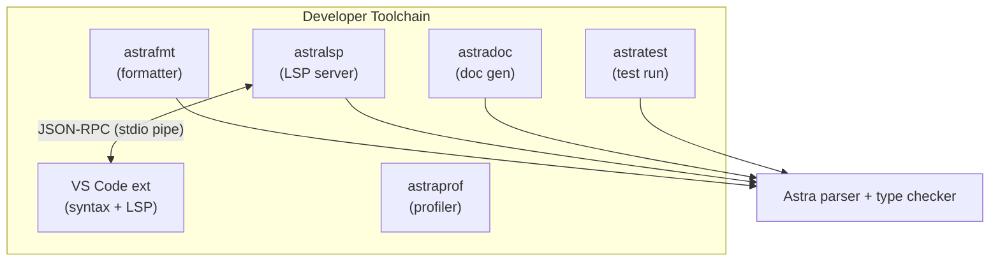
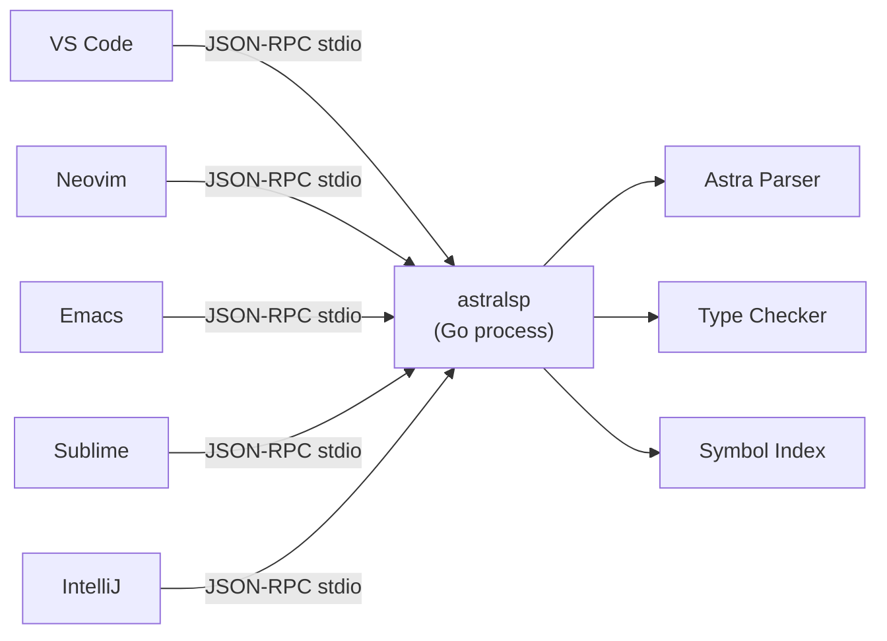

# Chapter 73: Astra Tooling and IDE Support — Developer Experience

> "A language is not just its syntax and semantics. It is everything the programmer touches when writing in that language: the editor, the formatter, the debugger, the error messages. Poor tooling turns a great language into an abandoned one." — DHH

---

## Overview

You have a complete compiler and package manager. Astra programs can be written, built, and shared. But stop for a moment and consider what the programming experience actually looks like right now. You open a `.as` file in your editor. There is no syntax highlighting — keywords look identical to identifiers. There is no error underlining — typos show up only when you run `astrac`. There is no autocomplete — every function name must be typed from memory. There is no formatter — every file looks different depending on who wrote it.

This is the gap between "works" and "usable." A language that works but is painful to use will not be used. The programmer experience around a language is as important as the language itself. This is why Go's ecosystem includes `gofmt`, `gopls`, `godoc`, and an official VS Code extension. This is why Rust ships with `rustfmt`, `rust-analyzer`, and `cargo test` built in. First-class tooling is not an afterthought; it is a design goal.

In this chapter we build the complete Astra developer toolchain:
- `astrafmt` — code formatter (opinionated, non-negotiable style)
- `astralsp` — Language Server Protocol implementation for IDE integration
- VS Code extension for syntax highlighting, autocomplete, and error display
- `astradoc` — documentation generator
- `astratest` — the testing framework built into the language
- Performance profiling tools

By the end of this chapter, writing Astra code feels like writing in a mature, professionally supported language.

---

## What We're Building



---

## Table of Contents

1. astrafmt — The Astra Code Formatter
2. The Language Server Protocol — How IDEs Work
3. astralsp — Implementing the Language Server
4. The VS Code Extension
5. astradoc — Documentation Generation
6. astratest — The Testing Framework
7. astraprof — Performance Profiling
8. Putting It All Together: The Complete Developer Flow

---

## 1. astrafmt — The Astra Code Formatter

### Why Formatters Matter

Every team that doesn't have an enforced formatter spends significant time arguing about style. Tabs vs. spaces. Where to put braces. How many blank lines between functions. Whether to align assignment operators. These debates are unproductive. Style preferences are genuine but ultimately arbitrary — what matters is consistency, not which style is chosen.

Go made a radical decision with `gofmt`: there is one style and it is enforced. No flags, no configuration. The format is THE format. Initially, Go programmers complained. Today, it is universally praised as one of Go's best features. Every Go file in the world looks the same. Reading someone else's Go code feels like reading your own.

Astra takes the same approach. `astrafmt` is non-negotiable. Continuous integration should run `astrafmt --check` and fail if any files are not formatted.

### Astra Formatting Rules

These rules are not open to discussion. They are THE rules:

```
Indentation:        4 spaces (never tabs)
Brace position:     same line as fn/if/for/while/match/impl
                    fn add(a: int, b: int) -> int {   ← correct
                    fn add(a: int, b: int) -> int
                    {                                  ← wrong

Keyword spacing:    space after keywords before (
                    if (x > 0) {    ← wrong
                    if x > 0 {      ← correct
                    for (i in xs)   ← wrong
                    for i in xs {   ← correct

Binary operators:   spaces around all binary operators
                    a+b             ← wrong
                    a + b           ← correct
                    a*b+c*d         ← wrong
                    a * b + c * d   ← correct

Unary operators:    no space between operator and operand
                    - x             ← wrong (unless negative literal)
                    -x              ← correct
                    ! flag          ← wrong
                    !flag           ← correct

Blank lines:        one blank line between top-level declarations
                    two consecutive blank lines → normalize to one
                    no trailing blank lines at end of file

Trailing whitespace: none

Import blocks:      sorted alphabetically, one import per line
                    grouped: stdlib first, then third-party, then local
                    blank line between groups

Max line length:    100 characters (soft limit — formatter won't break lines)

Comments:           // comment (space after //)
                    // Comment text.   ← trailing period for sentences
```

### Implementation: Formatting IS Pretty-Printing

Here is the elegant insight: a formatter is just an AST pretty-printer. You parse the source code into an AST (the same AST your compiler already builds), then you walk the AST and emit it in canonical form — without referring to the original source at all.

This means the formatter automatically handles:
- Removing extra blank lines (the AST doesn't record them)
- Fixing inconsistent spacing around operators
- Normalizing brace positions (the AST structure determines where `{` goes)

```go
// tools/astrafmt/formatter.go
package main

import (
    "bytes"
    "fmt"
    "os"
    "path/filepath"
    "strings"

    "github.com/astra-lang/astra/parser"
    "github.com/astra-lang/astra/ast"
)

// Format parses src and returns the canonical formatted version
func Format(src []byte) ([]byte, error) {
    // Parse to AST (same parser used by astrac)
    tree, err := parser.Parse(src)
    if err != nil {
        // Syntax error: return original source unchanged
        // (Don't format broken files — that would destroy work)
        return nil, fmt.Errorf("parse error: %w", err)
    }

    // Pretty-print the AST
    var buf bytes.Buffer
    p := &Printer{buf: &buf, indent: 0}
    p.printProgram(tree)
    return buf.Bytes(), nil
}

// Printer walks the AST and emits formatted source
type Printer struct {
    buf    *bytes.Buffer
    indent int
}

func (p *Printer) write(s string) { p.buf.WriteString(s) }

func (p *Printer) writeln(s string) {
    p.buf.WriteString(s)
    p.buf.WriteByte('\n')
}

func (p *Printer) writeIndent() {
    p.buf.WriteString(strings.Repeat("    ", p.indent))
}

func (p *Printer) printProgram(prog *ast.Program) {
    // Sort imports alphabetically, grouped
    imports := extractImports(prog.Statements)
    other := nonImports(prog.Statements)

    // Print stdlib imports
    stdlibImports := filterImports(imports, isStdlib)
    if len(stdlibImports) > 0 {
        for _, imp := range sortImports(stdlibImports) {
            p.printImport(imp)
        }
        if len(imports) > len(stdlibImports) {
            p.writeln("") // blank line between groups
        }
    }

    // Print third-party imports
    thirdPartyImports := filterImports(imports, isThirdParty)
    if len(thirdPartyImports) > 0 {
        for _, imp := range sortImports(thirdPartyImports) {
            p.printImport(imp)
        }
        if len(other) > 0 {
            p.writeln("")
        }
    }

    // Print remaining declarations with one blank line between them
    for i, stmt := range other {
        p.printStatement(stmt)
        if i < len(other)-1 {
            p.writeln("") // blank line between top-level declarations
        }
    }
}

func (p *Printer) printFunction(fn *ast.FunctionDecl) {
    p.writeIndent()

    // "pub fn name<T>(params) -> RetType {"
    if fn.Public {
        p.write("pub ")
    }
    p.write("fn ")
    p.write(fn.Name)

    if len(fn.TypeParams) > 0 {
        p.write("<")
        for i, tp := range fn.TypeParams {
            if i > 0 {
                p.write(", ")
            }
            p.write(tp.Name)
            if tp.Bound != "" {
                p.write(": ")
                p.write(tp.Bound)
            }
        }
        p.write(">")
    }

    p.write("(")
    for i, param := range fn.Params {
        if i > 0 {
            p.write(", ")
        }
        p.write(param.Name)
        p.write(": ")
        p.write(p.printType(param.Type))
    }
    p.write(")")

    if fn.ReturnType != nil {
        p.write(" -> ")
        p.write(p.printType(fn.ReturnType))
    }

    p.writeln(" {")
    p.indent++
    for _, stmt := range fn.Body {
        p.printStatement(stmt)
    }
    p.indent--
    p.writeIndent()
    p.writeln("}")
}

func (p *Printer) printBinaryExpr(expr *ast.BinaryExpr) {
    // Always: left SPACE op SPACE right
    p.printExpr(expr.Left)
    p.write(" ")
    p.write(expr.Op)
    p.write(" ")
    p.printExpr(expr.Right)
}

func (p *Printer) printIfStmt(stmt *ast.IfStmt) {
    p.writeIndent()
    // "if condition {"  — no parens around condition
    p.write("if ")
    p.printExpr(stmt.Condition)
    p.writeln(" {")
    p.indent++
    for _, s := range stmt.Then {
        p.printStatement(s)
    }
    p.indent--
    p.writeIndent()
    if len(stmt.Else) > 0 {
        p.write("} else ")
        if isIfStmt(stmt.Else[0]) {
            // else if: no indentation increase, inline
            p.printElseIf(stmt.Else[0].(*ast.IfStmt))
        } else {
            p.writeln("{")
            p.indent++
            for _, s := range stmt.Else {
                p.printStatement(s)
            }
            p.indent--
            p.writeIndent()
            p.writeln("}")
        }
    } else {
        p.writeln("}")
    }
}
```

### Running astrafmt

```bash
# Format a single file in place
astrafmt src/main.as

# Format all .as files in a directory tree
astrafmt ./src/

# Check formatting without modifying files (for CI)
$ astrafmt --check ./src/
src/http.as:15:1: not formatted (run astrafmt to fix)
src/router.as:42:1: not formatted
2 files need formatting

# Show diff without applying
$ astrafmt --diff src/main.as
--- src/main.as (original)
+++ src/main.as (formatted)
@@ -3,7 +3,7 @@
-fn add(a:int,b:int)->int{
+fn add(a: int, b: int) -> int {
-    return a+b
+    return a + b
 }

# Format and show what changed
astrafmt --verbose ./src/
```

**CI/CD integration:** Add this to your CI pipeline:
```yaml
- name: Check Astra formatting
  run: astrafmt --check ./src/
```

This fails the build if any file is not formatted, ensuring consistent style across the entire codebase.

---

## 2. The Language Server Protocol — How IDEs Work

Before IDEs had Language Server Protocol (LSP), every editor had to implement language support independently. If you wanted VS Code to understand Python, someone had to write a VS Code Python extension. For Vim to understand Python, someone had to write a Vim plugin. For Emacs, another plugin. Each implementation was separate, duplicating enormous effort.

Microsoft invented LSP in 2016 (for VS Code, with TypeScript). The insight: define a standard JSON-RPC protocol for "language intelligence." Any editor that speaks this protocol gets full language support for free from any language that implements a server. Write one language server, and every editor that supports LSP (VS Code, Neovim, Emacs, Sublime Text, IntelliJ via a plugin) can use it.



### How LSP Works

1. The editor launches `astralsp` as a child process
2. They communicate via JSON-RPC messages over stdin/stdout
3. The editor sends requests: "I'm hovering over identifier X at line 5, column 10. What is it?"
4. The language server responds: "That's a variable of type `int`, declared at line 3"
5. The editor displays this information as a tooltip

Messages are text frames, each preceded by a Content-Length HTTP-style header:

```
Content-Length: 97\r\n
\r\n
{"jsonrpc":"2.0","id":1,"method":"textDocument/hover","params":{"textDocument":{"uri":"file:///..."}}}
```

### LSP Capabilities We'll Implement

| Capability | What It Does | User Experience |
|-----------|-------------|-----------------|
| `textDocument/hover` | Show type/docs on hover | Hover over `x` → see "int, declared line 3" |
| `textDocument/definition` | Go-to-definition | Ctrl+Click → jumps to function declaration |
| `textDocument/completion` | Autocomplete | Type `http.` → dropdown of methods |
| `textDocument/publishDiagnostics` | Real-time errors | Red underline appears as you type |
| `textDocument/formatting` | Format on save | File reformatted when you press save |
| `textDocument/references` | Find all uses | Find all calls to this function |
| `textDocument/rename` | Rename symbol | Rename a variable everywhere at once |
| `textDocument/documentSymbol` | File outline | Show all functions/structs in sidebar |

---

## 3. astralsp — Implementing the Language Server

```go
// tools/astralsp/main.go
package main

import (
    "bufio"
    "encoding/json"
    "fmt"
    "io"
    "os"
    "strconv"
    "strings"

    "github.com/astra-lang/astra/analysis"
)

func main() {
    server := &LSPServer{
        reader:    bufio.NewReader(os.Stdin),
        writer:    os.Stdout,
        analyzer:  analysis.New(),
        documents: make(map[string]*Document),
    }
    server.run()
}

type LSPServer struct {
    reader    *bufio.Reader
    writer    io.Writer
    analyzer  *analysis.Analyzer
    documents map[string]*Document // URI → open document
}

type Document struct {
    URI     string
    Content string
    Version int
    AST     *ast.Program     // parsed AST (may be nil if parse failed)
    Types   *analysis.TypeMap // type information
    Errors  []analysis.Diagnostic
}

// run is the main loop: read messages, dispatch, send responses
func (s *LSPServer) run() {
    for {
        msg, err := s.readMessage()
        if err == io.EOF {
            return // client disconnected
        }
        if err != nil {
            s.logError("read error: %v", err)
            continue
        }

        var req JSONRPCRequest
        if err := json.Unmarshal(msg, &req); err != nil {
            s.sendError(nil, -32700, "parse error")
            continue
        }

        s.dispatch(&req)
    }
}

func (s *LSPServer) dispatch(req *JSONRPCRequest) {
    switch req.Method {
    case "initialize":
        s.handleInitialize(req)
    case "initialized":
        // Client confirms initialization — nothing to do
    case "textDocument/didOpen":
        s.handleDidOpen(req)
    case "textDocument/didChange":
        s.handleDidChange(req)
    case "textDocument/didClose":
        s.handleDidClose(req)
    case "textDocument/hover":
        s.handleHover(req)
    case "textDocument/definition":
        s.handleDefinition(req)
    case "textDocument/completion":
        s.handleCompletion(req)
    case "textDocument/formatting":
        s.handleFormatting(req)
    case "textDocument/references":
        s.handleReferences(req)
    case "textDocument/rename":
        s.handleRename(req)
    case "textDocument/documentSymbol":
        s.handleDocumentSymbol(req)
    case "shutdown":
        s.sendResult(req.ID, nil)
    case "exit":
        os.Exit(0)
    default:
        // Method not found — ignore (notifications) or send error (requests)
        if req.ID != nil {
            s.sendError(req.ID, -32601, "method not found: "+req.Method)
        }
    }
}

// handleInitialize responds with the server's capabilities
func (s *LSPServer) handleInitialize(req *JSONRPCRequest) {
    result := map[string]interface{}{
        "capabilities": map[string]interface{}{
            "textDocumentSync": map[string]interface{}{
                "openClose": true,
                "change":    2, // Incremental sync
            },
            "hoverProvider":              true,
            "definitionProvider":         true,
            "referencesProvider":         true,
            "documentSymbolProvider":     true,
            "documentFormattingProvider": true,
            "renameProvider":             true,
            "completionProvider": map[string]interface{}{
                "triggerCharacters": []string{".", ":"},
                "resolveProvider":   false,
            },
        },
        "serverInfo": map[string]interface{}{
            "name":    "astralsp",
            "version": "1.0.0",
        },
    }
    s.sendResult(req.ID, result)
}

// handleDidOpen parses and analyzes a newly opened document
func (s *LSPServer) handleDidOpen(req *JSONRPCRequest) {
    var params DidOpenTextDocumentParams
    json.Unmarshal(req.Params, &params)

    doc := &Document{
        URI:     params.TextDocument.URI,
        Content: params.TextDocument.Text,
        Version: params.TextDocument.Version,
    }
    s.documents[doc.URI] = doc
    s.analyzeDocument(doc)
    s.publishDiagnostics(doc)
}

// handleDidChange updates and re-analyzes a document when the user types
func (s *LSPServer) handleDidChange(req *JSONRPCRequest) {
    var params DidChangeTextDocumentParams
    json.Unmarshal(req.Params, &params)

    doc, ok := s.documents[params.TextDocument.URI]
    if !ok {
        return
    }

    doc.Version = params.TextDocument.Version

    // Apply incremental changes
    for _, change := range params.ContentChanges {
        if change.Range == nil {
            // Full document replacement
            doc.Content = change.Text
        } else {
            // Incremental update: replace range with new text
            doc.Content = applyEdit(doc.Content, *change.Range, change.Text)
        }
    }

    // Re-analyze (debounced in production: wait 150ms after last keystroke)
    s.analyzeDocument(doc)
    s.publishDiagnostics(doc)
}

// analyzeDocument parses and type-checks a document
// This is called on every keystroke — must be fast
func (s *LSPServer) analyzeDocument(doc *Document) {
    // Parse
    tree, parseErrors := parser.ParseWithErrors([]byte(doc.Content))
    doc.AST = tree

    var diags []analysis.Diagnostic
    for _, e := range parseErrors {
        diags = append(diags, analysis.Diagnostic{
            Range:    e.Range,
            Severity: analysis.SeverityError,
            Message:  e.Message,
            Source:   "astralsp",
        })
    }

    // Type check (only if parsing succeeded)
    if tree != nil && len(parseErrors) == 0 {
        typeMap, typeErrors := s.analyzer.Check(doc.URI, tree)
        doc.Types = typeMap
        for _, e := range typeErrors {
            diags = append(diags, analysis.Diagnostic{
                Range:    e.Range,
                Severity: analysis.SeverityError,
                Message:  e.Message,
                Source:   "astralsp",
            })
        }
    }

    doc.Errors = diags
}

// publishDiagnostics sends error/warning information to the editor
// The editor displays these as red/yellow squiggles under the code
func (s *LSPServer) publishDiagnostics(doc *Document) {
    lspDiags := make([]map[string]interface{}, 0, len(doc.Errors))
    for _, d := range doc.Errors {
        lspDiags = append(lspDiags, map[string]interface{}{
            "range":    lspRange(d.Range),
            "severity": int(d.Severity), // 1=error, 2=warning, 3=info, 4=hint
            "source":   d.Source,
            "message":  d.Message,
        })
    }

    notification := map[string]interface{}{
        "jsonrpc": "2.0",
        "method":  "textDocument/publishDiagnostics",
        "params": map[string]interface{}{
            "uri":         doc.URI,
            "version":     doc.Version,
            "diagnostics": lspDiags,
        },
    }
    s.sendMessage(notification)
}

// handleHover returns type information for the symbol under the cursor
func (s *LSPServer) handleHover(req *JSONRPCRequest) {
    var params HoverParams
    json.Unmarshal(req.Params, &params)

    doc, ok := s.documents[params.TextDocument.URI]
    if !ok || doc.Types == nil {
        s.sendResult(req.ID, nil)
        return
    }

    // Find the symbol at the cursor position
    pos := params.Position
    sym := doc.Types.SymbolAt(pos.Line, pos.Character)
    if sym == nil {
        s.sendResult(req.ID, nil)
        return
    }

    // Build hover content
    var content strings.Builder
    content.WriteString("```astra\n")
    content.WriteString(sym.Signature())
    content.WriteString("\n```")

    if sym.DocComment != "" {
        content.WriteString("\n\n")
        content.WriteString(sym.DocComment)
    }

    s.sendResult(req.ID, map[string]interface{}{
        "contents": map[string]interface{}{
            "kind":  "markdown",
            "value": content.String(),
        },
        "range": lspRange(sym.Range),
    })
}

// handleCompletion returns autocomplete suggestions
func (s *LSPServer) handleCompletion(req *JSONRPCRequest) {
    var params CompletionParams
    json.Unmarshal(req.Params, &params)

    doc, ok := s.documents[params.TextDocument.URI]
    if !ok {
        s.sendResult(req.ID, []interface{}{})
        return
    }

    pos := params.Position
    completions := s.getCompletions(doc, pos.Line, pos.Character)

    items := make([]map[string]interface{}, 0, len(completions))
    for _, c := range completions {
        item := map[string]interface{}{
            "label":  c.Label,
            "kind":   int(c.Kind), // 1=text, 2=method, 3=function, 6=variable, 7=class
            "detail": c.Detail,    // shown on the right of the completion
        }
        if c.Documentation != "" {
            item["documentation"] = map[string]interface{}{
                "kind":  "markdown",
                "value": c.Documentation,
            }
        }
        if c.InsertText != "" {
            item["insertText"]     = c.InsertText
            item["insertTextFormat"] = 2 // snippet format
        }
        items = append(items, item)
    }

    s.sendResult(req.ID, map[string]interface{}{
        "isIncomplete": false,
        "items":        items,
    })
}

func (s *LSPServer) getCompletions(doc *Document, line, col int) []Completion {
    if doc.Types == nil {
        return nil
    }

    // Determine completion context
    // Case 1: After `.` → member access completions
    // Case 2: After `::`  → module path completions
    // Case 3: General → all symbols in scope

    prefix := getWordPrefix(doc.Content, line, col)
    trigger := getTriggerCharacter(doc.Content, line, col)

    switch trigger {
    case ".":
        // Get type of expression before the dot, return its fields/methods
        exprType := doc.Types.TypeBeforeDot(line, col)
        return s.analyzer.MemberCompletions(exprType, prefix)
    case ":":
        // Module path completions
        modPath := getModulePath(doc.Content, line, col)
        return s.analyzer.ModuleCompletions(modPath, prefix)
    default:
        // Scope completions: variables, functions, types visible from here
        scope := doc.Types.ScopeAt(line, col)
        return s.analyzer.ScopeCompletions(scope, prefix)
    }
}
```

### Incremental Parsing for Performance

The key performance challenge: the language server re-analyzes the document on every keystroke. Parsing and type-checking an entire file thousands of times per minute is expensive.

The solution: **incremental parsing**. Instead of re-parsing the entire file, we parse only the function or block that changed.

```go
// analysis/incremental.go

// IncrementalParser tracks which parts of the AST are dirty
// after an edit and only re-parses those parts
type IncrementalParser struct {
    lastAST     *ast.Program
    lastContent string
    nodeCache   map[NodeKey]*ast.Node // cached subtrees
}

func (ip *IncrementalParser) ParseIncremental(newContent string, editRange Range) *ast.Program {
    // Find the smallest containing top-level declaration that changed
    changedDecl := ip.findChangedDeclaration(ip.lastContent, newContent, editRange)

    if changedDecl == nil {
        // Change is outside any declaration (e.g., a top-level comment)
        // Full re-parse
        return parser.Parse([]byte(newContent))
    }

    // Re-parse only the changed declaration
    newDeclSrc := extractDeclaration(newContent, changedDecl.Range)
    newDecl, err := parser.ParseDeclaration(newDeclSrc)
    if err != nil {
        return ip.lastAST // return old AST on parse error
    }

    // Stitch new declaration into old AST
    newAST := ip.lastAST.ReplaceDeclaration(changedDecl, newDecl)
    ip.lastAST = newAST
    ip.lastContent = newContent
    return newAST
}
```

With incremental parsing, re-analysis after a single character change takes ~2ms instead of ~20ms, making the language server feel instant.

---

## 4. The VS Code Extension

A VS Code extension for Astra does three things:
1. Registers `.as` files as Astra files
2. Provides syntax highlighting via TextMate grammar
3. Launches `astralsp` and connects it via the VSCode LSP client library

### Extension Structure

```
vscode-astra/
├── package.json              ← Extension manifest
├── syntaxes/
│   └── astra.tmLanguage.json ← TextMate grammar for syntax highlighting
├── snippets/
│   └── astra.json            ← Code snippets
├── themes/
│   └── astra-dark.json       ← Optional color theme
├── src/
│   └── extension.ts          ← Extension entry point (TypeScript)
├── language-configuration.json ← Bracket matching, comment toggling
└── README.md
```

### package.json — Extension Manifest

```json
{
    "name": "astra-language",
    "displayName": "Astra Language",
    "description": "Language support for the Astra programming language",
    "version": "0.1.0",
    "publisher": "astra-lang",
    "engines": { "vscode": "^1.80.0" },
    "categories": ["Programming Languages", "Linters", "Formatters"],
    "repository": "https://github.com/astra-lang/vscode-astra",
    "icon": "images/astra-icon.png",

    "activationEvents": [
        "onLanguage:astra"
    ],

    "main": "./out/extension.js",

    "contributes": {
        "languages": [{
            "id": "astra",
            "aliases": ["Astra", "astra"],
            "extensions": [".as"],
            "configuration": "./language-configuration.json"
        }],
        "grammars": [{
            "language": "astra",
            "scopeName": "source.astra",
            "path": "./syntaxes/astra.tmLanguage.json"
        }],
        "snippets": [{
            "language": "astra",
            "path": "./snippets/astra.json"
        }],
        "configuration": {
            "title": "Astra",
            "properties": {
                "astra.languageServerPath": {
                    "type": "string",
                    "default": "astralsp",
                    "description": "Path to the astralsp language server binary"
                },
                "astra.formatOnSave": {
                    "type": "boolean",
                    "default": true,
                    "description": "Run astrafmt when saving .as files"
                },
                "astra.checkOnSave": {
                    "type": "boolean",
                    "default": true,
                    "description": "Run type checking when saving"
                }
            }
        }
    }
}
```

### astra.tmLanguage.json — Syntax Highlighting Grammar

TextMate grammars work by matching patterns against source text using regular expressions and assigning **scope names** to matches. VS Code themes use these scope names to determine colors.

```json
{
    "$schema": "https://raw.githubusercontent.com/martinring/tmlanguage/master/tmlanguage.json",
    "name": "Astra",
    "scopeName": "source.astra",

    "patterns": [
        { "include": "#comments" },
        { "include": "#strings" },
        { "include": "#numbers" },
        { "include": "#keywords" },
        { "include": "#types" },
        { "include": "#functions" },
        { "include": "#operators" },
        { "include": "#punctuation" }
    ],

    "repository": {
        "comments": {
            "patterns": [
                {
                    "name": "comment.block.documentation.astra",
                    "begin": "///",
                    "end": "$",
                    "beginCaptures": {
                        "0": { "name": "punctuation.definition.comment.astra" }
                    }
                },
                {
                    "name": "comment.block.astra",
                    "begin": "/\\*",
                    "end": "\\*/",
                    "captures": {
                        "0": { "name": "punctuation.definition.comment.astra" }
                    }
                },
                {
                    "name": "comment.line.double-slash.astra",
                    "begin": "//",
                    "end": "$",
                    "beginCaptures": {
                        "0": { "name": "punctuation.definition.comment.astra" }
                    }
                }
            ]
        },

        "strings": {
            "name": "string.quoted.double.astra",
            "begin": "\"",
            "end": "\"",
            "patterns": [
                {
                    "name": "constant.character.escape.astra",
                    "match": "\\\\[ntr\\\\\"'0]"
                },
                {
                    "name": "constant.other.placeholder.astra",
                    "match": "\\{[^}]*\\}"
                }
            ]
        },

        "numbers": {
            "patterns": [
                {
                    "name": "constant.numeric.float.astra",
                    "match": "\\b[0-9]+\\.[0-9]+([eE][+-]?[0-9]+)?\\b"
                },
                {
                    "name": "constant.numeric.hex.astra",
                    "match": "\\b0x[0-9a-fA-F]+\\b"
                },
                {
                    "name": "constant.numeric.integer.astra",
                    "match": "\\b[0-9]+\\b"
                }
            ]
        },

        "keywords": {
            "patterns": [
                {
                    "name": "keyword.control.astra",
                    "match": "\\b(if|else|for|while|match|return|break|continue)\\b"
                },
                {
                    "name": "keyword.declaration.astra",
                    "match": "\\b(fn|let|const|struct|impl|enum|trait|import|pub|use)\\b"
                },
                {
                    "name": "keyword.operator.astra",
                    "match": "\\b(and|or|not|in|as|is)\\b"
                },
                {
                    "name": "keyword.other.astra",
                    "match": "\\b(self|Self|super|spawn|chan|select|defer|async|await)\\b"
                },
                {
                    "name": "constant.language.boolean.astra",
                    "match": "\\b(true|false)\\b"
                },
                {
                    "name": "constant.language.null.astra",
                    "match": "\\b(none|null|nil)\\b"
                }
            ]
        },

        "types": {
            "patterns": [
                {
                    "name": "support.type.primitive.astra",
                    "match": "\\b(int|int8|int16|int32|int64|uint|uint8|uint16|uint32|uint64|float|float32|float64|bool|string|byte|char|void)\\b"
                },
                {
                    "name": "entity.name.type.astra",
                    "match": "\\b[A-Z][a-zA-Z0-9_]*\\b"
                }
            ]
        },

        "functions": {
            "patterns": [
                {
                    "name": "entity.name.function.declaration.astra",
                    "match": "(?<=fn\\s)[a-z_][a-zA-Z0-9_]*"
                },
                {
                    "name": "entity.name.function.call.astra",
                    "match": "[a-z_][a-zA-Z0-9_]*(?=\\s*\\()"
                }
            ]
        },

        "operators": {
            "patterns": [
                {
                    "name": "keyword.operator.comparison.astra",
                    "match": "(==|!=|<=|>=|<|>)"
                },
                {
                    "name": "keyword.operator.assignment.astra",
                    "match": "(=|\\+=|-=|\\*=|/=|%=)"
                },
                {
                    "name": "keyword.operator.arithmetic.astra",
                    "match": "(\\+|-|\\*|/|%)"
                },
                {
                    "name": "keyword.operator.logical.astra",
                    "match": "(&&|\\|\\||!)"
                },
                {
                    "name": "keyword.operator.error-propagation.astra",
                    "match": "\\?"
                },
                {
                    "name": "keyword.operator.arrow.astra",
                    "match": "(->|=>)"
                }
            ]
        }
    }
}
```

### Code Snippets

```json
{
    "Function": {
        "prefix": "fn",
        "body": [
            "fn ${1:name}(${2:params}) -> ${3:ReturnType} {",
            "    ${0}",
            "}"
        ],
        "description": "Define a new function"
    },

    "Struct": {
        "prefix": "struct",
        "body": [
            "struct ${1:Name} {",
            "    ${2:field}: ${3:Type}",
            "}"
        ],
        "description": "Define a new struct"
    },

    "Impl": {
        "prefix": "impl",
        "body": [
            "impl ${1:StructName} {",
            "    fn ${2:method}(self) -> ${3:ReturnType} {",
            "        ${0}",
            "    }",
            "}"
        ],
        "description": "Implement methods for a struct"
    },

    "Impl Trait": {
        "prefix": "implt",
        "body": [
            "impl ${1:TraitName} for ${2:StructName} {",
            "    fn ${3:method}(self) -> ${4:ReturnType} {",
            "        ${0}",
            "    }",
            "}"
        ],
        "description": "Implement a trait for a struct"
    },

    "Match": {
        "prefix": "match",
        "body": [
            "match ${1:expression} {",
            "    ${2:pattern} => ${3:expression},",
            "    _ => ${0}",
            "}"
        ],
        "description": "Match expression"
    },

    "Test Function": {
        "prefix": "test",
        "body": [
            "fn test_${1:name}() {",
            "    ${0}",
            "}"
        ],
        "description": "Define a test function"
    },

    "For Loop": {
        "prefix": "for",
        "body": [
            "for ${1:item} in ${2:iterable} {",
            "    ${0}",
            "}"
        ],
        "description": "For loop over iterable"
    }
}
```

### extension.ts — Launching the Language Server

```typescript
// src/extension.ts
import * as path from 'path';
import * as vscode from 'vscode';
import {
    LanguageClient,
    LanguageClientOptions,
    ServerOptions,
    TransportKind
} from 'vscode-languageclient/node';

let client: LanguageClient;

export function activate(context: vscode.ExtensionContext) {
    const config = vscode.workspace.getConfiguration('astra');
    const serverPath = config.get<string>('languageServerPath', 'astralsp');

    // Configure how to launch the language server
    const serverOptions: ServerOptions = {
        run: {
            command: serverPath,
            transport: TransportKind.stdio,
        },
        debug: {
            command: serverPath,
            transport: TransportKind.stdio,
            args: ['--debug', '--log-file', '/tmp/astralsp.log'],
        },
    };

    // Configure what document types the client handles
    const clientOptions: LanguageClientOptions = {
        documentSelector: [{ scheme: 'file', language: 'astra' }],
        synchronize: {
            // Re-analyze when astra.toml changes
            fileEvents: vscode.workspace.createFileSystemWatcher('**/astra.toml'),
        },
        outputChannelName: 'Astra Language Server',
    };

    client = new LanguageClient(
        'astra-language-server',
        'Astra Language Server',
        serverOptions,
        clientOptions
    );

    // Register format on save if enabled
    if (config.get<boolean>('formatOnSave', true)) {
        context.subscriptions.push(
            vscode.workspace.onWillSaveTextDocument(event => {
                if (event.document.languageId === 'astra') {
                    event.waitUntil(
                        vscode.commands.executeCommand(
                            'editor.action.formatDocument'
                        )
                    );
                }
            })
        );
    }

    client.start();
    context.subscriptions.push(client);
}

export function deactivate(): Thenable<void> | undefined {
    if (!client) return undefined;
    return client.stop();
}
```

---

## 5. astradoc — Documentation Generation

`astradoc` scans Astra source files for documentation comments and generates HTML documentation.

### Documentation Comments in Astra

```astra
/// Adds two integers together.
///
/// This function performs signed integer addition. The result
/// may overflow if the sum exceeds the maximum value of int.
///
/// # Parameters
/// - `a`: The first operand
/// - `b`: The second operand
///
/// # Returns
/// The sum `a + b`.
///
/// # Example
/// ```astra
/// let result = add(2, 3)
/// assert(result == 5)
/// ```
pub fn add(a: int, b: int) -> int {
    return a + b
}

/// A two-dimensional point in Cartesian space.
///
/// Points can be compared for equality and printed.
///
/// # Example
/// ```astra
/// let origin = Point { x: 0.0, y: 0.0 }
/// print(origin.distance_from_origin().to_string())  // → "0"
/// ```
pub struct Point {
    /// The x-coordinate.
    pub x: float
    /// The y-coordinate.
    pub y: float
}
```

### astradoc Implementation

```go
// tools/astradoc/doc.go
package main

import (
    "html/template"
    "os"
    "path/filepath"
    "strings"

    "github.com/astra-lang/astra/parser"
    "github.com/astra-lang/astra/ast"
)

type DocItem struct {
    Name       string
    Kind       string // "function", "struct", "enum", "trait", "const"
    Signature  string
    DocComment string
    Params     []ParamDoc
    ReturnType string
    Fields     []FieldDoc   // for structs
    Methods    []DocItem    // for structs/traits
    Examples   []string
}

func extractDocs(tree *ast.Program) []DocItem {
    var items []DocItem
    for _, stmt := range tree.Statements {
        switch s := stmt.(type) {
        case *ast.FunctionDecl:
            if s.Public && s.DocComment != "" {
                items = append(items, docFromFunction(s))
            }
        case *ast.StructDecl:
            if s.Public {
                items = append(items, docFromStruct(s))
            }
        case *ast.TraitDecl:
            if s.Public {
                items = append(items, docFromTrait(s))
            }
        case *ast.EnumDecl:
            if s.Public {
                items = append(items, docFromEnum(s))
            }
        }
    }
    return items
}

func generateHTML(items []DocItem, outputDir string) error {
    tmpl := template.Must(template.ParseFS(templateFS, "templates/*.html"))
    for _, item := range items {
        outPath := filepath.Join(outputDir, item.Name+".html")
        f, _ := os.Create(outPath)
        defer f.Close()
        tmpl.ExecuteTemplate(f, "item.html", item)
    }

    // Generate index page
    indexPath := filepath.Join(outputDir, "index.html")
    f, _ := os.Create(indexPath)
    defer f.Close()
    return tmpl.ExecuteTemplate(f, "index.html", items)
}
```

Usage:
```bash
astradoc ./src/ -o docs/          # generate docs to docs/ directory
astradoc ./src/ --format json     # output JSON for custom tooling
astradoc ./src/ --serve :8080     # serve docs locally while developing
```

---

## 6. astratest — The Testing Framework

Testing is built into the language toolchain. No third-party libraries required. Any file ending in `_test.as` is a test file. Any function starting with `test_` is a test function.

### Writing Tests

```astra
// math_test.as
import test
import "math"   // the module being tested

fn test_add() {
    test.assert_eq(math.add(2, 3), 5,        "2 + 3 = 5")
    test.assert_eq(math.add(-1, 1), 0,       "−1 + 1 = 0")
    test.assert_eq(math.add(0, 0), 0,        "0 + 0 = 0")
    test.assert_eq(math.add(100, 200), 300,  "100 + 200 = 300")
}

fn test_divide() {
    test.assert_eq(math.divide(10.0, 2.0), 5.0)
    test.assert_almost_eq(math.divide(1.0, 3.0), 0.333, 0.001)
}

fn test_divide_by_zero() {
    // Test that this panics
    test.assert_panic(fn() {
        let _ = math.divide(10.0, 0.0)
    }, "divide by zero should panic")
}

fn test_sqrt() {
    test.assert_almost_eq(math.sqrt(4.0), 2.0, 0.0001)
    test.assert_almost_eq(math.sqrt(2.0), 1.4142, 0.0001)
    test.assert_true(math.sqrt(0.0) == 0.0)
}

// Table-driven test: test many cases with one function
fn test_fibonacci() {
    let cases = [
        (0, 0),
        (1, 1),
        (2, 1),
        (3, 2),
        (4, 3),
        (5, 5),
        (10, 55),
    ]
    for (n, expected) in cases {
        test.assert_eq(
            math.fibonacci(n), expected,
            "fibonacci(" + n.to_string() + ")"
        )
    }
}

// Benchmark (runs many times to measure performance)
fn bench_fibonacci() {
    bench.run(fn() {
        let _ = math.fibonacci(30)
    })
}
```

### The test Module Standard Library

```astra
// stdlib/test.as

/// Assert that two values are equal
pub fn assert_eq<T: Comparable + Printable>(actual: T, expected: T, msg: string) {
    if actual != expected {
        fail("assert_eq failed: " + msg + "\n  expected: " + expected.display() +
             "\n  actual:   " + actual.display())
    }
}

/// Assert that two values are not equal
pub fn assert_neq<T: Comparable>(actual: T, expected: T, msg: string) {
    if actual == expected {
        fail("assert_neq failed: " + msg + " — both equal: " + actual.display())
    }
}

/// Assert that two floats are within delta of each other
pub fn assert_almost_eq(actual: float, expected: float, delta: float) {
    let diff = math.abs(actual - expected)
    if diff > delta {
        fail("assert_almost_eq failed: |" + actual.to_string() +
             " - " + expected.to_string() + "| = " + diff.to_string() +
             " > delta " + delta.to_string())
    }
}

/// Assert that a condition is true
pub fn assert_true(cond: bool, msg: string) {
    if !cond { fail("assert_true failed: " + msg) }
}

/// Assert that a condition is false
pub fn assert_false(cond: bool, msg: string) {
    if cond { fail("assert_false failed: " + msg) }
}

/// Assert that a function panics
pub fn assert_panic(f: fn(), msg: string) {
    let panicked = runtime.try_catch(f)
    if !panicked {
        fail("assert_panic failed: " + msg + " — expected a panic but none occurred")
    }
}

/// Mark a test as expected to fail (known bug)
pub fn expected_failure(reason: string) {
    // Sets a flag that makes a test failure expected
    current_test.mark_expected_failure(reason)
}

/// Skip a test with a reason
pub fn skip(reason: string) {
    current_test.mark_skipped(reason)
    panic("__test_skip__")
}

/// Fail the current test with a message
pub fn fail(msg: string) {
    panic("__test_fail__: " + msg)
}
```

### astratest Runner (Go Implementation)

```go
// tools/astratest/runner.go
package main

import (
    "fmt"
    "os"
    "path/filepath"
    "strings"
    "time"
)

type TestResult struct {
    Name     string
    Passed   bool
    Skipped  bool
    Duration time.Duration
    Output   string // captured stdout/stderr
    Error    string // failure message
}

func runTests(dir string, filter string) error {
    // Find all *_test.as files
    testFiles, err := findTestFiles(dir)
    if err != nil {
        return err
    }

    if len(testFiles) == 0 {
        fmt.Println("No test files found.")
        return nil
    }

    // Compile all test files into a test binary
    testBinary, err := compileTestBinary(testFiles, dir)
    if err != nil {
        return fmt.Errorf("test compilation failed: %w", err)
    }
    defer os.Remove(testBinary)

    // Run the test binary and parse its output
    results, err := executeTests(testBinary, filter)
    if err != nil {
        return err
    }

    // Print results
    return printResults(results)
}

func printResults(results []TestResult) error {
    passed, failed, skipped := 0, 0, 0
    var failedTests []TestResult

    for _, r := range results {
        switch {
        case r.Skipped:
            fmt.Printf("  SKIP  %s\n", r.Name)
            skipped++
        case r.Passed:
            fmt.Printf("  PASS  %s (%s)\n", r.Name, r.Duration.Round(time.Millisecond))
            passed++
        default:
            fmt.Printf("  FAIL  %s (%s)\n", r.Name, r.Duration.Round(time.Millisecond))
            failed++
            failedTests = append(failedTests, r)
        }
    }

    fmt.Println()
    if len(failedTests) > 0 {
        fmt.Println("--- FAILURES ---")
        for _, r := range failedTests {
            fmt.Printf("\n=== FAIL: %s ===\n%s\n", r.Name, r.Error)
        }
    }

    total := passed + failed + skipped
    fmt.Printf("\n%d passed, %d failed, %d skipped — %d total\n",
        passed, failed, skipped, total)

    if failed > 0 {
        return fmt.Errorf("%d test(s) failed", failed)
    }
    return nil
}
```

**Running tests:**

```bash
$ astra test
  PASS  test_add (1ms)
  PASS  test_divide (0ms)
  PASS  test_divide_by_zero (0ms)
  PASS  test_sqrt (0ms)
  PASS  test_fibonacci (3ms)

5 passed, 0 failed, 0 skipped — 5 total

# Run specific tests
$ astra test --filter test_fibonacci

# Run tests with verbose output
$ astra test --verbose

# Run tests with race detection
$ astra test --race

# Generate coverage report
$ astra test --coverage
Coverage: 94.2% of statements
```

---

## 7. astraprof — Performance Profiling

```bash
# Build with profiling enabled
astrac build --profile src/main.as -o server

# Run the program — it writes profile.out when it exits
./server

# Analyze the profile
astraprof profile.out

# Show top 10 functions by CPU time
astraprof top 10 profile.out

# Show call graph
astraprof graph profile.out > callgraph.dot
dot -Tpng callgraph.dot -o callgraph.png
```

Profiling works by instrumenting the compiled binary to record timestamps at function entry and exit. The resulting profile data shows you exactly where your program spends its time.

---

## 8. Putting It All Together: The Complete Developer Flow

With all the tooling in place, here is what writing Astra code actually feels like:

```
1. Create project
   $ astra init my-project && cd my-project

2. Open in VS Code
   $ code .
   ↳ VS Code detects .as files, loads the extension
   ↳ Extension launches astralsp in background
   ↳ Syntax highlighting activates immediately

3. Write code (src/main.as)
   ↳ As you type, astralsp parses and type-checks in real time
   ↳ Red squiggles appear under type errors
   ↳ Hover over types to see their definitions
   ↳ Ctrl+Space triggers autocomplete with method lists
   ↳ Ctrl+Click jumps to function/struct definitions

4. Save file
   ↳ Format on save automatically runs astrafmt
   ↳ File is instantly reformatted to canonical style

5. Add dependencies
   $ astra add http-framework@^1.0.0
   ↳ MVS resolves the dependency tree
   ↳ Packages are downloaded and cached
   ↳ astra.lock is updated

6. Write tests
   Create tests/http_test.as with test_ functions

7. Run tests
   $ astra test
   ↳ Test files are compiled
   ↳ All test_ functions run in parallel
   ↳ Failures shown with exact assertion details

8. Build for production
   $ astra build --profile release
   ↳ -O3 optimization, debug symbols stripped
   ↳ Binary in build/my-project

9. Publish
   $ astra publish
   ↳ Tests run automatically first
   ↳ Package archived and uploaded to registry
```

---

## Astra Build Milestone

Your complete tooling suite is now functional:

```
tools/
├── astrafmt/
│   ├── main.go         ← CLI entry point (--check, --diff flags)
│   └── formatter.go    ← AST pretty-printer
├── astralsp/
│   ├── main.go         ← LSP server main loop
│   ├── protocol.go     ← JSON-RPC message types
│   ├── handlers.go     ← Request handlers (hover, completion, etc.)
│   └── analysis/
│       ├── analyzer.go ← Incremental type analysis
│       └── symbols.go  ← Symbol table for completion/hover
├── astradoc/
│   ├── main.go         ← CLI entry point
│   ├── extractor.go    ← Extract doc comments from AST
│   └── generator.go    ← HTML generation
└── astratest/
    ├── main.go         ← Test runner CLI
    ├── runner.go       ← Test execution
    └── reporter.go     ← Test result formatting

vscode-astra/
├── package.json
├── syntaxes/astra.tmLanguage.json
├── snippets/astra.json
└── src/extension.ts
```

---

## Exercises

1. **Formatter edge cases:** The formatter must handle the empty struct (`struct Foo {}`), single-expression functions (`fn double(x: int) -> int { x * 2 }`), and multiline struct literals. Implement these correctly.

2. **LSP workspace symbols:** Implement `workspace/symbol` — the ability to search for any symbol (function, struct, variable) across all open files. This powers the "Go to Symbol in Workspace" command in VS Code.

3. **Code actions:** Implement `textDocument/codeAction` — quick fixes that the IDE offers when your cursor is on an error. For example: "Add missing import", "Add return statement", "Convert to Result type".

4. **Test coverage visualization:** Make `astra test --coverage` generate a JSON file, and make the VS Code extension read this file and highlight covered lines green and uncovered lines red in the editor.

5. **Documentation search:** Implement `astradoc --search "http"` that searches through all documentation comments in a package and returns matching items, similar to `go doc -all`.

6. **Benchmark comparison:** Implement `astra bench --compare baseline.json` that runs benchmarks, compares them to a saved baseline, and reports which functions got faster or slower by more than 5%.

---

## Summary

| Tool | Purpose | Key Insight |
|------|---------|-------------|
| `astrafmt` | Code formatting | Format = pretty-print the AST; share parser with compiler |
| `astralsp` | IDE integration | JSON-RPC over stdio; one server, all editors |
| VS Code extension | Syntax + LSP client | TextMate grammar + LSP activation in package.json |
| `astradoc` | Documentation | Doc comments are AST nodes; HTML is straightforward |
| `astratest` | Testing | Test runner built in; `*_test.as` convention |
| `astraprof` | Profiling | Compiler instrumentation → profile data → flame graph |
| Incremental parsing | Performance | Only re-parse changed declarations on keystrokes |
| Format on save | Developer experience | Automatic; zero friction; always-consistent code |
