# Chapter 74: Advanced Language Features — Generics, Closures, Traits, and More

> "The purpose of abstraction is not to be vague, but to create a new semantic level in which one can be absolutely precise." — Edsger W. Dijkstra

---

## Overview

We have a compiler that handles the fundamentals: variables, functions, structs, control flow, pattern matching, modules, and concurrency. Astra programs compile and run. But a language built only on these primitives forces programmers to write the same patterns over and over. Sort a list of integers? Write a sort function. Sort a list of floats? Write another sort function. Sort a list of strings? Another one. This is the problem that generics solve.

Similarly, passing behavior around as data — closures — is fundamental to expressive, concise code. Traits define shared interfaces between types. Pattern matching on complex data structures is the clean alternative to cascading if-else chains. Error handling with `Result<T, E>` and the `?` operator transforms the painful "check every return value" pattern into elegant, readable code.

These features are not decorations. They are the features that separate languages you use to think clearly from languages you fight against. In this chapter we implement all of them in Astra's compiler, and we understand exactly how the compiler transforms high-level abstractions into efficient machine code.

---

## What We're Building

```mermaid
flowchart TD
    subgraph GENERICS["Generics"]
        GSRC["fn max&lt;T&gt;(...)"]
        GMONO["Monomorphization"]
        GOUT["fn max_int / max_float / max_str"]
        GSRC --> GMONO --> GOUT
    end
    subgraph CLOSURES["Closures"]
        CSRC["let f = fn() { count += 1 }"]
        CENV["Closure Transform<br/>(env capture)"]
        COUT["struct ClosureEnv + fn f_impl(*env)"]
        CSRC --> CENV --> COUT
    end
    subgraph TRAITS["Traits"]
        TSRC["trait Printable (dynamic disp)"]
        TVTBL["Vtable Generation"]
        TOUT["struct Vtable { display: *fn }"]
        TSRC --> TVTBL --> TOUT
    end
    subgraph PATTERNS["Pattern Matching"]
        PSRC["match x { Foo(a) => ... }"]
        PDTREE["Decision Tree Gen<br/>(exhaustiveness check)"]
        POUT["cmp + jump table"]
        PSRC --> PDTREE --> POUT
    end
    subgraph ERRORS["Error Handling"]
        ESRC["result? (? operator)"]
        EPROP["Error Propagation"]
        EOUT["if err { return }"]
        ESRC --> EPROP --> EOUT
    end
```



---

## Table of Contents

1. Generics — Parametric Polymorphism
2. Monomorphization — The Compiler's Secret to Zero-Cost Generics
3. Closures — Functions That Remember
4. How Closures Are Compiled
5. Traits — Shared Interfaces and Polymorphism
6. Dynamic Dispatch and Vtables
7. Pattern Matching — Exhaustive, Structural Destructuring
8. The Error Handling Model — Result and ?
9. Operator Overloading
10. Putting It Together: The Generic Standard Library

---

## 1. Generics — Parametric Polymorphism

Generics allow you to write code that works for any type, constrained by what that type can do. Without generics you would need to write separate functions for every type you want to support. With generics you write once and the compiler generates the per-type versions for you.

### Basic Generic Functions

```astra
// Without generics: one function per type
fn max_int(a: int, b: int) -> int {
    if a > b { return a }
    return b
}
fn max_float(a: float, b: float) -> float {
    if a > b { return a }
    return b
}
fn max_string(a: string, b: string) -> string {
    if a > b { return a }
    return b
}

// With generics: one function for all types
fn max<T: Comparable>(a: T, b: T) -> T {
    if a > b { return a }
    return b
}

// Usage: T is inferred from context
let biggest_int = max(3, 7)            // T = int
let biggest_float = max(3.14, 2.71)   // T = float
let biggest_str = max("banana", "apple") // T = string
```

The `<T: Comparable>` syntax means: "T can be any type, as long as that type implements the `Comparable` trait." This constraint is what allows us to use `>` inside the function body — the compiler needs to know that the `>` operator exists for T.

### Generic Structs

```astra
// A generic stack: works with any type T
struct Stack<T> {
    items: List<T>
    capacity: int
}

impl<T> Stack<T> {
    fn new() -> Stack<T> {
        return Stack {
            items: List.new(),
            capacity: 16
        }
    }

    fn push(self, item: T) {
        self.items.push(item)
    }

    fn pop(self) -> T? {
        if self.items.is_empty() {
            return none
        }
        return some(self.items.remove_last())
    }

    fn peek(self) -> T? {
        if self.items.is_empty() {
            return none
        }
        return some(self.items.last())
    }

    fn is_empty(self) -> bool {
        return self.items.len() == 0
    }

    fn len(self) -> int {
        return self.items.len()
    }
}

// Usage
let int_stack: Stack<int> = Stack.new()
int_stack.push(1)
int_stack.push(2)
int_stack.push(3)
let top = int_stack.pop()  // top: int? = some(3)

let string_stack = Stack<string>.new()
string_stack.push("hello")
string_stack.push("world")
```

### Multiple Type Parameters

```astra
// A key-value pair
struct Pair<A, B> {
    first: A
    second: B
}

impl<A, B> Pair<A, B> {
    fn new(a: A, b: B) -> Pair<A, B> {
        return Pair { first: a, second: b }
    }

    fn swap(self) -> Pair<B, A> {
        return Pair { first: self.second, second: self.first }
    }
}

let p = Pair.new("hello", 42)    // Pair<string, int>
let q = p.swap()                  // Pair<int, string>: { first: 42, second: "hello" }
```

### Multiple Type Bounds

```astra
// T must implement BOTH Serializable AND Printable
fn log_and_serialize<T: Serializable + Printable>(value: T) -> string {
    print("Serializing: " + value.display())
    return value.serialize()
}

// T must be Comparable and Hashable (for use as a map key)
struct Set<T: Comparable + Hashable> {
    internal: Map<T, bool>
}

// Higher-kinded bounds (advanced)
fn collect<T, C: Collection<T>>(items: List<T>) -> C {
    let result = C.new()
    for item in items {
        result.add(item)
    }
    return result
}
```

### Generic Type in the Standard Library

```astra
// Option<T>: a value that may or may not be present
enum Option<T> {
    some(T)
    none
}

impl<T> Option<T> {
    fn is_some(self) -> bool {
        match self {
            some(_) => true
            none    => false
        }
    }

    fn unwrap(self) -> T {
        match self {
            some(v) => v
            none    => panic("called unwrap() on none")
        }
    }

    fn unwrap_or(self, default: T) -> T {
        match self {
            some(v) => v
            none    => default
        }
    }

    fn map<U>(self, f: fn(T) -> U) -> Option<U> {
        match self {
            some(v) => some(f(v))
            none    => none
        }
    }

    fn and_then<U>(self, f: fn(T) -> Option<U>) -> Option<U> {
        match self {
            some(v) => f(v)
            none    => none
        }
    }
}

// Result<T, E>: success or failure
enum Result<T, E> {
    Ok(T)
    Err(E)
}

impl<T, E> Result<T, E> {
    fn is_ok(self) -> bool {
        match self { Ok(_) => true; Err(_) => false }
    }

    fn unwrap(self) -> T {
        match self {
            Ok(v)  => v
            Err(e) => panic("called unwrap() on Err: " + e.display())
        }
    }

    fn map<U>(self, f: fn(T) -> U) -> Result<U, E> {
        match self {
            Ok(v)  => Ok(f(v))
            Err(e) => Err(e)
        }
    }

    fn map_err<F>(self, f: fn(E) -> F) -> Result<T, F> {
        match self {
            Ok(v)  => Ok(v)
            Err(e) => Err(f(e))
        }
    }
}

// Map<K, V>: key-value store requiring K to be Hashable
struct Map<K: Hashable + Comparable, V> {
    // internal hash table implementation
}

// List<T>: dynamic array
struct List<T> {
    // internal array implementation
}

impl<T> List<T> {
    fn map<U>(self, f: fn(T) -> U) -> List<U> { ... }
    fn filter(self, pred: fn(T) -> bool) -> List<T> { ... }
    fn reduce<U>(self, init: U, f: fn(U, T) -> U) -> U { ... }
    fn sort_by(self, cmp: fn(T, T) -> int) { ... }
}
```

---

## 2. Monomorphization — The Compiler's Secret to Zero-Cost Generics

When you write `max<T: Comparable>(a: T, b: T) -> T` and call it with both integers and floats, the compiler generates two separate functions in the binary: `max_int` and `max_float`. This process is called **monomorphization** (from Greek: "making into one form").

### Why Monomorphization?

The alternative is **type erasure** (Java's approach). At runtime, all generic type parameters become `Object` (the base class). This requires boxing (wrapping primitives in heap objects) and virtual method calls everywhere. It is simple to implement but has overhead.

Monomorphization produces specialized code with no boxing, no virtual calls, and no overhead. The `max<int>` function is exactly as fast as a hand-written `max_int` function. Generics are truly zero-cost.

The tradeoff: the binary is larger because multiple copies of the function exist. This is called **code bloat** and is a real concern for large programs with many generic instantiations.

### Monomorphization in the Type Checker

```go
// compiler/typechecker/generics.go
package typechecker

// MonomorphizationCache stores already-instantiated generic types
// Key: "max<int>", "Stack<string>", "Pair<int,float>", etc.
type MonomorphizationCache struct {
    instances map[string]*ast.FunctionDecl
    lock      sync.RWMutex
}

// InstantiateFunction creates a concrete copy of a generic function
// for a specific set of type arguments
func (tc *TypeChecker) InstantiateFunction(
    generic *ast.FunctionDecl,
    typeArgs []Type,
) (*ast.FunctionDecl, error) {
    // Build the type argument mapping: T → int, U → string, etc.
    if len(generic.TypeParams) != len(typeArgs) {
        return nil, fmt.Errorf("wrong number of type arguments for %s: "+
            "expected %d, got %d", generic.Name, len(generic.TypeParams), len(typeArgs))
    }

    // Create a mangled name for the instantiation
    // max<int> → max__int
    // Pair<string,int> → Pair__string__int
    mangledName := mangleName(generic.Name, typeArgs)

    // Check cache
    if cached := tc.monoCache.Get(mangledName); cached != nil {
        return cached, nil
    }

    // Build type substitution map: T → int, U → string
    subst := make(TypeSubstitution)
    for i, param := range generic.TypeParams {
        // Verify type bounds are satisfied
        if err := tc.checkBounds(typeArgs[i], param.Bounds); err != nil {
            return nil, fmt.Errorf("type argument %s for parameter %s: %w",
                typeArgs[i], param.Name, err)
        }
        subst[param.Name] = typeArgs[i]
    }

    // Deep-copy the AST and substitute all type variables
    concreteDecl := deepCopyAndSubstitute(generic, subst)
    concreteDecl.Name = mangledName
    concreteDecl.TypeParams = nil // No longer generic

    // Type-check the concrete instantiation
    if err := tc.checkFunction(concreteDecl); err != nil {
        return nil, err
    }

    // Cache the result
    tc.monoCache.Put(mangledName, concreteDecl)
    return concreteDecl, nil
}

// TypeSubstitution maps type parameter names to concrete types
type TypeSubstitution map[string]Type

// deepCopyAndSubstitute creates a copy of an AST node with type variables replaced
func deepCopyAndSubstitute(node ast.Node, subst TypeSubstitution) *ast.FunctionDecl {
    // Walk every node in the AST
    // When we encounter a type reference like T or U, replace it with subst[T]
    visitor := &SubstitutionVisitor{subst: subst}
    return visitor.Visit(node).(*ast.FunctionDecl)
}

// mangleName creates a unique name for a generic instantiation
func mangleName(name string, args []Type) string {
    var parts []string
    parts = append(parts, name)
    for _, arg := range args {
        parts = append(parts, arg.String())
    }
    return strings.Join(parts, "__")
}

// checkBounds verifies that a type satisfies a type parameter's bounds
func (tc *TypeChecker) checkBounds(t Type, bounds []string) error {
    for _, bound := range bounds {
        trait, ok := tc.traitRegistry[bound]
        if !ok {
            return fmt.Errorf("unknown trait %q", bound)
        }
        if !tc.implementsTrait(t, trait) {
            return fmt.Errorf("type %s does not implement trait %s", t, bound)
        }
    }
    return nil
}
```

### Type Inference for Generics

Astra infers type arguments from context, so you rarely need to write them explicitly:

```astra
// Explicit: verbose but always works
let s: Stack<int> = Stack<int>.new()
let top = s.pop()   // Compiler knows pop() returns int?

// Inferred: T is int because we push an int
let s = Stack.new<int>()  // explicit T
s.push(42)

// Fully inferred from usage
fn first<T>(list: List<T>) -> T? {
    if list.is_empty() { return none }
    return some(list[0])
}
let nums = [1, 2, 3]
let f = first(nums)  // T inferred as int because nums: List<int>
```

Type inference works through **unification**: the compiler collects equations about what types must be equal, then solves them simultaneously using a union-find algorithm. When you write `first(nums)` with `nums: List<int>`, the constraint is `List<T> = List<int>`, which unifies T = int.

---

## 3. Closures — Functions That Remember

A closure is a function that **closes over** variables from its surrounding scope. Unlike a regular function (which can only access its parameters and local variables), a closure can read and modify variables from the enclosing scope even after the enclosing function has returned.

```astra
fn make_adder(n: int) -> fn(int) -> int {
    // The returned function "captures" n from make_adder's scope
    return fn(x: int) -> int {
        return x + n   // n is captured — it lives as long as this closure does
    }
}

let add5  = make_adder(5)
let add10 = make_adder(10)

print(add5(3).to_string())   // → 8
print(add10(3).to_string())  // → 13
print(add5(7).to_string())   // → 12
```

`add5` and `add10` are two separate closures, each capturing a different `n`. The closure "remembers" its creation context.

### Mutable Closures

```astra
fn make_counter(start: int) -> fn() -> int {
    let count = start    // mutable captured variable
    return fn() -> int {
        count = count + 1    // mutates the captured variable
        return count
    }
}

let counter = make_counter(0)
print(counter().to_string())  // → 1
print(counter().to_string())  // → 2
print(counter().to_string())  // → 3

// Two independent counters
let c1 = make_counter(0)
let c2 = make_counter(100)
c1()   // → 1
c2()   // → 101
c1()   // → 2  (c1 and c2 are independent)
```

### Higher-Order Functions with Closures

The most common use of closures is passing them to functions like `map`, `filter`, and `reduce`:

```astra
let nums = [1, 2, 3, 4, 5, 6, 7, 8, 9, 10]

// map: transform each element
let doubled = nums.map(fn(x: int) -> int { return x * 2 })
// → [2, 4, 6, 8, 10, 12, 14, 16, 18, 20]

// filter: keep elements matching a predicate
let evens = nums.filter(fn(x: int) -> bool { return x % 2 == 0 })
// → [2, 4, 6, 8, 10]

// reduce: aggregate all elements
let sum = nums.reduce(0, fn(acc: int, x: int) -> int { return acc + x })
// → 55

// Chain operations
let result = nums
    .filter(fn(x: int) -> bool { return x % 2 == 0 })  // keep evens
    .map(fn(x: int) -> int { return x * x })            // square them
    .reduce(0, fn(acc: int, x: int) -> int { return acc + x }) // sum
// → 4 + 16 + 36 + 64 + 100 = 220

// Closure capturing outer variable
let threshold = 5
let above_threshold = nums.filter(fn(x: int) -> bool {
    return x > threshold  // captures threshold from outer scope
})
// → [6, 7, 8, 9, 10]

// Sort with custom comparator
let words = ["banana", "apple", "cherry", "date"]
words.sort_by(fn(a: string, b: string) -> int {
    return a.compare(b)    // lexicographic comparison
})
// → ["apple", "banana", "cherry", "date"]

// Sort by length
words.sort_by(fn(a: string, b: string) -> int {
    return a.len() - b.len()
})
// → ["date", "apple", "banana", "cherry"]
```

### Closures as Event Handlers

Closures shine in event-driven programming:

```astra
let server = HttpServer.new()
let request_count = 0  // captured by the handler closure

server.get("/status", fn(req: Request) -> Response {
    request_count = request_count + 1    // mutable capture
    return Response.json({
        "count": request_count,
        "status": "ok"
    })
})

server.get("/users/:id", fn(req: Request) -> Response {
    let id = req.params.get("id")
    let user = database.find_user(id)  // captures database from outer scope
    match user {
        some(u) => Response.json(u)
        none    => Response.not_found("User not found")
    }
})
```

---

## 4. How Closures Are Compiled

A closure is just a struct containing:
1. A function pointer
2. All the captured variables (the "environment")

```
Source code:
    let count = 0
    let counter = fn() -> int {
        count = count + 1
        return count
    }

Compiled representation:
    struct ClosureEnv_counter {
        count: *int    // pointer to the captured variable
    }

    fn closure_impl(env: *ClosureEnv_counter) -> int {
        *env.count = *env.count + 1
        return *env.count
    }

    // At the call site:
    let count: int = 0
    let env = ClosureEnv_counter { count: &count }
    let counter = FnValue { fn_ptr: closure_impl, env: &env }

    // Calling counter() becomes:
    counter.fn_ptr(counter.env)
```

This is exactly how C programmers implement callbacks with data: you pass a function pointer and a `void*` context pointer together. Closures formalize this pattern with type safety.

### Closure Compilation in Go

```go
// compiler/codegen/closures.go
package codegen

// ClosureEnvStruct is a synthetic struct type representing closure captured variables
type ClosureEnvStruct struct {
    Name   string         // e.g., "ClosureEnv_counter"
    Fields []CapturedVar
}

type CapturedVar struct {
    Name    string
    Type    ir.Type
    ByRef   bool   // true if the closure mutates the variable (captured by pointer)
}

// LiftClosure transforms a closure literal into a struct + function pair
func (g *Generator) LiftClosure(closure *ast.ClosureLiteral, scope *Scope) *ir.ClosureValue {
    // 1. Analyze which variables are captured and whether they are mutated
    captured := g.analyzeCaptures(closure.Body, scope)

    // 2. Generate the environment struct type
    envStruct := &ClosureEnvStruct{
        Name:   g.freshName("ClosureEnv"),
        Fields: captured,
    }
    g.emit(ir.StructDef{Name: envStruct.Name, Fields: envStructFields(envStruct)})

    // 3. Generate the implementation function
    // The first parameter is always the environment pointer
    implName := g.freshName("closure_impl")
    implFunc := g.generateClosureImpl(implName, closure, envStruct, scope)

    // 4. At the call site: allocate the environment struct and populate it
    envVar := g.freshVar("env")
    g.emit(ir.Alloc{Dst: envVar, Type: envStruct.Name})

    for _, cap := range captured {
        srcVar := scope.Lookup(cap.Name)
        fieldPtr := g.freshVar("field_ptr")
        g.emit(ir.GEP{Dst: fieldPtr, Base: envVar, Field: cap.Name})
        if cap.ByRef {
            // Store a pointer to the original variable
            g.emit(ir.Store{Dst: fieldPtr, Val: ir.AddressOf{Var: srcVar}})
        } else {
            // Store a copy of the value
            g.emit(ir.Store{Dst: fieldPtr, Val: srcVar})
        }
    }

    // 5. Return a FnValue struct: { fn_ptr: implName, env: envVar }
    resultVar := g.freshVar("closure_val")
    g.emit(ir.StructLit{
        Dst:    resultVar,
        Type:   "FnValue",
        Fields: map[string]string{"fn_ptr": implName, "env": envVar},
    })
    return &ir.ClosureValue{Var: resultVar}
}

// generateClosureImpl generates the actual function body for a closure
func (g *Generator) generateClosureImpl(
    name string,
    closure *ast.ClosureLiteral,
    env *ClosureEnvStruct,
    outerScope *Scope,
) ir.FunctionDef {
    // Create new scope where captured variables are accessed via env.*
    innerScope := NewClosureScope(outerScope, env)

    // Generate the function body in this new scope
    var body []ir.Instruction
    for _, stmt := range closure.Body {
        body = append(body, g.genStatement(stmt, innerScope)...)
    }

    params := []ir.Param{
        {Name: "env", Type: ir.PointerType{Inner: env.Name}},
    }
    for _, p := range closure.Params {
        params = append(params, ir.Param{Name: p.Name, Type: g.convertType(p.Type)})
    }

    return ir.FunctionDef{
        Name:       name,
        Params:     params,
        ReturnType: g.convertType(closure.ReturnType),
        Body:       body,
    }
}
```

---

## 5. Traits — Shared Interfaces and Polymorphism

A trait is a named set of method signatures that a type must provide. Traits are Astra's mechanism for **ad-hoc polymorphism**: you can write code that works with any type that provides certain methods, without requiring those types to share a common base class.

### Defining Traits

```astra
// A type that can be printed as a string
trait Printable {
    fn display(self) -> string
}

// A type that can be compared to others of the same type
trait Comparable {
    fn cmp(self, other: Self) -> int   // returns -1, 0, or 1

    // Default implementations provided by the trait
    // Types implementing Comparable get these for free
    fn eq(self, other: Self) -> bool  { return self.cmp(other) == 0 }
    fn lt(self, other: Self) -> bool  { return self.cmp(other) < 0 }
    fn le(self, other: Self) -> bool  { return self.cmp(other) <= 0 }
    fn gt(self, other: Self) -> bool  { return self.cmp(other) > 0 }
    fn ge(self, other: Self) -> bool  { return self.cmp(other) >= 0 }
    fn ne(self, other: Self) -> bool  { return self.cmp(other) != 0 }
}

// A type that can be serialized to a string
trait Serializable {
    fn serialize(self) -> string
    fn deserialize(data: string) -> Self    // associated function (no self)
}

// A type that can be hashed to an integer (for use in hash maps)
trait Hashable {
    fn hash(self) -> int
}

// A type that can be cloned (deep-copied)
trait Cloneable {
    fn clone(self) -> Self
}

// Iterator: a type that produces a sequence of values
trait Iterator<T> {
    fn next(self) -> T?     // returns none when exhausted
    fn has_next(self) -> bool

    // Default implementations built on next()
    fn map<U>(self, f: fn(T) -> U) -> MappedIterator<T, U>   { ... }
    fn filter(self, pred: fn(T) -> bool) -> FilteredIterator<T> { ... }
    fn take(self, n: int) -> TakeIterator<T>                   { ... }
    fn collect(self) -> List<T>                                { ... }
    fn for_each(self, f: fn(T))                                { ... }
}
```

### Implementing Traits

```astra
struct Point { x: float; y: float }

impl Printable for Point {
    fn display(self) -> string {
        return "(" + self.x.to_string() + ", " + self.y.to_string() + ")"
    }
}

impl Comparable for Point {
    // Compare points by distance from origin
    fn cmp(self, other: Point) -> int {
        let d1 = self.x * self.x + self.y * self.y
        let d2 = other.x * other.x + other.y * other.y
        if d1 < d2 { return -1 }
        if d1 > d2 { return 1 }
        return 0
    }
}

impl Hashable for Point {
    fn hash(self) -> int {
        // Simple hash combining x and y
        return self.x.to_bits() ^ (self.y.to_bits() << 32)
    }
}

// Now Point can be used wherever these traits are required
let points = [
    Point { x: 3.0, y: 4.0 },    // distance: 5
    Point { x: 1.0, y: 1.0 },    // distance: sqrt(2)
    Point { x: 0.0, y: 2.0 },    // distance: 2
]
points.sort_by(fn(a: Point, b: Point) -> int { return a.cmp(b) })
// sorted by distance from origin: (1,1), (0,2), (3,4)

print(points[0].display())  // → "(1, 1)"
```

### Built-in Derivable Traits

For common traits, implementing them manually is boilerplate. The `#[derive]` attribute generates them automatically:

```astra
#[derive(Printable, Comparable, Hashable, Cloneable)]
struct Color {
    r: int    // 0–255
    g: int    // 0–255
    b: int    // 0–255
}

// Compiler generates:
// impl Printable for Color:  display() → "Color(r, g, b)"
// impl Comparable for Color: cmp() compares by (r, g, b) lexicographically
// impl Hashable for Color:   hash() using standard hash combination
// impl Cloneable for Color:  clone() copies all fields

let red = Color { r: 255, g: 0, b: 0 }
let also_red = red.clone()
print(red.display())         // → "Color(255, 0, 0)"
print((red == also_red).to_string())  // → "true"
```

---

## 6. Dynamic Dispatch and Vtables

Traits support two modes of use:

**Static dispatch (monomorphization):** The concrete type is known at compile time. The compiler generates specialized code for each concrete type. Fast, zero overhead.

```astra
// Static dispatch: T is known at compile time
fn print_item<T: Printable>(item: T) {
    print(item.display())  // direct call to Point.display or Color.display
}

print_item(Point { x: 1.0, y: 2.0 })  // calls Point.display directly
print_item(Color { r: 255, g: 0, b: 0 }) // calls Color.display directly
```

**Dynamic dispatch (trait objects):** The concrete type is NOT known at compile time. The method call goes through a **vtable** (virtual method table). Slight overhead per call, but allows heterogeneous collections.

```astra
// Dynamic dispatch: the concrete type is erased, only Printable is known
fn print_all(items: List<&dyn Printable>) {
    for item in items {
        print(item.display())  // calls through vtable: which display()? resolved at runtime
    }
}

// A list of different types, all implementing Printable
let items: List<&dyn Printable> = [
    &Point { x: 1.0, y: 2.0 },
    &Color { r: 255, g: 0, b: 0 },
    &"hello",    // string also implements Printable
]
print_all(items)
// → (1, 2)
// → Color(255, 0, 0)
// → hello
```

### How Vtables Are Implemented

A trait object `&dyn Printable` is a **fat pointer**: two words of data:
1. A pointer to the actual data (the Point or Color)
2. A pointer to the vtable for that type's implementation of Printable

```
&dyn Printable (fat pointer, 16 bytes on 64-bit):
┌──────────────┬───────────────┐
│  data_ptr    │  vtable_ptr   │
│  (→ Point or │  (→ Point's   │
│     Color)   │   Printable   │
│              │   vtable)     │
└──────────────┴───────────────┘

Point's Printable vtable:
┌─────────────────────────────┐
│  display_fn: &Point.display │  ← function pointer
│  type_size: 16              │  ← sizeof(Point)
│  type_align: 8              │  ← alignof(Point)
│  drop_fn: &Point.drop       │  ← destructor
└─────────────────────────────┘
```

```go
// compiler/codegen/vtables.go

// Vtable represents the virtual method table for a type implementing a trait
type Vtable struct {
    TypeName  string
    TraitName string
    Methods   []VtableEntry
}

type VtableEntry struct {
    MethodName string
    FnPointer  string // mangled name of the implementation function
}

// GenerateVtable generates a vtable for a type implementing a trait
func (g *Generator) GenerateVtable(typeName, traitName string, impls map[string]string) *Vtable {
    trait := g.traitRegistry[traitName]
    vtable := &Vtable{
        TypeName:  typeName,
        TraitName: traitName,
    }

    for _, method := range trait.Methods {
        implFnName, ok := impls[method.Name]
        if !ok {
            // Should have been caught by type checker
            panic(fmt.Sprintf("missing impl for %s.%s", traitName, method.Name))
        }
        vtable.Methods = append(vtable.Methods, VtableEntry{
            MethodName: method.Name,
            FnPointer:  implFnName,
        })
    }

    // Emit the vtable as a constant global struct in the IR
    g.emit(ir.GlobalConst{
        Name: vtableName(typeName, traitName),
        Type: vtableStructType(traitName),
        Init: vtableInit(vtable),
    })

    return vtable
}

// GenerateDynCall emits a virtual method call
// This loads the function pointer from the vtable and calls it
func (g *Generator) GenerateDynCall(
    fatPtr ir.Value,
    methodName string,
    args []ir.Value,
) ir.Value {
    // Extract data pointer and vtable pointer from fat pointer
    dataPtr := g.freshVar("data_ptr")
    vtablePtr := g.freshVar("vtable_ptr")
    g.emit(ir.ExtractField{Dst: dataPtr, Src: fatPtr, Field: "data"})
    g.emit(ir.ExtractField{Dst: vtablePtr, Src: fatPtr, Field: "vtable"})

    // Load function pointer from vtable
    fnPtr := g.freshVar("fn_ptr")
    g.emit(ir.LoadField{Dst: fnPtr, Src: vtablePtr, Field: methodName})

    // Call through the function pointer
    result := g.freshVar("call_result")
    g.emit(ir.IndirectCall{
        Dst:    result,
        FnPtr:  fnPtr,
        Args:   append([]ir.Value{dataPtr}, args...),
    })
    return result
}
```

---

## 7. Pattern Matching — Exhaustive, Structural Destructuring

Pattern matching is Astra's most expressive feature for inspecting and destructuring data. It is far more powerful than a switch/case statement: it can destructure enums, bind variables, and has exhaustiveness checking enforced by the compiler.

### Matching on Enums

```astra
enum Shape {
    Circle(float)                // radius
    Rectangle(float, float)      // width, height
    Triangle(float, float, float) // three sides
    Point                        // zero-dimensional shape (no data)
}

fn area(shape: Shape) -> float {
    match shape {
        Shape.Circle(r)          => 3.14159 * r * r
        Shape.Rectangle(w, h)   => w * h
        Shape.Triangle(a, b, c) => {
            // Heron's formula
            let s = (a + b + c) / 2.0
            return math.sqrt(s * (s - a) * (s - b) * (s - c))
        }
        Shape.Point => 0.0
    }
}
// The compiler REQUIRES every variant to be covered.
// Missing Shape.Point would be a compile error: "non-exhaustive match"

fn describe(shape: Shape) -> string {
    match shape {
        Shape.Circle(r) if r > 10.0 => "large circle"    // guard pattern
        Shape.Circle(r) if r > 1.0  => "medium circle"
        Shape.Circle(_)              => "small circle"
        Shape.Rectangle(w, h) if w == h => "square"
        Shape.Rectangle(_, _) => "rectangle"
        _ => "other shape"   // wildcard: matches anything not already matched
    }
}
```

### Matching on Nested Structures

```astra
struct Address { city: string; country: string }
struct Person { name: string; age: int; address: Address }

fn describe_person(p: Person) -> string {
    match p {
        Person { name: "Admin", .. }       => "Administrator"
        Person { age: 0..17, .. }          => p.name + " (minor)"
        Person { address: Address { country: "India", city: c }, .. } => {
            return p.name + " from " + c + ", India"
        }
        Person { name: n, age: a, .. }     => n + " (age " + a.to_string() + ")"
    }
}

// Matching on Option<T>
fn safe_divide(a: float, b: float) -> Option<float> {
    if b == 0.0 { return none }
    return some(a / b)
}

let result = safe_divide(10.0, 3.0)
match result {
    some(v) => print("Result: " + v.to_string())
    none    => print("Division by zero")
}

// Or using Option methods
let formatted = result
    .map(fn(v: float) -> string { return v.to_string() })
    .unwrap_or("undefined")
```

### Exhaustiveness Checking in the Compiler

The compiler builds a **decision matrix**: rows are patterns, columns are enum variants. The algorithm proves whether every possible input is covered by at least one pattern.

```go
// compiler/typechecker/exhaustiveness.go

// checkExhaustiveness verifies a match expression covers all cases
func (tc *TypeChecker) checkExhaustiveness(match *ast.MatchExpr, matchType Type) error {
    switch t := matchType.(type) {
    case *EnumType:
        return tc.checkEnumExhaustiveness(match, t)
    case *BoolType:
        return tc.checkBoolExhaustiveness(match)
    case *IntType:
        // Integer matches are exhaustive only if there's a wildcard
        return tc.checkWildcardPresent(match, "int")
    }
    return nil
}

func (tc *TypeChecker) checkEnumExhaustiveness(match *ast.MatchExpr, enumType *EnumType) error {
    // Track which variants are covered
    covered := make(map[string]bool)
    hasWildcard := false

    for _, arm := range match.Arms {
        switch p := arm.Pattern.(type) {
        case *ast.EnumPattern:
            covered[p.Variant] = true
        case *ast.WildcardPattern:
            hasWildcard = true
        case *ast.IdentPattern:
            hasWildcard = true // binding pattern _ or name acts as wildcard
        }
    }

    if hasWildcard {
        return nil // wildcard covers all remaining cases
    }

    // Check for uncovered variants
    var missing []string
    for _, variant := range enumType.Variants {
        if !covered[variant.Name] {
            missing = append(missing, enumType.Name+"."+variant.Name)
        }
    }

    if len(missing) > 0 {
        return fmt.Errorf("non-exhaustive match: missing cases: %s\n"+
            "  add these patterns or a wildcard `_`",
            strings.Join(missing, ", "))
    }
    return nil
}
```

### Matching Generates Jump Tables

For enum matches, the compiler generates an efficient jump table when possible:

```
// Astra match on enum with int tag:
match shape {
    Shape.Circle(_) => ...     // tag = 0
    Shape.Rect(_, _) => ...    // tag = 1
    Shape.Triangle(_, _, _) => // tag = 2
}

// Generated machine code:
    load tag from shape[0]
    jmp table[tag]
table:
    .word circle_case   // tag 0
    .word rect_case     // tag 1
    .word triangle_case // tag 2
circle_case:
    // extract radius from shape[8]
    ...
```

The jump table makes enum matching O(1) regardless of the number of variants. This is dramatically faster than a chain of if-else comparisons.

---

## 8. The Error Handling Model — Result and ?

Astra's error handling is explicit and composable. Every function that can fail returns `Result<T, E>`. The `?` operator propagates errors up the call stack without requiring you to write `if err != nil { return err }` everywhere.

```astra
// All of these operations can fail
fn read_file(path: string) -> Result<string, IoError>
fn parse_json(s: string) -> Result<JsonValue, ParseError>
fn validate_config(j: JsonValue) -> Result<Config, string>

// Without ?: verbose, repetitive
fn load_config_verbose(path: string) -> Result<Config, string> {
    let content_result = read_file(path)
    if content_result.is_err() {
        return Err("cannot read file: " + content_result.err().display())
    }
    let content = content_result.unwrap()

    let json_result = parse_json(content)
    if json_result.is_err() {
        return Err("invalid JSON: " + json_result.err().display())
    }
    let json = json_result.unwrap()

    return validate_config(json)
}

// With ?: elegant and readable
fn load_config(path: string) -> Result<Config, string> {
    let content = read_file(path)?        // if Err, immediately return Err
    let json = parse_json(content)?       // if Err, immediately return Err
    return validate_config(json)          // if Err, return Err; if Ok, return Ok
}

// The ? operator is syntactic sugar for:
//   let content = match read_file(path) {
//       Ok(v) => v
//       Err(e) => return Err(e.into())
//   }
```

### The ? Operator in the Compiler

```go
// compiler/codegen/errors.go

// genQuestionMark compiles the `?` error propagation operator
func (g *Generator) genQuestionMark(expr *ast.QuestionMark) ir.Value {
    // Evaluate the inner expression
    inner := g.genExpr(expr.Expr)

    // Check if the result is Ok or Err
    isOk := g.freshVar("is_ok")
    g.emit(ir.Call{
        Dst:  isOk,
        Fn:   "Result_is_ok",
        Args: []ir.Value{inner},
    })

    // Branch: if Err, return immediately from the current function
    okLabel := g.freshLabel("ok")
    errLabel := g.freshLabel("err")
    g.emit(ir.CondBranch{Cond: isOk, True: okLabel, False: errLabel})

    // Error branch: extract error, wrap in Err, return from function
    g.emitLabel(errLabel)
    errVal := g.freshVar("err_val")
    g.emit(ir.Call{Dst: errVal, Fn: "Result_unwrap_err", Args: []ir.Value{inner}})
    wrappedErr := g.freshVar("wrapped_err")
    g.emit(ir.Call{Dst: wrappedErr, Fn: "Result_Err", Args: []ir.Value{errVal}})
    g.emit(ir.Return{Val: wrappedErr})

    // Ok branch: extract the success value and continue
    g.emitLabel(okLabel)
    okVal := g.freshVar("ok_val")
    g.emit(ir.Call{Dst: okVal, Fn: "Result_unwrap", Args: []ir.Value{inner}})
    return okVal
}
```

### Error Type Conversion

The `?` operator can also convert between error types using the `Into` trait:

```astra
trait Into<T> {
    fn into(self) -> T
}

fn load_config(path: string) -> Result<Config, AppError> {
    // read_file returns Result<string, IoError>
    // ? converts IoError → AppError via IoError.into()
    let content = read_file(path)?   // IoError converted to AppError automatically
    let json = parse_json(content)?  // ParseError converted to AppError
    return validate_config(json)
}

impl Into<AppError> for IoError {
    fn into(self) -> AppError {
        return AppError { kind: "io", message: self.message }
    }
}
```

---

## 9. Operator Overloading

Operator overloading lets custom types use operators like `+`, `-`, `*`, `==`, and `<`. This makes mathematical and collection types feel natural to use.

```astra
struct Vec2 { x: float; y: float }

impl Vec2 {
    fn new(x: float, y: float) -> Vec2 {
        return Vec2 { x: x, y: y }
    }

    fn length(self) -> float {
        return math.sqrt(self.x * self.x + self.y * self.y)
    }

    fn normalize(self) -> Vec2 {
        let len = self.length()
        if len == 0.0 { return Vec2 { x: 0.0, y: 0.0 } }
        return Vec2 { x: self.x / len, y: self.y / len }
    }

    fn dot(self, other: Vec2) -> float {
        return self.x * other.x + self.y * other.y
    }
}

// Operator overloading via trait implementations
impl Add for Vec2 {
    fn add(self, other: Vec2) -> Vec2 {
        return Vec2 { x: self.x + other.x, y: self.y + other.y }
    }
}

impl Sub for Vec2 {
    fn sub(self, other: Vec2) -> Vec2 {
        return Vec2 { x: self.x - other.x, y: self.y - other.y }
    }
}

impl Mul<float> for Vec2 {
    fn mul(self, scalar: float) -> Vec2 {
        return Vec2 { x: self.x * scalar, y: self.y * scalar }
    }
}

impl Comparable for Vec2 {
    fn cmp(self, other: Vec2) -> int {
        let l1 = self.length()
        let l2 = other.length()
        if l1 < l2 { return -1 }
        if l1 > l2 { return 1 }
        return 0
    }
}

impl Printable for Vec2 {
    fn display(self) -> string {
        return "Vec2(" + self.x.to_string() + ", " + self.y.to_string() + ")"
    }
}

// Now Vec2 uses natural syntax:
let a = Vec2.new(1.0, 2.0)
let b = Vec2.new(3.0, 4.0)

let c = a + b             // → Vec2(4.0, 6.0)
let d = b - a             // → Vec2(2.0, 2.0)
let e = a * 3.0           // → Vec2(3.0, 6.0)
let f = a.dot(b)          // → 11.0
print(c.display())        // → "Vec2(4.0, 6.0)"
let sorted = [c, d, e, a, b]
sorted.sort_by(fn(x: Vec2, y: Vec2) -> int { return x.cmp(y) })
```

---

## 10. Putting It Together: The Generic Standard Library

With generics, closures, traits, and pattern matching, the Astra standard library can provide powerful, composable abstractions:

```astra
// A fully generic, lazy iterator pipeline
fn process_data(records: List<Record>) -> List<Report> {
    return records
        .iter()
        .filter(fn(r: Record) -> bool {
            return r.is_valid() and r.date.year >= 2020
        })
        .map(fn(r: Record) -> Result<Report, string> {
            return r.to_report()
        })
        .filter_ok()        // keep only Ok results
        .take(100)          // first 100 valid reports
        .collect()          // materialize into a List
}

// A generic LRU cache
struct LruCache<K: Hashable + Comparable, V: Cloneable> {
    capacity: int
    map:      Map<K, V>
    order:    List<K>
}

impl<K: Hashable + Comparable, V: Cloneable> LruCache<K, V> {
    fn new(capacity: int) -> LruCache<K, V> {
        return LruCache { capacity: capacity, map: Map.new(), order: List.new() }
    }

    fn get(self, key: K) -> Option<V> {
        match self.map.get(key) {
            some(v) => {
                // Move key to front (most recently used)
                self.order.remove(key)
                self.order.prepend(key)
                return some(v.clone())
            }
            none => none
        }
    }

    fn put(self, key: K, value: V) {
        if self.map.contains(key) {
            self.order.remove(key)
        } else if self.order.len() >= self.capacity {
            // Evict least recently used
            let lru = self.order.remove_last()
            self.map.remove(lru)
        }
        self.order.prepend(key)
        self.map.put(key, value)
    }
}

// Usage
let cache: LruCache<string, int> = LruCache.new(100)
cache.put("key1", 42)
cache.put("key2", 99)
let v = cache.get("key1")  // → some(42), "key1" moved to front
```

---

## Astra Build Milestone

The compiler now fully supports all advanced features. Here are the key additions:

```
compiler/
├── typechecker/
│   ├── generics.go        ← MonomorphizationCache, InstantiateFunction
│   ├── traits.go          ← Trait registry, impl checking, default methods
│   ├── exhaustiveness.go  ← Pattern match exhaustiveness checking
│   └── inference.go       ← Type variable unification for generics
├── codegen/
│   ├── closures.go        ← LiftClosure, ClosureEnvStruct generation
│   ├── vtables.go         ← GenerateVtable, GenerateDynCall
│   ├── patterns.go        ← Decision tree, jump table generation
│   └── errors.go          ← genQuestionMark, Result unwrapping
└── ir/
    └── types.go            ← Generic IR types: FnValue, FatPointer, etc.
```

**Demo — All features in one program:**

```astra
// Demonstrates generics, closures, traits, pattern matching, Result<?>, and iterators

import math
import test

trait Shape {
    fn area(self) -> float
    fn perimeter(self) -> float
    fn display(self) -> string
}

enum ShapeVariant {
    Circ(float)
    Rect(float, float)
    Tri(float, float, float)
}

struct GeometryResult {
    name: string
    area: float
    perimeter: float
}

impl Shape for ShapeVariant {
    fn area(self) -> float {
        match self {
            ShapeVariant.Circ(r)       => 3.14159 * r * r
            ShapeVariant.Rect(w, h)    => w * h
            ShapeVariant.Tri(a, b, c)  => {
                let s = (a + b + c) / 2.0
                return math.sqrt(s * (s-a) * (s-b) * (s-c))
            }
        }
    }
    fn perimeter(self) -> float {
        match self {
            ShapeVariant.Circ(r)      => 2.0 * 3.14159 * r
            ShapeVariant.Rect(w, h)   => 2.0 * (w + h)
            ShapeVariant.Tri(a, b, c) => a + b + c
        }
    }
    fn display(self) -> string {
        match self {
            ShapeVariant.Circ(r)      => "Circle(r=" + r.to_string() + ")"
            ShapeVariant.Rect(w, h)   => "Rect(" + w.to_string() + "x" + h.to_string() + ")"
            ShapeVariant.Tri(a,b,c)   => "Triangle(" + a.to_string() + "," + b.to_string() + "," + c.to_string() + ")"
        }
    }
}

fn analyze_shapes<S: Shape + Printable>(shapes: List<S>) -> List<GeometryResult> {
    let min_area = 5.0   // captured by closure
    return shapes
        .filter(fn(s: S) -> bool { return s.area() >= min_area })
        .map(fn(s: S) -> GeometryResult {
            return GeometryResult {
                name: s.display(),
                area: s.area(),
                perimeter: s.perimeter()
            }
        })
        .collect()
}

fn main() {
    let shapes = [
        ShapeVariant.Circ(3.0),
        ShapeVariant.Rect(4.0, 5.0),
        ShapeVariant.Tri(3.0, 4.0, 5.0),
        ShapeVariant.Circ(1.0),   // area < 5, filtered out
    ]
    let results = analyze_shapes(shapes)
    for r in results {
        print(r.name + ": area=" + r.area.to_string() + ", perimeter=" + r.perimeter.to_string())
    }
}
```

---

## Exercises

1. **Const generics:** Implement generics that take integer constants as parameters, like `Array<T, 4>` for a fixed-size array of exactly 4 elements. The size must be a compile-time constant. This requires extending the type checker to handle non-type generic parameters.

2. **Trait inheritance:** Implement trait inheritance where one trait extends another. For example, `trait Ord: Comparable + Eq` means any type implementing `Ord` automatically satisfies `Comparable` and `Eq`. Implement this in the trait checker.

3. **Closure escape analysis:** Implement an analysis pass that detects whether a closure escapes the current scope (assigned to a variable, returned from a function, stored in a struct). Non-escaping closures can be allocated on the stack instead of the heap — a significant performance win.

4. **Pattern matching on ranges:** Extend the pattern matching system to support integer range patterns: `match n { 0..10 => "small"; 10..100 => "medium"; _ => "large" }`. Implement range exhaustiveness checking.

5. **Generic specialization:** Implement a mechanism where a generic function can have a hand-written specialization for a specific type. This is like C++ template specialization. For example, the generic `sort<T>` is specialized for `int` to use a faster integer-specific sort algorithm.

6. **Higher-kinded types (advanced):** Implement basic support for types that take type constructors as parameters. For example, `fn transform<F<_>: Functor>(container: F<int>) -> F<string>` where F is a container type like List or Option. This requires extending the type system to handle type-level functions.

---

## Summary

| Feature | What It Solves | Compile-Time Mechanism | Runtime Cost |
|--------|---------------|----------------------|--------------|
| Generics | Code duplication | Monomorphization | Zero (specialized copies) |
| Closures | Passing behavior with state | Env struct + fn ptr | One extra pointer |
| Static trait dispatch | Polymorphism with performance | Monomorphization | Zero |
| Dynamic trait dispatch | Heterogeneous collections | Vtable pointer call | One indirect call |
| Pattern matching | Destructuring complex data | Decision tree + jump table | O(1) for enums |
| Result + ? | Explicit, composable error handling | Syntactic sugar → branch | One branch per ? |
| Operator overloading | Natural syntax for custom types | Trait method calls | Zero (inlined) |
| Exhaustiveness check | Catch missing cases at compile time | Decision matrix analysis | Zero (compile only) |
| Type inference | Reduce verbosity | Constraint unification | Zero (compile only) |
| Default trait methods | Reduce boilerplate | Method resolution | Zero (direct call) |
