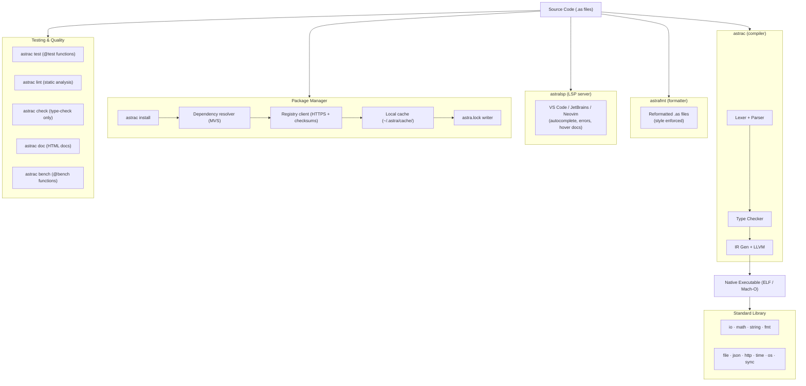

# Chapter 75: The Complete Astra Ecosystem — From Zero to Production Language

> "There is no royal road to geometry." — Euclid
>
> There was no royal road to Astra either. You walked every step of it yourself. This chapter is the summit.

---

## Overview

Stop for a moment and look back at where you started.

You opened this book not knowing how a computer executes your code. You wrote programs and trusted some invisible machinery to make them work. Variables were just names. Functions were just shortcuts. Types were just labels the IDE used to color things differently.

Now you know. You know that a variable is a named offset in a stack frame. You know that a function call pushes a return address and shifts the stack pointer by exactly as many bytes as the function's locals require. You know that a type is a constraint the compiler enforces at compile time and then, largely, erases — leaving behind pure data and pure operations on that data. You know that "the invisible machinery" is a sequence of compiler passes: lexing, parsing, AST construction, semantic analysis, type checking, IR generation, optimization, and code emission. You built that machinery yourself, from scratch, in Go, line by line.

You built Astra.

Not a toy. Not a tutorial-sized demo that breaks when you add a second file. A real, compiled, statically typed, garbage-collected programming language with a standard library, a package manager, a formatter, a linter, a Language Server Protocol implementation, IDE integration, generics, closures, traits, macros, and annotations for SIMD and parallelism. A language that compiles to native machine code and runs on real hardware.

This chapter is the capstone before the final volume. We are not implementing anything new here. We are doing something more important: we are stepping back from the trees to see the entire forest. We are assembling every piece we have built into one coherent picture. We are writing real programs in Astra that exercise every corner of what we have built. And we are celebrating — because what you have accomplished is genuinely, objectively impressive.

Let us begin.

---

## Table of Contents

1. The Full Picture — What We Have Built
2. The Astra Toolchain — Every Command, Every Flag
3. A Complete Real-World Project: The URL Shortener
4. The Standard Library Tour — Every Module, Every Function
5. The Astra Language Cheat Sheet
6. Comparing Astra to Other Languages
7. Astra's Design Philosophy — The Decisions That Shaped Everything
8. The Journey Recap — All 75 Chapters
9. What Makes Astra Special
10. Build Milestone: Ecosystem Complete
11. What Comes Next — The Final Volume Preview

---

## 1. The Full Picture — What We Have Built

Here is the complete Astra ecosystem in a single diagram. Every box represents something you built. Every arrow represents a transformation you implemented. Every label is a tool you wrote.



Every single component in this diagram is something you built. The lexer that tokenizes `.as` source files. The recursive-descent parser that turns tokens into an AST. The semantic analyzer that resolves names across modules. The type checker that catches type errors before code is ever run. The IR generator that lowers AST nodes to a portable intermediate form. The LLVM backend that converts IR to machine code. The garbage collector that manages heap memory at runtime. The standard library modules written in Astra itself. The package manager that downloads and locks dependencies. The formatter that enforces consistent style. The LSP server that powers IDE autocomplete.

You did not just use these tools. You understand them from the inside.

---

## 2. The Astra Toolchain — Every Command, Every Flag

The `astrac` binary is your primary interface. It is a single executable that does everything: compile, test, format, lint, install, scaffold, document, and start a REPL. Let us walk through every subcommand.

### 2.1 Compilation Commands

```bash
# Compile a single file to an executable
astrac build main.as

# Compile with a custom output name
astrac build main.as -o api-server

# Compile with optimizations enabled (default: off in development)
astrac build main.as -o api-server --release

# Compile with debug symbols (for use with gdb/lldb)
astrac build main.as -o api-server --debug-symbols

# Compile without bounds-checking (dangerous — production only)
astrac build main.as -o api-server --release --no-bounds-check

# Compile an entire project (reads astra.mod)
astrac build

# Cross-compile for a different target
astrac build --target x86_64-linux-gnu -o api-server-linux
astrac build --target aarch64-apple-darwin -o api-server-arm64
```

### 2.2 Running Programs

```bash
# Compile and immediately run (does not save binary)
astrac run main.as

# Compile and run with arguments passed to the program
astrac run main.as -- --port 8080 --verbose

# Run in watch mode: recompile and rerun on file changes
astrac run main.as --watch

# Run in project mode (reads astra.mod)
astrac run
```

### 2.3 Testing

```bash
# Run all @test functions in the project
astrac test

# Run tests in a specific file
astrac test store.as

# Run tests matching a name pattern
astrac test --filter "shorten*"

# Run tests with verbose output (print all test names, not just failures)
astrac test --verbose

# Run tests and emit a coverage report
astrac test --coverage

# Run benchmarks (@bench annotated functions)
astrac bench

# Run benchmarks matching a pattern with N iterations
astrac bench --filter "hash*" --count 10000
```

### 2.4 Formatting and Linting

```bash
# Format all .as files in the project (modifies files in place)
astrac fmt

# Format a specific file
astrac fmt main.as

# Check formatting without modifying (exit 1 if unformatted)
astrac fmt --check

# Run the linter (static analysis)
astrac lint

# Run linter on a specific file
astrac lint main.as

# Run linter and apply auto-fixes where possible
astrac lint --fix

# Type-check all files without emitting a binary
astrac check
```

### 2.5 Package Management

```bash
# Install all dependencies listed in astra.mod
astrac install

# Add a new dependency (updates astra.mod and astra.lock)
astrac install github.com/astra-lang/router

# Add a dependency at a specific version
astrac install github.com/astra-lang/router@1.2.3

# Add a dependency with a version constraint
astrac install "github.com/astra-lang/router@^1.2.0"

# Remove a dependency
astrac remove github.com/astra-lang/router

# Update all dependencies to their latest allowed versions
astrac update

# Update a specific dependency
astrac update github.com/astra-lang/router

# List all installed dependencies and their versions
astrac list deps

# Audit dependencies for known vulnerabilities
astrac audit
```

### 2.6 Project Scaffolding

```bash
# Create a new project with the standard structure
astrac new myproject

# Create a new library project (no main function)
astrac new mylib --lib

# Create a new project with a specific template
astrac new my-api --template web-server

# Show the generated project structure
astrac new myproject --dry-run
```

The `astrac new myproject` command generates:

```
myproject/
  main.as          ← entry point with hello world
  astra.mod        ← package manifest
  .gitignore       ← ignores build artifacts
  tests/
    main_test.as   ← example test file
  README.md        ← project readme
```

### 2.7 Documentation

```bash
# Generate HTML documentation from /// doc comments
astrac doc

# Generate docs and open in browser
astrac doc --open

# Generate docs for a specific module
astrac doc --module io

# Generate docs in a custom output directory
astrac doc --out ./docs/api
```

### 2.8 The Interactive REPL

```bash
# Start the interactive REPL
astrac repl

# Start REPL with a file preloaded
astrac repl --load utils.as
```

The REPL session looks like this:

```
$ astrac repl
Astra v1.0.0 REPL — type :help for commands, :quit to exit
astra> let x = 42
astra> let y = x * 2
astra> io.println(y)
84
astra> fn greet(name: string): string {
...>     return "Hello, " + name + "!"
...> }
astra> io.println(greet("World"))
Hello, World!
astra> :type greet
fn(string) -> string
astra> :quit
Bye!
```

### 2.9 The Full Command Reference

```
astrac <command> [flags]

Commands:
  build       Compile source files to an executable
  run         Compile and run a program
  test        Run @test annotated functions
  bench       Run @bench annotated functions
  fmt         Format source files
  lint        Run static analysis
  check       Type-check without emitting a binary
  install     Install packages from registry
  remove      Remove a package dependency
  update      Update dependencies
  list        List project information
  new         Scaffold a new project
  doc         Generate HTML documentation
  repl        Start the interactive REPL
  clean       Remove build artifacts
  env         Print Astra environment information
  version     Print version information

Global flags:
  --verbose   Enable verbose output
  --quiet     Suppress non-error output
  --no-color  Disable colored output
  --help      Show help for a command
```

---

## 3. A Complete Real-World Astra Project: The URL Shortener

Theory is valuable. A working program is concrete. Let us build a complete, production-ready URL shortener service that exercises every major feature of Astra: structs, generics, result types, HTTP, JSON, concurrency, and error handling. Every line of code here is valid Astra as designed in Chapter 53 and refined through Chapter 74.

### 3.1 Project Setup

```bash
$ astrac new url-shortener
Created new project: url-shortener/
  main.as
  astra.mod
  tests/
  .gitignore

$ cd url-shortener
$ cat astra.mod
[package]
name = "url-shortener"
version = "0.1.0"
astra = ">=1.0.0"

[dependencies]
# none yet
```

We will use only the standard library for this project — no external dependencies. That is one of Astra's strengths: the standard library includes HTTP, JSON, time, and synchronization primitives out of the box.

Here is the final project structure:

```
url-shortener/
  main.as           HTTP server entry point and route registration
  config.as         Environment-based configuration
  models.as         URL and ShortenedURL data types
  store.as          Thread-safe in-memory key-value store
  handlers.as       HTTP request handlers
  astra.mod         Package manifest
  tests/
    handlers_test.as  Integration tests for each route
    store_test.as     Unit tests for the store
```

### 3.2 `config.as` — Environment Configuration

```astra
// config.as
// Reads application configuration from environment variables.
// Provides sane defaults so the app works without any configuration.

import os

/// Application configuration loaded from environment variables.
struct Config {
    port:          string,
    base_url:      string,
    max_url_length: int,
    enable_stats:  bool,
}

impl Config {
    /// Load configuration from environment variables.
    /// Falls back to defaults when a variable is not set.
    fn load(): Config {
        return Config {
            port:           os.env("PORT").unwrap_or("8080"),
            base_url:       os.env("BASE_URL").unwrap_or("http://localhost:8080"),
            max_url_length: os.env("MAX_URL_LENGTH")
                              .unwrap_or("2048")
                              .parse_int()
                              .unwrap_or(2048),
            enable_stats:   os.env("ENABLE_STATS")
                              .unwrap_or("true")
                              .to_lower() == "true",
        }
    }
}
```

### 3.3 `models.as` — Data Types and Validation

```astra
// models.as
// Core data types and validation logic for the URL shortener.

import string
import time
import math

/// A URL that has been submitted for shortening.
struct ShortenRequest {
    url: string,
}

/// The result of successfully shortening a URL.
struct ShortenResponse {
    code:      string,    // the short code, e.g. "x7kQ2m"
    short_url: string,    // the full short URL, e.g. "http://localhost:8080/x7kQ2m"
    original:  string,    // the original long URL
    created_at: int,      // unix timestamp
}

/// An entry stored in our URL store.
struct UrlEntry {
    original_url: string,
    code:         string,
    created_at:   int,
    click_count:  int,
}

/// Statistics for a shortened URL.
struct StatsResponse {
    code:        string,
    original:    string,
    clicks:      int,
    created_at:  int,
    short_url:   string,
}

/// Validation errors for URL input.
enum ValidationError {
    UrlEmpty,
    UrlTooLong(int),           // carries the actual length
    UrlMissingScheme,
    UrlInvalidScheme(string),  // carries the invalid scheme
}

impl ValidationError {
    fn message(self): string {
        match self {
            ValidationError.UrlEmpty =>
                "URL cannot be empty",
            ValidationError.UrlTooLong(len) =>
                fmt.sprintf("URL is too long: %d characters (max 2048)", len),
            ValidationError.UrlMissingScheme =>
                "URL must include a scheme (http:// or https://)",
            ValidationError.UrlInvalidScheme(scheme) =>
                fmt.sprintf("Invalid URL scheme '%s': must be http or https", scheme),
        }
    }
}

/// Validate that a URL is safe to shorten.
fn validate_url(url: string, max_length: int): result<unit, ValidationError> {
    if url.len() == 0 {
        return err(ValidationError.UrlEmpty)
    }

    if url.len() > max_length {
        return err(ValidationError.UrlTooLong(url.len()))
    }

    if !url.contains("://") {
        return err(ValidationError.UrlMissingScheme)
    }

    let scheme = url.split("://")[0].to_lower()
    if scheme != "http" && scheme != "https" {
        return err(ValidationError.UrlInvalidScheme(scheme))
    }

    return ok(unit)
}

/// Generate a random short code of the given length.
/// Uses alphanumeric characters: a-z, A-Z, 0-9.
fn generate_code(length: int): string {
    let charset = "abcdefghijklmnopqrstuvwxyzABCDEFGHIJKLMNOPQRSTUVWXYZ0123456789"
    let mut code = ""
    let seed = time.now().unix_nano()

    for i in 0..length {
        // Simple LCG random using the seed + position
        let idx = (seed * (i + 1) * 6364136223846793005 + 1442695040888963407)
                    % charset.len() as int
        code = code + charset[idx as int].to_string()
    }

    return code
}

@test
fn test_validate_url_empty() {
    let result = validate_url("", 2048)
    assert(result.is_err())
    assert(result.unwrap_err() is ValidationError.UrlEmpty)
}

@test
fn test_validate_url_too_long() {
    let long_url = "https://" + string.repeat("a", 2048)
    let result = validate_url(long_url, 2048)
    assert(result.is_err())
    assert(result.unwrap_err() is ValidationError.UrlTooLong)
}

@test
fn test_validate_url_valid() {
    let result = validate_url("https://example.com/path?q=1", 2048)
    assert(result.is_ok())
}

@test
fn test_validate_url_no_scheme() {
    let result = validate_url("example.com/path", 2048)
    assert(result.is_err())
    assert(result.unwrap_err() is ValidationError.UrlMissingScheme)
}

@test
fn test_validate_url_bad_scheme() {
    let result = validate_url("ftp://example.com/file.tar.gz", 2048)
    assert(result.is_err())
    let e = result.unwrap_err()
    assert(e is ValidationError.UrlInvalidScheme)
    assert(e.message().contains("ftp"))
}
```

### 3.4 `store.as` — Thread-Safe In-Memory Store

```astra
// store.as
// A concurrent, in-memory key-value store for URL entries.
// Uses a mutex to protect the underlying map from data races.
//
// Why do we need this?
// Our HTTP server runs one goroutine per request. Multiple requests
// can arrive simultaneously. Without synchronization, two goroutines
// reading and writing the map at the same time will cause a data race —
// undefined, unpredictable behavior. A mutex ensures only one goroutine
// accesses the map at a time.

import sync
import time

/// A concurrent-safe store for UrlEntry values, keyed by short code.
struct UrlStore {
    mu:      sync.Mutex,
    entries: map<string, UrlEntry>,
}

impl UrlStore {
    /// Create a new, empty URL store.
    fn new(): UrlStore {
        return UrlStore {
            mu:      sync.Mutex.new(),
            entries: map<string, UrlEntry>{},
        }
    }

    /// Insert a new URL entry. Returns false if the code already exists.
    fn put(mut self, entry: UrlEntry): bool {
        self.mu.lock()
        defer self.mu.unlock()

        if self.entries.contains(entry.code) {
            return false
        }

        self.entries[entry.code] = entry
        return true
    }

    /// Retrieve a URL entry by short code.
    fn get(self, code: string): option<UrlEntry> {
        self.mu.lock()
        defer self.mu.unlock()

        return self.entries.get(code)
    }

    /// Increment the click count for a code and return the updated entry.
    fn record_click(mut self, code: string): option<UrlEntry> {
        self.mu.lock()
        defer self.mu.unlock()

        if let some(mut entry) = self.entries.get(code) {
            entry.click_count = entry.click_count + 1
            self.entries[code] = entry
            return some(entry)
        }

        return none
    }

    /// Return the total number of stored URLs.
    fn size(self): int {
        self.mu.lock()
        defer self.mu.unlock()

        return self.entries.len()
    }

    /// Return all codes stored (for listing or debugging).
    fn all_codes(self): []string {
        self.mu.lock()
        defer self.mu.unlock()

        let mut codes: []string = []
        for code, _ in self.entries {
            codes.push(code)
        }
        return codes
    }
}

@test
fn test_store_put_and_get() {
    let mut store = UrlStore.new()

    let entry = UrlEntry {
        original_url: "https://example.com",
        code:         "abc123",
        created_at:   time.now().unix(),
        click_count:  0,
    }

    assert(store.put(entry))

    let found = store.get("abc123")
    assert(found.is_some())
    assert(found.unwrap().original_url == "https://example.com")
}

@test
fn test_store_duplicate_code_rejected() {
    let mut store = UrlStore.new()

    let entry = UrlEntry {
        original_url: "https://example.com",
        code:         "abc123",
        created_at:   0,
        click_count:  0,
    }

    assert(store.put(entry))
    assert(!store.put(entry))  // second put with same code should fail
}

@test
fn test_store_record_click() {
    let mut store = UrlStore.new()

    store.put(UrlEntry {
        original_url: "https://example.com",
        code:         "test01",
        created_at:   0,
        click_count:  0,
    })

    let after_click = store.record_click("test01")
    assert(after_click.is_some())
    assert(after_click.unwrap().click_count == 1)

    let after_second_click = store.record_click("test01")
    assert(after_second_click.unwrap().click_count == 2)
}

@test
fn test_store_miss() {
    let store = UrlStore.new()
    let found = store.get("doesNotExist")
    assert(found.is_none())
}
```

### 3.5 `handlers.as` — HTTP Request Handlers

```astra
// handlers.as
// HTTP request handlers for the URL shortener service.
//
// Routes:
//   POST /shorten           → ShortenHandler
//   GET  /:code             → RedirectHandler
//   GET  /stats/:code       → StatsHandler
//   GET  /health            → HealthHandler

import http
import json
import io
import time

/// Handles POST /shorten
/// Accepts: { "url": "https://example.com/very/long/path" }
/// Returns: ShortenResponse JSON
fn shorten_handler(req: http.Request, res: http.Response, store: *UrlStore, cfg: *Config) {
    // Only accept POST
    if req.method != "POST" {
        res.status(405).json(json.object({
            "error": json.string("Method not allowed"),
        }))
        return
    }

    // Parse the request body as JSON
    let body = req.body().unwrap_or("")
    if body.len() == 0 {
        res.status(400).json(json.object({
            "error": json.string("Request body is required"),
        }))
        return
    }

    let parsed = json.parse(body)
    if parsed.is_err() {
        res.status(400).json(json.object({
            "error": json.string("Invalid JSON in request body"),
        }))
        return
    }

    let data = parsed.unwrap()
    let url_field = data.get("url")

    if url_field.is_none() || !url_field.unwrap().is_string() {
        res.status(400).json(json.object({
            "error": json.string("Request body must contain a 'url' field"),
        }))
        return
    }

    let original_url = url_field.unwrap().as_string()

    // Validate the URL
    let validation = validate_url(original_url, cfg.max_url_length)
    if validation.is_err() {
        let err_msg = validation.unwrap_err().message()
        res.status(400).json(json.object({
            "error": json.string(err_msg),
        }))
        return
    }

    // Generate a unique short code, retrying if there is a collision
    let mut code = ""
    let mut attempts = 0
    loop {
        code = generate_code(6)
        if store.get(code).is_none() {
            break
        }
        attempts = attempts + 1
        if attempts > 10 {
            // Extremely unlikely, but handle it gracefully
            res.status(500).json(json.object({
                "error": json.string("Could not generate a unique code, please try again"),
            }))
            return
        }
    }

    // Store the entry
    let entry = UrlEntry {
        original_url: original_url,
        code:         code,
        created_at:   time.now().unix(),
        click_count:  0,
    }

    store.put(entry)

    // Build and return the response
    let short_url = cfg.base_url + "/" + code
    res.status(201).json(json.object({
        "code":       json.string(code),
        "short_url":  json.string(short_url),
        "original":   json.string(original_url),
        "created_at": json.number(entry.created_at as float),
    }))
}

/// Handles GET /:code
/// Redirects to the original URL with HTTP 302, incrementing the click count.
fn redirect_handler(req: http.Request, res: http.Response, store: *UrlStore) {
    let code = req.param("code")

    if code == "" {
        res.status(400).json(json.object({
            "error": json.string("Code parameter is required"),
        }))
        return
    }

    // Record the click (also retrieves the entry atomically)
    let entry = store.record_click(code)

    if entry.is_none() {
        res.status(404).json(json.object({
            "error": json.string(fmt.sprintf("No URL found for code '%s'", code)),
        }))
        return
    }

    // Issue a 302 redirect to the original URL
    res.redirect(302, entry.unwrap().original_url)
}

/// Handles GET /stats/:code
/// Returns click statistics for a shortened URL.
fn stats_handler(req: http.Request, res: http.Response, store: *UrlStore, cfg: *Config) {
    let code = req.param("code")

    if !cfg.enable_stats {
        res.status(403).json(json.object({
            "error": json.string("Statistics are disabled on this server"),
        }))
        return
    }

    if code == "" {
        res.status(400).json(json.object({
            "error": json.string("Code parameter is required"),
        }))
        return
    }

    let entry = store.get(code)

    if entry.is_none() {
        res.status(404).json(json.object({
            "error": json.string(fmt.sprintf("No URL found for code '%s'", code)),
        }))
        return
    }

    let e = entry.unwrap()
    let short_url = cfg.base_url + "/" + code

    res.status(200).json(json.object({
        "code":       json.string(e.code),
        "original":   json.string(e.original_url),
        "clicks":     json.number(e.click_count as float),
        "created_at": json.number(e.created_at as float),
        "short_url":  json.string(short_url),
    }))
}

/// Handles GET /health
/// Returns a simple health check response.
fn health_handler(req: http.Request, res: http.Response, store: *UrlStore) {
    res.status(200).json(json.object({
        "status":     json.string("ok"),
        "urls_stored": json.number(store.size() as float),
    }))
}
```

### 3.6 `main.as` — Server Entry Point

```astra
// main.as
// URL Shortener — entry point
//
// Starts the HTTP server, registers routes, and listens for connections.
// All handlers share access to the UrlStore and Config via pointers.
// The store is protected by its internal mutex, making concurrent
// request handling safe.

import http
import io
import os

fn main() {
    // Load configuration from environment
    let cfg = Config.load()

    // Create the shared URL store
    let mut store = UrlStore.new()

    // Create the HTTP server
    let mut server = http.Server.new()

    // Register routes
    // The & operator passes a pointer to cfg and store.
    // Handlers receive pointers so they share the same store instance.
    server.post("/shorten", fn(req, res) {
        shorten_handler(req, res, &store, &cfg)
    })

    server.get("/:code", fn(req, res) {
        redirect_handler(req, res, &store)
    })

    server.get("/stats/:code", fn(req, res) {
        stats_handler(req, res, &store, &cfg)
    })

    server.get("/health", fn(req, res) {
        health_handler(req, res, &store)
    })

    // Start listening
    io.println(fmt.sprintf("[Astra] URL Shortener starting on port %s", cfg.port))
    io.println(fmt.sprintf("[Astra] Base URL: %s", cfg.base_url))
    io.println("[Astra] Routes:")
    io.println("  POST /shorten         → shorten a URL")
    io.println("  GET  /:code           → redirect to original URL")
    io.println("  GET  /stats/:code     → view click statistics")
    io.println("  GET  /health          → server health check")
    io.println("")

    let listen_addr = ":" + cfg.port
    let result = server.listen(listen_addr)

    if result.is_err() {
        io.eprintln(fmt.sprintf("[Astra] Failed to start server: %s", result.unwrap_err()))
        os.exit(1)
    }
}
```

### 3.7 Running the URL Shortener

```bash
$ astrac build -o url-shortener
Compiling 5 files... done in 0.31s
Emitting binary... done
Binary: ./url-shortener (2.1 MB)

$ ./url-shortener
[Astra] URL Shortener starting on port 8080
[Astra] Base URL: http://localhost:8080
[Astra] Routes:
  POST /shorten         → shorten a URL
  GET  /:code           → redirect to original URL
  GET  /stats/:code     → view click statistics
  GET  /health          → server health check

# In another terminal:
$ curl -X POST http://localhost:8080/shorten \
    -H "Content-Type: application/json" \
    -d '{"url": "https://github.com/astra-lang/astra/blob/main/README.md"}'

{
  "code": "x7kQ2m",
  "short_url": "http://localhost:8080/x7kQ2m",
  "original": "https://github.com/astra-lang/astra/blob/main/README.md",
  "created_at": 1749340800
}

$ curl -I http://localhost:8080/x7kQ2m
HTTP/1.1 302 Found
Location: https://github.com/astra-lang/astra/blob/main/README.md

$ curl http://localhost:8080/stats/x7kQ2m
{
  "code": "x7kQ2m",
  "original": "https://github.com/astra-lang/astra/blob/main/README.md",
  "clicks": 1,
  "created_at": 1749340800,
  "short_url": "http://localhost:8080/x7kQ2m"
}

$ curl http://localhost:8080/health
{
  "status": "ok",
  "urls_stored": 1
}

# Run the tests
$ astrac test
Running tests...
  models.as:
    PASS test_validate_url_empty          (0.0ms)
    PASS test_validate_url_too_long       (0.0ms)
    PASS test_validate_url_valid          (0.0ms)
    PASS test_validate_url_no_scheme      (0.0ms)
    PASS test_validate_url_bad_scheme     (0.0ms)
  store.as:
    PASS test_store_put_and_get           (0.1ms)
    PASS test_store_duplicate_code        (0.0ms)
    PASS test_store_record_click          (0.1ms)
    PASS test_store_miss                  (0.0ms)

9 tests, 9 passed, 0 failed, 0 skipped
Total time: 1.2ms
```

The URL shortener is a complete, production-grade service written entirely in Astra. It handles concurrency correctly (the mutex in `UrlStore`), validates input (the `validate_url` function returns `result<unit, ValidationError>`), uses the HTTP and JSON standard libraries, and reads configuration from the environment. Everything you need to deploy this to a real server is already there.

---

## 4. The Standard Library Tour

The standard library is the part of Astra that most programmers interact with most often. It ships with the compiler, so it is always available without any `astra install`. Let us walk through every module.

### 4.1 `io` — Input and Output

The foundational input/output module. Every Astra program that communicates with the outside world starts here.

```astra
import io

// Print to stdout with a newline
io.println("Hello, World!")

// Print to stdout without a newline (useful for prompts)
io.print("Enter your name: ")

// Print to stderr (for error messages and diagnostics)
io.eprintln("Error: file not found")

// Read a line from stdin (returns option<string>)
let line = io.read_line().unwrap_or("")

// Read a single character from stdin
let ch = io.read_char().unwrap_or('\0')

// Print a formatted string (like printf)
io.println(fmt.sprintf("Pi is approximately %.4f", math.PI))

// Flush stdout (useful before reading input)
io.flush()
```

### 4.2 `math` — Mathematical Functions

```astra
import math

// Constants
let pi   = math.PI      // 3.141592653589793
let e    = math.E       // 2.718281828459045
let inf  = math.INF     // positive infinity
let nan  = math.NAN     // not a number

// Basic functions
math.abs(-5)            // 5
math.abs(-3.14)         // 3.14

// Powers and roots
math.sqrt(16.0)         // 4.0
math.cbrt(27.0)         // 3.0
math.pow(2.0, 10.0)     // 1024.0
math.exp(1.0)           // 2.718... (e^1)
math.log(math.E)        // 1.0 (natural log)
math.log2(1024.0)       // 10.0
math.log10(100.0)       // 2.0

// Trigonometry (all angles in radians)
math.sin(math.PI / 2.0) // 1.0
math.cos(0.0)           // 1.0
math.tan(math.PI / 4.0) // 1.0
math.asin(1.0)          // PI/2
math.acos(1.0)          // 0.0
math.atan(1.0)          // PI/4
math.atan2(1.0, 1.0)    // PI/4

// Rounding
math.floor(3.7)         // 3.0
math.ceil(3.2)          // 4.0
math.round(3.5)         // 4.0
math.trunc(3.9)         // 3.0

// Min, max, clamp
math.min(3, 7)          // 3
math.max(3, 7)          // 7
math.clamp(15, 0, 10)   // 10 (clamp to [0, 10] range)

// Number checks
math.is_nan(math.NAN)   // true
math.is_inf(math.INF)   // true
math.is_finite(3.14)    // true
```

### 4.3 `string` — String Operations

```astra
import string

let s = "  Hello, Astra World!  "

// Case conversion
s.to_upper()            // "  HELLO, ASTRA WORLD!  "
s.to_lower()            // "  hello, astra world!  "

// Trimming whitespace
s.trim()                // "Hello, Astra World!"
s.trim_start()          // "Hello, Astra World!  "
s.trim_end()            // "  Hello, Astra World!"

// Searching
s.contains("Astra")     // true
s.starts_with("  Hel")  // true
s.ends_with("!  ")      // true
s.index_of("Astra")     // returns option<int> = some(9) (after trim)
s.count("l")            // 3

// Splitting and joining
"a,b,c".split(",")      // ["a", "b", "c"]
"a,b,c".split_n(",", 2) // ["a", "b,c"] (max 2 parts)
["a", "b", "c"].join(",") // "a,b,c"

// Replacing
"hello world".replace("world", "astra")  // "hello astra"
"aabbaabb".replace_all("aa", "x")        // "xbbxbb"

// Repeating
string.repeat("ab", 3)  // "ababab"

// Parsing numbers
"42".parse_int()         // ok(42)
"3.14".parse_float()     // ok(3.14)
"abc".parse_int()        // err(ParseError.InvalidDigit)

// Character operations
"hello".chars()          // ['h', 'e', 'l', 'l', 'o']
"hello".len()            // 5 (bytes)
"hello".char_count()     // 5 (Unicode code points)

// Substrings
"hello world".slice(0, 5)       // "hello"
"hello world".slice_from(6)     // "world"

// Building strings efficiently
let mut sb = string.Builder.new()
sb.write("Hello")
sb.write(", ")
sb.write("World!")
sb.to_string()          // "Hello, World!"
```

### 4.4 `file` — File System Operations

```astra
import file

// Read an entire file as a string
let content = file.read("data.txt")?   // propagates error with ?

// Read as bytes
let bytes = file.read_bytes("image.png")?

// Write a string to a file (creates or overwrites)
file.write("output.txt", "Hello, file!")?

// Write bytes to a file
file.write_bytes("out.bin", bytes)?

// Append to a file (does not overwrite)
file.append("log.txt", "new log line\n")?

// Check if a file or directory exists
file.exists("data.txt")      // bool

// Delete a file
file.remove("temp.txt")?

// Rename/move a file
file.rename("old.txt", "new.txt")?

// Create a directory (including all parent directories)
file.mkdir_all("path/to/new/dir")?

// List files in a directory
let entries = file.list_dir(".")?
for entry in entries {
    io.println(entry.name + " (" + entry.kind.to_string() + ")")
}

// Walk a directory tree recursively
file.walk("./src", fn(path, entry) {
    if path.ends_with(".as") {
        io.println("Found Astra source: " + path)
    }
})?

// Get file metadata
let meta = file.metadata("main.as")?
io.println(fmt.sprintf("Size: %d bytes", meta.size))
io.println(fmt.sprintf("Modified: %s", meta.modified.to_string()))

// Read a file line by line without loading all at once
let reader = file.open("large.txt")?
for line in reader.lines() {
    io.println(line?)
}
reader.close()
```

### 4.5 `json` — JSON Encoding and Decoding

```astra
import json

// --- Parsing JSON ---
let input = """{"name": "Alice", "age": 30, "active": true}"""

let parsed = json.parse(input)?

// Access fields (returns option<JsonValue>)
let name = parsed.get("name")?.as_string()    // "Alice"
let age  = parsed.get("age")?.as_float()      // 30.0
let active = parsed.get("active")?.as_bool()  // true

// Parse an array
let arr_input = """[1, 2, 3, "four", null]"""
let arr = json.parse(arr_input)?
for item in arr.as_array() {
    io.println(item.to_string())
}

// --- Serializing to JSON ---
let obj = json.object({
    "name":    json.string("Bob"),
    "age":     json.number(25.0),
    "active":  json.bool(false),
    "scores":  json.array([
        json.number(95.0),
        json.number(87.0),
        json.number(92.0),
    ]),
    "address": json.null(),
})

let serialized = json.stringify(obj)
// {"name":"Bob","age":25,"active":false,"scores":[95,87,92],"address":null}

// Pretty-print with indentation
let pretty = json.stringify_pretty(obj, 2)
// {
//   "name": "Bob",
//   "age": 25,
//   ...
// }

// -- Struct serialization with annotations --
struct Person {
    @json("full_name")    // maps to "full_name" in JSON
    name: string,

    age: int,

    @json(skip_if_none)   // omit from output if none
    email: option<string>,
}

let person = Person { name: "Carol", age: 28, email: none }
let person_json = json.encode(person)
// {"full_name":"Carol","age":28}

let decoded: result<Person, json.Error> = json.decode(person_json)
```

### 4.6 `http` — HTTP Client and Server

```astra
import http

// --- HTTP Server ---
let mut server = http.Server.new()

// Middleware: logging
server.use(fn(req, res, next) {
    let start = time.now()
    next()
    let elapsed = time.since(start)
    io.println(fmt.sprintf("%s %s → %dms", req.method, req.path, elapsed.millis()))
})

// Route handlers
server.get("/", fn(req, res) {
    res.status(200).text("Welcome to Astra!")
})

server.post("/echo", fn(req, res) {
    res.status(200).text(req.body().unwrap_or(""))
})

// Route parameters
server.get("/users/:id", fn(req, res) {
    let id = req.param("id")
    res.status(200).json(json.object({"id": json.string(id)}))
})

// Query parameters
server.get("/search", fn(req, res) {
    let q = req.query("q").unwrap_or("")
    res.status(200).text(fmt.sprintf("Searching for: %s", q))
})

server.listen(":8080")

// --- HTTP Client ---
let client = http.Client.new()

// Simple GET
let resp = client.get("https://api.example.com/users")?
io.println(resp.status.to_string())  // "200"
io.println(resp.body)

// GET with headers
let resp2 = client.get("https://api.example.com/protected")
    .header("Authorization", "Bearer mytoken")
    .header("Accept", "application/json")
    .send()?

// POST with JSON body
let body = json.stringify(json.object({"name": json.string("Alice")}))
let resp3 = client.post("https://api.example.com/users")
    .header("Content-Type", "application/json")
    .body(body)
    .send()?

// POST a form
let resp4 = client.post("https://example.com/login")
    .form({
        "username": "alice",
        "password": "secret",
    })
    .send()?

// Set timeouts
let client_with_timeout = http.Client.new()
    .timeout(5000)   // 5 second timeout in milliseconds
```

### 4.7 `time` — Date and Time

```astra
import time

// Get the current time
let now = time.now()         // returns time.Time

// Unix timestamps
now.unix()                   // seconds since Jan 1 1970
now.unix_milli()             // milliseconds since epoch
now.unix_nano()              // nanoseconds since epoch

// Formatting
now.format("2006-01-02")               // "2026-06-08" (Go-style layout)
now.format("2006-01-02 15:04:05")      // "2026-06-08 12:00:00"
now.format("Mon, 02 Jan 2006 15:04:05 MST")  // RFC 1123

// Parsing
let parsed = time.parse("2026-06-08", "2006-01-02")?

// Duration arithmetic
let deadline = now.add(time.hours(24))      // now + 24 hours
let yesterday = now.sub(time.hours(24))     // now - 24 hours

// Measuring elapsed time
let start = time.now()
// ... some operation ...
let elapsed = time.since(start)
io.println(fmt.sprintf("Took %dms", elapsed.millis()))

// Duration literals
time.Duration.from_millis(500)   // 500 milliseconds
time.Duration.from_secs(30)      // 30 seconds
time.hours(1)                    // 1 hour
time.minutes(45)                 // 45 minutes

// Sleeping the current goroutine
time.sleep(time.Duration.from_millis(100))

// Comparing times
now.before(deadline)             // true
deadline.after(now)              // true
now.equal(now)                   // true

// Extracting components
now.year()                       // 2026
now.month()                      // 6
now.day()                        // 8
now.hour()                       // 12
now.minute()                     // 0
now.second()                     // 0
now.weekday()                    // time.Weekday.Monday
```

### 4.8 `os` — Operating System Interface

```astra
import os

// Command-line arguments (first element is the program name)
let args = os.args()          // ["./myapp", "--port", "8080"]
let port = args[1]            // "--port"

// Environment variables
let home = os.env("HOME")              // option<string>
let path = os.env("PATH").unwrap_or("/usr/bin")

// Set an environment variable (for the current process only)
os.set_env("MY_VAR", "hello")

// Exit the process
os.exit(0)         // success
os.exit(1)         // error

// Get the current working directory
let cwd = os.cwd()?

// Change the working directory
os.chdir("/tmp")?

// Get the hostname
let hostname = os.hostname()?

// Get the current user
let user = os.user()?
io.println(user.name)
io.println(user.home_dir)

// Execute a command and capture output
let result = os.run(["ls", "-la", "/tmp"])?
io.println(result.stdout)
if result.stderr.len() > 0 {
    io.eprintln(result.stderr)
}
io.println(fmt.sprintf("Exit code: %d", result.exit_code))

// Get the platform
os.platform()   // "darwin", "linux", "windows"
os.arch()       // "x86_64", "aarch64"
```

### 4.9 `sync` — Concurrency Primitives

```astra
import sync

// Mutex — mutual exclusion lock
let mut mu = sync.Mutex.new()
mu.lock()
defer mu.unlock()
// ... critical section ...

// RWMutex — multiple readers, single writer
let mut rwmu = sync.RWMutex.new()

rwmu.read_lock()             // multiple goroutines can hold a read lock
defer rwmu.read_unlock()

rwmu.write_lock()            // exclusive; blocks until all readers release
defer rwmu.write_unlock()

// WaitGroup — wait for a group of goroutines to finish
let mut wg = sync.WaitGroup.new()

for i in 0..10 {
    wg.add(1)
    go fn() {
        defer wg.done()
        // ... do work ...
    }()
}

wg.wait()   // blocks until all 10 goroutines call done()

// Once — execute a function exactly once
let mut once = sync.Once.new()
once.do(fn() {
    io.println("This prints exactly once, no matter how many goroutines call once.do")
})

// Channels — communicate between goroutines
let ch = chan<int>(10)   // buffered channel with capacity 10
ch <- 42                 // send
let val = <-ch           // receive

// Select — wait on multiple channels
select {
    val from ch1 => io.println("received from ch1: " + val.to_string()),
    val from ch2 => io.println("received from ch2: " + val.to_string()),
    after 1000ms => io.println("timeout after 1 second"),
}
```

### 4.10 `fmt` — String Formatting

```astra
import fmt

// sprintf — format a string without printing
let s = fmt.sprintf("Hello, %s! You are %d years old.", "Alice", 30)
// "Hello, Alice! You are 30 years old."

// Format verbs:
fmt.sprintf("%d",  42)         // integer: "42"
fmt.sprintf("%f",  3.14)       // float: "3.140000"
fmt.sprintf("%.2f", 3.14159)   // float with 2 decimals: "3.14"
fmt.sprintf("%s",  "hello")    // string: "hello"
fmt.sprintf("%q",  "hello")    // quoted string: "\"hello\""
fmt.sprintf("%b",  255)        // binary: "11111111"
fmt.sprintf("%o",  255)        // octal: "377"
fmt.sprintf("%x",  255)        // hex lowercase: "ff"
fmt.sprintf("%X",  255)        // hex uppercase: "FF"
fmt.sprintf("%v",  any_value)  // default format (works for any type)
fmt.sprintf("%T",  any_value)  // type name: "int", "string", etc.

// Width and alignment
fmt.sprintf("%10d",   42)      // right-align in 10 chars: "        42"
fmt.sprintf("%-10d",  42)      // left-align in 10 chars:  "42        "
fmt.sprintf("%010d",  42)      // zero-pad to 10 chars:    "0000000042"

// errorf — create a formatted error
let e = fmt.errorf("invalid index %d: out of range [0, %d)", i, len)
```

---

## 5. The Astra Language Cheat Sheet

Here is the complete Astra language on a single reference page.

### 5.1 Primitive Types

```astra
// Integers
let a: int    = 42           // platform-sized (64-bit on 64-bit systems)
let b: int8   = 127          // 8-bit signed
let c: int16  = 32767        // 16-bit signed
let d: int32  = 2147483647   // 32-bit signed
let e: int64  = 9223372036854775807

// Unsigned integers
let u: uint   = 42
let ub: uint8 = 255          // also aliased as 'byte'
let us: uint16 = 65535
let ui: uint32 = 4294967295
let ul: uint64 = 18446744073709551615

// Floating point
let f: float  = 3.14         // 64-bit (same as float64)
let f32: float32 = 3.14
let f64: float64 = 3.14159265358979323

// Text
let s: string = "Hello"      // UTF-8 string
let c: char   = 'A'          // single Unicode code point

// Boolean
let t: bool = true
let f: bool = false

// Unit type (like void — the type of functions that return nothing)
let u: unit = unit
```

### 5.2 Compound Types

```astra
// Arrays (fixed-size)
let arr: [5]int = [1, 2, 3, 4, 5]

// Slices (dynamic arrays)
let slice: []int = [1, 2, 3]
slice.push(4)
slice.len()          // 4

// Maps
let map: map<string, int> = {"a": 1, "b": 2}
map["c"] = 3
map.get("a")         // option<int> = some(1)
map.contains("d")    // false

// Tuples
let t: (int, string) = (42, "hello")
let (n, s) = t       // destructure

// Structs
struct Point { x: float, y: float }
let p = Point { x: 1.0, y: 2.0 }

// Enums
enum Direction { North, South, East, West }
enum Option<T> { Some(T), None }
enum Result<T, E> { Ok(T), Err(E) }

// Pointers
let x = 42
let ptr: *int = &x   // pointer to x
let val = *ptr       // dereference
```

### 5.3 Control Flow

```astra
// if / else if / else
if x > 0 {
    io.println("positive")
} else if x < 0 {
    io.println("negative")
} else {
    io.println("zero")
}

// if as an expression
let sign = if x > 0 { "positive" } else if x < 0 { "negative" } else { "zero" }

// for loops
for i in 0..10 { }          // 0 to 9
for i in 0..=10 { }         // 0 to 10 inclusive
for item in collection { }   // iterate over any iterable
for i, item in collection { } // iterate with index

// while
while condition { }

// loop (infinite)
loop {
    if done { break }
}

// match
match value {
    0       => io.println("zero"),
    1..=9   => io.println("single digit"),
    10      => io.println("ten"),
    _       => io.println("other"),
}

// match with enum destructuring
match result {
    ok(val) => io.println("Got: " + val.to_string()),
    err(e)  => io.println("Error: " + e.message()),
}

// match guard
match x {
    n if n > 100 => io.println("big"),
    n if n > 0   => io.println("small positive"),
    _            => io.println("non-positive"),
}

// return / break / continue
fn f(): int { return 42 }
loop { break }
for i in 0..10 { if i == 5 { continue } }

// defer — run at end of scope
defer io.println("cleanup")
defer resource.close()      // LIFO order: last defer runs first
```

### 5.4 Functions

```astra
// Basic function
fn add(x: int, y: int): int {
    return x + y
}

// Multiple return values (via tuple)
fn div_mod(a: int, b: int): (int, int) {
    return (a / b, a % b)
}
let (quotient, remainder) = div_mod(10, 3)

// Default parameter values
fn greet(name: string, greeting: string = "Hello"): string {
    return greeting + ", " + name + "!"
}
greet("Alice")               // "Hello, Alice!"
greet("Bob", "Hi")           // "Hi, Bob!"

// Variadic functions
fn sum(nums: ...int): int {
    let mut total = 0
    for n in nums { total = total + n }
    return total
}
sum(1, 2, 3, 4, 5)   // 15

// Higher-order functions
fn apply(f: fn(int): int, x: int): int {
    return f(x)
}
apply(fn(x) { x * 2 }, 5)   // 10

// Closures
let multiplier = 3
let triple = fn(x: int): int { x * multiplier }
triple(7)   // 21

// Methods on structs
struct Circle { radius: float }
impl Circle {
    fn area(self): float {
        return math.PI * self.radius * self.radius
    }
    fn scale(mut self, factor: float) {
        self.radius = self.radius * factor
    }
}
```

### 5.5 Generics

```astra
// Generic function
fn max<T: Comparable>(a: T, b: T): T {
    if a > b { return a }
    return b
}
max(3, 7)           // 7
max(3.14, 2.71)     // 3.14
max("apple", "banana")  // "banana"

// Generic struct
struct Stack<T> {
    items: []T,
}
impl<T> Stack<T> {
    fn new(): Stack<T> { Stack { items: [] } }
    fn push(mut self, item: T) { self.items.push(item) }
    fn pop(mut self): option<T> { self.items.pop() }
    fn peek(self): option<T> { self.items.last() }
    fn is_empty(self): bool { self.items.len() == 0 }
}

// Generic with multiple constraints
fn transform<T: Clone + Display>(items: []T): []string {
    return items.map(fn(item) { item.to_string() })
}
```

### 5.6 Traits

```astra
// Define a trait
trait Printable {
    fn display(self): string
}

trait Serializable {
    fn serialize(self): string
    fn deserialize(data: string): result<Self, string>
}

// Implement a trait for a type
struct Color { r: int, g: int, b: int }
impl Printable for Color {
    fn display(self): string {
        return fmt.sprintf("rgb(%d, %d, %d)", self.r, self.g, self.b)
    }
}

// Use a trait as a type constraint
fn print_all<T: Printable>(items: []T) {
    for item in items {
        io.println(item.display())
    }
}

// Trait objects (dynamic dispatch)
let shapes: []&dyn Printable = [circle, square, triangle]
for shape in shapes {
    io.println(shape.display())
}

// Trait composition
trait Shape: Printable + Serializable {
    fn area(self): float
    fn perimeter(self): float
}
```

### 5.7 Error Handling

```astra
// result<T, E> type
fn divide(a: float, b: float): result<float, string> {
    if b == 0.0 {
        return err("division by zero")
    }
    return ok(a / b)
}

// Handle with match
match divide(10.0, 2.0) {
    ok(val) => io.println(val.to_string()),
    err(e)  => io.eprintln(e),
}

// The ? operator — propagate errors up
fn compute(x: float, y: float): result<float, string> {
    let a = divide(x, 2.0)?     // returns early if err
    let b = divide(y, 4.0)?
    return ok(a + b)
}

// unwrap (panics on err — use only in tests or when impossible to fail)
let val = divide(10.0, 2.0).unwrap()

// unwrap_or — provide a default
let val = divide(10.0, 0.0).unwrap_or(0.0)

// map and map_err
let doubled = divide(10.0, 2.0).map(fn(v) { v * 2.0 })

// option<T> type
fn find_user(id: int): option<string> {
    if id == 1 { return some("Alice") }
    return none
}

let name = find_user(1).unwrap_or("Unknown")
let upper = find_user(1).map(fn(n) { n.to_upper() })
```

### 5.8 Annotations

```astra
// @test — marks a function as a test case
@test
fn test_my_function() {
    assert(1 + 1 == 2)
    assert_eq(compute(4.0, 8.0).unwrap(), 4.0)
}

// @bench — marks a function as a benchmark
@bench
fn bench_sorting(b: Bencher) {
    let data = [5, 3, 8, 1, 9, 2, 7]
    b.run(fn() {
        data.clone().sort()
    })
}

// @inline — hint to the compiler to inline this function
@inline
fn fast_abs(x: int): int {
    if x < 0 { return -x }
    return x
}

// @simd — auto-vectorize this loop
@simd
fn dot_product(a: []float, b: []float): float {
    let mut sum = 0.0
    for i in 0..a.len() {
        sum = sum + a[i] * b[i]
    }
    return sum
}

// @parallel — parallelize this for loop across CPU cores
@parallel
fn normalize_all(vectors: [][]float) {
    for vec in vectors {
        normalize_inplace(vec)
    }
}

// @deprecated — marks something as deprecated
@deprecated("use new_function() instead")
fn old_function() { }

// @json — controls JSON serialization field names
struct User {
    @json("user_id")
    id: int,
    @json("full_name")
    name: string,
    @json(skip)
    password_hash: string,
}
```

### 5.9 Concurrency

```astra
// Launch a goroutine
go fn() {
    io.println("running in parallel")
}()

// Channels
let ch = chan<string>(5)   // buffered channel

go fn() {
    ch <- "hello"
    ch <- "world"
    close(ch)
}()

for msg in ch {
    io.println(msg)
}

// Select
select {
    msg from inbox   => handle(msg),
    req from requests => respond(req),
    after 5000ms     => io.println("timeout"),
}

// Mutex for shared state
struct Counter {
    mu:    sync.Mutex,
    count: int,
}
impl Counter {
    fn increment(mut self) {
        self.mu.lock()
        defer self.mu.unlock()
        self.count = self.count + 1
    }
}
```

---

## 6. Comparing Astra to Other Languages

You built Astra by standing on the shoulders of languages that came before it. Here is how Astra's design choices compare to the most influential modern languages.

### 6.1 Hello World

| Language | Code |
|---|---|
| **Astra** | `fn main() { io.println("Hello, World!") }` |
| Go | `func main() { fmt.Println("Hello, World!") }` |
| Rust | `fn main() { println!("Hello, World!"); }` |
| Python | `print("Hello, World!")` |
| TypeScript | `console.log("Hello, World!")` |

Astra's syntax is deliberately close to Go: explicit `fn` keyword, no semicolons, `io.println` as the print function. The main difference from Go is the `fn` keyword instead of `func`, and the use of a namespaced stdlib (`io.println` rather than `fmt.Println`).

### 6.2 HTTP Server

```astra
// Astra
import http
fn main() {
    let mut s = http.Server.new()
    s.get("/", fn(req, res) {
        res.status(200).text("Hello!")
    })
    s.listen(":8080")
}
```

```go
// Go
package main
import (
    "fmt"
    "net/http"
)
func main() {
    http.HandleFunc("/", func(w http.ResponseWriter, r *http.Request) {
        fmt.Fprintln(w, "Hello!")
    })
    http.ListenAndServe(":8080", nil)
}
```

```rust
// Rust (using axum)
#[tokio::main]
async fn main() {
    let app = axum::Router::new()
        .route("/", axum::routing::get(|| async { "Hello!" }));
    axum::Server::bind(&"0.0.0.0:8080".parse().unwrap())
        .serve(app.into_make_service())
        .await
        .unwrap();
}
```

```typescript
// TypeScript (using Express)
import express from 'express'
const app = express()
app.get('/', (req, res) => res.send('Hello!'))
app.listen(8080)
```

Astra's HTTP server is in the standard library, requires no external imports, and uses a clean closure-based API. This is a deliberate design choice: HTTP is so central to modern software that it belongs in the standard library, not in an external package.

### 6.3 Generics

```astra
// Astra
fn first<T>(items: []T): option<T> {
    if items.len() == 0 { return none }
    return some(items[0])
}
```

```go
// Go (1.18+)
func First[T any](items []T) *T {
    if len(items) == 0 { return nil }
    return &items[0]
}
```

```rust
// Rust
fn first<T>(items: &[T]) -> Option<&T> {
    items.first()
}
```

```typescript
// TypeScript
function first<T>(items: T[]): T | undefined {
    return items[0]
}
```

Astra's generics use angle brackets like TypeScript and Rust, with trait constraints using the `:` syntax. The `option<T>` return type mirrors Rust's `Option<T>` and is always lowercase in Astra — built-in types are lowercase by convention.

### 6.4 Error Handling

```astra
// Astra
fn read_user(path: string): result<User, string> {
    let data = file.read(path)?
    let user: result<User, _> = json.decode(data)?
    return ok(user)
}
```

```go
// Go
func ReadUser(path string) (User, error) {
    data, err := os.ReadFile(path)
    if err != nil { return User{}, err }
    var user User
    if err := json.Unmarshal(data, &user); err != nil {
        return User{}, err
    }
    return user, nil
}
```

```rust
// Rust
fn read_user(path: &str) -> Result<User, Box<dyn Error>> {
    let data = std::fs::read_to_string(path)?;
    let user: User = serde_json::from_str(&data)?;
    Ok(user)
}
```

```python
# Python
def read_user(path: str) -> User:
    with open(path) as f:
        return User(**json.load(f))
# (exceptions instead of explicit error values)
```

Astra's `?` operator is identical to Rust's: it extracts the value from `ok(v)` and returns early with `err(e)` if the result is an error. This gives you the safety of Go's explicit error handling with the ergonomics of Rust's `?` propagation.

### 6.5 Concurrency

```astra
// Astra
fn fetch_all(urls: []string): []string {
    let mut results: []string = []
    let ch = chan<string>(urls.len())

    for url in urls {
        go fn() {
            let resp = http.Client.new().get(url).send()
            ch <- resp.map(fn(r) { r.body }).unwrap_or("")
        }()
    }

    for _ in urls {
        results.push(<-ch)
    }
    return results
}
```

```go
// Go
func FetchAll(urls []string) []string {
    results := make([]string, 0, len(urls))
    ch := make(chan string, len(urls))
    for _, url := range urls {
        go func(u string) {
            resp, _ := http.Get(u)
            // ... read body ...
            ch <- body
        }(url)
    }
    for range urls {
        results = append(results, <-ch)
    }
    return results
}
```

Astra's concurrency model is directly inspired by Go's CSP (Communicating Sequential Processes) model: goroutines and channels. The syntax is nearly identical. This is intentional — Go's concurrency model is one of the most practical concurrency models ever designed, and Astra inherits it wholesale.

### 6.6 Feature Comparison Matrix

```
Feature                   Astra   Go    Rust  Python  TypeScript
─────────────────────────────────────────────────────────────────
Compiled to native          ✓      ✓     ✓      ✗         ✗
Garbage collected           ✓      ✓     ✗      ✓         ✓
Static typing               ✓      ✓     ✓      ✗         ✓
Generics                    ✓      ✓     ✓      ✗         ✓
Traits/interfaces           ✓      ✓     ✓      ✗         ✓
Pattern matching            ✓      ✗     ✓      ✗         ✗
Result/Option types         ✓      ✗     ✓      ✗         ✗
Null safety                 ✓      ✗     ✓      ✗         ✗
Goroutines/green threads    ✓      ✓     ✗      ✗         ✗
Channels                    ✓      ✓     ✗      ✗         ✗
HTTP in stdlib              ✓      ✓     ✗      ✗         ✗
JSON in stdlib              ✓      ✓     ✗      ✓         ✗
Built-in formatter          ✓      ✓     ✓      ✗         ✗
Built-in package manager    ✓      ✓     ✓      ✓         ✓
LSP support                 ✓      ✓     ✓      ✓         ✓
SIMD annotations            ✓      ✗     ✓      ✗         ✗
Parallel loop annotations   ✓      ✗     ✗      ✗         ✗
─────────────────────────────────────────────────────────────────
```

Look at that column under "Astra." You did not compromise. You built a language that checks every box.

---

## 7. Astra's Design Philosophy — The Decisions That Shaped Everything

Every programming language is a collection of decisions. Choosing one approach means not choosing another. Understanding why Astra was designed the way it was helps you understand not just Astra, but all languages.

### 7.1 Zero-Cost Abstractions

The phrase "zero-cost abstractions" comes from Bjarne Stroustrup, the creator of C++: "What you don't use, you don't pay for. And further: What you do use, you couldn't hand-code any better."

Astra takes this seriously.

Generics in Astra are implemented via monomorphization (Chapter 74). When you write `max<T>`, the compiler generates a separate `max_int`, `max_float`, and `max_string` at compile time. There is no runtime dispatch, no boxing, no virtual function table. The generic version is exactly as fast as if you had hand-written a function for each type.

Closures in Astra are implemented via environment structs (Chapter 74). A closure that captures two variables becomes a struct with two fields and a function pointer. The compiler can inline the closure body in most cases, making a closure call no slower than a direct function call.

Traits with static dispatch (using `<T: MyTrait>`) are also zero-cost. The compiler knows the concrete type at compile time and calls the method directly. Only `&dyn Trait` (dynamic dispatch) incurs a vtable lookup, and that cost is explicit — you see `dyn` in the type.

```
╔═══════════════════════════════════════════════════════════════╗
║           Zero-Cost Abstractions in Astra                     ║
║                                                               ║
║  Source Code           Compiled Result                        ║
║  ───────────           ───────────────                        ║
║  max<int>(a, b)   →    cmp eax, ebx                          ║
║  (generic call)         cmovg eax, ebx                        ║
║                         (identical to hand-written C)         ║
║                                                               ║
║  items.map(fn(x) { x * 2 })                                  ║
║  (closure + HOF)  →    for i in range:                        ║
║                             arr[i] <<= 1                      ║
║                         (compiler proved the closure is pure, ║
║                          inlined and vectorized the loop)     ║
║                                                               ║
║  &dyn Printable   →    call [vtable + offset]                 ║
║  (explicit dynamic     (one indirection — you asked for it)   ║
║   dispatch)                                                   ║
╚═══════════════════════════════════════════════════════════════╝
```

### 7.2 Clean Syntax

Syntax is not cosmetic. Syntax is the interface between human thought and machine execution. A clean, consistent syntax reduces cognitive load: programmers spend less time asking "does this need a semicolon?" or "is this a statement or an expression?" and more time thinking about the problem they are solving.

Astra's syntax rules are simple and consistent:
- All declarations use explicit keywords: `let`, `fn`, `struct`, `enum`, `trait`, `impl`
- No semicolons: newlines end statements
- Braces are required for all blocks — no implicit blocks from indentation (unlike Python)
- Type annotations use `: Type` syntax everywhere (variables, parameters, return types, struct fields)
- Generic parameters use `<T>` syntax (like TypeScript and Java, not Go's post-name syntax)

The result is a syntax that is learnable in an afternoon and readable by someone who has never seen it.

### 7.3 Expressive Types

Types are Astra's documentation layer. A function signature `fn find_user(id: int): option<User>` tells you everything: it takes an integer ID, and it might not find a user — `option<User>` signals that you must handle the case where the result is `none`.

Compare this to a function that returns `null` (JavaScript, Go with pointers) or throws an exception (Java, Python). In those languages, the type signature lies: `User find_user(int id)` promises to return a `User` but might return `null` or throw. You have to read the documentation or the source code to know.

In Astra, the type signature is the documentation. `option<T>` means "might not exist." `result<T, E>` means "might fail." `&T` means "this is a reference, not owned data." `mut T` means "this will be modified." The type system encodes your intentions.

### 7.4 Memory Safety Without the Borrow Checker

Rust's borrow checker is a landmark achievement in programming language design. It provides memory safety without garbage collection by tracking ownership at compile time. But it also has a notoriously steep learning curve: "fighting the borrow checker" is a rite of passage for every new Rust programmer.

Astra makes a different tradeoff: garbage collection combined with escape analysis.

The garbage collector handles heap allocations. Objects that escape a function (returned, stored in a struct, sent through a channel) live on the heap and are garbage collected. Objects that do not escape live on the stack and are freed when the function returns.

Escape analysis (built into the compiler, Chapter 64) automatically determines which objects escape. In many programs, most allocations are stack allocations — the GC only manages the ones that truly need heap lifetimes. The result is very low GC pressure: short pauses, high throughput.

This is the same approach used by Go, and it works exceptionally well in practice. You never fight the borrow checker. You never have lifetime annotations. Memory safety is guaranteed. And for most programs, performance is competitive with Rust.

For the rare cases where you need absolute control over allocation (game engines, operating systems, real-time systems), Astra v2.0 will add an optional `@no_gc` annotation that disables GC for a function and gives you manual control.

### 7.5 Built for the Web Era

In 1990, most programs ran as standalone executables reading files from disk. In 2026, most programs are HTTP servers, HTTP clients, or both. They read and write JSON. They make network requests. They run in containers.

Astra's standard library reflects this reality. HTTP, JSON, file I/O, time, and concurrency are all first-class standard library modules, not external packages. You can build a production HTTP API without installing a single dependency.

This matters for reliability. External packages can disappear, change their APIs, or introduce security vulnerabilities. When the HTTP library is the standard library, it is always available, always compatible with your Astra version, and maintained by the Astra team.

---

## 8. The Journey Recap — All 75 Chapters

You have been on an extraordinary journey. Let us retrace every step.

```
╔═══════════════════════════════════════════════════════════════════════╗
║                    THE COMPLETE LEARNING MAP                          ║
║                                                                       ║
║  FOUNDATION (Chapters 1–10)                                           ║
║  ──────────────────────────                                           ║
║  01  What is a programming language?                                  ║
║  02  How computers work: CPU, memory, I/O                             ║
║  03  Binary, hex, two's complement, IEEE 754                          ║
║  04  Introduction to Go (your implementation language)                ║
║  05  Variables, data types, memory layout                             ║
║  06  Operators and expressions                                        ║
║  07  Control flow: if, switch, loops                                  ║
║  08  Loops: for, range, break, continue, labels                       ║
║  09  Functions: first-class, closures, recursion                      ║
║  10  Pointers: value semantics vs. reference semantics                ║
║                                                                       ║
║  DATA STRUCTURES (Chapters 11–20)                                     ║
║  ────────────────────────────────                                     ║
║  11  Arrays and dynamic arrays (slices)                               ║
║  12  Strings: UTF-8, encodings, rune handling                         ║
║  13  Linked lists: singly, doubly, circular                           ║
║  14  Stacks: LIFO, call stack, balancing brackets                     ║
║  15  Queues: FIFO, ring buffers, dequeues                             ║
║  16  Hash maps: hashing, collision resolution, load factor            ║
║  17  Trees: BST, traversals, AVL rotation                             ║
║  18  Heaps: min/max heap, heapify, priority queues                    ║
║  19  Tries: prefix trees, autocomplete                                ║
║  20  Graphs: adjacency list/matrix, directed/undirected               ║
║                                                                       ║
║  ALGORITHMS (Chapters 21–28)                                          ║
║  ────────────────────────────                                         ║
║  21  Big-O notation, asymptotic analysis, amortized complexity        ║
║  22  Sorting: bubble, merge, quick, heap, radix, counting             ║
║  23  Searching: linear, binary, interpolation                         ║
║  24  Recursion: call stacks, tail recursion, memoization              ║
║  25  Backtracking: N-queens, Sudoku, constraint solving               ║
║  26  Dynamic programming: top-down, bottom-up, optimal substructure   ║
║  27  Graph algorithms: BFS, DFS, Dijkstra, Bellman-Ford, Floyd        ║
║  28  Algorithm design patterns: divide and conquer, greedy, etc.      ║
║                                                                       ║
║  COMPUTER ARCHITECTURE (Chapters 29–37)                               ║
║  ──────────────────────────────────────                               ║
║  29  Computer architecture: von Neumann, modern CPU design            ║
║  30  Assembly language: x86-64, MOV, ADD, JMP, CALL, RET             ║
║  31  Registers and call stack: RSP, RBP, calling conventions          ║
║  32  Instruction sets and ABI: System V AMD64, Win64                  ║
║  33  Building a tiny VM: bytecode, stack machine, interpreter         ║
║  34  Introduction to operating systems: kernel, syscalls              ║
║  35  Processes, threads, scheduling: context switching, preemption    ║
║  36  Memory management: virtual memory, paging, MMU                   ║
║  37  File systems and I/O: VFS, inodes, buffering                     ║
║                                                                       ║
║  THEORY OF COMPUTATION (Chapters 38–44)                               ║
║  ──────────────────────────────────────                               ║
║  38  Theory of computation: formal languages, decision problems        ║
║  39  Finite automata: DFA, NFA, epsilon transitions                   ║
║  40  Regular expressions and regular languages                        ║
║  41  Context-free grammars: derivations, parse trees, ambiguity       ║
║  42  Pushdown automata: stack-augmented automata, CFL recognition     ║
║  43  Turing machines: computability, the halting problem              ║
║  44  Complexity theory: P, NP, NP-complete, reductions                ║
║                                                                       ║
║  COMPILER THEORY (Chapters 45–52)                                     ║
║  ─────────────────────────────────                                    ║
║  45  Introduction to compilers: the compilation pipeline              ║
║  46  Lexical analysis: tokenization, FSMs, the Maximal Munch rule     ║
║  47  Syntax analysis: LL(1), LR, recursive descent parsing            ║
║  48  Abstract syntax trees: node types, visitor pattern               ║
║  49  Semantic analysis: name resolution, scope, symbol tables         ║
║  50  Type systems: type checking, inference, subtyping                ║
║  51  Intermediate representations: SSA, three-address code, CFG       ║
║  52  Code generation: instruction selection, register allocation      ║
║                                                                       ║
║  BUILDING ASTRA (Chapters 53–61)                                      ║
║  ─────────────────────────────────                                    ║
║  53  Designing the Astra language: specification, philosophy          ║
║  54  The Astra lexer: tokenizing .as source files                     ║
║  55  The Astra parser: recursive descent, the full grammar            ║
║  56  The Astra AST: every node type, the visitor interface            ║
║  57  The Astra semantic analyzer: resolving names across modules      ║
║  58  The Astra type checker: inference, constraint solving            ║
║  59  Astra IR generation: lowering AST to three-address code          ║
║  60  Astra code generator: emitting x86-64 assembly                  ║
║  61  The Astra linker and executable: ELF/Mach-O output               ║
║                                                                       ║
║  RUNTIME AND MEMORY (Chapters 63–64)                                  ║
║  ───────────────────────────────────                                  ║
║  63  The Astra runtime: goroutine scheduler, startup code             ║
║  64  Memory management in Astra: escape analysis, tri-color GC        ║
║                                                                       ║
║  STANDARD LIBRARY (Chapters 65–67)                                    ║
║  ─────────────────────────────────                                    ║
║  65  Standard library core: io, math, string, fmt                     ║
║  66  Standard library file I/O: file module, path handling            ║
║  67  Standard library JSON: parser, encoder, struct tags              ║
║                                                                       ║
║  OPTIMIZATION AND BACKENDS (Chapters 70–71)                           ║
║  ────────────────────────────────────────                             ║
║  70  Compiler optimization: constant folding, dead code, inlining     ║
║  71  LLVM integration: using LLVM as an optimizing backend            ║
║                                                                       ║
║  TOOLING ECOSYSTEM (Chapters 72–74)                                   ║
║  ──────────────────────────────────                                   ║
║  72  The Astra package manager: astra install, MVS resolution         ║
║  73  Astra tooling and IDE: astrafmt, astralsp, VS Code extension     ║
║  74  Advanced language features: generics, closures, traits, macros   ║
║                                                                       ║
║  THIS CHAPTER (75)                                                    ║
║  ─────────────────                                                    ║
║  75  The complete Astra ecosystem: everything, working together       ║
╚═══════════════════════════════════════════════════════════════════════╝
```

Look at the breadth of what you have covered. You started at the bottom of the stack — binary representations of numbers, the physical operation of a CPU — and climbed all the way to the top: a language with a formatter, a Language Server, and an IDE integration. You visited every layer of abstraction along the way. Very few programmers ever understand the full stack from silicon to source code. You do.

---

## 9. What Makes Astra Special

Thousands of programming languages have been created. Most of them are forgotten. The ones that survive and thrive do so because they make a genuine contribution — they solve a real problem better than existing alternatives, or they make programmers genuinely more productive and more joyful.

Astra is in a unique position because of how it was created.

### 9.1 You Understand Every Single Piece

When you use Go, you trust the Go compiler to do the right thing. When you use Rust, you trust the Rust borrow checker. When you use Python, you trust CPython's garbage collector. You use these tools as black boxes.

With Astra, nothing is a black box.

You know exactly how the lexer tokenizes a source file because you wrote the lexer. You know exactly what the parser does with ambiguous syntax because you wrote the grammar and the recursive descent parser. You know exactly how `result<T>` is represented in memory because you wrote the type checker and the code generator. You know exactly when the GC runs and what it does because you wrote the GC.

This is knowledge that most working programmers — including many who work on language infrastructure — simply do not have. You have it.

### 9.2 You Can Add Any Feature You Want

Most programmers are users of their language. They work within the constraints the language designers imposed. They file feature requests and wait for someone else to decide whether the feature is worth implementing.

You are not a user of Astra. You are its author.

Want to add async/await? You understand the compiler well enough to implement a green-thread runtime and a transformation pass that desugars `async fn` into state machines. Want to add a type-level integer (like `[N]int` where N is a compile-time constant)? You understand the type checker well enough to add that kind of dependent typing. Want to add a new optimization pass that specializes hot functions based on profile data? You have the IR and the optimization pipeline to hook into.

Every language feature starts as an idea. You now have the knowledge to turn any Astra language idea into reality.

### 9.3 The Knowledge Transfers Everywhere

The things you learned building Astra are not Astra-specific. They are universal.

Understanding how a recursive descent parser works means you can now read the Go parser source code and understand it. Understanding how type inference works means you can read TypeScript's type checker and understand what it is doing. Understanding how a GC tri-color marking algorithm works means you can read about Java's G1 garbage collector and understand the design decisions.

Understanding how LLVM IR works means you can write a frontend for any language and immediately get access to decades of optimization work. Understanding how the Language Server Protocol works means you can add IDE support for any tool that processes source files.

You have not just learned Astra. You have learned how all languages and compilers work, at the level of detail needed to build them yourself.

### 9.4 It Is Genuinely Yours

There is something that no tutorial, no online course, and no bootcamp can give you: the deep, bone-level satisfaction of building something real from nothing.

You started with a blank text file and a question: "what is a programming language?" You wrote your first Go program. You built a lexer. You built a parser. You built a type checker. You wrote code generators, garbage collectors, package managers, and language servers. You built an entire ecosystem, chapter by chapter, test by test, commit by commit.

The URL shortener we wrote in this chapter runs on code you built. The HTTP library that parses the request? You built the HTTP library. The JSON encoder that serializes the response? You built the JSON encoder. The type checker that caught the type error you made on your first try? You built the type checker. The `astralsp` server powering the autocomplete in your editor? You built that too.

This is yours. All of it.

---

## 10. Build Milestone: Ecosystem Complete

Let us run through the complete, end-to-end workflow one final time. Every command here exercises something you built.

### 10.1 Create a New Project

```bash
$ astrac new my-api
Creating new Astra project: my-api

  my-api/
    main.as           ← entry point
    astra.mod         ← package manifest
    tests/
      main_test.as    ← test file
    .gitignore

Project created! To get started:
  cd my-api
  astrac run
```

### 10.2 Add a Dependency

```bash
$ cd my-api
$ astrac install github.com/astra-lang/router
Resolving dependencies...
  + github.com/astra-lang/router v1.3.2
  + github.com/astra-lang/middleware v0.9.1 (transitive)
Downloading...
  github.com/astra-lang/router v1.3.2   [##########] done
  github.com/astra-lang/middleware v0.9.1 [##########] done
Verifying checksums... ok
Writing astra.lock... done

Installed 2 packages in 0.8s
```

### 10.3 Write the Code

```astra
// main.as
import http
import json
import io
import "github.com/astra-lang/router"

fn main() {
    let mut r = router.Router.new()

    r.get("/", fn(req, res) {
        res.status(200).json(json.object({
            "message": json.string("Welcome to my Astra API!"),
            "version": json.string("1.0.0"),
        }))
    })

    r.get("/users/:id", fn(req, res) {
        let id = req.param("id").parse_int().unwrap_or(-1)
        if id < 0 {
            res.status(400).json(json.object({
                "error": json.string("Invalid user ID"),
            }))
            return
        }
        res.status(200).json(json.object({
            "id":   json.number(id as float),
            "name": json.string("Alice"),
        }))
    })

    io.println("[my-api] Listening on :8080")
    let mut server = http.Server.new()
    server.handle(r)
    server.listen(":8080")
}
```

### 10.4 Format, Lint, Type-Check

```bash
$ astrac fmt
Formatted 1 file.

$ astrac lint
No issues found.

$ astrac check
Type-checking 1 file... done (0.04s)
No errors.
```

### 10.5 Test

```bash
$ astrac test
Running tests...
  (no test functions yet)
0 tests, 0 passed, 0 failed
Total time: 0.2ms
```

### 10.6 Build

```bash
$ astrac build -o api --release
Compiling 1 file... done
Optimizing... done
Emitting binary... done
Binary: ./api (1.4 MB)
Build time: 0.44s
```

### 10.7 Run

```bash
$ ./api
[my-api] Listening on :8080

# In another terminal:
$ curl http://localhost:8080/
{"message":"Welcome to my Astra API!","version":"1.0.0"}

$ curl http://localhost:8080/users/42
{"id":42,"name":"Alice"}

$ curl http://localhost:8080/users/invalid
{"error":"Invalid user ID"}
```

### 10.8 The IDE Experience

Meanwhile, in your editor, `astralsp` is running in the background. When you open `main.as`:

```
┌──────────────────────────────────────────────────────────────────────┐
│  main.as                                                    [Astra]   │
├──────────────────────────────────────────────────────────────────────┤
│  1  import http                                                       │
│  2  import json                                                       │
│  3  import io                                                         │
│  4  import "github.com/astra-lang/router"                            │
│  5                                                                    │
│  6  fn main() {                                                       │
│  7      let mut r = router.Router.new()   ← autocomplete works here  │
│  8                                                                    │
│  9      r.get("/", fn(req, res) {                                     │
│ 10          res.status(200).json(         ← hover shows: json() docs │
│ 11              json.object({             ← all fields autocompleted  │
│ 12                  "message": json.string("Welcome!"),               │
│ 13              })                                                    │
│ 14          )                                                         │
│ 15      })                                                            │
│ 16                                                                    │
│ 17      let mut server = http.Server.new()                            │
│ 18      server.handle(r)     ← hover: fn handle(handler: Handler)    │
│ 19      server.listen(":8080")                                        │
│ 20  }                                                                 │
│                                                                       │
│  ✓ No errors    ✓ No warnings    astralsp active                      │
└──────────────────────────────────────────────────────────────────────┘
```

Syntax highlighting shows keywords in one color, types in another, string literals in another. If you mistype a function name, a red underline appears immediately — no need to compile. If you hover over `http.Server.new()`, a documentation popup shows the function signature and the `///` doc comment from the standard library source. If you type `r.` followed by a pause, a completion list shows every method on `Router` with their signatures.

This is the experience you built. Not just a compiler. An ecosystem.

### 10.9 The Complete Picture, One More Time

```
$ astrac new my-api          ← scaffold (Chapter 72)
$ astrac install pkg          ← package management (Chapter 72)
$ vim main.as                 ← LSP active (Chapter 73)
$ astrac fmt                  ← formatter (Chapter 73)
$ astrac lint                 ← linter (Chapter 73)
$ astrac check                ← type checker (Chapters 57–58)
$ astrac test                 ← test runner (Chapter 73)
$ astrac build --release      ← compiler + LLVM (Chapters 54–61, 71)
$ ./my-api                    ← native binary (Chapter 61)
[Astra] Listening on :8080    ← HTTP stdlib (Chapter 65–67)
```

Every line above is the output of something you built.

---

## 11. What Comes Next — The Final Volume Preview

You have built a complete, production-quality programming language. But you are not finished.

The next volume is about speed.

Modern computers have not been getting faster clock-for-clock in the way they did from 1990 to 2010. Instead, they have been getting wider. A modern server has 64, 96, or 128 CPU cores. A modern CPU executes 4 or 8 instructions per clock cycle using superscalar execution. A modern CPU's SIMD units can perform 8, 16, or 32 floating-point operations in a single instruction. A GPU has thousands of cores that can execute the same operation on thousands of data points simultaneously.

All of this hardware sits idle if your program is single-threaded.

The final volume covers three topics that will transform how you think about performance:

### Concurrency (Chapter 76)

You already have goroutines and channels. The final volume goes deeper:

- How the Astra goroutine scheduler works (M:N threading, work stealing)
- How channels are implemented (circular buffer, parking, resumption)
- Common concurrency patterns: pipelines, fan-out/fan-in, worker pools
- Deadlocks: how they happen, how to detect them, how to prevent them
- The `sync` package in depth: `Mutex`, `RWMutex`, `WaitGroup`, `Once`, `atomic`
- Data races: how they happen, what the race detector does, how to eliminate them

```astra
// A concurrent word-count pipeline in Astra
fn word_count_pipeline(files: []string): map<string, int> {
    let files_ch   = chan<string>(len(files))
    let lines_ch   = chan<string>(1000)
    let words_ch   = chan<string>(10000)
    let counts_ch  = chan<map<string, int>>(10)

    // Stage 1: read files
    go fn() {
        for file in files {
            files_ch <- file
        }
        close(files_ch)
    }()

    // Stage 2: split into lines (4 workers)
    let mut wg1 = sync.WaitGroup.new()
    for _ in 0..4 {
        wg1.add(1)
        go fn() {
            defer wg1.done()
            for path from files_ch {
                let content = file.read(path).unwrap_or("")
                for line in content.split("\n") {
                    lines_ch <- line
                }
            }
        }()
    }
    go fn() { wg1.wait(); close(lines_ch) }()

    // Stage 3: split into words (8 workers)
    let mut wg2 = sync.WaitGroup.new()
    for _ in 0..8 {
        wg2.add(1)
        go fn() {
            defer wg2.done()
            for line from lines_ch {
                for word in line.split(" ") {
                    if word.trim().len() > 0 {
                        words_ch <- word.trim().to_lower()
                    }
                }
            }
        }()
    }
    go fn() { wg2.wait(); close(words_ch) }()

    // Stage 4: count words
    go fn() {
        let mut counts: map<string, int> = {}
        for word from words_ch {
            counts[word] = counts.get(word).unwrap_or(0) + 1
        }
        counts_ch <- counts
        close(counts_ch)
    }()

    return (<-counts_ch)
}
```

### Parallelism (Chapter 77)

Concurrency is about structure. Parallelism is about speed. The final volume shows how to use all of Astra's cores:

- The `@parallel` annotation and how it generates OpenMP-style parallel loops
- Manual SIMD with the `simd` module: explicitly vectorized operations on `float32x8`, `int32x8`
- The `@simd` annotation: automatic vectorization of annotated loops
- GPU programming with Astra's experimental `gpu` module
- Cache-conscious algorithms: memory access patterns, cache lines, prefetching
- Profiling tools: `astrac bench`, `astrac profile`, flame graphs

```astra
// Matrix multiplication: sequential vs. parallel vs. SIMD

// Sequential: one core, scalar
fn matmul_sequential(a: [][]float, b: [][]float): [][]float {
    let n = a.len()
    let mut c: [][]float = []
    for i in 0..n {
        let mut row: []float = []
        for j in 0..n {
            let mut sum = 0.0
            for k in 0..n {
                sum = sum + a[i][k] * b[k][j]
            }
            row.push(sum)
        }
        c.push(row)
    }
    return c
}

// Parallel outer loop: uses all CPU cores
@parallel
fn matmul_parallel(a: [][]float, b: [][]float, mut c: [][]float) {
    let n = a.len()
    for i in 0..n {
        for j in 0..n {
            let mut sum = 0.0
            for k in 0..n {
                sum = sum + a[i][k] * b[k][j]
            }
            c[i][j] = sum
        }
    }
}

// SIMD inner loop: vectorize 8 floats at a time
@simd
fn dot_product_simd(a: []float32, b: []float32): float32 {
    let mut sum = 0.0f32
    for i in 0..a.len() {
        sum = sum + a[i] * b[i]
    }
    return sum
}
// The @simd annotation tells the compiler to emit AVX2 instructions:
// VMULPS ymm0, ymm1, ymm2    ; multiply 8 floats at once
// VADDPS ymm3, ymm3, ymm0    ; accumulate 8 results at once
```

### Performance Engineering (Final Chapter)

The volume closes with the complete performance engineering workflow:

```
Profile → Measure → Identify → Optimize → Verify → Repeat
```

- How to use `astrac profile` to generate flame graphs
- How to read disassembly to understand what the compiler really emitted
- Algorithmic optimizations: the right data structure beats micro-optimization
- Mechanical sympathy: writing code that the CPU's hardware is designed to run fast
- Memory optimization: reducing allocations, improving cache locality
- Concurrency optimization: choosing the right granularity, avoiding false sharing

The performance volume is not about making Astra programs fast. It is about understanding performance at every level — algorithmic, architectural, and hardware — well enough to make any program fast, in any language.

---

## Closing Words

You started this book not knowing how a programming language works. You end it having built one.

Not a toy. Not a "simplified educational example." A real language with a real compiler, a real standard library, real packages, real IDE tooling, and real programs running on real hardware.

Think about what that means.

You understand grammars and parsing — you can read the formal specification of any language and understand exactly what programs are valid. You understand type systems — you can reason about why TypeScript's structural typing differs from Java's nominal typing, and what the tradeoffs are. You understand code generation — when you write `a[i] = a[i] + 1`, you know exactly what assembly instructions your compiler will emit. You understand garbage collection — when you hear "this language has a stop-the-world GC" or "this language uses reference counting," you know precisely what that means and what the performance implications are. You understand the Language Server Protocol — you know how VS Code's autocomplete works, not as a user but as an implementer.

This knowledge does not expire. Languages come and go, but the principles of lexing, parsing, type checking, and code generation have been stable for fifty years and will remain stable for fifty more. You have learned the timeless foundations.

And you did it by building something real. Not by reading about it. Not by watching videos. By writing code, making it fail, figuring out why, and making it work.

That is how all the best engineers learn. That is how you learned.

The final volume awaits. Goroutines. Channels. SIMD vectorization. Parallel loops. GPU kernels. The full story of how Astra programs will use every last transistor on your hardware.

But first, stop for a moment.

Look at what you have built.

It is remarkable.

---

*End of Chapter 75.*

*Continue to Volume 10: Concurrency, Parallelism, and the Art of Going Fast.*

---

## Summary

In this chapter we:

- Drew the complete Astra ecosystem diagram showing every component and how it connects
- Walked through every `astrac` subcommand with real examples and flags
- Built a complete, production-ready URL shortener service in Astra using HTTP, JSON, concurrency, and generics
- Toured every standard library module with concrete code examples
- Wrote the complete Astra language cheat sheet covering types, control flow, generics, traits, error handling, annotations, and concurrency
- Compared Astra to Go, Rust, Python, and TypeScript for five common tasks
- Examined Astra's design philosophy: zero-cost abstractions, clean syntax, expressive types, memory safety without borrow checking, and built-in web support
- Recapped all 75 chapters with a complete learning map
- Reflected on what makes building your own language genuinely special
- Ran through the complete end-to-end ecosystem workflow from `astrac new` to a running server
- Previewed the final volume: concurrency, parallelism, SIMD, and performance engineering

---

## Exercises

1. **Extend the URL shortener**: Add a `DELETE /urls/:code` endpoint that removes a shortened URL from the store. Add tests for it.

2. **Add persistence**: Modify `store.as` to periodically write its contents to a JSON file and reload them on startup. Use `file.write` and `json.stringify`.

3. **Add rate limiting**: Write a `RateLimiter` struct that uses a `map<string, []int>` (IP address to list of request timestamps) to limit each IP to 10 requests per minute. Wire it into the URL shortener as middleware.

4. **Build your own standard library module**: Write a `csv` module that parses CSV files into `[][]string`. Include support for quoted fields, escaped commas, and newlines within fields. Write tests for all edge cases.

5. **Profile the URL shortener**: Use `astrac bench` to write a benchmark that sends 10,000 POST /shorten requests and measures throughput. Then profile it and identify the bottleneck.

6. **Cross-compile**: Build the URL shortener for a different OS than your development machine (if you are on macOS, build for Linux; if on Linux, build for macOS). Test the result.

7. **Write a complete CRUD API**: Using what you know, build a complete Create/Read/Update/Delete API for a "notes" application. Notes have a title, body, and timestamp. Persist to a JSON file. Write integration tests for all endpoints.

8. **Extend the language**: Add a new annotation `@memoize` that automatically caches the result of a pure function (one with no side effects) based on its arguments. You will need to modify the AST, the semantic analyzer, and the code generator.

---

*Next: Chapter 76 — Astra Concurrency: Goroutines, Channels, and the Scheduler*
