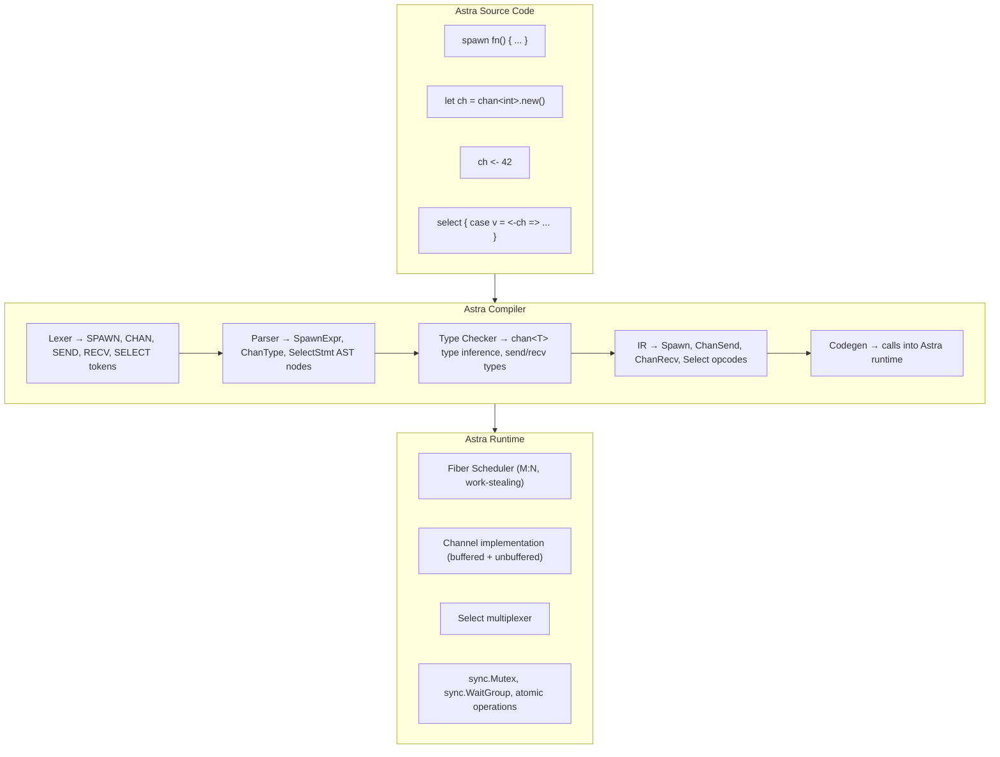
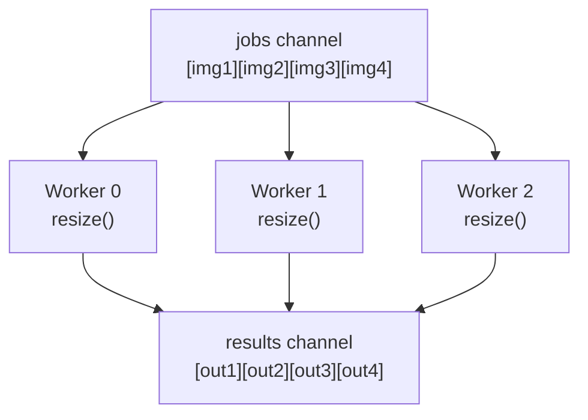
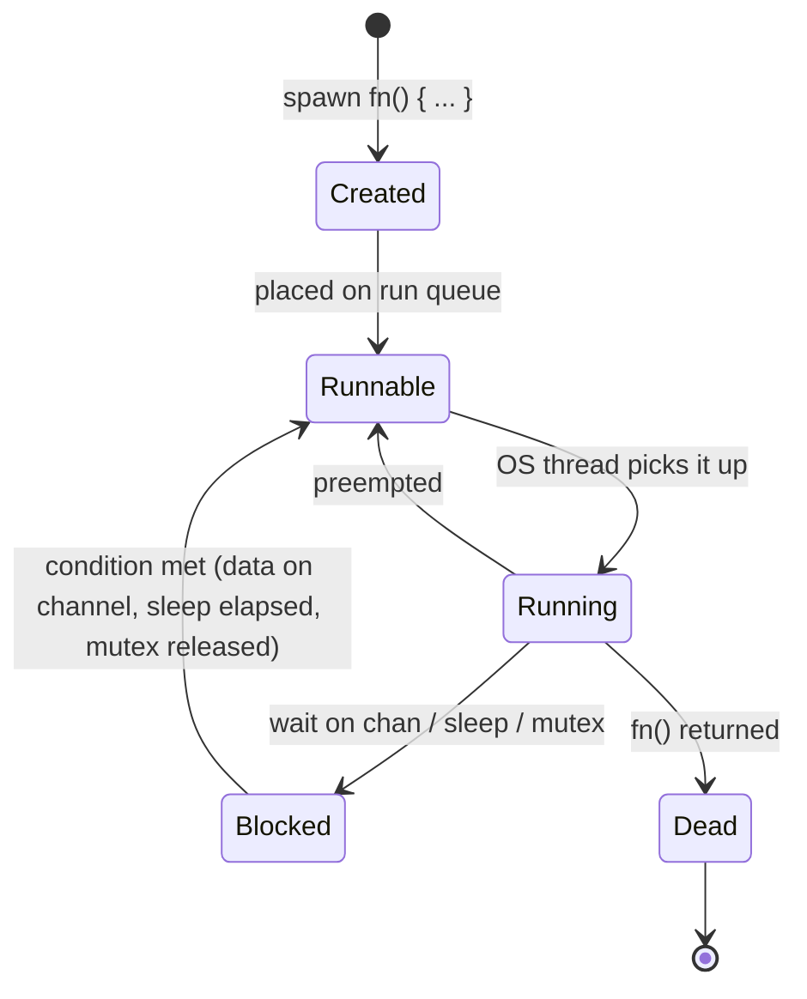

# Chapter 76: Astra Concurrency — Fibers and Channels

> "Don't communicate by sharing memory; share memory by communicating."
> — Rob Pike, co-creator of Go

---

## Overview

Modern software does not run in a straight line. A web server is simultaneously reading a database, writing a response, parsing a request, and timing out an old connection. A file watcher is simultaneously monitoring directories, processing events, and sending notifications. A chat application is simultaneously receiving messages, broadcasting them, and maintaining heartbeat signals to thousands of clients.

Without concurrency, all of these programs would grind to a halt. The server would process one request at a time while every other client waited. The chat application would stutter every time it received a message. The file watcher would miss events while it was processing others.

In this chapter you will add a complete concurrency model to Astra. Not the complex, error-prone model of raw threads and shared mutable state, but the clean, compositional model of **fibers and channels** — a model inspired by Tony Hoare's 1978 paper "Communicating Sequential Processes" and popularized in practice by the Go programming language.

By the end of this chapter, Astra will support the `spawn` keyword to launch lightweight fibers, the `chan<T>` type for type-safe message passing, and the `select` statement for multiplexing over multiple channels. You will understand how the M:N fiber scheduler works, how work-stealing keeps all CPU cores busy, and how to implement every one of these features in the Astra compiler and runtime.

---

## What We're Building

A complete concurrency runtime for Astra, integrated into the compiler and standard library:



---

## Table of Contents

1. The Problem: Why Programs Need Concurrency
2. Concurrency Models: A Survey of Approaches
3. Astra's Choice: CSP with Green Threads
4. The `spawn` Keyword: Launching Fibers
5. Channels (`chan<T>`): Type-Safe Communication
6. The `select` Statement: Multiplexing Channels
7. Common Concurrency Patterns
8. The Fiber Scheduler: M:N Scheduling and Work Stealing
9. The `sync` Standard Library
10. Atomic Operations
11. Race Conditions and the Astra Race Detector
12. Implementing the Fiber Scheduler in Go
13. Channel Internals: How Channels Work Under the Hood
14. Fiber Lifecycle: Creation, Blocking, and Resumption
15. The `defer` Keyword in Concurrent Code
16. Error Handling in Fibers
17. Context and Cancellation
18. Real-World Example: Concurrent Web Scraper
19. Compiler Changes: New Tokens, AST Nodes, IR Opcodes
20. 🔨 Astra Build Milestone
21. Exercises
22. Summary

---

## 1. The Problem: Why Programs Need Concurrency

Consider a naive web server:

```astra
fn handle_connection(conn: net.Conn) {
    let request  = conn.read()          // might take 1ms
    let db_row   = db.query(request.id) // might take 50ms (network round-trip to DB)
    let response = build_response(db_row)
    conn.write(response)
}

fn main() {
    let server = net.listen("0.0.0.0:8080")
    loop {
        let conn = server.accept()
        handle_connection(conn)   // blocks here until FULLY done
    }
}
```

This server can handle exactly **one request at a time**. While `db.query` is waiting 50 milliseconds for a database response, the server is sitting completely idle — not accepting new connections, not processing anything. If 1,000 clients connect simultaneously, client number 2 waits for client number 1 to finish, client number 3 waits for both 1 and 2, and so on.

The fundamental issue is that most of a server's time is spent **waiting** — waiting for the network, waiting for the disk, waiting for the database. The CPU is idle. We need a way to do something useful with that idle time.

This is the core motivation for concurrency: **overlap waiting with doing**.

### The Cost of Waiting

Let us put real numbers to this. On a modern system:

```
CPU clock cycle:          ~0.3 nanoseconds
L1 cache hit:             ~1 nanosecond
L2 cache hit:             ~4 nanoseconds
L3 cache hit:             ~40 nanoseconds
RAM access:               ~100 nanoseconds
NVMe SSD read:            ~100 microseconds  (100,000 ns)
Network round-trip (LAN): ~500 microseconds  (500,000 ns)
Network round-trip (WAN): ~50 milliseconds   (50,000,000 ns)
```

A database query over the network takes roughly 100,000 to 50,000,000 times longer than reading from L1 cache. During that wait, a modern CPU could execute tens of millions of instructions. The opportunity cost of blocking a thread on I/O is enormous.

### The Naive Fix: One Thread Per Request

One solution is to start a new OS thread for each request:

```astra
fn main() {
    let server = net.listen("0.0.0.0:8080")
    loop {
        let conn = server.accept()
        // Each connection gets its own OS thread
        thread.spawn(fn() { handle_connection(conn) })
    }
}
```

This works up to a point. OS threads are expensive:

- **Stack size**: each OS thread gets a 1–8 MB stack, reserved upfront
- **Context switching**: switching between OS threads requires a kernel call (~1–5 microseconds)
- **Memory**: 10,000 concurrent connections = 10–80 GB of stack memory just for thread stacks
- **Scheduler**: the OS scheduler is general-purpose and doesn't know which threads are blocked on I/O

In practice, systems with thousands of OS threads become unstable. This is the "C10K problem" — handling 10,000 simultaneous connections was a hard engineering challenge in the early 2000s precisely because of OS thread overhead.

---

## 2. Concurrency Models: A Survey of Approaches

The industry has explored many answers to this problem. Understanding them helps you understand why Astra chose the model it did.

### 2a. Async/Await (JavaScript, Python, Rust)

The programmer manually marks suspension points with `await`:

```javascript
// JavaScript
async function handleRequest(req) {
    const user = await db.getUser(req.userId);   // explicitly yield here
    const data = await db.getOrders(user.id);     // explicitly yield here
    return buildResponse(user, data);
}
```

**Pros**: no extra threads, very low memory overhead, explicit about where suspension can happen.

**Cons**: "colored functions" — async functions must be called from async functions. It's infectious throughout the codebase. Synchronous libraries cannot be used without wrappers. Debugging async stack traces is notoriously difficult. The "what color is your function?" problem.

### 2b. Callbacks (Node.js original style)

```javascript
db.getUser(req.userId, function(user) {
    db.getOrders(user.id, function(orders) {
        sendResponse(buildResponse(user, orders));
    });
});
```

**Pros**: works on a single thread, low overhead.

**Cons**: "callback hell" — deeply nested, hard to read, error-prone, nearly impossible to debug.

### 2c. OS Threads

As discussed above. Simple to reason about but too expensive at scale.

### 2d. Actor Model (Erlang, Elixir, Akka)

Each actor is an isolated process with its own mailbox. Actors communicate only by sending messages. No shared state whatsoever.

```elixir
# Elixir actor
defmodule Worker do
  def loop do
    receive do
      {:work, job} ->
        result = do_work(job)
        send(caller, {:result, result})
      loop()
    end
  end
end
```

**Pros**: excellent fault isolation, natural distribution across machines, proven at scale (WhatsApp handles billions of messages with a small Erlang team).

**Cons**: message passing overhead, cannot share data directly (must copy), different mental model from sequential programming.

### 2e. CSP — Communicating Sequential Processes

Hoare's 1978 model: independent processes communicate through **channels**. Unlike actors, processes are not named — instead, channels are named, and any process can send to or receive from a channel.

```
Process A               Channel              Process B
   │                      │                     │
   │─── send(42) ────────►│                     │
   │                      │─── recv() ─────────►│
   │                      │                     │
```

This is the model used by Go, and it is the model Astra adopts.

**Pros**: clean composition, type-safe communication, easy to reason about data flow, goroutines (Go's name for fibers) are cheap enough to have millions simultaneously.

**Cons**: can still deadlock if channels are misused (but deadlocks are far easier to debug than data races).

---

## 3. Astra's Choice: CSP with Green Threads

Astra implements CSP using **green threads** (also called fibers or coroutines). Green threads are like OS threads, but managed entirely by the language runtime rather than the operating system:

```
OS Threads (M = number of CPU cores):
┌─────────┐  ┌─────────┐  ┌─────────┐  ┌─────────┐
│Thread 1 │  │Thread 2 │  │Thread 3 │  │Thread 4 │
│ (OS)    │  │ (OS)    │  │ (OS)    │  │ (OS)    │
└────┬────┘  └────┬────┘  └────┬────┘  └────┬────┘
     │             │             │             │
┌────▼─────────────▼─────────────▼─────────────▼────┐
│                 Astra Fiber Scheduler               │
│                                                    │
│  Run Queue:  [F1] [F2] [F3] [F4] [F5] [F6] ...   │
│  Blocked:    [F7:waiting on ch] [F8:sleeping]      │
└────────────────────────────────────────────────────┘

Fibers (N = potentially millions):
F1: handle_request(conn1)   stack: 8KB (grows as needed)
F2: handle_request(conn2)   stack: 8KB
F3: background_job()        stack: 8KB
...
F1000000: tiny_task()       stack: 8KB
```

Key properties of Astra's green threads:

- **Small initial stack**: 8KB by default (vs 1-8MB for OS threads). A million fibers = 8GB, but stacks grow on demand so typical usage is far less.
- **Fast context switching**: ~10-50 nanoseconds (vs ~1,000 ns for OS threads). The runtime saves/restores a handful of registers.
- **M:N scheduling**: N fibers multiplexed across M OS threads (M = number of CPU cores). All cores stay busy.
- **Cooperative + preemptive**: fibers yield voluntarily at I/O and channel operations, but the scheduler also preempts at function call boundaries (preventing any single fiber from hogging a thread).
- **Integrated with channels**: when a fiber sends on a full channel or receives from an empty channel, it automatically yields — no explicit yield call needed.

---

## 4. The `spawn` Keyword: Launching Fibers

The `spawn` keyword is the fundamental building block. It creates a new fiber and immediately schedules it for execution. Execution of the spawning fiber continues without waiting for the new fiber to finish.

```astra
fn main() {
    // The simplest possible spawn
    spawn fn() {
        print("Hello from a fiber!")
    }
    
    // This prints before "Hello from fiber" — or after — it's non-deterministic
    print("Hello from main!")
    
    // Without synchronization, main might exit before the fiber runs
    time.sleep(10)  // crude way to wait; we'll see better ways shortly
}
```

### Spawning Named Functions

```astra
fn greet(name: string) {
    print("Hello, " + name + "!")
}

fn main() {
    spawn greet("Alice")
    spawn greet("Bob")
    spawn greet("Charlie")
    
    // All three run concurrently
    time.sleep(100)
}
```

### Spawning with Closures (Capturing Variables)

```astra
fn main() {
    let message = "important data"
    
    spawn fn() {
        // Closure captures 'message' — be careful about data races
        print(message)
    }
    
    // If we modify 'message' here and the fiber reads it simultaneously: DATA RACE
    // Use channels to pass data safely instead
}
```

### The Safe Pattern: Pass Data Through Channels

```astra
fn worker(id: int, input: chan<string>, output: chan<string>) {
    for job in input {
        let result = "Worker " + id.to_string() + " processed: " + job
        output <- result
    }
}

fn main() {
    let jobs    = chan<string>.with_capacity(10)
    let results = chan<string>.with_capacity(10)
    
    // Spawn 3 workers
    for i in 0..3 {
        spawn worker(i, jobs, results)
    }
    
    // Send work
    jobs <- "task_a"
    jobs <- "task_b"
    jobs <- "task_c"
    jobs.close()
    
    // Collect results (3 tasks, 3 results)
    for i in 0..3 {
        print(<-results)
    }
}
```

### What `spawn` Does Under the Hood

When the compiler sees `spawn fn() { body }`, it generates roughly:

```go
// Runtime implementation
func runtimeSpawn(fn func()) {
    fiber := &Fiber{
        fn:    fn,
        stack: makeStack(8 * 1024),  // 8KB initial stack
        state: FiberRunnable,
    }
    scheduler.enqueue(fiber)
}
```

The fiber is placed on the scheduler's run queue. The next available OS thread picks it up and begins executing `fn`.

---

## 5. Channels (`chan<T>`): Type-Safe Communication

A channel is a typed conduit through which fibers communicate. Think of it as a pipe: one fiber writes into one end, another fiber reads from the other end.

```
Fiber A                  chan<int>               Fiber B
   │                    ┌─────────┐                │
   │── ch <- 42 ───────►│   42    │── <-ch ───────►│
   │                    └─────────┘                │
```

### Creating Channels

```astra
// Unbuffered channel (capacity = 0)
// Sender blocks until receiver is ready, and vice versa
let ch = chan<int>.new()

// Buffered channel (capacity = 100)
// Sender only blocks when the buffer is FULL
// Receiver only blocks when the buffer is EMPTY
let buffered = chan<string>.with_capacity(100)

// Typed channels — channels carry type information
let int_ch    = chan<int>.new()
let string_ch = chan<string>.new()
let point_ch  = chan<Point>.new()

// Channel of channels (meta-programming pattern)
let reply_ch_ch = chan<chan<string>>.new()
```

### Sending and Receiving

```astra
// Send: blocks if channel is full (or unbuffered with no receiver)
ch <- 42
string_ch <- "hello"
point_ch  <- Point { x: 1.0, y: 2.0 }

// Receive: blocks if channel is empty
let value  = <-ch
let msg    = <-string_ch
let p      = <-point_ch

// Receive with ok flag (checks if channel is still open)
let (value, ok) = <-ch
if !ok {
    print("Channel was closed — no more values")
}

// Receive and discard (just unblock the sender)
let _ = <-ch
```

### Closing Channels

```astra
// Close signals that no more values will be sent
// After close: any pending values can still be received
// After close + buffer drained: further receives return (zero_value, false)
ch.close()

// Sending to a closed channel: runtime panic
// Closing an already-closed channel: runtime panic
// These are programming errors — use patterns to avoid them
```

### Ranging Over Channels

```astra
// Range over a channel: receives values until the channel is closed
for value in ch {
    process(value)
}
// Equivalent to:
loop {
    let (value, ok) = <-ch
    if !ok { break }
    process(value)
}
```

### Channel Direction (Read-Only / Write-Only)

Channels can be passed to functions with restricted access:

```astra
// This function can only SEND on 'out' (producer)
fn produce(out: chan<-int) {
    for i in 0..10 { out <- i }
    out.close()
}

// This function can only RECEIVE from 'in' (consumer)
fn consume(in: <-chan<int>) {
    for v in in { print(v.to_string()) }
}

fn main() {
    let ch = chan<int>.with_capacity(10)
    spawn produce(ch)    // ch used as send-only
    consume(ch)          // ch used as recv-only
}
```

This prevents bugs like accidentally receiving in a producer or sending in a consumer. The compiler enforces this at compile time.

### Buffered vs Unbuffered: The Difference Matters

```
UNBUFFERED (chan<int>.new()):

Fiber A: ch <- 42    →  BLOCKS until Fiber B reads
Fiber B: v = <-ch    →  BLOCKS until Fiber A sends

Both fibers rendezvous at the channel. Like a handshake.

Timeline:
  A: ──────────SEND────►CONTINUE──────
                   │
  B: ──────────────►RECV─────CONTINUE─
             (A blocks) (B unblocks A)

BUFFERED (chan<int>.with_capacity(3)):

Buffer: [_, _, _]  (capacity 3)

A sends 1: buffer = [1, _, _]   A continues immediately
A sends 2: buffer = [1, 2, _]   A continues immediately
A sends 3: buffer = [1, 2, 3]   A continues immediately
A sends 4: BLOCKS (buffer full) until B reads one

B reads:   buffer = [2, 3, _]   B gets 1,   A unblocks
```

The choice between buffered and unbuffered affects program behavior:

- **Unbuffered**: guarantees synchronization — sender and receiver meet at the channel. Useful when you need to know the other side is ready.
- **Buffered**: decouples sender and receiver. Sender can get ahead by `capacity` elements. Risk: if capacity is too small, senders block; if too large, memory grows unboundedly.

---

## 6. The `select` Statement: Multiplexing Channels

Real programs often need to wait on multiple channels simultaneously. Maybe you are waiting for a result OR a timeout, whichever comes first. The `select` statement handles this:

```astra
fn main() {
    let result_ch = chan<string>.new()
    let error_ch  = chan<string>.new()
    let timeout   = time.after(5000)  // fires after 5000ms

    spawn fn() {
        // Simulate work that might succeed or fail
        let response = http.get("https://api.example.com/data")
        if response.ok {
            result_ch <- response.body
        } else {
            error_ch <- response.status_message
        }
    }

    // Wait for whichever channel has data first
    select {
        case result = <-result_ch => {
            print("Success: " + result)
        }
        case err = <-error_ch => {
            print("Error: " + err)
        }
        case <-timeout => {
            print("Timed out after 5 seconds")
        }
    }
}
```

### How `select` Works

1. Evaluate all case expressions.
2. If **exactly one** case is ready (has data to receive, or can send without blocking): execute that case.
3. If **multiple** cases are ready: choose one **at random** (prevents starvation).
4. If **no** case is ready: block until at least one becomes ready.

The random selection when multiple cases are ready is deliberate — it prevents one case from always winning and starving others.

### Non-Blocking `select` with `default`

```astra
// Check if a channel has data, but don't block if not
select {
    case msg = <-ch => {
        process(msg)
    }
    default => {
        // Channel was empty — no blocking
        print("No message ready, doing other work")
    }
}
```

### Sending in `select`

```astra
select {
    case ch1 <- value1 => {
        print("Sent to ch1")
    }
    case ch2 <- value2 => {
        print("Sent to ch2")
    }
    case result = <-result_ch => {
        print("Received: " + result)
    }
}
```

### The Timeout Pattern

One of the most important patterns in concurrent programming — never wait forever:

```astra
fn fetch_with_timeout(url: string, timeout_ms: int) -> Result<string, string> {
    let result_ch  = chan<string>.new()
    let timeout_ch = time.after(timeout_ms)

    spawn fn() {
        let resp = http.get(url)
        result_ch <- resp.body
    }

    select {
        case body = <-result_ch => return Ok(body)
        case <-timeout_ch      => return Err("Timeout after " + timeout_ms.to_string() + "ms")
    }
}
```

### The Done Channel Pattern (Cancellation)

```astra
fn long_running_task(done: chan<bool>) {
    loop {
        // Check if cancelled (non-blocking)
        select {
            case <-done => {
                print("Task cancelled, cleaning up")
                return
            }
            default => { /* continue working */ }
        }
        
        do_one_unit_of_work()
    }
}

fn main() {
    let done = chan<bool>.new()
    spawn long_running_task(done)
    
    time.sleep(1000)  // let it run for 1 second
    done <- true      // signal cancellation
    time.sleep(100)   // wait for cleanup
}
```

---

## 7. Common Concurrency Patterns

These patterns appear repeatedly in real-world concurrent programs. Knowing them by name and structure makes you a significantly more effective concurrent programmer.

### Pattern 1: Fan-Out (One Source, Many Workers)

Distribute work from one source across multiple workers:

```astra
fn image_worker(id: int, jobs: chan<string>, results: chan<string>) {
    for image_path in jobs {
        let thumbnail = resize_image(image_path, 200, 200)
        let out_path  = "/thumbnails/" + basename(image_path)
        write_file(out_path, thumbnail)
        results <- out_path
    }
}

fn main() {
    let image_paths = list_files("/images/")
    let jobs        = chan<string>.with_capacity(len(image_paths))
    let results     = chan<string>.with_capacity(len(image_paths))

    // Spawn one worker per CPU core
    let num_workers = runtime.cpu_count()
    for i in 0..num_workers {
        spawn image_worker(i, jobs, results)
    }

    // Send all jobs
    for path in image_paths {
        jobs <- path
    }
    jobs.close()  // signal: no more jobs

    // Collect all results
    for i in 0..len(image_paths) {
        let out_path = <-results
        print("Processed: " + out_path)
    }
    
    print("All " + len(image_paths).to_string() + " images processed!")
}
```



### Pattern 2: Fan-In (Many Sources, One Sink)

Merge output from multiple channels into one:

```astra
fn fan_in(channels: List<chan<string>>) -> chan<string> {
    let merged = chan<string>.with_capacity(100)
    
    for ch in channels {
        spawn fn() {
            for value in ch {
                merged <- value
            }
        }
    }
    
    return merged
}

fn main() {
    let sensor1 = read_sensor_stream(1)
    let sensor2 = read_sensor_stream(2)
    let sensor3 = read_sensor_stream(3)
    
    let all_readings = fan_in([sensor1, sensor2, sensor3])
    
    for reading in all_readings {
        print("Sensor data: " + reading)
    }
}
```

### Pattern 3: Pipeline (Data Flows Through Stages)

Connect processing stages with channels:

```astra
// Stage 1: generate numbers
fn generate(out: chan<int>) {
    for i in 0..100 { out <- i }
    out.close()
}

// Stage 2: square each number
fn square(in: <-chan<int>, out: chan<int>) {
    for n in in { out <- n * n }
    out.close()
}

// Stage 3: filter out odd numbers
fn keep_even(in: <-chan<int>, out: chan<int>) {
    for n in in {
        if n % 2 == 0 { out <- n }
    }
    out.close()
}

// Stage 4: format for display
fn format(in: <-chan<int>, out: chan<string>) {
    for n in in {
        out <- "value=" + n.to_string()
    }
    out.close()
}

fn main() {
    let c1 = chan<int>.new()
    let c2 = chan<int>.new()
    let c3 = chan<int>.new()
    let c4 = chan<string>.new()
    
    spawn generate(c1)
    spawn square(c1, c2)
    spawn keep_even(c2, c3)
    spawn format(c3, c4)
    
    for line in c4 {
        print(line)
    }
}
```

Pipeline diagram:

```mermaid
flowchart LR
    GEN["generate<br/>(0..100)"]
    SQ["square<br/>(n*n)"]
    KE["keep_even<br/>(n%2==0)"]
    FMT["format<br/>(\"v=N\")"]
    OUT["print"]
    GEN -->|"c1"| SQ
    SQ -->|"c2"| KE
    KE -->|"c3"| FMT
    FMT -->|"c4"| OUT
```

### Pattern 4: WaitGroup (Wait for All Workers)

```astra
import sync

fn process_file(path: string, wg: sync.WaitGroup) {
    defer wg.done()  // always call done, even if we panic
    
    let data = read_file(path)
    let result = transform(data)
    write_file(path + ".out", result)
}

fn main() {
    let wg    = sync.WaitGroup.new()
    let files = list_files("/data/")
    
    for path in files {
        wg.add(1)
        spawn process_file(path, wg)
    }
    
    wg.wait()  // block until ALL fibers call done()
    print("All files processed!")
}
```

### Pattern 5: Semaphore (Limit Concurrency)

Sometimes you want many workers but need to cap how many run simultaneously (e.g., don't open more than 100 database connections):

```astra
fn main() {
    let urls = load_urls()  // 10,000 URLs
    
    // Semaphore: buffered channel used as a token pool
    // Only 50 HTTP requests at a time
    let sem     = chan<bool>.with_capacity(50)
    let results = chan<string>.with_capacity(len(urls))
    
    for url in urls {
        sem <- true    // acquire token (blocks if 50 already running)
        spawn fn() {
            let body = http.get(url).body
            results <- body
            let _ = <-sem  // release token
        }
    }
    
    for i in 0..len(urls) {
        print(<-results)
    }
}
```

---

## 8. The Fiber Scheduler: M:N Scheduling and Work Stealing

Understanding the scheduler helps you write efficient concurrent programs. Let us trace exactly what happens when you call `spawn`.

### M:N Scheduling

"M:N" means N fibers mapped onto M OS threads. Typically M equals the number of CPU cores.

```
System with 4 CPU cores:

OS Layer:
  Thread 1 (CPU 0)    Thread 2 (CPU 1)    Thread 3 (CPU 2)    Thread 4 (CPU 3)
  running: F3         running: F7         running: F1         running: F12

Scheduler Layer:
  ┌──────────────────────────────────────────────────────────────────┐
  │                    Global Run Queue                               │
  │  [F4] [F5] [F6] [F8] [F9] [F10] [F11] [F13] [F14] ...          │
  └──────────────────────────────────────────────────────────────────┘
  
  Per-Thread Local Queues (for cache-friendly scheduling):
  Thread 1 local: [F2]
  Thread 2 local: [F15] [F16]
  Thread 3 local: []
  Thread 4 local: [F17]
  
  Blocked (waiting on channel/sleep/I/O):
  [F18: waiting on ch_db] [F19: sleeping 500ms] [F20: waiting on net.Read]
```

When a fiber blocks (e.g., waiting on an empty channel), the OS thread does NOT block. Instead:

1. The scheduler marks the fiber as "blocked on channel X".
2. The OS thread picks the next runnable fiber from the queue and starts executing it.
3. When another fiber sends on channel X, the blocked fiber is moved back to the run queue.
4. The OS thread never sleeps — it always has work to do.

### Work Stealing

Sometimes one thread finishes its local queue while others still have work. Work stealing solves this:

```
BEFORE:
Thread 1 queue: [F1] [F2] [F3] [F4] [F5] [F6]  ← very busy
Thread 2 queue: []                               ← idle!
Thread 3 queue: [F7]                             ← almost done
Thread 4 queue: [F8] [F9]                        ← some work

Thread 2 is idle. It "steals" from the back of Thread 1's queue:

AFTER stealing:
Thread 1 queue: [F1] [F2] [F3]                  ← Thread 1 continues with front half
Thread 2 queue: [F4] [F5] [F6]                  ← Thread 2 stole back half
Thread 3 queue: [F7]
Thread 4 queue: [F8] [F9]

Why steal from the BACK?
- Thread 1 is currently executing F1 (front) — it keeps working without interruption
- Thread 2 takes F4-F6 (back) — work that Thread 1 won't get to for a while
- This minimizes contention: Thread 1 and Thread 2 operate on different ends
```

Work stealing provides automatic load balancing with very low overhead — no central coordinator is needed.

### Fiber Context Switching

When the scheduler switches from one fiber to another on the same OS thread:

```
Save fiber A's context:
  - Program counter (instruction pointer)
  - Stack pointer
  - Callee-saved registers: rbx, rbp, r12, r13, r14, r15 (x86-64)
  - Fiber state: Blocked/Runnable
  
Load fiber B's context:
  - Restore registers
  - Jump to saved program counter

Total cost: ~10-50 nanoseconds (compare: OS thread switch ~1,000-5,000 ns)
```

### Fiber Stack Growth

Unlike OS threads with a fixed stack, Astra fibers use **segmented or copying stacks**:

```
Initial fiber stack: 8KB

Call stack grows deep:
  main() calls A() calls B() calls C() calls D() ...
  
When stack overflows 8KB:
  Option A (segmented): allocate a new 16KB segment, chain it to the old
  Option B (copying):   allocate a new 16KB block, COPY the entire old stack,
                        update all stack pointers
  
Astra uses copying stacks (simpler, better cache behavior):
  
  [8KB stack] → overflow detected →
  [16KB stack, old contents copied] →
  [32KB stack if needed] → etc.
```

---

## 9. The `sync` Standard Library

While channels cover most concurrent programming needs, some situations genuinely call for shared mutable state protected by locks.

```astra
import sync

// ── Mutex: mutual exclusion ──────────────────────────────────────────────────

struct BankAccount {
    balance: float
    mu:      sync.Mutex
}

impl BankAccount {
    fn deposit(self, amount: float) {
        self.mu.lock()
        defer self.mu.unlock()  // unlock even if we panic
        self.balance = self.balance + amount
    }
    
    fn withdraw(self, amount: float) -> bool {
        self.mu.lock()
        defer self.mu.unlock()
        if self.balance < amount { return false }
        self.balance = self.balance - amount
        return true
    }
    
    fn get_balance(self) -> float {
        self.mu.lock()
        defer self.mu.unlock()
        return self.balance
    }
}

// ── RWMutex: multiple concurrent readers, one exclusive writer ───────────────

struct Cache<K, V> {
    data: HashMap<K, V>
    mu:   sync.RWMutex
}

impl<K, V> Cache<K, V> {
    fn get(self, key: K) -> Option<V> {
        self.mu.read_lock()      // multiple fibers can read simultaneously
        defer self.mu.read_unlock()
        return self.data.get(key)
    }
    
    fn set(self, key: K, value: V) {
        self.mu.write_lock()     // exclusive: no readers or writers during write
        defer self.mu.write_unlock()
        self.data.set(key, value)
    }
}

// ── Once: run initialization exactly once ────────────────────────────────────

struct Config {
    db_url:   string
    api_key:  string
}

let global_config: Option<Config> = None
let config_once = sync.Once.new()

fn get_config() -> Config {
    config_once.do(fn() {
        global_config = Some(load_config_from_disk())
    })
    return global_config.unwrap()
}
// Safe to call from 100 concurrent fibers — loads config exactly once

// ── WaitGroup: wait for a group of fibers ────────────────────────────────────

fn run_parallel_tests(tests: List<TestCase>) -> List<TestResult> {
    let wg      = sync.WaitGroup.new()
    let results = make_list_concurrent<TestResult>(len(tests))
    
    for i in 0..len(tests) {
        wg.add(1)
        let test = tests[i]  // capture by value
        let idx  = i
        spawn fn() {
            defer wg.done()
            results[idx] = run_test(test)
        }
    }
    
    wg.wait()
    return results
}
```

---

## 10. Atomic Operations

For simple counters and flags, full mutexes are overkill. Atomic operations are CPU-level primitives that are both lock-free and memory-safe:

```astra
import atomic

// ── Atomic integer operations ────────────────────────────────────────────────

let request_count = atomic.Int64.new(0)
let active_conns  = atomic.Int64.new(0)

fn handle_request(req: Request) {
    request_count.add(1)    // atomically increment (no lock needed)
    active_conns.add(1)
    defer active_conns.add(-1)
    
    process(req)
}

fn stats_reporter() {
    loop {
        let reqs  = request_count.load()
        let conns = active_conns.load()
        print("Requests: " + reqs.to_string() + ", Active: " + conns.to_string())
        time.sleep(1000)
    }
}

// ── Compare-And-Swap (CAS): the foundation of lock-free data structures ──────

// CAS: "only set the new value if the current value equals expected"
// Returns true if the swap happened, false otherwise.

let version = atomic.Int64.new(0)

fn try_update_version(expected: int64, new_val: int64) -> bool {
    return version.compare_and_swap(expected, new_val)
}

// Building a lock-free stack using CAS:
struct LockFreeStack<T> {
    head: atomic.Pointer<Node<T>>
}

impl<T> LockFreeStack<T> {
    fn push(self, value: T) {
        let new_node = Node { value: value, next: null }
        loop {
            let old_head = self.head.load()
            new_node.next = old_head
            // Only succeed if head hasn't changed since we read it
            if self.head.compare_and_swap(old_head, new_node) {
                return
            }
            // Another fiber changed head — retry
        }
    }
}

// ── Atomic boolean ───────────────────────────────────────────────────────────

let shutdown = atomic.Bool.new(false)

fn signal_handler() {
    shutdown.store(true)
}

fn main_loop() {
    loop {
        if shutdown.load() { break }
        process_next_event()
    }
}
```

---

## 11. Race Conditions and the Astra Race Detector

A **data race** occurs when two fibers access the same memory location simultaneously, at least one access is a write, and there is no synchronization between them.

```astra
// THIS IS A BUG — data race!
let counter = 0

fn main() {
    for i in 0..1000 {
        spawn fn() {
            counter = counter + 1  // READ + WRITE without lock
            // Two fibers can both read 5, both add 1, both write 6 → one increment lost
        }
    }
    time.sleep(100)
    print(counter.to_string())  // Prints something less than 1000
}
```

Data races are fiendishly difficult to reproduce because they depend on exact timing. The Astra race detector instruments every memory access to catch them:

```bash
# Build with race detector instrumentation
astrac build --race main.as -o main
./main

# If a race is detected at runtime:
DATA RACE detected!
  Write at 0x00c000014088 by fiber 42 (goroutine):
    main.counter += 1
        /home/user/main.as:6

  Previous write at 0x00c000014088 by fiber 37:
    main.counter += 1
        /home/user/main.as:6

  Fiber 42 created at:
    main.main() /home/user/main.as:11
```

The race detector adds approximately 5–10x overhead at runtime — use it during development and testing, not in production.

### Safe Alternatives to Shared Mutable State

```astra
// Fix 1: Use a Mutex
let counter = 0
let mu      = sync.Mutex.new()
spawn fn() {
    mu.lock()
    counter = counter + 1
    mu.unlock()
}

// Fix 2: Use an atomic
let counter = atomic.Int64.new(0)
spawn fn() { counter.add(1) }

// Fix 3: Use channels (functional style)
fn counter_fiber(ops: chan<int>, gets: chan<chan<int>>) {
    let count = 0
    loop {
        select {
            case delta = <-ops  => { count = count + delta }
            case reply = <-gets => { reply <- count }
        }
    }
}
```

---

## 12. Implementing the Fiber Scheduler in Go

The Astra runtime is itself written in Go. We leverage Go's goroutines as the underlying fiber implementation — Go's runtime already provides excellent M:N scheduling and work-stealing. This gives us all the scheduler benefits essentially for free.

```go
// runtime/fiber.go

package runtime

import (
    "sync"
    "sync/atomic"
    "unsafe"
)

// FiberState tracks what a fiber is currently doing
type FiberState int32

const (
    FiberRunnable FiberState = iota
    FiberBlocked
    FiberDead
)

// Fiber represents a single lightweight concurrent execution unit
type Fiber struct {
    id      uint64
    fn      func()
    state   FiberState
    stack   []byte      // base of fiber's stack (managed by Go runtime)
    locals  map[string]interface{}  // fiber-local storage
}

var (
    nextFiberID uint64
    scheduler   *Scheduler
)

// Scheduler manages the pool of runnable fibers
type Scheduler struct {
    mu       sync.Mutex
    runQueue []*Fiber
    wg       sync.WaitGroup
}

func init() {
    scheduler = &Scheduler{}
}

// Spawn creates a new fiber and enqueues it for execution.
// This is called by Astra's 'spawn' keyword at runtime.
func Spawn(fn func()) uint64 {
    id := atomic.AddUint64(&nextFiberID, 1)
    fiber := &Fiber{
        id:    id,
        fn:    fn,
        state: FiberRunnable,
    }
    
    scheduler.wg.Add(1)
    
    // We use Go goroutines as our fiber implementation.
    // Go's runtime handles M:N scheduling, work-stealing, and stack growth for us.
    go func() {
        defer scheduler.wg.Done()
        defer func() {
            if r := recover(); r != nil {
                // Fiber panicked — log and continue
                // In production: send to error channel
                _ = r
            }
            atomic.StoreInt32((*int32)(&fiber.state), int32(FiberDead))
        }()
        
        atomic.StoreInt32((*int32)(&fiber.state), int32(FiberRunnable))
        fn()
    }()
    
    return id
}

// WaitAll blocks until all spawned fibers complete
func WaitAll() {
    scheduler.wg.Wait()
}
```

```go
// runtime/channel.go

package runtime

import (
    "sync"
)

// Channel is Astra's chan<T> implementation.
// We use Go's channel type as the underlying mechanism.
type Channel struct {
    ch       interface{}  // the underlying Go channel (chan interface{})
    elemType string       // type name for runtime type checks
    closed   bool
    mu       sync.Mutex
}

// NewChannel creates an unbuffered channel (capacity 0)
func NewChannel(typeName string) *Channel {
    return &Channel{
        ch:       make(chan interface{}),
        elemType: typeName,
    }
}

// NewBufferedChannel creates a buffered channel
func NewBufferedChannel(typeName string, capacity int) *Channel {
    return &Channel{
        ch:       make(chan interface{}, capacity),
        elemType: typeName,
    }
}

// Send implements the <- operator (sending side)
// Blocks if the channel is full
func (c *Channel) Send(value interface{}) {
    c.mu.Lock()
    if c.closed {
        c.mu.Unlock()
        panic("send on closed channel")
    }
    c.mu.Unlock()
    
    // Type assertion at runtime (normally done at compile time in type checker)
    c.ch.(chan interface{}) <- value
}

// Recv implements the <- operator (receiving side)
// Returns (value, ok): ok is false when channel is closed and drained
func (c *Channel) Recv() (interface{}, bool) {
    v, ok := <-(c.ch.(chan interface{}))
    return v, ok
}

// TryRecv non-blocking receive (used in select with default)
func (c *Channel) TryRecv() (interface{}, bool, bool) {
    select {
    case v, ok := <-(c.ch.(chan interface{})):
        return v, ok, true  // got value, channel ok, success
    default:
        return nil, true, false  // no value available
    }
}

// Close closes the channel
func (c *Channel) Close() {
    c.mu.Lock()
    defer c.mu.Unlock()
    if c.closed {
        panic("close of closed channel")
    }
    c.closed = true
    close(c.ch.(chan interface{}))
}
```

```go
// runtime/select.go

package runtime

import (
    "reflect"
)

// SelectCase represents one case in a select statement
type SelectCase struct {
    Dir     SelectDir
    Channel *Channel
    Value   interface{}   // for send cases
    Handler func(interface{}, bool)  // called when case fires
}

type SelectDir int

const (
    SelectRecv SelectDir = iota
    SelectSend
    SelectDefault
)

// RunSelect implements Astra's select statement using Go's reflect.Select
// This allows dynamic selection over an arbitrary number of cases
func RunSelect(cases []SelectCase) {
    // Build reflect.SelectCase slice
    reflectCases := make([]reflect.SelectCase, 0, len(cases))
    
    for _, c := range cases {
        switch c.Dir {
        case SelectRecv:
            ch := reflect.ValueOf(c.Channel.ch)
            reflectCases = append(reflectCases, reflect.SelectCase{
                Dir:  reflect.SelectRecv,
                Chan: ch,
            })
        case SelectSend:
            ch := reflect.ValueOf(c.Channel.ch)
            reflectCases = append(reflectCases, reflect.SelectCase{
                Dir:  reflect.SelectSend,
                Chan: ch,
                Send: reflect.ValueOf(c.Value),
            })
        case SelectDefault:
            reflectCases = append(reflectCases, reflect.SelectCase{
                Dir: reflect.SelectDefault,
            })
        }
    }
    
    // Block until one case is ready (or return immediately if default present)
    chosen, recv, recvOK := reflect.Select(reflectCases)
    
    // Call the handler for the chosen case
    if cases[chosen].Handler != nil {
        var val interface{}
        if cases[chosen].Dir == SelectRecv {
            val = recv.Interface()
        }
        cases[chosen].Handler(val, recvOK)
    }
}
```

---

## 13. Channel Internals: How Channels Work Under the Hood

Understanding channel internals helps you avoid performance pitfalls.

```
Buffered chan<int> with capacity 4:

┌─────────────────────────────────────────────────────┐
│                    Channel struct                    │
│                                                     │
│  buf:    [42][17][ 0][ 0]  ← circular buffer        │
│          ↑              ↑                           │
│         head           tail                         │
│  count:  2             ← 2 values buffered           │
│  cap:    4             ← buffer capacity             │
│  closed: false                                      │
│                                                     │
│  sendq: [fiber_A: waiting to send 99]  ← blocked    │
│  recvq: []                             ← no waiters │
│                                                     │
│  lock:  sync.Mutex                                  │
└─────────────────────────────────────────────────────┘

When fiber_B calls <-ch:
1. Acquire lock
2. buf is non-empty → pop value 42 from head
3. If sendq is non-empty → move sendq's value (99) into buf, wake fiber_A
4. Release lock
5. Return 42 to fiber_B

When channel is full and fiber tries to send:
1. Acquire lock
2. buf is full (count == cap) → fiber goes into sendq, releases lock
3. Fiber is descheduled (yields OS thread back to scheduler)
4. When a receiver removes a value, it wakes this fiber
```

---

## 14. Fiber Lifecycle



---

## 15. The `defer` Keyword in Concurrent Code

`defer` is essential for writing correct concurrent code — it guarantees cleanup runs even if the function panics:

```astra
fn handle_connection(conn: net.Conn, active: atomic.Int64) {
    active.add(1)
    defer active.add(-1)    // guaranteed to run when function exits
    defer conn.close()       // close connection on exit
    
    // Process the connection
    // Even if this panics, active count is decremented and conn is closed
    let req = conn.read_request()
    process(req)
}

fn with_lock(mu: sync.Mutex, fn: fn()) {
    mu.lock()
    defer mu.unlock()  // unlock even if fn() panics
    fn()
}
```

---

## 16. Error Handling in Fibers

A fiber cannot return an error directly to its spawner (since `spawn` doesn't wait). Use channels to propagate errors:

```astra
fn risky_operation(id: int, result: chan<Result<string, string>>) {
    if some_condition {
        result <- Err("Something went wrong in worker " + id.to_string())
        return
    }
    let data = do_work()
    result <- Ok(data)
}

fn main() {
    let results = chan<Result<string, string>>.with_capacity(10)
    
    for i in 0..10 {
        spawn risky_operation(i, results)
    }
    
    for i in 0..10 {
        let result = <-results
        match result {
            Ok(data)  => print("Success: " + data)
            Err(msg)  => print("Error: " + msg)
        }
    }
}
```

---

## 17. Context and Cancellation

Astra's `context` package (modeled after Go's) provides structured cancellation across fiber trees:

```astra
import context

fn fetch_data(ctx: context.Context, url: string, result: chan<string>) {
    // Check if cancelled before starting
    if ctx.is_done() {
        result <- ""
        return
    }
    
    let resp = http.get_with_context(ctx, url)  // cancellable request
    
    select {
        case <-ctx.done() => {
            // Parent cancelled us mid-flight
            result <- ""
        }
        default => {
            result <- resp.body
        }
    }
}

fn main() {
    // Create a context with 2-second timeout
    let (ctx, cancel) = context.with_timeout(2000)
    defer cancel()  // always cancel to release resources
    
    let result = chan<string>.new()
    spawn fetch_data(ctx, "https://slow-api.example.com/data", result)
    
    select {
        case data = <-result  => print("Got: " + data)
        case <-ctx.done()     => print("Timed out or cancelled")
    }
}
```

---

## 18. Real-World Example: Concurrent Web Scraper

Let us tie everything together with a production-quality web scraper:

```astra
import http
import sync
import context

struct ScrapeResult {
    url:     string
    title:   string
    links:   List<string>
    error:   Option<string>
    elapsed: int  // milliseconds
}

fn scrape_url(
    ctx:     context.Context,
    url:     string,
    results: chan<ScrapeResult>
) {
    let start = time.now()
    
    if ctx.is_done() {
        results <- ScrapeResult { url: url, error: Some("cancelled"), elapsed: 0 }
        return
    }
    
    let resp = http.get_with_context(ctx, url)
    let elapsed = time.since(start)
    
    if !resp.ok {
        results <- ScrapeResult {
            url:     url,
            error:   Some("HTTP " + resp.status.to_string()),
            elapsed: elapsed
        }
        return
    }
    
    let title = extract_title(resp.body)
    let links = extract_links(resp.body, url)  // resolve relative URLs
    
    results <- ScrapeResult {
        url:     url,
        title:   title,
        links:   links,
        elapsed: elapsed
    }
}

fn scrape_all(urls: List<string>, max_concurrent: int, timeout_ms: int) -> List<ScrapeResult> {
    let (ctx, cancel) = context.with_timeout(timeout_ms)
    defer cancel()
    
    // Semaphore: limit concurrent requests
    let sem     = chan<bool>.with_capacity(max_concurrent)
    let results = chan<ScrapeResult>.with_capacity(len(urls))
    let wg      = sync.WaitGroup.new()
    
    for url in urls {
        wg.add(1)
        spawn fn() {
            defer wg.done()
            sem <- true  // acquire
            scrape_url(ctx, url, results)
            let _ = <-sem  // release
        }
    }
    
    // Close results channel when all workers finish
    spawn fn() {
        wg.wait()
        results.close()
    }
    
    // Collect all results
    let all_results: List<ScrapeResult> = []
    for result in results {
        all_results.push(result)
    }
    
    return all_results
}

fn main() {
    let seed_urls = [
        "https://news.ycombinator.com",
        "https://github.com/trending",
        "https://lobste.rs",
        "https://reddit.com/r/programming",
        "https://dev.to",
    ]
    
    print("Scraping " + len(seed_urls).to_string() + " URLs concurrently...")
    
    let results = scrape_all(seed_urls, max_concurrent: 10, timeout_ms: 30000)
    
    let success_count = 0
    let error_count   = 0
    let total_links   = 0
    
    for r in results {
        match r.error {
            None => {
                print("[OK " + r.elapsed.to_string() + "ms] " + r.url + " → " + r.title)
                total_links = total_links + len(r.links)
                success_count = success_count + 1
            }
            Some(err) => {
                print("[ERR] " + r.url + " → " + err)
                error_count = error_count + 1
            }
        }
    }
    
    print("\nSummary:")
    print("  Success: " + success_count.to_string())
    print("  Errors:  " + error_count.to_string())
    print("  Links found: " + total_links.to_string())
}
```

This scraper demonstrates: `spawn`, `chan<T>`, `select`, `context`, `WaitGroup`, semaphore pattern, and proper error handling — all working together.

---

## 19. Compiler Changes: New Tokens, AST Nodes, IR Opcodes

### New Lexer Tokens

```go
// lexer/tokens.go  (additions)
const (
    // ... existing tokens ...
    TOKEN_SPAWN   // 'spawn'
    TOKEN_CHAN     // 'chan'
    TOKEN_SELECT   // 'select'
    TOKEN_CASE     // 'case'  (reuse if already present for match)
    TOKEN_SEND     // '<-'  (send/receive operator)
    TOKEN_DEFAULT  // 'default'
    TOKEN_PARALLEL // 'parallel' (Chapter 77)
)

// In the lexer's keyword map:
keywords["spawn"]   = TOKEN_SPAWN
keywords["chan"]     = TOKEN_CHAN
keywords["select"]  = TOKEN_SELECT
keywords["default"] = TOKEN_DEFAULT
```

### New AST Nodes

```go
// ast/nodes.go  (additions)

// spawn fn() { body } or spawn funcCall(args)
type SpawnExpr struct {
    Fn   Expr   // the function/closure to spawn
    Args []Expr // arguments if spawning a function call
    Pos  Position
}

// chan<T>.new() or chan<T>.with_capacity(n)
type ChanType struct {
    ElemType Type
    Pos      Position
}

// ch <- value
type ChanSendStmt struct {
    Chan  Expr
    Value Expr
    Pos   Position
}

// <-ch  or  let x = <-ch  or  let (x, ok) = <-ch
type ChanRecvExpr struct {
    Chan    Expr
    WithOk  bool  // true if (value, ok) form
    Pos     Position
}

// select { case ... => ... }
type SelectStmt struct {
    Cases   []SelectCase
    Default *BlockStmt  // nil if no default
    Pos     Position
}

type SelectCase struct {
    // Either a recv or send case
    IsRecv bool
    Chan   Expr
    Value  Expr    // send: the value being sent
    Var    string  // recv: variable to bind received value to
    OkVar  string  // recv: optional ok variable
    Body   *BlockStmt
    Pos    Position
}
```

### New IR Opcodes

```go
// ir/opcodes.go  (additions)

type SpawnInstr struct {
    FnValue  Value      // closure or function reference
    Args     []Value
}

type ChanMakeInstr struct {
    ElemType Type
    Capacity Value   // nil for unbuffered
    Result   Value
}

type ChanSendInstr struct {
    Chan  Value
    Value Value
}

type ChanRecvInstr struct {
    Chan   Value
    Result Value     // received value
    Ok     Value     // bool: was channel open?
}

type SelectInstr struct {
    Cases   []IRSelectCase
    HasDefault bool
}

type IRSelectCase struct {
    Kind    SelectCaseKind  // Recv or Send
    Chan    Value
    Var     Value           // destination for received value
    OkVar   Value           // destination for ok flag
    Body    []Instruction
}

type SelectCaseKind int
const (
    SelectCaseRecv SelectCaseKind = iota
    SelectCaseSend
)
```

### Code Generation

```go
// codegen/concurrent.go

func (cg *CodeGen) emitSpawn(instr *ir.SpawnInstr) {
    // Generate:  runtime.Spawn(func() { ... })
    fmt.Fprintf(cg.out, "runtime.Spawn(func() {\n")
    cg.emitCallWithArgs(instr.FnValue, instr.Args)
    fmt.Fprintf(cg.out, "})\n")
}

func (cg *CodeGen) emitChanSend(instr *ir.ChanSendInstr) {
    // ch <- value  becomes  runtime.ChanSend(ch, value)
    chanVar  := cg.valueStr(instr.Chan)
    valueVar := cg.valueStr(instr.Value)
    fmt.Fprintf(cg.out, "%s.Send(%s)\n", chanVar, valueVar)
}

func (cg *CodeGen) emitChanRecv(instr *ir.ChanRecvInstr) {
    resultVar := cg.valueStr(instr.Result)
    okVar     := cg.valueStr(instr.Ok)
    chanVar   := cg.valueStr(instr.Chan)
    fmt.Fprintf(cg.out, "%s, %s := %s.Recv()\n", resultVar, okVar, chanVar)
}

func (cg *CodeGen) emitSelect(instr *ir.SelectInstr) {
    fmt.Fprintf(cg.out, "runtime.RunSelect([]runtime.SelectCase{\n")
    for _, c := range instr.Cases {
        chanVar := cg.valueStr(c.Chan)
        if c.Kind == ir.SelectCaseRecv {
            varName := cg.valueStr(c.Var)
            okName  := cg.valueStr(c.OkVar)
            fmt.Fprintf(cg.out, "  {Dir: runtime.SelectRecv, Channel: %s, Handler: func(v interface{}, ok bool) {\n", chanVar)
            fmt.Fprintf(cg.out, "    %s = v; %s = ok\n", varName, okName)
            cg.emitBlock(c.Body)
            fmt.Fprintf(cg.out, "  }},\n")
        }
    }
    fmt.Fprintf(cg.out, "})\n")
}
```

---

## 20. 🔨 Astra Build Milestone

At this point, your Astra compiler should be able to compile and run the following programs correctly:

### Milestone 1: Basic Spawn and Channel

```astra
// test_spawn.as
fn producer(ch: chan<int>) {
    for i in 0..5 {
        ch <- i * i
    }
    ch.close()
}

fn main() {
    let ch = chan<int>.with_capacity(5)
    spawn producer(ch)
    for value in ch {
        print(value.to_string())  // 0, 1, 4, 9, 16
    }
}
```

### Milestone 2: Select and Timeout

```astra
// test_select.as
fn main() {
    let fast_ch = chan<string>.new()
    let slow_ch = chan<string>.new()
    
    spawn fn() { time.sleep(10); fast_ch <- "fast result" }
    spawn fn() { time.sleep(5000); slow_ch <- "slow result" }
    
    let timeout = time.after(100)
    
    select {
        case v = <-fast_ch => print("Got: " + v)   // this wins
        case v = <-slow_ch => print("Got: " + v)
        case <-timeout     => print("Timeout!")
    }
}
```

### Milestone 3: Fan-Out Worker Pool

```astra
// test_fanout.as
fn square_worker(jobs: chan<int>, results: chan<int>) {
    for n in jobs { results <- n * n }
}

fn main() {
    let jobs    = chan<int>.with_capacity(100)
    let results = chan<int>.with_capacity(100)
    
    for i in 0..4 { spawn square_worker(jobs, results) }
    
    for i in 0..20 { jobs <- i }
    jobs.close()
    
    let sum = 0
    for i in 0..20 { sum = sum + <-results }
    print("Sum of squares 0..19: " + sum.to_string())  // 2470
}
```

### Milestone 4: Concurrent Web Scraper

```astra
// test_scraper.as
fn fetch_url(url: string, results: chan<string>) {
    let response = http.get(url)
    results <- response.body.slice(0, 100)  // first 100 bytes
}

fn main() {
    let urls = [
        "https://httpbin.org/get",
        "https://httpbin.org/ip",
        "https://httpbin.org/uuid",
    ]
    
    let results = chan<string>.with_capacity(len(urls))
    
    for url in urls {
        spawn fetch_url(url, results)
    }
    
    for i in 0..len(urls) {
        print("Response: " + <-results)
    }
    
    print("All " + len(urls).to_string() + " requests completed concurrently!")
}
```

---

## 21. Exercises

1. **Ping-Pong**: Create two fibers that ping-pong a counter through two channels. Fiber A sends an int to Fiber B on channel `ping`; Fiber B increments it and sends back on `pong`. Run for 1,000,000 round trips and measure time. Expected: ~1–2 billion operations/second.

2. **Concurrent Map**: Build a `ConcurrentMap<K, V>` struct backed by a `RWMutex`. Implement `get(key: K) -> Option<V>`, `set(key: K, value: V)`, and `delete(key: K) -> bool`. Write a test that spawns 100 readers and 10 writers running concurrently for 1 second, verifying no data corruption with `--race`.

3. **Rate Limiter**: Implement a rate limiter using the token bucket algorithm. Use a dedicated fiber that puts tokens into a buffered channel at a fixed rate (e.g., 100/second). Consumer fibers must receive a token before proceeding. Test that the rate is correctly limited.

4. **Pipeline with Error Propagation**: Build a 3-stage pipeline (generate → transform → output) where each stage can produce errors. Use `Result<T, E>` as the channel type. The final stage should collect both successes and errors separately.

5. **Pub/Sub**: Build a publish-subscribe system. `subscribe(topic: string) -> chan<Message>` returns a channel that receives all messages on that topic. `publish(topic: string, msg: Message)` sends to all subscribers. Support unsubscribing.

6. **WaitGroup from Scratch**: Implement `sync.WaitGroup` from scratch using only a `chan<bool>` and an `atomic.Int64`. Your implementation must support the same API: `add(n)`, `done()`, `wait()`.

7. **Context Propagation**: Modify the web scraper to accept a `context.Context`. When the context is cancelled (e.g., ctrl+C), all in-flight HTTP requests should be cancelled and all fibers should clean up gracefully within 1 second.

8. **Deadlock Detection**: Write a program that intentionally deadlocks (two fibers each waiting for the other to send). Build a simple deadlock detector: a background fiber that checks if all fibers have been blocked for more than 5 seconds with no progress, and if so, prints a diagnostic and exits.

---

## 22. Summary

| Concept | Astra Syntax | Under the Hood |
|---|---|---|
| Launch a fiber | `spawn fn() { ... }` | `go func() { ... }` in Go runtime |
| Unbuffered channel | `chan<T>.new()` | `make(chan interface{})` |
| Buffered channel | `chan<T>.with_capacity(n)` | `make(chan interface{}, n)` |
| Send | `ch <- value` | `ch.(chan interface{}) <- value` |
| Receive | `let v = <-ch` | `v := <-ch.(chan interface{})` |
| Receive with ok | `let (v, ok) = <-ch` | `v, ok := <-ch` |
| Close | `ch.close()` | `close(ch)` |
| Multiplex | `select { case ... }` | `reflect.Select(...)` |
| Non-blocking | `select { ... default => ... }` | `reflect.SelectDefault` |
| Mutual exclusion | `sync.Mutex` | `sync.Mutex` |
| Multi-reader | `sync.RWMutex` | `sync.RWMutex` |
| Barrier | `sync.WaitGroup` | `sync.WaitGroup` |
| Atomic increment | `counter.add(1)` | `atomic.AddInt64(...)` |
| Fiber scheduler | M:N, work-stealing | Go runtime goroutine scheduler |
| Race detection | `astrac build --race` | Go race detector instrumentation |

Concurrency is one of the most powerful tools in a programmer's toolkit — and one of the most treacherous. Astra's CSP model with channels provides a structured, type-safe approach that makes concurrent programs easier to reason about, write, and debug. The key insight: **pass data through channels, don't share data between fibers**. When you follow that principle, data races become nearly impossible, and programs become easier to understand because data flow is explicit and directional.

In Chapter 77, we build on this foundation to add true parallelism: `parallel for`, SIMD annotations, and the work-stealing scheduler that keeps all CPU cores fully utilized.
