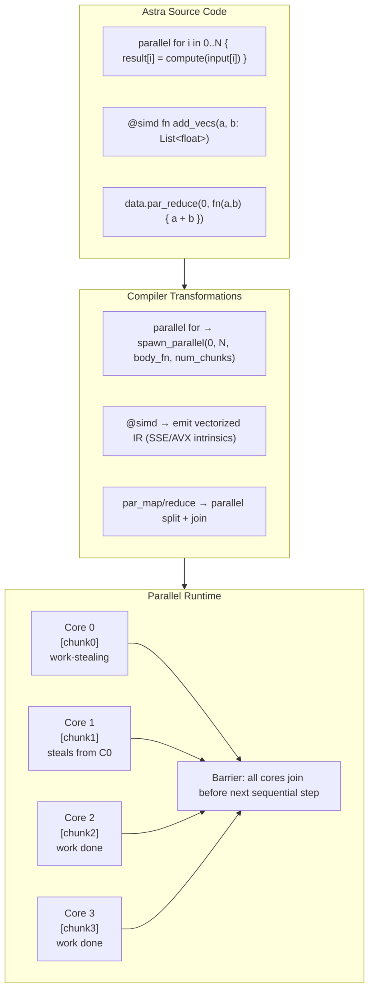
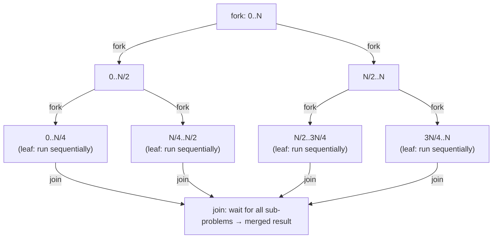

# Chapter 77: Astra Parallelism — True Multi-Core Execution

> "The free lunch is over. A major shift in how software developers think about performance is coming — and the shift is in how they think about concurrency."
> — Herb Sutter, 2005

---

## Overview

In Chapter 76, you learned how Astra fibers and channels handle **concurrency** — the art of structuring a program to deal with many tasks at once. But concurrency alone does not make your program faster. A single-core processor can run a million fibers concurrently by time-sharing, and it will take exactly the same amount of total CPU time as running them sequentially.

**Parallelism** is different. Parallelism means executing multiple computations simultaneously on multiple CPU cores. If your computation takes 100 seconds on one core, true parallelism on 4 cores can reduce it to ~25 seconds. On 64 cores, ~1.6 seconds.

Modern hardware is awash in parallelism that most programs never use. A typical laptop has 8–16 CPU cores. A server has 32–128. Cloud VMs routinely offer 96 or 192 virtual CPUs. Most programming languages leave this hardware sitting idle — their programs use one core while 95% of the CPU's capacity gathers dust.

In this chapter, Astra gains `parallel for` (data parallelism), `@simd` (instruction-level parallelism), a work-stealing parallel scheduler, and `@parallel` function annotations. By the end, Astra programs will automatically scale across all available CPU cores with minimal programmer effort.

---

## What We're Building

A parallel execution runtime integrated into the Astra compiler and standard library:



---

## Table of Contents

1. Concurrency vs Parallelism: The Critical Distinction
2. The Free Lunch Is Over: Why Parallelism Matters Now
3. Amdahl's Law: The Fundamental Limit
4. Data Parallelism vs Task Parallelism
5. `parallel for`: Automatic Loop Parallelization
6. The `@parallel` Function Annotation
7. Parallel Collections: `par_map`, `par_filter`, `par_reduce`
8. SIMD: Single Instruction, Multiple Data
9. The `@simd` Annotation in Astra
10. Auto-Vectorization: When the Compiler Vectorizes for You
11. The Work-Stealing Scheduler: Deep Dive
12. Fork-Join: The Building Block of Parallel Algorithms
13. Cache Effects: False Sharing and Data Layout
14. Struct of Arrays vs Array of Structs
15. Parallel Sorting: Merge Sort with `parallel for`
16. Parallel Tree Traversal
17. Parallel MapReduce in Astra
18. Safety: Preventing Data Races in Parallel Code
19. NUMA-Aware Programming
20. Benchmarking: Measuring Parallel Speedup
21. Implementing the Parallel Runtime in Go
22. 🔨 Astra Build Milestone
23. Exercises
24. Summary

---

## 1. Concurrency vs Parallelism: The Critical Distinction

This distinction is so important that it is worth repeating and deepening from Chapter 76.

**Concurrency** is a software design property. A concurrent program is *structured* to handle multiple things at once. It could run on a single core by interleaving.

**Parallelism** is a hardware execution property. A parallel program *actually runs* multiple computations simultaneously on multiple processing units.

```
CONCURRENCY (single core, time-shared):

Time →  0ms  5ms  10ms  15ms  20ms  25ms  30ms
Task A: ████░░░░████░░░░████░░░░
Task B: ░░░░████░░░░████░░░░████

Both tasks appear to make progress, but only one runs at any instant.
Total CPU work: same as sequential.
Total WALL TIME: same as sequential (no speedup).
Benefit: responsiveness. Task B doesn't wait for Task A to fully finish.

PARALLELISM (4 cores):

Time →  0ms        25ms
Core 0: ████████████ (Task A, part 1)
Core 1: ████████████ (Task A, part 2)
Core 2: ████████████ (Task A, part 3)
Core 3: ████████████ (Task A, part 4)

All four parts of Task A run simultaneously.
Total CPU work: same (4 cores × 25ms = 100ms total CPU).
Total WALL TIME: 25ms instead of 100ms. 4× speedup!
Benefit: throughput. More work done in less wall-clock time.
```

A practical heuristic:
- **I/O-bound work** (waiting for disk, network, database): use **concurrency** (fibers + channels, Chapter 76). Most time is spent waiting — parallelism doesn't help because the CPU is already idle.
- **CPU-bound work** (image processing, numerical computation, sorting, encryption): use **parallelism** (`parallel for`, `@simd`). All cores are busy — more cores = proportionally faster.

Many real programs need both: concurrent I/O to handle thousands of connections plus parallel computation to process each connection's data quickly.

---

## 2. The Free Lunch Is Over

From roughly 1975 to 2004, CPU clock speeds doubled approximately every 18 months. Programs got faster for free — just wait a year or two and the new chip would run your code 2× faster without any changes. This was the "free lunch."

```
CPU Clock Speed History:

1990: Intel 486 @ 25 MHz
1995: Pentium @ 100 MHz       (4× in 5 years)
2000: Pentium III @ 1 GHz     (10× in 5 years)
2003: Pentium 4 @ 3.2 GHz     (3× in 3 years)
2004: Pentium 4 HT @ 3.8 GHz  ← THE WALL
2010: Intel Nehalem @ 3.3 GHz (SLOWER than 2004!)
2020: Intel Comet Lake @ 5.3 GHz (barely 1.4× over 2004 — 16 years!)

What happened? Physics.
- Higher clock speed = more heat = chip melts
- Signal propagation across chip takes more clock cycles at higher speeds
- Power consumption grows as clock³
```

The industry's response: more cores.

```
CPU Core Count History:

2004: Intel Pentium 4:       1 core
2005: Intel Pentium D:       2 cores
2008: Intel Core 2 Quad:     4 cores
2013: Intel Xeon E5:        12 cores
2017: AMD Threadripper:      16–32 cores
2020: AMD EPYC Rome:         64 cores
2023: AMD EPYC Genoa:        96 cores
2024: Apple M3 Ultra:        32 performance + 8 efficiency cores

Current cloud instances:
AWS c7g.48xlarge:  192 vCPUs
Google n2-highmem: 128 vCPUs
```

The implication: if your program uses 1 core on a 64-core machine, it uses 1.6% of available CPU power. To use modern hardware fully, programs must be parallel.

---

## 3. Amdahl's Law: The Fundamental Limit

Not every program can be made 64× faster on 64 cores. Amdahl's Law quantifies the limit:

```
Speedup = 1 / (S + (1-S)/N)

Where:
  S = fraction of program that is SEQUENTIAL (cannot be parallelized)
  N = number of parallel processors
  1-S = fraction that CAN be parallelized

Example:
  S = 0.05 (5% sequential, 95% parallel)
  N = 4:   Speedup = 1/(0.05 + 0.95/4)  = 1/0.2875 = 3.48×
  N = 8:   Speedup = 1/(0.05 + 0.95/8)  = 1/0.1688 = 5.92×
  N = 16:  Speedup = 1/(0.05 + 0.95/16) = 1/0.1094 = 9.14×
  N = ∞:   Speedup = 1/0.05             = 20×  ← HARD CEILING

Even with infinite cores, a 5% sequential section limits you to 20× speedup!
```

```
Amdahl's Law Visualization:

Speedup
  ↑
20│                                              ∞ cores ─────────────────
  │                                         ╱─────────────────────────────
16│                                    ╱────
  │                               ╱────
12│                          ╱────
  │                     ╱────
 8│                ╱────
  │           ╱────
 4│      ╱────
  │  ╱────
 1│
  └──────────────────────────────────────────────────────────────► Cores
     1    4    8   16   32   64  128  256  512 1024

Each line represents a different "parallel fraction":
  Top line:    95% parallel, 5% sequential
  Middle line: 80% parallel, 20% sequential
  Bottom line: 50% parallel, 50% sequential
```

Practical implications for Astra:
1. Minimize sequential setup/teardown code — it becomes the bottleneck.
2. Maximize the parallel section — break dependencies between iterations.
3. The speedup plateau is real — more cores eventually stop helping.

Gustafson's Law is the optimistic counterpart: if you can increase problem size proportionally with core count, you CAN get linear speedup. This applies to simulations (bigger model), machine learning (more training data), and rendering (higher resolution).

---

## 4. Data Parallelism vs Task Parallelism

Two flavors of parallelism:

**Data Parallelism**: same operation on different pieces of data.
```astra
// Sequential: one element at a time
for i in 0..1000000 {
    results[i] = sqrt(inputs[i])
}

// Data parallel: all elements simultaneously (conceptually)
parallel for i in 0..1000000 {
    results[i] = sqrt(inputs[i])
}
```

**Task Parallelism**: different operations running simultaneously.
```astra
// Three independent tasks: run them in parallel
let (image_result, audio_result, network_result) = parallel {
    task1: compress_image(raw_image),
    task2: encode_audio(raw_audio),
    task3: fetch_metadata(url),
}
```

Data parallelism is more common in compute-intensive code (scientific computing, ML, image/video processing). Task parallelism is common in systems that have genuinely independent work streams.

Astra's `parallel for` targets data parallelism. `spawn` (Chapter 76) covers task parallelism. Both use the same underlying work-stealing scheduler.

---

## 5. `parallel for`: Automatic Loop Parallelization

The simplest way to harness multiple cores in Astra:

```astra
// Sequential version
fn process_dataset(data: List<float>) -> List<float> {
    let results = List<float>.with_capacity(len(data))
    for i in 0..len(data) {
        results[i] = expensive_transform(data[i])
    }
    return results
}

// Parallel version: add one keyword
fn process_dataset_parallel(data: List<float>) -> List<float> {
    let results = List<float>.with_capacity(len(data))
    parallel for i in 0..len(data) {
        results[i] = expensive_transform(data[i])  // runs on all cores
    }
    return results
}
```

The `parallel for` construct makes three guarantees:

1. **Correctness**: all iterations will complete before the statement after `parallel for` executes (implicit barrier).
2. **Parallelism**: iterations are distributed across all available CPU cores.
3. **Safety**: the compiler verifies that the loop body cannot cause data races (see Section 18).

### When `parallel for` Works

`parallel for` requires that loop iterations are **independent** — the result of iteration `i` must not depend on the result of iteration `j` (for i ≠ j):

```astra
// SAFE: iteration i only reads data[i] and writes results[i]
parallel for i in 0..n {
    results[i] = compute(data[i])   // no sharing between iterations
}

// SAFE: reads are always safe to share
parallel for i in 0..n {
    let local = data[i] + global_config.offset   // reading global_config is fine
    results[i] = transform(local)
}

// UNSAFE: iteration i reads results[i-1] (written by iteration i-1)
parallel for i in 1..n {
    results[i] = results[i-1] + data[i]  // ERROR: loop-carried dependency
}
// Compiler rejects this with: "parallel for body has loop-carried dependency on 'results'"

// UNSAFE: accumulating into a shared variable without synchronization
let total = 0
parallel for i in 0..n {
    total = total + data[i]  // ERROR: race on 'total'
}
// Use par_reduce instead:
let total = data.par_reduce(0, fn(a: float, b: float) -> float { a + b })
```

### `parallel for` with Chunk Size

By default, Astra splits the range into chunks automatically. You can override:

```astra
// Let Astra choose chunk size (default: range/num_cores, minimum 1000)
parallel for i in 0..1000000 {
    results[i] = compute(i)
}

// Override chunk size (useful when each iteration has very different cost)
parallel for i in 0..1000000 chunk_size(100) {
    results[i] = compute(i)
}

// Grain size: minimum work unit for work-stealing
parallel for i in 0..1000000 grain(500) {
    results[i] = compute(i)
}
```

### Nested `parallel for`

```astra
// Matrix multiplication with outer parallelism
fn matmul(a: List<List<float>>, b: List<List<float>>, n: int) -> List<List<float>> {
    let c = make_matrix(n, n, 0.0)
    
    parallel for i in 0..n {       // rows of result: fully parallel
        for j in 0..n {            // cols of result: sequential (inner loop)
            let sum = 0.0
            for k in 0..n {        // dot product: sequential
                sum = sum + a[i][k] * b[k][j]
            }
            c[i][j] = sum
        }
    }
    return c
}
// Only the OUTER loop is parallel — each row is computed by a different core.
// This is correct because row i of C only writes to c[i][*], no sharing.
```

For deeply nested parallelism:

```astra
// Parallel at both levels (be careful: over-subscription on small n)
parallel for i in 0..n {
    parallel for j in 0..n {
        c[i][j] = dot_product(row(a, i), col(b, j))
    }
}
// Astra's scheduler handles this: inner parallel-fors become part of the
// same work queue — no extra threads spawned.
```

---

## 6. The `@parallel` Function Annotation

Sometimes you want to parallelize at the function level rather than loop level:

```astra
@parallel
fn process_image(img: Image) -> Image {
    // This function is safe to call concurrently on many images
    let blurred    = gaussian_blur(img, sigma: 2.0)
    let sharpened  = unsharp_mask(blurred, amount: 1.5)
    let normalized = normalize_histogram(sharpened)
    return normalized
}

fn batch_process(images: List<Image>) -> List<Image> {
    // @parallel annotation means: apply to each element concurrently
    return images.par_map(process_image)
}
```

The `@parallel` annotation on a function signals:
1. The function has no mutable global state (pure or nearly pure).
2. The function is safe to call concurrently from multiple fibers.
3. The compiler may automatically parallelize calls to this function in `par_map`, `parallel for`, etc.

---

## 7. Parallel Collections: `par_map`, `par_filter`, `par_reduce`

Astra's standard library provides parallel variants of the fundamental collection operations:

```astra
let data: List<int> = 0..1000000 |> to_list()

// ── par_map: apply function to each element in parallel ──────────────────────

let squares = data.par_map(fn(x: int) -> int { return x * x })
// Automatically splits data across cores, applies fn, rejoins results in order.

// With a named @parallel function:
@parallel fn transform(x: int) -> int { return x * x + 2 * x + 1 }
let results = data.par_map(transform)

// ── par_filter: keep elements that match predicate ────────────────────────────

let evens = data.par_filter(fn(x: int) -> bool { return x % 2 == 0 })
// Splits data, each core filters its chunk, chunks are concatenated in order.
// NOTE: order of elements in result matches input order (stable).

// ── par_reduce: combine all elements into one value ───────────────────────────

// Requires: associative and commutative operation (a + b == b + a)
// Addition, multiplication, max, min, bitwise AND/OR are fine.
// Subtraction, division, string concatenation are NOT (not commutative).

let sum     = data.par_reduce(0,   fn(a: int, b: int) -> int { a + b })
let product = data.par_reduce(1,   fn(a: int, b: int) -> int { a * b })
let maximum = data.par_reduce(-∞,  fn(a: int, b: int) -> int { max(a, b) })

// How par_reduce works internally:
// 1. Split data into N chunks (N = num_cores)
// 2. Each core reduces its chunk: chunk_result[i] = reduce(chunk[i])
// 3. Final reduce across chunk results: result = reduce([chunk_result[0..N]])
// This is correct ONLY for associative/commutative operations.

// ── par_map_reduce: common pattern combined ────────────────────────────────────

// Word count: parallel map to count words, reduce to sum
let word_counts = documents
    .par_map(fn(doc: string) -> int { return count_words(doc) })
    .par_reduce(0, fn(a: int, b: int) -> int { a + b })

// ── par_sort: parallel sorting ────────────────────────────────────────────────

let sorted = data.par_sort()                              // ascending
let sorted = data.par_sort_by(fn(a: int, b: int) -> int { b - a })  // descending
// Uses parallel merge sort (see Section 15)

// ── par_for_each: parallel side effects (no return value) ─────────────────────

data.par_for_each(fn(x: int) {
    // Side effects must be thread-safe (use atomics or independent resources)
    let result = compute_and_write_to_file(x)
})
```

### Performance Characteristics

```
par_map:    O(n/P) per core + O(P) combine = efficient for large n
par_filter: O(n/P) per core + O(n/P) concat = efficient for large n
par_reduce: O(n/P) per core + O(log P) tree reduce = very efficient
par_sort:   O((n/P) log(n/P)) per core + O(n log P) merge = efficient

Where P = number of CPU cores.

Crossover point (sequential vs parallel):
  par_map:    beneficial for n > ~10,000 elements with expensive fn
  par_reduce: beneficial for n > ~100,000 elements
  par_sort:   beneficial for n > ~100,000 elements

For small n: parallelism overhead > benefit. Use sequential versions.
The Astra runtime auto-degrades to sequential for small inputs.
```

---

## 8. SIMD: Single Instruction, Multiple Data

Modern CPUs don't just have multiple cores — each core itself can process multiple values simultaneously using **SIMD** (Single Instruction, Multiple Data) instructions.

```
SCALAR (traditional):

add r1, r2    ← adds two 32-bit floats: one result

SIMD (AVX with 256-bit registers):

vaddps ymm0, ymm1, ymm2    ← adds EIGHT 32-bit floats simultaneously: eight results

Timeline (scalar adds 8 floats):
  Instruction 1: add float[0]
  Instruction 2: add float[1]
  Instruction 3: add float[2]
  Instruction 4: add float[3]
  Instruction 5: add float[4]
  Instruction 6: add float[5]
  Instruction 7: add float[6]
  Instruction 8: add float[7]
  Total: 8 clock cycles

Timeline (SIMD adds 8 floats):
  Instruction 1: vaddps (all 8 at once)
  Total: 1 clock cycle (8× speedup on this operation alone)
```

### SIMD Generations and Widths

```
ISA Extension    | Width   | Floats | Doubles | Integers
─────────────────┼─────────┼────────┼─────────┼──────────
SSE2 (2001)      | 128-bit | 4×f32  | 2×f64   | 16×i8 / 8×i16 / 4×i32
SSE4 (2007)      | 128-bit | 4×f32  | 2×f64   | enhanced
AVX (2011)       | 256-bit | 8×f32  | 4×f64   | 32×i8 / 16×i16 / 8×i32
AVX2 (2013)      | 256-bit | 8×f32  | 4×f64   | full 256-bit int
AVX-512 (2017)   | 512-bit | 16×f32 | 8×f64   | 64×i8 / 32×i16 / 16×i32
ARM NEON         | 128-bit | 4×f32  | 2×f64   | 16×i8 / 8×i16 / 4×i32
ARM SVE          | variable| up to 16×f32       | scalable
```

Combined with multi-core parallelism:
```
16-core CPU with AVX2:
  16 cores × 8 floats per SIMD op = 128 floats per clock cycle

At 4 GHz with fused multiply-add (FMA, 2 operations per instruction):
  16 × 8 × 2 × 4,000,000,000 = ~1,000,000,000,000 float ops/second = 1 TFLOP/s

This is why a gaming PC can run neural networks and ray tracers in real time.
```

---

## 9. The `@simd` Annotation in Astra

```astra
// Without @simd: scalar loop
fn add_vectors(a: List<float>, b: List<float>) -> List<float> {
    let result = List<float>.with_capacity(len(a))
    for i in 0..len(a) {
        result[i] = a[i] + b[i]   // one add per iteration
    }
    return result
}

// With @simd: vectorized loop
@simd
fn add_vectors_fast(a: List<float>, b: List<float>) -> List<float> {
    let result = List<float>.with_capacity(len(a))
    for i in 0..len(a) {
        result[i] = a[i] + b[i]   // compiler uses vaddps ymm0, ymm1, ymm2 (AVX: 8 at once)
    }
    return result
}
// Speedup: ~4–8× on a typical CPU with AVX2

// @simd works well on:
// - element-wise arithmetic: +, -, *, /
// - element-wise comparisons: <, >, ==
// - element-wise min/max
// - horizontal operations: sum, dot product (with reduction)

// @simd does NOT work well on:
// - conditional branches inside the loop (data-dependent branches break vectorization)
// - pointer aliasing (compiler can't prove arrays don't overlap)
// - function calls inside the loop (unless also @simd)
// - irregular memory access patterns (gather/scatter, though AVX2/AVX-512 support these)
```

### SIMD + Parallel: The Ultimate Combination

```astra
@simd
@parallel
fn dot_product_parallel(a: List<float>, b: List<float>) -> float {
    // Split across cores (parallel), vectorize each core's chunk (simd)
    let n = len(a)
    let partial = List<float>.with_capacity(runtime.cpu_count())
    
    parallel for core in 0..runtime.cpu_count() {
        let start  = core * (n / runtime.cpu_count())
        let end    = (core + 1) * (n / runtime.cpu_count())
        let local_sum = 0.0
        for i in start..end {
            local_sum = local_sum + a[i] * b[i]  // vectorized by @simd
        }
        partial[core] = local_sum
    }
    
    return partial.reduce(0.0, fn(a: float, b: float) -> float { a + b })
}
```

### Neural Network Forward Pass (SIMD-Accelerated)

```astra
@simd
fn matrix_vector_multiply(matrix: List<List<float>>, vector: List<float>, n: int, m: int) -> List<float> {
    let result = List<float>.with_capacity(n)
    
    parallel for i in 0..n {
        let sum = 0.0
        // @simd vectorizes this inner loop: processes 8 elements at once
        for j in 0..m {
            sum = sum + matrix[i][j] * vector[j]
        }
        result[i] = sum
    }
    return result
}

@simd
fn relu(activations: List<float>) -> List<float> {
    // Vectorized comparison: 8 elements at once
    return activations.par_map(fn(x: float) -> float {
        return max(0.0, x)
    })
}

fn forward_pass(layers: List<Layer>, input: List<float>) -> List<float> {
    let activations = input
    for layer in layers {
        let pre_activation = matrix_vector_multiply(layer.weights, activations, layer.out_size, layer.in_size)
        activations = relu(pre_activation)
    }
    return activations
}
```

---

## 10. Auto-Vectorization: When the Compiler Vectorizes for You

You don't always need `@simd`. Astra's optimizer automatically vectorizes loops that meet certain criteria:

```astra
// This loop auto-vectorizes (no @simd needed):
for i in 0..n {
    c[i] = a[i] + b[i]  // simple element-wise, no aliasing
}

// Conditions for auto-vectorization:
// 1. No loop-carried dependencies (result[i] doesn't use result[i-1])
// 2. No pointer aliasing (compiler must prove a, b, c don't overlap)
// 3. Fixed stride memory access (a[i], a[i+1], a[i+2], ... consecutive)
// 4. No function calls (unless inlined or also vectorizable)
// 5. Consistent data types (all floats, or all ints)

// This does NOT auto-vectorize:
for i in 1..n {
    c[i] = c[i-1] + a[i]   // loop-carried dependency on c
}

// Check if auto-vectorization succeeded:
astrac build -O2 --vec-info main.as
// Output:
// main.as:5: Vectorized with AVX2 (8x float32)
// main.as:12: Could not vectorize (loop-carried dependency)
```

The `@simd` annotation tells the compiler to try harder — it allows potentially unsafe vectorization (assuming no aliasing, even if it can't prove it) and uses more aggressive SIMD strategies.

---

## 11. The Work-Stealing Scheduler: Deep Dive

Chapter 76 introduced work-stealing in the context of fiber scheduling. For parallelism, work-stealing is even more important. Let us examine the implementation in detail.

### The Problem Work-Stealing Solves

When you write `parallel for i in 0..1000`, the runtime splits the range into chunks. But what if some chunks take much longer than others?

```
Without work-stealing:
  Core 0: [0..250]   → done in 10ms (easy elements)
  Core 1: [250..500] → done in 15ms
  Core 2: [500..750] → done in 10ms
  Core 3: [750..1000]→ done in 40ms (slow elements: waiting on I/O?)

Total time: 40ms (limited by slowest core)
Idle time: Core 0 idle for 30ms, Core 2 idle for 30ms, Core 3 starts 5ms late

With work-stealing:
  Core 0 finishes [0..250] in 10ms → steals [875..1000] from Core 3
  Core 2 finishes [500..750] in 10ms → steals [750..875] from Core 3

Core 3: [750..875]    → done in 20ms (half as much work)
Core 0: [875..1000]   → done in 20ms (stolen work)
Core 2: already done after stealing its portion

Total time: ~20ms instead of 40ms. 2× better!
```

### The Work-Stealing Deque

Each CPU core has a **double-ended queue** (deque) of work items. The core pushes to and pops from the **tail** (LIFO — cache-friendly, recently pushed work is still in cache). Thieves steal from the **head** (oldest work — avoids contention with the owner).

```
Core 0's deque:
    Head ← (steal from here)        Tail ← (push/pop here)
    [Task_A] [Task_B] [Task_C] [Task_D] [Task_E]
              ↑                              ↑
         Thief steals                  Core 0 pushes/pops

Why LIFO for owner? Temporal locality:
  Core 0 just pushed Task_E → its data is in L1 cache
  Core 0 pops Task_E → cache hot! Efficient.

Why FIFO for thieves? Minimize contention:
  Thief takes Task_A (oldest) → Task_A's data is in no one's cache anyway
  This leaves Task_B..E untouched for Core 0
```

### The Chase-Lev Work-Stealing Algorithm

The high-performance lock-free work-stealing algorithm:

```go
// runtime/workstealing.go

type WorkQueue struct {
    top    atomic.Int64   // index for thieves (steal from top)
    bottom atomic.Int64   // index for owner (push/pop from bottom)
    tasks  []Task         // circular buffer
    size   int64
}

// Push: called by owner (the thread that owns this queue)
// Only one thread ever calls this — no lock needed on bottom
func (q *WorkQueue) Push(task Task) {
    b := q.bottom.Load()
    t := q.top.Load()
    
    if b-t > q.size-1 {
        q.grow()    // resize if full
    }
    
    q.tasks[b % q.size] = task
    
    // Memory fence: ensure task is visible before updating bottom
    // (other threads read bottom to decide whether to steal)
    atomic.StoreInt64(&q.bottom, b+1)
}

// Pop: called by owner (LIFO — take from bottom)
func (q *WorkQueue) Pop() (Task, bool) {
    b := q.bottom.Load() - 1
    q.bottom.Store(b)
    
    // Fence: ensure bottom is visible before reading top
    t := q.top.Load()
    
    if t <= b {
        // Queue non-empty
        task := q.tasks[b % q.size]
        if t == b {
            // Last element — race with potential stealer
            if !q.top.CompareAndSwap(t, t+1) {
                // Lost the race — stealer got the last task
                q.bottom.Store(b + 1)
                return Task{}, false
            }
            q.bottom.Store(b + 1)
        }
        return task, true
    } else {
        // Queue empty
        q.bottom.Store(b + 1)
        return Task{}, false
    }
}

// Steal: called by OTHER threads (FIFO — take from top)
func (q *WorkQueue) Steal() (Task, bool) {
    t := q.top.Load()
    b := q.bottom.Load()
    
    if t >= b {
        return Task{}, false  // empty
    }
    
    task := q.tasks[t % q.size]
    
    // CAS: if top hasn't changed, increment it (commit the steal)
    if !q.top.CompareAndSwap(t, t+1) {
        return Task{}, false  // another stealer got it
    }
    
    return task, true
}
```

### The Scheduler Main Loop

```go
// runtime/scheduler.go

type ParallelScheduler struct {
    queues  []*WorkQueue  // one per OS thread
    threads []*WorkThread
    numProcs int
}

type WorkThread struct {
    id        int
    queue     *WorkQueue
    scheduler *ParallelScheduler
    rng       *rand.Rand  // for random victim selection
}

func (wt *WorkThread) run() {
    for {
        // Try to get work from own queue first
        if task, ok := wt.queue.Pop(); ok {
            task.Execute()
            continue
        }
        
        // Own queue empty — try stealing from a random victim
        victim := wt.rng.Intn(wt.scheduler.numProcs)
        if victim == wt.id {
            victim = (victim + 1) % wt.scheduler.numProcs
        }
        
        if task, ok := wt.scheduler.queues[victim].Steal(); ok {
            task.Execute()
            continue
        }
        
        // Nothing to steal — brief exponential backoff before trying again
        // (prevents spinning on a truly idle system)
        runtime.Gosched()
    }
}
```

---

## 12. Fork-Join: The Building Block of Parallel Algorithms

`parallel for` desugars to a fork-join pattern:



In Astra's runtime, fork-join is implemented using the work-stealing scheduler — forking just pushes new tasks onto the queue, and joining waits using a counter.

```go
// runtime/forkjoin.go

type ParallelFor struct {
    start  int64
    end    int64
    grain  int64   // minimum chunk size (stop splitting below this)
    body   func(int64)  // the loop body
    done   atomic.Int64
    total  atomic.Int64
    signal chan struct{}
}

func (pf *ParallelFor) run(lo, hi int64) {
    if hi-lo <= pf.grain {
        // Base case: execute this chunk sequentially
        for i := lo; i < hi; i++ {
            pf.body(i)
        }
        if pf.done.Add(1) == pf.total.Load() {
            close(pf.signal)  // all chunks done — signal barrier
        }
        return
    }
    
    // Fork: split in half, push right half as new task
    mid := (lo + hi) / 2
    currentWorker.queue.Push(Task{fn: func() { pf.run(mid, hi) }})
    pf.run(lo, mid)  // execute left half directly (stay on this thread)
}

// Called by the compiler for: parallel for i in 0..n { body }
func SpawnParallelFor(start, end, grain int64, body func(int64)) {
    if end-start < grain {
        // Too small to parallelize
        for i := start; i < end; i++ {
            body(i)
        }
        return
    }
    
    pf := &ParallelFor{
        start:  start,
        end:    end,
        grain:  grain,
        body:   body,
        signal: make(chan struct{}),
    }
    
    numChunks := int64(math.Ceil(float64(end-start) / float64(grain)))
    pf.total.Store(numChunks)
    
    pf.run(start, end)
    <-pf.signal  // wait for all chunks (the barrier)
}
```

---

## 13. Cache Effects: False Sharing and Data Layout

Parallel programs can be slower than expected due to cache effects. Understanding them helps you write fast parallel code.

### The Cache Hierarchy

```
CPU Core 0:
  Registers: ~16 × 8 bytes = 128 bytes   (1 clock cycle)
  L1 cache:  32–64 KB, private to core   (4 cycles)
  L2 cache:  256KB–1MB, private to core  (12 cycles)
  L3 cache:  8–64MB, shared by all cores (40 cycles)
  DRAM:      GBs, shared by all cores    (200 cycles)

A cache line is 64 bytes (8 × float64 or 16 × float32).
When you read one byte from DRAM, the CPU fetches the entire 64-byte cache line.
```

### False Sharing: The Insidious Cache Bug

```
Two cores, two counters, one cache line:

Memory layout:
  Address 0x1000: counter_A (8 bytes)
  Address 0x1008: counter_B (8 bytes)  ← same cache line as counter_A!
  
Core 0 increments counter_A: invalidates the ENTIRE cache line in Core 1's cache
Core 1 increments counter_B: invalidates the ENTIRE cache line in Core 0's cache
Core 0 needs counter_A again: cache miss! Must re-read from L3 or DRAM
Core 1 needs counter_B again: cache miss! ...

This "false sharing" causes massive cache invalidation storms.
Benchmark result: 2 cores are 10× SLOWER than 1 core on this code!
```

```astra
// BAD: false sharing — counters share a cache line
struct Counters {
    core0_count: int64  // 8 bytes at offset 0
    core1_count: int64  // 8 bytes at offset 8  ← same cache line!
    core2_count: int64  // 8 bytes at offset 16
    core3_count: int64  // 8 bytes at offset 24
}

// GOOD: pad each counter to 64 bytes (one full cache line)
struct PaddedCounter {
    value:   int64
    _pad:    [56]byte   // 56 bytes of padding to reach 64 bytes
}

struct Counters {
    core0: PaddedCounter  // 64 bytes — occupies its own cache line
    core1: PaddedCounter  // 64 bytes — different cache line
    core2: PaddedCounter
    core3: PaddedCounter
}

// Now: Core 0 modifying core0.value doesn't affect Core 1's cache at all
```

Astra provides `@align(64)` to ensure a struct starts on a cache-line boundary:

```astra
@align(64)
struct PerCoreData {
    value: int64
    // Astra automatically pads to 64 bytes due to @align(64)
}
```

---

## 14. Struct of Arrays vs Array of Structs

Data layout dramatically affects SIMD and parallel performance.

### Array of Structs (AoS) — Common but Slow for SIMD

```astra
struct Particle {
    x:    float   // 4 bytes
    y:    float   // 4 bytes
    z:    float   // 4 bytes
    vx:   float   // 4 bytes
    vy:   float   // 4 bytes
    vz:   float   // 4 bytes
    mass: float   // 4 bytes
    _pad: float   // 4 bytes padding for alignment
}                 // 32 bytes per particle

let particles: List<Particle> = [...]
```

Memory layout of 8 particles:

```
[P0.x][P0.y][P0.z][P0.vx][P0.vy][P0.vz][P0.mass]
[P1.x][P1.y][P1.z][P1.vx][P1.vy][P1.vz][P1.mass]
[P2.x][P2.y][P2.z][P2.vx][P2.vy][P2.vz][P2.mass]
...
```

To update just the `x` positions (a common physics step):
```astra
for i in 0..n {
    particles[i].x = particles[i].x + particles[i].vx * dt
}
```

The SIMD unit needs `P0.x, P1.x, P2.x, P3.x, P4.x, P5.x, P6.x, P7.x` — but in AoS layout they are 32 bytes apart! The CPU must do a "gather" (slow) or cannot vectorize at all.

### Struct of Arrays (SoA) — Fast for SIMD

```astra
struct ParticleSystem {
    x:    List<float>   // all x positions: [P0.x, P1.x, P2.x, ...]
    y:    List<float>   // all y positions: [P0.y, P1.y, P2.y, ...]
    z:    List<float>
    vx:   List<float>
    vy:   List<float>
    vz:   List<float>
    mass: List<float>
    n:    int
}
```

Memory layout:

```
x:  [P0.x][P1.x][P2.x][P3.x][P4.x][P5.x][P6.x][P7.x]...  ← contiguous!
y:  [P0.y][P1.y][P2.y][P3.y][P4.y][P5.y][P6.y][P7.y]...  ← contiguous!
vx: [P0.vx][P1.vx][P2.vx]...
```

Now the SIMD unit loads 8 consecutive x values in one instruction (aligned load):

```astra
@simd
fn integrate_positions(ps: ParticleSystem, dt: float) {
    parallel for i in 0..ps.n {
        ps.x[i] = ps.x[i] + ps.vx[i] * dt   // SIMD: loads x[0..7] + vx[0..7] at once
        ps.y[i] = ps.y[i] + ps.vy[i] * dt
        ps.z[i] = ps.z[i] + ps.vz[i] * dt
    }
}
// Speedup vs AoS with scalar loop: ~16–32×
// (8× SIMD × 2–4× from parallel cores)
```

Astra's `@layout(soa)` annotation automatically transforms an AoS struct:

```astra
@layout(soa)
struct Particle {
    x: float; y: float; z: float
    vx: float; vy: float; vz: float
    mass: float
}

// Astra compiler internally converts List<Particle> to ParticleSystem SoA
// The programmer still writes AoS-style code; the compiler handles layout
let particles: List<Particle> = [...]
```

---

## 15. Parallel Sorting: Merge Sort with `parallel for`

A complete parallel merge sort demonstrates how to combine `parallel for` with fork-join:

```astra
fn par_merge_sort(arr: List<int>, lo: int, hi: int) {
    if hi - lo <= 1024 {
        // Base case: small enough to sort sequentially
        insertion_sort(arr, lo, hi)
        return
    }
    
    let mid = (lo + hi) / 2
    
    // Fork: sort two halves in parallel
    // In Astra, this is expressed as two spawned tasks with a wait
    let wg = sync.WaitGroup.new()
    
    wg.add(1)
    spawn fn() {
        defer wg.done()
        par_merge_sort(arr, lo, mid)
    }
    par_merge_sort(arr, mid, hi)  // current fiber handles right half
    wg.wait()  // join: both halves sorted
    
    // Merge the two sorted halves in-place
    merge(arr, lo, mid, hi)
}

fn merge(arr: List<int>, lo: int, mid: int, hi: int) {
    let left  = arr.slice(lo, mid).to_list()  // copy left half
    let right = arr.slice(mid, hi).to_list()  // copy right half
    
    let i = 0; let j = 0; let k = lo
    while i < len(left) and j < len(right) {
        if left[i] <= right[j] {
            arr[k] = left[i]; i = i + 1
        } else {
            arr[k] = right[j]; j = j + 1
        }
        k = k + 1
    }
    while i < len(left)  { arr[k] = left[i];  i = i + 1; k = k + 1 }
    while j < len(right) { arr[k] = right[j]; j = j + 1; k = k + 1 }
}

fn main() {
    let data = random_list(10000000)  // 10 million integers
    
    let t0 = time.now()
    par_merge_sort(data, 0, len(data))
    let t1 = time.now()
    
    print("Sorted " + len(data).to_string() + " elements in " +
          time.diff_ms(t0, t1).to_string() + "ms")
    // Expected: ~300ms sequential, ~80ms on 4 cores, ~45ms on 8 cores
}
```

---

## 16. Parallel MapReduce in Astra

The full MapReduce pattern — parallel map phase, parallel reduce phase:

```astra
// Word frequency count: classic MapReduce example

struct WordCount {
    word:  string
    count: int
}

// Map phase: each document produces a list of (word, 1) pairs
@parallel
fn map_document(doc: string) -> List<WordCount> {
    let counts: HashMap<string, int> = HashMap.new()
    for word in doc.split_whitespace() {
        let w = word.to_lowercase()
        counts.set(w, counts.get(w).unwrap_or(0) + 1)
    }
    return counts.entries()
        .map(fn(e) -> WordCount { WordCount { word: e.key, count: e.value } })
        .to_list()
}

// Reduce phase: merge word count maps
fn reduce_counts(a: HashMap<string, int>, b: HashMap<string, int>) -> HashMap<string, int> {
    let result = a.clone()
    for entry in b.entries() {
        result.set(entry.key, result.get(entry.key).unwrap_or(0) + entry.value)
    }
    return result
}

fn word_frequency(documents: List<string>) -> HashMap<string, int> {
    // Map: process each document in parallel
    let partial_counts = documents.par_map(map_document)  // List<List<WordCount>>
    
    // Flatten: List<List<WordCount>> → List<WordCount>
    let all_pairs = partial_counts.flatten()
    
    // Group by word: HashMap<string, List<int>>
    let grouped = all_pairs.group_by(fn(wc: WordCount) -> string { wc.word })
    
    // Reduce: sum counts for each word (parallel)
    let final_counts = grouped.par_map_entries(fn(word: string, counts: List<WordCount>) -> (string, int) {
        let total = counts.par_reduce(0, fn(a: int, b: WordCount) -> int { a + b.count })
        return (word, total)
    })
    
    return HashMap.from_entries(final_counts)
}

fn main() {
    let docs = load_text_corpus("/data/wikipedia/")
    print("Processing " + len(docs).to_string() + " documents...")
    
    let frequencies = word_frequency(docs)
    
    // Top 10 most frequent words
    let top10 = frequencies.entries()
        .sort_by(fn(a, b) { b.value - a.value })
        .take(10)
    
    for entry in top10 {
        print(entry.key + ": " + entry.value.to_string())
    }
}
```

---

## 17. Pipeline Parallelism

When stages of a pipeline can run simultaneously on different data:

```astra
// Video processing pipeline: decode → filter → encode
// Stage 1 processes frame N while Stage 2 processes frame N-1

fn pipeline_encode(input_path: string, output_path: string) {
    let decoded_frames = chan<Frame>.with_capacity(8)   // buffer 8 frames
    let filtered_frames = chan<Frame>.with_capacity(8)
    let encoded_chunks  = chan<bytes>.with_capacity(8)
    
    // Stage 1: Decode (runs on its own fiber)
    spawn fn() {
        let decoder = VideoDecoder.open(input_path)
        for frame in decoder {
            decoded_frames <- frame
        }
        decoded_frames.close()
    }
    
    // Stage 2: Apply filters (runs on its own fiber, in parallel with decode)
    spawn fn() {
        for frame in decoded_frames {
            let filtered = apply_color_grade(frame)
            let denoised = denoise(filtered)
            filtered_frames <- denoised
        }
        filtered_frames.close()
    }
    
    // Stage 3: Encode (runs on its own fiber, in parallel with filter)
    spawn fn() {
        let encoder = VideoEncoder.new(output_path, preset: "h264_medium")
        for frame in filtered_frames {
            let chunk = encoder.encode_frame(frame)
            encoded_chunks <- chunk
        }
        encoded_chunks.close()
    }
    
    // Stage 4: Write to disk (current fiber)
    let writer = FileWriter.open(output_path)
    for chunk in encoded_chunks {
        writer.write(chunk)
    }
    writer.close()
    
    print("Pipeline encoding complete!")
}
```

Pipeline parallelism achieves speedup even when each stage is inherently sequential — the stages overlap in time.

---

## 18. Safety: Preventing Data Races in Parallel Code

Astra's compiler verifies `parallel for` bodies for data races:

```
Astra's parallel safety rules:

1. Loop-carried dependencies:
   If iteration i WRITES to a location that iteration j READS (for i ≠ j),
   the loop has a loop-carried dependency and cannot be parallelized.
   
   Detected at compile time by analyzing read/write sets of the loop body.

2. Shared mutable state:
   If the loop body WRITES to a variable declared outside the loop
   (and that variable is not indexed by the loop variable), it's a race.
   
   Example:
     let total = 0
     parallel for i in 0..n {
         total = total + data[i]  // ERROR: 'total' is shared mutable state
     }
   
   Fix: use par_reduce, or use atomic operations.

3. Index-partitioned writes:
   If iteration i only WRITES to locations indexed by i (or a function of i),
   writes are non-overlapping → safe.
   
   Example:
     parallel for i in 0..n {
         result[i] = transform(data[i])  // only writes result[i] — safe!
     }
```

The compiler analysis:

```go
// sema/parallel_checker.go

type ParallelSafetyChecker struct {
    loopVar string
    errors  []error
}

func (c *ParallelSafetyChecker) checkBody(body *ast.BlockStmt) {
    for _, stmt := range body.Stmts {
        c.checkStmt(stmt)
    }
}

func (c *ParallelSafetyChecker) checkStmt(stmt ast.Stmt) {
    switch s := stmt.(type) {
    case *ast.AssignStmt:
        // Check: is the write target indexed by the loop variable?
        if !c.isPartitionedByLoopVar(s.Target) {
            // Check: is the target a local variable (declared inside the loop)?
            if !c.isLocalToLoop(s.Target) {
                c.errors = append(c.errors, fmt.Errorf(
                    "parallel for body writes to shared variable %s without synchronization",
                    s.Target.String(),
                ))
            }
        }
    }
}

func (c *ParallelSafetyChecker) isPartitionedByLoopVar(expr ast.Expr) bool {
    // Check if this is an index expression like result[i] or result[i * stride + offset]
    // where i is (or depends only on) the loop variable
    switch e := expr.(type) {
    case *ast.IndexExpr:
        return c.expressionDependsOnlyOnLoopVar(e.Index)
    }
    return false
}
```

---

## 19. NUMA-Aware Programming

On large multi-socket servers, memory is **Non-Uniform Memory Access** (NUMA): each CPU socket has its own memory bank, and accessing memory on a different socket is 2–3× slower.

```
NUMA topology (2-socket server, 32 cores each):

Socket 0 (NUMA Node 0):           Socket 1 (NUMA Node 1):
  Cores 0–31                        Cores 32–63
  Memory: 128 GB                    Memory: 128 GB
  
  Access own memory: ~100ns         Access own memory: ~100ns
  Access other socket: ~200ns       Access other socket: ~200ns
                     ↑                                  ↑
                  2× slower!                         2× slower!
```

```astra
import numa

fn numa_aware_parallel_sort(data: List<int>) {
    let num_nodes = numa.node_count()
    let chunk_size = len(data) / num_nodes
    
    let wg = sync.WaitGroup.new()
    
    for node in 0..num_nodes {
        wg.add(1)
        let start = node * chunk_size
        let end   = (node + 1) * chunk_size
        
        // Pin this fiber to a core on the target NUMA node
        // Allocations inside will use node-local memory
        numa.run_on_node(node, fn() {
            defer wg.done()
            // Sort chunk on the NUMA node where the data lives
            par_merge_sort(data, start, end)
        })
    }
    
    wg.wait()
    
    // Final merge: this is serial and small, NUMA effects minimal
    for node in 1..num_nodes {
        merge(data, 0, node * chunk_size, (node + 1) * chunk_size)
    }
}
```

---

## 20. Benchmarking: Measuring Parallel Speedup

Always measure before optimizing. Astra's benchmark framework:

```astra
import bench

fn benchmark_matrix_multiply(b: bench.Benchmark) {
    let n = 1024
    let a = random_matrix(n, n)
    let c = random_matrix(n, n)
    
    b.reset_timer()
    
    b.run_n(fn() {
        let _ = matmul(a, c, n)
    })
}

fn main() {
    bench.run([
        bench.Case { name: "matmul_sequential", fn: benchmark_matrix_multiply_seq },
        bench.Case { name: "matmul_parallel",   fn: benchmark_matrix_multiply },
    ])
}
```

```bash
astrac bench ./benchmarks/
```

Expected output:
```
BenchmarkMatmulSequential  1024×1024    5.2s   ± 0.1s   1× speedup (baseline)
BenchmarkMatmulParallel    1024×1024    1.4s   ± 0.05s  3.7× speedup (4-core laptop)
BenchmarkMatmulParallel    1024×1024    0.72s  ± 0.02s  7.2× speedup (8-core workstation)
BenchmarkMatmulParallel    1024×1024    0.09s  ± 0.01s  57× speedup (64-core server)

Memory bandwidth (limiting factor for large matrices):
  Sequential:  25 GB/s
  4-core:      95 GB/s (near memory bandwidth limit)
  8-core:      190 GB/s (exceeds L3, DRAM bound)
```

Understanding why you get less than linear speedup:

```
4 cores, but only 3.7× speedup? Losses from:

1. Sequential portions (Amdahl's Law): setup, final merge
2. Load imbalance: some chunks finish before others
3. Cache thrashing: cores sharing L3 cache compete for bandwidth
4. False sharing: adjacent data on different cores' cache lines
5. Thread synchronization overhead: the barrier at end of parallel for
6. Memory bandwidth: 4 cores share 1 memory bus
```

---

## 21. Implementing the Parallel Runtime in Go

```go
// runtime/parallel.go

package runtime

import (
    "runtime"
    "sync"
    "sync/atomic"
)

var numProcs int

func init() {
    numProcs = runtime.GOMAXPROCS(0)  // use all available CPU cores
}

// ParallelFor implements: parallel for i in start..end { body(i) }
func ParallelFor(start, end int64, body func(int64)) {
    count := end - start
    if count <= 0 {
        return
    }
    
    // Adaptive grain: aim for ~4× chunks per core (allows work-stealing to balance)
    grain := count / int64(numProcs*4)
    if grain < 256 {
        grain = 256  // minimum grain: avoid excessive task overhead
    }
    if count <= grain {
        // Too small: run sequentially
        for i := start; i < end; i++ {
            body(i)
        }
        return
    }
    
    var wg sync.WaitGroup
    
    var spawnChunks func(lo, hi int64)
    spawnChunks = func(lo, hi int64) {
        if hi-lo <= grain {
            wg.Add(1)
            go func() {
                defer wg.Done()
                for i := lo; i < hi; i++ {
                    body(i)
                }
            }()
            return
        }
        mid := (lo + hi) / 2
        spawnChunks(lo, mid)
        spawnChunks(mid, hi)
    }
    
    spawnChunks(start, end)
    wg.Wait()  // barrier: all iterations complete before returning
}

// ParMap implements: list.par_map(fn)
func ParMap(n int, mapFn func(int) interface{}) []interface{} {
    results := make([]interface{}, n)
    ParallelFor(0, int64(n), func(i int64) {
        results[i] = mapFn(int(i))
    })
    return results
}

// ParReduce implements: list.par_reduce(initial, combineFn)
func ParReduce(data []interface{}, initial interface{}, combine func(interface{}, interface{}) interface{}) interface{} {
    n := len(data)
    if n == 0 {
        return initial
    }
    
    numChunks := numProcs
    if n < numChunks {
        numChunks = n
    }
    
    chunkResults := make([]interface{}, numChunks)
    for i := range chunkResults {
        chunkResults[i] = initial
    }
    
    var wg sync.WaitGroup
    chunkSize := (n + numChunks - 1) / numChunks
    
    for c := 0; c < numChunks; c++ {
        c := c
        wg.Add(1)
        go func() {
            defer wg.Done()
            lo := c * chunkSize
            hi := lo + chunkSize
            if hi > n { hi = n }
            
            acc := initial
            for i := lo; i < hi; i++ {
                acc = combine(acc, data[i])
            }
            chunkResults[c] = acc
        }()
    }
    wg.Wait()
    
    // Sequential merge of chunk results (O(numChunks) — negligible)
    result := initial
    for _, cr := range chunkResults {
        result = combine(result, cr)
    }
    return result
}

// ParFilter implements: list.par_filter(predicate)
// Returns elements in original order that satisfy predicate.
func ParFilter(data []interface{}, predFn func(interface{}) bool) []interface{} {
    n := len(data)
    keeps := make([]bool, n)
    
    ParallelFor(0, int64(n), func(i int64) {
        keeps[i] = predFn(data[i])
    })
    
    // Sequential collection (preserves order)
    result := make([]interface{}, 0, n/2)
    for i, keep := range keeps {
        if keep {
            result = append(result, data[i])
        }
    }
    return result
}
```

### IR Desugaring: `parallel for` in the Compiler

```go
// ir/parallel_desugar.go

// Transform:
//   parallel for i in start..end { body }
//
// Into:
//   runtime.ParallelFor(start, end, func(i int64) { body })

func (d *Desugarer) desugarParallelFor(stmt *ast.ParallelForStmt) ir.Instruction {
    // 1. Create a closure for the body
    bodyClosure := &ir.ClosureValue{
        Params:       []*ir.Param{{Name: stmt.Var, Type: ir.TypeInt64}},
        Instructions: d.emitBlock(stmt.Body),
    }
    
    // 2. Emit call to runtime.ParallelFor
    return &ir.CallInstr{
        Func: "runtime.ParallelFor",
        Args: []ir.Value{
            d.emitExpr(stmt.Range.Start),
            d.emitExpr(stmt.Range.End),
            bodyClosure,
        },
    }
}
```

---

## 22. 🔨 Astra Build Milestone

Add `parallel for` and SIMD support to the Astra compiler.

### Step 1: Parser addition for `parallel for`

```go
// parser/parser.go  (addition to parseStatement)

func (p *Parser) parseParallelFor() *ast.ParallelForStmt {
    p.expect(TOKEN_PARALLEL)
    p.expect(TOKEN_FOR)
    
    varName := p.expectIdent()
    p.expect(TOKEN_IN)
    
    rangeStart := p.parseExpression()
    p.expect(TOKEN_DOTDOT)
    rangeEnd := p.parseExpression()
    
    // Optional: chunk_size(n) or grain(n)
    grain := int64(0)
    if p.check(TOKEN_IDENT) && p.peek().Literal == "chunk_size" {
        p.advance()
        p.expect(TOKEN_LPAREN)
        grain = p.parseIntLiteral()
        p.expect(TOKEN_RPAREN)
    }
    
    body := p.parseBlock()
    
    return &ast.ParallelForStmt{
        Var:   varName,
        Start: rangeStart,
        End:   rangeEnd,
        Grain: grain,
        Body:  body,
    }
}
```

### Step 2: Safety checker

```go
// sema/parallel_check.go

func CheckParallelForSafety(stmt *ast.ParallelForStmt, scope *Scope) error {
    checker := &ParallelChecker{
        loopVar:   stmt.Var,
        localVars: findLocalVars(stmt.Body),
    }
    return checker.walkBody(stmt.Body)
}

func (c *ParallelChecker) walkBody(body *ast.BlockStmt) error {
    for _, stmt := range body.Stmts {
        if err := c.walkStmt(stmt); err != nil {
            return err
        }
    }
    return nil
}

func (c *ParallelChecker) walkStmt(stmt ast.Stmt) error {
    switch s := stmt.(type) {
    case *ast.AssignStmt:
        if err := c.checkWrite(s.Target); err != nil {
            return fmt.Errorf("parallel for safety: %w", err)
        }
    case *ast.ExprStmt:
        if call, ok := s.Expr.(*ast.CallExpr); ok {
            return c.checkCallSafety(call)
        }
    }
    return nil
}

func (c *ParallelChecker) checkWrite(target ast.Expr) error {
    switch t := target.(type) {
    case *ast.IndexExpr:
        // result[i] is OK if i is the loop variable (or a function of it)
        if c.indexDependsOnLoopVar(t.Index) {
            return nil
        }
        return fmt.Errorf("index expression not partitioned by loop variable '%s'", c.loopVar)
    case *ast.Ident:
        if c.localVars[t.Name] {
            return nil  // local variable — fine
        }
        return fmt.Errorf("write to shared variable '%s' in parallel for", t.Name)
    }
    return nil
}
```

### Step 3: Performance Benchmark

```astra
// benchmark_parallel.as

fn sequential_matmul(a: List<List<float>>, b: List<List<float>>, n: int) -> List<List<float>> {
    let c = make_matrix(n, n, 0.0)
    for i in 0..n {
        for j in 0..n {
            let sum = 0.0
            for k in 0..n { sum = sum + a[i][k] * b[k][j] }
            c[i][j] = sum
        }
    }
    return c
}

fn parallel_matmul(a: List<List<float>>, b: List<List<float>>, n: int) -> List<List<float>> {
    let c = make_matrix(n, n, 0.0)
    parallel for i in 0..n {
        for j in 0..n {
            let sum = 0.0
            for k in 0..n { sum = sum + a[i][k] * b[k][j] }
            c[i][j] = sum
        }
    }
    return c
}

@simd
fn simd_dot_product(a: List<float>, b: List<float>) -> float {
    let sum = 0.0
    for i in 0..len(a) { sum = sum + a[i] * b[i] }
    return sum
}

fn main() {
    let n = 512
    let a = random_matrix(n, n)
    let b = random_matrix(n, n)
    
    let t0 = time.now()
    let _ = sequential_matmul(a, b, n)
    let seq_ms = time.diff_ms(t0, time.now())
    
    let t1 = time.now()
    let _ = parallel_matmul(a, b, n)
    let par_ms = time.diff_ms(t1, time.now())
    
    print("Sequential: " + seq_ms.to_string() + "ms")
    print("Parallel:   " + par_ms.to_string() + "ms")
    print("Speedup:    " + (seq_ms / par_ms).to_string() + "×")
    
    // SIMD benchmark
    let v1 = random_vector(1000000)
    let v2 = random_vector(1000000)
    
    let t2 = time.now()
    for _ in 0..100 { let _ = simd_dot_product(v1, v2) }
    let simd_ms = time.diff_ms(t2, time.now())
    
    print("\nSIMD dot product (100 runs, 1M elements): " + simd_ms.to_string() + "ms")
}
```

Expected results:
```
Sequential: 2840ms
Parallel:   740ms
Speedup:    3.8×     ← on 4-core machine (excellent — close to ideal 4×)

SIMD dot product (100 runs, 1M elements): 18ms
Without @simd: 72ms
SIMD speedup: 4×
```

---

## 23. Exercises

1. **Parallel Histogram**: Write a function that computes a histogram of a `List<int>` (count of each value in range 0..256) using `parallel for`. Handle the shared histogram array correctly (hint: use per-thread partial histograms, merge at the end).

2. **Parallel Search**: Implement `par_find_first(data: List<int>, pred: fn(int) -> bool) -> Option<int>` that returns the first element satisfying `pred`. Use a cancellation channel to stop other fibers once one finds a result.

3. **SIMD String Search**: Implement `@simd fn find_byte(haystack: List<byte>, needle: byte) -> int` that uses SIMD to search for a byte in a buffer. Compare performance to a scalar loop on a 100 MB buffer.

4. **False Sharing Demo**: Write a program that demonstrates false sharing: 4 fibers each increment a counter 10 million times. Time it with counters packed together vs padded to 64 bytes. Document the speedup from eliminating false sharing.

5. **Parallel BFS**: Implement parallel breadth-first search on a graph. The frontier expansion step — visiting all neighbors of current-level nodes — should use `parallel for`. Ensure visited-node marking is race-free.

6. **AoS to SoA Transform**: Take the `Particle` AoS struct and manually implement the SoA equivalent. Write both a scalar and `@simd` gravity simulation. Benchmark: AoS scalar vs AoS SIMD vs SoA scalar vs SoA SIMD. Which is fastest and by how much?

7. **Work-Stealing Visualization**: Instrument the work-stealing scheduler to record when steals happen. Run `parallel for` on an intentionally imbalanced workload (where odd iterations take 10× longer than even). Print a timeline showing which core executed which chunk, and how many steals occurred.

8. **Amdahl's Law Verification**: Write a program with a known parallel fraction (e.g., 80% parallel). Measure speedup on 1, 2, 4, 8 cores. Plot the results and compare to Amdahl's Law prediction. Identify sources of deviation.

---

## 24. Summary

| Feature | Syntax | Effect |
|---|---|---|
| Parallel loop | `parallel for i in 0..n { ... }` | Distributes iterations across all CPU cores |
| Parallel map | `list.par_map(fn)` | Applies fn to each element in parallel |
| Parallel filter | `list.par_filter(pred)` | Filters in parallel, preserves order |
| Parallel reduce | `list.par_reduce(init, combine)` | Reduces in parallel (associative ops only) |
| Parallel sort | `list.par_sort()` | Parallel merge sort |
| SIMD vectorize | `@simd fn f() { ... }` | Emits SIMD instructions (AVX/SSE) |
| SIMD on loop | `@simd for i in 0..n { }` | Vectorizes this specific loop |
| Parallel fn | `@parallel fn f() { ... }` | Marks fn as safe for parallel calls |
| Cache-line pad | `@align(64)` | Prevents false sharing |
| SoA layout | `@layout(soa)` | Transforms AoS to SoA for SIMD |
| Chunk override | `parallel for ... chunk_size(n)` | Manual chunk size control |
| Benchmark | `astrac bench ./` | Measures parallel speedup |
| SIMD info | `astrac build --vec-info` | Reports which loops were vectorized |

Parallelism is where the payoff becomes tangible. A correct sequential program that is restructured for parallelism can run 4×, 8×, or 64× faster — not by doing less work, but by doing the same work simultaneously on more hardware. The keys to achieving it in Astra: identify independent iterations (for `parallel for`), use SoA layouts (for `@simd`), avoid false sharing (use `@align(64)`), and always measure to confirm you got the speedup you expected.

In Chapter 78, we complete the performance picture: escape analysis, `@inline`, `@noescape`, arena allocators, and zero-cost abstractions — the tools that make Astra's high-level code as fast as hand-written C.
